<!-- markdownlint-capture -->
<!-- markdownlint-disable -->

# Code Metrics

This file is dynamically maintained by a bot, *please do not* edit this by hand. It represents various [code metrics](https://aka.ms/dotnet/code-metrics), such as cyclomatic complexity, maintainability index, and so on.

## Sprint :exploding_head:

The *Sprint.csproj* project file contains:

- 14 namespaces.
- 79 named types.
- 4,127 total lines of source code.
- Approximately 1,152 lines of executable code.
- The highest cyclomatic complexity is 19 :exploding_head:.

  <strong id="global+namespace">
    &lt;global namespace&gt; :exploding_head:
  </strong>

 

The `<global namespace>` namespace contains 3 named types.

- 3 named types.
- 194 total lines of source code.
- Approximately 62 lines of executable code.
- The highest cyclomatic complexity is 15 :exploding_head:.

  <strong id="program$">
    &lt;Program&gt;$ :heavy_check_mark:
  </strong>

 

- The `<Program>$` contains 1 members.
- 2 total lines of source code.
- Approximately 4 lines of executable code.
- The highest cyclomatic complexity is 1 :heavy_check_mark:.

| Member kind | Line number | Maintainability index | Cyclomatic complexity | Depth of inheritance | Class coupling | Lines of source / executable code |
| :-: | :-: | :-: | :-: | :-: | :-: | :-: |
| Method | <a href='https://github.com/Abadi2225/The_Legend_of_Zilda/blob/main/../Program.cs#L1' title='<top-level-statements-entry-point>'>1</a> | 88 | 1 :heavy_check_mark: | 0 | 2 | 2 / 2 |

<a href="#global+namespace">:top: back to &lt;global namespace&gt;</a>

  <strong id="gameplaystate">
    GameplayState :exploding_head:
  </strong>

 

- The `GameplayState` contains 19 members.
- 134 total lines of source code.
- Approximately 47 lines of executable code.
- The highest cyclomatic complexity is 15 :exploding_head:.

| Member kind | Line number | Maintainability index | Cyclomatic complexity | Depth of inheritance | Class coupling | Lines of source / executable code |
| :-: | :-: | :-: | :-: | :-: | :-: | :-: |
| Method | <a href='https://github.com/Abadi2225/The_Legend_of_Zilda/blob/main/../Game States/GameplayState.cs#L33' title='GameplayState.GameplayState(GameServices services)'>33</a> | 96 | 1 :heavy_check_mark: | 0 | 1 | 4 / 1 |
| Field | <a href='https://github.com/Abadi2225/The_Legend_of_Zilda/blob/main/../Game States/GameplayState.cs#L20' title='Texture2D GameplayState.BossesSheet'>20</a> | 100 | 0 :heavy_check_mark: | 0 | 1 | 1 / 0 |
| Method | <a href='https://github.com/Abadi2225/The_Legend_of_Zilda/blob/main/../Game States/GameplayState.cs#L141' title='void GameplayState.Draw(SpriteBatch spriteBatch)'>141</a> | 73 | 2 :heavy_check_mark: | 0 | 6 | 8 / 5 |
| Field | <a href='https://github.com/Abadi2225/The_Legend_of_Zilda/blob/main/../Game States/GameplayState.cs#L21' title='Texture2D GameplayState.dustSheet'>21</a> | 100 | 0 :heavy_check_mark: | 0 | 1 | 1 / 0 |
| Field | <a href='https://github.com/Abadi2225/The_Legend_of_Zilda/blob/main/../Game States/GameplayState.cs#L19' title='Texture2D GameplayState.enemiesSheet'>19</a> | 100 | 0 :heavy_check_mark: | 0 | 1 | 1 / 0 |
| Field | <a href='https://github.com/Abadi2225/The_Legend_of_Zilda/blob/main/../Game States/GameplayState.cs#L31' title='EnemyFactory GameplayState.enemyFactory'>31</a> | 100 | 0 :heavy_check_mark: | 0 | 1 | 1 / 0 |
| Field | <a href='https://github.com/Abadi2225/The_Legend_of_Zilda/blob/main/../Game States/GameplayState.cs#L30' title='EnemyManager GameplayState.enemyManager'>30</a> | 100 | 0 :heavy_check_mark: | 0 | 1 | 1 / 0 |
| Method | <a href='https://github.com/Abadi2225/The_Legend_of_Zilda/blob/main/../Game States/GameplayState.cs#L40' title='void GameplayState.Enter()'>40</a> | 83 | 1 :heavy_check_mark: | 0 | 19 | 17 / 1 |
| Method | <a href='https://github.com/Abadi2225/The_Legend_of_Zilda/blob/main/../Game States/GameplayState.cs#L38' title='void GameplayState.Exit()'>38</a> | 100 | 1 :heavy_check_mark: | 0 | 0 | 1 / 0 |
| Field | <a href='https://github.com/Abadi2225/The_Legend_of_Zilda/blob/main/../Game States/GameplayState.cs#L29' title='ItemManager GameplayState.items'>29</a> | 100 | 0 :heavy_check_mark: | 0 | 1 | 1 / 0 |
| Field | <a href='https://github.com/Abadi2225/The_Legend_of_Zilda/blob/main/../Game States/GameplayState.cs#L25' title='Link GameplayState.link'>25</a> | 100 | 0 :heavy_check_mark: | 0 | 1 | 1 / 0 |
| Field | <a href='https://github.com/Abadi2225/The_Legend_of_Zilda/blob/main/../Game States/GameplayState.cs#L18' title='Texture2D GameplayState.linkSheet'>18</a> | 100 | 0 :heavy_check_mark: | 0 | 1 | 1 / 0 |
| Method | <a href='https://github.com/Abadi2225/The_Legend_of_Zilda/blob/main/../Game States/GameplayState.cs#L58' title='void GameplayState.LoadContent()'>58</a> | 46 | 2 :heavy_check_mark: | 0 | 17 | 58 / 28 |
| Field | <a href='https://github.com/Abadi2225/The_Legend_of_Zilda/blob/main/../Game States/GameplayState.cs#L28' title='MapManager GameplayState.mapManager'>28</a> | 100 | 0 :heavy_check_mark: | 0 | 1 | 1 / 0 |
| Field | <a href='https://github.com/Abadi2225/The_Legend_of_Zilda/blob/main/../Game States/GameplayState.cs#L22' title='Texture2D GameplayState.NPCSheet'>22</a> | 100 | 0 :heavy_check_mark: | 0 | 1 | 1 / 0 |
| Field | <a href='https://github.com/Abadi2225/The_Legend_of_Zilda/blob/main/../Game States/GameplayState.cs#L27' title='Dictionary<Keys, ICommand> GameplayState.pressedKeys'>27</a> | 100 | 0 :heavy_check_mark: | 0 | 3 | 1 / 0 |
| Field | <a href='https://github.com/Abadi2225/The_Legend_of_Zilda/blob/main/../Game States/GameplayState.cs#L26' title='GameServices GameplayState.services'>26</a> | 100 | 0 :heavy_check_mark: | 0 | 1 | 1 / 0 |
| Field | <a href='https://github.com/Abadi2225/The_Legend_of_Zilda/blob/main/../Game States/GameplayState.cs#L23' title='Texture2D GameplayState.tileSheet'>23</a> | 100 | 0 :heavy_check_mark: | 0 | 1 | 1 / 0 |
| Method | <a href='https://github.com/Abadi2225/The_Legend_of_Zilda/blob/main/../Game States/GameplayState.cs#L117' title='void GameplayState.Update(GameTime gameTime)'>117</a> | 57 | 15 :exploding_head: | 0 | 12 | 23 / 12 |

<a href="#GameplayState-class-diagram">:link: to `GameplayState` class diagram</a>

<a href="#global+namespace">:top: back to &lt;global namespace&gt;</a>

  <strong id="startscreenstate">
    StartScreenState :heavy_check_mark:
  </strong>

 

- The `StartScreenState` contains 11 members.
- 58 total lines of source code.
- Approximately 11 lines of executable code.
- The highest cyclomatic complexity is 3 :heavy_check_mark:.

| Member kind | Line number | Maintainability index | Cyclomatic complexity | Depth of inheritance | Class coupling | Lines of source / executable code |
| :-: | :-: | :-: | :-: | :-: | :-: | :-: |
| Method | <a href='https://github.com/Abadi2225/The_Legend_of_Zilda/blob/main/../Game States/StartScreenState.cs#L21' title='StartScreenState.StartScreenState(GameServices services)'>21</a> | 85 | 1 :heavy_check_mark: | 0 | 2 | 7 / 2 |
| Method | <a href='https://github.com/Abadi2225/The_Legend_of_Zilda/blob/main/../Game States/StartScreenState.cs#L64' title='void StartScreenState.Draw(SpriteBatch spriteBatch)'>64</a> | 96 | 1 :heavy_check_mark: | 0 | 2 | 4 / 1 |
| Method | <a href='https://github.com/Abadi2225/The_Legend_of_Zilda/blob/main/../Game States/StartScreenState.cs#L31' title='void StartScreenState.Enter()'>31</a> | 88 | 1 :heavy_check_mark: | 0 | 10 | 9 / 1 |
| Method | <a href='https://github.com/Abadi2225/The_Legend_of_Zilda/blob/main/../Game States/StartScreenState.cs#L29' title='void StartScreenState.Exit()'>29</a> | 100 | 1 :heavy_check_mark: | 0 | 0 | 1 / 0 |
| Method | <a href='https://github.com/Abadi2225/The_Legend_of_Zilda/blob/main/../Game States/StartScreenState.cs#L41' title='void StartScreenState.LoadContent()'>41</a> | 77 | 1 :heavy_check_mark: | 0 | 7 | 8 / 3 |
| Field | <a href='https://github.com/Abadi2225/The_Legend_of_Zilda/blob/main/../Game States/StartScreenState.cs#L19' title='Dictionary<Keys, ICommand> StartScreenState.pressedKeys'>19</a> | 100 | 0 :heavy_check_mark: | 0 | 3 | 1 / 0 |
| Field | <a href='https://github.com/Abadi2225/The_Legend_of_Zilda/blob/main/../Game States/StartScreenState.cs#L17' title='GameServices StartScreenState.services'>17</a> | 100 | 0 :heavy_check_mark: | 0 | 1 | 1 / 0 |
| Field | <a href='https://github.com/Abadi2225/The_Legend_of_Zilda/blob/main/../Game States/StartScreenState.cs#L16' title='TitleScreen StartScreenState.titleScreen'>16</a> | 100 | 0 :heavy_check_mark: | 0 | 1 | 1 / 0 |
| Field | <a href='https://github.com/Abadi2225/The_Legend_of_Zilda/blob/main/../Game States/StartScreenState.cs#L15' title='Texture2D StartScreenState.titleSheet'>15</a> | 100 | 0 :heavy_check_mark: | 0 | 1 | 1 / 0 |
| Field | <a href='https://github.com/Abadi2225/The_Legend_of_Zilda/blob/main/../Game States/StartScreenState.cs#L14' title='UIManager StartScreenState.uiManager'>14</a> | 100 | 0 :heavy_check_mark: | 0 | 1 | 1 / 0 |
| Method | <a href='https://github.com/Abadi2225/The_Legend_of_Zilda/blob/main/../Game States/StartScreenState.cs#L50' title='void StartScreenState.Update(GameTime gameTime)'>50</a> | 76 | 3 :heavy_check_mark: | 0 | 9 | 13 / 4 |

<a href="#StartScreenState-class-diagram">:link: to `StartScreenState` class diagram</a>

<a href="#global+namespace">:top: back to &lt;global namespace&gt;</a>

  <strong id="sprint-enemies-base">
    Sprint.Enemies.Base :heavy_check_mark:
  </strong>

 

The `Sprint.Enemies.Base` namespace contains 1 named types.

- 1 named types.
- 107 total lines of source code.
- Approximately 41 lines of executable code.
- The highest cyclomatic complexity is 4 :heavy_check_mark:.

  <strong id="enemy">
    Enemy :heavy_check_mark:
  </strong>

 

- The `Enemy` contains 23 members.
- 104 total lines of source code.
- Approximately 41 lines of executable code.
- The highest cyclomatic complexity is 4 :heavy_check_mark:.

| Member kind | Line number | Maintainability index | Cyclomatic complexity | Depth of inheritance | Class coupling | Lines of source / executable code |
| :-: | :-: | :-: | :-: | :-: | :-: | :-: |
| Method | <a href='https://github.com/Abadi2225/The_Legend_of_Zilda/blob/main/../Enemies/Base/Enemy.cs#L49' title='Enemy.Enemy(Texture2D texture, Vector2 position, int health, int damage, bool isInvincible = false)'>49</a> | 63 | 1 :heavy_check_mark: | 0 | 2 | 11 / 9 |
| Field | <a href='https://github.com/Abadi2225/The_Legend_of_Zilda/blob/main/../Enemies/Base/Enemy.cs#L15' title='int Enemy.damage'>15</a> | 100 | 0 :heavy_check_mark: | 0 | 0 | 1 / 0 |
| Property | <a href='https://github.com/Abadi2225/The_Legend_of_Zilda/blob/main/../Enemies/Base/Enemy.cs#L46' title='int Enemy.Damage'>46</a> | 100 | 2 :heavy_check_mark: | 0 | 0 | 1 / 2 |
| Method | <a href='https://github.com/Abadi2225/The_Legend_of_Zilda/blob/main/../Enemies/Base/Enemy.cs#L75' title='void Enemy.Die()'>75</a> | 84 | 3 :heavy_check_mark: | 0 | 1 | 7 / 2 |
| Method | <a href='https://github.com/Abadi2225/The_Legend_of_Zilda/blob/main/../Enemies/Base/Enemy.cs#L104' title='void Enemy.Draw(SpriteBatch spriteBatch, Vector2 location)'>104</a> | 84 | 3 :heavy_check_mark: | 0 | 4 | 6 / 2 |
| Field | <a href='https://github.com/Abadi2225/The_Legend_of_Zilda/blob/main/../Enemies/Base/Enemy.cs#L19' title='float Enemy.DYING_DURATION'>19</a> | 93 | 0 :heavy_check_mark: | 0 | 0 | 1 / 1 |
| Field | <a href='https://github.com/Abadi2225/The_Legend_of_Zilda/blob/main/../Enemies/Base/Enemy.cs#L18' title='float Enemy.dyingTimer'>18</a> | 100 | 0 :heavy_check_mark: | 0 | 0 | 1 / 0 |
| Field | <a href='https://github.com/Abadi2225/The_Legend_of_Zilda/blob/main/../Enemies/Base/Enemy.cs#L13' title='int Enemy.health'>13</a> | 100 | 0 :heavy_check_mark: | 0 | 0 | 1 / 0 |
| Property | <a href='https://github.com/Abadi2225/The_Legend_of_Zilda/blob/main/../Enemies/Base/Enemy.cs#L34' title='int Enemy.Health'>34</a> | 96 | 2 :heavy_check_mark: | 0 | 1 | 5 / 2 |
| Field | <a href='https://github.com/Abadi2225/The_Legend_of_Zilda/blob/main/../Enemies/Base/Enemy.cs#L16' title='bool Enemy.isAlive'>16</a> | 100 | 0 :heavy_check_mark: | 0 | 0 | 1 / 0 |
| Property | <a href='https://github.com/Abadi2225/The_Legend_of_Zilda/blob/main/../Enemies/Base/Enemy.cs#L47' title='bool Enemy.IsAlive'>47</a> | 100 | 2 :heavy_check_mark: | 0 | 0 | 1 / 2 |
| Field | <a href='https://github.com/Abadi2225/The_Legend_of_Zilda/blob/main/../Enemies/Base/Enemy.cs#L17' title='bool Enemy.isInvincible'>17</a> | 100 | 0 :heavy_check_mark: | 0 | 0 | 1 / 0 |
| Field | <a href='https://github.com/Abadi2225/The_Legend_of_Zilda/blob/main/../Enemies/Base/Enemy.cs#L14' title='int Enemy.maxHealth'>14</a> | 100 | 0 :heavy_check_mark: | 0 | 0 | 1 / 0 |
| Property | <a href='https://github.com/Abadi2225/The_Legend_of_Zilda/blob/main/../Enemies/Base/Enemy.cs#L45' title='int Enemy.MaxHealth'>45</a> | 100 | 2 :heavy_check_mark: | 0 | 0 | 1 / 2 |
| Field | <a href='https://github.com/Abadi2225/The_Legend_of_Zilda/blob/main/../Enemies/Base/Enemy.cs#L10' title='Vector2 Enemy.position'>10</a> | 100 | 0 :heavy_check_mark: | 0 | 1 | 1 / 0 |
| Property | <a href='https://github.com/Abadi2225/The_Legend_of_Zilda/blob/main/../Enemies/Base/Enemy.cs#L21' title='Vector2 Enemy.Position'>21</a> | 89 | 3 :heavy_check_mark: | 0 | 2 | 12 / 4 |
| Field | <a href='https://github.com/Abadi2225/The_Legend_of_Zilda/blob/main/../Enemies/Base/Enemy.cs#L43' title='Rectangle Enemy.Rect'>43</a> | 93 | 0 :heavy_check_mark: | 0 | 2 | 1 / 1 |
| Method | <a href='https://github.com/Abadi2225/The_Legend_of_Zilda/blob/main/../Enemies/Base/Enemy.cs#L83' title='void Enemy.Reset()'>83</a> | 79 | 1 :heavy_check_mark: | 0 | 0 | 6 / 3 |
| Field | <a href='https://github.com/Abadi2225/The_Legend_of_Zilda/blob/main/../Enemies/Base/Enemy.cs#L9' title='IPositionedSprite Enemy.sprite'>9</a> | 100 | 0 :heavy_check_mark: | 0 | 1 | 1 / 0 |
| Method | <a href='https://github.com/Abadi2225/The_Legend_of_Zilda/blob/main/../Enemies/Base/Enemy.cs#L61' title='void Enemy.TakeDamage(int damageAmount)'>61</a> | 72 | 4 :heavy_check_mark: | 0 | 1 | 13 / 5 |
| Field | <a href='https://github.com/Abadi2225/The_Legend_of_Zilda/blob/main/../Enemies/Base/Enemy.cs#L11' title='Texture2D Enemy.texture'>11</a> | 100 | 0 :heavy_check_mark: | 0 | 1 | 1 / 0 |
| Property | <a href='https://github.com/Abadi2225/The_Legend_of_Zilda/blob/main/../Enemies/Base/Enemy.cs#L40' title='Texture2D Enemy.Texture'>40</a> | 100 | 2 :heavy_check_mark: | 0 | 1 | 1 / 2 |
| Method | <a href='https://github.com/Abadi2225/The_Legend_of_Zilda/blob/main/../Enemies/Base/Enemy.cs#L90' title='void Enemy.Update(GameTime gameTime)'>90</a> | 74 | 4 :heavy_check_mark: | 0 | 3 | 13 / 4 |

<a href="#Enemy-class-diagram">:link: to `Enemy` class diagram</a>

<a href="#sprint-enemies-base">:top: back to Sprint.Enemies.Base</a>

  <strong id="sprint-block">
    Sprint.Block :heavy_check_mark:
  </strong>

 

The `Sprint.Block` namespace contains 5 named types.

- 5 named types.
- 171 total lines of source code.
- Approximately 35 lines of executable code.
- The highest cyclomatic complexity is 3 :heavy_check_mark:.

  <strong id="abstractblock">
    AbstractBlock :heavy_check_mark:
  </strong>

 

- The `AbstractBlock` contains 10 members.
- 38 total lines of source code.
- Approximately 9 lines of executable code.
- The highest cyclomatic complexity is 3 :heavy_check_mark:.

| Member kind | Line number | Maintainability index | Cyclomatic complexity | Depth of inheritance | Class coupling | Lines of source / executable code |
| :-: | :-: | :-: | :-: | :-: | :-: | :-: |
| Method | <a href='https://github.com/Abadi2225/The_Legend_of_Zilda/blob/main/../Block/AbstractBlock.cs#L28' title='AbstractBlock.AbstractBlock(Texture2D texture, Vector2 pos, int size, bool walkable)'>28</a> | 75 | 1 :heavy_check_mark: | 0 | 2 | 7 / 4 |
| Method | <a href='https://github.com/Abadi2225/The_Legend_of_Zilda/blob/main/../Block/AbstractBlock.cs#L36' title='void AbstractBlock.Draw(SpriteBatch sb, Vector2 location)'>36</a> | 93 | 2 :heavy_check_mark: | 0 | 4 | 4 / 1 |
| Field | <a href='https://github.com/Abadi2225/The_Legend_of_Zilda/blob/main/../Block/AbstractBlock.cs#L15' title='Vector2 AbstractBlock.position'>15</a> | 100 | 0 :heavy_check_mark: | 0 | 1 | 1 / 0 |
| Property | <a href='https://github.com/Abadi2225/The_Legend_of_Zilda/blob/main/../Block/AbstractBlock.cs#L16' title='Vector2 AbstractBlock.Position'>16</a> | 88 | 3 :heavy_check_mark: | 0 | 4 | 11 / 4 |
| Property | <a href='https://github.com/Abadi2225/The_Legend_of_Zilda/blob/main/../Block/AbstractBlock.cs#L12' title='Rectangle AbstractBlock.Rect'>12</a> | 100 | 2 :heavy_check_mark: | 0 | 1 | 1 / 0 |
| Field | <a href='https://github.com/Abadi2225/The_Legend_of_Zilda/blob/main/../Block/AbstractBlock.cs#L14' title='int AbstractBlock.size'>14</a> | 100 | 0 :heavy_check_mark: | 0 | 0 | 1 / 0 |
| Property | <a href='https://github.com/Abadi2225/The_Legend_of_Zilda/blob/main/../Block/AbstractBlock.cs#L10' title='IPositionedSprite AbstractBlock.Sprite'>10</a> | 100 | 2 :heavy_check_mark: | 0 | 1 | 1 / 0 |
| Field | <a href='https://github.com/Abadi2225/The_Legend_of_Zilda/blob/main/../Block/AbstractBlock.cs#L9' title='Texture2D AbstractBlock.texture'>9</a> | 100 | 0 :heavy_check_mark: | 0 | 1 | 1 / 0 |
| Method | <a href='https://github.com/Abadi2225/The_Legend_of_Zilda/blob/main/../Block/AbstractBlock.cs#L41' title='void AbstractBlock.Update(GameTime time)'>41</a> | 100 | 1 :heavy_check_mark: | 0 | 1 | 3 / 0 |
| Property | <a href='https://github.com/Abadi2225/The_Legend_of_Zilda/blob/main/../Block/AbstractBlock.cs#L11' title='bool AbstractBlock.Walkable'>11</a> | 100 | 2 :heavy_check_mark: | 0 | 0 | 1 / 0 |

<a href="#AbstractBlock-class-diagram">:link: to `AbstractBlock` class diagram</a>

<a href="#sprint-block">:top: back to Sprint.Block</a>

  <strong id="block">
    Block :heavy_check_mark:
  </strong>

 

- The `Block` contains 2 members.
- 15 total lines of source code.
- Approximately 3 lines of executable code.
- The highest cyclomatic complexity is 1 :heavy_check_mark:.

| Member kind | Line number | Maintainability index | Cyclomatic complexity | Depth of inheritance | Class coupling | Lines of source / executable code |
| :-: | :-: | :-: | :-: | :-: | :-: | :-: |
| Method | <a href='https://github.com/Abadi2225/The_Legend_of_Zilda/blob/main/../Block/Block.cs#L10' title='Block.Block(Texture2D texture, Vector2 pos, Rectangle textureMask, int width = null)'>10</a> | 78 | 1 :heavy_check_mark: | 0 | 6 | 10 / 2 |
| Field | <a href='https://github.com/Abadi2225/The_Legend_of_Zilda/blob/main/../Block/Block.cs#L8' title='int Block.DEFAULT_TILE_WIDTH'>8</a> | 93 | 0 :heavy_check_mark: | 0 | 0 | 1 / 1 |

<a href="#Block-class-diagram">:link: to `Block` class diagram</a>

<a href="#sprint-block">:top: back to Sprint.Block</a>

  <strong id="mapmanager-blocktype">
    MapManager.BlockType :heavy_check_mark:
  </strong>

 

- The `MapManager.BlockType` contains 10 members.
- 13 total lines of source code.
- Approximately 0 lines of executable code.
- The highest cyclomatic complexity is 0 :heavy_check_mark:.

| Member kind | Line number | Maintainability index | Cyclomatic complexity | Depth of inheritance | Class coupling | Lines of source / executable code |
| :-: | :-: | :-: | :-: | :-: | :-: | :-: |
| Field | <a href='https://github.com/Abadi2225/The_Legend_of_Zilda/blob/main/../Block/MapManager.cs#L26' title='BlockType.Black'>26</a> | 100 | 0 :heavy_check_mark: | 0 | 0 | 1 / 0 |
| Field | <a href='https://github.com/Abadi2225/The_Legend_of_Zilda/blob/main/../Block/MapManager.cs#L22' title='BlockType.Blank'>22</a> | 100 | 0 :heavy_check_mark: | 0 | 0 | 1 / 0 |
| Field | <a href='https://github.com/Abadi2225/The_Legend_of_Zilda/blob/main/../Block/MapManager.cs#L30' title='BlockType.Bricks'>30</a> | 100 | 0 :heavy_check_mark: | 0 | 0 | 1 / 0 |
| Field | <a href='https://github.com/Abadi2225/The_Legend_of_Zilda/blob/main/../Block/MapManager.cs#L31' title='BlockType.Ladder'>31</a> | 100 | 0 :heavy_check_mark: | 0 | 0 | 1 / 0 |
| Field | <a href='https://github.com/Abadi2225/The_Legend_of_Zilda/blob/main/../Block/MapManager.cs#L27' title='BlockType.Sand'>27</a> | 100 | 0 :heavy_check_mark: | 0 | 0 | 1 / 0 |
| Field | <a href='https://github.com/Abadi2225/The_Legend_of_Zilda/blob/main/../Block/MapManager.cs#L23' title='BlockType.Square'>23</a> | 100 | 0 :heavy_check_mark: | 0 | 0 | 1 / 0 |
| Field | <a href='https://github.com/Abadi2225/The_Legend_of_Zilda/blob/main/../Block/MapManager.cs#L29' title='BlockType.Stairs'>29</a> | 100 | 0 :heavy_check_mark: | 0 | 0 | 1 / 0 |
| Field | <a href='https://github.com/Abadi2225/The_Legend_of_Zilda/blob/main/../Block/MapManager.cs#L25' title='BlockType.StatueLeft'>25</a> | 100 | 0 :heavy_check_mark: | 0 | 0 | 1 / 0 |
| Field | <a href='https://github.com/Abadi2225/The_Legend_of_Zilda/blob/main/../Block/MapManager.cs#L24' title='BlockType.StatueRight'>24</a> | 100 | 0 :heavy_check_mark: | 0 | 0 | 1 / 0 |
| Field | <a href='https://github.com/Abadi2225/The_Legend_of_Zilda/blob/main/../Block/MapManager.cs#L28' title='BlockType.Water'>28</a> | 100 | 0 :heavy_check_mark: | 0 | 0 | 1 / 0 |

<a href="#MapManager.BlockType-class-diagram">:link: to `MapManager.BlockType` class diagram</a>

<a href="#sprint-block">:top: back to Sprint.Block</a>

  <strong id="mapmanager">
    MapManager :heavy_check_mark:
  </strong>

 

- The `MapManager` contains 13 members.
- 72 total lines of source code.
- Approximately 18 lines of executable code.
- The highest cyclomatic complexity is 2 :heavy_check_mark:.

| Member kind | Line number | Maintainability index | Cyclomatic complexity | Depth of inheritance | Class coupling | Lines of source / executable code |
| :-: | :-: | :-: | :-: | :-: | :-: | :-: |
| Method | <a href='https://github.com/Abadi2225/The_Legend_of_Zilda/blob/main/../Block/MapManager.cs#L34' title='MapManager.MapManager(Texture2D tileSheet, Vector2 pos)'>34</a> | 78 | 1 :heavy_check_mark: | 0 | 5 | 7 / 3 |
| Method | <a href='https://github.com/Abadi2225/The_Legend_of_Zilda/blob/main/../Block/MapManager.cs#L69' title='Block MapManager.CreateBlock(BlockType type, Vector2 pos, int width = null)'>69</a> | 71 | 1 :heavy_check_mark: | 0 | 6 | 10 / 3 |
| Field | <a href='https://github.com/Abadi2225/The_Legend_of_Zilda/blob/main/../Block/MapManager.cs#L19' title='BlockType MapManager.currentBlock'>19</a> | 93 | 0 :heavy_check_mark: | 0 | 1 | 1 / 1 |
| Method | <a href='https://github.com/Abadi2225/The_Legend_of_Zilda/blob/main/../Block/MapManager.cs#L51' title='void MapManager.CycleNext()'>51</a> | 76 | 2 :heavy_check_mark: | 0 | 4 | 9 / 3 |
| Method | <a href='https://github.com/Abadi2225/The_Legend_of_Zilda/blob/main/../Block/MapManager.cs#L60' title='void MapManager.CyclePrevious()'>60</a> | 76 | 2 :heavy_check_mark: | 0 | 4 | 8 / 3 |
| Method | <a href='https://github.com/Abadi2225/The_Legend_of_Zilda/blob/main/../Block/MapManager.cs#L42' title='void MapManager.DrawMap(SpriteBatch sb)'>42</a> | 85 | 2 :heavy_check_mark: | 0 | 3 | 7 / 2 |
| Field | <a href='https://github.com/Abadi2225/The_Legend_of_Zilda/blob/main/../Block/MapManager.cs#L15' title='Block[] MapManager.map'>15</a> | 100 | 0 :heavy_check_mark: | 0 | 0 | 1 / 0 |
| Property | <a href='https://github.com/Abadi2225/The_Legend_of_Zilda/blob/main/../Block/MapManager.cs#L16' title='IReadOnlyList<IBlock> MapManager.Map'>16</a> | 100 | 2 :heavy_check_mark: | 0 | 2 | 1 / 2 |
| Field | <a href='https://github.com/Abadi2225/The_Legend_of_Zilda/blob/main/../Block/MapManager.cs#L14' title='Vector2 MapManager.pos'>14</a> | 100 | 0 :heavy_check_mark: | 0 | 1 | 1 / 0 |
| Field | <a href='https://github.com/Abadi2225/The_Legend_of_Zilda/blob/main/../Block/MapManager.cs#L10' title='int MapManager.SHEET_COLUMNS'>10</a> | 93 | 0 :heavy_check_mark: | 0 | 0 | 1 / 1 |
| Field | <a href='https://github.com/Abadi2225/The_Legend_of_Zilda/blob/main/../Block/MapManager.cs#L11' title='int MapManager.TILE_SIZE'>11</a> | 93 | 0 :heavy_check_mark: | 0 | 0 | 1 / 1 |
| Field | <a href='https://github.com/Abadi2225/The_Legend_of_Zilda/blob/main/../Block/MapManager.cs#L12' title='int MapManager.TILE_SPACING'>12</a> | 93 | 0 :heavy_check_mark: | 0 | 0 | 1 / 1 |
| Field | <a href='https://github.com/Abadi2225/The_Legend_of_Zilda/blob/main/../Block/MapManager.cs#L13' title='Texture2D MapManager.tileSheet'>13</a> | 100 | 0 :heavy_check_mark: | 0 | 1 | 1 / 0 |

<a href="#MapManager-class-diagram">:link: to `MapManager` class diagram</a>

<a href="#sprint-block">:top: back to Sprint.Block</a>

  <strong id="tilesprite">
    TileSprite :heavy_check_mark:
  </strong>

 

- The `TileSprite` contains 7 members.
- 34 total lines of source code.
- Approximately 5 lines of executable code.
- The highest cyclomatic complexity is 2 :heavy_check_mark:.

| Member kind | Line number | Maintainability index | Cyclomatic complexity | Depth of inheritance | Class coupling | Lines of source / executable code |
| :-: | :-: | :-: | :-: | :-: | :-: | :-: |
| Method | <a href='https://github.com/Abadi2225/The_Legend_of_Zilda/blob/main/../Block/TileSprite.cs#L15' title='TileSprite.TileSprite(Texture2D texture, Rectangle texMask, Vector2 pos, int width)'>15</a> | 75 | 1 :heavy_check_mark: | 0 | 3 | 7 / 4 |
| Method | <a href='https://github.com/Abadi2225/The_Legend_of_Zilda/blob/main/../Block/TileSprite.cs#L23' title='void TileSprite.Draw(SpriteBatch sb, Vector2 _)'>23</a> | 88 | 1 :heavy_check_mark: | 0 | 5 | 14 / 1 |
| Property | <a href='https://github.com/Abadi2225/The_Legend_of_Zilda/blob/main/../Block/TileSprite.cs#L10' title='Vector2 TileSprite.Position'>10</a> | 100 | 2 :heavy_check_mark: | 0 | 1 | 1 / 0 |
| Field | <a href='https://github.com/Abadi2225/The_Legend_of_Zilda/blob/main/../Block/TileSprite.cs#L11' title='Texture2D TileSprite.texture'>11</a> | 100 | 0 :heavy_check_mark: | 0 | 1 | 1 / 0 |
| Field | <a href='https://github.com/Abadi2225/The_Legend_of_Zilda/blob/main/../Block/TileSprite.cs#L12' title='Rectangle TileSprite.textureMask'>12</a> | 100 | 0 :heavy_check_mark: | 0 | 1 | 1 / 0 |
| Method | <a href='https://github.com/Abadi2225/The_Legend_of_Zilda/blob/main/../Block/TileSprite.cs#L38' title='void TileSprite.Update(GameTime time)'>38</a> | 100 | 1 :heavy_check_mark: | 0 | 1 | 3 / 0 |
| Field | <a href='https://github.com/Abadi2225/The_Legend_of_Zilda/blob/main/../Block/TileSprite.cs#L13' title='int TileSprite.width'>13</a> | 100 | 0 :heavy_check_mark: | 0 | 0 | 1 / 0 |

<a href="#TileSprite-class-diagram">:link: to `TileSprite` class diagram</a>

<a href="#sprint-block">:top: back to Sprint.Block</a>

  <strong id="sprint-character">
    Sprint.Character :heavy_check_mark:
  </strong>

 

The `Sprint.Character` namespace contains 6 named types.

- 6 named types.
- 350 total lines of source code.
- Approximately 102 lines of executable code.
- The highest cyclomatic complexity is 6 :heavy_check_mark:.

  <strong id="attacking">
    Attacking :heavy_check_mark:
  </strong>

 

- The `Attacking` contains 16 members.
- 91 total lines of source code.
- Approximately 34 lines of executable code.
- The highest cyclomatic complexity is 6 :heavy_check_mark:.

| Member kind | Line number | Maintainability index | Cyclomatic complexity | Depth of inheritance | Class coupling | Lines of source / executable code |
| :-: | :-: | :-: | :-: | :-: | :-: | :-: |
| Method | <a href='https://github.com/Abadi2225/The_Legend_of_Zilda/blob/main/../Character/Attacking.cs#L27' title='Attacking.Attacking(Texture2D texture, SpriteEffects effect, Rectangle[] frames, double secondsPerFrame, double totalAttackSeconds, Action onFinished, bool anchorBottom = false, int baseSize = 0)'>27</a> | 57 | 2 :heavy_check_mark: | 0 | 6 | 24 / 14 |
| Field | <a href='https://github.com/Abadi2225/The_Legend_of_Zilda/blob/main/../Character/Attacking.cs#L19' title='bool Attacking.anchorBottom'>19</a> | 100 | 0 :heavy_check_mark: | 0 | 0 | 1 / 0 |
| Field | <a href='https://github.com/Abadi2225/The_Legend_of_Zilda/blob/main/../Character/Attacking.cs#L20' title='int Attacking.baseSize'>20</a> | 100 | 0 :heavy_check_mark: | 0 | 0 | 1 / 0 |
| Field | <a href='https://github.com/Abadi2225/The_Legend_of_Zilda/blob/main/../Character/Attacking.cs#L22' title='int Attacking.currentFrame'>22</a> | 100 | 0 :heavy_check_mark: | 0 | 0 | 1 / 0 |
| Method | <a href='https://github.com/Abadi2225/The_Legend_of_Zilda/blob/main/../Character/Attacking.cs#L84' title='void Attacking.Draw(SpriteBatch spriteBatch, Vector2 location)'>84</a> | 68 | 3 :heavy_check_mark: | 0 | 6 | 13 / 5 |
| Field | <a href='https://github.com/Abadi2225/The_Legend_of_Zilda/blob/main/../Character/Attacking.cs#L10' title='SpriteEffects Attacking.effect'>10</a> | 100 | 0 :heavy_check_mark: | 0 | 1 | 1 / 0 |
| Field | <a href='https://github.com/Abadi2225/The_Legend_of_Zilda/blob/main/../Character/Attacking.cs#L25' title='bool Attacking.finished'>25</a> | 100 | 0 :heavy_check_mark: | 0 | 0 | 1 / 0 |
| Field | <a href='https://github.com/Abadi2225/The_Legend_of_Zilda/blob/main/../Character/Attacking.cs#L11' title='Rectangle[] Attacking.frames'>11</a> | 100 | 0 :heavy_check_mark: | 0 | 0 | 1 / 0 |
| Field | <a href='https://github.com/Abadi2225/The_Legend_of_Zilda/blob/main/../Character/Attacking.cs#L18' title='Action Attacking.onFinished'>18</a> | 100 | 0 :heavy_check_mark: | 0 | 1 | 1 / 0 |
| Method | <a href='https://github.com/Abadi2225/The_Legend_of_Zilda/blob/main/../Character/Attacking.cs#L54' title='void Attacking.Reset()'>54</a> | 75 | 1 :heavy_check_mark: | 0 | 0 | 9 / 4 |
| Field | <a href='https://github.com/Abadi2225/The_Legend_of_Zilda/blob/main/../Character/Attacking.cs#L12' title='double Attacking.secondsPerFrame'>12</a> | 100 | 0 :heavy_check_mark: | 0 | 0 | 1 / 0 |
| Field | <a href='https://github.com/Abadi2225/The_Legend_of_Zilda/blob/main/../Character/Attacking.cs#L9' title='Texture2D Attacking.texture'>9</a> | 100 | 0 :heavy_check_mark: | 0 | 1 | 1 / 0 |
| Field | <a href='https://github.com/Abadi2225/The_Legend_of_Zilda/blob/main/../Character/Attacking.cs#L23' title='double Attacking.timer'>23</a> | 100 | 0 :heavy_check_mark: | 0 | 0 | 1 / 0 |
| Field | <a href='https://github.com/Abadi2225/The_Legend_of_Zilda/blob/main/../Character/Attacking.cs#L15' title='double Attacking.totalAttackSeconds'>15</a> | 100 | 0 :heavy_check_mark: | 0 | 0 | 1 / 0 |
| Field | <a href='https://github.com/Abadi2225/The_Legend_of_Zilda/blob/main/../Character/Attacking.cs#L24' title='double Attacking.totalTimer'>24</a> | 100 | 0 :heavy_check_mark: | 0 | 0 | 1 / 0 |
| Method | <a href='https://github.com/Abadi2225/The_Legend_of_Zilda/blob/main/../Character/Attacking.cs#L62' title='void Attacking.Update(GameTime gameTime)'>62</a> | 60 | 6 :heavy_check_mark: | 0 | 3 | 21 / 11 |

<a href="#Attacking-class-diagram">:link: to `Attacking` class diagram</a>

<a href="#sprint-character">:top: back to Sprint.Character</a>

  <strong id="directions">
    Directions :heavy_check_mark:
  </strong>

 

- The `Directions` contains 4 members.
- 7 total lines of source code.
- Approximately 0 lines of executable code.
- The highest cyclomatic complexity is 0 :heavy_check_mark:.

| Member kind | Line number | Maintainability index | Cyclomatic complexity | Depth of inheritance | Class coupling | Lines of source / executable code |
| :-: | :-: | :-: | :-: | :-: | :-: | :-: |
| Field | <a href='https://github.com/Abadi2225/The_Legend_of_Zilda/blob/main/../Character/Directions.cs#L10' title='Directions.Down'>10</a> | 100 | 0 :heavy_check_mark: | 0 | 0 | 1 / 0 |
| Field | <a href='https://github.com/Abadi2225/The_Legend_of_Zilda/blob/main/../Character/Directions.cs#L7' title='Directions.Left'>7</a> | 100 | 0 :heavy_check_mark: | 0 | 0 | 1 / 0 |
| Field | <a href='https://github.com/Abadi2225/The_Legend_of_Zilda/blob/main/../Character/Directions.cs#L8' title='Directions.Right'>8</a> | 100 | 0 :heavy_check_mark: | 0 | 0 | 1 / 0 |
| Field | <a href='https://github.com/Abadi2225/The_Legend_of_Zilda/blob/main/../Character/Directions.cs#L9' title='Directions.Up'>9</a> | 100 | 0 :heavy_check_mark: | 0 | 0 | 1 / 0 |

<a href="#Directions-class-diagram">:link: to `Directions` class diagram</a>

<a href="#sprint-character">:top: back to Sprint.Character</a>

  <strong id="directionsutils">
    DirectionsUtils :heavy_check_mark:
  </strong>

 

- The `DirectionsUtils` contains 1 members.
- 11 total lines of source code.
- Approximately 1 lines of executable code.
- The highest cyclomatic complexity is 1 :heavy_check_mark:.

| Member kind | Line number | Maintainability index | Cyclomatic complexity | Depth of inheritance | Class coupling | Lines of source / executable code |
| :-: | :-: | :-: | :-: | :-: | :-: | :-: |
| Method | <a href='https://github.com/Abadi2225/The_Legend_of_Zilda/blob/main/../Character/Directions.cs#L15' title='Vector2 DirectionsUtils.CreateVector(Directions direction, float magnitude)'>15</a> | 89 | 1 :heavy_check_mark: | 0 | 3 | 8 / 1 |

<a href="#DirectionsUtils-class-diagram">:link: to `DirectionsUtils` class diagram</a>

<a href="#sprint-character">:top: back to Sprint.Character</a>

  <strong id="idle">
    Idle :heavy_check_mark:
  </strong>

 

- The `Idle` contains 6 members.
- 20 total lines of source code.
- Approximately 4 lines of executable code.
- The highest cyclomatic complexity is 1 :heavy_check_mark:.

| Member kind | Line number | Maintainability index | Cyclomatic complexity | Depth of inheritance | Class coupling | Lines of source / executable code |
| :-: | :-: | :-: | :-: | :-: | :-: | :-: |
| Method | <a href='https://github.com/Abadi2225/The_Legend_of_Zilda/blob/main/../Character/Idle.cs#L13' title='Idle.Idle(Texture2D texture, Rectangle sourceRect, SpriteEffects effect)'>13</a> | 79 | 1 :heavy_check_mark: | 0 | 3 | 6 / 3 |
| Method | <a href='https://github.com/Abadi2225/The_Legend_of_Zilda/blob/main/../Character/Idle.cs#L22' title='void Idle.Draw(SpriteBatch spriteBatch, Vector2 location)'>22</a> | 89 | 1 :heavy_check_mark: | 0 | 6 | 4 / 1 |
| Field | <a href='https://github.com/Abadi2225/The_Legend_of_Zilda/blob/main/../Character/Idle.cs#L11' title='SpriteEffects Idle.effect'>11</a> | 100 | 0 :heavy_check_mark: | 0 | 1 | 1 / 0 |
| Field | <a href='https://github.com/Abadi2225/The_Legend_of_Zilda/blob/main/../Character/Idle.cs#L10' title='Rectangle Idle.sourceRect'>10</a> | 100 | 0 :heavy_check_mark: | 0 | 1 | 1 / 0 |
| Field | <a href='https://github.com/Abadi2225/The_Legend_of_Zilda/blob/main/../Character/Idle.cs#L9' title='Texture2D Idle.texture'>9</a> | 100 | 0 :heavy_check_mark: | 0 | 1 | 1 / 0 |
| Method | <a href='https://github.com/Abadi2225/The_Legend_of_Zilda/blob/main/../Character/Idle.cs#L20' title='void Idle.Update(GameTime gameTime)'>20</a> | 100 | 1 :heavy_check_mark: | 0 | 1 | 1 / 0 |

<a href="#Idle-class-diagram">:link: to `Idle` class diagram</a>

<a href="#sprint-character">:top: back to Sprint.Character</a>

  <strong id="link">
    Link :heavy_check_mark:
  </strong>

 

- The `Link` contains 36 members.
- 171 total lines of source code.
- Approximately 52 lines of executable code.
- The highest cyclomatic complexity is 6 :heavy_check_mark:.

| Member kind | Line number | Maintainability index | Cyclomatic complexity | Depth of inheritance | Class coupling | Lines of source / executable code |
| :-: | :-: | :-: | :-: | :-: | :-: | :-: |
| Method | <a href='https://github.com/Abadi2225/The_Legend_of_Zilda/blob/main/../Character/Link.cs#L53' title='Link.Link(Texture2D texture, Vector2 position)'>53</a> | 57 | 1 :heavy_check_mark: | 0 | 5 | 20 / 14 |
| Field | <a href='https://github.com/Abadi2225/The_Legend_of_Zilda/blob/main/../Character/Link.cs#L26' title='Attacking Link.AttackDown'>26</a> | 100 | 0 :heavy_check_mark: | 0 | 1 | 1 / 0 |
| Field | <a href='https://github.com/Abadi2225/The_Legend_of_Zilda/blob/main/../Character/Link.cs#L27' title='Attacking Link.AttackLeft'>27</a> | 100 | 0 :heavy_check_mark: | 0 | 1 | 1 / 0 |
| Field | <a href='https://github.com/Abadi2225/The_Legend_of_Zilda/blob/main/../Character/Link.cs#L28' title='Attacking Link.AttackRight'>28</a> | 100 | 0 :heavy_check_mark: | 0 | 1 | 1 / 0 |
| Field | <a href='https://github.com/Abadi2225/The_Legend_of_Zilda/blob/main/../Character/Link.cs#L25' title='Attacking Link.AttackUp'>25</a> | 100 | 0 :heavy_check_mark: | 0 | 1 | 1 / 0 |
| Field | <a href='https://github.com/Abadi2225/The_Legend_of_Zilda/blob/main/../Character/Link.cs#L13' title='double Link.BLINK_INTERVAL'>13</a> | 93 | 0 :heavy_check_mark: | 0 | 0 | 1 / 1 |
| Field | <a href='https://github.com/Abadi2225/The_Legend_of_Zilda/blob/main/../Character/Link.cs#L11' title='int Link.BODY_SIZE'>11</a> | 93 | 0 :heavy_check_mark: | 0 | 0 | 1 / 1 |
| Field | <a href='https://github.com/Abadi2225/The_Legend_of_Zilda/blob/main/../Character/Link.cs#L12' title='double Link.DAMAGED_DURATION'>12</a> | 93 | 0 :heavy_check_mark: | 0 | 0 | 1 / 1 |
| Field | <a href='https://github.com/Abadi2225/The_Legend_of_Zilda/blob/main/../Character/Link.cs#L34' title='double Link.damagedTimer'>34</a> | 100 | 0 :heavy_check_mark: | 0 | 0 | 1 / 0 |
| Field | <a href='https://github.com/Abadi2225/The_Legend_of_Zilda/blob/main/../Character/Link.cs#L33' title='Directions Link.direction'>33</a> | 93 | 0 :heavy_check_mark: | 0 | 1 | 1 / 1 |
| Method | <a href='https://github.com/Abadi2225/The_Legend_of_Zilda/blob/main/../Character/Link.cs#L106' title='void Link.Draw(SpriteBatch spriteBatch)'>106</a> | 83 | 3 :heavy_check_mark: | 0 | 4 | 7 / 2 |
| Property | <a href='https://github.com/Abadi2225/The_Legend_of_Zilda/blob/main/../Character/Link.cs#L39' title='Directions Link.Facing'>39</a> | 100 | 2 :heavy_check_mark: | 0 | 1 | 1 / 2 |
| Method | <a href='https://github.com/Abadi2225/The_Legend_of_Zilda/blob/main/../Character/Link.cs#L161' title='void Link.FinishAttack()'>161</a> | 88 | 1 :heavy_check_mark: | 0 | 0 | 5 / 2 |
| Field | <a href='https://github.com/Abadi2225/The_Legend_of_Zilda/blob/main/../Character/Link.cs#L16' title='ISprite Link.IdleDown'>16</a> | 100 | 0 :heavy_check_mark: | 0 | 1 | 1 / 0 |
| Field | <a href='https://github.com/Abadi2225/The_Legend_of_Zilda/blob/main/../Character/Link.cs#L17' title='ISprite Link.IdleLeft'>17</a> | 100 | 0 :heavy_check_mark: | 0 | 1 | 1 / 0 |
| Field | <a href='https://github.com/Abadi2225/The_Legend_of_Zilda/blob/main/../Character/Link.cs#L18' title='ISprite Link.IdleRight'>18</a> | 100 | 0 :heavy_check_mark: | 0 | 1 | 1 / 0 |
| Field | <a href='https://github.com/Abadi2225/The_Legend_of_Zilda/blob/main/../Character/Link.cs#L15' title='ISprite Link.IdleUp'>15</a> | 100 | 0 :heavy_check_mark: | 0 | 1 | 1 / 0 |
| Field | <a href='https://github.com/Abadi2225/The_Legend_of_Zilda/blob/main/../Character/Link.cs#L35' title='bool Link.isAttacking'>35</a> | 93 | 0 :heavy_check_mark: | 0 | 0 | 1 / 1 |
| Field | <a href='https://github.com/Abadi2225/The_Legend_of_Zilda/blob/main/../Character/Link.cs#L36' title='bool Link.isDamaged'>36</a> | 93 | 0 :heavy_check_mark: | 0 | 0 | 1 / 1 |
| Field | <a href='https://github.com/Abadi2225/The_Legend_of_Zilda/blob/main/../Character/Link.cs#L37' title='bool Link.isVisible'>37</a> | 93 | 0 :heavy_check_mark: | 0 | 0 | 1 / 1 |
| Field | <a href='https://github.com/Abadi2225/The_Legend_of_Zilda/blob/main/../Character/Link.cs#L32' title='Vector2 Link.move'>32</a> | 93 | 0 :heavy_check_mark: | 0 | 2 | 1 / 1 |
| Field | <a href='https://github.com/Abadi2225/The_Legend_of_Zilda/blob/main/../Character/Link.cs#L31' title='Vector2 Link.position'>31</a> | 100 | 0 :heavy_check_mark: | 0 | 1 | 1 / 0 |
| Property | <a href='https://github.com/Abadi2225/The_Legend_of_Zilda/blob/main/../Character/Link.cs#L43' title='Vector2 Link.Position'>43</a> | 91 | 2 :heavy_check_mark: | 0 | 3 | 9 / 3 |
| Property | <a href='https://github.com/Abadi2225/The_Legend_of_Zilda/blob/main/../Character/Link.cs#L41' title='Rectangle Link.Rect'>41</a> | 100 | 2 :heavy_check_mark: | 0 | 1 | 1 / 0 |
| Method | <a href='https://github.com/Abadi2225/The_Legend_of_Zilda/blob/main/../Character/Link.cs#L167' title='void Link.SetIdleSprite()'>167</a> | 87 | 1 :heavy_check_mark: | 0 | 2 | 11 / 1 |
| Method | <a href='https://github.com/Abadi2225/The_Legend_of_Zilda/blob/main/../Character/Link.cs#L114' title='void Link.SetMove(Directions dir)'>114</a> | 70 | 6 :heavy_check_mark: | 0 | 4 | 15 / 4 |
| Field | <a href='https://github.com/Abadi2225/The_Legend_of_Zilda/blob/main/../Character/Link.cs#L10' title='float Link.SPEED'>10</a> | 93 | 0 :heavy_check_mark: | 0 | 0 | 1 / 1 |
| Field | <a href='https://github.com/Abadi2225/The_Legend_of_Zilda/blob/main/../Character/Link.cs#L30' title='ISprite Link.sprite'>30</a> | 100 | 0 :heavy_check_mark: | 0 | 1 | 1 / 0 |
| Method | <a href='https://github.com/Abadi2225/The_Legend_of_Zilda/blob/main/../Character/Link.cs#L135' title='void Link.StartAttack()'>135</a> | 70 | 6 :heavy_check_mark: | 0 | 5 | 15 / 4 |
| Method | <a href='https://github.com/Abadi2225/The_Legend_of_Zilda/blob/main/../Character/Link.cs#L151' title='void Link.StartDamaged()'>151</a> | 70 | 1 :heavy_check_mark: | 0 | 2 | 9 / 6 |
| Method | <a href='https://github.com/Abadi2225/The_Legend_of_Zilda/blob/main/../Character/Link.cs#L130' title='void Link.StopMove()'>130</a> | 100 | 1 :heavy_check_mark: | 0 | 2 | 4 / 1 |
| Method | <a href='https://github.com/Abadi2225/The_Legend_of_Zilda/blob/main/../Character/Link.cs#L74' title='void Link.Update(GameTime gameTime)'>74</a> | 59 | 6 :heavy_check_mark: | 0 | 4 | 31 / 11 |
| Field | <a href='https://github.com/Abadi2225/The_Legend_of_Zilda/blob/main/../Character/Link.cs#L21' title='ISprite Link.WalkDown'>21</a> | 100 | 0 :heavy_check_mark: | 0 | 1 | 1 / 0 |
| Field | <a href='https://github.com/Abadi2225/The_Legend_of_Zilda/blob/main/../Character/Link.cs#L22' title='ISprite Link.WalkLeft'>22</a> | 100 | 0 :heavy_check_mark: | 0 | 1 | 1 / 0 |
| Field | <a href='https://github.com/Abadi2225/The_Legend_of_Zilda/blob/main/../Character/Link.cs#L23' title='ISprite Link.WalkRight'>23</a> | 100 | 0 :heavy_check_mark: | 0 | 1 | 1 / 0 |
| Field | <a href='https://github.com/Abadi2225/The_Legend_of_Zilda/blob/main/../Character/Link.cs#L20' title='ISprite Link.WalkUp'>20</a> | 100 | 0 :heavy_check_mark: | 0 | 1 | 1 / 0 |

<a href="#Link-class-diagram">:link: to `Link` class diagram</a>

<a href="#sprint-character">:top: back to Sprint.Character</a>

  <strong id="walking">
    Walking :heavy_check_mark:
  </strong>

 

- The `Walking` contains 9 members.
- 35 total lines of source code.
- Approximately 11 lines of executable code.
- The highest cyclomatic complexity is 2 :heavy_check_mark:.

| Member kind | Line number | Maintainability index | Cyclomatic complexity | Depth of inheritance | Class coupling | Lines of source / executable code |
| :-: | :-: | :-: | :-: | :-: | :-: | :-: |
| Method | <a href='https://github.com/Abadi2225/The_Legend_of_Zilda/blob/main/../Character/Walking.cs#L16' title='Walking.Walking(Texture2D texture, SpriteEffects effect, Rectangle[] frames, double secondsPerFrame)'>16</a> | 69 | 1 :heavy_check_mark: | 0 | 3 | 9 / 6 |
| Field | <a href='https://github.com/Abadi2225/The_Legend_of_Zilda/blob/main/../Character/Walking.cs#L13' title='int Walking.currentFrame'>13</a> | 100 | 0 :heavy_check_mark: | 0 | 0 | 1 / 0 |
| Method | <a href='https://github.com/Abadi2225/The_Legend_of_Zilda/blob/main/../Character/Walking.cs#L37' title='void Walking.Draw(SpriteBatch spriteBatch, Vector2 location)'>37</a> | 88 | 1 :heavy_check_mark: | 0 | 6 | 4 / 1 |
| Field | <a href='https://github.com/Abadi2225/The_Legend_of_Zilda/blob/main/../Character/Walking.cs#L10' title='SpriteEffects Walking.effect'>10</a> | 100 | 0 :heavy_check_mark: | 0 | 1 | 1 / 0 |
| Field | <a href='https://github.com/Abadi2225/The_Legend_of_Zilda/blob/main/../Character/Walking.cs#L11' title='Rectangle[] Walking.frames'>11</a> | 100 | 0 :heavy_check_mark: | 0 | 0 | 1 / 0 |
| Field | <a href='https://github.com/Abadi2225/The_Legend_of_Zilda/blob/main/../Character/Walking.cs#L12' title='double Walking.secondsPerFrame'>12</a> | 100 | 0 :heavy_check_mark: | 0 | 0 | 1 / 0 |
| Field | <a href='https://github.com/Abadi2225/The_Legend_of_Zilda/blob/main/../Character/Walking.cs#L9' title='Texture2D Walking.texture'>9</a> | 100 | 0 :heavy_check_mark: | 0 | 1 | 1 / 0 |
| Field | <a href='https://github.com/Abadi2225/The_Legend_of_Zilda/blob/main/../Character/Walking.cs#L14' title='double Walking.timer'>14</a> | 100 | 0 :heavy_check_mark: | 0 | 0 | 1 / 0 |
| Method | <a href='https://github.com/Abadi2225/The_Legend_of_Zilda/blob/main/../Character/Walking.cs#L26' title='void Walking.Update(GameTime gameTime)'>26</a> | 73 | 2 :heavy_check_mark: | 0 | 2 | 10 / 4 |

<a href="#Walking-class-diagram">:link: to `Walking` class diagram</a>

<a href="#sprint-character">:top: back to Sprint.Character</a>

  <strong id="sprint-commands">
    Sprint.Commands :heavy_check_mark:
  </strong>

 

The `Sprint.Commands` namespace contains 6 named types.

- 6 named types.
- 127 total lines of source code.
- Approximately 20 lines of executable code.
- The highest cyclomatic complexity is 4 :heavy_check_mark:.

  <strong id="cycleblockcommand">
    CycleBlockCommand :heavy_check_mark:
  </strong>

 

- The `CycleBlockCommand` contains 4 members.
- 23 total lines of source code.
- Approximately 5 lines of executable code.
- The highest cyclomatic complexity is 2 :heavy_check_mark:.

| Member kind | Line number | Maintainability index | Cyclomatic complexity | Depth of inheritance | Class coupling | Lines of source / executable code |
| :-: | :-: | :-: | :-: | :-: | :-: | :-: |
| Method | <a href='https://github.com/Abadi2225/The_Legend_of_Zilda/blob/main/../Commands/CycleBlockCommand.cs#L11' title='CycleBlockCommand.CycleBlockCommand(MapManager mapManager, bool forward)'>11</a> | 85 | 1 :heavy_check_mark: | 0 | 1 | 5 / 2 |
| Method | <a href='https://github.com/Abadi2225/The_Legend_of_Zilda/blob/main/../Commands/CycleBlockCommand.cs#L17' title='void CycleBlockCommand.Execute()'>17</a> | 83 | 2 :heavy_check_mark: | 0 | 1 | 11 / 3 |
| Field | <a href='https://github.com/Abadi2225/The_Legend_of_Zilda/blob/main/../Commands/CycleBlockCommand.cs#L9' title='bool CycleBlockCommand.forward'>9</a> | 100 | 0 :heavy_check_mark: | 0 | 0 | 1 / 0 |
| Field | <a href='https://github.com/Abadi2225/The_Legend_of_Zilda/blob/main/../Commands/CycleBlockCommand.cs#L8' title='MapManager CycleBlockCommand.mapManager'>8</a> | 100 | 0 :heavy_check_mark: | 0 | 1 | 1 / 0 |

<a href="#CycleBlockCommand-class-diagram">:link: to `CycleBlockCommand` class diagram</a>

<a href="#sprint-commands">:top: back to Sprint.Commands</a>

  <strong id="cycleenemycommand">
    CycleEnemyCommand :heavy_check_mark:
  </strong>

 

- The `CycleEnemyCommand` contains 4 members.
- 19 total lines of source code.
- Approximately 3 lines of executable code.
- The highest cyclomatic complexity is 4 :heavy_check_mark:.

| Member kind | Line number | Maintainability index | Cyclomatic complexity | Depth of inheritance | Class coupling | Lines of source / executable code |
| :-: | :-: | :-: | :-: | :-: | :-: | :-: |
| Method | <a href='https://github.com/Abadi2225/The_Legend_of_Zilda/blob/main/../Commands/CycleEnemyCommand.cs#L11' title='CycleEnemyCommand.CycleEnemyCommand(EnemyManager enemyManager, bool forward)'>11</a> | 85 | 1 :heavy_check_mark: | 0 | 1 | 5 / 2 |
| Field | <a href='https://github.com/Abadi2225/The_Legend_of_Zilda/blob/main/../Commands/CycleEnemyCommand.cs#L8' title='EnemyManager CycleEnemyCommand.enemyManager'>8</a> | 100 | 0 :heavy_check_mark: | 0 | 1 | 1 / 0 |
| Method | <a href='https://github.com/Abadi2225/The_Legend_of_Zilda/blob/main/../Commands/CycleEnemyCommand.cs#L17' title='void CycleEnemyCommand.Execute()'>17</a> | 92 | 4 :heavy_check_mark: | 0 | 2 | 7 / 1 |
| Field | <a href='https://github.com/Abadi2225/The_Legend_of_Zilda/blob/main/../Commands/CycleEnemyCommand.cs#L9' title='bool CycleEnemyCommand.forward'>9</a> | 100 | 0 :heavy_check_mark: | 0 | 0 | 1 / 0 |

<a href="#CycleEnemyCommand-class-diagram">:link: to `CycleEnemyCommand` class diagram</a>

<a href="#sprint-commands">:top: back to Sprint.Commands</a>

  <strong id="cycleitemcommand">
    CycleItemCommand :heavy_check_mark:
  </strong>

 

- The `CycleItemCommand` contains 4 members.
- 19 total lines of source code.
- Approximately 3 lines of executable code.
- The highest cyclomatic complexity is 4 :heavy_check_mark:.

| Member kind | Line number | Maintainability index | Cyclomatic complexity | Depth of inheritance | Class coupling | Lines of source / executable code |
| :-: | :-: | :-: | :-: | :-: | :-: | :-: |
| Method | <a href='https://github.com/Abadi2225/The_Legend_of_Zilda/blob/main/../Commands/CycleItemCommand.cs#L11' title='CycleItemCommand.CycleItemCommand(ItemManager itemManager, bool forward)'>11</a> | 85 | 1 :heavy_check_mark: | 0 | 1 | 5 / 2 |
| Method | <a href='https://github.com/Abadi2225/The_Legend_of_Zilda/blob/main/../Commands/CycleItemCommand.cs#L17' title='void CycleItemCommand.Execute()'>17</a> | 92 | 4 :heavy_check_mark: | 0 | 2 | 7 / 1 |
| Field | <a href='https://github.com/Abadi2225/The_Legend_of_Zilda/blob/main/../Commands/CycleItemCommand.cs#L9' title='bool CycleItemCommand.forward'>9</a> | 100 | 0 :heavy_check_mark: | 0 | 0 | 1 / 0 |
| Field | <a href='https://github.com/Abadi2225/The_Legend_of_Zilda/blob/main/../Commands/CycleItemCommand.cs#L8' title='ItemManager CycleItemCommand.itemManager'>8</a> | 100 | 0 :heavy_check_mark: | 0 | 1 | 1 / 0 |

<a href="#CycleItemCommand-class-diagram">:link: to `CycleItemCommand` class diagram</a>

<a href="#sprint-commands">:top: back to Sprint.Commands</a>

  <strong id="quitcommand">
    QuitCommand :heavy_check_mark:
  </strong>

 

- The `QuitCommand` contains 3 members.
- 14 total lines of source code.
- Approximately 2 lines of executable code.
- The highest cyclomatic complexity is 1 :heavy_check_mark:.

| Member kind | Line number | Maintainability index | Cyclomatic complexity | Depth of inheritance | Class coupling | Lines of source / executable code |
| :-: | :-: | :-: | :-: | :-: | :-: | :-: |
| Method | <a href='https://github.com/Abadi2225/The_Legend_of_Zilda/blob/main/../Commands/QuitCommand.cs#L9' title='QuitCommand.QuitCommand(IGameActions actions)'>9</a> | 96 | 1 :heavy_check_mark: | 0 | 1 | 4 / 1 |
| Method | <a href='https://github.com/Abadi2225/The_Legend_of_Zilda/blob/main/../Commands/QuitCommand.cs#L14' title='void QuitCommand.Execute()'>14</a> | 100 | 1 :heavy_check_mark: | 0 | 1 | 4 / 1 |
| Field | <a href='https://github.com/Abadi2225/The_Legend_of_Zilda/blob/main/../Commands/QuitCommand.cs#L7' title='IGameActions QuitCommand.gameActions'>7</a> | 100 | 0 :heavy_check_mark: | 0 | 1 | 1 / 0 |

<a href="#QuitCommand-class-diagram">:link: to `QuitCommand` class diagram</a>

<a href="#sprint-commands">:top: back to Sprint.Commands</a>

  <strong id="setstatecommand">
    SetStateCommand :heavy_check_mark:
  </strong>

 

- The `SetStateCommand` contains 4 members.
- 16 total lines of source code.
- Approximately 3 lines of executable code.
- The highest cyclomatic complexity is 1 :heavy_check_mark:.

| Member kind | Line number | Maintainability index | Cyclomatic complexity | Depth of inheritance | Class coupling | Lines of source / executable code |
| :-: | :-: | :-: | :-: | :-: | :-: | :-: |
| Method | <a href='https://github.com/Abadi2225/The_Legend_of_Zilda/blob/main/../Commands/SetStateCommand.cs#L10' title='SetStateCommand.SetStateCommand(IGameActions actions, IGameState newState)'>10</a> | 85 | 1 :heavy_check_mark: | 0 | 2 | 5 / 2 |
| Method | <a href='https://github.com/Abadi2225/The_Legend_of_Zilda/blob/main/../Commands/SetStateCommand.cs#L16' title='void SetStateCommand.Execute()'>16</a> | 95 | 1 :heavy_check_mark: | 0 | 2 | 4 / 1 |
| Field | <a href='https://github.com/Abadi2225/The_Legend_of_Zilda/blob/main/../Commands/SetStateCommand.cs#L7' title='IGameActions SetStateCommand.gameActions'>7</a> | 100 | 0 :heavy_check_mark: | 0 | 1 | 1 / 0 |
| Field | <a href='https://github.com/Abadi2225/The_Legend_of_Zilda/blob/main/../Commands/SetStateCommand.cs#L8' title='IGameState SetStateCommand.newState'>8</a> | 100 | 0 :heavy_check_mark: | 0 | 1 | 1 / 0 |

<a href="#SetStateCommand-class-diagram">:link: to `SetStateCommand` class diagram</a>

<a href="#sprint-commands">:top: back to Sprint.Commands</a>

  <strong id="useitemcommand">
    UseItemCommand :heavy_check_mark:
  </strong>

 

- The `UseItemCommand` contains 5 members.
- 18 total lines of source code.
- Approximately 4 lines of executable code.
- The highest cyclomatic complexity is 1 :heavy_check_mark:.

| Member kind | Line number | Maintainability index | Cyclomatic complexity | Depth of inheritance | Class coupling | Lines of source / executable code |
| :-: | :-: | :-: | :-: | :-: | :-: | :-: |
| Method | <a href='https://github.com/Abadi2225/The_Legend_of_Zilda/blob/main/../Commands/UseItemCommand.cs#L17' title='UseItemCommand.UseItemCommand(ItemManager itemManager, ILink link, int slot)'>17</a> | 79 | 1 :heavy_check_mark: | 0 | 2 | 6 / 3 |
| Method | <a href='https://github.com/Abadi2225/The_Legend_of_Zilda/blob/main/../Commands/UseItemCommand.cs#L24' title='void UseItemCommand.Execute()'>24</a> | 93 | 1 :heavy_check_mark: | 0 | 2 | 4 / 1 |
| Field | <a href='https://github.com/Abadi2225/The_Legend_of_Zilda/blob/main/../Commands/UseItemCommand.cs#L13' title='ItemManager UseItemCommand.itemManager'>13</a> | 100 | 0 :heavy_check_mark: | 0 | 1 | 1 / 0 |
| Field | <a href='https://github.com/Abadi2225/The_Legend_of_Zilda/blob/main/../Commands/UseItemCommand.cs#L14' title='ILink UseItemCommand.link'>14</a> | 100 | 0 :heavy_check_mark: | 0 | 1 | 1 / 0 |
| Field | <a href='https://github.com/Abadi2225/The_Legend_of_Zilda/blob/main/../Commands/UseItemCommand.cs#L15' title='int UseItemCommand.slot'>15</a> | 100 | 0 :heavy_check_mark: | 0 | 0 | 1 / 0 |

<a href="#UseItemCommand-class-diagram">:link: to `UseItemCommand` class diagram</a>

<a href="#sprint-commands">:top: back to Sprint.Commands</a>

  <strong id="sprint-enemies-concrete">
    Sprint.Enemies.Concrete :radioactive:
  </strong>

 

The `Sprint.Enemies.Concrete` namespace contains 18 named types.

- 18 named types.
- 1,403 total lines of source code.
- Approximately 452 lines of executable code.
- The highest cyclomatic complexity is 10 :radioactive:.

  <strong id="aquamentus">
    Aquamentus :heavy_check_mark:
  </strong>

 

- The `Aquamentus` contains 19 members.
- 97 total lines of source code.
- Approximately 35 lines of executable code.
- The highest cyclomatic complexity is 6 :heavy_check_mark:.

| Member kind | Line number | Maintainability index | Cyclomatic complexity | Depth of inheritance | Class coupling | Lines of source / executable code |
| :-: | :-: | :-: | :-: | :-: | :-: | :-: |
| Method | <a href='https://github.com/Abadi2225/The_Legend_of_Zilda/blob/main/../Enemies/Concrete/Aquamentus.cs#L33' title='Aquamentus.Aquamentus(Texture2D texture, Vector2 position)'>33</a> | 62 | 1 :heavy_check_mark: | 0 | 7 | 16 / 9 |
| Field | <a href='https://github.com/Abadi2225/The_Legend_of_Zilda/blob/main/../Enemies/Concrete/Aquamentus.cs#L26' title='List<AquamentusFireball> Aquamentus.activeFireballs'>26</a> | 93 | 0 :heavy_check_mark: | 0 | 2 | 1 / 1 |
| Field | <a href='https://github.com/Abadi2225/The_Legend_of_Zilda/blob/main/../Enemies/Concrete/Aquamentus.cs#L15' title='int Aquamentus.DAMAGE'>15</a> | 93 | 0 :heavy_check_mark: | 0 | 0 | 1 / 1 |
| Field | <a href='https://github.com/Abadi2225/The_Legend_of_Zilda/blob/main/../Enemies/Concrete/Aquamentus.cs#L20' title='float Aquamentus.DIRECTION_SWAP_MAX'>20</a> | 93 | 0 :heavy_check_mark: | 0 | 0 | 1 / 1 |
| Field | <a href='https://github.com/Abadi2225/The_Legend_of_Zilda/blob/main/../Enemies/Concrete/Aquamentus.cs#L19' title='float Aquamentus.DIRECTION_SWAP_MIN'>19</a> | 93 | 0 :heavy_check_mark: | 0 | 0 | 1 / 1 |
| Field | <a href='https://github.com/Abadi2225/The_Legend_of_Zilda/blob/main/../Enemies/Concrete/Aquamentus.cs#L18' title='float Aquamentus.directionChangeTimer'>18</a> | 100 | 0 :heavy_check_mark: | 0 | 0 | 1 / 0 |
| Method | <a href='https://github.com/Abadi2225/The_Legend_of_Zilda/blob/main/../Enemies/Concrete/Aquamentus.cs#L84' title='void Aquamentus.Draw(SpriteBatch spriteBatch, Vector2 location)'>84</a> | 85 | 2 :heavy_check_mark: | 0 | 7 | 6 / 2 |
| Field | <a href='https://github.com/Abadi2225/The_Legend_of_Zilda/blob/main/../Enemies/Concrete/Aquamentus.cs#L28' title='float Aquamentus.FIREBALL_INTERVAL'>28</a> | 93 | 0 :heavy_check_mark: | 0 | 0 | 1 / 1 |
| Field | <a href='https://github.com/Abadi2225/The_Legend_of_Zilda/blob/main/../Enemies/Concrete/Aquamentus.cs#L27' title='float Aquamentus.fireballTimer'>27</a> | 93 | 0 :heavy_check_mark: | 0 | 0 | 1 / 1 |
| Method | <a href='https://github.com/Abadi2225/The_Legend_of_Zilda/blob/main/../Enemies/Concrete/Aquamentus.cs#L104' title='float Aquamentus.GetRandomFloat(float min, float max)'>104</a> | 90 | 1 :heavy_check_mark: | 0 | 2 | 4 / 1 |
| Field | <a href='https://github.com/Abadi2225/The_Legend_of_Zilda/blob/main/../Enemies/Concrete/Aquamentus.cs#L14' title='int Aquamentus.HEALTH'>14</a> | 93 | 0 :heavy_check_mark: | 0 | 0 | 1 / 1 |
| Field | <a href='https://github.com/Abadi2225/The_Legend_of_Zilda/blob/main/../Enemies/Concrete/Aquamentus.cs#L17' title='float Aquamentus.MOVE_SPEED'>17</a> | 93 | 0 :heavy_check_mark: | 0 | 0 | 1 / 1 |
| Field | <a href='https://github.com/Abadi2225/The_Legend_of_Zilda/blob/main/../Enemies/Concrete/Aquamentus.cs#L22' title='float Aquamentus.moveDirectionTimer'>22</a> | 100 | 0 :heavy_check_mark: | 0 | 0 | 1 / 0 |
| Field | <a href='https://github.com/Abadi2225/The_Legend_of_Zilda/blob/main/../Enemies/Concrete/Aquamentus.cs#L23' title='bool Aquamentus.moveLeft'>23</a> | 100 | 0 :heavy_check_mark: | 0 | 0 | 1 / 0 |
| Field | <a href='https://github.com/Abadi2225/The_Legend_of_Zilda/blob/main/../Enemies/Concrete/Aquamentus.cs#L25' title='EnemyProjectileFactory Aquamentus.projectileFactory'>25</a> | 100 | 0 :heavy_check_mark: | 0 | 1 | 1 / 0 |
| Field | <a href='https://github.com/Abadi2225/The_Legend_of_Zilda/blob/main/../Enemies/Concrete/Aquamentus.cs#L21' title='Random Aquamentus.random'>21</a> | 93 | 0 :heavy_check_mark: | 0 | 1 | 1 / 1 |
| Method | <a href='https://github.com/Abadi2225/The_Legend_of_Zilda/blob/main/../Enemies/Concrete/Aquamentus.cs#L91' title='void Aquamentus.SpawnFireballs()'>91</a> | 81 | 2 :heavy_check_mark: | 0 | 5 | 12 / 2 |
| Method | <a href='https://github.com/Abadi2225/The_Legend_of_Zilda/blob/main/../Enemies/Concrete/Aquamentus.cs#L47' title='void Aquamentus.Update(GameTime gameTime)'>47</a> | 53 | 6 :heavy_check_mark: | 0 | 7 | 36 / 19 |
| Field | <a href='https://github.com/Abadi2225/The_Legend_of_Zilda/blob/main/../Enemies/Concrete/Aquamentus.cs#L16' title='Vector2 Aquamentus.velocity'>16</a> | 100 | 0 :heavy_check_mark: | 0 | 1 | 1 / 0 |

<a href="#Aquamentus-class-diagram">:link: to `Aquamentus` class diagram</a>

<a href="#sprint-enemies-concrete">:top: back to Sprint.Enemies.Concrete</a>

  <strong id="aquamentusfireball">
    AquamentusFireball :heavy_check_mark:
  </strong>

 

- The `AquamentusFireball` contains 11 members.
- 54 total lines of source code.
- Approximately 24 lines of executable code.
- The highest cyclomatic complexity is 2 :heavy_check_mark:.

| Member kind | Line number | Maintainability index | Cyclomatic complexity | Depth of inheritance | Class coupling | Lines of source / executable code |
| :-: | :-: | :-: | :-: | :-: | :-: | :-: |
| Method | <a href='https://github.com/Abadi2225/The_Legend_of_Zilda/blob/main/../Enemies/Concrete/AquamentusFireball.cs#L29' title='AquamentusFireball.AquamentusFireball(Texture2D texture, Vector2 startPosition, Vector2 direction)'>29</a> | 61 | 2 :heavy_check_mark: | 0 | 5 | 16 / 10 |
| Method | <a href='https://github.com/Abadi2225/The_Legend_of_Zilda/blob/main/../Enemies/Concrete/AquamentusFireball.cs#L56' title='void AquamentusFireball.Draw(SpriteBatch spriteBatch, Vector2 location)'>56</a> | 85 | 2 :heavy_check_mark: | 0 | 4 | 5 / 2 |
| Property | <a href='https://github.com/Abadi2225/The_Legend_of_Zilda/blob/main/../Enemies/Concrete/AquamentusFireball.cs#L17' title='bool AquamentusFireball.IsActive'>17</a> | 94 | 2 :heavy_check_mark: | 0 | 0 | 1 / 2 |
| Field | <a href='https://github.com/Abadi2225/The_Legend_of_Zilda/blob/main/../Enemies/Concrete/AquamentusFireball.cs#L13' title='float AquamentusFireball.lifetime'>13</a> | 100 | 0 :heavy_check_mark: | 0 | 0 | 1 / 0 |
| Field | <a href='https://github.com/Abadi2225/The_Legend_of_Zilda/blob/main/../Enemies/Concrete/AquamentusFireball.cs#L14' title='float AquamentusFireball.MAX_LIFETIME'>14</a> | 93 | 0 :heavy_check_mark: | 0 | 0 | 1 / 1 |
| Field | <a href='https://github.com/Abadi2225/The_Legend_of_Zilda/blob/main/../Enemies/Concrete/AquamentusFireball.cs#L11' title='Vector2 AquamentusFireball.position'>11</a> | 100 | 0 :heavy_check_mark: | 0 | 1 | 1 / 0 |
| Property | <a href='https://github.com/Abadi2225/The_Legend_of_Zilda/blob/main/../Enemies/Concrete/AquamentusFireball.cs#L19' title='Vector2 AquamentusFireball.Position'>19</a> | 92 | 2 :heavy_check_mark: | 0 | 2 | 9 / 3 |
| Field | <a href='https://github.com/Abadi2225/The_Legend_of_Zilda/blob/main/../Enemies/Concrete/AquamentusFireball.cs#L15' title='float AquamentusFireball.SPEED'>15</a> | 93 | 0 :heavy_check_mark: | 0 | 0 | 1 / 1 |
| Field | <a href='https://github.com/Abadi2225/The_Legend_of_Zilda/blob/main/../Enemies/Concrete/AquamentusFireball.cs#L10' title='IPositionedSprite AquamentusFireball.sprite'>10</a> | 100 | 0 :heavy_check_mark: | 0 | 1 | 1 / 0 |
| Method | <a href='https://github.com/Abadi2225/The_Legend_of_Zilda/blob/main/../Enemies/Concrete/AquamentusFireball.cs#L46' title='void AquamentusFireball.Update(GameTime gameTime)'>46</a> | 71 | 2 :heavy_check_mark: | 0 | 4 | 9 / 5 |
| Field | <a href='https://github.com/Abadi2225/The_Legend_of_Zilda/blob/main/../Enemies/Concrete/AquamentusFireball.cs#L12' title='Vector2 AquamentusFireball.velocity'>12</a> | 100 | 0 :heavy_check_mark: | 0 | 1 | 1 / 0 |

<a href="#AquamentusFireball-class-diagram">:link: to `AquamentusFireball` class diagram</a>

<a href="#sprint-enemies-concrete">:top: back to Sprint.Enemies.Concrete</a>

  <strong id="dodongo-direction">
    Dodongo.Direction :heavy_check_mark:
  </strong>

 

- The `Dodongo.Direction` contains 4 members.
- 1 total lines of source code.
- Approximately 0 lines of executable code.
- The highest cyclomatic complexity is 0 :heavy_check_mark:.

| Member kind | Line number | Maintainability index | Cyclomatic complexity | Depth of inheritance | Class coupling | Lines of source / executable code |
| :-: | :-: | :-: | :-: | :-: | :-: | :-: |
| Field | <a href='https://github.com/Abadi2225/The_Legend_of_Zilda/blob/main/../Enemies/Concrete/Dodongo.cs#L21' title='Direction.Down'>21</a> | 100 | 0 :heavy_check_mark: | 0 | 0 | 1 / 0 |
| Field | <a href='https://github.com/Abadi2225/The_Legend_of_Zilda/blob/main/../Enemies/Concrete/Dodongo.cs#L21' title='Direction.Left'>21</a> | 100 | 0 :heavy_check_mark: | 0 | 0 | 1 / 0 |
| Field | <a href='https://github.com/Abadi2225/The_Legend_of_Zilda/blob/main/../Enemies/Concrete/Dodongo.cs#L21' title='Direction.Right'>21</a> | 100 | 0 :heavy_check_mark: | 0 | 0 | 1 / 0 |
| Field | <a href='https://github.com/Abadi2225/The_Legend_of_Zilda/blob/main/../Enemies/Concrete/Dodongo.cs#L21' title='Direction.Up'>21</a> | 100 | 0 :heavy_check_mark: | 0 | 0 | 1 / 0 |

<a href="#Dodongo.Direction-class-diagram">:link: to `Dodongo.Direction` class diagram</a>

<a href="#sprint-enemies-concrete">:top: back to Sprint.Enemies.Concrete</a>

  <strong id="goriya-direction">
    Goriya.Direction :heavy_check_mark:
  </strong>

 

- The `Goriya.Direction` contains 4 members.
- 1 total lines of source code.
- Approximately 0 lines of executable code.
- The highest cyclomatic complexity is 0 :heavy_check_mark:.

| Member kind | Line number | Maintainability index | Cyclomatic complexity | Depth of inheritance | Class coupling | Lines of source / executable code |
| :-: | :-: | :-: | :-: | :-: | :-: | :-: |
| Field | <a href='https://github.com/Abadi2225/The_Legend_of_Zilda/blob/main/../Enemies/Concrete/Goriya.cs#L23' title='Direction.Down'>23</a> | 100 | 0 :heavy_check_mark: | 0 | 0 | 1 / 0 |
| Field | <a href='https://github.com/Abadi2225/The_Legend_of_Zilda/blob/main/../Enemies/Concrete/Goriya.cs#L23' title='Direction.Left'>23</a> | 100 | 0 :heavy_check_mark: | 0 | 0 | 1 / 0 |
| Field | <a href='https://github.com/Abadi2225/The_Legend_of_Zilda/blob/main/../Enemies/Concrete/Goriya.cs#L23' title='Direction.Right'>23</a> | 100 | 0 :heavy_check_mark: | 0 | 0 | 1 / 0 |
| Field | <a href='https://github.com/Abadi2225/The_Legend_of_Zilda/blob/main/../Enemies/Concrete/Goriya.cs#L23' title='Direction.Up'>23</a> | 100 | 0 :heavy_check_mark: | 0 | 0 | 1 / 0 |

<a href="#Goriya.Direction-class-diagram">:link: to `Goriya.Direction` class diagram</a>

<a href="#sprint-enemies-concrete">:top: back to Sprint.Enemies.Concrete</a>

  <strong id="dodongo">
    Dodongo :heavy_check_mark:
  </strong>

 

- The `Dodongo` contains 31 members.
- 212 total lines of source code.
- Approximately 56 lines of executable code.
- The highest cyclomatic complexity is 6 :heavy_check_mark:.

| Member kind | Line number | Maintainability index | Cyclomatic complexity | Depth of inheritance | Class coupling | Lines of source / executable code |
| :-: | :-: | :-: | :-: | :-: | :-: | :-: |
| Method | <a href='https://github.com/Abadi2225/The_Legend_of_Zilda/blob/main/../Enemies/Concrete/Dodongo.cs#L42' title='Dodongo.Dodongo(Texture2D texture, Vector2 position)'>42</a> | 62 | 1 :heavy_check_mark: | 0 | 8 | 16 / 9 |
| Field | <a href='https://github.com/Abadi2225/The_Legend_of_Zilda/blob/main/../Enemies/Concrete/Dodongo.cs#L19' title='float Dodongo.BOMB_STUN_DURATION'>19</a> | 93 | 0 :heavy_check_mark: | 0 | 0 | 1 / 1 |
| Field | <a href='https://github.com/Abadi2225/The_Legend_of_Zilda/blob/main/../Enemies/Concrete/Dodongo.cs#L36' title='int[] Dodongo.bombedDownFrame'>36</a> | 93 | 0 :heavy_check_mark: | 0 | 1 | 1 / 1 |
| Field | <a href='https://github.com/Abadi2225/The_Legend_of_Zilda/blob/main/../Enemies/Concrete/Dodongo.cs#L37' title='int[] Dodongo.bombedSideFrame'>37</a> | 93 | 0 :heavy_check_mark: | 0 | 1 | 1 / 1 |
| Field | <a href='https://github.com/Abadi2225/The_Legend_of_Zilda/blob/main/../Enemies/Concrete/Dodongo.cs#L35' title='int[] Dodongo.bombedUpFrame'>35</a> | 93 | 0 :heavy_check_mark: | 0 | 1 | 1 / 1 |
| Field | <a href='https://github.com/Abadi2225/The_Legend_of_Zilda/blob/main/../Enemies/Concrete/Dodongo.cs#L27' title='float Dodongo.bombStunTimer'>27</a> | 100 | 0 :heavy_check_mark: | 0 | 0 | 1 / 0 |
| Method | <a href='https://github.com/Abadi2225/The_Legend_of_Zilda/blob/main/../Enemies/Concrete/Dodongo.cs#L130' title='void Dodongo.ChooseNextStep()'>130</a> | 66 | 1 :heavy_check_mark: | 0 | 4 | 19 / 6 |
| Field | <a href='https://github.com/Abadi2225/The_Legend_of_Zilda/blob/main/../Enemies/Concrete/Dodongo.cs#L23' title='Direction Dodongo.currentDirection'>23</a> | 100 | 0 :heavy_check_mark: | 0 | 1 | 1 / 0 |
| Field | <a href='https://github.com/Abadi2225/The_Legend_of_Zilda/blob/main/../Enemies/Concrete/Dodongo.cs#L12' title='DodongoState Dodongo.currentState'>12</a> | 100 | 0 :heavy_check_mark: | 0 | 1 | 1 / 0 |
| Field | <a href='https://github.com/Abadi2225/The_Legend_of_Zilda/blob/main/../Enemies/Concrete/Dodongo.cs#L14' title='int Dodongo.DAMAGE'>14</a> | 93 | 0 :heavy_check_mark: | 0 | 0 | 1 / 1 |
| Field | <a href='https://github.com/Abadi2225/The_Legend_of_Zilda/blob/main/../Enemies/Concrete/Dodongo.cs#L33' title='int[] Dodongo.downFrames'>33</a> | 93 | 0 :heavy_check_mark: | 0 | 1 | 1 / 1 |
| Method | <a href='https://github.com/Abadi2225/The_Legend_of_Zilda/blob/main/../Enemies/Concrete/Dodongo.cs#L120' title='void Dodongo.EatBomb()'>120</a> | 72 | 3 :heavy_check_mark: | 0 | 2 | 9 / 5 |
| Field | <a href='https://github.com/Abadi2225/The_Legend_of_Zilda/blob/main/../Enemies/Concrete/Dodongo.cs#L18' title='float Dodongo.FLIP_INTERVAL'>18</a> | 93 | 0 :heavy_check_mark: | 0 | 0 | 1 / 1 |
| Field | <a href='https://github.com/Abadi2225/The_Legend_of_Zilda/blob/main/../Enemies/Concrete/Dodongo.cs#L26' title='float Dodongo.flipTimer'>26</a> | 100 | 0 :heavy_check_mark: | 0 | 0 | 1 / 0 |
| Field | <a href='https://github.com/Abadi2225/The_Legend_of_Zilda/blob/main/../Enemies/Concrete/Dodongo.cs#L13' title='int Dodongo.HEALTH'>13</a> | 93 | 0 :heavy_check_mark: | 0 | 0 | 1 / 1 |
| Field | <a href='https://github.com/Abadi2225/The_Legend_of_Zilda/blob/main/../Enemies/Concrete/Dodongo.cs#L17' title='float Dodongo.MOVE_SPEED'>17</a> | 93 | 0 :heavy_check_mark: | 0 | 0 | 1 / 1 |
| Field | <a href='https://github.com/Abadi2225/The_Legend_of_Zilda/blob/main/../Enemies/Concrete/Dodongo.cs#L29' title='Random Dodongo.random'>29</a> | 100 | 0 :heavy_check_mark: | 0 | 1 | 1 / 0 |
| Method | <a href='https://github.com/Abadi2225/The_Legend_of_Zilda/blob/main/../Enemies/Concrete/Dodongo.cs#L212' title='void Dodongo.Reset()'>212</a> | 72 | 1 :heavy_check_mark: | 0 | 3 | 8 / 5 |
| Field | <a href='https://github.com/Abadi2225/The_Legend_of_Zilda/blob/main/../Enemies/Concrete/Dodongo.cs#L34' title='int[] Dodongo.sideFrames'>34</a> | 91 | 0 :heavy_check_mark: | 0 | 1 | 1 / 1 |
| Field | <a href='https://github.com/Abadi2225/The_Legend_of_Zilda/blob/main/../Enemies/Concrete/Dodongo.cs#L28' title='bool Dodongo.spriteHorizontalFlip'>28</a> | 100 | 0 :heavy_check_mark: | 0 | 0 | 1 / 0 |
| Field | <a href='https://github.com/Abadi2225/The_Legend_of_Zilda/blob/main/../Enemies/Concrete/Dodongo.cs#L16' title='float Dodongo.STEP_DELAY'>16</a> | 93 | 0 :heavy_check_mark: | 0 | 0 | 1 / 1 |
| Field | <a href='https://github.com/Abadi2225/The_Legend_of_Zilda/blob/main/../Enemies/Concrete/Dodongo.cs#L15' title='float Dodongo.STEP_SIZE'>15</a> | 93 | 0 :heavy_check_mark: | 0 | 0 | 1 / 1 |
| Field | <a href='https://github.com/Abadi2225/The_Legend_of_Zilda/blob/main/../Enemies/Concrete/Dodongo.cs#L25' title='float Dodongo.stepTimer'>25</a> | 100 | 0 :heavy_check_mark: | 0 | 0 | 1 / 0 |
| Field | <a href='https://github.com/Abadi2225/The_Legend_of_Zilda/blob/main/../Enemies/Concrete/Dodongo.cs#L24' title='Vector2 Dodongo.targetPosition'>24</a> | 100 | 0 :heavy_check_mark: | 0 | 1 | 1 / 0 |
| Method | <a href='https://github.com/Abadi2225/The_Legend_of_Zilda/blob/main/../Enemies/Concrete/Dodongo.cs#L57' title='void Dodongo.Update(GameTime gameTime)'>57</a> | 74 | 4 :heavy_check_mark: | 0 | 4 | 19 / 4 |
| Method | <a href='https://github.com/Abadi2225/The_Legend_of_Zilda/blob/main/../Enemies/Concrete/Dodongo.cs#L109' title='void Dodongo.UpdateBombEaten(float deltaTime)'>109</a> | 76 | 2 :heavy_check_mark: | 0 | 2 | 10 / 4 |
| Method | <a href='https://github.com/Abadi2225/The_Legend_of_Zilda/blob/main/../Enemies/Concrete/Dodongo.cs#L168' title='void Dodongo.UpdateBombedSprite(DirectionalAnimatedSprite dirSprite, int sheetY, float frameTime)'>168</a> | 82 | 5 :heavy_check_mark: | 0 | 5 | 21 / 1 |
| Method | <a href='https://github.com/Abadi2225/The_Legend_of_Zilda/blob/main/../Enemies/Concrete/Dodongo.cs#L150' title='void Dodongo.UpdateSprite()'>150</a> | 73 | 3 :heavy_check_mark: | 0 | 3 | 17 / 4 |
| Method | <a href='https://github.com/Abadi2225/The_Legend_of_Zilda/blob/main/../Enemies/Concrete/Dodongo.cs#L77' title='void Dodongo.UpdateWalking(float deltaTime)'>77</a> | 56 | 6 :heavy_check_mark: | 0 | 3 | 31 / 15 |
| Method | <a href='https://github.com/Abadi2225/The_Legend_of_Zilda/blob/main/../Enemies/Concrete/Dodongo.cs#L190' title='void Dodongo.UpdateWalkingSprite(DirectionalAnimatedSprite dirSprite, int sheetY, float frameTime)'>190</a> | 82 | 5 :heavy_check_mark: | 0 | 5 | 21 / 1 |
| Field | <a href='https://github.com/Abadi2225/The_Legend_of_Zilda/blob/main/../Enemies/Concrete/Dodongo.cs#L32' title='int[] Dodongo.upFrames'>32</a> | 93 | 0 :heavy_check_mark: | 0 | 1 | 1 / 1 |

<a href="#Dodongo-class-diagram">:link: to `Dodongo` class diagram</a>

<a href="#sprint-enemies-concrete">:top: back to Sprint.Enemies.Concrete</a>

  <strong id="dodongo-dodongostate">
    Dodongo.DodongoState :heavy_check_mark:
  </strong>

 

- The `Dodongo.DodongoState` contains 2 members.
- 1 total lines of source code.
- Approximately 0 lines of executable code.
- The highest cyclomatic complexity is 0 :heavy_check_mark:.

| Member kind | Line number | Maintainability index | Cyclomatic complexity | Depth of inheritance | Class coupling | Lines of source / executable code |
| :-: | :-: | :-: | :-: | :-: | :-: | :-: |
| Field | <a href='https://github.com/Abadi2225/The_Legend_of_Zilda/blob/main/../Enemies/Concrete/Dodongo.cs#L11' title='DodongoState.BombEaten'>11</a> | 100 | 0 :heavy_check_mark: | 0 | 0 | 1 / 0 |
| Field | <a href='https://github.com/Abadi2225/The_Legend_of_Zilda/blob/main/../Enemies/Concrete/Dodongo.cs#L11' title='DodongoState.Walking'>11</a> | 100 | 0 :heavy_check_mark: | 0 | 0 | 1 / 0 |

<a href="#Dodongo.DodongoState-class-diagram">:link: to `Dodongo.DodongoState` class diagram</a>

<a href="#sprint-enemies-concrete">:top: back to Sprint.Enemies.Concrete</a>

  <strong id="gel">
    Gel :heavy_check_mark:
  </strong>

 

- The `Gel` contains 12 members.
- 67 total lines of source code.
- Approximately 23 lines of executable code.
- The highest cyclomatic complexity is 3 :heavy_check_mark:.

| Member kind | Line number | Maintainability index | Cyclomatic complexity | Depth of inheritance | Class coupling | Lines of source / executable code |
| :-: | :-: | :-: | :-: | :-: | :-: | :-: |
| Method | <a href='https://github.com/Abadi2225/The_Legend_of_Zilda/blob/main/../Enemies/Concrete/Gel.cs#L21' title='Gel.Gel(Texture2D texture, Vector2 position)'>21</a> | 63 | 1 :heavy_check_mark: | 0 | 7 | 15 / 9 |
| Field | <a href='https://github.com/Abadi2225/The_Legend_of_Zilda/blob/main/../Enemies/Concrete/Gel.cs#L12' title='int Gel.DAMAGE'>12</a> | 93 | 0 :heavy_check_mark: | 0 | 0 | 1 / 1 |
| Method | <a href='https://github.com/Abadi2225/The_Legend_of_Zilda/blob/main/../Enemies/Concrete/Gel.cs#L64' title='Vector2 Gel.GetRandomTurnDirection()'>64</a> | 87 | 1 :heavy_check_mark: | 0 | 3 | 11 / 1 |
| Field | <a href='https://github.com/Abadi2225/The_Legend_of_Zilda/blob/main/../Enemies/Concrete/Gel.cs#L11' title='int Gel.HEALTH'>11</a> | 93 | 0 :heavy_check_mark: | 0 | 0 | 1 / 1 |
| Field | <a href='https://github.com/Abadi2225/The_Legend_of_Zilda/blob/main/../Enemies/Concrete/Gel.cs#L18' title='float Gel.MOVE_SPEED'>18</a> | 93 | 0 :heavy_check_mark: | 0 | 0 | 1 / 1 |
| Field | <a href='https://github.com/Abadi2225/The_Legend_of_Zilda/blob/main/../Enemies/Concrete/Gel.cs#L19' title='Random Gel.random'>19</a> | 100 | 0 :heavy_check_mark: | 0 | 1 | 1 / 0 |
| Method | <a href='https://github.com/Abadi2225/The_Legend_of_Zilda/blob/main/../Enemies/Concrete/Gel.cs#L57' title='void Gel.Reset()'>57</a> | 81 | 1 :heavy_check_mark: | 0 | 3 | 6 / 3 |
| Field | <a href='https://github.com/Abadi2225/The_Legend_of_Zilda/blob/main/../Enemies/Concrete/Gel.cs#L17' title='float Gel.TURN_INTERVAL'>17</a> | 93 | 0 :heavy_check_mark: | 0 | 0 | 1 / 1 |
| Field | <a href='https://github.com/Abadi2225/The_Legend_of_Zilda/blob/main/../Enemies/Concrete/Gel.cs#L16' title='float Gel.TURN_SPEED'>16</a> | 93 | 0 :heavy_check_mark: | 0 | 0 | 1 / 1 |
| Field | <a href='https://github.com/Abadi2225/The_Legend_of_Zilda/blob/main/../Enemies/Concrete/Gel.cs#L15' title='float Gel.turnTimer'>15</a> | 100 | 0 :heavy_check_mark: | 0 | 0 | 1 / 0 |
| Method | <a href='https://github.com/Abadi2225/The_Legend_of_Zilda/blob/main/../Enemies/Concrete/Gel.cs#L38' title='void Gel.Update(GameTime gameTime)'>38</a> | 65 | 3 :heavy_check_mark: | 0 | 4 | 18 / 8 |
| Field | <a href='https://github.com/Abadi2225/The_Legend_of_Zilda/blob/main/../Enemies/Concrete/Gel.cs#L14' title='Vector2 Gel.velocity'>14</a> | 100 | 0 :heavy_check_mark: | 0 | 1 | 1 / 0 |

<a href="#Gel-class-diagram">:link: to `Gel` class diagram</a>

<a href="#sprint-enemies-concrete">:top: back to Sprint.Enemies.Concrete</a>

  <strong id="goriya">
    Goriya :radioactive:
  </strong>

 

- The `Goriya` contains 32 members.
- 244 total lines of source code.
- Approximately 79 lines of executable code.
- The highest cyclomatic complexity is 10 :radioactive:.

| Member kind | Line number | Maintainability index | Cyclomatic complexity | Depth of inheritance | Class coupling | Lines of source / executable code |
| :-: | :-: | :-: | :-: | :-: | :-: | :-: |
| Method | <a href='https://github.com/Abadi2225/The_Legend_of_Zilda/blob/main/../Enemies/Concrete/Goriya.cs#L47' title='Goriya.Goriya(Texture2D texture, Vector2 position, ContentManager content)'>47</a> | 56 | 1 :heavy_check_mark: | 0 | 9 | 25 / 15 |
| Field | <a href='https://github.com/Abadi2225/The_Legend_of_Zilda/blob/main/../Enemies/Concrete/Goriya.cs#L33' title='Boomerang Goriya.activeBoomerang'>33</a> | 100 | 0 :heavy_check_mark: | 0 | 1 | 1 / 0 |
| Method | <a href='https://github.com/Abadi2225/The_Legend_of_Zilda/blob/main/../Enemies/Concrete/Goriya.cs#L195' title='void Goriya.ChooseNextStep()'>195</a> | 66 | 1 :heavy_check_mark: | 0 | 4 | 22 / 6 |
| Field | <a href='https://github.com/Abadi2225/The_Legend_of_Zilda/blob/main/../Enemies/Concrete/Goriya.cs#L34' title='ContentManager Goriya.contentManager'>34</a> | 100 | 0 :heavy_check_mark: | 0 | 1 | 1 / 0 |
| Field | <a href='https://github.com/Abadi2225/The_Legend_of_Zilda/blob/main/../Enemies/Concrete/Goriya.cs#L25' title='Direction Goriya.currentDirection'>25</a> | 100 | 0 :heavy_check_mark: | 0 | 1 | 1 / 0 |
| Field | <a href='https://github.com/Abadi2225/The_Legend_of_Zilda/blob/main/../Enemies/Concrete/Goriya.cs#L14' title='GoriyaState Goriya.currentState'>14</a> | 100 | 0 :heavy_check_mark: | 0 | 1 | 1 / 0 |
| Field | <a href='https://github.com/Abadi2225/The_Legend_of_Zilda/blob/main/../Enemies/Concrete/Goriya.cs#L16' title='int Goriya.DAMAGE'>16</a> | 93 | 0 :heavy_check_mark: | 0 | 0 | 1 / 1 |
| Field | <a href='https://github.com/Abadi2225/The_Legend_of_Zilda/blob/main/../Enemies/Concrete/Goriya.cs#L38' title='int[] Goriya.downFrames'>38</a> | 93 | 0 :heavy_check_mark: | 0 | 1 | 1 / 1 |
| Method | <a href='https://github.com/Abadi2225/The_Legend_of_Zilda/blob/main/../Enemies/Concrete/Goriya.cs#L101' title='void Goriya.Draw(SpriteBatch spriteBatch, Vector2 location)'>101</a> | 84 | 2 :heavy_check_mark: | 0 | 5 | 7 / 2 |
| Field | <a href='https://github.com/Abadi2225/The_Legend_of_Zilda/blob/main/../Enemies/Concrete/Goriya.cs#L31' title='float Goriya.FLIP_INTERVAL'>31</a> | 93 | 0 :heavy_check_mark: | 0 | 0 | 1 / 1 |
| Field | <a href='https://github.com/Abadi2225/The_Legend_of_Zilda/blob/main/../Enemies/Concrete/Goriya.cs#L28' title='float Goriya.flipTimer'>28</a> | 100 | 0 :heavy_check_mark: | 0 | 0 | 1 / 0 |
| Method | <a href='https://github.com/Abadi2225/The_Legend_of_Zilda/blob/main/../Enemies/Concrete/Goriya.cs#L250' title='float Goriya.GetRandomThrowTime()'>250</a> | 89 | 1 :heavy_check_mark: | 0 | 2 | 4 / 1 |
| Field | <a href='https://github.com/Abadi2225/The_Legend_of_Zilda/blob/main/../Enemies/Concrete/Goriya.cs#L15' title='int Goriya.HEALTH'>15</a> | 93 | 0 :heavy_check_mark: | 0 | 0 | 1 / 1 |
| Method | <a href='https://github.com/Abadi2225/The_Legend_of_Zilda/blob/main/../Enemies/Concrete/Goriya.cs#L186' title='bool Goriya.IsBoomerangActive()'>186</a> | 77 | 4 :heavy_check_mark: | 0 | 4 | 8 / 3 |
| Field | <a href='https://github.com/Abadi2225/The_Legend_of_Zilda/blob/main/../Enemies/Concrete/Goriya.cs#L19' title='float Goriya.MOVE_SPEED'>19</a> | 93 | 0 :heavy_check_mark: | 0 | 0 | 1 / 1 |
| Field | <a href='https://github.com/Abadi2225/The_Legend_of_Zilda/blob/main/../Enemies/Concrete/Goriya.cs#L32' title='Random Goriya.random'>32</a> | 100 | 0 :heavy_check_mark: | 0 | 1 | 1 / 0 |
| Field | <a href='https://github.com/Abadi2225/The_Legend_of_Zilda/blob/main/../Enemies/Concrete/Goriya.cs#L39' title='int[] Goriya.sideFrames'>39</a> | 91 | 0 :heavy_check_mark: | 0 | 1 | 1 / 1 |
| Field | <a href='https://github.com/Abadi2225/The_Legend_of_Zilda/blob/main/../Enemies/Concrete/Goriya.cs#L30' title='bool Goriya.spriteHorizontalFlip'>30</a> | 100 | 0 :heavy_check_mark: | 0 | 0 | 1 / 0 |
| Field | <a href='https://github.com/Abadi2225/The_Legend_of_Zilda/blob/main/../Enemies/Concrete/Goriya.cs#L18' title='float Goriya.STEP_DELAY'>18</a> | 93 | 0 :heavy_check_mark: | 0 | 0 | 1 / 1 |
| Field | <a href='https://github.com/Abadi2225/The_Legend_of_Zilda/blob/main/../Enemies/Concrete/Goriya.cs#L17' title='float Goriya.STEP_SIZE'>17</a> | 93 | 0 :heavy_check_mark: | 0 | 0 | 1 / 1 |
| Field | <a href='https://github.com/Abadi2225/The_Legend_of_Zilda/blob/main/../Enemies/Concrete/Goriya.cs#L27' title='float Goriya.stepTimer'>27</a> | 100 | 0 :heavy_check_mark: | 0 | 0 | 1 / 0 |
| Field | <a href='https://github.com/Abadi2225/The_Legend_of_Zilda/blob/main/../Enemies/Concrete/Goriya.cs#L26' title='Vector2 Goriya.targetPosition'>26</a> | 100 | 0 :heavy_check_mark: | 0 | 1 | 1 / 0 |
| Field | <a href='https://github.com/Abadi2225/The_Legend_of_Zilda/blob/main/../Enemies/Concrete/Goriya.cs#L21' title='float Goriya.THROW_COOLDOWN_MAX'>21</a> | 93 | 0 :heavy_check_mark: | 0 | 0 | 1 / 1 |
| Field | <a href='https://github.com/Abadi2225/The_Legend_of_Zilda/blob/main/../Enemies/Concrete/Goriya.cs#L20' title='float Goriya.THROW_COOLDOWN_MIN'>20</a> | 93 | 0 :heavy_check_mark: | 0 | 0 | 1 / 1 |
| Method | <a href='https://github.com/Abadi2225/The_Legend_of_Zilda/blob/main/../Enemies/Concrete/Goriya.cs#L161' title='void Goriya.ThrowBoomerang()'>161</a> | 65 | 2 :heavy_check_mark: | 0 | 8 | 24 / 7 |
| Field | <a href='https://github.com/Abadi2225/The_Legend_of_Zilda/blob/main/../Enemies/Concrete/Goriya.cs#L40' title='int[] Goriya.throwFrame'>40</a> | 93 | 0 :heavy_check_mark: | 0 | 1 | 1 / 1 |
| Field | <a href='https://github.com/Abadi2225/The_Legend_of_Zilda/blob/main/../Enemies/Concrete/Goriya.cs#L29' title='float Goriya.throwTimer'>29</a> | 100 | 0 :heavy_check_mark: | 0 | 0 | 1 / 0 |
| Method | <a href='https://github.com/Abadi2225/The_Legend_of_Zilda/blob/main/../Enemies/Concrete/Goriya.cs#L69' title='void Goriya.Update(GameTime gameTime)'>69</a> | 62 | 7 :heavy_check_mark: | 0 | 5 | 31 / 10 |
| Method | <a href='https://github.com/Abadi2225/The_Legend_of_Zilda/blob/main/../Enemies/Concrete/Goriya.cs#L218' title='void Goriya.UpdateSprite()'>218</a> | 58 | 10 :radioactive: | 0 | 5 | 32 / 11 |
| Method | <a href='https://github.com/Abadi2225/The_Legend_of_Zilda/blob/main/../Enemies/Concrete/Goriya.cs#L144' title='void Goriya.UpdateThrowing(float deltaTime)'>144</a> | 67 | 3 :heavy_check_mark: | 0 | 5 | 16 / 7 |
| Method | <a href='https://github.com/Abadi2225/The_Legend_of_Zilda/blob/main/../Enemies/Concrete/Goriya.cs#L109' title='void Goriya.UpdateWalking(float deltaTime)'>109</a> | 56 | 6 :heavy_check_mark: | 0 | 3 | 34 / 15 |
| Field | <a href='https://github.com/Abadi2225/The_Legend_of_Zilda/blob/main/../Enemies/Concrete/Goriya.cs#L37' title='int[] Goriya.upFrames'>37</a> | 93 | 0 :heavy_check_mark: | 0 | 1 | 1 / 1 |

<a href="#Goriya-class-diagram">:link: to `Goriya` class diagram</a>

<a href="#sprint-enemies-concrete">:top: back to Sprint.Enemies.Concrete</a>

  <strong id="goriya-goriyastate">
    Goriya.GoriyaState :heavy_check_mark:
  </strong>

 

- The `Goriya.GoriyaState` contains 2 members.
- 1 total lines of source code.
- Approximately 0 lines of executable code.
- The highest cyclomatic complexity is 0 :heavy_check_mark:.

| Member kind | Line number | Maintainability index | Cyclomatic complexity | Depth of inheritance | Class coupling | Lines of source / executable code |
| :-: | :-: | :-: | :-: | :-: | :-: | :-: |
| Field | <a href='https://github.com/Abadi2225/The_Legend_of_Zilda/blob/main/../Enemies/Concrete/Goriya.cs#L13' title='GoriyaState.Throwing'>13</a> | 100 | 0 :heavy_check_mark: | 0 | 0 | 1 / 0 |
| Field | <a href='https://github.com/Abadi2225/The_Legend_of_Zilda/blob/main/../Enemies/Concrete/Goriya.cs#L13' title='GoriyaState.Walking'>13</a> | 100 | 0 :heavy_check_mark: | 0 | 0 | 1 / 0 |

<a href="#Goriya.GoriyaState-class-diagram">:link: to `Goriya.GoriyaState` class diagram</a>

<a href="#sprint-enemies-concrete">:top: back to Sprint.Enemies.Concrete</a>

  <strong id="keese">
    Keese :heavy_check_mark:
  </strong>

 

- The `Keese` contains 18 members.
- 103 total lines of source code.
- Approximately 38 lines of executable code.
- The highest cyclomatic complexity is 7 :heavy_check_mark:.

| Member kind | Line number | Maintainability index | Cyclomatic complexity | Depth of inheritance | Class coupling | Lines of source / executable code |
| :-: | :-: | :-: | :-: | :-: | :-: | :-: |
| Method | <a href='https://github.com/Abadi2225/The_Legend_of_Zilda/blob/main/../Enemies/Concrete/Keese.cs#L31' title='Keese.Keese(Texture2D texture, Vector2 position)'>31</a> | 57 | 1 :heavy_check_mark: | 0 | 7 | 26 / 14 |
| Field | <a href='https://github.com/Abadi2225/The_Legend_of_Zilda/blob/main/../Enemies/Concrete/Keese.cs#L22' title='float Keese.actionDuration'>22</a> | 100 | 0 :heavy_check_mark: | 0 | 0 | 1 / 0 |
| Field | <a href='https://github.com/Abadi2225/The_Legend_of_Zilda/blob/main/../Enemies/Concrete/Keese.cs#L21' title='float Keese.actionTimer'>21</a> | 100 | 0 :heavy_check_mark: | 0 | 0 | 1 / 0 |
| Method | <a href='https://github.com/Abadi2225/The_Legend_of_Zilda/blob/main/../Enemies/Concrete/Keese.cs#L100' title='void Keese.ChooseRandomDirection()'>100</a> | 78 | 1 :heavy_check_mark: | 0 | 3 | 7 / 3 |
| Field | <a href='https://github.com/Abadi2225/The_Legend_of_Zilda/blob/main/../Enemies/Concrete/Keese.cs#L13' title='int Keese.DAMAGE'>13</a> | 93 | 0 :heavy_check_mark: | 0 | 0 | 1 / 1 |
| Field | <a href='https://github.com/Abadi2225/The_Legend_of_Zilda/blob/main/../Enemies/Concrete/Keese.cs#L24' title='IPositionedSprite Keese.flyingSprite'>24</a> | 100 | 0 :heavy_check_mark: | 0 | 1 | 1 / 0 |
| Method | <a href='https://github.com/Abadi2225/The_Legend_of_Zilda/blob/main/../Enemies/Concrete/Keese.cs#L108' title='float Keese.GetRandomFloat(float min, float max)'>108</a> | 90 | 1 :heavy_check_mark: | 0 | 2 | 4 / 1 |
| Field | <a href='https://github.com/Abadi2225/The_Legend_of_Zilda/blob/main/../Enemies/Concrete/Keese.cs#L12' title='int Keese.HEALTH'>12</a> | 93 | 0 :heavy_check_mark: | 0 | 0 | 1 / 1 |
| Field | <a href='https://github.com/Abadi2225/The_Legend_of_Zilda/blob/main/../Enemies/Concrete/Keese.cs#L23' title='bool Keese.isResting'>23</a> | 100 | 0 :heavy_check_mark: | 0 | 0 | 1 / 0 |
| Field | <a href='https://github.com/Abadi2225/The_Legend_of_Zilda/blob/main/../Enemies/Concrete/Keese.cs#L14' title='float Keese.MOVE_SPEED'>14</a> | 93 | 0 :heavy_check_mark: | 0 | 0 | 1 / 1 |
| Field | <a href='https://github.com/Abadi2225/The_Legend_of_Zilda/blob/main/../Enemies/Concrete/Keese.cs#L18' title='float Keese.MOVE_TIME_MAX'>18</a> | 93 | 0 :heavy_check_mark: | 0 | 0 | 1 / 1 |
| Field | <a href='https://github.com/Abadi2225/The_Legend_of_Zilda/blob/main/../Enemies/Concrete/Keese.cs#L17' title='float Keese.MOVE_TIME_MIN'>17</a> | 93 | 0 :heavy_check_mark: | 0 | 0 | 1 / 1 |
| Field | <a href='https://github.com/Abadi2225/The_Legend_of_Zilda/blob/main/../Enemies/Concrete/Keese.cs#L20' title='Vector2 Keese.moveDirection'>20</a> | 100 | 0 :heavy_check_mark: | 0 | 1 | 1 / 0 |
| Field | <a href='https://github.com/Abadi2225/The_Legend_of_Zilda/blob/main/../Enemies/Concrete/Keese.cs#L19' title='Random Keese.random'>19</a> | 100 | 0 :heavy_check_mark: | 0 | 1 | 1 / 0 |
| Field | <a href='https://github.com/Abadi2225/The_Legend_of_Zilda/blob/main/../Enemies/Concrete/Keese.cs#L16' title='float Keese.REST_TIME_MAX'>16</a> | 93 | 0 :heavy_check_mark: | 0 | 0 | 1 / 1 |
| Field | <a href='https://github.com/Abadi2225/The_Legend_of_Zilda/blob/main/../Enemies/Concrete/Keese.cs#L15' title='float Keese.REST_TIME_MIN'>15</a> | 93 | 0 :heavy_check_mark: | 0 | 0 | 1 / 1 |
| Field | <a href='https://github.com/Abadi2225/The_Legend_of_Zilda/blob/main/../Enemies/Concrete/Keese.cs#L25' title='IPositionedSprite Keese.restingSprite'>25</a> | 100 | 0 :heavy_check_mark: | 0 | 1 | 1 / 0 |
| Method | <a href='https://github.com/Abadi2225/The_Legend_of_Zilda/blob/main/../Enemies/Concrete/Keese.cs#L54' title='void Keese.Update(GameTime gameTime)'>54</a> | 53 | 7 :heavy_check_mark: | 0 | 4 | 45 / 18 |

<a href="#Keese-class-diagram">:link: to `Keese` class diagram</a>

<a href="#sprint-enemies-concrete">:top: back to Sprint.Enemies.Concrete</a>

  <strong id="oldman">
    OldMan :heavy_check_mark:
  </strong>

 

- The `OldMan` contains 5 members.
- 19 total lines of source code.
- Approximately 8 lines of executable code.
- The highest cyclomatic complexity is 1 :heavy_check_mark:.

| Member kind | Line number | Maintainability index | Cyclomatic complexity | Depth of inheritance | Class coupling | Lines of source / executable code |
| :-: | :-: | :-: | :-: | :-: | :-: | :-: |
| Method | <a href='https://github.com/Abadi2225/The_Legend_of_Zilda/blob/main/../Enemies/Concrete/OldMan.cs#L13' title='OldMan.OldMan(Texture2D texture, Vector2 position)'>13</a> | 68 | 1 :heavy_check_mark: | 0 | 6 | 10 / 6 |
| Field | <a href='https://github.com/Abadi2225/The_Legend_of_Zilda/blob/main/../Enemies/Concrete/OldMan.cs#L11' title='int OldMan.DAMAGE'>11</a> | 93 | 0 :heavy_check_mark: | 0 | 0 | 1 / 1 |
| Method | <a href='https://github.com/Abadi2225/The_Legend_of_Zilda/blob/main/../Enemies/Concrete/OldMan.cs#L25' title='void OldMan.Die()'>25</a> | 100 | 1 :heavy_check_mark: | 0 | 0 | 1 / 0 |
| Field | <a href='https://github.com/Abadi2225/The_Legend_of_Zilda/blob/main/../Enemies/Concrete/OldMan.cs#L10' title='int OldMan.HEALTH'>10</a> | 93 | 0 :heavy_check_mark: | 0 | 0 | 1 / 1 |
| Method | <a href='https://github.com/Abadi2225/The_Legend_of_Zilda/blob/main/../Enemies/Concrete/OldMan.cs#L24' title='void OldMan.TakeDamage(int damageAmount)'>24</a> | 100 | 1 :heavy_check_mark: | 0 | 0 | 1 / 0 |

<a href="#OldMan-class-diagram">:link: to `OldMan` class diagram</a>

<a href="#sprint-enemies-concrete">:top: back to Sprint.Enemies.Concrete</a>

  <strong id="rope">
    Rope :heavy_check_mark:
  </strong>

 

- The `Rope` contains 20 members.
- 106 total lines of source code.
- Approximately 37 lines of executable code.
- The highest cyclomatic complexity is 6 :heavy_check_mark:.

| Member kind | Line number | Maintainability index | Cyclomatic complexity | Depth of inheritance | Class coupling | Lines of source / executable code |
| :-: | :-: | :-: | :-: | :-: | :-: | :-: |
| Method | <a href='https://github.com/Abadi2225/The_Legend_of_Zilda/blob/main/../Enemies/Concrete/Rope.cs#L29' title='Rope.Rope(Texture2D texture, Vector2 position)'>29</a> | 60 | 1 :heavy_check_mark: | 0 | 6 | 17 / 11 |
| Field | <a href='https://github.com/Abadi2225/The_Legend_of_Zilda/blob/main/../Enemies/Concrete/Rope.cs#L17' title='float Rope.CHARGE_DURATION'>17</a> | 93 | 0 :heavy_check_mark: | 0 | 0 | 1 / 1 |
| Field | <a href='https://github.com/Abadi2225/The_Legend_of_Zilda/blob/main/../Enemies/Concrete/Rope.cs#L14' title='float Rope.CHARGE_SPEED'>14</a> | 93 | 0 :heavy_check_mark: | 0 | 0 | 1 / 1 |
| Field | <a href='https://github.com/Abadi2225/The_Legend_of_Zilda/blob/main/../Enemies/Concrete/Rope.cs#L22' title='float Rope.chargeTimer'>22</a> | 100 | 0 :heavy_check_mark: | 0 | 0 | 1 / 0 |
| Method | <a href='https://github.com/Abadi2225/The_Legend_of_Zilda/blob/main/../Enemies/Concrete/Rope.cs#L87' title='void Rope.ChooseRandomCardinalDirection()'>87</a> | 88 | 1 :heavy_check_mark: | 0 | 3 | 11 / 1 |
| Field | <a href='https://github.com/Abadi2225/The_Legend_of_Zilda/blob/main/../Enemies/Concrete/Rope.cs#L16' title='float Rope.DIRECTION_CHANGE_MAX'>16</a> | 93 | 0 :heavy_check_mark: | 0 | 0 | 1 / 1 |
| Field | <a href='https://github.com/Abadi2225/The_Legend_of_Zilda/blob/main/../Enemies/Concrete/Rope.cs#L15' title='float Rope.DIRECTION_CHANGE_MIN'>15</a> | 93 | 0 :heavy_check_mark: | 0 | 0 | 1 / 1 |
| Field | <a href='https://github.com/Abadi2225/The_Legend_of_Zilda/blob/main/../Enemies/Concrete/Rope.cs#L24' title='float Rope.directionChangeDuration'>24</a> | 100 | 0 :heavy_check_mark: | 0 | 0 | 1 / 0 |
| Field | <a href='https://github.com/Abadi2225/The_Legend_of_Zilda/blob/main/../Enemies/Concrete/Rope.cs#L23' title='float Rope.directionChangeTimer'>23</a> | 100 | 0 :heavy_check_mark: | 0 | 0 | 1 / 0 |
| Field | <a href='https://github.com/Abadi2225/The_Legend_of_Zilda/blob/main/../Enemies/Concrete/Rope.cs#L25' title='bool Rope.facingLeft'>25</a> | 100 | 0 :heavy_check_mark: | 0 | 0 | 1 / 0 |
| Field | <a href='https://github.com/Abadi2225/The_Legend_of_Zilda/blob/main/../Enemies/Concrete/Rope.cs#L27' title='int[] Rope.frameXPositions'>27</a> | 91 | 0 :heavy_check_mark: | 0 | 1 | 1 / 1 |
| Method | <a href='https://github.com/Abadi2225/The_Legend_of_Zilda/blob/main/../Enemies/Concrete/Rope.cs#L110' title='float Rope.GetRandomFloat(float min, float max)'>110</a> | 90 | 1 :heavy_check_mark: | 0 | 2 | 4 / 1 |
| Field | <a href='https://github.com/Abadi2225/The_Legend_of_Zilda/blob/main/../Enemies/Concrete/Rope.cs#L21' title='bool Rope.isCharging'>21</a> | 100 | 0 :heavy_check_mark: | 0 | 0 | 1 / 0 |
| Field | <a href='https://github.com/Abadi2225/The_Legend_of_Zilda/blob/main/../Enemies/Concrete/Rope.cs#L20' title='Vector2 Rope.moveDirection'>20</a> | 100 | 0 :heavy_check_mark: | 0 | 1 | 1 / 0 |
| Field | <a href='https://github.com/Abadi2225/The_Legend_of_Zilda/blob/main/../Enemies/Concrete/Rope.cs#L13' title='float Rope.PATROL_SPEED'>13</a> | 93 | 0 :heavy_check_mark: | 0 | 0 | 1 / 1 |
| Field | <a href='https://github.com/Abadi2225/The_Legend_of_Zilda/blob/main/../Enemies/Concrete/Rope.cs#L19' title='Random Rope.random'>19</a> | 100 | 0 :heavy_check_mark: | 0 | 1 | 1 / 0 |
| Field | <a href='https://github.com/Abadi2225/The_Legend_of_Zilda/blob/main/../Enemies/Concrete/Rope.cs#L12' title='int Rope.ROPE_DAMAGE'>12</a> | 93 | 0 :heavy_check_mark: | 0 | 0 | 1 / 1 |
| Field | <a href='https://github.com/Abadi2225/The_Legend_of_Zilda/blob/main/../Enemies/Concrete/Rope.cs#L11' title='int Rope.ROPE_HEALTH'>11</a> | 93 | 0 :heavy_check_mark: | 0 | 0 | 1 / 1 |
| Method | <a href='https://github.com/Abadi2225/The_Legend_of_Zilda/blob/main/../Enemies/Concrete/Rope.cs#L47' title='void Rope.Update(GameTime gameTime)'>47</a> | 54 | 6 :heavy_check_mark: | 0 | 4 | 39 / 17 |
| Method | <a href='https://github.com/Abadi2225/The_Legend_of_Zilda/blob/main/../Enemies/Concrete/Rope.cs#L99' title='void Rope.UpdateSpriteFlip()'>99</a> | 71 | 3 :heavy_check_mark: | 0 | 4 | 10 / 5 |

<a href="#Rope-class-diagram">:link: to `Rope` class diagram</a>

<a href="#sprint-enemies-concrete">:top: back to Sprint.Enemies.Concrete</a>

  <strong id="stalfos">
    Stalfos :heavy_check_mark:
  </strong>

 

- The `Stalfos` contains 15 members.
- 99 total lines of source code.
- Approximately 30 lines of executable code.
- The highest cyclomatic complexity is 4 :heavy_check_mark:.

| Member kind | Line number | Maintainability index | Cyclomatic complexity | Depth of inheritance | Class coupling | Lines of source / executable code |
| :-: | :-: | :-: | :-: | :-: | :-: | :-: |
| Method | <a href='https://github.com/Abadi2225/The_Legend_of_Zilda/blob/main/../Enemies/Concrete/Stalfos.cs#L23' title='Stalfos.Stalfos(Texture2D texture, Vector2 position)'>23</a> | 62 | 1 :heavy_check_mark: | 0 | 5 | 15 / 10 |
| Field | <a href='https://github.com/Abadi2225/The_Legend_of_Zilda/blob/main/../Enemies/Concrete/Stalfos.cs#L16' title='float Stalfos.DIRECTION_CHANGE_INTERVAL'>16</a> | 93 | 0 :heavy_check_mark: | 0 | 0 | 1 / 1 |
| Field | <a href='https://github.com/Abadi2225/The_Legend_of_Zilda/blob/main/../Enemies/Concrete/Stalfos.cs#L15' title='float Stalfos.directionChangeTimer'>15</a> | 100 | 0 :heavy_check_mark: | 0 | 0 | 1 / 0 |
| Method | <a href='https://github.com/Abadi2225/The_Legend_of_Zilda/blob/main/../Enemies/Concrete/Stalfos.cs#L82' title='void Stalfos.Draw(SpriteBatch spriteBatch, Vector2 location)'>82</a> | 72 | 3 :heavy_check_mark: | 0 | 6 | 25 / 4 |
| Field | <a href='https://github.com/Abadi2225/The_Legend_of_Zilda/blob/main/../Enemies/Concrete/Stalfos.cs#L21' title='float Stalfos.FLIP_INTERVAL'>21</a> | 93 | 0 :heavy_check_mark: | 0 | 0 | 1 / 1 |
| Field | <a href='https://github.com/Abadi2225/The_Legend_of_Zilda/blob/main/../Enemies/Concrete/Stalfos.cs#L20' title='float Stalfos.flipTimer'>20</a> | 100 | 0 :heavy_check_mark: | 0 | 0 | 1 / 0 |
| Method | <a href='https://github.com/Abadi2225/The_Legend_of_Zilda/blob/main/../Enemies/Concrete/Stalfos.cs#L39' title='Vector2 Stalfos.GetRandomCardinalDirection()'>39</a> | 80 | 1 :heavy_check_mark: | 0 | 3 | 14 / 2 |
| Field | <a href='https://github.com/Abadi2225/The_Legend_of_Zilda/blob/main/../Enemies/Concrete/Stalfos.cs#L19' title='bool Stalfos.isFlipped'>19</a> | 100 | 0 :heavy_check_mark: | 0 | 0 | 1 / 0 |
| Field | <a href='https://github.com/Abadi2225/The_Legend_of_Zilda/blob/main/../Enemies/Concrete/Stalfos.cs#L13' title='float Stalfos.MOVE_SPEED'>13</a> | 93 | 0 :heavy_check_mark: | 0 | 0 | 1 / 1 |
| Field | <a href='https://github.com/Abadi2225/The_Legend_of_Zilda/blob/main/../Enemies/Concrete/Stalfos.cs#L17' title='Random Stalfos.random'>17</a> | 100 | 0 :heavy_check_mark: | 0 | 1 | 1 / 0 |
| Field | <a href='https://github.com/Abadi2225/The_Legend_of_Zilda/blob/main/../Enemies/Concrete/Stalfos.cs#L18' title='Rectangle Stalfos.sourceRect'>18</a> | 100 | 0 :heavy_check_mark: | 0 | 1 | 1 / 0 |
| Field | <a href='https://github.com/Abadi2225/The_Legend_of_Zilda/blob/main/../Enemies/Concrete/Stalfos.cs#L11' title='int Stalfos.STALFOS_DAMAGE'>11</a> | 93 | 0 :heavy_check_mark: | 0 | 0 | 1 / 1 |
| Field | <a href='https://github.com/Abadi2225/The_Legend_of_Zilda/blob/main/../Enemies/Concrete/Stalfos.cs#L10' title='int Stalfos.STALFOS_HEALTH'>10</a> | 93 | 0 :heavy_check_mark: | 0 | 0 | 1 / 1 |
| Method | <a href='https://github.com/Abadi2225/The_Legend_of_Zilda/blob/main/../Enemies/Concrete/Stalfos.cs#L54' title='void Stalfos.Update(GameTime gameTime)'>54</a> | 60 | 4 :heavy_check_mark: | 0 | 4 | 25 / 12 |
| Field | <a href='https://github.com/Abadi2225/The_Legend_of_Zilda/blob/main/../Enemies/Concrete/Stalfos.cs#L14' title='Vector2 Stalfos.velocity'>14</a> | 100 | 0 :heavy_check_mark: | 0 | 1 | 1 / 0 |

<a href="#Stalfos-class-diagram">:link: to `Stalfos` class diagram</a>

<a href="#sprint-enemies-concrete">:top: back to Sprint.Enemies.Concrete</a>

  <strong id="trap">
    Trap :heavy_check_mark:
  </strong>

 

- The `Trap` contains 25 members.
- 140 total lines of source code.
- Approximately 44 lines of executable code.
- The highest cyclomatic complexity is 4 :heavy_check_mark:.

| Member kind | Line number | Maintainability index | Cyclomatic complexity | Depth of inheritance | Class coupling | Lines of source / executable code |
| :-: | :-: | :-: | :-: | :-: | :-: | :-: |
| Method | <a href='https://github.com/Abadi2225/The_Legend_of_Zilda/blob/main/../Enemies/Concrete/Trap.cs#L31' title='Trap.Trap(Texture2D texture, Vector2 position)'>31</a> | 58 | 1 :heavy_check_mark: | 0 | 9 | 19 / 13 |
| Field | <a href='https://github.com/Abadi2225/The_Legend_of_Zilda/blob/main/../Enemies/Concrete/Trap.cs#L15' title='float Trap.CHARGE_DISTANCE'>15</a> | 93 | 0 :heavy_check_mark: | 0 | 0 | 1 / 1 |
| Field | <a href='https://github.com/Abadi2225/The_Legend_of_Zilda/blob/main/../Enemies/Concrete/Trap.cs#L13' title='float Trap.CHARGE_SPEED'>13</a> | 93 | 0 :heavy_check_mark: | 0 | 0 | 1 / 1 |
| Field | <a href='https://github.com/Abadi2225/The_Legend_of_Zilda/blob/main/../Enemies/Concrete/Trap.cs#L24' title='Vector2 Trap.chargeDirection'>24</a> | 100 | 0 :heavy_check_mark: | 0 | 1 | 1 / 0 |
| Field | <a href='https://github.com/Abadi2225/The_Legend_of_Zilda/blob/main/../Enemies/Concrete/Trap.cs#L25' title='Vector2 Trap.chargeTarget'>25</a> | 100 | 0 :heavy_check_mark: | 0 | 1 | 1 / 0 |
| Field | <a href='https://github.com/Abadi2225/The_Legend_of_Zilda/blob/main/../Enemies/Concrete/Trap.cs#L22' title='TrapState Trap.currentState'>22</a> | 100 | 0 :heavy_check_mark: | 0 | 1 | 1 / 0 |
| Method | <a href='https://github.com/Abadi2225/The_Legend_of_Zilda/blob/main/../Enemies/Concrete/Trap.cs#L133' title='void Trap.Die()'>133</a> | 100 | 1 :heavy_check_mark: | 0 | 0 | 1 / 0 |
| Method | <a href='https://github.com/Abadi2225/The_Legend_of_Zilda/blob/main/../Enemies/Concrete/Trap.cs#L144' title='float Trap.GetRandomFloat(float min, float max)'>144</a> | 90 | 1 :heavy_check_mark: | 0 | 2 | 4 / 1 |
| Field | <a href='https://github.com/Abadi2225/The_Legend_of_Zilda/blob/main/../Enemies/Concrete/Trap.cs#L23' title='Vector2 Trap.homePosition'>23</a> | 100 | 0 :heavy_check_mark: | 0 | 1 | 1 / 0 |
| Field | <a href='https://github.com/Abadi2225/The_Legend_of_Zilda/blob/main/../Enemies/Concrete/Trap.cs#L17' title='float Trap.IDLE_TIME_MAX'>17</a> | 93 | 0 :heavy_check_mark: | 0 | 0 | 1 / 1 |
| Field | <a href='https://github.com/Abadi2225/The_Legend_of_Zilda/blob/main/../Enemies/Concrete/Trap.cs#L16' title='float Trap.IDLE_TIME_MIN'>16</a> | 93 | 0 :heavy_check_mark: | 0 | 0 | 1 / 1 |
| Field | <a href='https://github.com/Abadi2225/The_Legend_of_Zilda/blob/main/../Enemies/Concrete/Trap.cs#L27' title='float Trap.idleDuration'>27</a> | 100 | 0 :heavy_check_mark: | 0 | 0 | 1 / 0 |
| Field | <a href='https://github.com/Abadi2225/The_Legend_of_Zilda/blob/main/../Enemies/Concrete/Trap.cs#L26' title='float Trap.idleTimer'>26</a> | 100 | 0 :heavy_check_mark: | 0 | 0 | 1 / 0 |
| Field | <a href='https://github.com/Abadi2225/The_Legend_of_Zilda/blob/main/../Enemies/Concrete/Trap.cs#L21' title='Random Trap.random'>21</a> | 100 | 0 :heavy_check_mark: | 0 | 1 | 1 / 0 |
| Method | <a href='https://github.com/Abadi2225/The_Legend_of_Zilda/blob/main/../Enemies/Concrete/Trap.cs#L135' title='void Trap.Reset()'>135</a> | 71 | 1 :heavy_check_mark: | 0 | 3 | 8 / 5 |
| Field | <a href='https://github.com/Abadi2225/The_Legend_of_Zilda/blob/main/../Enemies/Concrete/Trap.cs#L14' title='float Trap.RETRACT_SPEED'>14</a> | 93 | 0 :heavy_check_mark: | 0 | 0 | 1 / 1 |
| Field | <a href='https://github.com/Abadi2225/The_Legend_of_Zilda/blob/main/../Enemies/Concrete/Trap.cs#L29' title='Rectangle Trap.sourceRect'>29</a> | 100 | 0 :heavy_check_mark: | 0 | 1 | 1 / 0 |
| Method | <a href='https://github.com/Abadi2225/The_Legend_of_Zilda/blob/main/../Enemies/Concrete/Trap.cs#L117' title='void Trap.StartCharge()'>117</a> | 75 | 1 :heavy_check_mark: | 0 | 4 | 14 / 3 |
| Method | <a href='https://github.com/Abadi2225/The_Legend_of_Zilda/blob/main/../Enemies/Concrete/Trap.cs#L132' title='void Trap.TakeDamage(int damageAmount)'>132</a> | 100 | 1 :heavy_check_mark: | 0 | 0 | 1 / 0 |
| Field | <a href='https://github.com/Abadi2225/The_Legend_of_Zilda/blob/main/../Enemies/Concrete/Trap.cs#L12' title='int Trap.TRAP_DAMAGE'>12</a> | 93 | 0 :heavy_check_mark: | 0 | 0 | 1 / 1 |
| Field | <a href='https://github.com/Abadi2225/The_Legend_of_Zilda/blob/main/../Enemies/Concrete/Trap.cs#L11' title='int Trap.TRAP_HEALTH'>11</a> | 93 | 0 :heavy_check_mark: | 0 | 0 | 1 / 1 |
| Method | <a href='https://github.com/Abadi2225/The_Legend_of_Zilda/blob/main/../Enemies/Concrete/Trap.cs#L51' title='void Trap.Update(GameTime gameTime)'>51</a> | 81 | 4 :heavy_check_mark: | 0 | 3 | 19 / 2 |
| Method | <a href='https://github.com/Abadi2225/The_Legend_of_Zilda/blob/main/../Enemies/Concrete/Trap.cs#L82' title='void Trap.UpdateCharging(float deltaTime)'>82</a> | 68 | 2 :heavy_check_mark: | 0 | 3 | 15 / 6 |
| Method | <a href='https://github.com/Abadi2225/The_Legend_of_Zilda/blob/main/../Enemies/Concrete/Trap.cs#L71' title='void Trap.UpdateIdle(float deltaTime)'>71</a> | 79 | 2 :heavy_check_mark: | 0 | 1 | 10 / 3 |
| Method | <a href='https://github.com/Abadi2225/The_Legend_of_Zilda/blob/main/../Enemies/Concrete/Trap.cs#L98' title='void Trap.UpdateRetracting(float deltaTime)'>98</a> | 63 | 2 :heavy_check_mark: | 0 | 3 | 18 / 9 |

<a href="#Trap-class-diagram">:link: to `Trap` class diagram</a>

<a href="#sprint-enemies-concrete">:top: back to Sprint.Enemies.Concrete</a>

  <strong id="trap-trapstate">
    Trap.TrapState :heavy_check_mark:
  </strong>

 

- The `Trap.TrapState` contains 3 members.
- 1 total lines of source code.
- Approximately 0 lines of executable code.
- The highest cyclomatic complexity is 0 :heavy_check_mark:.

| Member kind | Line number | Maintainability index | Cyclomatic complexity | Depth of inheritance | Class coupling | Lines of source / executable code |
| :-: | :-: | :-: | :-: | :-: | :-: | :-: |
| Field | <a href='https://github.com/Abadi2225/The_Legend_of_Zilda/blob/main/../Enemies/Concrete/Trap.cs#L19' title='TrapState.Charging'>19</a> | 100 | 0 :heavy_check_mark: | 0 | 0 | 1 / 0 |
| Field | <a href='https://github.com/Abadi2225/The_Legend_of_Zilda/blob/main/../Enemies/Concrete/Trap.cs#L19' title='TrapState.Idle'>19</a> | 100 | 0 :heavy_check_mark: | 0 | 0 | 1 / 0 |
| Field | <a href='https://github.com/Abadi2225/The_Legend_of_Zilda/blob/main/../Enemies/Concrete/Trap.cs#L19' title='TrapState.Retracting'>19</a> | 100 | 0 :heavy_check_mark: | 0 | 0 | 1 / 0 |

<a href="#Trap.TrapState-class-diagram">:link: to `Trap.TrapState` class diagram</a>

<a href="#sprint-enemies-concrete">:top: back to Sprint.Enemies.Concrete</a>

  <strong id="wallmaster">
    WallMaster :heavy_check_mark:
  </strong>

 

- The `WallMaster` contains 23 members.
- 144 total lines of source code.
- Approximately 46 lines of executable code.
- The highest cyclomatic complexity is 5 :heavy_check_mark:.

| Member kind | Line number | Maintainability index | Cyclomatic complexity | Depth of inheritance | Class coupling | Lines of source / executable code |
| :-: | :-: | :-: | :-: | :-: | :-: | :-: |
| Method | <a href='https://github.com/Abadi2225/The_Legend_of_Zilda/blob/main/../Enemies/Concrete/WallMaster.cs#L29' title='WallMaster.WallMaster(Texture2D texture, Vector2 position)'>29</a> | 59 | 1 :heavy_check_mark: | 0 | 8 | 18 / 12 |
| Method | <a href='https://github.com/Abadi2225/The_Legend_of_Zilda/blob/main/../Enemies/Concrete/WallMaster.cs#L134' title='void WallMaster.ChooseCreepDirection()'>134</a> | 88 | 1 :heavy_check_mark: | 0 | 3 | 13 / 1 |
| Field | <a href='https://github.com/Abadi2225/The_Legend_of_Zilda/blob/main/../Enemies/Concrete/WallMaster.cs#L13' title='float WallMaster.CREEP_SPEED'>13</a> | 93 | 0 :heavy_check_mark: | 0 | 0 | 1 / 1 |
| Field | <a href='https://github.com/Abadi2225/The_Legend_of_Zilda/blob/main/../Enemies/Concrete/WallMaster.cs#L18' title='float WallMaster.CREEP_TIME_MAX'>18</a> | 93 | 0 :heavy_check_mark: | 0 | 0 | 1 / 1 |
| Field | <a href='https://github.com/Abadi2225/The_Legend_of_Zilda/blob/main/../Enemies/Concrete/WallMaster.cs#L17' title='float WallMaster.CREEP_TIME_MIN'>17</a> | 93 | 0 :heavy_check_mark: | 0 | 0 | 1 / 1 |
| Field | <a href='https://github.com/Abadi2225/The_Legend_of_Zilda/blob/main/../Enemies/Concrete/WallMaster.cs#L24' title='Vector2 WallMaster.creepDirection'>24</a> | 100 | 0 :heavy_check_mark: | 0 | 1 | 1 / 0 |
| Field | <a href='https://github.com/Abadi2225/The_Legend_of_Zilda/blob/main/../Enemies/Concrete/WallMaster.cs#L23' title='WallMasterState WallMaster.currentState'>23</a> | 100 | 0 :heavy_check_mark: | 0 | 1 | 1 / 0 |
| Method | <a href='https://github.com/Abadi2225/The_Legend_of_Zilda/blob/main/../Enemies/Concrete/WallMaster.cs#L115' title='void WallMaster.Draw(SpriteBatch spriteBatch, Vector2 location)'>115</a> | 81 | 4 :heavy_check_mark: | 0 | 5 | 7 / 2 |
| Method | <a href='https://github.com/Abadi2225/The_Legend_of_Zilda/blob/main/../Enemies/Concrete/WallMaster.cs#L148' title='float WallMaster.GetRandomFloat(float min, float max)'>148</a> | 90 | 1 :heavy_check_mark: | 0 | 2 | 4 / 1 |
| Field | <a href='https://github.com/Abadi2225/The_Legend_of_Zilda/blob/main/../Enemies/Concrete/WallMaster.cs#L16' title='float WallMaster.HIDDEN_TIME_MAX'>16</a> | 93 | 0 :heavy_check_mark: | 0 | 0 | 1 / 1 |
| Field | <a href='https://github.com/Abadi2225/The_Legend_of_Zilda/blob/main/../Enemies/Concrete/WallMaster.cs#L15' title='float WallMaster.HIDDEN_TIME_MIN'>15</a> | 93 | 0 :heavy_check_mark: | 0 | 0 | 1 / 1 |
| Field | <a href='https://github.com/Abadi2225/The_Legend_of_Zilda/blob/main/../Enemies/Concrete/WallMaster.cs#L25' title='Vector2 WallMaster.homePosition'>25</a> | 100 | 0 :heavy_check_mark: | 0 | 1 | 1 / 0 |
| Field | <a href='https://github.com/Abadi2225/The_Legend_of_Zilda/blob/main/../Enemies/Concrete/WallMaster.cs#L22' title='Random WallMaster.random'>22</a> | 100 | 0 :heavy_check_mark: | 0 | 1 | 1 / 0 |
| Method | <a href='https://github.com/Abadi2225/The_Legend_of_Zilda/blob/main/../Enemies/Concrete/WallMaster.cs#L124' title='void WallMaster.Reset()'>124</a> | 71 | 1 :heavy_check_mark: | 0 | 3 | 8 / 5 |
| Field | <a href='https://github.com/Abadi2225/The_Legend_of_Zilda/blob/main/../Enemies/Concrete/WallMaster.cs#L14' title='float WallMaster.RETREAT_SPEED'>14</a> | 93 | 0 :heavy_check_mark: | 0 | 0 | 1 / 1 |
| Field | <a href='https://github.com/Abadi2225/The_Legend_of_Zilda/blob/main/../Enemies/Concrete/WallMaster.cs#L27' title='float WallMaster.stateDuration'>27</a> | 100 | 0 :heavy_check_mark: | 0 | 0 | 1 / 0 |
| Field | <a href='https://github.com/Abadi2225/The_Legend_of_Zilda/blob/main/../Enemies/Concrete/WallMaster.cs#L26' title='float WallMaster.stateTimer'>26</a> | 100 | 0 :heavy_check_mark: | 0 | 0 | 1 / 0 |
| Method | <a href='https://github.com/Abadi2225/The_Legend_of_Zilda/blob/main/../Enemies/Concrete/WallMaster.cs#L48' title='void WallMaster.Update(GameTime gameTime)'>48</a> | 70 | 5 :heavy_check_mark: | 0 | 4 | 24 / 5 |
| Method | <a href='https://github.com/Abadi2225/The_Legend_of_Zilda/blob/main/../Enemies/Concrete/WallMaster.cs#L84' title='void WallMaster.UpdateCreeping(float deltaTime)'>84</a> | 73 | 2 :heavy_check_mark: | 0 | 3 | 11 / 4 |
| Method | <a href='https://github.com/Abadi2225/The_Legend_of_Zilda/blob/main/../Enemies/Concrete/WallMaster.cs#L73' title='void WallMaster.UpdateHidden()'>73</a> | 71 | 2 :heavy_check_mark: | 0 | 1 | 10 / 5 |
| Method | <a href='https://github.com/Abadi2225/The_Legend_of_Zilda/blob/main/../Enemies/Concrete/WallMaster.cs#L96' title='void WallMaster.UpdateRetreating(float deltaTime)'>96</a> | 63 | 2 :heavy_check_mark: | 0 | 3 | 18 / 9 |
| Field | <a href='https://github.com/Abadi2225/The_Legend_of_Zilda/blob/main/../Enemies/Concrete/WallMaster.cs#L12' title='int WallMaster.WALLMASTER_DAMAGE'>12</a> | 93 | 0 :heavy_check_mark: | 0 | 0 | 1 / 1 |
| Field | <a href='https://github.com/Abadi2225/The_Legend_of_Zilda/blob/main/../Enemies/Concrete/WallMaster.cs#L11' title='int WallMaster.WALLMASTER_HEALTH'>11</a> | 93 | 0 :heavy_check_mark: | 0 | 0 | 1 / 1 |

<a href="#WallMaster-class-diagram">:link: to `WallMaster` class diagram</a>

<a href="#sprint-enemies-concrete">:top: back to Sprint.Enemies.Concrete</a>

  <strong id="wallmaster-wallmasterstate">
    WallMaster.WallMasterState :heavy_check_mark:
  </strong>

 

- The `WallMaster.WallMasterState` contains 3 members.
- 1 total lines of source code.
- Approximately 0 lines of executable code.
- The highest cyclomatic complexity is 0 :heavy_check_mark:.

| Member kind | Line number | Maintainability index | Cyclomatic complexity | Depth of inheritance | Class coupling | Lines of source / executable code |
| :-: | :-: | :-: | :-: | :-: | :-: | :-: |
| Field | <a href='https://github.com/Abadi2225/The_Legend_of_Zilda/blob/main/../Enemies/Concrete/WallMaster.cs#L20' title='WallMasterState.Creeping'>20</a> | 100 | 0 :heavy_check_mark: | 0 | 0 | 1 / 0 |
| Field | <a href='https://github.com/Abadi2225/The_Legend_of_Zilda/blob/main/../Enemies/Concrete/WallMaster.cs#L20' title='WallMasterState.Hidden'>20</a> | 100 | 0 :heavy_check_mark: | 0 | 0 | 1 / 0 |
| Field | <a href='https://github.com/Abadi2225/The_Legend_of_Zilda/blob/main/../Enemies/Concrete/WallMaster.cs#L20' title='WallMasterState.Retreating'>20</a> | 100 | 0 :heavy_check_mark: | 0 | 0 | 1 / 0 |

<a href="#WallMaster.WallMasterState-class-diagram">:link: to `WallMaster.WallMasterState` class diagram</a>

<a href="#sprint-enemies-concrete">:top: back to Sprint.Enemies.Concrete</a>

  <strong id="zol">
    Zol :heavy_check_mark:
  </strong>

 

- The `Zol` contains 13 members.
- 82 total lines of source code.
- Approximately 32 lines of executable code.
- The highest cyclomatic complexity is 5 :heavy_check_mark:.

| Member kind | Line number | Maintainability index | Cyclomatic complexity | Depth of inheritance | Class coupling | Lines of source / executable code |
| :-: | :-: | :-: | :-: | :-: | :-: | :-: |
| Method | <a href='https://github.com/Abadi2225/The_Legend_of_Zilda/blob/main/../Enemies/Concrete/Zol.cs#L22' title='Zol.Zol(Texture2D texture, Vector2 position)'>22</a> | 62 | 1 :heavy_check_mark: | 0 | 7 | 16 / 10 |
| Field | <a href='https://github.com/Abadi2225/The_Legend_of_Zilda/blob/main/../Enemies/Concrete/Zol.cs#L15' title='float Zol.AIR_TIME'>15</a> | 93 | 0 :heavy_check_mark: | 0 | 0 | 1 / 1 |
| Field | <a href='https://github.com/Abadi2225/The_Legend_of_Zilda/blob/main/../Enemies/Concrete/Zol.cs#L14' title='float Zol.BOUNCE_INTERVAL'>14</a> | 93 | 0 :heavy_check_mark: | 0 | 0 | 1 / 1 |
| Field | <a href='https://github.com/Abadi2225/The_Legend_of_Zilda/blob/main/../Enemies/Concrete/Zol.cs#L13' title='float Zol.BOUNCE_SPEED'>13</a> | 93 | 0 :heavy_check_mark: | 0 | 0 | 1 / 1 |
| Field | <a href='https://github.com/Abadi2225/The_Legend_of_Zilda/blob/main/../Enemies/Concrete/Zol.cs#L18' title='float Zol.bounceTimer'>18</a> | 100 | 0 :heavy_check_mark: | 0 | 0 | 1 / 0 |
| Method | <a href='https://github.com/Abadi2225/The_Legend_of_Zilda/blob/main/../Enemies/Concrete/Zol.cs#L79' title='Vector2 Zol.GetRandomBounceDirection()'>79</a> | 87 | 1 :heavy_check_mark: | 0 | 3 | 11 / 1 |
| Field | <a href='https://github.com/Abadi2225/The_Legend_of_Zilda/blob/main/../Enemies/Concrete/Zol.cs#L19' title='bool Zol.isOnGround'>19</a> | 100 | 0 :heavy_check_mark: | 0 | 0 | 1 / 0 |
| Field | <a href='https://github.com/Abadi2225/The_Legend_of_Zilda/blob/main/../Enemies/Concrete/Zol.cs#L20' title='Random Zol.random'>20</a> | 100 | 0 :heavy_check_mark: | 0 | 1 | 1 / 0 |
| Method | <a href='https://github.com/Abadi2225/The_Legend_of_Zilda/blob/main/../Enemies/Concrete/Zol.cs#L71' title='void Zol.Reset()'>71</a> | 76 | 1 :heavy_check_mark: | 0 | 3 | 7 / 4 |
| Method | <a href='https://github.com/Abadi2225/The_Legend_of_Zilda/blob/main/../Enemies/Concrete/Zol.cs#L39' title='void Zol.Update(GameTime gameTime)'>39</a> | 57 | 5 :heavy_check_mark: | 0 | 4 | 31 / 15 |
| Field | <a href='https://github.com/Abadi2225/The_Legend_of_Zilda/blob/main/../Enemies/Concrete/Zol.cs#L17' title='Vector2 Zol.velocity'>17</a> | 100 | 0 :heavy_check_mark: | 0 | 1 | 1 / 0 |
| Field | <a href='https://github.com/Abadi2225/The_Legend_of_Zilda/blob/main/../Enemies/Concrete/Zol.cs#L12' title='int Zol.ZOL_DAMAGE'>12</a> | 93 | 0 :heavy_check_mark: | 0 | 0 | 1 / 1 |
| Field | <a href='https://github.com/Abadi2225/The_Legend_of_Zilda/blob/main/../Enemies/Concrete/Zol.cs#L11' title='int Zol.ZOL_HEALTH'>11</a> | 93 | 0 :heavy_check_mark: | 0 | 0 | 1 / 1 |

<a href="#Zol-class-diagram">:link: to `Zol` class diagram</a>

<a href="#sprint-enemies-concrete">:top: back to Sprint.Enemies.Concrete</a>

  <strong id="sprint-controllers">
    Sprint.Controllers :heavy_check_mark:
  </strong>

 

The `Sprint.Controllers` namespace contains 1 named types.

- 1 named types.
- 39 total lines of source code.
- Approximately 8 lines of executable code.
- The highest cyclomatic complexity is 2 :heavy_check_mark:.

  <strong id="keyboardcontroller">
    KeyboardController :heavy_check_mark:
  </strong>

 

- The `KeyboardController` contains 8 members.
- 36 total lines of source code.
- Approximately 8 lines of executable code.
- The highest cyclomatic complexity is 2 :heavy_check_mark:.

| Member kind | Line number | Maintainability index | Cyclomatic complexity | Depth of inheritance | Class coupling | Lines of source / executable code |
| :-: | :-: | :-: | :-: | :-: | :-: | :-: |
| Method | <a href='https://github.com/Abadi2225/The_Legend_of_Zilda/blob/main/../Controllers/KeyboardController.cs#L13' title='KeyboardController.KeyboardController(Game1 game)'>13</a> | 88 | 1 :heavy_check_mark: | 0 | 3 | 5 / 2 |
| Field | <a href='https://github.com/Abadi2225/The_Legend_of_Zilda/blob/main/../Controllers/KeyboardController.cs#L11' title='KeyboardState KeyboardController.current'>11</a> | 100 | 0 :heavy_check_mark: | 0 | 1 | 1 / 0 |
| Method | <a href='https://github.com/Abadi2225/The_Legend_of_Zilda/blob/main/../Controllers/KeyboardController.cs#L30' title='bool KeyboardController.IsKeyDown(Keys key)'>30</a> | 96 | 1 :heavy_check_mark: | 0 | 3 | 4 / 1 |
| Method | <a href='https://github.com/Abadi2225/The_Legend_of_Zilda/blob/main/../Controllers/KeyboardController.cs#L25' title='bool KeyboardController.IsKeyPressed(Keys key)'>25</a> | 91 | 2 :heavy_check_mark: | 0 | 3 | 4 / 1 |
| Method | <a href='https://github.com/Abadi2225/The_Legend_of_Zilda/blob/main/../Controllers/KeyboardController.cs#L34' title='bool KeyboardController.IsKeyReleased(Keys key)'>34</a> | 91 | 2 :heavy_check_mark: | 0 | 3 | 4 / 1 |
| Method | <a href='https://github.com/Abadi2225/The_Legend_of_Zilda/blob/main/../Controllers/KeyboardController.cs#L39' title='bool KeyboardController.IsKeyUp(Keys key)'>39</a> | 96 | 1 :heavy_check_mark: | 0 | 3 | 4 / 1 |
| Field | <a href='https://github.com/Abadi2225/The_Legend_of_Zilda/blob/main/../Controllers/KeyboardController.cs#L10' title='KeyboardState KeyboardController.previous'>10</a> | 100 | 0 :heavy_check_mark: | 0 | 1 | 1 / 0 |
| Method | <a href='https://github.com/Abadi2225/The_Legend_of_Zilda/blob/main/../Controllers/KeyboardController.cs#L19' title='void KeyboardController.Update()'>19</a> | 87 | 1 :heavy_check_mark: | 0 | 2 | 5 / 2 |

<a href="#KeyboardController-class-diagram">:link: to `KeyboardController` class diagram</a>

<a href="#sprint-controllers">:top: back to Sprint.Controllers</a>

  <strong id="sprint-enemies">
    Sprint.Enemies :heavy_check_mark:
  </strong>

 

The `Sprint.Enemies` namespace contains 6 named types.

- 6 named types.
- 271 total lines of source code.
- Approximately 76 lines of executable code.
- The highest cyclomatic complexity is 5 :heavy_check_mark:.

  <strong id="enemyeffectwrapper">
    EnemyEffectWrapper :heavy_check_mark:
  </strong>

 

- The `EnemyEffectWrapper` contains 21 members.
- 96 total lines of source code.
- Approximately 39 lines of executable code.
- The highest cyclomatic complexity is 5 :heavy_check_mark:.

| Member kind | Line number | Maintainability index | Cyclomatic complexity | Depth of inheritance | Class coupling | Lines of source / executable code |
| :-: | :-: | :-: | :-: | :-: | :-: | :-: |
| Method | <a href='https://github.com/Abadi2225/The_Legend_of_Zilda/blob/main/../Enemies/EnemyEffectWrapper.cs#L19' title='EnemyEffectWrapper.EnemyEffectWrapper(IEnemy enemy, ISprite spawnSprite, ISprite deathSprite)'>19</a> | 76 | 1 :heavy_check_mark: | 0 | 2 | 7 / 4 |
| Property | <a href='https://github.com/Abadi2225/The_Legend_of_Zilda/blob/main/../Enemies/EnemyEffectWrapper.cs#L41' title='int EnemyEffectWrapper.Damage'>41</a> | 96 | 2 :heavy_check_mark: | 0 | 1 | 1 / 2 |
| Field | <a href='https://github.com/Abadi2225/The_Legend_of_Zilda/blob/main/../Enemies/EnemyEffectWrapper.cs#L11' title='ISprite EnemyEffectWrapper.deathSprite'>11</a> | 100 | 0 :heavy_check_mark: | 0 | 1 | 1 / 0 |
| Method | <a href='https://github.com/Abadi2225/The_Legend_of_Zilda/blob/main/../Enemies/EnemyEffectWrapper.cs#L46' title='void EnemyEffectWrapper.Die()'>46</a> | 100 | 1 :heavy_check_mark: | 0 | 1 | 1 / 1 |
| Method | <a href='https://github.com/Abadi2225/The_Legend_of_Zilda/blob/main/../Enemies/EnemyEffectWrapper.cs#L84' title='void EnemyEffectWrapper.Draw(SpriteBatch spriteBatch, Vector2 location)'>84</a> | 72 | 5 :heavy_check_mark: | 0 | 5 | 18 / 5 |
| Field | <a href='https://github.com/Abadi2225/The_Legend_of_Zilda/blob/main/../Enemies/EnemyEffectWrapper.cs#L17' title='float EnemyEffectWrapper.DYING_DURATION'>17</a> | 93 | 0 :heavy_check_mark: | 0 | 0 | 1 / 1 |
| Field | <a href='https://github.com/Abadi2225/The_Legend_of_Zilda/blob/main/../Enemies/EnemyEffectWrapper.cs#L14' title='float EnemyEffectWrapper.dyingTimer'>14</a> | 100 | 0 :heavy_check_mark: | 0 | 0 | 1 / 0 |
| Field | <a href='https://github.com/Abadi2225/The_Legend_of_Zilda/blob/main/../Enemies/EnemyEffectWrapper.cs#L9' title='IEnemy EnemyEffectWrapper.enemy'>9</a> | 100 | 0 :heavy_check_mark: | 0 | 1 | 1 / 0 |
| Property | <a href='https://github.com/Abadi2225/The_Legend_of_Zilda/blob/main/../Enemies/EnemyEffectWrapper.cs#L33' title='int EnemyEffectWrapper.Health'>33</a> | 94 | 2 :heavy_check_mark: | 0 | 1 | 5 / 2 |
| Property | <a href='https://github.com/Abadi2225/The_Legend_of_Zilda/blob/main/../Enemies/EnemyEffectWrapper.cs#L42' title='bool EnemyEffectWrapper.IsAlive'>42</a> | 96 | 2 :heavy_check_mark: | 0 | 1 | 1 / 2 |
| Property | <a href='https://github.com/Abadi2225/The_Legend_of_Zilda/blob/main/../Enemies/EnemyEffectWrapper.cs#L43' title='bool EnemyEffectWrapper.IsDyingAnimation'>43</a> | 89 | 4 :heavy_check_mark: | 0 | 2 | 1 / 2 |
| Property | <a href='https://github.com/Abadi2225/The_Legend_of_Zilda/blob/main/../Enemies/EnemyEffectWrapper.cs#L39' title='bool EnemyEffectWrapper.IsSpawning'>39</a> | 94 | 2 :heavy_check_mark: | 0 | 0 | 1 / 2 |
| Property | <a href='https://github.com/Abadi2225/The_Legend_of_Zilda/blob/main/../Enemies/EnemyEffectWrapper.cs#L40' title='int EnemyEffectWrapper.MaxHealth'>40</a> | 96 | 2 :heavy_check_mark: | 0 | 1 | 1 / 2 |
| Property | <a href='https://github.com/Abadi2225/The_Legend_of_Zilda/blob/main/../Enemies/EnemyEffectWrapper.cs#L27' title='Vector2 EnemyEffectWrapper.Position'>27</a> | 94 | 2 :heavy_check_mark: | 0 | 2 | 5 / 2 |
| Method | <a href='https://github.com/Abadi2225/The_Legend_of_Zilda/blob/main/../Enemies/EnemyEffectWrapper.cs#L53' title='void EnemyEffectWrapper.Reset()'>53</a> | 82 | 1 :heavy_check_mark: | 0 | 1 | 6 / 3 |
| Method | <a href='https://github.com/Abadi2225/The_Legend_of_Zilda/blob/main/../Enemies/EnemyEffectWrapper.cs#L48' title='void EnemyEffectWrapper.ResetSpawnTimer()'>48</a> | 90 | 2 :heavy_check_mark: | 0 | 1 | 4 / 1 |
| Field | <a href='https://github.com/Abadi2225/The_Legend_of_Zilda/blob/main/../Enemies/EnemyEffectWrapper.cs#L16' title='float EnemyEffectWrapper.SPAWN_DURATION'>16</a> | 93 | 0 :heavy_check_mark: | 0 | 0 | 1 / 1 |
| Field | <a href='https://github.com/Abadi2225/The_Legend_of_Zilda/blob/main/../Enemies/EnemyEffectWrapper.cs#L10' title='ISprite EnemyEffectWrapper.spawnSprite'>10</a> | 100 | 0 :heavy_check_mark: | 0 | 1 | 1 / 0 |
| Field | <a href='https://github.com/Abadi2225/The_Legend_of_Zilda/blob/main/../Enemies/EnemyEffectWrapper.cs#L13' title='float EnemyEffectWrapper.spawnTimer'>13</a> | 100 | 0 :heavy_check_mark: | 0 | 0 | 1 / 0 |
| Method | <a href='https://github.com/Abadi2225/The_Legend_of_Zilda/blob/main/../Enemies/EnemyEffectWrapper.cs#L45' title='void EnemyEffectWrapper.TakeDamage(int amount)'>45</a> | 96 | 1 :heavy_check_mark: | 0 | 1 | 1 / 1 |
| Method | <a href='https://github.com/Abadi2225/The_Legend_of_Zilda/blob/main/../Enemies/EnemyEffectWrapper.cs#L60' title='void EnemyEffectWrapper.Update(GameTime gameTime)'>60</a> | 66 | 5 :heavy_check_mark: | 0 | 4 | 23 / 8 |

<a href="#EnemyEffectWrapper-class-diagram">:link: to `EnemyEffectWrapper` class diagram</a>

<a href="#sprint-enemies">:top: back to Sprint.Enemies</a>

  <strong id="enemyfactory">
    EnemyFactory :heavy_check_mark:
  </strong>

 

- The `EnemyFactory` contains 10 members.
- 58 total lines of source code.
- Approximately 14 lines of executable code.
- The highest cyclomatic complexity is 2 :heavy_check_mark:.

| Member kind | Line number | Maintainability index | Cyclomatic complexity | Depth of inheritance | Class coupling | Lines of source / executable code |
| :-: | :-: | :-: | :-: | :-: | :-: | :-: |
| Method | <a href='https://github.com/Abadi2225/The_Legend_of_Zilda/blob/main/../Enemies/EnemyFactory.cs#L34' title='EnemyFactory.EnemyFactory(Texture2D enemySpriteSheet, Texture2D bossSpriteSheet, Texture2D linkSheet, Texture2D dustSheet, ContentManager contentManager, Texture2D NPCSheet)'>34</a> | 69 | 1 :heavy_check_mark: | 0 | 2 | 9 / 6 |
| Field | <a href='https://github.com/Abadi2225/The_Legend_of_Zilda/blob/main/../Enemies/EnemyFactory.cs#L28' title='Texture2D EnemyFactory.bossSpriteSheet'>28</a> | 100 | 0 :heavy_check_mark: | 0 | 1 | 1 / 0 |
| Field | <a href='https://github.com/Abadi2225/The_Legend_of_Zilda/blob/main/../Enemies/EnemyFactory.cs#L32' title='ContentManager EnemyFactory.contentManager'>32</a> | 100 | 0 :heavy_check_mark: | 0 | 1 | 1 / 0 |
| Method | <a href='https://github.com/Abadi2225/The_Legend_of_Zilda/blob/main/../Enemies/EnemyFactory.cs#L48' title='IEnemy EnemyFactory.CreateEnemy(EnemyType type, Vector2 position)'>48</a> | 68 | 2 :heavy_check_mark: | 0 | 17 | 26 / 4 |
| Field | <a href='https://github.com/Abadi2225/The_Legend_of_Zilda/blob/main/../Enemies/EnemyFactory.cs#L30' title='Texture2D EnemyFactory.dustSheet'>30</a> | 100 | 0 :heavy_check_mark: | 0 | 1 | 1 / 0 |
| Field | <a href='https://github.com/Abadi2225/The_Legend_of_Zilda/blob/main/../Enemies/EnemyFactory.cs#L27' title='Texture2D EnemyFactory.enemySpriteSheet'>27</a> | 100 | 0 :heavy_check_mark: | 0 | 1 | 1 / 0 |
| Field | <a href='https://github.com/Abadi2225/The_Legend_of_Zilda/blob/main/../Enemies/EnemyFactory.cs#L29' title='Texture2D EnemyFactory.linkSheet'>29</a> | 100 | 0 :heavy_check_mark: | 0 | 1 | 1 / 0 |
| Method | <a href='https://github.com/Abadi2225/The_Legend_of_Zilda/blob/main/../Enemies/EnemyFactory.cs#L45' title='void EnemyFactory.LoadAllTextures(ContentManager content)'>45</a> | 100 | 1 :heavy_check_mark: | 0 | 1 | 1 / 0 |
| Field | <a href='https://github.com/Abadi2225/The_Legend_of_Zilda/blob/main/../Enemies/EnemyFactory.cs#L31' title='Texture2D EnemyFactory.NPCSheet'>31</a> | 100 | 0 :heavy_check_mark: | 0 | 1 | 1 / 0 |
| Method | <a href='https://github.com/Abadi2225/The_Legend_of_Zilda/blob/main/../Enemies/EnemyFactory.cs#L74' title='EnemyEffectWrapper EnemyFactory.WrapWithEffects(IEnemy enemy, Vector2 position, bool skipSpawnCloud = false)'>74</a> | 69 | 2 :heavy_check_mark: | 0 | 6 | 8 / 4 |

<a href="#EnemyFactory-class-diagram">:link: to `EnemyFactory` class diagram</a>

<a href="#sprint-enemies">:top: back to Sprint.Enemies</a>

  <strong id="enemymanager">
    EnemyManager :heavy_check_mark:
  </strong>

 

- The `EnemyManager` contains 13 members.
- 72 total lines of source code.
- Approximately 23 lines of executable code.
- The highest cyclomatic complexity is 3 :heavy_check_mark:.

| Member kind | Line number | Maintainability index | Cyclomatic complexity | Depth of inheritance | Class coupling | Lines of source / executable code |
| :-: | :-: | :-: | :-: | :-: | :-: | :-: |
| Method | <a href='https://github.com/Abadi2225/The_Legend_of_Zilda/blob/main/../Enemies/EnemyManager.cs#L14' title='EnemyManager.EnemyManager()'>14</a> | 79 | 1 :heavy_check_mark: | 0 | 3 | 6 / 3 |
| Method | <a href='https://github.com/Abadi2225/The_Legend_of_Zilda/blob/main/../Enemies/EnemyManager.cs#L21' title='void EnemyManager.AddEnemy(IEnemy enemy)'>21</a> | 75 | 2 :heavy_check_mark: | 0 | 3 | 10 / 4 |
| Field | <a href='https://github.com/Abadi2225/The_Legend_of_Zilda/blob/main/../Enemies/EnemyManager.cs#L12' title='IEnemy EnemyManager.currentEnemy'>12</a> | 100 | 0 :heavy_check_mark: | 0 | 1 | 1 / 0 |
| Field | <a href='https://github.com/Abadi2225/The_Legend_of_Zilda/blob/main/../Enemies/EnemyManager.cs#L11' title='int EnemyManager.currentEnemyIndex'>11</a> | 100 | 0 :heavy_check_mark: | 0 | 0 | 1 / 0 |
| Method | <a href='https://github.com/Abadi2225/The_Legend_of_Zilda/blob/main/../Enemies/EnemyManager.cs#L32' title='void EnemyManager.CycleNext()'>32</a> | 76 | 2 :heavy_check_mark: | 0 | 3 | 8 / 3 |
| Method | <a href='https://github.com/Abadi2225/The_Legend_of_Zilda/blob/main/../Enemies/EnemyManager.cs#L41' title='void EnemyManager.CyclePrevious()'>41</a> | 76 | 2 :heavy_check_mark: | 0 | 3 | 8 / 3 |
| Method | <a href='https://github.com/Abadi2225/The_Legend_of_Zilda/blob/main/../Enemies/EnemyManager.cs#L55' title='void EnemyManager.Draw(SpriteBatch spriteBatch)'>55</a> | 92 | 2 :heavy_check_mark: | 0 | 4 | 4 / 1 |
| Field | <a href='https://github.com/Abadi2225/The_Legend_of_Zilda/blob/main/../Enemies/EnemyManager.cs#L10' title='List<IEnemy> EnemyManager.enemies'>10</a> | 100 | 0 :heavy_check_mark: | 0 | 2 | 1 / 0 |
| Method | <a href='https://github.com/Abadi2225/The_Legend_of_Zilda/blob/main/../Enemies/EnemyManager.cs#L74' title='IEnemy EnemyManager.GetCurrentEnemy()'>74</a> | 100 | 1 :heavy_check_mark: | 0 | 1 | 1 / 1 |
| Method | <a href='https://github.com/Abadi2225/The_Legend_of_Zilda/blob/main/../Enemies/EnemyManager.cs#L78' title='int EnemyManager.GetCurrentIndex()'>78</a> | 100 | 1 :heavy_check_mark: | 0 | 0 | 1 / 1 |
| Method | <a href='https://github.com/Abadi2225/The_Legend_of_Zilda/blob/main/../Enemies/EnemyManager.cs#L76' title='int EnemyManager.GetEnemyCount()'>76</a> | 100 | 1 :heavy_check_mark: | 0 | 3 | 1 / 1 |
| Method | <a href='https://github.com/Abadi2225/The_Legend_of_Zilda/blob/main/../Enemies/EnemyManager.cs#L60' title='void EnemyManager.Reset()'>60</a> | 73 | 3 :heavy_check_mark: | 0 | 4 | 13 / 5 |
| Method | <a href='https://github.com/Abadi2225/The_Legend_of_Zilda/blob/main/../Enemies/EnemyManager.cs#L50' title='void EnemyManager.Update(GameTime gameTime)'>50</a> | 95 | 2 :heavy_check_mark: | 0 | 3 | 4 / 1 |

<a href="#EnemyManager-class-diagram">:link: to `EnemyManager` class diagram</a>

<a href="#sprint-enemies">:top: back to Sprint.Enemies</a>

  <strong id="enemyprojectilefactory">
    EnemyProjectileFactory :question:
  </strong>

 

- The `EnemyProjectileFactory` contains 0 members.
- 1 total lines of source code.
- Approximately 0 lines of executable code.
- The highest cyclomatic complexity is 0 :question:.

| Member kind | Line number | Maintainability index | Cyclomatic complexity | Depth of inheritance | Class coupling | Lines of source / executable code |
| :-: | :-: | :-: | :-: | :-: | :-: | :-: |

<a href="#EnemyProjectileFactory-class-diagram">:link: to `EnemyProjectileFactory` class diagram</a>

<a href="#sprint-enemies">:top: back to Sprint.Enemies</a>

  <strong id="enemytype">
    EnemyType :heavy_check_mark:
  </strong>

 

- The `EnemyType` contains 11 members.
- 14 total lines of source code.
- Approximately 0 lines of executable code.
- The highest cyclomatic complexity is 0 :heavy_check_mark:.

| Member kind | Line number | Maintainability index | Cyclomatic complexity | Depth of inheritance | Class coupling | Lines of source / executable code |
| :-: | :-: | :-: | :-: | :-: | :-: | :-: |
| Field | <a href='https://github.com/Abadi2225/The_Legend_of_Zilda/blob/main/../Enemies/EnemyFactory.cs#L20' title='EnemyType.Aquamentus'>20</a> | 100 | 0 :heavy_check_mark: | 0 | 0 | 1 / 0 |
| Field | <a href='https://github.com/Abadi2225/The_Legend_of_Zilda/blob/main/../Enemies/EnemyFactory.cs#L21' title='EnemyType.Dodongo'>21</a> | 100 | 0 :heavy_check_mark: | 0 | 0 | 1 / 0 |
| Field | <a href='https://github.com/Abadi2225/The_Legend_of_Zilda/blob/main/../Enemies/EnemyFactory.cs#L14' title='EnemyType.Gel'>14</a> | 100 | 0 :heavy_check_mark: | 0 | 0 | 1 / 0 |
| Field | <a href='https://github.com/Abadi2225/The_Legend_of_Zilda/blob/main/../Enemies/EnemyFactory.cs#L16' title='EnemyType.Goriya'>16</a> | 100 | 0 :heavy_check_mark: | 0 | 0 | 1 / 0 |
| Field | <a href='https://github.com/Abadi2225/The_Legend_of_Zilda/blob/main/../Enemies/EnemyFactory.cs#L12' title='EnemyType.Keese'>12</a> | 100 | 0 :heavy_check_mark: | 0 | 0 | 1 / 0 |
| Field | <a href='https://github.com/Abadi2225/The_Legend_of_Zilda/blob/main/../Enemies/EnemyFactory.cs#L22' title='EnemyType.OldMan'>22</a> | 100 | 0 :heavy_check_mark: | 0 | 0 | 1 / 0 |
| Field | <a href='https://github.com/Abadi2225/The_Legend_of_Zilda/blob/main/../Enemies/EnemyFactory.cs#L19' title='EnemyType.Rope'>19</a> | 100 | 0 :heavy_check_mark: | 0 | 0 | 1 / 0 |
| Field | <a href='https://github.com/Abadi2225/The_Legend_of_Zilda/blob/main/../Enemies/EnemyFactory.cs#L13' title='EnemyType.Stalfos'>13</a> | 100 | 0 :heavy_check_mark: | 0 | 0 | 1 / 0 |
| Field | <a href='https://github.com/Abadi2225/The_Legend_of_Zilda/blob/main/../Enemies/EnemyFactory.cs#L18' title='EnemyType.Trap'>18</a> | 100 | 0 :heavy_check_mark: | 0 | 0 | 1 / 0 |
| Field | <a href='https://github.com/Abadi2225/The_Legend_of_Zilda/blob/main/../Enemies/EnemyFactory.cs#L17' title='EnemyType.WallMaster'>17</a> | 100 | 0 :heavy_check_mark: | 0 | 0 | 1 / 0 |
| Field | <a href='https://github.com/Abadi2225/The_Legend_of_Zilda/blob/main/../Enemies/EnemyFactory.cs#L15' title='EnemyType.Zol'>15</a> | 100 | 0 :heavy_check_mark: | 0 | 0 | 1 / 0 |

<a href="#EnemyType-class-diagram">:link: to `EnemyType` class diagram</a>

<a href="#sprint-enemies">:top: back to Sprint.Enemies</a>

  <strong id="projectiletype">
    ProjectileType :heavy_check_mark:
  </strong>

 

- The `ProjectileType` contains 1 members.
- 4 total lines of source code.
- Approximately 0 lines of executable code.
- The highest cyclomatic complexity is 0 :heavy_check_mark:.

| Member kind | Line number | Maintainability index | Cyclomatic complexity | Depth of inheritance | Class coupling | Lines of source / executable code |
| :-: | :-: | :-: | :-: | :-: | :-: | :-: |
| Field | <a href='https://github.com/Abadi2225/The_Legend_of_Zilda/blob/main/../Enemies/EnemyProjectileFactory.cs#L11' title='ProjectileType.AquamentusFireball'>11</a> | 100 | 0 :heavy_check_mark: | 0 | 0 | 1 / 0 |

<a href="#ProjectileType-class-diagram">:link: to `ProjectileType` class diagram</a>

<a href="#sprint-enemies">:top: back to Sprint.Enemies</a>

  <strong id="sprint-factories">
    Sprint.Factories :heavy_check_mark:
  </strong>

 

The `Sprint.Factories` namespace contains 1 named types.

- 1 named types.
- 82 total lines of source code.
- Approximately 20 lines of executable code.
- The highest cyclomatic complexity is 1 :heavy_check_mark:.

  <strong id="linksprites">
    LinkSprites :heavy_check_mark:
  </strong>

 

- The `LinkSprites` contains 12 members.
- 79 total lines of source code.
- Approximately 20 lines of executable code.
- The highest cyclomatic complexity is 1 :heavy_check_mark:.

| Member kind | Line number | Maintainability index | Cyclomatic complexity | Depth of inheritance | Class coupling | Lines of source / executable code |
| :-: | :-: | :-: | :-: | :-: | :-: | :-: |
| Method | <a href='https://github.com/Abadi2225/The_Legend_of_Zilda/blob/main/../Factories/LinkSprites.cs#L39' title='Attacking LinkSprites.AttackDown(Texture2D texture, Action onFinished)'>39</a> | 80 | 1 :heavy_check_mark: | 0 | 6 | 11 / 2 |
| Method | <a href='https://github.com/Abadi2225/The_Legend_of_Zilda/blob/main/../Factories/LinkSprites.cs#L63' title='Attacking LinkSprites.AttackLeft(Texture2D texture, Action onFinished)'>63</a> | 80 | 1 :heavy_check_mark: | 0 | 6 | 11 / 2 |
| Method | <a href='https://github.com/Abadi2225/The_Legend_of_Zilda/blob/main/../Factories/LinkSprites.cs#L75' title='Attacking LinkSprites.AttackRight(Texture2D texture, Action onFinished)'>75</a> | 80 | 1 :heavy_check_mark: | 0 | 6 | 11 / 2 |
| Method | <a href='https://github.com/Abadi2225/The_Legend_of_Zilda/blob/main/../Factories/LinkSprites.cs#L51' title='Attacking LinkSprites.AttackUp(Texture2D texture, Action onFinished)'>51</a> | 79 | 1 :heavy_check_mark: | 0 | 6 | 11 / 2 |
| Method | <a href='https://github.com/Abadi2225/The_Legend_of_Zilda/blob/main/../Factories/LinkSprites.cs#L10' title='ISprite LinkSprites.IdleDown(Texture2D texture)'>10</a> | 93 | 1 :heavy_check_mark: | 0 | 5 | 1 / 1 |
| Method | <a href='https://github.com/Abadi2225/The_Legend_of_Zilda/blob/main/../Factories/LinkSprites.cs#L12' title='ISprite LinkSprites.IdleLeft(Texture2D texture)'>12</a> | 93 | 1 :heavy_check_mark: | 0 | 5 | 1 / 1 |
| Method | <a href='https://github.com/Abadi2225/The_Legend_of_Zilda/blob/main/../Factories/LinkSprites.cs#L13' title='ISprite LinkSprites.IdleRight(Texture2D texture)'>13</a> | 93 | 1 :heavy_check_mark: | 0 | 5 | 1 / 1 |
| Method | <a href='https://github.com/Abadi2225/The_Legend_of_Zilda/blob/main/../Factories/LinkSprites.cs#L11' title='ISprite LinkSprites.IdleUp(Texture2D texture)'>11</a> | 93 | 1 :heavy_check_mark: | 0 | 5 | 1 / 1 |
| Method | <a href='https://github.com/Abadi2225/The_Legend_of_Zilda/blob/main/../Factories/LinkSprites.cs#L15' title='ISprite LinkSprites.WalkingDown(Texture2D texture)'>15</a> | 82 | 1 :heavy_check_mark: | 0 | 5 | 5 / 2 |
| Method | <a href='https://github.com/Abadi2225/The_Legend_of_Zilda/blob/main/../Factories/LinkSprites.cs#L27' title='ISprite LinkSprites.WalkingLeft(Texture2D texture)'>27</a> | 82 | 1 :heavy_check_mark: | 0 | 5 | 5 / 2 |
| Method | <a href='https://github.com/Abadi2225/The_Legend_of_Zilda/blob/main/../Factories/LinkSprites.cs#L33' title='ISprite LinkSprites.WalkingRight(Texture2D texture)'>33</a> | 82 | 1 :heavy_check_mark: | 0 | 5 | 5 / 2 |
| Method | <a href='https://github.com/Abadi2225/The_Legend_of_Zilda/blob/main/../Factories/LinkSprites.cs#L21' title='ISprite LinkSprites.WalkingUp(Texture2D texture)'>21</a> | 82 | 1 :heavy_check_mark: | 0 | 5 | 5 / 2 |

<a href="#LinkSprites-class-diagram">:link: to `LinkSprites` class diagram</a>

<a href="#sprint-factories">:top: back to Sprint.Factories</a>

  <strong id="sprint-interfaces">
    Sprint.Interfaces :heavy_check_mark:
  </strong>

 

The `Sprint.Interfaces` namespace contains 10 named types.

- 10 named types.
- 81 total lines of source code.
- Approximately 0 lines of executable code.
- The highest cyclomatic complexity is 2 :heavy_check_mark:.

  <strong id="iblock">
    IBlock :heavy_check_mark:
  </strong>

 

- The `IBlock` contains 2 members.
- 5 total lines of source code.
- Approximately 0 lines of executable code.
- The highest cyclomatic complexity is 1 :heavy_check_mark:.

| Member kind | Line number | Maintainability index | Cyclomatic complexity | Depth of inheritance | Class coupling | Lines of source / executable code |
| :-: | :-: | :-: | :-: | :-: | :-: | :-: |
| Property | <a href='https://github.com/Abadi2225/The_Legend_of_Zilda/blob/main/../Interfaces/IBlock.cs#L8' title='Rectangle IBlock.Rect'>8</a> | 100 | 1 :heavy_check_mark: | 0 | 1 | 1 / 0 |
| Property | <a href='https://github.com/Abadi2225/The_Legend_of_Zilda/blob/main/../Interfaces/IBlock.cs#L7' title='bool IBlock.Walkable'>7</a> | 100 | 1 :heavy_check_mark: | 0 | 0 | 1 / 0 |

<a href="#IBlock-class-diagram">:link: to `IBlock` class diagram</a>

<a href="#sprint-interfaces">:top: back to Sprint.Interfaces</a>

  <strong id="icommand">
    ICommand :heavy_check_mark:
  </strong>

 

- The `ICommand` contains 1 members.
- 4 total lines of source code.
- Approximately 0 lines of executable code.
- The highest cyclomatic complexity is 1 :heavy_check_mark:.

| Member kind | Line number | Maintainability index | Cyclomatic complexity | Depth of inheritance | Class coupling | Lines of source / executable code |
| :-: | :-: | :-: | :-: | :-: | :-: | :-: |
| Method | <a href='https://github.com/Abadi2225/The_Legend_of_Zilda/blob/main/../Interfaces/ICommand.cs#L5' title='void ICommand.Execute()'>5</a> | 100 | 1 :heavy_check_mark: | 0 | 0 | 1 / 0 |

<a href="#ICommand-class-diagram">:link: to `ICommand` class diagram</a>

<a href="#sprint-interfaces">:top: back to Sprint.Interfaces</a>

  <strong id="icontroller">
    IController :heavy_check_mark:
  </strong>

 

- The `IController` contains 4 members.
- 7 total lines of source code.
- Approximately 0 lines of executable code.
- The highest cyclomatic complexity is 1 :heavy_check_mark:.

| Member kind | Line number | Maintainability index | Cyclomatic complexity | Depth of inheritance | Class coupling | Lines of source / executable code |
| :-: | :-: | :-: | :-: | :-: | :-: | :-: |
| Method | <a href='https://github.com/Abadi2225/The_Legend_of_Zilda/blob/main/../Interfaces/IController.cs#L8' title='bool IController.IsKeyDown(Keys key)'>8</a> | 100 | 1 :heavy_check_mark: | 0 | 1 | 1 / 0 |
| Method | <a href='https://github.com/Abadi2225/The_Legend_of_Zilda/blob/main/../Interfaces/IController.cs#L9' title='bool IController.IsKeyPressed(Keys key)'>9</a> | 100 | 1 :heavy_check_mark: | 0 | 1 | 1 / 0 |
| Method | <a href='https://github.com/Abadi2225/The_Legend_of_Zilda/blob/main/../Interfaces/IController.cs#L10' title='bool IController.IsKeyReleased(Keys key)'>10</a> | 100 | 1 :heavy_check_mark: | 0 | 1 | 1 / 0 |
| Method | <a href='https://github.com/Abadi2225/The_Legend_of_Zilda/blob/main/../Interfaces/IController.cs#L7' title='void IController.Update()'>7</a> | 100 | 1 :heavy_check_mark: | 0 | 0 | 1 / 0 |

<a href="#IController-class-diagram">:link: to `IController` class diagram</a>

<a href="#sprint-interfaces">:top: back to Sprint.Interfaces</a>

  <strong id="ienemy">
    IEnemy :heavy_check_mark:
  </strong>

 

- The `IEnemy` contains 7 members.
- 12 total lines of source code.
- Approximately 0 lines of executable code.
- The highest cyclomatic complexity is 2 :heavy_check_mark:.

| Member kind | Line number | Maintainability index | Cyclomatic complexity | Depth of inheritance | Class coupling | Lines of source / executable code |
| :-: | :-: | :-: | :-: | :-: | :-: | :-: |
| Property | <a href='https://github.com/Abadi2225/The_Legend_of_Zilda/blob/main/../Interfaces/IEnemy.cs#L7' title='int IEnemy.Damage'>7</a> | 100 | 1 :heavy_check_mark: | 0 | 0 | 1 / 0 |
| Method | <a href='https://github.com/Abadi2225/The_Legend_of_Zilda/blob/main/../Interfaces/IEnemy.cs#L12' title='void IEnemy.Die()'>12</a> | 100 | 1 :heavy_check_mark: | 0 | 0 | 1 / 0 |
| Property | <a href='https://github.com/Abadi2225/The_Legend_of_Zilda/blob/main/../Interfaces/IEnemy.cs#L5' title='int IEnemy.Health'>5</a> | 100 | 2 :heavy_check_mark: | 0 | 0 | 1 / 0 |
| Property | <a href='https://github.com/Abadi2225/The_Legend_of_Zilda/blob/main/../Interfaces/IEnemy.cs#L9' title='bool IEnemy.IsAlive'>9</a> | 100 | 1 :heavy_check_mark: | 0 | 0 | 1 / 0 |
| Property | <a href='https://github.com/Abadi2225/The_Legend_of_Zilda/blob/main/../Interfaces/IEnemy.cs#L6' title='int IEnemy.MaxHealth'>6</a> | 100 | 1 :heavy_check_mark: | 0 | 0 | 1 / 0 |
| Method | <a href='https://github.com/Abadi2225/The_Legend_of_Zilda/blob/main/../Interfaces/IEnemy.cs#L13' title='void IEnemy.Reset()'>13</a> | 100 | 1 :heavy_check_mark: | 0 | 0 | 1 / 0 |
| Method | <a href='https://github.com/Abadi2225/The_Legend_of_Zilda/blob/main/../Interfaces/IEnemy.cs#L11' title='void IEnemy.TakeDamage(int damageAmount)'>11</a> | 100 | 1 :heavy_check_mark: | 0 | 0 | 1 / 0 |

<a href="#IEnemy-class-diagram">:link: to `IEnemy` class diagram</a>

<a href="#sprint-interfaces">:top: back to Sprint.Interfaces</a>

  <strong id="igameactions">
    IGameActions :heavy_check_mark:
  </strong>

 

- The `IGameActions` contains 2 members.
- 5 total lines of source code.
- Approximately 0 lines of executable code.
- The highest cyclomatic complexity is 1 :heavy_check_mark:.

| Member kind | Line number | Maintainability index | Cyclomatic complexity | Depth of inheritance | Class coupling | Lines of source / executable code |
| :-: | :-: | :-: | :-: | :-: | :-: | :-: |
| Method | <a href='https://github.com/Abadi2225/The_Legend_of_Zilda/blob/main/../Interfaces/IGameActions.cs#L6' title='void IGameActions.ChangeState(IGameState newState)'>6</a> | 100 | 1 :heavy_check_mark: | 0 | 1 | 1 / 0 |
| Method | <a href='https://github.com/Abadi2225/The_Legend_of_Zilda/blob/main/../Interfaces/IGameActions.cs#L5' title='void IGameActions.Quit()'>5</a> | 100 | 1 :heavy_check_mark: | 0 | 0 | 1 / 0 |

<a href="#IGameActions-class-diagram">:link: to `IGameActions` class diagram</a>

<a href="#sprint-interfaces">:top: back to Sprint.Interfaces</a>

  <strong id="igamestate">
    IGameState :heavy_check_mark:
  </strong>

 

- The `IGameState` contains 5 members.
- 8 total lines of source code.
- Approximately 0 lines of executable code.
- The highest cyclomatic complexity is 1 :heavy_check_mark:.

| Member kind | Line number | Maintainability index | Cyclomatic complexity | Depth of inheritance | Class coupling | Lines of source / executable code |
| :-: | :-: | :-: | :-: | :-: | :-: | :-: |
| Method | <a href='https://github.com/Abadi2225/The_Legend_of_Zilda/blob/main/../Interfaces/IGameState.cs#L12' title='void IGameState.Draw(SpriteBatch spriteBatch)'>12</a> | 100 | 1 :heavy_check_mark: | 0 | 1 | 1 / 0 |
| Method | <a href='https://github.com/Abadi2225/The_Legend_of_Zilda/blob/main/../Interfaces/IGameState.cs#L8' title='void IGameState.Enter()'>8</a> | 100 | 1 :heavy_check_mark: | 0 | 0 | 1 / 0 |
| Method | <a href='https://github.com/Abadi2225/The_Legend_of_Zilda/blob/main/../Interfaces/IGameState.cs#L9' title='void IGameState.Exit()'>9</a> | 100 | 1 :heavy_check_mark: | 0 | 0 | 1 / 0 |
| Method | <a href='https://github.com/Abadi2225/The_Legend_of_Zilda/blob/main/../Interfaces/IGameState.cs#L10' title='void IGameState.LoadContent()'>10</a> | 100 | 1 :heavy_check_mark: | 0 | 0 | 1 / 0 |
| Method | <a href='https://github.com/Abadi2225/The_Legend_of_Zilda/blob/main/../Interfaces/IGameState.cs#L11' title='void IGameState.Update(GameTime gameTime)'>11</a> | 100 | 1 :heavy_check_mark: | 0 | 1 | 1 / 0 |

<a href="#IGameState-class-diagram">:link: to `IGameState` class diagram</a>

<a href="#sprint-interfaces">:top: back to Sprint.Interfaces</a>

  <strong id="ilink">
    ILink :heavy_check_mark:
  </strong>

 

- The `ILink` contains 4 members.
- 7 total lines of source code.
- Approximately 0 lines of executable code.
- The highest cyclomatic complexity is 2 :heavy_check_mark:.

| Member kind | Line number | Maintainability index | Cyclomatic complexity | Depth of inheritance | Class coupling | Lines of source / executable code |
| :-: | :-: | :-: | :-: | :-: | :-: | :-: |
| Property | <a href='https://github.com/Abadi2225/The_Legend_of_Zilda/blob/main/../Interfaces/ILink.cs#L10' title='Directions ILink.Facing'>10</a> | 100 | 1 :heavy_check_mark: | 0 | 1 | 1 / 0 |
| Property | <a href='https://github.com/Abadi2225/The_Legend_of_Zilda/blob/main/../Interfaces/ILink.cs#L8' title='Vector2 ILink.Position'>8</a> | 100 | 2 :heavy_check_mark: | 0 | 1 | 1 / 0 |
| Property | <a href='https://github.com/Abadi2225/The_Legend_of_Zilda/blob/main/../Interfaces/ILink.cs#L9' title='Rectangle ILink.Rect'>9</a> | 100 | 1 :heavy_check_mark: | 0 | 1 | 1 / 0 |
| Method | <a href='https://github.com/Abadi2225/The_Legend_of_Zilda/blob/main/../Interfaces/ILink.cs#L11' title='void ILink.StartAttack()'>11</a> | 100 | 1 :heavy_check_mark: | 0 | 0 | 1 / 0 |

<a href="#ILink-class-diagram">:link: to `ILink` class diagram</a>

<a href="#sprint-interfaces">:top: back to Sprint.Interfaces</a>

  <strong id="ipositionedsprite">
    IPositionedSprite :heavy_check_mark:
  </strong>

 

- The `IPositionedSprite` contains 1 members.
- 4 total lines of source code.
- Approximately 0 lines of executable code.
- The highest cyclomatic complexity is 2 :heavy_check_mark:.

| Member kind | Line number | Maintainability index | Cyclomatic complexity | Depth of inheritance | Class coupling | Lines of source / executable code |
| :-: | :-: | :-: | :-: | :-: | :-: | :-: |
| Property | <a href='https://github.com/Abadi2225/The_Legend_of_Zilda/blob/main/../Interfaces/ISprite.cs#L15' title='Vector2 IPositionedSprite.Position'>15</a> | 100 | 2 :heavy_check_mark: | 0 | 1 | 1 / 0 |

<a href="#IPositionedSprite-class-diagram">:link: to `IPositionedSprite` class diagram</a>

<a href="#sprint-interfaces">:top: back to Sprint.Interfaces</a>

  <strong id="isprite">
    ISprite :heavy_check_mark:
  </strong>

 

- The `ISprite` contains 2 members.
- 6 total lines of source code.
- Approximately 0 lines of executable code.
- The highest cyclomatic complexity is 1 :heavy_check_mark:.

| Member kind | Line number | Maintainability index | Cyclomatic complexity | Depth of inheritance | Class coupling | Lines of source / executable code |
| :-: | :-: | :-: | :-: | :-: | :-: | :-: |
| Method | <a href='https://github.com/Abadi2225/The_Legend_of_Zilda/blob/main/../Interfaces/ISprite.cs#L8' title='void ISprite.Draw(SpriteBatch spriteBatch, Vector2 location)'>8</a> | 100 | 1 :heavy_check_mark: | 0 | 2 | 1 / 0 |
| Method | <a href='https://github.com/Abadi2225/The_Legend_of_Zilda/blob/main/../Interfaces/ISprite.cs#L10' title='void ISprite.Update(GameTime gameTime)'>10</a> | 100 | 1 :heavy_check_mark: | 0 | 1 | 1 / 0 |

<a href="#ISprite-class-diagram">:link: to `ISprite` class diagram</a>

<a href="#sprint-interfaces">:top: back to Sprint.Interfaces</a>

  <strong id="iuielement">
    IUIElement :heavy_check_mark:
  </strong>

 

- The `IUIElement` contains 2 members.
- 6 total lines of source code.
- Approximately 0 lines of executable code.
- The highest cyclomatic complexity is 1 :heavy_check_mark:.

| Member kind | Line number | Maintainability index | Cyclomatic complexity | Depth of inheritance | Class coupling | Lines of source / executable code |
| :-: | :-: | :-: | :-: | :-: | :-: | :-: |
| Method | <a href='https://github.com/Abadi2225/The_Legend_of_Zilda/blob/main/../Interfaces/IUIElement.cs#L8' title='void IUIElement.Draw(SpriteBatch spriteBatch)'>8</a> | 100 | 1 :heavy_check_mark: | 0 | 1 | 1 / 0 |
| Method | <a href='https://github.com/Abadi2225/The_Legend_of_Zilda/blob/main/../Interfaces/IUIElement.cs#L10' title='void IUIElement.Update(GameTime gameTime)'>10</a> | 100 | 1 :heavy_check_mark: | 0 | 1 | 1 / 0 |

<a href="#IUIElement-class-diagram">:link: to `IUIElement` class diagram</a>

<a href="#sprint-interfaces">:top: back to Sprint.Interfaces</a>

  <strong id="sprint-item">
    Sprint.Item :exploding_head:
  </strong>

 

The `Sprint.Item` namespace contains 12 named types.

- 12 named types.
- 582 total lines of source code.
- Approximately 132 lines of executable code.
- The highest cyclomatic complexity is 19 :exploding_head:.

  <strong id="abstractitem">
    AbstractItem :heavy_check_mark:
  </strong>

 

- The `AbstractItem` contains 10 members.
- 33 total lines of source code.
- Approximately 8 lines of executable code.
- The highest cyclomatic complexity is 2 :heavy_check_mark:.

| Member kind | Line number | Maintainability index | Cyclomatic complexity | Depth of inheritance | Class coupling | Lines of source / executable code |
| :-: | :-: | :-: | :-: | :-: | :-: | :-: |
| Method | <a href='https://github.com/Abadi2225/The_Legend_of_Zilda/blob/main/../Item/AbstractItem.cs#L20' title='AbstractItem.AbstractItem(string name)'>20</a> | 85 | 1 :heavy_check_mark: | 0 | 1 | 5 / 2 |
| Method | <a href='https://github.com/Abadi2225/The_Legend_of_Zilda/blob/main/../Item/AbstractItem.cs#L26' title='AbstractItem.AbstractItem(string name, ContentManager contentManager, string resourceName, Vector2 drawPos)'>26</a> | 83 | 1 :heavy_check_mark: | 0 | 4 | 5 / 2 |
| Property | <a href='https://github.com/Abadi2225/The_Legend_of_Zilda/blob/main/../Item/AbstractItem.cs#L14' title='string AbstractItem.DisplayName'>14</a> | 100 | 1 :heavy_check_mark: | 0 | 0 | 1 / 0 |
| Method | <a href='https://github.com/Abadi2225/The_Legend_of_Zilda/blob/main/../Item/AbstractItem.cs#L32' title='void AbstractItem.Draw(SpriteBatch sb, Vector2 pos)'>32</a> | 96 | 2 :heavy_check_mark: | 0 | 4 | 4 / 1 |
| Property | <a href='https://github.com/Abadi2225/The_Legend_of_Zilda/blob/main/../Item/AbstractItem.cs#L12' title='Vector2 AbstractItem.DrawPos'>12</a> | 100 | 2 :heavy_check_mark: | 0 | 1 | 1 / 0 |
| Property | <a href='https://github.com/Abadi2225/The_Legend_of_Zilda/blob/main/../Item/AbstractItem.cs#L18' title='bool AbstractItem.IsFinished'>18</a> | 100 | 2 :heavy_check_mark: | 0 | 0 | 1 / 2 |
| Property | <a href='https://github.com/Abadi2225/The_Legend_of_Zilda/blob/main/../Item/AbstractItem.cs#L13' title='string AbstractItem.Name'>13</a> | 100 | 1 :heavy_check_mark: | 0 | 0 | 1 / 0 |
| Field | <a href='https://github.com/Abadi2225/The_Legend_of_Zilda/blob/main/../Item/AbstractItem.cs#L16' title='ISprite AbstractItem.sprite'>16</a> | 100 | 0 :heavy_check_mark: | 0 | 1 | 1 / 0 |
| Field | <a href='https://github.com/Abadi2225/The_Legend_of_Zilda/blob/main/../Item/AbstractItem.cs#L11' title='Texture2D AbstractItem.texture'>11</a> | 100 | 0 :heavy_check_mark: | 0 | 1 | 1 / 0 |
| Method | <a href='https://github.com/Abadi2225/The_Legend_of_Zilda/blob/main/../Item/AbstractItem.cs#L37' title='void AbstractItem.Update(GameTime time)'>37</a> | 95 | 2 :heavy_check_mark: | 0 | 3 | 4 / 1 |

<a href="#AbstractItem-class-diagram">:link: to `AbstractItem` class diagram</a>

<a href="#sprint-item">:top: back to Sprint.Item</a>

  <strong id="arrow">
    Arrow :heavy_check_mark:
  </strong>

 

- The `Arrow` contains 4 members.
- 28 total lines of source code.
- Approximately 7 lines of executable code.
- The highest cyclomatic complexity is 4 :heavy_check_mark:.

| Member kind | Line number | Maintainability index | Cyclomatic complexity | Depth of inheritance | Class coupling | Lines of source / executable code |
| :-: | :-: | :-: | :-: | :-: | :-: | :-: |
| Method | <a href='https://github.com/Abadi2225/The_Legend_of_Zilda/blob/main/../Item/Arrow.cs#L13' title='Arrow.Arrow(Rectangle texMask, Vector2 pos, Vector2 vel, float maxDistance, float rotation, Vector2 origin, float scale, ContentManager cm)'>13</a> | 87 | 1 :heavy_check_mark: | 0 | 7 | 13 / 1 |
| Property | <a href='https://github.com/Abadi2225/The_Legend_of_Zilda/blob/main/../Item/Arrow.cs#L35' title='bool Arrow.IsFinished'>35</a> | 92 | 4 :heavy_check_mark: | 0 | 2 | 1 / 2 |
| Field | <a href='https://github.com/Abadi2225/The_Legend_of_Zilda/blob/main/../Item/Arrow.cs#L11' title='string Arrow.ResourceName'>11</a> | 93 | 0 :heavy_check_mark: | 0 | 0 | 1 / 1 |
| Method | <a href='https://github.com/Abadi2225/The_Legend_of_Zilda/blob/main/../Item/Arrow.cs#L26' title='Arrow Arrow.StartMoving()'>26</a> | 84 | 2 :heavy_check_mark: | 0 | 2 | 8 / 3 |

<a href="#Arrow-class-diagram">:link: to `Arrow` class diagram</a>

<a href="#sprint-item">:top: back to Sprint.Item</a>

  <strong id="boomerang">
    Boomerang :heavy_check_mark:
  </strong>

 

- The `Boomerang` contains 5 members.
- 27 total lines of source code.
- Approximately 8 lines of executable code.
- The highest cyclomatic complexity is 4 :heavy_check_mark:.

| Member kind | Line number | Maintainability index | Cyclomatic complexity | Depth of inheritance | Class coupling | Lines of source / executable code |
| :-: | :-: | :-: | :-: | :-: | :-: | :-: |
| Method | <a href='https://github.com/Abadi2225/The_Legend_of_Zilda/blob/main/../Item/Boomerang.cs#L14' title='Boomerang.Boomerang(Vector2 pos, Vector2 vel, float maxDistance, ContentManager contentManager)'>14</a> | 87 | 1 :heavy_check_mark: | 0 | 6 | 10 / 1 |
| Method | <a href='https://github.com/Abadi2225/The_Legend_of_Zilda/blob/main/../Item/Boomerang.cs#L35' title='ISprite Boomerang.GetSprite()'>35</a> | 100 | 1 :heavy_check_mark: | 0 | 1 | 1 / 1 |
| Property | <a href='https://github.com/Abadi2225/The_Legend_of_Zilda/blob/main/../Item/Boomerang.cs#L33' title='bool Boomerang.IsFinished'>33</a> | 91 | 4 :heavy_check_mark: | 0 | 3 | 1 / 2 |
| Field | <a href='https://github.com/Abadi2225/The_Legend_of_Zilda/blob/main/../Item/Boomerang.cs#L12' title='string Boomerang.ResourceName'>12</a> | 93 | 0 :heavy_check_mark: | 0 | 0 | 1 / 1 |
| Method | <a href='https://github.com/Abadi2225/The_Legend_of_Zilda/blob/main/../Item/Boomerang.cs#L25' title='Boomerang Boomerang.StartMoving()'>25</a> | 84 | 2 :heavy_check_mark: | 0 | 2 | 8 / 3 |

<a href="#Boomerang-class-diagram">:link: to `Boomerang` class diagram</a>

<a href="#sprint-item">:top: back to Sprint.Item</a>

  <strong id="boomerangsprite">
    BoomerangSprite :heavy_check_mark:
  </strong>

 

- The `BoomerangSprite` contains 15 members.
- 73 total lines of source code.
- Approximately 24 lines of executable code.
- The highest cyclomatic complexity is 5 :heavy_check_mark:.

| Member kind | Line number | Maintainability index | Cyclomatic complexity | Depth of inheritance | Class coupling | Lines of source / executable code |
| :-: | :-: | :-: | :-: | :-: | :-: | :-: |
| Method | <a href='https://github.com/Abadi2225/The_Legend_of_Zilda/blob/main/../Item/BoomerangSprite.cs#L25' title='BoomerangSprite.BoomerangSprite(Texture2D texture, Vector2 initialPos, Vector2 velocity, float maxDistance, float scale)'>25</a> | 72 | 1 :heavy_check_mark: | 0 | 2 | 8 / 5 |
| Field | <a href='https://github.com/Abadi2225/The_Legend_of_Zilda/blob/main/../Item/BoomerangSprite.cs#L17' title='int BoomerangSprite.animationFrame'>17</a> | 93 | 0 :heavy_check_mark: | 0 | 0 | 1 / 1 |
| Field | <a href='https://github.com/Abadi2225/The_Legend_of_Zilda/blob/main/../Item/BoomerangSprite.cs#L19' title='float BoomerangSprite.distanceTraveled'>19</a> | 93 | 0 :heavy_check_mark: | 0 | 0 | 1 / 1 |
| Method | <a href='https://github.com/Abadi2225/The_Legend_of_Zilda/blob/main/../Item/BoomerangSprite.cs#L39' title='void BoomerangSprite.Draw(SpriteBatch sb, Vector2 location)'>39</a> | 87 | 1 :heavy_check_mark: | 0 | 4 | 14 / 1 |
| Property | <a href='https://github.com/Abadi2225/The_Legend_of_Zilda/blob/main/../Item/BoomerangSprite.cs#L23' title='bool BoomerangSprite.IsActive'>23</a> | 100 | 2 :heavy_check_mark: | 0 | 0 | 1 / 2 |
| Field | <a href='https://github.com/Abadi2225/The_Legend_of_Zilda/blob/main/../Item/BoomerangSprite.cs#L18' title='int BoomerangSprite.lastAnimationFrame'>18</a> | 93 | 0 :heavy_check_mark: | 0 | 0 | 1 / 1 |
| Field | <a href='https://github.com/Abadi2225/The_Legend_of_Zilda/blob/main/../Item/BoomerangSprite.cs#L20' title='float BoomerangSprite.maxDistance'>20</a> | 93 | 0 :heavy_check_mark: | 0 | 0 | 1 / 1 |
| Field | <a href='https://github.com/Abadi2225/The_Legend_of_Zilda/blob/main/../Item/BoomerangSprite.cs#L13' title='Vector2 BoomerangSprite.Pos'>13</a> | 100 | 0 :heavy_check_mark: | 0 | 1 | 1 / 0 |
| Field | <a href='https://github.com/Abadi2225/The_Legend_of_Zilda/blob/main/../Item/BoomerangSprite.cs#L21' title='bool BoomerangSprite.returning'>21</a> | 93 | 0 :heavy_check_mark: | 0 | 0 | 1 / 1 |
| Field | <a href='https://github.com/Abadi2225/The_Legend_of_Zilda/blob/main/../Item/BoomerangSprite.cs#L16' title='float BoomerangSprite.scale'>16</a> | 100 | 0 :heavy_check_mark: | 0 | 0 | 1 / 0 |
| Field | <a href='https://github.com/Abadi2225/The_Legend_of_Zilda/blob/main/../Item/BoomerangSprite.cs#L14' title='Texture2D BoomerangSprite.texture'>14</a> | 100 | 0 :heavy_check_mark: | 0 | 1 | 1 / 0 |
| Method | <a href='https://github.com/Abadi2225/The_Legend_of_Zilda/blob/main/../Item/BoomerangSprite.cs#L34' title='void BoomerangSprite.Throw()'>34</a> | 96 | 1 :heavy_check_mark: | 0 | 0 | 4 / 1 |
| Field | <a href='https://github.com/Abadi2225/The_Legend_of_Zilda/blob/main/../Item/BoomerangSprite.cs#L22' title='bool BoomerangSprite.thrown'>22</a> | 93 | 0 :heavy_check_mark: | 0 | 0 | 1 / 1 |
| Method | <a href='https://github.com/Abadi2225/The_Legend_of_Zilda/blob/main/../Item/BoomerangSprite.cs#L54' title='void BoomerangSprite.Update(GameTime time)'>54</a> | 58 | 5 :heavy_check_mark: | 0 | 3 | 29 / 13 |
| Field | <a href='https://github.com/Abadi2225/The_Legend_of_Zilda/blob/main/../Item/BoomerangSprite.cs#L15' title='Vector2 BoomerangSprite.velocity'>15</a> | 100 | 0 :heavy_check_mark: | 0 | 1 | 1 / 0 |

<a href="#BoomerangSprite-class-diagram">:link: to `BoomerangSprite` class diagram</a>

<a href="#sprint-item">:top: back to Sprint.Item</a>

  <strong id="bow">
    Bow :heavy_check_mark:
  </strong>

 

- The `Bow` contains 2 members.
- 15 total lines of source code.
- Approximately 2 lines of executable code.
- The highest cyclomatic complexity is 1 :heavy_check_mark:.

| Member kind | Line number | Maintainability index | Cyclomatic complexity | Depth of inheritance | Class coupling | Lines of source / executable code |
| :-: | :-: | :-: | :-: | :-: | :-: | :-: |
| Method | <a href='https://github.com/Abadi2225/The_Legend_of_Zilda/blob/main/../Item/Bow.cs#L14' title='Bow.Bow(string name, ContentManager contentManager, Vector2 drawPos, Rectangle mask, float rotation, float scale)'>14</a> | 87 | 1 :heavy_check_mark: | 0 | 7 | 10 / 1 |
| Field | <a href='https://github.com/Abadi2225/The_Legend_of_Zilda/blob/main/../Item/Bow.cs#L12' title='string Bow.ResourceName'>12</a> | 93 | 0 :heavy_check_mark: | 0 | 0 | 1 / 1 |

<a href="#Bow-class-diagram">:link: to `Bow` class diagram</a>

<a href="#sprint-item">:top: back to Sprint.Item</a>

  <strong id="itemfactory">
    ItemFactory :exploding_head:
  </strong>

 

- The `ItemFactory` contains 5 members.
- 121 total lines of source code.
- Approximately 12 lines of executable code.
- The highest cyclomatic complexity is 19 :exploding_head:.

| Member kind | Line number | Maintainability index | Cyclomatic complexity | Depth of inheritance | Class coupling | Lines of source / executable code |
| :-: | :-: | :-: | :-: | :-: | :-: | :-: |
| Field | <a href='https://github.com/Abadi2225/The_Legend_of_Zilda/blob/main/../Item/ItemFactory.cs#L30' title='ContentManager ItemFactory.contentManager'>30</a> | 93 | 0 :heavy_check_mark: | 0 | 3 | 1 / 1 |
| Method | <a href='https://github.com/Abadi2225/The_Legend_of_Zilda/blob/main/../Item/ItemFactory.cs#L36' title='Arrow ItemFactory.CreateArrow(Vector2 pos, Vector2 vel, float rotation, float scale = 1, float maxDistance = null)'>36</a> | 72 | 1 :heavy_check_mark: | 0 | 4 | 13 / 3 |
| Method | <a href='https://github.com/Abadi2225/The_Legend_of_Zilda/blob/main/../Item/ItemFactory.cs#L31' title='Boomerang ItemFactory.CreateBoomerang(Vector2 pos, Vector2 vel, float maxDistance)'>31</a> | 91 | 1 :heavy_check_mark: | 0 | 3 | 4 / 1 |
| Method | <a href='https://github.com/Abadi2225/The_Legend_of_Zilda/blob/main/../Item/ItemFactory.cs#L64' title='StillItem ItemFactory.CreateStillItem(StillType type, Vector2 pos, float rotation, float scale = null)'>64</a> | 62 | 19 :exploding_head: | 0 | 6 | 63 / 4 |
| Method | <a href='https://github.com/Abadi2225/The_Legend_of_Zilda/blob/main/../Item/ItemFactory.cs#L50' title='TimeBomb ItemFactory.CreateTimeBomb(double explodeDelayMillis, Vector2 pos, float scale, float rotation = null)'>50</a> | 74 | 1 :heavy_check_mark: | 0 | 4 | 13 / 3 |

<a href="#ItemFactory-class-diagram">:link: to `ItemFactory` class diagram</a>

<a href="#sprint-item">:top: back to Sprint.Item</a>

  <strong id="itemmanager">
    ItemManager :heavy_check_mark:
  </strong>

 

- The `ItemManager` contains 12 members.
- 116 total lines of source code.
- Approximately 36 lines of executable code.
- The highest cyclomatic complexity is 7 :heavy_check_mark:.

| Member kind | Line number | Maintainability index | Cyclomatic complexity | Depth of inheritance | Class coupling | Lines of source / executable code |
| :-: | :-: | :-: | :-: | :-: | :-: | :-: |
| Method | <a href='https://github.com/Abadi2225/The_Legend_of_Zilda/blob/main/../Item/ItemManager.cs#L17' title='ItemManager.ItemManager()'>17</a> | 100 | 1 :heavy_check_mark: | 0 | 2 | 4 / 1 |
| Property | <a href='https://github.com/Abadi2225/The_Legend_of_Zilda/blob/main/../Item/ItemManager.cs#L14' title='int ItemManager.ActiveItem'>14</a> | 100 | 2 :heavy_check_mark: | 0 | 0 | 1 / 0 |
| Method | <a href='https://github.com/Abadi2225/The_Legend_of_Zilda/blob/main/../Item/ItemManager.cs#L75' title='void ItemManager.Add(AbstractItem item)'>75</a> | 97 | 1 :heavy_check_mark: | 0 | 3 | 4 / 1 |
| Method | <a href='https://github.com/Abadi2225/The_Legend_of_Zilda/blob/main/../Item/ItemManager.cs#L112' title='void ItemManager.CycleNext()'>112</a> | 83 | 2 :heavy_check_mark: | 0 | 3 | 7 / 2 |
| Method | <a href='https://github.com/Abadi2225/The_Legend_of_Zilda/blob/main/../Item/ItemManager.cs#L119' title='void ItemManager.CyclePrevious()'>119</a> | 86 | 2 :heavy_check_mark: | 0 | 1 | 7 / 2 |
| Method | <a href='https://github.com/Abadi2225/The_Legend_of_Zilda/blob/main/../Item/ItemManager.cs#L85' title='void ItemManager.Draw(SpriteBatch sb)'>85</a> | 80 | 2 :heavy_check_mark: | 0 | 4 | 8 / 3 |
| Method | <a href='https://github.com/Abadi2225/The_Legend_of_Zilda/blob/main/../Item/ItemManager.cs#L107' title='AbstractItem ItemManager.GetActiveItem()'>107</a> | 95 | 1 :heavy_check_mark: | 0 | 3 | 4 / 1 |
| Property | <a href='https://github.com/Abadi2225/The_Legend_of_Zilda/blob/main/../Item/ItemManager.cs#L13' title='List<AbstractItem> ItemManager.Inventory'>13</a> | 100 | 1 :heavy_check_mark: | 0 | 2 | 1 / 0 |
| Field | <a href='https://github.com/Abadi2225/The_Legend_of_Zilda/blob/main/../Item/ItemManager.cs#L15' title='List<AbstractItem> ItemManager.SpawnedItems'>15</a> | 93 | 0 :heavy_check_mark: | 0 | 2 | 1 / 1 |
| Method | <a href='https://github.com/Abadi2225/The_Legend_of_Zilda/blob/main/../Item/ItemManager.cs#L80' title='void ItemManager.SpawnItem(AbstractItem item)'>80</a> | 97 | 1 :heavy_check_mark: | 0 | 3 | 4 / 1 |
| Method | <a href='https://github.com/Abadi2225/The_Legend_of_Zilda/blob/main/../Item/ItemManager.cs#L94' title='void ItemManager.Update(GameTime time)'>94</a> | 72 | 3 :heavy_check_mark: | 0 | 4 | 12 / 6 |
| Method | <a href='https://github.com/Abadi2225/The_Legend_of_Zilda/blob/main/../Item/ItemManager.cs#L22' title='void ItemManager.UseItem(ILink link, int slot)'>22</a> | 52 | 7 :heavy_check_mark: | 0 | 11 | 52 / 18 |

<a href="#ItemManager-class-diagram">:link: to `ItemManager` class diagram</a>

<a href="#sprint-item">:top: back to Sprint.Item</a>

  <strong id="projectilesprite">
    ProjectileSprite :heavy_check_mark:
  </strong>

 

- The `ProjectileSprite` contains 15 members.
- 63 total lines of source code.
- Approximately 19 lines of executable code.
- The highest cyclomatic complexity is 3 :heavy_check_mark:.

| Member kind | Line number | Maintainability index | Cyclomatic complexity | Depth of inheritance | Class coupling | Lines of source / executable code |
| :-: | :-: | :-: | :-: | :-: | :-: | :-: |
| Method | <a href='https://github.com/Abadi2225/The_Legend_of_Zilda/blob/main/../Item/ProjectileSprite.cs#L25' title='ProjectileSprite.ProjectileSprite(Texture2D texture, Rectangle texMask, Vector2 pos, Vector2 vel, float maxDistance, float rotation, Vector2 origin, float scale)'>25</a> | 65 | 1 :heavy_check_mark: | 0 | 3 | 11 / 8 |
| Field | <a href='https://github.com/Abadi2225/The_Legend_of_Zilda/blob/main/../Item/ProjectileSprite.cs#L20' title='float ProjectileSprite.distanceTraveled'>20</a> | 93 | 0 :heavy_check_mark: | 0 | 0 | 1 / 1 |
| Method | <a href='https://github.com/Abadi2225/The_Legend_of_Zilda/blob/main/../Item/ProjectileSprite.cs#L55' title='void ProjectileSprite.Draw(SpriteBatch sb, Vector2 unused)'>55</a> | 81 | 2 :heavy_check_mark: | 0 | 5 | 16 / 2 |
| Field | <a href='https://github.com/Abadi2225/The_Legend_of_Zilda/blob/main/../Item/ProjectileSprite.cs#L21' title='bool ProjectileSprite.isMoving'>21</a> | 93 | 0 :heavy_check_mark: | 0 | 0 | 1 / 1 |
| Field | <a href='https://github.com/Abadi2225/The_Legend_of_Zilda/blob/main/../Item/ProjectileSprite.cs#L15' title='float ProjectileSprite.maxDistance'>15</a> | 100 | 0 :heavy_check_mark: | 0 | 0 | 1 / 0 |
| Field | <a href='https://github.com/Abadi2225/The_Legend_of_Zilda/blob/main/../Item/ProjectileSprite.cs#L17' title='Vector2 ProjectileSprite.origin'>17</a> | 100 | 0 :heavy_check_mark: | 0 | 1 | 1 / 0 |
| Property | <a href='https://github.com/Abadi2225/The_Legend_of_Zilda/blob/main/../Item/ProjectileSprite.cs#L11' title='Vector2 ProjectileSprite.Position'>11</a> | 100 | 2 :heavy_check_mark: | 0 | 1 | 1 / 0 |
| Field | <a href='https://github.com/Abadi2225/The_Legend_of_Zilda/blob/main/../Item/ProjectileSprite.cs#L23' title='bool ProjectileSprite.ReachedMaxDistance'>23</a> | 93 | 0 :heavy_check_mark: | 0 | 0 | 1 / 1 |
| Field | <a href='https://github.com/Abadi2225/The_Legend_of_Zilda/blob/main/../Item/ProjectileSprite.cs#L16' title='float ProjectileSprite.rotation'>16</a> | 93 | 0 :heavy_check_mark: | 0 | 0 | 1 / 1 |
| Field | <a href='https://github.com/Abadi2225/The_Legend_of_Zilda/blob/main/../Item/ProjectileSprite.cs#L18' title='float ProjectileSprite.scale'>18</a> | 100 | 0 :heavy_check_mark: | 0 | 0 | 1 / 0 |
| Method | <a href='https://github.com/Abadi2225/The_Legend_of_Zilda/blob/main/../Item/ProjectileSprite.cs#L37' title='void ProjectileSprite.StartMoving()'>37</a> | 96 | 1 :heavy_check_mark: | 0 | 0 | 4 / 1 |
| Field | <a href='https://github.com/Abadi2225/The_Legend_of_Zilda/blob/main/../Item/ProjectileSprite.cs#L13' title='Rectangle ProjectileSprite.texMask'>13</a> | 100 | 0 :heavy_check_mark: | 0 | 1 | 1 / 0 |
| Field | <a href='https://github.com/Abadi2225/The_Legend_of_Zilda/blob/main/../Item/ProjectileSprite.cs#L12' title='Texture2D ProjectileSprite.texture'>12</a> | 100 | 0 :heavy_check_mark: | 0 | 1 | 1 / 0 |
| Method | <a href='https://github.com/Abadi2225/The_Legend_of_Zilda/blob/main/../Item/ProjectileSprite.cs#L42' title='void ProjectileSprite.Update(GameTime time)'>42</a> | 69 | 3 :heavy_check_mark: | 0 | 3 | 12 / 6 |
| Field | <a href='https://github.com/Abadi2225/The_Legend_of_Zilda/blob/main/../Item/ProjectileSprite.cs#L14' title='Vector2 ProjectileSprite.velocity'>14</a> | 100 | 0 :heavy_check_mark: | 0 | 1 | 1 / 0 |

<a href="#ProjectileSprite-class-diagram">:link: to `ProjectileSprite` class diagram</a>

<a href="#sprint-item">:top: back to Sprint.Item</a>

  <strong id="stillitem">
    StillItem :heavy_check_mark:
  </strong>

 

- The `StillItem` contains 2 members.
- 14 total lines of source code.
- Approximately 2 lines of executable code.
- The highest cyclomatic complexity is 1 :heavy_check_mark:.

| Member kind | Line number | Maintainability index | Cyclomatic complexity | Depth of inheritance | Class coupling | Lines of source / executable code |
| :-: | :-: | :-: | :-: | :-: | :-: | :-: |
| Method | <a href='https://github.com/Abadi2225/The_Legend_of_Zilda/blob/main/../Item/StillItem.cs#L12' title='StillItem.StillItem(string name, ContentManager contentManager, Vector2 drawPos, Rectangle mask, float rotation, float scale)'>12</a> | 87 | 1 :heavy_check_mark: | 0 | 7 | 10 / 1 |
| Field | <a href='https://github.com/Abadi2225/The_Legend_of_Zilda/blob/main/../Item/StillItem.cs#L11' title='string StillItem.ResourceName'>11</a> | 93 | 0 :heavy_check_mark: | 0 | 0 | 1 / 1 |

<a href="#StillItem-class-diagram">:link: to `StillItem` class diagram</a>

<a href="#sprint-item">:top: back to Sprint.Item</a>

  <strong id="stillitemsprite">
    StillItemSprite :heavy_check_mark:
  </strong>

 

- The `StillItemSprite` contains 8 members.
- 35 total lines of source code.
- Approximately 8 lines of executable code.
- The highest cyclomatic complexity is 2 :heavy_check_mark:.

| Member kind | Line number | Maintainability index | Cyclomatic complexity | Depth of inheritance | Class coupling | Lines of source / executable code |
| :-: | :-: | :-: | :-: | :-: | :-: | :-: |
| Method | <a href='https://github.com/Abadi2225/The_Legend_of_Zilda/blob/main/../Item/StillItemSprite.cs#L17' title='StillItemSprite.StillItemSprite(Vector2 position, Texture2D texture, Rectangle mask, float rotation, float scale)'>17</a> | 72 | 1 :heavy_check_mark: | 0 | 3 | 8 / 5 |
| Method | <a href='https://github.com/Abadi2225/The_Legend_of_Zilda/blob/main/../Item/StillItemSprite.cs#L26' title='void StillItemSprite.Draw(SpriteBatch sb, Vector2 unused)'>26</a> | 88 | 1 :heavy_check_mark: | 0 | 5 | 14 / 1 |
| Property | <a href='https://github.com/Abadi2225/The_Legend_of_Zilda/blob/main/../Item/StillItemSprite.cs#L11' title='Vector2 StillItemSprite.Position'>11</a> | 100 | 2 :heavy_check_mark: | 0 | 1 | 1 / 0 |
| Field | <a href='https://github.com/Abadi2225/The_Legend_of_Zilda/blob/main/../Item/StillItemSprite.cs#L14' title='float StillItemSprite.rotation'>14</a> | 93 | 0 :heavy_check_mark: | 0 | 0 | 1 / 1 |
| Field | <a href='https://github.com/Abadi2225/The_Legend_of_Zilda/blob/main/../Item/StillItemSprite.cs#L15' title='float StillItemSprite.scale'>15</a> | 93 | 0 :heavy_check_mark: | 0 | 0 | 1 / 1 |
| Field | <a href='https://github.com/Abadi2225/The_Legend_of_Zilda/blob/main/../Item/StillItemSprite.cs#L12' title='Texture2D StillItemSprite.texture'>12</a> | 100 | 0 :heavy_check_mark: | 0 | 1 | 1 / 0 |
| Field | <a href='https://github.com/Abadi2225/The_Legend_of_Zilda/blob/main/../Item/StillItemSprite.cs#L13' title='Rectangle StillItemSprite.textureMask'>13</a> | 100 | 0 :heavy_check_mark: | 0 | 1 | 1 / 0 |
| Method | <a href='https://github.com/Abadi2225/The_Legend_of_Zilda/blob/main/../Item/StillItemSprite.cs#L40' title='void StillItemSprite.Update(GameTime time)'>40</a> | 100 | 1 :heavy_check_mark: | 0 | 1 | 3 / 0 |

<a href="#StillItemSprite-class-diagram">:link: to `StillItemSprite` class diagram</a>

<a href="#sprint-item">:top: back to Sprint.Item</a>

  <strong id="itemfactory-stilltype">
    ItemFactory.StillType :heavy_check_mark:
  </strong>

 

- The `ItemFactory.StillType` contains 18 members.
- 21 total lines of source code.
- Approximately 0 lines of executable code.
- The highest cyclomatic complexity is 0 :heavy_check_mark:.

| Member kind | Line number | Maintainability index | Cyclomatic complexity | Depth of inheritance | Class coupling | Lines of source / executable code |
| :-: | :-: | :-: | :-: | :-: | :-: | :-: |
| Field | <a href='https://github.com/Abadi2225/The_Legend_of_Zilda/blob/main/../Item/ItemFactory.cs#L24' title='StillType.BlueCandle'>24</a> | 100 | 0 :heavy_check_mark: | 0 | 0 | 1 / 0 |
| Field | <a href='https://github.com/Abadi2225/The_Legend_of_Zilda/blob/main/../Item/ItemFactory.cs#L12' title='StillType.BlueHeart'>12</a> | 100 | 0 :heavy_check_mark: | 0 | 0 | 1 / 0 |
| Field | <a href='https://github.com/Abadi2225/The_Legend_of_Zilda/blob/main/../Item/ItemFactory.cs#L20' title='StillType.BluePotion'>20</a> | 100 | 0 :heavy_check_mark: | 0 | 0 | 1 / 0 |
| Field | <a href='https://github.com/Abadi2225/The_Legend_of_Zilda/blob/main/../Item/ItemFactory.cs#L22' title='StillType.Bomb'>22</a> | 100 | 0 :heavy_check_mark: | 0 | 0 | 1 / 0 |
| Field | <a href='https://github.com/Abadi2225/The_Legend_of_Zilda/blob/main/../Item/ItemFactory.cs#L23' title='StillType.Bow'>23</a> | 100 | 0 :heavy_check_mark: | 0 | 0 | 1 / 0 |
| Field | <a href='https://github.com/Abadi2225/The_Legend_of_Zilda/blob/main/../Item/ItemFactory.cs#L17' title='StillType.Clock'>17</a> | 100 | 0 :heavy_check_mark: | 0 | 0 | 1 / 0 |
| Field | <a href='https://github.com/Abadi2225/The_Legend_of_Zilda/blob/main/../Item/ItemFactory.cs#L26' title='StillType.Compass'>26</a> | 100 | 0 :heavy_check_mark: | 0 | 0 | 1 / 0 |
| Field | <a href='https://github.com/Abadi2225/The_Legend_of_Zilda/blob/main/../Item/ItemFactory.cs#L16' title='StillType.Fairy'>16</a> | 100 | 0 :heavy_check_mark: | 0 | 0 | 1 / 0 |
| Field | <a href='https://github.com/Abadi2225/The_Legend_of_Zilda/blob/main/../Item/ItemFactory.cs#L18' title='StillType.GoldRupee'>18</a> | 100 | 0 :heavy_check_mark: | 0 | 0 | 1 / 0 |
| Field | <a href='https://github.com/Abadi2225/The_Legend_of_Zilda/blob/main/../Item/ItemFactory.cs#L27' title='StillType.GoldTriforce'>27</a> | 100 | 0 :heavy_check_mark: | 0 | 0 | 1 / 0 |
| Field | <a href='https://github.com/Abadi2225/The_Legend_of_Zilda/blob/main/../Item/ItemFactory.cs#L13' title='StillType.HalfHeart'>13</a> | 100 | 0 :heavy_check_mark: | 0 | 0 | 1 / 0 |
| Field | <a href='https://github.com/Abadi2225/The_Legend_of_Zilda/blob/main/../Item/ItemFactory.cs#L11' title='StillType.Heart'>11</a> | 100 | 0 :heavy_check_mark: | 0 | 0 | 1 / 0 |
| Field | <a href='https://github.com/Abadi2225/The_Legend_of_Zilda/blob/main/../Item/ItemFactory.cs#L15' title='StillType.HeartContainer'>15</a> | 100 | 0 :heavy_check_mark: | 0 | 0 | 1 / 0 |
| Field | <a href='https://github.com/Abadi2225/The_Legend_of_Zilda/blob/main/../Item/ItemFactory.cs#L25' title='StillType.Key'>25</a> | 100 | 0 :heavy_check_mark: | 0 | 0 | 1 / 0 |
| Field | <a href='https://github.com/Abadi2225/The_Legend_of_Zilda/blob/main/../Item/ItemFactory.cs#L21' title='StillType.Map'>21</a> | 100 | 0 :heavy_check_mark: | 0 | 0 | 1 / 0 |
| Field | <a href='https://github.com/Abadi2225/The_Legend_of_Zilda/blob/main/../Item/ItemFactory.cs#L19' title='StillType.PurpleRupee'>19</a> | 100 | 0 :heavy_check_mark: | 0 | 0 | 1 / 0 |
| Field | <a href='https://github.com/Abadi2225/The_Legend_of_Zilda/blob/main/../Item/ItemFactory.cs#L28' title='StillType.PurpleTriforce'>28</a> | 100 | 0 :heavy_check_mark: | 0 | 0 | 1 / 0 |
| Field | <a href='https://github.com/Abadi2225/The_Legend_of_Zilda/blob/main/../Item/ItemFactory.cs#L14' title='StillType.ZeroHeart'>14</a> | 100 | 0 :heavy_check_mark: | 0 | 0 | 1 / 0 |

<a href="#ItemFactory.StillType-class-diagram">:link: to `ItemFactory.StillType` class diagram</a>

<a href="#sprint-item">:top: back to Sprint.Item</a>

  <strong id="timebomb">
    TimeBomb :heavy_check_mark:
  </strong>

 

- The `TimeBomb` contains 5 members.
- 24 total lines of source code.
- Approximately 6 lines of executable code.
- The highest cyclomatic complexity is 2 :heavy_check_mark:.

| Member kind | Line number | Maintainability index | Cyclomatic complexity | Depth of inheritance | Class coupling | Lines of source / executable code |
| :-: | :-: | :-: | :-: | :-: | :-: | :-: |
| Method | <a href='https://github.com/Abadi2225/The_Legend_of_Zilda/blob/main/../Item/TimeBomb.cs#L14' title='TimeBomb.TimeBomb(double explodeDelayMillis, string name, ContentManager contentManager, Vector2 drawPos, Rectangle mask, float rotation, float scale)'>14</a> | 80 | 1 :heavy_check_mark: | 0 | 7 | 11 / 2 |
| Property | <a href='https://github.com/Abadi2225/The_Legend_of_Zilda/blob/main/../Item/TimeBomb.cs#L31' title='bool TimeBomb.IsFinished'>31</a> | 94 | 2 :heavy_check_mark: | 0 | 0 | 1 / 2 |
| Field | <a href='https://github.com/Abadi2225/The_Legend_of_Zilda/blob/main/../Item/TimeBomb.cs#L12' title='double TimeBomb.millisUntilExplode'>12</a> | 100 | 0 :heavy_check_mark: | 0 | 0 | 1 / 0 |
| Field | <a href='https://github.com/Abadi2225/The_Legend_of_Zilda/blob/main/../Item/TimeBomb.cs#L11' title='string TimeBomb.ResourceName'>11</a> | 93 | 0 :heavy_check_mark: | 0 | 0 | 1 / 1 |
| Method | <a href='https://github.com/Abadi2225/The_Legend_of_Zilda/blob/main/../Item/TimeBomb.cs#L26' title='void TimeBomb.Update(GameTime time)'>26</a> | 94 | 1 :heavy_check_mark: | 0 | 2 | 4 / 1 |

<a href="#TimeBomb-class-diagram">:link: to `TimeBomb` class diagram</a>

<a href="#sprint-item">:top: back to Sprint.Item</a>

  <strong id="sprint">
    Sprint :heavy_check_mark:
  </strong>

 

The `Sprint` namespace contains 2 named types.

- 2 named types.
- 109 total lines of source code.
- Approximately 27 lines of executable code.
- The highest cyclomatic complexity is 2 :heavy_check_mark:.

  <strong id="game1">
    Game1 :heavy_check_mark:
  </strong>

 

- The `Game1` contains 12 members.
- 90 total lines of source code.
- Approximately 25 lines of executable code.
- The highest cyclomatic complexity is 2 :heavy_check_mark:.

| Member kind | Line number | Maintainability index | Cyclomatic complexity | Depth of inheritance | Class coupling | Lines of source / executable code |
| :-: | :-: | :-: | :-: | :-: | :-: | :-: |
| Method | <a href='https://github.com/Abadi2225/The_Legend_of_Zilda/blob/main/../Game1.cs#L27' title='Game1.Game1()'>27</a> | 63 | 1 :heavy_check_mark: | 0 | 9 | 23 / 9 |
| Method | <a href='https://github.com/Abadi2225/The_Legend_of_Zilda/blob/main/../Game1.cs#L92' title='void Game1.ChangeState(IGameState newState)'>92</a> | 79 | 1 :heavy_check_mark: | 0 | 1 | 7 / 4 |
| Field | <a href='https://github.com/Abadi2225/The_Legend_of_Zilda/blob/main/../Game1.cs#L24' title='IGameState Game1.currentState'>24</a> | 100 | 0 :heavy_check_mark: | 0 | 1 | 1 / 0 |
| Method | <a href='https://github.com/Abadi2225/The_Legend_of_Zilda/blob/main/../Game1.cs#L75' title='void Game1.Draw(GameTime gameTime)'>75</a> | 75 | 1 :heavy_check_mark: | 0 | 5 | 16 / 5 |
| Field | <a href='https://github.com/Abadi2225/The_Legend_of_Zilda/blob/main/../Game1.cs#L19' title='GraphicsDeviceManager Game1.graphics'>19</a> | 100 | 0 :heavy_check_mark: | 0 | 1 | 1 / 0 |
| Method | <a href='https://github.com/Abadi2225/The_Legend_of_Zilda/blob/main/../Game1.cs#L51' title='void Game1.Initialize()'>51</a> | 100 | 1 :heavy_check_mark: | 0 | 2 | 6 / 1 |
| Property | <a href='https://github.com/Abadi2225/The_Legend_of_Zilda/blob/main/../Game1.cs#L17' title='Game1 Game1.Instance'>17</a> | 100 | 2 :heavy_check_mark: | 0 | 0 | 1 / 0 |
| Method | <a href='https://github.com/Abadi2225/The_Legend_of_Zilda/blob/main/../Game1.cs#L58' title='void Game1.LoadContent()'>58</a> | 88 | 1 :heavy_check_mark: | 0 | 3 | 6 / 2 |
| Method | <a href='https://github.com/Abadi2225/The_Legend_of_Zilda/blob/main/../Game1.cs#L100' title='void Game1.Quit()'>100</a> | 100 | 1 :heavy_check_mark: | 0 | 1 | 4 / 1 |
| Field | <a href='https://github.com/Abadi2225/The_Legend_of_Zilda/blob/main/../Game1.cs#L25' title='GameServices Game1.services'>25</a> | 100 | 0 :heavy_check_mark: | 0 | 1 | 1 / 0 |
| Field | <a href='https://github.com/Abadi2225/The_Legend_of_Zilda/blob/main/../Game1.cs#L20' title='SpriteBatch Game1.spriteBatch'>20</a> | 100 | 0 :heavy_check_mark: | 0 | 1 | 1 / 0 |
| Method | <a href='https://github.com/Abadi2225/The_Legend_of_Zilda/blob/main/../Game1.cs#L65' title='void Game1.Update(GameTime gameTime)'>65</a> | 80 | 1 :heavy_check_mark: | 0 | 6 | 9 / 3 |

<a href="#Game1-class-diagram">:link: to `Game1` class diagram</a>

<a href="#sprint">:top: back to Sprint</a>

  <strong id="gameservices">
    GameServices :heavy_check_mark:
  </strong>

 

- The `GameServices` contains 6 members.
- 15 total lines of source code.
- Approximately 2 lines of executable code.
- The highest cyclomatic complexity is 2 :heavy_check_mark:.

| Member kind | Line number | Maintainability index | Cyclomatic complexity | Depth of inheritance | Class coupling | Lines of source / executable code |
| :-: | :-: | :-: | :-: | :-: | :-: | :-: |
| Property | <a href='https://github.com/Abadi2225/The_Legend_of_Zilda/blob/main/../GameServices.cs#L13' title='ContentManager GameServices.Content'>13</a> | 100 | 2 :heavy_check_mark: | 0 | 1 | 1 / 0 |
| Property | <a href='https://github.com/Abadi2225/The_Legend_of_Zilda/blob/main/../GameServices.cs#L16' title='IGameActions GameServices.GameActions'>16</a> | 100 | 2 :heavy_check_mark: | 0 | 1 | 1 / 0 |
| Property | <a href='https://github.com/Abadi2225/The_Legend_of_Zilda/blob/main/../GameServices.cs#L20' title='int GameServices.GameHeight'>20</a> | 94 | 1 :heavy_check_mark: | 0 | 1 | 1 / 1 |
| Property | <a href='https://github.com/Abadi2225/The_Legend_of_Zilda/blob/main/../GameServices.cs#L19' title='int GameServices.GameWidth'>19</a> | 94 | 1 :heavy_check_mark: | 0 | 1 | 1 / 1 |
| Property | <a href='https://github.com/Abadi2225/The_Legend_of_Zilda/blob/main/../GameServices.cs#L14' title='IController GameServices.KeyInput'>14</a> | 100 | 2 :heavy_check_mark: | 0 | 1 | 1 / 0 |
| Property | <a href='https://github.com/Abadi2225/The_Legend_of_Zilda/blob/main/../GameServices.cs#L18' title='int GameServices.ScaleFactor'>18</a> | 100 | 2 :heavy_check_mark: | 0 | 0 | 1 / 0 |

<a href="#GameServices-class-diagram">:link: to `GameServices` class diagram</a>

<a href="#sprint">:top: back to Sprint</a>

  <strong id="sprint-sprites">
    Sprint.Sprites :heavy_check_mark:
  </strong>

 

The `Sprint.Sprites` namespace contains 6 named types.

- 6 named types.
- 550 total lines of source code.
- Approximately 168 lines of executable code.
- The highest cyclomatic complexity is 5 :heavy_check_mark:.

  <strong id="animatedsprite">
    AnimatedSprite :heavy_check_mark:
  </strong>

 

- The `AnimatedSprite` contains 18 members.
- 90 total lines of source code.
- Approximately 26 lines of executable code.
- The highest cyclomatic complexity is 2 :heavy_check_mark:.

| Member kind | Line number | Maintainability index | Cyclomatic complexity | Depth of inheritance | Class coupling | Lines of source / executable code |
| :-: | :-: | :-: | :-: | :-: | :-: | :-: |
| Method | <a href='https://github.com/Abadi2225/The_Legend_of_Zilda/blob/main/../Sprites/AnimatedSprite.cs#L36' title='AnimatedSprite.AnimatedSprite(Texture2D texture, Vector2 position, int[] sheetXPositions, int sheetYPos, int spriteWidth, int spriteHeight, float frameTime)'>36</a> | 61 | 1 :heavy_check_mark: | 0 | 3 | 15 / 11 |
| Field | <a href='https://github.com/Abadi2225/The_Legend_of_Zilda/blob/main/../Sprites/AnimatedSprite.cs#L14' title='int AnimatedSprite.curFrame'>14</a> | 100 | 0 :heavy_check_mark: | 0 | 0 | 1 / 0 |
| Method | <a href='https://github.com/Abadi2225/The_Legend_of_Zilda/blob/main/../Sprites/AnimatedSprite.cs#L73' title='void AnimatedSprite.Draw(SpriteBatch spriteBatch, Vector2 location)'>73</a> | 75 | 1 :heavy_check_mark: | 0 | 5 | 24 / 3 |
| Field | <a href='https://github.com/Abadi2225/The_Legend_of_Zilda/blob/main/../Sprites/AnimatedSprite.cs#L17' title='float AnimatedSprite.elapsedTime'>17</a> | 100 | 0 :heavy_check_mark: | 0 | 0 | 1 / 0 |
| Field | <a href='https://github.com/Abadi2225/The_Legend_of_Zilda/blob/main/../Sprites/AnimatedSprite.cs#L13' title='int AnimatedSprite.frameCount'>13</a> | 100 | 0 :heavy_check_mark: | 0 | 0 | 1 / 0 |
| Field | <a href='https://github.com/Abadi2225/The_Legend_of_Zilda/blob/main/../Sprites/AnimatedSprite.cs#L19' title='int AnimatedSprite.frameHeight'>19</a> | 100 | 0 :heavy_check_mark: | 0 | 0 | 1 / 0 |
| Field | <a href='https://github.com/Abadi2225/The_Legend_of_Zilda/blob/main/../Sprites/AnimatedSprite.cs#L16' title='float AnimatedSprite.frameTime'>16</a> | 100 | 0 :heavy_check_mark: | 0 | 0 | 1 / 0 |
| Field | <a href='https://github.com/Abadi2225/The_Legend_of_Zilda/blob/main/../Sprites/AnimatedSprite.cs#L18' title='int AnimatedSprite.frameWidth'>18</a> | 100 | 0 :heavy_check_mark: | 0 | 0 | 1 / 0 |
| Field | <a href='https://github.com/Abadi2225/The_Legend_of_Zilda/blob/main/../Sprites/AnimatedSprite.cs#L11' title='Vector2 AnimatedSprite.pos'>11</a> | 100 | 0 :heavy_check_mark: | 0 | 1 | 1 / 0 |
| Property | <a href='https://github.com/Abadi2225/The_Legend_of_Zilda/blob/main/../Sprites/AnimatedSprite.cs#L22' title='Vector2 AnimatedSprite.Position'>22</a> | 94 | 2 :heavy_check_mark: | 0 | 1 | 9 / 3 |
| Field | <a href='https://github.com/Abadi2225/The_Legend_of_Zilda/blob/main/../Sprites/AnimatedSprite.cs#L12' title='Rectangle AnimatedSprite.rect'>12</a> | 100 | 0 :heavy_check_mark: | 0 | 1 | 1 / 0 |
| Property | <a href='https://github.com/Abadi2225/The_Legend_of_Zilda/blob/main/../Sprites/AnimatedSprite.cs#L34' title='Rectangle AnimatedSprite.Rect'>34</a> | 100 | 2 :heavy_check_mark: | 0 | 1 | 1 / 2 |
| Field | <a href='https://github.com/Abadi2225/The_Legend_of_Zilda/blob/main/../Sprites/AnimatedSprite.cs#L15' title='int[] AnimatedSprite.sheetXPositions'>15</a> | 100 | 0 :heavy_check_mark: | 0 | 0 | 1 / 0 |
| Field | <a href='https://github.com/Abadi2225/The_Legend_of_Zilda/blob/main/../Sprites/AnimatedSprite.cs#L20' title='int AnimatedSprite.sheetY'>20</a> | 100 | 0 :heavy_check_mark: | 0 | 0 | 1 / 0 |
| Field | <a href='https://github.com/Abadi2225/The_Legend_of_Zilda/blob/main/../Sprites/AnimatedSprite.cs#L10' title='Texture2D AnimatedSprite.texture'>10</a> | 100 | 0 :heavy_check_mark: | 0 | 1 | 1 / 0 |
| Property | <a href='https://github.com/Abadi2225/The_Legend_of_Zilda/blob/main/../Sprites/AnimatedSprite.cs#L32' title='Texture2D AnimatedSprite.Texture'>32</a> | 100 | 2 :heavy_check_mark: | 0 | 1 | 1 / 2 |
| Method | <a href='https://github.com/Abadi2225/The_Legend_of_Zilda/blob/main/../Sprites/AnimatedSprite.cs#L62' title='void AnimatedSprite.Update(GameTime gameTime)'>62</a> | 73 | 2 :heavy_check_mark: | 0 | 2 | 10 / 4 |
| Method | <a href='https://github.com/Abadi2225/The_Legend_of_Zilda/blob/main/../Sprites/AnimatedSprite.cs#L52' title='void AnimatedSprite.UpdateRect()'>52</a> | 87 | 1 :heavy_check_mark: | 0 | 3 | 9 / 1 |

<a href="#AnimatedSprite-class-diagram">:link: to `AnimatedSprite` class diagram</a>

<a href="#sprint-sprites">:top: back to Sprint.Sprites</a>

  <strong id="directionalanimatedsprite">
    DirectionalAnimatedSprite :heavy_check_mark:
  </strong>

 

- The `DirectionalAnimatedSprite` contains 20 members.
- 102 total lines of source code.
- Approximately 34 lines of executable code.
- The highest cyclomatic complexity is 2 :heavy_check_mark:.

| Member kind | Line number | Maintainability index | Cyclomatic complexity | Depth of inheritance | Class coupling | Lines of source / executable code |
| :-: | :-: | :-: | :-: | :-: | :-: | :-: |
| Method | <a href='https://github.com/Abadi2225/The_Legend_of_Zilda/blob/main/../Sprites/DirectionalAnimatedSprite.cs#L36' title='DirectionalAnimatedSprite.DirectionalAnimatedSprite(Texture2D texture, Vector2 position, int[] xPositions, int yPos, int spriteWidth, int spriteHeight, float frameTime, bool flipHorizontal = false)'>36</a> | 59 | 1 :heavy_check_mark: | 0 | 3 | 17 / 13 |
| Field | <a href='https://github.com/Abadi2225/The_Legend_of_Zilda/blob/main/../Sprites/DirectionalAnimatedSprite.cs#L13' title='int DirectionalAnimatedSprite.curFrame'>13</a> | 100 | 0 :heavy_check_mark: | 0 | 0 | 1 / 0 |
| Method | <a href='https://github.com/Abadi2225/The_Legend_of_Zilda/blob/main/../Sprites/DirectionalAnimatedSprite.cs#L84' title='void DirectionalAnimatedSprite.Draw(SpriteBatch spriteBatch, Vector2 location)'>84</a> | 71 | 2 :heavy_check_mark: | 0 | 6 | 24 / 4 |
| Field | <a href='https://github.com/Abadi2225/The_Legend_of_Zilda/blob/main/../Sprites/DirectionalAnimatedSprite.cs#L16' title='float DirectionalAnimatedSprite.elapsedTime'>16</a> | 100 | 0 :heavy_check_mark: | 0 | 0 | 1 / 0 |
| Field | <a href='https://github.com/Abadi2225/The_Legend_of_Zilda/blob/main/../Sprites/DirectionalAnimatedSprite.cs#L20' title='bool DirectionalAnimatedSprite.flipHorizontal'>20</a> | 100 | 0 :heavy_check_mark: | 0 | 0 | 1 / 0 |
| Field | <a href='https://github.com/Abadi2225/The_Legend_of_Zilda/blob/main/../Sprites/DirectionalAnimatedSprite.cs#L12' title='int DirectionalAnimatedSprite.frameCount'>12</a> | 100 | 0 :heavy_check_mark: | 0 | 0 | 1 / 0 |
| Field | <a href='https://github.com/Abadi2225/The_Legend_of_Zilda/blob/main/../Sprites/DirectionalAnimatedSprite.cs#L18' title='int DirectionalAnimatedSprite.frameHeight'>18</a> | 100 | 0 :heavy_check_mark: | 0 | 0 | 1 / 0 |
| Field | <a href='https://github.com/Abadi2225/The_Legend_of_Zilda/blob/main/../Sprites/DirectionalAnimatedSprite.cs#L15' title='float DirectionalAnimatedSprite.frameTime'>15</a> | 100 | 0 :heavy_check_mark: | 0 | 0 | 1 / 0 |
| Field | <a href='https://github.com/Abadi2225/The_Legend_of_Zilda/blob/main/../Sprites/DirectionalAnimatedSprite.cs#L17' title='int DirectionalAnimatedSprite.frameWidth'>17</a> | 100 | 0 :heavy_check_mark: | 0 | 0 | 1 / 0 |
| Field | <a href='https://github.com/Abadi2225/The_Legend_of_Zilda/blob/main/../Sprites/DirectionalAnimatedSprite.cs#L10' title='Vector2 DirectionalAnimatedSprite.pos'>10</a> | 100 | 0 :heavy_check_mark: | 0 | 1 | 1 / 0 |
| Property | <a href='https://github.com/Abadi2225/The_Legend_of_Zilda/blob/main/../Sprites/DirectionalAnimatedSprite.cs#L22' title='Vector2 DirectionalAnimatedSprite.Position'>22</a> | 94 | 2 :heavy_check_mark: | 0 | 1 | 9 / 3 |
| Field | <a href='https://github.com/Abadi2225/The_Legend_of_Zilda/blob/main/../Sprites/DirectionalAnimatedSprite.cs#L11' title='Rectangle DirectionalAnimatedSprite.rect'>11</a> | 100 | 0 :heavy_check_mark: | 0 | 1 | 1 / 0 |
| Property | <a href='https://github.com/Abadi2225/The_Legend_of_Zilda/blob/main/../Sprites/DirectionalAnimatedSprite.cs#L34' title='Rectangle DirectionalAnimatedSprite.Rect'>34</a> | 100 | 2 :heavy_check_mark: | 0 | 1 | 1 / 2 |
| Field | <a href='https://github.com/Abadi2225/The_Legend_of_Zilda/blob/main/../Sprites/DirectionalAnimatedSprite.cs#L14' title='int[] DirectionalAnimatedSprite.sheetXPositions'>14</a> | 100 | 0 :heavy_check_mark: | 0 | 0 | 1 / 0 |
| Field | <a href='https://github.com/Abadi2225/The_Legend_of_Zilda/blob/main/../Sprites/DirectionalAnimatedSprite.cs#L19' title='int DirectionalAnimatedSprite.sheetY'>19</a> | 100 | 0 :heavy_check_mark: | 0 | 0 | 1 / 0 |
| Field | <a href='https://github.com/Abadi2225/The_Legend_of_Zilda/blob/main/../Sprites/DirectionalAnimatedSprite.cs#L9' title='Texture2D DirectionalAnimatedSprite.texture'>9</a> | 100 | 0 :heavy_check_mark: | 0 | 1 | 1 / 0 |
| Property | <a href='https://github.com/Abadi2225/The_Legend_of_Zilda/blob/main/../Sprites/DirectionalAnimatedSprite.cs#L32' title='Texture2D DirectionalAnimatedSprite.Texture'>32</a> | 100 | 2 :heavy_check_mark: | 0 | 1 | 1 / 2 |
| Method | <a href='https://github.com/Abadi2225/The_Legend_of_Zilda/blob/main/../Sprites/DirectionalAnimatedSprite.cs#L73' title='void DirectionalAnimatedSprite.Update(GameTime gameTime)'>73</a> | 73 | 2 :heavy_check_mark: | 0 | 2 | 10 / 4 |
| Method | <a href='https://github.com/Abadi2225/The_Legend_of_Zilda/blob/main/../Sprites/DirectionalAnimatedSprite.cs#L54' title='void DirectionalAnimatedSprite.UpdateFrames(int[] xPositions, bool flipHorizontal)'>54</a> | 72 | 1 :heavy_check_mark: | 0 | 1 | 8 / 5 |
| Method | <a href='https://github.com/Abadi2225/The_Legend_of_Zilda/blob/main/../Sprites/DirectionalAnimatedSprite.cs#L63' title='void DirectionalAnimatedSprite.UpdateRect()'>63</a> | 87 | 1 :heavy_check_mark: | 0 | 3 | 9 / 1 |

<a href="#DirectionalAnimatedSprite-class-diagram">:link: to `DirectionalAnimatedSprite` class diagram</a>

<a href="#sprint-sprites">:top: back to Sprint.Sprites</a>

  <strong id="movinganimatedsprite">
    MovingAnimatedSprite :heavy_check_mark:
  </strong>

 

- The `MovingAnimatedSprite` contains 22 members.
- 129 total lines of source code.
- Approximately 44 lines of executable code.
- The highest cyclomatic complexity is 5 :heavy_check_mark:.

| Member kind | Line number | Maintainability index | Cyclomatic complexity | Depth of inheritance | Class coupling | Lines of source / executable code |
| :-: | :-: | :-: | :-: | :-: | :-: | :-: |
| Method | <a href='https://github.com/Abadi2225/The_Legend_of_Zilda/blob/main/../Sprites/MovingAnimatedSprite.cs#L41' title='MovingAnimatedSprite.MovingAnimatedSprite(Texture2D texture, Vector2 startPosition, int[] sheetXPositions, int frameY, int spriteWidth, int spriteHeight, float frameDuration, float moveSpeed = 150, float range = 300)'>41</a> | 54 | 1 :heavy_check_mark: | 0 | 3 | 28 / 17 |
| Field | <a href='https://github.com/Abadi2225/The_Legend_of_Zilda/blob/main/../Sprites/MovingAnimatedSprite.cs#L15' title='int MovingAnimatedSprite.curFrame'>15</a> | 100 | 0 :heavy_check_mark: | 0 | 0 | 1 / 0 |
| Method | <a href='https://github.com/Abadi2225/The_Legend_of_Zilda/blob/main/../Sprites/MovingAnimatedSprite.cs#L113' title='void MovingAnimatedSprite.Draw(SpriteBatch spriteBatch, Vector2 location)'>113</a> | 71 | 2 :heavy_check_mark: | 0 | 6 | 24 / 4 |
| Field | <a href='https://github.com/Abadi2225/The_Legend_of_Zilda/blob/main/../Sprites/MovingAnimatedSprite.cs#L18' title='float MovingAnimatedSprite.elapsedTime'>18</a> | 100 | 0 :heavy_check_mark: | 0 | 0 | 1 / 0 |
| Field | <a href='https://github.com/Abadi2225/The_Legend_of_Zilda/blob/main/../Sprites/MovingAnimatedSprite.cs#L14' title='int MovingAnimatedSprite.frameCount'>14</a> | 100 | 0 :heavy_check_mark: | 0 | 0 | 1 / 0 |
| Field | <a href='https://github.com/Abadi2225/The_Legend_of_Zilda/blob/main/../Sprites/MovingAnimatedSprite.cs#L20' title='int MovingAnimatedSprite.frameHeight'>20</a> | 100 | 0 :heavy_check_mark: | 0 | 0 | 1 / 0 |
| Field | <a href='https://github.com/Abadi2225/The_Legend_of_Zilda/blob/main/../Sprites/MovingAnimatedSprite.cs#L17' title='float MovingAnimatedSprite.frameTime'>17</a> | 100 | 0 :heavy_check_mark: | 0 | 0 | 1 / 0 |
| Field | <a href='https://github.com/Abadi2225/The_Legend_of_Zilda/blob/main/../Sprites/MovingAnimatedSprite.cs#L19' title='int MovingAnimatedSprite.frameWidth'>19</a> | 100 | 0 :heavy_check_mark: | 0 | 0 | 1 / 0 |
| Field | <a href='https://github.com/Abadi2225/The_Legend_of_Zilda/blob/main/../Sprites/MovingAnimatedSprite.cs#L21' title='int MovingAnimatedSprite.frameY'>21</a> | 100 | 0 :heavy_check_mark: | 0 | 0 | 1 / 0 |
| Field | <a href='https://github.com/Abadi2225/The_Legend_of_Zilda/blob/main/../Sprites/MovingAnimatedSprite.cs#L24' title='float MovingAnimatedSprite.maxX'>24</a> | 100 | 0 :heavy_check_mark: | 0 | 0 | 1 / 0 |
| Field | <a href='https://github.com/Abadi2225/The_Legend_of_Zilda/blob/main/../Sprites/MovingAnimatedSprite.cs#L23' title='float MovingAnimatedSprite.minX'>23</a> | 100 | 0 :heavy_check_mark: | 0 | 0 | 1 / 0 |
| Field | <a href='https://github.com/Abadi2225/The_Legend_of_Zilda/blob/main/../Sprites/MovingAnimatedSprite.cs#L25' title='bool MovingAnimatedSprite.movingRight'>25</a> | 100 | 0 :heavy_check_mark: | 0 | 0 | 1 / 0 |
| Field | <a href='https://github.com/Abadi2225/The_Legend_of_Zilda/blob/main/../Sprites/MovingAnimatedSprite.cs#L12' title='Vector2 MovingAnimatedSprite.pos'>12</a> | 100 | 0 :heavy_check_mark: | 0 | 1 | 1 / 0 |
| Property | <a href='https://github.com/Abadi2225/The_Legend_of_Zilda/blob/main/../Sprites/MovingAnimatedSprite.cs#L27' title='Vector2 MovingAnimatedSprite.Position'>27</a> | 94 | 2 :heavy_check_mark: | 0 | 1 | 9 / 3 |
| Field | <a href='https://github.com/Abadi2225/The_Legend_of_Zilda/blob/main/../Sprites/MovingAnimatedSprite.cs#L13' title='Rectangle MovingAnimatedSprite.rect'>13</a> | 100 | 0 :heavy_check_mark: | 0 | 1 | 1 / 0 |
| Property | <a href='https://github.com/Abadi2225/The_Legend_of_Zilda/blob/main/../Sprites/MovingAnimatedSprite.cs#L39' title='Rectangle MovingAnimatedSprite.Rect'>39</a> | 100 | 2 :heavy_check_mark: | 0 | 1 | 1 / 2 |
| Field | <a href='https://github.com/Abadi2225/The_Legend_of_Zilda/blob/main/../Sprites/MovingAnimatedSprite.cs#L16' title='int[] MovingAnimatedSprite.sheetXPositions'>16</a> | 100 | 0 :heavy_check_mark: | 0 | 0 | 1 / 0 |
| Field | <a href='https://github.com/Abadi2225/The_Legend_of_Zilda/blob/main/../Sprites/MovingAnimatedSprite.cs#L22' title='float MovingAnimatedSprite.speed'>22</a> | 100 | 0 :heavy_check_mark: | 0 | 0 | 1 / 0 |
| Field | <a href='https://github.com/Abadi2225/The_Legend_of_Zilda/blob/main/../Sprites/MovingAnimatedSprite.cs#L11' title='Texture2D MovingAnimatedSprite.texture'>11</a> | 100 | 0 :heavy_check_mark: | 0 | 1 | 1 / 0 |
| Property | <a href='https://github.com/Abadi2225/The_Legend_of_Zilda/blob/main/../Sprites/MovingAnimatedSprite.cs#L37' title='Texture2D MovingAnimatedSprite.Texture'>37</a> | 100 | 2 :heavy_check_mark: | 0 | 1 | 1 / 2 |
| Method | <a href='https://github.com/Abadi2225/The_Legend_of_Zilda/blob/main/../Sprites/MovingAnimatedSprite.cs#L80' title='void MovingAnimatedSprite.Update(GameTime gameTime)'>80</a> | 56 | 5 :heavy_check_mark: | 0 | 3 | 32 / 15 |
| Method | <a href='https://github.com/Abadi2225/The_Legend_of_Zilda/blob/main/../Sprites/MovingAnimatedSprite.cs#L70' title='void MovingAnimatedSprite.UpdateRect()'>70</a> | 87 | 1 :heavy_check_mark: | 0 | 3 | 9 / 1 |

<a href="#MovingAnimatedSprite-class-diagram">:link: to `MovingAnimatedSprite` class diagram</a>

<a href="#sprint-sprites">:top: back to Sprint.Sprites</a>

  <strong id="movingsprite">
    MovingSprite :heavy_check_mark:
  </strong>

 

- The `MovingSprite` contains 23 members.
- 124 total lines of source code.
- Approximately 43 lines of executable code.
- The highest cyclomatic complexity is 5 :heavy_check_mark:.

| Member kind | Line number | Maintainability index | Cyclomatic complexity | Depth of inheritance | Class coupling | Lines of source / executable code |
| :-: | :-: | :-: | :-: | :-: | :-: | :-: |
| Method | <a href='https://github.com/Abadi2225/The_Legend_of_Zilda/blob/main/../Sprites/MovingSprite.cs#L40' title='MovingSprite.MovingSprite(Texture2D tex, Vector2 start, int[] downXPositions, int[] upXPositions, int yPos, int spriteWidth, int spriteHeight, float frameDuration, float moveSpeed = 100, float range = 200)'>40</a> | 54 | 1 :heavy_check_mark: | 0 | 3 | 22 / 18 |
| Field | <a href='https://github.com/Abadi2225/The_Legend_of_Zilda/blob/main/../Sprites/MovingSprite.cs#L13' title='int MovingSprite.curFrame'>13</a> | 100 | 0 :heavy_check_mark: | 0 | 0 | 1 / 0 |
| Field | <a href='https://github.com/Abadi2225/The_Legend_of_Zilda/blob/main/../Sprites/MovingSprite.cs#L14' title='int[] MovingSprite.downFrameXPositions'>14</a> | 100 | 0 :heavy_check_mark: | 0 | 0 | 1 / 0 |
| Method | <a href='https://github.com/Abadi2225/The_Legend_of_Zilda/blob/main/../Sprites/MovingSprite.cs#L106' title='void MovingSprite.Draw(SpriteBatch spriteBatch, Vector2 location)'>106</a> | 71 | 2 :heavy_check_mark: | 0 | 5 | 24 / 4 |
| Field | <a href='https://github.com/Abadi2225/The_Legend_of_Zilda/blob/main/../Sprites/MovingSprite.cs#L17' title='float MovingSprite.elapsedTime'>17</a> | 100 | 0 :heavy_check_mark: | 0 | 0 | 1 / 0 |
| Field | <a href='https://github.com/Abadi2225/The_Legend_of_Zilda/blob/main/../Sprites/MovingSprite.cs#L12' title='int MovingSprite.frameCount'>12</a> | 100 | 0 :heavy_check_mark: | 0 | 0 | 1 / 0 |
| Field | <a href='https://github.com/Abadi2225/The_Legend_of_Zilda/blob/main/../Sprites/MovingSprite.cs#L19' title='int MovingSprite.frameHeight'>19</a> | 100 | 0 :heavy_check_mark: | 0 | 0 | 1 / 0 |
| Field | <a href='https://github.com/Abadi2225/The_Legend_of_Zilda/blob/main/../Sprites/MovingSprite.cs#L16' title='float MovingSprite.frameTime'>16</a> | 100 | 0 :heavy_check_mark: | 0 | 0 | 1 / 0 |
| Field | <a href='https://github.com/Abadi2225/The_Legend_of_Zilda/blob/main/../Sprites/MovingSprite.cs#L18' title='int MovingSprite.frameWidth'>18</a> | 100 | 0 :heavy_check_mark: | 0 | 0 | 1 / 0 |
| Field | <a href='https://github.com/Abadi2225/The_Legend_of_Zilda/blob/main/../Sprites/MovingSprite.cs#L20' title='int MovingSprite.frameY'>20</a> | 100 | 0 :heavy_check_mark: | 0 | 0 | 1 / 0 |
| Field | <a href='https://github.com/Abadi2225/The_Legend_of_Zilda/blob/main/../Sprites/MovingSprite.cs#L24' title='bool MovingSprite.goingDown'>24</a> | 100 | 0 :heavy_check_mark: | 0 | 0 | 1 / 0 |
| Field | <a href='https://github.com/Abadi2225/The_Legend_of_Zilda/blob/main/../Sprites/MovingSprite.cs#L23' title='float MovingSprite.maxY'>23</a> | 100 | 0 :heavy_check_mark: | 0 | 0 | 1 / 0 |
| Field | <a href='https://github.com/Abadi2225/The_Legend_of_Zilda/blob/main/../Sprites/MovingSprite.cs#L22' title='float MovingSprite.minY'>22</a> | 100 | 0 :heavy_check_mark: | 0 | 0 | 1 / 0 |
| Field | <a href='https://github.com/Abadi2225/The_Legend_of_Zilda/blob/main/../Sprites/MovingSprite.cs#L10' title='Vector2 MovingSprite.pos'>10</a> | 100 | 0 :heavy_check_mark: | 0 | 1 | 1 / 0 |
| Property | <a href='https://github.com/Abadi2225/The_Legend_of_Zilda/blob/main/../Sprites/MovingSprite.cs#L26' title='Vector2 MovingSprite.Position'>26</a> | 94 | 2 :heavy_check_mark: | 0 | 1 | 9 / 3 |
| Field | <a href='https://github.com/Abadi2225/The_Legend_of_Zilda/blob/main/../Sprites/MovingSprite.cs#L11' title='Rectangle MovingSprite.rect'>11</a> | 100 | 0 :heavy_check_mark: | 0 | 1 | 1 / 0 |
| Property | <a href='https://github.com/Abadi2225/The_Legend_of_Zilda/blob/main/../Sprites/MovingSprite.cs#L38' title='Rectangle MovingSprite.Rect'>38</a> | 100 | 1 :heavy_check_mark: | 0 | 1 | 1 / 1 |
| Field | <a href='https://github.com/Abadi2225/The_Legend_of_Zilda/blob/main/../Sprites/MovingSprite.cs#L21' title='float MovingSprite.speed'>21</a> | 100 | 0 :heavy_check_mark: | 0 | 0 | 1 / 0 |
| Field | <a href='https://github.com/Abadi2225/The_Legend_of_Zilda/blob/main/../Sprites/MovingSprite.cs#L9' title='Texture2D MovingSprite.texture'>9</a> | 100 | 0 :heavy_check_mark: | 0 | 1 | 1 / 0 |
| Property | <a href='https://github.com/Abadi2225/The_Legend_of_Zilda/blob/main/../Sprites/MovingSprite.cs#L36' title='Texture2D MovingSprite.Texture'>36</a> | 100 | 1 :heavy_check_mark: | 0 | 1 | 1 / 1 |
| Method | <a href='https://github.com/Abadi2225/The_Legend_of_Zilda/blob/main/../Sprites/MovingSprite.cs#L73' title='void MovingSprite.Update(GameTime gameTime)'>73</a> | 56 | 5 :heavy_check_mark: | 0 | 3 | 32 / 15 |
| Method | <a href='https://github.com/Abadi2225/The_Legend_of_Zilda/blob/main/../Sprites/MovingSprite.cs#L63' title='void MovingSprite.UpdateRect()'>63</a> | 87 | 1 :heavy_check_mark: | 0 | 3 | 9 / 1 |
| Field | <a href='https://github.com/Abadi2225/The_Legend_of_Zilda/blob/main/../Sprites/MovingSprite.cs#L15' title='int[] MovingSprite.upFrameXPositions'>15</a> | 100 | 0 :heavy_check_mark: | 0 | 0 | 1 / 0 |

<a href="#MovingSprite-class-diagram">:link: to `MovingSprite` class diagram</a>

<a href="#sprint-sprites">:top: back to Sprint.Sprites</a>

  <strong id="staticsprite">
    StaticSprite :heavy_check_mark:
  </strong>

 

- The `StaticSprite` contains 8 members.
- 42 total lines of source code.
- Approximately 9 lines of executable code.
- The highest cyclomatic complexity is 2 :heavy_check_mark:.

| Member kind | Line number | Maintainability index | Cyclomatic complexity | Depth of inheritance | Class coupling | Lines of source / executable code |
| :-: | :-: | :-: | :-: | :-: | :-: | :-: |
| Method | <a href='https://github.com/Abadi2225/The_Legend_of_Zilda/blob/main/../Sprites/StaticSprite.cs#L21' title='StaticSprite.StaticSprite(Texture2D texture, Vector2 position, Rectangle source)'>21</a> | 79 | 1 :heavy_check_mark: | 0 | 3 | 7 / 3 |
| Method | <a href='https://github.com/Abadi2225/The_Legend_of_Zilda/blob/main/../Sprites/StaticSprite.cs#L33' title='void StaticSprite.Draw(SpriteBatch spriteBatch, Vector2 location)'>33</a> | 80 | 1 :heavy_check_mark: | 0 | 5 | 15 / 2 |
| Field | <a href='https://github.com/Abadi2225/The_Legend_of_Zilda/blob/main/../Sprites/StaticSprite.cs#L10' title='Vector2 StaticSprite.pos'>10</a> | 100 | 0 :heavy_check_mark: | 0 | 1 | 1 / 0 |
| Property | <a href='https://github.com/Abadi2225/The_Legend_of_Zilda/blob/main/../Sprites/StaticSprite.cs#L13' title='Vector2 StaticSprite.Position'>13</a> | 98 | 2 :heavy_check_mark: | 0 | 1 | 5 / 2 |
| Field | <a href='https://github.com/Abadi2225/The_Legend_of_Zilda/blob/main/../Sprites/StaticSprite.cs#L11' title='Rectangle StaticSprite.sourceRect'>11</a> | 100 | 0 :heavy_check_mark: | 0 | 1 | 1 / 0 |
| Field | <a href='https://github.com/Abadi2225/The_Legend_of_Zilda/blob/main/../Sprites/StaticSprite.cs#L9' title='Texture2D StaticSprite.texture'>9</a> | 100 | 0 :heavy_check_mark: | 0 | 1 | 1 / 0 |
| Property | <a href='https://github.com/Abadi2225/The_Legend_of_Zilda/blob/main/../Sprites/StaticSprite.cs#L19' title='Texture2D StaticSprite.Texture'>19</a> | 100 | 2 :heavy_check_mark: | 0 | 1 | 1 / 2 |
| Method | <a href='https://github.com/Abadi2225/The_Legend_of_Zilda/blob/main/../Sprites/StaticSprite.cs#L29' title='void StaticSprite.Update(GameTime gameTime)'>29</a> | 100 | 1 :heavy_check_mark: | 0 | 1 | 3 / 0 |

<a href="#StaticSprite-class-diagram">:link: to `StaticSprite` class diagram</a>

<a href="#sprint-sprites">:top: back to Sprint.Sprites</a>

  <strong id="textsprite">
    TextSprite :heavy_check_mark:
  </strong>

 

- The `TextSprite` contains 9 members.
- 45 total lines of source code.
- Approximately 12 lines of executable code.
- The highest cyclomatic complexity is 2 :heavy_check_mark:.

| Member kind | Line number | Maintainability index | Cyclomatic complexity | Depth of inheritance | Class coupling | Lines of source / executable code |
| :-: | :-: | :-: | :-: | :-: | :-: | :-: |
| Method | <a href='https://github.com/Abadi2225/The_Legend_of_Zilda/blob/main/../Sprites/TextSprite.cs#L23' title='TextSprite.TextSprite(Texture2D texture, Vector2 position)'>23</a> | 73 | 2 :heavy_check_mark: | 0 | 4 | 16 / 4 |
| Method | <a href='https://github.com/Abadi2225/The_Legend_of_Zilda/blob/main/../Sprites/TextSprite.cs#L44' title='void TextSprite.Draw(SpriteBatch spriteBatch, Vector2 location)'>44</a> | 84 | 2 :heavy_check_mark: | 0 | 4 | 7 / 2 |
| Field | <a href='https://github.com/Abadi2225/The_Legend_of_Zilda/blob/main/../Sprites/TextSprite.cs#L10' title='Vector2 TextSprite.pos'>10</a> | 100 | 0 :heavy_check_mark: | 0 | 1 | 1 / 0 |
| Property | <a href='https://github.com/Abadi2225/The_Legend_of_Zilda/blob/main/../Sprites/TextSprite.cs#L13' title='Vector2 TextSprite.Position'>13</a> | 98 | 2 :heavy_check_mark: | 0 | 1 | 5 / 2 |
| Field | <a href='https://github.com/Abadi2225/The_Legend_of_Zilda/blob/main/../Sprites/TextSprite.cs#L11' title='Rectangle TextSprite.rect'>11</a> | 100 | 0 :heavy_check_mark: | 0 | 1 | 1 / 0 |
| Property | <a href='https://github.com/Abadi2225/The_Legend_of_Zilda/blob/main/../Sprites/TextSprite.cs#L21' title='Rectangle TextSprite.Rect'>21</a> | 100 | 2 :heavy_check_mark: | 0 | 1 | 1 / 2 |
| Field | <a href='https://github.com/Abadi2225/The_Legend_of_Zilda/blob/main/../Sprites/TextSprite.cs#L9' title='Texture2D TextSprite.texture'>9</a> | 100 | 0 :heavy_check_mark: | 0 | 1 | 1 / 0 |
| Property | <a href='https://github.com/Abadi2225/The_Legend_of_Zilda/blob/main/../Sprites/TextSprite.cs#L19' title='Texture2D TextSprite.Texture'>19</a> | 100 | 2 :heavy_check_mark: | 0 | 1 | 1 / 2 |
| Method | <a href='https://github.com/Abadi2225/The_Legend_of_Zilda/blob/main/../Sprites/TextSprite.cs#L40' title='void TextSprite.Update(GameTime gameTime)'>40</a> | 100 | 1 :heavy_check_mark: | 0 | 1 | 3 / 0 |

<a href="#TextSprite-class-diagram">:link: to `TextSprite` class diagram</a>

<a href="#sprint-sprites">:top: back to Sprint.Sprites</a>

  <strong id="sprint-ui">
    Sprint.UI :heavy_check_mark:
  </strong>

 

The `Sprint.UI` namespace contains 2 named types.

- 2 named types.
- 61 total lines of source code.
- Approximately 9 lines of executable code.
- The highest cyclomatic complexity is 2 :heavy_check_mark:.

  <strong id="titlescreen">
    TitleScreen :heavy_check_mark:
  </strong>

 

- The `TitleScreen` contains 5 members.
- 20 total lines of source code.
- Approximately 3 lines of executable code.
- The highest cyclomatic complexity is 1 :heavy_check_mark:.

| Member kind | Line number | Maintainability index | Cyclomatic complexity | Depth of inheritance | Class coupling | Lines of source / executable code |
| :-: | :-: | :-: | :-: | :-: | :-: | :-: |
| Method | <a href='https://github.com/Abadi2225/The_Legend_of_Zilda/blob/main/../UI/TitleScreen.cs#L13' title='TitleScreen.TitleScreen(Texture2D backgroundTexture)'>13</a> | 82 | 1 :heavy_check_mark: | 0 | 4 | 5 / 2 |
| Field | <a href='https://github.com/Abadi2225/The_Legend_of_Zilda/blob/main/../UI/TitleScreen.cs#L10' title='StaticSprite TitleScreen.background'>10</a> | 100 | 0 :heavy_check_mark: | 0 | 1 | 1 / 0 |
| Method | <a href='https://github.com/Abadi2225/The_Legend_of_Zilda/blob/main/../UI/TitleScreen.cs#L19' title='void TitleScreen.Draw(SpriteBatch spriteBatch)'>19</a> | 90 | 1 :heavy_check_mark: | 0 | 5 | 4 / 1 |
| Field | <a href='https://github.com/Abadi2225/The_Legend_of_Zilda/blob/main/../UI/TitleScreen.cs#L11' title='Rectangle TitleScreen.sourceRect'>11</a> | 100 | 0 :heavy_check_mark: | 0 | 1 | 1 / 0 |
| Method | <a href='https://github.com/Abadi2225/The_Legend_of_Zilda/blob/main/../UI/TitleScreen.cs#L24' title='void TitleScreen.Update(GameTime gameTime)'>24</a> | 100 | 1 :heavy_check_mark: | 0 | 1 | 3 / 0 |

<a href="#TitleScreen-class-diagram">:link: to `TitleScreen` class diagram</a>

<a href="#sprint-ui">:top: back to Sprint.UI</a>

  <strong id="uimanager">
    UIManager :heavy_check_mark:
  </strong>

 

- The `UIManager` contains 7 members.
- 36 total lines of source code.
- Approximately 6 lines of executable code.
- The highest cyclomatic complexity is 2 :heavy_check_mark:.

| Member kind | Line number | Maintainability index | Cyclomatic complexity | Depth of inheritance | Class coupling | Lines of source / executable code |
| :-: | :-: | :-: | :-: | :-: | :-: | :-: |
| Method | <a href='https://github.com/Abadi2225/The_Legend_of_Zilda/blob/main/../UI/UIManager.cs#L12' title='UIManager.UIManager()'>12</a> | 100 | 1 :heavy_check_mark: | 0 | 2 | 4 / 1 |
| Method | <a href='https://github.com/Abadi2225/The_Legend_of_Zilda/blob/main/../UI/UIManager.cs#L29' title='void UIManager.AddElement(IUIElement element)'>29</a> | 97 | 1 :heavy_check_mark: | 0 | 3 | 4 / 1 |
| Method | <a href='https://github.com/Abadi2225/The_Legend_of_Zilda/blob/main/../UI/UIManager.cs#L39' title='void UIManager.Clear()'>39</a> | 100 | 1 :heavy_check_mark: | 0 | 3 | 4 / 1 |
| Method | <a href='https://github.com/Abadi2225/The_Legend_of_Zilda/blob/main/../UI/UIManager.cs#L23' title='void UIManager.Draw(SpriteBatch spriteBatch)'>23</a> | 94 | 2 :heavy_check_mark: | 0 | 5 | 5 / 1 |
| Field | <a href='https://github.com/Abadi2225/The_Legend_of_Zilda/blob/main/../UI/UIManager.cs#L10' title='List<IUIElement> UIManager.elements'>10</a> | 100 | 0 :heavy_check_mark: | 0 | 2 | 1 / 0 |
| Method | <a href='https://github.com/Abadi2225/The_Legend_of_Zilda/blob/main/../UI/UIManager.cs#L34' title='void UIManager.RemoveElement(IUIElement element)'>34</a> | 97 | 1 :heavy_check_mark: | 0 | 3 | 4 / 1 |
| Method | <a href='https://github.com/Abadi2225/The_Legend_of_Zilda/blob/main/../UI/UIManager.cs#L17' title='void UIManager.Update(GameTime gameTime)'>17</a> | 94 | 2 :heavy_check_mark: | 0 | 5 | 5 / 1 |

<a href="#UIManager-class-diagram">:link: to `UIManager` class diagram</a>

<a href="#sprint-ui">:top: back to Sprint.UI</a>

<a href="#sprint">:top: back to Sprint</a>

## Metric definitions

  - **Maintainability index**: Measures ease of code maintenance. Higher values are better.
  - **Cyclomatic complexity**: Measures the number of branches. Lower values are better.
  - **Depth of inheritance**: Measures length of object inheritance hierarchy. Lower values are better.
  - **Class coupling**: Measures the number of classes that are referenced. Lower values are better.
  - **Lines of source code**: Exact number of lines of source code. Lower values are better.
  - **Lines of executable code**: Approximates the lines of executable code. Lower values are better.

## Mermaid class diagrams

##### `GameplayState` class diagram

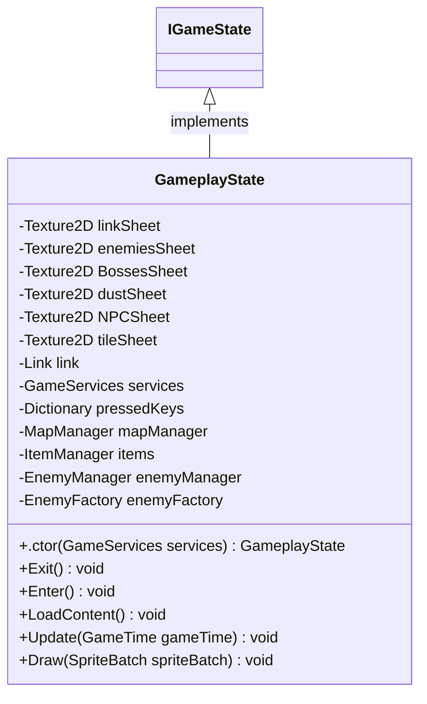
```mermaid
classDiagram
IGameState <|-- GameplayState : implements
class GameplayState{
    -Texture2D linkSheet
    -Texture2D enemiesSheet
    -Texture2D BossesSheet
    -Texture2D dustSheet
    -Texture2D NPCSheet
    -Texture2D tileSheet
    -Link link
    -GameServices services
    -Dictionary<Keys, ICommand> pressedKeys
    -MapManager mapManager
    -ItemManager items
    -EnemyManager enemyManager
    -EnemyFactory enemyFactory
    +.ctor(GameServices services) GameplayState
    +Exit() void
    +Enter() void
    +LoadContent() void
    +Update(GameTime gameTime) void
    +Draw(SpriteBatch spriteBatch) void
}

```

##### `StartScreenState` class diagram

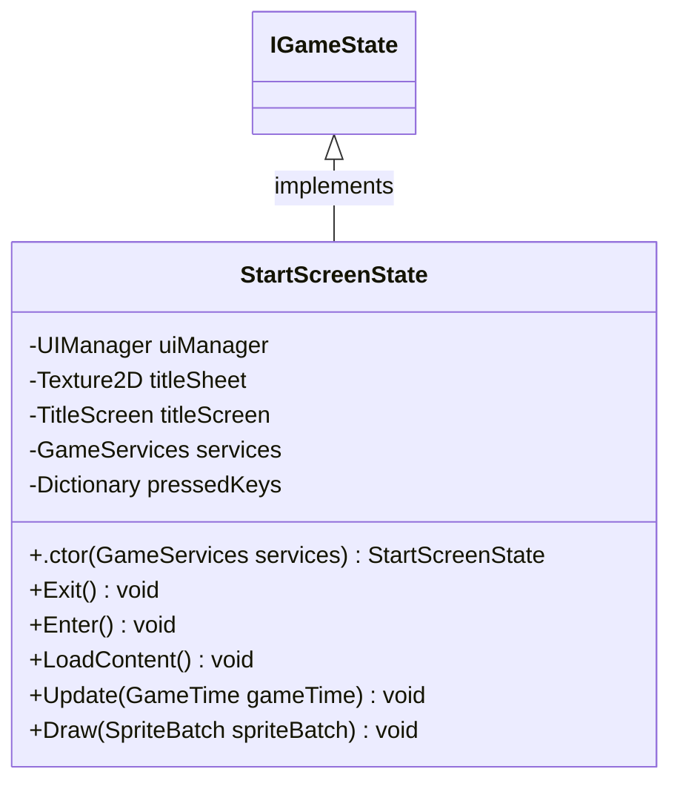
```mermaid
classDiagram
IGameState <|-- StartScreenState : implements
class StartScreenState{
    -UIManager uiManager
    -Texture2D titleSheet
    -TitleScreen titleScreen
    -GameServices services
    -Dictionary<Keys, ICommand> pressedKeys
    +.ctor(GameServices services) StartScreenState
    +Exit() void
    +Enter() void
    +LoadContent() void
    +Update(GameTime gameTime) void
    +Draw(SpriteBatch spriteBatch) void
}

```

##### `Enemy` class diagram

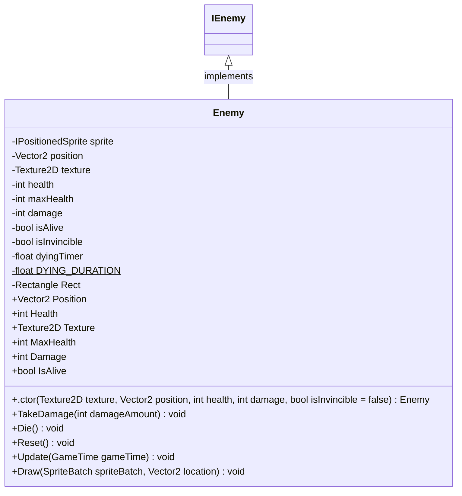
```mermaid
classDiagram
IEnemy <|-- Enemy : implements
class Enemy{
    -IPositionedSprite sprite
    -Vector2 position
    -Texture2D texture
    -int health
    -int maxHealth
    -int damage
    -bool isAlive
    -bool isInvincible
    -float dyingTimer
    -float DYING_DURATION$
    -Rectangle Rect
    +Vector2 Position
    +int Health
    +Texture2D Texture
    +int MaxHealth
    +int Damage
    +bool IsAlive
    +.ctor(Texture2D texture, Vector2 position, int health, int damage, bool isInvincible = false) Enemy
    +TakeDamage(int damageAmount) void
    +Die() void
    +Reset() void
    +Update(GameTime gameTime) void
    +Draw(SpriteBatch spriteBatch, Vector2 location) void
}

```

##### `AbstractBlock` class diagram

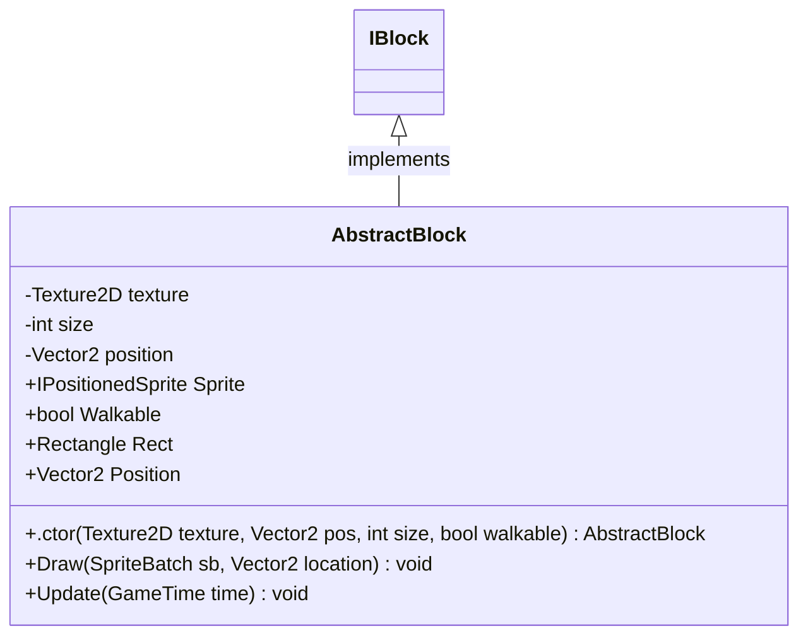
```mermaid
classDiagram
IBlock <|-- AbstractBlock : implements
class AbstractBlock{
    -Texture2D texture
    -int size
    -Vector2 position
    +IPositionedSprite Sprite
    +bool Walkable
    +Rectangle Rect
    +Vector2 Position
    +.ctor(Texture2D texture, Vector2 pos, int size, bool walkable) AbstractBlock
    +Draw(SpriteBatch sb, Vector2 location) void
    +Update(GameTime time) void
}

```

##### `Block` class diagram

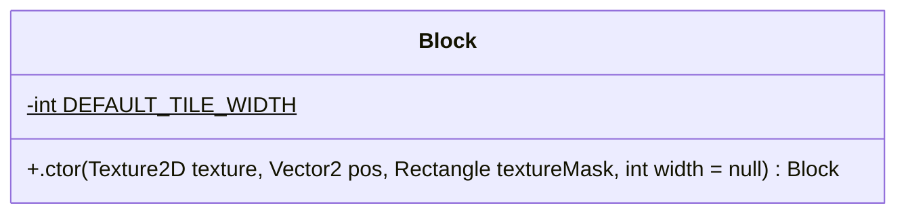
```mermaid
classDiagram
class Block{
    -int DEFAULT_TILE_WIDTH$
    +.ctor(Texture2D texture, Vector2 pos, Rectangle textureMask, int width = null) Block
}

```

##### `MapManager.BlockType` class diagram

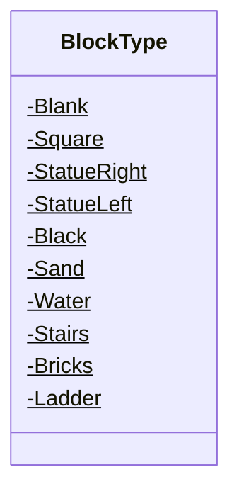
```mermaid
classDiagram
class BlockType{
    -Blank$
    -Square$
    -StatueRight$
    -StatueLeft$
    -Black$
    -Sand$
    -Water$
    -Stairs$
    -Bricks$
    -Ladder$
}

```

##### `MapManager` class diagram

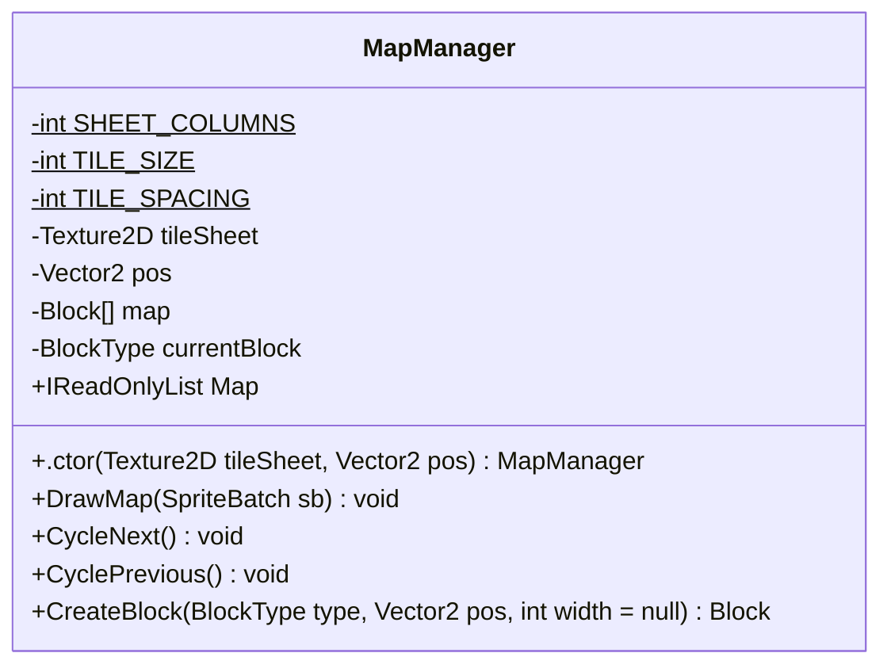
```mermaid
classDiagram
class MapManager{
    -int SHEET_COLUMNS$
    -int TILE_SIZE$
    -int TILE_SPACING$
    -Texture2D tileSheet
    -Vector2 pos
    -Block[] map
    -BlockType currentBlock
    +IReadOnlyList<IBlock> Map
    +.ctor(Texture2D tileSheet, Vector2 pos) MapManager
    +DrawMap(SpriteBatch sb) void
    +CycleNext() void
    +CyclePrevious() void
    +CreateBlock(BlockType type, Vector2 pos, int width = null) Block
}

```

##### `TileSprite` class diagram

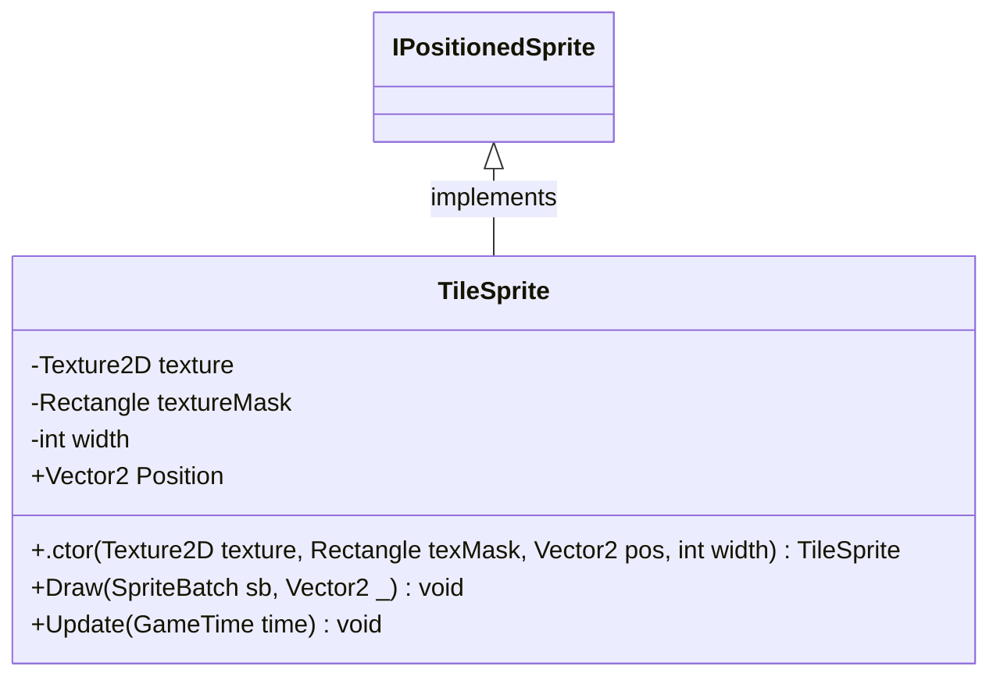
```mermaid
classDiagram
IPositionedSprite <|-- TileSprite : implements
class TileSprite{
    -Texture2D texture
    -Rectangle textureMask
    -int width
    +Vector2 Position
    +.ctor(Texture2D texture, Rectangle texMask, Vector2 pos, int width) TileSprite
    +Draw(SpriteBatch sb, Vector2 _) void
    +Update(GameTime time) void
}

```

##### `Attacking` class diagram

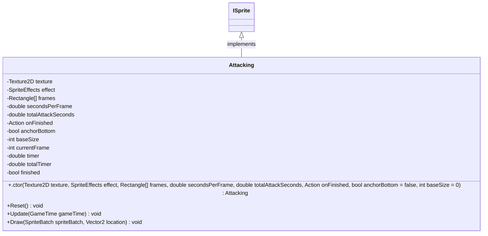
```mermaid
classDiagram
ISprite <|-- Attacking : implements
class Attacking{
    -Texture2D texture
    -SpriteEffects effect
    -Rectangle[] frames
    -double secondsPerFrame
    -double totalAttackSeconds
    -Action onFinished
    -bool anchorBottom
    -int baseSize
    -int currentFrame
    -double timer
    -double totalTimer
    -bool finished
    +.ctor(Texture2D texture, SpriteEffects effect, Rectangle[] frames, double secondsPerFrame, double totalAttackSeconds, Action onFinished, bool anchorBottom = false, int baseSize = 0) Attacking
    +Reset() void
    +Update(GameTime gameTime) void
    +Draw(SpriteBatch spriteBatch, Vector2 location) void
}

```

##### `Directions` class diagram

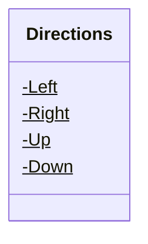
```mermaid
classDiagram
class Directions{
    -Left$
    -Right$
    -Up$
    -Down$
}

```

##### `DirectionsUtils` class diagram

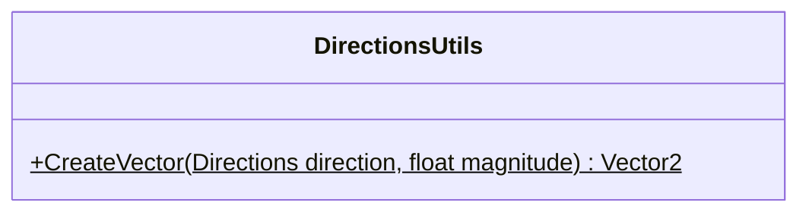
```mermaid
classDiagram
class DirectionsUtils{
    +CreateVector(Directions direction, float magnitude)$ Vector2
}

```

##### `Idle` class diagram

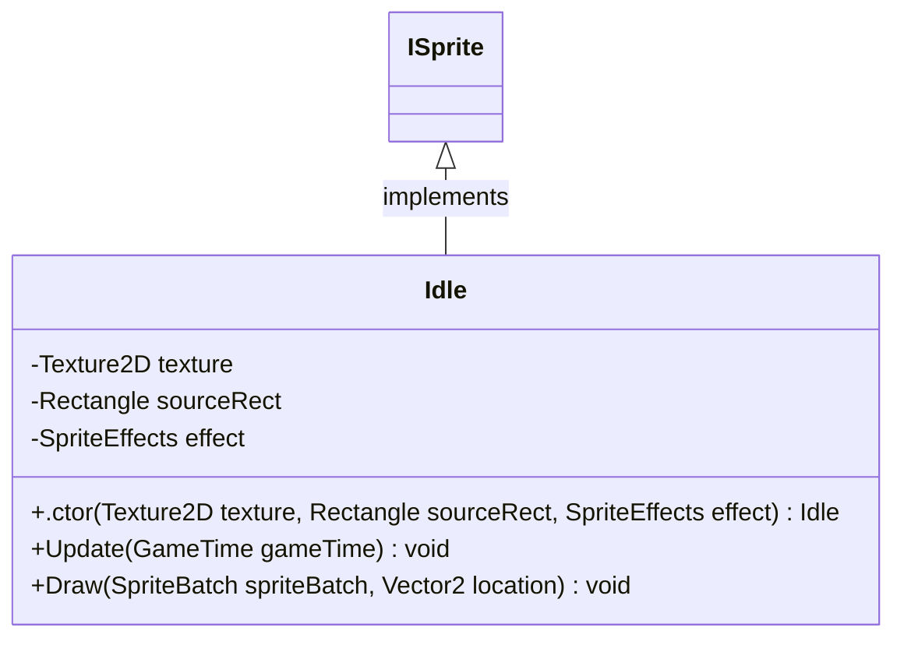
```mermaid
classDiagram
ISprite <|-- Idle : implements
class Idle{
    -Texture2D texture
    -Rectangle sourceRect
    -SpriteEffects effect
    +.ctor(Texture2D texture, Rectangle sourceRect, SpriteEffects effect) Idle
    +Update(GameTime gameTime) void
    +Draw(SpriteBatch spriteBatch, Vector2 location) void
}

```

##### `Link` class diagram

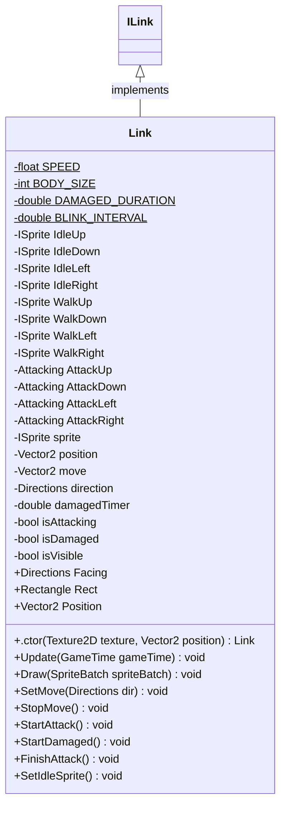
```mermaid
classDiagram
ILink <|-- Link : implements
class Link{
    -float SPEED$
    -int BODY_SIZE$
    -double DAMAGED_DURATION$
    -double BLINK_INTERVAL$
    -ISprite IdleUp
    -ISprite IdleDown
    -ISprite IdleLeft
    -ISprite IdleRight
    -ISprite WalkUp
    -ISprite WalkDown
    -ISprite WalkLeft
    -ISprite WalkRight
    -Attacking AttackUp
    -Attacking AttackDown
    -Attacking AttackLeft
    -Attacking AttackRight
    -ISprite sprite
    -Vector2 position
    -Vector2 move
    -Directions direction
    -double damagedTimer
    -bool isAttacking
    -bool isDamaged
    -bool isVisible
    +Directions Facing
    +Rectangle Rect
    +Vector2 Position
    +.ctor(Texture2D texture, Vector2 position) Link
    +Update(GameTime gameTime) void
    +Draw(SpriteBatch spriteBatch) void
    +SetMove(Directions dir) void
    +StopMove() void
    +StartAttack() void
    +StartDamaged() void
    +FinishAttack() void
    +SetIdleSprite() void
}

```

##### `Walking` class diagram

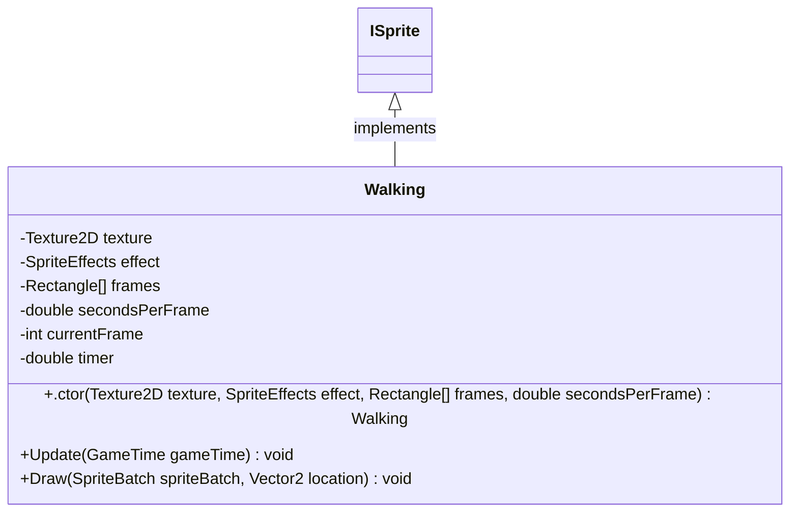
```mermaid
classDiagram
ISprite <|-- Walking : implements
class Walking{
    -Texture2D texture
    -SpriteEffects effect
    -Rectangle[] frames
    -double secondsPerFrame
    -int currentFrame
    -double timer
    +.ctor(Texture2D texture, SpriteEffects effect, Rectangle[] frames, double secondsPerFrame) Walking
    +Update(GameTime gameTime) void
    +Draw(SpriteBatch spriteBatch, Vector2 location) void
}

```

##### `CycleBlockCommand` class diagram

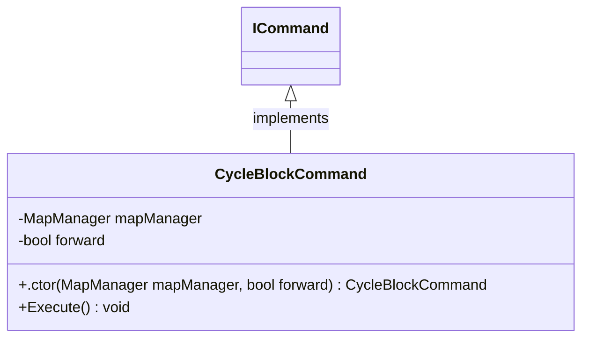
```mermaid
classDiagram
ICommand <|-- CycleBlockCommand : implements
class CycleBlockCommand{
    -MapManager mapManager
    -bool forward
    +.ctor(MapManager mapManager, bool forward) CycleBlockCommand
    +Execute() void
}

```

##### `CycleEnemyCommand` class diagram

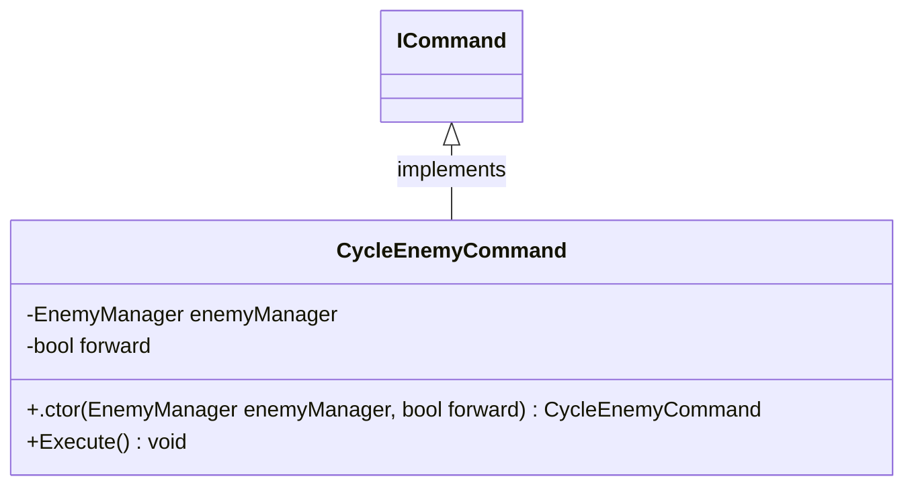
```mermaid
classDiagram
ICommand <|-- CycleEnemyCommand : implements
class CycleEnemyCommand{
    -EnemyManager enemyManager
    -bool forward
    +.ctor(EnemyManager enemyManager, bool forward) CycleEnemyCommand
    +Execute() void
}

```

##### `CycleItemCommand` class diagram

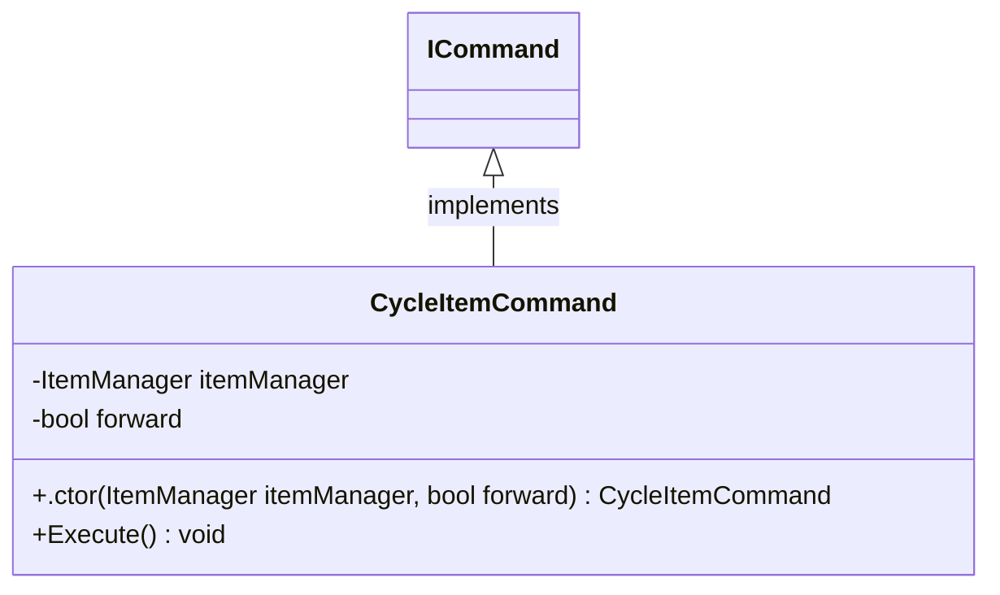
```mermaid
classDiagram
ICommand <|-- CycleItemCommand : implements
class CycleItemCommand{
    -ItemManager itemManager
    -bool forward
    +.ctor(ItemManager itemManager, bool forward) CycleItemCommand
    +Execute() void
}

```

##### `QuitCommand` class diagram

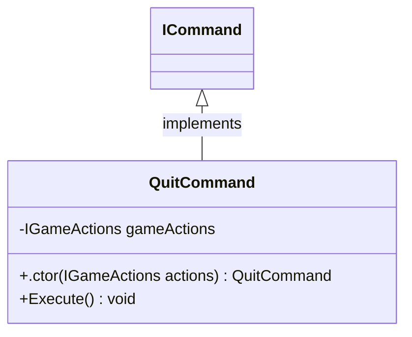
```mermaid
classDiagram
ICommand <|-- QuitCommand : implements
class QuitCommand{
    -IGameActions gameActions
    +.ctor(IGameActions actions) QuitCommand
    +Execute() void
}

```

##### `SetStateCommand` class diagram

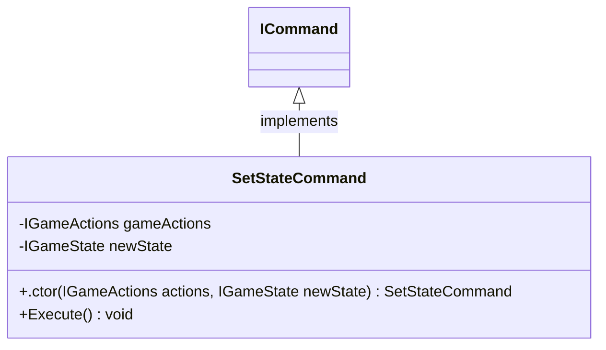
```mermaid
classDiagram
ICommand <|-- SetStateCommand : implements
class SetStateCommand{
    -IGameActions gameActions
    -IGameState newState
    +.ctor(IGameActions actions, IGameState newState) SetStateCommand
    +Execute() void
}

```

##### `UseItemCommand` class diagram

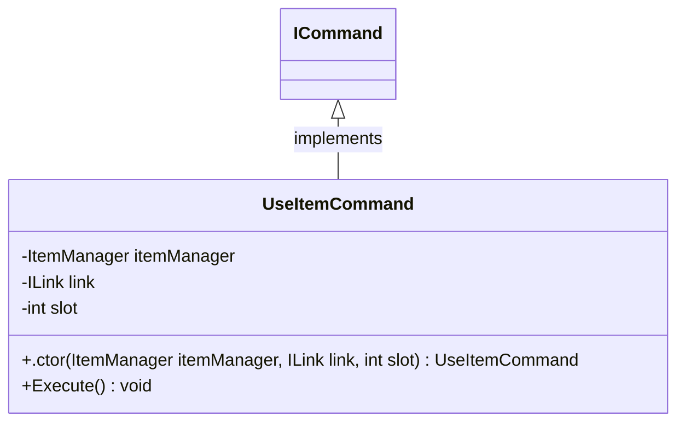
```mermaid
classDiagram
ICommand <|-- UseItemCommand : implements
class UseItemCommand{
    -ItemManager itemManager
    -ILink link
    -int slot
    +.ctor(ItemManager itemManager, ILink link, int slot) UseItemCommand
    +Execute() void
}

```

##### `Aquamentus` class diagram

```mermaid
classDiagram
class Aquamentus{
    -int HEALTH$
    -int DAMAGE$
    -Vector2 velocity
    -float MOVE_SPEED$
    -float directionChangeTimer
    -float DIRECTION_SWAP_MIN$
    -float DIRECTION_SWAP_MAX$
    -Random random
    -float moveDirectionTimer
    -bool moveLeft
    -EnemyProjectileFactory projectileFactory
    -List<AquamentusFireball> activeFireballs
    -float fireballTimer
    -float FIREBALL_INTERVAL$
    +.ctor(Texture2D texture, Vector2 position) Aquamentus
    +Update(GameTime gameTime) void
    +Draw(SpriteBatch spriteBatch, Vector2 location) void
    +SpawnFireballs() void
    +GetRandomFloat(float min, float max) float
}

```

##### `AquamentusFireball` class diagram

```mermaid
classDiagram
IPositionedSprite <|-- AquamentusFireball : implements
class AquamentusFireball{
    -IPositionedSprite sprite
    -Vector2 position
    -Vector2 velocity
    -float lifetime
    -float MAX_LIFETIME$
    -float SPEED$
    +bool IsActive
    +Vector2 Position
    +.ctor(Texture2D texture, Vector2 startPosition, Vector2 direction) AquamentusFireball
    +Update(GameTime gameTime) void
    +Draw(SpriteBatch spriteBatch, Vector2 location) void
}

```

##### `Dodongo.Direction` class diagram

```mermaid
classDiagram
class Direction{
    -Up$
    -Down$
    -Left$
    -Right$
}

```

##### `Goriya.Direction` class diagram

```mermaid
classDiagram
class Direction{
    -Up$
    -Down$
    -Left$
    -Right$
}

```

##### `Dodongo` class diagram

```mermaid
classDiagram
class Dodongo{
    -DodongoState currentState
    -int HEALTH$
    -int DAMAGE$
    -float STEP_SIZE$
    -float STEP_DELAY$
    -float MOVE_SPEED$
    -float FLIP_INTERVAL$
    -float BOMB_STUN_DURATION$
    -Direction currentDirection
    -Vector2 targetPosition
    -float stepTimer
    -float flipTimer
    -float bombStunTimer
    -bool spriteHorizontalFlip
    -Random random
    -int[] upFrames
    -int[] downFrames
    -int[] sideFrames
    -int[] bombedUpFrame
    -int[] bombedDownFrame
    -int[] bombedSideFrame
    +.ctor(Texture2D texture, Vector2 position) Dodongo
    +Update(GameTime gameTime) void
    +UpdateWalking(float deltaTime) void
    +UpdateBombEaten(float deltaTime) void
    +EatBomb() void
    +ChooseNextStep() void
    +UpdateSprite() void
    +UpdateBombedSprite(DirectionalAnimatedSprite dirSprite, int sheetY, float frameTime) void
    +UpdateWalkingSprite(DirectionalAnimatedSprite dirSprite, int sheetY, float frameTime) void
    +Reset() void
}

```

##### `Dodongo.DodongoState` class diagram

```mermaid
classDiagram
class DodongoState{
    -Walking$
    -BombEaten$
}

```

##### `Gel` class diagram

```mermaid
classDiagram
class Gel{
    -int HEALTH$
    -int DAMAGE$
    -Vector2 velocity
    -float turnTimer
    -float TURN_SPEED$
    -float TURN_INTERVAL$
    -float MOVE_SPEED$
    -Random random
    +.ctor(Texture2D texture, Vector2 position) Gel
    +Update(GameTime gameTime) void
    +Reset() void
    +GetRandomTurnDirection() Vector2
}

```

##### `Goriya` class diagram

```mermaid
classDiagram
class Goriya{
    -GoriyaState currentState
    -int HEALTH$
    -int DAMAGE$
    -float STEP_SIZE$
    -float STEP_DELAY$
    -float MOVE_SPEED$
    -float THROW_COOLDOWN_MIN$
    -float THROW_COOLDOWN_MAX$
    -Direction currentDirection
    -Vector2 targetPosition
    -float stepTimer
    -float flipTimer
    -float throwTimer
    -bool spriteHorizontalFlip
    -float FLIP_INTERVAL$
    -Random random
    -Boomerang activeBoomerang
    -ContentManager contentManager
    -int[] upFrames
    -int[] downFrames
    -int[] sideFrames
    -int[] throwFrame
    +.ctor(Texture2D texture, Vector2 position, ContentManager content) Goriya
    +Update(GameTime gameTime) void
    +Draw(SpriteBatch spriteBatch, Vector2 location) void
    +UpdateWalking(float deltaTime) void
    +UpdateThrowing(float deltaTime) void
    +ThrowBoomerang() void
    +IsBoomerangActive() bool
    +ChooseNextStep() void
    +UpdateSprite() void
    +GetRandomThrowTime() float
}

```

##### `Goriya.GoriyaState` class diagram

```mermaid
classDiagram
class GoriyaState{
    -Walking$
    -Throwing$
}

```

##### `Keese` class diagram

```mermaid
classDiagram
class Keese{
    -int HEALTH$
    -int DAMAGE$
    -float MOVE_SPEED$
    -float REST_TIME_MIN$
    -float REST_TIME_MAX$
    -float MOVE_TIME_MIN$
    -float MOVE_TIME_MAX$
    -Random random
    -Vector2 moveDirection
    -float actionTimer
    -float actionDuration
    -bool isResting
    -IPositionedSprite flyingSprite
    -IPositionedSprite restingSprite
    +.ctor(Texture2D texture, Vector2 position) Keese
    +Update(GameTime gameTime) void
    +ChooseRandomDirection() void
    +GetRandomFloat(float min, float max) float
}

```

##### `OldMan` class diagram

```mermaid
classDiagram
class OldMan{
    -int HEALTH$
    -int DAMAGE$
    +.ctor(Texture2D texture, Vector2 position) OldMan
    +TakeDamage(int damageAmount) void
    +Die() void
}

```

##### `Rope` class diagram

```mermaid
classDiagram
class Rope{
    -int ROPE_HEALTH$
    -int ROPE_DAMAGE$
    -float PATROL_SPEED$
    -float CHARGE_SPEED$
    -float DIRECTION_CHANGE_MIN$
    -float DIRECTION_CHANGE_MAX$
    -float CHARGE_DURATION$
    -Random random
    -Vector2 moveDirection
    -bool isCharging
    -float chargeTimer
    -float directionChangeTimer
    -float directionChangeDuration
    -bool facingLeft
    -int[] frameXPositions
    +.ctor(Texture2D texture, Vector2 position) Rope
    +Update(GameTime gameTime) void
    +ChooseRandomCardinalDirection() void
    +UpdateSpriteFlip() void
    +GetRandomFloat(float min, float max) float
}

```

##### `Stalfos` class diagram

```mermaid
classDiagram
class Stalfos{
    -int STALFOS_HEALTH$
    -int STALFOS_DAMAGE$
    -float MOVE_SPEED$
    -Vector2 velocity
    -float directionChangeTimer
    -float DIRECTION_CHANGE_INTERVAL$
    -Random random
    -Rectangle sourceRect
    -bool isFlipped
    -float flipTimer
    -float FLIP_INTERVAL$
    +.ctor(Texture2D texture, Vector2 position) Stalfos
    +GetRandomCardinalDirection() Vector2
    +Update(GameTime gameTime) void
    +Draw(SpriteBatch spriteBatch, Vector2 location) void
}

```

##### `Trap` class diagram

```mermaid
classDiagram
class Trap{
    -int TRAP_HEALTH$
    -int TRAP_DAMAGE$
    -float CHARGE_SPEED$
    -float RETRACT_SPEED$
    -float CHARGE_DISTANCE$
    -float IDLE_TIME_MIN$
    -float IDLE_TIME_MAX$
    -Random random
    -TrapState currentState
    -Vector2 homePosition
    -Vector2 chargeDirection
    -Vector2 chargeTarget
    -float idleTimer
    -float idleDuration
    -Rectangle sourceRect
    +.ctor(Texture2D texture, Vector2 position) Trap
    +Update(GameTime gameTime) void
    +UpdateIdle(float deltaTime) void
    +UpdateCharging(float deltaTime) void
    +UpdateRetracting(float deltaTime) void
    +StartCharge() void
    +TakeDamage(int damageAmount) void
    +Die() void
    +Reset() void
    +GetRandomFloat(float min, float max) float
}

```

##### `Trap.TrapState` class diagram

```mermaid
classDiagram
class TrapState{
    -Idle$
    -Charging$
    -Retracting$
}

```

##### `WallMaster` class diagram

```mermaid
classDiagram
class WallMaster{
    -int WALLMASTER_HEALTH$
    -int WALLMASTER_DAMAGE$
    -float CREEP_SPEED$
    -float RETREAT_SPEED$
    -float HIDDEN_TIME_MIN$
    -float HIDDEN_TIME_MAX$
    -float CREEP_TIME_MIN$
    -float CREEP_TIME_MAX$
    -Random random
    -WallMasterState currentState
    -Vector2 creepDirection
    -Vector2 homePosition
    -float stateTimer
    -float stateDuration
    +.ctor(Texture2D texture, Vector2 position) WallMaster
    +Update(GameTime gameTime) void
    +UpdateHidden() void
    +UpdateCreeping(float deltaTime) void
    +UpdateRetreating(float deltaTime) void
    +Draw(SpriteBatch spriteBatch, Vector2 location) void
    +Reset() void
    +ChooseCreepDirection() void
    +GetRandomFloat(float min, float max) float
}

```

##### `WallMaster.WallMasterState` class diagram

```mermaid
classDiagram
class WallMasterState{
    -Hidden$
    -Creeping$
    -Retreating$
}

```

##### `Zol` class diagram

```mermaid
classDiagram
class Zol{
    -int ZOL_HEALTH$
    -int ZOL_DAMAGE$
    -float BOUNCE_SPEED$
    -float BOUNCE_INTERVAL$
    -float AIR_TIME$
    -Vector2 velocity
    -float bounceTimer
    -bool isOnGround
    -Random random
    +.ctor(Texture2D texture, Vector2 position) Zol
    +Update(GameTime gameTime) void
    +Reset() void
    +GetRandomBounceDirection() Vector2
}

```

##### `KeyboardController` class diagram

```mermaid
classDiagram
IController <|-- KeyboardController : implements
class KeyboardController{
    -KeyboardState previous
    -KeyboardState current
    +.ctor(Game1 game) KeyboardController
    +Update() void
    +IsKeyPressed(Keys key) bool
    +IsKeyDown(Keys key) bool
    +IsKeyReleased(Keys key) bool
    +IsKeyUp(Keys key) bool
}

```

##### `EnemyEffectWrapper` class diagram

```mermaid
classDiagram
IEnemy <|-- EnemyEffectWrapper : implements
class EnemyEffectWrapper{
    -IEnemy enemy
    -ISprite spawnSprite
    -ISprite deathSprite
    -float spawnTimer
    -float dyingTimer
    -float SPAWN_DURATION$
    -float DYING_DURATION$
    +Vector2 Position
    +int Health
    +bool IsSpawning
    +int MaxHealth
    +int Damage
    +bool IsAlive
    +bool IsDyingAnimation
    +.ctor(IEnemy enemy, ISprite spawnSprite, ISprite deathSprite) EnemyEffectWrapper
    +TakeDamage(int amount) void
    +Die() void
    +ResetSpawnTimer() void
    +Reset() void
    +Update(GameTime gameTime) void
    +Draw(SpriteBatch spriteBatch, Vector2 location) void
}

```

##### `EnemyFactory` class diagram

```mermaid
classDiagram
class EnemyFactory{
    -Texture2D enemySpriteSheet
    -Texture2D bossSpriteSheet
    -Texture2D linkSheet
    -Texture2D dustSheet
    -Texture2D NPCSheet
    -ContentManager contentManager
    +.ctor(Texture2D enemySpriteSheet, Texture2D bossSpriteSheet, Texture2D linkSheet, Texture2D dustSheet, ContentManager contentManager, Texture2D NPCSheet) EnemyFactory
    +LoadAllTextures(ContentManager content) void
    +CreateEnemy(EnemyType type, Vector2 position) IEnemy
    +WrapWithEffects(IEnemy enemy, Vector2 position, bool skipSpawnCloud = false) EnemyEffectWrapper
}

```

##### `EnemyManager` class diagram

```mermaid
classDiagram
class EnemyManager{
    -List<IEnemy> enemies
    -int currentEnemyIndex
    -IEnemy currentEnemy
    +.ctor() EnemyManager
    +AddEnemy(IEnemy enemy) void
    +CycleNext() void
    +CyclePrevious() void
    +Update(GameTime gameTime) void
    +Draw(SpriteBatch spriteBatch) void
    +Reset() void
    +GetCurrentEnemy() IEnemy
    +GetEnemyCount() int
    +GetCurrentIndex() int
}

```

##### `EnemyProjectileFactory` class diagram

```mermaid
classDiagram
class EnemyProjectileFactory{
}

```

##### `EnemyType` class diagram

```mermaid
classDiagram
class EnemyType{
    -Keese$
    -Stalfos$
    -Gel$
    -Zol$
    -Goriya$
    -WallMaster$
    -Trap$
    -Rope$
    -Aquamentus$
    -Dodongo$
    -OldMan$
}

```

##### `ProjectileType` class diagram

```mermaid
classDiagram
class ProjectileType{
    -AquamentusFireball$
}

```

##### `LinkSprites` class diagram

```mermaid
classDiagram
class LinkSprites{
    +IdleDown(Texture2D texture)$ ISprite
    +IdleUp(Texture2D texture)$ ISprite
    +IdleLeft(Texture2D texture)$ ISprite
    +IdleRight(Texture2D texture)$ ISprite
    +WalkingDown(Texture2D texture)$ ISprite
    +WalkingUp(Texture2D texture)$ ISprite
    +WalkingLeft(Texture2D texture)$ ISprite
    +WalkingRight(Texture2D texture)$ ISprite
    +AttackDown(Texture2D texture, Action onFinished)$ Attacking
    +AttackUp(Texture2D texture, Action onFinished)$ Attacking
    +AttackLeft(Texture2D texture, Action onFinished)$ Attacking
    +AttackRight(Texture2D texture, Action onFinished)$ Attacking
}

```

##### `IBlock` class diagram

```mermaid
classDiagram
IPositionedSprite <|-- IBlock : implements
class IBlock{
    +bool Walkable*
    +Rectangle Rect*
}

```

##### `ICommand` class diagram

```mermaid
classDiagram
class ICommand{
    +Execute()* void
}

```

##### `IController` class diagram

```mermaid
classDiagram
class IController{
    +Update()* void
    +IsKeyDown(Keys key)* bool
    +IsKeyPressed(Keys key)* bool
    +IsKeyReleased(Keys key)* bool
}

```

##### `IEnemy` class diagram

```mermaid
classDiagram
IPositionedSprite <|-- IEnemy : implements
class IEnemy{
    +int Health*
    +int MaxHealth*
    +int Damage*
    +bool IsAlive*
    +TakeDamage(int damageAmount)* void
    +Die()* void
    +Reset()* void
}

```

##### `IGameActions` class diagram

```mermaid
classDiagram
class IGameActions{
    +Quit()* void
    +ChangeState(IGameState newState)* void
}

```

##### `IGameState` class diagram

```mermaid
classDiagram
class IGameState{
    +Enter()* void
    +Exit()* void
    +LoadContent()* void
    +Update(GameTime gameTime)* void
    +Draw(SpriteBatch spriteBatch)* void
}

```

##### `ILink` class diagram

```mermaid
classDiagram
class ILink{
    +Vector2 Position*
    +Rectangle Rect*
    +Directions Facing*
    +StartAttack()* void
}

```

##### `IPositionedSprite` class diagram

```mermaid
classDiagram
ISprite <|-- IPositionedSprite : implements
class IPositionedSprite{
    +Vector2 Position*
}

```

##### `ISprite` class diagram

```mermaid
classDiagram
class ISprite{
    +Draw(SpriteBatch spriteBatch, Vector2 location)* void
    +Update(GameTime gameTime)* void
}

```

##### `IUIElement` class diagram

```mermaid
classDiagram
class IUIElement{
    +Draw(SpriteBatch spriteBatch)* void
    +Update(GameTime gameTime)* void
}

```

##### `AbstractItem` class diagram

```mermaid
classDiagram
ISprite <|-- AbstractItem : implements
class AbstractItem{
    -Texture2D texture
    -ISprite sprite
    +Vector2 DrawPos
    +string Name
    +string DisplayName
    +bool IsFinished
    +.ctor(string name) AbstractItem
    +.ctor(string name, ContentManager contentManager, string resourceName, Vector2 drawPos) AbstractItem
    +Draw(SpriteBatch sb, Vector2 pos) void
    +Update(GameTime time) void
}

```

##### `Arrow` class diagram

```mermaid
classDiagram
class Arrow{
    -string ResourceName$
    +bool IsFinished
    +.ctor(Rectangle texMask, Vector2 pos, Vector2 vel, float maxDistance, float rotation, Vector2 origin, float scale, ContentManager cm) Arrow
    +StartMoving() Arrow
}

```

##### `Boomerang` class diagram

```mermaid
classDiagram
class Boomerang{
    -string ResourceName$
    +bool IsFinished
    +.ctor(Vector2 pos, Vector2 vel, float maxDistance, ContentManager contentManager) Boomerang
    +StartMoving() Boomerang
    +GetSprite() ISprite
}

```

##### `BoomerangSprite` class diagram

```mermaid
classDiagram
ISprite <|-- BoomerangSprite : implements
class BoomerangSprite{
    -Vector2 Pos
    -Texture2D texture
    -Vector2 velocity
    -float scale
    -int animationFrame
    -int lastAnimationFrame
    -float distanceTraveled
    -float maxDistance
    -bool returning
    -bool thrown
    +bool IsActive
    +.ctor(Texture2D texture, Vector2 initialPos, Vector2 velocity, float maxDistance, float scale) BoomerangSprite
    +Throw() void
    +Draw(SpriteBatch sb, Vector2 location) void
    +Update(GameTime time) void
}

```

##### `Bow` class diagram

```mermaid
classDiagram
class Bow{
    -string ResourceName$
    +.ctor(string name, ContentManager contentManager, Vector2 drawPos, Rectangle mask, float rotation, float scale) Bow
}

```

##### `ItemFactory` class diagram

```mermaid
classDiagram
class ItemFactory{
    -ContentManager contentManager$
    +CreateBoomerang(Vector2 pos, Vector2 vel, float maxDistance)$ Boomerang
    +CreateArrow(Vector2 pos, Vector2 vel, float rotation, float scale = 1, float maxDistance = null)$ Arrow
    +CreateTimeBomb(double explodeDelayMillis, Vector2 pos, float scale, float rotation = null)$ TimeBomb
    +CreateStillItem(StillType type, Vector2 pos, float rotation, float scale = null)$ StillItem
}

```

##### `ItemManager` class diagram

```mermaid
classDiagram
class ItemManager{
    -List<AbstractItem> SpawnedItems
    +List<AbstractItem> Inventory
    +int ActiveItem
    +.ctor() ItemManager
    +UseItem(ILink link, int slot) void
    +Add(AbstractItem item) void
    +SpawnItem(AbstractItem item) void
    +Draw(SpriteBatch sb) void
    +Update(GameTime time) void
    +GetActiveItem() AbstractItem
    +CycleNext() void
    +CyclePrevious() void
}

```

##### `ProjectileSprite` class diagram

```mermaid
classDiagram
IPositionedSprite <|-- ProjectileSprite : implements
class ProjectileSprite{
    -Texture2D texture
    -Rectangle texMask
    -Vector2 velocity
    -float maxDistance
    -float rotation
    -Vector2 origin
    -float scale
    -float distanceTraveled
    -bool isMoving
    -bool ReachedMaxDistance
    +Vector2 Position
    +.ctor(Texture2D texture, Rectangle texMask, Vector2 pos, Vector2 vel, float maxDistance, float rotation, Vector2 origin, float scale) ProjectileSprite
    +StartMoving() void
    +Update(GameTime time) void
    +Draw(SpriteBatch sb, Vector2 unused) void
}

```

##### `StillItem` class diagram

```mermaid
classDiagram
class StillItem{
    -string ResourceName$
    +.ctor(string name, ContentManager contentManager, Vector2 drawPos, Rectangle mask, float rotation, float scale) StillItem
}

```

##### `StillItemSprite` class diagram

```mermaid
classDiagram
IPositionedSprite <|-- StillItemSprite : implements
class StillItemSprite{
    -Texture2D texture
    -Rectangle textureMask
    -float rotation
    -float scale
    +Vector2 Position
    +.ctor(Vector2 position, Texture2D texture, Rectangle mask, float rotation, float scale) StillItemSprite
    +Draw(SpriteBatch sb, Vector2 unused) void
    +Update(GameTime time) void
}

```

##### `ItemFactory.StillType` class diagram

```mermaid
classDiagram
class StillType{
    -Heart$
    -BlueHeart$
    -HalfHeart$
    -ZeroHeart$
    -HeartContainer$
    -Fairy$
    -Clock$
    -GoldRupee$
    -PurpleRupee$
    -BluePotion$
    -Map$
    -Bomb$
    -Bow$
    -BlueCandle$
    -Key$
    -Compass$
    -GoldTriforce$
    -PurpleTriforce$
}

```

##### `TimeBomb` class diagram

```mermaid
classDiagram
class TimeBomb{
    -string ResourceName$
    -double millisUntilExplode
    +bool IsFinished
    +.ctor(double explodeDelayMillis, string name, ContentManager contentManager, Vector2 drawPos, Rectangle mask, float rotation, float scale) TimeBomb
    +Update(GameTime time) void
}

```

##### `Game1` class diagram

```mermaid
classDiagram
IGameActions <|-- Game1 : implements
class Game1{
    -GraphicsDeviceManager graphics
    -SpriteBatch spriteBatch
    -IGameState currentState
    -GameServices services
    +Game1 Instance$
    +.ctor() Game1
    +Initialize() void
    +LoadContent() void
    +Update(GameTime gameTime) void
    +Draw(GameTime gameTime) void
    +ChangeState(IGameState newState) void
    +Quit() void
}

```

##### `GameServices` class diagram

```mermaid
classDiagram
class GameServices{
    +ContentManager Content
    +IController KeyInput
    +IGameActions GameActions
    +int ScaleFactor
    +int GameWidth
    +int GameHeight
}

```

##### `AnimatedSprite` class diagram

```mermaid
classDiagram
IPositionedSprite <|-- AnimatedSprite : implements
class AnimatedSprite{
    -Texture2D texture
    -Vector2 pos
    -Rectangle rect
    -int frameCount
    -int curFrame
    -int[] sheetXPositions
    -float frameTime
    -float elapsedTime
    -int frameWidth
    -int frameHeight
    -int sheetY
    +Vector2 Position
    +Texture2D Texture
    +Rectangle Rect
    +.ctor(Texture2D texture, Vector2 position, int[] sheetXPositions, int sheetYPos, int spriteWidth, int spriteHeight, float frameTime) AnimatedSprite
    +UpdateRect() void
    +Update(GameTime gameTime) void
    +Draw(SpriteBatch spriteBatch, Vector2 location) void
}

```

##### `DirectionalAnimatedSprite` class diagram

```mermaid
classDiagram
IPositionedSprite <|-- DirectionalAnimatedSprite : implements
class DirectionalAnimatedSprite{
    -Texture2D texture
    -Vector2 pos
    -Rectangle rect
    -int frameCount
    -int curFrame
    -int[] sheetXPositions
    -float frameTime
    -float elapsedTime
    -int frameWidth
    -int frameHeight
    -int sheetY
    -bool flipHorizontal
    +Vector2 Position
    +Texture2D Texture
    +Rectangle Rect
    +.ctor(Texture2D texture, Vector2 position, int[] xPositions, int yPos, int spriteWidth, int spriteHeight, float frameTime, bool flipHorizontal = false) DirectionalAnimatedSprite
    +UpdateFrames(int[] xPositions, bool flipHorizontal) void
    +UpdateRect() void
    +Update(GameTime gameTime) void
    +Draw(SpriteBatch spriteBatch, Vector2 location) void
}

```

##### `MovingAnimatedSprite` class diagram

```mermaid
classDiagram
IPositionedSprite <|-- MovingAnimatedSprite : implements
class MovingAnimatedSprite{
    -Texture2D texture
    -Vector2 pos
    -Rectangle rect
    -int frameCount
    -int curFrame
    -int[] sheetXPositions
    -float frameTime
    -float elapsedTime
    -int frameWidth
    -int frameHeight
    -int frameY
    -float speed
    -float minX
    -float maxX
    -bool movingRight
    +Vector2 Position
    +Texture2D Texture
    +Rectangle Rect
    +.ctor(Texture2D texture, Vector2 startPosition, int[] sheetXPositions, int frameY, int spriteWidth, int spriteHeight, float frameDuration, float moveSpeed = 150, float range = 300) MovingAnimatedSprite
    +UpdateRect() void
    +Update(GameTime gameTime) void
    +Draw(SpriteBatch spriteBatch, Vector2 location) void
}

```

##### `MovingSprite` class diagram

```mermaid
classDiagram
IPositionedSprite <|-- MovingSprite : implements
class MovingSprite{
    -Texture2D texture
    -Vector2 pos
    -Rectangle rect
    -int frameCount
    -int curFrame
    -int[] downFrameXPositions
    -int[] upFrameXPositions
    -float frameTime
    -float elapsedTime
    -int frameWidth
    -int frameHeight
    -int frameY
    -float speed
    -float minY
    -float maxY
    -bool goingDown
    +Vector2 Position
    +Texture2D Texture
    +Rectangle Rect
    +.ctor(Texture2D tex, Vector2 start, int[] downXPositions, int[] upXPositions, int yPos, int spriteWidth, int spriteHeight, float frameDuration, float moveSpeed = 100, float range = 200) MovingSprite
    +UpdateRect() void
    +Update(GameTime gameTime) void
    +Draw(SpriteBatch spriteBatch, Vector2 location) void
}

```

##### `StaticSprite` class diagram

```mermaid
classDiagram
IPositionedSprite <|-- StaticSprite : implements
class StaticSprite{
    -Texture2D texture
    -Vector2 pos
    -Rectangle sourceRect
    +Vector2 Position
    +Texture2D Texture
    +.ctor(Texture2D texture, Vector2 position, Rectangle source) StaticSprite
    +Update(GameTime gameTime) void
    +Draw(SpriteBatch spriteBatch, Vector2 location) void
}

```

##### `TextSprite` class diagram

```mermaid
classDiagram
IPositionedSprite <|-- TextSprite : implements
class TextSprite{
    -Texture2D texture
    -Vector2 pos
    -Rectangle rect
    +Vector2 Position
    +Texture2D Texture
    +Rectangle Rect
    +.ctor(Texture2D texture, Vector2 position) TextSprite
    +Update(GameTime gameTime) void
    +Draw(SpriteBatch spriteBatch, Vector2 location) void
}

```

##### `TitleScreen` class diagram

```mermaid
classDiagram
IUIElement <|-- TitleScreen : implements
class TitleScreen{
    -StaticSprite background
    -Rectangle sourceRect
    +.ctor(Texture2D backgroundTexture) TitleScreen
    +Draw(SpriteBatch spriteBatch) void
    +Update(GameTime gameTime) void
}

```

##### `UIManager` class diagram

```mermaid
classDiagram
class UIManager{
    -List<IUIElement> elements
    +.ctor() UIManager
    +Update(GameTime gameTime) void
    +Draw(SpriteBatch spriteBatch) void
    +AddElement(IUIElement element) void
    +RemoveElement(IUIElement element) void
    +Clear() void
}

```

*This file is maintained by a bot.*

<!-- markdownlint-restore -->
