<!-- markdownlint-capture -->
<!-- markdownlint-disable -->

# Code Metrics

This file is dynamically maintained by a bot, *please do not* edit this by hand. It represents various [code metrics](https://aka.ms/dotnet/code-metrics), such as cyclomatic complexity, maintainability index, and so on.

<div id='sprint'></div>

## Sprint :exploding_head:

The *Sprint.csproj* project file contains:

- 25 namespaces.
- 160 named types.
- 9,848 total lines of source code.
- Approximately 3,095 lines of executable code.
- The highest cyclomatic complexity is 31 :exploding_head:.

<details>
<summary>
  <strong id="global+namespace">
    &lt;global namespace&gt; :exploding_head:
  </strong>
</summary>
<br>

The `<global namespace>` namespace contains 10 named types.

- 10 named types.
- 894 total lines of source code.
- Approximately 328 lines of executable code.
- The highest cyclomatic complexity is 26 :exploding_head:.

<details>
<summary>
  <strong id="program$">
    &lt;Program&gt;$ :heavy_check_mark:
  </strong>
</summary>
<br>

- The `<Program>$` contains 1 members.
- 2 total lines of source code.
- Approximately 4 lines of executable code.
- The highest cyclomatic complexity is 1 :heavy_check_mark:.

| Member kind | Line number | Maintainability index | Cyclomatic complexity | Depth of inheritance | Class coupling | Lines of source / executable code |
| :-: | :-: | :-: | :-: | :-: | :-: | :-: |
| Method | <a href='https://github.com/Abadi2225/The_Legend_of_Zilda/blob/main/../Program.cs#L1' title='<top-level-statements-entry-point>'>1</a> | 88 | 1 :heavy_check_mark: | 0 | 2 | 2 / 2 |

<a href="#global+namespace">:top: back to &lt;global namespace&gt;</a>

</details>

<details>
<summary>
  <strong id="dungeonstate">
    DungeonState :heavy_check_mark:
  </strong>
</summary>
<br>

- The `DungeonState` contains 3 members.
- 17 total lines of source code.
- Approximately 4 lines of executable code.
- The highest cyclomatic complexity is 2 :heavy_check_mark:.

| Member kind | Line number | Maintainability index | Cyclomatic complexity | Depth of inheritance | Class coupling | Lines of source / executable code |
| :-: | :-: | :-: | :-: | :-: | :-: | :-: |
| Method | <a href='https://github.com/Abadi2225/The_Legend_of_Zilda/blob/main/../Saving/DungeonState.cs#L7' title='RoomState DungeonState.GetRoomState(string roomID)'>7</a> | 86 | 2 :heavy_check_mark: | 0 | 3 | 7 / 2 |
| Method | <a href='https://github.com/Abadi2225/The_Legend_of_Zilda/blob/main/../Saving/DungeonState.cs#L15' title='void DungeonState.ResetProgess()'>15</a> | 100 | 1 :heavy_check_mark: | 0 | 3 | 4 / 1 |
| Field | <a href='https://github.com/Abadi2225/The_Legend_of_Zilda/blob/main/../Saving/DungeonState.cs#L5' title='Dictionary<string, RoomState> DungeonState.rooms'>5</a> | 93 | 0 :heavy_check_mark: | 0 | 2 | 1 / 1 |

<a href="#DungeonState-class-diagram">:link: to `DungeonState` class diagram</a>

<a href="#global+namespace">:top: back to &lt;global namespace&gt;</a>

</details>

<details>
<summary>
  <strong id="gameplaystate">
    GameplayState :exploding_head:
  </strong>
</summary>
<br>

- The `GameplayState` contains 47 members.
- 367 total lines of source code.
- Approximately 162 lines of executable code.
- The highest cyclomatic complexity is 20 :exploding_head:.

| Member kind | Line number | Maintainability index | Cyclomatic complexity | Depth of inheritance | Class coupling | Lines of source / executable code |
| :-: | :-: | :-: | :-: | :-: | :-: | :-: |
| Method | <a href='https://github.com/Abadi2225/The_Legend_of_Zilda/blob/main/../GameStates/GameplayState.cs#L63' title='GameplayState.GameplayState()'>63</a> | 100 | 1 :heavy_check_mark: | 0 | 0 | 1 / 0 |
| Field | <a href='https://github.com/Abadi2225/The_Legend_of_Zilda/blob/main/../GameStates/GameplayState.cs#L26' title='Texture2D GameplayState.bossesSheet'>26</a> | 100 | 0 :heavy_check_mark: | 0 | 1 | 1 / 0 |
| Field | <a href='https://github.com/Abadi2225/The_Legend_of_Zilda/blob/main/../GameStates/GameplayState.cs#L49' title='CollisionManager GameplayState.collisionManager'>49</a> | 100 | 0 :heavy_check_mark: | 0 | 1 | 1 / 0 |
| Field | <a href='https://github.com/Abadi2225/The_Legend_of_Zilda/blob/main/../GameStates/GameplayState.cs#L50' title='DoorManager GameplayState.doorManager'>50</a> | 100 | 0 :heavy_check_mark: | 0 | 1 | 1 / 0 |
| Field | <a href='https://github.com/Abadi2225/The_Legend_of_Zilda/blob/main/../GameStates/GameplayState.cs#L34' title='Texture2D GameplayState.doorSheet'>34</a> | 100 | 0 :heavy_check_mark: | 0 | 1 | 1 / 0 |
| Field | <a href='https://github.com/Abadi2225/The_Legend_of_Zilda/blob/main/../GameStates/GameplayState.cs#L51' title='DoorTransitionHandler GameplayState.doorTransitionHandler'>51</a> | 100 | 0 :heavy_check_mark: | 0 | 1 | 1 / 0 |
| Method | <a href='https://github.com/Abadi2225/The_Legend_of_Zilda/blob/main/../GameStates/GameplayState.cs#L319' title='void GameplayState.Draw(SpriteBatch spriteBatch)'>319</a> | 60 | 4 :heavy_check_mark: | 0 | 12 | 18 / 12 |
| Method | <a href='https://github.com/Abadi2225/The_Legend_of_Zilda/blob/main/../GameStates/GameplayState.cs#L376' title='void GameplayState.DrawHUDOnly(SpriteBatch sb)'>376</a> | 96 | 1 :heavy_check_mark: | 0 | 2 | 1 / 1 |
| Method | <a href='https://github.com/Abadi2225/The_Legend_of_Zilda/blob/main/../GameStates/GameplayState.cs#L368' title='void GameplayState.DrawRoomContent(SpriteBatch sb, Level level, DoorManager doors, bool drawDoors)'>368</a> | 74 | 3 :heavy_check_mark: | 0 | 6 | 7 / 4 |
| Field | <a href='https://github.com/Abadi2225/The_Legend_of_Zilda/blob/main/../GameStates/GameplayState.cs#L57' title='OuterDungeonWalls GameplayState.dungeonWalls'>57</a> | 100 | 0 :heavy_check_mark: | 0 | 1 | 1 / 0 |
| Field | <a href='https://github.com/Abadi2225/The_Legend_of_Zilda/blob/main/../GameStates/GameplayState.cs#L27' title='Texture2D GameplayState.dustSheet'>27</a> | 100 | 0 :heavy_check_mark: | 0 | 1 | 1 / 0 |
| Field | <a href='https://github.com/Abadi2225/The_Legend_of_Zilda/blob/main/../GameStates/GameplayState.cs#L25' title='Texture2D GameplayState.enemiesSheet'>25</a> | 100 | 0 :heavy_check_mark: | 0 | 1 | 1 / 0 |
| Field | <a href='https://github.com/Abadi2225/The_Legend_of_Zilda/blob/main/../GameStates/GameplayState.cs#L41' title='EnemyFactory GameplayState.enemyFactory'>41</a> | 100 | 0 :heavy_check_mark: | 0 | 1 | 1 / 0 |
| Method | <a href='https://github.com/Abadi2225/The_Legend_of_Zilda/blob/main/../GameStates/GameplayState.cs#L67' title='void GameplayState.Enter()'>67</a> | 88 | 1 :heavy_check_mark: | 0 | 6 | 4 / 1 |
| Method | <a href='https://github.com/Abadi2225/The_Legend_of_Zilda/blob/main/../GameStates/GameplayState.cs#L65' title='void GameplayState.Exit()'>65</a> | 100 | 1 :heavy_check_mark: | 0 | 0 | 1 / 0 |
| Field | <a href='https://github.com/Abadi2225/The_Legend_of_Zilda/blob/main/../GameStates/GameplayState.cs#L29' title='Texture2D GameplayState.fontSheet'>29</a> | 100 | 0 :heavy_check_mark: | 0 | 1 | 1 / 0 |
| Field | <a href='https://github.com/Abadi2225/The_Legend_of_Zilda/blob/main/../GameStates/GameplayState.cs#L60' title='TextWriter GameplayState.gameOverText'>60</a> | 100 | 0 :heavy_check_mark: | 0 | 1 | 1 / 0 |
| Field | <a href='https://github.com/Abadi2225/The_Legend_of_Zilda/blob/main/../GameStates/GameplayState.cs#L59' title='GameOverTransition GameplayState.gameOverTransition'>59</a> | 100 | 0 :heavy_check_mark: | 0 | 1 | 1 / 0 |
| Method | <a href='https://github.com/Abadi2225/The_Legend_of_Zilda/blob/main/../GameStates/GameplayState.cs#L213' title='void GameplayState.HandleDoorExit(string direction)'>213</a> | 62 | 1 :heavy_check_mark: | 0 | 15 | 23 / 8 |
| Field | <a href='https://github.com/Abadi2225/The_Legend_of_Zilda/blob/main/../GameStates/GameplayState.cs#L46' title='HUDBar GameplayState.hud'>46</a> | 100 | 0 :heavy_check_mark: | 0 | 1 | 1 / 0 |
| Field | <a href='https://github.com/Abadi2225/The_Legend_of_Zilda/blob/main/../GameStates/GameplayState.cs#L33' title='Texture2D GameplayState.hudElements'>33</a> | 100 | 0 :heavy_check_mark: | 0 | 1 | 1 / 0 |
| Field | <a href='https://github.com/Abadi2225/The_Legend_of_Zilda/blob/main/../GameStates/GameplayState.cs#L55' title='InnerDungeonWalls GameplayState.innerWalls'>55</a> | 100 | 0 :heavy_check_mark: | 0 | 1 | 1 / 0 |
| Field | <a href='https://github.com/Abadi2225/The_Legend_of_Zilda/blob/main/../GameStates/GameplayState.cs#L31' title='Texture2D GameplayState.innerWallsTexture'>31</a> | 100 | 0 :heavy_check_mark: | 0 | 1 | 1 / 0 |
| Field | <a href='https://github.com/Abadi2225/The_Legend_of_Zilda/blob/main/../GameStates/GameplayState.cs#L56' title='GameplayInputHandler GameplayState.inputHandler'>56</a> | 100 | 0 :heavy_check_mark: | 0 | 1 | 1 / 0 |
| Field | <a href='https://github.com/Abadi2225/The_Legend_of_Zilda/blob/main/../GameStates/GameplayState.cs#L39' title='Inventory GameplayState.inventory'>39</a> | 100 | 0 :heavy_check_mark: | 0 | 1 | 1 / 0 |
| Field | <a href='https://github.com/Abadi2225/The_Legend_of_Zilda/blob/main/../GameStates/GameplayState.cs#L40' title='InventoryMap GameplayState.invMap'>40</a> | 100 | 0 :heavy_check_mark: | 0 | 1 | 1 / 0 |
| Field | <a href='https://github.com/Abadi2225/The_Legend_of_Zilda/blob/main/../GameStates/GameplayState.cs#L38' title='ItemManager GameplayState.items'>38</a> | 100 | 0 :heavy_check_mark: | 0 | 1 | 1 / 0 |
| Field | <a href='https://github.com/Abadi2225/The_Legend_of_Zilda/blob/main/../GameStates/GameplayState.cs#L42' title='LevelLoader GameplayState.levelLoader'>42</a> | 100 | 0 :heavy_check_mark: | 0 | 1 | 1 / 0 |
| Field | <a href='https://github.com/Abadi2225/The_Legend_of_Zilda/blob/main/../GameStates/GameplayState.cs#L37' title='Link GameplayState.link'>37</a> | 100 | 0 :heavy_check_mark: | 0 | 1 | 1 / 0 |
| Field | <a href='https://github.com/Abadi2225/The_Legend_of_Zilda/blob/main/../GameStates/GameplayState.cs#L24' title='Texture2D GameplayState.linkSheet'>24</a> | 100 | 0 :heavy_check_mark: | 0 | 1 | 1 / 0 |
| Field | <a href='https://github.com/Abadi2225/The_Legend_of_Zilda/blob/main/../GameStates/GameplayState.cs#L52' title='bool GameplayState.lmbReleased'>52</a> | 93 | 0 :heavy_check_mark: | 0 | 0 | 1 / 1 |
| Method | <a href='https://github.com/Abadi2225/The_Legend_of_Zilda/blob/main/../GameStates/GameplayState.cs#L72' title='void GameplayState.LoadContent()'>72</a> | 37 | 1 :heavy_check_mark: | 0 | 36 | 107 / 60 |
| Field | <a href='https://github.com/Abadi2225/The_Legend_of_Zilda/blob/main/../GameStates/GameplayState.cs#L61' title='TextWriterSequence GameplayState.NPCRoomText'>61</a> | 100 | 0 :heavy_check_mark: | 0 | 1 | 1 / 0 |
| Field | <a href='https://github.com/Abadi2225/The_Legend_of_Zilda/blob/main/../GameStates/GameplayState.cs#L28' title='Texture2D GameplayState.NPCSheet'>28</a> | 100 | 0 :heavy_check_mark: | 0 | 1 | 1 / 0 |
| Field | <a href='https://github.com/Abadi2225/The_Legend_of_Zilda/blob/main/../GameStates/GameplayState.cs#L30' title='Texture2D GameplayState.outerWallsTexture'>30</a> | 100 | 0 :heavy_check_mark: | 0 | 1 | 1 / 0 |
| Field | <a href='https://github.com/Abadi2225/The_Legend_of_Zilda/blob/main/../GameStates/GameplayState.cs#L35' title='Texture2D GameplayState.pixel'>35</a> | 100 | 0 :heavy_check_mark: | 0 | 1 | 1 / 0 |
| Method | <a href='https://github.com/Abadi2225/The_Legend_of_Zilda/blob/main/../GameStates/GameplayState.cs#L180' title='void GameplayState.RebuildCollisionManager()'>180</a> | 51 | 8 :warning: | 0 | 31 | 32 / 17 |
| Method | <a href='https://github.com/Abadi2225/The_Legend_of_Zilda/blob/main/../GameStates/GameplayState.cs#L378' title='void GameplayState.ResetMaps()'>378</a> | 65 | 1 :heavy_check_mark: | 0 | 7 | 10 / 7 |
| Field | <a href='https://github.com/Abadi2225/The_Legend_of_Zilda/blob/main/../GameStates/GameplayState.cs#L53' title='bool GameplayState.rmbReleased'>53</a> | 93 | 0 :heavy_check_mark: | 0 | 0 | 1 / 1 |
| Field | <a href='https://github.com/Abadi2225/The_Legend_of_Zilda/blob/main/../GameStates/GameplayState.cs#L43' title='RoomManager GameplayState.roomManager'>43</a> | 100 | 0 :heavy_check_mark: | 0 | 1 | 1 / 0 |
| Field | <a href='https://github.com/Abadi2225/The_Legend_of_Zilda/blob/main/../GameStates/GameplayState.cs#L54' title='bool GameplayState.roomTransitionActive'>54</a> | 100 | 0 :heavy_check_mark: | 0 | 0 | 1 / 0 |
| Field | <a href='https://github.com/Abadi2225/The_Legend_of_Zilda/blob/main/../GameStates/GameplayState.cs#L32' title='Texture2D GameplayState.staircaseTexture'>32</a> | 100 | 0 :heavy_check_mark: | 0 | 1 | 1 / 0 |
| Method | <a href='https://github.com/Abadi2225/The_Legend_of_Zilda/blob/main/../GameStates/GameplayState.cs#L338' title='void GameplayState.SwitchDungeon(int dungeon)'>338</a> | 70 | 1 :heavy_check_mark: | 0 | 5 | 12 / 5 |
| Field | <a href='https://github.com/Abadi2225/The_Legend_of_Zilda/blob/main/../GameStates/GameplayState.cs#L47' title='TriforceOverlay GameplayState.triforceOverlay'>47</a> | 100 | 0 :heavy_check_mark: | 0 | 1 | 1 / 0 |
| Field | <a href='https://github.com/Abadi2225/The_Legend_of_Zilda/blob/main/../GameStates/GameplayState.cs#L45' title='UIManager GameplayState.uiManager'>45</a> | 100 | 0 :heavy_check_mark: | 0 | 1 | 1 / 0 |
| Method | <a href='https://github.com/Abadi2225/The_Legend_of_Zilda/blob/main/../GameStates/GameplayState.cs#L237' title='void GameplayState.Update(GameTime gameTime)'>237</a> | 40 | 20 :exploding_head: | 0 | 26 | 81 / 42 |
| Method | <a href='https://github.com/Abadi2225/The_Legend_of_Zilda/blob/main/../GameStates/GameplayState.cs#L350' title='void GameplayState.UpdateNPCText()'>350</a> | 74 | 4 :heavy_check_mark: | 0 | 7 | 18 / 3 |

<a href="#GameplayState-class-diagram">:link: to `GameplayState` class diagram</a>

<a href="#global+namespace">:top: back to &lt;global namespace&gt;</a>

</details>

<details>
<summary>
  <strong id="gameservices">
    GameServices :heavy_check_mark:
  </strong>
</summary>
<br>

- The `GameServices` contains 19 members.
- 33 total lines of source code.
- Approximately 5 lines of executable code.
- The highest cyclomatic complexity is 2 :heavy_check_mark:.

| Member kind | Line number | Maintainability index | Cyclomatic complexity | Depth of inheritance | Class coupling | Lines of source / executable code |
| :-: | :-: | :-: | :-: | :-: | :-: | :-: |
| Property | <a href='https://github.com/Abadi2225/The_Legend_of_Zilda/blob/main/../GameServices.cs#L29' title='Texture2D GameServices.BoomerangSheet'>29</a> | 100 | 2 :heavy_check_mark: | 0 | 1 | 1 / 0 |
| Property | <a href='https://github.com/Abadi2225/The_Legend_of_Zilda/blob/main/../GameServices.cs#L17' title='ContentManager GameServices.Content'>17</a> | 100 | 2 :heavy_check_mark: | 0 | 1 | 1 / 0 |
| Property | <a href='https://github.com/Abadi2225/The_Legend_of_Zilda/blob/main/../GameServices.cs#L40' title='int GameServices.CurrentDungeon'>40</a> | 100 | 2 :heavy_check_mark: | 0 | 0 | 1 / 1 |
| Property | <a href='https://github.com/Abadi2225/The_Legend_of_Zilda/blob/main/../GameServices.cs#L42' title='RoomState GameServices.currentRoomState'>42</a> | 100 | 2 :heavy_check_mark: | 0 | 1 | 1 / 0 |
| Property | <a href='https://github.com/Abadi2225/The_Legend_of_Zilda/blob/main/../GameServices.cs#L25' title='Vector2 GameServices.DungeonEntrancePosition'>25</a> | 100 | 2 :heavy_check_mark: | 0 | 1 | 1 / 0 |
| Property | <a href='https://github.com/Abadi2225/The_Legend_of_Zilda/blob/main/../GameServices.cs#L20' title='IGameActions GameServices.GameActions'>20</a> | 100 | 2 :heavy_check_mark: | 0 | 1 | 1 / 0 |
| Property | <a href='https://github.com/Abadi2225/The_Legend_of_Zilda/blob/main/../GameServices.cs#L24' title='int GameServices.GameHeight'>24</a> | 93 | 1 :heavy_check_mark: | 0 | 1 | 1 / 1 |
| Property | <a href='https://github.com/Abadi2225/The_Legend_of_Zilda/blob/main/../GameServices.cs#L23' title='int GameServices.GameWidth'>23</a> | 93 | 1 :heavy_check_mark: | 0 | 1 | 1 / 1 |
| Property | <a href='https://github.com/Abadi2225/The_Legend_of_Zilda/blob/main/../GameServices.cs#L32' title='GraphicsDevice GameServices.GraphicsDevice'>32</a> | 100 | 2 :heavy_check_mark: | 0 | 1 | 1 / 0 |
| Property | <a href='https://github.com/Abadi2225/The_Legend_of_Zilda/blob/main/../GameServices.cs#L38' title='HudMap GameServices.hudMap'>38</a> | 100 | 2 :heavy_check_mark: | 0 | 1 | 1 / 0 |
| Property | <a href='https://github.com/Abadi2225/The_Legend_of_Zilda/blob/main/../GameServices.cs#L37' title='InventoryMap GameServices.inventoryMap'>37</a> | 100 | 2 :heavy_check_mark: | 0 | 1 | 1 / 0 |
| Property | <a href='https://github.com/Abadi2225/The_Legend_of_Zilda/blob/main/../GameServices.cs#L28' title='Texture2D GameServices.ItemSheet'>28</a> | 100 | 2 :heavy_check_mark: | 0 | 1 | 1 / 0 |
| Property | <a href='https://github.com/Abadi2225/The_Legend_of_Zilda/blob/main/../GameServices.cs#L18' title='IController GameServices.KeyInput'>18</a> | 100 | 1 :heavy_check_mark: | 0 | 2 | 1 / 1 |
| Property | <a href='https://github.com/Abadi2225/The_Legend_of_Zilda/blob/main/../GameServices.cs#L35' title='Link GameServices.Link'>35</a> | 100 | 2 :heavy_check_mark: | 0 | 1 | 1 / 0 |
| Property | <a href='https://github.com/Abadi2225/The_Legend_of_Zilda/blob/main/../GameServices.cs#L30' title='Texture2D GameServices.LinkSheet'>30</a> | 100 | 2 :heavy_check_mark: | 0 | 1 | 1 / 0 |
| Property | <a href='https://github.com/Abadi2225/The_Legend_of_Zilda/blob/main/../GameServices.cs#L36' title='Action GameServices.OnLinkGrabbed'>36</a> | 100 | 2 :heavy_check_mark: | 0 | 1 | 1 / 0 |
| Property | <a href='https://github.com/Abadi2225/The_Legend_of_Zilda/blob/main/../GameServices.cs#L33' title='Texture2D GameServices.Pixel'>33</a> | 100 | 2 :heavy_check_mark: | 0 | 1 | 1 / 0 |
| Property | <a href='https://github.com/Abadi2225/The_Legend_of_Zilda/blob/main/../GameServices.cs#L22' title='float GameServices.ScaleFactor'>22</a> | 100 | 1 :heavy_check_mark: | 0 | 0 | 1 / 1 |
| Property | <a href='https://github.com/Abadi2225/The_Legend_of_Zilda/blob/main/../GameServices.cs#L27' title='Texture2D GameServices.TileSheet'>27</a> | 100 | 2 :heavy_check_mark: | 0 | 1 | 1 / 0 |

<a href="#GameServices-class-diagram">:link: to `GameServices` class diagram</a>

<a href="#global+namespace">:top: back to &lt;global namespace&gt;</a>

</details>

<details>
<summary>
  <strong id="level">
    Level :heavy_check_mark:
  </strong>
</summary>
<br>

- The `Level` contains 10 members.
- 55 total lines of source code.
- Approximately 20 lines of executable code.
- The highest cyclomatic complexity is 7 :heavy_check_mark:.

| Member kind | Line number | Maintainability index | Cyclomatic complexity | Depth of inheritance | Class coupling | Lines of source / executable code |
| :-: | :-: | :-: | :-: | :-: | :-: | :-: |
| Method | <a href='https://github.com/Abadi2225/The_Legend_of_Zilda/blob/main/../Levels/Level.cs#L21' title='Level.Level(BlockManager blockManager, EnemyManager enemyManager, List<AbstractItem> worldItems, List<CarriedItem> carriedItems = null, AbstractItem roomClearDropItem = null)'>21</a> | 66 | 2 :heavy_check_mark: | 0 | 6 | 9 / 7 |
| Property | <a href='https://github.com/Abadi2225/The_Legend_of_Zilda/blob/main/../Levels/Level.cs#L13' title='BlockManager Level.Blocks'>13</a> | 100 | 2 :heavy_check_mark: | 0 | 1 | 1 / 0 |
| Field | <a href='https://github.com/Abadi2225/The_Legend_of_Zilda/blob/main/../Levels/Level.cs#L17' title='List<CarriedItem> Level.carriedItems'>17</a> | 100 | 0 :heavy_check_mark: | 0 | 2 | 1 / 0 |
| Method | <a href='https://github.com/Abadi2225/The_Legend_of_Zilda/blob/main/../Levels/Level.cs#L52' title='void Level.Draw(SpriteBatch spriteBatch)'>52</a> | 81 | 1 :heavy_check_mark: | 0 | 3 | 6 / 3 |
| Method | <a href='https://github.com/Abadi2225/The_Legend_of_Zilda/blob/main/../Levels/Level.cs#L59' title='void Level.DrawOnTop(SpriteBatch spriteBatch)'>59</a> | 83 | 2 :heavy_check_mark: | 0 | 5 | 6 / 2 |
| Property | <a href='https://github.com/Abadi2225/The_Legend_of_Zilda/blob/main/../Levels/Level.cs#L14' title='EnemyManager Level.Enemies'>14</a> | 100 | 2 :heavy_check_mark: | 0 | 1 | 1 / 0 |
| Field | <a href='https://github.com/Abadi2225/The_Legend_of_Zilda/blob/main/../Levels/Level.cs#L18' title='AbstractItem Level.roomClearDropItem'>18</a> | 100 | 0 :heavy_check_mark: | 0 | 1 | 1 / 0 |
| Field | <a href='https://github.com/Abadi2225/The_Legend_of_Zilda/blob/main/../Levels/Level.cs#L19' title='bool Level.roomClearDropped'>19</a> | 100 | 0 :heavy_check_mark: | 0 | 0 | 1 / 0 |
| Method | <a href='https://github.com/Abadi2225/The_Legend_of_Zilda/blob/main/../Levels/Level.cs#L31' title='void Level.Update(GameTime gameTime)'>31</a> | 63 | 7 :heavy_check_mark: | 0 | 9 | 20 / 8 |
| Property | <a href='https://github.com/Abadi2225/The_Legend_of_Zilda/blob/main/../Levels/Level.cs#L15' title='List<AbstractItem> Level.WorldItems'>15</a> | 100 | 1 :heavy_check_mark: | 0 | 2 | 1 / 0 |

<a href="#Level-class-diagram">:link: to `Level` class diagram</a>

<a href="#global+namespace">:top: back to &lt;global namespace&gt;</a>

</details>

<details>
<summary>
  <strong id="levelbuilder">
    LevelBuilder :exploding_head:
  </strong>
</summary>
<br>

- The `LevelBuilder` contains 3 members.
- 181 total lines of source code.
- Approximately 80 lines of executable code.
- The highest cyclomatic complexity is 26 :exploding_head:.

| Member kind | Line number | Maintainability index | Cyclomatic complexity | Depth of inheritance | Class coupling | Lines of source / executable code |
| :-: | :-: | :-: | :-: | :-: | :-: | :-: |
| Method | <a href='https://github.com/Abadi2225/The_Legend_of_Zilda/blob/main/../Levels/LevelBuilder.cs#L16' title='Level LevelBuilder.Build(LevelData data, EnemyFactory enemyFactory, Rectangle innerBounds, Action<AbstractItem> spawnProjectile = null)'>16</a> | 31 | 26 :exploding_head: | 0 | 24 | 170 / 78 |
| Method | <a href='https://github.com/Abadi2225/The_Legend_of_Zilda/blob/main/../Levels/LevelBuilder.cs#L187' title='AbstractItem LevelBuilder.CreatePickupItem(string name, Vector2 pos)'>187</a> | 89 | 1 :heavy_check_mark: | 0 | 7 | 6 / 1 |
| Field | <a href='https://github.com/Abadi2225/The_Legend_of_Zilda/blob/main/../Levels/LevelBuilder.cs#L14' title='int LevelBuilder.TILE_SIZE'>14</a> | 93 | 0 :heavy_check_mark: | 0 | 0 | 1 / 1 |

<a href="#LevelBuilder-class-diagram">:link: to `LevelBuilder` class diagram</a>

<a href="#global+namespace">:top: back to &lt;global namespace&gt;</a>

</details>

<details>
<summary>
  <strong id="levelloader">
    LevelLoader :heavy_check_mark:
  </strong>
</summary>
<br>

- The `LevelLoader` contains 15 members.
- 137 total lines of source code.
- Approximately 29 lines of executable code.
- The highest cyclomatic complexity is 2 :heavy_check_mark:.

| Member kind | Line number | Maintainability index | Cyclomatic complexity | Depth of inheritance | Class coupling | Lines of source / executable code |
| :-: | :-: | :-: | :-: | :-: | :-: | :-: |
| Field | <a href='https://github.com/Abadi2225/The_Legend_of_Zilda/blob/main/../Levels/LevelLoader.cs#L60' title='int LevelLoader.currentLevel'>60</a> | 93 | 0 :heavy_check_mark: | 0 | 0 | 1 / 1 |
| Method | <a href='https://github.com/Abadi2225/The_Legend_of_Zilda/blob/main/../Levels/LevelLoader.cs#L67' title='LevelData LevelLoader.CycleNext()'>67</a> | 78 | 2 :heavy_check_mark: | 0 | 3 | 8 / 3 |
| Method | <a href='https://github.com/Abadi2225/The_Legend_of_Zilda/blob/main/../Levels/LevelLoader.cs#L75' title='LevelData LevelLoader.CyclePrevious()'>75</a> | 80 | 2 :heavy_check_mark: | 0 | 3 | 8 / 3 |
| Method | <a href='https://github.com/Abadi2225/The_Legend_of_Zilda/blob/main/../Levels/LevelLoader.cs#L87' title='LevelData LevelLoader.GetCurrentLevel()'>87</a> | 95 | 1 :heavy_check_mark: | 0 | 3 | 4 / 1 |
| Method | <a href='https://github.com/Abadi2225/The_Legend_of_Zilda/blob/main/../Levels/LevelLoader.cs#L97' title='int LevelLoader.GetCurrentLevelGridLoc()'>97</a> | 95 | 1 :heavy_check_mark: | 0 | 1 | 4 / 1 |
| Method | <a href='https://github.com/Abadi2225/The_Legend_of_Zilda/blob/main/../Levels/LevelLoader.cs#L92' title='string LevelLoader.GetCurrentLevelName()'>92</a> | 95 | 1 :heavy_check_mark: | 0 | 2 | 4 / 1 |
| Method | <a href='https://github.com/Abadi2225/The_Legend_of_Zilda/blob/main/../Levels/LevelLoader.cs#L102' title='int LevelLoader.getTriforceGridLoc(int dungeon)'>102</a> | 83 | 1 :heavy_check_mark: | 0 | 2 | 11 / 3 |
| Property | <a href='https://github.com/Abadi2225/The_Legend_of_Zilda/blob/main/../Levels/LevelLoader.cs#L58' title='List<string> LevelLoader.levels'>58</a> | 96 | 2 :heavy_check_mark: | 0 | 4 | 1 / 2 |
| Field | <a href='https://github.com/Abadi2225/The_Legend_of_Zilda/blob/main/../Levels/LevelLoader.cs#L9' title='Dictionary<int, List<string>> LevelLoader.levelsByDungeon'>9</a> | 77 | 0 :heavy_check_mark: | 0 | 3 | 42 / 1 |
| Method | <a href='https://github.com/Abadi2225/The_Legend_of_Zilda/blob/main/../Levels/LevelLoader.cs#L114' title='LevelData LevelLoader.Load(string levelName, int dungeon)'>114</a> | 72 | 1 :heavy_check_mark: | 0 | 2 | 14 / 6 |
| Method | <a href='https://github.com/Abadi2225/The_Legend_of_Zilda/blob/main/../Levels/LevelLoader.cs#L129' title='LevelData LevelLoader.Load(string levelName)'>129</a> | 93 | 1 :heavy_check_mark: | 0 | 2 | 4 / 1 |
| Method | <a href='https://github.com/Abadi2225/The_Legend_of_Zilda/blob/main/../Levels/LevelLoader.cs#L62' title='LevelData LevelLoader.ResetForDungeon()'>62</a> | 85 | 1 :heavy_check_mark: | 0 | 3 | 5 / 2 |
| Method | <a href='https://github.com/Abadi2225/The_Legend_of_Zilda/blob/main/../Levels/LevelLoader.cs#L83' title='void LevelLoader.ResetToFirst()'>83</a> | 96 | 1 :heavy_check_mark: | 0 | 0 | 4 / 1 |
| Method | <a href='https://github.com/Abadi2225/The_Legend_of_Zilda/blob/main/../Levels/LevelLoader.cs#L134' title='void LevelLoader.SetCurrentLevel(string roomName)'>134</a> | 79 | 2 :heavy_check_mark: | 0 | 2 | 9 / 3 |
| Field | <a href='https://github.com/Abadi2225/The_Legend_of_Zilda/blob/main/../Levels/LevelLoader.cs#L53' title='Dictionary<int, int> LevelLoader.triforcePositions'>53</a> | 87 | 0 :heavy_check_mark: | 0 | 2 | 3 / 1 |

<a href="#LevelLoader-class-diagram">:link: to `LevelLoader` class diagram</a>

<a href="#global+namespace">:top: back to &lt;global namespace&gt;</a>

</details>

<details>
<summary>
  <strong id="menustate">
    MenuState :heavy_check_mark:
  </strong>
</summary>
<br>

- The `MenuState` contains 10 members.
- 43 total lines of source code.
- Approximately 9 lines of executable code.
- The highest cyclomatic complexity is 1 :heavy_check_mark:.

| Member kind | Line number | Maintainability index | Cyclomatic complexity | Depth of inheritance | Class coupling | Lines of source / executable code |
| :-: | :-: | :-: | :-: | :-: | :-: | :-: |
| Method | <a href='https://github.com/Abadi2225/The_Legend_of_Zilda/blob/main/../GameStates/MenuState.cs#L21' title='MenuState.MenuState()'>21</a> | 95 | 1 :heavy_check_mark: | 0 | 1 | 6 / 1 |
| Method | <a href='https://github.com/Abadi2225/The_Legend_of_Zilda/blob/main/../GameStates/MenuState.cs#L51' title='void MenuState.Draw(SpriteBatch spriteBatch)'>51</a> | 96 | 1 :heavy_check_mark: | 0 | 2 | 4 / 1 |
| Method | <a href='https://github.com/Abadi2225/The_Legend_of_Zilda/blob/main/../GameStates/MenuState.cs#L30' title='void MenuState.Enter()'>30</a> | 86 | 1 :heavy_check_mark: | 0 | 3 | 5 / 2 |
| Method | <a href='https://github.com/Abadi2225/The_Legend_of_Zilda/blob/main/../GameStates/MenuState.cs#L28' title='void MenuState.Exit()'>28</a> | 100 | 1 :heavy_check_mark: | 0 | 0 | 1 / 0 |
| Field | <a href='https://github.com/Abadi2225/The_Legend_of_Zilda/blob/main/../GameStates/MenuState.cs#L19' title='MenuInputHandler MenuState.inputHandler'>19</a> | 100 | 0 :heavy_check_mark: | 0 | 1 | 1 / 0 |
| Method | <a href='https://github.com/Abadi2225/The_Legend_of_Zilda/blob/main/../GameStates/MenuState.cs#L36' title='void MenuState.LoadContent()'>36</a> | 78 | 1 :heavy_check_mark: | 0 | 7 | 8 / 3 |
| Field | <a href='https://github.com/Abadi2225/The_Legend_of_Zilda/blob/main/../GameStates/MenuState.cs#L18' title='TitleScreen MenuState.titleScreen'>18</a> | 100 | 0 :heavy_check_mark: | 0 | 1 | 1 / 0 |
| Field | <a href='https://github.com/Abadi2225/The_Legend_of_Zilda/blob/main/../GameStates/MenuState.cs#L17' title='Texture2D MenuState.titleSheet'>17</a> | 100 | 0 :heavy_check_mark: | 0 | 1 | 1 / 0 |
| Field | <a href='https://github.com/Abadi2225/The_Legend_of_Zilda/blob/main/../GameStates/MenuState.cs#L16' title='UIManager MenuState.uiManager'>16</a> | 100 | 0 :heavy_check_mark: | 0 | 1 | 1 / 0 |
| Method | <a href='https://github.com/Abadi2225/The_Legend_of_Zilda/blob/main/../GameStates/MenuState.cs#L45' title='void MenuState.Update(GameTime gameTime)'>45</a> | 86 | 1 :heavy_check_mark: | 0 | 3 | 5 / 2 |

<a href="#MenuState-class-diagram">:link: to `MenuState` class diagram</a>

<a href="#global+namespace">:top: back to &lt;global namespace&gt;</a>

</details>

<details>
<summary>
  <strong id="roomstate">
    RoomState :heavy_check_mark:
  </strong>
</summary>
<br>

- The `RoomState` contains 3 members.
- 7 total lines of source code.
- Approximately 2 lines of executable code.
- The highest cyclomatic complexity is 0 :heavy_check_mark:.

| Member kind | Line number | Maintainability index | Cyclomatic complexity | Depth of inheritance | Class coupling | Lines of source / executable code |
| :-: | :-: | :-: | :-: | :-: | :-: | :-: |
| Field | <a href='https://github.com/Abadi2225/The_Legend_of_Zilda/blob/main/../Saving/RoomState.cs#L6' title='HashSet<int> RoomState.CollectedItems'>6</a> | 93 | 0 :heavy_check_mark: | 0 | 1 | 1 / 1 |
| Field | <a href='https://github.com/Abadi2225/The_Legend_of_Zilda/blob/main/../Saving/RoomState.cs#L5' title='HashSet<int> RoomState.DefeatedEnemies'>5</a> | 93 | 0 :heavy_check_mark: | 0 | 1 | 1 / 1 |
| Field | <a href='https://github.com/Abadi2225/The_Legend_of_Zilda/blob/main/../Saving/RoomState.cs#L8' title='bool RoomState.Visited'>8</a> | 93 | 0 :heavy_check_mark: | 0 | 0 | 1 / 1 |

<a href="#RoomState-class-diagram">:link: to `RoomState` class diagram</a>

<a href="#global+namespace">:top: back to &lt;global namespace&gt;</a>

</details>

<details>
<summary>
  <strong id="triforceresethandler">
    TriforceResetHandler :heavy_check_mark:
  </strong>
</summary>
<br>

- The `TriforceResetHandler` contains 9 members.
- 52 total lines of source code.
- Approximately 13 lines of executable code.
- The highest cyclomatic complexity is 2 :heavy_check_mark:.

| Member kind | Line number | Maintainability index | Cyclomatic complexity | Depth of inheritance | Class coupling | Lines of source / executable code |
| :-: | :-: | :-: | :-: | :-: | :-: | :-: |
| Method | <a href='https://github.com/Abadi2225/The_Legend_of_Zilda/blob/main/../Item/TriforceResetHandler.cs#L22' title='TriforceResetHandler.TriforceResetHandler(ILink link, LevelLoader levelLoader, EnemyFactory enemyFactory, DoorManager doorManager, OuterDungeonWalls dungeonWalls, ref Level currentLevel, ref LevelData currentLevelData)'>22</a> | 67 | 1 :heavy_check_mark: | 0 | 7 | 17 / 7 |
| Field | <a href='https://github.com/Abadi2225/The_Legend_of_Zilda/blob/main/../Item/TriforceResetHandler.cs#L19' title='Level TriforceResetHandler.currentLevel'>19</a> | 100 | 0 :heavy_check_mark: | 0 | 1 | 1 / 0 |
| Field | <a href='https://github.com/Abadi2225/The_Legend_of_Zilda/blob/main/../Item/TriforceResetHandler.cs#L20' title='LevelData TriforceResetHandler.currentLevelData'>20</a> | 100 | 0 :heavy_check_mark: | 0 | 1 | 1 / 0 |
| Field | <a href='https://github.com/Abadi2225/The_Legend_of_Zilda/blob/main/../Item/TriforceResetHandler.cs#L16' title='DoorManager TriforceResetHandler.doorManager'>16</a> | 100 | 0 :heavy_check_mark: | 0 | 1 | 1 / 0 |
| Field | <a href='https://github.com/Abadi2225/The_Legend_of_Zilda/blob/main/../Item/TriforceResetHandler.cs#L17' title='OuterDungeonWalls TriforceResetHandler.dungeonWalls'>17</a> | 100 | 0 :heavy_check_mark: | 0 | 1 | 1 / 0 |
| Field | <a href='https://github.com/Abadi2225/The_Legend_of_Zilda/blob/main/../Item/TriforceResetHandler.cs#L15' title='EnemyFactory TriforceResetHandler.enemyFactory'>15</a> | 100 | 0 :heavy_check_mark: | 0 | 1 | 1 / 0 |
| Field | <a href='https://github.com/Abadi2225/The_Legend_of_Zilda/blob/main/../Item/TriforceResetHandler.cs#L14' title='LevelLoader TriforceResetHandler.levelLoader'>14</a> | 100 | 0 :heavy_check_mark: | 0 | 1 | 1 / 0 |
| Field | <a href='https://github.com/Abadi2225/The_Legend_of_Zilda/blob/main/../Item/TriforceResetHandler.cs#L13' title='ILink TriforceResetHandler.link'>13</a> | 100 | 0 :heavy_check_mark: | 0 | 1 | 1 / 0 |
| Method | <a href='https://github.com/Abadi2225/The_Legend_of_Zilda/blob/main/../Item/TriforceResetHandler.cs#L40' title='void TriforceResetHandler.Update()'>40</a> | 66 | 2 :heavy_check_mark: | 0 | 15 | 22 / 6 |

<a href="#TriforceResetHandler-class-diagram">:link: to `TriforceResetHandler` class diagram</a>

<a href="#global+namespace">:top: back to &lt;global namespace&gt;</a>

</details>

</details>

<details>
<summary>
  <strong id="sprint-enemies-base">
    Sprint.Enemies.Base :heavy_check_mark:
  </strong>
</summary>
<br>

The `Sprint.Enemies.Base` namespace contains 1 named types.

- 1 named types.
- 205 total lines of source code.
- Approximately 86 lines of executable code.
- The highest cyclomatic complexity is 6 :heavy_check_mark:.

<details>
<summary>
  <strong id="enemy">
    Enemy :heavy_check_mark:
  </strong>
</summary>
<br>

- The `Enemy` contains 45 members.
- 202 total lines of source code.
- Approximately 86 lines of executable code.
- The highest cyclomatic complexity is 6 :heavy_check_mark:.

| Member kind | Line number | Maintainability index | Cyclomatic complexity | Depth of inheritance | Class coupling | Lines of source / executable code |
| :-: | :-: | :-: | :-: | :-: | :-: | :-: |
| Method | <a href='https://github.com/Abadi2225/The_Legend_of_Zilda/blob/main/../Enemies/Base/Enemy.cs#L99' title='Enemy.Enemy(Texture2D texture, Vector2 position, int health, int damage, bool isInvincible = false)'>99</a> | 63 | 1 :heavy_check_mark: | 0 | 2 | 11 / 9 |
| Property | <a href='https://github.com/Abadi2225/The_Legend_of_Zilda/blob/main/../Enemies/Base/Enemy.cs#L37' title='bool Enemy.BoomerangKills'>37</a> | 100 | 2 :heavy_check_mark: | 0 | 0 | 1 / 2 |
| Property | <a href='https://github.com/Abadi2225/The_Legend_of_Zilda/blob/main/../Enemies/Base/Enemy.cs#L31' title='bool Enemy.CanBeKnockedBack'>31</a> | 100 | 2 :heavy_check_mark: | 0 | 0 | 1 / 2 |
| Method | <a href='https://github.com/Abadi2225/The_Legend_of_Zilda/blob/main/../Enemies/Base/Enemy.cs#L189' title='Vector2 Enemy.ChooseValidStep(List<Block> solidBlocks, Rectangle innerBounds, float stepSize, int minSteps = 1, int maxSteps = 2, int maxAttempts = 4)'>189</a> | 57 | 4 :heavy_check_mark: | 0 | 7 | 22 / 10 |
| Field | <a href='https://github.com/Abadi2225/The_Legend_of_Zilda/blob/main/../Enemies/Base/Enemy.cs#L19' title='int Enemy.damage'>19</a> | 100 | 0 :heavy_check_mark: | 0 | 0 | 1 / 0 |
| Property | <a href='https://github.com/Abadi2225/The_Legend_of_Zilda/blob/main/../Enemies/Base/Enemy.cs#L96' title='int Enemy.Damage'>96</a> | 100 | 2 :heavy_check_mark: | 0 | 0 | 1 / 2 |
| Field | <a href='https://github.com/Abadi2225/The_Legend_of_Zilda/blob/main/../Enemies/Base/Enemy.cs#L33' title='float Enemy.DAMAGE_COOLDOWN'>33</a> | 93 | 0 :heavy_check_mark: | 0 | 0 | 1 / 1 |
| Field | <a href='https://github.com/Abadi2225/The_Legend_of_Zilda/blob/main/../Enemies/Base/Enemy.cs#L34' title='float Enemy.damageCooldownTimer'>34</a> | 100 | 0 :heavy_check_mark: | 0 | 0 | 1 / 0 |
| Method | <a href='https://github.com/Abadi2225/The_Legend_of_Zilda/blob/main/../Enemies/Base/Enemy.cs#L126' title='void Enemy.Die()'>126</a> | 78 | 3 :heavy_check_mark: | 0 | 4 | 8 / 3 |
| Method | <a href='https://github.com/Abadi2225/The_Legend_of_Zilda/blob/main/../Enemies/Base/Enemy.cs#L179' title='void Enemy.Draw(SpriteBatch spriteBatch, Vector2 location)'>179</a> | 84 | 3 :heavy_check_mark: | 0 | 4 | 6 / 2 |
| Field | <a href='https://github.com/Abadi2225/The_Legend_of_Zilda/blob/main/../Enemies/Base/Enemy.cs#L23' title='float Enemy.DYING_DURATION'>23</a> | 93 | 0 :heavy_check_mark: | 0 | 0 | 1 / 1 |
| Field | <a href='https://github.com/Abadi2225/The_Legend_of_Zilda/blob/main/../Enemies/Base/Enemy.cs#L22' title='float Enemy.dyingTimer'>22</a> | 100 | 0 :heavy_check_mark: | 0 | 0 | 1 / 0 |
| Property | <a href='https://github.com/Abadi2225/The_Legend_of_Zilda/blob/main/../Enemies/Base/Enemy.cs#L25' title='bool Enemy.FlipsOnVertical'>25</a> | 100 | 2 :heavy_check_mark: | 0 | 0 | 1 / 2 |
| Method | <a href='https://github.com/Abadi2225/The_Legend_of_Zilda/blob/main/../Enemies/Base/Enemy.cs#L186' title='float Enemy.GetRandomFloat(float min, float max)'>186</a> | 90 | 1 :heavy_check_mark: | 0 | 2 | 2 / 1 |
| Property | <a href='https://github.com/Abadi2225/The_Legend_of_Zilda/blob/main/../Enemies/Base/Enemy.cs#L26' title='bool Enemy.HasCollision'>26</a> | 100 | 2 :heavy_check_mark: | 0 | 0 | 1 / 2 |
| Field | <a href='https://github.com/Abadi2225/The_Legend_of_Zilda/blob/main/../Enemies/Base/Enemy.cs#L17' title='int Enemy.health'>17</a> | 100 | 0 :heavy_check_mark: | 0 | 0 | 1 / 0 |
| Property | <a href='https://github.com/Abadi2225/The_Legend_of_Zilda/blob/main/../Enemies/Base/Enemy.cs#L79' title='int Enemy.Health'>79</a> | 96 | 2 :heavy_check_mark: | 0 | 1 | 5 / 2 |
| Field | <a href='https://github.com/Abadi2225/The_Legend_of_Zilda/blob/main/../Enemies/Base/Enemy.cs#L16' title='int Enemy.id'>16</a> | 100 | 0 :heavy_check_mark: | 0 | 0 | 1 / 0 |
| Property | <a href='https://github.com/Abadi2225/The_Legend_of_Zilda/blob/main/../Enemies/Base/Enemy.cs#L85' title='int Enemy.ID'>85</a> | 98 | 2 :heavy_check_mark: | 0 | 0 | 5 / 2 |
| Field | <a href='https://github.com/Abadi2225/The_Legend_of_Zilda/blob/main/../Enemies/Base/Enemy.cs#L20' title='bool Enemy.isAlive'>20</a> | 100 | 0 :heavy_check_mark: | 0 | 0 | 1 / 0 |
| Property | <a href='https://github.com/Abadi2225/The_Legend_of_Zilda/blob/main/../Enemies/Base/Enemy.cs#L97' title='bool Enemy.IsAlive'>97</a> | 100 | 2 :heavy_check_mark: | 0 | 0 | 1 / 2 |
| Field | <a href='https://github.com/Abadi2225/The_Legend_of_Zilda/blob/main/../Enemies/Base/Enemy.cs#L21' title='bool Enemy.isInvincible'>21</a> | 100 | 0 :heavy_check_mark: | 0 | 0 | 1 / 0 |
| Method | <a href='https://github.com/Abadi2225/The_Legend_of_Zilda/blob/main/../Enemies/Base/Enemy.cs#L45' title='void Enemy.Knockback(Vector2 direction, float force)'>45</a> | 78 | 2 :heavy_check_mark: | 0 | 2 | 6 / 3 |
| Field | <a href='https://github.com/Abadi2225/The_Legend_of_Zilda/blob/main/../Enemies/Base/Enemy.cs#L27' title='float Enemy.KNOCKBACK_DURATION'>27</a> | 93 | 0 :heavy_check_mark: | 0 | 0 | 1 / 1 |
| Field | <a href='https://github.com/Abadi2225/The_Legend_of_Zilda/blob/main/../Enemies/Base/Enemy.cs#L30' title='float Enemy.knockbackTimer'>30</a> | 100 | 0 :heavy_check_mark: | 0 | 0 | 1 / 0 |
| Field | <a href='https://github.com/Abadi2225/The_Legend_of_Zilda/blob/main/../Enemies/Base/Enemy.cs#L29' title='Vector2 Enemy.knockbackVelocity'>29</a> | 100 | 0 :heavy_check_mark: | 0 | 1 | 1 / 0 |
| Field | <a href='https://github.com/Abadi2225/The_Legend_of_Zilda/blob/main/../Enemies/Base/Enemy.cs#L18' title='int Enemy.maxHealth'>18</a> | 100 | 0 :heavy_check_mark: | 0 | 0 | 1 / 0 |
| Property | <a href='https://github.com/Abadi2225/The_Legend_of_Zilda/blob/main/../Enemies/Base/Enemy.cs#L95' title='int Enemy.MaxHealth'>95</a> | 100 | 2 :heavy_check_mark: | 0 | 0 | 1 / 2 |
| Field | <a href='https://github.com/Abadi2225/The_Legend_of_Zilda/blob/main/../Enemies/Base/Enemy.cs#L28' title='int Enemy.NAV_INSET'>28</a> | 93 | 0 :heavy_check_mark: | 0 | 0 | 1 / 1 |
| Property | <a href='https://github.com/Abadi2225/The_Legend_of_Zilda/blob/main/../Enemies/Base/Enemy.cs#L93' title='Rectangle Enemy.NavRect'>93</a> | 87 | 2 :heavy_check_mark: | 0 | 2 | 1 / 2 |
| Field | <a href='https://github.com/Abadi2225/The_Legend_of_Zilda/blob/main/../Enemies/Base/Enemy.cs#L13' title='Vector2 Enemy.position'>13</a> | 100 | 0 :heavy_check_mark: | 0 | 1 | 1 / 0 |
| Property | <a href='https://github.com/Abadi2225/The_Legend_of_Zilda/blob/main/../Enemies/Base/Enemy.cs#L67' title='Vector2 Enemy.Position'>67</a> | 88 | 3 :heavy_check_mark: | 0 | 4 | 11 / 4 |
| Field | <a href='https://github.com/Abadi2225/The_Legend_of_Zilda/blob/main/../Enemies/Base/Enemy.cs#L24' title='Random Enemy.random'>24</a> | 93 | 0 :heavy_check_mark: | 0 | 1 | 1 / 1 |
| Property | <a href='https://github.com/Abadi2225/The_Legend_of_Zilda/blob/main/../Enemies/Base/Enemy.cs#L92' title='Rectangle Enemy.Rect'>92</a> | 100 | 2 :heavy_check_mark: | 0 | 2 | 1 / 1 |
| Method | <a href='https://github.com/Abadi2225/The_Legend_of_Zilda/blob/main/../Enemies/Base/Enemy.cs#L135' title='void Enemy.Reset()'>135</a> | 79 | 1 :heavy_check_mark: | 0 | 0 | 6 / 3 |
| Field | <a href='https://github.com/Abadi2225/The_Legend_of_Zilda/blob/main/../Enemies/Base/Enemy.cs#L12' title='IPositionedSprite Enemy.sprite'>12</a> | 100 | 0 :heavy_check_mark: | 0 | 1 | 1 / 0 |
| Method | <a href='https://github.com/Abadi2225/The_Legend_of_Zilda/blob/main/../Enemies/Base/Enemy.cs#L39' title='void Enemy.Stun(float duration)'>39</a> | 92 | 2 :heavy_check_mark: | 0 | 0 | 5 / 1 |
| Field | <a href='https://github.com/Abadi2225/The_Legend_of_Zilda/blob/main/../Enemies/Base/Enemy.cs#L35' title='float Enemy.stunTimer'>35</a> | 100 | 0 :heavy_check_mark: | 0 | 0 | 1 / 0 |
| Method | <a href='https://github.com/Abadi2225/The_Legend_of_Zilda/blob/main/../Enemies/Base/Enemy.cs#L111' title='void Enemy.TakeDamage(int damageAmount)'>111</a> | 68 | 5 :heavy_check_mark: | 0 | 1 | 14 / 6 |
| Field | <a href='https://github.com/Abadi2225/The_Legend_of_Zilda/blob/main/../Enemies/Base/Enemy.cs#L14' title='Texture2D Enemy.texture'>14</a> | 100 | 0 :heavy_check_mark: | 0 | 1 | 1 / 0 |
| Property | <a href='https://github.com/Abadi2225/The_Legend_of_Zilda/blob/main/../Enemies/Base/Enemy.cs#L91' title='Texture2D Enemy.Texture'>91</a> | 100 | 2 :heavy_check_mark: | 0 | 1 | 1 / 2 |
| Method | <a href='https://github.com/Abadi2225/The_Legend_of_Zilda/blob/main/../Enemies/Base/Enemy.cs#L142' title='void Enemy.Update(GameTime gameTime)'>142</a> | 62 | 6 :heavy_check_mark: | 0 | 4 | 24 / 10 |
| Method | <a href='https://github.com/Abadi2225/The_Legend_of_Zilda/blob/main/../Enemies/Base/Enemy.cs#L167' title='void Enemy.UpdateEnemy(GameTime gameTime)'>167</a> | 74 | 4 :heavy_check_mark: | 0 | 3 | 11 / 4 |
| Method | <a href='https://github.com/Abadi2225/The_Legend_of_Zilda/blob/main/../Enemies/Base/Enemy.cs#L52' title='bool Enemy.WouldIntersectBlock(Vector2 candidatePos, List<Block> solidBlocks)'>52</a> | 75 | 2 :heavy_check_mark: | 0 | 5 | 5 / 3 |
| Method | <a href='https://github.com/Abadi2225/The_Legend_of_Zilda/blob/main/../Enemies/Base/Enemy.cs#L58' title='bool Enemy.WouldIntersectWall(Vector2 candidatePos, Rectangle innerBounds)'>58</a> | 79 | 4 :heavy_check_mark: | 0 | 3 | 8 / 2 |

<a href="#Enemy-class-diagram">:link: to `Enemy` class diagram</a>

<a href="#sprint-enemies-base">:top: back to Sprint.Enemies.Base</a>

</details>

</details>

<details>
<summary>
  <strong id="sprint-block">
    Sprint.Block :heavy_check_mark:
  </strong>
</summary>
<br>

The `Sprint.Block` namespace contains 4 named types.

- 4 named types.
- 177 total lines of source code.
- Approximately 32 lines of executable code.
- The highest cyclomatic complexity is 2 :heavy_check_mark:.

<details>
<summary>
  <strong id="block">
    Block :heavy_check_mark:
  </strong>
</summary>
<br>

- The `Block` contains 11 members.
- 33 total lines of source code.
- Approximately 12 lines of executable code.
- The highest cyclomatic complexity is 2 :heavy_check_mark:.

| Member kind | Line number | Maintainability index | Cyclomatic complexity | Depth of inheritance | Class coupling | Lines of source / executable code |
| :-: | :-: | :-: | :-: | :-: | :-: | :-: |
| Method | <a href='https://github.com/Abadi2225/The_Legend_of_Zilda/blob/main/../Block/Block.cs#L22' title='Block.Block(Texture2D texture, Vector2 pos, Rectangle sourceRect, uint colorMask, bool walkable, bool pushable, bool isStair = false)'>22</a> | 67 | 2 :heavy_check_mark: | 0 | 4 | 9 / 6 |
| Method | <a href='https://github.com/Abadi2225/The_Legend_of_Zilda/blob/main/../Block/Block.cs#L32' title='void Block.Draw(SpriteBatch spriteBatch)'>32</a> | 84 | 2 :heavy_check_mark: | 0 | 3 | 5 / 2 |
| Property | <a href='https://github.com/Abadi2225/The_Legend_of_Zilda/blob/main/../Block/Block.cs#L18' title='bool Block.HasBeenPushed'>18</a> | 100 | 2 :heavy_check_mark: | 0 | 0 | 1 / 1 |
| Field | <a href='https://github.com/Abadi2225/The_Legend_of_Zilda/blob/main/../Block/Block.cs#L17' title='bool Block.IsStair'>17</a> | 100 | 0 :heavy_check_mark: | 0 | 0 | 1 / 0 |
| Field | <a href='https://github.com/Abadi2225/The_Legend_of_Zilda/blob/main/../Block/Block.cs#L15' title='Vector2 Block.Position'>15</a> | 100 | 0 :heavy_check_mark: | 0 | 1 | 1 / 0 |
| Field | <a href='https://github.com/Abadi2225/The_Legend_of_Zilda/blob/main/../Block/Block.cs#L16' title='bool Block.pushAble'>16</a> | 100 | 0 :heavy_check_mark: | 0 | 0 | 1 / 0 |
| Property | <a href='https://github.com/Abadi2225/The_Legend_of_Zilda/blob/main/../Block/Block.cs#L20' title='Rectangle Block.Rect'>20</a> | 93 | 2 :heavy_check_mark: | 0 | 3 | 2 / 2 |
| Field | <a href='https://github.com/Abadi2225/The_Legend_of_Zilda/blob/main/../Block/Block.cs#L13' title='StaticSprite Block.sprite'>13</a> | 100 | 0 :heavy_check_mark: | 0 | 1 | 1 / 0 |
| Field | <a href='https://github.com/Abadi2225/The_Legend_of_Zilda/blob/main/../Block/Block.cs#L12' title='int Block.tileWidth'>12</a> | 87 | 0 :heavy_check_mark: | 0 | 2 | 1 / 1 |
| Method | <a href='https://github.com/Abadi2225/The_Legend_of_Zilda/blob/main/../Block/Block.cs#L38' title='void Block.Update(GameTime time)'>38</a> | 100 | 1 :heavy_check_mark: | 0 | 1 | 4 / 0 |
| Field | <a href='https://github.com/Abadi2225/The_Legend_of_Zilda/blob/main/../Block/Block.cs#L14' title='bool Block.walkAble'>14</a> | 100 | 0 :heavy_check_mark: | 0 | 0 | 1 / 0 |

<a href="#Block-class-diagram">:link: to `Block` class diagram</a>

<a href="#sprint-block">:top: back to Sprint.Block</a>

</details>

<details>
<summary>
  <strong id="blockfactory">
    BlockFactory :heavy_check_mark:
  </strong>
</summary>
<br>

- The `BlockFactory` contains 11 members.
- 116 total lines of source code.
- Approximately 14 lines of executable code.
- The highest cyclomatic complexity is 1 :heavy_check_mark:.

| Member kind | Line number | Maintainability index | Cyclomatic complexity | Depth of inheritance | Class coupling | Lines of source / executable code |
| :-: | :-: | :-: | :-: | :-: | :-: | :-: |
| Method | <a href='https://github.com/Abadi2225/The_Legend_of_Zilda/blob/main/../Block/BlockFactory.cs#L39' title='Block BlockFactory.Create(int tileId, Vector2 pos, int level)'>39</a> | 74 | 1 :heavy_check_mark: | 0 | 8 | 26 / 2 |
| Method | <a href='https://github.com/Abadi2225/The_Legend_of_Zilda/blob/main/../Block/BlockFactory.cs#L66' title='Block BlockFactory.CreateBlock(BlockType type, Vector2 pos, uint colorMask)'>66</a> | 71 | 1 :heavy_check_mark: | 0 | 7 | 14 / 4 |
| Method | <a href='https://github.com/Abadi2225/The_Legend_of_Zilda/blob/main/../Block/BlockFactory.cs#L81' title='Block BlockFactory.CreateBlock(BlockType type, Vector2 pos, uint colorMask, Rectangle textureMask, Texture2D sheet)'>81</a> | 89 | 1 :heavy_check_mark: | 0 | 7 | 4 / 1 |
| Method | <a href='https://github.com/Abadi2225/The_Legend_of_Zilda/blob/main/../Block/BlockFactory.cs#L86' title='Block BlockFactory.CreateInvisibleSolid(Vector2 pos)'>86</a> | 92 | 1 :heavy_check_mark: | 0 | 3 | 4 / 1 |
| Method | <a href='https://github.com/Abadi2225/The_Legend_of_Zilda/blob/main/../Block/BlockFactory.cs#L91' title='Block BlockFactory.CreateInvisibleWalkable(Vector2 pos)'>91</a> | 92 | 1 :heavy_check_mark: | 0 | 3 | 4 / 1 |
| Method | <a href='https://github.com/Abadi2225/The_Legend_of_Zilda/blob/main/../Block/BlockFactory.cs#L96' title='Block BlockFactory.CreatePushable(int tileId, Vector2 pos, int level)'>96</a> | 72 | 1 :heavy_check_mark: | 0 | 8 | 26 / 3 |
| Field | <a href='https://github.com/Abadi2225/The_Legend_of_Zilda/blob/main/../Block/BlockFactory.cs#L9' title='int BlockFactory.SHEET_COLUMNS'>9</a> | 93 | 0 :heavy_check_mark: | 0 | 0 | 1 / 1 |
| Field | <a href='https://github.com/Abadi2225/The_Legend_of_Zilda/blob/main/../Block/BlockFactory.cs#L10' title='int BlockFactory.TILE_SIZE'>10</a> | 93 | 0 :heavy_check_mark: | 0 | 0 | 1 / 1 |
| Field | <a href='https://github.com/Abadi2225/The_Legend_of_Zilda/blob/main/../Block/BlockFactory.cs#L11' title='int BlockFactory.TILE_SPACING'>11</a> | 93 | 0 :heavy_check_mark: | 0 | 0 | 1 / 1 |
| Field | <a href='https://github.com/Abadi2225/The_Legend_of_Zilda/blob/main/../Block/BlockFactory.cs#L34' title='Dictionary<int, uint> BlockFactory.tileColors'>34</a> | 87 | 0 :heavy_check_mark: | 0 | 2 | 3 / 1 |
| Field | <a href='https://github.com/Abadi2225/The_Legend_of_Zilda/blob/main/../Block/BlockFactory.cs#L26' title='HashSet<BlockType> BlockFactory.walkables'>26</a> | 87 | 0 :heavy_check_mark: | 0 | 3 | 5 / 1 |

<a href="#BlockFactory-class-diagram">:link: to `BlockFactory` class diagram</a>

<a href="#sprint-block">:top: back to Sprint.Block</a>

</details>

<details>
<summary>
  <strong id="blockmanager">
    BlockManager :heavy_check_mark:
  </strong>
</summary>
<br>

- The `BlockManager` contains 5 members.
- 21 total lines of source code.
- Approximately 6 lines of executable code.
- The highest cyclomatic complexity is 2 :heavy_check_mark:.

| Member kind | Line number | Maintainability index | Cyclomatic complexity | Depth of inheritance | Class coupling | Lines of source / executable code |
| :-: | :-: | :-: | :-: | :-: | :-: | :-: |
| Method | <a href='https://github.com/Abadi2225/The_Legend_of_Zilda/blob/main/../Block/BlockManager.cs#L11' title='void BlockManager.Add(Block block)'>11</a> | 97 | 1 :heavy_check_mark: | 0 | 3 | 4 / 1 |
| Field | <a href='https://github.com/Abadi2225/The_Legend_of_Zilda/blob/main/../Block/BlockManager.cs#L9' title='List<Block> BlockManager.blocks'>9</a> | 93 | 0 :heavy_check_mark: | 0 | 3 | 1 / 1 |
| Property | <a href='https://github.com/Abadi2225/The_Legend_of_Zilda/blob/main/../Block/BlockManager.cs#L10' title='List<Block> BlockManager.blocksList'>10</a> | 100 | 2 :heavy_check_mark: | 0 | 2 | 1 / 2 |
| Method | <a href='https://github.com/Abadi2225/The_Legend_of_Zilda/blob/main/../Block/BlockManager.cs#L22' title='void BlockManager.Draw(SpriteBatch spriteBatch)'>22</a> | 94 | 2 :heavy_check_mark: | 0 | 5 | 5 / 1 |
| Method | <a href='https://github.com/Abadi2225/The_Legend_of_Zilda/blob/main/../Block/BlockManager.cs#L16' title='void BlockManager.Update(GameTime gameTime)'>16</a> | 94 | 2 :heavy_check_mark: | 0 | 5 | 5 / 1 |

<a href="#BlockManager-class-diagram">:link: to `BlockManager` class diagram</a>

<a href="#sprint-block">:top: back to Sprint.Block</a>

</details>

<details>
<summary>
  <strong id="blockfactory-blocktype">
    BlockFactory.BlockType :heavy_check_mark:
  </strong>
</summary>
<br>

- The `BlockFactory.BlockType` contains 11 members.
- 14 total lines of source code.
- Approximately 0 lines of executable code.
- The highest cyclomatic complexity is 0 :heavy_check_mark:.

| Member kind | Line number | Maintainability index | Cyclomatic complexity | Depth of inheritance | Class coupling | Lines of source / executable code |
| :-: | :-: | :-: | :-: | :-: | :-: | :-: |
| Field | <a href='https://github.com/Abadi2225/The_Legend_of_Zilda/blob/main/../Block/BlockFactory.cs#L18' title='BlockType.Black'>18</a> | 100 | 0 :heavy_check_mark: | 0 | 0 | 1 / 0 |
| Field | <a href='https://github.com/Abadi2225/The_Legend_of_Zilda/blob/main/../Block/BlockFactory.cs#L14' title='BlockType.Blank'>14</a> | 100 | 0 :heavy_check_mark: | 0 | 0 | 1 / 0 |
| Field | <a href='https://github.com/Abadi2225/The_Legend_of_Zilda/blob/main/../Block/BlockFactory.cs#L22' title='BlockType.Bricks'>22</a> | 100 | 0 :heavy_check_mark: | 0 | 0 | 1 / 0 |
| Field | <a href='https://github.com/Abadi2225/The_Legend_of_Zilda/blob/main/../Block/BlockFactory.cs#L24' title='BlockType.InvisibleWall'>24</a> | 100 | 0 :heavy_check_mark: | 0 | 0 | 1 / 0 |
| Field | <a href='https://github.com/Abadi2225/The_Legend_of_Zilda/blob/main/../Block/BlockFactory.cs#L23' title='BlockType.Ladder'>23</a> | 100 | 0 :heavy_check_mark: | 0 | 0 | 1 / 0 |
| Field | <a href='https://github.com/Abadi2225/The_Legend_of_Zilda/blob/main/../Block/BlockFactory.cs#L19' title='BlockType.Sand'>19</a> | 100 | 0 :heavy_check_mark: | 0 | 0 | 1 / 0 |
| Field | <a href='https://github.com/Abadi2225/The_Legend_of_Zilda/blob/main/../Block/BlockFactory.cs#L15' title='BlockType.Square'>15</a> | 100 | 0 :heavy_check_mark: | 0 | 0 | 1 / 0 |
| Field | <a href='https://github.com/Abadi2225/The_Legend_of_Zilda/blob/main/../Block/BlockFactory.cs#L21' title='BlockType.Stairs'>21</a> | 100 | 0 :heavy_check_mark: | 0 | 0 | 1 / 0 |
| Field | <a href='https://github.com/Abadi2225/The_Legend_of_Zilda/blob/main/../Block/BlockFactory.cs#L17' title='BlockType.StatueLeft'>17</a> | 100 | 0 :heavy_check_mark: | 0 | 0 | 1 / 0 |
| Field | <a href='https://github.com/Abadi2225/The_Legend_of_Zilda/blob/main/../Block/BlockFactory.cs#L16' title='BlockType.StatueRight'>16</a> | 100 | 0 :heavy_check_mark: | 0 | 0 | 1 / 0 |
| Field | <a href='https://github.com/Abadi2225/The_Legend_of_Zilda/blob/main/../Block/BlockFactory.cs#L20' title='BlockType.Water'>20</a> | 100 | 0 :heavy_check_mark: | 0 | 0 | 1 / 0 |

<a href="#BlockFactory.BlockType-class-diagram">:link: to `BlockFactory.BlockType` class diagram</a>

<a href="#sprint-block">:top: back to Sprint.Block</a>

</details>

</details>

<details>
<summary>
  <strong id="sprint-character">
    Sprint.Character :heavy_check_mark:
  </strong>
</summary>
<br>

The `Sprint.Character` namespace contains 16 named types.

- 16 named types.
- 1,202 total lines of source code.
- Approximately 399 lines of executable code.
- The highest cyclomatic complexity is 6 :heavy_check_mark:.

<details>
<summary>
  <strong id="attacking">
    Attacking :heavy_check_mark:
  </strong>
</summary>
<br>

- The `Attacking` contains 15 members.
- 124 total lines of source code.
- Approximately 34 lines of executable code.
- The highest cyclomatic complexity is 6 :heavy_check_mark:.

| Member kind | Line number | Maintainability index | Cyclomatic complexity | Depth of inheritance | Class coupling | Lines of source / executable code |
| :-: | :-: | :-: | :-: | :-: | :-: | :-: |
| Method | <a href='https://github.com/Abadi2225/The_Legend_of_Zilda/blob/main/../Character/Attacking.cs#L50' title='Attacking.Attacking(Texture2D texture, SpriteEffects effect, Frame[] frames, double secondsPerFrame, double totalAttackSeconds, Action onFinished)'>50</a> | 62 | 1 :heavy_check_mark: | 0 | 5 | 20 / 10 |
| Field | <a href='https://github.com/Abadi2225/The_Legend_of_Zilda/blob/main/../Character/Attacking.cs#L45' title='int Attacking.currentFrame'>45</a> | 100 | 0 :heavy_check_mark: | 0 | 0 | 1 / 0 |
| Method | <a href='https://github.com/Abadi2225/The_Legend_of_Zilda/blob/main/../Character/Attacking.cs#L118' title='void Attacking.Draw(SpriteBatch spriteBatch, Vector2 location)'>118</a> | 69 | 2 :heavy_check_mark: | 0 | 8 | 12 / 5 |
| Field | <a href='https://github.com/Abadi2225/The_Legend_of_Zilda/blob/main/../Character/Attacking.cs#L35' title='SpriteEffects Attacking.effect'>35</a> | 100 | 0 :heavy_check_mark: | 0 | 1 | 1 / 0 |
| Field | <a href='https://github.com/Abadi2225/The_Legend_of_Zilda/blob/main/../Character/Attacking.cs#L48' title='bool Attacking.finished'>48</a> | 100 | 0 :heavy_check_mark: | 0 | 0 | 1 / 0 |
| Field | <a href='https://github.com/Abadi2225/The_Legend_of_Zilda/blob/main/../Character/Attacking.cs#L36' title='Frame[] Attacking.frames'>36</a> | 100 | 0 :heavy_check_mark: | 0 | 0 | 1 / 0 |
| Method | <a href='https://github.com/Abadi2225/The_Legend_of_Zilda/blob/main/../Character/Attacking.cs#L104' title='Rectangle Attacking.GetWeaponWorldRect(Vector2 position)'>104</a> | 71 | 2 :heavy_check_mark: | 0 | 5 | 14 / 4 |
| Field | <a href='https://github.com/Abadi2225/The_Legend_of_Zilda/blob/main/../Character/Attacking.cs#L43' title='Action Attacking.onFinished'>43</a> | 100 | 0 :heavy_check_mark: | 0 | 1 | 1 / 0 |
| Method | <a href='https://github.com/Abadi2225/The_Legend_of_Zilda/blob/main/../Character/Attacking.cs#L73' title='void Attacking.Reset()'>73</a> | 75 | 1 :heavy_check_mark: | 0 | 0 | 9 / 4 |
| Field | <a href='https://github.com/Abadi2225/The_Legend_of_Zilda/blob/main/../Character/Attacking.cs#L37' title='double Attacking.secondsPerFrame'>37</a> | 100 | 0 :heavy_check_mark: | 0 | 0 | 1 / 0 |
| Field | <a href='https://github.com/Abadi2225/The_Legend_of_Zilda/blob/main/../Character/Attacking.cs#L34' title='Texture2D Attacking.texture'>34</a> | 100 | 0 :heavy_check_mark: | 0 | 1 | 1 / 0 |
| Field | <a href='https://github.com/Abadi2225/The_Legend_of_Zilda/blob/main/../Character/Attacking.cs#L46' title='double Attacking.timer'>46</a> | 100 | 0 :heavy_check_mark: | 0 | 0 | 1 / 0 |
| Field | <a href='https://github.com/Abadi2225/The_Legend_of_Zilda/blob/main/../Character/Attacking.cs#L40' title='double Attacking.totalAttackSeconds'>40</a> | 100 | 0 :heavy_check_mark: | 0 | 0 | 1 / 0 |
| Field | <a href='https://github.com/Abadi2225/The_Legend_of_Zilda/blob/main/../Character/Attacking.cs#L47' title='double Attacking.totalTimer'>47</a> | 100 | 0 :heavy_check_mark: | 0 | 0 | 1 / 0 |
| Method | <a href='https://github.com/Abadi2225/The_Legend_of_Zilda/blob/main/../Character/Attacking.cs#L81' title='void Attacking.Update(GameTime gameTime)'>81</a> | 60 | 6 :heavy_check_mark: | 0 | 3 | 21 / 11 |

<a href="#Attacking-class-diagram">:link: to `Attacking` class diagram</a>

<a href="#sprint-character">:top: back to Sprint.Character</a>

</details>

<details>
<summary>
  <strong id="dead">
    Dead :heavy_check_mark:
  </strong>
</summary>
<br>

- The `Dead` contains 13 members.
- 80 total lines of source code.
- Approximately 24 lines of executable code.
- The highest cyclomatic complexity is 5 :heavy_check_mark:.

| Member kind | Line number | Maintainability index | Cyclomatic complexity | Depth of inheritance | Class coupling | Lines of source / executable code |
| :-: | :-: | :-: | :-: | :-: | :-: | :-: |
| Method | <a href='https://github.com/Abadi2225/The_Legend_of_Zilda/blob/main/../Character/Dead.cs#L37' title='Dead.Dead(Texture2D texture, Frame[] frames, double secondsPerFrame)'>37</a> | 72 | 1 :heavy_check_mark: | 0 | 2 | 8 / 5 |
| Field | <a href='https://github.com/Abadi2225/The_Legend_of_Zilda/blob/main/../Character/Dead.cs#L17' title='int Dead.currentFrame'>17</a> | 100 | 0 :heavy_check_mark: | 0 | 0 | 1 / 0 |
| Method | <a href='https://github.com/Abadi2225/The_Legend_of_Zilda/blob/main/../Character/Dead.cs#L53' title='void Dead.Draw(SpriteBatch spriteBatch, Vector2 location)'>53</a> | 87 | 1 :heavy_check_mark: | 0 | 8 | 15 / 1 |
| Field | <a href='https://github.com/Abadi2225/The_Legend_of_Zilda/blob/main/../Character/Dead.cs#L20' title='bool Dead.finished'>20</a> | 100 | 0 :heavy_check_mark: | 0 | 0 | 1 / 0 |
| Property | <a href='https://github.com/Abadi2225/The_Legend_of_Zilda/blob/main/../Character/Dead.cs#L23' title='bool Dead.Finished'>23</a> | 100 | 2 :heavy_check_mark: | 0 | 0 | 1 / 2 |
| Field | <a href='https://github.com/Abadi2225/The_Legend_of_Zilda/blob/main/../Character/Dead.cs#L15' title='Frame[] Dead.frames'>15</a> | 100 | 0 :heavy_check_mark: | 0 | 0 | 1 / 0 |
| Method | <a href='https://github.com/Abadi2225/The_Legend_of_Zilda/blob/main/../Character/Dead.cs#L46' title='void Dead.Reset()'>46</a> | 75 | 1 :heavy_check_mark: | 0 | 0 | 7 / 4 |
| Field | <a href='https://github.com/Abadi2225/The_Legend_of_Zilda/blob/main/../Character/Dead.cs#L16' title='double Dead.secondsPerFrame'>16</a> | 100 | 0 :heavy_check_mark: | 0 | 0 | 1 / 0 |
| Field | <a href='https://github.com/Abadi2225/The_Legend_of_Zilda/blob/main/../Character/Dead.cs#L14' title='Texture2D Dead.texture'>14</a> | 100 | 0 :heavy_check_mark: | 0 | 1 | 1 / 0 |
| Field | <a href='https://github.com/Abadi2225/The_Legend_of_Zilda/blob/main/../Character/Dead.cs#L18' title='double Dead.timer'>18</a> | 100 | 0 :heavy_check_mark: | 0 | 0 | 1 / 0 |
| Field | <a href='https://github.com/Abadi2225/The_Legend_of_Zilda/blob/main/../Character/Dead.cs#L21' title='double Dead.totalDeathSeconds'>21</a> | 93 | 0 :heavy_check_mark: | 0 | 0 | 1 / 1 |
| Field | <a href='https://github.com/Abadi2225/The_Legend_of_Zilda/blob/main/../Character/Dead.cs#L19' title='double Dead.totalTimer'>19</a> | 100 | 0 :heavy_check_mark: | 0 | 0 | 1 / 0 |
| Method | <a href='https://github.com/Abadi2225/The_Legend_of_Zilda/blob/main/../Character/Dead.cs#L68' title='void Dead.Update(GameTime gameTime)'>68</a> | 60 | 5 :heavy_check_mark: | 0 | 2 | 23 / 11 |

<a href="#Dead-class-diagram">:link: to `Dead` class diagram</a>

<a href="#sprint-character">:top: back to Sprint.Character</a>

</details>

<details>
<summary>
  <strong id="deathsparkle">
    DeathSparkle :heavy_check_mark:
  </strong>
</summary>
<br>

- The `DeathSparkle` contains 10 members.
- 62 total lines of source code.
- Approximately 15 lines of executable code.
- The highest cyclomatic complexity is 3 :heavy_check_mark:.

| Member kind | Line number | Maintainability index | Cyclomatic complexity | Depth of inheritance | Class coupling | Lines of source / executable code |
| :-: | :-: | :-: | :-: | :-: | :-: | :-: |
| Method | <a href='https://github.com/Abadi2225/The_Legend_of_Zilda/blob/main/../Character/DeathSparkle.cs#L18' title='DeathSparkle.DeathSparkle(Texture2D texture, Rectangle sourceRect, double switchInterval)'>18</a> | 72 | 1 :heavy_check_mark: | 0 | 2 | 9 / 5 |
| Field | <a href='https://github.com/Abadi2225/The_Legend_of_Zilda/blob/main/../Character/DeathSparkle.cs#L13' title='int DeathSparkle.currentState'>13</a> | 100 | 0 :heavy_check_mark: | 0 | 0 | 1 / 0 |
| Method | <a href='https://github.com/Abadi2225/The_Legend_of_Zilda/blob/main/../Character/DeathSparkle.cs#L46' title='void DeathSparkle.Draw(SpriteBatch spriteBatch, Vector2 location)'>46</a> | 71 | 3 :heavy_check_mark: | 0 | 6 | 22 / 4 |
| Property | <a href='https://github.com/Abadi2225/The_Legend_of_Zilda/blob/main/../Character/DeathSparkle.cs#L16' title='Vector2 DeathSparkle.Position'>16</a> | 100 | 2 :heavy_check_mark: | 0 | 1 | 1 / 0 |
| Method | <a href='https://github.com/Abadi2225/The_Legend_of_Zilda/blob/main/../Character/DeathSparkle.cs#L28' title='void DeathSparkle.Reset()'>28</a> | 86 | 1 :heavy_check_mark: | 0 | 0 | 5 / 2 |
| Field | <a href='https://github.com/Abadi2225/The_Legend_of_Zilda/blob/main/../Character/DeathSparkle.cs#L10' title='Rectangle DeathSparkle.sourceRect'>10</a> | 100 | 0 :heavy_check_mark: | 0 | 1 | 1 / 0 |
| Field | <a href='https://github.com/Abadi2225/The_Legend_of_Zilda/blob/main/../Character/DeathSparkle.cs#L11' title='double DeathSparkle.switchInterval'>11</a> | 100 | 0 :heavy_check_mark: | 0 | 0 | 1 / 0 |
| Field | <a href='https://github.com/Abadi2225/The_Legend_of_Zilda/blob/main/../Character/DeathSparkle.cs#L9' title='Texture2D DeathSparkle.texture'>9</a> | 100 | 0 :heavy_check_mark: | 0 | 1 | 1 / 0 |
| Field | <a href='https://github.com/Abadi2225/The_Legend_of_Zilda/blob/main/../Character/DeathSparkle.cs#L14' title='double DeathSparkle.timer'>14</a> | 100 | 0 :heavy_check_mark: | 0 | 0 | 1 / 0 |
| Method | <a href='https://github.com/Abadi2225/The_Legend_of_Zilda/blob/main/../Character/DeathSparkle.cs#L34' title='void DeathSparkle.Update(GameTime gameTime)'>34</a> | 74 | 2 :heavy_check_mark: | 0 | 2 | 11 / 4 |

<a href="#DeathSparkle-class-diagram">:link: to `DeathSparkle` class diagram</a>

<a href="#sprint-character">:top: back to Sprint.Character</a>

</details>

<details>
<summary>
  <strong id="directions">
    Directions :heavy_check_mark:
  </strong>
</summary>
<br>

- The `Directions` contains 4 members.
- 7 total lines of source code.
- Approximately 0 lines of executable code.
- The highest cyclomatic complexity is 0 :heavy_check_mark:.

| Member kind | Line number | Maintainability index | Cyclomatic complexity | Depth of inheritance | Class coupling | Lines of source / executable code |
| :-: | :-: | :-: | :-: | :-: | :-: | :-: |
| Field | <a href='https://github.com/Abadi2225/The_Legend_of_Zilda/blob/main/../Character/Directions.cs#L10' title='Directions.Down'>10</a> | 100 | 0 :heavy_check_mark: | 0 | 0 | 1 / 0 |
| Field | <a href='https://github.com/Abadi2225/The_Legend_of_Zilda/blob/main/../Character/Directions.cs#L7' title='Directions.Left'>7</a> | 100 | 0 :heavy_check_mark: | 0 | 0 | 1 / 0 |
| Field | <a href='https://github.com/Abadi2225/The_Legend_of_Zilda/blob/main/../Character/Directions.cs#L8' title='Directions.Right'>8</a> | 100 | 0 :heavy_check_mark: | 0 | 0 | 1 / 0 |
| Field | <a href='https://github.com/Abadi2225/The_Legend_of_Zilda/blob/main/../Character/Directions.cs#L9' title='Directions.Up'>9</a> | 100 | 0 :heavy_check_mark: | 0 | 0 | 1 / 0 |

<a href="#Directions-class-diagram">:link: to `Directions` class diagram</a>

<a href="#sprint-character">:top: back to Sprint.Character</a>

</details>

<details>
<summary>
  <strong id="directionsutils">
    DirectionsUtils :heavy_check_mark:
  </strong>
</summary>
<br>

- The `DirectionsUtils` contains 1 members.
- 11 total lines of source code.
- Approximately 1 lines of executable code.
- The highest cyclomatic complexity is 1 :heavy_check_mark:.

| Member kind | Line number | Maintainability index | Cyclomatic complexity | Depth of inheritance | Class coupling | Lines of source / executable code |
| :-: | :-: | :-: | :-: | :-: | :-: | :-: |
| Method | <a href='https://github.com/Abadi2225/The_Legend_of_Zilda/blob/main/../Character/Directions.cs#L15' title='Vector2 DirectionsUtils.CreateVector(Directions direction, float magnitude)'>15</a> | 89 | 1 :heavy_check_mark: | 0 | 3 | 8 / 1 |

<a href="#DirectionsUtils-class-diagram">:link: to `DirectionsUtils` class diagram</a>

<a href="#sprint-character">:top: back to Sprint.Character</a>

</details>

<details>
<summary>
  <strong id="attacking-frame">
    Attacking.Frame :heavy_check_mark:
  </strong>
</summary>
<br>

- The `Attacking.Frame` contains 6 members.
- 24 total lines of source code.
- Approximately 8 lines of executable code.
- The highest cyclomatic complexity is 2 :heavy_check_mark:.

| Member kind | Line number | Maintainability index | Cyclomatic complexity | Depth of inheritance | Class coupling | Lines of source / executable code |
| :-: | :-: | :-: | :-: | :-: | :-: | :-: |
| Method | <a href='https://github.com/Abadi2225/The_Legend_of_Zilda/blob/main/../Character/Attacking.cs#L19' title='Frame.Frame(Rectangle bodyRect)'>19</a> | 80 | 1 :heavy_check_mark: | 0 | 3 | 6 / 3 |
| Method | <a href='https://github.com/Abadi2225/The_Legend_of_Zilda/blob/main/../Character/Attacking.cs#L26' title='Frame.Frame(Rectangle bodyRect, Rectangle weaponRect, Vector2 weaponOffset)'>26</a> | 79 | 1 :heavy_check_mark: | 0 | 2 | 6 / 3 |
| Field | <a href='https://github.com/Abadi2225/The_Legend_of_Zilda/blob/main/../Character/Attacking.cs#L11' title='Rectangle Frame.BodyRect'>11</a> | 100 | 0 :heavy_check_mark: | 0 | 1 | 1 / 0 |
| Property | <a href='https://github.com/Abadi2225/The_Legend_of_Zilda/blob/main/../Character/Attacking.cs#L17' title='bool Frame.HasWeapon'>17</a> | 97 | 2 :heavy_check_mark: | 0 | 2 | 1 / 2 |
| Field | <a href='https://github.com/Abadi2225/The_Legend_of_Zilda/blob/main/../Character/Attacking.cs#L15' title='Vector2 Frame.WeaponOffset'>15</a> | 100 | 0 :heavy_check_mark: | 0 | 1 | 1 / 0 |
| Field | <a href='https://github.com/Abadi2225/The_Legend_of_Zilda/blob/main/../Character/Attacking.cs#L12' title='Rectangle Frame.WeaponRect'>12</a> | 100 | 0 :heavy_check_mark: | 0 | 1 | 1 / 0 |

<a href="#Attacking.Frame-class-diagram">:link: to `Attacking.Frame` class diagram</a>

<a href="#sprint-character">:top: back to Sprint.Character</a>

</details>

<details>
<summary>
  <strong id="dead-frame">
    Dead.Frame :heavy_check_mark:
  </strong>
</summary>
<br>

- The `Dead.Frame` contains 3 members.
- 11 total lines of source code.
- Approximately 2 lines of executable code.
- The highest cyclomatic complexity is 1 :heavy_check_mark:.

| Member kind | Line number | Maintainability index | Cyclomatic complexity | Depth of inheritance | Class coupling | Lines of source / executable code |
| :-: | :-: | :-: | :-: | :-: | :-: | :-: |
| Method | <a href='https://github.com/Abadi2225/The_Legend_of_Zilda/blob/main/../Character/Dead.cs#L30' title='Frame.Frame(Rectangle source, SpriteEffects effect)'>30</a> | 85 | 1 :heavy_check_mark: | 0 | 2 | 5 / 2 |
| Property | <a href='https://github.com/Abadi2225/The_Legend_of_Zilda/blob/main/../Character/Dead.cs#L28' title='SpriteEffects Frame.Effect'>28</a> | 100 | 1 :heavy_check_mark: | 0 | 1 | 1 / 0 |
| Property | <a href='https://github.com/Abadi2225/The_Legend_of_Zilda/blob/main/../Character/Dead.cs#L27' title='Rectangle Frame.Source'>27</a> | 100 | 1 :heavy_check_mark: | 0 | 1 | 1 / 0 |

<a href="#Dead.Frame-class-diagram">:link: to `Dead.Frame` class diagram</a>

<a href="#sprint-character">:top: back to Sprint.Character</a>

</details>

<details>
<summary>
  <strong id="pickupitem-frame">
    PickUpItem.Frame :heavy_check_mark:
  </strong>
</summary>
<br>

- The `PickUpItem.Frame` contains 5 members.
- 20 total lines of source code.
- Approximately 6 lines of executable code.
- The highest cyclomatic complexity is 1 :heavy_check_mark:.

| Member kind | Line number | Maintainability index | Cyclomatic complexity | Depth of inheritance | Class coupling | Lines of source / executable code |
| :-: | :-: | :-: | :-: | :-: | :-: | :-: |
| Method | <a href='https://github.com/Abadi2225/The_Legend_of_Zilda/blob/main/../Character/PickUpItem.cs#L15' title='Frame.Frame(Rectangle bodyRect)'>15</a> | 80 | 1 :heavy_check_mark: | 0 | 4 | 6 / 3 |
| Method | <a href='https://github.com/Abadi2225/The_Legend_of_Zilda/blob/main/../Character/PickUpItem.cs#L22' title='Frame.Frame(Rectangle bodyRect, Rectangle itemRect, Vector2 itemOffset)'>22</a> | 79 | 1 :heavy_check_mark: | 0 | 3 | 6 / 3 |
| Field | <a href='https://github.com/Abadi2225/The_Legend_of_Zilda/blob/main/../Character/PickUpItem.cs#L11' title='Rectangle Frame.BodyRect'>11</a> | 100 | 0 :heavy_check_mark: | 0 | 1 | 1 / 0 |
| Field | <a href='https://github.com/Abadi2225/The_Legend_of_Zilda/blob/main/../Character/PickUpItem.cs#L13' title='Vector2 Frame.ItemOffset'>13</a> | 100 | 0 :heavy_check_mark: | 0 | 1 | 1 / 0 |
| Field | <a href='https://github.com/Abadi2225/The_Legend_of_Zilda/blob/main/../Character/PickUpItem.cs#L12' title='Rectangle? Frame.ItemRect'>12</a> | 100 | 0 :heavy_check_mark: | 0 | 2 | 1 / 0 |

<a href="#PickUpItem.Frame-class-diagram">:link: to `PickUpItem.Frame` class diagram</a>

<a href="#sprint-character">:top: back to Sprint.Character</a>

</details>

<details>
<summary>
  <strong id="useitem-frame">
    UseItem.Frame :heavy_check_mark:
  </strong>
</summary>
<br>

- The `UseItem.Frame` contains 2 members.
- 11 total lines of source code.
- Approximately 1 lines of executable code.
- The highest cyclomatic complexity is 1 :heavy_check_mark:.

| Member kind | Line number | Maintainability index | Cyclomatic complexity | Depth of inheritance | Class coupling | Lines of source / executable code |
| :-: | :-: | :-: | :-: | :-: | :-: | :-: |
| Method | <a href='https://github.com/Abadi2225/The_Legend_of_Zilda/blob/main/../Character/UseItem.cs#L14' title='Frame.Frame(Rectangle bodyRect)'>14</a> | 96 | 1 :heavy_check_mark: | 0 | 1 | 4 / 1 |
| Field | <a href='https://github.com/Abadi2225/The_Legend_of_Zilda/blob/main/../Character/UseItem.cs#L11' title='Rectangle Frame.BodyRect'>11</a> | 100 | 0 :heavy_check_mark: | 0 | 1 | 1 / 0 |

<a href="#UseItem.Frame-class-diagram">:link: to `UseItem.Frame` class diagram</a>

<a href="#sprint-character">:top: back to Sprint.Character</a>

</details>

<details>
<summary>
  <strong id="idle">
    Idle :heavy_check_mark:
  </strong>
</summary>
<br>

- The `Idle` contains 6 members.
- 20 total lines of source code.
- Approximately 4 lines of executable code.
- The highest cyclomatic complexity is 1 :heavy_check_mark:.

| Member kind | Line number | Maintainability index | Cyclomatic complexity | Depth of inheritance | Class coupling | Lines of source / executable code |
| :-: | :-: | :-: | :-: | :-: | :-: | :-: |
| Method | <a href='https://github.com/Abadi2225/The_Legend_of_Zilda/blob/main/../Character/Idle.cs#L13' title='Idle.Idle(Texture2D texture, Rectangle sourceRect, SpriteEffects effect)'>13</a> | 79 | 1 :heavy_check_mark: | 0 | 3 | 6 / 3 |
| Method | <a href='https://github.com/Abadi2225/The_Legend_of_Zilda/blob/main/../Character/Idle.cs#L22' title='void Idle.Draw(SpriteBatch spriteBatch, Vector2 location)'>22</a> | 89 | 1 :heavy_check_mark: | 0 | 7 | 4 / 1 |
| Field | <a href='https://github.com/Abadi2225/The_Legend_of_Zilda/blob/main/../Character/Idle.cs#L11' title='SpriteEffects Idle.effect'>11</a> | 100 | 0 :heavy_check_mark: | 0 | 1 | 1 / 0 |
| Field | <a href='https://github.com/Abadi2225/The_Legend_of_Zilda/blob/main/../Character/Idle.cs#L10' title='Rectangle Idle.sourceRect'>10</a> | 100 | 0 :heavy_check_mark: | 0 | 1 | 1 / 0 |
| Field | <a href='https://github.com/Abadi2225/The_Legend_of_Zilda/blob/main/../Character/Idle.cs#L9' title='Texture2D Idle.texture'>9</a> | 100 | 0 :heavy_check_mark: | 0 | 1 | 1 / 0 |
| Method | <a href='https://github.com/Abadi2225/The_Legend_of_Zilda/blob/main/../Character/Idle.cs#L20' title='void Idle.Update(GameTime gameTime)'>20</a> | 100 | 1 :heavy_check_mark: | 0 | 1 | 1 / 0 |

<a href="#Idle-class-diagram">:link: to `Idle` class diagram</a>

<a href="#sprint-character">:top: back to Sprint.Character</a>

</details>

<details>
<summary>
  <strong id="link">
    Link :heavy_check_mark:
  </strong>
</summary>
<br>

- The `Link` contains 81 members.
- 258 total lines of source code.
- Approximately 110 lines of executable code.
- The highest cyclomatic complexity is 6 :heavy_check_mark:.

| Member kind | Line number | Maintainability index | Cyclomatic complexity | Depth of inheritance | Class coupling | Lines of source / executable code |
| :-: | :-: | :-: | :-: | :-: | :-: | :-: |
| Method | <a href='https://github.com/Abadi2225/The_Legend_of_Zilda/blob/main/../Character/Link.cs#L132' title='Link.Link(Texture2D texture, Texture2D dustTexture, Vector2 position)'>132</a> | 50 | 1 :heavy_check_mark: | 0 | 10 | 34 / 24 |
| Method | <a href='https://github.com/Abadi2225/The_Legend_of_Zilda/blob/main/../Character/Link.cs#L129' title='void Link.AddBomb()'>129</a> | 100 | 1 :heavy_check_mark: | 0 | 1 | 1 / 1 |
| Method | <a href='https://github.com/Abadi2225/The_Legend_of_Zilda/blob/main/../Character/Link.cs#L246' title='void Link.AddHeartContainer()'>246</a> | 85 | 1 :heavy_check_mark: | 0 | 1 | 5 / 2 |
| Method | <a href='https://github.com/Abadi2225/The_Legend_of_Zilda/blob/main/../Character/Link.cs#L114' title='void Link.AddKey()'>114</a> | 100 | 1 :heavy_check_mark: | 0 | 1 | 1 / 1 |
| Field | <a href='https://github.com/Abadi2225/The_Legend_of_Zilda/blob/main/../Character/Link.cs#L30' title='Attacking Link.AttackDown'>30</a> | 100 | 0 :heavy_check_mark: | 0 | 1 | 1 / 0 |
| Field | <a href='https://github.com/Abadi2225/The_Legend_of_Zilda/blob/main/../Character/Link.cs#L31' title='Attacking Link.AttackLeft'>31</a> | 100 | 0 :heavy_check_mark: | 0 | 1 | 1 / 0 |
| Field | <a href='https://github.com/Abadi2225/The_Legend_of_Zilda/blob/main/../Character/Link.cs#L32' title='Attacking Link.AttackRight'>32</a> | 100 | 0 :heavy_check_mark: | 0 | 1 | 1 / 0 |
| Field | <a href='https://github.com/Abadi2225/The_Legend_of_Zilda/blob/main/../Character/Link.cs#L29' title='Attacking Link.AttackUp'>29</a> | 100 | 0 :heavy_check_mark: | 0 | 1 | 1 / 0 |
| Property | <a href='https://github.com/Abadi2225/The_Legend_of_Zilda/blob/main/../Character/Link.cs#L77' title='Rectangle Link.BlockRect'>77</a> | 100 | 2 :heavy_check_mark: | 0 | 1 | 1 / 0 |
| Field | <a href='https://github.com/Abadi2225/The_Legend_of_Zilda/blob/main/../Character/Link.cs#L11' title='int Link.BODY_SIZE'>11</a> | 93 | 0 :heavy_check_mark: | 0 | 0 | 1 / 1 |
| Field | <a href='https://github.com/Abadi2225/The_Legend_of_Zilda/blob/main/../Character/Link.cs#L52' title='int Link.bombs'>52</a> | 93 | 0 :heavy_check_mark: | 0 | 0 | 1 / 1 |
| Property | <a href='https://github.com/Abadi2225/The_Legend_of_Zilda/blob/main/../Character/Link.cs#L122' title='int Link.Bombs'>122</a> | 100 | 2 :heavy_check_mark: | 0 | 0 | 1 / 2 |
| Field | <a href='https://github.com/Abadi2225/The_Legend_of_Zilda/blob/main/../Character/Link.cs#L27' title='Dead Link.DeadSprite'>27</a> | 100 | 0 :heavy_check_mark: | 0 | 1 | 1 / 0 |
| Property | <a href='https://github.com/Abadi2225/The_Legend_of_Zilda/blob/main/../Character/Link.cs#L63' title='bool Link.DeathBackgroundBlack'>63</a> | 96 | 2 :heavy_check_mark: | 0 | 1 | 1 / 2 |
| Property | <a href='https://github.com/Abadi2225/The_Legend_of_Zilda/blob/main/../Character/Link.cs#L61' title='bool Link.DeathFinished'>61</a> | 96 | 2 :heavy_check_mark: | 0 | 1 | 1 / 2 |
| Property | <a href='https://github.com/Abadi2225/The_Legend_of_Zilda/blob/main/../Character/Link.cs#L62' title='bool Link.DeathSequenceFinished'>62</a> | 96 | 2 :heavy_check_mark: | 0 | 1 | 1 / 2 |
| Field | <a href='https://github.com/Abadi2225/The_Legend_of_Zilda/blob/main/../Character/Link.cs#L42' title='DeathSparkle Link.DeathSparkleSprite'>42</a> | 100 | 0 :heavy_check_mark: | 0 | 1 | 1 / 0 |
| Method | <a href='https://github.com/Abadi2225/The_Legend_of_Zilda/blob/main/../Character/Link.cs#L258' title='void Link.DecreaseRupees(int amount)'>258</a> | 94 | 1 :heavy_check_mark: | 0 | 1 | 4 / 1 |
| Property | <a href='https://github.com/Abadi2225/The_Legend_of_Zilda/blob/main/../Character/Link.cs#L47' title='Directions Link.Direction'>47</a> | 100 | 2 :heavy_check_mark: | 0 | 1 | 1 / 1 |
| Method | <a href='https://github.com/Abadi2225/The_Legend_of_Zilda/blob/main/../Character/Link.cs#L173' title='void Link.Draw(SpriteBatch spriteBatch)'>173</a> | 56 | 6 :heavy_check_mark: | 0 | 10 | 51 / 13 |
| Method | <a href='https://github.com/Abadi2225/The_Legend_of_Zilda/blob/main/../Character/Link.cs#L232' title='void Link.EndTriforceSequence()'>232</a> | 100 | 1 :heavy_check_mark: | 0 | 1 | 1 / 1 |
| Property | <a href='https://github.com/Abadi2225/The_Legend_of_Zilda/blob/main/../Character/Link.cs#L56' title='Directions Link.Facing'>56</a> | 100 | 2 :heavy_check_mark: | 0 | 1 | 1 / 2 |
| Method | <a href='https://github.com/Abadi2225/The_Legend_of_Zilda/blob/main/../Character/Link.cs#L240' title='void Link.GetHealed(int amount)'>240</a> | 83 | 1 :heavy_check_mark: | 0 | 1 | 5 / 2 |
| Field | <a href='https://github.com/Abadi2225/The_Legend_of_Zilda/blob/main/../Character/Link.cs#L12' title='int Link.HAND_X'>12</a> | 93 | 0 :heavy_check_mark: | 0 | 0 | 1 / 1 |
| Field | <a href='https://github.com/Abadi2225/The_Legend_of_Zilda/blob/main/../Character/Link.cs#L13' title='int Link.HAND_Y'>13</a> | 93 | 0 :heavy_check_mark: | 0 | 0 | 1 / 1 |
| Field | <a href='https://github.com/Abadi2225/The_Legend_of_Zilda/blob/main/../Character/Link.cs#L50' title='int Link.health'>50</a> | 100 | 0 :heavy_check_mark: | 0 | 0 | 1 / 0 |
| Property | <a href='https://github.com/Abadi2225/The_Legend_of_Zilda/blob/main/../Character/Link.cs#L57' title='int Link.Health'>57</a> | 100 | 2 :heavy_check_mark: | 0 | 0 | 1 / 2 |
| Field | <a href='https://github.com/Abadi2225/The_Legend_of_Zilda/blob/main/../Character/Link.cs#L18' title='ISprite Link.IdleDown'>18</a> | 100 | 0 :heavy_check_mark: | 0 | 1 | 1 / 0 |
| Field | <a href='https://github.com/Abadi2225/The_Legend_of_Zilda/blob/main/../Character/Link.cs#L19' title='ISprite Link.IdleLeft'>19</a> | 100 | 0 :heavy_check_mark: | 0 | 1 | 1 / 0 |
| Field | <a href='https://github.com/Abadi2225/The_Legend_of_Zilda/blob/main/../Character/Link.cs#L20' title='ISprite Link.IdleRight'>20</a> | 100 | 0 :heavy_check_mark: | 0 | 1 | 1 / 0 |
| Field | <a href='https://github.com/Abadi2225/The_Legend_of_Zilda/blob/main/../Character/Link.cs#L17' title='ISprite Link.IdleUp'>17</a> | 100 | 0 :heavy_check_mark: | 0 | 1 | 1 / 0 |
| Method | <a href='https://github.com/Abadi2225/The_Legend_of_Zilda/blob/main/../Character/Link.cs#L252' title='void Link.IncreaseRupees(int amount)'>252</a> | 86 | 1 :heavy_check_mark: | 0 | 1 | 5 / 2 |
| Property | <a href='https://github.com/Abadi2225/The_Legend_of_Zilda/blob/main/../Character/Link.cs#L60' title='bool Link.IsDead'>60</a> | 96 | 2 :heavy_check_mark: | 0 | 1 | 1 / 2 |
| Property | <a href='https://github.com/Abadi2225/The_Legend_of_Zilda/blob/main/../Character/Link.cs#L70' title='bool Link.IsGrabbed'>70</a> | 94 | 2 :heavy_check_mark: | 0 | 1 | 5 / 2 |
| Property | <a href='https://github.com/Abadi2225/The_Legend_of_Zilda/blob/main/../Character/Link.cs#L65' title='bool Link.IsPushing'>65</a> | 96 | 2 :heavy_check_mark: | 0 | 1 | 1 / 2 |
| Field | <a href='https://github.com/Abadi2225/The_Legend_of_Zilda/blob/main/../Character/Link.cs#L51' title='int Link.keys'>51</a> | 100 | 0 :heavy_check_mark: | 0 | 0 | 1 / 0 |
| Property | <a href='https://github.com/Abadi2225/The_Legend_of_Zilda/blob/main/../Character/Link.cs#L113' title='int Link.Keys'>113</a> | 100 | 2 :heavy_check_mark: | 0 | 0 | 1 / 2 |
| Field | <a href='https://github.com/Abadi2225/The_Legend_of_Zilda/blob/main/../Character/Link.cs#L14' title='int Link.maxHealth'>14</a> | 93 | 0 :heavy_check_mark: | 0 | 0 | 1 / 1 |
| Property | <a href='https://github.com/Abadi2225/The_Legend_of_Zilda/blob/main/../Character/Link.cs#L58' title='int Link.MaxHealth'>58</a> | 100 | 2 :heavy_check_mark: | 0 | 0 | 1 / 2 |
| Property | <a href='https://github.com/Abadi2225/The_Legend_of_Zilda/blob/main/../Character/Link.cs#L46' title='Vector2 Link.Move'>46</a> | 100 | 2 :heavy_check_mark: | 0 | 2 | 1 / 1 |
| Method | <a href='https://github.com/Abadi2225/The_Legend_of_Zilda/blob/main/../Character/Link.cs#L167' title='void Link.OnAttackFinished()'>167</a> | 100 | 1 :heavy_check_mark: | 0 | 1 | 1 / 1 |
| Method | <a href='https://github.com/Abadi2225/The_Legend_of_Zilda/blob/main/../Character/Link.cs#L169' title='void Link.OnPickUpFinished()'>169</a> | 100 | 1 :heavy_check_mark: | 0 | 1 | 1 / 1 |
| Method | <a href='https://github.com/Abadi2225/The_Legend_of_Zilda/blob/main/../Character/Link.cs#L168' title='void Link.OnUseItemFinished()'>168</a> | 100 | 1 :heavy_check_mark: | 0 | 1 | 1 / 1 |
| Field | <a href='https://github.com/Abadi2225/The_Legend_of_Zilda/blob/main/../Character/Link.cs#L40' title='PickUpItem Link.PickUpTriforce'>40</a> | 100 | 0 :heavy_check_mark: | 0 | 1 | 1 / 0 |
| Field | <a href='https://github.com/Abadi2225/The_Legend_of_Zilda/blob/main/../Character/Link.cs#L39' title='PickUpItem Link.PickUpWeapon'>39</a> | 100 | 0 :heavy_check_mark: | 0 | 1 | 1 / 0 |
| Field | <a href='https://github.com/Abadi2225/The_Legend_of_Zilda/blob/main/../Character/Link.cs#L49' title='Vector2 Link.position'>49</a> | 100 | 0 :heavy_check_mark: | 0 | 1 | 1 / 0 |
| Property | <a href='https://github.com/Abadi2225/The_Legend_of_Zilda/blob/main/../Character/Link.cs#L100' title='Vector2 Link.Position'>100</a> | 87 | 2 :heavy_check_mark: | 0 | 3 | 10 / 4 |
| Property | <a href='https://github.com/Abadi2225/The_Legend_of_Zilda/blob/main/../Character/Link.cs#L76' title='Rectangle Link.Rect'>76</a> | 100 | 2 :heavy_check_mark: | 0 | 1 | 1 / 0 |
| Method | <a href='https://github.com/Abadi2225/The_Legend_of_Zilda/blob/main/../Character/Link.cs#L98' title='void Link.RegisterSwordHit()'>98</a> | 93 | 1 :heavy_check_mark: | 0 | 1 | 1 / 1 |
| Method | <a href='https://github.com/Abadi2225/The_Legend_of_Zilda/blob/main/../Character/Link.cs#L262' title='int Link.ReportRupees()'>262</a> | 100 | 1 :heavy_check_mark: | 0 | 0 | 4 / 1 |
| Property | <a href='https://github.com/Abadi2225/The_Legend_of_Zilda/blob/main/../Character/Link.cs#L111' title='int Link.Rupees'>111</a> | 100 | 2 :heavy_check_mark: | 0 | 0 | 1 / 0 |
| Method | <a href='https://github.com/Abadi2225/The_Legend_of_Zilda/blob/main/../Character/Link.cs#L238' title='void Link.SetHealth(int value)'>238</a> | 96 | 1 :heavy_check_mark: | 0 | 0 | 1 / 1 |
| Method | <a href='https://github.com/Abadi2225/The_Legend_of_Zilda/blob/main/../Character/Link.cs#L225' title='void Link.SetMove(Directions dir)'>225</a> | 96 | 1 :heavy_check_mark: | 0 | 2 | 1 / 1 |
| Method | <a href='https://github.com/Abadi2225/The_Legend_of_Zilda/blob/main/../Character/Link.cs#L231' title='bool Link.ShouldEndTriforceSequence()'>231</a> | 96 | 1 :heavy_check_mark: | 0 | 1 | 1 / 1 |
| Field | <a href='https://github.com/Abadi2225/The_Legend_of_Zilda/blob/main/../Character/Link.cs#L44' title='ISprite Link.sprite'>44</a> | 100 | 0 :heavy_check_mark: | 0 | 1 | 1 / 0 |
| Property | <a href='https://github.com/Abadi2225/The_Legend_of_Zilda/blob/main/../Character/Link.cs#L45' title='ISprite Link.Sprite'>45</a> | 98 | 2 :heavy_check_mark: | 0 | 1 | 1 / 2 |
| Method | <a href='https://github.com/Abadi2225/The_Legend_of_Zilda/blob/main/../Character/Link.cs#L227' title='void Link.StartAttack()'>227</a> | 100 | 1 :heavy_check_mark: | 0 | 1 | 1 / 1 |
| Method | <a href='https://github.com/Abadi2225/The_Legend_of_Zilda/blob/main/../Character/Link.cs#L235' title='void Link.StartDamaged()'>235</a> | 100 | 1 :heavy_check_mark: | 0 | 1 | 1 / 1 |
| Method | <a href='https://github.com/Abadi2225/The_Legend_of_Zilda/blob/main/../Character/Link.cs#L236' title='void Link.StartDeath()'>236</a> | 100 | 1 :heavy_check_mark: | 0 | 1 | 1 / 1 |
| Field | <a href='https://github.com/Abadi2225/The_Legend_of_Zilda/blob/main/../Character/Link.cs#L15' title='int Link.STARTING_BOMBS'>15</a> | 93 | 0 :heavy_check_mark: | 0 | 0 | 1 / 1 |
| Method | <a href='https://github.com/Abadi2225/The_Legend_of_Zilda/blob/main/../Character/Link.cs#L230' title='void Link.StartPickUpTriforce(Rectangle itemRect)'>230</a> | 96 | 1 :heavy_check_mark: | 0 | 2 | 1 / 1 |
| Method | <a href='https://github.com/Abadi2225/The_Legend_of_Zilda/blob/main/../Character/Link.cs#L229' title='void Link.StartPickUpWeapon(Rectangle itemRect)'>229</a> | 96 | 1 :heavy_check_mark: | 0 | 2 | 1 / 1 |
| Method | <a href='https://github.com/Abadi2225/The_Legend_of_Zilda/blob/main/../Character/Link.cs#L234' title='void Link.StartPush()'>234</a> | 100 | 1 :heavy_check_mark: | 0 | 1 | 1 / 1 |
| Method | <a href='https://github.com/Abadi2225/The_Legend_of_Zilda/blob/main/../Character/Link.cs#L228' title='void Link.StartUseItem()'>228</a> | 100 | 1 :heavy_check_mark: | 0 | 1 | 1 / 1 |
| Field | <a href='https://github.com/Abadi2225/The_Legend_of_Zilda/blob/main/../Character/Link.cs#L54' title='LinkStateMachine Link.stateMachine'>54</a> | 100 | 0 :heavy_check_mark: | 0 | 1 | 1 / 0 |
| Method | <a href='https://github.com/Abadi2225/The_Legend_of_Zilda/blob/main/../Character/Link.cs#L226' title='void Link.StopMove()'>226</a> | 100 | 1 :heavy_check_mark: | 0 | 1 | 1 / 1 |
| Property | <a href='https://github.com/Abadi2225/The_Legend_of_Zilda/blob/main/../Character/Link.cs#L79' title='Rectangle Link.SwordRect'>79</a> | 74 | 3 :heavy_check_mark: | 0 | 6 | 18 / 3 |
| Method | <a href='https://github.com/Abadi2225/The_Legend_of_Zilda/blob/main/../Character/Link.cs#L233' title='void Link.TakeDamage(int amount)'>233</a> | 96 | 1 :heavy_check_mark: | 0 | 1 | 1 / 1 |
| Property | <a href='https://github.com/Abadi2225/The_Legend_of_Zilda/blob/main/../Character/Link.cs#L67' title='bool Link.TriforceActive'>67</a> | 96 | 2 :heavy_check_mark: | 0 | 1 | 1 / 2 |
| Property | <a href='https://github.com/Abadi2225/The_Legend_of_Zilda/blob/main/../Character/Link.cs#L68' title='double Link.TriforceTimer'>68</a> | 96 | 2 :heavy_check_mark: | 0 | 1 | 1 / 2 |
| Method | <a href='https://github.com/Abadi2225/The_Legend_of_Zilda/blob/main/../Character/Link.cs#L171' title='void Link.Update(GameTime gameTime)'>171</a> | 96 | 1 :heavy_check_mark: | 0 | 2 | 1 / 1 |
| Method | <a href='https://github.com/Abadi2225/The_Legend_of_Zilda/blob/main/../Character/Link.cs#L123' title='bool Link.UseBomb()'>123</a> | 79 | 2 :heavy_check_mark: | 0 | 1 | 6 / 3 |
| Field | <a href='https://github.com/Abadi2225/The_Legend_of_Zilda/blob/main/../Character/Link.cs#L35' title='UseItem Link.UseItemDown'>35</a> | 100 | 0 :heavy_check_mark: | 0 | 1 | 1 / 0 |
| Field | <a href='https://github.com/Abadi2225/The_Legend_of_Zilda/blob/main/../Character/Link.cs#L36' title='UseItem Link.UseItemLeft'>36</a> | 100 | 0 :heavy_check_mark: | 0 | 1 | 1 / 0 |
| Field | <a href='https://github.com/Abadi2225/The_Legend_of_Zilda/blob/main/../Character/Link.cs#L37' title='UseItem Link.UseItemRight'>37</a> | 100 | 0 :heavy_check_mark: | 0 | 1 | 1 / 0 |
| Field | <a href='https://github.com/Abadi2225/The_Legend_of_Zilda/blob/main/../Character/Link.cs#L34' title='UseItem Link.UseItemUp'>34</a> | 100 | 0 :heavy_check_mark: | 0 | 1 | 1 / 0 |
| Method | <a href='https://github.com/Abadi2225/The_Legend_of_Zilda/blob/main/../Character/Link.cs#L115' title='bool Link.UseKey()'>115</a> | 79 | 2 :heavy_check_mark: | 0 | 1 | 6 / 3 |
| Field | <a href='https://github.com/Abadi2225/The_Legend_of_Zilda/blob/main/../Character/Link.cs#L23' title='ISprite Link.WalkDown'>23</a> | 100 | 0 :heavy_check_mark: | 0 | 1 | 1 / 0 |
| Field | <a href='https://github.com/Abadi2225/The_Legend_of_Zilda/blob/main/../Character/Link.cs#L24' title='ISprite Link.WalkLeft'>24</a> | 100 | 0 :heavy_check_mark: | 0 | 1 | 1 / 0 |
| Field | <a href='https://github.com/Abadi2225/The_Legend_of_Zilda/blob/main/../Character/Link.cs#L25' title='ISprite Link.WalkRight'>25</a> | 100 | 0 :heavy_check_mark: | 0 | 1 | 1 / 0 |
| Field | <a href='https://github.com/Abadi2225/The_Legend_of_Zilda/blob/main/../Character/Link.cs#L22' title='ISprite Link.WalkUp'>22</a> | 100 | 0 :heavy_check_mark: | 0 | 1 | 1 / 0 |

<a href="#Link-class-diagram">:link: to `Link` class diagram</a>

<a href="#sprint-character">:top: back to Sprint.Character</a>

</details>

<details>
<summary>
  <strong id="linkfactory">
    LinkFactory :heavy_check_mark:
  </strong>
</summary>
<br>

- The `LinkFactory` contains 21 members.
- 133 total lines of source code.
- Approximately 36 lines of executable code.
- The highest cyclomatic complexity is 1 :heavy_check_mark:.

| Member kind | Line number | Maintainability index | Cyclomatic complexity | Depth of inheritance | Class coupling | Lines of source / executable code |
| :-: | :-: | :-: | :-: | :-: | :-: | :-: |
| Method | <a href='https://github.com/Abadi2225/The_Legend_of_Zilda/blob/main/../Character/LinkFactory.cs#L74' title='Attacking LinkFactory.AttackDown(Texture2D texture, Action onFinished)'>74</a> | 77 | 1 :heavy_check_mark: | 0 | 8 | 11 / 2 |
| Method | <a href='https://github.com/Abadi2225/The_Legend_of_Zilda/blob/main/../Character/LinkFactory.cs#L98' title='Attacking LinkFactory.AttackLeft(Texture2D texture, Action onFinished)'>98</a> | 77 | 1 :heavy_check_mark: | 0 | 8 | 11 / 2 |
| Method | <a href='https://github.com/Abadi2225/The_Legend_of_Zilda/blob/main/../Character/LinkFactory.cs#L110' title='Attacking LinkFactory.AttackRight(Texture2D texture, Action onFinished)'>110</a> | 77 | 1 :heavy_check_mark: | 0 | 8 | 11 / 2 |
| Method | <a href='https://github.com/Abadi2225/The_Legend_of_Zilda/blob/main/../Character/LinkFactory.cs#L86' title='Attacking LinkFactory.AttackUp(Texture2D texture, Action onFinished)'>86</a> | 77 | 1 :heavy_check_mark: | 0 | 8 | 11 / 2 |
| Method | <a href='https://github.com/Abadi2225/The_Legend_of_Zilda/blob/main/../Character/LinkFactory.cs#L122' title='Dead LinkFactory.Dead(Texture2D texture)'>122</a> | 80 | 1 :heavy_check_mark: | 0 | 5 | 12 / 2 |
| Method | <a href='https://github.com/Abadi2225/The_Legend_of_Zilda/blob/main/../Character/LinkFactory.cs#L138' title='DeathSparkle LinkFactory.DeathSparkle(Texture2D texture)'>138</a> | 91 | 1 :heavy_check_mark: | 0 | 3 | 2 / 1 |
| Method | <a href='https://github.com/Abadi2225/The_Legend_of_Zilda/blob/main/../Character/LinkFactory.cs#L10' title='ISprite LinkFactory.IdleDown(Texture2D texture)'>10</a> | 93 | 1 :heavy_check_mark: | 0 | 5 | 1 / 1 |
| Method | <a href='https://github.com/Abadi2225/The_Legend_of_Zilda/blob/main/../Character/LinkFactory.cs#L12' title='ISprite LinkFactory.IdleLeft(Texture2D texture)'>12</a> | 93 | 1 :heavy_check_mark: | 0 | 5 | 1 / 1 |
| Method | <a href='https://github.com/Abadi2225/The_Legend_of_Zilda/blob/main/../Character/LinkFactory.cs#L13' title='ISprite LinkFactory.IdleRight(Texture2D texture)'>13</a> | 93 | 1 :heavy_check_mark: | 0 | 5 | 1 / 1 |
| Method | <a href='https://github.com/Abadi2225/The_Legend_of_Zilda/blob/main/../Character/LinkFactory.cs#L11' title='ISprite LinkFactory.IdleUp(Texture2D texture)'>11</a> | 93 | 1 :heavy_check_mark: | 0 | 5 | 1 / 1 |
| Method | <a href='https://github.com/Abadi2225/The_Legend_of_Zilda/blob/main/../Character/LinkFactory.cs#L68' title='PickUpItem LinkFactory.PickUpTriforce(Texture2D texture, Action onFinished)'>68</a> | 82 | 1 :heavy_check_mark: | 0 | 7 | 5 / 2 |
| Method | <a href='https://github.com/Abadi2225/The_Legend_of_Zilda/blob/main/../Character/LinkFactory.cs#L63' title='PickUpItem LinkFactory.PickUpWeapon(Texture2D texture, Action onFinished)'>63</a> | 82 | 1 :heavy_check_mark: | 0 | 7 | 5 / 2 |
| Method | <a href='https://github.com/Abadi2225/The_Legend_of_Zilda/blob/main/../Character/LinkFactory.cs#L39' title='UseItem LinkFactory.UseItemDown(Texture2D texture, Action onFinished)'>39</a> | 82 | 1 :heavy_check_mark: | 0 | 7 | 5 / 2 |
| Method | <a href='https://github.com/Abadi2225/The_Legend_of_Zilda/blob/main/../Character/LinkFactory.cs#L51' title='UseItem LinkFactory.UseItemLeft(Texture2D texture, Action onFinished)'>51</a> | 82 | 1 :heavy_check_mark: | 0 | 7 | 5 / 2 |
| Method | <a href='https://github.com/Abadi2225/The_Legend_of_Zilda/blob/main/../Character/LinkFactory.cs#L57' title='UseItem LinkFactory.UseItemRight(Texture2D texture, Action onFinished)'>57</a> | 82 | 1 :heavy_check_mark: | 0 | 7 | 5 / 2 |
| Method | <a href='https://github.com/Abadi2225/The_Legend_of_Zilda/blob/main/../Character/LinkFactory.cs#L45' title='UseItem LinkFactory.UseItemUp(Texture2D texture, Action onFinished)'>45</a> | 82 | 1 :heavy_check_mark: | 0 | 7 | 5 / 2 |
| Method | <a href='https://github.com/Abadi2225/The_Legend_of_Zilda/blob/main/../Character/LinkFactory.cs#L15' title='ISprite LinkFactory.WalkingDown(Texture2D texture)'>15</a> | 82 | 1 :heavy_check_mark: | 0 | 5 | 5 / 2 |
| Method | <a href='https://github.com/Abadi2225/The_Legend_of_Zilda/blob/main/../Character/LinkFactory.cs#L27' title='ISprite LinkFactory.WalkingLeft(Texture2D texture)'>27</a> | 82 | 1 :heavy_check_mark: | 0 | 5 | 5 / 2 |
| Method | <a href='https://github.com/Abadi2225/The_Legend_of_Zilda/blob/main/../Character/LinkFactory.cs#L33' title='ISprite LinkFactory.WalkingRight(Texture2D texture)'>33</a> | 82 | 1 :heavy_check_mark: | 0 | 5 | 5 / 2 |
| Method | <a href='https://github.com/Abadi2225/The_Legend_of_Zilda/blob/main/../Character/LinkFactory.cs#L21' title='ISprite LinkFactory.WalkingUp(Texture2D texture)'>21</a> | 82 | 1 :heavy_check_mark: | 0 | 5 | 5 / 2 |
| Method | <a href='https://github.com/Abadi2225/The_Legend_of_Zilda/blob/main/../Character/LinkFactory.cs#L135' title='ISprite LinkFactory.WhiteDeadDown(Texture2D texture)'>135</a> | 93 | 1 :heavy_check_mark: | 0 | 5 | 2 / 1 |

<a href="#LinkFactory-class-diagram">:link: to `LinkFactory` class diagram</a>

<a href="#sprint-character">:top: back to Sprint.Character</a>

</details>

<details>
<summary>
  <strong id="linkstatemachine">
    LinkStateMachine :heavy_check_mark:
  </strong>
</summary>
<br>

- The `LinkStateMachine` contains 48 members.
- 224 total lines of source code.
- Approximately 91 lines of executable code.
- The highest cyclomatic complexity is 6 :heavy_check_mark:.

| Member kind | Line number | Maintainability index | Cyclomatic complexity | Depth of inheritance | Class coupling | Lines of source / executable code |
| :-: | :-: | :-: | :-: | :-: | :-: | :-: |
| Method | <a href='https://github.com/Abadi2225/The_Legend_of_Zilda/blob/main/../Character/LinkStateMachine.cs#L61' title='LinkStateMachine.LinkStateMachine(Link link)'>61</a> | 80 | 1 :heavy_check_mark: | 0 | 3 | 6 / 3 |
| Property | <a href='https://github.com/Abadi2225/The_Legend_of_Zilda/blob/main/../Character/LinkStateMachine.cs#L30' title='bool LinkStateMachine.AttackHitLanded'>30</a> | 100 | 2 :heavy_check_mark: | 0 | 0 | 1 / 0 |
| Field | <a href='https://github.com/Abadi2225/The_Legend_of_Zilda/blob/main/../Character/LinkStateMachine.cs#L15' title='AttackingState LinkStateMachine.attacking'>15</a> | 93 | 0 :heavy_check_mark: | 0 | 1 | 1 / 1 |
| Field | <a href='https://github.com/Abadi2225/The_Legend_of_Zilda/blob/main/../Character/LinkStateMachine.cs#L24' title='double LinkStateMachine.BLINK_INTERVAL'>24</a> | 93 | 0 :heavy_check_mark: | 0 | 0 | 1 / 1 |
| Field | <a href='https://github.com/Abadi2225/The_Legend_of_Zilda/blob/main/../Character/LinkStateMachine.cs#L11' title='ILinkState LinkStateMachine.currentState'>11</a> | 100 | 0 :heavy_check_mark: | 0 | 1 | 1 / 0 |
| Field | <a href='https://github.com/Abadi2225/The_Legend_of_Zilda/blob/main/../Character/LinkStateMachine.cs#L23' title='float LinkStateMachine.DAMAGE_COOLDOWN_DURATION'>23</a> | 93 | 0 :heavy_check_mark: | 0 | 0 | 1 / 1 |
| Field | <a href='https://github.com/Abadi2225/The_Legend_of_Zilda/blob/main/../Character/LinkStateMachine.cs#L22' title='float LinkStateMachine.damageCooldown'>22</a> | 100 | 0 :heavy_check_mark: | 0 | 0 | 1 / 0 |
| Field | <a href='https://github.com/Abadi2225/The_Legend_of_Zilda/blob/main/../Character/LinkStateMachine.cs#L18' title='DamagedState LinkStateMachine.damaged'>18</a> | 93 | 0 :heavy_check_mark: | 0 | 1 | 1 / 1 |
| Field | <a href='https://github.com/Abadi2225/The_Legend_of_Zilda/blob/main/../Character/LinkStateMachine.cs#L19' title='DeadState LinkStateMachine.dead'>19</a> | 93 | 0 :heavy_check_mark: | 0 | 1 | 1 / 1 |
| Property | <a href='https://github.com/Abadi2225/The_Legend_of_Zilda/blob/main/../Character/LinkStateMachine.cs#L52' title='bool LinkStateMachine.DeathBackgroundBlack'>52</a> | 91 | 4 :heavy_check_mark: | 0 | 2 | 1 / 2 |
| Property | <a href='https://github.com/Abadi2225/The_Legend_of_Zilda/blob/main/../Character/LinkStateMachine.cs#L51' title='bool LinkStateMachine.DeathSequenceFinished'>51</a> | 91 | 4 :heavy_check_mark: | 0 | 2 | 1 / 2 |
| Field | <a href='https://github.com/Abadi2225/The_Legend_of_Zilda/blob/main/../Character/LinkStateMachine.cs#L20' title='GrabbedState LinkStateMachine.grabbed'>20</a> | 93 | 0 :heavy_check_mark: | 0 | 1 | 1 / 1 |
| Method | <a href='https://github.com/Abadi2225/The_Legend_of_Zilda/blob/main/../Character/LinkStateMachine.cs#L198' title='void LinkStateMachine.HandleEndTriforceSequence()'>198</a> | 94 | 2 :heavy_check_mark: | 0 | 2 | 5 / 1 |
| Method | <a href='https://github.com/Abadi2225/The_Legend_of_Zilda/blob/main/../Character/LinkStateMachine.cs#L214' title='void LinkStateMachine.HandleLowHealth(float dt)'>214</a> | 68 | 4 :heavy_check_mark: | 0 | 4 | 17 / 6 |
| Method | <a href='https://github.com/Abadi2225/The_Legend_of_Zilda/blob/main/../Character/LinkStateMachine.cs#L86' title='void LinkStateMachine.HandleSetMove(Directions dir)'>86</a> | 70 | 4 :heavy_check_mark: | 0 | 5 | 19 / 6 |
| Method | <a href='https://github.com/Abadi2225/The_Legend_of_Zilda/blob/main/../Character/LinkStateMachine.cs#L118' title='void LinkStateMachine.HandleStartAttack()'>118</a> | 76 | 2 :heavy_check_mark: | 0 | 4 | 8 / 4 |
| Method | <a href='https://github.com/Abadi2225/The_Legend_of_Zilda/blob/main/../Character/LinkStateMachine.cs#L175' title='void LinkStateMachine.HandleStartDamaged()'>175</a> | 88 | 2 :heavy_check_mark: | 0 | 2 | 5 / 2 |
| Method | <a href='https://github.com/Abadi2225/The_Legend_of_Zilda/blob/main/../Character/LinkStateMachine.cs#L181' title='void LinkStateMachine.HandleStartDeath()'>181</a> | 79 | 2 :heavy_check_mark: | 0 | 5 | 7 / 4 |
| Method | <a href='https://github.com/Abadi2225/The_Legend_of_Zilda/blob/main/../Character/LinkStateMachine.cs#L143' title='void LinkStateMachine.HandleStartPickUpTriforce(Rectangle itemRect)'>143</a> | 77 | 2 :heavy_check_mark: | 0 | 5 | 9 / 4 |
| Method | <a href='https://github.com/Abadi2225/The_Legend_of_Zilda/blob/main/../Character/LinkStateMachine.cs#L134' title='void LinkStateMachine.HandleStartPickUpWeapon(Rectangle itemRect)'>134</a> | 77 | 2 :heavy_check_mark: | 0 | 5 | 8 / 4 |
| Method | <a href='https://github.com/Abadi2225/The_Legend_of_Zilda/blob/main/../Character/LinkStateMachine.cs#L189' title='void LinkStateMachine.HandleStartPush()'>189</a> | 94 | 2 :heavy_check_mark: | 0 | 2 | 5 / 1 |
| Method | <a href='https://github.com/Abadi2225/The_Legend_of_Zilda/blob/main/../Character/LinkStateMachine.cs#L127' title='void LinkStateMachine.HandleStartUseItem()'>127</a> | 82 | 2 :heavy_check_mark: | 0 | 4 | 6 / 3 |
| Method | <a href='https://github.com/Abadi2225/The_Legend_of_Zilda/blob/main/../Character/LinkStateMachine.cs#L106' title='void LinkStateMachine.HandleStopMove()'>106</a> | 79 | 3 :heavy_check_mark: | 0 | 4 | 11 / 3 |
| Method | <a href='https://github.com/Abadi2225/The_Legend_of_Zilda/blob/main/../Character/LinkStateMachine.cs#L153' title='void LinkStateMachine.HandleTakeDamage(int amount)'>153</a> | 62 | 4 :heavy_check_mark: | 0 | 8 | 21 / 10 |
| Field | <a href='https://github.com/Abadi2225/The_Legend_of_Zilda/blob/main/../Character/LinkStateMachine.cs#L13' title='IdleState LinkStateMachine.idle'>13</a> | 93 | 0 :heavy_check_mark: | 0 | 1 | 1 / 1 |
| Property | <a href='https://github.com/Abadi2225/The_Legend_of_Zilda/blob/main/../Character/LinkStateMachine.cs#L29' title='bool LinkStateMachine.IsAttacking'>29</a> | 100 | 2 :heavy_check_mark: | 0 | 1 | 1 / 2 |
| Property | <a href='https://github.com/Abadi2225/The_Legend_of_Zilda/blob/main/../Character/LinkStateMachine.cs#L32' title='bool LinkStateMachine.IsDead'>32</a> | 100 | 2 :heavy_check_mark: | 0 | 1 | 1 / 2 |
| Property | <a href='https://github.com/Abadi2225/The_Legend_of_Zilda/blob/main/../Character/LinkStateMachine.cs#L34' title='bool LinkStateMachine.IsGrabbed'>34</a> | 91 | 6 :heavy_check_mark: | 0 | 4 | 11 / 3 |
| Property | <a href='https://github.com/Abadi2225/The_Legend_of_Zilda/blob/main/../Character/LinkStateMachine.cs#L46' title='bool LinkStateMachine.IsPushing'>46</a> | 91 | 4 :heavy_check_mark: | 0 | 2 | 1 / 2 |
| Property | <a href='https://github.com/Abadi2225/The_Legend_of_Zilda/blob/main/../Character/LinkStateMachine.cs#L53' title='bool LinkStateMachine.IsSparkleStage'>53</a> | 91 | 4 :heavy_check_mark: | 0 | 2 | 1 / 2 |
| Property | <a href='https://github.com/Abadi2225/The_Legend_of_Zilda/blob/main/../Character/LinkStateMachine.cs#L58' title='bool LinkStateMachine.IsTriforcePickup'>58</a> | 91 | 4 :heavy_check_mark: | 0 | 2 | 1 / 2 |
| Property | <a href='https://github.com/Abadi2225/The_Legend_of_Zilda/blob/main/../Character/LinkStateMachine.cs#L55' title='bool LinkStateMachine.IsVisible'>55</a> | 88 | 4 :heavy_check_mark: | 0 | 1 | 1 / 2 |
| Field | <a href='https://github.com/Abadi2225/The_Legend_of_Zilda/blob/main/../Character/LinkStateMachine.cs#L10' title='Link LinkStateMachine.link'>10</a> | 100 | 0 :heavy_check_mark: | 0 | 1 | 1 / 0 |
| Field | <a href='https://github.com/Abadi2225/The_Legend_of_Zilda/blob/main/../Character/LinkStateMachine.cs#L27' title='float LinkStateMachine.LOW_HEALTH_SOUND_INTERVAL'>27</a> | 93 | 0 :heavy_check_mark: | 0 | 0 | 1 / 1 |
| Field | <a href='https://github.com/Abadi2225/The_Legend_of_Zilda/blob/main/../Character/LinkStateMachine.cs#L26' title='float LinkStateMachine.lowHealthSoundTimer'>26</a> | 100 | 0 :heavy_check_mark: | 0 | 0 | 1 / 0 |
| Method | <a href='https://github.com/Abadi2225/The_Legend_of_Zilda/blob/main/../Character/LinkStateMachine.cs#L204' title='void LinkStateMachine.OnAttackFinished()'>204</a> | 100 | 1 :heavy_check_mark: | 0 | 2 | 1 / 1 |
| Method | <a href='https://github.com/Abadi2225/The_Legend_of_Zilda/blob/main/../Character/LinkStateMachine.cs#L208' title='void LinkStateMachine.OnPickUpFinished()'>208</a> | 83 | 3 :heavy_check_mark: | 0 | 3 | 5 / 2 |
| Method | <a href='https://github.com/Abadi2225/The_Legend_of_Zilda/blob/main/../Character/LinkStateMachine.cs#L206' title='void LinkStateMachine.OnUseItemFinished()'>206</a> | 100 | 1 :heavy_check_mark: | 0 | 2 | 1 / 1 |
| Field | <a href='https://github.com/Abadi2225/The_Legend_of_Zilda/blob/main/../Character/LinkStateMachine.cs#L17' title='PickingUpState LinkStateMachine.pickingUp'>17</a> | 93 | 0 :heavy_check_mark: | 0 | 1 | 1 / 1 |
| Property | <a href='https://github.com/Abadi2225/The_Legend_of_Zilda/blob/main/../Character/LinkStateMachine.cs#L57' title='Rectangle? LinkStateMachine.PickUpItemRect'>57</a> | 91 | 4 :heavy_check_mark: | 0 | 4 | 1 / 2 |
| Method | <a href='https://github.com/Abadi2225/The_Legend_of_Zilda/blob/main/../Character/LinkStateMachine.cs#L195' title='bool LinkStateMachine.ShouldEndTriforceSequence()'>195</a> | 91 | 2 :heavy_check_mark: | 0 | 2 | 2 / 1 |
| Method | <a href='https://github.com/Abadi2225/The_Legend_of_Zilda/blob/main/../Character/LinkStateMachine.cs#L77' title='void LinkStateMachine.TransitionTo(ILinkState newState)'>77</a> | 80 | 1 :heavy_check_mark: | 0 | 2 | 6 / 3 |
| Method | <a href='https://github.com/Abadi2225/The_Legend_of_Zilda/blob/main/../Character/LinkStateMachine.cs#L84' title='void LinkStateMachine.TransitionToIdle()'>84</a> | 100 | 1 :heavy_check_mark: | 0 | 2 | 1 / 1 |
| Property | <a href='https://github.com/Abadi2225/The_Legend_of_Zilda/blob/main/../Character/LinkStateMachine.cs#L48' title='bool LinkStateMachine.TriforceActive'>48</a> | 91 | 4 :heavy_check_mark: | 0 | 2 | 1 / 2 |
| Property | <a href='https://github.com/Abadi2225/The_Legend_of_Zilda/blob/main/../Character/LinkStateMachine.cs#L49' title='double LinkStateMachine.TriforceTimer'>49</a> | 91 | 4 :heavy_check_mark: | 0 | 2 | 1 / 2 |
| Method | <a href='https://github.com/Abadi2225/The_Legend_of_Zilda/blob/main/../Character/LinkStateMachine.cs#L68' title='void LinkStateMachine.Update(GameTime gameTime)'>68</a> | 74 | 2 :heavy_check_mark: | 0 | 4 | 8 / 4 |
| Field | <a href='https://github.com/Abadi2225/The_Legend_of_Zilda/blob/main/../Character/LinkStateMachine.cs#L16' title='UsingItemState LinkStateMachine.usingItem'>16</a> | 93 | 0 :heavy_check_mark: | 0 | 1 | 1 / 1 |
| Field | <a href='https://github.com/Abadi2225/The_Legend_of_Zilda/blob/main/../Character/LinkStateMachine.cs#L14' title='WalkingState LinkStateMachine.walking'>14</a> | 93 | 0 :heavy_check_mark: | 0 | 1 | 1 / 1 |

<a href="#LinkStateMachine-class-diagram">:link: to `LinkStateMachine` class diagram</a>

<a href="#sprint-character">:top: back to Sprint.Character</a>

</details>

<details>
<summary>
  <strong id="pickupitem">
    PickUpItem :heavy_check_mark:
  </strong>
</summary>
<br>

- The `PickUpItem` contains 14 members.
- 125 total lines of source code.
- Approximately 29 lines of executable code.
- The highest cyclomatic complexity is 6 :heavy_check_mark:.

| Member kind | Line number | Maintainability index | Cyclomatic complexity | Depth of inheritance | Class coupling | Lines of source / executable code |
| :-: | :-: | :-: | :-: | :-: | :-: | :-: |
| Method | <a href='https://github.com/Abadi2225/The_Legend_of_Zilda/blob/main/../Character/PickUpItem.cs#L46' title='PickUpItem.PickUpItem(Texture2D texture, SpriteEffects effect, Frame[] frames, double secondsPerFrame, double totalItemSeconds, Action onFinished)'>46</a> | 62 | 1 :heavy_check_mark: | 0 | 5 | 20 / 10 |
| Field | <a href='https://github.com/Abadi2225/The_Legend_of_Zilda/blob/main/../Character/PickUpItem.cs#L41' title='int PickUpItem.currentFrame'>41</a> | 100 | 0 :heavy_check_mark: | 0 | 0 | 1 / 0 |
| Method | <a href='https://github.com/Abadi2225/The_Legend_of_Zilda/blob/main/../Character/PickUpItem.cs#L99' title='void PickUpItem.Draw(SpriteBatch spriteBatch, Vector2 location)'>99</a> | 71 | 2 :heavy_check_mark: | 0 | 9 | 32 / 4 |
| Field | <a href='https://github.com/Abadi2225/The_Legend_of_Zilda/blob/main/../Character/PickUpItem.cs#L31' title='SpriteEffects PickUpItem.effect'>31</a> | 100 | 0 :heavy_check_mark: | 0 | 1 | 1 / 0 |
| Field | <a href='https://github.com/Abadi2225/The_Legend_of_Zilda/blob/main/../Character/PickUpItem.cs#L44' title='bool PickUpItem.finished'>44</a> | 100 | 0 :heavy_check_mark: | 0 | 0 | 1 / 0 |
| Field | <a href='https://github.com/Abadi2225/The_Legend_of_Zilda/blob/main/../Character/PickUpItem.cs#L32' title='Frame[] PickUpItem.frames'>32</a> | 100 | 0 :heavy_check_mark: | 0 | 0 | 1 / 0 |
| Field | <a href='https://github.com/Abadi2225/The_Legend_of_Zilda/blob/main/../Character/PickUpItem.cs#L39' title='Action PickUpItem.onFinished'>39</a> | 100 | 0 :heavy_check_mark: | 0 | 1 | 1 / 0 |
| Method | <a href='https://github.com/Abadi2225/The_Legend_of_Zilda/blob/main/../Character/PickUpItem.cs#L69' title='void PickUpItem.Reset()'>69</a> | 75 | 1 :heavy_check_mark: | 0 | 0 | 9 / 4 |
| Field | <a href='https://github.com/Abadi2225/The_Legend_of_Zilda/blob/main/../Character/PickUpItem.cs#L33' title='double PickUpItem.secondsPerFrame'>33</a> | 100 | 0 :heavy_check_mark: | 0 | 0 | 1 / 0 |
| Field | <a href='https://github.com/Abadi2225/The_Legend_of_Zilda/blob/main/../Character/PickUpItem.cs#L30' title='Texture2D PickUpItem.texture'>30</a> | 100 | 0 :heavy_check_mark: | 0 | 1 | 1 / 0 |
| Field | <a href='https://github.com/Abadi2225/The_Legend_of_Zilda/blob/main/../Character/PickUpItem.cs#L42' title='double PickUpItem.timer'>42</a> | 100 | 0 :heavy_check_mark: | 0 | 0 | 1 / 0 |
| Field | <a href='https://github.com/Abadi2225/The_Legend_of_Zilda/blob/main/../Character/PickUpItem.cs#L36' title='double PickUpItem.totalItemSeconds'>36</a> | 100 | 0 :heavy_check_mark: | 0 | 0 | 1 / 0 |
| Field | <a href='https://github.com/Abadi2225/The_Legend_of_Zilda/blob/main/../Character/PickUpItem.cs#L43' title='double PickUpItem.totalTimer'>43</a> | 100 | 0 :heavy_check_mark: | 0 | 0 | 1 / 0 |
| Method | <a href='https://github.com/Abadi2225/The_Legend_of_Zilda/blob/main/../Character/PickUpItem.cs#L77' title='void PickUpItem.Update(GameTime gameTime)'>77</a> | 60 | 6 :heavy_check_mark: | 0 | 3 | 21 / 11 |

<a href="#PickUpItem-class-diagram">:link: to `PickUpItem` class diagram</a>

<a href="#sprint-character">:top: back to Sprint.Character</a>

</details>

<details>
<summary>
  <strong id="useitem">
    UseItem :heavy_check_mark:
  </strong>
</summary>
<br>

- The `UseItem` contains 14 members.
- 90 total lines of source code.
- Approximately 27 lines of executable code.
- The highest cyclomatic complexity is 6 :heavy_check_mark:.

| Member kind | Line number | Maintainability index | Cyclomatic complexity | Depth of inheritance | Class coupling | Lines of source / executable code |
| :-: | :-: | :-: | :-: | :-: | :-: | :-: |
| Method | <a href='https://github.com/Abadi2225/The_Legend_of_Zilda/blob/main/../Character/UseItem.cs#L37' title='UseItem.UseItem(Texture2D texture, SpriteEffects effect, Frame[] frames, double secondsPerFrame, double totalItemSeconds, Action onFinished)'>37</a> | 62 | 1 :heavy_check_mark: | 0 | 5 | 20 / 10 |
| Field | <a href='https://github.com/Abadi2225/The_Legend_of_Zilda/blob/main/../Character/UseItem.cs#L32' title='int UseItem.currentFrame'>32</a> | 100 | 0 :heavy_check_mark: | 0 | 0 | 1 / 0 |
| Method | <a href='https://github.com/Abadi2225/The_Legend_of_Zilda/blob/main/../Character/UseItem.cs#L90' title='void UseItem.Draw(SpriteBatch spriteBatch, Vector2 location)'>90</a> | 81 | 1 :heavy_check_mark: | 0 | 8 | 6 / 2 |
| Field | <a href='https://github.com/Abadi2225/The_Legend_of_Zilda/blob/main/../Character/UseItem.cs#L22' title='SpriteEffects UseItem.effect'>22</a> | 100 | 0 :heavy_check_mark: | 0 | 1 | 1 / 0 |
| Field | <a href='https://github.com/Abadi2225/The_Legend_of_Zilda/blob/main/../Character/UseItem.cs#L35' title='bool UseItem.finished'>35</a> | 100 | 0 :heavy_check_mark: | 0 | 0 | 1 / 0 |
| Field | <a href='https://github.com/Abadi2225/The_Legend_of_Zilda/blob/main/../Character/UseItem.cs#L23' title='Frame[] UseItem.frames'>23</a> | 100 | 0 :heavy_check_mark: | 0 | 0 | 1 / 0 |
| Field | <a href='https://github.com/Abadi2225/The_Legend_of_Zilda/blob/main/../Character/UseItem.cs#L30' title='Action UseItem.onFinished'>30</a> | 100 | 0 :heavy_check_mark: | 0 | 1 | 1 / 0 |
| Method | <a href='https://github.com/Abadi2225/The_Legend_of_Zilda/blob/main/../Character/UseItem.cs#L60' title='void UseItem.Reset()'>60</a> | 75 | 1 :heavy_check_mark: | 0 | 0 | 9 / 4 |
| Field | <a href='https://github.com/Abadi2225/The_Legend_of_Zilda/blob/main/../Character/UseItem.cs#L24' title='double UseItem.secondsPerFrame'>24</a> | 100 | 0 :heavy_check_mark: | 0 | 0 | 1 / 0 |
| Field | <a href='https://github.com/Abadi2225/The_Legend_of_Zilda/blob/main/../Character/UseItem.cs#L21' title='Texture2D UseItem.texture'>21</a> | 100 | 0 :heavy_check_mark: | 0 | 1 | 1 / 0 |
| Field | <a href='https://github.com/Abadi2225/The_Legend_of_Zilda/blob/main/../Character/UseItem.cs#L33' title='double UseItem.timer'>33</a> | 100 | 0 :heavy_check_mark: | 0 | 0 | 1 / 0 |
| Field | <a href='https://github.com/Abadi2225/The_Legend_of_Zilda/blob/main/../Character/UseItem.cs#L27' title='double UseItem.totalItemSeconds'>27</a> | 100 | 0 :heavy_check_mark: | 0 | 0 | 1 / 0 |
| Field | <a href='https://github.com/Abadi2225/The_Legend_of_Zilda/blob/main/../Character/UseItem.cs#L34' title='double UseItem.totalTimer'>34</a> | 100 | 0 :heavy_check_mark: | 0 | 0 | 1 / 0 |
| Method | <a href='https://github.com/Abadi2225/The_Legend_of_Zilda/blob/main/../Character/UseItem.cs#L68' title='void UseItem.Update(GameTime gameTime)'>68</a> | 60 | 6 :heavy_check_mark: | 0 | 3 | 21 / 11 |

<a href="#UseItem-class-diagram">:link: to `UseItem` class diagram</a>

<a href="#sprint-character">:top: back to Sprint.Character</a>

</details>

<details>
<summary>
  <strong id="walking">
    Walking :heavy_check_mark:
  </strong>
</summary>
<br>

- The `Walking` contains 9 members.
- 35 total lines of source code.
- Approximately 11 lines of executable code.
- The highest cyclomatic complexity is 2 :heavy_check_mark:.

| Member kind | Line number | Maintainability index | Cyclomatic complexity | Depth of inheritance | Class coupling | Lines of source / executable code |
| :-: | :-: | :-: | :-: | :-: | :-: | :-: |
| Method | <a href='https://github.com/Abadi2225/The_Legend_of_Zilda/blob/main/../Character/Walking.cs#L16' title='Walking.Walking(Texture2D texture, SpriteEffects effect, Rectangle[] frames, double secondsPerFrame)'>16</a> | 69 | 1 :heavy_check_mark: | 0 | 3 | 9 / 6 |
| Field | <a href='https://github.com/Abadi2225/The_Legend_of_Zilda/blob/main/../Character/Walking.cs#L13' title='int Walking.currentFrame'>13</a> | 100 | 0 :heavy_check_mark: | 0 | 0 | 1 / 0 |
| Method | <a href='https://github.com/Abadi2225/The_Legend_of_Zilda/blob/main/../Character/Walking.cs#L37' title='void Walking.Draw(SpriteBatch spriteBatch, Vector2 location)'>37</a> | 88 | 1 :heavy_check_mark: | 0 | 7 | 4 / 1 |
| Field | <a href='https://github.com/Abadi2225/The_Legend_of_Zilda/blob/main/../Character/Walking.cs#L10' title='SpriteEffects Walking.effect'>10</a> | 100 | 0 :heavy_check_mark: | 0 | 1 | 1 / 0 |
| Field | <a href='https://github.com/Abadi2225/The_Legend_of_Zilda/blob/main/../Character/Walking.cs#L11' title='Rectangle[] Walking.frames'>11</a> | 100 | 0 :heavy_check_mark: | 0 | 0 | 1 / 0 |
| Field | <a href='https://github.com/Abadi2225/The_Legend_of_Zilda/blob/main/../Character/Walking.cs#L12' title='double Walking.secondsPerFrame'>12</a> | 100 | 0 :heavy_check_mark: | 0 | 0 | 1 / 0 |
| Field | <a href='https://github.com/Abadi2225/The_Legend_of_Zilda/blob/main/../Character/Walking.cs#L9' title='Texture2D Walking.texture'>9</a> | 100 | 0 :heavy_check_mark: | 0 | 1 | 1 / 0 |
| Field | <a href='https://github.com/Abadi2225/The_Legend_of_Zilda/blob/main/../Character/Walking.cs#L14' title='double Walking.timer'>14</a> | 100 | 0 :heavy_check_mark: | 0 | 0 | 1 / 0 |
| Method | <a href='https://github.com/Abadi2225/The_Legend_of_Zilda/blob/main/../Character/Walking.cs#L26' title='void Walking.Update(GameTime gameTime)'>26</a> | 73 | 2 :heavy_check_mark: | 0 | 2 | 10 / 4 |

<a href="#Walking-class-diagram">:link: to `Walking` class diagram</a>

<a href="#sprint-character">:top: back to Sprint.Character</a>

</details>

</details>

<details>
<summary>
  <strong id="sprint-collision">
    Sprint.Collision :exploding_head:
  </strong>
</summary>
<br>

The `Sprint.Collision` namespace contains 5 named types.

- 5 named types.
- 295 total lines of source code.
- Approximately 75 lines of executable code.
- The highest cyclomatic complexity is 17 :exploding_head:.

<details>
<summary>
  <strong id="collisionmanager">
    CollisionManager :heavy_check_mark:
  </strong>
</summary>
<br>

- The `CollisionManager` contains 3 members.
- 15 total lines of source code.
- Approximately 3 lines of executable code.
- The highest cyclomatic complexity is 2 :heavy_check_mark:.

| Member kind | Line number | Maintainability index | Cyclomatic complexity | Depth of inheritance | Class coupling | Lines of source / executable code |
| :-: | :-: | :-: | :-: | :-: | :-: | :-: |
| Method | <a href='https://github.com/Abadi2225/The_Legend_of_Zilda/blob/main/../Collisions/CollisionManager.cs#L10' title='void CollisionManager.Add(ICollisionHandler handler)'>10</a> | 97 | 1 :heavy_check_mark: | 0 | 3 | 4 / 1 |
| Method | <a href='https://github.com/Abadi2225/The_Legend_of_Zilda/blob/main/../Collisions/CollisionManager.cs#L15' title='void CollisionManager.HandleAll()'>15</a> | 96 | 2 :heavy_check_mark: | 0 | 4 | 5 / 1 |
| Field | <a href='https://github.com/Abadi2225/The_Legend_of_Zilda/blob/main/../Collisions/CollisionManager.cs#L8' title='List<ICollisionHandler> CollisionManager.handlers'>8</a> | 93 | 0 :heavy_check_mark: | 0 | 3 | 1 / 1 |

<a href="#CollisionManager-class-diagram">:link: to `CollisionManager` class diagram</a>

<a href="#sprint-collision">:top: back to Sprint.Collision</a>

</details>

<details>
<summary>
  <strong id="linkenemycollision">
    LinkEnemyCollision :heavy_check_mark:
  </strong>
</summary>
<br>

- The `LinkEnemyCollision` contains 4 members.
- 22 total lines of source code.
- Approximately 6 lines of executable code.
- The highest cyclomatic complexity is 5 :heavy_check_mark:.

| Member kind | Line number | Maintainability index | Cyclomatic complexity | Depth of inheritance | Class coupling | Lines of source / executable code |
| :-: | :-: | :-: | :-: | :-: | :-: | :-: |
| Method | <a href='https://github.com/Abadi2225/The_Legend_of_Zilda/blob/main/../Collisions/LinkEnemyCollision.cs#L13' title='LinkEnemyCollision.LinkEnemyCollision(Link link, EnemyManager enemyManager)'>13</a> | 85 | 1 :heavy_check_mark: | 0 | 2 | 5 / 2 |
| Field | <a href='https://github.com/Abadi2225/The_Legend_of_Zilda/blob/main/../Collisions/LinkEnemyCollision.cs#L11' title='EnemyManager LinkEnemyCollision.enemyManager'>11</a> | 100 | 0 :heavy_check_mark: | 0 | 1 | 1 / 0 |
| Method | <a href='https://github.com/Abadi2225/The_Legend_of_Zilda/blob/main/../Collisions/LinkEnemyCollision.cs#L19' title='void LinkEnemyCollision.Handle()'>19</a> | 75 | 5 :heavy_check_mark: | 0 | 7 | 10 / 4 |
| Field | <a href='https://github.com/Abadi2225/The_Legend_of_Zilda/blob/main/../Collisions/LinkEnemyCollision.cs#L10' title='Link LinkEnemyCollision.link'>10</a> | 100 | 0 :heavy_check_mark: | 0 | 1 | 1 / 0 |

<a href="#LinkEnemyCollision-class-diagram">:link: to `LinkEnemyCollision` class diagram</a>

<a href="#sprint-collision">:top: back to Sprint.Collision</a>

</details>

<details>
<summary>
  <strong id="linkitemcollision">
    LinkItemCollision :exploding_head:
  </strong>
</summary>
<br>

- The `LinkItemCollision` contains 6 members.
- 99 total lines of source code.
- Approximately 20 lines of executable code.
- The highest cyclomatic complexity is 17 :exploding_head:.

| Member kind | Line number | Maintainability index | Cyclomatic complexity | Depth of inheritance | Class coupling | Lines of source / executable code |
| :-: | :-: | :-: | :-: | :-: | :-: | :-: |
| Method | <a href='https://github.com/Abadi2225/The_Legend_of_Zilda/blob/main/../Collisions/LinkItemCollision.cs#L17' title='LinkItemCollision.LinkItemCollision(ILink link, Inventory inventory, List<AbstractItem> worldItems)'>17</a> | 79 | 1 :heavy_check_mark: | 0 | 4 | 6 / 3 |
| Method | <a href='https://github.com/Abadi2225/The_Legend_of_Zilda/blob/main/../Collisions/LinkItemCollision.cs#L24' title='void LinkItemCollision.Handle()'>24</a> | 66 | 3 :heavy_check_mark: | 0 | 8 | 16 / 7 |
| Method | <a href='https://github.com/Abadi2225/The_Legend_of_Zilda/blob/main/../Collisions/LinkItemCollision.cs#L41' title='void LinkItemCollision.HandlePickup(AbstractItem item)'>41</a> | 56 | 17 :exploding_head: | 0 | 7 | 68 / 10 |
| Field | <a href='https://github.com/Abadi2225/The_Legend_of_Zilda/blob/main/../Collisions/LinkItemCollision.cs#L14' title='Inventory LinkItemCollision.inventory'>14</a> | 100 | 0 :heavy_check_mark: | 0 | 1 | 1 / 0 |
| Field | <a href='https://github.com/Abadi2225/The_Legend_of_Zilda/blob/main/../Collisions/LinkItemCollision.cs#L13' title='ILink LinkItemCollision.link'>13</a> | 100 | 0 :heavy_check_mark: | 0 | 1 | 1 / 0 |
| Field | <a href='https://github.com/Abadi2225/The_Legend_of_Zilda/blob/main/../Collisions/LinkItemCollision.cs#L15' title='List<AbstractItem> LinkItemCollision.worldItems'>15</a> | 100 | 0 :heavy_check_mark: | 0 | 2 | 1 / 0 |

<a href="#LinkItemCollision-class-diagram">:link: to `LinkItemCollision` class diagram</a>

<a href="#sprint-collision">:top: back to Sprint.Collision</a>

</details>

<details>
<summary>
  <strong id="projectilecollision">
    ProjectileCollision :x:
  </strong>
</summary>
<br>

- The `ProjectileCollision` contains 12 members.
- 96 total lines of source code.
- Approximately 29 lines of executable code.
- The highest cyclomatic complexity is 12 :x:.

| Member kind | Line number | Maintainability index | Cyclomatic complexity | Depth of inheritance | Class coupling | Lines of source / executable code |
| :-: | :-: | :-: | :-: | :-: | :-: | :-: |
| Method | <a href='https://github.com/Abadi2225/The_Legend_of_Zilda/blob/main/../Collisions/ProjectileCollision.cs#L21' title='ProjectileCollision.ProjectileCollision(Link link, ItemManager itemManager, EnemyManager enemyManager)'>21</a> | 79 | 1 :heavy_check_mark: | 0 | 3 | 6 / 3 |
| Method | <a href='https://github.com/Abadi2225/The_Legend_of_Zilda/blob/main/../Collisions/ProjectileCollision.cs#L90' title='void ProjectileCollision.ApplyBombBlast(TimeBomb bomb)'>90</a> | 72 | 4 :heavy_check_mark: | 0 | 8 | 15 / 4 |
| Method | <a href='https://github.com/Abadi2225/The_Legend_of_Zilda/blob/main/../Collisions/ProjectileCollision.cs#L52' title='void ProjectileCollision.ApplyEnemyDamage(AbstractItem item)'>52</a> | 66 | 7 :heavy_check_mark: | 0 | 7 | 23 / 8 |
| Field | <a href='https://github.com/Abadi2225/The_Legend_of_Zilda/blob/main/../Collisions/ProjectileCollision.cs#L13' title='int ProjectileCollision.BOMB_DAMAGE'>13</a> | 93 | 0 :heavy_check_mark: | 0 | 0 | 1 / 1 |
| Field | <a href='https://github.com/Abadi2225/The_Legend_of_Zilda/blob/main/../Collisions/ProjectileCollision.cs#L15' title='int ProjectileCollision.BOMB_RADIUS'>15</a> | 93 | 0 :heavy_check_mark: | 0 | 0 | 1 / 1 |
| Field | <a href='https://github.com/Abadi2225/The_Legend_of_Zilda/blob/main/../Collisions/ProjectileCollision.cs#L14' title='float ProjectileCollision.BOOMERANG_STUN_DURATION'>14</a> | 93 | 0 :heavy_check_mark: | 0 | 0 | 1 / 1 |
| Field | <a href='https://github.com/Abadi2225/The_Legend_of_Zilda/blob/main/../Collisions/ProjectileCollision.cs#L19' title='EnemyManager ProjectileCollision.enemyManager'>19</a> | 100 | 0 :heavy_check_mark: | 0 | 1 | 1 / 0 |
| Method | <a href='https://github.com/Abadi2225/The_Legend_of_Zilda/blob/main/../Collisions/ProjectileCollision.cs#L28' title='void ProjectileCollision.Handle()'>28</a> | 64 | 12 :x: | 0 | 8 | 23 / 7 |
| Field | <a href='https://github.com/Abadi2225/The_Legend_of_Zilda/blob/main/../Collisions/ProjectileCollision.cs#L18' title='ItemManager ProjectileCollision.itemManager'>18</a> | 100 | 0 :heavy_check_mark: | 0 | 1 | 1 / 0 |
| Field | <a href='https://github.com/Abadi2225/The_Legend_of_Zilda/blob/main/../Collisions/ProjectileCollision.cs#L17' title='Link ProjectileCollision.link'>17</a> | 100 | 0 :heavy_check_mark: | 0 | 1 | 1 / 0 |
| Field | <a href='https://github.com/Abadi2225/The_Legend_of_Zilda/blob/main/../Collisions/ProjectileCollision.cs#L12' title='int ProjectileCollision.PROJECTILE_DAMAGE'>12</a> | 93 | 0 :heavy_check_mark: | 0 | 0 | 1 / 1 |
| Method | <a href='https://github.com/Abadi2225/The_Legend_of_Zilda/blob/main/../Collisions/ProjectileCollision.cs#L76' title='void ProjectileCollision.TryFeedDodongo(TimeBomb bomb)'>76</a> | 70 | 6 :heavy_check_mark: | 0 | 9 | 13 / 5 |

<a href="#ProjectileCollision-class-diagram">:link: to `ProjectileCollision` class diagram</a>

<a href="#sprint-collision">:top: back to Sprint.Collision</a>

</details>

<details>
<summary>
  <strong id="swordenemycollision">
    SwordEnemyCollision :radioactive:
  </strong>
</summary>
<br>

- The `SwordEnemyCollision` contains 6 members.
- 49 total lines of source code.
- Approximately 17 lines of executable code.
- The highest cyclomatic complexity is 11 :radioactive:.

| Member kind | Line number | Maintainability index | Cyclomatic complexity | Depth of inheritance | Class coupling | Lines of source / executable code |
| :-: | :-: | :-: | :-: | :-: | :-: | :-: |
| Method | <a href='https://github.com/Abadi2225/The_Legend_of_Zilda/blob/main/../Collisions/SwordEnemyCollision.cs#L18' title='SwordEnemyCollision.SwordEnemyCollision(Link link, EnemyManager enemyManager)'>18</a> | 85 | 1 :heavy_check_mark: | 0 | 2 | 5 / 2 |
| Field | <a href='https://github.com/Abadi2225/The_Legend_of_Zilda/blob/main/../Collisions/SwordEnemyCollision.cs#L16' title='EnemyManager SwordEnemyCollision.enemyManager'>16</a> | 100 | 0 :heavy_check_mark: | 0 | 1 | 1 / 0 |
| Method | <a href='https://github.com/Abadi2225/The_Legend_of_Zilda/blob/main/../Collisions/SwordEnemyCollision.cs#L24' title='void SwordEnemyCollision.Handle()'>24</a> | 57 | 11 :radioactive: | 0 | 13 | 34 / 13 |
| Field | <a href='https://github.com/Abadi2225/The_Legend_of_Zilda/blob/main/../Collisions/SwordEnemyCollision.cs#L13' title='float SwordEnemyCollision.KNOCKBACK_FORCE'>13</a> | 93 | 0 :heavy_check_mark: | 0 | 0 | 1 / 1 |
| Field | <a href='https://github.com/Abadi2225/The_Legend_of_Zilda/blob/main/../Collisions/SwordEnemyCollision.cs#L15' title='Link SwordEnemyCollision.link'>15</a> | 100 | 0 :heavy_check_mark: | 0 | 1 | 1 / 0 |
| Field | <a href='https://github.com/Abadi2225/The_Legend_of_Zilda/blob/main/../Collisions/SwordEnemyCollision.cs#L12' title='int SwordEnemyCollision.SWORD_DAMAGE'>12</a> | 93 | 0 :heavy_check_mark: | 0 | 0 | 1 / 1 |

<a href="#SwordEnemyCollision-class-diagram">:link: to `SwordEnemyCollision` class diagram</a>

<a href="#sprint-collision">:top: back to Sprint.Collision</a>

</details>

</details>

<details>
<summary>
  <strong id="sprint-collisions">
    Sprint.Collisions :exploding_head:
  </strong>
</summary>
<br>

The `Sprint.Collisions` namespace contains 8 named types.

- 8 named types.
- 503 total lines of source code.
- Approximately 157 lines of executable code.
- The highest cyclomatic complexity is 31 :exploding_head:.

<details>
<summary>
  <strong id="enemyblockcollisionhandler">
    EnemyBlockCollisionHandler :heavy_check_mark:
  </strong>
</summary>
<br>

- The `EnemyBlockCollisionHandler` contains 5 members.
- 46 total lines of source code.
- Approximately 15 lines of executable code.
- The highest cyclomatic complexity is 7 :heavy_check_mark:.

| Member kind | Line number | Maintainability index | Cyclomatic complexity | Depth of inheritance | Class coupling | Lines of source / executable code |
| :-: | :-: | :-: | :-: | :-: | :-: | :-: |
| Method | <a href='https://github.com/Abadi2225/The_Legend_of_Zilda/blob/main/../Collisions/EnemyBlockCollisionHandler.cs#L13' title='EnemyBlockCollisionHandler.EnemyBlockCollisionHandler(List<IEnemy> enemies, BlockManager blockManager)'>13</a> | 85 | 1 :heavy_check_mark: | 0 | 3 | 5 / 2 |
| Field | <a href='https://github.com/Abadi2225/The_Legend_of_Zilda/blob/main/../Collisions/EnemyBlockCollisionHandler.cs#L11' title='BlockManager EnemyBlockCollisionHandler.blockManager'>11</a> | 100 | 0 :heavy_check_mark: | 0 | 1 | 1 / 0 |
| Field | <a href='https://github.com/Abadi2225/The_Legend_of_Zilda/blob/main/../Collisions/EnemyBlockCollisionHandler.cs#L10' title='List<IEnemy> EnemyBlockCollisionHandler.enemies'>10</a> | 100 | 0 :heavy_check_mark: | 0 | 2 | 1 / 0 |
| Method | <a href='https://github.com/Abadi2225/The_Legend_of_Zilda/blob/main/../Collisions/EnemyBlockCollisionHandler.cs#L19' title='void EnemyBlockCollisionHandler.Handle()'>19</a> | 71 | 7 :heavy_check_mark: | 0 | 6 | 15 / 6 |
| Method | <a href='https://github.com/Abadi2225/The_Legend_of_Zilda/blob/main/../Collisions/EnemyBlockCollisionHandler.cs#L35' title='void EnemyBlockCollisionHandler.ResolveCollision(IEnemy enemy, Block block)'>35</a> | 65 | 5 :heavy_check_mark: | 0 | 5 | 18 / 7 |

<a href="#EnemyBlockCollisionHandler-class-diagram">:link: to `EnemyBlockCollisionHandler` class diagram</a>

<a href="#sprint-collisions">:top: back to Sprint.Collisions</a>

</details>

<details>
<summary>
  <strong id="enemywallcollisionhandler">
    EnemyWallCollisionHandler :heavy_check_mark:
  </strong>
</summary>
<br>

- The `EnemyWallCollisionHandler` contains 5 members.
- 43 total lines of source code.
- Approximately 17 lines of executable code.
- The highest cyclomatic complexity is 5 :heavy_check_mark:.

| Member kind | Line number | Maintainability index | Cyclomatic complexity | Depth of inheritance | Class coupling | Lines of source / executable code |
| :-: | :-: | :-: | :-: | :-: | :-: | :-: |
| Method | <a href='https://github.com/Abadi2225/The_Legend_of_Zilda/blob/main/../Collisions/EnemyWallCollisionHandler.cs#L16' title='EnemyWallCollisionHandler.EnemyWallCollisionHandler(List<IEnemy> enemies, OuterDungeonWalls dungeonWalls)'>16</a> | 85 | 1 :heavy_check_mark: | 0 | 3 | 5 / 2 |
| Field | <a href='https://github.com/Abadi2225/The_Legend_of_Zilda/blob/main/../Collisions/EnemyWallCollisionHandler.cs#L14' title='OuterDungeonWalls EnemyWallCollisionHandler.dungeonWalls'>14</a> | 100 | 0 :heavy_check_mark: | 0 | 1 | 1 / 0 |
| Field | <a href='https://github.com/Abadi2225/The_Legend_of_Zilda/blob/main/../Collisions/EnemyWallCollisionHandler.cs#L13' title='List<IEnemy> EnemyWallCollisionHandler.enemies'>13</a> | 100 | 0 :heavy_check_mark: | 0 | 2 | 1 / 0 |
| Method | <a href='https://github.com/Abadi2225/The_Legend_of_Zilda/blob/main/../Collisions/EnemyWallCollisionHandler.cs#L22' title='void EnemyWallCollisionHandler.Handle()'>22</a> | 82 | 3 :heavy_check_mark: | 0 | 5 | 8 / 3 |
| Method | <a href='https://github.com/Abadi2225/The_Legend_of_Zilda/blob/main/../Collisions/EnemyWallCollisionHandler.cs#L30' title='void EnemyWallCollisionHandler.ResolveCollision(IEnemy enemy, OuterDungeonWalls dungeonWalls)'>30</a> | 57 | 5 :heavy_check_mark: | 0 | 5 | 23 / 12 |

<a href="#EnemyWallCollisionHandler-class-diagram">:link: to `EnemyWallCollisionHandler` class diagram</a>

<a href="#sprint-collisions">:top: back to Sprint.Collisions</a>

</details>

<details>
<summary>
  <strong id="linkblockcollisionhandler">
    LinkBlockCollisionHandler :heavy_check_mark:
  </strong>
</summary>
<br>

- The `LinkBlockCollisionHandler` contains 5 members.
- 39 total lines of source code.
- Approximately 11 lines of executable code.
- The highest cyclomatic complexity is 4 :heavy_check_mark:.

| Member kind | Line number | Maintainability index | Cyclomatic complexity | Depth of inheritance | Class coupling | Lines of source / executable code |
| :-: | :-: | :-: | :-: | :-: | :-: | :-: |
| Method | <a href='https://github.com/Abadi2225/The_Legend_of_Zilda/blob/main/../Collisions/LinkBlockCollisionHandler.cs#L13' title='LinkBlockCollisionHandler.LinkBlockCollisionHandler(ILink link, BlockManager blockManager)'>13</a> | 85 | 1 :heavy_check_mark: | 0 | 2 | 5 / 2 |
| Field | <a href='https://github.com/Abadi2225/The_Legend_of_Zilda/blob/main/../Collisions/LinkBlockCollisionHandler.cs#L11' title='BlockManager LinkBlockCollisionHandler.blockManager'>11</a> | 100 | 0 :heavy_check_mark: | 0 | 1 | 1 / 0 |
| Method | <a href='https://github.com/Abadi2225/The_Legend_of_Zilda/blob/main/../Collisions/LinkBlockCollisionHandler.cs#L19' title='void LinkBlockCollisionHandler.Handle()'>19</a> | 79 | 4 :heavy_check_mark: | 0 | 7 | 9 / 3 |
| Field | <a href='https://github.com/Abadi2225/The_Legend_of_Zilda/blob/main/../Collisions/LinkBlockCollisionHandler.cs#L10' title='ILink LinkBlockCollisionHandler.link'>10</a> | 100 | 0 :heavy_check_mark: | 0 | 1 | 1 / 0 |
| Method | <a href='https://github.com/Abadi2225/The_Legend_of_Zilda/blob/main/../Collisions/LinkBlockCollisionHandler.cs#L30' title='void LinkBlockCollisionHandler.ResolveCollision(ILink link, Block block)'>30</a> | 67 | 4 :heavy_check_mark: | 0 | 5 | 16 / 6 |

<a href="#LinkBlockCollisionHandler-class-diagram">:link: to `LinkBlockCollisionHandler` class diagram</a>

<a href="#sprint-collisions">:top: back to Sprint.Collisions</a>

</details>

<details>
<summary>
  <strong id="linkblockpushhandler">
    LinkBlockPushHandler :warning:
  </strong>
</summary>
<br>

- The `LinkBlockPushHandler` contains 10 members.
- 117 total lines of source code.
- Approximately 45 lines of executable code.
- The highest cyclomatic complexity is 9 :warning:.

| Member kind | Line number | Maintainability index | Cyclomatic complexity | Depth of inheritance | Class coupling | Lines of source / executable code |
| :-: | :-: | :-: | :-: | :-: | :-: | :-: |
| Method | <a href='https://github.com/Abadi2225/The_Legend_of_Zilda/blob/main/../Collisions/LinkBlockPushHandler.cs#L19' title='LinkBlockPushHandler.LinkBlockPushHandler(Link link, BlockManager blockManager)'>19</a> | 85 | 1 :heavy_check_mark: | 0 | 2 | 5 / 2 |
| Field | <a href='https://github.com/Abadi2225/The_Legend_of_Zilda/blob/main/../Collisions/LinkBlockPushHandler.cs#L12' title='BlockManager LinkBlockPushHandler.blockManager'>12</a> | 100 | 0 :heavy_check_mark: | 0 | 1 | 1 / 0 |
| Method | <a href='https://github.com/Abadi2225/The_Legend_of_Zilda/blob/main/../Collisions/LinkBlockPushHandler.cs#L118' title='void LinkBlockPushHandler.FinishPush()'>118</a> | 75 | 1 :heavy_check_mark: | 0 | 3 | 7 / 4 |
| Method | <a href='https://github.com/Abadi2225/The_Legend_of_Zilda/blob/main/../Collisions/LinkBlockPushHandler.cs#L25' title='void LinkBlockPushHandler.Handle()'>25</a> | 64 | 8 :warning: | 0 | 7 | 21 / 10 |
| Field | <a href='https://github.com/Abadi2225/The_Legend_of_Zilda/blob/main/../Collisions/LinkBlockPushHandler.cs#L11' title='Link LinkBlockPushHandler.link'>11</a> | 100 | 0 :heavy_check_mark: | 0 | 1 | 1 / 0 |
| Field | <a href='https://github.com/Abadi2225/The_Legend_of_Zilda/blob/main/../Collisions/LinkBlockPushHandler.cs#L14' title='Block LinkBlockPushHandler.movingBlock'>14</a> | 93 | 0 :heavy_check_mark: | 0 | 1 | 1 / 1 |
| Field | <a href='https://github.com/Abadi2225/The_Legend_of_Zilda/blob/main/../Collisions/LinkBlockPushHandler.cs#L15' title='Vector2 LinkBlockPushHandler.movingTargetPos'>15</a> | 100 | 0 :heavy_check_mark: | 0 | 1 | 1 / 0 |
| Field | <a href='https://github.com/Abadi2225/The_Legend_of_Zilda/blob/main/../Collisions/LinkBlockPushHandler.cs#L17' title='float LinkBlockPushHandler.PUSH_STEP'>17</a> | 93 | 0 :heavy_check_mark: | 0 | 0 | 1 / 1 |
| Method | <a href='https://github.com/Abadi2225/The_Legend_of_Zilda/blob/main/../Collisions/LinkBlockPushHandler.cs#L47' title='void LinkBlockPushHandler.ResolvePush(Link link, Block block)'>47</a> | 51 | 9 :warning: | 0 | 11 | 53 / 20 |
| Method | <a href='https://github.com/Abadi2225/The_Legend_of_Zilda/blob/main/../Collisions/LinkBlockPushHandler.cs#L101' title='void LinkBlockPushHandler.UpdateMovingBlock()'>101</a> | 66 | 3 :heavy_check_mark: | 0 | 3 | 16 / 7 |

<a href="#LinkBlockPushHandler-class-diagram">:link: to `LinkBlockPushHandler` class diagram</a>

<a href="#sprint-collisions">:top: back to Sprint.Collisions</a>

</details>

<details>
<summary>
  <strong id="linkboundarycollisionhandler">
    LinkBoundaryCollisionHandler :heavy_check_mark:
  </strong>
</summary>
<br>

- The `LinkBoundaryCollisionHandler` contains 4 members.
- 25 total lines of source code.
- Approximately 7 lines of executable code.
- The highest cyclomatic complexity is 5 :heavy_check_mark:.

| Member kind | Line number | Maintainability index | Cyclomatic complexity | Depth of inheritance | Class coupling | Lines of source / executable code |
| :-: | :-: | :-: | :-: | :-: | :-: | :-: |
| Method | <a href='https://github.com/Abadi2225/The_Legend_of_Zilda/blob/main/../Collisions/LinkBoundaryCollisionHandler.cs#L11' title='LinkBoundaryCollisionHandler.LinkBoundaryCollisionHandler(ILink link, Rectangle bounds)'>11</a> | 85 | 1 :heavy_check_mark: | 0 | 2 | 5 / 2 |
| Field | <a href='https://github.com/Abadi2225/The_Legend_of_Zilda/blob/main/../Collisions/LinkBoundaryCollisionHandler.cs#L9' title='Rectangle LinkBoundaryCollisionHandler.bounds'>9</a> | 100 | 0 :heavy_check_mark: | 0 | 1 | 1 / 0 |
| Method | <a href='https://github.com/Abadi2225/The_Legend_of_Zilda/blob/main/../Collisions/LinkBoundaryCollisionHandler.cs#L17' title='void LinkBoundaryCollisionHandler.Handle()'>17</a> | 67 | 5 :heavy_check_mark: | 0 | 4 | 13 / 5 |
| Field | <a href='https://github.com/Abadi2225/The_Legend_of_Zilda/blob/main/../Collisions/LinkBoundaryCollisionHandler.cs#L8' title='ILink LinkBoundaryCollisionHandler.link'>8</a> | 100 | 0 :heavy_check_mark: | 0 | 1 | 1 / 0 |

<a href="#LinkBoundaryCollisionHandler-class-diagram">:link: to `LinkBoundaryCollisionHandler` class diagram</a>

<a href="#sprint-collisions">:top: back to Sprint.Collisions</a>

</details>

<details>
<summary>
  <strong id="linkwallcollisionhandler">
    LinkWallCollisionHandler :exploding_head:
  </strong>
</summary>
<br>

- The `LinkWallCollisionHandler` contains 8 members.
- 125 total lines of source code.
- Approximately 34 lines of executable code.
- The highest cyclomatic complexity is 31 :exploding_head:.

| Member kind | Line number | Maintainability index | Cyclomatic complexity | Depth of inheritance | Class coupling | Lines of source / executable code |
| :-: | :-: | :-: | :-: | :-: | :-: | :-: |
| Method | <a href='https://github.com/Abadi2225/The_Legend_of_Zilda/blob/main/../Collisions/LinkWallCollisionHandler.cs#L18' title='LinkWallCollisionHandler.LinkWallCollisionHandler(ILink link, OuterDungeonWalls dungeonWalls, DoorManager doorManager, Action<string> onDoorExit = null)'>18</a> | 71 | 1 :heavy_check_mark: | 0 | 4 | 7 / 5 |
| Field | <a href='https://github.com/Abadi2225/The_Legend_of_Zilda/blob/main/../Collisions/LinkWallCollisionHandler.cs#L13' title='DoorManager LinkWallCollisionHandler.doorManager'>13</a> | 100 | 0 :heavy_check_mark: | 0 | 1 | 1 / 0 |
| Field | <a href='https://github.com/Abadi2225/The_Legend_of_Zilda/blob/main/../Collisions/LinkWallCollisionHandler.cs#L12' title='OuterDungeonWalls LinkWallCollisionHandler.dungeonWalls'>12</a> | 100 | 0 :heavy_check_mark: | 0 | 1 | 1 / 0 |
| Method | <a href='https://github.com/Abadi2225/The_Legend_of_Zilda/blob/main/../Collisions/LinkWallCollisionHandler.cs#L26' title='void LinkWallCollisionHandler.Handle()'>26</a> | 41 | 31 :exploding_head: | 0 | 6 | 98 / 26 |
| Field | <a href='https://github.com/Abadi2225/The_Legend_of_Zilda/blob/main/../Collisions/LinkWallCollisionHandler.cs#L11' title='ILink LinkWallCollisionHandler.link'>11</a> | 100 | 0 :heavy_check_mark: | 0 | 1 | 1 / 0 |
| Field | <a href='https://github.com/Abadi2225/The_Legend_of_Zilda/blob/main/../Collisions/LinkWallCollisionHandler.cs#L14' title='Action<string> LinkWallCollisionHandler.onDoorExit'>14</a> | 100 | 0 :heavy_check_mark: | 0 | 1 | 1 / 0 |
| Field | <a href='https://github.com/Abadi2225/The_Legend_of_Zilda/blob/main/../Collisions/LinkWallCollisionHandler.cs#L16' title='string LinkWallCollisionHandler.pendingExit'>16</a> | 100 | 0 :heavy_check_mark: | 0 | 0 | 1 / 0 |
| Method | <a href='https://github.com/Abadi2225/The_Legend_of_Zilda/blob/main/../Collisions/LinkWallCollisionHandler.cs#L127' title='bool LinkWallCollisionHandler.TryEnterDoor(string direction)'>127</a> | 76 | 3 :heavy_check_mark: | 0 | 3 | 8 / 3 |

<a href="#LinkWallCollisionHandler-class-diagram">:link: to `LinkWallCollisionHandler` class diagram</a>

<a href="#sprint-collisions">:top: back to Sprint.Collisions</a>

</details>

<details>
<summary>
  <strong id="moldormcollisionhandler">
    MoldormCollisionHandler :x:
  </strong>
</summary>
<br>

- The `MoldormCollisionHandler` contains 5 members.
- 53 total lines of source code.
- Approximately 19 lines of executable code.
- The highest cyclomatic complexity is 13 :x:.

| Member kind | Line number | Maintainability index | Cyclomatic complexity | Depth of inheritance | Class coupling | Lines of source / executable code |
| :-: | :-: | :-: | :-: | :-: | :-: | :-: |
| Method | <a href='https://github.com/Abadi2225/The_Legend_of_Zilda/blob/main/../Collisions/MoldormCollisionHandler.cs#L14' title='MoldormCollisionHandler.MoldormCollisionHandler(ILink link, List<Moldorm> moldorms)'>14</a> | 85 | 1 :heavy_check_mark: | 0 | 3 | 5 / 2 |
| Method | <a href='https://github.com/Abadi2225/The_Legend_of_Zilda/blob/main/../Collisions/MoldormCollisionHandler.cs#L20' title='void MoldormCollisionHandler.Handle()'>20</a> | 55 | 13 :x: | 0 | 7 | 40 / 16 |
| Field | <a href='https://github.com/Abadi2225/The_Legend_of_Zilda/blob/main/../Collisions/MoldormCollisionHandler.cs#L10' title='ILink MoldormCollisionHandler.link'>10</a> | 100 | 0 :heavy_check_mark: | 0 | 1 | 1 / 0 |
| Field | <a href='https://github.com/Abadi2225/The_Legend_of_Zilda/blob/main/../Collisions/MoldormCollisionHandler.cs#L11' title='List<Moldorm> MoldormCollisionHandler.moldorms'>11</a> | 100 | 0 :heavy_check_mark: | 0 | 2 | 1 / 0 |
| Field | <a href='https://github.com/Abadi2225/The_Legend_of_Zilda/blob/main/../Collisions/MoldormCollisionHandler.cs#L12' title='int MoldormCollisionHandler.SWORD_DAMAGE'>12</a> | 93 | 0 :heavy_check_mark: | 0 | 0 | 1 / 1 |

<a href="#MoldormCollisionHandler-class-diagram">:link: to `MoldormCollisionHandler` class diagram</a>

<a href="#sprint-collisions">:top: back to Sprint.Collisions</a>

</details>

<details>
<summary>
  <strong id="staircollisionhandler">
    StairCollisionHandler :heavy_check_mark:
  </strong>
</summary>
<br>

- The `StairCollisionHandler` contains 6 members.
- 31 total lines of source code.
- Approximately 9 lines of executable code.
- The highest cyclomatic complexity is 6 :heavy_check_mark:.

| Member kind | Line number | Maintainability index | Cyclomatic complexity | Depth of inheritance | Class coupling | Lines of source / executable code |
| :-: | :-: | :-: | :-: | :-: | :-: | :-: |
| Method | <a href='https://github.com/Abadi2225/The_Legend_of_Zilda/blob/main/../Collisions/StairCollisionHandler.cs#L16' title='StairCollisionHandler.StairCollisionHandler(ILink link, BlockManager blockManager, string targetRoom, Action<string> onStairEntered)'>16</a> | 75 | 1 :heavy_check_mark: | 0 | 3 | 8 / 4 |
| Field | <a href='https://github.com/Abadi2225/The_Legend_of_Zilda/blob/main/../Collisions/StairCollisionHandler.cs#L12' title='BlockManager StairCollisionHandler.blockManager'>12</a> | 100 | 0 :heavy_check_mark: | 0 | 1 | 1 / 0 |
| Method | <a href='https://github.com/Abadi2225/The_Legend_of_Zilda/blob/main/../Collisions/StairCollisionHandler.cs#L25' title='void StairCollisionHandler.Handle()'>25</a> | 71 | 6 :heavy_check_mark: | 0 | 8 | 14 / 5 |
| Field | <a href='https://github.com/Abadi2225/The_Legend_of_Zilda/blob/main/../Collisions/StairCollisionHandler.cs#L11' title='ILink StairCollisionHandler.link'>11</a> | 100 | 0 :heavy_check_mark: | 0 | 1 | 1 / 0 |
| Field | <a href='https://github.com/Abadi2225/The_Legend_of_Zilda/blob/main/../Collisions/StairCollisionHandler.cs#L14' title='Action<string> StairCollisionHandler.onStairEntered'>14</a> | 100 | 0 :heavy_check_mark: | 0 | 1 | 1 / 0 |
| Field | <a href='https://github.com/Abadi2225/The_Legend_of_Zilda/blob/main/../Collisions/StairCollisionHandler.cs#L13' title='string StairCollisionHandler.targetRoom'>13</a> | 100 | 0 :heavy_check_mark: | 0 | 0 | 1 / 0 |

<a href="#StairCollisionHandler-class-diagram">:link: to `StairCollisionHandler` class diagram</a>

<a href="#sprint-collisions">:top: back to Sprint.Collisions</a>

</details>

</details>

<details>
<summary>
  <strong id="sprint-commands">
    Sprint.Commands :heavy_check_mark:
  </strong>
</summary>
<br>

The `Sprint.Commands` namespace contains 9 named types.

- 9 named types.
- 162 total lines of source code.
- Approximately 19 lines of executable code.
- The highest cyclomatic complexity is 1 :heavy_check_mark:.

<details>
<summary>
  <strong id="attackcommand">
    AttackCommand :heavy_check_mark:
  </strong>
</summary>
<br>

- The `AttackCommand` contains 3 members.
- 14 total lines of source code.
- Approximately 2 lines of executable code.
- The highest cyclomatic complexity is 1 :heavy_check_mark:.

| Member kind | Line number | Maintainability index | Cyclomatic complexity | Depth of inheritance | Class coupling | Lines of source / executable code |
| :-: | :-: | :-: | :-: | :-: | :-: | :-: |
| Method | <a href='https://github.com/Abadi2225/The_Legend_of_Zilda/blob/main/../Commands/AttackCommand.cs#L10' title='AttackCommand.AttackCommand(Link link)'>10</a> | 96 | 1 :heavy_check_mark: | 0 | 1 | 4 / 1 |
| Method | <a href='https://github.com/Abadi2225/The_Legend_of_Zilda/blob/main/../Commands/AttackCommand.cs#L15' title='void AttackCommand.Execute()'>15</a> | 100 | 1 :heavy_check_mark: | 0 | 1 | 4 / 1 |
| Field | <a href='https://github.com/Abadi2225/The_Legend_of_Zilda/blob/main/../Commands/AttackCommand.cs#L8' title='Link AttackCommand.link'>8</a> | 100 | 0 :heavy_check_mark: | 0 | 1 | 1 / 0 |

<a href="#AttackCommand-class-diagram">:link: to `AttackCommand` class diagram</a>

<a href="#sprint-commands">:top: back to Sprint.Commands</a>

</details>

<details>
<summary>
  <strong id="killlinkcommand">
    KillLinkCommand :heavy_check_mark:
  </strong>
</summary>
<br>

- The `KillLinkCommand` contains 3 members.
- 14 total lines of source code.
- Approximately 2 lines of executable code.
- The highest cyclomatic complexity is 1 :heavy_check_mark:.

| Member kind | Line number | Maintainability index | Cyclomatic complexity | Depth of inheritance | Class coupling | Lines of source / executable code |
| :-: | :-: | :-: | :-: | :-: | :-: | :-: |
| Method | <a href='https://github.com/Abadi2225/The_Legend_of_Zilda/blob/main/../Commands/KillLinkCommand.cs#L10' title='KillLinkCommand.KillLinkCommand(Link link)'>10</a> | 96 | 1 :heavy_check_mark: | 0 | 1 | 4 / 1 |
| Method | <a href='https://github.com/Abadi2225/The_Legend_of_Zilda/blob/main/../Commands/KillLinkCommand.cs#L15' title='void KillLinkCommand.Execute()'>15</a> | 100 | 1 :heavy_check_mark: | 0 | 1 | 4 / 1 |
| Field | <a href='https://github.com/Abadi2225/The_Legend_of_Zilda/blob/main/../Commands/KillLinkCommand.cs#L8' title='Link KillLinkCommand.link'>8</a> | 100 | 0 :heavy_check_mark: | 0 | 1 | 1 / 0 |

<a href="#KillLinkCommand-class-diagram">:link: to `KillLinkCommand` class diagram</a>

<a href="#sprint-commands">:top: back to Sprint.Commands</a>

</details>

<details>
<summary>
  <strong id="quitcommand">
    QuitCommand :heavy_check_mark:
  </strong>
</summary>
<br>

- The `QuitCommand` contains 1 members.
- 7 total lines of source code.
- Approximately 1 lines of executable code.
- The highest cyclomatic complexity is 1 :heavy_check_mark:.

| Member kind | Line number | Maintainability index | Cyclomatic complexity | Depth of inheritance | Class coupling | Lines of source / executable code |
| :-: | :-: | :-: | :-: | :-: | :-: | :-: |
| Method | <a href='https://github.com/Abadi2225/The_Legend_of_Zilda/blob/main/../Commands/QuitCommand.cs#L7' title='void QuitCommand.Execute()'>7</a> | 100 | 1 :heavy_check_mark: | 0 | 2 | 4 / 1 |

<a href="#QuitCommand-class-diagram">:link: to `QuitCommand` class diagram</a>

<a href="#sprint-commands">:top: back to Sprint.Commands</a>

</details>

<details>
<summary>
  <strong id="restartgamecommand">
    RestartGameCommand :heavy_check_mark:
  </strong>
</summary>
<br>

- The `RestartGameCommand` contains 1 members.
- 8 total lines of source code.
- Approximately 2 lines of executable code.
- The highest cyclomatic complexity is 1 :heavy_check_mark:.

| Member kind | Line number | Maintainability index | Cyclomatic complexity | Depth of inheritance | Class coupling | Lines of source / executable code |
| :-: | :-: | :-: | :-: | :-: | :-: | :-: |
| Method | <a href='https://github.com/Abadi2225/The_Legend_of_Zilda/blob/main/../Commands/RestartGameCommand.cs#L8' title='void RestartGameCommand.Execute()'>8</a> | 88 | 1 :heavy_check_mark: | 0 | 5 | 5 / 2 |

<a href="#RestartGameCommand-class-diagram">:link: to `RestartGameCommand` class diagram</a>

<a href="#sprint-commands">:top: back to Sprint.Commands</a>

</details>

<details>
<summary>
  <strong id="setstatecommand">
    SetStateCommand :heavy_check_mark:
  </strong>
</summary>
<br>

- The `SetStateCommand` contains 3 members.
- 14 total lines of source code.
- Approximately 2 lines of executable code.
- The highest cyclomatic complexity is 1 :heavy_check_mark:.

| Member kind | Line number | Maintainability index | Cyclomatic complexity | Depth of inheritance | Class coupling | Lines of source / executable code |
| :-: | :-: | :-: | :-: | :-: | :-: | :-: |
| Method | <a href='https://github.com/Abadi2225/The_Legend_of_Zilda/blob/main/../Commands/SetStateCommand.cs#L9' title='SetStateCommand.SetStateCommand(IGameState newState)'>9</a> | 96 | 1 :heavy_check_mark: | 0 | 1 | 4 / 1 |
| Method | <a href='https://github.com/Abadi2225/The_Legend_of_Zilda/blob/main/../Commands/SetStateCommand.cs#L14' title='void SetStateCommand.Execute()'>14</a> | 95 | 1 :heavy_check_mark: | 0 | 3 | 4 / 1 |
| Field | <a href='https://github.com/Abadi2225/The_Legend_of_Zilda/blob/main/../Commands/SetStateCommand.cs#L7' title='IGameState SetStateCommand.newState'>7</a> | 100 | 0 :heavy_check_mark: | 0 | 1 | 1 / 0 |

<a href="#SetStateCommand-class-diagram">:link: to `SetStateCommand` class diagram</a>

<a href="#sprint-commands">:top: back to Sprint.Commands</a>

</details>

<details>
<summary>
  <strong id="switchdungeoncommand">
    SwitchDungeonCommand :heavy_check_mark:
  </strong>
</summary>
<br>

- The `SwitchDungeonCommand` contains 4 members.
- 16 total lines of source code.
- Approximately 3 lines of executable code.
- The highest cyclomatic complexity is 1 :heavy_check_mark:.

| Member kind | Line number | Maintainability index | Cyclomatic complexity | Depth of inheritance | Class coupling | Lines of source / executable code |
| :-: | :-: | :-: | :-: | :-: | :-: | :-: |
| Method | <a href='https://github.com/Abadi2225/The_Legend_of_Zilda/blob/main/../Commands/SwitchDungeonCommand.cs#L10' title='SwitchDungeonCommand.SwitchDungeonCommand(IGameState gameState, int dungeonNumber)'>10</a> | 85 | 1 :heavy_check_mark: | 0 | 2 | 5 / 2 |
| Field | <a href='https://github.com/Abadi2225/The_Legend_of_Zilda/blob/main/../Commands/SwitchDungeonCommand.cs#L8' title='int SwitchDungeonCommand.dungeonNumber'>8</a> | 100 | 0 :heavy_check_mark: | 0 | 0 | 1 / 0 |
| Method | <a href='https://github.com/Abadi2225/The_Legend_of_Zilda/blob/main/../Commands/SwitchDungeonCommand.cs#L16' title='void SwitchDungeonCommand.Execute()'>16</a> | 95 | 1 :heavy_check_mark: | 0 | 1 | 4 / 1 |
| Field | <a href='https://github.com/Abadi2225/The_Legend_of_Zilda/blob/main/../Commands/SwitchDungeonCommand.cs#L7' title='GameplayState SwitchDungeonCommand.gameState'>7</a> | 100 | 0 :heavy_check_mark: | 0 | 1 | 1 / 0 |

<a href="#SwitchDungeonCommand-class-diagram">:link: to `SwitchDungeonCommand` class diagram</a>

<a href="#sprint-commands">:top: back to Sprint.Commands</a>

</details>

<details>
<summary>
  <strong id="togglemusiccommand">
    ToggleMusicCommand :heavy_check_mark:
  </strong>
</summary>
<br>

- The `ToggleMusicCommand` contains 1 members.
- 8 total lines of source code.
- Approximately 1 lines of executable code.
- The highest cyclomatic complexity is 1 :heavy_check_mark:.

| Member kind | Line number | Maintainability index | Cyclomatic complexity | Depth of inheritance | Class coupling | Lines of source / executable code |
| :-: | :-: | :-: | :-: | :-: | :-: | :-: |
| Method | <a href='https://github.com/Abadi2225/The_Legend_of_Zilda/blob/main/../Commands/ToggleMusicCommand.cs#L9' title='void ToggleMusicCommand.Execute()'>9</a> | 100 | 1 :heavy_check_mark: | 0 | 1 | 4 / 1 |

<a href="#ToggleMusicCommand-class-diagram">:link: to `ToggleMusicCommand` class diagram</a>

<a href="#sprint-commands">:top: back to Sprint.Commands</a>

</details>

<details>
<summary>
  <strong id="triggerdamagecommand">
    TriggerDamageCommand :heavy_check_mark:
  </strong>
</summary>
<br>

- The `TriggerDamageCommand` contains 3 members.
- 14 total lines of source code.
- Approximately 2 lines of executable code.
- The highest cyclomatic complexity is 1 :heavy_check_mark:.

| Member kind | Line number | Maintainability index | Cyclomatic complexity | Depth of inheritance | Class coupling | Lines of source / executable code |
| :-: | :-: | :-: | :-: | :-: | :-: | :-: |
| Method | <a href='https://github.com/Abadi2225/The_Legend_of_Zilda/blob/main/../Commands/TriggerDamageCommand.cs#L10' title='TriggerDamageCommand.TriggerDamageCommand(Link link)'>10</a> | 96 | 1 :heavy_check_mark: | 0 | 1 | 4 / 1 |
| Method | <a href='https://github.com/Abadi2225/The_Legend_of_Zilda/blob/main/../Commands/TriggerDamageCommand.cs#L15' title='void TriggerDamageCommand.Execute()'>15</a> | 100 | 1 :heavy_check_mark: | 0 | 1 | 4 / 1 |
| Field | <a href='https://github.com/Abadi2225/The_Legend_of_Zilda/blob/main/../Commands/TriggerDamageCommand.cs#L8' title='Link TriggerDamageCommand.link'>8</a> | 100 | 0 :heavy_check_mark: | 0 | 1 | 1 / 0 |

<a href="#TriggerDamageCommand-class-diagram">:link: to `TriggerDamageCommand` class diagram</a>

<a href="#sprint-commands">:top: back to Sprint.Commands</a>

</details>

<details>
<summary>
  <strong id="useitemcommand">
    UseItemCommand :heavy_check_mark:
  </strong>
</summary>
<br>

- The `UseItemCommand` contains 5 members.
- 18 total lines of source code.
- Approximately 4 lines of executable code.
- The highest cyclomatic complexity is 1 :heavy_check_mark:.

| Member kind | Line number | Maintainability index | Cyclomatic complexity | Depth of inheritance | Class coupling | Lines of source / executable code |
| :-: | :-: | :-: | :-: | :-: | :-: | :-: |
| Method | <a href='https://github.com/Abadi2225/The_Legend_of_Zilda/blob/main/../Commands/UseItemCommand.cs#L12' title='UseItemCommand.UseItemCommand(ItemManager itemManager, Inventory inventory, ILink link)'>12</a> | 79 | 1 :heavy_check_mark: | 0 | 3 | 6 / 3 |
| Method | <a href='https://github.com/Abadi2225/The_Legend_of_Zilda/blob/main/../Commands/UseItemCommand.cs#L19' title='void UseItemCommand.Execute()'>19</a> | 90 | 1 :heavy_check_mark: | 0 | 3 | 4 / 1 |
| Field | <a href='https://github.com/Abadi2225/The_Legend_of_Zilda/blob/main/../Commands/UseItemCommand.cs#L9' title='Inventory UseItemCommand.inventory'>9</a> | 100 | 0 :heavy_check_mark: | 0 | 1 | 1 / 0 |
| Field | <a href='https://github.com/Abadi2225/The_Legend_of_Zilda/blob/main/../Commands/UseItemCommand.cs#L8' title='ItemManager UseItemCommand.itemManager'>8</a> | 100 | 0 :heavy_check_mark: | 0 | 1 | 1 / 0 |
| Field | <a href='https://github.com/Abadi2225/The_Legend_of_Zilda/blob/main/../Commands/UseItemCommand.cs#L10' title='ILink UseItemCommand.link'>10</a> | 100 | 0 :heavy_check_mark: | 0 | 1 | 1 / 0 |

<a href="#UseItemCommand-class-diagram">:link: to `UseItemCommand` class diagram</a>

<a href="#sprint-commands">:top: back to Sprint.Commands</a>

</details>

</details>

<details>
<summary>
  <strong id="sprint-enemies-concrete">
    Sprint.Enemies.Concrete :exploding_head:
  </strong>
</summary>
<br>

The `Sprint.Enemies.Concrete` namespace contains 20 named types.

- 20 named types.
- 1,684 total lines of source code.
- Approximately 637 lines of executable code.
- The highest cyclomatic complexity is 20 :exploding_head:.

<details>
<summary>
  <strong id="aquamentus">
    Aquamentus :heavy_check_mark:
  </strong>
</summary>
<br>

- The `Aquamentus` contains 19 members.
- 88 total lines of source code.
- Approximately 38 lines of executable code.
- The highest cyclomatic complexity is 5 :heavy_check_mark:.

| Member kind | Line number | Maintainability index | Cyclomatic complexity | Depth of inheritance | Class coupling | Lines of source / executable code |
| :-: | :-: | :-: | :-: | :-: | :-: | :-: |
| Method | <a href='https://github.com/Abadi2225/The_Legend_of_Zilda/blob/main/../Enemies/Concrete/Aquamentus.cs#L36' title='Aquamentus.Aquamentus(Texture2D texture, Vector2 position, Action<AbstractItem> spawnProjectile = null)'>36</a> | 58 | 1 :heavy_check_mark: | 0 | 10 | 15 / 11 |
| Field | <a href='https://github.com/Abadi2225/The_Legend_of_Zilda/blob/main/../Enemies/Concrete/Aquamentus.cs#L27' title='List<Fireball> Aquamentus.activeFireballs'>27</a> | 93 | 0 :heavy_check_mark: | 0 | 2 | 1 / 1 |
| Property | <a href='https://github.com/Abadi2225/The_Legend_of_Zilda/blob/main/../Enemies/Concrete/Aquamentus.cs#L26' title='bool Aquamentus.CanBeKnockedBack'>26</a> | 100 | 2 :heavy_check_mark: | 0 | 0 | 1 / 2 |
| Field | <a href='https://github.com/Abadi2225/The_Legend_of_Zilda/blob/main/../Enemies/Concrete/Aquamentus.cs#L15' title='int Aquamentus.DAMAGE'>15</a> | 93 | 0 :heavy_check_mark: | 0 | 0 | 1 / 1 |
| Method | <a href='https://github.com/Abadi2225/The_Legend_of_Zilda/blob/main/../Enemies/Concrete/Aquamentus.cs#L92' title='void Aquamentus.Die()'>92</a> | 83 | 3 :heavy_check_mark: | 0 | 5 | 7 / 3 |
| Field | <a href='https://github.com/Abadi2225/The_Legend_of_Zilda/blob/main/../Enemies/Concrete/Aquamentus.cs#L20' title='float Aquamentus.DIRECTION_SWAP_MAX'>20</a> | 93 | 0 :heavy_check_mark: | 0 | 0 | 1 / 1 |
| Field | <a href='https://github.com/Abadi2225/The_Legend_of_Zilda/blob/main/../Enemies/Concrete/Aquamentus.cs#L19' title='float Aquamentus.DIRECTION_SWAP_MIN'>19</a> | 93 | 0 :heavy_check_mark: | 0 | 0 | 1 / 1 |
| Field | <a href='https://github.com/Abadi2225/The_Legend_of_Zilda/blob/main/../Enemies/Concrete/Aquamentus.cs#L18' title='float Aquamentus.directionChangeTimer'>18</a> | 100 | 0 :heavy_check_mark: | 0 | 0 | 1 / 0 |
| Field | <a href='https://github.com/Abadi2225/The_Legend_of_Zilda/blob/main/../Enemies/Concrete/Aquamentus.cs#L24' title='float Aquamentus.FIREBALL_INTERVAL'>24</a> | 93 | 0 :heavy_check_mark: | 0 | 0 | 1 / 1 |
| Field | <a href='https://github.com/Abadi2225/The_Legend_of_Zilda/blob/main/../Enemies/Concrete/Aquamentus.cs#L29' title='Vector2[] Aquamentus.FireballDirections'>29</a> | 85 | 0 :heavy_check_mark: | 0 | 2 | 5 / 1 |
| Field | <a href='https://github.com/Abadi2225/The_Legend_of_Zilda/blob/main/../Enemies/Concrete/Aquamentus.cs#L23' title='float Aquamentus.fireballTimer'>23</a> | 93 | 0 :heavy_check_mark: | 0 | 0 | 1 / 1 |
| Field | <a href='https://github.com/Abadi2225/The_Legend_of_Zilda/blob/main/../Enemies/Concrete/Aquamentus.cs#L14' title='int Aquamentus.HEALTH'>14</a> | 93 | 0 :heavy_check_mark: | 0 | 0 | 1 / 1 |
| Field | <a href='https://github.com/Abadi2225/The_Legend_of_Zilda/blob/main/../Enemies/Concrete/Aquamentus.cs#L17' title='float Aquamentus.MOVE_SPEED'>17</a> | 93 | 0 :heavy_check_mark: | 0 | 0 | 1 / 1 |
| Field | <a href='https://github.com/Abadi2225/The_Legend_of_Zilda/blob/main/../Enemies/Concrete/Aquamentus.cs#L21' title='float Aquamentus.moveDirectionTimer'>21</a> | 100 | 0 :heavy_check_mark: | 0 | 0 | 1 / 0 |
| Field | <a href='https://github.com/Abadi2225/The_Legend_of_Zilda/blob/main/../Enemies/Concrete/Aquamentus.cs#L22' title='bool Aquamentus.moveLeft'>22</a> | 100 | 0 :heavy_check_mark: | 0 | 0 | 1 / 0 |
| Method | <a href='https://github.com/Abadi2225/The_Legend_of_Zilda/blob/main/../Enemies/Concrete/Aquamentus.cs#L78' title='void Aquamentus.SpawnFireballs()'>78</a> | 69 | 3 :heavy_check_mark: | 0 | 10 | 13 / 6 |
| Field | <a href='https://github.com/Abadi2225/The_Legend_of_Zilda/blob/main/../Enemies/Concrete/Aquamentus.cs#L25' title='Action<AbstractItem> Aquamentus.spawnProjectile'>25</a> | 100 | 0 :heavy_check_mark: | 0 | 2 | 1 / 0 |
| Method | <a href='https://github.com/Abadi2225/The_Legend_of_Zilda/blob/main/../Enemies/Concrete/Aquamentus.cs#L52' title='void Aquamentus.UpdateEnemy(GameTime gameTime)'>52</a> | 57 | 5 :heavy_check_mark: | 0 | 4 | 25 / 14 |
| Field | <a href='https://github.com/Abadi2225/The_Legend_of_Zilda/blob/main/../Enemies/Concrete/Aquamentus.cs#L16' title='Vector2 Aquamentus.velocity'>16</a> | 100 | 0 :heavy_check_mark: | 0 | 1 | 1 / 0 |

<a href="#Aquamentus-class-diagram">:link: to `Aquamentus` class diagram</a>

<a href="#sprint-enemies-concrete">:top: back to Sprint.Enemies.Concrete</a>

</details>

<details>
<summary>
  <strong id="dodongo-direction">
    Dodongo.Direction :heavy_check_mark:
  </strong>
</summary>
<br>

- The `Dodongo.Direction` contains 4 members.
- 1 total lines of source code.
- Approximately 0 lines of executable code.
- The highest cyclomatic complexity is 0 :heavy_check_mark:.

| Member kind | Line number | Maintainability index | Cyclomatic complexity | Depth of inheritance | Class coupling | Lines of source / executable code |
| :-: | :-: | :-: | :-: | :-: | :-: | :-: |
| Field | <a href='https://github.com/Abadi2225/The_Legend_of_Zilda/blob/main/../Enemies/Concrete/Dodongo.cs#L24' title='Direction.Down'>24</a> | 100 | 0 :heavy_check_mark: | 0 | 0 | 1 / 0 |
| Field | <a href='https://github.com/Abadi2225/The_Legend_of_Zilda/blob/main/../Enemies/Concrete/Dodongo.cs#L24' title='Direction.Left'>24</a> | 100 | 0 :heavy_check_mark: | 0 | 0 | 1 / 0 |
| Field | <a href='https://github.com/Abadi2225/The_Legend_of_Zilda/blob/main/../Enemies/Concrete/Dodongo.cs#L24' title='Direction.Right'>24</a> | 100 | 0 :heavy_check_mark: | 0 | 0 | 1 / 0 |
| Field | <a href='https://github.com/Abadi2225/The_Legend_of_Zilda/blob/main/../Enemies/Concrete/Dodongo.cs#L24' title='Direction.Up'>24</a> | 100 | 0 :heavy_check_mark: | 0 | 0 | 1 / 0 |

<a href="#Dodongo.Direction-class-diagram">:link: to `Dodongo.Direction` class diagram</a>

<a href="#sprint-enemies-concrete">:top: back to Sprint.Enemies.Concrete</a>

</details>

<details>
<summary>
  <strong id="goriya-direction">
    Goriya.Direction :heavy_check_mark:
  </strong>
</summary>
<br>

- The `Goriya.Direction` contains 4 members.
- 1 total lines of source code.
- Approximately 0 lines of executable code.
- The highest cyclomatic complexity is 0 :heavy_check_mark:.

| Member kind | Line number | Maintainability index | Cyclomatic complexity | Depth of inheritance | Class coupling | Lines of source / executable code |
| :-: | :-: | :-: | :-: | :-: | :-: | :-: |
| Field | <a href='https://github.com/Abadi2225/The_Legend_of_Zilda/blob/main/../Enemies/Concrete/Goriya.cs#L28' title='Direction.Down'>28</a> | 100 | 0 :heavy_check_mark: | 0 | 0 | 1 / 0 |
| Field | <a href='https://github.com/Abadi2225/The_Legend_of_Zilda/blob/main/../Enemies/Concrete/Goriya.cs#L28' title='Direction.Left'>28</a> | 100 | 0 :heavy_check_mark: | 0 | 0 | 1 / 0 |
| Field | <a href='https://github.com/Abadi2225/The_Legend_of_Zilda/blob/main/../Enemies/Concrete/Goriya.cs#L28' title='Direction.Right'>28</a> | 100 | 0 :heavy_check_mark: | 0 | 0 | 1 / 0 |
| Field | <a href='https://github.com/Abadi2225/The_Legend_of_Zilda/blob/main/../Enemies/Concrete/Goriya.cs#L28' title='Direction.Up'>28</a> | 100 | 0 :heavy_check_mark: | 0 | 0 | 1 / 0 |

<a href="#Goriya.Direction-class-diagram">:link: to `Goriya.Direction` class diagram</a>

<a href="#sprint-enemies-concrete">:top: back to Sprint.Enemies.Concrete</a>

</details>

<details>
<summary>
  <strong id="dodongo">
    Dodongo :heavy_check_mark:
  </strong>
</summary>
<br>

- The `Dodongo` contains 37 members.
- 203 total lines of source code.
- Approximately 66 lines of executable code.
- The highest cyclomatic complexity is 6 :heavy_check_mark:.

| Member kind | Line number | Maintainability index | Cyclomatic complexity | Depth of inheritance | Class coupling | Lines of source / executable code |
| :-: | :-: | :-: | :-: | :-: | :-: | :-: |
| Method | <a href='https://github.com/Abadi2225/The_Legend_of_Zilda/blob/main/../Enemies/Concrete/Dodongo.cs#L43' title='Dodongo.Dodongo(Texture2D texture, Vector2 position, List<Block> solidBlocks, Rectangle innerBounds)'>43</a> | 60 | 1 :heavy_check_mark: | 0 | 12 | 15 / 10 |
| Field | <a href='https://github.com/Abadi2225/The_Legend_of_Zilda/blob/main/../Enemies/Concrete/Dodongo.cs#L20' title='float Dodongo.BOMB_STUN_DURATION'>20</a> | 93 | 0 :heavy_check_mark: | 0 | 0 | 1 / 1 |
| Field | <a href='https://github.com/Abadi2225/The_Legend_of_Zilda/blob/main/../Enemies/Concrete/Dodongo.cs#L38' title='int[] Dodongo.bombedDownFrame'>38</a> | 93 | 0 :heavy_check_mark: | 0 | 1 | 1 / 1 |
| Field | <a href='https://github.com/Abadi2225/The_Legend_of_Zilda/blob/main/../Enemies/Concrete/Dodongo.cs#L39' title='int[] Dodongo.bombedSideFrame'>39</a> | 93 | 0 :heavy_check_mark: | 0 | 1 | 1 / 1 |
| Field | <a href='https://github.com/Abadi2225/The_Legend_of_Zilda/blob/main/../Enemies/Concrete/Dodongo.cs#L37' title='int[] Dodongo.bombedUpFrame'>37</a> | 93 | 0 :heavy_check_mark: | 0 | 1 | 1 / 1 |
| Field | <a href='https://github.com/Abadi2225/The_Legend_of_Zilda/blob/main/../Enemies/Concrete/Dodongo.cs#L31' title='int Dodongo.bombsEaten'>31</a> | 100 | 0 :heavy_check_mark: | 0 | 0 | 1 / 0 |
| Field | <a href='https://github.com/Abadi2225/The_Legend_of_Zilda/blob/main/../Enemies/Concrete/Dodongo.cs#L30' title='float Dodongo.bombStunTimer'>30</a> | 100 | 0 :heavy_check_mark: | 0 | 0 | 1 / 0 |
| Property | <a href='https://github.com/Abadi2225/The_Legend_of_Zilda/blob/main/../Enemies/Concrete/Dodongo.cs#L21' title='bool Dodongo.CanBeKnockedBack'>21</a> | 100 | 2 :heavy_check_mark: | 0 | 0 | 1 / 2 |
| Method | <a href='https://github.com/Abadi2225/The_Legend_of_Zilda/blob/main/../Enemies/Concrete/Dodongo.cs#L139' title='void Dodongo.ChooseNextStep()'>139</a> | 68 | 2 :heavy_check_mark: | 0 | 5 | 12 / 6 |
| Field | <a href='https://github.com/Abadi2225/The_Legend_of_Zilda/blob/main/../Enemies/Concrete/Dodongo.cs#L26' title='Direction Dodongo.currentDirection'>26</a> | 100 | 0 :heavy_check_mark: | 0 | 1 | 1 / 0 |
| Field | <a href='https://github.com/Abadi2225/The_Legend_of_Zilda/blob/main/../Enemies/Concrete/Dodongo.cs#L13' title='DodongoState Dodongo.currentState'>13</a> | 100 | 0 :heavy_check_mark: | 0 | 1 | 1 / 0 |
| Field | <a href='https://github.com/Abadi2225/The_Legend_of_Zilda/blob/main/../Enemies/Concrete/Dodongo.cs#L15' title='int Dodongo.DAMAGE'>15</a> | 93 | 0 :heavy_check_mark: | 0 | 0 | 1 / 1 |
| Field | <a href='https://github.com/Abadi2225/The_Legend_of_Zilda/blob/main/../Enemies/Concrete/Dodongo.cs#L35' title='int[] Dodongo.downFrames'>35</a> | 93 | 0 :heavy_check_mark: | 0 | 1 | 1 / 1 |
| Method | <a href='https://github.com/Abadi2225/The_Legend_of_Zilda/blob/main/../Enemies/Concrete/Dodongo.cs#L129' title='void Dodongo.EatBomb()'>129</a> | 72 | 3 :heavy_check_mark: | 0 | 2 | 9 / 5 |
| Field | <a href='https://github.com/Abadi2225/The_Legend_of_Zilda/blob/main/../Enemies/Concrete/Dodongo.cs#L19' title='float Dodongo.FLIP_INTERVAL'>19</a> | 93 | 0 :heavy_check_mark: | 0 | 0 | 1 / 1 |
| Property | <a href='https://github.com/Abadi2225/The_Legend_of_Zilda/blob/main/../Enemies/Concrete/Dodongo.cs#L22' title='bool Dodongo.FlipsOnVertical'>22</a> | 100 | 2 :heavy_check_mark: | 0 | 0 | 1 / 2 |
| Field | <a href='https://github.com/Abadi2225/The_Legend_of_Zilda/blob/main/../Enemies/Concrete/Dodongo.cs#L29' title='float Dodongo.flipTimer'>29</a> | 100 | 0 :heavy_check_mark: | 0 | 0 | 1 / 0 |
| Method | <a href='https://github.com/Abadi2225/The_Legend_of_Zilda/blob/main/../Enemies/Concrete/Dodongo.cs#L152' title='Direction Dodongo.GetDirectionTo(Vector2 target)'>152</a> | 80 | 4 :heavy_check_mark: | 0 | 3 | 8 / 2 |
| Field | <a href='https://github.com/Abadi2225/The_Legend_of_Zilda/blob/main/../Enemies/Concrete/Dodongo.cs#L14' title='int Dodongo.HEALTH'>14</a> | 93 | 0 :heavy_check_mark: | 0 | 0 | 1 / 1 |
| Field | <a href='https://github.com/Abadi2225/The_Legend_of_Zilda/blob/main/../Enemies/Concrete/Dodongo.cs#L41' title='Rectangle Dodongo.innerBounds'>41</a> | 100 | 0 :heavy_check_mark: | 0 | 1 | 1 / 0 |
| Field | <a href='https://github.com/Abadi2225/The_Legend_of_Zilda/blob/main/../Enemies/Concrete/Dodongo.cs#L18' title='float Dodongo.MOVE_SPEED'>18</a> | 93 | 0 :heavy_check_mark: | 0 | 0 | 1 / 1 |
| Method | <a href='https://github.com/Abadi2225/The_Legend_of_Zilda/blob/main/../Enemies/Concrete/Dodongo.cs#L202' title='void Dodongo.Reset()'>202</a> | 68 | 1 :heavy_check_mark: | 0 | 4 | 10 / 7 |
| Field | <a href='https://github.com/Abadi2225/The_Legend_of_Zilda/blob/main/../Enemies/Concrete/Dodongo.cs#L36' title='int[] Dodongo.sideFrames'>36</a> | 91 | 0 :heavy_check_mark: | 0 | 1 | 1 / 1 |
| Field | <a href='https://github.com/Abadi2225/The_Legend_of_Zilda/blob/main/../Enemies/Concrete/Dodongo.cs#L40' title='List<Block> Dodongo.solidBlocks'>40</a> | 100 | 0 :heavy_check_mark: | 0 | 2 | 1 / 0 |
| Field | <a href='https://github.com/Abadi2225/The_Legend_of_Zilda/blob/main/../Enemies/Concrete/Dodongo.cs#L32' title='bool Dodongo.spriteHorizontalFlip'>32</a> | 100 | 0 :heavy_check_mark: | 0 | 0 | 1 / 0 |
| Field | <a href='https://github.com/Abadi2225/The_Legend_of_Zilda/blob/main/../Enemies/Concrete/Dodongo.cs#L17' title='float Dodongo.STEP_DELAY'>17</a> | 93 | 0 :heavy_check_mark: | 0 | 0 | 1 / 1 |
| Field | <a href='https://github.com/Abadi2225/The_Legend_of_Zilda/blob/main/../Enemies/Concrete/Dodongo.cs#L16' title='float Dodongo.STEP_SIZE'>16</a> | 93 | 0 :heavy_check_mark: | 0 | 0 | 1 / 1 |
| Field | <a href='https://github.com/Abadi2225/The_Legend_of_Zilda/blob/main/../Enemies/Concrete/Dodongo.cs#L28' title='float Dodongo.stepTimer'>28</a> | 100 | 0 :heavy_check_mark: | 0 | 0 | 1 / 0 |
| Method | <a href='https://github.com/Abadi2225/The_Legend_of_Zilda/blob/main/../Enemies/Concrete/Dodongo.cs#L127' title='void Dodongo.TakeDamage(int damageAmount)'>127</a> | 100 | 1 :heavy_check_mark: | 0 | 0 | 1 / 0 |
| Field | <a href='https://github.com/Abadi2225/The_Legend_of_Zilda/blob/main/../Enemies/Concrete/Dodongo.cs#L27' title='Vector2 Dodongo.targetPosition'>27</a> | 100 | 0 :heavy_check_mark: | 0 | 1 | 1 / 0 |
| Method | <a href='https://github.com/Abadi2225/The_Legend_of_Zilda/blob/main/../Enemies/Concrete/Dodongo.cs#L111' title='void Dodongo.UpdateBombEaten(float deltaTime)'>111</a> | 70 | 3 :heavy_check_mark: | 0 | 3 | 15 / 6 |
| Method | <a href='https://github.com/Abadi2225/The_Legend_of_Zilda/blob/main/../Enemies/Concrete/Dodongo.cs#L178' title='void Dodongo.UpdateBombedSprite(int sheetY, float frameTime)'>178</a> | 83 | 1 :heavy_check_mark: | 0 | 5 | 11 / 1 |
| Method | <a href='https://github.com/Abadi2225/The_Legend_of_Zilda/blob/main/../Enemies/Concrete/Dodongo.cs#L59' title='void Dodongo.UpdateEnemy(GameTime gameTime)'>59</a> | 74 | 4 :heavy_check_mark: | 0 | 4 | 19 / 4 |
| Method | <a href='https://github.com/Abadi2225/The_Legend_of_Zilda/blob/main/../Enemies/Concrete/Dodongo.cs#L161' title='void Dodongo.UpdateSprite()'>161</a> | 77 | 3 :heavy_check_mark: | 0 | 1 | 16 / 3 |
| Method | <a href='https://github.com/Abadi2225/The_Legend_of_Zilda/blob/main/../Enemies/Concrete/Dodongo.cs#L79' title='void Dodongo.UpdateWalking(float deltaTime)'>79</a> | 56 | 6 :heavy_check_mark: | 0 | 3 | 31 / 15 |
| Method | <a href='https://github.com/Abadi2225/The_Legend_of_Zilda/blob/main/../Enemies/Concrete/Dodongo.cs#L190' title='void Dodongo.UpdateWalkingSprite(int sheetY, float frameTime)'>190</a> | 83 | 1 :heavy_check_mark: | 0 | 5 | 11 / 1 |
| Field | <a href='https://github.com/Abadi2225/The_Legend_of_Zilda/blob/main/../Enemies/Concrete/Dodongo.cs#L34' title='int[] Dodongo.upFrames'>34</a> | 93 | 0 :heavy_check_mark: | 0 | 1 | 1 / 1 |

<a href="#Dodongo-class-diagram">:link: to `Dodongo` class diagram</a>

<a href="#sprint-enemies-concrete">:top: back to Sprint.Enemies.Concrete</a>

</details>

<details>
<summary>
  <strong id="dodongo-dodongostate">
    Dodongo.DodongoState :heavy_check_mark:
  </strong>
</summary>
<br>

- The `Dodongo.DodongoState` contains 2 members.
- 1 total lines of source code.
- Approximately 0 lines of executable code.
- The highest cyclomatic complexity is 0 :heavy_check_mark:.

| Member kind | Line number | Maintainability index | Cyclomatic complexity | Depth of inheritance | Class coupling | Lines of source / executable code |
| :-: | :-: | :-: | :-: | :-: | :-: | :-: |
| Field | <a href='https://github.com/Abadi2225/The_Legend_of_Zilda/blob/main/../Enemies/Concrete/Dodongo.cs#L12' title='DodongoState.BombEaten'>12</a> | 100 | 0 :heavy_check_mark: | 0 | 0 | 1 / 0 |
| Field | <a href='https://github.com/Abadi2225/The_Legend_of_Zilda/blob/main/../Enemies/Concrete/Dodongo.cs#L12' title='DodongoState.Walking'>12</a> | 100 | 0 :heavy_check_mark: | 0 | 0 | 1 / 0 |

<a href="#Dodongo.DodongoState-class-diagram">:link: to `Dodongo.DodongoState` class diagram</a>

<a href="#sprint-enemies-concrete">:top: back to Sprint.Enemies.Concrete</a>

</details>

<details>
<summary>
  <strong id="flame">
    Flame :heavy_check_mark:
  </strong>
</summary>
<br>

- The `Flame` contains 3 members.
- 14 total lines of source code.
- Approximately 6 lines of executable code.
- The highest cyclomatic complexity is 1 :heavy_check_mark:.

| Member kind | Line number | Maintainability index | Cyclomatic complexity | Depth of inheritance | Class coupling | Lines of source / executable code |
| :-: | :-: | :-: | :-: | :-: | :-: | :-: |
| Method | <a href='https://github.com/Abadi2225/The_Legend_of_Zilda/blob/main/../Enemies/Concrete/Flame.cs#L13' title='Flame.Flame(Texture2D texture, Vector2 position)'>13</a> | 71 | 1 :heavy_check_mark: | 0 | 8 | 8 / 4 |
| Field | <a href='https://github.com/Abadi2225/The_Legend_of_Zilda/blob/main/../Enemies/Concrete/Flame.cs#L11' title='int Flame.DAMAGE'>11</a> | 93 | 0 :heavy_check_mark: | 0 | 0 | 1 / 1 |
| Field | <a href='https://github.com/Abadi2225/The_Legend_of_Zilda/blob/main/../Enemies/Concrete/Flame.cs#L10' title='int Flame.HEALTH'>10</a> | 93 | 0 :heavy_check_mark: | 0 | 0 | 1 / 1 |

<a href="#Flame-class-diagram">:link: to `Flame` class diagram</a>

<a href="#sprint-enemies-concrete">:top: back to Sprint.Enemies.Concrete</a>

</details>

<details>
<summary>
  <strong id="gel">
    Gel :heavy_check_mark:
  </strong>
</summary>
<br>

- The `Gel` contains 13 members.
- 71 total lines of source code.
- Approximately 28 lines of executable code.
- The highest cyclomatic complexity is 5 :heavy_check_mark:.

| Member kind | Line number | Maintainability index | Cyclomatic complexity | Depth of inheritance | Class coupling | Lines of source / executable code |
| :-: | :-: | :-: | :-: | :-: | :-: | :-: |
| Method | <a href='https://github.com/Abadi2225/The_Legend_of_Zilda/blob/main/../Enemies/Concrete/Gel.cs#L23' title='Gel.Gel(Texture2D texture, Vector2 position, List<Block> solidBlocks, Rectangle innerBounds)'>23</a> | 60 | 1 :heavy_check_mark: | 0 | 10 | 16 / 11 |
| Property | <a href='https://github.com/Abadi2225/The_Legend_of_Zilda/blob/main/../Enemies/Concrete/Gel.cs#L21' title='bool Gel.BoomerangKills'>21</a> | 100 | 2 :heavy_check_mark: | 0 | 0 | 1 / 2 |
| Field | <a href='https://github.com/Abadi2225/The_Legend_of_Zilda/blob/main/../Enemies/Concrete/Gel.cs#L13' title='int Gel.DAMAGE'>13</a> | 93 | 0 :heavy_check_mark: | 0 | 0 | 1 / 1 |
| Method | <a href='https://github.com/Abadi2225/The_Legend_of_Zilda/blob/main/../Enemies/Concrete/Gel.cs#L69' title='Vector2 Gel.GetRandomTurnDirection()'>69</a> | 87 | 1 :heavy_check_mark: | 0 | 3 | 11 / 1 |
| Field | <a href='https://github.com/Abadi2225/The_Legend_of_Zilda/blob/main/../Enemies/Concrete/Gel.cs#L12' title='int Gel.HEALTH'>12</a> | 93 | 0 :heavy_check_mark: | 0 | 0 | 1 / 1 |
| Field | <a href='https://github.com/Abadi2225/The_Legend_of_Zilda/blob/main/../Enemies/Concrete/Gel.cs#L17' title='Rectangle Gel.innerBounds'>17</a> | 100 | 0 :heavy_check_mark: | 0 | 1 | 1 / 0 |
| Method | <a href='https://github.com/Abadi2225/The_Legend_of_Zilda/blob/main/../Enemies/Concrete/Gel.cs#L62' title='void Gel.Reset()'>62</a> | 81 | 1 :heavy_check_mark: | 0 | 3 | 6 / 3 |
| Field | <a href='https://github.com/Abadi2225/The_Legend_of_Zilda/blob/main/../Enemies/Concrete/Gel.cs#L16' title='List<Block> Gel.solidBlocks'>16</a> | 100 | 0 :heavy_check_mark: | 0 | 2 | 1 / 0 |
| Field | <a href='https://github.com/Abadi2225/The_Legend_of_Zilda/blob/main/../Enemies/Concrete/Gel.cs#L15' title='float Gel.TURN_INTERVAL'>15</a> | 93 | 0 :heavy_check_mark: | 0 | 0 | 1 / 1 |
| Field | <a href='https://github.com/Abadi2225/The_Legend_of_Zilda/blob/main/../Enemies/Concrete/Gel.cs#L14' title='float Gel.TURN_SPEED'>14</a> | 93 | 0 :heavy_check_mark: | 0 | 0 | 1 / 1 |
| Field | <a href='https://github.com/Abadi2225/The_Legend_of_Zilda/blob/main/../Enemies/Concrete/Gel.cs#L19' title='float Gel.turnTimer'>19</a> | 100 | 0 :heavy_check_mark: | 0 | 0 | 1 / 0 |
| Method | <a href='https://github.com/Abadi2225/The_Legend_of_Zilda/blob/main/../Enemies/Concrete/Gel.cs#L40' title='void Gel.UpdateEnemy(GameTime gameTime)'>40</a> | 62 | 5 :heavy_check_mark: | 0 | 7 | 21 / 9 |
| Field | <a href='https://github.com/Abadi2225/The_Legend_of_Zilda/blob/main/../Enemies/Concrete/Gel.cs#L18' title='Vector2 Gel.velocity'>18</a> | 100 | 0 :heavy_check_mark: | 0 | 1 | 1 / 0 |

<a href="#Gel-class-diagram">:link: to `Gel` class diagram</a>

<a href="#sprint-enemies-concrete">:top: back to Sprint.Enemies.Concrete</a>

</details>

<details>
<summary>
  <strong id="goriya">
    Goriya :radioactive:
  </strong>
</summary>
<br>

- The `Goriya` contains 37 members.
- 227 total lines of source code.
- Approximately 81 lines of executable code.
- The highest cyclomatic complexity is 10 :radioactive:.

| Member kind | Line number | Maintainability index | Cyclomatic complexity | Depth of inheritance | Class coupling | Lines of source / executable code |
| :-: | :-: | :-: | :-: | :-: | :-: | :-: |
| Method | <a href='https://github.com/Abadi2225/The_Legend_of_Zilda/blob/main/../Enemies/Concrete/Goriya.cs#L45' title='Goriya.Goriya(Texture2D texture, Vector2 position, List<Block> solidBlocks, Rectangle innerBounds, Action<AbstractItem> spawnProjectile = null)'>45</a> | 54 | 1 :heavy_check_mark: | 0 | 14 | 24 / 17 |
| Field | <a href='https://github.com/Abadi2225/The_Legend_of_Zilda/blob/main/../Enemies/Concrete/Goriya.cs#L36' title='Boomerang Goriya.activeBoomerang'>36</a> | 100 | 0 :heavy_check_mark: | 0 | 1 | 1 / 0 |
| Field | <a href='https://github.com/Abadi2225/The_Legend_of_Zilda/blob/main/../Enemies/Concrete/Goriya.cs#L23' title='float Goriya.BOOMERANG_RANGE'>23</a> | 93 | 0 :heavy_check_mark: | 0 | 0 | 1 / 1 |
| Field | <a href='https://github.com/Abadi2225/The_Legend_of_Zilda/blob/main/../Enemies/Concrete/Goriya.cs#L22' title='float Goriya.BOOMERANG_SPEED'>22</a> | 93 | 0 :heavy_check_mark: | 0 | 0 | 1 / 1 |
| Method | <a href='https://github.com/Abadi2225/The_Legend_of_Zilda/blob/main/../Enemies/Concrete/Goriya.cs#L181' title='void Goriya.ChooseNextStep()'>181</a> | 69 | 2 :heavy_check_mark: | 0 | 5 | 12 / 6 |
| Field | <a href='https://github.com/Abadi2225/The_Legend_of_Zilda/blob/main/../Enemies/Concrete/Goriya.cs#L30' title='Direction Goriya.currentDirection'>30</a> | 100 | 0 :heavy_check_mark: | 0 | 1 | 1 / 0 |
| Field | <a href='https://github.com/Abadi2225/The_Legend_of_Zilda/blob/main/../Enemies/Concrete/Goriya.cs#L14' title='GoriyaState Goriya.currentState'>14</a> | 100 | 0 :heavy_check_mark: | 0 | 1 | 1 / 0 |
| Field | <a href='https://github.com/Abadi2225/The_Legend_of_Zilda/blob/main/../Enemies/Concrete/Goriya.cs#L16' title='int Goriya.DAMAGE'>16</a> | 93 | 0 :heavy_check_mark: | 0 | 0 | 1 / 1 |
| Method | <a href='https://github.com/Abadi2225/The_Legend_of_Zilda/blob/main/../Enemies/Concrete/Goriya.cs#L174' title='void Goriya.Die()'>174</a> | 83 | 2 :heavy_check_mark: | 0 | 3 | 6 / 3 |
| Field | <a href='https://github.com/Abadi2225/The_Legend_of_Zilda/blob/main/../Enemies/Concrete/Goriya.cs#L40' title='int[] Goriya.downFrames'>40</a> | 93 | 0 :heavy_check_mark: | 0 | 1 | 1 / 1 |
| Field | <a href='https://github.com/Abadi2225/The_Legend_of_Zilda/blob/main/../Enemies/Concrete/Goriya.cs#L24' title='float Goriya.FLIP_INTERVAL'>24</a> | 93 | 0 :heavy_check_mark: | 0 | 0 | 1 / 1 |
| Property | <a href='https://github.com/Abadi2225/The_Legend_of_Zilda/blob/main/../Enemies/Concrete/Goriya.cs#L43' title='bool Goriya.FlipsOnVertical'>43</a> | 100 | 2 :heavy_check_mark: | 0 | 0 | 1 / 2 |
| Field | <a href='https://github.com/Abadi2225/The_Legend_of_Zilda/blob/main/../Enemies/Concrete/Goriya.cs#L35' title='float Goriya.flipTimer'>35</a> | 100 | 0 :heavy_check_mark: | 0 | 0 | 1 / 0 |
| Method | <a href='https://github.com/Abadi2225/The_Legend_of_Zilda/blob/main/../Enemies/Concrete/Goriya.cs#L194' title='Direction Goriya.GetDirectionTo(Vector2 target)'>194</a> | 80 | 4 :heavy_check_mark: | 0 | 3 | 8 / 2 |
| Method | <a href='https://github.com/Abadi2225/The_Legend_of_Zilda/blob/main/../Enemies/Concrete/Goriya.cs#L236' title='float Goriya.GetRandomThrowTime()'>236</a> | 93 | 1 :heavy_check_mark: | 0 | 0 | 1 / 1 |
| Method | <a href='https://github.com/Abadi2225/The_Legend_of_Zilda/blob/main/../Enemies/Concrete/Goriya.cs#L158' title='Vector2 Goriya.GetThrowOrigin()'>158</a> | 68 | 1 :heavy_check_mark: | 0 | 4 | 15 / 5 |
| Field | <a href='https://github.com/Abadi2225/The_Legend_of_Zilda/blob/main/../Enemies/Concrete/Goriya.cs#L15' title='int Goriya.HEALTH'>15</a> | 93 | 0 :heavy_check_mark: | 0 | 0 | 1 / 1 |
| Field | <a href='https://github.com/Abadi2225/The_Legend_of_Zilda/blob/main/../Enemies/Concrete/Goriya.cs#L26' title='Rectangle Goriya.innerBounds'>26</a> | 100 | 0 :heavy_check_mark: | 0 | 1 | 1 / 0 |
| Field | <a href='https://github.com/Abadi2225/The_Legend_of_Zilda/blob/main/../Enemies/Concrete/Goriya.cs#L19' title='float Goriya.MOVE_SPEED'>19</a> | 93 | 0 :heavy_check_mark: | 0 | 0 | 1 / 1 |
| Field | <a href='https://github.com/Abadi2225/The_Legend_of_Zilda/blob/main/../Enemies/Concrete/Goriya.cs#L41' title='int[] Goriya.sideFrames'>41</a> | 91 | 0 :heavy_check_mark: | 0 | 1 | 1 / 1 |
| Field | <a href='https://github.com/Abadi2225/The_Legend_of_Zilda/blob/main/../Enemies/Concrete/Goriya.cs#L25' title='List<Block> Goriya.solidBlocks'>25</a> | 100 | 0 :heavy_check_mark: | 0 | 2 | 1 / 0 |
| Field | <a href='https://github.com/Abadi2225/The_Legend_of_Zilda/blob/main/../Enemies/Concrete/Goriya.cs#L37' title='Action<AbstractItem> Goriya.spawnProjectile'>37</a> | 100 | 0 :heavy_check_mark: | 0 | 2 | 1 / 0 |
| Field | <a href='https://github.com/Abadi2225/The_Legend_of_Zilda/blob/main/../Enemies/Concrete/Goriya.cs#L34' title='bool Goriya.spriteHorizontalFlip'>34</a> | 100 | 0 :heavy_check_mark: | 0 | 0 | 1 / 0 |
| Field | <a href='https://github.com/Abadi2225/The_Legend_of_Zilda/blob/main/../Enemies/Concrete/Goriya.cs#L18' title='float Goriya.STEP_DELAY'>18</a> | 93 | 0 :heavy_check_mark: | 0 | 0 | 1 / 1 |
| Field | <a href='https://github.com/Abadi2225/The_Legend_of_Zilda/blob/main/../Enemies/Concrete/Goriya.cs#L17' title='float Goriya.STEP_SIZE'>17</a> | 93 | 0 :heavy_check_mark: | 0 | 0 | 1 / 1 |
| Field | <a href='https://github.com/Abadi2225/The_Legend_of_Zilda/blob/main/../Enemies/Concrete/Goriya.cs#L32' title='float Goriya.stepTimer'>32</a> | 100 | 0 :heavy_check_mark: | 0 | 0 | 1 / 0 |
| Field | <a href='https://github.com/Abadi2225/The_Legend_of_Zilda/blob/main/../Enemies/Concrete/Goriya.cs#L31' title='Vector2 Goriya.targetPosition'>31</a> | 100 | 0 :heavy_check_mark: | 0 | 1 | 1 / 0 |
| Field | <a href='https://github.com/Abadi2225/The_Legend_of_Zilda/blob/main/../Enemies/Concrete/Goriya.cs#L21' title='float Goriya.THROW_COOLDOWN_MAX'>21</a> | 93 | 0 :heavy_check_mark: | 0 | 0 | 1 / 1 |
| Field | <a href='https://github.com/Abadi2225/The_Legend_of_Zilda/blob/main/../Enemies/Concrete/Goriya.cs#L20' title='float Goriya.THROW_COOLDOWN_MIN'>20</a> | 93 | 0 :heavy_check_mark: | 0 | 0 | 1 / 1 |
| Method | <a href='https://github.com/Abadi2225/The_Legend_of_Zilda/blob/main/../Enemies/Concrete/Goriya.cs#L140' title='void Goriya.ThrowBoomerang()'>140</a> | 69 | 2 :heavy_check_mark: | 0 | 8 | 17 / 5 |
| Field | <a href='https://github.com/Abadi2225/The_Legend_of_Zilda/blob/main/../Enemies/Concrete/Goriya.cs#L42' title='int[] Goriya.throwFrame'>42</a> | 93 | 0 :heavy_check_mark: | 0 | 1 | 1 / 1 |
| Field | <a href='https://github.com/Abadi2225/The_Legend_of_Zilda/blob/main/../Enemies/Concrete/Goriya.cs#L33' title='float Goriya.throwTimer'>33</a> | 100 | 0 :heavy_check_mark: | 0 | 0 | 1 / 0 |
| Method | <a href='https://github.com/Abadi2225/The_Legend_of_Zilda/blob/main/../Enemies/Concrete/Goriya.cs#L70' title='void Goriya.UpdateEnemy(GameTime gameTime)'>70</a> | 66 | 6 :heavy_check_mark: | 0 | 4 | 26 / 7 |
| Method | <a href='https://github.com/Abadi2225/The_Legend_of_Zilda/blob/main/../Enemies/Concrete/Goriya.cs#L203' title='void Goriya.UpdateSprite()'>203</a> | 58 | 10 :radioactive: | 0 | 5 | 32 / 11 |
| Method | <a href='https://github.com/Abadi2225/The_Legend_of_Zilda/blob/main/../Enemies/Concrete/Goriya.cs#L129' title='void Goriya.UpdateThrowing(float deltaTime)'>129</a> | 71 | 3 :heavy_check_mark: | 0 | 2 | 10 / 5 |
| Method | <a href='https://github.com/Abadi2225/The_Legend_of_Zilda/blob/main/../Enemies/Concrete/Goriya.cs#L97' title='void Goriya.UpdateWalking(float deltaTime)'>97</a> | 55 | 7 :heavy_check_mark: | 0 | 3 | 31 / 15 |
| Field | <a href='https://github.com/Abadi2225/The_Legend_of_Zilda/blob/main/../Enemies/Concrete/Goriya.cs#L39' title='int[] Goriya.upFrames'>39</a> | 93 | 0 :heavy_check_mark: | 0 | 1 | 1 / 1 |

<a href="#Goriya-class-diagram">:link: to `Goriya` class diagram</a>

<a href="#sprint-enemies-concrete">:top: back to Sprint.Enemies.Concrete</a>

</details>

<details>
<summary>
  <strong id="goriya-goriyastate">
    Goriya.GoriyaState :heavy_check_mark:
  </strong>
</summary>
<br>

- The `Goriya.GoriyaState` contains 2 members.
- 1 total lines of source code.
- Approximately 0 lines of executable code.
- The highest cyclomatic complexity is 0 :heavy_check_mark:.

| Member kind | Line number | Maintainability index | Cyclomatic complexity | Depth of inheritance | Class coupling | Lines of source / executable code |
| :-: | :-: | :-: | :-: | :-: | :-: | :-: |
| Field | <a href='https://github.com/Abadi2225/The_Legend_of_Zilda/blob/main/../Enemies/Concrete/Goriya.cs#L13' title='GoriyaState.Throwing'>13</a> | 100 | 0 :heavy_check_mark: | 0 | 0 | 1 / 0 |
| Field | <a href='https://github.com/Abadi2225/The_Legend_of_Zilda/blob/main/../Enemies/Concrete/Goriya.cs#L13' title='GoriyaState.Walking'>13</a> | 100 | 0 :heavy_check_mark: | 0 | 0 | 1 / 0 |

<a href="#Goriya.GoriyaState-class-diagram">:link: to `Goriya.GoriyaState` class diagram</a>

<a href="#sprint-enemies-concrete">:top: back to Sprint.Enemies.Concrete</a>

</details>

<details>
<summary>
  <strong id="keese">
    Keese :warning:
  </strong>
</summary>
<br>

- The `Keese` contains 18 members.
- 90 total lines of source code.
- Approximately 41 lines of executable code.
- The highest cyclomatic complexity is 9 :warning:.

| Member kind | Line number | Maintainability index | Cyclomatic complexity | Depth of inheritance | Class coupling | Lines of source / executable code |
| :-: | :-: | :-: | :-: | :-: | :-: | :-: |
| Method | <a href='https://github.com/Abadi2225/The_Legend_of_Zilda/blob/main/../Enemies/Concrete/Keese.cs#L28' title='Keese.Keese(Texture2D texture, Vector2 position, Rectangle innerBounds)'>28</a> | 55 | 1 :heavy_check_mark: | 0 | 8 | 23 / 15 |
| Field | <a href='https://github.com/Abadi2225/The_Legend_of_Zilda/blob/main/../Enemies/Concrete/Keese.cs#L21' title='float Keese.actionDuration'>21</a> | 100 | 0 :heavy_check_mark: | 0 | 0 | 1 / 0 |
| Field | <a href='https://github.com/Abadi2225/The_Legend_of_Zilda/blob/main/../Enemies/Concrete/Keese.cs#L20' title='float Keese.actionTimer'>20</a> | 100 | 0 :heavy_check_mark: | 0 | 0 | 1 / 0 |
| Property | <a href='https://github.com/Abadi2225/The_Legend_of_Zilda/blob/main/../Enemies/Concrete/Keese.cs#L26' title='bool Keese.BoomerangKills'>26</a> | 100 | 2 :heavy_check_mark: | 0 | 0 | 1 / 2 |
| Method | <a href='https://github.com/Abadi2225/The_Legend_of_Zilda/blob/main/../Enemies/Concrete/Keese.cs#L92' title='void Keese.ChooseRandomDirection()'>92</a> | 78 | 1 :heavy_check_mark: | 0 | 3 | 6 / 3 |
| Field | <a href='https://github.com/Abadi2225/The_Legend_of_Zilda/blob/main/../Enemies/Concrete/Keese.cs#L13' title='int Keese.DAMAGE'>13</a> | 93 | 0 :heavy_check_mark: | 0 | 0 | 1 / 1 |
| Field | <a href='https://github.com/Abadi2225/The_Legend_of_Zilda/blob/main/../Enemies/Concrete/Keese.cs#L23' title='IPositionedSprite Keese.flyingSprite'>23</a> | 100 | 0 :heavy_check_mark: | 0 | 1 | 1 / 0 |
| Field | <a href='https://github.com/Abadi2225/The_Legend_of_Zilda/blob/main/../Enemies/Concrete/Keese.cs#L12' title='int Keese.HEALTH'>12</a> | 93 | 0 :heavy_check_mark: | 0 | 0 | 1 / 1 |
| Field | <a href='https://github.com/Abadi2225/The_Legend_of_Zilda/blob/main/../Enemies/Concrete/Keese.cs#L25' title='Rectangle Keese.innerBounds'>25</a> | 100 | 0 :heavy_check_mark: | 0 | 1 | 1 / 0 |
| Field | <a href='https://github.com/Abadi2225/The_Legend_of_Zilda/blob/main/../Enemies/Concrete/Keese.cs#L22' title='bool Keese.isResting'>22</a> | 100 | 0 :heavy_check_mark: | 0 | 0 | 1 / 0 |
| Field | <a href='https://github.com/Abadi2225/The_Legend_of_Zilda/blob/main/../Enemies/Concrete/Keese.cs#L14' title='float Keese.MOVE_SPEED'>14</a> | 93 | 0 :heavy_check_mark: | 0 | 0 | 1 / 1 |
| Field | <a href='https://github.com/Abadi2225/The_Legend_of_Zilda/blob/main/../Enemies/Concrete/Keese.cs#L18' title='float Keese.MOVE_TIME_MAX'>18</a> | 93 | 0 :heavy_check_mark: | 0 | 0 | 1 / 1 |
| Field | <a href='https://github.com/Abadi2225/The_Legend_of_Zilda/blob/main/../Enemies/Concrete/Keese.cs#L17' title='float Keese.MOVE_TIME_MIN'>17</a> | 93 | 0 :heavy_check_mark: | 0 | 0 | 1 / 1 |
| Field | <a href='https://github.com/Abadi2225/The_Legend_of_Zilda/blob/main/../Enemies/Concrete/Keese.cs#L19' title='Vector2 Keese.moveDirection'>19</a> | 100 | 0 :heavy_check_mark: | 0 | 1 | 1 / 0 |
| Field | <a href='https://github.com/Abadi2225/The_Legend_of_Zilda/blob/main/../Enemies/Concrete/Keese.cs#L16' title='float Keese.REST_TIME_MAX'>16</a> | 93 | 0 :heavy_check_mark: | 0 | 0 | 1 / 1 |
| Field | <a href='https://github.com/Abadi2225/The_Legend_of_Zilda/blob/main/../Enemies/Concrete/Keese.cs#L15' title='float Keese.REST_TIME_MIN'>15</a> | 93 | 0 :heavy_check_mark: | 0 | 0 | 1 / 1 |
| Field | <a href='https://github.com/Abadi2225/The_Legend_of_Zilda/blob/main/../Enemies/Concrete/Keese.cs#L24' title='IPositionedSprite Keese.restingSprite'>24</a> | 100 | 0 :heavy_check_mark: | 0 | 1 | 1 / 0 |
| Method | <a href='https://github.com/Abadi2225/The_Legend_of_Zilda/blob/main/../Enemies/Concrete/Keese.cs#L52' title='void Keese.UpdateEnemy(GameTime gameTime)'>52</a> | 51 | 9 :warning: | 0 | 5 | 39 / 19 |

<a href="#Keese-class-diagram">:link: to `Keese` class diagram</a>

<a href="#sprint-enemies-concrete">:top: back to Sprint.Enemies.Concrete</a>

</details>

<details>
<summary>
  <strong id="moldorm">
    Moldorm :warning:
  </strong>
</summary>
<br>

- The `Moldorm` contains 40 members.
- 255 total lines of source code.
- Approximately 104 lines of executable code.
- The highest cyclomatic complexity is 9 :warning:.

| Member kind | Line number | Maintainability index | Cyclomatic complexity | Depth of inheritance | Class coupling | Lines of source / executable code |
| :-: | :-: | :-: | :-: | :-: | :-: | :-: |
| Method | <a href='https://github.com/Abadi2225/The_Legend_of_Zilda/blob/main/../Enemies/Concrete/Moldorm.cs#L58' title='Moldorm.Moldorm(Texture2D texture, Vector2 position, Vector2 initialDirection, Rectangle innerBounds)'>58</a> | 59 | 2 :heavy_check_mark: | 0 | 8 | 20 / 11 |
| Method | <a href='https://github.com/Abadi2225/The_Legend_of_Zilda/blob/main/../Enemies/Concrete/Moldorm.cs#L201' title='void Moldorm.CheckDeath()'>201</a> | 91 | 2 :heavy_check_mark: | 0 | 3 | 5 / 1 |
| Method | <a href='https://github.com/Abadi2225/The_Legend_of_Zilda/blob/main/../Enemies/Concrete/Moldorm.cs#L165' title='void Moldorm.DamageHead(int amount)'>165</a> | 63 | 4 :heavy_check_mark: | 0 | 3 | 14 / 9 |
| Method | <a href='https://github.com/Abadi2225/The_Legend_of_Zilda/blob/main/../Enemies/Concrete/Moldorm.cs#L180' title='void Moldorm.DamageTail(int amount)'>180</a> | 63 | 4 :heavy_check_mark: | 0 | 3 | 14 / 9 |
| Field | <a href='https://github.com/Abadi2225/The_Legend_of_Zilda/blob/main/../Enemies/Concrete/Moldorm.cs#L49' title='float Moldorm.diameter'>49</a> | 100 | 0 :heavy_check_mark: | 0 | 0 | 1 / 0 |
| Method | <a href='https://github.com/Abadi2225/The_Legend_of_Zilda/blob/main/../Enemies/Concrete/Moldorm.cs#L223' title='void Moldorm.Draw(SpriteBatch spriteBatch, Vector2 location)'>223</a> | 65 | 5 :heavy_check_mark: | 0 | 9 | 16 / 7 |
| Field | <a href='https://github.com/Abadi2225/The_Legend_of_Zilda/blob/main/../Enemies/Concrete/Moldorm.cs#L18' title='float Moldorm.FLASH_DURATION'>18</a> | 93 | 0 :heavy_check_mark: | 0 | 0 | 1 / 1 |
| Method | <a href='https://github.com/Abadi2225/The_Legend_of_Zilda/blob/main/../Enemies/Concrete/Moldorm.cs#L240' title='Rectangle Moldorm.GetHeadRect()'>240</a> | 90 | 1 :heavy_check_mark: | 0 | 4 | 5 / 1 |
| Method | <a href='https://github.com/Abadi2225/The_Legend_of_Zilda/blob/main/../Enemies/Concrete/Moldorm.cs#L252' title='List<Rectangle> Moldorm.GetMiddleRects()'>252</a> | 76 | 2 :heavy_check_mark: | 0 | 4 | 10 / 3 |
| Method | <a href='https://github.com/Abadi2225/The_Legend_of_Zilda/blob/main/../Enemies/Concrete/Moldorm.cs#L263' title='float Moldorm.GetRandomTurnTime()'>263</a> | 93 | 1 :heavy_check_mark: | 0 | 0 | 1 / 1 |
| Method | <a href='https://github.com/Abadi2225/The_Legend_of_Zilda/blob/main/../Enemies/Concrete/Moldorm.cs#L246' title='Rectangle Moldorm.GetTailRect()'>246</a> | 90 | 1 :heavy_check_mark: | 0 | 4 | 5 / 1 |
| Field | <a href='https://github.com/Abadi2225/The_Legend_of_Zilda/blob/main/../Enemies/Concrete/Moldorm.cs#L55' title='float Moldorm.headDamageCooldown'>55</a> | 93 | 0 :heavy_check_mark: | 0 | 0 | 1 / 1 |
| Property | <a href='https://github.com/Abadi2225/The_Legend_of_Zilda/blob/main/../Enemies/Concrete/Moldorm.cs#L53' title='int Moldorm.headIndex'>53</a> | 100 | 2 :heavy_check_mark: | 0 | 0 | 1 / 2 |
| Field | <a href='https://github.com/Abadi2225/The_Legend_of_Zilda/blob/main/../Enemies/Concrete/Moldorm.cs#L45' title='Vector2 Moldorm.headVelocity'>45</a> | 100 | 0 :heavy_check_mark: | 0 | 1 | 1 / 0 |
| Field | <a href='https://github.com/Abadi2225/The_Legend_of_Zilda/blob/main/../Enemies/Concrete/Moldorm.cs#L50' title='Vector2 Moldorm.initialPosition'>50</a> | 100 | 0 :heavy_check_mark: | 0 | 1 | 1 / 0 |
| Field | <a href='https://github.com/Abadi2225/The_Legend_of_Zilda/blob/main/../Enemies/Concrete/Moldorm.cs#L47' title='Rectangle Moldorm.innerBounds'>47</a> | 100 | 0 :heavy_check_mark: | 0 | 1 | 1 / 0 |
| Field | <a href='https://github.com/Abadi2225/The_Legend_of_Zilda/blob/main/../Enemies/Concrete/Moldorm.cs#L14' title='float Moldorm.MOVE_SPEED'>14</a> | 93 | 0 :heavy_check_mark: | 0 | 0 | 1 / 1 |
| Method | <a href='https://github.com/Abadi2225/The_Legend_of_Zilda/blob/main/../Enemies/Concrete/Moldorm.cs#L116' title='void Moldorm.MoveHead(float dt)'>116</a> | 54 | 7 :heavy_check_mark: | 0 | 5 | 33 / 17 |
| Field | <a href='https://github.com/Abadi2225/The_Legend_of_Zilda/blob/main/../Enemies/Concrete/Moldorm.cs#L51' title='Vector2 Moldorm.normalizedInitialDir'>51</a> | 100 | 0 :heavy_check_mark: | 0 | 1 | 1 / 0 |
| Field | <a href='https://github.com/Abadi2225/The_Legend_of_Zilda/blob/main/../Enemies/Concrete/Moldorm.cs#L19' title='float Moldorm.PUSH_AMOUNT'>19</a> | 93 | 0 :heavy_check_mark: | 0 | 0 | 1 / 1 |
| Method | <a href='https://github.com/Abadi2225/The_Legend_of_Zilda/blob/main/../Enemies/Concrete/Moldorm.cs#L195' title='void Moldorm.PushMiddleSegments(Vector2 pushDir)'>195</a> | 87 | 2 :heavy_check_mark: | 0 | 4 | 5 / 1 |
| Method | <a href='https://github.com/Abadi2225/The_Legend_of_Zilda/blob/main/../Enemies/Concrete/Moldorm.cs#L209' title='void Moldorm.Reset()'>209</a> | 62 | 2 :heavy_check_mark: | 0 | 6 | 13 / 9 |
| Field | <a href='https://github.com/Abadi2225/The_Legend_of_Zilda/blob/main/../Enemies/Concrete/Moldorm.cs#L48' title='float Moldorm.scaledRadius'>48</a> | 100 | 0 :heavy_check_mark: | 0 | 0 | 1 / 0 |
| Field | <a href='https://github.com/Abadi2225/The_Legend_of_Zilda/blob/main/../Enemies/Concrete/Moldorm.cs#L12' title='int Moldorm.SEGMENT_COUNT'>12</a> | 93 | 0 :heavy_check_mark: | 0 | 0 | 1 / 1 |
| Field | <a href='https://github.com/Abadi2225/The_Legend_of_Zilda/blob/main/../Enemies/Concrete/Moldorm.cs#L20' title='float Moldorm.SEGMENT_DAMAGE_COOLDOWN'>20</a> | 93 | 0 :heavy_check_mark: | 0 | 0 | 1 / 1 |
| Field | <a href='https://github.com/Abadi2225/The_Legend_of_Zilda/blob/main/../Enemies/Concrete/Moldorm.cs#L13' title='int Moldorm.SEGMENT_HEALTH'>13</a> | 93 | 0 :heavy_check_mark: | 0 | 0 | 1 / 1 |
| Field | <a href='https://github.com/Abadi2225/The_Legend_of_Zilda/blob/main/../Enemies/Concrete/Moldorm.cs#L17' title='float Moldorm.SEGMENT_RADIUS'>17</a> | 93 | 0 :heavy_check_mark: | 0 | 0 | 1 / 1 |
| Field | <a href='https://github.com/Abadi2225/The_Legend_of_Zilda/blob/main/../Enemies/Concrete/Moldorm.cs#L44' title='List<Segment> Moldorm.segments'>44</a> | 93 | 0 :heavy_check_mark: | 0 | 2 | 1 / 1 |
| Field | <a href='https://github.com/Abadi2225/The_Legend_of_Zilda/blob/main/../Enemies/Concrete/Moldorm.cs#L25' title='int Moldorm.SPRITE_H'>25</a> | 93 | 0 :heavy_check_mark: | 0 | 0 | 1 / 1 |
| Field | <a href='https://github.com/Abadi2225/The_Legend_of_Zilda/blob/main/../Enemies/Concrete/Moldorm.cs#L24' title='int Moldorm.SPRITE_W'>24</a> | 93 | 0 :heavy_check_mark: | 0 | 0 | 1 / 1 |
| Field | <a href='https://github.com/Abadi2225/The_Legend_of_Zilda/blob/main/../Enemies/Concrete/Moldorm.cs#L22' title='int Moldorm.SPRITE_X'>22</a> | 93 | 0 :heavy_check_mark: | 0 | 0 | 1 / 1 |
| Field | <a href='https://github.com/Abadi2225/The_Legend_of_Zilda/blob/main/../Enemies/Concrete/Moldorm.cs#L23' title='int Moldorm.SPRITE_Y'>23</a> | 93 | 0 :heavy_check_mark: | 0 | 0 | 1 / 1 |
| Field | <a href='https://github.com/Abadi2225/The_Legend_of_Zilda/blob/main/../Enemies/Concrete/Moldorm.cs#L56' title='float Moldorm.tailDamageCooldown'>56</a> | 93 | 0 :heavy_check_mark: | 0 | 0 | 1 / 1 |
| Property | <a href='https://github.com/Abadi2225/The_Legend_of_Zilda/blob/main/../Enemies/Concrete/Moldorm.cs#L54' title='int Moldorm.tailIndex'>54</a> | 94 | 2 :heavy_check_mark: | 0 | 3 | 1 / 2 |
| Method | <a href='https://github.com/Abadi2225/The_Legend_of_Zilda/blob/main/../Enemies/Concrete/Moldorm.cs#L207' title='void Moldorm.TakeDamage(int amount)'>207</a> | 100 | 1 :heavy_check_mark: | 0 | 0 | 1 / 0 |
| Field | <a href='https://github.com/Abadi2225/The_Legend_of_Zilda/blob/main/../Enemies/Concrete/Moldorm.cs#L16' title='float Moldorm.TURN_INTERVAL_MAX'>16</a> | 93 | 0 :heavy_check_mark: | 0 | 0 | 1 / 1 |
| Field | <a href='https://github.com/Abadi2225/The_Legend_of_Zilda/blob/main/../Enemies/Concrete/Moldorm.cs#L15' title='float Moldorm.TURN_INTERVAL_MIN'>15</a> | 93 | 0 :heavy_check_mark: | 0 | 0 | 1 / 1 |
| Method | <a href='https://github.com/Abadi2225/The_Legend_of_Zilda/blob/main/../Enemies/Concrete/Moldorm.cs#L150' title='void Moldorm.TurnHead()'>150</a> | 61 | 2 :heavy_check_mark: | 0 | 3 | 14 / 10 |
| Field | <a href='https://github.com/Abadi2225/The_Legend_of_Zilda/blob/main/../Enemies/Concrete/Moldorm.cs#L46' title='float Moldorm.turnTimer'>46</a> | 100 | 0 :heavy_check_mark: | 0 | 0 | 1 / 0 |
| Method | <a href='https://github.com/Abadi2225/The_Legend_of_Zilda/blob/main/../Enemies/Concrete/Moldorm.cs#L79' title='void Moldorm.UpdateEnemy(GameTime gameTime)'>79</a> | 52 | 9 :warning: | 0 | 7 | 36 / 18 |

<a href="#Moldorm-class-diagram">:link: to `Moldorm` class diagram</a>

<a href="#sprint-enemies-concrete">:top: back to Sprint.Enemies.Concrete</a>

</details>

<details>
<summary>
  <strong id="oldman">
    OldMan :heavy_check_mark:
  </strong>
</summary>
<br>

- The `OldMan` contains 3 members.
- 14 total lines of source code.
- Approximately 6 lines of executable code.
- The highest cyclomatic complexity is 1 :heavy_check_mark:.

| Member kind | Line number | Maintainability index | Cyclomatic complexity | Depth of inheritance | Class coupling | Lines of source / executable code |
| :-: | :-: | :-: | :-: | :-: | :-: | :-: |
| Method | <a href='https://github.com/Abadi2225/The_Legend_of_Zilda/blob/main/../Enemies/Concrete/OldMan.cs#L13' title='OldMan.OldMan(Texture2D texture, Vector2 position)'>13</a> | 71 | 1 :heavy_check_mark: | 0 | 8 | 8 / 4 |
| Field | <a href='https://github.com/Abadi2225/The_Legend_of_Zilda/blob/main/../Enemies/Concrete/OldMan.cs#L11' title='int OldMan.DAMAGE'>11</a> | 93 | 0 :heavy_check_mark: | 0 | 0 | 1 / 1 |
| Field | <a href='https://github.com/Abadi2225/The_Legend_of_Zilda/blob/main/../Enemies/Concrete/OldMan.cs#L10' title='int OldMan.HEALTH'>10</a> | 93 | 0 :heavy_check_mark: | 0 | 0 | 1 / 1 |

<a href="#OldMan-class-diagram">:link: to `OldMan` class diagram</a>

<a href="#sprint-enemies-concrete">:top: back to Sprint.Enemies.Concrete</a>

</details>

<details>
<summary>
  <strong id="rope">
    Rope :exploding_head:
  </strong>
</summary>
<br>

- The `Rope` contains 23 members.
- 135 total lines of source code.
- Approximately 57 lines of executable code.
- The highest cyclomatic complexity is 20 :exploding_head:.

| Member kind | Line number | Maintainability index | Cyclomatic complexity | Depth of inheritance | Class coupling | Lines of source / executable code |
| :-: | :-: | :-: | :-: | :-: | :-: | :-: |
| Method | <a href='https://github.com/Abadi2225/The_Legend_of_Zilda/blob/main/../Enemies/Concrete/Rope.cs#L34' title='Rope.Rope(Texture2D texture, Vector2 position, List<Block> solidBlocks, Rectangle innerBounds)'>34</a> | 57 | 1 :heavy_check_mark: | 0 | 10 | 20 / 13 |
| Property | <a href='https://github.com/Abadi2225/The_Legend_of_Zilda/blob/main/../Enemies/Concrete/Rope.cs#L32' title='bool Rope.BoomerangKills'>32</a> | 100 | 2 :heavy_check_mark: | 0 | 0 | 1 / 2 |
| Field | <a href='https://github.com/Abadi2225/The_Legend_of_Zilda/blob/main/../Enemies/Concrete/Rope.cs#L19' title='float Rope.CHARGE_COOLDOWN'>19</a> | 93 | 0 :heavy_check_mark: | 0 | 0 | 1 / 1 |
| Field | <a href='https://github.com/Abadi2225/The_Legend_of_Zilda/blob/main/../Enemies/Concrete/Rope.cs#L18' title='float Rope.CHARGE_DURATION'>18</a> | 93 | 0 :heavy_check_mark: | 0 | 0 | 1 / 1 |
| Field | <a href='https://github.com/Abadi2225/The_Legend_of_Zilda/blob/main/../Enemies/Concrete/Rope.cs#L15' title='float Rope.CHARGE_SPEED'>15</a> | 93 | 0 :heavy_check_mark: | 0 | 0 | 1 / 1 |
| Field | <a href='https://github.com/Abadi2225/The_Legend_of_Zilda/blob/main/../Enemies/Concrete/Rope.cs#L27' title='float Rope.chargeCooldownTimer'>27</a> | 100 | 0 :heavy_check_mark: | 0 | 0 | 1 / 0 |
| Field | <a href='https://github.com/Abadi2225/The_Legend_of_Zilda/blob/main/../Enemies/Concrete/Rope.cs#L26' title='float Rope.chargeTimer'>26</a> | 100 | 0 :heavy_check_mark: | 0 | 0 | 1 / 0 |
| Method | <a href='https://github.com/Abadi2225/The_Legend_of_Zilda/blob/main/../Enemies/Concrete/Rope.cs#L121' title='void Rope.ChooseRandomCardinalDirection()'>121</a> | 88 | 1 :heavy_check_mark: | 0 | 3 | 11 / 1 |
| Field | <a href='https://github.com/Abadi2225/The_Legend_of_Zilda/blob/main/../Enemies/Concrete/Rope.cs#L13' title='int Rope.DAMAGE'>13</a> | 93 | 0 :heavy_check_mark: | 0 | 0 | 1 / 1 |
| Field | <a href='https://github.com/Abadi2225/The_Legend_of_Zilda/blob/main/../Enemies/Concrete/Rope.cs#L17' title='float Rope.DIRECTION_CHANGE_MAX'>17</a> | 93 | 0 :heavy_check_mark: | 0 | 0 | 1 / 1 |
| Field | <a href='https://github.com/Abadi2225/The_Legend_of_Zilda/blob/main/../Enemies/Concrete/Rope.cs#L16' title='float Rope.DIRECTION_CHANGE_MIN'>16</a> | 93 | 0 :heavy_check_mark: | 0 | 0 | 1 / 1 |
| Field | <a href='https://github.com/Abadi2225/The_Legend_of_Zilda/blob/main/../Enemies/Concrete/Rope.cs#L29' title='float Rope.directionChangeDuration'>29</a> | 100 | 0 :heavy_check_mark: | 0 | 0 | 1 / 0 |
| Field | <a href='https://github.com/Abadi2225/The_Legend_of_Zilda/blob/main/../Enemies/Concrete/Rope.cs#L28' title='float Rope.directionChangeTimer'>28</a> | 100 | 0 :heavy_check_mark: | 0 | 0 | 1 / 0 |
| Field | <a href='https://github.com/Abadi2225/The_Legend_of_Zilda/blob/main/../Enemies/Concrete/Rope.cs#L30' title='bool Rope.facingLeft'>30</a> | 100 | 0 :heavy_check_mark: | 0 | 0 | 1 / 0 |
| Field | <a href='https://github.com/Abadi2225/The_Legend_of_Zilda/blob/main/../Enemies/Concrete/Rope.cs#L22' title='int[] Rope.frameXPositions'>22</a> | 91 | 0 :heavy_check_mark: | 0 | 1 | 1 / 1 |
| Field | <a href='https://github.com/Abadi2225/The_Legend_of_Zilda/blob/main/../Enemies/Concrete/Rope.cs#L12' title='int Rope.HEALTH'>12</a> | 93 | 0 :heavy_check_mark: | 0 | 0 | 1 / 1 |
| Field | <a href='https://github.com/Abadi2225/The_Legend_of_Zilda/blob/main/../Enemies/Concrete/Rope.cs#L21' title='Rectangle Rope.innerBounds'>21</a> | 100 | 0 :heavy_check_mark: | 0 | 1 | 1 / 0 |
| Field | <a href='https://github.com/Abadi2225/The_Legend_of_Zilda/blob/main/../Enemies/Concrete/Rope.cs#L25' title='bool Rope.isCharging'>25</a> | 100 | 0 :heavy_check_mark: | 0 | 0 | 1 / 0 |
| Field | <a href='https://github.com/Abadi2225/The_Legend_of_Zilda/blob/main/../Enemies/Concrete/Rope.cs#L24' title='Vector2 Rope.moveDirection'>24</a> | 100 | 0 :heavy_check_mark: | 0 | 1 | 1 / 0 |
| Field | <a href='https://github.com/Abadi2225/The_Legend_of_Zilda/blob/main/../Enemies/Concrete/Rope.cs#L14' title='float Rope.PATROL_SPEED'>14</a> | 93 | 0 :heavy_check_mark: | 0 | 0 | 1 / 1 |
| Field | <a href='https://github.com/Abadi2225/The_Legend_of_Zilda/blob/main/../Enemies/Concrete/Rope.cs#L20' title='List<Block> Rope.solidBlocks'>20</a> | 100 | 0 :heavy_check_mark: | 0 | 2 | 1 / 0 |
| Method | <a href='https://github.com/Abadi2225/The_Legend_of_Zilda/blob/main/../Enemies/Concrete/Rope.cs#L55' title='void Rope.UpdateEnemy(GameTime gameTime)'>55</a> | 42 | 20 :exploding_head: | 0 | 9 | 65 / 34 |
| Method | <a href='https://github.com/Abadi2225/The_Legend_of_Zilda/blob/main/../Enemies/Concrete/Rope.cs#L133' title='void Rope.UpdateSpriteFlip()'>133</a> | 71 | 3 :heavy_check_mark: | 0 | 4 | 10 / 5 |

<a href="#Rope-class-diagram">:link: to `Rope` class diagram</a>

<a href="#sprint-enemies-concrete">:top: back to Sprint.Enemies.Concrete</a>

</details>

<details>
<summary>
  <strong id="moldorm-segment">
    Moldorm.Segment :heavy_check_mark:
  </strong>
</summary>
<br>

- The `Moldorm.Segment` contains 6 members.
- 16 total lines of source code.
- Approximately 6 lines of executable code.
- The highest cyclomatic complexity is 2 :heavy_check_mark:.

| Member kind | Line number | Maintainability index | Cyclomatic complexity | Depth of inheritance | Class coupling | Lines of source / executable code |
| :-: | :-: | :-: | :-: | :-: | :-: | :-: |
| Method | <a href='https://github.com/Abadi2225/The_Legend_of_Zilda/blob/main/../Enemies/Concrete/Moldorm.cs#L35' title='Segment.Segment(Vector2 pos)'>35</a> | 75 | 1 :heavy_check_mark: | 0 | 1 | 7 / 4 |
| Field | <a href='https://github.com/Abadi2225/The_Legend_of_Zilda/blob/main/../Enemies/Concrete/Moldorm.cs#L32' title='float Segment.FlashTimer'>32</a> | 100 | 0 :heavy_check_mark: | 0 | 0 | 1 / 0 |
| Field | <a href='https://github.com/Abadi2225/The_Legend_of_Zilda/blob/main/../Enemies/Concrete/Moldorm.cs#L30' title='int Segment.Health'>30</a> | 100 | 0 :heavy_check_mark: | 0 | 0 | 1 / 0 |
| Field | <a href='https://github.com/Abadi2225/The_Legend_of_Zilda/blob/main/../Enemies/Concrete/Moldorm.cs#L31' title='bool Segment.IsAlive'>31</a> | 100 | 0 :heavy_check_mark: | 0 | 0 | 1 / 0 |
| Property | <a href='https://github.com/Abadi2225/The_Legend_of_Zilda/blob/main/../Enemies/Concrete/Moldorm.cs#L33' title='bool Segment.IsFlashing'>33</a> | 94 | 2 :heavy_check_mark: | 0 | 0 | 1 / 2 |
| Field | <a href='https://github.com/Abadi2225/The_Legend_of_Zilda/blob/main/../Enemies/Concrete/Moldorm.cs#L29' title='Vector2 Segment.Position'>29</a> | 100 | 0 :heavy_check_mark: | 0 | 1 | 1 / 0 |

<a href="#Moldorm.Segment-class-diagram">:link: to `Moldorm.Segment` class diagram</a>

<a href="#sprint-enemies-concrete">:top: back to Sprint.Enemies.Concrete</a>

</details>

<details>
<summary>
  <strong id="stalfos">
    Stalfos :heavy_check_mark:
  </strong>
</summary>
<br>

- The `Stalfos` contains 16 members.
- 83 total lines of source code.
- Approximately 31 lines of executable code.
- The highest cyclomatic complexity is 6 :heavy_check_mark:.

| Member kind | Line number | Maintainability index | Cyclomatic complexity | Depth of inheritance | Class coupling | Lines of source / executable code |
| :-: | :-: | :-: | :-: | :-: | :-: | :-: |
| Method | <a href='https://github.com/Abadi2225/The_Legend_of_Zilda/blob/main/../Enemies/Concrete/Stalfos.cs#L24' title='Stalfos.Stalfos(Texture2D texture, Vector2 position, List<Block> solidBlocks, Rectangle innerBounds)'>24</a> | 61 | 1 :heavy_check_mark: | 0 | 8 | 16 / 10 |
| Field | <a href='https://github.com/Abadi2225/The_Legend_of_Zilda/blob/main/../Enemies/Concrete/Stalfos.cs#L12' title='int Stalfos.DAMAGE'>12</a> | 93 | 0 :heavy_check_mark: | 0 | 0 | 1 / 1 |
| Field | <a href='https://github.com/Abadi2225/The_Legend_of_Zilda/blob/main/../Enemies/Concrete/Stalfos.cs#L14' title='float Stalfos.DIRECTION_CHANGE_INTERVAL'>14</a> | 93 | 0 :heavy_check_mark: | 0 | 0 | 1 / 1 |
| Field | <a href='https://github.com/Abadi2225/The_Legend_of_Zilda/blob/main/../Enemies/Concrete/Stalfos.cs#L20' title='float Stalfos.directionChangeTimer'>20</a> | 100 | 0 :heavy_check_mark: | 0 | 0 | 1 / 0 |
| Method | <a href='https://github.com/Abadi2225/The_Legend_of_Zilda/blob/main/../Enemies/Concrete/Stalfos.cs#L84' title='void Stalfos.Draw(SpriteBatch spriteBatch, Vector2 location)'>84</a> | 77 | 3 :heavy_check_mark: | 0 | 7 | 7 / 3 |
| Field | <a href='https://github.com/Abadi2225/The_Legend_of_Zilda/blob/main/../Enemies/Concrete/Stalfos.cs#L15' title='float Stalfos.FLIP_INTERVAL'>15</a> | 93 | 0 :heavy_check_mark: | 0 | 0 | 1 / 1 |
| Field | <a href='https://github.com/Abadi2225/The_Legend_of_Zilda/blob/main/../Enemies/Concrete/Stalfos.cs#L22' title='float Stalfos.flipTimer'>22</a> | 100 | 0 :heavy_check_mark: | 0 | 0 | 1 / 0 |
| Method | <a href='https://github.com/Abadi2225/The_Legend_of_Zilda/blob/main/../Enemies/Concrete/Stalfos.cs#L41' title='Vector2 Stalfos.GetRandomCardinalDirection()'>41</a> | 87 | 1 :heavy_check_mark: | 0 | 3 | 11 / 1 |
| Field | <a href='https://github.com/Abadi2225/The_Legend_of_Zilda/blob/main/../Enemies/Concrete/Stalfos.cs#L11' title='int Stalfos.HEALTH'>11</a> | 93 | 0 :heavy_check_mark: | 0 | 0 | 1 / 1 |
| Field | <a href='https://github.com/Abadi2225/The_Legend_of_Zilda/blob/main/../Enemies/Concrete/Stalfos.cs#L18' title='Rectangle Stalfos.innerBounds'>18</a> | 100 | 0 :heavy_check_mark: | 0 | 1 | 1 / 0 |
| Field | <a href='https://github.com/Abadi2225/The_Legend_of_Zilda/blob/main/../Enemies/Concrete/Stalfos.cs#L21' title='bool Stalfos.isFlipped'>21</a> | 100 | 0 :heavy_check_mark: | 0 | 0 | 1 / 0 |
| Field | <a href='https://github.com/Abadi2225/The_Legend_of_Zilda/blob/main/../Enemies/Concrete/Stalfos.cs#L13' title='float Stalfos.MOVE_SPEED'>13</a> | 93 | 0 :heavy_check_mark: | 0 | 0 | 1 / 1 |
| Field | <a href='https://github.com/Abadi2225/The_Legend_of_Zilda/blob/main/../Enemies/Concrete/Stalfos.cs#L17' title='List<Block> Stalfos.solidBlocks'>17</a> | 100 | 0 :heavy_check_mark: | 0 | 2 | 1 / 0 |
| Field | <a href='https://github.com/Abadi2225/The_Legend_of_Zilda/blob/main/../Enemies/Concrete/Stalfos.cs#L16' title='Rectangle Stalfos.sourceRect'>16</a> | 100 | 0 :heavy_check_mark: | 0 | 1 | 1 / 0 |
| Method | <a href='https://github.com/Abadi2225/The_Legend_of_Zilda/blob/main/../Enemies/Concrete/Stalfos.cs#L53' title='void Stalfos.UpdateEnemy(GameTime gameTime)'>53</a> | 55 | 6 :heavy_check_mark: | 0 | 7 | 30 / 15 |
| Field | <a href='https://github.com/Abadi2225/The_Legend_of_Zilda/blob/main/../Enemies/Concrete/Stalfos.cs#L19' title='Vector2 Stalfos.velocity'>19</a> | 100 | 0 :heavy_check_mark: | 0 | 1 | 1 / 0 |

<a href="#Stalfos-class-diagram">:link: to `Stalfos` class diagram</a>

<a href="#sprint-enemies-concrete">:top: back to Sprint.Enemies.Concrete</a>

</details>

<details>
<summary>
  <strong id="trap">
    Trap :warning:
  </strong>
</summary>
<br>

- The `Trap` contains 17 members.
- 111 total lines of source code.
- Approximately 37 lines of executable code.
- The highest cyclomatic complexity is 8 :warning:.

| Member kind | Line number | Maintainability index | Cyclomatic complexity | Depth of inheritance | Class coupling | Lines of source / executable code |
| :-: | :-: | :-: | :-: | :-: | :-: | :-: |
| Method | <a href='https://github.com/Abadi2225/The_Legend_of_Zilda/blob/main/../Enemies/Concrete/Trap.cs#L23' title='Trap.Trap(Texture2D texture, Vector2 position)'>23</a> | 62 | 1 :heavy_check_mark: | 0 | 9 | 14 / 9 |
| Property | <a href='https://github.com/Abadi2225/The_Legend_of_Zilda/blob/main/../Enemies/Concrete/Trap.cs#L21' title='bool Trap.CanBeKnockedBack'>21</a> | 100 | 2 :heavy_check_mark: | 0 | 0 | 1 / 2 |
| Field | <a href='https://github.com/Abadi2225/The_Legend_of_Zilda/blob/main/../Enemies/Concrete/Trap.cs#L12' title='float Trap.CHARGE_SPEED'>12</a> | 93 | 0 :heavy_check_mark: | 0 | 0 | 1 / 1 |
| Field | <a href='https://github.com/Abadi2225/The_Legend_of_Zilda/blob/main/../Enemies/Concrete/Trap.cs#L19' title='Vector2 Trap.chargeDirection'>19</a> | 100 | 0 :heavy_check_mark: | 0 | 1 | 1 / 0 |
| Field | <a href='https://github.com/Abadi2225/The_Legend_of_Zilda/blob/main/../Enemies/Concrete/Trap.cs#L20' title='Vector2 Trap.chargeTarget'>20</a> | 100 | 0 :heavy_check_mark: | 0 | 1 | 1 / 0 |
| Field | <a href='https://github.com/Abadi2225/The_Legend_of_Zilda/blob/main/../Enemies/Concrete/Trap.cs#L17' title='TrapState Trap.currentState'>17</a> | 100 | 0 :heavy_check_mark: | 0 | 1 | 1 / 0 |
| Field | <a href='https://github.com/Abadi2225/The_Legend_of_Zilda/blob/main/../Enemies/Concrete/Trap.cs#L11' title='int Trap.DAMAGE'>11</a> | 93 | 0 :heavy_check_mark: | 0 | 0 | 1 / 1 |
| Method | <a href='https://github.com/Abadi2225/The_Legend_of_Zilda/blob/main/../Enemies/Concrete/Trap.cs#L110' title='void Trap.Die()'>110</a> | 100 | 1 :heavy_check_mark: | 0 | 0 | 1 / 0 |
| Field | <a href='https://github.com/Abadi2225/The_Legend_of_Zilda/blob/main/../Enemies/Concrete/Trap.cs#L10' title='int Trap.HEALTH'>10</a> | 93 | 0 :heavy_check_mark: | 0 | 0 | 1 / 1 |
| Field | <a href='https://github.com/Abadi2225/The_Legend_of_Zilda/blob/main/../Enemies/Concrete/Trap.cs#L18' title='Vector2 Trap.homePosition'>18</a> | 100 | 0 :heavy_check_mark: | 0 | 1 | 1 / 0 |
| Method | <a href='https://github.com/Abadi2225/The_Legend_of_Zilda/blob/main/../Enemies/Concrete/Trap.cs#L112' title='void Trap.Reset()'>112</a> | 80 | 1 :heavy_check_mark: | 0 | 3 | 6 / 3 |
| Field | <a href='https://github.com/Abadi2225/The_Legend_of_Zilda/blob/main/../Enemies/Concrete/Trap.cs#L13' title='float Trap.RETRACT_SPEED'>13</a> | 93 | 0 :heavy_check_mark: | 0 | 0 | 1 / 1 |
| Method | <a href='https://github.com/Abadi2225/The_Legend_of_Zilda/blob/main/../Enemies/Concrete/Trap.cs#L90' title='void Trap.StartCharge(bool sameRow, bool sameColumn)'>90</a> | 66 | 8 :warning: | 0 | 6 | 18 / 6 |
| Method | <a href='https://github.com/Abadi2225/The_Legend_of_Zilda/blob/main/../Enemies/Concrete/Trap.cs#L109' title='void Trap.TakeDamage(int damageAmount)'>109</a> | 100 | 1 :heavy_check_mark: | 0 | 0 | 1 / 0 |
| Method | <a href='https://github.com/Abadi2225/The_Legend_of_Zilda/blob/main/../Enemies/Concrete/Trap.cs#L61' title='void Trap.UpdateCharging(float deltaTime)'>61</a> | 70 | 2 :heavy_check_mark: | 0 | 3 | 13 / 5 |
| Method | <a href='https://github.com/Abadi2225/The_Legend_of_Zilda/blob/main/../Enemies/Concrete/Trap.cs#L38' title='void Trap.UpdateEnemy(GameTime gameTime)'>38</a> | 69 | 8 :warning: | 0 | 6 | 22 / 4 |
| Method | <a href='https://github.com/Abadi2225/The_Legend_of_Zilda/blob/main/../Enemies/Concrete/Trap.cs#L75' title='void Trap.UpdateRetracting(float deltaTime)'>75</a> | 68 | 2 :heavy_check_mark: | 0 | 3 | 14 / 6 |

<a href="#Trap-class-diagram">:link: to `Trap` class diagram</a>

<a href="#sprint-enemies-concrete">:top: back to Sprint.Enemies.Concrete</a>

</details>

<details>
<summary>
  <strong id="trap-trapstate">
    Trap.TrapState :heavy_check_mark:
  </strong>
</summary>
<br>

- The `Trap.TrapState` contains 3 members.
- 1 total lines of source code.
- Approximately 0 lines of executable code.
- The highest cyclomatic complexity is 0 :heavy_check_mark:.

| Member kind | Line number | Maintainability index | Cyclomatic complexity | Depth of inheritance | Class coupling | Lines of source / executable code |
| :-: | :-: | :-: | :-: | :-: | :-: | :-: |
| Field | <a href='https://github.com/Abadi2225/The_Legend_of_Zilda/blob/main/../Enemies/Concrete/Trap.cs#L15' title='TrapState.Charging'>15</a> | 100 | 0 :heavy_check_mark: | 0 | 0 | 1 / 0 |
| Field | <a href='https://github.com/Abadi2225/The_Legend_of_Zilda/blob/main/../Enemies/Concrete/Trap.cs#L15' title='TrapState.Idle'>15</a> | 100 | 0 :heavy_check_mark: | 0 | 0 | 1 / 0 |
| Field | <a href='https://github.com/Abadi2225/The_Legend_of_Zilda/blob/main/../Enemies/Concrete/Trap.cs#L15' title='TrapState.Retracting'>15</a> | 100 | 0 :heavy_check_mark: | 0 | 0 | 1 / 0 |

<a href="#Trap.TrapState-class-diagram">:link: to `Trap.TrapState` class diagram</a>

<a href="#sprint-enemies-concrete">:top: back to Sprint.Enemies.Concrete</a>

</details>

<details>
<summary>
  <strong id="wallmaster">
    WallMaster :warning:
  </strong>
</summary>
<br>

- The `WallMaster` contains 42 members.
- 285 total lines of source code.
- Approximately 110 lines of executable code.
- The highest cyclomatic complexity is 9 :warning:.

| Member kind | Line number | Maintainability index | Cyclomatic complexity | Depth of inheritance | Class coupling | Lines of source / executable code |
| :-: | :-: | :-: | :-: | :-: | :-: | :-: |
| Method | <a href='https://github.com/Abadi2225/The_Legend_of_Zilda/blob/main/../Enemies/Concrete/WallMaster.cs#L45' title='WallMaster.WallMaster(Texture2D texture, Vector2 position, List<Block> solidBlocks, Rectangle innerBounds)'>45</a> | 58 | 1 :heavy_check_mark: | 0 | 10 | 21 / 13 |
| Field | <a href='https://github.com/Abadi2225/The_Legend_of_Zilda/blob/main/../Enemies/Concrete/WallMaster.cs#L19' title='float WallMaster.CHASE_DURATION'>19</a> | 93 | 0 :heavy_check_mark: | 0 | 0 | 1 / 1 |
| Field | <a href='https://github.com/Abadi2225/The_Legend_of_Zilda/blob/main/../Enemies/Concrete/WallMaster.cs#L33' title='float WallMaster.chaseTimer'>33</a> | 100 | 0 :heavy_check_mark: | 0 | 0 | 1 / 0 |
| Method | <a href='https://github.com/Abadi2225/The_Legend_of_Zilda/blob/main/../Enemies/Concrete/WallMaster.cs#L92' title='Vector2 WallMaster.ChooseNewWallPosition()'>92</a> | 72 | 1 :heavy_check_mark: | 0 | 4 | 15 / 4 |
| Field | <a href='https://github.com/Abadi2225/The_Legend_of_Zilda/blob/main/../Enemies/Concrete/WallMaster.cs#L34' title='float WallMaster.cooldownTimer'>34</a> | 100 | 0 :heavy_check_mark: | 0 | 0 | 1 / 0 |
| Field | <a href='https://github.com/Abadi2225/The_Legend_of_Zilda/blob/main/../Enemies/Concrete/WallMaster.cs#L14' title='float WallMaster.CREEP_SPEED'>14</a> | 93 | 0 :heavy_check_mark: | 0 | 0 | 1 / 1 |
| Field | <a href='https://github.com/Abadi2225/The_Legend_of_Zilda/blob/main/../Enemies/Concrete/WallMaster.cs#L23' title='float WallMaster.CREEP_STEP_DELAY'>23</a> | 93 | 0 :heavy_check_mark: | 0 | 0 | 1 / 1 |
| Field | <a href='https://github.com/Abadi2225/The_Legend_of_Zilda/blob/main/../Enemies/Concrete/WallMaster.cs#L22' title='float WallMaster.CREEP_STEP_SIZE'>22</a> | 93 | 0 :heavy_check_mark: | 0 | 0 | 1 / 1 |
| Field | <a href='https://github.com/Abadi2225/The_Legend_of_Zilda/blob/main/../Enemies/Concrete/WallMaster.cs#L36' title='Vector2 WallMaster.creepTarget'>36</a> | 100 | 0 :heavy_check_mark: | 0 | 1 | 1 / 0 |
| Field | <a href='https://github.com/Abadi2225/The_Legend_of_Zilda/blob/main/../Enemies/Concrete/WallMaster.cs#L27' title='WallMasterState WallMaster.currentState'>27</a> | 100 | 0 :heavy_check_mark: | 0 | 1 | 1 / 0 |
| Field | <a href='https://github.com/Abadi2225/The_Legend_of_Zilda/blob/main/../Enemies/Concrete/WallMaster.cs#L13' title='int WallMaster.DAMAGE'>13</a> | 93 | 0 :heavy_check_mark: | 0 | 0 | 1 / 1 |
| Field | <a href='https://github.com/Abadi2225/The_Legend_of_Zilda/blob/main/../Enemies/Concrete/WallMaster.cs#L15' title='float WallMaster.DETECTION_RANGE'>15</a> | 93 | 0 :heavy_check_mark: | 0 | 0 | 1 / 1 |
| Method | <a href='https://github.com/Abadi2225/The_Legend_of_Zilda/blob/main/../Enemies/Concrete/WallMaster.cs#L76' title='Vector2 WallMaster.DetermineEntryDirection(Vector2 spawnPosition)'>76</a> | 64 | 4 :heavy_check_mark: | 0 | 3 | 15 / 8 |
| Method | <a href='https://github.com/Abadi2225/The_Legend_of_Zilda/blob/main/../Enemies/Concrete/WallMaster.cs#L266' title='Vector2 WallMaster.DetermineLeaveTarget()'>266</a> | 60 | 4 :heavy_check_mark: | 0 | 4 | 16 / 10 |
| Method | <a href='https://github.com/Abadi2225/The_Legend_of_Zilda/blob/main/../Enemies/Concrete/WallMaster.cs#L283' title='void WallMaster.Draw(SpriteBatch spriteBatch, Vector2 location)'>283</a> | 80 | 5 :heavy_check_mark: | 0 | 5 | 5 / 2 |
| Field | <a href='https://github.com/Abadi2225/The_Legend_of_Zilda/blob/main/../Enemies/Concrete/WallMaster.cs#L17' title='float WallMaster.ENTER_SPEED'>17</a> | 93 | 0 :heavy_check_mark: | 0 | 0 | 1 / 1 |
| Field | <a href='https://github.com/Abadi2225/The_Legend_of_Zilda/blob/main/../Enemies/Concrete/WallMaster.cs#L29' title='Vector2 WallMaster.entryStart'>29</a> | 100 | 0 :heavy_check_mark: | 0 | 1 | 1 / 0 |
| Field | <a href='https://github.com/Abadi2225/The_Legend_of_Zilda/blob/main/../Enemies/Concrete/WallMaster.cs#L30' title='Vector2 WallMaster.entryTarget'>30</a> | 100 | 0 :heavy_check_mark: | 0 | 1 | 1 / 0 |
| Field | <a href='https://github.com/Abadi2225/The_Legend_of_Zilda/blob/main/../Enemies/Concrete/WallMaster.cs#L16' title='float WallMaster.GRAB_RANGE'>16</a> | 93 | 0 :heavy_check_mark: | 0 | 0 | 1 / 1 |
| Property | <a href='https://github.com/Abadi2225/The_Legend_of_Zilda/blob/main/../Enemies/Concrete/WallMaster.cs#L43' title='bool WallMaster.HasCollision'>43</a> | 94 | 2 :heavy_check_mark: | 0 | 1 | 1 / 2 |
| Field | <a href='https://github.com/Abadi2225/The_Legend_of_Zilda/blob/main/../Enemies/Concrete/WallMaster.cs#L12' title='int WallMaster.HEALTH'>12</a> | 93 | 0 :heavy_check_mark: | 0 | 0 | 1 / 1 |
| Field | <a href='https://github.com/Abadi2225/The_Legend_of_Zilda/blob/main/../Enemies/Concrete/WallMaster.cs#L28' title='Vector2 WallMaster.homePosition'>28</a> | 100 | 0 :heavy_check_mark: | 0 | 1 | 1 / 0 |
| Field | <a href='https://github.com/Abadi2225/The_Legend_of_Zilda/blob/main/../Enemies/Concrete/WallMaster.cs#L35' title='Rectangle WallMaster.innerBounds'>35</a> | 100 | 0 :heavy_check_mark: | 0 | 1 | 1 / 0 |
| Property | <a href='https://github.com/Abadi2225/The_Legend_of_Zilda/blob/main/../Enemies/Concrete/WallMaster.cs#L42' title='bool WallMaster.IsEntering'>42</a> | 90 | 4 :heavy_check_mark: | 0 | 1 | 1 / 2 |
| Field | <a href='https://github.com/Abadi2225/The_Legend_of_Zilda/blob/main/../Enemies/Concrete/WallMaster.cs#L40' title='bool WallMaster.isGrabbingLink'>40</a> | 100 | 0 :heavy_check_mark: | 0 | 0 | 1 / 0 |
| Field | <a href='https://github.com/Abadi2225/The_Legend_of_Zilda/blob/main/../Enemies/Concrete/WallMaster.cs#L18' title='float WallMaster.LEAVE_SPEED'>18</a> | 93 | 0 :heavy_check_mark: | 0 | 0 | 1 / 1 |
| Field | <a href='https://github.com/Abadi2225/The_Legend_of_Zilda/blob/main/../Enemies/Concrete/WallMaster.cs#L31' title='Vector2 WallMaster.leaveTarget'>31</a> | 100 | 0 :heavy_check_mark: | 0 | 1 | 1 / 0 |
| Field | <a href='https://github.com/Abadi2225/The_Legend_of_Zilda/blob/main/../Enemies/Concrete/WallMaster.cs#L39' title='Vector2 WallMaster.linkGrabOffset'>39</a> | 100 | 0 :heavy_check_mark: | 0 | 1 | 1 / 0 |
| Field | <a href='https://github.com/Abadi2225/The_Legend_of_Zilda/blob/main/../Enemies/Concrete/WallMaster.cs#L32' title='bool WallMaster.movingVertically'>32</a> | 100 | 0 :heavy_check_mark: | 0 | 0 | 1 / 0 |
| Field | <a href='https://github.com/Abadi2225/The_Legend_of_Zilda/blob/main/../Enemies/Concrete/WallMaster.cs#L21' title='float WallMaster.REENTER_MAX'>21</a> | 93 | 0 :heavy_check_mark: | 0 | 0 | 1 / 1 |
| Field | <a href='https://github.com/Abadi2225/The_Legend_of_Zilda/blob/main/../Enemies/Concrete/WallMaster.cs#L20' title='float WallMaster.REENTER_MIN'>20</a> | 93 | 0 :heavy_check_mark: | 0 | 0 | 1 / 1 |
| Method | <a href='https://github.com/Abadi2225/The_Legend_of_Zilda/blob/main/../Enemies/Concrete/WallMaster.cs#L289' title='void WallMaster.Reset()'>289</a> | 93 | 1 :heavy_check_mark: | 0 | 2 | 5 / 2 |
| Method | <a href='https://github.com/Abadi2225/The_Legend_of_Zilda/blob/main/../Enemies/Concrete/WallMaster.cs#L67' title='void WallMaster.SetupEntry(Vector2 spawnPosition)'>67</a> | 70 | 1 :heavy_check_mark: | 0 | 4 | 8 / 5 |
| Field | <a href='https://github.com/Abadi2225/The_Legend_of_Zilda/blob/main/../Enemies/Concrete/WallMaster.cs#L38' title='List<Block> WallMaster.solidBlocks'>38</a> | 100 | 0 :heavy_check_mark: | 0 | 2 | 1 / 0 |
| Field | <a href='https://github.com/Abadi2225/The_Legend_of_Zilda/blob/main/../Enemies/Concrete/WallMaster.cs#L37' title='float WallMaster.stepTimer'>37</a> | 100 | 0 :heavy_check_mark: | 0 | 0 | 1 / 0 |
| Method | <a href='https://github.com/Abadi2225/The_Legend_of_Zilda/blob/main/../Enemies/Concrete/WallMaster.cs#L190' title='void WallMaster.UpdateChasing(float deltaTime)'>190</a> | 52 | 8 :warning: | 0 | 7 | 37 / 18 |
| Method | <a href='https://github.com/Abadi2225/The_Legend_of_Zilda/blob/main/../Enemies/Concrete/WallMaster.cs#L255' title='void WallMaster.UpdateCooldown(float deltaTime)'>255</a> | 72 | 2 :heavy_check_mark: | 0 | 2 | 10 / 5 |
| Method | <a href='https://github.com/Abadi2225/The_Legend_of_Zilda/blob/main/../Enemies/Concrete/WallMaster.cs#L161' title='void WallMaster.UpdateCreeping(float deltaTime)'>161</a> | 57 | 5 :heavy_check_mark: | 0 | 8 | 28 / 13 |
| Method | <a href='https://github.com/Abadi2225/The_Legend_of_Zilda/blob/main/../Enemies/Concrete/WallMaster.cs#L108' title='void WallMaster.UpdateEnemy(GameTime gameTime)'>108</a> | 71 | 9 :warning: | 0 | 4 | 31 / 4 |
| Method | <a href='https://github.com/Abadi2225/The_Legend_of_Zilda/blob/main/../Enemies/Concrete/WallMaster.cs#L146' title='void WallMaster.UpdateEntering(float deltaTime)'>146</a> | 68 | 2 :heavy_check_mark: | 0 | 3 | 14 / 6 |
| Method | <a href='https://github.com/Abadi2225/The_Legend_of_Zilda/blob/main/../Enemies/Concrete/WallMaster.cs#L140' title='void WallMaster.UpdateHiding()'>140</a> | 89 | 2 :heavy_check_mark: | 0 | 5 | 5 / 1 |
| Method | <a href='https://github.com/Abadi2225/The_Legend_of_Zilda/blob/main/../Enemies/Concrete/WallMaster.cs#L228' title='void WallMaster.UpdateLeaving(float deltaTime)'>228</a> | 57 | 5 :heavy_check_mark: | 0 | 7 | 26 / 13 |

<a href="#WallMaster-class-diagram">:link: to `WallMaster` class diagram</a>

<a href="#sprint-enemies-concrete">:top: back to Sprint.Enemies.Concrete</a>

</details>

<details>
<summary>
  <strong id="wallmaster-wallmasterstate">
    WallMaster.WallMasterState :heavy_check_mark:
  </strong>
</summary>
<br>

- The `WallMaster.WallMasterState` contains 6 members.
- 1 total lines of source code.
- Approximately 0 lines of executable code.
- The highest cyclomatic complexity is 0 :heavy_check_mark:.

| Member kind | Line number | Maintainability index | Cyclomatic complexity | Depth of inheritance | Class coupling | Lines of source / executable code |
| :-: | :-: | :-: | :-: | :-: | :-: | :-: |
| Field | <a href='https://github.com/Abadi2225/The_Legend_of_Zilda/blob/main/../Enemies/Concrete/WallMaster.cs#L25' title='WallMasterState.Chasing'>25</a> | 100 | 0 :heavy_check_mark: | 0 | 0 | 1 / 0 |
| Field | <a href='https://github.com/Abadi2225/The_Legend_of_Zilda/blob/main/../Enemies/Concrete/WallMaster.cs#L25' title='WallMasterState.Cooldown'>25</a> | 100 | 0 :heavy_check_mark: | 0 | 0 | 1 / 0 |
| Field | <a href='https://github.com/Abadi2225/The_Legend_of_Zilda/blob/main/../Enemies/Concrete/WallMaster.cs#L25' title='WallMasterState.Creeping'>25</a> | 100 | 0 :heavy_check_mark: | 0 | 0 | 1 / 0 |
| Field | <a href='https://github.com/Abadi2225/The_Legend_of_Zilda/blob/main/../Enemies/Concrete/WallMaster.cs#L25' title='WallMasterState.Entering'>25</a> | 100 | 0 :heavy_check_mark: | 0 | 0 | 1 / 0 |
| Field | <a href='https://github.com/Abadi2225/The_Legend_of_Zilda/blob/main/../Enemies/Concrete/WallMaster.cs#L25' title='WallMasterState.Hiding'>25</a> | 100 | 0 :heavy_check_mark: | 0 | 0 | 1 / 0 |
| Field | <a href='https://github.com/Abadi2225/The_Legend_of_Zilda/blob/main/../Enemies/Concrete/WallMaster.cs#L25' title='WallMasterState.Leaving'>25</a> | 100 | 0 :heavy_check_mark: | 0 | 0 | 1 / 0 |

<a href="#WallMaster.WallMasterState-class-diagram">:link: to `WallMaster.WallMasterState` class diagram</a>

<a href="#sprint-enemies-concrete">:top: back to Sprint.Enemies.Concrete</a>

</details>

<details>
<summary>
  <strong id="zol">
    Zol :heavy_check_mark:
  </strong>
</summary>
<br>

- The `Zol` contains 12 members.
- 69 total lines of source code.
- Approximately 26 lines of executable code.
- The highest cyclomatic complexity is 5 :heavy_check_mark:.

| Member kind | Line number | Maintainability index | Cyclomatic complexity | Depth of inheritance | Class coupling | Lines of source / executable code |
| :-: | :-: | :-: | :-: | :-: | :-: | :-: |
| Method | <a href='https://github.com/Abadi2225/The_Legend_of_Zilda/blob/main/../Enemies/Concrete/Zol.cs#L21' title='Zol.Zol(Texture2D texture, Vector2 position, List<Block> solidBlocks, Rectangle innerBounds)'>21</a> | 60 | 1 :heavy_check_mark: | 0 | 10 | 16 / 11 |
| Field | <a href='https://github.com/Abadi2225/The_Legend_of_Zilda/blob/main/../Enemies/Concrete/Zol.cs#L14' title='float Zol.BOUNCE_SPEED'>14</a> | 93 | 0 :heavy_check_mark: | 0 | 0 | 1 / 1 |
| Field | <a href='https://github.com/Abadi2225/The_Legend_of_Zilda/blob/main/../Enemies/Concrete/Zol.cs#L13' title='int Zol.DAMAGE'>13</a> | 93 | 0 :heavy_check_mark: | 0 | 0 | 1 / 1 |
| Method | <a href='https://github.com/Abadi2225/The_Legend_of_Zilda/blob/main/../Enemies/Concrete/Zol.cs#L67' title='Vector2 Zol.GetRandomTurnDirection()'>67</a> | 87 | 1 :heavy_check_mark: | 0 | 3 | 11 / 1 |
| Field | <a href='https://github.com/Abadi2225/The_Legend_of_Zilda/blob/main/../Enemies/Concrete/Zol.cs#L12' title='int Zol.HEALTH'>12</a> | 93 | 0 :heavy_check_mark: | 0 | 0 | 1 / 1 |
| Field | <a href='https://github.com/Abadi2225/The_Legend_of_Zilda/blob/main/../Enemies/Concrete/Zol.cs#L17' title='Rectangle Zol.innerBounds'>17</a> | 100 | 0 :heavy_check_mark: | 0 | 1 | 1 / 0 |
| Method | <a href='https://github.com/Abadi2225/The_Legend_of_Zilda/blob/main/../Enemies/Concrete/Zol.cs#L60' title='void Zol.Reset()'>60</a> | 81 | 1 :heavy_check_mark: | 0 | 3 | 6 / 3 |
| Field | <a href='https://github.com/Abadi2225/The_Legend_of_Zilda/blob/main/../Enemies/Concrete/Zol.cs#L16' title='List<Block> Zol.solidBlocks'>16</a> | 100 | 0 :heavy_check_mark: | 0 | 2 | 1 / 0 |
| Field | <a href='https://github.com/Abadi2225/The_Legend_of_Zilda/blob/main/../Enemies/Concrete/Zol.cs#L15' title='float Zol.TURN_INTERVAL'>15</a> | 93 | 0 :heavy_check_mark: | 0 | 0 | 1 / 1 |
| Field | <a href='https://github.com/Abadi2225/The_Legend_of_Zilda/blob/main/../Enemies/Concrete/Zol.cs#L19' title='float Zol.turnTimer'>19</a> | 100 | 0 :heavy_check_mark: | 0 | 0 | 1 / 0 |
| Method | <a href='https://github.com/Abadi2225/The_Legend_of_Zilda/blob/main/../Enemies/Concrete/Zol.cs#L38' title='void Zol.UpdateEnemy(GameTime gameTime)'>38</a> | 62 | 5 :heavy_check_mark: | 0 | 7 | 21 / 9 |
| Field | <a href='https://github.com/Abadi2225/The_Legend_of_Zilda/blob/main/../Enemies/Concrete/Zol.cs#L18' title='Vector2 Zol.velocity'>18</a> | 100 | 0 :heavy_check_mark: | 0 | 1 | 1 / 0 |

<a href="#Zol-class-diagram">:link: to `Zol` class diagram</a>

<a href="#sprint-enemies-concrete">:top: back to Sprint.Enemies.Concrete</a>

</details>

</details>

<details>
<summary>
  <strong id="sprint-controllers">
    Sprint.Controllers :heavy_check_mark:
  </strong>
</summary>
<br>

The `Sprint.Controllers` namespace contains 1 named types.

- 1 named types.
- 44 total lines of source code.
- Approximately 10 lines of executable code.
- The highest cyclomatic complexity is 2 :heavy_check_mark:.

<details>
<summary>
  <strong id="keyboardcontroller">
    KeyboardController :heavy_check_mark:
  </strong>
</summary>
<br>

- The `KeyboardController` contains 9 members.
- 41 total lines of source code.
- Approximately 10 lines of executable code.
- The highest cyclomatic complexity is 2 :heavy_check_mark:.

| Member kind | Line number | Maintainability index | Cyclomatic complexity | Depth of inheritance | Class coupling | Lines of source / executable code |
| :-: | :-: | :-: | :-: | :-: | :-: | :-: |
| Method | <a href='https://github.com/Abadi2225/The_Legend_of_Zilda/blob/main/../Controllers/KeyboardController.cs#L13' title='KeyboardController.KeyboardController()'>13</a> | 88 | 1 :heavy_check_mark: | 0 | 2 | 5 / 2 |
| Field | <a href='https://github.com/Abadi2225/The_Legend_of_Zilda/blob/main/../Controllers/KeyboardController.cs#L11' title='KeyboardState KeyboardController.current'>11</a> | 100 | 0 :heavy_check_mark: | 0 | 1 | 1 / 0 |
| Method | <a href='https://github.com/Abadi2225/The_Legend_of_Zilda/blob/main/../Controllers/KeyboardController.cs#L30' title='bool KeyboardController.IsKeyDown(Keys key)'>30</a> | 96 | 1 :heavy_check_mark: | 0 | 3 | 4 / 1 |
| Method | <a href='https://github.com/Abadi2225/The_Legend_of_Zilda/blob/main/../Controllers/KeyboardController.cs#L25' title='bool KeyboardController.IsKeyPressed(Keys key)'>25</a> | 91 | 2 :heavy_check_mark: | 0 | 3 | 4 / 1 |
| Method | <a href='https://github.com/Abadi2225/The_Legend_of_Zilda/blob/main/../Controllers/KeyboardController.cs#L34' title='bool KeyboardController.IsKeyReleased(Keys key)'>34</a> | 91 | 2 :heavy_check_mark: | 0 | 3 | 4 / 1 |
| Method | <a href='https://github.com/Abadi2225/The_Legend_of_Zilda/blob/main/../Controllers/KeyboardController.cs#L39' title='bool KeyboardController.IsKeyUp(Keys key)'>39</a> | 96 | 1 :heavy_check_mark: | 0 | 3 | 4 / 1 |
| Field | <a href='https://github.com/Abadi2225/The_Legend_of_Zilda/blob/main/../Controllers/KeyboardController.cs#L10' title='KeyboardState KeyboardController.previous'>10</a> | 100 | 0 :heavy_check_mark: | 0 | 1 | 1 / 0 |
| Method | <a href='https://github.com/Abadi2225/The_Legend_of_Zilda/blob/main/../Controllers/KeyboardController.cs#L43' title='void KeyboardController.Reset()'>43</a> | 87 | 1 :heavy_check_mark: | 0 | 2 | 5 / 2 |
| Method | <a href='https://github.com/Abadi2225/The_Legend_of_Zilda/blob/main/../Controllers/KeyboardController.cs#L19' title='void KeyboardController.Update()'>19</a> | 87 | 1 :heavy_check_mark: | 0 | 2 | 5 / 2 |

<a href="#KeyboardController-class-diagram">:link: to `KeyboardController` class diagram</a>

<a href="#sprint-controllers">:top: back to Sprint.Controllers</a>

</details>

</details>

<details>
<summary>
  <strong id="sprint-doors">
    Sprint.Doors :warning:
  </strong>
</summary>
<br>

The `Sprint.Doors` namespace contains 4 named types.

- 4 named types.
- 349 total lines of source code.
- Approximately 113 lines of executable code.
- The highest cyclomatic complexity is 8 :warning:.

<details>
<summary>
  <strong id="doorblock">
    DoorBlock :heavy_check_mark:
  </strong>
</summary>
<br>

- The `DoorBlock` contains 12 members.
- 63 total lines of source code.
- Approximately 15 lines of executable code.
- The highest cyclomatic complexity is 2 :heavy_check_mark:.

| Member kind | Line number | Maintainability index | Cyclomatic complexity | Depth of inheritance | Class coupling | Lines of source / executable code |
| :-: | :-: | :-: | :-: | :-: | :-: | :-: |
| Method | <a href='https://github.com/Abadi2225/The_Legend_of_Zilda/blob/main/../Doors/DoorBlock.cs#L45' title='DoorBlock.DoorBlock(Texture2D texture, string direction, float scale, float hudHeight, Vector2? customOrigin = null)'>45</a> | 66 | 2 :heavy_check_mark: | 0 | 6 | 10 / 6 |
| Field | <a href='https://github.com/Abadi2225/The_Legend_of_Zilda/blob/main/../Doors/DoorBlock.cs#L38' title='Vector2 DoorBlock.destination'>38</a> | 100 | 0 :heavy_check_mark: | 0 | 1 | 1 / 0 |
| Field | <a href='https://github.com/Abadi2225/The_Legend_of_Zilda/blob/main/../Doors/DoorBlock.cs#L20' title='Dictionary<string, (int width, int height, int rowX, int rowY)> DoorBlock.DirectionInfo'>20</a> | 80 | 0 :heavy_check_mark: | 0 | 3 | 6 / 1 |
| Field | <a href='https://github.com/Abadi2225/The_Legend_of_Zilda/blob/main/../Doors/DoorBlock.cs#L29' title='Dictionary<string, Vector2> DoorBlock.DoorOrigins'>29</a> | 81 | 0 :heavy_check_mark: | 0 | 3 | 6 / 1 |
| Method | <a href='https://github.com/Abadi2225/The_Legend_of_Zilda/blob/main/../Doors/DoorBlock.cs#L56' title='void DoorBlock.Draw(SpriteBatch spriteBatch, string type)'>56</a> | 65 | 1 :heavy_check_mark: | 0 | 9 | 14 / 6 |
| Field | <a href='https://github.com/Abadi2225/The_Legend_of_Zilda/blob/main/../Doors/DoorBlock.cs#L42' title='int DoorBlock.rowX'>42</a> | 100 | 0 :heavy_check_mark: | 0 | 0 | 1 / 0 |
| Field | <a href='https://github.com/Abadi2225/The_Legend_of_Zilda/blob/main/../Doors/DoorBlock.cs#L43' title='int DoorBlock.rowY'>43</a> | 100 | 0 :heavy_check_mark: | 0 | 0 | 1 / 0 |
| Field | <a href='https://github.com/Abadi2225/The_Legend_of_Zilda/blob/main/../Doors/DoorBlock.cs#L39' title='float DoorBlock.scale'>39</a> | 100 | 0 :heavy_check_mark: | 0 | 0 | 1 / 0 |
| Field | <a href='https://github.com/Abadi2225/The_Legend_of_Zilda/blob/main/../Doors/DoorBlock.cs#L41' title='int DoorBlock.spriteHeight'>41</a> | 100 | 0 :heavy_check_mark: | 0 | 0 | 1 / 0 |
| Field | <a href='https://github.com/Abadi2225/The_Legend_of_Zilda/blob/main/../Doors/DoorBlock.cs#L40' title='int DoorBlock.spriteWidth'>40</a> | 100 | 0 :heavy_check_mark: | 0 | 0 | 1 / 0 |
| Field | <a href='https://github.com/Abadi2225/The_Legend_of_Zilda/blob/main/../Doors/DoorBlock.cs#L37' title='Texture2D DoorBlock.texture'>37</a> | 100 | 0 :heavy_check_mark: | 0 | 1 | 1 / 0 |
| Field | <a href='https://github.com/Abadi2225/The_Legend_of_Zilda/blob/main/../Doors/DoorBlock.cs#L11' title='Dictionary<string, int> DoorBlock.TypeColumn'>11</a> | 82 | 0 :heavy_check_mark: | 0 | 2 | 7 / 1 |

<a href="#DoorBlock-class-diagram">:link: to `DoorBlock` class diagram</a>

<a href="#sprint-doors">:top: back to Sprint.Doors</a>

</details>

<details>
<summary>
  <strong id="doormanager">
    DoorManager :warning:
  </strong>
</summary>
<br>

- The `DoorManager` contains 23 members.
- 164 total lines of source code.
- Approximately 58 lines of executable code.
- The highest cyclomatic complexity is 8 :warning:.

| Member kind | Line number | Maintainability index | Cyclomatic complexity | Depth of inheritance | Class coupling | Lines of source / executable code |
| :-: | :-: | :-: | :-: | :-: | :-: | :-: |
| Method | <a href='https://github.com/Abadi2225/The_Legend_of_Zilda/blob/main/../Doors/DoorManager.cs#L23' title='DoorManager.DoorManager(Texture2D doorTexture, float scale, float hudHeight)'>23</a> | 79 | 1 :heavy_check_mark: | 0 | 1 | 6 / 3 |
| Field | <a href='https://github.com/Abadi2225/The_Legend_of_Zilda/blob/main/../Doors/DoorManager.cs#L11' title='string[] DoorManager.AllDirections'>11</a> | 86 | 0 :heavy_check_mark: | 0 | 0 | 1 / 1 |
| Field | <a href='https://github.com/Abadi2225/The_Legend_of_Zilda/blob/main/../Doors/DoorManager.cs#L19' title='Dictionary<string, string> DoorManager.configuredTypes'>19</a> | 93 | 0 :heavy_check_mark: | 0 | 1 | 1 / 1 |
| Field | <a href='https://github.com/Abadi2225/The_Legend_of_Zilda/blob/main/../Doors/DoorManager.cs#L17' title='string DoorManager.currentRoomName'>17</a> | 100 | 0 :heavy_check_mark: | 0 | 0 | 1 / 0 |
| Field | <a href='https://github.com/Abadi2225/The_Legend_of_Zilda/blob/main/../Doors/DoorManager.cs#L21' title='Dictionary<string, DoorBlock> DoorManager.doorBlocks'>21</a> | 93 | 0 :heavy_check_mark: | 0 | 2 | 1 / 1 |
| Field | <a href='https://github.com/Abadi2225/The_Legend_of_Zilda/blob/main/../Doors/DoorManager.cs#L90' title='Dictionary<string, Vector2> DoorManager.DoorCenters'>90</a> | 81 | 0 :heavy_check_mark: | 0 | 3 | 6 / 1 |
| Field | <a href='https://github.com/Abadi2225/The_Legend_of_Zilda/blob/main/../Doors/DoorManager.cs#L13' title='Texture2D DoorManager.doorTexture'>13</a> | 100 | 0 :heavy_check_mark: | 0 | 1 | 1 / 0 |
| Method | <a href='https://github.com/Abadi2225/The_Legend_of_Zilda/blob/main/../Doors/DoorManager.cs#L157' title='void DoorManager.Draw(SpriteBatch spriteBatch)'>157</a> | 70 | 5 :heavy_check_mark: | 0 | 4 | 15 / 5 |
| Method | <a href='https://github.com/Abadi2225/The_Legend_of_Zilda/blob/main/../Doors/DoorManager.cs#L79' title='string DoorManager.GetDoorType(string direction)'>79</a> | 92 | 2 :heavy_check_mark: | 0 | 2 | 2 / 1 |
| Method | <a href='https://github.com/Abadi2225/The_Legend_of_Zilda/blob/main/../Doors/DoorManager.cs#L76' title='string DoorManager.GetTarget(string direction)'>76</a> | 92 | 2 :heavy_check_mark: | 0 | 2 | 2 / 1 |
| Method | <a href='https://github.com/Abadi2225/The_Legend_of_Zilda/blob/main/../Doors/DoorManager.cs#L74' title='bool DoorManager.HasDoor(string direction)'>74</a> | 97 | 1 :heavy_check_mark: | 0 | 2 | 1 / 1 |
| Field | <a href='https://github.com/Abadi2225/The_Legend_of_Zilda/blob/main/../Doors/DoorManager.cs#L15' title='float DoorManager.hudHeight'>15</a> | 100 | 0 :heavy_check_mark: | 0 | 0 | 1 / 0 |
| Method | <a href='https://github.com/Abadi2225/The_Legend_of_Zilda/blob/main/../Doors/DoorManager.cs#L82' title='bool DoorManager.IsLocked(string direction)'>82</a> | 89 | 1 :heavy_check_mark: | 0 | 2 | 7 / 1 |
| Method | <a href='https://github.com/Abadi2225/The_Legend_of_Zilda/blob/main/../Doors/DoorManager.cs#L56' title='string DoorManager.OppositeDirection(string direction)'>56</a> | 90 | 1 :heavy_check_mark: | 0 | 0 | 8 / 1 |
| Method | <a href='https://github.com/Abadi2225/The_Legend_of_Zilda/blob/main/../Doors/DoorManager.cs#L65' title='void DoorManager.RegisterUnlock(string direction)'>65</a> | 74 | 3 :heavy_check_mark: | 0 | 1 | 8 / 4 |
| Method | <a href='https://github.com/Abadi2225/The_Legend_of_Zilda/blob/main/../Doors/DoorManager.cs#L30' title='void DoorManager.Reset(Dictionary<string, string> newTargets, Dictionary<string, string> newTypes, Dictionary<string, int[]> doorOffsets = null, string roomName = null)'>30</a> | 56 | 8 :warning: | 0 | 7 | 25 / 12 |
| Field | <a href='https://github.com/Abadi2225/The_Legend_of_Zilda/blob/main/../Doors/DoorManager.cs#L14' title='float DoorManager.scale'>14</a> | 100 | 0 :heavy_check_mark: | 0 | 0 | 1 / 0 |
| Field | <a href='https://github.com/Abadi2225/The_Legend_of_Zilda/blob/main/../Doors/DoorManager.cs#L18' title='Dictionary<string, string> DoorManager.targets'>18</a> | 93 | 0 :heavy_check_mark: | 0 | 1 | 1 / 1 |
| Method | <a href='https://github.com/Abadi2225/The_Legend_of_Zilda/blob/main/../Doors/DoorManager.cs#L135' title='bool DoorManager.TryExit(string direction, ILink link)'>135</a> | 63 | 5 :heavy_check_mark: | 0 | 5 | 21 / 10 |
| Method | <a href='https://github.com/Abadi2225/The_Legend_of_Zilda/blob/main/../Doors/DoorManager.cs#L120' title='void DoorManager.TryUnlockBomb(Vector2 explosionCenter, float radius)'>120</a> | 65 | 5 :heavy_check_mark: | 0 | 3 | 14 / 7 |
| Method | <a href='https://github.com/Abadi2225/The_Legend_of_Zilda/blob/main/../Doors/DoorManager.cs#L108' title='void DoorManager.TryUnlockEnemyBlockDoors()'>108</a> | 70 | 4 :heavy_check_mark: | 0 | 4 | 11 / 6 |
| Field | <a href='https://github.com/Abadi2225/The_Legend_of_Zilda/blob/main/../Doors/DoorManager.cs#L20' title='Dictionary<string, bool> DoorManager.unlocked'>20</a> | 93 | 0 :heavy_check_mark: | 0 | 1 | 1 / 1 |
| Method | <a href='https://github.com/Abadi2225/The_Legend_of_Zilda/blob/main/../Doors/DoorManager.cs#L98' title='void DoorManager.UnlockEnemyDoors()'>98</a> | 75 | 3 :heavy_check_mark: | 0 | 2 | 9 / 4 |

<a href="#DoorManager-class-diagram">:link: to `DoorManager` class diagram</a>

<a href="#sprint-doors">:top: back to Sprint.Doors</a>

</details>

<details>
<summary>
  <strong id="doorstateregistry">
    DoorStateRegistry :heavy_check_mark:
  </strong>
</summary>
<br>

- The `DoorStateRegistry` contains 4 members.
- 13 total lines of source code.
- Approximately 4 lines of executable code.
- The highest cyclomatic complexity is 1 :heavy_check_mark:.

| Member kind | Line number | Maintainability index | Cyclomatic complexity | Depth of inheritance | Class coupling | Lines of source / executable code |
| :-: | :-: | :-: | :-: | :-: | :-: | :-: |
| Field | <a href='https://github.com/Abadi2225/The_Legend_of_Zilda/blob/main/../Doors/DoorStateRegistry.cs#L7' title='HashSet<(string room, string direction)> DoorStateRegistry._unlocked'>7</a> | 93 | 0 :heavy_check_mark: | 0 | 2 | 1 / 1 |
| Method | <a href='https://github.com/Abadi2225/The_Legend_of_Zilda/blob/main/../Doors/DoorStateRegistry.cs#L12' title='bool DoorStateRegistry.IsUnlocked(string room, string direction)'>12</a> | 94 | 1 :heavy_check_mark: | 0 | 3 | 2 / 1 |
| Method | <a href='https://github.com/Abadi2225/The_Legend_of_Zilda/blob/main/../Doors/DoorStateRegistry.cs#L15' title='void DoorStateRegistry.Reset()'>15</a> | 100 | 1 :heavy_check_mark: | 0 | 3 | 2 / 1 |
| Method | <a href='https://github.com/Abadi2225/The_Legend_of_Zilda/blob/main/../Doors/DoorStateRegistry.cs#L9' title='void DoorStateRegistry.Unlock(string room, string direction)'>9</a> | 94 | 1 :heavy_check_mark: | 0 | 3 | 2 / 1 |

<a href="#DoorStateRegistry-class-diagram">:link: to `DoorStateRegistry` class diagram</a>

<a href="#sprint-doors">:top: back to Sprint.Doors</a>

</details>

<details>
<summary>
  <strong id="doortransitionhandler">
    DoorTransitionHandler :heavy_check_mark:
  </strong>
</summary>
<br>

- The `DoorTransitionHandler` contains 17 members.
- 100 total lines of source code.
- Approximately 36 lines of executable code.
- The highest cyclomatic complexity is 2 :heavy_check_mark:.

| Member kind | Line number | Maintainability index | Cyclomatic complexity | Depth of inheritance | Class coupling | Lines of source / executable code |
| :-: | :-: | :-: | :-: | :-: | :-: | :-: |
| Method | <a href='https://github.com/Abadi2225/The_Legend_of_Zilda/blob/main/../Doors/DoorTransitionHandler.cs#L28' title='DoorTransitionHandler.DoorTransitionHandler(DoorManager doorManager, ILink link, Func<Rectangle> getInnerBounds, Func<int> getTopDoorLeft, Func<int> getTopDoorRight, Func<int> getSideDoorTop, Func<int> getSideDoorBottom, LevelLoader levelLoader, EnemyFactory enemyFactory, Action<LevelData, Level> onRoomChanged, Action onRebuildCollision, Action<string> updateLinkMapPos, Action<LevelData, string> updateInventoryMap, Action<AbstractItem> spawnProjectile = null)'>28</a> | 56 | 1 :heavy_check_mark: | 0 | 12 | 28 / 15 |
| Field | <a href='https://github.com/Abadi2225/The_Legend_of_Zilda/blob/main/../Doors/DoorTransitionHandler.cs#L13' title='DoorManager DoorTransitionHandler.doorManager'>13</a> | 100 | 0 :heavy_check_mark: | 0 | 1 | 1 / 0 |
| Field | <a href='https://github.com/Abadi2225/The_Legend_of_Zilda/blob/main/../Doors/DoorTransitionHandler.cs#L21' title='EnemyFactory DoorTransitionHandler.enemyFactory'>21</a> | 100 | 0 :heavy_check_mark: | 0 | 1 | 1 / 0 |
| Field | <a href='https://github.com/Abadi2225/The_Legend_of_Zilda/blob/main/../Doors/DoorTransitionHandler.cs#L15' title='Func<Rectangle> DoorTransitionHandler.getInnerBounds'>15</a> | 100 | 0 :heavy_check_mark: | 0 | 2 | 1 / 0 |
| Field | <a href='https://github.com/Abadi2225/The_Legend_of_Zilda/blob/main/../Doors/DoorTransitionHandler.cs#L19' title='Func<int> DoorTransitionHandler.getSideDoorBottom'>19</a> | 100 | 0 :heavy_check_mark: | 0 | 1 | 1 / 0 |
| Field | <a href='https://github.com/Abadi2225/The_Legend_of_Zilda/blob/main/../Doors/DoorTransitionHandler.cs#L18' title='Func<int> DoorTransitionHandler.getSideDoorTop'>18</a> | 100 | 0 :heavy_check_mark: | 0 | 1 | 1 / 0 |
| Field | <a href='https://github.com/Abadi2225/The_Legend_of_Zilda/blob/main/../Doors/DoorTransitionHandler.cs#L16' title='Func<int> DoorTransitionHandler.getTopDoorLeft'>16</a> | 100 | 0 :heavy_check_mark: | 0 | 1 | 1 / 0 |
| Field | <a href='https://github.com/Abadi2225/The_Legend_of_Zilda/blob/main/../Doors/DoorTransitionHandler.cs#L17' title='Func<int> DoorTransitionHandler.getTopDoorRight'>17</a> | 100 | 0 :heavy_check_mark: | 0 | 1 | 1 / 0 |
| Method | <a href='https://github.com/Abadi2225/The_Legend_of_Zilda/blob/main/../Doors/DoorTransitionHandler.cs#L57' title='void DoorTransitionHandler.Handle(string exitDirection)'>57</a> | 51 | 2 :heavy_check_mark: | 0 | 16 | 47 / 19 |
| Field | <a href='https://github.com/Abadi2225/The_Legend_of_Zilda/blob/main/../Doors/DoorTransitionHandler.cs#L20' title='LevelLoader DoorTransitionHandler.levelLoader'>20</a> | 100 | 0 :heavy_check_mark: | 0 | 1 | 1 / 0 |
| Field | <a href='https://github.com/Abadi2225/The_Legend_of_Zilda/blob/main/../Doors/DoorTransitionHandler.cs#L14' title='ILink DoorTransitionHandler.link'>14</a> | 100 | 0 :heavy_check_mark: | 0 | 1 | 1 / 0 |
| Field | <a href='https://github.com/Abadi2225/The_Legend_of_Zilda/blob/main/../Doors/DoorTransitionHandler.cs#L23' title='Action DoorTransitionHandler.onRebuildCollision'>23</a> | 100 | 0 :heavy_check_mark: | 0 | 1 | 1 / 0 |
| Field | <a href='https://github.com/Abadi2225/The_Legend_of_Zilda/blob/main/../Doors/DoorTransitionHandler.cs#L22' title='Action<LevelData, Level> DoorTransitionHandler.onRoomChanged'>22</a> | 100 | 0 :heavy_check_mark: | 0 | 3 | 1 / 0 |
| Method | <a href='https://github.com/Abadi2225/The_Legend_of_Zilda/blob/main/../Doors/DoorTransitionHandler.cs#L105' title='void DoorTransitionHandler.ReloadMapReferences()'>105</a> | 84 | 1 :heavy_check_mark: | 0 | 6 | 5 / 2 |
| Field | <a href='https://github.com/Abadi2225/The_Legend_of_Zilda/blob/main/../Doors/DoorTransitionHandler.cs#L24' title='Action<AbstractItem> DoorTransitionHandler.spawnProjectile'>24</a> | 100 | 0 :heavy_check_mark: | 0 | 2 | 1 / 0 |
| Field | <a href='https://github.com/Abadi2225/The_Legend_of_Zilda/blob/main/../Doors/DoorTransitionHandler.cs#L26' title='Action<LevelData, string> DoorTransitionHandler.updateInventoryMap'>26</a> | 100 | 0 :heavy_check_mark: | 0 | 2 | 1 / 0 |
| Field | <a href='https://github.com/Abadi2225/The_Legend_of_Zilda/blob/main/../Doors/DoorTransitionHandler.cs#L25' title='Action<string> DoorTransitionHandler.updateLinkMapPos'>25</a> | 100 | 0 :heavy_check_mark: | 0 | 1 | 1 / 0 |

<a href="#DoorTransitionHandler-class-diagram">:link: to `DoorTransitionHandler` class diagram</a>

<a href="#sprint-doors">:top: back to Sprint.Doors</a>

</details>

</details>

<details>
<summary>
  <strong id="sprint-enemies">
    Sprint.Enemies :warning:
  </strong>
</summary>
<br>

The `Sprint.Enemies` namespace contains 4 named types.

- 4 named types.
- 293 total lines of source code.
- Approximately 107 lines of executable code.
- The highest cyclomatic complexity is 9 :warning:.

<details>
<summary>
  <strong id="enemyeffectwrapper">
    EnemyEffectWrapper :warning:
  </strong>
</summary>
<br>

- The `EnemyEffectWrapper` contains 33 members.
- 124 total lines of source code.
- Approximately 63 lines of executable code.
- The highest cyclomatic complexity is 9 :warning:.

| Member kind | Line number | Maintainability index | Cyclomatic complexity | Depth of inheritance | Class coupling | Lines of source / executable code |
| :-: | :-: | :-: | :-: | :-: | :-: | :-: |
| Method | <a href='https://github.com/Abadi2225/The_Legend_of_Zilda/blob/main/../Enemies/EnemyEffectWrapper.cs#L26' title='EnemyEffectWrapper.EnemyEffectWrapper(IEnemy enemy, ISprite spawnSprite, ISprite deathSprite, AbstractItem droppedItem = null, Action<AbstractItem> onItemDropped = null)'>26</a> | 65 | 1 :heavy_check_mark: | 0 | 4 | 10 / 8 |
| Property | <a href='https://github.com/Abadi2225/The_Legend_of_Zilda/blob/main/../Enemies/EnemyEffectWrapper.cs#L72' title='bool EnemyEffectWrapper.BoomerangKills'>72</a> | 96 | 2 :heavy_check_mark: | 0 | 1 | 1 / 2 |
| Property | <a href='https://github.com/Abadi2225/The_Legend_of_Zilda/blob/main/../Enemies/EnemyEffectWrapper.cs#L64' title='int EnemyEffectWrapper.Damage'>64</a> | 96 | 2 :heavy_check_mark: | 0 | 1 | 1 / 2 |
| Field | <a href='https://github.com/Abadi2225/The_Legend_of_Zilda/blob/main/../Enemies/EnemyEffectWrapper.cs#L13' title='ISprite EnemyEffectWrapper.deathSprite'>13</a> | 100 | 0 :heavy_check_mark: | 0 | 1 | 1 / 0 |
| Method | <a href='https://github.com/Abadi2225/The_Legend_of_Zilda/blob/main/../Enemies/EnemyEffectWrapper.cs#L69' title='void EnemyEffectWrapper.Die()'>69</a> | 100 | 1 :heavy_check_mark: | 0 | 1 | 1 / 1 |
| Method | <a href='https://github.com/Abadi2225/The_Legend_of_Zilda/blob/main/../Enemies/EnemyEffectWrapper.cs#L116' title='void EnemyEffectWrapper.Draw(SpriteBatch spriteBatch, Vector2 location)'>116</a> | 72 | 5 :heavy_check_mark: | 0 | 5 | 16 / 5 |
| Field | <a href='https://github.com/Abadi2225/The_Legend_of_Zilda/blob/main/../Enemies/EnemyEffectWrapper.cs#L14' title='AbstractItem EnemyEffectWrapper.droppedItem'>14</a> | 100 | 0 :heavy_check_mark: | 0 | 1 | 1 / 0 |
| Field | <a href='https://github.com/Abadi2225/The_Legend_of_Zilda/blob/main/../Enemies/EnemyEffectWrapper.cs#L23' title='float EnemyEffectWrapper.DYING_DURATION'>23</a> | 93 | 0 :heavy_check_mark: | 0 | 0 | 1 / 1 |
| Field | <a href='https://github.com/Abadi2225/The_Legend_of_Zilda/blob/main/../Enemies/EnemyEffectWrapper.cs#L19' title='float EnemyEffectWrapper.dyingTimer'>19</a> | 100 | 0 :heavy_check_mark: | 0 | 0 | 1 / 0 |
| Field | <a href='https://github.com/Abadi2225/The_Legend_of_Zilda/blob/main/../Enemies/EnemyEffectWrapper.cs#L11' title='IEnemy EnemyEffectWrapper.enemy'>11</a> | 100 | 0 :heavy_check_mark: | 0 | 1 | 1 / 0 |
| Property | <a href='https://github.com/Abadi2225/The_Legend_of_Zilda/blob/main/../Enemies/EnemyEffectWrapper.cs#L24' title='bool EnemyEffectWrapper.HasCollision'>24</a> | 96 | 2 :heavy_check_mark: | 0 | 1 | 1 / 2 |
| Property | <a href='https://github.com/Abadi2225/The_Legend_of_Zilda/blob/main/../Enemies/EnemyEffectWrapper.cs#L50' title='int EnemyEffectWrapper.Health'>50</a> | 94 | 2 :heavy_check_mark: | 0 | 1 | 5 / 2 |
| Property | <a href='https://github.com/Abadi2225/The_Legend_of_Zilda/blob/main/../Enemies/EnemyEffectWrapper.cs#L56' title='int EnemyEffectWrapper.ID'>56</a> | 94 | 2 :heavy_check_mark: | 0 | 1 | 5 / 2 |
| Property | <a href='https://github.com/Abadi2225/The_Legend_of_Zilda/blob/main/../Enemies/EnemyEffectWrapper.cs#L20' title='IEnemy EnemyEffectWrapper.InnerEnemy'>20</a> | 100 | 2 :heavy_check_mark: | 0 | 1 | 1 / 2 |
| Property | <a href='https://github.com/Abadi2225/The_Legend_of_Zilda/blob/main/../Enemies/EnemyEffectWrapper.cs#L65' title='bool EnemyEffectWrapper.IsAlive'>65</a> | 96 | 2 :heavy_check_mark: | 0 | 1 | 1 / 2 |
| Property | <a href='https://github.com/Abadi2225/The_Legend_of_Zilda/blob/main/../Enemies/EnemyEffectWrapper.cs#L66' title='bool EnemyEffectWrapper.IsDyingAnimation'>66</a> | 89 | 4 :heavy_check_mark: | 0 | 2 | 1 / 2 |
| Property | <a href='https://github.com/Abadi2225/The_Legend_of_Zilda/blob/main/../Enemies/EnemyEffectWrapper.cs#L62' title='bool EnemyEffectWrapper.IsSpawning'>62</a> | 94 | 2 :heavy_check_mark: | 0 | 0 | 1 / 2 |
| Field | <a href='https://github.com/Abadi2225/The_Legend_of_Zilda/blob/main/../Enemies/EnemyEffectWrapper.cs#L16' title='bool EnemyEffectWrapper.itemDropped'>16</a> | 100 | 0 :heavy_check_mark: | 0 | 0 | 1 / 0 |
| Method | <a href='https://github.com/Abadi2225/The_Legend_of_Zilda/blob/main/../Enemies/EnemyEffectWrapper.cs#L70' title='void EnemyEffectWrapper.Knockback(Vector2 direction, float force)'>70</a> | 94 | 1 :heavy_check_mark: | 0 | 2 | 1 / 1 |
| Property | <a href='https://github.com/Abadi2225/The_Legend_of_Zilda/blob/main/../Enemies/EnemyEffectWrapper.cs#L63' title='int EnemyEffectWrapper.MaxHealth'>63</a> | 96 | 2 :heavy_check_mark: | 0 | 1 | 1 / 2 |
| Property | <a href='https://github.com/Abadi2225/The_Legend_of_Zilda/blob/main/../Enemies/EnemyEffectWrapper.cs#L48' title='Rectangle EnemyEffectWrapper.NavRect'>48</a> | 96 | 2 :heavy_check_mark: | 0 | 2 | 1 / 2 |
| Field | <a href='https://github.com/Abadi2225/The_Legend_of_Zilda/blob/main/../Enemies/EnemyEffectWrapper.cs#L15' title='Action<AbstractItem> EnemyEffectWrapper.onItemDropped'>15</a> | 100 | 0 :heavy_check_mark: | 0 | 2 | 1 / 0 |
| Property | <a href='https://github.com/Abadi2225/The_Legend_of_Zilda/blob/main/../Enemies/EnemyEffectWrapper.cs#L37' title='Vector2 EnemyEffectWrapper.Position'>37</a> | 94 | 2 :heavy_check_mark: | 0 | 2 | 5 / 2 |
| Property | <a href='https://github.com/Abadi2225/The_Legend_of_Zilda/blob/main/../Enemies/EnemyEffectWrapper.cs#L43' title='Rectangle EnemyEffectWrapper.Rect'>43</a> | 94 | 2 :heavy_check_mark: | 0 | 2 | 5 / 2 |
| Method | <a href='https://github.com/Abadi2225/The_Legend_of_Zilda/blob/main/../Enemies/EnemyEffectWrapper.cs#L80' title='void EnemyEffectWrapper.Reset()'>80</a> | 77 | 1 :heavy_check_mark: | 0 | 1 | 7 / 4 |
| Method | <a href='https://github.com/Abadi2225/The_Legend_of_Zilda/blob/main/../Enemies/EnemyEffectWrapper.cs#L75' title='void EnemyEffectWrapper.ResetSpawnTimer()'>75</a> | 90 | 2 :heavy_check_mark: | 0 | 1 | 4 / 1 |
| Field | <a href='https://github.com/Abadi2225/The_Legend_of_Zilda/blob/main/../Enemies/EnemyEffectWrapper.cs#L22' title='float EnemyEffectWrapper.SPAWN_DURATION'>22</a> | 93 | 0 :heavy_check_mark: | 0 | 0 | 1 / 1 |
| Field | <a href='https://github.com/Abadi2225/The_Legend_of_Zilda/blob/main/../Enemies/EnemyEffectWrapper.cs#L12' title='ISprite EnemyEffectWrapper.spawnSprite'>12</a> | 100 | 0 :heavy_check_mark: | 0 | 1 | 1 / 0 |
| Field | <a href='https://github.com/Abadi2225/The_Legend_of_Zilda/blob/main/../Enemies/EnemyEffectWrapper.cs#L18' title='float EnemyEffectWrapper.spawnTimer'>18</a> | 100 | 0 :heavy_check_mark: | 0 | 0 | 1 / 0 |
| Method | <a href='https://github.com/Abadi2225/The_Legend_of_Zilda/blob/main/../Enemies/EnemyEffectWrapper.cs#L71' title='void EnemyEffectWrapper.Stun(float duration)'>71</a> | 96 | 1 :heavy_check_mark: | 0 | 1 | 1 / 1 |
| Method | <a href='https://github.com/Abadi2225/The_Legend_of_Zilda/blob/main/../Enemies/EnemyEffectWrapper.cs#L68' title='void EnemyEffectWrapper.TakeDamage(int amount)'>68</a> | 96 | 1 :heavy_check_mark: | 0 | 1 | 1 / 1 |
| Method | <a href='https://github.com/Abadi2225/The_Legend_of_Zilda/blob/main/../Enemies/EnemyEffectWrapper.cs#L73' title='string EnemyEffectWrapper.ToString()'>73</a> | 100 | 1 :heavy_check_mark: | 0 | 2 | 1 / 1 |
| Method | <a href='https://github.com/Abadi2225/The_Legend_of_Zilda/blob/main/../Enemies/EnemyEffectWrapper.cs#L88' title='void EnemyEffectWrapper.Update(GameTime gameTime)'>88</a> | 58 | 9 :warning: | 0 | 7 | 27 / 12 |

<a href="#EnemyEffectWrapper-class-diagram">:link: to `EnemyEffectWrapper` class diagram</a>

<a href="#sprint-enemies">:top: back to Sprint.Enemies</a>

</details>

<details>
<summary>
  <strong id="enemyfactory">
    EnemyFactory :heavy_check_mark:
  </strong>
</summary>
<br>

- The `EnemyFactory` contains 11 members.
- 85 total lines of source code.
- Approximately 24 lines of executable code.
- The highest cyclomatic complexity is 5 :heavy_check_mark:.

| Member kind | Line number | Maintainability index | Cyclomatic complexity | Depth of inheritance | Class coupling | Lines of source / executable code |
| :-: | :-: | :-: | :-: | :-: | :-: | :-: |
| Method | <a href='https://github.com/Abadi2225/The_Legend_of_Zilda/blob/main/../Enemies/EnemyFactory.cs#L38' title='EnemyFactory.EnemyFactory(Texture2D enemySpriteSheet, Texture2D bossSpriteSheet, Texture2D linkSheet, Texture2D dustSheet, Texture2D NPCSheet)'>38</a> | 72 | 1 :heavy_check_mark: | 0 | 1 | 8 / 5 |
| Field | <a href='https://github.com/Abadi2225/The_Legend_of_Zilda/blob/main/../Enemies/EnemyFactory.cs#L33' title='Texture2D EnemyFactory.bossSpriteSheet'>33</a> | 100 | 0 :heavy_check_mark: | 0 | 1 | 1 / 0 |
| Method | <a href='https://github.com/Abadi2225/The_Legend_of_Zilda/blob/main/../Enemies/EnemyFactory.cs#L49' title='AbstractItem EnemyFactory.CreateDrop(EnemyType type)'>49</a> | 88 | 1 :heavy_check_mark: | 0 | 6 | 7 / 1 |
| Method | <a href='https://github.com/Abadi2225/The_Legend_of_Zilda/blob/main/../Enemies/EnemyFactory.cs#L77' title='IEnemy EnemyFactory.CreateEnemy(EnemyType type, Vector2 position, List<Block> solidBlocks, Rectangle innerBounds, Action<AbstractItem> onItemDropped = null, bool skipRandomDrop = false, Action<AbstractItem> spawnProjectile = null)'>77</a> | 56 | 5 :heavy_check_mark: | 0 | 24 | 29 / 8 |
| Field | <a href='https://github.com/Abadi2225/The_Legend_of_Zilda/blob/main/../Enemies/EnemyFactory.cs#L35' title='Texture2D EnemyFactory.dustSheet'>35</a> | 100 | 0 :heavy_check_mark: | 0 | 1 | 1 / 0 |
| Field | <a href='https://github.com/Abadi2225/The_Legend_of_Zilda/blob/main/../Enemies/EnemyFactory.cs#L32' title='Texture2D EnemyFactory.enemySpriteSheet'>32</a> | 100 | 0 :heavy_check_mark: | 0 | 1 | 1 / 0 |
| Field | <a href='https://github.com/Abadi2225/The_Legend_of_Zilda/blob/main/../Enemies/EnemyFactory.cs#L34' title='Texture2D EnemyFactory.linkSheet'>34</a> | 100 | 0 :heavy_check_mark: | 0 | 1 | 1 / 0 |
| Field | <a href='https://github.com/Abadi2225/The_Legend_of_Zilda/blob/main/../Enemies/EnemyFactory.cs#L36' title='Texture2D EnemyFactory.NPCSheet'>36</a> | 100 | 0 :heavy_check_mark: | 0 | 1 | 1 / 0 |
| Field | <a href='https://github.com/Abadi2225/The_Legend_of_Zilda/blob/main/../Enemies/EnemyFactory.cs#L47' title='Random EnemyFactory.Rng'>47</a> | 93 | 0 :heavy_check_mark: | 0 | 1 | 1 / 1 |
| Method | <a href='https://github.com/Abadi2225/The_Legend_of_Zilda/blob/main/../Enemies/EnemyFactory.cs#L57' title='AbstractItem EnemyFactory.RollRandomDrop()'>57</a> | 76 | 2 :heavy_check_mark: | 0 | 7 | 19 / 3 |
| Method | <a href='https://github.com/Abadi2225/The_Legend_of_Zilda/blob/main/../Enemies/EnemyFactory.cs#L107' title='EnemyEffectWrapper EnemyFactory.WrapWithEffects(IEnemy enemy, Vector2 position, bool skipSpawnCloud = false, AbstractItem droppedItem = null, Action<AbstractItem> onItemDropped = null)'>107</a> | 63 | 2 :heavy_check_mark: | 0 | 8 | 7 / 6 |

<a href="#EnemyFactory-class-diagram">:link: to `EnemyFactory` class diagram</a>

<a href="#sprint-enemies">:top: back to Sprint.Enemies</a>

</details>

<details>
<summary>
  <strong id="enemymanager">
    EnemyManager :heavy_check_mark:
  </strong>
</summary>
<br>

- The `EnemyManager` contains 10 members.
- 59 total lines of source code.
- Approximately 20 lines of executable code.
- The highest cyclomatic complexity is 5 :heavy_check_mark:.

| Member kind | Line number | Maintainability index | Cyclomatic complexity | Depth of inheritance | Class coupling | Lines of source / executable code |
| :-: | :-: | :-: | :-: | :-: | :-: | :-: |
| Method | <a href='https://github.com/Abadi2225/The_Legend_of_Zilda/blob/main/../Enemies/EnemyManager.cs#L14' title='EnemyManager.EnemyManager()'>14</a> | 100 | 1 :heavy_check_mark: | 0 | 3 | 4 / 1 |
| Method | <a href='https://github.com/Abadi2225/The_Legend_of_Zilda/blob/main/../Enemies/EnemyManager.cs#L19' title='void EnemyManager.AddEnemy(IEnemy enemy)'>19</a> | 97 | 1 :heavy_check_mark: | 0 | 3 | 4 / 1 |
| Property | <a href='https://github.com/Abadi2225/The_Legend_of_Zilda/blob/main/../Enemies/EnemyManager.cs#L66' title='bool EnemyManager.AllDead'>66</a> | 84 | 4 :heavy_check_mark: | 0 | 3 | 1 / 4 |
| Method | <a href='https://github.com/Abadi2225/The_Legend_of_Zilda/blob/main/../Enemies/EnemyManager.cs#L30' title='void EnemyManager.Draw(SpriteBatch spriteBatch)'>30</a> | 75 | 5 :heavy_check_mark: | 0 | 6 | 9 / 4 |
| Method | <a href='https://github.com/Abadi2225/The_Legend_of_Zilda/blob/main/../Enemies/EnemyManager.cs#L50' title='void EnemyManager.DrawBehindBlocks(SpriteBatch spriteBatch)'>50</a> | 76 | 5 :heavy_check_mark: | 0 | 7 | 9 / 3 |
| Method | <a href='https://github.com/Abadi2225/The_Legend_of_Zilda/blob/main/../Enemies/EnemyManager.cs#L40' title='void EnemyManager.DrawOnTop(SpriteBatch spriteBatch)'>40</a> | 78 | 4 :heavy_check_mark: | 0 | 6 | 9 / 3 |
| Field | <a href='https://github.com/Abadi2225/The_Legend_of_Zilda/blob/main/../Enemies/EnemyManager.cs#L11' title='List<IEnemy> EnemyManager.enemies'>11</a> | 100 | 0 :heavy_check_mark: | 0 | 2 | 1 / 0 |
| Property | <a href='https://github.com/Abadi2225/The_Legend_of_Zilda/blob/main/../Enemies/EnemyManager.cs#L12' title='List<IEnemy> EnemyManager.EnemyList'>12</a> | 100 | 2 :heavy_check_mark: | 0 | 2 | 1 / 2 |
| Method | <a href='https://github.com/Abadi2225/The_Legend_of_Zilda/blob/main/../Enemies/EnemyManager.cs#L60' title='void EnemyManager.Reset()'>60</a> | 96 | 2 :heavy_check_mark: | 0 | 4 | 5 / 1 |
| Method | <a href='https://github.com/Abadi2225/The_Legend_of_Zilda/blob/main/../Enemies/EnemyManager.cs#L24' title='void EnemyManager.Update(GameTime gameTime)'>24</a> | 94 | 2 :heavy_check_mark: | 0 | 5 | 5 / 1 |

<a href="#EnemyManager-class-diagram">:link: to `EnemyManager` class diagram</a>

<a href="#sprint-enemies">:top: back to Sprint.Enemies</a>

</details>

<details>
<summary>
  <strong id="enemytype">
    EnemyType :heavy_check_mark:
  </strong>
</summary>
<br>

- The `EnemyType` contains 13 members.
- 16 total lines of source code.
- Approximately 0 lines of executable code.
- The highest cyclomatic complexity is 0 :heavy_check_mark:.

| Member kind | Line number | Maintainability index | Cyclomatic complexity | Depth of inheritance | Class coupling | Lines of source / executable code |
| :-: | :-: | :-: | :-: | :-: | :-: | :-: |
| Field | <a href='https://github.com/Abadi2225/The_Legend_of_Zilda/blob/main/../Enemies/EnemyFactory.cs#L23' title='EnemyType.Aquamentus'>23</a> | 100 | 0 :heavy_check_mark: | 0 | 0 | 1 / 0 |
| Field | <a href='https://github.com/Abadi2225/The_Legend_of_Zilda/blob/main/../Enemies/EnemyFactory.cs#L24' title='EnemyType.Dodongo'>24</a> | 100 | 0 :heavy_check_mark: | 0 | 0 | 1 / 0 |
| Field | <a href='https://github.com/Abadi2225/The_Legend_of_Zilda/blob/main/../Enemies/EnemyFactory.cs#L26' title='EnemyType.Flame'>26</a> | 100 | 0 :heavy_check_mark: | 0 | 0 | 1 / 0 |
| Field | <a href='https://github.com/Abadi2225/The_Legend_of_Zilda/blob/main/../Enemies/EnemyFactory.cs#L17' title='EnemyType.Gel'>17</a> | 100 | 0 :heavy_check_mark: | 0 | 0 | 1 / 0 |
| Field | <a href='https://github.com/Abadi2225/The_Legend_of_Zilda/blob/main/../Enemies/EnemyFactory.cs#L19' title='EnemyType.Goriya'>19</a> | 100 | 0 :heavy_check_mark: | 0 | 0 | 1 / 0 |
| Field | <a href='https://github.com/Abadi2225/The_Legend_of_Zilda/blob/main/../Enemies/EnemyFactory.cs#L15' title='EnemyType.Keese'>15</a> | 100 | 0 :heavy_check_mark: | 0 | 0 | 1 / 0 |
| Field | <a href='https://github.com/Abadi2225/The_Legend_of_Zilda/blob/main/../Enemies/EnemyFactory.cs#L27' title='EnemyType.Moldorm'>27</a> | 100 | 0 :heavy_check_mark: | 0 | 0 | 1 / 0 |
| Field | <a href='https://github.com/Abadi2225/The_Legend_of_Zilda/blob/main/../Enemies/EnemyFactory.cs#L25' title='EnemyType.OldMan'>25</a> | 100 | 0 :heavy_check_mark: | 0 | 0 | 1 / 0 |
| Field | <a href='https://github.com/Abadi2225/The_Legend_of_Zilda/blob/main/../Enemies/EnemyFactory.cs#L22' title='EnemyType.Rope'>22</a> | 100 | 0 :heavy_check_mark: | 0 | 0 | 1 / 0 |
| Field | <a href='https://github.com/Abadi2225/The_Legend_of_Zilda/blob/main/../Enemies/EnemyFactory.cs#L16' title='EnemyType.Stalfos'>16</a> | 100 | 0 :heavy_check_mark: | 0 | 0 | 1 / 0 |
| Field | <a href='https://github.com/Abadi2225/The_Legend_of_Zilda/blob/main/../Enemies/EnemyFactory.cs#L21' title='EnemyType.Trap'>21</a> | 100 | 0 :heavy_check_mark: | 0 | 0 | 1 / 0 |
| Field | <a href='https://github.com/Abadi2225/The_Legend_of_Zilda/blob/main/../Enemies/EnemyFactory.cs#L20' title='EnemyType.WallMaster'>20</a> | 100 | 0 :heavy_check_mark: | 0 | 0 | 1 / 0 |
| Field | <a href='https://github.com/Abadi2225/The_Legend_of_Zilda/blob/main/../Enemies/EnemyFactory.cs#L18' title='EnemyType.Zol'>18</a> | 100 | 0 :heavy_check_mark: | 0 | 0 | 1 / 0 |

<a href="#EnemyType-class-diagram">:link: to `EnemyType` class diagram</a>

<a href="#sprint-enemies">:top: back to Sprint.Enemies</a>

</details>

</details>

<details>
<summary>
  <strong id="sprint-gamestates">
    Sprint.GameStates :radioactive:
  </strong>
</summary>
<br>

The `Sprint.GameStates` namespace contains 5 named types.

- 5 named types.
- 443 total lines of source code.
- Approximately 146 lines of executable code.
- The highest cyclomatic complexity is 11 :radioactive:.

<details>
<summary>
  <strong id="gameovertransition">
    GameOverTransition :warning:
  </strong>
</summary>
<br>

- The `GameOverTransition` contains 15 members.
- 98 total lines of source code.
- Approximately 23 lines of executable code.
- The highest cyclomatic complexity is 8 :warning:.

| Member kind | Line number | Maintainability index | Cyclomatic complexity | Depth of inheritance | Class coupling | Lines of source / executable code |
| :-: | :-: | :-: | :-: | :-: | :-: | :-: |
| Method | <a href='https://github.com/Abadi2225/The_Legend_of_Zilda/blob/main/../GameStates/GameOverTransition.cs#L40' title='GameOverTransition.GameOverTransition(Rectangle gameplayBounds, GraphicsDevice graphicsDevice, TextWriter text)'>40</a> | 75 | 1 :heavy_check_mark: | 0 | 5 | 8 / 4 |
| Property | <a href='https://github.com/Abadi2225/The_Legend_of_Zilda/blob/main/../GameStates/GameOverTransition.cs#L37' title='bool GameOverTransition.Active'>37</a> | 88 | 6 :heavy_check_mark: | 0 | 1 | 1 / 2 |
| Field | <a href='https://github.com/Abadi2225/The_Legend_of_Zilda/blob/main/../GameStates/GameOverTransition.cs#L30' title='float GameOverTransition.blackOutDegree'>30</a> | 100 | 0 :heavy_check_mark: | 0 | 0 | 1 / 0 |
| Method | <a href='https://github.com/Abadi2225/The_Legend_of_Zilda/blob/main/../GameStates/GameOverTransition.cs#L96' title='void GameOverTransition.DrawBlackOut(SpriteBatch spriteBatch)'>96</a> | 81 | 3 :heavy_check_mark: | 0 | 5 | 9 / 2 |
| Method | <a href='https://github.com/Abadi2225/The_Legend_of_Zilda/blob/main/../GameStates/GameOverTransition.cs#L106' title='void GameOverTransition.DrawGameOverText(SpriteBatch spriteBatch)'>106</a> | 82 | 3 :heavy_check_mark: | 0 | 3 | 5 / 2 |
| Property | <a href='https://github.com/Abadi2225/The_Legend_of_Zilda/blob/main/../GameStates/GameOverTransition.cs#L38' title='bool GameOverTransition.Finished'>38</a> | 94 | 2 :heavy_check_mark: | 0 | 1 | 1 / 2 |
| Field | <a href='https://github.com/Abadi2225/The_Legend_of_Zilda/blob/main/../GameStates/GameOverTransition.cs#L35' title='double GameOverTransition.gameOverDisplayDuration'>35</a> | 93 | 0 :heavy_check_mark: | 0 | 0 | 1 / 1 |
| Field | <a href='https://github.com/Abadi2225/The_Legend_of_Zilda/blob/main/../GameStates/GameOverTransition.cs#L33' title='TextWriter GameOverTransition.gameOverText'>33</a> | 100 | 0 :heavy_check_mark: | 0 | 1 | 1 / 0 |
| Field | <a href='https://github.com/Abadi2225/The_Legend_of_Zilda/blob/main/../GameStates/GameOverTransition.cs#L17' title='Rectangle GameOverTransition.gameplayBounds'>17</a> | 100 | 0 :heavy_check_mark: | 0 | 1 | 1 / 0 |
| Field | <a href='https://github.com/Abadi2225/The_Legend_of_Zilda/blob/main/../GameStates/GameOverTransition.cs#L27' title='Phase GameOverTransition.phase'>27</a> | 93 | 0 :heavy_check_mark: | 0 | 1 | 1 / 1 |
| Field | <a href='https://github.com/Abadi2225/The_Legend_of_Zilda/blob/main/../GameStates/GameOverTransition.cs#L32' title='Texture2D GameOverTransition.pixel'>32</a> | 100 | 0 :heavy_check_mark: | 0 | 1 | 1 / 0 |
| Method | <a href='https://github.com/Abadi2225/The_Legend_of_Zilda/blob/main/../GameStates/GameOverTransition.cs#L49' title='void GameOverTransition.Start()'>49</a> | 75 | 2 :heavy_check_mark: | 0 | 1 | 7 / 4 |
| Field | <a href='https://github.com/Abadi2225/The_Legend_of_Zilda/blob/main/../GameStates/GameOverTransition.cs#L29' title='float GameOverTransition.timer'>29</a> | 100 | 0 :heavy_check_mark: | 0 | 0 | 1 / 0 |
| Field | <a href='https://github.com/Abadi2225/The_Legend_of_Zilda/blob/main/../GameStates/GameOverTransition.cs#L34' title='float GameOverTransition.transitionSpeed'>34</a> | 93 | 0 :heavy_check_mark: | 0 | 0 | 1 / 1 |
| Method | <a href='https://github.com/Abadi2225/The_Legend_of_Zilda/blob/main/../GameStates/GameOverTransition.cs#L64' title='void GameOverTransition.Update(GameTime gameTime, Link link)'>64</a> | 67 | 8 :warning: | 0 | 4 | 37 / 5 |

<a href="#GameOverTransition-class-diagram">:link: to `GameOverTransition` class diagram</a>

<a href="#sprint-gamestates">:top: back to Sprint.GameStates</a>

</details>

<details>
<summary>
  <strong id="inventoryscreen">
    InventoryScreen :radioactive:
  </strong>
</summary>
<br>

- The `InventoryScreen` contains 14 members.
- 101 total lines of source code.
- Approximately 35 lines of executable code.
- The highest cyclomatic complexity is 11 :radioactive:.

| Member kind | Line number | Maintainability index | Cyclomatic complexity | Depth of inheritance | Class coupling | Lines of source / executable code |
| :-: | :-: | :-: | :-: | :-: | :-: | :-: |
| Method | <a href='https://github.com/Abadi2225/The_Legend_of_Zilda/blob/main/../GameStates/InventoryScreen.cs#L23' title='InventoryScreen.InventoryScreen(Inventory inventory, int activeSlot, HUDBar hud, InventoryMap invMap, IGameState restoreState)'>23</a> | 63 | 1 :heavy_check_mark: | 0 | 10 | 21 / 8 |
| Field | <a href='https://github.com/Abadi2225/The_Legend_of_Zilda/blob/main/../GameStates/InventoryScreen.cs#L16' title='int InventoryScreen.activeSlot'>16</a> | 100 | 0 :heavy_check_mark: | 0 | 0 | 1 / 0 |
| Method | <a href='https://github.com/Abadi2225/The_Legend_of_Zilda/blob/main/../GameStates/InventoryScreen.cs#L99' title='void InventoryScreen.Draw(SpriteBatch sb)'>99</a> | 80 | 1 :heavy_check_mark: | 0 | 4 | 6 / 3 |
| Method | <a href='https://github.com/Abadi2225/The_Legend_of_Zilda/blob/main/../GameStates/InventoryScreen.cs#L110' title='void InventoryScreen.Enter()'>110</a> | 100 | 1 :heavy_check_mark: | 0 | 0 | 1 / 0 |
| Method | <a href='https://github.com/Abadi2225/The_Legend_of_Zilda/blob/main/../GameStates/InventoryScreen.cs#L106' title='void InventoryScreen.Exit()'>106</a> | 100 | 1 :heavy_check_mark: | 0 | 0 | 3 / 0 |
| Field | <a href='https://github.com/Abadi2225/The_Legend_of_Zilda/blob/main/../GameStates/InventoryScreen.cs#L18' title='HUDBar InventoryScreen.hud'>18</a> | 100 | 0 :heavy_check_mark: | 0 | 1 | 1 / 0 |
| Field | <a href='https://github.com/Abadi2225/The_Legend_of_Zilda/blob/main/../GameStates/InventoryScreen.cs#L19' title='int InventoryScreen.hudOriginalX'>19</a> | 100 | 0 :heavy_check_mark: | 0 | 0 | 1 / 0 |
| Field | <a href='https://github.com/Abadi2225/The_Legend_of_Zilda/blob/main/../GameStates/InventoryScreen.cs#L20' title='int InventoryScreen.hudOriginalY'>20</a> | 100 | 0 :heavy_check_mark: | 0 | 0 | 1 / 0 |
| Field | <a href='https://github.com/Abadi2225/The_Legend_of_Zilda/blob/main/../GameStates/InventoryScreen.cs#L14' title='Inventory InventoryScreen.inventory'>14</a> | 100 | 0 :heavy_check_mark: | 0 | 1 | 1 / 0 |
| Field | <a href='https://github.com/Abadi2225/The_Legend_of_Zilda/blob/main/../GameStates/InventoryScreen.cs#L15' title='InventoryBar InventoryScreen.inventoryBar'>15</a> | 100 | 0 :heavy_check_mark: | 0 | 1 | 1 / 0 |
| Method | <a href='https://github.com/Abadi2225/The_Legend_of_Zilda/blob/main/../GameStates/InventoryScreen.cs#L111' title='void InventoryScreen.LoadContent()'>111</a> | 100 | 1 :heavy_check_mark: | 0 | 0 | 1 / 0 |
| Field | <a href='https://github.com/Abadi2225/The_Legend_of_Zilda/blob/main/../GameStates/InventoryScreen.cs#L17' title='MapBar InventoryScreen.mapBar'>17</a> | 100 | 0 :heavy_check_mark: | 0 | 1 | 1 / 0 |
| Field | <a href='https://github.com/Abadi2225/The_Legend_of_Zilda/blob/main/../GameStates/InventoryScreen.cs#L21' title='IGameState InventoryScreen.restoreState'>21</a> | 100 | 0 :heavy_check_mark: | 0 | 1 | 1 / 0 |
| Method | <a href='https://github.com/Abadi2225/The_Legend_of_Zilda/blob/main/../GameStates/InventoryScreen.cs#L45' title='void InventoryScreen.Update(GameTime time)'>45</a> | 49 | 11 :radioactive: | 0 | 10 | 54 / 24 |

<a href="#InventoryScreen-class-diagram">:link: to `InventoryScreen` class diagram</a>

<a href="#sprint-gamestates">:top: back to Sprint.GameStates</a>

</details>

<details>
<summary>
  <strong id="gameovertransition-phase">
    GameOverTransition.Phase :heavy_check_mark:
  </strong>
</summary>
<br>

- The `GameOverTransition.Phase` contains 5 members.
- 8 total lines of source code.
- Approximately 0 lines of executable code.
- The highest cyclomatic complexity is 0 :heavy_check_mark:.

| Member kind | Line number | Maintainability index | Cyclomatic complexity | Depth of inheritance | Class coupling | Lines of source / executable code |
| :-: | :-: | :-: | :-: | :-: | :-: | :-: |
| Field | <a href='https://github.com/Abadi2225/The_Legend_of_Zilda/blob/main/../GameStates/GameOverTransition.cs#L22' title='Phase.BlackingOut'>22</a> | 100 | 0 :heavy_check_mark: | 0 | 0 | 1 / 0 |
| Field | <a href='https://github.com/Abadi2225/The_Legend_of_Zilda/blob/main/../GameStates/GameOverTransition.cs#L24' title='Phase.Finished'>24</a> | 100 | 0 :heavy_check_mark: | 0 | 0 | 1 / 0 |
| Field | <a href='https://github.com/Abadi2225/The_Legend_of_Zilda/blob/main/../GameStates/GameOverTransition.cs#L20' title='Phase.None'>20</a> | 100 | 0 :heavy_check_mark: | 0 | 0 | 1 / 0 |
| Field | <a href='https://github.com/Abadi2225/The_Legend_of_Zilda/blob/main/../GameStates/GameOverTransition.cs#L23' title='Phase.ShowingGameOver'>23</a> | 100 | 0 :heavy_check_mark: | 0 | 0 | 1 / 0 |
| Field | <a href='https://github.com/Abadi2225/The_Legend_of_Zilda/blob/main/../GameStates/GameOverTransition.cs#L21' title='Phase.WaitingForLinkDeath'>21</a> | 100 | 0 :heavy_check_mark: | 0 | 0 | 1 / 0 |

<a href="#GameOverTransition.Phase-class-diagram">:link: to `GameOverTransition.Phase` class diagram</a>

<a href="#sprint-gamestates">:top: back to Sprint.GameStates</a>

</details>

<details>
<summary>
  <strong id="roommanager">
    RoomManager :heavy_check_mark:
  </strong>
</summary>
<br>

- The `RoomManager` contains 24 members.
- 134 total lines of source code.
- Approximately 57 lines of executable code.
- The highest cyclomatic complexity is 4 :heavy_check_mark:.

| Member kind | Line number | Maintainability index | Cyclomatic complexity | Depth of inheritance | Class coupling | Lines of source / executable code |
| :-: | :-: | :-: | :-: | :-: | :-: | :-: |
| Method | <a href='https://github.com/Abadi2225/The_Legend_of_Zilda/blob/main/../GameStates/RoomManager.cs#L39' title='RoomManager.RoomManager(LevelLoader levelLoader, EnemyFactory enemyFactory, UIManager uiManager, OuterDungeonWalls dungeonWalls, Texture2D staircaseTexture, Action onRoomChanged, Action<AbstractItem> spawnItem)'>39</a> | 62 | 1 :heavy_check_mark: | 0 | 10 | 21 / 10 |
| Method | <a href='https://github.com/Abadi2225/The_Legend_of_Zilda/blob/main/../GameStates/RoomManager.cs#L132' title='Level RoomManager.BuildCurrentLevel()'>132</a> | 90 | 1 :heavy_check_mark: | 0 | 7 | 2 / 1 |
| Field | <a href='https://github.com/Abadi2225/The_Legend_of_Zilda/blob/main/../GameStates/RoomManager.cs#L23' title='IUIElement RoomManager.currentBackground'>23</a> | 100 | 0 :heavy_check_mark: | 0 | 1 | 1 / 0 |
| Property | <a href='https://github.com/Abadi2225/The_Legend_of_Zilda/blob/main/../GameStates/RoomManager.cs#L25' title='Level RoomManager.CurrentLevel'>25</a> | 100 | 2 :heavy_check_mark: | 0 | 1 | 1 / 0 |
| Property | <a href='https://github.com/Abadi2225/The_Legend_of_Zilda/blob/main/../GameStates/RoomManager.cs#L26' title='LevelData RoomManager.CurrentLevelData'>26</a> | 100 | 2 :heavy_check_mark: | 0 | 1 | 1 / 0 |
| Property | <a href='https://github.com/Abadi2225/The_Legend_of_Zilda/blob/main/../GameStates/RoomManager.cs#L27' title='string RoomManager.CurrentLevelName'>27</a> | 96 | 2 :heavy_check_mark: | 0 | 1 | 1 / 2 |
| Method | <a href='https://github.com/Abadi2225/The_Legend_of_Zilda/blob/main/../GameStates/RoomManager.cs#L77' title='void RoomManager.CycleNext()'>77</a> | 75 | 2 :heavy_check_mark: | 0 | 5 | 7 / 4 |
| Method | <a href='https://github.com/Abadi2225/The_Legend_of_Zilda/blob/main/../GameStates/RoomManager.cs#L85' title='void RoomManager.CyclePrevious()'>85</a> | 75 | 2 :heavy_check_mark: | 0 | 5 | 7 / 4 |
| Field | <a href='https://github.com/Abadi2225/The_Legend_of_Zilda/blob/main/../GameStates/RoomManager.cs#L18' title='OuterDungeonWalls RoomManager.dungeonWalls'>18</a> | 100 | 0 :heavy_check_mark: | 0 | 1 | 1 / 0 |
| Field | <a href='https://github.com/Abadi2225/The_Legend_of_Zilda/blob/main/../GameStates/RoomManager.cs#L16' title='EnemyFactory RoomManager.enemyFactory'>16</a> | 100 | 0 :heavy_check_mark: | 0 | 1 | 1 / 0 |
| Method | <a href='https://github.com/Abadi2225/The_Legend_of_Zilda/blob/main/../GameStates/RoomManager.cs#L32' title='Rectangle RoomManager.GetInnerBounds()'>32</a> | 82 | 3 :heavy_check_mark: | 0 | 4 | 6 / 2 |
| Method | <a href='https://github.com/Abadi2225/The_Legend_of_Zilda/blob/main/../GameStates/RoomManager.cs#L113' title='void RoomManager.HandleStairTransition(string targetRoom, DoorManager doorManager, ILink link)'>113</a> | 64 | 3 :heavy_check_mark: | 0 | 11 | 18 / 7 |
| Property | <a href='https://github.com/Abadi2225/The_Legend_of_Zilda/blob/main/../GameStates/RoomManager.cs#L30' title='bool RoomManager.IsNPCRoom'>30</a> | 90 | 4 :heavy_check_mark: | 0 | 0 | 1 / 2 |
| Property | <a href='https://github.com/Abadi2225/The_Legend_of_Zilda/blob/main/../GameStates/RoomManager.cs#L29' title='bool RoomManager.IsUnderground'>29</a> | 92 | 4 :heavy_check_mark: | 0 | 2 | 1 / 2 |
| Field | <a href='https://github.com/Abadi2225/The_Legend_of_Zilda/blob/main/../GameStates/RoomManager.cs#L15' title='LevelLoader RoomManager.levelLoader'>15</a> | 100 | 0 :heavy_check_mark: | 0 | 1 | 1 / 0 |
| Method | <a href='https://github.com/Abadi2225/The_Legend_of_Zilda/blob/main/../GameStates/RoomManager.cs#L61' title='void RoomManager.LoadRoom(string roomName)'>61</a> | 75 | 2 :heavy_check_mark: | 0 | 5 | 7 / 4 |
| Method | <a href='https://github.com/Abadi2225/The_Legend_of_Zilda/blob/main/../GameStates/RoomManager.cs#L69' title='void RoomManager.LoadRoom(LevelData data)'>69</a> | 76 | 2 :heavy_check_mark: | 0 | 4 | 7 / 4 |
| Field | <a href='https://github.com/Abadi2225/The_Legend_of_Zilda/blob/main/../GameStates/RoomManager.cs#L20' title='Action RoomManager.onRoomChanged'>20</a> | 100 | 0 :heavy_check_mark: | 0 | 1 | 1 / 0 |
| Method | <a href='https://github.com/Abadi2225/The_Legend_of_Zilda/blob/main/../GameStates/RoomManager.cs#L93' title='void RoomManager.ResetToFirst()'>93</a> | 73 | 2 :heavy_check_mark: | 0 | 5 | 8 / 5 |
| Field | <a href='https://github.com/Abadi2225/The_Legend_of_Zilda/blob/main/../GameStates/RoomManager.cs#L21' title='Action<AbstractItem> RoomManager.spawnItem'>21</a> | 100 | 0 :heavy_check_mark: | 0 | 2 | 1 / 0 |
| Field | <a href='https://github.com/Abadi2225/The_Legend_of_Zilda/blob/main/../GameStates/RoomManager.cs#L19' title='Texture2D RoomManager.staircaseTexture'>19</a> | 100 | 0 :heavy_check_mark: | 0 | 1 | 1 / 0 |
| Method | <a href='https://github.com/Abadi2225/The_Legend_of_Zilda/blob/main/../GameStates/RoomManager.cs#L102' title='void RoomManager.SwitchDungeon(int dungeon)'>102</a> | 67 | 3 :heavy_check_mark: | 0 | 7 | 10 / 7 |
| Field | <a href='https://github.com/Abadi2225/The_Legend_of_Zilda/blob/main/../GameStates/RoomManager.cs#L17' title='UIManager RoomManager.uiManager'>17</a> | 100 | 0 :heavy_check_mark: | 0 | 1 | 1 / 0 |
| Method | <a href='https://github.com/Abadi2225/The_Legend_of_Zilda/blob/main/../GameStates/RoomManager.cs#L135' title='void RoomManager.UpdateBackground()'>135</a> | 76 | 3 :heavy_check_mark: | 0 | 5 | 11 / 3 |

<a href="#RoomManager-class-diagram">:link: to `RoomManager` class diagram</a>

<a href="#sprint-gamestates">:top: back to Sprint.GameStates</a>

</details>

<details>
<summary>
  <strong id="roomtransitionstate">
    RoomTransitionState :heavy_check_mark:
  </strong>
</summary>
<br>

- The `RoomTransitionState` contains 20 members.
- 98 total lines of source code.
- Approximately 31 lines of executable code.
- The highest cyclomatic complexity is 2 :heavy_check_mark:.

| Member kind | Line number | Maintainability index | Cyclomatic complexity | Depth of inheritance | Class coupling | Lines of source / executable code |
| :-: | :-: | :-: | :-: | :-: | :-: | :-: |
| Method | <a href='https://github.com/Abadi2225/The_Legend_of_Zilda/blob/main/../GameStates/RoomTransitionState.cs#L32' title='RoomTransitionState.RoomTransitionState(Level oldLevel, DoorManager oldDoorManager, Level newLevel, DoorManager newDoorManager, OuterDungeonWalls dungeonWalls, InnerDungeonWalls innerWalls, Link link, string direction, GameplayState gameplayState)'>32</a> | 58 | 1 :heavy_check_mark: | 0 | 11 | 33 / 12 |
| Method | <a href='https://github.com/Abadi2225/The_Legend_of_Zilda/blob/main/../GameStates/RoomTransitionState.cs#L77' title='void RoomTransitionState.Draw(SpriteBatch spriteBatch)'>77</a> | 55 | 1 :heavy_check_mark: | 0 | 12 | 32 / 16 |
| Field | <a href='https://github.com/Abadi2225/The_Legend_of_Zilda/blob/main/../GameStates/RoomTransitionState.cs#L18' title='OuterDungeonWalls RoomTransitionState.dungeonWalls'>18</a> | 100 | 0 :heavy_check_mark: | 0 | 1 | 1 / 0 |
| Field | <a href='https://github.com/Abadi2225/The_Legend_of_Zilda/blob/main/../GameStates/RoomTransitionState.cs#L24' title='float RoomTransitionState.Duration'>24</a> | 93 | 0 :heavy_check_mark: | 0 | 0 | 1 / 1 |
| Field | <a href='https://github.com/Abadi2225/The_Legend_of_Zilda/blob/main/../GameStates/RoomTransitionState.cs#L23' title='float RoomTransitionState.elapsed'>23</a> | 100 | 0 :heavy_check_mark: | 0 | 0 | 1 / 0 |
| Method | <a href='https://github.com/Abadi2225/The_Legend_of_Zilda/blob/main/../GameStates/RoomTransitionState.cs#L66' title='void RoomTransitionState.Enter()'>66</a> | 100 | 1 :heavy_check_mark: | 0 | 0 | 1 / 0 |
| Method | <a href='https://github.com/Abadi2225/The_Legend_of_Zilda/blob/main/../GameStates/RoomTransitionState.cs#L67' title='void RoomTransitionState.Exit()'>67</a> | 100 | 1 :heavy_check_mark: | 0 | 0 | 1 / 0 |
| Field | <a href='https://github.com/Abadi2225/The_Legend_of_Zilda/blob/main/../GameStates/RoomTransitionState.cs#L21' title='GameplayState RoomTransitionState.gameplayState'>21</a> | 100 | 0 :heavy_check_mark: | 0 | 1 | 1 / 0 |
| Field | <a href='https://github.com/Abadi2225/The_Legend_of_Zilda/blob/main/../GameStates/RoomTransitionState.cs#L19' title='InnerDungeonWalls RoomTransitionState.innerWalls'>19</a> | 100 | 0 :heavy_check_mark: | 0 | 1 | 1 / 0 |
| Field | <a href='https://github.com/Abadi2225/The_Legend_of_Zilda/blob/main/../GameStates/RoomTransitionState.cs#L20' title='Link RoomTransitionState.link'>20</a> | 100 | 0 :heavy_check_mark: | 0 | 1 | 1 / 0 |
| Method | <a href='https://github.com/Abadi2225/The_Legend_of_Zilda/blob/main/../GameStates/RoomTransitionState.cs#L68' title='void RoomTransitionState.LoadContent()'>68</a> | 100 | 1 :heavy_check_mark: | 0 | 0 | 1 / 0 |
| Field | <a href='https://github.com/Abadi2225/The_Legend_of_Zilda/blob/main/../GameStates/RoomTransitionState.cs#L17' title='DoorManager RoomTransitionState.newDoorManager'>17</a> | 100 | 0 :heavy_check_mark: | 0 | 1 | 1 / 0 |
| Field | <a href='https://github.com/Abadi2225/The_Legend_of_Zilda/blob/main/../GameStates/RoomTransitionState.cs#L16' title='Level RoomTransitionState.newLevel'>16</a> | 100 | 0 :heavy_check_mark: | 0 | 1 | 1 / 0 |
| Field | <a href='https://github.com/Abadi2225/The_Legend_of_Zilda/blob/main/../GameStates/RoomTransitionState.cs#L27' title='Vector2 RoomTransitionState.newStart'>27</a> | 100 | 0 :heavy_check_mark: | 0 | 1 | 1 / 0 |
| Field | <a href='https://github.com/Abadi2225/The_Legend_of_Zilda/blob/main/../GameStates/RoomTransitionState.cs#L15' title='DoorManager RoomTransitionState.oldDoorManager'>15</a> | 100 | 0 :heavy_check_mark: | 0 | 1 | 1 / 0 |
| Field | <a href='https://github.com/Abadi2225/The_Legend_of_Zilda/blob/main/../GameStates/RoomTransitionState.cs#L14' title='Level RoomTransitionState.oldLevel'>14</a> | 100 | 0 :heavy_check_mark: | 0 | 1 | 1 / 0 |
| Field | <a href='https://github.com/Abadi2225/The_Legend_of_Zilda/blob/main/../GameStates/RoomTransitionState.cs#L26' title='Vector2 RoomTransitionState.oldStart'>26</a> | 100 | 0 :heavy_check_mark: | 0 | 1 | 1 / 0 |
| Field | <a href='https://github.com/Abadi2225/The_Legend_of_Zilda/blob/main/../GameStates/RoomTransitionState.cs#L30' title='RasterizerState RoomTransitionState.scissorRasterizer'>30</a> | 100 | 0 :heavy_check_mark: | 0 | 1 | 1 / 0 |
| Field | <a href='https://github.com/Abadi2225/The_Legend_of_Zilda/blob/main/../GameStates/RoomTransitionState.cs#L28' title='Vector2 RoomTransitionState.scrollDelta'>28</a> | 100 | 0 :heavy_check_mark: | 0 | 1 | 1 / 0 |
| Method | <a href='https://github.com/Abadi2225/The_Legend_of_Zilda/blob/main/../GameStates/RoomTransitionState.cs#L70' title='void RoomTransitionState.Update(GameTime gameTime)'>70</a> | 82 | 2 :heavy_check_mark: | 0 | 5 | 6 / 2 |

<a href="#RoomTransitionState-class-diagram">:link: to `RoomTransitionState` class diagram</a>

<a href="#sprint-gamestates">:top: back to Sprint.GameStates</a>

</details>

</details>

<details>
<summary>
  <strong id="sprint-ui-hud">
    Sprint.UI.Hud :heavy_check_mark:
  </strong>
</summary>
<br>

The `Sprint.UI.Hud` namespace contains 5 named types.

- 5 named types.
- 375 total lines of source code.
- Approximately 112 lines of executable code.
- The highest cyclomatic complexity is 7 :heavy_check_mark:.

<details>
<summary>
  <strong id="heartdisplay">
    HeartDisplay :heavy_check_mark:
  </strong>
</summary>
<br>

- The `HeartDisplay` contains 13 members.
- 73 total lines of source code.
- Approximately 24 lines of executable code.
- The highest cyclomatic complexity is 5 :heavy_check_mark:.

| Member kind | Line number | Maintainability index | Cyclomatic complexity | Depth of inheritance | Class coupling | Lines of source / executable code |
| :-: | :-: | :-: | :-: | :-: | :-: | :-: |
| Method | <a href='https://github.com/Abadi2225/The_Legend_of_Zilda/blob/main/../UI/Hud/HeartDisplay.cs#L25' title='HeartDisplay.HeartDisplay(Vector2 origin, int capacity)'>25</a> | 60 | 2 :heavy_check_mark: | 0 | 7 | 33 / 10 |
| Field | <a href='https://github.com/Abadi2225/The_Legend_of_Zilda/blob/main/../UI/Hud/HeartDisplay.cs#L20' title='int HeartDisplay.capacity'>20</a> | 100 | 0 :heavy_check_mark: | 0 | 0 | 1 / 0 |
| Method | <a href='https://github.com/Abadi2225/The_Legend_of_Zilda/blob/main/../UI/Hud/HeartDisplay.cs#L59' title='void HeartDisplay.Draw(int health, int maxHealth, SpriteBatch sb)'>59</a> | 59 | 5 :heavy_check_mark: | 0 | 4 | 21 / 11 |
| Field | <a href='https://github.com/Abadi2225/The_Legend_of_Zilda/blob/main/../UI/Hud/HeartDisplay.cs#L14' title='Rectangle HeartDisplay.emptyHeartMask'>14</a> | 88 | 0 :heavy_check_mark: | 0 | 1 | 1 / 1 |
| Field | <a href='https://github.com/Abadi2225/The_Legend_of_Zilda/blob/main/../UI/Hud/HeartDisplay.cs#L21' title='List<StaticSprite> HeartDisplay.emptyHearts'>21</a> | 100 | 0 :heavy_check_mark: | 0 | 2 | 1 / 0 |
| Field | <a href='https://github.com/Abadi2225/The_Legend_of_Zilda/blob/main/../UI/Hud/HeartDisplay.cs#L16' title='Rectangle HeartDisplay.fullHeartMask'>16</a> | 88 | 0 :heavy_check_mark: | 0 | 1 | 1 / 1 |
| Field | <a href='https://github.com/Abadi2225/The_Legend_of_Zilda/blob/main/../UI/Hud/HeartDisplay.cs#L23' title='List<StaticSprite> HeartDisplay.fullHearts'>23</a> | 100 | 0 :heavy_check_mark: | 0 | 2 | 1 / 0 |
| Field | <a href='https://github.com/Abadi2225/The_Legend_of_Zilda/blob/main/../UI/Hud/HeartDisplay.cs#L11' title='float HeartDisplay.GAP'>11</a> | 93 | 0 :heavy_check_mark: | 0 | 0 | 1 / 1 |
| Field | <a href='https://github.com/Abadi2225/The_Legend_of_Zilda/blob/main/../UI/Hud/HeartDisplay.cs#L15' title='Rectangle HeartDisplay.halfHeartMask'>15</a> | 88 | 0 :heavy_check_mark: | 0 | 1 | 1 / 1 |
| Field | <a href='https://github.com/Abadi2225/The_Legend_of_Zilda/blob/main/../UI/Hud/HeartDisplay.cs#L22' title='List<StaticSprite> HeartDisplay.halfHearts'>22</a> | 100 | 0 :heavy_check_mark: | 0 | 2 | 1 / 0 |
| Field | <a href='https://github.com/Abadi2225/The_Legend_of_Zilda/blob/main/../UI/Hud/HeartDisplay.cs#L10' title='float HeartDisplay.HEART_WIDTH'>10</a> | 93 | 0 :heavy_check_mark: | 0 | 0 | 1 / 1 |
| Field | <a href='https://github.com/Abadi2225/The_Legend_of_Zilda/blob/main/../UI/Hud/HeartDisplay.cs#L19' title='Vector2 HeartDisplay.origin'>19</a> | 100 | 0 :heavy_check_mark: | 0 | 1 | 1 / 0 |
| Field | <a href='https://github.com/Abadi2225/The_Legend_of_Zilda/blob/main/../UI/Hud/HeartDisplay.cs#L13' title='Texture2D HeartDisplay.spriteSheet'>13</a> | 90 | 0 :heavy_check_mark: | 0 | 4 | 1 / 1 |

<a href="#HeartDisplay-class-diagram">:link: to `HeartDisplay` class diagram</a>

<a href="#sprint-ui-hud">:top: back to Sprint.UI.Hud</a>

</details>

<details>
<summary>
  <strong id="hudmap">
    HudMap :heavy_check_mark:
  </strong>
</summary>
<br>

- The `HudMap` contains 40 members.
- 195 total lines of source code.
- Approximately 55 lines of executable code.
- The highest cyclomatic complexity is 7 :heavy_check_mark:.

| Member kind | Line number | Maintainability index | Cyclomatic complexity | Depth of inheritance | Class coupling | Lines of source / executable code |
| :-: | :-: | :-: | :-: | :-: | :-: | :-: |
| Method | <a href='https://github.com/Abadi2225/The_Legend_of_Zilda/blob/main/../UI/Hud/HudMap.cs#L44' title='HudMap.HudMap(int x, int y, string startingRoomName, int startingRoomPos, int linkPos, int triforcePos, bool enabled, bool showTriforceLoc, int levelNum = 1)'>44</a> | 53 | 1 :heavy_check_mark: | 0 | 9 | 39 / 16 |
| Field | <a href='https://github.com/Abadi2225/The_Legend_of_Zilda/blob/main/../UI/Hud/HudMap.cs#L18' title='int HudMap.COLS'>18</a> | 87 | 0 :heavy_check_mark: | 0 | 1 | 1 / 1 |
| Field | <a href='https://github.com/Abadi2225/The_Legend_of_Zilda/blob/main/../UI/Hud/HudMap.cs#L32' title='StaticSprite HudMap.disabledOverlay'>32</a> | 100 | 0 :heavy_check_mark: | 0 | 1 | 1 / 0 |
| Field | <a href='https://github.com/Abadi2225/The_Legend_of_Zilda/blob/main/../UI/Hud/HudMap.cs#L21' title='Rectangle HudMap.disabledTextureMask'>21</a> | 87 | 0 :heavy_check_mark: | 0 | 1 | 1 / 1 |
| Field | <a href='https://github.com/Abadi2225/The_Legend_of_Zilda/blob/main/../UI/Hud/HudMap.cs#L16' title='int HudMap.DOT_X_OFFSET'>16</a> | 93 | 0 :heavy_check_mark: | 0 | 0 | 1 / 1 |
| Method | <a href='https://github.com/Abadi2225/The_Legend_of_Zilda/blob/main/../UI/Hud/HudMap.cs#L118' title='void HudMap.Draw(SpriteBatch sb)'>118</a> | 65 | 3 :heavy_check_mark: | 0 | 5 | 15 / 8 |
| Method | <a href='https://github.com/Abadi2225/The_Legend_of_Zilda/blob/main/../UI/Hud/HudMap.cs#L157' title='void HudMap.drawMap(SpriteBatch sb)'>157</a> | 70 | 4 :heavy_check_mark: | 0 | 4 | 14 / 5 |
| Property | <a href='https://github.com/Abadi2225/The_Legend_of_Zilda/blob/main/../UI/Hud/HudMap.cs#L40' title='bool HudMap.Enabled'>40</a> | 100 | 2 :heavy_check_mark: | 0 | 0 | 1 / 0 |
| Method | <a href='https://github.com/Abadi2225/The_Legend_of_Zilda/blob/main/../UI/Hud/HudMap.cs#L137' title='void HudMap.fillMap(Node node, int row, int col)'>137</a> | 61 | 5 :heavy_check_mark: | 0 | 7 | 20 / 9 |
| Field | <a href='https://github.com/Abadi2225/The_Legend_of_Zilda/blob/main/../UI/Hud/HudMap.cs#L30' title='StaticSprite HudMap.frame'>30</a> | 100 | 0 :heavy_check_mark: | 0 | 1 | 1 / 0 |
| Field | <a href='https://github.com/Abadi2225/The_Legend_of_Zilda/blob/main/../UI/Hud/HudMap.cs#L22' title='Rectangle HudMap.frameTextureMask'>22</a> | 87 | 0 :heavy_check_mark: | 0 | 1 | 1 / 1 |
| Method | <a href='https://github.com/Abadi2225/The_Legend_of_Zilda/blob/main/../UI/Hud/HudMap.cs#L199' title='int HudMap.getCol(int pos)'>199</a> | 94 | 1 :heavy_check_mark: | 0 | 1 | 4 / 1 |
| Method | <a href='https://github.com/Abadi2225/The_Legend_of_Zilda/blob/main/../UI/Hud/HudMap.cs#L180' title='Vector2 HudMap.getDotPosition(int pos)'>180</a> | 91 | 1 :heavy_check_mark: | 0 | 1 | 6 / 1 |
| Method | <a href='https://github.com/Abadi2225/The_Legend_of_Zilda/blob/main/../UI/Hud/HudMap.cs#L186' title='Vector2 HudMap.getDotPosition(int row, int col)'>186</a> | 86 | 1 :heavy_check_mark: | 0 | 3 | 7 / 1 |
| Method | <a href='https://github.com/Abadi2225/The_Legend_of_Zilda/blob/main/../UI/Hud/HudMap.cs#L172' title='Vector2 HudMap.getPosition(int row, int col)'>172</a> | 86 | 1 :heavy_check_mark: | 0 | 3 | 7 / 1 |
| Method | <a href='https://github.com/Abadi2225/The_Legend_of_Zilda/blob/main/../UI/Hud/HudMap.cs#L194' title='int HudMap.getRow(int pos)'>194</a> | 94 | 1 :heavy_check_mark: | 0 | 1 | 4 / 1 |
| Field | <a href='https://github.com/Abadi2225/The_Legend_of_Zilda/blob/main/../UI/Hud/HudMap.cs#L12' title='int HudMap.HEIGHT'>12</a> | 93 | 0 :heavy_check_mark: | 0 | 0 | 1 / 1 |
| Property | <a href='https://github.com/Abadi2225/The_Legend_of_Zilda/blob/main/../UI/Hud/HudMap.cs#L42' title='int HudMap.LevelNum'>42</a> | 100 | 2 :heavy_check_mark: | 0 | 0 | 1 / 0 |
| Field | <a href='https://github.com/Abadi2225/The_Legend_of_Zilda/blob/main/../UI/Hud/HudMap.cs#L31' title='NumberDisplay HudMap.levelNumber'>31</a> | 100 | 0 :heavy_check_mark: | 0 | 1 | 1 / 0 |
| Field | <a href='https://github.com/Abadi2225/The_Legend_of_Zilda/blob/main/../UI/Hud/HudMap.cs#L34' title='StaticSprite HudMap.linkDot'>34</a> | 100 | 0 :heavy_check_mark: | 0 | 1 | 1 / 0 |
| Field | <a href='https://github.com/Abadi2225/The_Legend_of_Zilda/blob/main/../UI/Hud/HudMap.cs#L23' title='Rectangle HudMap.linkDotMask'>23</a> | 88 | 0 :heavy_check_mark: | 0 | 1 | 1 / 1 |
| Field | <a href='https://github.com/Abadi2225/The_Legend_of_Zilda/blob/main/../UI/Hud/HudMap.cs#L38' title='int HudMap.linkPos'>38</a> | 100 | 0 :heavy_check_mark: | 0 | 0 | 1 / 0 |
| Field | <a href='https://github.com/Abadi2225/The_Legend_of_Zilda/blob/main/../UI/Hud/HudMap.cs#L33' title='StaticSprite[,] HudMap.map'>33</a> | 89 | 0 :heavy_check_mark: | 0 | 0 | 1 / 1 |
| Field | <a href='https://github.com/Abadi2225/The_Legend_of_Zilda/blob/main/../UI/Hud/HudMap.cs#L13' title='int HudMap.MAP_Y_OFFSET'>13</a> | 93 | 0 :heavy_check_mark: | 0 | 0 | 1 / 1 |
| Field | <a href='https://github.com/Abadi2225/The_Legend_of_Zilda/blob/main/../UI/Hud/HudMap.cs#L15' title='int HudMap.NODE_HEIGHT'>15</a> | 93 | 0 :heavy_check_mark: | 0 | 0 | 1 / 1 |
| Field | <a href='https://github.com/Abadi2225/The_Legend_of_Zilda/blob/main/../UI/Hud/HudMap.cs#L14' title='int HudMap.NODE_WIDTH'>14</a> | 93 | 0 :heavy_check_mark: | 0 | 0 | 1 / 1 |
| Field | <a href='https://github.com/Abadi2225/The_Legend_of_Zilda/blob/main/../UI/Hud/HudMap.cs#L20' title='Rectangle HudMap.nodeTextureMask'>20</a> | 86 | 0 :heavy_check_mark: | 0 | 1 | 1 / 1 |
| Field | <a href='https://github.com/Abadi2225/The_Legend_of_Zilda/blob/main/../UI/Hud/HudMap.cs#L17' title='int HudMap.ROWS'>17</a> | 87 | 0 :heavy_check_mark: | 0 | 1 | 1 / 1 |
| Method | <a href='https://github.com/Abadi2225/The_Legend_of_Zilda/blob/main/../UI/Hud/HudMap.cs#L109' title='void HudMap.SetLinkPos(int newPos)'>109</a> | 75 | 3 :heavy_check_mark: | 0 | 3 | 8 / 3 |
| Property | <a href='https://github.com/Abadi2225/The_Legend_of_Zilda/blob/main/../UI/Hud/HudMap.cs#L41' title='bool HudMap.ShowTriforceLoc'>41</a> | 100 | 2 :heavy_check_mark: | 0 | 0 | 1 / 0 |
| Field | <a href='https://github.com/Abadi2225/The_Legend_of_Zilda/blob/main/../UI/Hud/HudMap.cs#L19' title='Texture2D HudMap.spriteSheet'>19</a> | 90 | 0 :heavy_check_mark: | 0 | 4 | 1 / 1 |
| Field | <a href='https://github.com/Abadi2225/The_Legend_of_Zilda/blob/main/../UI/Hud/HudMap.cs#L37' title='int HudMap.startingRoomPos'>37</a> | 100 | 0 :heavy_check_mark: | 0 | 0 | 1 / 0 |
| Field | <a href='https://github.com/Abadi2225/The_Legend_of_Zilda/blob/main/../UI/Hud/HudMap.cs#L35' title='StaticSprite HudMap.triforceDot'>35</a> | 100 | 0 :heavy_check_mark: | 0 | 1 | 1 / 0 |
| Field | <a href='https://github.com/Abadi2225/The_Legend_of_Zilda/blob/main/../UI/Hud/HudMap.cs#L24' title='Rectangle HudMap.triforceDotMask'>24</a> | 88 | 0 :heavy_check_mark: | 0 | 1 | 1 / 1 |
| Field | <a href='https://github.com/Abadi2225/The_Legend_of_Zilda/blob/main/../UI/Hud/HudMap.cs#L39' title='int HudMap.triforcePos'>39</a> | 100 | 0 :heavy_check_mark: | 0 | 0 | 1 / 0 |
| Method | <a href='https://github.com/Abadi2225/The_Legend_of_Zilda/blob/main/../UI/Hud/HudMap.cs#L134' title='void HudMap.Update(GameTime time)'>134</a> | 100 | 1 :heavy_check_mark: | 0 | 1 | 1 / 0 |
| Method | <a href='https://github.com/Abadi2225/The_Legend_of_Zilda/blob/main/../UI/Hud/HudMap.cs#L84' title='void HudMap.UpdateLinkMapPos(string direction)'>84</a> | 67 | 7 :heavy_check_mark: | 0 | 3 | 24 / 5 |
| Field | <a href='https://github.com/Abadi2225/The_Legend_of_Zilda/blob/main/../UI/Hud/HudMap.cs#L11' title='int HudMap.WIDTH'>11</a> | 93 | 0 :heavy_check_mark: | 0 | 0 | 1 / 1 |
| Property | <a href='https://github.com/Abadi2225/The_Legend_of_Zilda/blob/main/../UI/Hud/HudMap.cs#L27' title='int HudMap.X'>27</a> | 100 | 2 :heavy_check_mark: | 0 | 0 | 1 / 0 |
| Property | <a href='https://github.com/Abadi2225/The_Legend_of_Zilda/blob/main/../UI/Hud/HudMap.cs#L28' title='int HudMap.Y'>28</a> | 100 | 2 :heavy_check_mark: | 0 | 0 | 1 / 0 |

<a href="#HudMap-class-diagram">:link: to `HudMap` class diagram</a>

<a href="#sprint-ui-hud">:top: back to Sprint.UI.Hud</a>

</details>

<details>
<summary>
  <strong id="mapgraph">
    MapGraph :heavy_check_mark:
  </strong>
</summary>
<br>

- The `MapGraph` contains 2 members.
- 55 total lines of source code.
- Approximately 19 lines of executable code.
- The highest cyclomatic complexity is 6 :heavy_check_mark:.

| Member kind | Line number | Maintainability index | Cyclomatic complexity | Depth of inheritance | Class coupling | Lines of source / executable code |
| :-: | :-: | :-: | :-: | :-: | :-: | :-: |
| Method | <a href='https://github.com/Abadi2225/The_Legend_of_Zilda/blob/main/../UI/Hud/MapGraph.cs#L14' title='Node MapGraph.buildGraph(string startingRoomName)'>14</a> | 86 | 1 :heavy_check_mark: | 0 | 2 | 5 / 2 |
| Method | <a href='https://github.com/Abadi2225/The_Legend_of_Zilda/blob/main/../UI/Hud/MapGraph.cs#L20' title='Node MapGraph.processRoom(string roomName, Dictionary<string, Node> visited)'>20</a> | 55 | 6 :heavy_check_mark: | 0 | 5 | 40 / 17 |

<a href="#MapGraph-class-diagram">:link: to `MapGraph` class diagram</a>

<a href="#sprint-ui-hud">:top: back to Sprint.UI.Hud</a>

</details>

<details>
<summary>
  <strong id="mapgraph-node">
    MapGraph.Node :heavy_check_mark:
  </strong>
</summary>
<br>

- The `MapGraph.Node` contains 5 members.
- 5 total lines of source code.
- Approximately 0 lines of executable code.
- The highest cyclomatic complexity is 0 :heavy_check_mark:.

| Member kind | Line number | Maintainability index | Cyclomatic complexity | Depth of inheritance | Class coupling | Lines of source / executable code |
| :-: | :-: | :-: | :-: | :-: | :-: | :-: |
| Field | <a href='https://github.com/Abadi2225/The_Legend_of_Zilda/blob/main/../UI/Hud/MapGraph.cs#L11' title='Node Node.east'>11</a> | 100 | 0 :heavy_check_mark: | 0 | 0 | 1 / 0 |
| Field | <a href='https://github.com/Abadi2225/The_Legend_of_Zilda/blob/main/../UI/Hud/MapGraph.cs#L11' title='Node Node.north'>11</a> | 100 | 0 :heavy_check_mark: | 0 | 0 | 1 / 0 |
| Field | <a href='https://github.com/Abadi2225/The_Legend_of_Zilda/blob/main/../UI/Hud/MapGraph.cs#L10' title='string Node.roomName'>10</a> | 100 | 0 :heavy_check_mark: | 0 | 0 | 1 / 0 |
| Field | <a href='https://github.com/Abadi2225/The_Legend_of_Zilda/blob/main/../UI/Hud/MapGraph.cs#L11' title='Node Node.south'>11</a> | 100 | 0 :heavy_check_mark: | 0 | 0 | 1 / 0 |
| Field | <a href='https://github.com/Abadi2225/The_Legend_of_Zilda/blob/main/../UI/Hud/MapGraph.cs#L11' title='Node Node.west'>11</a> | 100 | 0 :heavy_check_mark: | 0 | 0 | 1 / 0 |

<a href="#MapGraph.Node-class-diagram">:link: to `MapGraph.Node` class diagram</a>

<a href="#sprint-ui-hud">:top: back to Sprint.UI.Hud</a>

</details>

<details>
<summary>
  <strong id="twodigitdisplay">
    TwoDigitDisplay :heavy_check_mark:
  </strong>
</summary>
<br>

- The `TwoDigitDisplay` contains 9 members.
- 42 total lines of source code.
- Approximately 14 lines of executable code.
- The highest cyclomatic complexity is 3 :heavy_check_mark:.

| Member kind | Line number | Maintainability index | Cyclomatic complexity | Depth of inheritance | Class coupling | Lines of source / executable code |
| :-: | :-: | :-: | :-: | :-: | :-: | :-: |
| Method | <a href='https://github.com/Abadi2225/The_Legend_of_Zilda/blob/main/../UI/Hud/TwoDigitDisplay.cs#L15' title='TwoDigitDisplay.TwoDigitDisplay(Vector2 symbolPos, Vector2 tensPos, Vector2 onesPos)'>15</a> | 71 | 1 :heavy_check_mark: | 0 | 3 | 9 / 5 |
| Method | <a href='https://github.com/Abadi2225/The_Legend_of_Zilda/blob/main/../UI/Hud/TwoDigitDisplay.cs#L25' title='void TwoDigitDisplay.Draw(SpriteBatch sb)'>25</a> | 80 | 1 :heavy_check_mark: | 0 | 2 | 6 / 3 |
| Field | <a href='https://github.com/Abadi2225/The_Legend_of_Zilda/blob/main/../UI/Hud/TwoDigitDisplay.cs#L13' title='NumberDisplay TwoDigitDisplay.ones'>13</a> | 100 | 0 :heavy_check_mark: | 0 | 1 | 1 / 0 |
| Field | <a href='https://github.com/Abadi2225/The_Legend_of_Zilda/blob/main/../UI/Hud/TwoDigitDisplay.cs#L9' title='Vector2 TwoDigitDisplay.onesPos'>9</a> | 100 | 0 :heavy_check_mark: | 0 | 1 | 1 / 0 |
| Method | <a href='https://github.com/Abadi2225/The_Legend_of_Zilda/blob/main/../UI/Hud/TwoDigitDisplay.cs#L32' title='void TwoDigitDisplay.SetNumber(int newNumber)'>32</a> | 67 | 3 :heavy_check_mark: | 0 | 3 | 13 / 6 |
| Field | <a href='https://github.com/Abadi2225/The_Legend_of_Zilda/blob/main/../UI/Hud/TwoDigitDisplay.cs#L11' title='NumberDisplay TwoDigitDisplay.symbol'>11</a> | 100 | 0 :heavy_check_mark: | 0 | 1 | 1 / 0 |
| Field | <a href='https://github.com/Abadi2225/The_Legend_of_Zilda/blob/main/../UI/Hud/TwoDigitDisplay.cs#L12' title='NumberDisplay TwoDigitDisplay.tens'>12</a> | 100 | 0 :heavy_check_mark: | 0 | 1 | 1 / 0 |
| Field | <a href='https://github.com/Abadi2225/The_Legend_of_Zilda/blob/main/../UI/Hud/TwoDigitDisplay.cs#L8' title='Vector2 TwoDigitDisplay.tensPos'>8</a> | 100 | 0 :heavy_check_mark: | 0 | 1 | 1 / 0 |
| Method | <a href='https://github.com/Abadi2225/The_Legend_of_Zilda/blob/main/../UI/Hud/TwoDigitDisplay.cs#L46' title='void TwoDigitDisplay.Update(GameTime time)'>46</a> | 100 | 1 :heavy_check_mark: | 0 | 1 | 1 / 0 |

<a href="#TwoDigitDisplay-class-diagram">:link: to `TwoDigitDisplay` class diagram</a>

<a href="#sprint-ui-hud">:top: back to Sprint.UI.Hud</a>

</details>

</details>

<details>
<summary>
  <strong id="sprint-inputhandling">
    Sprint.InputHandling :warning:
  </strong>
</summary>
<br>

The `Sprint.InputHandling` namespace contains 2 named types.

- 2 named types.
- 92 total lines of source code.
- Approximately 20 lines of executable code.
- The highest cyclomatic complexity is 8 :warning:.

<details>
<summary>
  <strong id="gameplayinputhandler">
    GameplayInputHandler :warning:
  </strong>
</summary>
<br>

- The `GameplayInputHandler` contains 9 members.
- 62 total lines of source code.
- Approximately 16 lines of executable code.
- The highest cyclomatic complexity is 8 :warning:.

| Member kind | Line number | Maintainability index | Cyclomatic complexity | Depth of inheritance | Class coupling | Lines of source / executable code |
| :-: | :-: | :-: | :-: | :-: | :-: | :-: |
| Method | <a href='https://github.com/Abadi2225/The_Legend_of_Zilda/blob/main/../InputHandling/GameplayInputHandler.cs#L24' title='GameplayInputHandler.GameplayInputHandler(GameplayState thisState, Link link, Inventory inventory, ItemManager items, HUDBar hud, InventoryMap invMap)'>24</a> | 65 | 1 :heavy_check_mark: | 0 | 20 | 22 / 7 |
| Field | <a href='https://github.com/Abadi2225/The_Legend_of_Zilda/blob/main/../InputHandling/GameplayInputHandler.cs#L22' title='Dictionary<Keys, ICommand> GameplayInputHandler.commands'>22</a> | 100 | 0 :heavy_check_mark: | 0 | 3 | 1 / 0 |
| Method | <a href='https://github.com/Abadi2225/The_Legend_of_Zilda/blob/main/../InputHandling/GameplayInputHandler.cs#L47' title='void GameplayInputHandler.HandleInput()'>47</a> | 62 | 8 :warning: | 0 | 16 | 27 / 9 |
| Field | <a href='https://github.com/Abadi2225/The_Legend_of_Zilda/blob/main/../InputHandling/GameplayInputHandler.cs#L19' title='HUDBar GameplayInputHandler.hud'>19</a> | 100 | 0 :heavy_check_mark: | 0 | 1 | 1 / 0 |
| Field | <a href='https://github.com/Abadi2225/The_Legend_of_Zilda/blob/main/../InputHandling/GameplayInputHandler.cs#L17' title='Inventory GameplayInputHandler.inventory'>17</a> | 100 | 0 :heavy_check_mark: | 0 | 1 | 1 / 0 |
| Field | <a href='https://github.com/Abadi2225/The_Legend_of_Zilda/blob/main/../InputHandling/GameplayInputHandler.cs#L20' title='InventoryMap GameplayInputHandler.invMap'>20</a> | 100 | 0 :heavy_check_mark: | 0 | 1 | 1 / 0 |
| Field | <a href='https://github.com/Abadi2225/The_Legend_of_Zilda/blob/main/../InputHandling/GameplayInputHandler.cs#L18' title='ItemManager GameplayInputHandler.items'>18</a> | 100 | 0 :heavy_check_mark: | 0 | 1 | 1 / 0 |
| Field | <a href='https://github.com/Abadi2225/The_Legend_of_Zilda/blob/main/../InputHandling/GameplayInputHandler.cs#L16' title='Link GameplayInputHandler.link'>16</a> | 100 | 0 :heavy_check_mark: | 0 | 1 | 1 / 0 |
| Field | <a href='https://github.com/Abadi2225/The_Legend_of_Zilda/blob/main/../InputHandling/GameplayInputHandler.cs#L15' title='GameplayState GameplayInputHandler.state'>15</a> | 100 | 0 :heavy_check_mark: | 0 | 1 | 1 / 0 |

<a href="#GameplayInputHandler-class-diagram">:link: to `GameplayInputHandler` class diagram</a>

<a href="#sprint-inputhandling">:top: back to Sprint.InputHandling</a>

</details>

<details>
<summary>
  <strong id="menuinputhandler">
    MenuInputHandler :heavy_check_mark:
  </strong>
</summary>
<br>

- The `MenuInputHandler` contains 3 members.
- 25 total lines of source code.
- Approximately 4 lines of executable code.
- The highest cyclomatic complexity is 3 :heavy_check_mark:.

| Member kind | Line number | Maintainability index | Cyclomatic complexity | Depth of inheritance | Class coupling | Lines of source / executable code |
| :-: | :-: | :-: | :-: | :-: | :-: | :-: |
| Method | <a href='https://github.com/Abadi2225/The_Legend_of_Zilda/blob/main/../InputHandling/MenuInputHandler.cs#L12' title='MenuInputHandler.MenuInputHandler()'>12</a> | 93 | 1 :heavy_check_mark: | 0 | 8 | 10 / 1 |
| Field | <a href='https://github.com/Abadi2225/The_Legend_of_Zilda/blob/main/../InputHandling/MenuInputHandler.cs#L10' title='Dictionary<Keys, ICommand> MenuInputHandler.commands'>10</a> | 100 | 0 :heavy_check_mark: | 0 | 3 | 1 / 0 |
| Method | <a href='https://github.com/Abadi2225/The_Legend_of_Zilda/blob/main/../InputHandling/MenuInputHandler.cs#L22' title='void MenuInputHandler.HandleInput()'>22</a> | 82 | 3 :heavy_check_mark: | 0 | 7 | 10 / 3 |

<a href="#MenuInputHandler-class-diagram">:link: to `MenuInputHandler` class diagram</a>

<a href="#sprint-inputhandling">:top: back to Sprint.InputHandling</a>

</details>

</details>

<details>
<summary>
  <strong id="sprint-interfaces">
    Sprint.Interfaces :heavy_check_mark:
  </strong>
</summary>
<br>

The `Sprint.Interfaces` namespace contains 13 named types.

- 13 named types.
- 136 total lines of source code.
- Approximately 0 lines of executable code.
- The highest cyclomatic complexity is 2 :heavy_check_mark:.

<details>
<summary>
  <strong id="icollisionhandler">
    ICollisionHandler :heavy_check_mark:
  </strong>
</summary>
<br>

- The `ICollisionHandler` contains 1 members.
- 4 total lines of source code.
- Approximately 0 lines of executable code.
- The highest cyclomatic complexity is 1 :heavy_check_mark:.

| Member kind | Line number | Maintainability index | Cyclomatic complexity | Depth of inheritance | Class coupling | Lines of source / executable code |
| :-: | :-: | :-: | :-: | :-: | :-: | :-: |
| Method | <a href='https://github.com/Abadi2225/The_Legend_of_Zilda/blob/main/../Interfaces/ICollisionHandler.cs#L5' title='void ICollisionHandler.Handle()'>5</a> | 100 | 1 :heavy_check_mark: | 0 | 0 | 1 / 0 |

<a href="#ICollisionHandler-class-diagram">:link: to `ICollisionHandler` class diagram</a>

<a href="#sprint-interfaces">:top: back to Sprint.Interfaces</a>

</details>

<details>
<summary>
  <strong id="icommand">
    ICommand :heavy_check_mark:
  </strong>
</summary>
<br>

- The `ICommand` contains 1 members.
- 4 total lines of source code.
- Approximately 0 lines of executable code.
- The highest cyclomatic complexity is 1 :heavy_check_mark:.

| Member kind | Line number | Maintainability index | Cyclomatic complexity | Depth of inheritance | Class coupling | Lines of source / executable code |
| :-: | :-: | :-: | :-: | :-: | :-: | :-: |
| Method | <a href='https://github.com/Abadi2225/The_Legend_of_Zilda/blob/main/../Interfaces/ICommand.cs#L5' title='void ICommand.Execute()'>5</a> | 100 | 1 :heavy_check_mark: | 0 | 0 | 1 / 0 |

<a href="#ICommand-class-diagram">:link: to `ICommand` class diagram</a>

<a href="#sprint-interfaces">:top: back to Sprint.Interfaces</a>

</details>

<details>
<summary>
  <strong id="icontroller">
    IController :heavy_check_mark:
  </strong>
</summary>
<br>

- The `IController` contains 5 members.
- 8 total lines of source code.
- Approximately 0 lines of executable code.
- The highest cyclomatic complexity is 1 :heavy_check_mark:.

| Member kind | Line number | Maintainability index | Cyclomatic complexity | Depth of inheritance | Class coupling | Lines of source / executable code |
| :-: | :-: | :-: | :-: | :-: | :-: | :-: |
| Method | <a href='https://github.com/Abadi2225/The_Legend_of_Zilda/blob/main/../Interfaces/IController.cs#L9' title='bool IController.IsKeyDown(Keys key)'>9</a> | 100 | 1 :heavy_check_mark: | 0 | 1 | 1 / 0 |
| Method | <a href='https://github.com/Abadi2225/The_Legend_of_Zilda/blob/main/../Interfaces/IController.cs#L10' title='bool IController.IsKeyPressed(Keys key)'>10</a> | 100 | 1 :heavy_check_mark: | 0 | 1 | 1 / 0 |
| Method | <a href='https://github.com/Abadi2225/The_Legend_of_Zilda/blob/main/../Interfaces/IController.cs#L11' title='bool IController.IsKeyReleased(Keys key)'>11</a> | 100 | 1 :heavy_check_mark: | 0 | 1 | 1 / 0 |
| Method | <a href='https://github.com/Abadi2225/The_Legend_of_Zilda/blob/main/../Interfaces/IController.cs#L8' title='void IController.Reset()'>8</a> | 100 | 1 :heavy_check_mark: | 0 | 0 | 1 / 0 |
| Method | <a href='https://github.com/Abadi2225/The_Legend_of_Zilda/blob/main/../Interfaces/IController.cs#L7' title='void IController.Update()'>7</a> | 100 | 1 :heavy_check_mark: | 0 | 0 | 1 / 0 |

<a href="#IController-class-diagram">:link: to `IController` class diagram</a>

<a href="#sprint-interfaces">:top: back to Sprint.Interfaces</a>

</details>

<details>
<summary>
  <strong id="ienemy">
    IEnemy :heavy_check_mark:
  </strong>
</summary>
<br>

- The `IEnemy` contains 14 members.
- 17 total lines of source code.
- Approximately 0 lines of executable code.
- The highest cyclomatic complexity is 2 :heavy_check_mark:.

| Member kind | Line number | Maintainability index | Cyclomatic complexity | Depth of inheritance | Class coupling | Lines of source / executable code |
| :-: | :-: | :-: | :-: | :-: | :-: | :-: |
| Property | <a href='https://github.com/Abadi2225/The_Legend_of_Zilda/blob/main/../Interfaces/IEnemy.cs#L19' title='bool IEnemy.BoomerangKills'>19</a> | 100 | 1 :heavy_check_mark: | 0 | 0 | 1 / 0 |
| Property | <a href='https://github.com/Abadi2225/The_Legend_of_Zilda/blob/main/../Interfaces/IEnemy.cs#L12' title='int IEnemy.Damage'>12</a> | 100 | 1 :heavy_check_mark: | 0 | 0 | 1 / 0 |
| Method | <a href='https://github.com/Abadi2225/The_Legend_of_Zilda/blob/main/../Interfaces/IEnemy.cs#L15' title='void IEnemy.Die()'>15</a> | 100 | 1 :heavy_check_mark: | 0 | 0 | 1 / 0 |
| Property | <a href='https://github.com/Abadi2225/The_Legend_of_Zilda/blob/main/../Interfaces/IEnemy.cs#L20' title='bool IEnemy.HasCollision'>20</a> | 100 | 1 :heavy_check_mark: | 0 | 0 | 1 / 0 |
| Property | <a href='https://github.com/Abadi2225/The_Legend_of_Zilda/blob/main/../Interfaces/IEnemy.cs#L10' title='int IEnemy.Health'>10</a> | 100 | 2 :heavy_check_mark: | 0 | 0 | 1 / 0 |
| Property | <a href='https://github.com/Abadi2225/The_Legend_of_Zilda/blob/main/../Interfaces/IEnemy.cs#L9' title='int IEnemy.ID'>9</a> | 100 | 2 :heavy_check_mark: | 0 | 0 | 1 / 0 |
| Property | <a href='https://github.com/Abadi2225/The_Legend_of_Zilda/blob/main/../Interfaces/IEnemy.cs#L13' title='bool IEnemy.IsAlive'>13</a> | 100 | 1 :heavy_check_mark: | 0 | 0 | 1 / 0 |
| Method | <a href='https://github.com/Abadi2225/The_Legend_of_Zilda/blob/main/../Interfaces/IEnemy.cs#L17' title='void IEnemy.Knockback(Vector2 direction, float force)'>17</a> | 100 | 1 :heavy_check_mark: | 0 | 1 | 1 / 0 |
| Property | <a href='https://github.com/Abadi2225/The_Legend_of_Zilda/blob/main/../Interfaces/IEnemy.cs#L11' title='int IEnemy.MaxHealth'>11</a> | 100 | 1 :heavy_check_mark: | 0 | 0 | 1 / 0 |
| Property | <a href='https://github.com/Abadi2225/The_Legend_of_Zilda/blob/main/../Interfaces/IEnemy.cs#L8' title='Rectangle IEnemy.NavRect'>8</a> | 100 | 1 :heavy_check_mark: | 0 | 1 | 1 / 0 |
| Property | <a href='https://github.com/Abadi2225/The_Legend_of_Zilda/blob/main/../Interfaces/IEnemy.cs#L7' title='Rectangle IEnemy.Rect'>7</a> | 100 | 2 :heavy_check_mark: | 0 | 1 | 1 / 0 |
| Method | <a href='https://github.com/Abadi2225/The_Legend_of_Zilda/blob/main/../Interfaces/IEnemy.cs#L16' title='void IEnemy.Reset()'>16</a> | 100 | 1 :heavy_check_mark: | 0 | 0 | 1 / 0 |
| Method | <a href='https://github.com/Abadi2225/The_Legend_of_Zilda/blob/main/../Interfaces/IEnemy.cs#L18' title='void IEnemy.Stun(float duration)'>18</a> | 100 | 1 :heavy_check_mark: | 0 | 0 | 1 / 0 |
| Method | <a href='https://github.com/Abadi2225/The_Legend_of_Zilda/blob/main/../Interfaces/IEnemy.cs#L14' title='void IEnemy.TakeDamage(int damageAmount)'>14</a> | 100 | 1 :heavy_check_mark: | 0 | 0 | 1 / 0 |

<a href="#IEnemy-class-diagram">:link: to `IEnemy` class diagram</a>

<a href="#sprint-interfaces">:top: back to Sprint.Interfaces</a>

</details>

<details>
<summary>
  <strong id="igameactions">
    IGameActions :heavy_check_mark:
  </strong>
</summary>
<br>

- The `IGameActions` contains 2 members.
- 5 total lines of source code.
- Approximately 0 lines of executable code.
- The highest cyclomatic complexity is 1 :heavy_check_mark:.

| Member kind | Line number | Maintainability index | Cyclomatic complexity | Depth of inheritance | Class coupling | Lines of source / executable code |
| :-: | :-: | :-: | :-: | :-: | :-: | :-: |
| Method | <a href='https://github.com/Abadi2225/The_Legend_of_Zilda/blob/main/../Interfaces/IGameActions.cs#L6' title='void IGameActions.ChangeState(IGameState newState)'>6</a> | 100 | 1 :heavy_check_mark: | 0 | 1 | 1 / 0 |
| Method | <a href='https://github.com/Abadi2225/The_Legend_of_Zilda/blob/main/../Interfaces/IGameActions.cs#L5' title='void IGameActions.Quit()'>5</a> | 100 | 1 :heavy_check_mark: | 0 | 0 | 1 / 0 |

<a href="#IGameActions-class-diagram">:link: to `IGameActions` class diagram</a>

<a href="#sprint-interfaces">:top: back to Sprint.Interfaces</a>

</details>

<details>
<summary>
  <strong id="igamestate">
    IGameState :heavy_check_mark:
  </strong>
</summary>
<br>

- The `IGameState` contains 5 members.
- 8 total lines of source code.
- Approximately 0 lines of executable code.
- The highest cyclomatic complexity is 1 :heavy_check_mark:.

| Member kind | Line number | Maintainability index | Cyclomatic complexity | Depth of inheritance | Class coupling | Lines of source / executable code |
| :-: | :-: | :-: | :-: | :-: | :-: | :-: |
| Method | <a href='https://github.com/Abadi2225/The_Legend_of_Zilda/blob/main/../Interfaces/IGameState.cs#L12' title='void IGameState.Draw(SpriteBatch spriteBatch)'>12</a> | 100 | 1 :heavy_check_mark: | 0 | 1 | 1 / 0 |
| Method | <a href='https://github.com/Abadi2225/The_Legend_of_Zilda/blob/main/../Interfaces/IGameState.cs#L8' title='void IGameState.Enter()'>8</a> | 100 | 1 :heavy_check_mark: | 0 | 0 | 1 / 0 |
| Method | <a href='https://github.com/Abadi2225/The_Legend_of_Zilda/blob/main/../Interfaces/IGameState.cs#L9' title='void IGameState.Exit()'>9</a> | 100 | 1 :heavy_check_mark: | 0 | 0 | 1 / 0 |
| Method | <a href='https://github.com/Abadi2225/The_Legend_of_Zilda/blob/main/../Interfaces/IGameState.cs#L10' title='void IGameState.LoadContent()'>10</a> | 100 | 1 :heavy_check_mark: | 0 | 0 | 1 / 0 |
| Method | <a href='https://github.com/Abadi2225/The_Legend_of_Zilda/blob/main/../Interfaces/IGameState.cs#L11' title='void IGameState.Update(GameTime gameTime)'>11</a> | 100 | 1 :heavy_check_mark: | 0 | 1 | 1 / 0 |

<a href="#IGameState-class-diagram">:link: to `IGameState` class diagram</a>

<a href="#sprint-interfaces">:top: back to Sprint.Interfaces</a>

</details>

<details>
<summary>
  <strong id="iinputhandler">
    IInputHandler :heavy_check_mark:
  </strong>
</summary>
<br>

- The `IInputHandler` contains 1 members.
- 4 total lines of source code.
- Approximately 0 lines of executable code.
- The highest cyclomatic complexity is 1 :heavy_check_mark:.

| Member kind | Line number | Maintainability index | Cyclomatic complexity | Depth of inheritance | Class coupling | Lines of source / executable code |
| :-: | :-: | :-: | :-: | :-: | :-: | :-: |
| Method | <a href='https://github.com/Abadi2225/The_Legend_of_Zilda/blob/main/../Interfaces/IInputHandler.cs#L5' title='void IInputHandler.HandleInput()'>5</a> | 100 | 1 :heavy_check_mark: | 0 | 0 | 1 / 0 |

<a href="#IInputHandler-class-diagram">:link: to `IInputHandler` class diagram</a>

<a href="#sprint-interfaces">:top: back to Sprint.Interfaces</a>

</details>

<details>
<summary>
  <strong id="iitem">
    IItem :heavy_check_mark:
  </strong>
</summary>
<br>

- The `IItem` contains 5 members.
- 8 total lines of source code.
- Approximately 0 lines of executable code.
- The highest cyclomatic complexity is 2 :heavy_check_mark:.

| Member kind | Line number | Maintainability index | Cyclomatic complexity | Depth of inheritance | Class coupling | Lines of source / executable code |
| :-: | :-: | :-: | :-: | :-: | :-: | :-: |
| Property | <a href='https://github.com/Abadi2225/The_Legend_of_Zilda/blob/main/../Interfaces/IItem.cs#L11' title='int IItem.ID'>11</a> | 100 | 2 :heavy_check_mark: | 0 | 0 | 1 / 0 |
| Property | <a href='https://github.com/Abadi2225/The_Legend_of_Zilda/blob/main/../Interfaces/IItem.cs#L9' title='bool IItem.IsCollected'>9</a> | 100 | 1 :heavy_check_mark: | 0 | 0 | 1 / 0 |
| Property | <a href='https://github.com/Abadi2225/The_Legend_of_Zilda/blob/main/../Interfaces/IItem.cs#L7' title='string IItem.Name'>7</a> | 100 | 1 :heavy_check_mark: | 0 | 0 | 1 / 0 |
| Method | <a href='https://github.com/Abadi2225/The_Legend_of_Zilda/blob/main/../Interfaces/IItem.cs#L10' title='void IItem.OnCollect(ILink link)'>10</a> | 100 | 1 :heavy_check_mark: | 0 | 1 | 1 / 0 |
| Property | <a href='https://github.com/Abadi2225/The_Legend_of_Zilda/blob/main/../Interfaces/IItem.cs#L8' title='Rectangle IItem.Rect'>8</a> | 100 | 1 :heavy_check_mark: | 0 | 1 | 1 / 0 |

<a href="#IItem-class-diagram">:link: to `IItem` class diagram</a>

<a href="#sprint-interfaces">:top: back to Sprint.Interfaces</a>

</details>

<details>
<summary>
  <strong id="ilink">
    ILink :heavy_check_mark:
  </strong>
</summary>
<br>

- The `ILink` contains 28 members.
- 32 total lines of source code.
- Approximately 0 lines of executable code.
- The highest cyclomatic complexity is 2 :heavy_check_mark:.

| Member kind | Line number | Maintainability index | Cyclomatic complexity | Depth of inheritance | Class coupling | Lines of source / executable code |
| :-: | :-: | :-: | :-: | :-: | :-: | :-: |
| Method | <a href='https://github.com/Abadi2225/The_Legend_of_Zilda/blob/main/../Interfaces/ILink.cs#L26' title='void ILink.AddBomb()'>26</a> | 100 | 1 :heavy_check_mark: | 0 | 0 | 1 / 0 |
| Method | <a href='https://github.com/Abadi2225/The_Legend_of_Zilda/blob/main/../Interfaces/ILink.cs#L29' title='void ILink.AddHeartContainer()'>29</a> | 100 | 1 :heavy_check_mark: | 0 | 0 | 1 / 0 |
| Method | <a href='https://github.com/Abadi2225/The_Legend_of_Zilda/blob/main/../Interfaces/ILink.cs#L24' title='void ILink.AddKey()'>24</a> | 100 | 1 :heavy_check_mark: | 0 | 0 | 1 / 0 |
| Property | <a href='https://github.com/Abadi2225/The_Legend_of_Zilda/blob/main/../Interfaces/ILink.cs#L10' title='Rectangle ILink.BlockRect'>10</a> | 100 | 1 :heavy_check_mark: | 0 | 1 | 1 / 0 |
| Method | <a href='https://github.com/Abadi2225/The_Legend_of_Zilda/blob/main/../Interfaces/ILink.cs#L33' title='void ILink.DecreaseRupees(int amount)'>33</a> | 100 | 1 :heavy_check_mark: | 0 | 0 | 1 / 0 |
| Method | <a href='https://github.com/Abadi2225/The_Legend_of_Zilda/blob/main/../Interfaces/ILink.cs#L22' title='void ILink.EndTriforceSequence()'>22</a> | 100 | 1 :heavy_check_mark: | 0 | 0 | 1 / 0 |
| Property | <a href='https://github.com/Abadi2225/The_Legend_of_Zilda/blob/main/../Interfaces/ILink.cs#L11' title='Directions ILink.Facing'>11</a> | 100 | 1 :heavy_check_mark: | 0 | 1 | 1 / 0 |
| Method | <a href='https://github.com/Abadi2225/The_Legend_of_Zilda/blob/main/../Interfaces/ILink.cs#L28' title='void ILink.GetHealed(int amount)'>28</a> | 100 | 1 :heavy_check_mark: | 0 | 0 | 1 / 0 |
| Property | <a href='https://github.com/Abadi2225/The_Legend_of_Zilda/blob/main/../Interfaces/ILink.cs#L12' title='int ILink.Health'>12</a> | 100 | 1 :heavy_check_mark: | 0 | 0 | 1 / 0 |
| Method | <a href='https://github.com/Abadi2225/The_Legend_of_Zilda/blob/main/../Interfaces/ILink.cs#L30' title='void ILink.IncreaseRupees(int amount)'>30</a> | 100 | 1 :heavy_check_mark: | 0 | 0 | 1 / 0 |
| Property | <a href='https://github.com/Abadi2225/The_Legend_of_Zilda/blob/main/../Interfaces/ILink.cs#L31' title='bool ILink.IsGrabbed'>31</a> | 100 | 2 :heavy_check_mark: | 0 | 0 | 1 / 0 |
| Property | <a href='https://github.com/Abadi2225/The_Legend_of_Zilda/blob/main/../Interfaces/ILink.cs#L23' title='int ILink.Keys'>23</a> | 100 | 1 :heavy_check_mark: | 0 | 0 | 1 / 0 |
| Property | <a href='https://github.com/Abadi2225/The_Legend_of_Zilda/blob/main/../Interfaces/ILink.cs#L13' title='int ILink.MaxHealth'>13</a> | 100 | 1 :heavy_check_mark: | 0 | 0 | 1 / 0 |
| Property | <a href='https://github.com/Abadi2225/The_Legend_of_Zilda/blob/main/../Interfaces/ILink.cs#L8' title='Vector2 ILink.Position'>8</a> | 100 | 2 :heavy_check_mark: | 0 | 1 | 1 / 0 |
| Property | <a href='https://github.com/Abadi2225/The_Legend_of_Zilda/blob/main/../Interfaces/ILink.cs#L9' title='Rectangle ILink.Rect'>9</a> | 100 | 1 :heavy_check_mark: | 0 | 1 | 1 / 0 |
| Method | <a href='https://github.com/Abadi2225/The_Legend_of_Zilda/blob/main/../Interfaces/ILink.cs#L35' title='void ILink.RegisterSwordHit()'>35</a> | 100 | 1 :heavy_check_mark: | 0 | 0 | 1 / 0 |
| Method | <a href='https://github.com/Abadi2225/The_Legend_of_Zilda/blob/main/../Interfaces/ILink.cs#L34' title='int ILink.ReportRupees()'>34</a> | 100 | 1 :heavy_check_mark: | 0 | 0 | 1 / 0 |
| Method | <a href='https://github.com/Abadi2225/The_Legend_of_Zilda/blob/main/../Interfaces/ILink.cs#L21' title='bool ILink.ShouldEndTriforceSequence()'>21</a> | 100 | 1 :heavy_check_mark: | 0 | 0 | 1 / 0 |
| Method | <a href='https://github.com/Abadi2225/The_Legend_of_Zilda/blob/main/../Interfaces/ILink.cs#L17' title='void ILink.StartAttack()'>17</a> | 100 | 1 :heavy_check_mark: | 0 | 0 | 1 / 0 |
| Method | <a href='https://github.com/Abadi2225/The_Legend_of_Zilda/blob/main/../Interfaces/ILink.cs#L20' title='void ILink.StartPickUpTriforce(Rectangle itemRect)'>20</a> | 100 | 1 :heavy_check_mark: | 0 | 1 | 1 / 0 |
| Method | <a href='https://github.com/Abadi2225/The_Legend_of_Zilda/blob/main/../Interfaces/ILink.cs#L19' title='void ILink.StartPickUpWeapon(Rectangle itemRect)'>19</a> | 100 | 1 :heavy_check_mark: | 0 | 1 | 1 / 0 |
| Method | <a href='https://github.com/Abadi2225/The_Legend_of_Zilda/blob/main/../Interfaces/ILink.cs#L18' title='void ILink.StartUseItem()'>18</a> | 100 | 1 :heavy_check_mark: | 0 | 0 | 1 / 0 |
| Method | <a href='https://github.com/Abadi2225/The_Legend_of_Zilda/blob/main/../Interfaces/ILink.cs#L32' title='void ILink.StopMove()'>32</a> | 100 | 1 :heavy_check_mark: | 0 | 0 | 1 / 0 |
| Property | <a href='https://github.com/Abadi2225/The_Legend_of_Zilda/blob/main/../Interfaces/ILink.cs#L14' title='Rectangle ILink.SwordRect'>14</a> | 100 | 1 :heavy_check_mark: | 0 | 1 | 1 / 0 |
| Method | <a href='https://github.com/Abadi2225/The_Legend_of_Zilda/blob/main/../Interfaces/ILink.cs#L27' title='void ILink.TakeDamage(int amount)'>27</a> | 100 | 1 :heavy_check_mark: | 0 | 0 | 1 / 0 |
| Property | <a href='https://github.com/Abadi2225/The_Legend_of_Zilda/blob/main/../Interfaces/ILink.cs#L15' title='bool ILink.TriforceActive'>15</a> | 100 | 1 :heavy_check_mark: | 0 | 0 | 1 / 0 |
| Property | <a href='https://github.com/Abadi2225/The_Legend_of_Zilda/blob/main/../Interfaces/ILink.cs#L16' title='double ILink.TriforceTimer'>16</a> | 100 | 1 :heavy_check_mark: | 0 | 0 | 1 / 0 |
| Method | <a href='https://github.com/Abadi2225/The_Legend_of_Zilda/blob/main/../Interfaces/ILink.cs#L25' title='bool ILink.UseKey()'>25</a> | 100 | 1 :heavy_check_mark: | 0 | 0 | 1 / 0 |

<a href="#ILink-class-diagram">:link: to `ILink` class diagram</a>

<a href="#sprint-interfaces">:top: back to Sprint.Interfaces</a>

</details>

<details>
<summary>
  <strong id="ilinkstate">
    ILinkState :heavy_check_mark:
  </strong>
</summary>
<br>

- The `ILinkState` contains 3 members.
- 6 total lines of source code.
- Approximately 0 lines of executable code.
- The highest cyclomatic complexity is 1 :heavy_check_mark:.

| Member kind | Line number | Maintainability index | Cyclomatic complexity | Depth of inheritance | Class coupling | Lines of source / executable code |
| :-: | :-: | :-: | :-: | :-: | :-: | :-: |
| Method | <a href='https://github.com/Abadi2225/The_Legend_of_Zilda/blob/main/../Interfaces/ILinkState.cs#L8' title='void ILinkState.OnEnter(Link link)'>8</a> | 100 | 1 :heavy_check_mark: | 0 | 1 | 1 / 0 |
| Method | <a href='https://github.com/Abadi2225/The_Legend_of_Zilda/blob/main/../Interfaces/ILinkState.cs#L9' title='void ILinkState.OnExit(Link link)'>9</a> | 100 | 1 :heavy_check_mark: | 0 | 1 | 1 / 0 |
| Method | <a href='https://github.com/Abadi2225/The_Legend_of_Zilda/blob/main/../Interfaces/ILinkState.cs#L10' title='void ILinkState.Update(Link link, LinkStateMachine sm, GameTime gameTime)'>10</a> | 100 | 1 :heavy_check_mark: | 0 | 3 | 1 / 0 |

<a href="#ILinkState-class-diagram">:link: to `ILinkState` class diagram</a>

<a href="#sprint-interfaces">:top: back to Sprint.Interfaces</a>

</details>

<details>
<summary>
  <strong id="ipositionedsprite">
    IPositionedSprite :heavy_check_mark:
  </strong>
</summary>
<br>

- The `IPositionedSprite` contains 1 members.
- 4 total lines of source code.
- Approximately 0 lines of executable code.
- The highest cyclomatic complexity is 2 :heavy_check_mark:.

| Member kind | Line number | Maintainability index | Cyclomatic complexity | Depth of inheritance | Class coupling | Lines of source / executable code |
| :-: | :-: | :-: | :-: | :-: | :-: | :-: |
| Property | <a href='https://github.com/Abadi2225/The_Legend_of_Zilda/blob/main/../Interfaces/ISprite.cs#L15' title='Vector2 IPositionedSprite.Position'>15</a> | 100 | 2 :heavy_check_mark: | 0 | 1 | 1 / 0 |

<a href="#IPositionedSprite-class-diagram">:link: to `IPositionedSprite` class diagram</a>

<a href="#sprint-interfaces">:top: back to Sprint.Interfaces</a>

</details>

<details>
<summary>
  <strong id="isprite">
    ISprite :heavy_check_mark:
  </strong>
</summary>
<br>

- The `ISprite` contains 2 members.
- 5 total lines of source code.
- Approximately 0 lines of executable code.
- The highest cyclomatic complexity is 1 :heavy_check_mark:.

| Member kind | Line number | Maintainability index | Cyclomatic complexity | Depth of inheritance | Class coupling | Lines of source / executable code |
| :-: | :-: | :-: | :-: | :-: | :-: | :-: |
| Method | <a href='https://github.com/Abadi2225/The_Legend_of_Zilda/blob/main/../Interfaces/ISprite.cs#L9' title='void ISprite.Draw(SpriteBatch spriteBatch, Vector2 location)'>9</a> | 100 | 1 :heavy_check_mark: | 0 | 2 | 1 / 0 |
| Method | <a href='https://github.com/Abadi2225/The_Legend_of_Zilda/blob/main/../Interfaces/ISprite.cs#L10' title='void ISprite.Update(GameTime gameTime)'>10</a> | 100 | 1 :heavy_check_mark: | 0 | 1 | 1 / 0 |

<a href="#ISprite-class-diagram">:link: to `ISprite` class diagram</a>

<a href="#sprint-interfaces">:top: back to Sprint.Interfaces</a>

</details>

<details>
<summary>
  <strong id="iuielement">
    IUIElement :heavy_check_mark:
  </strong>
</summary>
<br>

- The `IUIElement` contains 2 members.
- 5 total lines of source code.
- Approximately 0 lines of executable code.
- The highest cyclomatic complexity is 1 :heavy_check_mark:.

| Member kind | Line number | Maintainability index | Cyclomatic complexity | Depth of inheritance | Class coupling | Lines of source / executable code |
| :-: | :-: | :-: | :-: | :-: | :-: | :-: |
| Method | <a href='https://github.com/Abadi2225/The_Legend_of_Zilda/blob/main/../Interfaces/IUIElement.cs#L8' title='void IUIElement.Draw(SpriteBatch spriteBatch)'>8</a> | 100 | 1 :heavy_check_mark: | 0 | 1 | 1 / 0 |
| Method | <a href='https://github.com/Abadi2225/The_Legend_of_Zilda/blob/main/../Interfaces/IUIElement.cs#L9' title='void IUIElement.Update(GameTime gameTime)'>9</a> | 100 | 1 :heavy_check_mark: | 0 | 1 | 1 / 0 |

<a href="#IUIElement-class-diagram">:link: to `IUIElement` class diagram</a>

<a href="#sprint-interfaces">:top: back to Sprint.Interfaces</a>

</details>

</details>

<details>
<summary>
  <strong id="sprint-ui-inventoryelements">
    Sprint.UI.InventoryElements :radioactive:
  </strong>
</summary>
<br>

The `Sprint.UI.InventoryElements` namespace contains 3 named types.

- 3 named types.
- 354 total lines of source code.
- Approximately 104 lines of executable code.
- The highest cyclomatic complexity is 11 :radioactive:.

<details>
<summary>
  <strong id="inventorybar">
    InventoryBar :heavy_check_mark:
  </strong>
</summary>
<br>

- The `InventoryBar` contains 16 members.
- 80 total lines of source code.
- Approximately 22 lines of executable code.
- The highest cyclomatic complexity is 3 :heavy_check_mark:.

| Member kind | Line number | Maintainability index | Cyclomatic complexity | Depth of inheritance | Class coupling | Lines of source / executable code |
| :-: | :-: | :-: | :-: | :-: | :-: | :-: |
| Method | <a href='https://github.com/Abadi2225/The_Legend_of_Zilda/blob/main/../UI/InventoryElements/InventoryBar.cs#L28' title='InventoryBar.InventoryBar(List<IItem> inventory, int activeSlot, int x, int y)'>28</a> | 64 | 2 :heavy_check_mark: | 0 | 8 | 23 / 7 |
| Field | <a href='https://github.com/Abadi2225/The_Legend_of_Zilda/blob/main/../UI/InventoryElements/InventoryBar.cs#L17' title='Vector2 InventoryBar.ACTIVE_ITEM_OFFSET'>17</a> | 91 | 0 :heavy_check_mark: | 0 | 1 | 1 / 1 |
| Field | <a href='https://github.com/Abadi2225/The_Legend_of_Zilda/blob/main/../UI/InventoryElements/InventoryBar.cs#L25' title='int InventoryBar.activeSlot'>25</a> | 93 | 0 :heavy_check_mark: | 0 | 0 | 1 / 1 |
| Field | <a href='https://github.com/Abadi2225/The_Legend_of_Zilda/blob/main/../UI/InventoryElements/InventoryBar.cs#L19' title='StaticSprite InventoryBar.background'>19</a> | 100 | 0 :heavy_check_mark: | 0 | 1 | 1 / 0 |
| Field | <a href='https://github.com/Abadi2225/The_Legend_of_Zilda/blob/main/../UI/InventoryElements/InventoryBar.cs#L13' title='int InventoryBar.COLS'>13</a> | 93 | 0 :heavy_check_mark: | 0 | 0 | 1 / 1 |
| Method | <a href='https://github.com/Abadi2225/The_Legend_of_Zilda/blob/main/../UI/InventoryElements/InventoryBar.cs#L52' title='void InventoryBar.Draw(SpriteBatch sb)'>52</a> | 65 | 3 :heavy_check_mark: | 0 | 6 | 15 / 7 |
| Method | <a href='https://github.com/Abadi2225/The_Legend_of_Zilda/blob/main/../UI/InventoryElements/InventoryBar.cs#L86' title='Vector2 InventoryBar.getBorderPosition(int slot)'>86</a> | 90 | 1 :heavy_check_mark: | 0 | 3 | 4 / 1 |
| Method | <a href='https://github.com/Abadi2225/The_Legend_of_Zilda/blob/main/../UI/InventoryElements/InventoryBar.cs#L79' title='Vector2 InventoryBar.getSlotPosition(int slot)'>79</a> | 74 | 1 :heavy_check_mark: | 0 | 3 | 7 / 3 |
| Field | <a href='https://github.com/Abadi2225/The_Legend_of_Zilda/blob/main/../UI/InventoryElements/InventoryBar.cs#L26' title='List<StaticSprite> InventoryBar.itemSprites'>26</a> | 93 | 0 :heavy_check_mark: | 0 | 2 | 1 / 1 |
| Field | <a href='https://github.com/Abadi2225/The_Legend_of_Zilda/blob/main/../UI/InventoryElements/InventoryBar.cs#L15' title='int InventoryBar.LAST_SLOT'>15</a> | 85 | 0 :heavy_check_mark: | 0 | 1 | 1 / 1 |
| Field | <a href='https://github.com/Abadi2225/The_Legend_of_Zilda/blob/main/../UI/InventoryElements/InventoryBar.cs#L14' title='int InventoryBar.ROWS'>14</a> | 93 | 0 :heavy_check_mark: | 0 | 0 | 1 / 1 |
| Field | <a href='https://github.com/Abadi2225/The_Legend_of_Zilda/blob/main/../UI/InventoryElements/InventoryBar.cs#L20' title='StaticSprite InventoryBar.selectedSlotBorder'>20</a> | 100 | 0 :heavy_check_mark: | 0 | 1 | 1 / 0 |
| Method | <a href='https://github.com/Abadi2225/The_Legend_of_Zilda/blob/main/../UI/InventoryElements/InventoryBar.cs#L73' title='void InventoryBar.SetActiveSlot(int newSlot)'>73</a> | 96 | 1 :heavy_check_mark: | 0 | 0 | 4 / 1 |
| Method | <a href='https://github.com/Abadi2225/The_Legend_of_Zilda/blob/main/../UI/InventoryElements/InventoryBar.cs#L68' title='void InventoryBar.Update(GameTime time)'>68</a> | 91 | 1 :heavy_check_mark: | 0 | 3 | 4 / 1 |
| Property | <a href='https://github.com/Abadi2225/The_Legend_of_Zilda/blob/main/../UI/InventoryElements/InventoryBar.cs#L22' title='int InventoryBar.X'>22</a> | 100 | 2 :heavy_check_mark: | 0 | 0 | 1 / 0 |
| Property | <a href='https://github.com/Abadi2225/The_Legend_of_Zilda/blob/main/../UI/InventoryElements/InventoryBar.cs#L23' title='int InventoryBar.Y'>23</a> | 100 | 2 :heavy_check_mark: | 0 | 0 | 1 / 0 |

<a href="#InventoryBar-class-diagram">:link: to `InventoryBar` class diagram</a>

<a href="#sprint-ui-inventoryelements">:top: back to Sprint.UI.InventoryElements</a>

</details>

<details>
<summary>
  <strong id="inventorymap">
    InventoryMap :radioactive:
  </strong>
</summary>
<br>

- The `InventoryMap` contains 33 members.
- 198 total lines of source code.
- Approximately 62 lines of executable code.
- The highest cyclomatic complexity is 11 :radioactive:.

| Member kind | Line number | Maintainability index | Cyclomatic complexity | Depth of inheritance | Class coupling | Lines of source / executable code |
| :-: | :-: | :-: | :-: | :-: | :-: | :-: |
| Method | <a href='https://github.com/Abadi2225/The_Legend_of_Zilda/blob/main/../UI/InventoryElements/InventoryMap.cs#L29' title='InventoryMap.InventoryMap()'>29</a> | 53 | 1 :heavy_check_mark: | 0 | 2 | 19 / 16 |
| Method | <a href='https://github.com/Abadi2225/The_Legend_of_Zilda/blob/main/../UI/InventoryElements/InventoryMap.cs#L63' title='InventoryMap.InventoryMap(LevelData startingRoom, int linkPos, bool enabled)'>63</a> | 73 | 1 :heavy_check_mark: | 0 | 5 | 11 / 4 |
| Field | <a href='https://github.com/Abadi2225/The_Legend_of_Zilda/blob/main/../UI/InventoryElements/InventoryMap.cs#L14' title='int InventoryMap.COLS'>14</a> | 93 | 0 :heavy_check_mark: | 0 | 0 | 1 / 1 |
| Field | <a href='https://github.com/Abadi2225/The_Legend_of_Zilda/blob/main/../UI/InventoryElements/InventoryMap.cs#L12' title='Vector2 InventoryMap.DOT_OFFSET'>12</a> | 93 | 0 :heavy_check_mark: | 0 | 1 | 1 / 1 |
| Method | <a href='https://github.com/Abadi2225/The_Legend_of_Zilda/blob/main/../UI/InventoryElements/InventoryMap.cs#L75' title='void InventoryMap.Draw(SpriteBatch sb)'>75</a> | 80 | 2 :heavy_check_mark: | 0 | 3 | 8 / 3 |
| Method | <a href='https://github.com/Abadi2225/The_Legend_of_Zilda/blob/main/../UI/InventoryElements/InventoryMap.cs#L164' title='void InventoryMap.drawMap(SpriteBatch sb)'>164</a> | 70 | 4 :heavy_check_mark: | 0 | 4 | 14 / 5 |
| Field | <a href='https://github.com/Abadi2225/The_Legend_of_Zilda/blob/main/../UI/InventoryElements/InventoryMap.cs#L23' title='int InventoryMap.EAST'>23</a> | 93 | 0 :heavy_check_mark: | 0 | 0 | 1 / 1 |
| Property | <a href='https://github.com/Abadi2225/The_Legend_of_Zilda/blob/main/../UI/InventoryElements/InventoryMap.cs#L58' title='bool InventoryMap.Enabled'>58</a> | 100 | 2 :heavy_check_mark: | 0 | 0 | 1 / 0 |
| Method | <a href='https://github.com/Abadi2225/The_Legend_of_Zilda/blob/main/../UI/InventoryElements/InventoryMap.cs#L202' title='int InventoryMap.getCol(int pos)'>202</a> | 94 | 1 :heavy_check_mark: | 0 | 1 | 4 / 1 |
| Method | <a href='https://github.com/Abadi2225/The_Legend_of_Zilda/blob/main/../UI/InventoryElements/InventoryMap.cs#L189' title='Vector2 InventoryMap.getDotPosition(int pos)'>189</a> | 91 | 1 :heavy_check_mark: | 0 | 1 | 4 / 1 |
| Method | <a href='https://github.com/Abadi2225/The_Legend_of_Zilda/blob/main/../UI/InventoryElements/InventoryMap.cs#L193' title='Vector2 InventoryMap.getDotPosition(int row, int col)'>193</a> | 89 | 1 :heavy_check_mark: | 0 | 3 | 4 / 1 |
| Method | <a href='https://github.com/Abadi2225/The_Legend_of_Zilda/blob/main/../UI/InventoryElements/InventoryMap.cs#L179' title='Vector2 InventoryMap.getPosition(int row, int col)'>179</a> | 87 | 1 :heavy_check_mark: | 0 | 3 | 9 / 1 |
| Method | <a href='https://github.com/Abadi2225/The_Legend_of_Zilda/blob/main/../UI/InventoryElements/InventoryMap.cs#L198' title='int InventoryMap.getRow(int pos)'>198</a> | 94 | 1 :heavy_check_mark: | 0 | 1 | 4 / 1 |
| Field | <a href='https://github.com/Abadi2225/The_Legend_of_Zilda/blob/main/../UI/InventoryElements/InventoryMap.cs#L61' title='StaticSprite InventoryMap.linkDot'>61</a> | 100 | 0 :heavy_check_mark: | 0 | 1 | 1 / 0 |
| Field | <a href='https://github.com/Abadi2225/The_Legend_of_Zilda/blob/main/../UI/InventoryElements/InventoryMap.cs#L27' title='Rectangle InventoryMap.linkDotMask'>27</a> | 88 | 0 :heavy_check_mark: | 0 | 1 | 1 / 1 |
| Field | <a href='https://github.com/Abadi2225/The_Legend_of_Zilda/blob/main/../UI/InventoryElements/InventoryMap.cs#L57' title='int InventoryMap.linkPos'>57</a> | 100 | 0 :heavy_check_mark: | 0 | 0 | 1 / 0 |
| Field | <a href='https://github.com/Abadi2225/The_Legend_of_Zilda/blob/main/../UI/InventoryElements/InventoryMap.cs#L60' title='StaticSprite[,] InventoryMap.map'>60</a> | 89 | 0 :heavy_check_mark: | 0 | 0 | 1 / 1 |
| Field | <a href='https://github.com/Abadi2225/The_Legend_of_Zilda/blob/main/../UI/InventoryElements/InventoryMap.cs#L19' title='int InventoryMap.NO_DOORS'>19</a> | 93 | 0 :heavy_check_mark: | 0 | 0 | 1 / 1 |
| Field | <a href='https://github.com/Abadi2225/The_Legend_of_Zilda/blob/main/../UI/InventoryElements/InventoryMap.cs#L16' title='int InventoryMap.NODE_HEIGHT'>16</a> | 93 | 0 :heavy_check_mark: | 0 | 0 | 1 / 1 |
| Field | <a href='https://github.com/Abadi2225/The_Legend_of_Zilda/blob/main/../UI/InventoryElements/InventoryMap.cs#L11' title='Vector2 InventoryMap.NODE_OFFSET'>11</a> | 91 | 0 :heavy_check_mark: | 0 | 1 | 1 / 1 |
| Field | <a href='https://github.com/Abadi2225/The_Legend_of_Zilda/blob/main/../UI/InventoryElements/InventoryMap.cs#L15' title='int InventoryMap.NODE_WIDTH'>15</a> | 93 | 0 :heavy_check_mark: | 0 | 0 | 1 / 1 |
| Field | <a href='https://github.com/Abadi2225/The_Legend_of_Zilda/blob/main/../UI/InventoryElements/InventoryMap.cs#L28' title='Rectangle[] InventoryMap.nodeTypes'>28</a> | 93 | 0 :heavy_check_mark: | 0 | 0 | 1 / 1 |
| Field | <a href='https://github.com/Abadi2225/The_Legend_of_Zilda/blob/main/../UI/InventoryElements/InventoryMap.cs#L20' title='int InventoryMap.NORTH'>20</a> | 93 | 0 :heavy_check_mark: | 0 | 0 | 1 / 1 |
| Method | <a href='https://github.com/Abadi2225/The_Legend_of_Zilda/blob/main/../UI/InventoryElements/InventoryMap.cs#L48' title='Rectangle InventoryMap.rect(int index)'>48</a> | 90 | 1 :heavy_check_mark: | 0 | 2 | 4 / 1 |
| Field | <a href='https://github.com/Abadi2225/The_Legend_of_Zilda/blob/main/../UI/InventoryElements/InventoryMap.cs#L13' title='int InventoryMap.ROWS'>13</a> | 93 | 0 :heavy_check_mark: | 0 | 0 | 1 / 1 |
| Method | <a href='https://github.com/Abadi2225/The_Legend_of_Zilda/blob/main/../UI/InventoryElements/InventoryMap.cs#L154' title='void InventoryMap.SetLinkPos(int newPos)'>154</a> | 75 | 3 :heavy_check_mark: | 0 | 3 | 8 / 3 |
| Method | <a href='https://github.com/Abadi2225/The_Legend_of_Zilda/blob/main/../UI/InventoryElements/InventoryMap.cs#L84' title='void InventoryMap.SetPosition(int x, int y)'>84</a> | 63 | 4 :heavy_check_mark: | 0 | 3 | 18 / 8 |
| Field | <a href='https://github.com/Abadi2225/The_Legend_of_Zilda/blob/main/../UI/InventoryElements/InventoryMap.cs#L21' title='int InventoryMap.SOUTH'>21</a> | 93 | 0 :heavy_check_mark: | 0 | 0 | 1 / 1 |
| Field | <a href='https://github.com/Abadi2225/The_Legend_of_Zilda/blob/main/../UI/InventoryElements/InventoryMap.cs#L25' title='Texture2D InventoryMap.spriteSheet'>25</a> | 90 | 0 :heavy_check_mark: | 0 | 4 | 1 / 1 |
| Method | <a href='https://github.com/Abadi2225/The_Legend_of_Zilda/blob/main/../UI/InventoryElements/InventoryMap.cs#L103' title='void InventoryMap.UpdateInventoryMap(LevelData room, string exitDirection)'>103</a> | 54 | 11 :radioactive: | 0 | 7 | 50 / 14 |
| Field | <a href='https://github.com/Abadi2225/The_Legend_of_Zilda/blob/main/../UI/InventoryElements/InventoryMap.cs#L22' title='int InventoryMap.WEST'>22</a> | 93 | 0 :heavy_check_mark: | 0 | 0 | 1 / 1 |
| Property | <a href='https://github.com/Abadi2225/The_Legend_of_Zilda/blob/main/../UI/InventoryElements/InventoryMap.cs#L54' title='int InventoryMap.X'>54</a> | 100 | 2 :heavy_check_mark: | 0 | 0 | 3 / 0 |
| Property | <a href='https://github.com/Abadi2225/The_Legend_of_Zilda/blob/main/../UI/InventoryElements/InventoryMap.cs#L55' title='int InventoryMap.Y'>55</a> | 100 | 2 :heavy_check_mark: | 0 | 0 | 1 / 0 |

<a href="#InventoryMap-class-diagram">:link: to `InventoryMap` class diagram</a>

<a href="#sprint-ui-inventoryelements">:top: back to Sprint.UI.InventoryElements</a>

</details>

<details>
<summary>
  <strong id="mapbar">
    MapBar :heavy_check_mark:
  </strong>
</summary>
<br>

- The `MapBar` contains 17 members.
- 67 total lines of source code.
- Approximately 20 lines of executable code.
- The highest cyclomatic complexity is 3 :heavy_check_mark:.

| Member kind | Line number | Maintainability index | Cyclomatic complexity | Depth of inheritance | Class coupling | Lines of source / executable code |
| :-: | :-: | :-: | :-: | :-: | :-: | :-: |
| Method | <a href='https://github.com/Abadi2225/The_Legend_of_Zilda/blob/main/../UI/InventoryElements/MapBar.cs#L27' title='MapBar.MapBar(int x, int y, InventoryMap map, bool enabled, bool hasCompass)'>27</a> | 62 | 1 :heavy_check_mark: | 0 | 7 | 26 / 9 |
| Field | <a href='https://github.com/Abadi2225/The_Legend_of_Zilda/blob/main/../UI/InventoryElements/MapBar.cs#L10' title='Vector2 MapBar.COMPASS_ITEM_OFFSET'>10</a> | 91 | 0 :heavy_check_mark: | 0 | 1 | 1 / 1 |
| Field | <a href='https://github.com/Abadi2225/The_Legend_of_Zilda/blob/main/../UI/InventoryElements/MapBar.cs#L18' title='StaticSprite MapBar.compassItem'>18</a> | 100 | 0 :heavy_check_mark: | 0 | 1 | 1 / 0 |
| Field | <a href='https://github.com/Abadi2225/The_Legend_of_Zilda/blob/main/../UI/InventoryElements/MapBar.cs#L14' title='Rectangle MapBar.compassMask'>14</a> | 87 | 0 :heavy_check_mark: | 0 | 1 | 1 / 1 |
| Method | <a href='https://github.com/Abadi2225/The_Legend_of_Zilda/blob/main/../UI/InventoryElements/MapBar.cs#L60' title='void MapBar.Draw(SpriteBatch sb)'>60</a> | 69 | 3 :heavy_check_mark: | 0 | 4 | 13 / 6 |
| Property | <a href='https://github.com/Abadi2225/The_Legend_of_Zilda/blob/main/../UI/InventoryElements/MapBar.cs#L22' title='bool MapBar.Enabled'>22</a> | 100 | 2 :heavy_check_mark: | 0 | 0 | 1 / 0 |
| Field | <a href='https://github.com/Abadi2225/The_Legend_of_Zilda/blob/main/../UI/InventoryElements/MapBar.cs#L16' title='StaticSprite MapBar.frame'>16</a> | 100 | 0 :heavy_check_mark: | 0 | 1 | 1 / 0 |
| Field | <a href='https://github.com/Abadi2225/The_Legend_of_Zilda/blob/main/../UI/InventoryElements/MapBar.cs#L12' title='Rectangle MapBar.frameMask'>12</a> | 87 | 0 :heavy_check_mark: | 0 | 1 | 1 / 1 |
| Field | <a href='https://github.com/Abadi2225/The_Legend_of_Zilda/blob/main/../UI/InventoryElements/MapBar.cs#L20' title='bool MapBar.hasCompass'>20</a> | 100 | 0 :heavy_check_mark: | 0 | 0 | 1 / 0 |
| Field | <a href='https://github.com/Abadi2225/The_Legend_of_Zilda/blob/main/../UI/InventoryElements/MapBar.cs#L19' title='InventoryMap MapBar.map'>19</a> | 100 | 0 :heavy_check_mark: | 0 | 1 | 1 / 0 |
| Field | <a href='https://github.com/Abadi2225/The_Legend_of_Zilda/blob/main/../UI/InventoryElements/MapBar.cs#L9' title='Vector2 MapBar.MAP_ITEM_OFFSET'>9</a> | 91 | 0 :heavy_check_mark: | 0 | 1 | 1 / 1 |
| Field | <a href='https://github.com/Abadi2225/The_Legend_of_Zilda/blob/main/../UI/InventoryElements/MapBar.cs#L17' title='StaticSprite MapBar.mapItem'>17</a> | 100 | 0 :heavy_check_mark: | 0 | 1 | 1 / 0 |
| Field | <a href='https://github.com/Abadi2225/The_Legend_of_Zilda/blob/main/../UI/InventoryElements/MapBar.cs#L13' title='Rectangle MapBar.mapItemMask'>13</a> | 87 | 0 :heavy_check_mark: | 0 | 1 | 1 / 1 |
| Method | <a href='https://github.com/Abadi2225/The_Legend_of_Zilda/blob/main/../UI/InventoryElements/MapBar.cs#L54' title='void MapBar.SetEnabled(bool enabled)'>54</a> | 84 | 1 :heavy_check_mark: | 0 | 1 | 5 / 2 |
| Field | <a href='https://github.com/Abadi2225/The_Legend_of_Zilda/blob/main/../UI/InventoryElements/MapBar.cs#L11' title='Texture2D MapBar.spriteSheet'>11</a> | 90 | 0 :heavy_check_mark: | 0 | 4 | 1 / 1 |
| Property | <a href='https://github.com/Abadi2225/The_Legend_of_Zilda/blob/main/../UI/InventoryElements/MapBar.cs#L24' title='int MapBar.X'>24</a> | 100 | 2 :heavy_check_mark: | 0 | 0 | 1 / 0 |
| Property | <a href='https://github.com/Abadi2225/The_Legend_of_Zilda/blob/main/../UI/InventoryElements/MapBar.cs#L25' title='int MapBar.Y'>25</a> | 100 | 2 :heavy_check_mark: | 0 | 0 | 1 / 0 |

<a href="#MapBar-class-diagram">:link: to `MapBar` class diagram</a>

<a href="#sprint-ui-inventoryelements">:top: back to Sprint.UI.InventoryElements</a>

</details>

</details>

<details>
<summary>
  <strong id="sprint-item">
    Sprint.Item :radioactive:
  </strong>
</summary>
<br>

The `Sprint.Item` namespace contains 12 named types.

- 12 named types.
- 647 total lines of source code.
- Approximately 213 lines of executable code.
- The highest cyclomatic complexity is 10 :radioactive:.

<details>
<summary>
  <strong id="abstractitem">
    AbstractItem :heavy_check_mark:
  </strong>
</summary>
<br>

- The `AbstractItem` contains 21 members.
- 60 total lines of source code.
- Approximately 24 lines of executable code.
- The highest cyclomatic complexity is 3 :heavy_check_mark:.

| Member kind | Line number | Maintainability index | Cyclomatic complexity | Depth of inheritance | Class coupling | Lines of source / executable code |
| :-: | :-: | :-: | :-: | :-: | :-: | :-: |
| Method | <a href='https://github.com/Abadi2225/The_Legend_of_Zilda/blob/main/../Item/AbstractItem.cs#L43' title='AbstractItem.AbstractItem(string name, Texture2D texture, Vector2 position)'>43</a> | 79 | 1 :heavy_check_mark: | 0 | 2 | 6 / 3 |
| Method | <a href='https://github.com/Abadi2225/The_Legend_of_Zilda/blob/main/../Item/AbstractItem.cs#L33' title='void AbstractItem.Cancel()'>33</a> | 96 | 1 :heavy_check_mark: | 0 | 0 | 1 / 1 |
| Field | <a href='https://github.com/Abadi2225/The_Legend_of_Zilda/blob/main/../Item/AbstractItem.cs#L32' title='bool AbstractItem.cancelled'>32</a> | 100 | 0 :heavy_check_mark: | 0 | 0 | 1 / 0 |
| Property | <a href='https://github.com/Abadi2225/The_Legend_of_Zilda/blob/main/../Item/AbstractItem.cs#L36' title='bool AbstractItem.DamagesEnemies'>36</a> | 100 | 2 :heavy_check_mark: | 0 | 0 | 1 / 2 |
| Property | <a href='https://github.com/Abadi2225/The_Legend_of_Zilda/blob/main/../Item/AbstractItem.cs#L37' title='bool AbstractItem.DamagesPlayer'>37</a> | 100 | 2 :heavy_check_mark: | 0 | 0 | 1 / 2 |
| Method | <a href='https://github.com/Abadi2225/The_Legend_of_Zilda/blob/main/../Item/AbstractItem.cs#L52' title='void AbstractItem.Draw(SpriteBatch sb, Vector2 location)'>52</a> | 92 | 2 :heavy_check_mark: | 0 | 4 | 4 / 1 |
| Field | <a href='https://github.com/Abadi2225/The_Legend_of_Zilda/blob/main/../Item/AbstractItem.cs#L12' title='int AbstractItem.id'>12</a> | 100 | 0 :heavy_check_mark: | 0 | 0 | 1 / 0 |
| Property | <a href='https://github.com/Abadi2225/The_Legend_of_Zilda/blob/main/../Item/AbstractItem.cs#L62' title='int AbstractItem.ID'>62</a> | 98 | 2 :heavy_check_mark: | 0 | 0 | 5 / 2 |
| Property | <a href='https://github.com/Abadi2225/The_Legend_of_Zilda/blob/main/../Item/AbstractItem.cs#L31' title='bool AbstractItem.IsCollected'>31</a> | 100 | 2 :heavy_check_mark: | 0 | 0 | 1 / 2 |
| Property | <a href='https://github.com/Abadi2225/The_Legend_of_Zilda/blob/main/../Item/AbstractItem.cs#L34' title='bool AbstractItem.IsFinished'>34</a> | 100 | 2 :heavy_check_mark: | 0 | 0 | 1 / 2 |
| Property | <a href='https://github.com/Abadi2225/The_Legend_of_Zilda/blob/main/../Item/AbstractItem.cs#L28' title='string AbstractItem.Name'>28</a> | 100 | 1 :heavy_check_mark: | 0 | 0 | 1 / 0 |
| Method | <a href='https://github.com/Abadi2225/The_Legend_of_Zilda/blob/main/../Item/AbstractItem.cs#L50' title='void AbstractItem.OnCollect(ILink link)'>50</a> | 100 | 1 :heavy_check_mark: | 0 | 1 | 1 / 0 |
| Method | <a href='https://github.com/Abadi2225/The_Legend_of_Zilda/blob/main/../Item/AbstractItem.cs#L39' title='void AbstractItem.OnEnemyHit()'>39</a> | 100 | 1 :heavy_check_mark: | 0 | 0 | 1 / 0 |
| Field | <a href='https://github.com/Abadi2225/The_Legend_of_Zilda/blob/main/../Item/AbstractItem.cs#L11' title='Vector2 AbstractItem.position'>11</a> | 100 | 0 :heavy_check_mark: | 0 | 1 | 1 / 0 |
| Property | <a href='https://github.com/Abadi2225/The_Legend_of_Zilda/blob/main/../Item/AbstractItem.cs#L14' title='Vector2 AbstractItem.Position'>14</a> | 87 | 3 :heavy_check_mark: | 0 | 4 | 13 / 5 |
| Property | <a href='https://github.com/Abadi2225/The_Legend_of_Zilda/blob/main/../Item/AbstractItem.cs#L29' title='Rectangle AbstractItem.Rect'>29</a> | 100 | 2 :heavy_check_mark: | 0 | 2 | 1 / 1 |
| Property | <a href='https://github.com/Abadi2225/The_Legend_of_Zilda/blob/main/../Item/AbstractItem.cs#L30' title='Rectangle AbstractItem.SourceRect'>30</a> | 100 | 2 :heavy_check_mark: | 0 | 1 | 1 / 0 |
| Field | <a href='https://github.com/Abadi2225/The_Legend_of_Zilda/blob/main/../Item/AbstractItem.cs#L41' title='IPositionedSprite AbstractItem.sprite'>41</a> | 100 | 0 :heavy_check_mark: | 0 | 1 | 1 / 0 |
| Property | <a href='https://github.com/Abadi2225/The_Legend_of_Zilda/blob/main/../Item/AbstractItem.cs#L38' title='bool AbstractItem.StopsOnHit'>38</a> | 100 | 2 :heavy_check_mark: | 0 | 0 | 1 / 2 |
| Field | <a href='https://github.com/Abadi2225/The_Legend_of_Zilda/blob/main/../Item/AbstractItem.cs#L10' title='Texture2D AbstractItem.texture'>10</a> | 100 | 0 :heavy_check_mark: | 0 | 1 | 1 / 0 |
| Method | <a href='https://github.com/Abadi2225/The_Legend_of_Zilda/blob/main/../Item/AbstractItem.cs#L57' title='void AbstractItem.Update(GameTime time)'>57</a> | 95 | 2 :heavy_check_mark: | 0 | 3 | 4 / 1 |

<a href="#AbstractItem-class-diagram">:link: to `AbstractItem` class diagram</a>

<a href="#sprint-item">:top: back to Sprint.Item</a>

</details>

<details>
<summary>
  <strong id="arrow">
    Arrow :warning:
  </strong>
</summary>
<br>

- The `Arrow` contains 9 members.
- 34 total lines of source code.
- Approximately 16 lines of executable code.
- The highest cyclomatic complexity is 8 :warning:.

| Member kind | Line number | Maintainability index | Cyclomatic complexity | Depth of inheritance | Class coupling | Lines of source / executable code |
| :-: | :-: | :-: | :-: | :-: | :-: | :-: |
| Method | <a href='https://github.com/Abadi2225/The_Legend_of_Zilda/blob/main/../Item/Active/Arrow.cs#L13' title='Arrow.Arrow(Rectangle sourceRect, Vector2 pos, Vector2 vel, float maxDistance, float rotation, Vector2 origin, float scale)'>13</a> | 79 | 1 :heavy_check_mark: | 0 | 8 | 5 / 2 |
| Property | <a href='https://github.com/Abadi2225/The_Legend_of_Zilda/blob/main/../Item/Active/Arrow.cs#L37' title='bool Arrow.DamagesEnemies'>37</a> | 100 | 2 :heavy_check_mark: | 0 | 0 | 1 / 2 |
| Field | <a href='https://github.com/Abadi2225/The_Legend_of_Zilda/blob/main/../Item/Active/Arrow.cs#L9' title='int Arrow.HITBOX_SIZE'>9</a> | 93 | 0 :heavy_check_mark: | 0 | 0 | 1 / 1 |
| Field | <a href='https://github.com/Abadi2225/The_Legend_of_Zilda/blob/main/../Item/Active/Arrow.cs#L11' title='bool Arrow.hitEnemy'>11</a> | 93 | 0 :heavy_check_mark: | 0 | 0 | 1 / 1 |
| Property | <a href='https://github.com/Abadi2225/The_Legend_of_Zilda/blob/main/../Item/Active/Arrow.cs#L35' title='bool Arrow.IsFinished'>35</a> | 88 | 8 :warning: | 0 | 3 | 1 / 2 |
| Method | <a href='https://github.com/Abadi2225/The_Legend_of_Zilda/blob/main/../Item/Active/Arrow.cs#L39' title='void Arrow.OnEnemyHit()'>39</a> | 96 | 1 :heavy_check_mark: | 0 | 0 | 1 / 1 |
| Method | <a href='https://github.com/Abadi2225/The_Legend_of_Zilda/blob/main/../Item/Active/Arrow.cs#L19' title='Arrow Arrow.StartMoving()'>19</a> | 84 | 2 :heavy_check_mark: | 0 | 2 | 8 / 3 |
| Property | <a href='https://github.com/Abadi2225/The_Legend_of_Zilda/blob/main/../Item/Active/Arrow.cs#L38' title='bool Arrow.StopsOnHit'>38</a> | 100 | 2 :heavy_check_mark: | 0 | 0 | 1 / 2 |
| Method | <a href='https://github.com/Abadi2225/The_Legend_of_Zilda/blob/main/../Item/Active/Arrow.cs#L28' title='void Arrow.Update(GameTime time)'>28</a> | 83 | 2 :heavy_check_mark: | 0 | 5 | 6 / 2 |

<a href="#Arrow-class-diagram">:link: to `Arrow` class diagram</a>

<a href="#sprint-item">:top: back to Sprint.Item</a>

</details>

<details>
<summary>
  <strong id="boomerang">
    Boomerang :warning:
  </strong>
</summary>
<br>

- The `Boomerang` contains 9 members.
- 39 total lines of source code.
- Approximately 19 lines of executable code.
- The highest cyclomatic complexity is 8 :warning:.

| Member kind | Line number | Maintainability index | Cyclomatic complexity | Depth of inheritance | Class coupling | Lines of source / executable code |
| :-: | :-: | :-: | :-: | :-: | :-: | :-: |
| Method | <a href='https://github.com/Abadi2225/The_Legend_of_Zilda/blob/main/../Item/Active/Boomerang.cs#L13' title='Boomerang.Boomerang(Vector2 pos, Vector2 vel, float maxDistance, bool damagesEnemies = true, bool damagesPlayer = false)'>13</a> | 63 | 1 :heavy_check_mark: | 0 | 8 | 10 / 7 |
| Field | <a href='https://github.com/Abadi2225/The_Legend_of_Zilda/blob/main/../Item/Active/Boomerang.cs#L10' title='bool Boomerang.damagesEnemies'>10</a> | 100 | 0 :heavy_check_mark: | 0 | 0 | 1 / 0 |
| Property | <a href='https://github.com/Abadi2225/The_Legend_of_Zilda/blob/main/../Item/Active/Boomerang.cs#L42' title='bool Boomerang.DamagesEnemies'>42</a> | 100 | 2 :heavy_check_mark: | 0 | 0 | 1 / 2 |
| Field | <a href='https://github.com/Abadi2225/The_Legend_of_Zilda/blob/main/../Item/Active/Boomerang.cs#L11' title='bool Boomerang.damagesPlayer'>11</a> | 100 | 0 :heavy_check_mark: | 0 | 0 | 1 / 0 |
| Property | <a href='https://github.com/Abadi2225/The_Legend_of_Zilda/blob/main/../Item/Active/Boomerang.cs#L43' title='bool Boomerang.DamagesPlayer'>43</a> | 100 | 2 :heavy_check_mark: | 0 | 0 | 1 / 2 |
| Field | <a href='https://github.com/Abadi2225/The_Legend_of_Zilda/blob/main/../Item/Active/Boomerang.cs#L8' title='int Boomerang.HITBOX_SIZE'>8</a> | 93 | 0 :heavy_check_mark: | 0 | 0 | 1 / 1 |
| Property | <a href='https://github.com/Abadi2225/The_Legend_of_Zilda/blob/main/../Item/Active/Boomerang.cs#L40' title='bool Boomerang.IsFinished'>40</a> | 88 | 8 :warning: | 0 | 4 | 1 / 2 |
| Method | <a href='https://github.com/Abadi2225/The_Legend_of_Zilda/blob/main/../Item/Active/Boomerang.cs#L24' title='Boomerang Boomerang.StartMoving()'>24</a> | 84 | 2 :heavy_check_mark: | 0 | 2 | 8 / 3 |
| Method | <a href='https://github.com/Abadi2225/The_Legend_of_Zilda/blob/main/../Item/Active/Boomerang.cs#L33' title='void Boomerang.Update(GameTime time)'>33</a> | 83 | 2 :heavy_check_mark: | 0 | 5 | 6 / 2 |

<a href="#Boomerang-class-diagram">:link: to `Boomerang` class diagram</a>

<a href="#sprint-item">:top: back to Sprint.Item</a>

</details>

<details>
<summary>
  <strong id="carrieditem">
    CarriedItem :heavy_check_mark:
  </strong>
</summary>
<br>

- The `CarriedItem` contains 6 members.
- 24 total lines of source code.
- Approximately 7 lines of executable code.
- The highest cyclomatic complexity is 3 :heavy_check_mark:.

| Member kind | Line number | Maintainability index | Cyclomatic complexity | Depth of inheritance | Class coupling | Lines of source / executable code |
| :-: | :-: | :-: | :-: | :-: | :-: | :-: |
| Method | <a href='https://github.com/Abadi2225/The_Legend_of_Zilda/blob/main/../Item/CarriedItem.cs#L15' title='CarriedItem.CarriedItem(AbstractItem item, IEnemy carrier, Action<AbstractItem> onDropped)'>15</a> | 79 | 1 :heavy_check_mark: | 0 | 3 | 6 / 3 |
| Field | <a href='https://github.com/Abadi2225/The_Legend_of_Zilda/blob/main/../Item/CarriedItem.cs#L11' title='IEnemy CarriedItem.carrier'>11</a> | 100 | 0 :heavy_check_mark: | 0 | 1 | 1 / 0 |
| Field | <a href='https://github.com/Abadi2225/The_Legend_of_Zilda/blob/main/../Item/CarriedItem.cs#L13' title='bool CarriedItem.dropped'>13</a> | 100 | 0 :heavy_check_mark: | 0 | 0 | 1 / 0 |
| Field | <a href='https://github.com/Abadi2225/The_Legend_of_Zilda/blob/main/../Item/CarriedItem.cs#L10' title='AbstractItem CarriedItem.item'>10</a> | 100 | 0 :heavy_check_mark: | 0 | 1 | 1 / 0 |
| Field | <a href='https://github.com/Abadi2225/The_Legend_of_Zilda/blob/main/../Item/CarriedItem.cs#L12' title='Action<AbstractItem> CarriedItem.onDropped'>12</a> | 100 | 0 :heavy_check_mark: | 0 | 2 | 1 / 0 |
| Method | <a href='https://github.com/Abadi2225/The_Legend_of_Zilda/blob/main/../Item/CarriedItem.cs#L22' title='void CarriedItem.Update()'>22</a> | 73 | 3 :heavy_check_mark: | 0 | 5 | 8 / 4 |

<a href="#CarriedItem-class-diagram">:link: to `CarriedItem` class diagram</a>

<a href="#sprint-item">:top: back to Sprint.Item</a>

</details>

<details>
<summary>
  <strong id="fireball">
    Fireball :heavy_check_mark:
  </strong>
</summary>
<br>

- The `Fireball` contains 13 members.
- 39 total lines of source code.
- Approximately 15 lines of executable code.
- The highest cyclomatic complexity is 4 :heavy_check_mark:.

| Member kind | Line number | Maintainability index | Cyclomatic complexity | Depth of inheritance | Class coupling | Lines of source / executable code |
| :-: | :-: | :-: | :-: | :-: | :-: | :-: |
| Method | <a href='https://github.com/Abadi2225/The_Legend_of_Zilda/blob/main/../Item/Active/Fireball.cs#L22' title='Fireball.Fireball(Texture2D texture, Vector2 pos, Vector2 direction)'>22</a> | 68 | 2 :heavy_check_mark: | 0 | 8 | 13 / 5 |
| Property | <a href='https://github.com/Abadi2225/The_Legend_of_Zilda/blob/main/../Item/Active/Fireball.cs#L45' title='bool Fireball.DamagesPlayer'>45</a> | 100 | 2 :heavy_check_mark: | 0 | 0 | 1 / 2 |
| Field | <a href='https://github.com/Abadi2225/The_Legend_of_Zilda/blob/main/../Item/Active/Fireball.cs#L17' title='float Fireball.FrameTime'>17</a> | 93 | 0 :heavy_check_mark: | 0 | 0 | 1 / 1 |
| Field | <a href='https://github.com/Abadi2225/The_Legend_of_Zilda/blob/main/../Item/Active/Fireball.cs#L15' title='int[] Fireball.FrameX'>15</a> | 87 | 0 :heavy_check_mark: | 0 | 1 | 1 / 1 |
| Field | <a href='https://github.com/Abadi2225/The_Legend_of_Zilda/blob/main/../Item/Active/Fireball.cs#L16' title='int Fireball.FrameY'>16</a> | 93 | 0 :heavy_check_mark: | 0 | 0 | 1 / 1 |
| Property | <a href='https://github.com/Abadi2225/The_Legend_of_Zilda/blob/main/../Item/Active/Fireball.cs#L44' title='bool Fireball.IsFinished'>44</a> | 91 | 4 :heavy_check_mark: | 0 | 1 | 1 / 2 |
| Field | <a href='https://github.com/Abadi2225/The_Legend_of_Zilda/blob/main/../Item/Active/Fireball.cs#L20' title='float Fireball.lifetime'>20</a> | 100 | 0 :heavy_check_mark: | 0 | 0 | 1 / 0 |
| Field | <a href='https://github.com/Abadi2225/The_Legend_of_Zilda/blob/main/../Item/Active/Fireball.cs#L11' title='float Fireball.MAX_LIFETIME'>11</a> | 93 | 0 :heavy_check_mark: | 0 | 0 | 1 / 1 |
| Field | <a href='https://github.com/Abadi2225/The_Legend_of_Zilda/blob/main/../Item/Active/Fireball.cs#L13' title='int Fireball.SOURCE_HEIGHT'>13</a> | 93 | 0 :heavy_check_mark: | 0 | 0 | 1 / 1 |
| Field | <a href='https://github.com/Abadi2225/The_Legend_of_Zilda/blob/main/../Item/Active/Fireball.cs#L12' title='int Fireball.SOURCE_WIDTH'>12</a> | 93 | 0 :heavy_check_mark: | 0 | 0 | 1 / 1 |
| Field | <a href='https://github.com/Abadi2225/The_Legend_of_Zilda/blob/main/../Item/Active/Fireball.cs#L10' title='float Fireball.SPEED'>10</a> | 93 | 0 :heavy_check_mark: | 0 | 0 | 1 / 1 |
| Method | <a href='https://github.com/Abadi2225/The_Legend_of_Zilda/blob/main/../Item/Active/Fireball.cs#L36' title='void Fireball.Update(GameTime gameTime)'>36</a> | 75 | 1 :heavy_check_mark: | 0 | 4 | 7 / 4 |
| Field | <a href='https://github.com/Abadi2225/The_Legend_of_Zilda/blob/main/../Item/Active/Fireball.cs#L19' title='Vector2 Fireball.velocity'>19</a> | 100 | 0 :heavy_check_mark: | 0 | 1 | 1 / 0 |

<a href="#Fireball-class-diagram">:link: to `Fireball` class diagram</a>

<a href="#sprint-item">:top: back to Sprint.Item</a>

</details>

<details>
<summary>
  <strong id="inventory">
    Inventory :heavy_check_mark:
  </strong>
</summary>
<br>

- The `Inventory` contains 9 members.
- 61 total lines of source code.
- Approximately 14 lines of executable code.
- The highest cyclomatic complexity is 4 :heavy_check_mark:.

| Member kind | Line number | Maintainability index | Cyclomatic complexity | Depth of inheritance | Class coupling | Lines of source / executable code |
| :-: | :-: | :-: | :-: | :-: | :-: | :-: |
| Property | <a href='https://github.com/Abadi2225/The_Legend_of_Zilda/blob/main/../Item/Inventory.cs#L15' title='int Inventory.ActiveSlot'>15</a> | 100 | 2 :heavy_check_mark: | 0 | 0 | 1 / 0 |
| Method | <a href='https://github.com/Abadi2225/The_Legend_of_Zilda/blob/main/../Item/Inventory.cs#L18' title='void Inventory.Add(IItem item)'>18</a> | 64 | 4 :heavy_check_mark: | 0 | 4 | 23 / 8 |
| Property | <a href='https://github.com/Abadi2225/The_Legend_of_Zilda/blob/main/../Item/Inventory.cs#L16' title='int Inventory.Count'>16</a> | 100 | 2 :heavy_check_mark: | 0 | 3 | 1 / 2 |
| Method | <a href='https://github.com/Abadi2225/The_Legend_of_Zilda/blob/main/../Item/Inventory.cs#L42' title='IItem Inventory.Get(int slot)'>42</a> | 97 | 1 :heavy_check_mark: | 0 | 3 | 1 / 1 |
| Method | <a href='https://github.com/Abadi2225/The_Legend_of_Zilda/blob/main/../Item/Inventory.cs#L65' title='List<IItem> Inventory.GetItems()'>65</a> | 100 | 1 :heavy_check_mark: | 0 | 2 | 9 / 1 |
| Property | <a href='https://github.com/Abadi2225/The_Legend_of_Zilda/blob/main/../Item/Inventory.cs#L12' title='bool Inventory.HasCompass'>12</a> | 100 | 2 :heavy_check_mark: | 0 | 0 | 1 / 0 |
| Property | <a href='https://github.com/Abadi2225/The_Legend_of_Zilda/blob/main/../Item/Inventory.cs#L13' title='bool Inventory.HasMap'>13</a> | 100 | 2 :heavy_check_mark: | 0 | 0 | 1 / 0 |
| Field | <a href='https://github.com/Abadi2225/The_Legend_of_Zilda/blob/main/../Item/Inventory.cs#L11' title='List<IItem> Inventory.items'>11</a> | 93 | 0 :heavy_check_mark: | 0 | 2 | 1 / 1 |
| Method | <a href='https://github.com/Abadi2225/The_Legend_of_Zilda/blob/main/../Item/Inventory.cs#L54' title='void Inventory.Update(GameTime time)'>54</a> | 94 | 2 :heavy_check_mark: | 0 | 5 | 15 / 1 |

<a href="#Inventory-class-diagram">:link: to `Inventory` class diagram</a>

<a href="#sprint-item">:top: back to Sprint.Item</a>

</details>

<details>
<summary>
  <strong id="itemfactory">
    ItemFactory :heavy_check_mark:
  </strong>
</summary>
<br>

- The `ItemFactory` contains 6 members.
- 85 total lines of source code.
- Approximately 11 lines of executable code.
- The highest cyclomatic complexity is 1 :heavy_check_mark:.

| Member kind | Line number | Maintainability index | Cyclomatic complexity | Depth of inheritance | Class coupling | Lines of source / executable code |
| :-: | :-: | :-: | :-: | :-: | :-: | :-: |
| Method | <a href='https://github.com/Abadi2225/The_Legend_of_Zilda/blob/main/../Item/ItemFactory.cs#L45' title='Arrow ItemFactory.CreateArrow(Vector2 pos, Vector2 vel, float rotation, float scale = 1, float maxDistance = null)'>45</a> | 72 | 1 :heavy_check_mark: | 0 | 3 | 12 / 3 |
| Method | <a href='https://github.com/Abadi2225/The_Legend_of_Zilda/blob/main/../Item/ItemFactory.cs#L30' title='Boomerang ItemFactory.CreateBoomerang(Vector2 pos, Vector2 vel, float maxDistance)'>30</a> | 92 | 1 :heavy_check_mark: | 0 | 2 | 4 / 1 |
| Method | <a href='https://github.com/Abadi2225/The_Legend_of_Zilda/blob/main/../Item/ItemFactory.cs#L35' title='Boomerang ItemFactory.CreateEnemyBoomerang(Vector2 pos, Vector2 vel, float maxDistance)'>35</a> | 91 | 1 :heavy_check_mark: | 0 | 2 | 4 / 1 |
| Method | <a href='https://github.com/Abadi2225/The_Legend_of_Zilda/blob/main/../Item/ItemFactory.cs#L40' title='Fireball ItemFactory.CreateFireball(Texture2D texture, Vector2 pos, Vector2 direction)'>40</a> | 92 | 1 :heavy_check_mark: | 0 | 3 | 4 / 1 |
| Method | <a href='https://github.com/Abadi2225/The_Legend_of_Zilda/blob/main/../Item/ItemFactory.cs#L64' title='StillItem ItemFactory.CreateStillItem(StillType type, Vector2 pos, float scale = null)'>64</a> | 68 | 1 :heavy_check_mark: | 0 | 7 | 26 / 3 |
| Method | <a href='https://github.com/Abadi2225/The_Legend_of_Zilda/blob/main/../Item/ItemFactory.cs#L58' title='TimeBomb ItemFactory.CreateTimeBomb(double explodeDelayMillis, Vector2 pos, Vector2 velocity, float throwDistance, float scale)'>58</a> | 81 | 1 :heavy_check_mark: | 0 | 3 | 5 / 2 |

<a href="#ItemFactory-class-diagram">:link: to `ItemFactory` class diagram</a>

<a href="#sprint-item">:top: back to Sprint.Item</a>

</details>

<details>
<summary>
  <strong id="itemhudsprites">
    ItemHudSprites :heavy_check_mark:
  </strong>
</summary>
<br>

- The `ItemHudSprites` contains 10 members.
- 34 total lines of source code.
- Approximately 7 lines of executable code.
- The highest cyclomatic complexity is 2 :heavy_check_mark:.

| Member kind | Line number | Maintainability index | Cyclomatic complexity | Depth of inheritance | Class coupling | Lines of source / executable code |
| :-: | :-: | :-: | :-: | :-: | :-: | :-: |
| Field | <a href='https://github.com/Abadi2225/The_Legend_of_Zilda/blob/main/../Item/ItemHudSprites.cs#L15' title='Rectangle ItemHudSprites.blueCandle'>15</a> | 87 | 0 :heavy_check_mark: | 0 | 1 | 1 / 1 |
| Field | <a href='https://github.com/Abadi2225/The_Legend_of_Zilda/blob/main/../Item/ItemHudSprites.cs#L16' title='Rectangle ItemHudSprites.bluePotion'>16</a> | 87 | 0 :heavy_check_mark: | 0 | 1 | 1 / 1 |
| Field | <a href='https://github.com/Abadi2225/The_Legend_of_Zilda/blob/main/../Item/ItemHudSprites.cs#L13' title='Rectangle ItemHudSprites.bomb'>13</a> | 87 | 0 :heavy_check_mark: | 0 | 1 | 1 / 1 |
| Field | <a href='https://github.com/Abadi2225/The_Legend_of_Zilda/blob/main/../Item/ItemHudSprites.cs#L12' title='Rectangle ItemHudSprites.boomerang'>12</a> | 87 | 0 :heavy_check_mark: | 0 | 1 | 1 / 1 |
| Field | <a href='https://github.com/Abadi2225/The_Legend_of_Zilda/blob/main/../Item/ItemHudSprites.cs#L14' title='Rectangle ItemHudSprites.bow'>14</a> | 87 | 0 :heavy_check_mark: | 0 | 1 | 1 / 1 |
| Method | <a href='https://github.com/Abadi2225/The_Legend_of_Zilda/blob/main/../Item/ItemHudSprites.cs#L29' title='StaticSprite ItemHudSprites.GetSprite(string itemName, Vector2 position)'>29</a> | 79 | 2 :heavy_check_mark: | 0 | 6 | 12 / 3 |
| Field | <a href='https://github.com/Abadi2225/The_Legend_of_Zilda/blob/main/../Item/ItemHudSprites.cs#L19' title='Dictionary<string, Rectangle> ItemHudSprites.nameMap'>19</a> | 80 | 0 :heavy_check_mark: | 0 | 3 | 8 / 1 |
| Field | <a href='https://github.com/Abadi2225/The_Legend_of_Zilda/blob/main/../Item/ItemHudSprites.cs#L17' title='Rectangle ItemHudSprites.notFound'>17</a> | 88 | 0 :heavy_check_mark: | 0 | 1 | 1 / 1 |
| Field | <a href='https://github.com/Abadi2225/The_Legend_of_Zilda/blob/main/../Item/ItemHudSprites.cs#L10' title='Texture2D ItemHudSprites.spriteSheet'>10</a> | 90 | 0 :heavy_check_mark: | 0 | 4 | 1 / 1 |
| Field | <a href='https://github.com/Abadi2225/The_Legend_of_Zilda/blob/main/../Item/ItemHudSprites.cs#L11' title='Rectangle ItemHudSprites.sword'>11</a> | 87 | 0 :heavy_check_mark: | 0 | 1 | 1 / 1 |

<a href="#ItemHudSprites-class-diagram">:link: to `ItemHudSprites` class diagram</a>

<a href="#sprint-item">:top: back to Sprint.Item</a>

</details>

<details>
<summary>
  <strong id="itemmanager">
    ItemManager :radioactive:
  </strong>
</summary>
<br>

- The `ItemManager` contains 12 members.
- 124 total lines of source code.
- Approximately 53 lines of executable code.
- The highest cyclomatic complexity is 10 :radioactive:.

| Member kind | Line number | Maintainability index | Cyclomatic complexity | Depth of inheritance | Class coupling | Lines of source / executable code |
| :-: | :-: | :-: | :-: | :-: | :-: | :-: |
| Method | <a href='https://github.com/Abadi2225/The_Legend_of_Zilda/blob/main/../Item/ItemManager.cs#L111' title='void ItemManager.Clear()'>111</a> | 89 | 1 :heavy_check_mark: | 0 | 3 | 5 / 2 |
| Method | <a href='https://github.com/Abadi2225/The_Legend_of_Zilda/blob/main/../Item/ItemManager.cs#L130' title='void ItemManager.Draw(SpriteBatch sb)'>130</a> | 94 | 2 :heavy_check_mark: | 0 | 4 | 5 / 1 |
| Field | <a href='https://github.com/Abadi2225/The_Legend_of_Zilda/blob/main/../Item/ItemManager.cs#L14' title='double ItemManager.ITEM_COOLDOWN_MILLIS'>14</a> | 93 | 0 :heavy_check_mark: | 0 | 0 | 1 / 1 |
| Field | <a href='https://github.com/Abadi2225/The_Legend_of_Zilda/blob/main/../Item/ItemManager.cs#L22' title='double ItemManager.itemCooldownMillis'>22</a> | 93 | 0 :heavy_check_mark: | 0 | 0 | 1 / 1 |
| Property | <a href='https://github.com/Abadi2225/The_Legend_of_Zilda/blob/main/../Item/ItemManager.cs#L20' title='IReadOnlyList<AbstractItem> ItemManager.JustFinished'>20</a> | 100 | 2 :heavy_check_mark: | 0 | 3 | 1 / 2 |
| Field | <a href='https://github.com/Abadi2225/The_Legend_of_Zilda/blob/main/../Item/ItemManager.cs#L17' title='List<AbstractItem> ItemManager.justFinishedItems'>17</a> | 93 | 0 :heavy_check_mark: | 0 | 2 | 1 / 1 |
| Method | <a href='https://github.com/Abadi2225/The_Legend_of_Zilda/blob/main/../Item/ItemManager.cs#L24' title='Vector2 ItemManager.ProjectileOrigin(ILink link)'>24</a> | 66 | 1 :heavy_check_mark: | 0 | 5 | 16 / 6 |
| Field | <a href='https://github.com/Abadi2225/The_Legend_of_Zilda/blob/main/../Item/ItemManager.cs#L16' title='List<AbstractItem> ItemManager.spawnedItems'>16</a> | 93 | 0 :heavy_check_mark: | 0 | 2 | 1 / 1 |
| Property | <a href='https://github.com/Abadi2225/The_Legend_of_Zilda/blob/main/../Item/ItemManager.cs#L19' title='IReadOnlyList<AbstractItem> ItemManager.SpawnedItems'>19</a> | 100 | 2 :heavy_check_mark: | 0 | 3 | 1 / 2 |
| Method | <a href='https://github.com/Abadi2225/The_Legend_of_Zilda/blob/main/../Item/ItemManager.cs#L109' title='void ItemManager.SpawnItem(AbstractItem item)'>109</a> | 97 | 1 :heavy_check_mark: | 0 | 3 | 1 / 1 |
| Method | <a href='https://github.com/Abadi2225/The_Legend_of_Zilda/blob/main/../Item/ItemManager.cs#L117' title='void ItemManager.Update(GameTime time)'>117</a> | 68 | 3 :heavy_check_mark: | 0 | 4 | 12 / 7 |
| Method | <a href='https://github.com/Abadi2225/The_Legend_of_Zilda/blob/main/../Item/ItemManager.cs#L41' title='void ItemManager.UseItem(ILink link, Inventory inventory, int slot)'>41</a> | 45 | 10 :radioactive: | 0 | 16 | 67 / 30 |

<a href="#ItemManager-class-diagram">:link: to `ItemManager` class diagram</a>

<a href="#sprint-item">:top: back to Sprint.Item</a>

</details>

<details>
<summary>
  <strong id="stillitem">
    StillItem :heavy_check_mark:
  </strong>
</summary>
<br>

- The `StillItem` contains 1 members.
- 13 total lines of source code.
- Approximately 3 lines of executable code.
- The highest cyclomatic complexity is 1 :heavy_check_mark:.

| Member kind | Line number | Maintainability index | Cyclomatic complexity | Depth of inheritance | Class coupling | Lines of source / executable code |
| :-: | :-: | :-: | :-: | :-: | :-: | :-: |
| Method | <a href='https://github.com/Abadi2225/The_Legend_of_Zilda/blob/main/../Item/Pickup/StillItem.cs#L10' title='StillItem.StillItem(string name, Texture2D texture, Vector2 pos, Rectangle sourceRect, float scale)'>10</a> | 75 | 1 :heavy_check_mark: | 0 | 7 | 10 / 3 |

<a href="#StillItem-class-diagram">:link: to `StillItem` class diagram</a>

<a href="#sprint-item">:top: back to Sprint.Item</a>

</details>

<details>
<summary>
  <strong id="itemfactory-stilltype">
    ItemFactory.StillType :heavy_check_mark:
  </strong>
</summary>
<br>

- The `ItemFactory.StillType` contains 18 members.
- 21 total lines of source code.
- Approximately 0 lines of executable code.
- The highest cyclomatic complexity is 0 :heavy_check_mark:.

| Member kind | Line number | Maintainability index | Cyclomatic complexity | Depth of inheritance | Class coupling | Lines of source / executable code |
| :-: | :-: | :-: | :-: | :-: | :-: | :-: |
| Field | <a href='https://github.com/Abadi2225/The_Legend_of_Zilda/blob/main/../Item/ItemFactory.cs#L23' title='StillType.BlueCandle'>23</a> | 100 | 0 :heavy_check_mark: | 0 | 0 | 1 / 0 |
| Field | <a href='https://github.com/Abadi2225/The_Legend_of_Zilda/blob/main/../Item/ItemFactory.cs#L11' title='StillType.BlueHeart'>11</a> | 100 | 0 :heavy_check_mark: | 0 | 0 | 1 / 0 |
| Field | <a href='https://github.com/Abadi2225/The_Legend_of_Zilda/blob/main/../Item/ItemFactory.cs#L19' title='StillType.BluePotion'>19</a> | 100 | 0 :heavy_check_mark: | 0 | 0 | 1 / 0 |
| Field | <a href='https://github.com/Abadi2225/The_Legend_of_Zilda/blob/main/../Item/ItemFactory.cs#L21' title='StillType.Bomb'>21</a> | 100 | 0 :heavy_check_mark: | 0 | 0 | 1 / 0 |
| Field | <a href='https://github.com/Abadi2225/The_Legend_of_Zilda/blob/main/../Item/ItemFactory.cs#L22' title='StillType.Bow'>22</a> | 100 | 0 :heavy_check_mark: | 0 | 0 | 1 / 0 |
| Field | <a href='https://github.com/Abadi2225/The_Legend_of_Zilda/blob/main/../Item/ItemFactory.cs#L16' title='StillType.Clock'>16</a> | 100 | 0 :heavy_check_mark: | 0 | 0 | 1 / 0 |
| Field | <a href='https://github.com/Abadi2225/The_Legend_of_Zilda/blob/main/../Item/ItemFactory.cs#L25' title='StillType.Compass'>25</a> | 100 | 0 :heavy_check_mark: | 0 | 0 | 1 / 0 |
| Field | <a href='https://github.com/Abadi2225/The_Legend_of_Zilda/blob/main/../Item/ItemFactory.cs#L15' title='StillType.Fairy'>15</a> | 100 | 0 :heavy_check_mark: | 0 | 0 | 1 / 0 |
| Field | <a href='https://github.com/Abadi2225/The_Legend_of_Zilda/blob/main/../Item/ItemFactory.cs#L17' title='StillType.GoldRupee'>17</a> | 100 | 0 :heavy_check_mark: | 0 | 0 | 1 / 0 |
| Field | <a href='https://github.com/Abadi2225/The_Legend_of_Zilda/blob/main/../Item/ItemFactory.cs#L26' title='StillType.GoldTriforce'>26</a> | 100 | 0 :heavy_check_mark: | 0 | 0 | 1 / 0 |
| Field | <a href='https://github.com/Abadi2225/The_Legend_of_Zilda/blob/main/../Item/ItemFactory.cs#L12' title='StillType.HalfHeart'>12</a> | 100 | 0 :heavy_check_mark: | 0 | 0 | 1 / 0 |
| Field | <a href='https://github.com/Abadi2225/The_Legend_of_Zilda/blob/main/../Item/ItemFactory.cs#L10' title='StillType.Heart'>10</a> | 100 | 0 :heavy_check_mark: | 0 | 0 | 1 / 0 |
| Field | <a href='https://github.com/Abadi2225/The_Legend_of_Zilda/blob/main/../Item/ItemFactory.cs#L14' title='StillType.HeartContainer'>14</a> | 100 | 0 :heavy_check_mark: | 0 | 0 | 1 / 0 |
| Field | <a href='https://github.com/Abadi2225/The_Legend_of_Zilda/blob/main/../Item/ItemFactory.cs#L24' title='StillType.Key'>24</a> | 100 | 0 :heavy_check_mark: | 0 | 0 | 1 / 0 |
| Field | <a href='https://github.com/Abadi2225/The_Legend_of_Zilda/blob/main/../Item/ItemFactory.cs#L20' title='StillType.Map'>20</a> | 100 | 0 :heavy_check_mark: | 0 | 0 | 1 / 0 |
| Field | <a href='https://github.com/Abadi2225/The_Legend_of_Zilda/blob/main/../Item/ItemFactory.cs#L18' title='StillType.PurpleRupee'>18</a> | 100 | 0 :heavy_check_mark: | 0 | 0 | 1 / 0 |
| Field | <a href='https://github.com/Abadi2225/The_Legend_of_Zilda/blob/main/../Item/ItemFactory.cs#L27' title='StillType.PurpleTriforce'>27</a> | 100 | 0 :heavy_check_mark: | 0 | 0 | 1 / 0 |
| Field | <a href='https://github.com/Abadi2225/The_Legend_of_Zilda/blob/main/../Item/ItemFactory.cs#L13' title='StillType.ZeroHeart'>13</a> | 100 | 0 :heavy_check_mark: | 0 | 0 | 1 / 0 |

<a href="#ItemFactory.StillType-class-diagram">:link: to `ItemFactory.StillType` class diagram</a>

<a href="#sprint-item">:top: back to Sprint.Item</a>

</details>

<details>
<summary>
  <strong id="timebomb">
    TimeBomb :heavy_check_mark:
  </strong>
</summary>
<br>

- The `TimeBomb` contains 24 members.
- 101 total lines of source code.
- Approximately 44 lines of executable code.
- The highest cyclomatic complexity is 7 :heavy_check_mark:.

| Member kind | Line number | Maintainability index | Cyclomatic complexity | Depth of inheritance | Class coupling | Lines of source / executable code |
| :-: | :-: | :-: | :-: | :-: | :-: | :-: |
| Method | <a href='https://github.com/Abadi2225/The_Legend_of_Zilda/blob/main/../Item/Active/TimeBomb.cs#L32' title='TimeBomb.TimeBomb(double explodeDelayMillis, string name, Vector2 pos, Vector2 velocity, float throwDistance, Rectangle sourceRect, float scale)'>32</a> | 65 | 1 :heavy_check_mark: | 0 | 8 | 12 / 7 |
| Field | <a href='https://github.com/Abadi2225/The_Legend_of_Zilda/blob/main/../Item/Active/TimeBomb.cs#L24' title='AnimatedSprite TimeBomb.cloud'>24</a> | 100 | 0 :heavy_check_mark: | 0 | 1 | 1 / 0 |
| Field | <a href='https://github.com/Abadi2225/The_Legend_of_Zilda/blob/main/../Item/Active/TimeBomb.cs#L20' title='bool TimeBomb.cloudDone'>20</a> | 93 | 0 :heavy_check_mark: | 0 | 0 | 1 / 1 |
| Field | <a href='https://github.com/Abadi2225/The_Legend_of_Zilda/blob/main/../Item/Active/TimeBomb.cs#L16' title='double TimeBomb.CloudDurationMillis'>16</a> | 93 | 0 :heavy_check_mark: | 0 | 0 | 1 / 1 |
| Field | <a href='https://github.com/Abadi2225/The_Legend_of_Zilda/blob/main/../Item/Active/TimeBomb.cs#L25' title='double TimeBomb.cloudElapsed'>25</a> | 93 | 0 :heavy_check_mark: | 0 | 0 | 1 / 1 |
| Field | <a href='https://github.com/Abadi2225/The_Legend_of_Zilda/blob/main/../Item/Active/TimeBomb.cs#L14' title='int TimeBomb.CloudFrameH'>14</a> | 93 | 0 :heavy_check_mark: | 0 | 0 | 1 / 1 |
| Field | <a href='https://github.com/Abadi2225/The_Legend_of_Zilda/blob/main/../Item/Active/TimeBomb.cs#L15' title='float TimeBomb.CloudFrameTime'>15</a> | 93 | 0 :heavy_check_mark: | 0 | 0 | 1 / 1 |
| Field | <a href='https://github.com/Abadi2225/The_Legend_of_Zilda/blob/main/../Item/Active/TimeBomb.cs#L13' title='int TimeBomb.CloudFrameW'>13</a> | 93 | 0 :heavy_check_mark: | 0 | 0 | 1 / 1 |
| Field | <a href='https://github.com/Abadi2225/The_Legend_of_Zilda/blob/main/../Item/Active/TimeBomb.cs#L11' title='int[] TimeBomb.CloudFrameX'>11</a> | 89 | 0 :heavy_check_mark: | 0 | 1 | 1 / 1 |
| Field | <a href='https://github.com/Abadi2225/The_Legend_of_Zilda/blob/main/../Item/Active/TimeBomb.cs#L12' title='int TimeBomb.CloudFrameY'>12</a> | 93 | 0 :heavy_check_mark: | 0 | 0 | 1 / 1 |
| Method | <a href='https://github.com/Abadi2225/The_Legend_of_Zilda/blob/main/../Item/Active/TimeBomb.cs#L100' title='void TimeBomb.Consume()'>100</a> | 76 | 1 :heavy_check_mark: | 0 | 2 | 7 / 4 |
| Method | <a href='https://github.com/Abadi2225/The_Legend_of_Zilda/blob/main/../Item/Active/TimeBomb.cs#L82' title='void TimeBomb.Draw(SpriteBatch sb, Vector2 location)'>82</a> | 68 | 3 :heavy_check_mark: | 0 | 7 | 15 / 5 |
| Field | <a href='https://github.com/Abadi2225/The_Legend_of_Zilda/blob/main/../Item/Active/TimeBomb.cs#L19' title='bool TimeBomb.exploded'>19</a> | 93 | 0 :heavy_check_mark: | 0 | 0 | 1 / 1 |
| Field | <a href='https://github.com/Abadi2225/The_Legend_of_Zilda/blob/main/../Item/Active/TimeBomb.cs#L29' title='Vector2 TimeBomb.explosionCenter'>29</a> | 100 | 0 :heavy_check_mark: | 0 | 1 | 1 / 0 |
| Property | <a href='https://github.com/Abadi2225/The_Legend_of_Zilda/blob/main/../Item/Active/TimeBomb.cs#L98' title='Vector2 TimeBomb.ExplosionCenter'>98</a> | 100 | 2 :heavy_check_mark: | 0 | 1 | 1 / 2 |
| Property | <a href='https://github.com/Abadi2225/The_Legend_of_Zilda/blob/main/../Item/Active/TimeBomb.cs#L108' title='bool TimeBomb.IsFinished'>108</a> | 90 | 6 :heavy_check_mark: | 0 | 1 | 1 / 2 |
| Property | <a href='https://github.com/Abadi2225/The_Legend_of_Zilda/blob/main/../Item/Active/TimeBomb.cs#L30' title='bool TimeBomb.JustExploded'>30</a> | 100 | 2 :heavy_check_mark: | 0 | 0 | 1 / 1 |
| Field | <a href='https://github.com/Abadi2225/The_Legend_of_Zilda/blob/main/../Item/Active/TimeBomb.cs#L28' title='bool TimeBomb.landed'>28</a> | 93 | 0 :heavy_check_mark: | 0 | 0 | 1 / 1 |
| Field | <a href='https://github.com/Abadi2225/The_Legend_of_Zilda/blob/main/../Item/Active/TimeBomb.cs#L18' title='double TimeBomb.millisUntilExplode'>18</a> | 100 | 0 :heavy_check_mark: | 0 | 0 | 1 / 0 |
| Field | <a href='https://github.com/Abadi2225/The_Legend_of_Zilda/blob/main/../Item/Active/TimeBomb.cs#L22' title='ProjectileSprite TimeBomb.projectile'>22</a> | 100 | 0 :heavy_check_mark: | 0 | 1 | 1 / 0 |
| Field | <a href='https://github.com/Abadi2225/The_Legend_of_Zilda/blob/main/../Item/Active/TimeBomb.cs#L27' title='float TimeBomb.scale'>27</a> | 100 | 0 :heavy_check_mark: | 0 | 0 | 1 / 0 |
| Field | <a href='https://github.com/Abadi2225/The_Legend_of_Zilda/blob/main/../Item/Active/TimeBomb.cs#L26' title='Rectangle TimeBomb.sourceRect'>26</a> | 100 | 0 :heavy_check_mark: | 0 | 1 | 1 / 0 |
| Field | <a href='https://github.com/Abadi2225/The_Legend_of_Zilda/blob/main/../Item/Active/TimeBomb.cs#L23' title='StaticSprite TimeBomb.still'>23</a> | 100 | 0 :heavy_check_mark: | 0 | 1 | 1 / 0 |
| Method | <a href='https://github.com/Abadi2225/The_Legend_of_Zilda/blob/main/../Item/Active/TimeBomb.cs#L45' title='void TimeBomb.Update(GameTime time)'>45</a> | 51 | 7 :heavy_check_mark: | 0 | 13 | 36 / 21 |

<a href="#TimeBomb-class-diagram">:link: to `TimeBomb` class diagram</a>

<a href="#sprint-item">:top: back to Sprint.Item</a>

</details>

</details>

<details>
<summary>
  <strong id="sprint-layers">
    Sprint.Layers :heavy_check_mark:
  </strong>
</summary>
<br>

The `Sprint.Layers` namespace contains 1 named types.

- 1 named types.
- 13 total lines of source code.
- Approximately 0 lines of executable code.
- The highest cyclomatic complexity is 2 :heavy_check_mark:.

<details>
<summary>
  <strong id="layerdata">
    LayerData :heavy_check_mark:
  </strong>
</summary>
<br>

- The `LayerData` contains 6 members.
- 11 total lines of source code.
- Approximately 0 lines of executable code.
- The highest cyclomatic complexity is 2 :heavy_check_mark:.

| Member kind | Line number | Maintainability index | Cyclomatic complexity | Depth of inheritance | Class coupling | Lines of source / executable code |
| :-: | :-: | :-: | :-: | :-: | :-: | :-: |
| Property | <a href='https://github.com/Abadi2225/The_Legend_of_Zilda/blob/main/../Levels/LayerData.cs#L12' title='int[] LayerData.data'>12</a> | 100 | 2 :heavy_check_mark: | 0 | 0 | 1 / 0 |
| Property | <a href='https://github.com/Abadi2225/The_Legend_of_Zilda/blob/main/../Levels/LayerData.cs#L13' title='Dictionary<string, int[]> LayerData.doorOffsets'>13</a> | 100 | 2 :heavy_check_mark: | 0 | 1 | 1 / 0 |
| Property | <a href='https://github.com/Abadi2225/The_Legend_of_Zilda/blob/main/../Levels/LayerData.cs#L10' title='int LayerData.height'>10</a> | 100 | 2 :heavy_check_mark: | 0 | 0 | 1 / 0 |
| Property | <a href='https://github.com/Abadi2225/The_Legend_of_Zilda/blob/main/../Levels/LayerData.cs#L6' title='string LayerData.name'>6</a> | 100 | 2 :heavy_check_mark: | 0 | 0 | 1 / 0 |
| Property | <a href='https://github.com/Abadi2225/The_Legend_of_Zilda/blob/main/../Levels/LayerData.cs#L7' title='string LayerData.type'>7</a> | 100 | 2 :heavy_check_mark: | 0 | 0 | 1 / 0 |
| Property | <a href='https://github.com/Abadi2225/The_Legend_of_Zilda/blob/main/../Levels/LayerData.cs#L9' title='int LayerData.width'>9</a> | 100 | 2 :heavy_check_mark: | 0 | 0 | 1 / 0 |

<a href="#LayerData-class-diagram">:link: to `LayerData` class diagram</a>

<a href="#sprint-layers">:top: back to Sprint.Layers</a>

</details>

</details>

<details>
<summary>
  <strong id="sprint-levels">
    Sprint.Levels :heavy_check_mark:
  </strong>
</summary>
<br>

The `Sprint.Levels` namespace contains 3 named types.

- 3 named types.
- 56 total lines of source code.
- Approximately 0 lines of executable code.
- The highest cyclomatic complexity is 2 :heavy_check_mark:.

<details>
<summary>
  <strong id="leveldata">
    LevelData :heavy_check_mark:
  </strong>
</summary>
<br>

- The `LevelData` contains 15 members.
- 40 total lines of source code.
- Approximately 0 lines of executable code.
- The highest cyclomatic complexity is 2 :heavy_check_mark:.

| Member kind | Line number | Maintainability index | Cyclomatic complexity | Depth of inheritance | Class coupling | Lines of source / executable code |
| :-: | :-: | :-: | :-: | :-: | :-: | :-: |
| Property | <a href='https://github.com/Abadi2225/The_Legend_of_Zilda/blob/main/../Levels/LevelData.cs#L46' title='string LevelData.background'>46</a> | 100 | 2 :heavy_check_mark: | 0 | 0 | 2 / 0 |
| Property | <a href='https://github.com/Abadi2225/The_Legend_of_Zilda/blob/main/../Levels/LevelData.cs#L40' title='Dictionary<string, string> LevelData.carriedItems'>40</a> | 100 | 2 :heavy_check_mark: | 0 | 1 | 2 / 0 |
| Property | <a href='https://github.com/Abadi2225/The_Legend_of_Zilda/blob/main/../Levels/LevelData.cs#L34' title='Dictionary<string, int[]> LevelData.doorOffsets'>34</a> | 100 | 2 :heavy_check_mark: | 0 | 1 | 2 / 0 |
| Property | <a href='https://github.com/Abadi2225/The_Legend_of_Zilda/blob/main/../Levels/LevelData.cs#L28' title='Dictionary<string, string> LevelData.doors'>28</a> | 100 | 2 :heavy_check_mark: | 0 | 1 | 2 / 0 |
| Property | <a href='https://github.com/Abadi2225/The_Legend_of_Zilda/blob/main/../Levels/LevelData.cs#L31' title='Dictionary<string, string> LevelData.doorTypes'>31</a> | 100 | 2 :heavy_check_mark: | 0 | 1 | 2 / 0 |
| Property | <a href='https://github.com/Abadi2225/The_Legend_of_Zilda/blob/main/../Levels/LevelData.cs#L52' title='int LevelData.gridPos'>52</a> | 100 | 2 :heavy_check_mark: | 0 | 0 | 2 / 0 |
| Property | <a href='https://github.com/Abadi2225/The_Legend_of_Zilda/blob/main/../Levels/LevelData.cs#L23' title='int LevelData.height'>23</a> | 100 | 2 :heavy_check_mark: | 0 | 0 | 1 / 0 |
| Property | <a href='https://github.com/Abadi2225/The_Legend_of_Zilda/blob/main/../Levels/LevelData.cs#L25' title='List<LayerData> LevelData.layers'>25</a> | 100 | 2 :heavy_check_mark: | 0 | 2 | 1 / 0 |
| Property | <a href='https://github.com/Abadi2225/The_Legend_of_Zilda/blob/main/../Levels/LevelData.cs#L21' title='string LevelData.name'>21</a> | 100 | 2 :heavy_check_mark: | 0 | 0 | 1 / 0 |
| Property | <a href='https://github.com/Abadi2225/The_Legend_of_Zilda/blob/main/../Levels/LevelData.cs#L57' title='string[] LevelData.npcText'>57</a> | 100 | 2 :heavy_check_mark: | 0 | 0 | 2 / 0 |
| Property | <a href='https://github.com/Abadi2225/The_Legend_of_Zilda/blob/main/../Levels/LevelData.cs#L49' title='List<PrecisePlacementData> LevelData.precisePlacements'>49</a> | 100 | 2 :heavy_check_mark: | 0 | 2 | 2 / 0 |
| Property | <a href='https://github.com/Abadi2225/The_Legend_of_Zilda/blob/main/../Levels/LevelData.cs#L37' title='string LevelData.roomClearDrop'>37</a> | 100 | 2 :heavy_check_mark: | 0 | 0 | 2 / 0 |
| Property | <a href='https://github.com/Abadi2225/The_Legend_of_Zilda/blob/main/../Levels/LevelData.cs#L43' title='List<RoomItemData> LevelData.roomItems'>43</a> | 100 | 2 :heavy_check_mark: | 0 | 2 | 2 / 0 |
| Property | <a href='https://github.com/Abadi2225/The_Legend_of_Zilda/blob/main/../Levels/LevelData.cs#L55' title='string LevelData.stairTarget'>55</a> | 100 | 2 :heavy_check_mark: | 0 | 0 | 2 / 0 |
| Property | <a href='https://github.com/Abadi2225/The_Legend_of_Zilda/blob/main/../Levels/LevelData.cs#L22' title='int LevelData.width'>22</a> | 100 | 2 :heavy_check_mark: | 0 | 0 | 1 / 0 |

<a href="#LevelData-class-diagram">:link: to `LevelData` class diagram</a>

<a href="#sprint-levels">:top: back to Sprint.Levels</a>

</details>

<details>
<summary>
  <strong id="preciseplacementdata">
    PrecisePlacementData :heavy_check_mark:
  </strong>
</summary>
<br>

- The `PrecisePlacementData` contains 3 members.
- 6 total lines of source code.
- Approximately 0 lines of executable code.
- The highest cyclomatic complexity is 2 :heavy_check_mark:.

| Member kind | Line number | Maintainability index | Cyclomatic complexity | Depth of inheritance | Class coupling | Lines of source / executable code |
| :-: | :-: | :-: | :-: | :-: | :-: | :-: |
| Property | <a href='https://github.com/Abadi2225/The_Legend_of_Zilda/blob/main/../Levels/LevelData.cs#L14' title='string PrecisePlacementData.type'>14</a> | 100 | 2 :heavy_check_mark: | 0 | 0 | 1 / 0 |
| Property | <a href='https://github.com/Abadi2225/The_Legend_of_Zilda/blob/main/../Levels/LevelData.cs#L15' title='int PrecisePlacementData.x'>15</a> | 100 | 2 :heavy_check_mark: | 0 | 0 | 1 / 0 |
| Property | <a href='https://github.com/Abadi2225/The_Legend_of_Zilda/blob/main/../Levels/LevelData.cs#L16' title='int PrecisePlacementData.y'>16</a> | 100 | 2 :heavy_check_mark: | 0 | 0 | 1 / 0 |

<a href="#PrecisePlacementData-class-diagram">:link: to `PrecisePlacementData` class diagram</a>

<a href="#sprint-levels">:top: back to Sprint.Levels</a>

</details>

<details>
<summary>
  <strong id="roomitemdata">
    RoomItemData :heavy_check_mark:
  </strong>
</summary>
<br>

- The `RoomItemData` contains 2 members.
- 5 total lines of source code.
- Approximately 0 lines of executable code.
- The highest cyclomatic complexity is 2 :heavy_check_mark:.

| Member kind | Line number | Maintainability index | Cyclomatic complexity | Depth of inheritance | Class coupling | Lines of source / executable code |
| :-: | :-: | :-: | :-: | :-: | :-: | :-: |
| Property | <a href='https://github.com/Abadi2225/The_Legend_of_Zilda/blob/main/../Levels/LevelData.cs#L8' title='string RoomItemData.item'>8</a> | 100 | 2 :heavy_check_mark: | 0 | 0 | 1 / 0 |
| Property | <a href='https://github.com/Abadi2225/The_Legend_of_Zilda/blob/main/../Levels/LevelData.cs#L9' title='int RoomItemData.tile'>9</a> | 100 | 2 :heavy_check_mark: | 0 | 0 | 1 / 0 |

<a href="#RoomItemData-class-diagram">:link: to `RoomItemData` class diagram</a>

<a href="#sprint-levels">:top: back to Sprint.Levels</a>

</details>

</details>

<details>
<summary>
  <strong id="sprint-sound">
    Sprint.Sound :heavy_check_mark:
  </strong>
</summary>
<br>

The `Sprint.Sound` namespace contains 4 named types.

- 4 named types.
- 119 total lines of source code.
- Approximately 13 lines of executable code.
- The highest cyclomatic complexity is 2 :heavy_check_mark:.

<details>
<summary>
  <strong id="musicplayer">
    MusicPlayer :heavy_check_mark:
  </strong>
</summary>
<br>

- The `MusicPlayer` contains 5 members.
- 31 total lines of source code.
- Approximately 9 lines of executable code.
- The highest cyclomatic complexity is 1 :heavy_check_mark:.

| Member kind | Line number | Maintainability index | Cyclomatic complexity | Depth of inheritance | Class coupling | Lines of source / executable code |
| :-: | :-: | :-: | :-: | :-: | :-: | :-: |
| Field | <a href='https://github.com/Abadi2225/The_Legend_of_Zilda/blob/main/../Sound/MusicPlayer.cs#L21' title='MusicType MusicPlayer.currentMusic'>21</a> | 100 | 0 :heavy_check_mark: | 0 | 1 | 1 / 0 |
| Field | <a href='https://github.com/Abadi2225/The_Legend_of_Zilda/blob/main/../Sound/MusicPlayer.cs#L14' title='Dictionary<MusicType, string> MusicPlayer.musicLookup'>14</a> | 87 | 0 :heavy_check_mark: | 0 | 3 | 5 / 1 |
| Method | <a href='https://github.com/Abadi2225/The_Legend_of_Zilda/blob/main/../Sound/MusicPlayer.cs#L31' title='void MusicPlayer.Mute()'>31</a> | 100 | 1 :heavy_check_mark: | 0 | 1 | 4 / 1 |
| Method | <a href='https://github.com/Abadi2225/The_Legend_of_Zilda/blob/main/../Sound/MusicPlayer.cs#L22' title='void MusicPlayer.Play(MusicType type, bool repeat = true)'>22</a> | 69 | 1 :heavy_check_mark: | 0 | 5 | 9 / 6 |
| Method | <a href='https://github.com/Abadi2225/The_Legend_of_Zilda/blob/main/../Sound/MusicPlayer.cs#L36' title='void MusicPlayer.ToggleMute()'>36</a> | 100 | 1 :heavy_check_mark: | 0 | 1 | 4 / 1 |

<a href="#MusicPlayer-class-diagram">:link: to `MusicPlayer` class diagram</a>

<a href="#sprint-sound">:top: back to Sprint.Sound</a>

</details>

<details>
<summary>
  <strong id="musictype">
    MusicType :heavy_check_mark:
  </strong>
</summary>
<br>

- The `MusicType` contains 2 members.
- 5 total lines of source code.
- Approximately 0 lines of executable code.
- The highest cyclomatic complexity is 0 :heavy_check_mark:.

| Member kind | Line number | Maintainability index | Cyclomatic complexity | Depth of inheritance | Class coupling | Lines of source / executable code |
| :-: | :-: | :-: | :-: | :-: | :-: | :-: |
| Field | <a href='https://github.com/Abadi2225/The_Legend_of_Zilda/blob/main/../Sound/MusicType.cs#L12' title='MusicType.DUNGEON'>12</a> | 100 | 0 :heavy_check_mark: | 0 | 0 | 1 / 0 |
| Field | <a href='https://github.com/Abadi2225/The_Legend_of_Zilda/blob/main/../Sound/MusicType.cs#L11' title='MusicType.TITLE_THEME'>11</a> | 100 | 0 :heavy_check_mark: | 0 | 0 | 1 / 0 |

<a href="#MusicType-class-diagram">:link: to `MusicType` class diagram</a>

<a href="#sprint-sound">:top: back to Sprint.Sound</a>

</details>

<details>
<summary>
  <strong id="soundplayer">
    SoundPlayer :heavy_check_mark:
  </strong>
</summary>
<br>

- The `SoundPlayer` contains 2 members.
- 44 total lines of source code.
- Approximately 4 lines of executable code.
- The highest cyclomatic complexity is 2 :heavy_check_mark:.

| Member kind | Line number | Maintainability index | Cyclomatic complexity | Depth of inheritance | Class coupling | Lines of source / executable code |
| :-: | :-: | :-: | :-: | :-: | :-: | :-: |
| Method | <a href='https://github.com/Abadi2225/The_Legend_of_Zilda/blob/main/../Sound/SoundPlayer.cs#L42' title='void SoundPlayer.Play(SoundType type)'>42</a> | 79 | 2 :heavy_check_mark: | 0 | 4 | 7 / 3 |
| Field | <a href='https://github.com/Abadi2225/The_Legend_of_Zilda/blob/main/../Sound/SoundPlayer.cs#L8' title='Dictionary<SoundType, string> SoundPlayer.soundLookup'>8</a> | 76 | 0 :heavy_check_mark: | 0 | 3 | 32 / 1 |

<a href="#SoundPlayer-class-diagram">:link: to `SoundPlayer` class diagram</a>

<a href="#sprint-sound">:top: back to Sprint.Sound</a>

</details>

<details>
<summary>
  <strong id="soundtype">
    SoundType :heavy_check_mark:
  </strong>
</summary>
<br>

- The `SoundType` contains 25 members.
- 28 total lines of source code.
- Approximately 0 lines of executable code.
- The highest cyclomatic complexity is 0 :heavy_check_mark:.

| Member kind | Line number | Maintainability index | Cyclomatic complexity | Depth of inheritance | Class coupling | Lines of source / executable code |
| :-: | :-: | :-: | :-: | :-: | :-: | :-: |
| Field | <a href='https://github.com/Abadi2225/The_Legend_of_Zilda/blob/main/../Sound/SoundType.cs#L5' title='SoundType.ARROW_BOOMERANG'>5</a> | 100 | 0 :heavy_check_mark: | 0 | 0 | 1 / 0 |
| Field | <a href='https://github.com/Abadi2225/The_Legend_of_Zilda/blob/main/../Sound/SoundType.cs#L6' title='SoundType.BOMB_EXPLODE'>6</a> | 100 | 0 :heavy_check_mark: | 0 | 0 | 1 / 0 |
| Field | <a href='https://github.com/Abadi2225/The_Legend_of_Zilda/blob/main/../Sound/SoundType.cs#L7' title='SoundType.BOMB_PLACE'>7</a> | 100 | 0 :heavy_check_mark: | 0 | 0 | 1 / 0 |
| Field | <a href='https://github.com/Abadi2225/The_Legend_of_Zilda/blob/main/../Sound/SoundType.cs#L8' title='SoundType.BOSS_HURT'>8</a> | 100 | 0 :heavy_check_mark: | 0 | 0 | 1 / 0 |
| Field | <a href='https://github.com/Abadi2225/The_Legend_of_Zilda/blob/main/../Sound/SoundType.cs#L9' title='SoundType.BOSS_SCREAM1'>9</a> | 100 | 0 :heavy_check_mark: | 0 | 0 | 1 / 0 |
| Field | <a href='https://github.com/Abadi2225/The_Legend_of_Zilda/blob/main/../Sound/SoundType.cs#L10' title='SoundType.BOSS_SCREAM2'>10</a> | 100 | 0 :heavy_check_mark: | 0 | 0 | 1 / 0 |
| Field | <a href='https://github.com/Abadi2225/The_Legend_of_Zilda/blob/main/../Sound/SoundType.cs#L11' title='SoundType.BOSS_SCREAM3'>11</a> | 100 | 0 :heavy_check_mark: | 0 | 0 | 1 / 0 |
| Field | <a href='https://github.com/Abadi2225/The_Legend_of_Zilda/blob/main/../Sound/SoundType.cs#L12' title='SoundType.CANDLE'>12</a> | 100 | 0 :heavy_check_mark: | 0 | 0 | 1 / 0 |
| Field | <a href='https://github.com/Abadi2225/The_Legend_of_Zilda/blob/main/../Sound/SoundType.cs#L13' title='SoundType.DOOR_UNLOCK'>13</a> | 100 | 0 :heavy_check_mark: | 0 | 0 | 1 / 0 |
| Field | <a href='https://github.com/Abadi2225/The_Legend_of_Zilda/blob/main/../Sound/SoundType.cs#L14' title='SoundType.ENEMY_DEATH'>14</a> | 100 | 0 :heavy_check_mark: | 0 | 0 | 1 / 0 |
| Field | <a href='https://github.com/Abadi2225/The_Legend_of_Zilda/blob/main/../Sound/SoundType.cs#L15' title='SoundType.ENEMY_HURT'>15</a> | 100 | 0 :heavy_check_mark: | 0 | 0 | 1 / 0 |
| Field | <a href='https://github.com/Abadi2225/The_Legend_of_Zilda/blob/main/../Sound/SoundType.cs#L20' title='SoundType.KEY_APPEAR'>20</a> | 100 | 0 :heavy_check_mark: | 0 | 0 | 1 / 0 |
| Field | <a href='https://github.com/Abadi2225/The_Legend_of_Zilda/blob/main/../Sound/SoundType.cs#L21' title='SoundType.LINK_DEATH'>21</a> | 100 | 0 :heavy_check_mark: | 0 | 0 | 1 / 0 |
| Field | <a href='https://github.com/Abadi2225/The_Legend_of_Zilda/blob/main/../Sound/SoundType.cs#L17' title='SoundType.LINK_HEALED'>17</a> | 100 | 0 :heavy_check_mark: | 0 | 0 | 1 / 0 |
| Field | <a href='https://github.com/Abadi2225/The_Legend_of_Zilda/blob/main/../Sound/SoundType.cs#L22' title='SoundType.LINK_HURT'>22</a> | 100 | 0 :heavy_check_mark: | 0 | 0 | 1 / 0 |
| Field | <a href='https://github.com/Abadi2225/The_Legend_of_Zilda/blob/main/../Sound/SoundType.cs#L23' title='SoundType.LOW_HEALTH'>23</a> | 100 | 0 :heavy_check_mark: | 0 | 0 | 1 / 0 |
| Field | <a href='https://github.com/Abadi2225/The_Legend_of_Zilda/blob/main/../Sound/SoundType.cs#L18' title='SoundType.PICKUP_ITEM'>18</a> | 100 | 0 :heavy_check_mark: | 0 | 0 | 1 / 0 |
| Field | <a href='https://github.com/Abadi2225/The_Legend_of_Zilda/blob/main/../Sound/SoundType.cs#L19' title='SoundType.PICKUP_RUPEE'>19</a> | 100 | 0 :heavy_check_mark: | 0 | 0 | 1 / 0 |
| Field | <a href='https://github.com/Abadi2225/The_Legend_of_Zilda/blob/main/../Sound/SoundType.cs#L16' title='SoundType.PICKUP_VALUABLE'>16</a> | 100 | 0 :heavy_check_mark: | 0 | 0 | 1 / 0 |
| Field | <a href='https://github.com/Abadi2225/The_Legend_of_Zilda/blob/main/../Sound/SoundType.cs#L24' title='SoundType.SECRET_UNLOCKED'>24</a> | 100 | 0 :heavy_check_mark: | 0 | 0 | 1 / 0 |
| Field | <a href='https://github.com/Abadi2225/The_Legend_of_Zilda/blob/main/../Sound/SoundType.cs#L25' title='SoundType.SWORD_COMBINED'>25</a> | 100 | 0 :heavy_check_mark: | 0 | 0 | 1 / 0 |
| Field | <a href='https://github.com/Abadi2225/The_Legend_of_Zilda/blob/main/../Sound/SoundType.cs#L26' title='SoundType.SWORD_SHOOT'>26</a> | 100 | 0 :heavy_check_mark: | 0 | 0 | 1 / 0 |
| Field | <a href='https://github.com/Abadi2225/The_Legend_of_Zilda/blob/main/../Sound/SoundType.cs#L27' title='SoundType.SWORD_SWING'>27</a> | 100 | 0 :heavy_check_mark: | 0 | 0 | 1 / 0 |
| Field | <a href='https://github.com/Abadi2225/The_Legend_of_Zilda/blob/main/../Sound/SoundType.cs#L28' title='SoundType.Text'>28</a> | 100 | 0 :heavy_check_mark: | 0 | 0 | 1 / 0 |
| Field | <a href='https://github.com/Abadi2225/The_Legend_of_Zilda/blob/main/../Sound/SoundType.cs#L29' title='SoundType.Text_Slow'>29</a> | 100 | 0 :heavy_check_mark: | 0 | 0 | 1 / 0 |

<a href="#SoundType-class-diagram">:link: to `SoundType` class diagram</a>

<a href="#sprint-sound">:top: back to Sprint.Sound</a>

</details>

</details>

<details>
<summary>
  <strong id="sprint">
    Sprint :heavy_check_mark:
  </strong>
</summary>
<br>

The `Sprint` namespace contains 1 named types.

- 1 named types.
- 99 total lines of source code.
- Approximately 32 lines of executable code.
- The highest cyclomatic complexity is 2 :heavy_check_mark:.

<details>
<summary>
  <strong id="game1">
    Game1 :heavy_check_mark:
  </strong>
</summary>
<br>

- The `Game1` contains 12 members.
- 96 total lines of source code.
- Approximately 32 lines of executable code.
- The highest cyclomatic complexity is 2 :heavy_check_mark:.

| Member kind | Line number | Maintainability index | Cyclomatic complexity | Depth of inheritance | Class coupling | Lines of source / executable code |
| :-: | :-: | :-: | :-: | :-: | :-: | :-: |
| Method | <a href='https://github.com/Abadi2225/The_Legend_of_Zilda/blob/main/../Game1.cs#L17' title='Game1.Game1()'>17</a> | 65 | 1 :heavy_check_mark: | 0 | 5 | 17 / 9 |
| Method | <a href='https://github.com/Abadi2225/The_Legend_of_Zilda/blob/main/../Game1.cs#L82' title='void Game1.ChangeState(IGameState newState)'>82</a> | 75 | 1 :heavy_check_mark: | 0 | 3 | 8 / 5 |
| Field | <a href='https://github.com/Abadi2225/The_Legend_of_Zilda/blob/main/../Game1.cs#L15' title='IGameState Game1.currentState'>15</a> | 100 | 0 :heavy_check_mark: | 0 | 1 | 1 / 0 |
| Method | <a href='https://github.com/Abadi2225/The_Legend_of_Zilda/blob/main/../Game1.cs#L65' title='void Game1.Draw(GameTime gameTime)'>65</a> | 75 | 1 :heavy_check_mark: | 0 | 5 | 16 / 5 |
| Method | <a href='https://github.com/Abadi2225/The_Legend_of_Zilda/blob/main/../Game1.cs#L91' title='void Game1.ForceState(IGameState newState)'>91</a> | 81 | 1 :heavy_check_mark: | 0 | 3 | 6 / 3 |
| Field | <a href='https://github.com/Abadi2225/The_Legend_of_Zilda/blob/main/../Game1.cs#L11' title='GraphicsDeviceManager Game1.graphics'>11</a> | 100 | 0 :heavy_check_mark: | 0 | 1 | 1 / 0 |
| Method | <a href='https://github.com/Abadi2225/The_Legend_of_Zilda/blob/main/../Game1.cs#L35' title='void Game1.Initialize()'>35</a> | 79 | 1 :heavy_check_mark: | 0 | 6 | 11 / 4 |
| Property | <a href='https://github.com/Abadi2225/The_Legend_of_Zilda/blob/main/../Game1.cs#L9' title='Game1 Game1.Instance'>9</a> | 100 | 2 :heavy_check_mark: | 0 | 0 | 1 / 0 |
| Method | <a href='https://github.com/Abadi2225/The_Legend_of_Zilda/blob/main/../Game1.cs#L47' title='void Game1.LoadContent()'>47</a> | 88 | 1 :heavy_check_mark: | 0 | 3 | 7 / 2 |
| Method | <a href='https://github.com/Abadi2225/The_Legend_of_Zilda/blob/main/../Game1.cs#L98' title='void Game1.Quit()'>98</a> | 100 | 1 :heavy_check_mark: | 0 | 1 | 4 / 1 |
| Field | <a href='https://github.com/Abadi2225/The_Legend_of_Zilda/blob/main/../Game1.cs#L12' title='SpriteBatch Game1.spriteBatch'>12</a> | 100 | 0 :heavy_check_mark: | 0 | 1 | 1 / 0 |
| Method | <a href='https://github.com/Abadi2225/The_Legend_of_Zilda/blob/main/../Game1.cs#L55' title='void Game1.Update(GameTime gameTime)'>55</a> | 82 | 1 :heavy_check_mark: | 0 | 6 | 9 / 3 |

<a href="#Game1-class-diagram">:link: to `Game1` class diagram</a>

<a href="#sprint">:top: back to Sprint</a>

</details>

</details>

<details>
<summary>
  <strong id="sprint-sprites">
    Sprint.Sprites :heavy_check_mark:
  </strong>
</summary>
<br>

The `Sprint.Sprites` namespace contains 8 named types.

- 8 named types.
- 723 total lines of source code.
- Approximately 222 lines of executable code.
- The highest cyclomatic complexity is 5 :heavy_check_mark:.

<details>
<summary>
  <strong id="animatedsprite">
    AnimatedSprite :heavy_check_mark:
  </strong>
</summary>
<br>

- The `AnimatedSprite` contains 19 members.
- 94 total lines of source code.
- Approximately 26 lines of executable code.
- The highest cyclomatic complexity is 2 :heavy_check_mark:.

| Member kind | Line number | Maintainability index | Cyclomatic complexity | Depth of inheritance | Class coupling | Lines of source / executable code |
| :-: | :-: | :-: | :-: | :-: | :-: | :-: |
| Method | <a href='https://github.com/Abadi2225/The_Legend_of_Zilda/blob/main/../Sprites/AnimatedSprite.cs#L36' title='AnimatedSprite.AnimatedSprite(Texture2D texture, Vector2 position, int[] sheetXPositions, int sheetYPos, int spriteWidth, int spriteHeight, float frameTime)'>36</a> | 61 | 1 :heavy_check_mark: | 0 | 3 | 15 / 11 |
| Field | <a href='https://github.com/Abadi2225/The_Legend_of_Zilda/blob/main/../Sprites/AnimatedSprite.cs#L14' title='int AnimatedSprite.curFrame'>14</a> | 100 | 0 :heavy_check_mark: | 0 | 0 | 1 / 0 |
| Method | <a href='https://github.com/Abadi2225/The_Legend_of_Zilda/blob/main/../Sprites/AnimatedSprite.cs#L78' title='void AnimatedSprite.Draw(SpriteBatch spriteBatch, Vector2 location)'>78</a> | 80 | 1 :heavy_check_mark: | 0 | 6 | 23 / 2 |
| Field | <a href='https://github.com/Abadi2225/The_Legend_of_Zilda/blob/main/../Sprites/AnimatedSprite.cs#L17' title='float AnimatedSprite.elapsedTime'>17</a> | 100 | 0 :heavy_check_mark: | 0 | 0 | 1 / 0 |
| Field | <a href='https://github.com/Abadi2225/The_Legend_of_Zilda/blob/main/../Sprites/AnimatedSprite.cs#L13' title='int AnimatedSprite.frameCount'>13</a> | 100 | 0 :heavy_check_mark: | 0 | 0 | 1 / 0 |
| Field | <a href='https://github.com/Abadi2225/The_Legend_of_Zilda/blob/main/../Sprites/AnimatedSprite.cs#L19' title='int AnimatedSprite.frameHeight'>19</a> | 100 | 0 :heavy_check_mark: | 0 | 0 | 1 / 0 |
| Field | <a href='https://github.com/Abadi2225/The_Legend_of_Zilda/blob/main/../Sprites/AnimatedSprite.cs#L16' title='float AnimatedSprite.frameTime'>16</a> | 100 | 0 :heavy_check_mark: | 0 | 0 | 1 / 0 |
| Field | <a href='https://github.com/Abadi2225/The_Legend_of_Zilda/blob/main/../Sprites/AnimatedSprite.cs#L18' title='int AnimatedSprite.frameWidth'>18</a> | 100 | 0 :heavy_check_mark: | 0 | 0 | 1 / 0 |
| Field | <a href='https://github.com/Abadi2225/The_Legend_of_Zilda/blob/main/../Sprites/AnimatedSprite.cs#L11' title='Vector2 AnimatedSprite.pos'>11</a> | 100 | 0 :heavy_check_mark: | 0 | 1 | 1 / 0 |
| Property | <a href='https://github.com/Abadi2225/The_Legend_of_Zilda/blob/main/../Sprites/AnimatedSprite.cs#L22' title='Vector2 AnimatedSprite.Position'>22</a> | 94 | 2 :heavy_check_mark: | 0 | 1 | 9 / 3 |
| Field | <a href='https://github.com/Abadi2225/The_Legend_of_Zilda/blob/main/../Sprites/AnimatedSprite.cs#L12' title='Rectangle AnimatedSprite.rect'>12</a> | 100 | 0 :heavy_check_mark: | 0 | 1 | 1 / 0 |
| Property | <a href='https://github.com/Abadi2225/The_Legend_of_Zilda/blob/main/../Sprites/AnimatedSprite.cs#L34' title='Rectangle AnimatedSprite.Rect'>34</a> | 100 | 2 :heavy_check_mark: | 0 | 1 | 1 / 2 |
| Method | <a href='https://github.com/Abadi2225/The_Legend_of_Zilda/blob/main/../Sprites/AnimatedSprite.cs#L62' title='void AnimatedSprite.SetFrame(int frame)'>62</a> | 92 | 1 :heavy_check_mark: | 0 | 1 | 4 / 1 |
| Field | <a href='https://github.com/Abadi2225/The_Legend_of_Zilda/blob/main/../Sprites/AnimatedSprite.cs#L15' title='int[] AnimatedSprite.sheetXPositions'>15</a> | 100 | 0 :heavy_check_mark: | 0 | 0 | 1 / 0 |
| Field | <a href='https://github.com/Abadi2225/The_Legend_of_Zilda/blob/main/../Sprites/AnimatedSprite.cs#L20' title='int AnimatedSprite.sheetY'>20</a> | 100 | 0 :heavy_check_mark: | 0 | 0 | 1 / 0 |
| Field | <a href='https://github.com/Abadi2225/The_Legend_of_Zilda/blob/main/../Sprites/AnimatedSprite.cs#L10' title='Texture2D AnimatedSprite.texture'>10</a> | 100 | 0 :heavy_check_mark: | 0 | 1 | 1 / 0 |
| Property | <a href='https://github.com/Abadi2225/The_Legend_of_Zilda/blob/main/../Sprites/AnimatedSprite.cs#L32' title='Texture2D AnimatedSprite.Texture'>32</a> | 100 | 2 :heavy_check_mark: | 0 | 1 | 1 / 2 |
| Method | <a href='https://github.com/Abadi2225/The_Legend_of_Zilda/blob/main/../Sprites/AnimatedSprite.cs#L67' title='void AnimatedSprite.Update(GameTime gameTime)'>67</a> | 73 | 2 :heavy_check_mark: | 0 | 2 | 10 / 4 |
| Method | <a href='https://github.com/Abadi2225/The_Legend_of_Zilda/blob/main/../Sprites/AnimatedSprite.cs#L52' title='void AnimatedSprite.UpdateRect()'>52</a> | 88 | 1 :heavy_check_mark: | 0 | 4 | 9 / 1 |

<a href="#AnimatedSprite-class-diagram">:link: to `AnimatedSprite` class diagram</a>

<a href="#sprint-sprites">:top: back to Sprint.Sprites</a>

</details>

<details>
<summary>
  <strong id="boomerangsprite">
    BoomerangSprite :heavy_check_mark:
  </strong>
</summary>
<br>

- The `BoomerangSprite` contains 16 members.
- 75 total lines of source code.
- Approximately 25 lines of executable code.
- The highest cyclomatic complexity is 5 :heavy_check_mark:.

| Member kind | Line number | Maintainability index | Cyclomatic complexity | Depth of inheritance | Class coupling | Lines of source / executable code |
| :-: | :-: | :-: | :-: | :-: | :-: | :-: |
| Method | <a href='https://github.com/Abadi2225/The_Legend_of_Zilda/blob/main/../Sprites/BoomerangSprite.cs#L25' title='BoomerangSprite.BoomerangSprite(Texture2D texture, Vector2 initialPos, Vector2 velocity, float maxDistance, float scale)'>25</a> | 72 | 1 :heavy_check_mark: | 0 | 2 | 8 / 5 |
| Field | <a href='https://github.com/Abadi2225/The_Legend_of_Zilda/blob/main/../Sprites/BoomerangSprite.cs#L16' title='int BoomerangSprite.animationFrame'>16</a> | 93 | 0 :heavy_check_mark: | 0 | 0 | 1 / 1 |
| Field | <a href='https://github.com/Abadi2225/The_Legend_of_Zilda/blob/main/../Sprites/BoomerangSprite.cs#L18' title='float BoomerangSprite.distanceTraveled'>18</a> | 93 | 0 :heavy_check_mark: | 0 | 0 | 1 / 1 |
| Method | <a href='https://github.com/Abadi2225/The_Legend_of_Zilda/blob/main/../Sprites/BoomerangSprite.cs#L40' title='void BoomerangSprite.Draw(SpriteBatch sb, Vector2 location)'>40</a> | 87 | 1 :heavy_check_mark: | 0 | 4 | 14 / 1 |
| Property | <a href='https://github.com/Abadi2225/The_Legend_of_Zilda/blob/main/../Sprites/BoomerangSprite.cs#L22' title='bool BoomerangSprite.IsActive'>22</a> | 100 | 2 :heavy_check_mark: | 0 | 0 | 1 / 2 |
| Field | <a href='https://github.com/Abadi2225/The_Legend_of_Zilda/blob/main/../Sprites/BoomerangSprite.cs#L17' title='int BoomerangSprite.lastAnimationFrame'>17</a> | 93 | 0 :heavy_check_mark: | 0 | 0 | 1 / 1 |
| Field | <a href='https://github.com/Abadi2225/The_Legend_of_Zilda/blob/main/../Sprites/BoomerangSprite.cs#L19' title='float BoomerangSprite.maxDistance'>19</a> | 93 | 0 :heavy_check_mark: | 0 | 0 | 1 / 1 |
| Property | <a href='https://github.com/Abadi2225/The_Legend_of_Zilda/blob/main/../Sprites/BoomerangSprite.cs#L12' title='Vector2 BoomerangSprite.Position'>12</a> | 100 | 2 :heavy_check_mark: | 0 | 1 | 1 / 0 |
| Field | <a href='https://github.com/Abadi2225/The_Legend_of_Zilda/blob/main/../Sprites/BoomerangSprite.cs#L20' title='bool BoomerangSprite.returning'>20</a> | 93 | 0 :heavy_check_mark: | 0 | 0 | 1 / 1 |
| Field | <a href='https://github.com/Abadi2225/The_Legend_of_Zilda/blob/main/../Sprites/BoomerangSprite.cs#L15' title='float BoomerangSprite.scale'>15</a> | 100 | 0 :heavy_check_mark: | 0 | 0 | 1 / 0 |
| Field | <a href='https://github.com/Abadi2225/The_Legend_of_Zilda/blob/main/../Sprites/BoomerangSprite.cs#L13' title='Texture2D BoomerangSprite.texture'>13</a> | 100 | 0 :heavy_check_mark: | 0 | 1 | 1 / 0 |
| Method | <a href='https://github.com/Abadi2225/The_Legend_of_Zilda/blob/main/../Sprites/BoomerangSprite.cs#L34' title='void BoomerangSprite.Throw()'>34</a> | 86 | 1 :heavy_check_mark: | 0 | 0 | 5 / 2 |
| Field | <a href='https://github.com/Abadi2225/The_Legend_of_Zilda/blob/main/../Sprites/BoomerangSprite.cs#L21' title='bool BoomerangSprite.thrown'>21</a> | 93 | 0 :heavy_check_mark: | 0 | 0 | 1 / 1 |
| Method | <a href='https://github.com/Abadi2225/The_Legend_of_Zilda/blob/main/../Sprites/BoomerangSprite.cs#L55' title='void BoomerangSprite.Update(GameTime time)'>55</a> | 58 | 5 :heavy_check_mark: | 0 | 3 | 29 / 13 |
| Field | <a href='https://github.com/Abadi2225/The_Legend_of_Zilda/blob/main/../Sprites/BoomerangSprite.cs#L14' title='Vector2 BoomerangSprite.velocity'>14</a> | 100 | 0 :heavy_check_mark: | 0 | 1 | 1 / 0 |
| Property | <a href='https://github.com/Abadi2225/The_Legend_of_Zilda/blob/main/../Sprites/BoomerangSprite.cs#L23' title='bool BoomerangSprite.WasThrown'>23</a> | 100 | 2 :heavy_check_mark: | 0 | 0 | 1 / 0 |

<a href="#BoomerangSprite-class-diagram">:link: to `BoomerangSprite` class diagram</a>

<a href="#sprint-sprites">:top: back to Sprint.Sprites</a>

</details>

<details>
<summary>
  <strong id="directionalanimatedsprite">
    DirectionalAnimatedSprite :heavy_check_mark:
  </strong>
</summary>
<br>

- The `DirectionalAnimatedSprite` contains 20 members.
- 109 total lines of source code.
- Approximately 33 lines of executable code.
- The highest cyclomatic complexity is 2 :heavy_check_mark:.

| Member kind | Line number | Maintainability index | Cyclomatic complexity | Depth of inheritance | Class coupling | Lines of source / executable code |
| :-: | :-: | :-: | :-: | :-: | :-: | :-: |
| Method | <a href='https://github.com/Abadi2225/The_Legend_of_Zilda/blob/main/../Sprites/DirectionalAnimatedSprite.cs#L36' title='DirectionalAnimatedSprite.DirectionalAnimatedSprite(Texture2D texture, Vector2 position, int[] xPositions, int yPos, int spriteWidth, int spriteHeight, float frameTime, bool flipHorizontal = false)'>36</a> | 59 | 1 :heavy_check_mark: | 0 | 3 | 17 / 13 |
| Field | <a href='https://github.com/Abadi2225/The_Legend_of_Zilda/blob/main/../Sprites/DirectionalAnimatedSprite.cs#L13' title='int DirectionalAnimatedSprite.curFrame'>13</a> | 100 | 0 :heavy_check_mark: | 0 | 0 | 1 / 0 |
| Method | <a href='https://github.com/Abadi2225/The_Legend_of_Zilda/blob/main/../Sprites/DirectionalAnimatedSprite.cs#L91' title='void DirectionalAnimatedSprite.Draw(SpriteBatch spriteBatch, Vector2 location)'>91</a> | 75 | 2 :heavy_check_mark: | 0 | 7 | 24 / 3 |
| Field | <a href='https://github.com/Abadi2225/The_Legend_of_Zilda/blob/main/../Sprites/DirectionalAnimatedSprite.cs#L16' title='float DirectionalAnimatedSprite.elapsedTime'>16</a> | 100 | 0 :heavy_check_mark: | 0 | 0 | 1 / 0 |
| Field | <a href='https://github.com/Abadi2225/The_Legend_of_Zilda/blob/main/../Sprites/DirectionalAnimatedSprite.cs#L20' title='bool DirectionalAnimatedSprite.flipHorizontal'>20</a> | 100 | 0 :heavy_check_mark: | 0 | 0 | 1 / 0 |
| Field | <a href='https://github.com/Abadi2225/The_Legend_of_Zilda/blob/main/../Sprites/DirectionalAnimatedSprite.cs#L12' title='int DirectionalAnimatedSprite.frameCount'>12</a> | 100 | 0 :heavy_check_mark: | 0 | 0 | 1 / 0 |
| Field | <a href='https://github.com/Abadi2225/The_Legend_of_Zilda/blob/main/../Sprites/DirectionalAnimatedSprite.cs#L18' title='int DirectionalAnimatedSprite.frameHeight'>18</a> | 100 | 0 :heavy_check_mark: | 0 | 0 | 1 / 0 |
| Field | <a href='https://github.com/Abadi2225/The_Legend_of_Zilda/blob/main/../Sprites/DirectionalAnimatedSprite.cs#L15' title='float DirectionalAnimatedSprite.frameTime'>15</a> | 100 | 0 :heavy_check_mark: | 0 | 0 | 1 / 0 |
| Field | <a href='https://github.com/Abadi2225/The_Legend_of_Zilda/blob/main/../Sprites/DirectionalAnimatedSprite.cs#L17' title='int DirectionalAnimatedSprite.frameWidth'>17</a> | 100 | 0 :heavy_check_mark: | 0 | 0 | 1 / 0 |
| Field | <a href='https://github.com/Abadi2225/The_Legend_of_Zilda/blob/main/../Sprites/DirectionalAnimatedSprite.cs#L10' title='Vector2 DirectionalAnimatedSprite.pos'>10</a> | 100 | 0 :heavy_check_mark: | 0 | 1 | 1 / 0 |
| Property | <a href='https://github.com/Abadi2225/The_Legend_of_Zilda/blob/main/../Sprites/DirectionalAnimatedSprite.cs#L22' title='Vector2 DirectionalAnimatedSprite.Position'>22</a> | 94 | 2 :heavy_check_mark: | 0 | 1 | 9 / 3 |
| Field | <a href='https://github.com/Abadi2225/The_Legend_of_Zilda/blob/main/../Sprites/DirectionalAnimatedSprite.cs#L11' title='Rectangle DirectionalAnimatedSprite.rect'>11</a> | 100 | 0 :heavy_check_mark: | 0 | 1 | 1 / 0 |
| Property | <a href='https://github.com/Abadi2225/The_Legend_of_Zilda/blob/main/../Sprites/DirectionalAnimatedSprite.cs#L34' title='Rectangle DirectionalAnimatedSprite.Rect'>34</a> | 100 | 2 :heavy_check_mark: | 0 | 1 | 1 / 2 |
| Field | <a href='https://github.com/Abadi2225/The_Legend_of_Zilda/blob/main/../Sprites/DirectionalAnimatedSprite.cs#L14' title='int[] DirectionalAnimatedSprite.sheetXPositions'>14</a> | 100 | 0 :heavy_check_mark: | 0 | 0 | 1 / 0 |
| Field | <a href='https://github.com/Abadi2225/The_Legend_of_Zilda/blob/main/../Sprites/DirectionalAnimatedSprite.cs#L19' title='int DirectionalAnimatedSprite.sheetY'>19</a> | 100 | 0 :heavy_check_mark: | 0 | 0 | 1 / 0 |
| Field | <a href='https://github.com/Abadi2225/The_Legend_of_Zilda/blob/main/../Sprites/DirectionalAnimatedSprite.cs#L9' title='Texture2D DirectionalAnimatedSprite.texture'>9</a> | 100 | 0 :heavy_check_mark: | 0 | 1 | 1 / 0 |
| Property | <a href='https://github.com/Abadi2225/The_Legend_of_Zilda/blob/main/../Sprites/DirectionalAnimatedSprite.cs#L32' title='Texture2D DirectionalAnimatedSprite.Texture'>32</a> | 100 | 2 :heavy_check_mark: | 0 | 1 | 1 / 2 |
| Method | <a href='https://github.com/Abadi2225/The_Legend_of_Zilda/blob/main/../Sprites/DirectionalAnimatedSprite.cs#L80' title='void DirectionalAnimatedSprite.Update(GameTime gameTime)'>80</a> | 73 | 2 :heavy_check_mark: | 0 | 2 | 10 / 4 |
| Method | <a href='https://github.com/Abadi2225/The_Legend_of_Zilda/blob/main/../Sprites/DirectionalAnimatedSprite.cs#L54' title='void DirectionalAnimatedSprite.UpdateFrames(int[] xPositions, bool flipHorizontal)'>54</a> | 72 | 1 :heavy_check_mark: | 0 | 1 | 8 / 5 |
| Method | <a href='https://github.com/Abadi2225/The_Legend_of_Zilda/blob/main/../Sprites/DirectionalAnimatedSprite.cs#L63' title='void DirectionalAnimatedSprite.UpdateRect()'>63</a> | 88 | 1 :heavy_check_mark: | 0 | 4 | 16 / 1 |

<a href="#DirectionalAnimatedSprite-class-diagram">:link: to `DirectionalAnimatedSprite` class diagram</a>

<a href="#sprint-sprites">:top: back to Sprint.Sprites</a>

</details>

<details>
<summary>
  <strong id="movinganimatedsprite">
    MovingAnimatedSprite :heavy_check_mark:
  </strong>
</summary>
<br>

- The `MovingAnimatedSprite` contains 22 members.
- 129 total lines of source code.
- Approximately 44 lines of executable code.
- The highest cyclomatic complexity is 5 :heavy_check_mark:.

| Member kind | Line number | Maintainability index | Cyclomatic complexity | Depth of inheritance | Class coupling | Lines of source / executable code |
| :-: | :-: | :-: | :-: | :-: | :-: | :-: |
| Method | <a href='https://github.com/Abadi2225/The_Legend_of_Zilda/blob/main/../Sprites/MovingAnimatedSprite.cs#L41' title='MovingAnimatedSprite.MovingAnimatedSprite(Texture2D texture, Vector2 startPosition, int[] sheetXPositions, int frameY, int spriteWidth, int spriteHeight, float frameDuration, float moveSpeed = 150, float range = 300)'>41</a> | 54 | 1 :heavy_check_mark: | 0 | 3 | 28 / 17 |
| Field | <a href='https://github.com/Abadi2225/The_Legend_of_Zilda/blob/main/../Sprites/MovingAnimatedSprite.cs#L15' title='int MovingAnimatedSprite.curFrame'>15</a> | 100 | 0 :heavy_check_mark: | 0 | 0 | 1 / 0 |
| Method | <a href='https://github.com/Abadi2225/The_Legend_of_Zilda/blob/main/../Sprites/MovingAnimatedSprite.cs#L113' title='void MovingAnimatedSprite.Draw(SpriteBatch spriteBatch, Vector2 location)'>113</a> | 71 | 2 :heavy_check_mark: | 0 | 7 | 24 / 4 |
| Field | <a href='https://github.com/Abadi2225/The_Legend_of_Zilda/blob/main/../Sprites/MovingAnimatedSprite.cs#L18' title='float MovingAnimatedSprite.elapsedTime'>18</a> | 100 | 0 :heavy_check_mark: | 0 | 0 | 1 / 0 |
| Field | <a href='https://github.com/Abadi2225/The_Legend_of_Zilda/blob/main/../Sprites/MovingAnimatedSprite.cs#L14' title='int MovingAnimatedSprite.frameCount'>14</a> | 100 | 0 :heavy_check_mark: | 0 | 0 | 1 / 0 |
| Field | <a href='https://github.com/Abadi2225/The_Legend_of_Zilda/blob/main/../Sprites/MovingAnimatedSprite.cs#L20' title='int MovingAnimatedSprite.frameHeight'>20</a> | 100 | 0 :heavy_check_mark: | 0 | 0 | 1 / 0 |
| Field | <a href='https://github.com/Abadi2225/The_Legend_of_Zilda/blob/main/../Sprites/MovingAnimatedSprite.cs#L17' title='float MovingAnimatedSprite.frameTime'>17</a> | 100 | 0 :heavy_check_mark: | 0 | 0 | 1 / 0 |
| Field | <a href='https://github.com/Abadi2225/The_Legend_of_Zilda/blob/main/../Sprites/MovingAnimatedSprite.cs#L19' title='int MovingAnimatedSprite.frameWidth'>19</a> | 100 | 0 :heavy_check_mark: | 0 | 0 | 1 / 0 |
| Field | <a href='https://github.com/Abadi2225/The_Legend_of_Zilda/blob/main/../Sprites/MovingAnimatedSprite.cs#L21' title='int MovingAnimatedSprite.frameY'>21</a> | 100 | 0 :heavy_check_mark: | 0 | 0 | 1 / 0 |
| Field | <a href='https://github.com/Abadi2225/The_Legend_of_Zilda/blob/main/../Sprites/MovingAnimatedSprite.cs#L24' title='float MovingAnimatedSprite.maxX'>24</a> | 100 | 0 :heavy_check_mark: | 0 | 0 | 1 / 0 |
| Field | <a href='https://github.com/Abadi2225/The_Legend_of_Zilda/blob/main/../Sprites/MovingAnimatedSprite.cs#L23' title='float MovingAnimatedSprite.minX'>23</a> | 100 | 0 :heavy_check_mark: | 0 | 0 | 1 / 0 |
| Field | <a href='https://github.com/Abadi2225/The_Legend_of_Zilda/blob/main/../Sprites/MovingAnimatedSprite.cs#L25' title='bool MovingAnimatedSprite.movingRight'>25</a> | 100 | 0 :heavy_check_mark: | 0 | 0 | 1 / 0 |
| Field | <a href='https://github.com/Abadi2225/The_Legend_of_Zilda/blob/main/../Sprites/MovingAnimatedSprite.cs#L12' title='Vector2 MovingAnimatedSprite.pos'>12</a> | 100 | 0 :heavy_check_mark: | 0 | 1 | 1 / 0 |
| Property | <a href='https://github.com/Abadi2225/The_Legend_of_Zilda/blob/main/../Sprites/MovingAnimatedSprite.cs#L27' title='Vector2 MovingAnimatedSprite.Position'>27</a> | 94 | 2 :heavy_check_mark: | 0 | 1 | 9 / 3 |
| Field | <a href='https://github.com/Abadi2225/The_Legend_of_Zilda/blob/main/../Sprites/MovingAnimatedSprite.cs#L13' title='Rectangle MovingAnimatedSprite.rect'>13</a> | 100 | 0 :heavy_check_mark: | 0 | 1 | 1 / 0 |
| Property | <a href='https://github.com/Abadi2225/The_Legend_of_Zilda/blob/main/../Sprites/MovingAnimatedSprite.cs#L39' title='Rectangle MovingAnimatedSprite.Rect'>39</a> | 100 | 2 :heavy_check_mark: | 0 | 1 | 1 / 2 |
| Field | <a href='https://github.com/Abadi2225/The_Legend_of_Zilda/blob/main/../Sprites/MovingAnimatedSprite.cs#L16' title='int[] MovingAnimatedSprite.sheetXPositions'>16</a> | 100 | 0 :heavy_check_mark: | 0 | 0 | 1 / 0 |
| Field | <a href='https://github.com/Abadi2225/The_Legend_of_Zilda/blob/main/../Sprites/MovingAnimatedSprite.cs#L22' title='float MovingAnimatedSprite.speed'>22</a> | 100 | 0 :heavy_check_mark: | 0 | 0 | 1 / 0 |
| Field | <a href='https://github.com/Abadi2225/The_Legend_of_Zilda/blob/main/../Sprites/MovingAnimatedSprite.cs#L11' title='Texture2D MovingAnimatedSprite.texture'>11</a> | 100 | 0 :heavy_check_mark: | 0 | 1 | 1 / 0 |
| Property | <a href='https://github.com/Abadi2225/The_Legend_of_Zilda/blob/main/../Sprites/MovingAnimatedSprite.cs#L37' title='Texture2D MovingAnimatedSprite.Texture'>37</a> | 100 | 2 :heavy_check_mark: | 0 | 1 | 1 / 2 |
| Method | <a href='https://github.com/Abadi2225/The_Legend_of_Zilda/blob/main/../Sprites/MovingAnimatedSprite.cs#L80' title='void MovingAnimatedSprite.Update(GameTime gameTime)'>80</a> | 56 | 5 :heavy_check_mark: | 0 | 3 | 32 / 15 |
| Method | <a href='https://github.com/Abadi2225/The_Legend_of_Zilda/blob/main/../Sprites/MovingAnimatedSprite.cs#L70' title='void MovingAnimatedSprite.UpdateRect()'>70</a> | 87 | 1 :heavy_check_mark: | 0 | 3 | 9 / 1 |

<a href="#MovingAnimatedSprite-class-diagram">:link: to `MovingAnimatedSprite` class diagram</a>

<a href="#sprint-sprites">:top: back to Sprint.Sprites</a>

</details>

<details>
<summary>
  <strong id="movingsprite">
    MovingSprite :heavy_check_mark:
  </strong>
</summary>
<br>

- The `MovingSprite` contains 23 members.
- 124 total lines of source code.
- Approximately 43 lines of executable code.
- The highest cyclomatic complexity is 5 :heavy_check_mark:.

| Member kind | Line number | Maintainability index | Cyclomatic complexity | Depth of inheritance | Class coupling | Lines of source / executable code |
| :-: | :-: | :-: | :-: | :-: | :-: | :-: |
| Method | <a href='https://github.com/Abadi2225/The_Legend_of_Zilda/blob/main/../Sprites/MovingSprite.cs#L40' title='MovingSprite.MovingSprite(Texture2D tex, Vector2 start, int[] downXPositions, int[] upXPositions, int yPos, int spriteWidth, int spriteHeight, float frameDuration, float moveSpeed = 100, float range = 200)'>40</a> | 54 | 1 :heavy_check_mark: | 0 | 3 | 22 / 18 |
| Field | <a href='https://github.com/Abadi2225/The_Legend_of_Zilda/blob/main/../Sprites/MovingSprite.cs#L13' title='int MovingSprite.curFrame'>13</a> | 100 | 0 :heavy_check_mark: | 0 | 0 | 1 / 0 |
| Field | <a href='https://github.com/Abadi2225/The_Legend_of_Zilda/blob/main/../Sprites/MovingSprite.cs#L14' title='int[] MovingSprite.downFrameXPositions'>14</a> | 100 | 0 :heavy_check_mark: | 0 | 0 | 1 / 0 |
| Method | <a href='https://github.com/Abadi2225/The_Legend_of_Zilda/blob/main/../Sprites/MovingSprite.cs#L106' title='void MovingSprite.Draw(SpriteBatch spriteBatch, Vector2 location)'>106</a> | 71 | 2 :heavy_check_mark: | 0 | 6 | 24 / 4 |
| Field | <a href='https://github.com/Abadi2225/The_Legend_of_Zilda/blob/main/../Sprites/MovingSprite.cs#L17' title='float MovingSprite.elapsedTime'>17</a> | 100 | 0 :heavy_check_mark: | 0 | 0 | 1 / 0 |
| Field | <a href='https://github.com/Abadi2225/The_Legend_of_Zilda/blob/main/../Sprites/MovingSprite.cs#L12' title='int MovingSprite.frameCount'>12</a> | 100 | 0 :heavy_check_mark: | 0 | 0 | 1 / 0 |
| Field | <a href='https://github.com/Abadi2225/The_Legend_of_Zilda/blob/main/../Sprites/MovingSprite.cs#L19' title='int MovingSprite.frameHeight'>19</a> | 100 | 0 :heavy_check_mark: | 0 | 0 | 1 / 0 |
| Field | <a href='https://github.com/Abadi2225/The_Legend_of_Zilda/blob/main/../Sprites/MovingSprite.cs#L16' title='float MovingSprite.frameTime'>16</a> | 100 | 0 :heavy_check_mark: | 0 | 0 | 1 / 0 |
| Field | <a href='https://github.com/Abadi2225/The_Legend_of_Zilda/blob/main/../Sprites/MovingSprite.cs#L18' title='int MovingSprite.frameWidth'>18</a> | 100 | 0 :heavy_check_mark: | 0 | 0 | 1 / 0 |
| Field | <a href='https://github.com/Abadi2225/The_Legend_of_Zilda/blob/main/../Sprites/MovingSprite.cs#L20' title='int MovingSprite.frameY'>20</a> | 100 | 0 :heavy_check_mark: | 0 | 0 | 1 / 0 |
| Field | <a href='https://github.com/Abadi2225/The_Legend_of_Zilda/blob/main/../Sprites/MovingSprite.cs#L24' title='bool MovingSprite.goingDown'>24</a> | 100 | 0 :heavy_check_mark: | 0 | 0 | 1 / 0 |
| Field | <a href='https://github.com/Abadi2225/The_Legend_of_Zilda/blob/main/../Sprites/MovingSprite.cs#L23' title='float MovingSprite.maxY'>23</a> | 100 | 0 :heavy_check_mark: | 0 | 0 | 1 / 0 |
| Field | <a href='https://github.com/Abadi2225/The_Legend_of_Zilda/blob/main/../Sprites/MovingSprite.cs#L22' title='float MovingSprite.minY'>22</a> | 100 | 0 :heavy_check_mark: | 0 | 0 | 1 / 0 |
| Field | <a href='https://github.com/Abadi2225/The_Legend_of_Zilda/blob/main/../Sprites/MovingSprite.cs#L10' title='Vector2 MovingSprite.pos'>10</a> | 100 | 0 :heavy_check_mark: | 0 | 1 | 1 / 0 |
| Property | <a href='https://github.com/Abadi2225/The_Legend_of_Zilda/blob/main/../Sprites/MovingSprite.cs#L26' title='Vector2 MovingSprite.Position'>26</a> | 94 | 2 :heavy_check_mark: | 0 | 1 | 9 / 3 |
| Field | <a href='https://github.com/Abadi2225/The_Legend_of_Zilda/blob/main/../Sprites/MovingSprite.cs#L11' title='Rectangle MovingSprite.rect'>11</a> | 100 | 0 :heavy_check_mark: | 0 | 1 | 1 / 0 |
| Property | <a href='https://github.com/Abadi2225/The_Legend_of_Zilda/blob/main/../Sprites/MovingSprite.cs#L38' title='Rectangle MovingSprite.Rect'>38</a> | 100 | 1 :heavy_check_mark: | 0 | 1 | 1 / 1 |
| Field | <a href='https://github.com/Abadi2225/The_Legend_of_Zilda/blob/main/../Sprites/MovingSprite.cs#L21' title='float MovingSprite.speed'>21</a> | 100 | 0 :heavy_check_mark: | 0 | 0 | 1 / 0 |
| Field | <a href='https://github.com/Abadi2225/The_Legend_of_Zilda/blob/main/../Sprites/MovingSprite.cs#L9' title='Texture2D MovingSprite.texture'>9</a> | 100 | 0 :heavy_check_mark: | 0 | 1 | 1 / 0 |
| Property | <a href='https://github.com/Abadi2225/The_Legend_of_Zilda/blob/main/../Sprites/MovingSprite.cs#L36' title='Texture2D MovingSprite.Texture'>36</a> | 100 | 1 :heavy_check_mark: | 0 | 1 | 1 / 1 |
| Method | <a href='https://github.com/Abadi2225/The_Legend_of_Zilda/blob/main/../Sprites/MovingSprite.cs#L73' title='void MovingSprite.Update(GameTime gameTime)'>73</a> | 56 | 5 :heavy_check_mark: | 0 | 3 | 32 / 15 |
| Method | <a href='https://github.com/Abadi2225/The_Legend_of_Zilda/blob/main/../Sprites/MovingSprite.cs#L63' title='void MovingSprite.UpdateRect()'>63</a> | 87 | 1 :heavy_check_mark: | 0 | 3 | 9 / 1 |
| Field | <a href='https://github.com/Abadi2225/The_Legend_of_Zilda/blob/main/../Sprites/MovingSprite.cs#L15' title='int[] MovingSprite.upFrameXPositions'>15</a> | 100 | 0 :heavy_check_mark: | 0 | 0 | 1 / 0 |

<a href="#MovingSprite-class-diagram">:link: to `MovingSprite` class diagram</a>

<a href="#sprint-sprites">:top: back to Sprint.Sprites</a>

</details>

<details>
<summary>
  <strong id="projectilesprite">
    ProjectileSprite :heavy_check_mark:
  </strong>
</summary>
<br>

- The `ProjectileSprite` contains 15 members.
- 61 total lines of source code.
- Approximately 18 lines of executable code.
- The highest cyclomatic complexity is 3 :heavy_check_mark:.

| Member kind | Line number | Maintainability index | Cyclomatic complexity | Depth of inheritance | Class coupling | Lines of source / executable code |
| :-: | :-: | :-: | :-: | :-: | :-: | :-: |
| Method | <a href='https://github.com/Abadi2225/The_Legend_of_Zilda/blob/main/../Sprites/ProjectileSprite.cs#L24' title='ProjectileSprite.ProjectileSprite(Texture2D texture, Rectangle sourceRect, Vector2 pos, Vector2 vel, float maxDistance, float rotation, Vector2 origin, float scale)'>24</a> | 65 | 1 :heavy_check_mark: | 0 | 3 | 11 / 8 |
| Field | <a href='https://github.com/Abadi2225/The_Legend_of_Zilda/blob/main/../Sprites/ProjectileSprite.cs#L19' title='float ProjectileSprite.distanceTraveled'>19</a> | 93 | 0 :heavy_check_mark: | 0 | 0 | 1 / 1 |
| Method | <a href='https://github.com/Abadi2225/The_Legend_of_Zilda/blob/main/../Sprites/ProjectileSprite.cs#L54' title='void ProjectileSprite.Draw(SpriteBatch sb, Vector2 unused)'>54</a> | 88 | 1 :heavy_check_mark: | 0 | 5 | 14 / 1 |
| Field | <a href='https://github.com/Abadi2225/The_Legend_of_Zilda/blob/main/../Sprites/ProjectileSprite.cs#L20' title='bool ProjectileSprite.isMoving'>20</a> | 93 | 0 :heavy_check_mark: | 0 | 0 | 1 / 1 |
| Field | <a href='https://github.com/Abadi2225/The_Legend_of_Zilda/blob/main/../Sprites/ProjectileSprite.cs#L14' title='float ProjectileSprite.maxDistance'>14</a> | 100 | 0 :heavy_check_mark: | 0 | 0 | 1 / 0 |
| Field | <a href='https://github.com/Abadi2225/The_Legend_of_Zilda/blob/main/../Sprites/ProjectileSprite.cs#L16' title='Vector2 ProjectileSprite.origin'>16</a> | 100 | 0 :heavy_check_mark: | 0 | 1 | 1 / 0 |
| Property | <a href='https://github.com/Abadi2225/The_Legend_of_Zilda/blob/main/../Sprites/ProjectileSprite.cs#L10' title='Vector2 ProjectileSprite.Position'>10</a> | 100 | 2 :heavy_check_mark: | 0 | 1 | 1 / 0 |
| Field | <a href='https://github.com/Abadi2225/The_Legend_of_Zilda/blob/main/../Sprites/ProjectileSprite.cs#L22' title='bool ProjectileSprite.ReachedMaxDistance'>22</a> | 93 | 0 :heavy_check_mark: | 0 | 0 | 1 / 1 |
| Field | <a href='https://github.com/Abadi2225/The_Legend_of_Zilda/blob/main/../Sprites/ProjectileSprite.cs#L15' title='float ProjectileSprite.rotation'>15</a> | 93 | 0 :heavy_check_mark: | 0 | 0 | 1 / 1 |
| Field | <a href='https://github.com/Abadi2225/The_Legend_of_Zilda/blob/main/../Sprites/ProjectileSprite.cs#L17' title='float ProjectileSprite.scale'>17</a> | 100 | 0 :heavy_check_mark: | 0 | 0 | 1 / 0 |
| Field | <a href='https://github.com/Abadi2225/The_Legend_of_Zilda/blob/main/../Sprites/ProjectileSprite.cs#L12' title='Rectangle ProjectileSprite.sourceRect'>12</a> | 100 | 0 :heavy_check_mark: | 0 | 1 | 1 / 0 |
| Method | <a href='https://github.com/Abadi2225/The_Legend_of_Zilda/blob/main/../Sprites/ProjectileSprite.cs#L36' title='void ProjectileSprite.StartMoving()'>36</a> | 96 | 1 :heavy_check_mark: | 0 | 0 | 4 / 1 |
| Field | <a href='https://github.com/Abadi2225/The_Legend_of_Zilda/blob/main/../Sprites/ProjectileSprite.cs#L11' title='Texture2D ProjectileSprite.texture'>11</a> | 100 | 0 :heavy_check_mark: | 0 | 1 | 1 / 0 |
| Method | <a href='https://github.com/Abadi2225/The_Legend_of_Zilda/blob/main/../Sprites/ProjectileSprite.cs#L41' title='void ProjectileSprite.Update(GameTime time)'>41</a> | 69 | 3 :heavy_check_mark: | 0 | 3 | 12 / 6 |
| Field | <a href='https://github.com/Abadi2225/The_Legend_of_Zilda/blob/main/../Sprites/ProjectileSprite.cs#L13' title='Vector2 ProjectileSprite.velocity'>13</a> | 100 | 0 :heavy_check_mark: | 0 | 1 | 1 / 0 |

<a href="#ProjectileSprite-class-diagram">:link: to `ProjectileSprite` class diagram</a>

<a href="#sprint-sprites">:top: back to Sprint.Sprites</a>

</details>

<details>
<summary>
  <strong id="staticsprite">
    StaticSprite :heavy_check_mark:
  </strong>
</summary>
<br>

- The `StaticSprite` contains 13 members.
- 62 total lines of source code.
- Approximately 21 lines of executable code.
- The highest cyclomatic complexity is 2 :heavy_check_mark:.

| Member kind | Line number | Maintainability index | Cyclomatic complexity | Depth of inheritance | Class coupling | Lines of source / executable code |
| :-: | :-: | :-: | :-: | :-: | :-: | :-: |
| Method | <a href='https://github.com/Abadi2225/The_Legend_of_Zilda/blob/main/../Sprites/StaticSprite.cs#L25' title='StaticSprite.StaticSprite(Texture2D texture, Vector2 position, Rectangle source, uint mask = 4294967295)'>25</a> | 71 | 1 :heavy_check_mark: | 0 | 3 | 7 / 5 |
| Method | <a href='https://github.com/Abadi2225/The_Legend_of_Zilda/blob/main/../Sprites/StaticSprite.cs#L33' title='StaticSprite.StaticSprite(Texture2D texture, Vector2 position, Rectangle source, float scale)'>33</a> | 75 | 1 :heavy_check_mark: | 0 | 4 | 7 / 4 |
| Field | <a href='https://github.com/Abadi2225/The_Legend_of_Zilda/blob/main/../Sprites/StaticSprite.cs#L13' title='uint StaticSprite.colorMask'>13</a> | 93 | 0 :heavy_check_mark: | 0 | 0 | 1 / 1 |
| Field | <a href='https://github.com/Abadi2225/The_Legend_of_Zilda/blob/main/../Sprites/StaticSprite.cs#L12' title='float? StaticSprite.customScale'>12</a> | 100 | 0 :heavy_check_mark: | 0 | 1 | 1 / 0 |
| Method | <a href='https://github.com/Abadi2225/The_Legend_of_Zilda/blob/main/../Sprites/StaticSprite.cs#L45' title='void StaticSprite.Draw(SpriteBatch spriteBatch, Vector2 location)'>45</a> | 88 | 2 :heavy_check_mark: | 0 | 8 | 14 / 1 |
| Method | <a href='https://github.com/Abadi2225/The_Legend_of_Zilda/blob/main/../Sprites/StaticSprite.cs#L60' title='Color StaticSprite.getColor(uint colorMask)'>60</a> | 70 | 1 :heavy_check_mark: | 0 | 2 | 8 / 5 |
| Field | <a href='https://github.com/Abadi2225/The_Legend_of_Zilda/blob/main/../Sprites/StaticSprite.cs#L10' title='Vector2 StaticSprite.pos'>10</a> | 100 | 0 :heavy_check_mark: | 0 | 1 | 1 / 0 |
| Property | <a href='https://github.com/Abadi2225/The_Legend_of_Zilda/blob/main/../Sprites/StaticSprite.cs#L15' title='Vector2 StaticSprite.Position'>15</a> | 98 | 2 :heavy_check_mark: | 0 | 1 | 5 / 2 |
| Method | <a href='https://github.com/Abadi2225/The_Legend_of_Zilda/blob/main/../Sprites/StaticSprite.cs#L23' title='void StaticSprite.SetColorMask(uint mask)'>23</a> | 96 | 1 :heavy_check_mark: | 0 | 0 | 1 / 1 |
| Field | <a href='https://github.com/Abadi2225/The_Legend_of_Zilda/blob/main/../Sprites/StaticSprite.cs#L11' title='Rectangle StaticSprite.sourceRect'>11</a> | 100 | 0 :heavy_check_mark: | 0 | 1 | 1 / 0 |
| Field | <a href='https://github.com/Abadi2225/The_Legend_of_Zilda/blob/main/../Sprites/StaticSprite.cs#L9' title='Texture2D StaticSprite.texture'>9</a> | 100 | 0 :heavy_check_mark: | 0 | 1 | 1 / 0 |
| Property | <a href='https://github.com/Abadi2225/The_Legend_of_Zilda/blob/main/../Sprites/StaticSprite.cs#L21' title='Texture2D StaticSprite.Texture'>21</a> | 100 | 2 :heavy_check_mark: | 0 | 1 | 1 / 2 |
| Method | <a href='https://github.com/Abadi2225/The_Legend_of_Zilda/blob/main/../Sprites/StaticSprite.cs#L41' title='void StaticSprite.Update(GameTime gameTime)'>41</a> | 100 | 1 :heavy_check_mark: | 0 | 1 | 3 / 0 |

<a href="#StaticSprite-class-diagram">:link: to `StaticSprite` class diagram</a>

<a href="#sprint-sprites">:top: back to Sprint.Sprites</a>

</details>

<details>
<summary>
  <strong id="textsprite">
    TextSprite :heavy_check_mark:
  </strong>
</summary>
<br>

- The `TextSprite` contains 9 members.
- 45 total lines of source code.
- Approximately 12 lines of executable code.
- The highest cyclomatic complexity is 2 :heavy_check_mark:.

| Member kind | Line number | Maintainability index | Cyclomatic complexity | Depth of inheritance | Class coupling | Lines of source / executable code |
| :-: | :-: | :-: | :-: | :-: | :-: | :-: |
| Method | <a href='https://github.com/Abadi2225/The_Legend_of_Zilda/blob/main/../Sprites/TextSprite.cs#L23' title='TextSprite.TextSprite(Texture2D texture, Vector2 position)'>23</a> | 73 | 2 :heavy_check_mark: | 0 | 4 | 16 / 4 |
| Method | <a href='https://github.com/Abadi2225/The_Legend_of_Zilda/blob/main/../Sprites/TextSprite.cs#L44' title='void TextSprite.Draw(SpriteBatch spriteBatch, Vector2 location)'>44</a> | 84 | 2 :heavy_check_mark: | 0 | 4 | 7 / 2 |
| Field | <a href='https://github.com/Abadi2225/The_Legend_of_Zilda/blob/main/../Sprites/TextSprite.cs#L10' title='Vector2 TextSprite.pos'>10</a> | 100 | 0 :heavy_check_mark: | 0 | 1 | 1 / 0 |
| Property | <a href='https://github.com/Abadi2225/The_Legend_of_Zilda/blob/main/../Sprites/TextSprite.cs#L13' title='Vector2 TextSprite.Position'>13</a> | 98 | 2 :heavy_check_mark: | 0 | 1 | 5 / 2 |
| Field | <a href='https://github.com/Abadi2225/The_Legend_of_Zilda/blob/main/../Sprites/TextSprite.cs#L11' title='Rectangle TextSprite.rect'>11</a> | 100 | 0 :heavy_check_mark: | 0 | 1 | 1 / 0 |
| Property | <a href='https://github.com/Abadi2225/The_Legend_of_Zilda/blob/main/../Sprites/TextSprite.cs#L21' title='Rectangle TextSprite.Rect'>21</a> | 100 | 2 :heavy_check_mark: | 0 | 1 | 1 / 2 |
| Field | <a href='https://github.com/Abadi2225/The_Legend_of_Zilda/blob/main/../Sprites/TextSprite.cs#L9' title='Texture2D TextSprite.texture'>9</a> | 100 | 0 :heavy_check_mark: | 0 | 1 | 1 / 0 |
| Property | <a href='https://github.com/Abadi2225/The_Legend_of_Zilda/blob/main/../Sprites/TextSprite.cs#L19' title='Texture2D TextSprite.Texture'>19</a> | 100 | 2 :heavy_check_mark: | 0 | 1 | 1 / 2 |
| Method | <a href='https://github.com/Abadi2225/The_Legend_of_Zilda/blob/main/../Sprites/TextSprite.cs#L40' title='void TextSprite.Update(GameTime gameTime)'>40</a> | 100 | 1 :heavy_check_mark: | 0 | 1 | 3 / 0 |

<a href="#TextSprite-class-diagram">:link: to `TextSprite` class diagram</a>

<a href="#sprint-sprites">:top: back to Sprint.Sprites</a>

</details>

</details>

<details>
<summary>
  <strong id="sprint-character-states">
    Sprint.Character.States :heavy_check_mark:
  </strong>
</summary>
<br>

The `Sprint.Character.States` namespace contains 10 named types.

- 10 named types.
- 357 total lines of source code.
- Approximately 92 lines of executable code.
- The highest cyclomatic complexity is 7 :heavy_check_mark:.

<details>
<summary>
  <strong id="attackingstate">
    AttackingState :heavy_check_mark:
  </strong>
</summary>
<br>

- The `AttackingState` contains 2 members.
- 24 total lines of source code.
- Approximately 5 lines of executable code.
- The highest cyclomatic complexity is 1 :heavy_check_mark:.

| Member kind | Line number | Maintainability index | Cyclomatic complexity | Depth of inheritance | Class coupling | Lines of source / executable code |
| :-: | :-: | :-: | :-: | :-: | :-: | :-: |
| Method | <a href='https://github.com/Abadi2225/The_Legend_of_Zilda/blob/main/../Character/States/AttackingState.cs#L7' title='void AttackingState.OnEnter(Link link)'>7</a> | 72 | 1 :heavy_check_mark: | 0 | 6 | 16 / 4 |
| Method | <a href='https://github.com/Abadi2225/The_Legend_of_Zilda/blob/main/../Character/States/AttackingState.cs#L24' title='void AttackingState.Update(Link link, LinkStateMachine sm, GameTime gameTime)'>24</a> | 94 | 1 :heavy_check_mark: | 0 | 4 | 4 / 1 |

<a href="#AttackingState-class-diagram">:link: to `AttackingState` class diagram</a>

<a href="#sprint-character-states">:top: back to Sprint.Character.States</a>

</details>

<details>
<summary>
  <strong id="damagedstate">
    DamagedState :heavy_check_mark:
  </strong>
</summary>
<br>

- The `DamagedState` contains 9 members.
- 79 total lines of source code.
- Approximately 18 lines of executable code.
- The highest cyclomatic complexity is 3 :heavy_check_mark:.

| Member kind | Line number | Maintainability index | Cyclomatic complexity | Depth of inheritance | Class coupling | Lines of source / executable code |
| :-: | :-: | :-: | :-: | :-: | :-: | :-: |
| Field | <a href='https://github.com/Abadi2225/The_Legend_of_Zilda/blob/main/../Character/States/DamagedState.cs#L7' title='double DamagedState.DAMAGED_DURATION'>7</a> | 93 | 0 :heavy_check_mark: | 0 | 0 | 1 / 1 |
| Field | <a href='https://github.com/Abadi2225/The_Legend_of_Zilda/blob/main/../Character/States/DamagedState.cs#L11' title='Vector2 DamagedState.moveVector'>11</a> | 100 | 0 :heavy_check_mark: | 0 | 1 | 1 / 0 |
| Method | <a href='https://github.com/Abadi2225/The_Legend_of_Zilda/blob/main/../Character/States/DamagedState.cs#L47' title='void DamagedState.OnEnter(Link link)'>47</a> | 72 | 1 :heavy_check_mark: | 0 | 5 | 14 / 4 |
| Method | <a href='https://github.com/Abadi2225/The_Legend_of_Zilda/blob/main/../Character/States/DamagedState.cs#L62' title='void DamagedState.OnExit(Link link)'>62</a> | 96 | 1 :heavy_check_mark: | 0 | 3 | 4 / 1 |
| Method | <a href='https://github.com/Abadi2225/The_Legend_of_Zilda/blob/main/../Character/States/DamagedState.cs#L13' title='void DamagedState.SetMove(Directions dir, Link link)'>13</a> | 73 | 1 :heavy_check_mark: | 0 | 6 | 20 / 3 |
| Field | <a href='https://github.com/Abadi2225/The_Legend_of_Zilda/blob/main/../Character/States/DamagedState.cs#L8' title='float DamagedState.SPEED'>8</a> | 93 | 0 :heavy_check_mark: | 0 | 0 | 1 / 1 |
| Method | <a href='https://github.com/Abadi2225/The_Legend_of_Zilda/blob/main/../Character/States/DamagedState.cs#L34' title='void DamagedState.StopMove(Link link)'>34</a> | 79 | 1 :heavy_check_mark: | 0 | 5 | 12 / 2 |
| Field | <a href='https://github.com/Abadi2225/The_Legend_of_Zilda/blob/main/../Character/States/DamagedState.cs#L10' title='double DamagedState.timer'>10</a> | 100 | 0 :heavy_check_mark: | 0 | 0 | 1 / 0 |
| Method | <a href='https://github.com/Abadi2225/The_Legend_of_Zilda/blob/main/../Character/States/DamagedState.cs#L67' title='void DamagedState.Update(Link link, LinkStateMachine sm, GameTime gameTime)'>67</a> | 68 | 3 :heavy_check_mark: | 0 | 6 | 16 / 6 |

<a href="#DamagedState-class-diagram">:link: to `DamagedState` class diagram</a>

<a href="#sprint-character-states">:top: back to Sprint.Character.States</a>

</details>

<details>
<summary>
  <strong id="deadstate">
    DeadState :heavy_check_mark:
  </strong>
</summary>
<br>

- The `DeadState` contains 8 members.
- 58 total lines of source code.
- Approximately 24 lines of executable code.
- The highest cyclomatic complexity is 7 :heavy_check_mark:.

| Member kind | Line number | Maintainability index | Cyclomatic complexity | Depth of inheritance | Class coupling | Lines of source / executable code |
| :-: | :-: | :-: | :-: | :-: | :-: | :-: |
| Property | <a href='https://github.com/Abadi2225/The_Legend_of_Zilda/blob/main/../Character/States/DeadState.cs#L15' title='bool DeadState.IsBackgroundBlack'>15</a> | 88 | 6 :heavy_check_mark: | 0 | 1 | 1 / 2 |
| Property | <a href='https://github.com/Abadi2225/The_Legend_of_Zilda/blob/main/../Character/States/DeadState.cs#L12' title='bool DeadState.IsFinished'>12</a> | 94 | 2 :heavy_check_mark: | 0 | 1 | 1 / 2 |
| Property | <a href='https://github.com/Abadi2225/The_Legend_of_Zilda/blob/main/../Character/States/DeadState.cs#L14' title='bool DeadState.IsSparkle'>14</a> | 94 | 2 :heavy_check_mark: | 0 | 1 | 1 / 2 |
| Property | <a href='https://github.com/Abadi2225/The_Legend_of_Zilda/blob/main/../Character/States/DeadState.cs#L13' title='bool DeadState.IsWhiteFlash'>13</a> | 94 | 2 :heavy_check_mark: | 0 | 1 | 1 / 2 |
| Method | <a href='https://github.com/Abadi2225/The_Legend_of_Zilda/blob/main/../Character/States/DeadState.cs#L17' title='void DeadState.OnEnter(Link link)'>17</a> | 72 | 1 :heavy_check_mark: | 0 | 6 | 8 / 5 |
| Field | <a href='https://github.com/Abadi2225/The_Legend_of_Zilda/blob/main/../Character/States/DeadState.cs#L9' title='Stage DeadState.stage'>9</a> | 100 | 0 :heavy_check_mark: | 0 | 1 | 1 / 0 |
| Field | <a href='https://github.com/Abadi2225/The_Legend_of_Zilda/blob/main/../Character/States/DeadState.cs#L10' title='double DeadState.stageTimer'>10</a> | 100 | 0 :heavy_check_mark: | 0 | 0 | 1 / 0 |
| Method | <a href='https://github.com/Abadi2225/The_Legend_of_Zilda/blob/main/../Character/States/DeadState.cs#L26' title='void DeadState.Update(Link link, LinkStateMachine sm, GameTime gameTime)'>26</a> | 59 | 7 :heavy_check_mark: | 0 | 9 | 36 / 11 |

<a href="#DeadState-class-diagram">:link: to `DeadState` class diagram</a>

<a href="#sprint-character-states">:top: back to Sprint.Character.States</a>

</details>

<details>
<summary>
  <strong id="grabbedstate">
    GrabbedState :heavy_check_mark:
  </strong>
</summary>
<br>

- The `GrabbedState` contains 1 members.
- 7 total lines of source code.
- Approximately 1 lines of executable code.
- The highest cyclomatic complexity is 1 :heavy_check_mark:.

| Member kind | Line number | Maintainability index | Cyclomatic complexity | Depth of inheritance | Class coupling | Lines of source / executable code |
| :-: | :-: | :-: | :-: | :-: | :-: | :-: |
| Method | <a href='https://github.com/Abadi2225/The_Legend_of_Zilda/blob/main/../Character/States/GrabbedState.cs#L7' title='void GrabbedState.Update(Link link, LinkStateMachine sm, GameTime gameTime)'>7</a> | 94 | 1 :heavy_check_mark: | 0 | 4 | 4 / 1 |

<a href="#GrabbedState-class-diagram">:link: to `GrabbedState` class diagram</a>

<a href="#sprint-character-states">:top: back to Sprint.Character.States</a>

</details>

<details>
<summary>
  <strong id="idlestate">
    IdleState :heavy_check_mark:
  </strong>
</summary>
<br>

- The `IdleState` contains 2 members.
- 20 total lines of source code.
- Approximately 3 lines of executable code.
- The highest cyclomatic complexity is 1 :heavy_check_mark:.

| Member kind | Line number | Maintainability index | Cyclomatic complexity | Depth of inheritance | Class coupling | Lines of source / executable code |
| :-: | :-: | :-: | :-: | :-: | :-: | :-: |
| Method | <a href='https://github.com/Abadi2225/The_Legend_of_Zilda/blob/main/../Character/States/IdleState.cs#L7' title='void IdleState.OnEnter(Link link)'>7</a> | 79 | 1 :heavy_check_mark: | 0 | 5 | 12 / 2 |
| Method | <a href='https://github.com/Abadi2225/The_Legend_of_Zilda/blob/main/../Character/States/IdleState.cs#L20' title='void IdleState.Update(Link link, LinkStateMachine sm, GameTime gameTime)'>20</a> | 94 | 1 :heavy_check_mark: | 0 | 4 | 4 / 1 |

<a href="#IdleState-class-diagram">:link: to `IdleState` class diagram</a>

<a href="#sprint-character-states">:top: back to Sprint.Character.States</a>

</details>

<details>
<summary>
  <strong id="linkstate">
    LinkState :heavy_check_mark:
  </strong>
</summary>
<br>

- The `LinkState` contains 3 members.
- 6 total lines of source code.
- Approximately 0 lines of executable code.
- The highest cyclomatic complexity is 1 :heavy_check_mark:.

| Member kind | Line number | Maintainability index | Cyclomatic complexity | Depth of inheritance | Class coupling | Lines of source / executable code |
| :-: | :-: | :-: | :-: | :-: | :-: | :-: |
| Method | <a href='https://github.com/Abadi2225/The_Legend_of_Zilda/blob/main/../Character/States/LinkState.cs#L8' title='void LinkState.OnEnter(Link link)'>8</a> | 100 | 1 :heavy_check_mark: | 0 | 1 | 1 / 0 |
| Method | <a href='https://github.com/Abadi2225/The_Legend_of_Zilda/blob/main/../Character/States/LinkState.cs#L9' title='void LinkState.OnExit(Link link)'>9</a> | 100 | 1 :heavy_check_mark: | 0 | 1 | 1 / 0 |
| Method | <a href='https://github.com/Abadi2225/The_Legend_of_Zilda/blob/main/../Character/States/LinkState.cs#L10' title='void LinkState.Update(Link link, LinkStateMachine sm, GameTime gameTime)'>10</a> | 100 | 1 :heavy_check_mark: | 0 | 3 | 1 / 0 |

<a href="#LinkState-class-diagram">:link: to `LinkState` class diagram</a>

<a href="#sprint-character-states">:top: back to Sprint.Character.States</a>

</details>

<details>
<summary>
  <strong id="pickingupstate">
    PickingUpState :heavy_check_mark:
  </strong>
</summary>
<br>

- The `PickingUpState` contains 8 members.
- 48 total lines of source code.
- Approximately 18 lines of executable code.
- The highest cyclomatic complexity is 4 :heavy_check_mark:.

| Member kind | Line number | Maintainability index | Cyclomatic complexity | Depth of inheritance | Class coupling | Lines of source / executable code |
| :-: | :-: | :-: | :-: | :-: | :-: | :-: |
| Method | <a href='https://github.com/Abadi2225/The_Legend_of_Zilda/blob/main/../Character/States/PickingUpState.cs#L20' title='void PickingUpState.InitTriforce(Rectangle itemRect)'>20</a> | 79 | 1 :heavy_check_mark: | 0 | 1 | 6 / 3 |
| Method | <a href='https://github.com/Abadi2225/The_Legend_of_Zilda/blob/main/../Character/States/PickingUpState.cs#L13' title='void PickingUpState.InitWeapon(Rectangle itemRect)'>13</a> | 79 | 1 :heavy_check_mark: | 0 | 1 | 6 / 3 |
| Property | <a href='https://github.com/Abadi2225/The_Legend_of_Zilda/blob/main/../Character/States/PickingUpState.cs#L7' title='bool PickingUpState.IsTriforce'>7</a> | 100 | 2 :heavy_check_mark: | 0 | 0 | 1 / 0 |
| Property | <a href='https://github.com/Abadi2225/The_Legend_of_Zilda/blob/main/../Character/States/PickingUpState.cs#L11' title='bool PickingUpState.IsTriforceComplete'>11</a> | 91 | 4 :heavy_check_mark: | 0 | 0 | 1 / 2 |
| Property | <a href='https://github.com/Abadi2225/The_Legend_of_Zilda/blob/main/../Character/States/PickingUpState.cs#L8' title='Rectangle PickingUpState.ItemRect'>8</a> | 100 | 2 :heavy_check_mark: | 0 | 1 | 1 / 0 |
| Method | <a href='https://github.com/Abadi2225/The_Legend_of_Zilda/blob/main/../Character/States/PickingUpState.cs#L27' title='void PickingUpState.OnEnter(Link link)'>27</a> | 65 | 2 :heavy_check_mark: | 0 | 6 | 17 / 8 |
| Property | <a href='https://github.com/Abadi2225/The_Legend_of_Zilda/blob/main/../Character/States/PickingUpState.cs#L9' title='double PickingUpState.Timer'>9</a> | 100 | 2 :heavy_check_mark: | 0 | 0 | 1 / 0 |
| Method | <a href='https://github.com/Abadi2225/The_Legend_of_Zilda/blob/main/../Character/States/PickingUpState.cs#L45' title='void PickingUpState.Update(Link link, LinkStateMachine sm, GameTime gameTime)'>45</a> | 83 | 2 :heavy_check_mark: | 0 | 5 | 7 / 2 |

<a href="#PickingUpState-class-diagram">:link: to `PickingUpState` class diagram</a>

<a href="#sprint-character-states">:top: back to Sprint.Character.States</a>

</details>

<details>
<summary>
  <strong id="deadstate-stage">
    DeadState.Stage :heavy_check_mark:
  </strong>
</summary>
<br>

- The `DeadState.Stage` contains 4 members.
- 1 total lines of source code.
- Approximately 0 lines of executable code.
- The highest cyclomatic complexity is 0 :heavy_check_mark:.

| Member kind | Line number | Maintainability index | Cyclomatic complexity | Depth of inheritance | Class coupling | Lines of source / executable code |
| :-: | :-: | :-: | :-: | :-: | :-: | :-: |
| Field | <a href='https://github.com/Abadi2225/The_Legend_of_Zilda/blob/main/../Character/States/DeadState.cs#L7' title='Stage.Finished'>7</a> | 100 | 0 :heavy_check_mark: | 0 | 0 | 1 / 0 |
| Field | <a href='https://github.com/Abadi2225/The_Legend_of_Zilda/blob/main/../Character/States/DeadState.cs#L7' title='Stage.Sparkle'>7</a> | 100 | 0 :heavy_check_mark: | 0 | 0 | 1 / 0 |
| Field | <a href='https://github.com/Abadi2225/The_Legend_of_Zilda/blob/main/../Character/States/DeadState.cs#L7' title='Stage.Spinning'>7</a> | 100 | 0 :heavy_check_mark: | 0 | 0 | 1 / 0 |
| Field | <a href='https://github.com/Abadi2225/The_Legend_of_Zilda/blob/main/../Character/States/DeadState.cs#L7' title='Stage.WhiteFlash'>7</a> | 100 | 0 :heavy_check_mark: | 0 | 0 | 1 / 0 |

<a href="#DeadState.Stage-class-diagram">:link: to `DeadState.Stage` class diagram</a>

<a href="#sprint-character-states">:top: back to Sprint.Character.States</a>

</details>

<details>
<summary>
  <strong id="usingitemstate">
    UsingItemState :heavy_check_mark:
  </strong>
</summary>
<br>

- The `UsingItemState` contains 2 members.
- 24 total lines of source code.
- Approximately 5 lines of executable code.
- The highest cyclomatic complexity is 1 :heavy_check_mark:.

| Member kind | Line number | Maintainability index | Cyclomatic complexity | Depth of inheritance | Class coupling | Lines of source / executable code |
| :-: | :-: | :-: | :-: | :-: | :-: | :-: |
| Method | <a href='https://github.com/Abadi2225/The_Legend_of_Zilda/blob/main/../Character/States/UsingItemState.cs#L7' title='void UsingItemState.OnEnter(Link link)'>7</a> | 72 | 1 :heavy_check_mark: | 0 | 6 | 16 / 4 |
| Method | <a href='https://github.com/Abadi2225/The_Legend_of_Zilda/blob/main/../Character/States/UsingItemState.cs#L24' title='void UsingItemState.Update(Link link, LinkStateMachine sm, GameTime gameTime)'>24</a> | 94 | 1 :heavy_check_mark: | 0 | 4 | 4 / 1 |

<a href="#UsingItemState-class-diagram">:link: to `UsingItemState` class diagram</a>

<a href="#sprint-character-states">:top: back to Sprint.Character.States</a>

</details>

<details>
<summary>
  <strong id="walkingstate">
    WalkingState :heavy_check_mark:
  </strong>
</summary>
<br>

- The `WalkingState` contains 10 members.
- 64 total lines of source code.
- Approximately 18 lines of executable code.
- The highest cyclomatic complexity is 4 :heavy_check_mark:.

| Member kind | Line number | Maintainability index | Cyclomatic complexity | Depth of inheritance | Class coupling | Lines of source / executable code |
| :-: | :-: | :-: | :-: | :-: | :-: | :-: |
| Property | <a href='https://github.com/Abadi2225/The_Legend_of_Zilda/blob/main/../Character/States/WalkingState.cs#L11' title='bool WalkingState.IsPushing'>11</a> | 100 | 2 :heavy_check_mark: | 0 | 0 | 1 / 0 |
| Method | <a href='https://github.com/Abadi2225/The_Legend_of_Zilda/blob/main/../Character/States/WalkingState.cs#L41' title='void WalkingState.OnEnter(Link link)'>41</a> | 85 | 1 :heavy_check_mark: | 0 | 1 | 5 / 2 |
| Method | <a href='https://github.com/Abadi2225/The_Legend_of_Zilda/blob/main/../Character/States/WalkingState.cs#L47' title='void WalkingState.OnExit(Link link)'>47</a> | 85 | 1 :heavy_check_mark: | 0 | 3 | 5 / 2 |
| Field | <a href='https://github.com/Abadi2225/The_Legend_of_Zilda/blob/main/../Character/States/WalkingState.cs#L9' title='float WalkingState.PUSHING_DURATION'>9</a> | 93 | 0 :heavy_check_mark: | 0 | 0 | 1 / 1 |
| Field | <a href='https://github.com/Abadi2225/The_Legend_of_Zilda/blob/main/../Character/States/WalkingState.cs#L8' title='float WalkingState.PUSHING_SPEED'>8</a> | 93 | 0 :heavy_check_mark: | 0 | 0 | 1 / 1 |
| Field | <a href='https://github.com/Abadi2225/The_Legend_of_Zilda/blob/main/../Character/States/WalkingState.cs#L12' title='double WalkingState.pushingTimer'>12</a> | 100 | 0 :heavy_check_mark: | 0 | 0 | 1 / 0 |
| Method | <a href='https://github.com/Abadi2225/The_Legend_of_Zilda/blob/main/../Character/States/WalkingState.cs#L20' title='void WalkingState.SetDirection(Directions dir, Link link)'>20</a> | 73 | 1 :heavy_check_mark: | 0 | 6 | 20 / 3 |
| Field | <a href='https://github.com/Abadi2225/The_Legend_of_Zilda/blob/main/../Character/States/WalkingState.cs#L7' title='float WalkingState.SPEED'>7</a> | 93 | 0 :heavy_check_mark: | 0 | 0 | 1 / 1 |
| Method | <a href='https://github.com/Abadi2225/The_Legend_of_Zilda/blob/main/../Character/States/WalkingState.cs#L14' title='void WalkingState.StartPushing()'>14</a> | 85 | 1 :heavy_check_mark: | 0 | 0 | 5 / 2 |
| Method | <a href='https://github.com/Abadi2225/The_Legend_of_Zilda/blob/main/../Character/States/WalkingState.cs#L53' title='void WalkingState.Update(Link link, LinkStateMachine sm, GameTime gameTime)'>53</a> | 65 | 4 :heavy_check_mark: | 0 | 6 | 15 / 7 |

<a href="#WalkingState-class-diagram">:link: to `WalkingState` class diagram</a>

<a href="#sprint-character-states">:top: back to Sprint.Character.States</a>

</details>

</details>

<details>
<summary>
  <strong id="sprint-ui-text">
    Sprint.UI.Text :heavy_check_mark:
  </strong>
</summary>
<br>

The `Sprint.UI.Text` namespace contains 3 named types.

- 3 named types.
- 203 total lines of source code.
- Approximately 62 lines of executable code.
- The highest cyclomatic complexity is 5 :heavy_check_mark:.

<details>
<summary>
  <strong id="letterfactory">
    LetterFactory :heavy_check_mark:
  </strong>
</summary>
<br>

- The `LetterFactory` contains 10 members.
- 46 total lines of source code.
- Approximately 13 lines of executable code.
- The highest cyclomatic complexity is 4 :heavy_check_mark:.

| Member kind | Line number | Maintainability index | Cyclomatic complexity | Depth of inheritance | Class coupling | Lines of source / executable code |
| :-: | :-: | :-: | :-: | :-: | :-: | :-: |
| Field | <a href='https://github.com/Abadi2225/The_Legend_of_Zilda/blob/main/../UI/Text/LetterFactory.cs#L9' title='int LetterFactory.CharHeight'>9</a> | 93 | 0 :heavy_check_mark: | 0 | 0 | 1 / 1 |
| Field | <a href='https://github.com/Abadi2225/The_Legend_of_Zilda/blob/main/../UI/Text/LetterFactory.cs#L8' title='int LetterFactory.CharWidth'>8</a> | 93 | 0 :heavy_check_mark: | 0 | 0 | 1 / 1 |
| Method | <a href='https://github.com/Abadi2225/The_Legend_of_Zilda/blob/main/../UI/Text/LetterFactory.cs#L20' title='Rectangle LetterFactory.GetLetter(char c)'>20</a> | 60 | 4 :heavy_check_mark: | 0 | 2 | 31 / 11 |
| Field | <a href='https://github.com/Abadi2225/The_Legend_of_Zilda/blob/main/../UI/Text/LetterFactory.cs#L16' title='string LetterFactory.Row0'>16</a> | 93 | 0 :heavy_check_mark: | 0 | 0 | 1 / 1 |
| Field | <a href='https://github.com/Abadi2225/The_Legend_of_Zilda/blob/main/../UI/Text/LetterFactory.cs#L17' title='string LetterFactory.Row1'>17</a> | 93 | 0 :heavy_check_mark: | 0 | 0 | 1 / 1 |
| Field | <a href='https://github.com/Abadi2225/The_Legend_of_Zilda/blob/main/../UI/Text/LetterFactory.cs#L18' title='string LetterFactory.Row2'>18</a> | 93 | 0 :heavy_check_mark: | 0 | 0 | 1 / 1 |
| Field | <a href='https://github.com/Abadi2225/The_Legend_of_Zilda/blob/main/../UI/Text/LetterFactory.cs#L13' title='int LetterFactory.SpacingX'>13</a> | 93 | 0 :heavy_check_mark: | 0 | 0 | 1 / 1 |
| Field | <a href='https://github.com/Abadi2225/The_Legend_of_Zilda/blob/main/../UI/Text/LetterFactory.cs#L14' title='int LetterFactory.SpacingY'>14</a> | 93 | 0 :heavy_check_mark: | 0 | 0 | 1 / 1 |
| Field | <a href='https://github.com/Abadi2225/The_Legend_of_Zilda/blob/main/../UI/Text/LetterFactory.cs#L11' title='int LetterFactory.StartX'>11</a> | 93 | 0 :heavy_check_mark: | 0 | 0 | 1 / 1 |
| Field | <a href='https://github.com/Abadi2225/The_Legend_of_Zilda/blob/main/../UI/Text/LetterFactory.cs#L12' title='int LetterFactory.StartY'>12</a> | 93 | 0 :heavy_check_mark: | 0 | 0 | 1 / 1 |

<a href="#LetterFactory-class-diagram">:link: to `LetterFactory` class diagram</a>

<a href="#sprint-ui-text">:top: back to Sprint.UI.Text</a>

</details>

<details>
<summary>
  <strong id="textwriter">
    TextWriter :heavy_check_mark:
  </strong>
</summary>
<br>

- The `TextWriter` contains 16 members.
- 121 total lines of source code.
- Approximately 43 lines of executable code.
- The highest cyclomatic complexity is 5 :heavy_check_mark:.

| Member kind | Line number | Maintainability index | Cyclomatic complexity | Depth of inheritance | Class coupling | Lines of source / executable code |
| :-: | :-: | :-: | :-: | :-: | :-: | :-: |
| Method | <a href='https://github.com/Abadi2225/The_Legend_of_Zilda/blob/main/../UI/Text/TextWriter.cs#L25' title='TextWriter.TextWriter(Texture2D sheet, string text, Vector2 position, float scale, bool effect)'>25</a> | 67 | 2 :heavy_check_mark: | 0 | 4 | 11 / 7 |
| Field | <a href='https://github.com/Abadi2225/The_Legend_of_Zilda/blob/main/../UI/Text/TextWriter.cs#L12' title='int TextWriter.CharSpacing'>12</a> | 93 | 0 :heavy_check_mark: | 0 | 0 | 1 / 1 |
| Field | <a href='https://github.com/Abadi2225/The_Legend_of_Zilda/blob/main/../UI/Text/TextWriter.cs#L11' title='int TextWriter.CharWidth'>11</a> | 93 | 0 :heavy_check_mark: | 0 | 0 | 1 / 1 |
| Method | <a href='https://github.com/Abadi2225/The_Legend_of_Zilda/blob/main/../UI/Text/TextWriter.cs#L89' title='TextWriter TextWriter.CreateGameOverText(Texture2D fontSheet)'>89</a> | 90 | 1 :heavy_check_mark: | 0 | 2 | 10 / 1 |
| Method | <a href='https://github.com/Abadi2225/The_Legend_of_Zilda/blob/main/../UI/Text/TextWriter.cs#L99' title='TextWriter[] TextWriter.CreateNPCText(Texture2D fontSheet, string[] lines, int dungeon)'>99</a> | 58 | 4 :heavy_check_mark: | 0 | 3 | 30 / 13 |
| Method | <a href='https://github.com/Abadi2225/The_Legend_of_Zilda/blob/main/../UI/Text/TextWriter.cs#L37' title='void TextWriter.Draw(SpriteBatch spriteBatch)'>37</a> | 59 | 5 :heavy_check_mark: | 0 | 6 | 36 / 11 |
| Field | <a href='https://github.com/Abadi2225/The_Legend_of_Zilda/blob/main/../UI/Text/TextWriter.cs#L22' title='bool TextWriter.effect'>22</a> | 100 | 0 :heavy_check_mark: | 0 | 0 | 1 / 0 |
| Property | <a href='https://github.com/Abadi2225/The_Legend_of_Zilda/blob/main/../UI/Text/TextWriter.cs#L24' title='bool TextWriter.Finished'>24</a> | 94 | 2 :heavy_check_mark: | 0 | 1 | 1 / 2 |
| Field | <a href='https://github.com/Abadi2225/The_Legend_of_Zilda/blob/main/../UI/Text/TextWriter.cs#L17' title='Texture2D TextWriter.fontsheet'>17</a> | 100 | 0 :heavy_check_mark: | 0 | 1 | 1 / 0 |
| Field | <a href='https://github.com/Abadi2225/The_Legend_of_Zilda/blob/main/../UI/Text/TextWriter.cs#L18' title='LetterFactory TextWriter.letterFactory'>18</a> | 100 | 0 :heavy_check_mark: | 0 | 1 | 1 / 0 |
| Field | <a href='https://github.com/Abadi2225/The_Legend_of_Zilda/blob/main/../UI/Text/TextWriter.cs#L20' title='Vector2 TextWriter.position'>20</a> | 100 | 0 :heavy_check_mark: | 0 | 1 | 1 / 0 |
| Field | <a href='https://github.com/Abadi2225/The_Legend_of_Zilda/blob/main/../UI/Text/TextWriter.cs#L14' title='int TextWriter.printedCharacters'>14</a> | 100 | 0 :heavy_check_mark: | 0 | 0 | 1 / 0 |
| Field | <a href='https://github.com/Abadi2225/The_Legend_of_Zilda/blob/main/../UI/Text/TextWriter.cs#L21' title='float TextWriter.scale'>21</a> | 100 | 0 :heavy_check_mark: | 0 | 0 | 1 / 0 |
| Field | <a href='https://github.com/Abadi2225/The_Legend_of_Zilda/blob/main/../UI/Text/TextWriter.cs#L19' title='string TextWriter.text'>19</a> | 100 | 0 :heavy_check_mark: | 0 | 0 | 1 / 0 |
| Field | <a href='https://github.com/Abadi2225/The_Legend_of_Zilda/blob/main/../UI/Text/TextWriter.cs#L15' title='double TextWriter.timer'>15</a> | 100 | 0 :heavy_check_mark: | 0 | 0 | 1 / 0 |
| Method | <a href='https://github.com/Abadi2225/The_Legend_of_Zilda/blob/main/../UI/Text/TextWriter.cs#L74' title='void TextWriter.Update(GameTime gameTime)'>74</a> | 67 | 4 :heavy_check_mark: | 0 | 4 | 15 / 7 |

<a href="#TextWriter-class-diagram">:link: to `TextWriter` class diagram</a>

<a href="#sprint-ui-text">:top: back to Sprint.UI.Text</a>

</details>

<details>
<summary>
  <strong id="textwritersequence">
    TextWriterSequence :heavy_check_mark:
  </strong>
</summary>
<br>

- The `TextWriterSequence` contains 5 members.
- 27 total lines of source code.
- Approximately 6 lines of executable code.
- The highest cyclomatic complexity is 3 :heavy_check_mark:.

| Member kind | Line number | Maintainability index | Cyclomatic complexity | Depth of inheritance | Class coupling | Lines of source / executable code |
| :-: | :-: | :-: | :-: | :-: | :-: | :-: |
| Method | <a href='https://github.com/Abadi2225/The_Legend_of_Zilda/blob/main/../UI/Text/TextWriterSequence.cs#L12' title='TextWriterSequence.TextWriterSequence(TextWriter[] writers)'>12</a> | 85 | 1 :heavy_check_mark: | 0 | 1 | 5 / 2 |
| Field | <a href='https://github.com/Abadi2225/The_Legend_of_Zilda/blob/main/../UI/Text/TextWriterSequence.cs#L10' title='int TextWriterSequence.currentIndex'>10</a> | 100 | 0 :heavy_check_mark: | 0 | 0 | 1 / 0 |
| Method | <a href='https://github.com/Abadi2225/The_Legend_of_Zilda/blob/main/../UI/Text/TextWriterSequence.cs#L28' title='void TextWriterSequence.Draw(SpriteBatch spriteBatch)'>28</a> | 93 | 2 :heavy_check_mark: | 0 | 2 | 5 / 1 |
| Method | <a href='https://github.com/Abadi2225/The_Legend_of_Zilda/blob/main/../UI/Text/TextWriterSequence.cs#L18' title='void TextWriterSequence.Update(GameTime gameTime)'>18</a> | 77 | 3 :heavy_check_mark: | 0 | 3 | 9 / 3 |
| Field | <a href='https://github.com/Abadi2225/The_Legend_of_Zilda/blob/main/../UI/Text/TextWriterSequence.cs#L9' title='TextWriter[] TextWriterSequence.writers'>9</a> | 100 | 0 :heavy_check_mark: | 0 | 0 | 1 / 0 |

<a href="#TextWriterSequence-class-diagram">:link: to `TextWriterSequence` class diagram</a>

<a href="#sprint-ui-text">:top: back to Sprint.UI.Text</a>

</details>

</details>

<details>
<summary>
  <strong id="sprint-ui">
    Sprint.UI :heavy_check_mark:
  </strong>
</summary>
<br>

The `Sprint.UI` namespace contains 8 named types.

- 8 named types.
- 423 total lines of source code.
- Approximately 116 lines of executable code.
- The highest cyclomatic complexity is 7 :heavy_check_mark:.

<details>
<summary>
  <strong id="hudbar">
    HUDBar :heavy_check_mark:
  </strong>
</summary>
<br>

- The `HUDBar` contains 23 members.
- 129 total lines of source code.
- Approximately 37 lines of executable code.
- The highest cyclomatic complexity is 5 :heavy_check_mark:.

| Member kind | Line number | Maintainability index | Cyclomatic complexity | Depth of inheritance | Class coupling | Lines of source / executable code |
| :-: | :-: | :-: | :-: | :-: | :-: | :-: |
| Method | <a href='https://github.com/Abadi2225/The_Legend_of_Zilda/blob/main/../UI/HUDBar.cs#L36' title='HUDBar.HUDBar(int x, int y, Inventory inventory, Texture2D backgroundTexture)'>36</a> | 53 | 1 :heavy_check_mark: | 0 | 12 | 49 / 14 |
| Field | <a href='https://github.com/Abadi2225/The_Legend_of_Zilda/blob/main/../UI/HUDBar.cs#L15' title='Vector2 HUDBar.A_ITEM_OFFSET'>15</a> | 86 | 0 :heavy_check_mark: | 0 | 2 | 1 / 1 |
| Field | <a href='https://github.com/Abadi2225/The_Legend_of_Zilda/blob/main/../UI/HUDBar.cs#L28' title='StaticSprite HUDBar.activeItem'>28</a> | 100 | 0 :heavy_check_mark: | 0 | 1 | 1 / 0 |
| Field | <a href='https://github.com/Abadi2225/The_Legend_of_Zilda/blob/main/../UI/HUDBar.cs#L14' title='Vector2 HUDBar.B_ITEM_OFFSET'>14</a> | 86 | 0 :heavy_check_mark: | 0 | 2 | 1 / 1 |
| Field | <a href='https://github.com/Abadi2225/The_Legend_of_Zilda/blob/main/../UI/HUDBar.cs#L22' title='StaticSprite HUDBar.background'>22</a> | 100 | 0 :heavy_check_mark: | 0 | 1 | 1 / 0 |
| Field | <a href='https://github.com/Abadi2225/The_Legend_of_Zilda/blob/main/../UI/HUDBar.cs#L18' title='Rectangle HUDBar.backgroundMask'>18</a> | 83 | 0 :heavy_check_mark: | 0 | 3 | 1 / 1 |
| Field | <a href='https://github.com/Abadi2225/The_Legend_of_Zilda/blob/main/../UI/HUDBar.cs#L33' title='TwoDigitDisplay HUDBar.bombs'>33</a> | 100 | 0 :heavy_check_mark: | 0 | 1 | 1 / 0 |
| Field | <a href='https://github.com/Abadi2225/The_Legend_of_Zilda/blob/main/../UI/HUDBar.cs#L13' title='Vector2 HUDBar.CROP'>13</a> | 91 | 0 :heavy_check_mark: | 0 | 1 | 1 / 1 |
| Method | <a href='https://github.com/Abadi2225/The_Legend_of_Zilda/blob/main/../UI/HUDBar.cs#L110' title='void HUDBar.Draw(SpriteBatch sb)'>110</a> | 64 | 1 :heavy_check_mark: | 0 | 8 | 13 / 8 |
| Field | <a href='https://github.com/Abadi2225/The_Legend_of_Zilda/blob/main/../UI/HUDBar.cs#L16' title='Vector2 HUDBar.HEART_DISPLAY_OFFSET'>16</a> | 86 | 0 :heavy_check_mark: | 0 | 2 | 1 / 1 |
| Field | <a href='https://github.com/Abadi2225/The_Legend_of_Zilda/blob/main/../UI/HUDBar.cs#L30' title='HeartDisplay HUDBar.hearts'>30</a> | 100 | 0 :heavy_check_mark: | 0 | 1 | 1 / 0 |
| Field | <a href='https://github.com/Abadi2225/The_Legend_of_Zilda/blob/main/../UI/HUDBar.cs#L27' title='Inventory HUDBar.inventory'>27</a> | 100 | 0 :heavy_check_mark: | 0 | 1 | 1 / 0 |
| Field | <a href='https://github.com/Abadi2225/The_Legend_of_Zilda/blob/main/../UI/HUDBar.cs#L32' title='TwoDigitDisplay HUDBar.keys'>32</a> | 100 | 0 :heavy_check_mark: | 0 | 1 | 1 / 0 |
| Property | <a href='https://github.com/Abadi2225/The_Legend_of_Zilda/blob/main/../UI/HUDBar.cs#L34' title='HudMap HUDBar.Map'>34</a> | 100 | 2 :heavy_check_mark: | 0 | 1 | 1 / 0 |
| Field | <a href='https://github.com/Abadi2225/The_Legend_of_Zilda/blob/main/../UI/HUDBar.cs#L31' title='TwoDigitDisplay HUDBar.rupees'>31</a> | 100 | 0 :heavy_check_mark: | 0 | 1 | 1 / 0 |
| Method | <a href='https://github.com/Abadi2225/The_Legend_of_Zilda/blob/main/../UI/HUDBar.cs#L94' title='void HUDBar.SetMap(string startingRoomName, int triforcePos, bool enabled, int dungeonNum)'>94</a> | 78 | 1 :heavy_check_mark: | 0 | 5 | 15 / 2 |
| Field | <a href='https://github.com/Abadi2225/The_Legend_of_Zilda/blob/main/../UI/HUDBar.cs#L29' title='StaticSprite HUDBar.swordItem'>29</a> | 100 | 0 :heavy_check_mark: | 0 | 1 | 1 / 0 |
| Field | <a href='https://github.com/Abadi2225/The_Legend_of_Zilda/blob/main/../UI/HUDBar.cs#L19' title='Rectangle HUDBar.swordMask'>19</a> | 87 | 0 :heavy_check_mark: | 0 | 1 | 1 / 1 |
| Field | <a href='https://github.com/Abadi2225/The_Legend_of_Zilda/blob/main/../UI/HUDBar.cs#L21' title='Texture2D HUDBar.texture'>21</a> | 100 | 0 :heavy_check_mark: | 0 | 1 | 1 / 0 |
| Method | <a href='https://github.com/Abadi2225/The_Legend_of_Zilda/blob/main/../UI/HUDBar.cs#L124' title='void HUDBar.Update(GameTime gameTime)'>124</a> | 63 | 5 :heavy_check_mark: | 0 | 7 | 15 / 8 |
| Method | <a href='https://github.com/Abadi2225/The_Legend_of_Zilda/blob/main/../UI/HUDBar.cs#L86' title='void HUDBar.UpdateActiveItem()'>86</a> | 86 | 1 :heavy_check_mark: | 0 | 6 | 7 / 1 |
| Property | <a href='https://github.com/Abadi2225/The_Legend_of_Zilda/blob/main/../UI/HUDBar.cs#L24' title='int HUDBar.X'>24</a> | 100 | 2 :heavy_check_mark: | 0 | 0 | 1 / 0 |
| Property | <a href='https://github.com/Abadi2225/The_Legend_of_Zilda/blob/main/../UI/HUDBar.cs#L25' title='int HUDBar.Y'>25</a> | 100 | 2 :heavy_check_mark: | 0 | 0 | 1 / 0 |

<a href="#HUDBar-class-diagram">:link: to `HUDBar` class diagram</a>

<a href="#sprint-ui">:top: back to Sprint.UI</a>

</details>

<details>
<summary>
  <strong id="innerdungeonwalls">
    InnerDungeonWalls :heavy_check_mark:
  </strong>
</summary>
<br>

- The `InnerDungeonWalls` contains 8 members.
- 28 total lines of source code.
- Approximately 6 lines of executable code.
- The highest cyclomatic complexity is 1 :heavy_check_mark:.

| Member kind | Line number | Maintainability index | Cyclomatic complexity | Depth of inheritance | Class coupling | Lines of source / executable code |
| :-: | :-: | :-: | :-: | :-: | :-: | :-: |
| Method | <a href='https://github.com/Abadi2225/The_Legend_of_Zilda/blob/main/../UI/InnerDungonWalls.cs#L17' title='InnerDungeonWalls.InnerDungeonWalls(Texture2D backgroundTexture)'>17</a> | 81 | 1 :heavy_check_mark: | 0 | 8 | 5 / 2 |
| Field | <a href='https://github.com/Abadi2225/The_Legend_of_Zilda/blob/main/../UI/InnerDungonWalls.cs#L11' title='StaticSprite InnerDungeonWalls.background'>11</a> | 100 | 0 :heavy_check_mark: | 0 | 1 | 1 / 0 |
| Method | <a href='https://github.com/Abadi2225/The_Legend_of_Zilda/blob/main/../UI/InnerDungonWalls.cs#L23' title='void InnerDungeonWalls.Draw(SpriteBatch spriteBatch)'>23</a> | 91 | 1 :heavy_check_mark: | 0 | 3 | 4 / 1 |
| Method | <a href='https://github.com/Abadi2225/The_Legend_of_Zilda/blob/main/../UI/InnerDungonWalls.cs#L28' title='void InnerDungeonWalls.RefreshColor()'>28</a> | 93 | 1 :heavy_check_mark: | 0 | 5 | 4 / 1 |
| Field | <a href='https://github.com/Abadi2225/The_Legend_of_Zilda/blob/main/../UI/InnerDungonWalls.cs#L12' title='Rectangle InnerDungeonWalls.sourceRect'>12</a> | 100 | 0 :heavy_check_mark: | 0 | 1 | 1 / 0 |
| Method | <a href='https://github.com/Abadi2225/The_Legend_of_Zilda/blob/main/../UI/InnerDungonWalls.cs#L33' title='void InnerDungeonWalls.Update(GameTime gameTime)'>33</a> | 100 | 1 :heavy_check_mark: | 0 | 1 | 3 / 0 |
| Field | <a href='https://github.com/Abadi2225/The_Legend_of_Zilda/blob/main/../UI/InnerDungonWalls.cs#L14' title='int InnerDungeonWalls.XOffset'>14</a> | 87 | 0 :heavy_check_mark: | 0 | 2 | 1 / 1 |
| Field | <a href='https://github.com/Abadi2225/The_Legend_of_Zilda/blob/main/../UI/InnerDungonWalls.cs#L15' title='int InnerDungeonWalls.YOffset'>15</a> | 87 | 0 :heavy_check_mark: | 0 | 2 | 1 / 1 |

<a href="#InnerDungeonWalls-class-diagram">:link: to `InnerDungeonWalls` class diagram</a>

<a href="#sprint-ui">:top: back to Sprint.UI</a>

</details>

<details>
<summary>
  <strong id="numberdisplay">
    NumberDisplay :heavy_check_mark:
  </strong>
</summary>
<br>

- The `NumberDisplay` contains 9 members.
- 29 total lines of source code.
- Approximately 7 lines of executable code.
- The highest cyclomatic complexity is 1 :heavy_check_mark:.

| Member kind | Line number | Maintainability index | Cyclomatic complexity | Depth of inheritance | Class coupling | Lines of source / executable code |
| :-: | :-: | :-: | :-: | :-: | :-: | :-: |
| Method | <a href='https://github.com/Abadi2225/The_Legend_of_Zilda/blob/main/../UI/Hud/NumberDisplay.cs#L19' title='NumberDisplay.NumberDisplay(Vector2 pos, int num)'>19</a> | 72 | 1 :heavy_check_mark: | 0 | 5 | 8 / 4 |
| Method | <a href='https://github.com/Abadi2225/The_Legend_of_Zilda/blob/main/../UI/Hud/NumberDisplay.cs#L28' title='void NumberDisplay.Draw(SpriteBatch sb)'>28</a> | 93 | 1 :heavy_check_mark: | 0 | 3 | 4 / 1 |
| Field | <a href='https://github.com/Abadi2225/The_Legend_of_Zilda/blob/main/../UI/Hud/NumberDisplay.cs#L11' title='int NumberDisplay.MASK_BASE_X'>11</a> | 93 | 0 :heavy_check_mark: | 0 | 0 | 1 / 1 |
| Field | <a href='https://github.com/Abadi2225/The_Legend_of_Zilda/blob/main/../UI/Hud/NumberDisplay.cs#L12' title='int NumberDisplay.MASK_Y'>12</a> | 93 | 0 :heavy_check_mark: | 0 | 0 | 1 / 1 |
| Property | <a href='https://github.com/Abadi2225/The_Legend_of_Zilda/blob/main/../UI/Hud/NumberDisplay.cs#L16' title='int NumberDisplay.Num'>16</a> | 100 | 1 :heavy_check_mark: | 0 | 0 | 1 / 0 |
| Field | <a href='https://github.com/Abadi2225/The_Legend_of_Zilda/blob/main/../UI/Hud/NumberDisplay.cs#L15' title='Vector2 NumberDisplay.Position'>15</a> | 100 | 0 :heavy_check_mark: | 0 | 1 | 1 / 0 |
| Field | <a href='https://github.com/Abadi2225/The_Legend_of_Zilda/blob/main/../UI/Hud/NumberDisplay.cs#L14' title='StaticSprite NumberDisplay.sprite'>14</a> | 100 | 0 :heavy_check_mark: | 0 | 1 | 1 / 0 |
| Field | <a href='https://github.com/Abadi2225/The_Legend_of_Zilda/blob/main/../UI/Hud/NumberDisplay.cs#L10' title='Texture2D NumberDisplay.spriteSheet'>10</a> | 90 | 0 :heavy_check_mark: | 0 | 4 | 1 / 1 |
| Method | <a href='https://github.com/Abadi2225/The_Legend_of_Zilda/blob/main/../UI/Hud/NumberDisplay.cs#L33' title='void NumberDisplay.Update(GameTime gameTime)'>33</a> | 100 | 1 :heavy_check_mark: | 0 | 1 | 3 / 0 |

<a href="#NumberDisplay-class-diagram">:link: to `NumberDisplay` class diagram</a>

<a href="#sprint-ui">:top: back to Sprint.UI</a>

</details>

<details>
<summary>
  <strong id="outerdungeonwalls">
    OuterDungeonWalls :heavy_check_mark:
  </strong>
</summary>
<br>

- The `OuterDungeonWalls` contains 27 members.
- 64 total lines of source code.
- Approximately 30 lines of executable code.
- The highest cyclomatic complexity is 2 :heavy_check_mark:.

| Member kind | Line number | Maintainability index | Cyclomatic complexity | Depth of inheritance | Class coupling | Lines of source / executable code |
| :-: | :-: | :-: | :-: | :-: | :-: | :-: |
| Method | <a href='https://github.com/Abadi2225/The_Legend_of_Zilda/blob/main/../UI/OuterDungeonWalls.cs#L27' title='OuterDungeonWalls.OuterDungeonWalls(Texture2D backgroundTexture)'>27</a> | 72 | 1 :heavy_check_mark: | 0 | 8 | 7 / 4 |
| Field | <a href='https://github.com/Abadi2225/The_Legend_of_Zilda/blob/main/../UI/OuterDungeonWalls.cs#L11' title='StaticSprite OuterDungeonWalls.background'>11</a> | 100 | 0 :heavy_check_mark: | 0 | 1 | 1 / 0 |
| Property | <a href='https://github.com/Abadi2225/The_Legend_of_Zilda/blob/main/../UI/OuterDungeonWalls.cs#L68' title='int OuterDungeonWalls.BottomDoorLeft'>68</a> | 93 | 2 :heavy_check_mark: | 0 | 1 | 1 / 2 |
| Property | <a href='https://github.com/Abadi2225/The_Legend_of_Zilda/blob/main/../UI/OuterDungeonWalls.cs#L69' title='int OuterDungeonWalls.BottomDoorRight'>69</a> | 93 | 2 :heavy_check_mark: | 0 | 1 | 1 / 2 |
| Property | <a href='https://github.com/Abadi2225/The_Legend_of_Zilda/blob/main/../UI/OuterDungeonWalls.cs#L70' title='int OuterDungeonWalls.BottomDoorTop'>70</a> | 90 | 2 :heavy_check_mark: | 0 | 1 | 1 / 2 |
| Field | <a href='https://github.com/Abadi2225/The_Legend_of_Zilda/blob/main/../UI/OuterDungeonWalls.cs#L23' title='int OuterDungeonWalls.CENTER_BOTTOM'>23</a> | 93 | 0 :heavy_check_mark: | 0 | 0 | 1 / 1 |
| Field | <a href='https://github.com/Abadi2225/The_Legend_of_Zilda/blob/main/../UI/OuterDungeonWalls.cs#L24' title='int OuterDungeonWalls.CENTER_LEFT'>24</a> | 93 | 0 :heavy_check_mark: | 0 | 0 | 1 / 1 |
| Field | <a href='https://github.com/Abadi2225/The_Legend_of_Zilda/blob/main/../UI/OuterDungeonWalls.cs#L25' title='int OuterDungeonWalls.CENTER_RIGHT'>25</a> | 93 | 0 :heavy_check_mark: | 0 | 0 | 1 / 1 |
| Field | <a href='https://github.com/Abadi2225/The_Legend_of_Zilda/blob/main/../UI/OuterDungeonWalls.cs#L22' title='int OuterDungeonWalls.CENTER_TOP'>22</a> | 93 | 0 :heavy_check_mark: | 0 | 0 | 1 / 1 |
| Property | <a href='https://github.com/Abadi2225/The_Legend_of_Zilda/blob/main/../UI/OuterDungeonWalls.cs#L71' title='int OuterDungeonWalls.DoorExitDepth'>71</a> | 94 | 2 :heavy_check_mark: | 0 | 1 | 1 / 2 |
| Method | <a href='https://github.com/Abadi2225/The_Legend_of_Zilda/blob/main/../UI/OuterDungeonWalls.cs#L35' title='void OuterDungeonWalls.Draw(SpriteBatch spriteBatch)'>35</a> | 92 | 1 :heavy_check_mark: | 0 | 3 | 4 / 1 |
| Field | <a href='https://github.com/Abadi2225/The_Legend_of_Zilda/blob/main/../UI/OuterDungeonWalls.cs#L14' title='float OuterDungeonWalls.hudHeight'>14</a> | 100 | 0 :heavy_check_mark: | 0 | 0 | 1 / 0 |
| Property | <a href='https://github.com/Abadi2225/The_Legend_of_Zilda/blob/main/../UI/OuterDungeonWalls.cs#L47' title='Rectangle OuterDungeonWalls.InnerBounds'>47</a> | 85 | 2 :heavy_check_mark: | 0 | 2 | 7 / 2 |
| Field | <a href='https://github.com/Abadi2225/The_Legend_of_Zilda/blob/main/../UI/OuterDungeonWalls.cs#L20' title='int OuterDungeonWalls.LEFT_DOOR_BOTTOM'>20</a> | 93 | 0 :heavy_check_mark: | 0 | 0 | 1 / 1 |
| Field | <a href='https://github.com/Abadi2225/The_Legend_of_Zilda/blob/main/../UI/OuterDungeonWalls.cs#L19' title='int OuterDungeonWalls.LEFT_DOOR_TOP'>19</a> | 93 | 0 :heavy_check_mark: | 0 | 0 | 1 / 1 |
| Property | <a href='https://github.com/Abadi2225/The_Legend_of_Zilda/blob/main/../UI/OuterDungeonWalls.cs#L55' title='Rectangle OuterDungeonWalls.OuterBounds'>55</a> | 89 | 2 :heavy_check_mark: | 0 | 2 | 7 / 2 |
| Method | <a href='https://github.com/Abadi2225/The_Legend_of_Zilda/blob/main/../UI/OuterDungeonWalls.cs#L40' title='void OuterDungeonWalls.RefreshColor()'>40</a> | 93 | 1 :heavy_check_mark: | 0 | 5 | 4 / 1 |
| Field | <a href='https://github.com/Abadi2225/The_Legend_of_Zilda/blob/main/../UI/OuterDungeonWalls.cs#L13' title='float OuterDungeonWalls.scale'>13</a> | 100 | 0 :heavy_check_mark: | 0 | 0 | 1 / 0 |
| Property | <a href='https://github.com/Abadi2225/The_Legend_of_Zilda/blob/main/../UI/OuterDungeonWalls.cs#L66' title='int OuterDungeonWalls.SideDoorBottom'>66</a> | 90 | 2 :heavy_check_mark: | 0 | 1 | 1 / 2 |
| Property | <a href='https://github.com/Abadi2225/The_Legend_of_Zilda/blob/main/../UI/OuterDungeonWalls.cs#L67' title='int OuterDungeonWalls.SideDoorEntryBottom'>67</a> | 91 | 2 :heavy_check_mark: | 0 | 1 | 1 / 2 |
| Property | <a href='https://github.com/Abadi2225/The_Legend_of_Zilda/blob/main/../UI/OuterDungeonWalls.cs#L65' title='int OuterDungeonWalls.SideDoorTop'>65</a> | 90 | 2 :heavy_check_mark: | 0 | 1 | 1 / 2 |
| Field | <a href='https://github.com/Abadi2225/The_Legend_of_Zilda/blob/main/../UI/OuterDungeonWalls.cs#L12' title='Rectangle OuterDungeonWalls.sourceRect'>12</a> | 100 | 0 :heavy_check_mark: | 0 | 1 | 1 / 0 |
| Field | <a href='https://github.com/Abadi2225/The_Legend_of_Zilda/blob/main/../UI/OuterDungeonWalls.cs#L16' title='int OuterDungeonWalls.TOP_DOOR_LEFT'>16</a> | 93 | 0 :heavy_check_mark: | 0 | 0 | 1 / 1 |
| Field | <a href='https://github.com/Abadi2225/The_Legend_of_Zilda/blob/main/../UI/OuterDungeonWalls.cs#L17' title='int OuterDungeonWalls.TOP_DOOR_RIGHT'>17</a> | 93 | 0 :heavy_check_mark: | 0 | 0 | 1 / 1 |
| Property | <a href='https://github.com/Abadi2225/The_Legend_of_Zilda/blob/main/../UI/OuterDungeonWalls.cs#L63' title='int OuterDungeonWalls.TopDoorLeft'>63</a> | 93 | 2 :heavy_check_mark: | 0 | 1 | 1 / 2 |
| Property | <a href='https://github.com/Abadi2225/The_Legend_of_Zilda/blob/main/../UI/OuterDungeonWalls.cs#L64' title='int OuterDungeonWalls.TopDoorRight'>64</a> | 93 | 2 :heavy_check_mark: | 0 | 1 | 1 / 2 |
| Method | <a href='https://github.com/Abadi2225/The_Legend_of_Zilda/blob/main/../UI/OuterDungeonWalls.cs#L45' title='void OuterDungeonWalls.Update(GameTime gameTime)'>45</a> | 100 | 1 :heavy_check_mark: | 0 | 1 | 1 / 0 |

<a href="#OuterDungeonWalls-class-diagram">:link: to `OuterDungeonWalls` class diagram</a>

<a href="#sprint-ui">:top: back to Sprint.UI</a>

</details>

<details>
<summary>
  <strong id="staircasebackground">
    StaircaseBackground :heavy_check_mark:
  </strong>
</summary>
<br>

- The `StaircaseBackground` contains 7 members.
- 43 total lines of source code.
- Approximately 11 lines of executable code.
- The highest cyclomatic complexity is 2 :heavy_check_mark:.

| Member kind | Line number | Maintainability index | Cyclomatic complexity | Depth of inheritance | Class coupling | Lines of source / executable code |
| :-: | :-: | :-: | :-: | :-: | :-: | :-: |
| Method | <a href='https://github.com/Abadi2225/The_Legend_of_Zilda/blob/main/../UI/StaircaseBackground.cs#L13' title='StaircaseBackground.StaircaseBackground(Texture2D texture)'>13</a> | 78 | 1 :heavy_check_mark: | 0 | 3 | 6 / 3 |
| Method | <a href='https://github.com/Abadi2225/The_Legend_of_Zilda/blob/main/../UI/StaircaseBackground.cs#L20' title='void StaircaseBackground.Draw(SpriteBatch spriteBatch)'>20</a> | 66 | 2 :heavy_check_mark: | 0 | 6 | 20 / 6 |
| Field | <a href='https://github.com/Abadi2225/The_Legend_of_Zilda/blob/main/../UI/StaircaseBackground.cs#L11' title='float StaircaseBackground.hudHeight'>11</a> | 100 | 0 :heavy_check_mark: | 0 | 0 | 1 / 0 |
| Property | <a href='https://github.com/Abadi2225/The_Legend_of_Zilda/blob/main/../UI/StaircaseBackground.cs#L41' title='Rectangle StaircaseBackground.InnerBounds'>41</a> | 86 | 2 :heavy_check_mark: | 0 | 3 | 6 / 2 |
| Field | <a href='https://github.com/Abadi2225/The_Legend_of_Zilda/blob/main/../UI/StaircaseBackground.cs#L10' title='float StaircaseBackground.scale'>10</a> | 100 | 0 :heavy_check_mark: | 0 | 0 | 1 / 0 |
| Field | <a href='https://github.com/Abadi2225/The_Legend_of_Zilda/blob/main/../UI/StaircaseBackground.cs#L9' title='Texture2D StaircaseBackground.texture'>9</a> | 100 | 0 :heavy_check_mark: | 0 | 1 | 1 / 0 |
| Method | <a href='https://github.com/Abadi2225/The_Legend_of_Zilda/blob/main/../UI/StaircaseBackground.cs#L48' title='void StaircaseBackground.Update(GameTime gameTime)'>48</a> | 100 | 1 :heavy_check_mark: | 0 | 1 | 1 / 0 |

<a href="#StaircaseBackground-class-diagram">:link: to `StaircaseBackground` class diagram</a>

<a href="#sprint-ui">:top: back to Sprint.UI</a>

</details>

<details>
<summary>
  <strong id="titlescreen">
    TitleScreen :heavy_check_mark:
  </strong>
</summary>
<br>

- The `TitleScreen` contains 5 members.
- 20 total lines of source code.
- Approximately 3 lines of executable code.
- The highest cyclomatic complexity is 1 :heavy_check_mark:.

| Member kind | Line number | Maintainability index | Cyclomatic complexity | Depth of inheritance | Class coupling | Lines of source / executable code |
| :-: | :-: | :-: | :-: | :-: | :-: | :-: |
| Method | <a href='https://github.com/Abadi2225/The_Legend_of_Zilda/blob/main/../UI/TitleScreen.cs#L13' title='TitleScreen.TitleScreen(Texture2D backgroundTexture)'>13</a> | 82 | 1 :heavy_check_mark: | 0 | 4 | 5 / 2 |
| Field | <a href='https://github.com/Abadi2225/The_Legend_of_Zilda/blob/main/../UI/TitleScreen.cs#L10' title='StaticSprite TitleScreen.background'>10</a> | 100 | 0 :heavy_check_mark: | 0 | 1 | 1 / 0 |
| Method | <a href='https://github.com/Abadi2225/The_Legend_of_Zilda/blob/main/../UI/TitleScreen.cs#L19' title='void TitleScreen.Draw(SpriteBatch spriteBatch)'>19</a> | 97 | 1 :heavy_check_mark: | 0 | 3 | 4 / 1 |
| Field | <a href='https://github.com/Abadi2225/The_Legend_of_Zilda/blob/main/../UI/TitleScreen.cs#L11' title='Rectangle TitleScreen.sourceRect'>11</a> | 100 | 0 :heavy_check_mark: | 0 | 1 | 1 / 0 |
| Method | <a href='https://github.com/Abadi2225/The_Legend_of_Zilda/blob/main/../UI/TitleScreen.cs#L24' title='void TitleScreen.Update(GameTime gameTime)'>24</a> | 100 | 1 :heavy_check_mark: | 0 | 1 | 3 / 0 |

<a href="#TitleScreen-class-diagram">:link: to `TitleScreen` class diagram</a>

<a href="#sprint-ui">:top: back to Sprint.UI</a>

</details>

<details>
<summary>
  <strong id="triforceoverlay">
    TriforceOverlay :heavy_check_mark:
  </strong>
</summary>
<br>

- The `TriforceOverlay` contains 5 members.
- 50 total lines of source code.
- Approximately 14 lines of executable code.
- The highest cyclomatic complexity is 7 :heavy_check_mark:.

| Member kind | Line number | Maintainability index | Cyclomatic complexity | Depth of inheritance | Class coupling | Lines of source / executable code |
| :-: | :-: | :-: | :-: | :-: | :-: | :-: |
| Method | <a href='https://github.com/Abadi2225/The_Legend_of_Zilda/blob/main/../UI/TriforceOverlay.cs#L12' title='TriforceOverlay.TriforceOverlay(ILink link, Texture2D pixel)'>12</a> | 85 | 1 :heavy_check_mark: | 0 | 2 | 5 / 2 |
| Method | <a href='https://github.com/Abadi2225/The_Legend_of_Zilda/blob/main/../UI/TriforceOverlay.cs#L23' title='void TriforceOverlay.Draw(SpriteBatch spriteBatch)'>23</a> | 57 | 7 :heavy_check_mark: | 0 | 6 | 33 / 12 |
| Field | <a href='https://github.com/Abadi2225/The_Legend_of_Zilda/blob/main/../UI/TriforceOverlay.cs#L9' title='ILink TriforceOverlay.link'>9</a> | 100 | 0 :heavy_check_mark: | 0 | 1 | 1 / 0 |
| Field | <a href='https://github.com/Abadi2225/The_Legend_of_Zilda/blob/main/../UI/TriforceOverlay.cs#L10' title='Texture2D TriforceOverlay.pixel'>10</a> | 100 | 0 :heavy_check_mark: | 0 | 1 | 1 / 0 |
| Method | <a href='https://github.com/Abadi2225/The_Legend_of_Zilda/blob/main/../UI/TriforceOverlay.cs#L18' title='void TriforceOverlay.Update(GameTime gameTime)'>18</a> | 100 | 1 :heavy_check_mark: | 0 | 1 | 4 / 0 |

<a href="#TriforceOverlay-class-diagram">:link: to `TriforceOverlay` class diagram</a>

<a href="#sprint-ui">:top: back to Sprint.UI</a>

</details>

<details>
<summary>
  <strong id="uimanager">
    UIManager :heavy_check_mark:
  </strong>
</summary>
<br>

- The `UIManager` contains 8 members.
- 40 total lines of source code.
- Approximately 8 lines of executable code.
- The highest cyclomatic complexity is 2 :heavy_check_mark:.

| Member kind | Line number | Maintainability index | Cyclomatic complexity | Depth of inheritance | Class coupling | Lines of source / executable code |
| :-: | :-: | :-: | :-: | :-: | :-: | :-: |
| Method | <a href='https://github.com/Abadi2225/The_Legend_of_Zilda/blob/main/../UI/UIManager.cs#L12' title='UIManager.UIManager()'>12</a> | 100 | 1 :heavy_check_mark: | 0 | 2 | 4 / 1 |
| Method | <a href='https://github.com/Abadi2225/The_Legend_of_Zilda/blob/main/../UI/UIManager.cs#L33' title='void UIManager.AddElement(IUIElement element)'>33</a> | 97 | 1 :heavy_check_mark: | 0 | 3 | 4 / 1 |
| Method | <a href='https://github.com/Abadi2225/The_Legend_of_Zilda/blob/main/../UI/UIManager.cs#L43' title='void UIManager.Clear()'>43</a> | 100 | 1 :heavy_check_mark: | 0 | 3 | 4 / 1 |
| Method | <a href='https://github.com/Abadi2225/The_Legend_of_Zilda/blob/main/../UI/UIManager.cs#L27' title='void UIManager.Draw(SpriteBatch spriteBatch)'>27</a> | 94 | 2 :heavy_check_mark: | 0 | 5 | 5 / 1 |
| Field | <a href='https://github.com/Abadi2225/The_Legend_of_Zilda/blob/main/../UI/UIManager.cs#L10' title='List<IUIElement> UIManager.elements'>10</a> | 100 | 0 :heavy_check_mark: | 0 | 2 | 1 / 0 |
| Method | <a href='https://github.com/Abadi2225/The_Legend_of_Zilda/blob/main/../UI/UIManager.cs#L16' title='T UIManager.GetElement<T>()'>16</a> | 88 | 1 :heavy_check_mark: | 0 | 3 | 4 / 2 |
| Method | <a href='https://github.com/Abadi2225/The_Legend_of_Zilda/blob/main/../UI/UIManager.cs#L38' title='void UIManager.RemoveElement(IUIElement element)'>38</a> | 97 | 1 :heavy_check_mark: | 0 | 3 | 4 / 1 |
| Method | <a href='https://github.com/Abadi2225/The_Legend_of_Zilda/blob/main/../UI/UIManager.cs#L21' title='void UIManager.Update(GameTime gameTime)'>21</a> | 94 | 2 :heavy_check_mark: | 0 | 5 | 5 / 1 |

<a href="#UIManager-class-diagram">:link: to `UIManager` class diagram</a>

<a href="#sprint-ui">:top: back to Sprint.UI</a>

</details>

</details>

<a href="#sprint">:top: back to Sprint</a>

## Metric definitions

  - **Maintainability index**: Measures ease of code maintenance. Higher values are better.
  - **Cyclomatic complexity**: Measures the number of branches. Lower values are better.
  - **Depth of inheritance**: Measures length of object inheritance hierarchy. Lower values are better.
  - **Class coupling**: Measures the number of classes that are referenced. Lower values are better.
  - **Lines of source code**: Exact number of lines of source code. Lower values are better.
  - **Lines of executable code**: Approximates the lines of executable code. Lower values are better.

## Mermaid class diagrams

<div id="DungeonState-class-diagram"></div>

##### `DungeonState` class diagram

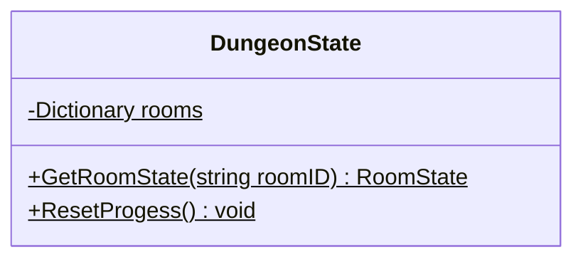

<div id="GameplayState-class-diagram"></div>

##### `GameplayState` class diagram

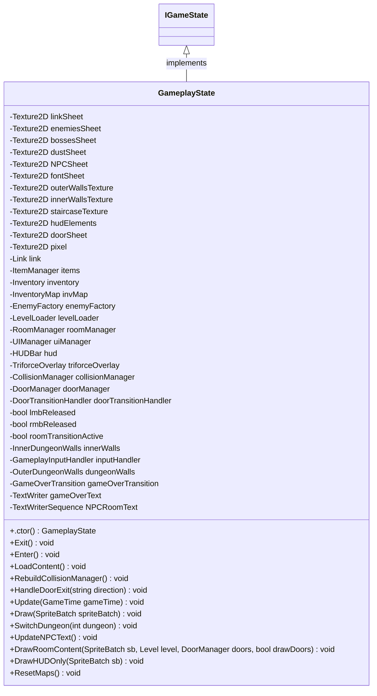

<div id="GameServices-class-diagram"></div>

##### `GameServices` class diagram

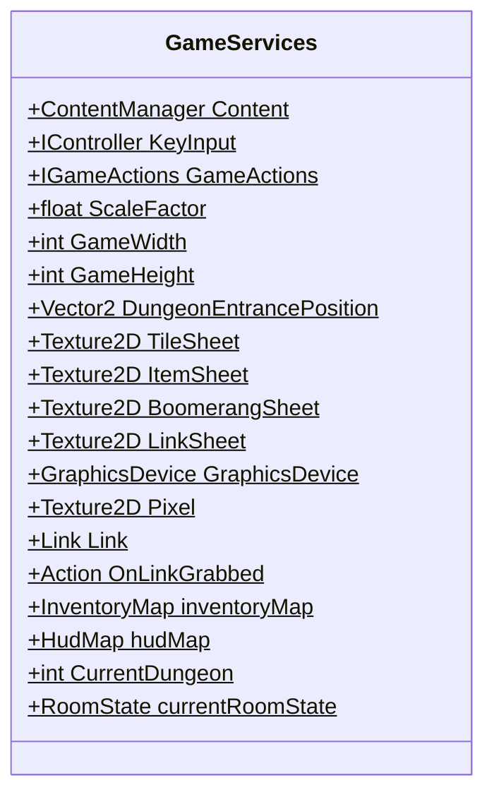

<div id="Level-class-diagram"></div>

##### `Level` class diagram

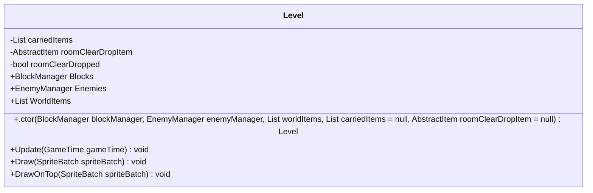

<div id="LevelBuilder-class-diagram"></div>

##### `LevelBuilder` class diagram

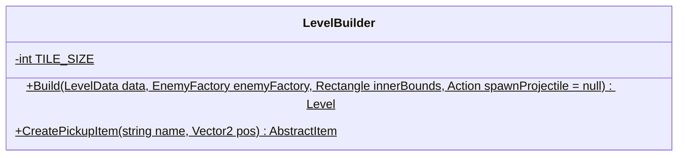

<div id="LevelLoader-class-diagram"></div>

##### `LevelLoader` class diagram

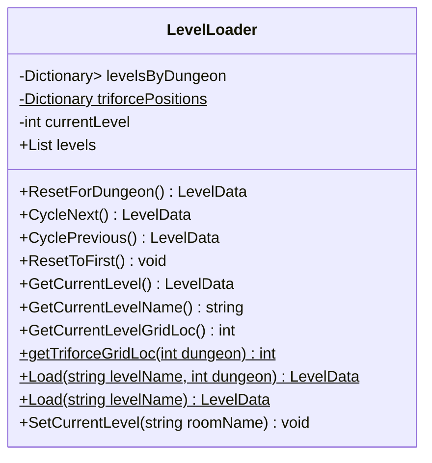

<div id="MenuState-class-diagram"></div>

##### `MenuState` class diagram

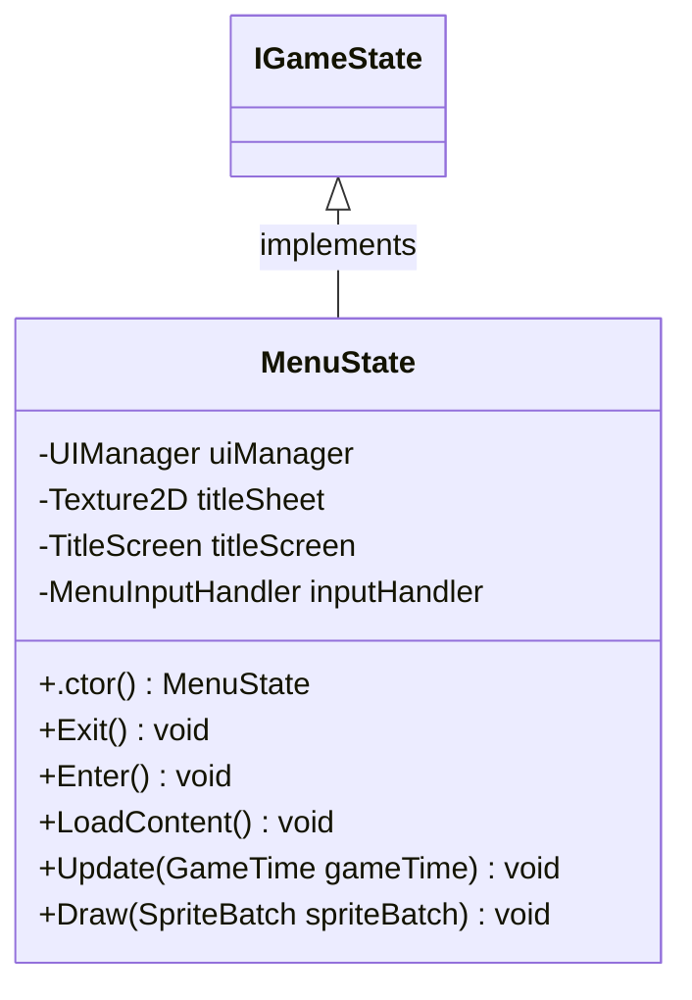

<div id="RoomState-class-diagram"></div>

##### `RoomState` class diagram

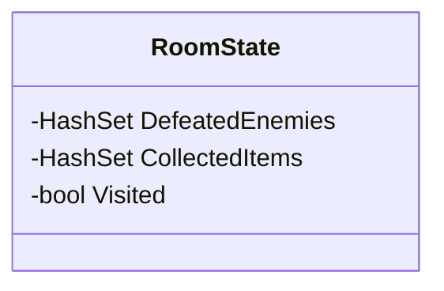

<div id="TriforceResetHandler-class-diagram"></div>

##### `TriforceResetHandler` class diagram

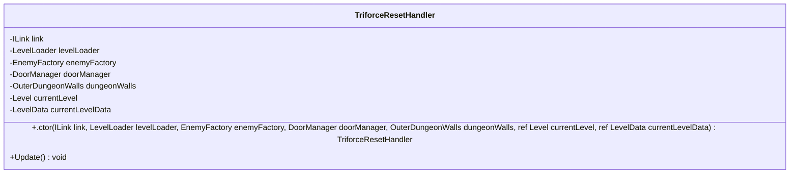

<div id="Enemy-class-diagram"></div>

##### `Enemy` class diagram

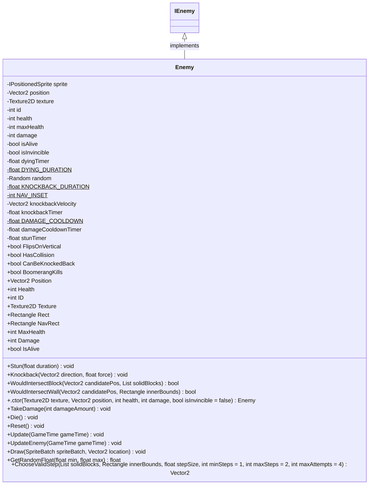

<div id="Block-class-diagram"></div>

##### `Block` class diagram

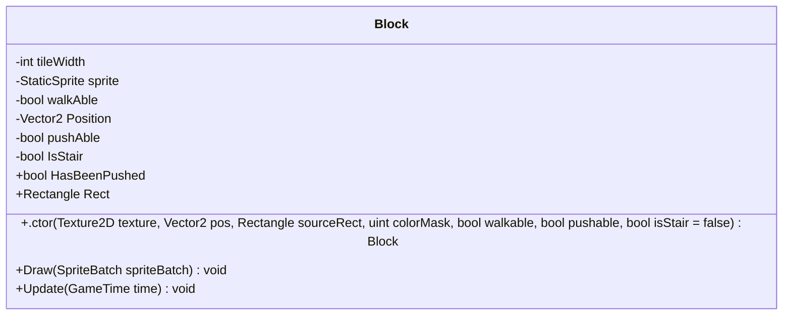

<div id="BlockFactory-class-diagram"></div>

##### `BlockFactory` class diagram

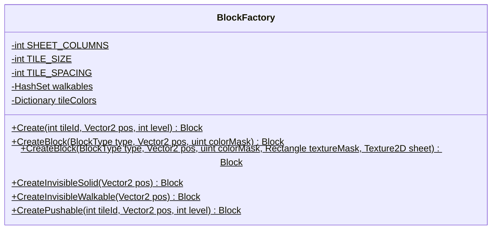

<div id="BlockManager-class-diagram"></div>

##### `BlockManager` class diagram

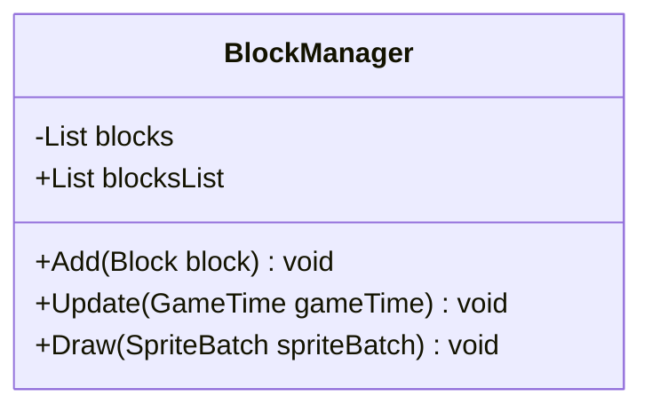

<div id="BlockFactory.BlockType-class-diagram"></div>

##### `BlockFactory.BlockType` class diagram

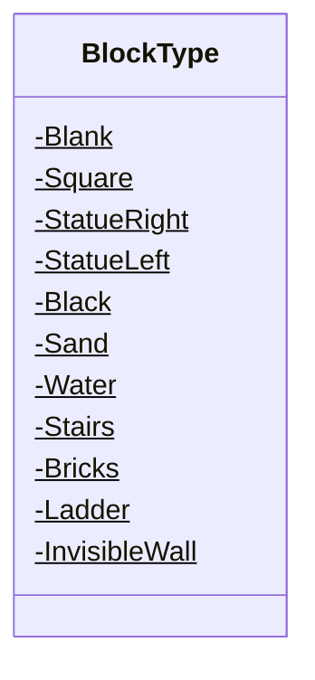

<div id="Attacking-class-diagram"></div>

##### `Attacking` class diagram

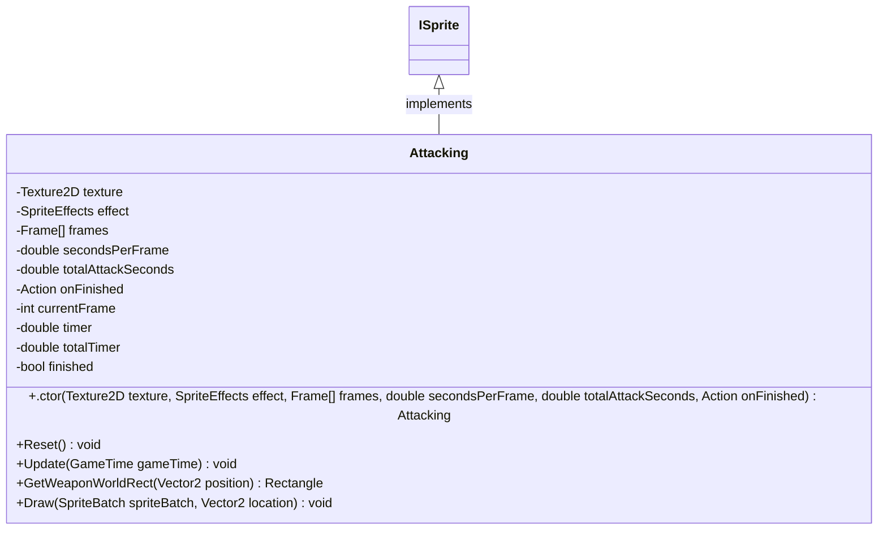

<div id="Dead-class-diagram"></div>

##### `Dead` class diagram

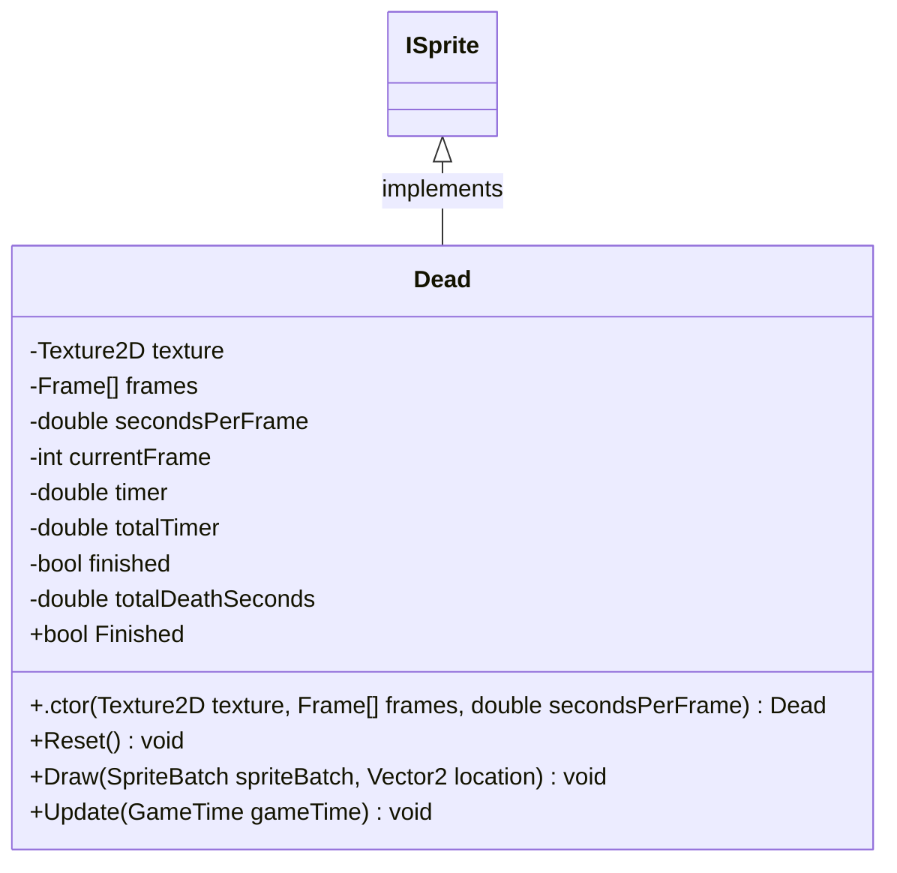

<div id="DeathSparkle-class-diagram"></div>

##### `DeathSparkle` class diagram

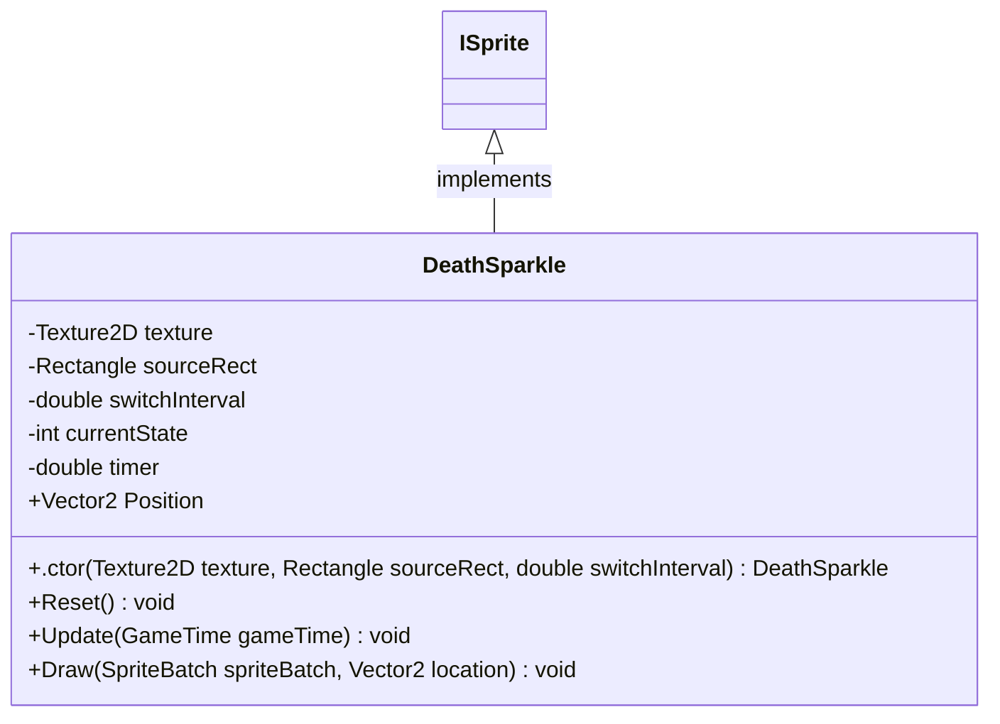

<div id="Directions-class-diagram"></div>

##### `Directions` class diagram

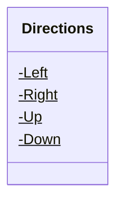

<div id="DirectionsUtils-class-diagram"></div>

##### `DirectionsUtils` class diagram

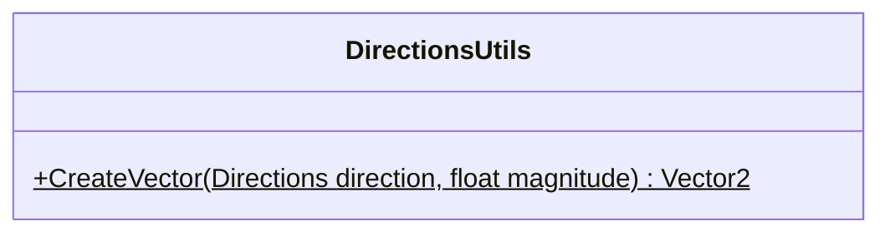

<div id="Attacking.Frame-class-diagram"></div>

##### `Attacking.Frame` class diagram

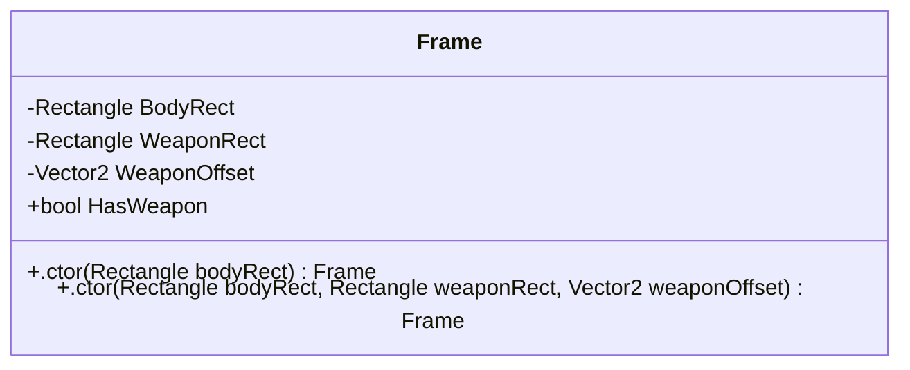

<div id="Dead.Frame-class-diagram"></div>

##### `Dead.Frame` class diagram

```mermaid
classDiagram
class Frame{
    +Rectangle Source
    +SpriteEffects Effect
    +.ctor(Rectangle source, SpriteEffects effect) Frame
}

```

<div id="PickUpItem.Frame-class-diagram"></div>

##### `PickUpItem.Frame` class diagram

```mermaid
classDiagram
class Frame{
    -Rectangle BodyRect
    -Rectangle? ItemRect
    -Vector2 ItemOffset
    +.ctor(Rectangle bodyRect) Frame
    +.ctor(Rectangle bodyRect, Rectangle itemRect, Vector2 itemOffset) Frame
}

```

<div id="UseItem.Frame-class-diagram"></div>

##### `UseItem.Frame` class diagram

```mermaid
classDiagram
class Frame{
    -Rectangle BodyRect
    +.ctor(Rectangle bodyRect) Frame
}

```

<div id="Idle-class-diagram"></div>

##### `Idle` class diagram

```mermaid
classDiagram
ISprite <|-- Idle : implements
class Idle{
    -Texture2D texture
    -Rectangle sourceRect
    -SpriteEffects effect
    +.ctor(Texture2D texture, Rectangle sourceRect, SpriteEffects effect) Idle
    +Update(GameTime gameTime) void
    +Draw(SpriteBatch spriteBatch, Vector2 location) void
}

```

<div id="Link-class-diagram"></div>

##### `Link` class diagram

```mermaid
classDiagram
ILink <|-- Link : implements
class Link{
    -int BODY_SIZE$
    -int HAND_X$
    -int HAND_Y$
    -int maxHealth
    -int STARTING_BOMBS$
    -ISprite IdleUp
    -ISprite IdleDown
    -ISprite IdleLeft
    -ISprite IdleRight
    -ISprite WalkUp
    -ISprite WalkDown
    -ISprite WalkLeft
    -ISprite WalkRight
    -Dead DeadSprite
    -Attacking AttackUp
    -Attacking AttackDown
    -Attacking AttackLeft
    -Attacking AttackRight
    -UseItem UseItemUp
    -UseItem UseItemDown
    -UseItem UseItemLeft
    -UseItem UseItemRight
    -PickUpItem PickUpWeapon
    -PickUpItem PickUpTriforce
    -DeathSparkle DeathSparkleSprite
    -ISprite sprite
    -Vector2 position
    -int health
    -int keys
    -int bombs
    -LinkStateMachine stateMachine
    +ISprite Sprite
    +Vector2 Move
    +Directions Direction
    +Directions Facing
    +int Health
    +int MaxHealth
    +bool IsDead
    +bool DeathFinished
    +bool DeathSequenceFinished
    +bool DeathBackgroundBlack
    +bool IsPushing
    +bool TriforceActive
    +double TriforceTimer
    +bool IsGrabbed
    +Rectangle Rect
    +Rectangle BlockRect
    +Rectangle SwordRect
    +Vector2 Position
    +int Rupees
    +int Keys
    +int Bombs
    +RegisterSwordHit() void
    +AddKey() void
    +UseKey() bool
    +UseBomb() bool
    +AddBomb() void
    +.ctor(Texture2D texture, Texture2D dustTexture, Vector2 position) Link
    +OnAttackFinished() void
    +OnUseItemFinished() void
    +OnPickUpFinished() void
    +Update(GameTime gameTime) void
    +Draw(SpriteBatch spriteBatch) void
    +SetMove(Directions dir) void
    +StopMove() void
    +StartAttack() void
    +StartUseItem() void
    +StartPickUpWeapon(Rectangle itemRect) void
    +StartPickUpTriforce(Rectangle itemRect) void
    +ShouldEndTriforceSequence() bool
    +EndTriforceSequence() void
    +TakeDamage(int amount) void
    +StartPush() void
    +StartDamaged() void
    +StartDeath() void
    +SetHealth(int value) void
    +GetHealed(int amount) void
    +AddHeartContainer() void
    +IncreaseRupees(int amount) void
    +DecreaseRupees(int amount) void
    +ReportRupees() int
}

```

<div id="LinkFactory-class-diagram"></div>

##### `LinkFactory` class diagram

```mermaid
classDiagram
class LinkFactory{
    +IdleDown(Texture2D texture)$ ISprite
    +IdleUp(Texture2D texture)$ ISprite
    +IdleLeft(Texture2D texture)$ ISprite
    +IdleRight(Texture2D texture)$ ISprite
    +WalkingDown(Texture2D texture)$ ISprite
    +WalkingUp(Texture2D texture)$ ISprite
    +WalkingLeft(Texture2D texture)$ ISprite
    +WalkingRight(Texture2D texture)$ ISprite
    +UseItemDown(Texture2D texture, Action onFinished)$ UseItem
    +UseItemUp(Texture2D texture, Action onFinished)$ UseItem
    +UseItemLeft(Texture2D texture, Action onFinished)$ UseItem
    +UseItemRight(Texture2D texture, Action onFinished)$ UseItem
    +PickUpWeapon(Texture2D texture, Action onFinished)$ PickUpItem
    +PickUpTriforce(Texture2D texture, Action onFinished)$ PickUpItem
    +AttackDown(Texture2D texture, Action onFinished)$ Attacking
    +AttackUp(Texture2D texture, Action onFinished)$ Attacking
    +AttackLeft(Texture2D texture, Action onFinished)$ Attacking
    +AttackRight(Texture2D texture, Action onFinished)$ Attacking
    +Dead(Texture2D texture)$ Dead
    +WhiteDeadDown(Texture2D texture)$ ISprite
    +DeathSparkle(Texture2D texture)$ DeathSparkle
}

```

<div id="LinkStateMachine-class-diagram"></div>

##### `LinkStateMachine` class diagram

```mermaid
classDiagram
class LinkStateMachine{
    -Link link
    -ILinkState currentState
    -IdleState idle
    -WalkingState walking
    -AttackingState attacking
    -UsingItemState usingItem
    -PickingUpState pickingUp
    -DamagedState damaged
    -DeadState dead
    -GrabbedState grabbed
    -float damageCooldown
    -float DAMAGE_COOLDOWN_DURATION$
    -double BLINK_INTERVAL$
    -float lowHealthSoundTimer
    -float LOW_HEALTH_SOUND_INTERVAL$
    +bool IsAttacking
    +bool AttackHitLanded
    +bool IsDead
    +bool IsGrabbed
    +bool IsPushing
    +bool TriforceActive
    +double TriforceTimer
    +bool DeathSequenceFinished
    +bool DeathBackgroundBlack
    +bool IsSparkleStage
    +bool IsVisible
    +Rectangle? PickUpItemRect
    +bool IsTriforcePickup
    +.ctor(Link link) LinkStateMachine
    +Update(GameTime gameTime) void
    +TransitionTo(ILinkState newState) void
    +TransitionToIdle() void
    +HandleSetMove(Directions dir) void
    +HandleStopMove() void
    +HandleStartAttack() void
    +HandleStartUseItem() void
    +HandleStartPickUpWeapon(Rectangle itemRect) void
    +HandleStartPickUpTriforce(Rectangle itemRect) void
    +HandleTakeDamage(int amount) void
    +HandleStartDamaged() void
    +HandleStartDeath() void
    +HandleStartPush() void
    +ShouldEndTriforceSequence() bool
    +HandleEndTriforceSequence() void
    +OnAttackFinished() void
    +OnUseItemFinished() void
    +OnPickUpFinished() void
    +HandleLowHealth(float dt) void
}

```

<div id="PickUpItem-class-diagram"></div>

##### `PickUpItem` class diagram

```mermaid
classDiagram
ISprite <|-- PickUpItem : implements
class PickUpItem{
    -Texture2D texture
    -SpriteEffects effect
    -Frame[] frames
    -double secondsPerFrame
    -double totalItemSeconds
    -Action onFinished
    -int currentFrame
    -double timer
    -double totalTimer
    -bool finished
    +.ctor(Texture2D texture, SpriteEffects effect, Frame[] frames, double secondsPerFrame, double totalItemSeconds, Action onFinished) PickUpItem
    +Reset() void
    +Update(GameTime gameTime) void
    +Draw(SpriteBatch spriteBatch, Vector2 location) void
}

```

<div id="UseItem-class-diagram"></div>

##### `UseItem` class diagram

```mermaid
classDiagram
ISprite <|-- UseItem : implements
class UseItem{
    -Texture2D texture
    -SpriteEffects effect
    -Frame[] frames
    -double secondsPerFrame
    -double totalItemSeconds
    -Action onFinished
    -int currentFrame
    -double timer
    -double totalTimer
    -bool finished
    +.ctor(Texture2D texture, SpriteEffects effect, Frame[] frames, double secondsPerFrame, double totalItemSeconds, Action onFinished) UseItem
    +Reset() void
    +Update(GameTime gameTime) void
    +Draw(SpriteBatch spriteBatch, Vector2 location) void
}

```

<div id="Walking-class-diagram"></div>

##### `Walking` class diagram

```mermaid
classDiagram
ISprite <|-- Walking : implements
class Walking{
    -Texture2D texture
    -SpriteEffects effect
    -Rectangle[] frames
    -double secondsPerFrame
    -int currentFrame
    -double timer
    +.ctor(Texture2D texture, SpriteEffects effect, Rectangle[] frames, double secondsPerFrame) Walking
    +Update(GameTime gameTime) void
    +Draw(SpriteBatch spriteBatch, Vector2 location) void
}

```

<div id="CollisionManager-class-diagram"></div>

##### `CollisionManager` class diagram

```mermaid
classDiagram
class CollisionManager{
    -List<ICollisionHandler> handlers
    +Add(ICollisionHandler handler) void
    +HandleAll() void
}

```

<div id="LinkEnemyCollision-class-diagram"></div>

##### `LinkEnemyCollision` class diagram

```mermaid
classDiagram
ICollisionHandler <|-- LinkEnemyCollision : implements
class LinkEnemyCollision{
    -Link link
    -EnemyManager enemyManager
    +.ctor(Link link, EnemyManager enemyManager) LinkEnemyCollision
    +Handle() void
}

```

<div id="LinkItemCollision-class-diagram"></div>

##### `LinkItemCollision` class diagram

```mermaid
classDiagram
ICollisionHandler <|-- LinkItemCollision : implements
class LinkItemCollision{
    -ILink link
    -Inventory inventory
    -List<AbstractItem> worldItems
    +.ctor(ILink link, Inventory inventory, List<AbstractItem> worldItems) LinkItemCollision
    +Handle() void
    +HandlePickup(AbstractItem item) void
}

```

<div id="ProjectileCollision-class-diagram"></div>

##### `ProjectileCollision` class diagram

```mermaid
classDiagram
ICollisionHandler <|-- ProjectileCollision : implements
class ProjectileCollision{
    -int PROJECTILE_DAMAGE$
    -int BOMB_DAMAGE$
    -float BOOMERANG_STUN_DURATION$
    -int BOMB_RADIUS$
    -Link link
    -ItemManager itemManager
    -EnemyManager enemyManager
    +.ctor(Link link, ItemManager itemManager, EnemyManager enemyManager) ProjectileCollision
    +Handle() void
    +ApplyEnemyDamage(AbstractItem item) void
    +TryFeedDodongo(TimeBomb bomb) void
    +ApplyBombBlast(TimeBomb bomb) void
}

```

<div id="SwordEnemyCollision-class-diagram"></div>

##### `SwordEnemyCollision` class diagram

```mermaid
classDiagram
ICollisionHandler <|-- SwordEnemyCollision : implements
class SwordEnemyCollision{
    -int SWORD_DAMAGE$
    -float KNOCKBACK_FORCE$
    -Link link
    -EnemyManager enemyManager
    +.ctor(Link link, EnemyManager enemyManager) SwordEnemyCollision
    +Handle() void
}

```

<div id="EnemyBlockCollisionHandler-class-diagram"></div>

##### `EnemyBlockCollisionHandler` class diagram

```mermaid
classDiagram
ICollisionHandler <|-- EnemyBlockCollisionHandler : implements
class EnemyBlockCollisionHandler{
    -List<IEnemy> enemies
    -BlockManager blockManager
    +.ctor(List<IEnemy> enemies, BlockManager blockManager) EnemyBlockCollisionHandler
    +Handle() void
    +ResolveCollision(IEnemy enemy, Block block)$ void
}

```

<div id="EnemyWallCollisionHandler-class-diagram"></div>

##### `EnemyWallCollisionHandler` class diagram

```mermaid
classDiagram
ICollisionHandler <|-- EnemyWallCollisionHandler : implements
class EnemyWallCollisionHandler{
    -List<IEnemy> enemies
    -OuterDungeonWalls dungeonWalls
    +.ctor(List<IEnemy> enemies, OuterDungeonWalls dungeonWalls) EnemyWallCollisionHandler
    +Handle() void
    +ResolveCollision(IEnemy enemy, OuterDungeonWalls dungeonWalls)$ void
}

```

<div id="LinkBlockCollisionHandler-class-diagram"></div>

##### `LinkBlockCollisionHandler` class diagram

```mermaid
classDiagram
ICollisionHandler <|-- LinkBlockCollisionHandler : implements
class LinkBlockCollisionHandler{
    -ILink link
    -BlockManager blockManager
    +.ctor(ILink link, BlockManager blockManager) LinkBlockCollisionHandler
    +Handle() void
    +ResolveCollision(ILink link, Block block)$ void
}

```

<div id="LinkBlockPushHandler-class-diagram"></div>

##### `LinkBlockPushHandler` class diagram

```mermaid
classDiagram
ICollisionHandler <|-- LinkBlockPushHandler : implements
class LinkBlockPushHandler{
    -Link link
    -BlockManager blockManager
    -Block movingBlock
    -Vector2 movingTargetPos
    -float PUSH_STEP$
    +.ctor(Link link, BlockManager blockManager) LinkBlockPushHandler
    +Handle() void
    +ResolvePush(Link link, Block block) void
    +UpdateMovingBlock() void
    +FinishPush() void
}

```

<div id="LinkBoundaryCollisionHandler-class-diagram"></div>

##### `LinkBoundaryCollisionHandler` class diagram

```mermaid
classDiagram
ICollisionHandler <|-- LinkBoundaryCollisionHandler : implements
class LinkBoundaryCollisionHandler{
    -ILink link
    -Rectangle bounds
    +.ctor(ILink link, Rectangle bounds) LinkBoundaryCollisionHandler
    +Handle() void
}

```

<div id="LinkWallCollisionHandler-class-diagram"></div>

##### `LinkWallCollisionHandler` class diagram

```mermaid
classDiagram
ICollisionHandler <|-- LinkWallCollisionHandler : implements
class LinkWallCollisionHandler{
    -ILink link
    -OuterDungeonWalls dungeonWalls
    -DoorManager doorManager
    -Action<string> onDoorExit
    -string pendingExit
    +.ctor(ILink link, OuterDungeonWalls dungeonWalls, DoorManager doorManager, Action<string> onDoorExit = null) LinkWallCollisionHandler
    +Handle() void
    +TryEnterDoor(string direction) bool
}

```

<div id="MoldormCollisionHandler-class-diagram"></div>

##### `MoldormCollisionHandler` class diagram

```mermaid
classDiagram
ICollisionHandler <|-- MoldormCollisionHandler : implements
class MoldormCollisionHandler{
    -ILink link
    -List<Moldorm> moldorms
    -int SWORD_DAMAGE$
    +.ctor(ILink link, List<Moldorm> moldorms) MoldormCollisionHandler
    +Handle() void
}

```

<div id="StairCollisionHandler-class-diagram"></div>

##### `StairCollisionHandler` class diagram

```mermaid
classDiagram
ICollisionHandler <|-- StairCollisionHandler : implements
class StairCollisionHandler{
    -ILink link
    -BlockManager blockManager
    -string targetRoom
    -Action<string> onStairEntered
    +.ctor(ILink link, BlockManager blockManager, string targetRoom, Action<string> onStairEntered) StairCollisionHandler
    +Handle() void
}

```

<div id="AttackCommand-class-diagram"></div>

##### `AttackCommand` class diagram

```mermaid
classDiagram
ICommand <|-- AttackCommand : implements
class AttackCommand{
    -Link link
    +.ctor(Link link) AttackCommand
    +Execute() void
}

```

<div id="KillLinkCommand-class-diagram"></div>

##### `KillLinkCommand` class diagram

```mermaid
classDiagram
ICommand <|-- KillLinkCommand : implements
class KillLinkCommand{
    -Link link
    +.ctor(Link link) KillLinkCommand
    +Execute() void
}

```

<div id="QuitCommand-class-diagram"></div>

##### `QuitCommand` class diagram

```mermaid
classDiagram
ICommand <|-- QuitCommand : implements
class QuitCommand{
    +Execute() void
}

```

<div id="RestartGameCommand-class-diagram"></div>

##### `RestartGameCommand` class diagram

```mermaid
classDiagram
ICommand <|-- RestartGameCommand : implements
class RestartGameCommand{
    +Execute() void
}

```

<div id="SetStateCommand-class-diagram"></div>

##### `SetStateCommand` class diagram

```mermaid
classDiagram
ICommand <|-- SetStateCommand : implements
class SetStateCommand{
    -IGameState newState
    +.ctor(IGameState newState) SetStateCommand
    +Execute() void
}

```

<div id="SwitchDungeonCommand-class-diagram"></div>

##### `SwitchDungeonCommand` class diagram

```mermaid
classDiagram
ICommand <|-- SwitchDungeonCommand : implements
class SwitchDungeonCommand{
    -GameplayState gameState
    -int dungeonNumber
    +.ctor(IGameState gameState, int dungeonNumber) SwitchDungeonCommand
    +Execute() void
}

```

<div id="ToggleMusicCommand-class-diagram"></div>

##### `ToggleMusicCommand` class diagram

```mermaid
classDiagram
ICommand <|-- ToggleMusicCommand : implements
class ToggleMusicCommand{
    +Execute() void
}

```

<div id="TriggerDamageCommand-class-diagram"></div>

##### `TriggerDamageCommand` class diagram

```mermaid
classDiagram
ICommand <|-- TriggerDamageCommand : implements
class TriggerDamageCommand{
    -Link link
    +.ctor(Link link) TriggerDamageCommand
    +Execute() void
}

```

<div id="UseItemCommand-class-diagram"></div>

##### `UseItemCommand` class diagram

```mermaid
classDiagram
ICommand <|-- UseItemCommand : implements
class UseItemCommand{
    -ItemManager itemManager
    -Inventory inventory
    -ILink link
    +.ctor(ItemManager itemManager, Inventory inventory, ILink link) UseItemCommand
    +Execute() void
}

```

<div id="Aquamentus-class-diagram"></div>

##### `Aquamentus` class diagram

```mermaid
classDiagram
class Aquamentus{
    -int HEALTH$
    -int DAMAGE$
    -Vector2 velocity
    -float MOVE_SPEED$
    -float directionChangeTimer
    -float DIRECTION_SWAP_MIN$
    -float DIRECTION_SWAP_MAX$
    -float moveDirectionTimer
    -bool moveLeft
    -float fireballTimer
    -float FIREBALL_INTERVAL$
    -Action<AbstractItem> spawnProjectile
    -List<Fireball> activeFireballs
    -Vector2[] FireballDirections$
    +bool CanBeKnockedBack
    +.ctor(Texture2D texture, Vector2 position, Action<AbstractItem> spawnProjectile = null) Aquamentus
    +UpdateEnemy(GameTime gameTime) void
    +SpawnFireballs() void
    +Die() void
}

```

<div id="Dodongo.Direction-class-diagram"></div>

##### `Dodongo.Direction` class diagram

```mermaid
classDiagram
class Direction{
    -Up$
    -Down$
    -Left$
    -Right$
}

```

<div id="Goriya.Direction-class-diagram"></div>

##### `Goriya.Direction` class diagram

```mermaid
classDiagram
class Direction{
    -Up$
    -Down$
    -Left$
    -Right$
}

```

<div id="Dodongo-class-diagram"></div>

##### `Dodongo` class diagram

```mermaid
classDiagram
class Dodongo{
    -DodongoState currentState
    -int HEALTH$
    -int DAMAGE$
    -float STEP_SIZE$
    -float STEP_DELAY$
    -float MOVE_SPEED$
    -float FLIP_INTERVAL$
    -float BOMB_STUN_DURATION$
    -Direction currentDirection
    -Vector2 targetPosition
    -float stepTimer
    -float flipTimer
    -float bombStunTimer
    -int bombsEaten
    -bool spriteHorizontalFlip
    -int[] upFrames
    -int[] downFrames
    -int[] sideFrames
    -int[] bombedUpFrame
    -int[] bombedDownFrame
    -int[] bombedSideFrame
    -List<Block> solidBlocks
    -Rectangle innerBounds
    +bool CanBeKnockedBack
    +bool FlipsOnVertical
    +.ctor(Texture2D texture, Vector2 position, List<Block> solidBlocks, Rectangle innerBounds) Dodongo
    +UpdateEnemy(GameTime gameTime) void
    +UpdateWalking(float deltaTime) void
    +UpdateBombEaten(float deltaTime) void
    +TakeDamage(int damageAmount) void
    +EatBomb() void
    +ChooseNextStep() void
    +GetDirectionTo(Vector2 target) Direction
    +UpdateSprite() void
    +UpdateBombedSprite(int sheetY, float frameTime) void
    +UpdateWalkingSprite(int sheetY, float frameTime) void
    +Reset() void
}

```

<div id="Dodongo.DodongoState-class-diagram"></div>

##### `Dodongo.DodongoState` class diagram

```mermaid
classDiagram
class DodongoState{
    -Walking$
    -BombEaten$
}

```

<div id="Flame-class-diagram"></div>

##### `Flame` class diagram

```mermaid
classDiagram
class Flame{
    -int HEALTH$
    -int DAMAGE$
    +.ctor(Texture2D texture, Vector2 position) Flame
}

```

<div id="Gel-class-diagram"></div>

##### `Gel` class diagram

```mermaid
classDiagram
class Gel{
    -int HEALTH$
    -int DAMAGE$
    -float TURN_SPEED$
    -float TURN_INTERVAL$
    -List<Block> solidBlocks
    -Rectangle innerBounds
    -Vector2 velocity
    -float turnTimer
    +bool BoomerangKills
    +.ctor(Texture2D texture, Vector2 position, List<Block> solidBlocks, Rectangle innerBounds) Gel
    +UpdateEnemy(GameTime gameTime) void
    +Reset() void
    +GetRandomTurnDirection() Vector2
}

```

<div id="Goriya-class-diagram"></div>

##### `Goriya` class diagram

```mermaid
classDiagram
class Goriya{
    -GoriyaState currentState
    -int HEALTH$
    -int DAMAGE$
    -float STEP_SIZE$
    -float STEP_DELAY$
    -float MOVE_SPEED$
    -float THROW_COOLDOWN_MIN$
    -float THROW_COOLDOWN_MAX$
    -float BOOMERANG_SPEED$
    -float BOOMERANG_RANGE$
    -float FLIP_INTERVAL$
    -List<Block> solidBlocks
    -Rectangle innerBounds
    -Direction currentDirection
    -Vector2 targetPosition
    -float stepTimer
    -float throwTimer
    -bool spriteHorizontalFlip
    -float flipTimer
    -Boomerang activeBoomerang
    -Action<AbstractItem> spawnProjectile
    -int[] upFrames
    -int[] downFrames
    -int[] sideFrames
    -int[] throwFrame
    +bool FlipsOnVertical
    +.ctor(Texture2D texture, Vector2 position, List<Block> solidBlocks, Rectangle innerBounds, Action<AbstractItem> spawnProjectile = null) Goriya
    +UpdateEnemy(GameTime gameTime) void
    +UpdateWalking(float deltaTime) void
    +UpdateThrowing(float deltaTime) void
    +ThrowBoomerang() void
    +GetThrowOrigin() Vector2
    +Die() void
    +ChooseNextStep() void
    +GetDirectionTo(Vector2 target) Direction
    +UpdateSprite() void
    +GetRandomThrowTime() float
}

```

<div id="Goriya.GoriyaState-class-diagram"></div>

##### `Goriya.GoriyaState` class diagram

```mermaid
classDiagram
class GoriyaState{
    -Walking$
    -Throwing$
}

```

<div id="Keese-class-diagram"></div>

##### `Keese` class diagram

```mermaid
classDiagram
class Keese{
    -int HEALTH$
    -int DAMAGE$
    -float MOVE_SPEED$
    -float REST_TIME_MIN$
    -float REST_TIME_MAX$
    -float MOVE_TIME_MIN$
    -float MOVE_TIME_MAX$
    -Vector2 moveDirection
    -float actionTimer
    -float actionDuration
    -bool isResting
    -IPositionedSprite flyingSprite
    -IPositionedSprite restingSprite
    -Rectangle innerBounds
    +bool BoomerangKills
    +.ctor(Texture2D texture, Vector2 position, Rectangle innerBounds) Keese
    +UpdateEnemy(GameTime gameTime) void
    +ChooseRandomDirection() void
}

```

<div id="Moldorm-class-diagram"></div>

##### `Moldorm` class diagram

```mermaid
classDiagram
class Moldorm{
    -int SEGMENT_COUNT$
    -int SEGMENT_HEALTH$
    -float MOVE_SPEED$
    -float TURN_INTERVAL_MIN$
    -float TURN_INTERVAL_MAX$
    -float SEGMENT_RADIUS$
    -float FLASH_DURATION$
    -float PUSH_AMOUNT$
    -float SEGMENT_DAMAGE_COOLDOWN$
    -int SPRITE_X$
    -int SPRITE_Y$
    -int SPRITE_W$
    -int SPRITE_H$
    -List<Segment> segments
    -Vector2 headVelocity
    -float turnTimer
    -Rectangle innerBounds
    -float scaledRadius
    -float diameter
    -Vector2 initialPosition
    -Vector2 normalizedInitialDir
    -float headDamageCooldown
    -float tailDamageCooldown
    +int headIndex
    +int tailIndex
    +.ctor(Texture2D texture, Vector2 position, Vector2 initialDirection, Rectangle innerBounds) Moldorm
    +UpdateEnemy(GameTime gameTime) void
    +MoveHead(float dt) void
    +TurnHead() void
    +DamageHead(int amount) void
    +DamageTail(int amount) void
    +PushMiddleSegments(Vector2 pushDir) void
    +CheckDeath() void
    +TakeDamage(int amount) void
    +Reset() void
    +Draw(SpriteBatch spriteBatch, Vector2 location) void
    +GetHeadRect() Rectangle
    +GetTailRect() Rectangle
    +GetMiddleRects() List<Rectangle>
    +GetRandomTurnTime() float
}

```

<div id="OldMan-class-diagram"></div>

##### `OldMan` class diagram

```mermaid
classDiagram
class OldMan{
    -int HEALTH$
    -int DAMAGE$
    +.ctor(Texture2D texture, Vector2 position) OldMan
}

```

<div id="Rope-class-diagram"></div>

##### `Rope` class diagram

```mermaid
classDiagram
class Rope{
    -int HEALTH$
    -int DAMAGE$
    -float PATROL_SPEED$
    -float CHARGE_SPEED$
    -float DIRECTION_CHANGE_MIN$
    -float DIRECTION_CHANGE_MAX$
    -float CHARGE_DURATION$
    -float CHARGE_COOLDOWN$
    -List<Block> solidBlocks
    -Rectangle innerBounds
    -int[] frameXPositions
    -Vector2 moveDirection
    -bool isCharging
    -float chargeTimer
    -float chargeCooldownTimer
    -float directionChangeTimer
    -float directionChangeDuration
    -bool facingLeft
    +bool BoomerangKills
    +.ctor(Texture2D texture, Vector2 position, List<Block> solidBlocks, Rectangle innerBounds) Rope
    +UpdateEnemy(GameTime gameTime) void
    +ChooseRandomCardinalDirection() void
    +UpdateSpriteFlip() void
}

```

<div id="Moldorm.Segment-class-diagram"></div>

##### `Moldorm.Segment` class diagram

```mermaid
classDiagram
class Segment{
    -Vector2 Position
    -int Health
    -bool IsAlive
    -float FlashTimer
    +bool IsFlashing
    +.ctor(Vector2 pos) Segment
}

```

<div id="Stalfos-class-diagram"></div>

##### `Stalfos` class diagram

```mermaid
classDiagram
class Stalfos{
    -int HEALTH$
    -int DAMAGE$
    -float MOVE_SPEED$
    -float DIRECTION_CHANGE_INTERVAL$
    -float FLIP_INTERVAL$
    -Rectangle sourceRect
    -List<Block> solidBlocks
    -Rectangle innerBounds
    -Vector2 velocity
    -float directionChangeTimer
    -bool isFlipped
    -float flipTimer
    +.ctor(Texture2D texture, Vector2 position, List<Block> solidBlocks, Rectangle innerBounds) Stalfos
    +GetRandomCardinalDirection() Vector2
    +UpdateEnemy(GameTime gameTime) void
    +Draw(SpriteBatch spriteBatch, Vector2 location) void
}

```

<div id="Trap-class-diagram"></div>

##### `Trap` class diagram

```mermaid
classDiagram
class Trap{
    -int HEALTH$
    -int DAMAGE$
    -float CHARGE_SPEED$
    -float RETRACT_SPEED$
    -TrapState currentState
    -Vector2 homePosition
    -Vector2 chargeDirection
    -Vector2 chargeTarget
    +bool CanBeKnockedBack
    +.ctor(Texture2D texture, Vector2 position) Trap
    +UpdateEnemy(GameTime gameTime) void
    +UpdateCharging(float deltaTime) void
    +UpdateRetracting(float deltaTime) void
    +StartCharge(bool sameRow, bool sameColumn) void
    +TakeDamage(int damageAmount) void
    +Die() void
    +Reset() void
}

```

<div id="Trap.TrapState-class-diagram"></div>

##### `Trap.TrapState` class diagram

```mermaid
classDiagram
class TrapState{
    -Idle$
    -Charging$
    -Retracting$
}

```

<div id="WallMaster-class-diagram"></div>

##### `WallMaster` class diagram

```mermaid
classDiagram
class WallMaster{
    -int HEALTH$
    -int DAMAGE$
    -float CREEP_SPEED$
    -float DETECTION_RANGE$
    -float GRAB_RANGE$
    -float ENTER_SPEED$
    -float LEAVE_SPEED$
    -float CHASE_DURATION$
    -float REENTER_MIN$
    -float REENTER_MAX$
    -float CREEP_STEP_SIZE$
    -float CREEP_STEP_DELAY$
    -WallMasterState currentState
    -Vector2 homePosition
    -Vector2 entryStart
    -Vector2 entryTarget
    -Vector2 leaveTarget
    -bool movingVertically
    -float chaseTimer
    -float cooldownTimer
    -Rectangle innerBounds
    -Vector2 creepTarget
    -float stepTimer
    -List<Block> solidBlocks
    -Vector2 linkGrabOffset
    -bool isGrabbingLink
    +bool IsEntering
    +bool HasCollision
    +.ctor(Texture2D texture, Vector2 position, List<Block> solidBlocks, Rectangle innerBounds) WallMaster
    +SetupEntry(Vector2 spawnPosition) void
    +DetermineEntryDirection(Vector2 spawnPosition) Vector2
    +ChooseNewWallPosition() Vector2
    +UpdateEnemy(GameTime gameTime) void
    +UpdateHiding() void
    +UpdateEntering(float deltaTime) void
    +UpdateCreeping(float deltaTime) void
    +UpdateChasing(float deltaTime) void
    +UpdateLeaving(float deltaTime) void
    +UpdateCooldown(float deltaTime) void
    +DetermineLeaveTarget() Vector2
    +Draw(SpriteBatch spriteBatch, Vector2 location) void
    +Reset() void
}

```

<div id="WallMaster.WallMasterState-class-diagram"></div>

##### `WallMaster.WallMasterState` class diagram

```mermaid
classDiagram
class WallMasterState{
    -Hiding$
    -Entering$
    -Creeping$
    -Chasing$
    -Leaving$
    -Cooldown$
}

```

<div id="Zol-class-diagram"></div>

##### `Zol` class diagram

```mermaid
classDiagram
class Zol{
    -int HEALTH$
    -int DAMAGE$
    -float BOUNCE_SPEED$
    -float TURN_INTERVAL$
    -List<Block> solidBlocks
    -Rectangle innerBounds
    -Vector2 velocity
    -float turnTimer
    +.ctor(Texture2D texture, Vector2 position, List<Block> solidBlocks, Rectangle innerBounds) Zol
    +UpdateEnemy(GameTime gameTime) void
    +Reset() void
    +GetRandomTurnDirection() Vector2
}

```

<div id="KeyboardController-class-diagram"></div>

##### `KeyboardController` class diagram

```mermaid
classDiagram
IController <|-- KeyboardController : implements
class KeyboardController{
    -KeyboardState previous
    -KeyboardState current
    +.ctor() KeyboardController
    +Update() void
    +IsKeyPressed(Keys key) bool
    +IsKeyDown(Keys key) bool
    +IsKeyReleased(Keys key) bool
    +IsKeyUp(Keys key) bool
    +Reset() void
}

```

<div id="DoorBlock-class-diagram"></div>

##### `DoorBlock` class diagram

```mermaid
classDiagram
class DoorBlock{
    -Dictionary<string, int> TypeColumn$
    -Dictionary<string, (int width, int height, int rowX, int rowY)> DirectionInfo$
    -Dictionary<string, Vector2> DoorOrigins$
    -Texture2D texture
    -Vector2 destination
    -float scale
    -int spriteWidth
    -int spriteHeight
    -int rowX
    -int rowY
    +.ctor(Texture2D texture, string direction, float scale, float hudHeight, Vector2? customOrigin = null) DoorBlock
    +Draw(SpriteBatch spriteBatch, string type) void
}

```

<div id="DoorManager-class-diagram"></div>

##### `DoorManager` class diagram

```mermaid
classDiagram
class DoorManager{
    -string[] AllDirections$
    -Texture2D doorTexture
    -float scale
    -float hudHeight
    -string currentRoomName
    -Dictionary<string, string> targets
    -Dictionary<string, string> configuredTypes
    -Dictionary<string, bool> unlocked
    -Dictionary<string, DoorBlock> doorBlocks
    -Dictionary<string, Vector2> DoorCenters$
    +.ctor(Texture2D doorTexture, float scale, float hudHeight) DoorManager
    +Reset(Dictionary<string, string> newTargets, Dictionary<string, string> newTypes, Dictionary<string, int[]> doorOffsets = null, string roomName = null) void
    +OppositeDirection(string direction)$ string
    +RegisterUnlock(string direction) void
    +HasDoor(string direction) bool
    +GetTarget(string direction) string
    +GetDoorType(string direction) string
    +IsLocked(string direction) bool
    +UnlockEnemyDoors() void
    +TryUnlockEnemyBlockDoors() void
    +TryUnlockBomb(Vector2 explosionCenter, float radius) void
    +TryExit(string direction, ILink link) bool
    +Draw(SpriteBatch spriteBatch) void
}

```

<div id="DoorStateRegistry-class-diagram"></div>

##### `DoorStateRegistry` class diagram

```mermaid
classDiagram
class DoorStateRegistry{
    -HashSet<(string room, string direction)> _unlocked$
    +Unlock(string room, string direction)$ void
    +IsUnlocked(string room, string direction)$ bool
    +Reset()$ void
}

```

<div id="DoorTransitionHandler-class-diagram"></div>

##### `DoorTransitionHandler` class diagram

```mermaid
classDiagram
class DoorTransitionHandler{
    -DoorManager doorManager
    -ILink link
    -Func<Rectangle> getInnerBounds
    -Func<int> getTopDoorLeft
    -Func<int> getTopDoorRight
    -Func<int> getSideDoorTop
    -Func<int> getSideDoorBottom
    -LevelLoader levelLoader
    -EnemyFactory enemyFactory
    -Action<LevelData, Level> onRoomChanged
    -Action onRebuildCollision
    -Action<AbstractItem> spawnProjectile
    -Action<string> updateLinkMapPos
    -Action<LevelData, string> updateInventoryMap
    +.ctor(DoorManager doorManager, ILink link, Func<Rectangle> getInnerBounds, Func<int> getTopDoorLeft, Func<int> getTopDoorRight, Func<int> getSideDoorTop, Func<int> getSideDoorBottom, LevelLoader levelLoader, EnemyFactory enemyFactory, Action<LevelData, Level> onRoomChanged, Action onRebuildCollision, Action<string> updateLinkMapPos, Action<LevelData, string> updateInventoryMap, Action<AbstractItem> spawnProjectile = null) DoorTransitionHandler
    +Handle(string exitDirection) void
    +ReloadMapReferences() void
}

```

<div id="EnemyEffectWrapper-class-diagram"></div>

##### `EnemyEffectWrapper` class diagram

```mermaid
classDiagram
IEnemy <|-- EnemyEffectWrapper : implements
class EnemyEffectWrapper{
    -IEnemy enemy
    -ISprite spawnSprite
    -ISprite deathSprite
    -AbstractItem droppedItem
    -Action<AbstractItem> onItemDropped
    -bool itemDropped
    -float spawnTimer
    -float dyingTimer
    -float SPAWN_DURATION$
    -float DYING_DURATION$
    +IEnemy InnerEnemy
    +bool HasCollision
    +Vector2 Position
    +Rectangle Rect
    +Rectangle NavRect
    +int Health
    +int ID
    +bool IsSpawning
    +int MaxHealth
    +int Damage
    +bool IsAlive
    +bool IsDyingAnimation
    +bool BoomerangKills
    +.ctor(IEnemy enemy, ISprite spawnSprite, ISprite deathSprite, AbstractItem droppedItem = null, Action<AbstractItem> onItemDropped = null) EnemyEffectWrapper
    +TakeDamage(int amount) void
    +Die() void
    +Knockback(Vector2 direction, float force) void
    +Stun(float duration) void
    +ToString() string
    +ResetSpawnTimer() void
    +Reset() void
    +Update(GameTime gameTime) void
    +Draw(SpriteBatch spriteBatch, Vector2 location) void
}

```

<div id="EnemyFactory-class-diagram"></div>

##### `EnemyFactory` class diagram

```mermaid
classDiagram
class EnemyFactory{
    -Texture2D enemySpriteSheet
    -Texture2D bossSpriteSheet
    -Texture2D linkSheet
    -Texture2D dustSheet
    -Texture2D NPCSheet
    -Random Rng$
    +.ctor(Texture2D enemySpriteSheet, Texture2D bossSpriteSheet, Texture2D linkSheet, Texture2D dustSheet, Texture2D NPCSheet) EnemyFactory
    +CreateDrop(EnemyType type)$ AbstractItem
    +RollRandomDrop()$ AbstractItem
    +CreateEnemy(EnemyType type, Vector2 position, List<Block> solidBlocks, Rectangle innerBounds, Action<AbstractItem> onItemDropped = null, bool skipRandomDrop = false, Action<AbstractItem> spawnProjectile = null) IEnemy
    +WrapWithEffects(IEnemy enemy, Vector2 position, bool skipSpawnCloud = false, AbstractItem droppedItem = null, Action<AbstractItem> onItemDropped = null) EnemyEffectWrapper
}

```

<div id="EnemyManager-class-diagram"></div>

##### `EnemyManager` class diagram

```mermaid
classDiagram
class EnemyManager{
    -List<IEnemy> enemies
    +List<IEnemy> EnemyList
    +bool AllDead
    +.ctor() EnemyManager
    +AddEnemy(IEnemy enemy) void
    +Update(GameTime gameTime) void
    +Draw(SpriteBatch spriteBatch) void
    +DrawOnTop(SpriteBatch spriteBatch) void
    +DrawBehindBlocks(SpriteBatch spriteBatch) void
    +Reset() void
}

```

<div id="EnemyType-class-diagram"></div>

##### `EnemyType` class diagram

```mermaid
classDiagram
class EnemyType{
    -Keese$
    -Stalfos$
    -Gel$
    -Zol$
    -Goriya$
    -WallMaster$
    -Trap$
    -Rope$
    -Aquamentus$
    -Dodongo$
    -OldMan$
    -Flame$
    -Moldorm$
}

```

<div id="GameOverTransition-class-diagram"></div>

##### `GameOverTransition` class diagram

```mermaid
classDiagram
class GameOverTransition{
    -Rectangle gameplayBounds
    -Phase phase
    -float timer
    -float blackOutDegree
    -Texture2D pixel
    -TextWriter gameOverText
    -float transitionSpeed$
    -double gameOverDisplayDuration$
    +bool Active
    +bool Finished
    +.ctor(Rectangle gameplayBounds, GraphicsDevice graphicsDevice, TextWriter text) GameOverTransition
    +Start() void
    +Update(GameTime gameTime, Link link) void
    +DrawBlackOut(SpriteBatch spriteBatch) void
    +DrawGameOverText(SpriteBatch spriteBatch) void
}

```

<div id="InventoryScreen-class-diagram"></div>

##### `InventoryScreen` class diagram

```mermaid
classDiagram
IGameState <|-- InventoryScreen : implements
class InventoryScreen{
    -Inventory inventory
    -InventoryBar inventoryBar
    -int activeSlot
    -MapBar mapBar
    -HUDBar hud
    -int hudOriginalX
    -int hudOriginalY
    -IGameState restoreState
    +.ctor(Inventory inventory, int activeSlot, HUDBar hud, InventoryMap invMap, IGameState restoreState) InventoryScreen
    +Update(GameTime time) void
    +Draw(SpriteBatch sb) void
    +Exit() void
    +Enter() void
    +LoadContent() void
}

```

<div id="GameOverTransition.Phase-class-diagram"></div>

##### `GameOverTransition.Phase` class diagram

```mermaid
classDiagram
class Phase{
    -None$
    -WaitingForLinkDeath$
    -BlackingOut$
    -ShowingGameOver$
    -Finished$
}

```

<div id="RoomManager-class-diagram"></div>

##### `RoomManager` class diagram

```mermaid
classDiagram
class RoomManager{
    -LevelLoader levelLoader
    -EnemyFactory enemyFactory
    -UIManager uiManager
    -OuterDungeonWalls dungeonWalls
    -Texture2D staircaseTexture
    -Action onRoomChanged
    -Action<AbstractItem> spawnItem
    -IUIElement currentBackground
    +Level CurrentLevel
    +LevelData CurrentLevelData
    +string CurrentLevelName
    +bool IsUnderground
    +bool IsNPCRoom
    +GetInnerBounds() Rectangle
    +.ctor(LevelLoader levelLoader, EnemyFactory enemyFactory, UIManager uiManager, OuterDungeonWalls dungeonWalls, Texture2D staircaseTexture, Action onRoomChanged, Action<AbstractItem> spawnItem) RoomManager
    +LoadRoom(string roomName) void
    +LoadRoom(LevelData data) void
    +CycleNext() void
    +CyclePrevious() void
    +ResetToFirst() void
    +SwitchDungeon(int dungeon) void
    +HandleStairTransition(string targetRoom, DoorManager doorManager, ILink link) void
    +BuildCurrentLevel() Level
    +UpdateBackground() void
}

```

<div id="RoomTransitionState-class-diagram"></div>

##### `RoomTransitionState` class diagram

```mermaid
classDiagram
IGameState <|-- RoomTransitionState : implements
class RoomTransitionState{
    -Level oldLevel
    -DoorManager oldDoorManager
    -Level newLevel
    -DoorManager newDoorManager
    -OuterDungeonWalls dungeonWalls
    -InnerDungeonWalls innerWalls
    -Link link
    -GameplayState gameplayState
    -float elapsed
    -float Duration$
    -Vector2 oldStart
    -Vector2 newStart
    -Vector2 scrollDelta
    -RasterizerState scissorRasterizer
    +.ctor(Level oldLevel, DoorManager oldDoorManager, Level newLevel, DoorManager newDoorManager, OuterDungeonWalls dungeonWalls, InnerDungeonWalls innerWalls, Link link, string direction, GameplayState gameplayState) RoomTransitionState
    +Enter() void
    +Exit() void
    +LoadContent() void
    +Update(GameTime gameTime) void
    +Draw(SpriteBatch spriteBatch) void
}

```

<div id="HeartDisplay-class-diagram"></div>

##### `HeartDisplay` class diagram

```mermaid
classDiagram
class HeartDisplay{
    -float HEART_WIDTH$
    -float GAP$
    -Texture2D spriteSheet$
    -Rectangle emptyHeartMask$
    -Rectangle halfHeartMask$
    -Rectangle fullHeartMask$
    -Vector2 origin
    -int capacity
    -List<StaticSprite> emptyHearts
    -List<StaticSprite> halfHearts
    -List<StaticSprite> fullHearts
    +.ctor(Vector2 origin, int capacity) HeartDisplay
    +Draw(int health, int maxHealth, SpriteBatch sb) void
}

```

<div id="HudMap-class-diagram"></div>

##### `HudMap` class diagram

```mermaid
classDiagram
class HudMap{
    -int WIDTH$
    -int HEIGHT$
    -int MAP_Y_OFFSET$
    -int NODE_WIDTH$
    -int NODE_HEIGHT$
    -int DOT_X_OFFSET$
    -int ROWS$
    -int COLS$
    -Texture2D spriteSheet$
    -Rectangle nodeTextureMask$
    -Rectangle disabledTextureMask$
    -Rectangle frameTextureMask$
    -Rectangle linkDotMask$
    -Rectangle triforceDotMask$
    -StaticSprite frame
    -NumberDisplay levelNumber
    -StaticSprite disabledOverlay
    -StaticSprite[,] map
    -StaticSprite linkDot
    -StaticSprite triforceDot
    -int startingRoomPos
    -int linkPos
    -int triforcePos
    +int X
    +int Y
    +bool Enabled
    +bool ShowTriforceLoc
    +int LevelNum
    +.ctor(int x, int y, string startingRoomName, int startingRoomPos, int linkPos, int triforcePos, bool enabled, bool showTriforceLoc, int levelNum = 1) HudMap
    +UpdateLinkMapPos(string direction) void
    +SetLinkPos(int newPos) void
    +Draw(SpriteBatch sb) void
    +Update(GameTime time) void
    +fillMap(Node node, int row, int col) void
    +drawMap(SpriteBatch sb) void
    +getPosition(int row, int col) Vector2
    +getDotPosition(int pos) Vector2
    +getDotPosition(int row, int col) Vector2
    +getRow(int pos) int
    +getCol(int pos) int
}

```

<div id="MapGraph-class-diagram"></div>

##### `MapGraph` class diagram

```mermaid
classDiagram
class MapGraph{
    +buildGraph(string startingRoomName)$ Node
    +processRoom(string roomName, Dictionary<string, Node> visited)$ Node
}

```

<div id="MapGraph.Node-class-diagram"></div>

##### `MapGraph.Node` class diagram

```mermaid
classDiagram
class Node{
    -string roomName
    -Node north
    -Node south
    -Node west
    -Node east
}

```

<div id="TwoDigitDisplay-class-diagram"></div>

##### `TwoDigitDisplay` class diagram

```mermaid
classDiagram
IUIElement <|-- TwoDigitDisplay : implements
class TwoDigitDisplay{
    -Vector2 tensPos
    -Vector2 onesPos
    -NumberDisplay symbol
    -NumberDisplay tens
    -NumberDisplay ones
    +.ctor(Vector2 symbolPos, Vector2 tensPos, Vector2 onesPos) TwoDigitDisplay
    +Draw(SpriteBatch sb) void
    +SetNumber(int newNumber) void
    +Update(GameTime time) void
}

```

<div id="GameplayInputHandler-class-diagram"></div>

##### `GameplayInputHandler` class diagram

```mermaid
classDiagram
IInputHandler <|-- GameplayInputHandler : implements
class GameplayInputHandler{
    -GameplayState state
    -Link link
    -Inventory inventory
    -ItemManager items
    -HUDBar hud
    -InventoryMap invMap
    -Dictionary<Keys, ICommand> commands
    +.ctor(GameplayState thisState, Link link, Inventory inventory, ItemManager items, HUDBar hud, InventoryMap invMap) GameplayInputHandler
    +HandleInput() void
}

```

<div id="MenuInputHandler-class-diagram"></div>

##### `MenuInputHandler` class diagram

```mermaid
classDiagram
IInputHandler <|-- MenuInputHandler : implements
class MenuInputHandler{
    -Dictionary<Keys, ICommand> commands
    +.ctor() MenuInputHandler
    +HandleInput() void
}

```

<div id="ICollisionHandler-class-diagram"></div>

##### `ICollisionHandler` class diagram

```mermaid
classDiagram
class ICollisionHandler{
    +Handle()* void
}

```

<div id="ICommand-class-diagram"></div>

##### `ICommand` class diagram

```mermaid
classDiagram
class ICommand{
    +Execute()* void
}

```

<div id="IController-class-diagram"></div>

##### `IController` class diagram

```mermaid
classDiagram
class IController{
    +Update()* void
    +Reset()* void
    +IsKeyDown(Keys key)* bool
    +IsKeyPressed(Keys key)* bool
    +IsKeyReleased(Keys key)* bool
}

```

<div id="IEnemy-class-diagram"></div>

##### `IEnemy` class diagram

```mermaid
classDiagram
IPositionedSprite <|-- IEnemy : implements
class IEnemy{
    +Rectangle Rect*
    +Rectangle NavRect*
    +int ID*
    +int Health*
    +int MaxHealth*
    +int Damage*
    +bool IsAlive*
    +bool BoomerangKills*
    +bool HasCollision*
    +TakeDamage(int damageAmount)* void
    +Die()* void
    +Reset()* void
    +Knockback(Vector2 direction, float force)* void
    +Stun(float duration)* void
}

```

<div id="IGameActions-class-diagram"></div>

##### `IGameActions` class diagram

```mermaid
classDiagram
class IGameActions{
    +Quit()* void
    +ChangeState(IGameState newState)* void
}

```

<div id="IGameState-class-diagram"></div>

##### `IGameState` class diagram

```mermaid
classDiagram
class IGameState{
    +Enter()* void
    +Exit()* void
    +LoadContent()* void
    +Update(GameTime gameTime)* void
    +Draw(SpriteBatch spriteBatch)* void
}

```

<div id="IInputHandler-class-diagram"></div>

##### `IInputHandler` class diagram

```mermaid
classDiagram
class IInputHandler{
    +HandleInput()* void
}

```

<div id="IItem-class-diagram"></div>

##### `IItem` class diagram

```mermaid
classDiagram
IPositionedSprite <|-- IItem : implements
class IItem{
    +string Name*
    +Rectangle Rect*
    +bool IsCollected*
    +int ID*
    +OnCollect(ILink link)* void
}

```

<div id="ILink-class-diagram"></div>

##### `ILink` class diagram

```mermaid
classDiagram
class ILink{
    +Vector2 Position*
    +Rectangle Rect*
    +Rectangle BlockRect*
    +Directions Facing*
    +int Health*
    +int MaxHealth*
    +Rectangle SwordRect*
    +bool TriforceActive*
    +double TriforceTimer*
    +int Keys*
    +bool IsGrabbed*
    +StartAttack()* void
    +StartUseItem()* void
    +StartPickUpWeapon(Rectangle itemRect)* void
    +StartPickUpTriforce(Rectangle itemRect)* void
    +ShouldEndTriforceSequence()* bool
    +EndTriforceSequence()* void
    +AddKey()* void
    +UseKey()* bool
    +AddBomb()* void
    +TakeDamage(int amount)* void
    +GetHealed(int amount)* void
    +AddHeartContainer()* void
    +IncreaseRupees(int amount)* void
    +StopMove()* void
    +DecreaseRupees(int amount)* void
    +ReportRupees()* int
    +RegisterSwordHit()* void
}

```

<div id="ILinkState-class-diagram"></div>

##### `ILinkState` class diagram

```mermaid
classDiagram
class ILinkState{
    +OnEnter(Link link)* void
    +OnExit(Link link)* void
    +Update(Link link, LinkStateMachine sm, GameTime gameTime)* void
}

```

<div id="IPositionedSprite-class-diagram"></div>

##### `IPositionedSprite` class diagram

```mermaid
classDiagram
ISprite <|-- IPositionedSprite : implements
class IPositionedSprite{
    +Vector2 Position*
}

```

<div id="ISprite-class-diagram"></div>

##### `ISprite` class diagram

```mermaid
classDiagram
class ISprite{
    +Draw(SpriteBatch spriteBatch, Vector2 location)* void
    +Update(GameTime gameTime)* void
}

```

<div id="IUIElement-class-diagram"></div>

##### `IUIElement` class diagram

```mermaid
classDiagram
class IUIElement{
    +Draw(SpriteBatch spriteBatch)* void
    +Update(GameTime gameTime)* void
}

```

<div id="InventoryBar-class-diagram"></div>

##### `InventoryBar` class diagram

```mermaid
classDiagram
IUIElement <|-- InventoryBar : implements
class InventoryBar{
    -int COLS$
    -int ROWS$
    -int LAST_SLOT$
    -Vector2 ACTIVE_ITEM_OFFSET$
    -StaticSprite background
    -StaticSprite selectedSlotBorder
    -int activeSlot
    -List<StaticSprite> itemSprites
    +int X
    +int Y
    +.ctor(List<IItem> inventory, int activeSlot, int x, int y) InventoryBar
    +Draw(SpriteBatch sb) void
    +Update(GameTime time) void
    +SetActiveSlot(int newSlot) void
    +getSlotPosition(int slot) Vector2
    +getBorderPosition(int slot) Vector2
}

```

<div id="InventoryMap-class-diagram"></div>

##### `InventoryMap` class diagram

```mermaid
classDiagram
class InventoryMap{
    -Vector2 NODE_OFFSET$
    -Vector2 DOT_OFFSET$
    -int ROWS$
    -int COLS$
    -int NODE_WIDTH$
    -int NODE_HEIGHT$
    -int NO_DOORS$
    -int NORTH$
    -int SOUTH$
    -int WEST$
    -int EAST$
    -Texture2D spriteSheet$
    -Rectangle linkDotMask$
    -Rectangle[] nodeTypes$
    -int linkPos
    -StaticSprite[,] map
    -StaticSprite linkDot
    +int X
    +int Y
    +bool Enabled
    +.ctor() InventoryMap
    +rect(int index)$ Rectangle
    +.ctor(LevelData startingRoom, int linkPos, bool enabled) InventoryMap
    +Draw(SpriteBatch sb) void
    +SetPosition(int x, int y) void
    +UpdateInventoryMap(LevelData room, string exitDirection) void
    +SetLinkPos(int newPos) void
    +drawMap(SpriteBatch sb) void
    +getPosition(int row, int col) Vector2
    +getDotPosition(int pos) Vector2
    +getDotPosition(int row, int col) Vector2
    +getRow(int pos) int
    +getCol(int pos) int
}

```

<div id="MapBar-class-diagram"></div>

##### `MapBar` class diagram

```mermaid
classDiagram
class MapBar{
    -Vector2 MAP_ITEM_OFFSET$
    -Vector2 COMPASS_ITEM_OFFSET$
    -Texture2D spriteSheet$
    -Rectangle frameMask$
    -Rectangle mapItemMask$
    -Rectangle compassMask$
    -StaticSprite frame
    -StaticSprite mapItem
    -StaticSprite compassItem
    -InventoryMap map
    -bool hasCompass
    +bool Enabled
    +int X
    +int Y
    +.ctor(int x, int y, InventoryMap map, bool enabled, bool hasCompass) MapBar
    +SetEnabled(bool enabled) void
    +Draw(SpriteBatch sb) void
}

```

<div id="AbstractItem-class-diagram"></div>

##### `AbstractItem` class diagram

```mermaid
classDiagram
IItem <|-- AbstractItem : implements
class AbstractItem{
    -Texture2D texture
    -Vector2 position
    -int id
    -bool cancelled
    -IPositionedSprite sprite
    +Vector2 Position
    +string Name
    +Rectangle Rect
    +Rectangle SourceRect
    +bool IsCollected
    +bool IsFinished
    +bool DamagesEnemies
    +bool DamagesPlayer
    +bool StopsOnHit
    +int ID
    +Cancel() void
    +OnEnemyHit() void
    +.ctor(string name, Texture2D texture, Vector2 position) AbstractItem
    +OnCollect(ILink link) void
    +Draw(SpriteBatch sb, Vector2 location) void
    +Update(GameTime time) void
}

```

<div id="Arrow-class-diagram"></div>

##### `Arrow` class diagram

```mermaid
classDiagram
class Arrow{
    -int HITBOX_SIZE$
    -bool hitEnemy
    +bool IsFinished
    +bool DamagesEnemies
    +bool StopsOnHit
    +.ctor(Rectangle sourceRect, Vector2 pos, Vector2 vel, float maxDistance, float rotation, Vector2 origin, float scale) Arrow
    +StartMoving() Arrow
    +Update(GameTime time) void
    +OnEnemyHit() void
}

```

<div id="Boomerang-class-diagram"></div>

##### `Boomerang` class diagram

```mermaid
classDiagram
class Boomerang{
    -int HITBOX_SIZE$
    -bool damagesEnemies
    -bool damagesPlayer
    +bool IsFinished
    +bool DamagesEnemies
    +bool DamagesPlayer
    +.ctor(Vector2 pos, Vector2 vel, float maxDistance, bool damagesEnemies = true, bool damagesPlayer = false) Boomerang
    +StartMoving() Boomerang
    +Update(GameTime time) void
}

```

<div id="CarriedItem-class-diagram"></div>

##### `CarriedItem` class diagram

```mermaid
classDiagram
class CarriedItem{
    -AbstractItem item
    -IEnemy carrier
    -Action<AbstractItem> onDropped
    -bool dropped
    +.ctor(AbstractItem item, IEnemy carrier, Action<AbstractItem> onDropped) CarriedItem
    +Update() void
}

```

<div id="Fireball-class-diagram"></div>

##### `Fireball` class diagram

```mermaid
classDiagram
class Fireball{
    -float SPEED$
    -float MAX_LIFETIME$
    -int SOURCE_WIDTH$
    -int SOURCE_HEIGHT$
    -int[] FrameX$
    -int FrameY$
    -float FrameTime$
    -Vector2 velocity
    -float lifetime
    +bool IsFinished
    +bool DamagesPlayer
    +.ctor(Texture2D texture, Vector2 pos, Vector2 direction) Fireball
    +Update(GameTime gameTime) void
}

```

<div id="Inventory-class-diagram"></div>

##### `Inventory` class diagram

```mermaid
classDiagram
class Inventory{
    -List<IItem> items
    +bool HasCompass
    +bool HasMap
    +int ActiveSlot
    +int Count
    +Add(IItem item) void
    +Get(int slot) IItem
    +Update(GameTime time) void
    +GetItems() List<IItem>
}

```

<div id="ItemFactory-class-diagram"></div>

##### `ItemFactory` class diagram

```mermaid
classDiagram
class ItemFactory{
    +CreateBoomerang(Vector2 pos, Vector2 vel, float maxDistance)$ Boomerang
    +CreateEnemyBoomerang(Vector2 pos, Vector2 vel, float maxDistance)$ Boomerang
    +CreateFireball(Texture2D texture, Vector2 pos, Vector2 direction)$ Fireball
    +CreateArrow(Vector2 pos, Vector2 vel, float rotation, float scale = 1, float maxDistance = null)$ Arrow
    +CreateTimeBomb(double explodeDelayMillis, Vector2 pos, Vector2 velocity, float throwDistance, float scale)$ TimeBomb
    +CreateStillItem(StillType type, Vector2 pos, float scale = null)$ StillItem
}

```

<div id="ItemHudSprites-class-diagram"></div>

##### `ItemHudSprites` class diagram

```mermaid
classDiagram
class ItemHudSprites{
    -Texture2D spriteSheet$
    -Rectangle sword$
    -Rectangle boomerang$
    -Rectangle bomb$
    -Rectangle bow$
    -Rectangle blueCandle$
    -Rectangle bluePotion$
    -Rectangle notFound$
    -Dictionary<string, Rectangle> nameMap$
    +GetSprite(string itemName, Vector2 position)$ StaticSprite
}

```

<div id="ItemManager-class-diagram"></div>

##### `ItemManager` class diagram

```mermaid
classDiagram
class ItemManager{
    -double ITEM_COOLDOWN_MILLIS$
    -List<AbstractItem> spawnedItems
    -List<AbstractItem> justFinishedItems
    -double itemCooldownMillis
    +IReadOnlyList<AbstractItem> SpawnedItems
    +IReadOnlyList<AbstractItem> JustFinished
    +ProjectileOrigin(ILink link)$ Vector2
    +UseItem(ILink link, Inventory inventory, int slot) void
    +SpawnItem(AbstractItem item) void
    +Clear() void
    +Update(GameTime time) void
    +Draw(SpriteBatch sb) void
}

```

<div id="StillItem-class-diagram"></div>

##### `StillItem` class diagram

```mermaid
classDiagram
class StillItem{
    +.ctor(string name, Texture2D texture, Vector2 pos, Rectangle sourceRect, float scale) StillItem
}

```

<div id="ItemFactory.StillType-class-diagram"></div>

##### `ItemFactory.StillType` class diagram

```mermaid
classDiagram
class StillType{
    -Heart$
    -BlueHeart$
    -HalfHeart$
    -ZeroHeart$
    -HeartContainer$
    -Fairy$
    -Clock$
    -GoldRupee$
    -PurpleRupee$
    -BluePotion$
    -Map$
    -Bomb$
    -Bow$
    -BlueCandle$
    -Key$
    -Compass$
    -GoldTriforce$
    -PurpleTriforce$
}

```

<div id="TimeBomb-class-diagram"></div>

##### `TimeBomb` class diagram

```mermaid
classDiagram
class TimeBomb{
    -int[] CloudFrameX$
    -int CloudFrameY$
    -int CloudFrameW$
    -int CloudFrameH$
    -float CloudFrameTime$
    -double CloudDurationMillis$
    -double millisUntilExplode
    -bool exploded
    -bool cloudDone
    -ProjectileSprite projectile
    -StaticSprite still
    -AnimatedSprite cloud
    -double cloudElapsed
    -Rectangle sourceRect
    -float scale
    -bool landed
    -Vector2 explosionCenter
    +bool JustExploded
    +Vector2 ExplosionCenter
    +bool IsFinished
    +.ctor(double explodeDelayMillis, string name, Vector2 pos, Vector2 velocity, float throwDistance, Rectangle sourceRect, float scale) TimeBomb
    +Update(GameTime time) void
    +Draw(SpriteBatch sb, Vector2 location) void
    +Consume() void
}

```

<div id="LayerData-class-diagram"></div>

##### `LayerData` class diagram

```mermaid
classDiagram
class LayerData{
    +string name
    +string type
    +int width
    +int height
    +int[] data
    +Dictionary<string, int[]> doorOffsets
}

```

<div id="LevelData-class-diagram"></div>

##### `LevelData` class diagram

```mermaid
classDiagram
class LevelData{
    +string name
    +int width
    +int height
    +List<LayerData> layers
    +Dictionary<string, string> doors
    +Dictionary<string, string> doorTypes
    +Dictionary<string, int[]> doorOffsets
    +string roomClearDrop
    +Dictionary<string, string> carriedItems
    +List<RoomItemData> roomItems
    +string background
    +List<PrecisePlacementData> precisePlacements
    +int gridPos
    +string stairTarget
    +string[] npcText
}

```

<div id="PrecisePlacementData-class-diagram"></div>

##### `PrecisePlacementData` class diagram

```mermaid
classDiagram
class PrecisePlacementData{
    +string type
    +int x
    +int y
}

```

<div id="RoomItemData-class-diagram"></div>

##### `RoomItemData` class diagram

```mermaid
classDiagram
class RoomItemData{
    +string item
    +int tile
}

```

<div id="MusicPlayer-class-diagram"></div>

##### `MusicPlayer` class diagram

```mermaid
classDiagram
class MusicPlayer{
    -Dictionary<MusicType, string> musicLookup$
    -MusicType currentMusic$
    +Play(MusicType type, bool repeat = true)$ void
    +Mute()$ void
    +ToggleMute()$ void
}

```

<div id="MusicType-class-diagram"></div>

##### `MusicType` class diagram

```mermaid
classDiagram
class MusicType{
    -TITLE_THEME$
    -DUNGEON$
}

```

<div id="SoundPlayer-class-diagram"></div>

##### `SoundPlayer` class diagram

```mermaid
classDiagram
class SoundPlayer{
    -Dictionary<SoundType, string> soundLookup$
    +Play(SoundType type)$ void
}

```

<div id="SoundType-class-diagram"></div>

##### `SoundType` class diagram

```mermaid
classDiagram
class SoundType{
    -ARROW_BOOMERANG$
    -BOMB_EXPLODE$
    -BOMB_PLACE$
    -BOSS_HURT$
    -BOSS_SCREAM1$
    -BOSS_SCREAM2$
    -BOSS_SCREAM3$
    -CANDLE$
    -DOOR_UNLOCK$
    -ENEMY_DEATH$
    -ENEMY_HURT$
    -PICKUP_VALUABLE$
    -LINK_HEALED$
    -PICKUP_ITEM$
    -PICKUP_RUPEE$
    -KEY_APPEAR$
    -LINK_DEATH$
    -LINK_HURT$
    -LOW_HEALTH$
    -SECRET_UNLOCKED$
    -SWORD_COMBINED$
    -SWORD_SHOOT$
    -SWORD_SWING$
    -Text$
    -Text_Slow$
}

```

<div id="Game1-class-diagram"></div>

##### `Game1` class diagram

```mermaid
classDiagram
IGameActions <|-- Game1 : implements
class Game1{
    -GraphicsDeviceManager graphics
    -SpriteBatch spriteBatch
    -IGameState currentState
    +Game1 Instance$
    +.ctor() Game1
    +Initialize() void
    +LoadContent() void
    +Update(GameTime gameTime) void
    +Draw(GameTime gameTime) void
    +ChangeState(IGameState newState) void
    +ForceState(IGameState newState) void
    +Quit() void
}

```

<div id="AnimatedSprite-class-diagram"></div>

##### `AnimatedSprite` class diagram

```mermaid
classDiagram
IPositionedSprite <|-- AnimatedSprite : implements
class AnimatedSprite{
    -Texture2D texture
    -Vector2 pos
    -Rectangle rect
    -int frameCount
    -int curFrame
    -int[] sheetXPositions
    -float frameTime
    -float elapsedTime
    -int frameWidth
    -int frameHeight
    -int sheetY
    +Vector2 Position
    +Texture2D Texture
    +Rectangle Rect
    +.ctor(Texture2D texture, Vector2 position, int[] sheetXPositions, int sheetYPos, int spriteWidth, int spriteHeight, float frameTime) AnimatedSprite
    +UpdateRect() void
    +SetFrame(int frame) void
    +Update(GameTime gameTime) void
    +Draw(SpriteBatch spriteBatch, Vector2 location) void
}

```

<div id="BoomerangSprite-class-diagram"></div>

##### `BoomerangSprite` class diagram

```mermaid
classDiagram
IPositionedSprite <|-- BoomerangSprite : implements
class BoomerangSprite{
    -Texture2D texture
    -Vector2 velocity
    -float scale
    -int animationFrame
    -int lastAnimationFrame
    -float distanceTraveled
    -float maxDistance
    -bool returning
    -bool thrown
    +Vector2 Position
    +bool IsActive
    +bool WasThrown
    +.ctor(Texture2D texture, Vector2 initialPos, Vector2 velocity, float maxDistance, float scale) BoomerangSprite
    +Throw() void
    +Draw(SpriteBatch sb, Vector2 location) void
    +Update(GameTime time) void
}

```

<div id="DirectionalAnimatedSprite-class-diagram"></div>

##### `DirectionalAnimatedSprite` class diagram

```mermaid
classDiagram
IPositionedSprite <|-- DirectionalAnimatedSprite : implements
class DirectionalAnimatedSprite{
    -Texture2D texture
    -Vector2 pos
    -Rectangle rect
    -int frameCount
    -int curFrame
    -int[] sheetXPositions
    -float frameTime
    -float elapsedTime
    -int frameWidth
    -int frameHeight
    -int sheetY
    -bool flipHorizontal
    +Vector2 Position
    +Texture2D Texture
    +Rectangle Rect
    +.ctor(Texture2D texture, Vector2 position, int[] xPositions, int yPos, int spriteWidth, int spriteHeight, float frameTime, bool flipHorizontal = false) DirectionalAnimatedSprite
    +UpdateFrames(int[] xPositions, bool flipHorizontal) void
    +UpdateRect() void
    +Update(GameTime gameTime) void
    +Draw(SpriteBatch spriteBatch, Vector2 location) void
}

```

<div id="MovingAnimatedSprite-class-diagram"></div>

##### `MovingAnimatedSprite` class diagram

```mermaid
classDiagram
IPositionedSprite <|-- MovingAnimatedSprite : implements
class MovingAnimatedSprite{
    -Texture2D texture
    -Vector2 pos
    -Rectangle rect
    -int frameCount
    -int curFrame
    -int[] sheetXPositions
    -float frameTime
    -float elapsedTime
    -int frameWidth
    -int frameHeight
    -int frameY
    -float speed
    -float minX
    -float maxX
    -bool movingRight
    +Vector2 Position
    +Texture2D Texture
    +Rectangle Rect
    +.ctor(Texture2D texture, Vector2 startPosition, int[] sheetXPositions, int frameY, int spriteWidth, int spriteHeight, float frameDuration, float moveSpeed = 150, float range = 300) MovingAnimatedSprite
    +UpdateRect() void
    +Update(GameTime gameTime) void
    +Draw(SpriteBatch spriteBatch, Vector2 location) void
}

```

<div id="MovingSprite-class-diagram"></div>

##### `MovingSprite` class diagram

```mermaid
classDiagram
IPositionedSprite <|-- MovingSprite : implements
class MovingSprite{
    -Texture2D texture
    -Vector2 pos
    -Rectangle rect
    -int frameCount
    -int curFrame
    -int[] downFrameXPositions
    -int[] upFrameXPositions
    -float frameTime
    -float elapsedTime
    -int frameWidth
    -int frameHeight
    -int frameY
    -float speed
    -float minY
    -float maxY
    -bool goingDown
    +Vector2 Position
    +Texture2D Texture
    +Rectangle Rect
    +.ctor(Texture2D tex, Vector2 start, int[] downXPositions, int[] upXPositions, int yPos, int spriteWidth, int spriteHeight, float frameDuration, float moveSpeed = 100, float range = 200) MovingSprite
    +UpdateRect() void
    +Update(GameTime gameTime) void
    +Draw(SpriteBatch spriteBatch, Vector2 location) void
}

```

<div id="ProjectileSprite-class-diagram"></div>

##### `ProjectileSprite` class diagram

```mermaid
classDiagram
IPositionedSprite <|-- ProjectileSprite : implements
class ProjectileSprite{
    -Texture2D texture
    -Rectangle sourceRect
    -Vector2 velocity
    -float maxDistance
    -float rotation
    -Vector2 origin
    -float scale
    -float distanceTraveled
    -bool isMoving
    -bool ReachedMaxDistance
    +Vector2 Position
    +.ctor(Texture2D texture, Rectangle sourceRect, Vector2 pos, Vector2 vel, float maxDistance, float rotation, Vector2 origin, float scale) ProjectileSprite
    +StartMoving() void
    +Update(GameTime time) void
    +Draw(SpriteBatch sb, Vector2 unused) void
}

```

<div id="StaticSprite-class-diagram"></div>

##### `StaticSprite` class diagram

```mermaid
classDiagram
IPositionedSprite <|-- StaticSprite : implements
class StaticSprite{
    -Texture2D texture
    -Vector2 pos
    -Rectangle sourceRect
    -float? customScale
    -uint colorMask
    +Vector2 Position
    +Texture2D Texture
    +SetColorMask(uint mask) void
    +.ctor(Texture2D texture, Vector2 position, Rectangle source, uint mask = 4294967295) StaticSprite
    +.ctor(Texture2D texture, Vector2 position, Rectangle source, float scale) StaticSprite
    +Update(GameTime gameTime) void
    +Draw(SpriteBatch spriteBatch, Vector2 location) void
    +getColor(uint colorMask)$ Color
}

```

<div id="TextSprite-class-diagram"></div>

##### `TextSprite` class diagram

```mermaid
classDiagram
IPositionedSprite <|-- TextSprite : implements
class TextSprite{
    -Texture2D texture
    -Vector2 pos
    -Rectangle rect
    +Vector2 Position
    +Texture2D Texture
    +Rectangle Rect
    +.ctor(Texture2D texture, Vector2 position) TextSprite
    +Update(GameTime gameTime) void
    +Draw(SpriteBatch spriteBatch, Vector2 location) void
}

```

<div id="AttackingState-class-diagram"></div>

##### `AttackingState` class diagram

```mermaid
classDiagram
class AttackingState{
    +OnEnter(Link link) void
    +Update(Link link, LinkStateMachine sm, GameTime gameTime) void
}

```

<div id="DamagedState-class-diagram"></div>

##### `DamagedState` class diagram

```mermaid
classDiagram
class DamagedState{
    -double DAMAGED_DURATION$
    -float SPEED$
    -double timer
    -Vector2 moveVector
    +SetMove(Directions dir, Link link) void
    +StopMove(Link link) void
    +OnEnter(Link link) void
    +OnExit(Link link) void
    +Update(Link link, LinkStateMachine sm, GameTime gameTime) void
}

```

<div id="DeadState-class-diagram"></div>

##### `DeadState` class diagram

```mermaid
classDiagram
class DeadState{
    -Stage stage
    -double stageTimer
    +bool IsFinished
    +bool IsWhiteFlash
    +bool IsSparkle
    +bool IsBackgroundBlack
    +OnEnter(Link link) void
    +Update(Link link, LinkStateMachine sm, GameTime gameTime) void
}

```

<div id="GrabbedState-class-diagram"></div>

##### `GrabbedState` class diagram

```mermaid
classDiagram
class GrabbedState{
    +Update(Link link, LinkStateMachine sm, GameTime gameTime) void
}

```

<div id="IdleState-class-diagram"></div>

##### `IdleState` class diagram

```mermaid
classDiagram
class IdleState{
    +OnEnter(Link link) void
    +Update(Link link, LinkStateMachine sm, GameTime gameTime) void
}

```

<div id="LinkState-class-diagram"></div>

##### `LinkState` class diagram

```mermaid
classDiagram
ILinkState <|-- LinkState : implements
class LinkState{
    +OnEnter(Link link) void
    +OnExit(Link link) void
    +Update(Link link, LinkStateMachine sm, GameTime gameTime)* void
}

```

<div id="PickingUpState-class-diagram"></div>

##### `PickingUpState` class diagram

```mermaid
classDiagram
class PickingUpState{
    +bool IsTriforce
    +Rectangle ItemRect
    +double Timer
    +bool IsTriforceComplete
    +InitWeapon(Rectangle itemRect) void
    +InitTriforce(Rectangle itemRect) void
    +OnEnter(Link link) void
    +Update(Link link, LinkStateMachine sm, GameTime gameTime) void
}

```

<div id="DeadState.Stage-class-diagram"></div>

##### `DeadState.Stage` class diagram

```mermaid
classDiagram
class Stage{
    -Spinning$
    -WhiteFlash$
    -Sparkle$
    -Finished$
}

```

<div id="UsingItemState-class-diagram"></div>

##### `UsingItemState` class diagram

```mermaid
classDiagram
class UsingItemState{
    +OnEnter(Link link) void
    +Update(Link link, LinkStateMachine sm, GameTime gameTime) void
}

```

<div id="WalkingState-class-diagram"></div>

##### `WalkingState` class diagram

```mermaid
classDiagram
class WalkingState{
    -float SPEED$
    -float PUSHING_SPEED$
    -float PUSHING_DURATION$
    -double pushingTimer
    +bool IsPushing
    +StartPushing() void
    +SetDirection(Directions dir, Link link) void
    +OnEnter(Link link) void
    +OnExit(Link link) void
    +Update(Link link, LinkStateMachine sm, GameTime gameTime) void
}

```

<div id="LetterFactory-class-diagram"></div>

##### `LetterFactory` class diagram

```mermaid
classDiagram
class LetterFactory{
    -int CharWidth$
    -int CharHeight$
    -int StartX$
    -int StartY$
    -int SpacingX$
    -int SpacingY$
    -string Row0$
    -string Row1$
    -string Row2$
    +GetLetter(char c) Rectangle
}

```

<div id="TextWriter-class-diagram"></div>

##### `TextWriter` class diagram

```mermaid
classDiagram
IUIElement <|-- TextWriter : implements
class TextWriter{
    -int CharWidth$
    -int CharSpacing$
    -int printedCharacters
    -double timer
    -Texture2D fontsheet
    -LetterFactory letterFactory
    -string text
    -Vector2 position
    -float scale
    -bool effect
    +bool Finished
    +.ctor(Texture2D sheet, string text, Vector2 position, float scale, bool effect) TextWriter
    +Draw(SpriteBatch spriteBatch) void
    +Update(GameTime gameTime) void
    +CreateGameOverText(Texture2D fontSheet)$ TextWriter
    +CreateNPCText(Texture2D fontSheet, string[] lines, int dungeon)$ TextWriter[]
}

```

<div id="TextWriterSequence-class-diagram"></div>

##### `TextWriterSequence` class diagram

```mermaid
classDiagram
IUIElement <|-- TextWriterSequence : implements
class TextWriterSequence{
    -TextWriter[] writers
    -int currentIndex
    +.ctor(TextWriter[] writers) TextWriterSequence
    +Update(GameTime gameTime) void
    +Draw(SpriteBatch spriteBatch) void
}

```

<div id="HUDBar-class-diagram"></div>

##### `HUDBar` class diagram

```mermaid
classDiagram
IUIElement <|-- HUDBar : implements
class HUDBar{
    -Vector2 CROP$
    -Vector2 B_ITEM_OFFSET$
    -Vector2 A_ITEM_OFFSET$
    -Vector2 HEART_DISPLAY_OFFSET$
    -Rectangle backgroundMask$
    -Rectangle swordMask$
    -Texture2D texture
    -StaticSprite background
    -Inventory inventory
    -StaticSprite activeItem
    -StaticSprite swordItem
    -HeartDisplay hearts
    -TwoDigitDisplay rupees
    -TwoDigitDisplay keys
    -TwoDigitDisplay bombs
    +int X
    +int Y
    +HudMap Map
    +.ctor(int x, int y, Inventory inventory, Texture2D backgroundTexture) HUDBar
    +UpdateActiveItem() void
    +SetMap(string startingRoomName, int triforcePos, bool enabled, int dungeonNum) void
    +Draw(SpriteBatch sb) void
    +Update(GameTime gameTime) void
}

```

<div id="InnerDungeonWalls-class-diagram"></div>

##### `InnerDungeonWalls` class diagram

```mermaid
classDiagram
IUIElement <|-- InnerDungeonWalls : implements
class InnerDungeonWalls{
    -StaticSprite background
    -Rectangle sourceRect
    -int XOffset
    -int YOffset
    +.ctor(Texture2D backgroundTexture) InnerDungeonWalls
    +Draw(SpriteBatch spriteBatch) void
    +RefreshColor() void
    +Update(GameTime gameTime) void
}

```

<div id="NumberDisplay-class-diagram"></div>

##### `NumberDisplay` class diagram

```mermaid
classDiagram
IUIElement <|-- NumberDisplay : implements
class NumberDisplay{
    -Texture2D spriteSheet$
    -int MASK_BASE_X$
    -int MASK_Y$
    -StaticSprite sprite
    -Vector2 Position
    +int Num
    +.ctor(Vector2 pos, int num) NumberDisplay
    +Draw(SpriteBatch sb) void
    +Update(GameTime gameTime) void
}

```

<div id="OuterDungeonWalls-class-diagram"></div>

##### `OuterDungeonWalls` class diagram

```mermaid
classDiagram
IUIElement <|-- OuterDungeonWalls : implements
class OuterDungeonWalls{
    -StaticSprite background
    -Rectangle sourceRect
    -float scale
    -float hudHeight
    -int TOP_DOOR_LEFT$
    -int TOP_DOOR_RIGHT$
    -int LEFT_DOOR_TOP$
    -int LEFT_DOOR_BOTTOM$
    -int CENTER_TOP$
    -int CENTER_BOTTOM$
    -int CENTER_LEFT$
    -int CENTER_RIGHT$
    +Rectangle InnerBounds
    +Rectangle OuterBounds
    +int TopDoorLeft
    +int TopDoorRight
    +int SideDoorTop
    +int SideDoorBottom
    +int SideDoorEntryBottom
    +int BottomDoorLeft
    +int BottomDoorRight
    +int BottomDoorTop
    +int DoorExitDepth
    +.ctor(Texture2D backgroundTexture) OuterDungeonWalls
    +Draw(SpriteBatch spriteBatch) void
    +RefreshColor() void
    +Update(GameTime gameTime) void
}

```

<div id="StaircaseBackground-class-diagram"></div>

##### `StaircaseBackground` class diagram

```mermaid
classDiagram
IUIElement <|-- StaircaseBackground : implements
class StaircaseBackground{
    -Texture2D texture
    -float scale
    -float hudHeight
    +Rectangle InnerBounds
    +.ctor(Texture2D texture) StaircaseBackground
    +Draw(SpriteBatch spriteBatch) void
    +Update(GameTime gameTime) void
}

```

<div id="TitleScreen-class-diagram"></div>

##### `TitleScreen` class diagram

```mermaid
classDiagram
IUIElement <|-- TitleScreen : implements
class TitleScreen{
    -StaticSprite background
    -Rectangle sourceRect
    +.ctor(Texture2D backgroundTexture) TitleScreen
    +Draw(SpriteBatch spriteBatch) void
    +Update(GameTime gameTime) void
}

```

<div id="TriforceOverlay-class-diagram"></div>

##### `TriforceOverlay` class diagram

```mermaid
classDiagram
IUIElement <|-- TriforceOverlay : implements
class TriforceOverlay{
    -ILink link
    -Texture2D pixel
    +.ctor(ILink link, Texture2D pixel) TriforceOverlay
    +Update(GameTime gameTime) void
    +Draw(SpriteBatch spriteBatch) void
}

```

<div id="UIManager-class-diagram"></div>

##### `UIManager` class diagram

```mermaid
classDiagram
class UIManager{
    -List<IUIElement> elements
    +.ctor() UIManager
    +GetElement<T>() T
    +Update(GameTime gameTime) void
    +Draw(SpriteBatch spriteBatch) void
    +AddElement(IUIElement element) void
    +RemoveElement(IUIElement element) void
    +Clear() void
}

```

*This file is maintained by a bot.*

<!-- markdownlint-restore -->
