<!-- markdownlint-capture -->
<!-- markdownlint-disable -->

# Code Metrics

This file is dynamically maintained by a bot, *please do not* edit this by hand. It represents various [code metrics](https://aka.ms/dotnet/code-metrics), such as cyclomatic complexity, maintainability index, and so on.

<div id='sprint'></div>

## Sprint :exploding_head:

The *Sprint.csproj* project file contains:

- 23 namespaces.
- 133 named types.
- 8,130 total lines of source code.
- Approximately 2,494 lines of executable code.
- The highest cyclomatic complexity is 31 :exploding_head:.

<details>
<summary>
  <strong id="global+namespace">
    &lt;global namespace&gt; :x:
  </strong>
</summary>
<br>

The `<global namespace>` namespace contains 7 named types.

- 7 named types.
- 576 total lines of source code.
- Approximately 244 lines of executable code.
- The highest cyclomatic complexity is 14 :x:.

<details>
<summary>
  <strong id="program$">
    &lt;Program&gt;$ :heavy_check_mark:
  </strong>
</summary>
<br>

- The `<Program>$` contains 1 members.
- 2 total lines of source code.
- Approximately 4 lines of executable code.
- The highest cyclomatic complexity is 1 :heavy_check_mark:.

| Member kind | Line number | Maintainability index | Cyclomatic complexity | Depth of inheritance | Class coupling | Lines of source / executable code |
| :-: | :-: | :-: | :-: | :-: | :-: | :-: |
| Method | <a href='https://github.com/Abadi2225/The_Legend_of_Zilda/blob/main/../Program.cs#L1' title='<top-level-statements-entry-point>'>1</a> | 88 | 1 :heavy_check_mark: | 0 | 2 | 2 / 2 |

<a href="#global+namespace">:top: back to &lt;global namespace&gt;</a>

</details>

<details>
<summary>
  <strong id="gameplaystate">
    GameplayState :x:
  </strong>
</summary>
<br>

- The `GameplayState` contains 43 members.
- 263 total lines of source code.
- Approximately 131 lines of executable code.
- The highest cyclomatic complexity is 13 :x:.

| Member kind | Line number | Maintainability index | Cyclomatic complexity | Depth of inheritance | Class coupling | Lines of source / executable code |
| :-: | :-: | :-: | :-: | :-: | :-: | :-: |
| Method | <a href='https://github.com/Abadi2225/The_Legend_of_Zilda/blob/main/../GameStates/GameplayState.cs#L61' title='GameplayState.GameplayState()'>61</a> | 100 | 1 :heavy_check_mark: | 0 | 0 | 3 / 0 |
| Field | <a href='https://github.com/Abadi2225/The_Legend_of_Zilda/blob/main/../GameStates/GameplayState.cs#L25' title='Texture2D GameplayState.bossesSheet'>25</a> | 100 | 0 :heavy_check_mark: | 0 | 1 | 1 / 0 |
| Field | <a href='https://github.com/Abadi2225/The_Legend_of_Zilda/blob/main/../GameStates/GameplayState.cs#L49' title='CollisionManager GameplayState.collisionManager'>49</a> | 100 | 0 :heavy_check_mark: | 0 | 1 | 1 / 0 |
| Field | <a href='https://github.com/Abadi2225/The_Legend_of_Zilda/blob/main/../GameStates/GameplayState.cs#L47' title='IUIElement GameplayState.currentBackground'>47</a> | 100 | 0 :heavy_check_mark: | 0 | 1 | 1 / 0 |
| Field | <a href='https://github.com/Abadi2225/The_Legend_of_Zilda/blob/main/../GameStates/GameplayState.cs#L42' title='Level GameplayState.currentLevel'>42</a> | 100 | 0 :heavy_check_mark: | 0 | 1 | 1 / 0 |
| Field | <a href='https://github.com/Abadi2225/The_Legend_of_Zilda/blob/main/../GameStates/GameplayState.cs#L43' title='LevelData GameplayState.currentLevelData'>43</a> | 100 | 0 :heavy_check_mark: | 0 | 1 | 1 / 0 |
| Field | <a href='https://github.com/Abadi2225/The_Legend_of_Zilda/blob/main/../GameStates/GameplayState.cs#L50' title='DoorManager GameplayState.doorManager'>50</a> | 100 | 0 :heavy_check_mark: | 0 | 1 | 1 / 0 |
| Field | <a href='https://github.com/Abadi2225/The_Legend_of_Zilda/blob/main/../GameStates/GameplayState.cs#L33' title='Texture2D GameplayState.doorSheet'>33</a> | 100 | 0 :heavy_check_mark: | 0 | 1 | 1 / 0 |
| Field | <a href='https://github.com/Abadi2225/The_Legend_of_Zilda/blob/main/../GameStates/GameplayState.cs#L51' title='DoorTransitionHandler GameplayState.doorTransitionHandler'>51</a> | 100 | 0 :heavy_check_mark: | 0 | 1 | 1 / 0 |
| Method | <a href='https://github.com/Abadi2225/The_Legend_of_Zilda/blob/main/../GameStates/GameplayState.cs#L271' title='void GameplayState.Draw(SpriteBatch spriteBatch)'>271</a> | 65 | 1 :heavy_check_mark: | 0 | 8 | 12 / 9 |
| Field | <a href='https://github.com/Abadi2225/The_Legend_of_Zilda/blob/main/../GameStates/GameplayState.cs#L56' title='OuterDungeonWalls GameplayState.dungeonWalls'>56</a> | 100 | 0 :heavy_check_mark: | 0 | 1 | 1 / 0 |
| Field | <a href='https://github.com/Abadi2225/The_Legend_of_Zilda/blob/main/../GameStates/GameplayState.cs#L26' title='Texture2D GameplayState.dustSheet'>26</a> | 100 | 0 :heavy_check_mark: | 0 | 1 | 1 / 0 |
| Field | <a href='https://github.com/Abadi2225/The_Legend_of_Zilda/blob/main/../GameStates/GameplayState.cs#L24' title='Texture2D GameplayState.enemiesSheet'>24</a> | 100 | 0 :heavy_check_mark: | 0 | 1 | 1 / 0 |
| Field | <a href='https://github.com/Abadi2225/The_Legend_of_Zilda/blob/main/../GameStates/GameplayState.cs#L40' title='EnemyFactory GameplayState.enemyFactory'>40</a> | 100 | 0 :heavy_check_mark: | 0 | 1 | 1 / 0 |
| Field | <a href='https://github.com/Abadi2225/The_Legend_of_Zilda/blob/main/../GameStates/GameplayState.cs#L39' title='EnemyManager GameplayState.enemyManager'>39</a> | 100 | 0 :heavy_check_mark: | 0 | 1 | 1 / 0 |
| Method | <a href='https://github.com/Abadi2225/The_Legend_of_Zilda/blob/main/../GameStates/GameplayState.cs#L67' title='void GameplayState.Enter()'>67</a> | 88 | 1 :heavy_check_mark: | 0 | 6 | 4 / 1 |
| Method | <a href='https://github.com/Abadi2225/The_Legend_of_Zilda/blob/main/../GameStates/GameplayState.cs#L65' title='void GameplayState.Exit()'>65</a> | 100 | 1 :heavy_check_mark: | 0 | 0 | 1 / 0 |
| Field | <a href='https://github.com/Abadi2225/The_Legend_of_Zilda/blob/main/../GameStates/GameplayState.cs#L28' title='Texture2D GameplayState.fontSheet'>28</a> | 100 | 0 :heavy_check_mark: | 0 | 1 | 1 / 0 |
| Field | <a href='https://github.com/Abadi2225/The_Legend_of_Zilda/blob/main/../GameStates/GameplayState.cs#L59' title='GameOverText GameplayState.gameOverText'>59</a> | 100 | 0 :heavy_check_mark: | 0 | 1 | 1 / 0 |
| Field | <a href='https://github.com/Abadi2225/The_Legend_of_Zilda/blob/main/../GameStates/GameplayState.cs#L58' title='GameOverTransition GameplayState.gameOverTransition'>58</a> | 100 | 0 :heavy_check_mark: | 0 | 1 | 1 / 0 |
| Method | <a href='https://github.com/Abadi2225/The_Legend_of_Zilda/blob/main/../GameStates/GameplayState.cs#L176' title='Rectangle GameplayState.GetInnerBounds()'>176</a> | 82 | 3 :heavy_check_mark: | 0 | 4 | 6 / 2 |
| Field | <a href='https://github.com/Abadi2225/The_Legend_of_Zilda/blob/main/../GameStates/GameplayState.cs#L46' title='HUDBar GameplayState.hud'>46</a> | 100 | 0 :heavy_check_mark: | 0 | 1 | 1 / 0 |
| Field | <a href='https://github.com/Abadi2225/The_Legend_of_Zilda/blob/main/../GameStates/GameplayState.cs#L32' title='Texture2D GameplayState.hudElements'>32</a> | 100 | 0 :heavy_check_mark: | 0 | 1 | 1 / 0 |
| Field | <a href='https://github.com/Abadi2225/The_Legend_of_Zilda/blob/main/../GameStates/GameplayState.cs#L54' title='InnerDungeonWalls GameplayState.innerWalls'>54</a> | 100 | 0 :heavy_check_mark: | 0 | 1 | 1 / 0 |
| Field | <a href='https://github.com/Abadi2225/The_Legend_of_Zilda/blob/main/../GameStates/GameplayState.cs#L30' title='Texture2D GameplayState.innerWallsTexture'>30</a> | 100 | 0 :heavy_check_mark: | 0 | 1 | 1 / 0 |
| Field | <a href='https://github.com/Abadi2225/The_Legend_of_Zilda/blob/main/../GameStates/GameplayState.cs#L55' title='GameplayInputHandler GameplayState.inputHandler'>55</a> | 100 | 0 :heavy_check_mark: | 0 | 1 | 1 / 0 |
| Field | <a href='https://github.com/Abadi2225/The_Legend_of_Zilda/blob/main/../GameStates/GameplayState.cs#L37' title='Inventory GameplayState.inventory'>37</a> | 100 | 0 :heavy_check_mark: | 0 | 1 | 1 / 0 |
| Field | <a href='https://github.com/Abadi2225/The_Legend_of_Zilda/blob/main/../GameStates/GameplayState.cs#L38' title='InventoryMap GameplayState.invMap'>38</a> | 100 | 0 :heavy_check_mark: | 0 | 1 | 1 / 0 |
| Property | <a href='https://github.com/Abadi2225/The_Legend_of_Zilda/blob/main/../GameStates/GameplayState.cs#L175' title='bool GameplayState.IsUnderground'>175</a> | 92 | 4 :heavy_check_mark: | 0 | 2 | 1 / 2 |
| Field | <a href='https://github.com/Abadi2225/The_Legend_of_Zilda/blob/main/../GameStates/GameplayState.cs#L36' title='ItemManager GameplayState.items'>36</a> | 100 | 0 :heavy_check_mark: | 0 | 1 | 1 / 0 |
| Field | <a href='https://github.com/Abadi2225/The_Legend_of_Zilda/blob/main/../GameStates/GameplayState.cs#L41' title='LevelLoader GameplayState.levelLoader'>41</a> | 100 | 0 :heavy_check_mark: | 0 | 1 | 1 / 0 |
| Field | <a href='https://github.com/Abadi2225/The_Legend_of_Zilda/blob/main/../GameStates/GameplayState.cs#L35' title='Link GameplayState.link'>35</a> | 100 | 0 :heavy_check_mark: | 0 | 1 | 1 / 0 |
| Field | <a href='https://github.com/Abadi2225/The_Legend_of_Zilda/blob/main/../GameStates/GameplayState.cs#L23' title='Texture2D GameplayState.linkSheet'>23</a> | 100 | 0 :heavy_check_mark: | 0 | 1 | 1 / 0 |
| Field | <a href='https://github.com/Abadi2225/The_Legend_of_Zilda/blob/main/../GameStates/GameplayState.cs#L52' title='bool GameplayState.lmbReleased'>52</a> | 93 | 0 :heavy_check_mark: | 0 | 0 | 1 / 1 |
| Method | <a href='https://github.com/Abadi2225/The_Legend_of_Zilda/blob/main/../GameStates/GameplayState.cs#L72' title='void GameplayState.LoadContent()'>72</a> | 36 | 1 :heavy_check_mark: | 0 | 34 | 102 / 67 |
| Field | <a href='https://github.com/Abadi2225/The_Legend_of_Zilda/blob/main/../GameStates/GameplayState.cs#L27' title='Texture2D GameplayState.NPCSheet'>27</a> | 100 | 0 :heavy_check_mark: | 0 | 1 | 1 / 0 |
| Field | <a href='https://github.com/Abadi2225/The_Legend_of_Zilda/blob/main/../GameStates/GameplayState.cs#L29' title='Texture2D GameplayState.outerWallsTexture'>29</a> | 100 | 0 :heavy_check_mark: | 0 | 1 | 1 / 0 |
| Method | <a href='https://github.com/Abadi2225/The_Legend_of_Zilda/blob/main/../GameStates/GameplayState.cs#L195' title='void GameplayState.RebuildCollisionManager()'>195</a> | 58 | 1 :heavy_check_mark: | 0 | 25 | 14 / 11 |
| Field | <a href='https://github.com/Abadi2225/The_Legend_of_Zilda/blob/main/../GameStates/GameplayState.cs#L53' title='bool GameplayState.rmbReleased'>53</a> | 93 | 0 :heavy_check_mark: | 0 | 0 | 1 / 1 |
| Field | <a href='https://github.com/Abadi2225/The_Legend_of_Zilda/blob/main/../GameStates/GameplayState.cs#L31' title='Texture2D GameplayState.staircaseTexture'>31</a> | 100 | 0 :heavy_check_mark: | 0 | 1 | 1 / 0 |
| Field | <a href='https://github.com/Abadi2225/The_Legend_of_Zilda/blob/main/../GameStates/GameplayState.cs#L45' title='UIManager GameplayState.uiManager'>45</a> | 100 | 0 :heavy_check_mark: | 0 | 1 | 1 / 0 |
| Method | <a href='https://github.com/Abadi2225/The_Legend_of_Zilda/blob/main/../GameStates/GameplayState.cs#L210' title='void GameplayState.Update(GameTime gameTime)'>210</a> | 44 | 13 :x: | 0 | 26 | 60 / 34 |
| Method | <a href='https://github.com/Abadi2225/The_Legend_of_Zilda/blob/main/../GameStates/GameplayState.cs#L183' title='void GameplayState.UpdateBackground()'>183</a> | 76 | 3 :heavy_check_mark: | 0 | 5 | 12 / 3 |

<a href="#GameplayState-class-diagram">:link: to `GameplayState` class diagram</a>

<a href="#global+namespace">:top: back to &lt;global namespace&gt;</a>

</details>

<details>
<summary>
  <strong id="gameservices">
    GameServices :heavy_check_mark:
  </strong>
</summary>
<br>

- The `GameServices` contains 15 members.
- 26 total lines of source code.
- Approximately 4 lines of executable code.
- The highest cyclomatic complexity is 2 :heavy_check_mark:.

| Member kind | Line number | Maintainability index | Cyclomatic complexity | Depth of inheritance | Class coupling | Lines of source / executable code |
| :-: | :-: | :-: | :-: | :-: | :-: | :-: |
| Property | <a href='https://github.com/Abadi2225/The_Legend_of_Zilda/blob/main/../GameServices.cs#L29' title='Texture2D GameServices.BoomerangSheet'>29</a> | 100 | 2 :heavy_check_mark: | 0 | 1 | 1 / 0 |
| Property | <a href='https://github.com/Abadi2225/The_Legend_of_Zilda/blob/main/../GameServices.cs#L17' title='ContentManager GameServices.Content'>17</a> | 100 | 2 :heavy_check_mark: | 0 | 1 | 1 / 0 |
| Property | <a href='https://github.com/Abadi2225/The_Legend_of_Zilda/blob/main/../GameServices.cs#L25' title='Vector2 GameServices.DungeonEntrancePosition'>25</a> | 100 | 2 :heavy_check_mark: | 0 | 1 | 1 / 0 |
| Property | <a href='https://github.com/Abadi2225/The_Legend_of_Zilda/blob/main/../GameServices.cs#L20' title='IGameActions GameServices.GameActions'>20</a> | 100 | 2 :heavy_check_mark: | 0 | 1 | 1 / 0 |
| Property | <a href='https://github.com/Abadi2225/The_Legend_of_Zilda/blob/main/../GameServices.cs#L24' title='int GameServices.GameHeight'>24</a> | 93 | 1 :heavy_check_mark: | 0 | 1 | 1 / 1 |
| Property | <a href='https://github.com/Abadi2225/The_Legend_of_Zilda/blob/main/../GameServices.cs#L23' title='int GameServices.GameWidth'>23</a> | 93 | 1 :heavy_check_mark: | 0 | 1 | 1 / 1 |
| Property | <a href='https://github.com/Abadi2225/The_Legend_of_Zilda/blob/main/../GameServices.cs#L35' title='HudMap GameServices.hudMap'>35</a> | 100 | 2 :heavy_check_mark: | 0 | 1 | 1 / 0 |
| Property | <a href='https://github.com/Abadi2225/The_Legend_of_Zilda/blob/main/../GameServices.cs#L34' title='InventoryMap GameServices.inventoryMap'>34</a> | 100 | 2 :heavy_check_mark: | 0 | 1 | 1 / 0 |
| Property | <a href='https://github.com/Abadi2225/The_Legend_of_Zilda/blob/main/../GameServices.cs#L28' title='Texture2D GameServices.ItemSheet'>28</a> | 100 | 2 :heavy_check_mark: | 0 | 1 | 1 / 0 |
| Property | <a href='https://github.com/Abadi2225/The_Legend_of_Zilda/blob/main/../GameServices.cs#L18' title='IController GameServices.KeyInput'>18</a> | 100 | 1 :heavy_check_mark: | 0 | 2 | 1 / 1 |
| Property | <a href='https://github.com/Abadi2225/The_Legend_of_Zilda/blob/main/../GameServices.cs#L32' title='Link GameServices.Link'>32</a> | 100 | 2 :heavy_check_mark: | 0 | 1 | 1 / 0 |
| Property | <a href='https://github.com/Abadi2225/The_Legend_of_Zilda/blob/main/../GameServices.cs#L30' title='Texture2D GameServices.LinkSheet'>30</a> | 100 | 2 :heavy_check_mark: | 0 | 1 | 1 / 0 |
| Property | <a href='https://github.com/Abadi2225/The_Legend_of_Zilda/blob/main/../GameServices.cs#L33' title='Action GameServices.OnLinkGrabbed'>33</a> | 100 | 2 :heavy_check_mark: | 0 | 1 | 1 / 0 |
| Property | <a href='https://github.com/Abadi2225/The_Legend_of_Zilda/blob/main/../GameServices.cs#L22' title='float GameServices.ScaleFactor'>22</a> | 100 | 1 :heavy_check_mark: | 0 | 0 | 1 / 1 |
| Property | <a href='https://github.com/Abadi2225/The_Legend_of_Zilda/blob/main/../GameServices.cs#L27' title='Texture2D GameServices.TileSheet'>27</a> | 100 | 2 :heavy_check_mark: | 0 | 1 | 1 / 0 |

<a href="#GameServices-class-diagram">:link: to `GameServices` class diagram</a>

<a href="#global+namespace">:top: back to &lt;global namespace&gt;</a>

</details>

<details>
<summary>
  <strong id="level">
    Level :heavy_check_mark:
  </strong>
</summary>
<br>

- The `Level` contains 10 members.
- 52 total lines of source code.
- Approximately 19 lines of executable code.
- The highest cyclomatic complexity is 6 :heavy_check_mark:.

| Member kind | Line number | Maintainability index | Cyclomatic complexity | Depth of inheritance | Class coupling | Lines of source / executable code |
| :-: | :-: | :-: | :-: | :-: | :-: | :-: |
| Method | <a href='https://github.com/Abadi2225/The_Legend_of_Zilda/blob/main/../Levels/Level.cs#L20' title='Level.Level(BlockManager blockManager, EnemyManager enemyManager, List<AbstractItem> worldItems, List<CarriedItem> carriedItems = null, AbstractItem roomClearDropItem = null)'>20</a> | 66 | 2 :heavy_check_mark: | 0 | 6 | 9 / 7 |
| Property | <a href='https://github.com/Abadi2225/The_Legend_of_Zilda/blob/main/../Levels/Level.cs#L12' title='BlockManager Level.Blocks'>12</a> | 100 | 2 :heavy_check_mark: | 0 | 1 | 1 / 0 |
| Field | <a href='https://github.com/Abadi2225/The_Legend_of_Zilda/blob/main/../Levels/Level.cs#L16' title='List<CarriedItem> Level.carriedItems'>16</a> | 100 | 0 :heavy_check_mark: | 0 | 2 | 1 / 0 |
| Method | <a href='https://github.com/Abadi2225/The_Legend_of_Zilda/blob/main/../Levels/Level.cs#L48' title='void Level.Draw(SpriteBatch spriteBatch)'>48</a> | 75 | 2 :heavy_check_mark: | 0 | 6 | 8 / 4 |
| Method | <a href='https://github.com/Abadi2225/The_Legend_of_Zilda/blob/main/../Levels/Level.cs#L57' title='void Level.DrawOnTop(SpriteBatch spriteBatch)'>57</a> | 96 | 1 :heavy_check_mark: | 0 | 2 | 4 / 1 |
| Property | <a href='https://github.com/Abadi2225/The_Legend_of_Zilda/blob/main/../Levels/Level.cs#L13' title='EnemyManager Level.Enemies'>13</a> | 100 | 2 :heavy_check_mark: | 0 | 1 | 1 / 0 |
| Field | <a href='https://github.com/Abadi2225/The_Legend_of_Zilda/blob/main/../Levels/Level.cs#L17' title='AbstractItem Level.roomClearDropItem'>17</a> | 100 | 0 :heavy_check_mark: | 0 | 1 | 1 / 0 |
| Field | <a href='https://github.com/Abadi2225/The_Legend_of_Zilda/blob/main/../Levels/Level.cs#L18' title='bool Level.roomClearDropped'>18</a> | 100 | 0 :heavy_check_mark: | 0 | 0 | 1 / 0 |
| Method | <a href='https://github.com/Abadi2225/The_Legend_of_Zilda/blob/main/../Levels/Level.cs#L30' title='void Level.Update(GameTime gameTime)'>30</a> | 66 | 6 :heavy_check_mark: | 0 | 7 | 17 / 7 |
| Property | <a href='https://github.com/Abadi2225/The_Legend_of_Zilda/blob/main/../Levels/Level.cs#L14' title='List<AbstractItem> Level.WorldItems'>14</a> | 100 | 1 :heavy_check_mark: | 0 | 2 | 1 / 0 |

<a href="#Level-class-diagram">:link: to `Level` class diagram</a>

<a href="#global+namespace">:top: back to &lt;global namespace&gt;</a>

</details>

<details>
<summary>
  <strong id="levelbuilder">
    LevelBuilder :x:
  </strong>
</summary>
<br>

- The `LevelBuilder` contains 3 members.
- 120 total lines of source code.
- Approximately 62 lines of executable code.
- The highest cyclomatic complexity is 14 :x:.

| Member kind | Line number | Maintainability index | Cyclomatic complexity | Depth of inheritance | Class coupling | Lines of source / executable code |
| :-: | :-: | :-: | :-: | :-: | :-: | :-: |
| Method | <a href='https://github.com/Abadi2225/The_Legend_of_Zilda/blob/main/../Levels/LevelBuilder.cs#L15' title='Level LevelBuilder.Build(LevelData data, EnemyFactory enemyFactory, Rectangle innerBounds)'>15</a> | 36 | 14 :x: | 0 | 18 | 109 / 60 |
| Method | <a href='https://github.com/Abadi2225/The_Legend_of_Zilda/blob/main/../Levels/LevelBuilder.cs#L125' title='AbstractItem LevelBuilder.CreatePickupItem(string name, Vector2 pos)'>125</a> | 91 | 1 :heavy_check_mark: | 0 | 6 | 5 / 1 |
| Field | <a href='https://github.com/Abadi2225/The_Legend_of_Zilda/blob/main/../Levels/LevelBuilder.cs#L13' title='int LevelBuilder.TILE_SIZE'>13</a> | 93 | 0 :heavy_check_mark: | 0 | 0 | 1 / 1 |

<a href="#LevelBuilder-class-diagram">:link: to `LevelBuilder` class diagram</a>

<a href="#global+namespace">:top: back to &lt;global namespace&gt;</a>

</details>

<details>
<summary>
  <strong id="levelloader">
    LevelLoader :heavy_check_mark:
  </strong>
</summary>
<br>

- The `LevelLoader` contains 9 members.
- 71 total lines of source code.
- Approximately 16 lines of executable code.
- The highest cyclomatic complexity is 2 :heavy_check_mark:.

| Member kind | Line number | Maintainability index | Cyclomatic complexity | Depth of inheritance | Class coupling | Lines of source / executable code |
| :-: | :-: | :-: | :-: | :-: | :-: | :-: |
| Field | <a href='https://github.com/Abadi2225/The_Legend_of_Zilda/blob/main/../Levels/LevelLoader.cs#L30' title='int LevelLoader.currentLevel'>30</a> | 93 | 0 :heavy_check_mark: | 0 | 0 | 1 / 1 |
| Method | <a href='https://github.com/Abadi2225/The_Legend_of_Zilda/blob/main/../Levels/LevelLoader.cs#L31' title='LevelData LevelLoader.CycleNext()'>31</a> | 78 | 2 :heavy_check_mark: | 0 | 3 | 8 / 3 |
| Method | <a href='https://github.com/Abadi2225/The_Legend_of_Zilda/blob/main/../Levels/LevelLoader.cs#L39' title='LevelData LevelLoader.CyclePrevious()'>39</a> | 80 | 2 :heavy_check_mark: | 0 | 3 | 8 / 3 |
| Method | <a href='https://github.com/Abadi2225/The_Legend_of_Zilda/blob/main/../Levels/LevelLoader.cs#L51' title='LevelData LevelLoader.GetCurrentLevel()'>51</a> | 95 | 1 :heavy_check_mark: | 0 | 3 | 4 / 1 |
| Method | <a href='https://github.com/Abadi2225/The_Legend_of_Zilda/blob/main/../Levels/LevelLoader.cs#L61' title='int LevelLoader.GetCurrentLevelGridLoc()'>61</a> | 95 | 1 :heavy_check_mark: | 0 | 1 | 4 / 1 |
| Method | <a href='https://github.com/Abadi2225/The_Legend_of_Zilda/blob/main/../Levels/LevelLoader.cs#L56' title='string LevelLoader.GetCurrentLevelName()'>56</a> | 95 | 1 :heavy_check_mark: | 0 | 2 | 4 / 1 |
| Field | <a href='https://github.com/Abadi2225/The_Legend_of_Zilda/blob/main/../Levels/LevelLoader.cs#L9' title='List<string> LevelLoader.levels'>9</a> | 80 | 0 :heavy_check_mark: | 0 | 2 | 19 / 1 |
| Method | <a href='https://github.com/Abadi2225/The_Legend_of_Zilda/blob/main/../Levels/LevelLoader.cs#L66' title='LevelData LevelLoader.Load(string levelName)'>66</a> | 77 | 1 :heavy_check_mark: | 0 | 2 | 10 / 4 |
| Method | <a href='https://github.com/Abadi2225/The_Legend_of_Zilda/blob/main/../Levels/LevelLoader.cs#L47' title='void LevelLoader.ResetToFirst()'>47</a> | 96 | 1 :heavy_check_mark: | 0 | 0 | 4 / 1 |

<a href="#LevelLoader-class-diagram">:link: to `LevelLoader` class diagram</a>

<a href="#global+namespace">:top: back to &lt;global namespace&gt;</a>

</details>

<details>
<summary>
  <strong id="menustate">
    MenuState :heavy_check_mark:
  </strong>
</summary>
<br>

- The `MenuState` contains 10 members.
- 42 total lines of source code.
- Approximately 8 lines of executable code.
- The highest cyclomatic complexity is 1 :heavy_check_mark:.

| Member kind | Line number | Maintainability index | Cyclomatic complexity | Depth of inheritance | Class coupling | Lines of source / executable code |
| :-: | :-: | :-: | :-: | :-: | :-: | :-: |
| Method | <a href='https://github.com/Abadi2225/The_Legend_of_Zilda/blob/main/../GameStates/MenuState.cs#L20' title='MenuState.MenuState()'>20</a> | 95 | 1 :heavy_check_mark: | 0 | 1 | 6 / 1 |
| Method | <a href='https://github.com/Abadi2225/The_Legend_of_Zilda/blob/main/../GameStates/MenuState.cs#L49' title='void MenuState.Draw(SpriteBatch spriteBatch)'>49</a> | 96 | 1 :heavy_check_mark: | 0 | 2 | 4 / 1 |
| Method | <a href='https://github.com/Abadi2225/The_Legend_of_Zilda/blob/main/../GameStates/MenuState.cs#L29' title='void MenuState.Enter()'>29</a> | 95 | 1 :heavy_check_mark: | 0 | 1 | 4 / 1 |
| Method | <a href='https://github.com/Abadi2225/The_Legend_of_Zilda/blob/main/../GameStates/MenuState.cs#L27' title='void MenuState.Exit()'>27</a> | 100 | 1 :heavy_check_mark: | 0 | 0 | 1 / 0 |
| Field | <a href='https://github.com/Abadi2225/The_Legend_of_Zilda/blob/main/../GameStates/MenuState.cs#L18' title='MenuInputHandler MenuState.inputHandler'>18</a> | 100 | 0 :heavy_check_mark: | 0 | 1 | 1 / 0 |
| Method | <a href='https://github.com/Abadi2225/The_Legend_of_Zilda/blob/main/../GameStates/MenuState.cs#L34' title='void MenuState.LoadContent()'>34</a> | 78 | 1 :heavy_check_mark: | 0 | 7 | 8 / 3 |
| Field | <a href='https://github.com/Abadi2225/The_Legend_of_Zilda/blob/main/../GameStates/MenuState.cs#L17' title='TitleScreen MenuState.titleScreen'>17</a> | 100 | 0 :heavy_check_mark: | 0 | 1 | 1 / 0 |
| Field | <a href='https://github.com/Abadi2225/The_Legend_of_Zilda/blob/main/../GameStates/MenuState.cs#L16' title='Texture2D MenuState.titleSheet'>16</a> | 100 | 0 :heavy_check_mark: | 0 | 1 | 1 / 0 |
| Field | <a href='https://github.com/Abadi2225/The_Legend_of_Zilda/blob/main/../GameStates/MenuState.cs#L15' title='UIManager MenuState.uiManager'>15</a> | 100 | 0 :heavy_check_mark: | 0 | 1 | 1 / 0 |
| Method | <a href='https://github.com/Abadi2225/The_Legend_of_Zilda/blob/main/../GameStates/MenuState.cs#L43' title='void MenuState.Update(GameTime gameTime)'>43</a> | 86 | 1 :heavy_check_mark: | 0 | 3 | 5 / 2 |

<a href="#MenuState-class-diagram">:link: to `MenuState` class diagram</a>

<a href="#global+namespace">:top: back to &lt;global namespace&gt;</a>

</details>

</details>

<details>
<summary>
  <strong id="sprint-enemies-base">
    Sprint.Enemies.Base :heavy_check_mark:
  </strong>
</summary>
<br>

The `Sprint.Enemies.Base` namespace contains 1 named types.

- 1 named types.
- 144 total lines of source code.
- Approximately 61 lines of executable code.
- The highest cyclomatic complexity is 4 :heavy_check_mark:.

<details>
<summary>
  <strong id="enemy">
    Enemy :heavy_check_mark:
  </strong>
</summary>
<br>

- The `Enemy` contains 29 members.
- 141 total lines of source code.
- Approximately 61 lines of executable code.
- The highest cyclomatic complexity is 4 :heavy_check_mark:.

| Member kind | Line number | Maintainability index | Cyclomatic complexity | Depth of inheritance | Class coupling | Lines of source / executable code |
| :-: | :-: | :-: | :-: | :-: | :-: | :-: |
| Method | <a href='https://github.com/Abadi2225/The_Legend_of_Zilda/blob/main/../Enemies/Base/Enemy.cs#L67' title='Enemy.Enemy(Texture2D texture, Vector2 position, int health, int damage, bool isInvincible = false)'>67</a> | 63 | 1 :heavy_check_mark: | 0 | 2 | 11 / 9 |
| Method | <a href='https://github.com/Abadi2225/The_Legend_of_Zilda/blob/main/../Enemies/Base/Enemy.cs#L129' title='Vector2 Enemy.ChooseValidStep(List<Block> solidBlocks, Rectangle innerBounds, float stepSize, int minSteps = 1, int maxSteps = 2, int maxAttempts = 4)'>129</a> | 57 | 4 :heavy_check_mark: | 0 | 7 | 22 / 10 |
| Field | <a href='https://github.com/Abadi2225/The_Legend_of_Zilda/blob/main/../Enemies/Base/Enemy.cs#L19' title='int Enemy.damage'>19</a> | 100 | 0 :heavy_check_mark: | 0 | 0 | 1 / 0 |
| Property | <a href='https://github.com/Abadi2225/The_Legend_of_Zilda/blob/main/../Enemies/Base/Enemy.cs#L64' title='int Enemy.Damage'>64</a> | 100 | 2 :heavy_check_mark: | 0 | 0 | 1 / 2 |
| Method | <a href='https://github.com/Abadi2225/The_Legend_of_Zilda/blob/main/../Enemies/Base/Enemy.cs#L93' title='void Enemy.Die()'>93</a> | 84 | 3 :heavy_check_mark: | 0 | 1 | 7 / 2 |
| Method | <a href='https://github.com/Abadi2225/The_Legend_of_Zilda/blob/main/../Enemies/Base/Enemy.cs#L122' title='void Enemy.Draw(SpriteBatch spriteBatch, Vector2 location)'>122</a> | 84 | 3 :heavy_check_mark: | 0 | 4 | 6 / 2 |
| Field | <a href='https://github.com/Abadi2225/The_Legend_of_Zilda/blob/main/../Enemies/Base/Enemy.cs#L23' title='float Enemy.DYING_DURATION'>23</a> | 93 | 0 :heavy_check_mark: | 0 | 0 | 1 / 1 |
| Field | <a href='https://github.com/Abadi2225/The_Legend_of_Zilda/blob/main/../Enemies/Base/Enemy.cs#L22' title='float Enemy.dyingTimer'>22</a> | 100 | 0 :heavy_check_mark: | 0 | 0 | 1 / 0 |
| Property | <a href='https://github.com/Abadi2225/The_Legend_of_Zilda/blob/main/../Enemies/Base/Enemy.cs#L25' title='bool Enemy.FlipsOnVertical'>25</a> | 100 | 2 :heavy_check_mark: | 0 | 0 | 1 / 2 |
| Property | <a href='https://github.com/Abadi2225/The_Legend_of_Zilda/blob/main/../Enemies/Base/Enemy.cs#L26' title='bool Enemy.HasCollision'>26</a> | 100 | 2 :heavy_check_mark: | 0 | 0 | 1 / 2 |
| Field | <a href='https://github.com/Abadi2225/The_Legend_of_Zilda/blob/main/../Enemies/Base/Enemy.cs#L17' title='int Enemy.health'>17</a> | 100 | 0 :heavy_check_mark: | 0 | 0 | 1 / 0 |
| Property | <a href='https://github.com/Abadi2225/The_Legend_of_Zilda/blob/main/../Enemies/Base/Enemy.cs#L54' title='int Enemy.Health'>54</a> | 96 | 2 :heavy_check_mark: | 0 | 1 | 5 / 2 |
| Field | <a href='https://github.com/Abadi2225/The_Legend_of_Zilda/blob/main/../Enemies/Base/Enemy.cs#L20' title='bool Enemy.isAlive'>20</a> | 100 | 0 :heavy_check_mark: | 0 | 0 | 1 / 0 |
| Property | <a href='https://github.com/Abadi2225/The_Legend_of_Zilda/blob/main/../Enemies/Base/Enemy.cs#L65' title='bool Enemy.IsAlive'>65</a> | 100 | 2 :heavy_check_mark: | 0 | 0 | 1 / 2 |
| Field | <a href='https://github.com/Abadi2225/The_Legend_of_Zilda/blob/main/../Enemies/Base/Enemy.cs#L21' title='bool Enemy.isInvincible'>21</a> | 100 | 0 :heavy_check_mark: | 0 | 0 | 1 / 0 |
| Field | <a href='https://github.com/Abadi2225/The_Legend_of_Zilda/blob/main/../Enemies/Base/Enemy.cs#L18' title='int Enemy.maxHealth'>18</a> | 100 | 0 :heavy_check_mark: | 0 | 0 | 1 / 0 |
| Property | <a href='https://github.com/Abadi2225/The_Legend_of_Zilda/blob/main/../Enemies/Base/Enemy.cs#L63' title='int Enemy.MaxHealth'>63</a> | 100 | 2 :heavy_check_mark: | 0 | 0 | 1 / 2 |
| Field | <a href='https://github.com/Abadi2225/The_Legend_of_Zilda/blob/main/../Enemies/Base/Enemy.cs#L14' title='Vector2 Enemy.position'>14</a> | 100 | 0 :heavy_check_mark: | 0 | 1 | 1 / 0 |
| Property | <a href='https://github.com/Abadi2225/The_Legend_of_Zilda/blob/main/../Enemies/Base/Enemy.cs#L42' title='Vector2 Enemy.Position'>42</a> | 88 | 3 :heavy_check_mark: | 0 | 4 | 11 / 4 |
| Field | <a href='https://github.com/Abadi2225/The_Legend_of_Zilda/blob/main/../Enemies/Base/Enemy.cs#L24' title='Random Enemy.random'>24</a> | 93 | 0 :heavy_check_mark: | 0 | 1 | 1 / 1 |
| Property | <a href='https://github.com/Abadi2225/The_Legend_of_Zilda/blob/main/../Enemies/Base/Enemy.cs#L61' title='Rectangle Enemy.Rect'>61</a> | 100 | 2 :heavy_check_mark: | 0 | 2 | 1 / 1 |
| Method | <a href='https://github.com/Abadi2225/The_Legend_of_Zilda/blob/main/../Enemies/Base/Enemy.cs#L101' title='void Enemy.Reset()'>101</a> | 79 | 1 :heavy_check_mark: | 0 | 0 | 6 / 3 |
| Field | <a href='https://github.com/Abadi2225/The_Legend_of_Zilda/blob/main/../Enemies/Base/Enemy.cs#L13' title='IPositionedSprite Enemy.sprite'>13</a> | 100 | 0 :heavy_check_mark: | 0 | 1 | 1 / 0 |
| Method | <a href='https://github.com/Abadi2225/The_Legend_of_Zilda/blob/main/../Enemies/Base/Enemy.cs#L79' title='void Enemy.TakeDamage(int damageAmount)'>79</a> | 72 | 4 :heavy_check_mark: | 0 | 1 | 13 / 5 |
| Field | <a href='https://github.com/Abadi2225/The_Legend_of_Zilda/blob/main/../Enemies/Base/Enemy.cs#L15' title='Texture2D Enemy.texture'>15</a> | 100 | 0 :heavy_check_mark: | 0 | 1 | 1 / 0 |
| Property | <a href='https://github.com/Abadi2225/The_Legend_of_Zilda/blob/main/../Enemies/Base/Enemy.cs#L60' title='Texture2D Enemy.Texture'>60</a> | 100 | 2 :heavy_check_mark: | 0 | 1 | 1 / 2 |
| Method | <a href='https://github.com/Abadi2225/The_Legend_of_Zilda/blob/main/../Enemies/Base/Enemy.cs#L108' title='void Enemy.Update(GameTime gameTime)'>108</a> | 74 | 4 :heavy_check_mark: | 0 | 3 | 13 / 4 |
| Method | <a href='https://github.com/Abadi2225/The_Legend_of_Zilda/blob/main/../Enemies/Base/Enemy.cs#L27' title='bool Enemy.WouldIntersectBlock(Vector2 candidatePos, List<Block> solidBlocks)'>27</a> | 78 | 2 :heavy_check_mark: | 0 | 5 | 5 / 3 |
| Method | <a href='https://github.com/Abadi2225/The_Legend_of_Zilda/blob/main/../Enemies/Base/Enemy.cs#L33' title='bool Enemy.WouldIntersectWall(Vector2 candidatePos, Rectangle innerBounds)'>33</a> | 79 | 4 :heavy_check_mark: | 0 | 3 | 8 / 2 |

<a href="#Enemy-class-diagram">:link: to `Enemy` class diagram</a>

<a href="#sprint-enemies-base">:top: back to Sprint.Enemies.Base</a>

</details>

</details>

<details>
<summary>
  <strong id="sprint-block">
    Sprint.Block :heavy_check_mark:
  </strong>
</summary>
<br>

The `Sprint.Block` namespace contains 4 named types.

- 4 named types.
- 155 total lines of source code.
- Approximately 28 lines of executable code.
- The highest cyclomatic complexity is 2 :heavy_check_mark:.

<details>
<summary>
  <strong id="block">
    Block :heavy_check_mark:
  </strong>
</summary>
<br>

- The `Block` contains 10 members.
- 31 total lines of source code.
- Approximately 10 lines of executable code.
- The highest cyclomatic complexity is 2 :heavy_check_mark:.

| Member kind | Line number | Maintainability index | Cyclomatic complexity | Depth of inheritance | Class coupling | Lines of source / executable code |
| :-: | :-: | :-: | :-: | :-: | :-: | :-: |
| Method | <a href='https://github.com/Abadi2225/The_Legend_of_Zilda/blob/main/../Block/Block.cs#L19' title='Block.Block(Texture2D texture, Vector2 pos, Rectangle sourceRect, bool walkable, bool pushable)'>19</a> | 73 | 2 :heavy_check_mark: | 0 | 4 | 8 / 4 |
| Method | <a href='https://github.com/Abadi2225/The_Legend_of_Zilda/blob/main/../Block/Block.cs#L28' title='void Block.Draw(SpriteBatch spriteBatch)'>28</a> | 84 | 2 :heavy_check_mark: | 0 | 3 | 5 / 2 |
| Property | <a href='https://github.com/Abadi2225/The_Legend_of_Zilda/blob/main/../Block/Block.cs#L16' title='bool Block.HasBeenPushed'>16</a> | 100 | 2 :heavy_check_mark: | 0 | 0 | 1 / 1 |
| Field | <a href='https://github.com/Abadi2225/The_Legend_of_Zilda/blob/main/../Block/Block.cs#L14' title='Vector2 Block.Position'>14</a> | 100 | 0 :heavy_check_mark: | 0 | 1 | 1 / 0 |
| Field | <a href='https://github.com/Abadi2225/The_Legend_of_Zilda/blob/main/../Block/Block.cs#L15' title='bool Block.pushAble'>15</a> | 100 | 0 :heavy_check_mark: | 0 | 0 | 1 / 0 |
| Property | <a href='https://github.com/Abadi2225/The_Legend_of_Zilda/blob/main/../Block/Block.cs#L17' title='Rectangle Block.Rect'>17</a> | 93 | 2 :heavy_check_mark: | 0 | 3 | 1 / 2 |
| Field | <a href='https://github.com/Abadi2225/The_Legend_of_Zilda/blob/main/../Block/Block.cs#L12' title='StaticSprite Block.sprite'>12</a> | 100 | 0 :heavy_check_mark: | 0 | 1 | 1 / 0 |
| Field | <a href='https://github.com/Abadi2225/The_Legend_of_Zilda/blob/main/../Block/Block.cs#L11' title='int Block.tileWidth'>11</a> | 87 | 0 :heavy_check_mark: | 0 | 2 | 1 / 1 |
| Method | <a href='https://github.com/Abadi2225/The_Legend_of_Zilda/blob/main/../Block/Block.cs#L34' title='void Block.Update(GameTime time)'>34</a> | 100 | 1 :heavy_check_mark: | 0 | 1 | 4 / 0 |
| Field | <a href='https://github.com/Abadi2225/The_Legend_of_Zilda/blob/main/../Block/Block.cs#L13' title='bool Block.walkAble'>13</a> | 100 | 0 :heavy_check_mark: | 0 | 0 | 1 / 0 |

<a href="#Block-class-diagram">:link: to `Block` class diagram</a>

<a href="#sprint-block">:top: back to Sprint.Block</a>

</details>

<details>
<summary>
  <strong id="blockfactory">
    BlockFactory :heavy_check_mark:
  </strong>
</summary>
<br>

- The `BlockFactory` contains 7 members.
- 96 total lines of source code.
- Approximately 12 lines of executable code.
- The highest cyclomatic complexity is 1 :heavy_check_mark:.

| Member kind | Line number | Maintainability index | Cyclomatic complexity | Depth of inheritance | Class coupling | Lines of source / executable code |
| :-: | :-: | :-: | :-: | :-: | :-: | :-: |
| Method | <a href='https://github.com/Abadi2225/The_Legend_of_Zilda/blob/main/../Block/BlockFactory.cs#L29' title='Block BlockFactory.Create(int tileId, Vector2 pos)'>29</a> | 83 | 1 :heavy_check_mark: | 0 | 3 | 18 / 1 |
| Method | <a href='https://github.com/Abadi2225/The_Legend_of_Zilda/blob/main/../Block/BlockFactory.cs#L48' title='Block BlockFactory.CreateBlock(BlockType type, Vector2 pos)'>48</a> | 68 | 1 :heavy_check_mark: | 0 | 7 | 24 / 5 |
| Method | <a href='https://github.com/Abadi2225/The_Legend_of_Zilda/blob/main/../Block/BlockFactory.cs#L73' title='Block BlockFactory.CreateInvisibleWall(Vector2 pos)'>73</a> | 94 | 1 :heavy_check_mark: | 0 | 3 | 4 / 1 |
| Method | <a href='https://github.com/Abadi2225/The_Legend_of_Zilda/blob/main/../Block/BlockFactory.cs#L78' title='Block BlockFactory.CreatePushable(int tileId, Vector2 pos)'>78</a> | 72 | 1 :heavy_check_mark: | 0 | 7 | 26 / 3 |
| Field | <a href='https://github.com/Abadi2225/The_Legend_of_Zilda/blob/main/../Block/BlockFactory.cs#L11' title='int BlockFactory.SHEET_COLUMNS'>11</a> | 93 | 0 :heavy_check_mark: | 0 | 0 | 1 / 1 |
| Field | <a href='https://github.com/Abadi2225/The_Legend_of_Zilda/blob/main/../Block/BlockFactory.cs#L12' title='int BlockFactory.TILE_SIZE'>12</a> | 93 | 0 :heavy_check_mark: | 0 | 0 | 1 / 1 |
| Field | <a href='https://github.com/Abadi2225/The_Legend_of_Zilda/blob/main/../Block/BlockFactory.cs#L13' title='int BlockFactory.TILE_SPACING'>13</a> | 93 | 0 :heavy_check_mark: | 0 | 0 | 1 / 1 |

<a href="#BlockFactory-class-diagram">:link: to `BlockFactory` class diagram</a>

<a href="#sprint-block">:top: back to Sprint.Block</a>

</details>

<details>
<summary>
  <strong id="blockmanager">
    BlockManager :heavy_check_mark:
  </strong>
</summary>
<br>

- The `BlockManager` contains 5 members.
- 21 total lines of source code.
- Approximately 6 lines of executable code.
- The highest cyclomatic complexity is 2 :heavy_check_mark:.

| Member kind | Line number | Maintainability index | Cyclomatic complexity | Depth of inheritance | Class coupling | Lines of source / executable code |
| :-: | :-: | :-: | :-: | :-: | :-: | :-: |
| Method | <a href='https://github.com/Abadi2225/The_Legend_of_Zilda/blob/main/../Block/BlockManager.cs#L11' title='void BlockManager.Add(Block block)'>11</a> | 97 | 1 :heavy_check_mark: | 0 | 3 | 4 / 1 |
| Field | <a href='https://github.com/Abadi2225/The_Legend_of_Zilda/blob/main/../Block/BlockManager.cs#L9' title='List<Block> BlockManager.blocks'>9</a> | 93 | 0 :heavy_check_mark: | 0 | 3 | 1 / 1 |
| Property | <a href='https://github.com/Abadi2225/The_Legend_of_Zilda/blob/main/../Block/BlockManager.cs#L10' title='List<Block> BlockManager.blocksList'>10</a> | 100 | 2 :heavy_check_mark: | 0 | 2 | 1 / 2 |
| Method | <a href='https://github.com/Abadi2225/The_Legend_of_Zilda/blob/main/../Block/BlockManager.cs#L22' title='void BlockManager.Draw(SpriteBatch spriteBatch)'>22</a> | 94 | 2 :heavy_check_mark: | 0 | 5 | 5 / 1 |
| Method | <a href='https://github.com/Abadi2225/The_Legend_of_Zilda/blob/main/../Block/BlockManager.cs#L16' title='void BlockManager.Update(GameTime gameTime)'>16</a> | 94 | 2 :heavy_check_mark: | 0 | 5 | 5 / 1 |

<a href="#BlockManager-class-diagram">:link: to `BlockManager` class diagram</a>

<a href="#sprint-block">:top: back to Sprint.Block</a>

</details>

<details>
<summary>
  <strong id="blockfactory-blocktype">
    BlockFactory.BlockType :heavy_check_mark:
  </strong>
</summary>
<br>

- The `BlockFactory.BlockType` contains 11 members.
- 14 total lines of source code.
- Approximately 0 lines of executable code.
- The highest cyclomatic complexity is 0 :heavy_check_mark:.

| Member kind | Line number | Maintainability index | Cyclomatic complexity | Depth of inheritance | Class coupling | Lines of source / executable code |
| :-: | :-: | :-: | :-: | :-: | :-: | :-: |
| Field | <a href='https://github.com/Abadi2225/The_Legend_of_Zilda/blob/main/../Block/BlockFactory.cs#L20' title='BlockType.Black'>20</a> | 100 | 0 :heavy_check_mark: | 0 | 0 | 1 / 0 |
| Field | <a href='https://github.com/Abadi2225/The_Legend_of_Zilda/blob/main/../Block/BlockFactory.cs#L16' title='BlockType.Blank'>16</a> | 100 | 0 :heavy_check_mark: | 0 | 0 | 1 / 0 |
| Field | <a href='https://github.com/Abadi2225/The_Legend_of_Zilda/blob/main/../Block/BlockFactory.cs#L24' title='BlockType.Bricks'>24</a> | 100 | 0 :heavy_check_mark: | 0 | 0 | 1 / 0 |
| Field | <a href='https://github.com/Abadi2225/The_Legend_of_Zilda/blob/main/../Block/BlockFactory.cs#L26' title='BlockType.InvisibleWall'>26</a> | 100 | 0 :heavy_check_mark: | 0 | 0 | 1 / 0 |
| Field | <a href='https://github.com/Abadi2225/The_Legend_of_Zilda/blob/main/../Block/BlockFactory.cs#L25' title='BlockType.Ladder'>25</a> | 100 | 0 :heavy_check_mark: | 0 | 0 | 1 / 0 |
| Field | <a href='https://github.com/Abadi2225/The_Legend_of_Zilda/blob/main/../Block/BlockFactory.cs#L21' title='BlockType.Sand'>21</a> | 100 | 0 :heavy_check_mark: | 0 | 0 | 1 / 0 |
| Field | <a href='https://github.com/Abadi2225/The_Legend_of_Zilda/blob/main/../Block/BlockFactory.cs#L17' title='BlockType.Square'>17</a> | 100 | 0 :heavy_check_mark: | 0 | 0 | 1 / 0 |
| Field | <a href='https://github.com/Abadi2225/The_Legend_of_Zilda/blob/main/../Block/BlockFactory.cs#L23' title='BlockType.Stairs'>23</a> | 100 | 0 :heavy_check_mark: | 0 | 0 | 1 / 0 |
| Field | <a href='https://github.com/Abadi2225/The_Legend_of_Zilda/blob/main/../Block/BlockFactory.cs#L19' title='BlockType.StatueLeft'>19</a> | 100 | 0 :heavy_check_mark: | 0 | 0 | 1 / 0 |
| Field | <a href='https://github.com/Abadi2225/The_Legend_of_Zilda/blob/main/../Block/BlockFactory.cs#L18' title='BlockType.StatueRight'>18</a> | 100 | 0 :heavy_check_mark: | 0 | 0 | 1 / 0 |
| Field | <a href='https://github.com/Abadi2225/The_Legend_of_Zilda/blob/main/../Block/BlockFactory.cs#L22' title='BlockType.Water'>22</a> | 100 | 0 :heavy_check_mark: | 0 | 0 | 1 / 0 |

<a href="#BlockFactory.BlockType-class-diagram">:link: to `BlockFactory.BlockType` class diagram</a>

<a href="#sprint-block">:top: back to Sprint.Block</a>

</details>

</details>

<details>
<summary>
  <strong id="sprint-character">
    Sprint.Character :exploding_head:
  </strong>
</summary>
<br>

The `Sprint.Character` namespace contains 16 named types.

- 16 named types.
- 1,205 total lines of source code.
- Approximately 361 lines of executable code.
- The highest cyclomatic complexity is 18 :exploding_head:.

<details>
<summary>
  <strong id="attacking">
    Attacking :heavy_check_mark:
  </strong>
</summary>
<br>

- The `Attacking` contains 15 members.
- 124 total lines of source code.
- Approximately 34 lines of executable code.
- The highest cyclomatic complexity is 6 :heavy_check_mark:.

| Member kind | Line number | Maintainability index | Cyclomatic complexity | Depth of inheritance | Class coupling | Lines of source / executable code |
| :-: | :-: | :-: | :-: | :-: | :-: | :-: |
| Method | <a href='https://github.com/Abadi2225/The_Legend_of_Zilda/blob/main/../Character/Attacking.cs#L50' title='Attacking.Attacking(Texture2D texture, SpriteEffects effect, Frame[] frames, double secondsPerFrame, double totalAttackSeconds, Action onFinished)'>50</a> | 62 | 1 :heavy_check_mark: | 0 | 5 | 20 / 10 |
| Field | <a href='https://github.com/Abadi2225/The_Legend_of_Zilda/blob/main/../Character/Attacking.cs#L45' title='int Attacking.currentFrame'>45</a> | 100 | 0 :heavy_check_mark: | 0 | 0 | 1 / 0 |
| Method | <a href='https://github.com/Abadi2225/The_Legend_of_Zilda/blob/main/../Character/Attacking.cs#L118' title='void Attacking.Draw(SpriteBatch spriteBatch, Vector2 location)'>118</a> | 69 | 2 :heavy_check_mark: | 0 | 8 | 12 / 5 |
| Field | <a href='https://github.com/Abadi2225/The_Legend_of_Zilda/blob/main/../Character/Attacking.cs#L35' title='SpriteEffects Attacking.effect'>35</a> | 100 | 0 :heavy_check_mark: | 0 | 1 | 1 / 0 |
| Field | <a href='https://github.com/Abadi2225/The_Legend_of_Zilda/blob/main/../Character/Attacking.cs#L48' title='bool Attacking.finished'>48</a> | 100 | 0 :heavy_check_mark: | 0 | 0 | 1 / 0 |
| Field | <a href='https://github.com/Abadi2225/The_Legend_of_Zilda/blob/main/../Character/Attacking.cs#L36' title='Frame[] Attacking.frames'>36</a> | 100 | 0 :heavy_check_mark: | 0 | 0 | 1 / 0 |
| Method | <a href='https://github.com/Abadi2225/The_Legend_of_Zilda/blob/main/../Character/Attacking.cs#L104' title='Rectangle Attacking.GetWeaponWorldRect(Vector2 position)'>104</a> | 71 | 2 :heavy_check_mark: | 0 | 5 | 14 / 4 |
| Field | <a href='https://github.com/Abadi2225/The_Legend_of_Zilda/blob/main/../Character/Attacking.cs#L43' title='Action Attacking.onFinished'>43</a> | 100 | 0 :heavy_check_mark: | 0 | 1 | 1 / 0 |
| Method | <a href='https://github.com/Abadi2225/The_Legend_of_Zilda/blob/main/../Character/Attacking.cs#L73' title='void Attacking.Reset()'>73</a> | 75 | 1 :heavy_check_mark: | 0 | 0 | 9 / 4 |
| Field | <a href='https://github.com/Abadi2225/The_Legend_of_Zilda/blob/main/../Character/Attacking.cs#L37' title='double Attacking.secondsPerFrame'>37</a> | 100 | 0 :heavy_check_mark: | 0 | 0 | 1 / 0 |
| Field | <a href='https://github.com/Abadi2225/The_Legend_of_Zilda/blob/main/../Character/Attacking.cs#L34' title='Texture2D Attacking.texture'>34</a> | 100 | 0 :heavy_check_mark: | 0 | 1 | 1 / 0 |
| Field | <a href='https://github.com/Abadi2225/The_Legend_of_Zilda/blob/main/../Character/Attacking.cs#L46' title='double Attacking.timer'>46</a> | 100 | 0 :heavy_check_mark: | 0 | 0 | 1 / 0 |
| Field | <a href='https://github.com/Abadi2225/The_Legend_of_Zilda/blob/main/../Character/Attacking.cs#L40' title='double Attacking.totalAttackSeconds'>40</a> | 100 | 0 :heavy_check_mark: | 0 | 0 | 1 / 0 |
| Field | <a href='https://github.com/Abadi2225/The_Legend_of_Zilda/blob/main/../Character/Attacking.cs#L47' title='double Attacking.totalTimer'>47</a> | 100 | 0 :heavy_check_mark: | 0 | 0 | 1 / 0 |
| Method | <a href='https://github.com/Abadi2225/The_Legend_of_Zilda/blob/main/../Character/Attacking.cs#L81' title='void Attacking.Update(GameTime gameTime)'>81</a> | 60 | 6 :heavy_check_mark: | 0 | 3 | 21 / 11 |

<a href="#Attacking-class-diagram">:link: to `Attacking` class diagram</a>

<a href="#sprint-character">:top: back to Sprint.Character</a>

</details>

<details>
<summary>
  <strong id="dead">
    Dead :heavy_check_mark:
  </strong>
</summary>
<br>

- The `Dead` contains 13 members.
- 80 total lines of source code.
- Approximately 24 lines of executable code.
- The highest cyclomatic complexity is 5 :heavy_check_mark:.

| Member kind | Line number | Maintainability index | Cyclomatic complexity | Depth of inheritance | Class coupling | Lines of source / executable code |
| :-: | :-: | :-: | :-: | :-: | :-: | :-: |
| Method | <a href='https://github.com/Abadi2225/The_Legend_of_Zilda/blob/main/../Character/Dead.cs#L37' title='Dead.Dead(Texture2D texture, Frame[] frames, double secondsPerFrame)'>37</a> | 72 | 1 :heavy_check_mark: | 0 | 2 | 8 / 5 |
| Field | <a href='https://github.com/Abadi2225/The_Legend_of_Zilda/blob/main/../Character/Dead.cs#L17' title='int Dead.currentFrame'>17</a> | 100 | 0 :heavy_check_mark: | 0 | 0 | 1 / 0 |
| Method | <a href='https://github.com/Abadi2225/The_Legend_of_Zilda/blob/main/../Character/Dead.cs#L53' title='void Dead.Draw(SpriteBatch spriteBatch, Vector2 location)'>53</a> | 87 | 1 :heavy_check_mark: | 0 | 8 | 15 / 1 |
| Field | <a href='https://github.com/Abadi2225/The_Legend_of_Zilda/blob/main/../Character/Dead.cs#L20' title='bool Dead.finished'>20</a> | 100 | 0 :heavy_check_mark: | 0 | 0 | 1 / 0 |
| Property | <a href='https://github.com/Abadi2225/The_Legend_of_Zilda/blob/main/../Character/Dead.cs#L23' title='bool Dead.Finished'>23</a> | 100 | 2 :heavy_check_mark: | 0 | 0 | 1 / 2 |
| Field | <a href='https://github.com/Abadi2225/The_Legend_of_Zilda/blob/main/../Character/Dead.cs#L15' title='Frame[] Dead.frames'>15</a> | 100 | 0 :heavy_check_mark: | 0 | 0 | 1 / 0 |
| Method | <a href='https://github.com/Abadi2225/The_Legend_of_Zilda/blob/main/../Character/Dead.cs#L46' title='void Dead.Reset()'>46</a> | 75 | 1 :heavy_check_mark: | 0 | 0 | 7 / 4 |
| Field | <a href='https://github.com/Abadi2225/The_Legend_of_Zilda/blob/main/../Character/Dead.cs#L16' title='double Dead.secondsPerFrame'>16</a> | 100 | 0 :heavy_check_mark: | 0 | 0 | 1 / 0 |
| Field | <a href='https://github.com/Abadi2225/The_Legend_of_Zilda/blob/main/../Character/Dead.cs#L14' title='Texture2D Dead.texture'>14</a> | 100 | 0 :heavy_check_mark: | 0 | 1 | 1 / 0 |
| Field | <a href='https://github.com/Abadi2225/The_Legend_of_Zilda/blob/main/../Character/Dead.cs#L18' title='double Dead.timer'>18</a> | 100 | 0 :heavy_check_mark: | 0 | 0 | 1 / 0 |
| Field | <a href='https://github.com/Abadi2225/The_Legend_of_Zilda/blob/main/../Character/Dead.cs#L21' title='double Dead.totalDeathSeconds'>21</a> | 93 | 0 :heavy_check_mark: | 0 | 0 | 1 / 1 |
| Field | <a href='https://github.com/Abadi2225/The_Legend_of_Zilda/blob/main/../Character/Dead.cs#L19' title='double Dead.totalTimer'>19</a> | 100 | 0 :heavy_check_mark: | 0 | 0 | 1 / 0 |
| Method | <a href='https://github.com/Abadi2225/The_Legend_of_Zilda/blob/main/../Character/Dead.cs#L68' title='void Dead.Update(GameTime gameTime)'>68</a> | 60 | 5 :heavy_check_mark: | 0 | 2 | 23 / 11 |

<a href="#Dead-class-diagram">:link: to `Dead` class diagram</a>

<a href="#sprint-character">:top: back to Sprint.Character</a>

</details>

<details>
<summary>
  <strong id="deathsparkle">
    DeathSparkle :heavy_check_mark:
  </strong>
</summary>
<br>

- The `DeathSparkle` contains 10 members.
- 62 total lines of source code.
- Approximately 15 lines of executable code.
- The highest cyclomatic complexity is 3 :heavy_check_mark:.

| Member kind | Line number | Maintainability index | Cyclomatic complexity | Depth of inheritance | Class coupling | Lines of source / executable code |
| :-: | :-: | :-: | :-: | :-: | :-: | :-: |
| Method | <a href='https://github.com/Abadi2225/The_Legend_of_Zilda/blob/main/../Character/DeathSparkle.cs#L18' title='DeathSparkle.DeathSparkle(Texture2D texture, Rectangle sourceRect, double switchInterval)'>18</a> | 72 | 1 :heavy_check_mark: | 0 | 2 | 9 / 5 |
| Field | <a href='https://github.com/Abadi2225/The_Legend_of_Zilda/blob/main/../Character/DeathSparkle.cs#L13' title='int DeathSparkle.currentState'>13</a> | 100 | 0 :heavy_check_mark: | 0 | 0 | 1 / 0 |
| Method | <a href='https://github.com/Abadi2225/The_Legend_of_Zilda/blob/main/../Character/DeathSparkle.cs#L46' title='void DeathSparkle.Draw(SpriteBatch spriteBatch, Vector2 location)'>46</a> | 71 | 3 :heavy_check_mark: | 0 | 6 | 22 / 4 |
| Property | <a href='https://github.com/Abadi2225/The_Legend_of_Zilda/blob/main/../Character/DeathSparkle.cs#L16' title='Vector2 DeathSparkle.Position'>16</a> | 100 | 2 :heavy_check_mark: | 0 | 1 | 1 / 0 |
| Method | <a href='https://github.com/Abadi2225/The_Legend_of_Zilda/blob/main/../Character/DeathSparkle.cs#L28' title='void DeathSparkle.Reset()'>28</a> | 86 | 1 :heavy_check_mark: | 0 | 0 | 5 / 2 |
| Field | <a href='https://github.com/Abadi2225/The_Legend_of_Zilda/blob/main/../Character/DeathSparkle.cs#L10' title='Rectangle DeathSparkle.sourceRect'>10</a> | 100 | 0 :heavy_check_mark: | 0 | 1 | 1 / 0 |
| Field | <a href='https://github.com/Abadi2225/The_Legend_of_Zilda/blob/main/../Character/DeathSparkle.cs#L11' title='double DeathSparkle.switchInterval'>11</a> | 100 | 0 :heavy_check_mark: | 0 | 0 | 1 / 0 |
| Field | <a href='https://github.com/Abadi2225/The_Legend_of_Zilda/blob/main/../Character/DeathSparkle.cs#L9' title='Texture2D DeathSparkle.texture'>9</a> | 100 | 0 :heavy_check_mark: | 0 | 1 | 1 / 0 |
| Field | <a href='https://github.com/Abadi2225/The_Legend_of_Zilda/blob/main/../Character/DeathSparkle.cs#L14' title='double DeathSparkle.timer'>14</a> | 100 | 0 :heavy_check_mark: | 0 | 0 | 1 / 0 |
| Method | <a href='https://github.com/Abadi2225/The_Legend_of_Zilda/blob/main/../Character/DeathSparkle.cs#L34' title='void DeathSparkle.Update(GameTime gameTime)'>34</a> | 74 | 2 :heavy_check_mark: | 0 | 2 | 11 / 4 |

<a href="#DeathSparkle-class-diagram">:link: to `DeathSparkle` class diagram</a>

<a href="#sprint-character">:top: back to Sprint.Character</a>

</details>

<details>
<summary>
  <strong id="link-deathstage">
    Link.DeathStage :heavy_check_mark:
  </strong>
</summary>
<br>

- The `Link.DeathStage` contains 5 members.
- 8 total lines of source code.
- Approximately 0 lines of executable code.
- The highest cyclomatic complexity is 0 :heavy_check_mark:.

| Member kind | Line number | Maintainability index | Cyclomatic complexity | Depth of inheritance | Class coupling | Lines of source / executable code |
| :-: | :-: | :-: | :-: | :-: | :-: | :-: |
| Field | <a href='https://github.com/Abadi2225/The_Legend_of_Zilda/blob/main/../Character/Link.cs#L81' title='DeathStage.Finished'>81</a> | 100 | 0 :heavy_check_mark: | 0 | 0 | 1 / 0 |
| Field | <a href='https://github.com/Abadi2225/The_Legend_of_Zilda/blob/main/../Character/Link.cs#L77' title='DeathStage.None'>77</a> | 100 | 0 :heavy_check_mark: | 0 | 0 | 1 / 0 |
| Field | <a href='https://github.com/Abadi2225/The_Legend_of_Zilda/blob/main/../Character/Link.cs#L80' title='DeathStage.Sparkle'>80</a> | 100 | 0 :heavy_check_mark: | 0 | 0 | 1 / 0 |
| Field | <a href='https://github.com/Abadi2225/The_Legend_of_Zilda/blob/main/../Character/Link.cs#L78' title='DeathStage.Spinning'>78</a> | 100 | 0 :heavy_check_mark: | 0 | 0 | 1 / 0 |
| Field | <a href='https://github.com/Abadi2225/The_Legend_of_Zilda/blob/main/../Character/Link.cs#L79' title='DeathStage.WhiteFlash'>79</a> | 100 | 0 :heavy_check_mark: | 0 | 0 | 1 / 0 |

<a href="#Link.DeathStage-class-diagram">:link: to `Link.DeathStage` class diagram</a>

<a href="#sprint-character">:top: back to Sprint.Character</a>

</details>

<details>
<summary>
  <strong id="directions">
    Directions :heavy_check_mark:
  </strong>
</summary>
<br>

- The `Directions` contains 4 members.
- 7 total lines of source code.
- Approximately 0 lines of executable code.
- The highest cyclomatic complexity is 0 :heavy_check_mark:.

| Member kind | Line number | Maintainability index | Cyclomatic complexity | Depth of inheritance | Class coupling | Lines of source / executable code |
| :-: | :-: | :-: | :-: | :-: | :-: | :-: |
| Field | <a href='https://github.com/Abadi2225/The_Legend_of_Zilda/blob/main/../Character/Directions.cs#L10' title='Directions.Down'>10</a> | 100 | 0 :heavy_check_mark: | 0 | 0 | 1 / 0 |
| Field | <a href='https://github.com/Abadi2225/The_Legend_of_Zilda/blob/main/../Character/Directions.cs#L7' title='Directions.Left'>7</a> | 100 | 0 :heavy_check_mark: | 0 | 0 | 1 / 0 |
| Field | <a href='https://github.com/Abadi2225/The_Legend_of_Zilda/blob/main/../Character/Directions.cs#L8' title='Directions.Right'>8</a> | 100 | 0 :heavy_check_mark: | 0 | 0 | 1 / 0 |
| Field | <a href='https://github.com/Abadi2225/The_Legend_of_Zilda/blob/main/../Character/Directions.cs#L9' title='Directions.Up'>9</a> | 100 | 0 :heavy_check_mark: | 0 | 0 | 1 / 0 |

<a href="#Directions-class-diagram">:link: to `Directions` class diagram</a>

<a href="#sprint-character">:top: back to Sprint.Character</a>

</details>

<details>
<summary>
  <strong id="directionsutils">
    DirectionsUtils :heavy_check_mark:
  </strong>
</summary>
<br>

- The `DirectionsUtils` contains 1 members.
- 11 total lines of source code.
- Approximately 1 lines of executable code.
- The highest cyclomatic complexity is 1 :heavy_check_mark:.

| Member kind | Line number | Maintainability index | Cyclomatic complexity | Depth of inheritance | Class coupling | Lines of source / executable code |
| :-: | :-: | :-: | :-: | :-: | :-: | :-: |
| Method | <a href='https://github.com/Abadi2225/The_Legend_of_Zilda/blob/main/../Character/Directions.cs#L15' title='Vector2 DirectionsUtils.CreateVector(Directions direction, float magnitude)'>15</a> | 89 | 1 :heavy_check_mark: | 0 | 3 | 8 / 1 |

<a href="#DirectionsUtils-class-diagram">:link: to `DirectionsUtils` class diagram</a>

<a href="#sprint-character">:top: back to Sprint.Character</a>

</details>

<details>
<summary>
  <strong id="attacking-frame">
    Attacking.Frame :heavy_check_mark:
  </strong>
</summary>
<br>

- The `Attacking.Frame` contains 6 members.
- 24 total lines of source code.
- Approximately 8 lines of executable code.
- The highest cyclomatic complexity is 2 :heavy_check_mark:.

| Member kind | Line number | Maintainability index | Cyclomatic complexity | Depth of inheritance | Class coupling | Lines of source / executable code |
| :-: | :-: | :-: | :-: | :-: | :-: | :-: |
| Method | <a href='https://github.com/Abadi2225/The_Legend_of_Zilda/blob/main/../Character/Attacking.cs#L19' title='Frame.Frame(Rectangle bodyRect)'>19</a> | 80 | 1 :heavy_check_mark: | 0 | 3 | 6 / 3 |
| Method | <a href='https://github.com/Abadi2225/The_Legend_of_Zilda/blob/main/../Character/Attacking.cs#L26' title='Frame.Frame(Rectangle bodyRect, Rectangle weaponRect, Vector2 weaponOffset)'>26</a> | 79 | 1 :heavy_check_mark: | 0 | 2 | 6 / 3 |
| Field | <a href='https://github.com/Abadi2225/The_Legend_of_Zilda/blob/main/../Character/Attacking.cs#L11' title='Rectangle Frame.BodyRect'>11</a> | 100 | 0 :heavy_check_mark: | 0 | 1 | 1 / 0 |
| Property | <a href='https://github.com/Abadi2225/The_Legend_of_Zilda/blob/main/../Character/Attacking.cs#L17' title='bool Frame.HasWeapon'>17</a> | 97 | 2 :heavy_check_mark: | 0 | 2 | 1 / 2 |
| Field | <a href='https://github.com/Abadi2225/The_Legend_of_Zilda/blob/main/../Character/Attacking.cs#L15' title='Vector2 Frame.WeaponOffset'>15</a> | 100 | 0 :heavy_check_mark: | 0 | 1 | 1 / 0 |
| Field | <a href='https://github.com/Abadi2225/The_Legend_of_Zilda/blob/main/../Character/Attacking.cs#L12' title='Rectangle Frame.WeaponRect'>12</a> | 100 | 0 :heavy_check_mark: | 0 | 1 | 1 / 0 |

<a href="#Attacking.Frame-class-diagram">:link: to `Attacking.Frame` class diagram</a>

<a href="#sprint-character">:top: back to Sprint.Character</a>

</details>

<details>
<summary>
  <strong id="dead-frame">
    Dead.Frame :heavy_check_mark:
  </strong>
</summary>
<br>

- The `Dead.Frame` contains 3 members.
- 11 total lines of source code.
- Approximately 2 lines of executable code.
- The highest cyclomatic complexity is 1 :heavy_check_mark:.

| Member kind | Line number | Maintainability index | Cyclomatic complexity | Depth of inheritance | Class coupling | Lines of source / executable code |
| :-: | :-: | :-: | :-: | :-: | :-: | :-: |
| Method | <a href='https://github.com/Abadi2225/The_Legend_of_Zilda/blob/main/../Character/Dead.cs#L30' title='Frame.Frame(Rectangle source, SpriteEffects effect)'>30</a> | 85 | 1 :heavy_check_mark: | 0 | 2 | 5 / 2 |
| Property | <a href='https://github.com/Abadi2225/The_Legend_of_Zilda/blob/main/../Character/Dead.cs#L28' title='SpriteEffects Frame.Effect'>28</a> | 100 | 1 :heavy_check_mark: | 0 | 1 | 1 / 0 |
| Property | <a href='https://github.com/Abadi2225/The_Legend_of_Zilda/blob/main/../Character/Dead.cs#L27' title='Rectangle Frame.Source'>27</a> | 100 | 1 :heavy_check_mark: | 0 | 1 | 1 / 0 |

<a href="#Dead.Frame-class-diagram">:link: to `Dead.Frame` class diagram</a>

<a href="#sprint-character">:top: back to Sprint.Character</a>

</details>

<details>
<summary>
  <strong id="pickupitem-frame">
    PickUpItem.Frame :heavy_check_mark:
  </strong>
</summary>
<br>

- The `PickUpItem.Frame` contains 5 members.
- 20 total lines of source code.
- Approximately 6 lines of executable code.
- The highest cyclomatic complexity is 1 :heavy_check_mark:.

| Member kind | Line number | Maintainability index | Cyclomatic complexity | Depth of inheritance | Class coupling | Lines of source / executable code |
| :-: | :-: | :-: | :-: | :-: | :-: | :-: |
| Method | <a href='https://github.com/Abadi2225/The_Legend_of_Zilda/blob/main/../Character/PickUpItem.cs#L15' title='Frame.Frame(Rectangle bodyRect)'>15</a> | 80 | 1 :heavy_check_mark: | 0 | 4 | 6 / 3 |
| Method | <a href='https://github.com/Abadi2225/The_Legend_of_Zilda/blob/main/../Character/PickUpItem.cs#L22' title='Frame.Frame(Rectangle bodyRect, Rectangle itemRect, Vector2 itemOffset)'>22</a> | 79 | 1 :heavy_check_mark: | 0 | 3 | 6 / 3 |
| Field | <a href='https://github.com/Abadi2225/The_Legend_of_Zilda/blob/main/../Character/PickUpItem.cs#L11' title='Rectangle Frame.BodyRect'>11</a> | 100 | 0 :heavy_check_mark: | 0 | 1 | 1 / 0 |
| Field | <a href='https://github.com/Abadi2225/The_Legend_of_Zilda/blob/main/../Character/PickUpItem.cs#L13' title='Vector2 Frame.ItemOffset'>13</a> | 100 | 0 :heavy_check_mark: | 0 | 1 | 1 / 0 |
| Field | <a href='https://github.com/Abadi2225/The_Legend_of_Zilda/blob/main/../Character/PickUpItem.cs#L12' title='Rectangle? Frame.ItemRect'>12</a> | 100 | 0 :heavy_check_mark: | 0 | 2 | 1 / 0 |

<a href="#PickUpItem.Frame-class-diagram">:link: to `PickUpItem.Frame` class diagram</a>

<a href="#sprint-character">:top: back to Sprint.Character</a>

</details>

<details>
<summary>
  <strong id="useitem-frame">
    UseItem.Frame :heavy_check_mark:
  </strong>
</summary>
<br>

- The `UseItem.Frame` contains 2 members.
- 11 total lines of source code.
- Approximately 1 lines of executable code.
- The highest cyclomatic complexity is 1 :heavy_check_mark:.

| Member kind | Line number | Maintainability index | Cyclomatic complexity | Depth of inheritance | Class coupling | Lines of source / executable code |
| :-: | :-: | :-: | :-: | :-: | :-: | :-: |
| Method | <a href='https://github.com/Abadi2225/The_Legend_of_Zilda/blob/main/../Character/UseItem.cs#L14' title='Frame.Frame(Rectangle bodyRect)'>14</a> | 96 | 1 :heavy_check_mark: | 0 | 1 | 4 / 1 |
| Field | <a href='https://github.com/Abadi2225/The_Legend_of_Zilda/blob/main/../Character/UseItem.cs#L11' title='Rectangle Frame.BodyRect'>11</a> | 100 | 0 :heavy_check_mark: | 0 | 1 | 1 / 0 |

<a href="#UseItem.Frame-class-diagram">:link: to `UseItem.Frame` class diagram</a>

<a href="#sprint-character">:top: back to Sprint.Character</a>

</details>

<details>
<summary>
  <strong id="idle">
    Idle :heavy_check_mark:
  </strong>
</summary>
<br>

- The `Idle` contains 6 members.
- 20 total lines of source code.
- Approximately 4 lines of executable code.
- The highest cyclomatic complexity is 1 :heavy_check_mark:.

| Member kind | Line number | Maintainability index | Cyclomatic complexity | Depth of inheritance | Class coupling | Lines of source / executable code |
| :-: | :-: | :-: | :-: | :-: | :-: | :-: |
| Method | <a href='https://github.com/Abadi2225/The_Legend_of_Zilda/blob/main/../Character/Idle.cs#L13' title='Idle.Idle(Texture2D texture, Rectangle sourceRect, SpriteEffects effect)'>13</a> | 79 | 1 :heavy_check_mark: | 0 | 3 | 6 / 3 |
| Method | <a href='https://github.com/Abadi2225/The_Legend_of_Zilda/blob/main/../Character/Idle.cs#L22' title='void Idle.Draw(SpriteBatch spriteBatch, Vector2 location)'>22</a> | 89 | 1 :heavy_check_mark: | 0 | 7 | 4 / 1 |
| Field | <a href='https://github.com/Abadi2225/The_Legend_of_Zilda/blob/main/../Character/Idle.cs#L11' title='SpriteEffects Idle.effect'>11</a> | 100 | 0 :heavy_check_mark: | 0 | 1 | 1 / 0 |
| Field | <a href='https://github.com/Abadi2225/The_Legend_of_Zilda/blob/main/../Character/Idle.cs#L10' title='Rectangle Idle.sourceRect'>10</a> | 100 | 0 :heavy_check_mark: | 0 | 1 | 1 / 0 |
| Field | <a href='https://github.com/Abadi2225/The_Legend_of_Zilda/blob/main/../Character/Idle.cs#L9' title='Texture2D Idle.texture'>9</a> | 100 | 0 :heavy_check_mark: | 0 | 1 | 1 / 0 |
| Method | <a href='https://github.com/Abadi2225/The_Legend_of_Zilda/blob/main/../Character/Idle.cs#L20' title='void Idle.Update(GameTime gameTime)'>20</a> | 100 | 1 :heavy_check_mark: | 0 | 1 | 1 / 0 |

<a href="#Idle-class-diagram">:link: to `Idle` class diagram</a>

<a href="#sprint-character">:top: back to Sprint.Character</a>

</details>

<details>
<summary>
  <strong id="link">
    Link :exploding_head:
  </strong>
</summary>
<br>

- The `Link` contains 84 members.
- 487 total lines of source code.
- Approximately 163 lines of executable code.
- The highest cyclomatic complexity is 18 :exploding_head:.

| Member kind | Line number | Maintainability index | Cyclomatic complexity | Depth of inheritance | Class coupling | Lines of source / executable code |
| :-: | :-: | :-: | :-: | :-: | :-: | :-: |
| Method | <a href='https://github.com/Abadi2225/The_Legend_of_Zilda/blob/main/../Character/Link.cs#L138' title='Link.Link(Texture2D texture, Texture2D dustTexture, Vector2 position)'>138</a> | 51 | 1 :heavy_check_mark: | 0 | 9 | 33 / 23 |
| Method | <a href='https://github.com/Abadi2225/The_Legend_of_Zilda/blob/main/../Character/Link.cs#L130' title='void Link.AddKey()'>130</a> | 100 | 1 :heavy_check_mark: | 0 | 1 | 1 / 1 |
| Field | <a href='https://github.com/Abadi2225/The_Legend_of_Zilda/blob/main/../Character/Link.cs#L35' title='Attacking Link.AttackDown'>35</a> | 100 | 0 :heavy_check_mark: | 0 | 1 | 1 / 0 |
| Field | <a href='https://github.com/Abadi2225/The_Legend_of_Zilda/blob/main/../Character/Link.cs#L64' title='bool Link.attackHitLanded'>64</a> | 93 | 0 :heavy_check_mark: | 0 | 0 | 1 / 1 |
| Field | <a href='https://github.com/Abadi2225/The_Legend_of_Zilda/blob/main/../Character/Link.cs#L36' title='Attacking Link.AttackLeft'>36</a> | 100 | 0 :heavy_check_mark: | 0 | 1 | 1 / 0 |
| Field | <a href='https://github.com/Abadi2225/The_Legend_of_Zilda/blob/main/../Character/Link.cs#L37' title='Attacking Link.AttackRight'>37</a> | 100 | 0 :heavy_check_mark: | 0 | 1 | 1 / 0 |
| Field | <a href='https://github.com/Abadi2225/The_Legend_of_Zilda/blob/main/../Character/Link.cs#L34' title='Attacking Link.AttackUp'>34</a> | 100 | 0 :heavy_check_mark: | 0 | 1 | 1 / 0 |
| Field | <a href='https://github.com/Abadi2225/The_Legend_of_Zilda/blob/main/../Character/Link.cs#L19' title='double Link.BLINK_INTERVAL'>19</a> | 93 | 0 :heavy_check_mark: | 0 | 0 | 1 / 1 |
| Field | <a href='https://github.com/Abadi2225/The_Legend_of_Zilda/blob/main/../Character/Link.cs#L14' title='int Link.BODY_SIZE'>14</a> | 93 | 0 :heavy_check_mark: | 0 | 0 | 1 / 1 |
| Field | <a href='https://github.com/Abadi2225/The_Legend_of_Zilda/blob/main/../Character/Link.cs#L18' title='double Link.DAMAGED_DURATION'>18</a> | 93 | 0 :heavy_check_mark: | 0 | 0 | 1 / 1 |
| Field | <a href='https://github.com/Abadi2225/The_Legend_of_Zilda/blob/main/../Character/Link.cs#L53' title='double Link.damagedTimer'>53</a> | 100 | 0 :heavy_check_mark: | 0 | 0 | 1 / 0 |
| Field | <a href='https://github.com/Abadi2225/The_Legend_of_Zilda/blob/main/../Character/Link.cs#L32' title='Dead Link.DeadSprite'>32</a> | 100 | 0 :heavy_check_mark: | 0 | 1 | 1 / 0 |
| Property | <a href='https://github.com/Abadi2225/The_Legend_of_Zilda/blob/main/../Character/Link.cs#L87' title='bool Link.DeathBackgroundBlack'>87</a> | 88 | 6 :heavy_check_mark: | 0 | 1 | 2 / 2 |
| Property | <a href='https://github.com/Abadi2225/The_Legend_of_Zilda/blob/main/../Character/Link.cs#L72' title='bool Link.DeathFinished'>72</a> | 96 | 2 :heavy_check_mark: | 0 | 1 | 1 / 2 |
| Property | <a href='https://github.com/Abadi2225/The_Legend_of_Zilda/blob/main/../Character/Link.cs#L86' title='bool Link.DeathSequenceFinished'>86</a> | 94 | 2 :heavy_check_mark: | 0 | 1 | 1 / 2 |
| Field | <a href='https://github.com/Abadi2225/The_Legend_of_Zilda/blob/main/../Character/Link.cs#L47' title='DeathSparkle Link.DeathSparkleSprite'>47</a> | 100 | 0 :heavy_check_mark: | 0 | 1 | 1 / 0 |
| Field | <a href='https://github.com/Abadi2225/The_Legend_of_Zilda/blob/main/../Character/Link.cs#L84' title='DeathStage Link.deathStage'>84</a> | 93 | 0 :heavy_check_mark: | 0 | 1 | 1 / 1 |
| Field | <a href='https://github.com/Abadi2225/The_Legend_of_Zilda/blob/main/../Character/Link.cs#L85' title='double Link.deathStageTimer'>85</a> | 93 | 0 :heavy_check_mark: | 0 | 0 | 1 / 1 |
| Field | <a href='https://github.com/Abadi2225/The_Legend_of_Zilda/blob/main/../Character/Link.cs#L52' title='Directions Link.direction'>52</a> | 93 | 0 :heavy_check_mark: | 0 | 1 | 1 / 1 |
| Method | <a href='https://github.com/Abadi2225/The_Legend_of_Zilda/blob/main/../Character/Link.cs#L264' title='void Link.Draw(SpriteBatch spriteBatch)'>264</a> | 58 | 6 :heavy_check_mark: | 0 | 10 | 53 / 11 |
| Property | <a href='https://github.com/Abadi2225/The_Legend_of_Zilda/blob/main/../Character/Link.cs#L67' title='Directions Link.Facing'>67</a> | 100 | 2 :heavy_check_mark: | 0 | 1 | 1 / 2 |
| Method | <a href='https://github.com/Abadi2225/The_Legend_of_Zilda/blob/main/../Character/Link.cs#L451' title='void Link.FinishAttack()'>451</a> | 88 | 1 :heavy_check_mark: | 0 | 0 | 5 / 2 |
| Method | <a href='https://github.com/Abadi2225/The_Legend_of_Zilda/blob/main/../Character/Link.cs#L457' title='void Link.FinishPickUpItem()'>457</a> | 81 | 1 :heavy_check_mark: | 0 | 2 | 7 / 3 |
| Method | <a href='https://github.com/Abadi2225/The_Legend_of_Zilda/blob/main/../Character/Link.cs#L465' title='void Link.FinishUseItem()'>465</a> | 88 | 1 :heavy_check_mark: | 0 | 0 | 5 / 2 |
| Method | <a href='https://github.com/Abadi2225/The_Legend_of_Zilda/blob/main/../Character/Link.cs#L471' title='void Link.GetHealed(int amount)'>471</a> | 83 | 1 :heavy_check_mark: | 0 | 1 | 5 / 2 |
| Field | <a href='https://github.com/Abadi2225/The_Legend_of_Zilda/blob/main/../Character/Link.cs#L15' title='int Link.HAND_X'>15</a> | 93 | 0 :heavy_check_mark: | 0 | 0 | 1 / 1 |
| Field | <a href='https://github.com/Abadi2225/The_Legend_of_Zilda/blob/main/../Character/Link.cs#L16' title='int Link.HAND_Y'>16</a> | 93 | 0 :heavy_check_mark: | 0 | 0 | 1 / 1 |
| Field | <a href='https://github.com/Abadi2225/The_Legend_of_Zilda/blob/main/../Character/Link.cs#L55' title='int Link.health'>55</a> | 100 | 0 :heavy_check_mark: | 0 | 0 | 1 / 0 |
| Property | <a href='https://github.com/Abadi2225/The_Legend_of_Zilda/blob/main/../Character/Link.cs#L68' title='int Link.Health'>68</a> | 100 | 2 :heavy_check_mark: | 0 | 0 | 1 / 2 |
| Field | <a href='https://github.com/Abadi2225/The_Legend_of_Zilda/blob/main/../Character/Link.cs#L23' title='ISprite Link.IdleDown'>23</a> | 100 | 0 :heavy_check_mark: | 0 | 1 | 1 / 0 |
| Field | <a href='https://github.com/Abadi2225/The_Legend_of_Zilda/blob/main/../Character/Link.cs#L24' title='ISprite Link.IdleLeft'>24</a> | 100 | 0 :heavy_check_mark: | 0 | 1 | 1 / 0 |
| Field | <a href='https://github.com/Abadi2225/The_Legend_of_Zilda/blob/main/../Character/Link.cs#L25' title='ISprite Link.IdleRight'>25</a> | 100 | 0 :heavy_check_mark: | 0 | 1 | 1 / 0 |
| Field | <a href='https://github.com/Abadi2225/The_Legend_of_Zilda/blob/main/../Character/Link.cs#L22' title='ISprite Link.IdleUp'>22</a> | 100 | 0 :heavy_check_mark: | 0 | 1 | 1 / 0 |
| Method | <a href='https://github.com/Abadi2225/The_Legend_of_Zilda/blob/main/../Character/Link.cs#L477' title='void Link.IncreaseRubies(int amount)'>477</a> | 86 | 1 :heavy_check_mark: | 0 | 1 | 5 / 2 |
| Field | <a href='https://github.com/Abadi2225/The_Legend_of_Zilda/blob/main/../Character/Link.cs#L58' title='bool Link.isAttacking'>58</a> | 93 | 0 :heavy_check_mark: | 0 | 0 | 1 / 1 |
| Field | <a href='https://github.com/Abadi2225/The_Legend_of_Zilda/blob/main/../Character/Link.cs#L60' title='bool Link.isDamaged'>60</a> | 93 | 0 :heavy_check_mark: | 0 | 0 | 1 / 1 |
| Field | <a href='https://github.com/Abadi2225/The_Legend_of_Zilda/blob/main/../Character/Link.cs#L63' title='bool Link.isDead'>63</a> | 93 | 0 :heavy_check_mark: | 0 | 0 | 1 / 1 |
| Property | <a href='https://github.com/Abadi2225/The_Legend_of_Zilda/blob/main/../Character/Link.cs#L71' title='bool Link.IsDead'>71</a> | 100 | 2 :heavy_check_mark: | 0 | 0 | 1 / 2 |
| Property | <a href='https://github.com/Abadi2225/The_Legend_of_Zilda/blob/main/../Character/Link.cs#L73' title='bool Link.IsGrabbed'>73</a> | 100 | 2 :heavy_check_mark: | 0 | 0 | 1 / 1 |
| Field | <a href='https://github.com/Abadi2225/The_Legend_of_Zilda/blob/main/../Character/Link.cs#L62' title='bool Link.isPushing'>62</a> | 93 | 0 :heavy_check_mark: | 0 | 0 | 1 / 1 |
| Property | <a href='https://github.com/Abadi2225/The_Legend_of_Zilda/blob/main/../Character/Link.cs#L70' title='bool Link.IsPushing'>70</a> | 100 | 2 :heavy_check_mark: | 0 | 0 | 1 / 2 |
| Field | <a href='https://github.com/Abadi2225/The_Legend_of_Zilda/blob/main/../Character/Link.cs#L59' title='bool Link.isUsingItem'>59</a> | 93 | 0 :heavy_check_mark: | 0 | 0 | 1 / 1 |
| Field | <a href='https://github.com/Abadi2225/The_Legend_of_Zilda/blob/main/../Character/Link.cs#L61' title='bool Link.isVisible'>61</a> | 93 | 0 :heavy_check_mark: | 0 | 0 | 1 / 1 |
| Field | <a href='https://github.com/Abadi2225/The_Legend_of_Zilda/blob/main/../Character/Link.cs#L57' title='int Link.keys'>57</a> | 100 | 0 :heavy_check_mark: | 0 | 0 | 1 / 0 |
| Property | <a href='https://github.com/Abadi2225/The_Legend_of_Zilda/blob/main/../Character/Link.cs#L129' title='int Link.Keys'>129</a> | 100 | 2 :heavy_check_mark: | 0 | 0 | 1 / 2 |
| Field | <a href='https://github.com/Abadi2225/The_Legend_of_Zilda/blob/main/../Character/Link.cs#L20' title='int Link.MAX_HEALTH'>20</a> | 93 | 0 :heavy_check_mark: | 0 | 0 | 1 / 1 |
| Property | <a href='https://github.com/Abadi2225/The_Legend_of_Zilda/blob/main/../Character/Link.cs#L69' title='int Link.MaxHealth'>69</a> | 100 | 2 :heavy_check_mark: | 0 | 0 | 1 / 2 |
| Field | <a href='https://github.com/Abadi2225/The_Legend_of_Zilda/blob/main/../Character/Link.cs#L51' title='Vector2 Link.move'>51</a> | 93 | 0 :heavy_check_mark: | 0 | 2 | 1 / 1 |
| Field | <a href='https://github.com/Abadi2225/The_Legend_of_Zilda/blob/main/../Character/Link.cs#L65' title='Rectangle? Link.pickUpItemRect'>65</a> | 93 | 0 :heavy_check_mark: | 0 | 2 | 1 / 1 |
| Field | <a href='https://github.com/Abadi2225/The_Legend_of_Zilda/blob/main/../Character/Link.cs#L45' title='PickUpItem Link.PickUpTriforce'>45</a> | 100 | 0 :heavy_check_mark: | 0 | 1 | 1 / 0 |
| Field | <a href='https://github.com/Abadi2225/The_Legend_of_Zilda/blob/main/../Character/Link.cs#L44' title='PickUpItem Link.PickUpWeapon'>44</a> | 100 | 0 :heavy_check_mark: | 0 | 1 | 1 / 0 |
| Field | <a href='https://github.com/Abadi2225/The_Legend_of_Zilda/blob/main/../Character/Link.cs#L50' title='Vector2 Link.position'>50</a> | 100 | 0 :heavy_check_mark: | 0 | 1 | 1 / 0 |
| Property | <a href='https://github.com/Abadi2225/The_Legend_of_Zilda/blob/main/../Character/Link.cs#L113' title='Vector2 Link.Position'>113</a> | 90 | 2 :heavy_check_mark: | 0 | 3 | 9 / 3 |
| Field | <a href='https://github.com/Abadi2225/The_Legend_of_Zilda/blob/main/../Character/Link.cs#L13' title='float Link.PUSHING_DURATION'>13</a> | 93 | 0 :heavy_check_mark: | 0 | 0 | 1 / 1 |
| Field | <a href='https://github.com/Abadi2225/The_Legend_of_Zilda/blob/main/../Character/Link.cs#L12' title='float Link.PUSHING_SPEED'>12</a> | 93 | 0 :heavy_check_mark: | 0 | 0 | 1 / 1 |
| Field | <a href='https://github.com/Abadi2225/The_Legend_of_Zilda/blob/main/../Character/Link.cs#L54' title='double Link.pushingTimer'>54</a> | 93 | 0 :heavy_check_mark: | 0 | 0 | 1 / 1 |
| Property | <a href='https://github.com/Abadi2225/The_Legend_of_Zilda/blob/main/../Character/Link.cs#L90' title='Rectangle Link.Rect'>90</a> | 100 | 2 :heavy_check_mark: | 0 | 1 | 1 / 0 |
| Method | <a href='https://github.com/Abadi2225/The_Legend_of_Zilda/blob/main/../Character/Link.cs#L111' title='void Link.RegisterSwordHit()'>111</a> | 96 | 1 :heavy_check_mark: | 0 | 0 | 1 / 1 |
| Field | <a href='https://github.com/Abadi2225/The_Legend_of_Zilda/blob/main/../Character/Link.cs#L56' title='int Link.rubies'>56</a> | 100 | 0 :heavy_check_mark: | 0 | 0 | 1 / 0 |
| Property | <a href='https://github.com/Abadi2225/The_Legend_of_Zilda/blob/main/../Character/Link.cs#L123' title='int Link.Rubies'>123</a> | 98 | 2 :heavy_check_mark: | 0 | 0 | 5 / 2 |
| Method | <a href='https://github.com/Abadi2225/The_Legend_of_Zilda/blob/main/../Character/Link.cs#L483' title='void Link.SetIdleSprite()'>483</a> | 87 | 1 :heavy_check_mark: | 0 | 2 | 11 / 1 |
| Method | <a href='https://github.com/Abadi2225/The_Legend_of_Zilda/blob/main/../Character/Link.cs#L361' title='void Link.SetMove(Directions dir)'>361</a> | 68 | 8 :warning: | 0 | 5 | 15 / 4 |
| Field | <a href='https://github.com/Abadi2225/The_Legend_of_Zilda/blob/main/../Character/Link.cs#L11' title='float Link.SPEED'>11</a> | 93 | 0 :heavy_check_mark: | 0 | 0 | 1 / 1 |
| Field | <a href='https://github.com/Abadi2225/The_Legend_of_Zilda/blob/main/../Character/Link.cs#L49' title='ISprite Link.sprite'>49</a> | 100 | 0 :heavy_check_mark: | 0 | 1 | 1 / 0 |
| Method | <a href='https://github.com/Abadi2225/The_Legend_of_Zilda/blob/main/../Character/Link.cs#L382' title='void Link.StartAttack()'>382</a> | 67 | 7 :heavy_check_mark: | 0 | 5 | 16 / 5 |
| Method | <a href='https://github.com/Abadi2225/The_Legend_of_Zilda/blob/main/../Character/Link.cs#L423' title='void Link.StartDamaged()'>423</a> | 68 | 1 :heavy_check_mark: | 0 | 2 | 10 / 7 |
| Method | <a href='https://github.com/Abadi2225/The_Legend_of_Zilda/blob/main/../Character/Link.cs#L434' title='void Link.StartDeath()'>434</a> | 62 | 2 :heavy_check_mark: | 0 | 5 | 17 / 11 |
| Method | <a href='https://github.com/Abadi2225/The_Legend_of_Zilda/blob/main/../Character/Link.cs#L349' title='void Link.StartPickUpTriforce()'>349</a> | 71 | 5 :heavy_check_mark: | 0 | 4 | 11 / 5 |
| Method | <a href='https://github.com/Abadi2225/The_Legend_of_Zilda/blob/main/../Character/Link.cs#L334' title='void Link.StartPickUpWeapon(Rectangle itemRect)'>334</a> | 66 | 5 :heavy_check_mark: | 0 | 7 | 14 / 7 |
| Method | <a href='https://github.com/Abadi2225/The_Legend_of_Zilda/blob/main/../Character/Link.cs#L399' title='void Link.StartPush()'>399</a> | 76 | 5 :heavy_check_mark: | 0 | 0 | 7 / 3 |
| Method | <a href='https://github.com/Abadi2225/The_Legend_of_Zilda/blob/main/../Character/Link.cs#L318' title='void Link.StartUseItem()'>318</a> | 70 | 7 :heavy_check_mark: | 0 | 5 | 15 / 4 |
| Method | <a href='https://github.com/Abadi2225/The_Legend_of_Zilda/blob/main/../Character/Link.cs#L377' title='void Link.StopMove()'>377</a> | 100 | 1 :heavy_check_mark: | 0 | 2 | 4 / 1 |
| Property | <a href='https://github.com/Abadi2225/The_Legend_of_Zilda/blob/main/../Character/Link.cs#L92' title='Rectangle Link.SwordRect'>92</a> | 75 | 3 :heavy_check_mark: | 0 | 5 | 18 / 3 |
| Method | <a href='https://github.com/Abadi2225/The_Legend_of_Zilda/blob/main/../Character/Link.cs#L408' title='void Link.TakeDamage(int amount)'>408</a> | 72 | 3 :heavy_check_mark: | 0 | 1 | 14 / 5 |
| Method | <a href='https://github.com/Abadi2225/The_Legend_of_Zilda/blob/main/../Character/Link.cs#L172' title='void Link.Update(GameTime gameTime)'>172</a> | 44 | 18 :exploding_head: | 0 | 8 | 91 / 31 |
| Field | <a href='https://github.com/Abadi2225/The_Legend_of_Zilda/blob/main/../Character/Link.cs#L40' title='UseItem Link.UseItemDown'>40</a> | 100 | 0 :heavy_check_mark: | 0 | 1 | 1 / 0 |
| Field | <a href='https://github.com/Abadi2225/The_Legend_of_Zilda/blob/main/../Character/Link.cs#L41' title='UseItem Link.UseItemLeft'>41</a> | 100 | 0 :heavy_check_mark: | 0 | 1 | 1 / 0 |
| Field | <a href='https://github.com/Abadi2225/The_Legend_of_Zilda/blob/main/../Character/Link.cs#L42' title='UseItem Link.UseItemRight'>42</a> | 100 | 0 :heavy_check_mark: | 0 | 1 | 1 / 0 |
| Field | <a href='https://github.com/Abadi2225/The_Legend_of_Zilda/blob/main/../Character/Link.cs#L39' title='UseItem Link.UseItemUp'>39</a> | 100 | 0 :heavy_check_mark: | 0 | 1 | 1 / 0 |
| Method | <a href='https://github.com/Abadi2225/The_Legend_of_Zilda/blob/main/../Character/Link.cs#L131' title='bool Link.UseKey()'>131</a> | 79 | 2 :heavy_check_mark: | 0 | 1 | 6 / 3 |
| Field | <a href='https://github.com/Abadi2225/The_Legend_of_Zilda/blob/main/../Character/Link.cs#L28' title='ISprite Link.WalkDown'>28</a> | 100 | 0 :heavy_check_mark: | 0 | 1 | 1 / 0 |
| Field | <a href='https://github.com/Abadi2225/The_Legend_of_Zilda/blob/main/../Character/Link.cs#L29' title='ISprite Link.WalkLeft'>29</a> | 100 | 0 :heavy_check_mark: | 0 | 1 | 1 / 0 |
| Field | <a href='https://github.com/Abadi2225/The_Legend_of_Zilda/blob/main/../Character/Link.cs#L30' title='ISprite Link.WalkRight'>30</a> | 100 | 0 :heavy_check_mark: | 0 | 1 | 1 / 0 |
| Field | <a href='https://github.com/Abadi2225/The_Legend_of_Zilda/blob/main/../Character/Link.cs#L27' title='ISprite Link.WalkUp'>27</a> | 100 | 0 :heavy_check_mark: | 0 | 1 | 1 / 0 |

<a href="#Link-class-diagram">:link: to `Link` class diagram</a>

<a href="#sprint-character">:top: back to Sprint.Character</a>

</details>

<details>
<summary>
  <strong id="linkfactory">
    LinkFactory :heavy_check_mark:
  </strong>
</summary>
<br>

- The `LinkFactory` contains 21 members.
- 133 total lines of source code.
- Approximately 36 lines of executable code.
- The highest cyclomatic complexity is 1 :heavy_check_mark:.

| Member kind | Line number | Maintainability index | Cyclomatic complexity | Depth of inheritance | Class coupling | Lines of source / executable code |
| :-: | :-: | :-: | :-: | :-: | :-: | :-: |
| Method | <a href='https://github.com/Abadi2225/The_Legend_of_Zilda/blob/main/../Character/LinkFactory.cs#L74' title='Attacking LinkFactory.AttackDown(Texture2D texture, Action onFinished)'>74</a> | 77 | 1 :heavy_check_mark: | 0 | 8 | 11 / 2 |
| Method | <a href='https://github.com/Abadi2225/The_Legend_of_Zilda/blob/main/../Character/LinkFactory.cs#L98' title='Attacking LinkFactory.AttackLeft(Texture2D texture, Action onFinished)'>98</a> | 77 | 1 :heavy_check_mark: | 0 | 8 | 11 / 2 |
| Method | <a href='https://github.com/Abadi2225/The_Legend_of_Zilda/blob/main/../Character/LinkFactory.cs#L110' title='Attacking LinkFactory.AttackRight(Texture2D texture, Action onFinished)'>110</a> | 77 | 1 :heavy_check_mark: | 0 | 8 | 11 / 2 |
| Method | <a href='https://github.com/Abadi2225/The_Legend_of_Zilda/blob/main/../Character/LinkFactory.cs#L86' title='Attacking LinkFactory.AttackUp(Texture2D texture, Action onFinished)'>86</a> | 77 | 1 :heavy_check_mark: | 0 | 8 | 11 / 2 |
| Method | <a href='https://github.com/Abadi2225/The_Legend_of_Zilda/blob/main/../Character/LinkFactory.cs#L122' title='Dead LinkFactory.Dead(Texture2D texture)'>122</a> | 80 | 1 :heavy_check_mark: | 0 | 5 | 12 / 2 |
| Method | <a href='https://github.com/Abadi2225/The_Legend_of_Zilda/blob/main/../Character/LinkFactory.cs#L138' title='DeathSparkle LinkFactory.DeathSparkle(Texture2D texture)'>138</a> | 91 | 1 :heavy_check_mark: | 0 | 3 | 2 / 1 |
| Method | <a href='https://github.com/Abadi2225/The_Legend_of_Zilda/blob/main/../Character/LinkFactory.cs#L10' title='ISprite LinkFactory.IdleDown(Texture2D texture)'>10</a> | 93 | 1 :heavy_check_mark: | 0 | 5 | 1 / 1 |
| Method | <a href='https://github.com/Abadi2225/The_Legend_of_Zilda/blob/main/../Character/LinkFactory.cs#L12' title='ISprite LinkFactory.IdleLeft(Texture2D texture)'>12</a> | 93 | 1 :heavy_check_mark: | 0 | 5 | 1 / 1 |
| Method | <a href='https://github.com/Abadi2225/The_Legend_of_Zilda/blob/main/../Character/LinkFactory.cs#L13' title='ISprite LinkFactory.IdleRight(Texture2D texture)'>13</a> | 93 | 1 :heavy_check_mark: | 0 | 5 | 1 / 1 |
| Method | <a href='https://github.com/Abadi2225/The_Legend_of_Zilda/blob/main/../Character/LinkFactory.cs#L11' title='ISprite LinkFactory.IdleUp(Texture2D texture)'>11</a> | 93 | 1 :heavy_check_mark: | 0 | 5 | 1 / 1 |
| Method | <a href='https://github.com/Abadi2225/The_Legend_of_Zilda/blob/main/../Character/LinkFactory.cs#L68' title='PickUpItem LinkFactory.PickUpTriforce(Texture2D texture, Action onFinished)'>68</a> | 82 | 1 :heavy_check_mark: | 0 | 7 | 5 / 2 |
| Method | <a href='https://github.com/Abadi2225/The_Legend_of_Zilda/blob/main/../Character/LinkFactory.cs#L63' title='PickUpItem LinkFactory.PickUpWeapon(Texture2D texture, Action onFinished)'>63</a> | 82 | 1 :heavy_check_mark: | 0 | 7 | 5 / 2 |
| Method | <a href='https://github.com/Abadi2225/The_Legend_of_Zilda/blob/main/../Character/LinkFactory.cs#L39' title='UseItem LinkFactory.UseItemDown(Texture2D texture, Action onFinished)'>39</a> | 82 | 1 :heavy_check_mark: | 0 | 7 | 5 / 2 |
| Method | <a href='https://github.com/Abadi2225/The_Legend_of_Zilda/blob/main/../Character/LinkFactory.cs#L51' title='UseItem LinkFactory.UseItemLeft(Texture2D texture, Action onFinished)'>51</a> | 82 | 1 :heavy_check_mark: | 0 | 7 | 5 / 2 |
| Method | <a href='https://github.com/Abadi2225/The_Legend_of_Zilda/blob/main/../Character/LinkFactory.cs#L57' title='UseItem LinkFactory.UseItemRight(Texture2D texture, Action onFinished)'>57</a> | 82 | 1 :heavy_check_mark: | 0 | 7 | 5 / 2 |
| Method | <a href='https://github.com/Abadi2225/The_Legend_of_Zilda/blob/main/../Character/LinkFactory.cs#L45' title='UseItem LinkFactory.UseItemUp(Texture2D texture, Action onFinished)'>45</a> | 82 | 1 :heavy_check_mark: | 0 | 7 | 5 / 2 |
| Method | <a href='https://github.com/Abadi2225/The_Legend_of_Zilda/blob/main/../Character/LinkFactory.cs#L15' title='ISprite LinkFactory.WalkingDown(Texture2D texture)'>15</a> | 82 | 1 :heavy_check_mark: | 0 | 5 | 5 / 2 |
| Method | <a href='https://github.com/Abadi2225/The_Legend_of_Zilda/blob/main/../Character/LinkFactory.cs#L27' title='ISprite LinkFactory.WalkingLeft(Texture2D texture)'>27</a> | 82 | 1 :heavy_check_mark: | 0 | 5 | 5 / 2 |
| Method | <a href='https://github.com/Abadi2225/The_Legend_of_Zilda/blob/main/../Character/LinkFactory.cs#L33' title='ISprite LinkFactory.WalkingRight(Texture2D texture)'>33</a> | 82 | 1 :heavy_check_mark: | 0 | 5 | 5 / 2 |
| Method | <a href='https://github.com/Abadi2225/The_Legend_of_Zilda/blob/main/../Character/LinkFactory.cs#L21' title='ISprite LinkFactory.WalkingUp(Texture2D texture)'>21</a> | 82 | 1 :heavy_check_mark: | 0 | 5 | 5 / 2 |
| Method | <a href='https://github.com/Abadi2225/The_Legend_of_Zilda/blob/main/../Character/LinkFactory.cs#L135' title='ISprite LinkFactory.WhiteDeadDown(Texture2D texture)'>135</a> | 93 | 1 :heavy_check_mark: | 0 | 5 | 2 / 1 |

<a href="#LinkFactory-class-diagram">:link: to `LinkFactory` class diagram</a>

<a href="#sprint-character">:top: back to Sprint.Character</a>

</details>

<details>
<summary>
  <strong id="pickupitem">
    PickUpItem :heavy_check_mark:
  </strong>
</summary>
<br>

- The `PickUpItem` contains 14 members.
- 125 total lines of source code.
- Approximately 29 lines of executable code.
- The highest cyclomatic complexity is 6 :heavy_check_mark:.

| Member kind | Line number | Maintainability index | Cyclomatic complexity | Depth of inheritance | Class coupling | Lines of source / executable code |
| :-: | :-: | :-: | :-: | :-: | :-: | :-: |
| Method | <a href='https://github.com/Abadi2225/The_Legend_of_Zilda/blob/main/../Character/PickUpItem.cs#L46' title='PickUpItem.PickUpItem(Texture2D texture, SpriteEffects effect, Frame[] frames, double secondsPerFrame, double totalItemSeconds, Action onFinished)'>46</a> | 62 | 1 :heavy_check_mark: | 0 | 5 | 20 / 10 |
| Field | <a href='https://github.com/Abadi2225/The_Legend_of_Zilda/blob/main/../Character/PickUpItem.cs#L41' title='int PickUpItem.currentFrame'>41</a> | 100 | 0 :heavy_check_mark: | 0 | 0 | 1 / 0 |
| Method | <a href='https://github.com/Abadi2225/The_Legend_of_Zilda/blob/main/../Character/PickUpItem.cs#L99' title='void PickUpItem.Draw(SpriteBatch spriteBatch, Vector2 location)'>99</a> | 71 | 2 :heavy_check_mark: | 0 | 9 | 32 / 4 |
| Field | <a href='https://github.com/Abadi2225/The_Legend_of_Zilda/blob/main/../Character/PickUpItem.cs#L31' title='SpriteEffects PickUpItem.effect'>31</a> | 100 | 0 :heavy_check_mark: | 0 | 1 | 1 / 0 |
| Field | <a href='https://github.com/Abadi2225/The_Legend_of_Zilda/blob/main/../Character/PickUpItem.cs#L44' title='bool PickUpItem.finished'>44</a> | 100 | 0 :heavy_check_mark: | 0 | 0 | 1 / 0 |
| Field | <a href='https://github.com/Abadi2225/The_Legend_of_Zilda/blob/main/../Character/PickUpItem.cs#L32' title='Frame[] PickUpItem.frames'>32</a> | 100 | 0 :heavy_check_mark: | 0 | 0 | 1 / 0 |
| Field | <a href='https://github.com/Abadi2225/The_Legend_of_Zilda/blob/main/../Character/PickUpItem.cs#L39' title='Action PickUpItem.onFinished'>39</a> | 100 | 0 :heavy_check_mark: | 0 | 1 | 1 / 0 |
| Method | <a href='https://github.com/Abadi2225/The_Legend_of_Zilda/blob/main/../Character/PickUpItem.cs#L69' title='void PickUpItem.Reset()'>69</a> | 75 | 1 :heavy_check_mark: | 0 | 0 | 9 / 4 |
| Field | <a href='https://github.com/Abadi2225/The_Legend_of_Zilda/blob/main/../Character/PickUpItem.cs#L33' title='double PickUpItem.secondsPerFrame'>33</a> | 100 | 0 :heavy_check_mark: | 0 | 0 | 1 / 0 |
| Field | <a href='https://github.com/Abadi2225/The_Legend_of_Zilda/blob/main/../Character/PickUpItem.cs#L30' title='Texture2D PickUpItem.texture'>30</a> | 100 | 0 :heavy_check_mark: | 0 | 1 | 1 / 0 |
| Field | <a href='https://github.com/Abadi2225/The_Legend_of_Zilda/blob/main/../Character/PickUpItem.cs#L42' title='double PickUpItem.timer'>42</a> | 100 | 0 :heavy_check_mark: | 0 | 0 | 1 / 0 |
| Field | <a href='https://github.com/Abadi2225/The_Legend_of_Zilda/blob/main/../Character/PickUpItem.cs#L36' title='double PickUpItem.totalItemSeconds'>36</a> | 100 | 0 :heavy_check_mark: | 0 | 0 | 1 / 0 |
| Field | <a href='https://github.com/Abadi2225/The_Legend_of_Zilda/blob/main/../Character/PickUpItem.cs#L43' title='double PickUpItem.totalTimer'>43</a> | 100 | 0 :heavy_check_mark: | 0 | 0 | 1 / 0 |
| Method | <a href='https://github.com/Abadi2225/The_Legend_of_Zilda/blob/main/../Character/PickUpItem.cs#L77' title='void PickUpItem.Update(GameTime gameTime)'>77</a> | 60 | 6 :heavy_check_mark: | 0 | 3 | 21 / 11 |

<a href="#PickUpItem-class-diagram">:link: to `PickUpItem` class diagram</a>

<a href="#sprint-character">:top: back to Sprint.Character</a>

</details>

<details>
<summary>
  <strong id="useitem">
    UseItem :heavy_check_mark:
  </strong>
</summary>
<br>

- The `UseItem` contains 14 members.
- 90 total lines of source code.
- Approximately 27 lines of executable code.
- The highest cyclomatic complexity is 6 :heavy_check_mark:.

| Member kind | Line number | Maintainability index | Cyclomatic complexity | Depth of inheritance | Class coupling | Lines of source / executable code |
| :-: | :-: | :-: | :-: | :-: | :-: | :-: |
| Method | <a href='https://github.com/Abadi2225/The_Legend_of_Zilda/blob/main/../Character/UseItem.cs#L37' title='UseItem.UseItem(Texture2D texture, SpriteEffects effect, Frame[] frames, double secondsPerFrame, double totalItemSeconds, Action onFinished)'>37</a> | 62 | 1 :heavy_check_mark: | 0 | 5 | 20 / 10 |
| Field | <a href='https://github.com/Abadi2225/The_Legend_of_Zilda/blob/main/../Character/UseItem.cs#L32' title='int UseItem.currentFrame'>32</a> | 100 | 0 :heavy_check_mark: | 0 | 0 | 1 / 0 |
| Method | <a href='https://github.com/Abadi2225/The_Legend_of_Zilda/blob/main/../Character/UseItem.cs#L90' title='void UseItem.Draw(SpriteBatch spriteBatch, Vector2 location)'>90</a> | 81 | 1 :heavy_check_mark: | 0 | 8 | 6 / 2 |
| Field | <a href='https://github.com/Abadi2225/The_Legend_of_Zilda/blob/main/../Character/UseItem.cs#L22' title='SpriteEffects UseItem.effect'>22</a> | 100 | 0 :heavy_check_mark: | 0 | 1 | 1 / 0 |
| Field | <a href='https://github.com/Abadi2225/The_Legend_of_Zilda/blob/main/../Character/UseItem.cs#L35' title='bool UseItem.finished'>35</a> | 100 | 0 :heavy_check_mark: | 0 | 0 | 1 / 0 |
| Field | <a href='https://github.com/Abadi2225/The_Legend_of_Zilda/blob/main/../Character/UseItem.cs#L23' title='Frame[] UseItem.frames'>23</a> | 100 | 0 :heavy_check_mark: | 0 | 0 | 1 / 0 |
| Field | <a href='https://github.com/Abadi2225/The_Legend_of_Zilda/blob/main/../Character/UseItem.cs#L30' title='Action UseItem.onFinished'>30</a> | 100 | 0 :heavy_check_mark: | 0 | 1 | 1 / 0 |
| Method | <a href='https://github.com/Abadi2225/The_Legend_of_Zilda/blob/main/../Character/UseItem.cs#L60' title='void UseItem.Reset()'>60</a> | 75 | 1 :heavy_check_mark: | 0 | 0 | 9 / 4 |
| Field | <a href='https://github.com/Abadi2225/The_Legend_of_Zilda/blob/main/../Character/UseItem.cs#L24' title='double UseItem.secondsPerFrame'>24</a> | 100 | 0 :heavy_check_mark: | 0 | 0 | 1 / 0 |
| Field | <a href='https://github.com/Abadi2225/The_Legend_of_Zilda/blob/main/../Character/UseItem.cs#L21' title='Texture2D UseItem.texture'>21</a> | 100 | 0 :heavy_check_mark: | 0 | 1 | 1 / 0 |
| Field | <a href='https://github.com/Abadi2225/The_Legend_of_Zilda/blob/main/../Character/UseItem.cs#L33' title='double UseItem.timer'>33</a> | 100 | 0 :heavy_check_mark: | 0 | 0 | 1 / 0 |
| Field | <a href='https://github.com/Abadi2225/The_Legend_of_Zilda/blob/main/../Character/UseItem.cs#L27' title='double UseItem.totalItemSeconds'>27</a> | 100 | 0 :heavy_check_mark: | 0 | 0 | 1 / 0 |
| Field | <a href='https://github.com/Abadi2225/The_Legend_of_Zilda/blob/main/../Character/UseItem.cs#L34' title='double UseItem.totalTimer'>34</a> | 100 | 0 :heavy_check_mark: | 0 | 0 | 1 / 0 |
| Method | <a href='https://github.com/Abadi2225/The_Legend_of_Zilda/blob/main/../Character/UseItem.cs#L68' title='void UseItem.Update(GameTime gameTime)'>68</a> | 60 | 6 :heavy_check_mark: | 0 | 3 | 21 / 11 |

<a href="#UseItem-class-diagram">:link: to `UseItem` class diagram</a>

<a href="#sprint-character">:top: back to Sprint.Character</a>

</details>

<details>
<summary>
  <strong id="walking">
    Walking :heavy_check_mark:
  </strong>
</summary>
<br>

- The `Walking` contains 9 members.
- 35 total lines of source code.
- Approximately 11 lines of executable code.
- The highest cyclomatic complexity is 2 :heavy_check_mark:.

| Member kind | Line number | Maintainability index | Cyclomatic complexity | Depth of inheritance | Class coupling | Lines of source / executable code |
| :-: | :-: | :-: | :-: | :-: | :-: | :-: |
| Method | <a href='https://github.com/Abadi2225/The_Legend_of_Zilda/blob/main/../Character/Walking.cs#L16' title='Walking.Walking(Texture2D texture, SpriteEffects effect, Rectangle[] frames, double secondsPerFrame)'>16</a> | 69 | 1 :heavy_check_mark: | 0 | 3 | 9 / 6 |
| Field | <a href='https://github.com/Abadi2225/The_Legend_of_Zilda/blob/main/../Character/Walking.cs#L13' title='int Walking.currentFrame'>13</a> | 100 | 0 :heavy_check_mark: | 0 | 0 | 1 / 0 |
| Method | <a href='https://github.com/Abadi2225/The_Legend_of_Zilda/blob/main/../Character/Walking.cs#L37' title='void Walking.Draw(SpriteBatch spriteBatch, Vector2 location)'>37</a> | 88 | 1 :heavy_check_mark: | 0 | 7 | 4 / 1 |
| Field | <a href='https://github.com/Abadi2225/The_Legend_of_Zilda/blob/main/../Character/Walking.cs#L10' title='SpriteEffects Walking.effect'>10</a> | 100 | 0 :heavy_check_mark: | 0 | 1 | 1 / 0 |
| Field | <a href='https://github.com/Abadi2225/The_Legend_of_Zilda/blob/main/../Character/Walking.cs#L11' title='Rectangle[] Walking.frames'>11</a> | 100 | 0 :heavy_check_mark: | 0 | 0 | 1 / 0 |
| Field | <a href='https://github.com/Abadi2225/The_Legend_of_Zilda/blob/main/../Character/Walking.cs#L12' title='double Walking.secondsPerFrame'>12</a> | 100 | 0 :heavy_check_mark: | 0 | 0 | 1 / 0 |
| Field | <a href='https://github.com/Abadi2225/The_Legend_of_Zilda/blob/main/../Character/Walking.cs#L9' title='Texture2D Walking.texture'>9</a> | 100 | 0 :heavy_check_mark: | 0 | 1 | 1 / 0 |
| Field | <a href='https://github.com/Abadi2225/The_Legend_of_Zilda/blob/main/../Character/Walking.cs#L14' title='double Walking.timer'>14</a> | 100 | 0 :heavy_check_mark: | 0 | 0 | 1 / 0 |
| Method | <a href='https://github.com/Abadi2225/The_Legend_of_Zilda/blob/main/../Character/Walking.cs#L26' title='void Walking.Update(GameTime gameTime)'>26</a> | 73 | 2 :heavy_check_mark: | 0 | 2 | 10 / 4 |

<a href="#Walking-class-diagram">:link: to `Walking` class diagram</a>

<a href="#sprint-character">:top: back to Sprint.Character</a>

</details>

</details>

<details>
<summary>
  <strong id="sprint-collision">
    Sprint.Collision :exploding_head:
  </strong>
</summary>
<br>

The `Sprint.Collision` namespace contains 6 named types.

- 6 named types.
- 264 total lines of source code.
- Approximately 71 lines of executable code.
- The highest cyclomatic complexity is 15 :exploding_head:.

<details>
<summary>
  <strong id="activeitemenemycollision">
    ActiveItemEnemyCollision :exploding_head:
  </strong>
</summary>
<br>

- The `ActiveItemEnemyCollision` contains 7 members.
- 65 total lines of source code.
- Approximately 22 lines of executable code.
- The highest cyclomatic complexity is 15 :exploding_head:.

| Member kind | Line number | Maintainability index | Cyclomatic complexity | Depth of inheritance | Class coupling | Lines of source / executable code |
| :-: | :-: | :-: | :-: | :-: | :-: | :-: |
| Method | <a href='https://github.com/Abadi2225/The_Legend_of_Zilda/blob/main/../Collisions/ActiveItemEnemyCollision.cs#L17' title='ActiveItemEnemyCollision.ActiveItemEnemyCollision(ItemManager itemManager, EnemyManager enemyManager)'>17</a> | 85 | 1 :heavy_check_mark: | 0 | 2 | 5 / 2 |
| Field | <a href='https://github.com/Abadi2225/The_Legend_of_Zilda/blob/main/../Collisions/ActiveItemEnemyCollision.cs#L11' title='int ActiveItemEnemyCollision.BOMB_DAMAGE'>11</a> | 93 | 0 :heavy_check_mark: | 0 | 0 | 1 / 1 |
| Field | <a href='https://github.com/Abadi2225/The_Legend_of_Zilda/blob/main/../Collisions/ActiveItemEnemyCollision.cs#L12' title='int ActiveItemEnemyCollision.BOMB_RADIUS'>12</a> | 93 | 0 :heavy_check_mark: | 0 | 0 | 1 / 1 |
| Field | <a href='https://github.com/Abadi2225/The_Legend_of_Zilda/blob/main/../Collisions/ActiveItemEnemyCollision.cs#L15' title='EnemyManager ActiveItemEnemyCollision.enemyManager'>15</a> | 100 | 0 :heavy_check_mark: | 0 | 1 | 1 / 0 |
| Method | <a href='https://github.com/Abadi2225/The_Legend_of_Zilda/blob/main/../Collisions/ActiveItemEnemyCollision.cs#L23' title='void ActiveItemEnemyCollision.Handle()'>23</a> | 53 | 15 :exploding_head: | 0 | 12 | 49 / 18 |
| Field | <a href='https://github.com/Abadi2225/The_Legend_of_Zilda/blob/main/../Collisions/ActiveItemEnemyCollision.cs#L14' title='ItemManager ActiveItemEnemyCollision.itemManager'>14</a> | 100 | 0 :heavy_check_mark: | 0 | 1 | 1 / 0 |
| Field | <a href='https://github.com/Abadi2225/The_Legend_of_Zilda/blob/main/../Collisions/ActiveItemEnemyCollision.cs#L10' title='int ActiveItemEnemyCollision.PROJECTILE_DAMAGE'>10</a> | 93 | 0 :heavy_check_mark: | 0 | 0 | 1 / 1 |

<a href="#ActiveItemEnemyCollision-class-diagram">:link: to `ActiveItemEnemyCollision` class diagram</a>

<a href="#sprint-collision">:top: back to Sprint.Collision</a>

</details>

<details>
<summary>
  <strong id="collisionmanager">
    CollisionManager :heavy_check_mark:
  </strong>
</summary>
<br>

- The `CollisionManager` contains 3 members.
- 15 total lines of source code.
- Approximately 3 lines of executable code.
- The highest cyclomatic complexity is 2 :heavy_check_mark:.

| Member kind | Line number | Maintainability index | Cyclomatic complexity | Depth of inheritance | Class coupling | Lines of source / executable code |
| :-: | :-: | :-: | :-: | :-: | :-: | :-: |
| Method | <a href='https://github.com/Abadi2225/The_Legend_of_Zilda/blob/main/../Collisions/CollisionManager.cs#L10' title='void CollisionManager.Add(ICollisionHandler handler)'>10</a> | 97 | 1 :heavy_check_mark: | 0 | 3 | 4 / 1 |
| Method | <a href='https://github.com/Abadi2225/The_Legend_of_Zilda/blob/main/../Collisions/CollisionManager.cs#L15' title='void CollisionManager.HandleAll()'>15</a> | 96 | 2 :heavy_check_mark: | 0 | 4 | 5 / 1 |
| Field | <a href='https://github.com/Abadi2225/The_Legend_of_Zilda/blob/main/../Collisions/CollisionManager.cs#L8' title='List<ICollisionHandler> CollisionManager.handlers'>8</a> | 93 | 0 :heavy_check_mark: | 0 | 3 | 1 / 1 |

<a href="#CollisionManager-class-diagram">:link: to `CollisionManager` class diagram</a>

<a href="#sprint-collision">:top: back to Sprint.Collision</a>

</details>

<details>
<summary>
  <strong id="linkenemycollision">
    LinkEnemyCollision :heavy_check_mark:
  </strong>
</summary>
<br>

- The `LinkEnemyCollision` contains 4 members.
- 22 total lines of source code.
- Approximately 6 lines of executable code.
- The highest cyclomatic complexity is 5 :heavy_check_mark:.

| Member kind | Line number | Maintainability index | Cyclomatic complexity | Depth of inheritance | Class coupling | Lines of source / executable code |
| :-: | :-: | :-: | :-: | :-: | :-: | :-: |
| Method | <a href='https://github.com/Abadi2225/The_Legend_of_Zilda/blob/main/../Collisions/LinkEnemyCollision.cs#L13' title='LinkEnemyCollision.LinkEnemyCollision(Link link, EnemyManager enemyManager)'>13</a> | 85 | 1 :heavy_check_mark: | 0 | 2 | 5 / 2 |
| Field | <a href='https://github.com/Abadi2225/The_Legend_of_Zilda/blob/main/../Collisions/LinkEnemyCollision.cs#L11' title='EnemyManager LinkEnemyCollision.enemyManager'>11</a> | 100 | 0 :heavy_check_mark: | 0 | 1 | 1 / 0 |
| Method | <a href='https://github.com/Abadi2225/The_Legend_of_Zilda/blob/main/../Collisions/LinkEnemyCollision.cs#L19' title='void LinkEnemyCollision.Handle()'>19</a> | 75 | 5 :heavy_check_mark: | 0 | 7 | 10 / 4 |
| Field | <a href='https://github.com/Abadi2225/The_Legend_of_Zilda/blob/main/../Collisions/LinkEnemyCollision.cs#L10' title='Link LinkEnemyCollision.link'>10</a> | 100 | 0 :heavy_check_mark: | 0 | 1 | 1 / 0 |

<a href="#LinkEnemyCollision-class-diagram">:link: to `LinkEnemyCollision` class diagram</a>

<a href="#sprint-collision">:top: back to Sprint.Collision</a>

</details>

<details>
<summary>
  <strong id="linkenemyprojectilecollision">
    LinkEnemyProjectileCollision :radioactive:
  </strong>
</summary>
<br>

- The `LinkEnemyProjectileCollision` contains 5 members.
- 36 total lines of source code.
- Approximately 12 lines of executable code.
- The highest cyclomatic complexity is 10 :radioactive:.

| Member kind | Line number | Maintainability index | Cyclomatic complexity | Depth of inheritance | Class coupling | Lines of source / executable code |
| :-: | :-: | :-: | :-: | :-: | :-: | :-: |
| Method | <a href='https://github.com/Abadi2225/The_Legend_of_Zilda/blob/main/../Collisions/LinkEnemyProjectileCollision.cs#L16' title='LinkEnemyProjectileCollision.LinkEnemyProjectileCollision(Link link, EnemyManager enemyManager)'>16</a> | 85 | 1 :heavy_check_mark: | 0 | 2 | 5 / 2 |
| Field | <a href='https://github.com/Abadi2225/The_Legend_of_Zilda/blob/main/../Collisions/LinkEnemyProjectileCollision.cs#L14' title='EnemyManager LinkEnemyProjectileCollision.enemyManager'>14</a> | 100 | 0 :heavy_check_mark: | 0 | 1 | 1 / 0 |
| Method | <a href='https://github.com/Abadi2225/The_Legend_of_Zilda/blob/main/../Collisions/LinkEnemyProjectileCollision.cs#L22' title='void LinkEnemyProjectileCollision.Handle()'>22</a> | 61 | 10 :radioactive: | 0 | 13 | 22 / 9 |
| Field | <a href='https://github.com/Abadi2225/The_Legend_of_Zilda/blob/main/../Collisions/LinkEnemyProjectileCollision.cs#L13' title='Link LinkEnemyProjectileCollision.link'>13</a> | 100 | 0 :heavy_check_mark: | 0 | 1 | 1 / 0 |
| Field | <a href='https://github.com/Abadi2225/The_Legend_of_Zilda/blob/main/../Collisions/LinkEnemyProjectileCollision.cs#L11' title='int LinkEnemyProjectileCollision.PROJECTILE_DAMAGE'>11</a> | 93 | 0 :heavy_check_mark: | 0 | 0 | 1 / 1 |

<a href="#LinkEnemyProjectileCollision-class-diagram">:link: to `LinkEnemyProjectileCollision` class diagram</a>

<a href="#sprint-collision">:top: back to Sprint.Collision</a>

</details>

<details>
<summary>
  <strong id="linkitemcollision">
    LinkItemCollision :x:
  </strong>
</summary>
<br>

- The `LinkItemCollision` contains 6 members.
- 80 total lines of source code.
- Approximately 18 lines of executable code.
- The highest cyclomatic complexity is 12 :x:.

| Member kind | Line number | Maintainability index | Cyclomatic complexity | Depth of inheritance | Class coupling | Lines of source / executable code |
| :-: | :-: | :-: | :-: | :-: | :-: | :-: |
| Method | <a href='https://github.com/Abadi2225/The_Legend_of_Zilda/blob/main/../Collisions/LinkItemCollision.cs#L16' title='LinkItemCollision.LinkItemCollision(ILink link, Inventory inventory, List<AbstractItem> worldItems)'>16</a> | 79 | 1 :heavy_check_mark: | 0 | 4 | 6 / 3 |
| Method | <a href='https://github.com/Abadi2225/The_Legend_of_Zilda/blob/main/../Collisions/LinkItemCollision.cs#L23' title='void LinkItemCollision.Handle()'>23</a> | 68 | 3 :heavy_check_mark: | 0 | 5 | 15 / 6 |
| Method | <a href='https://github.com/Abadi2225/The_Legend_of_Zilda/blob/main/../Collisions/LinkItemCollision.cs#L39' title='void LinkItemCollision.HandlePickup(AbstractItem item)'>39</a> | 59 | 12 :x: | 0 | 7 | 50 / 9 |
| Field | <a href='https://github.com/Abadi2225/The_Legend_of_Zilda/blob/main/../Collisions/LinkItemCollision.cs#L13' title='Inventory LinkItemCollision.inventory'>13</a> | 100 | 0 :heavy_check_mark: | 0 | 1 | 1 / 0 |
| Field | <a href='https://github.com/Abadi2225/The_Legend_of_Zilda/blob/main/../Collisions/LinkItemCollision.cs#L12' title='ILink LinkItemCollision.link'>12</a> | 100 | 0 :heavy_check_mark: | 0 | 1 | 1 / 0 |
| Field | <a href='https://github.com/Abadi2225/The_Legend_of_Zilda/blob/main/../Collisions/LinkItemCollision.cs#L14' title='List<AbstractItem> LinkItemCollision.worldItems'>14</a> | 100 | 0 :heavy_check_mark: | 0 | 2 | 1 / 0 |

<a href="#LinkItemCollision-class-diagram">:link: to `LinkItemCollision` class diagram</a>

<a href="#sprint-collision">:top: back to Sprint.Collision</a>

</details>

<details>
<summary>
  <strong id="swordenemycollision">
    SwordEnemyCollision :heavy_check_mark:
  </strong>
</summary>
<br>

- The `SwordEnemyCollision` contains 5 members.
- 29 total lines of source code.
- Approximately 10 lines of executable code.
- The highest cyclomatic complexity is 6 :heavy_check_mark:.

| Member kind | Line number | Maintainability index | Cyclomatic complexity | Depth of inheritance | Class coupling | Lines of source / executable code |
| :-: | :-: | :-: | :-: | :-: | :-: | :-: |
| Method | <a href='https://github.com/Abadi2225/The_Legend_of_Zilda/blob/main/../Collisions/SwordEnemyCollision.cs#L15' title='SwordEnemyCollision.SwordEnemyCollision(Link link, EnemyManager enemyManager)'>15</a> | 85 | 1 :heavy_check_mark: | 0 | 2 | 5 / 2 |
| Field | <a href='https://github.com/Abadi2225/The_Legend_of_Zilda/blob/main/../Collisions/SwordEnemyCollision.cs#L13' title='EnemyManager SwordEnemyCollision.enemyManager'>13</a> | 100 | 0 :heavy_check_mark: | 0 | 1 | 1 / 0 |
| Method | <a href='https://github.com/Abadi2225/The_Legend_of_Zilda/blob/main/../Collisions/SwordEnemyCollision.cs#L21' title='void SwordEnemyCollision.Handle()'>21</a> | 68 | 6 :heavy_check_mark: | 0 | 7 | 15 / 7 |
| Field | <a href='https://github.com/Abadi2225/The_Legend_of_Zilda/blob/main/../Collisions/SwordEnemyCollision.cs#L12' title='Link SwordEnemyCollision.link'>12</a> | 100 | 0 :heavy_check_mark: | 0 | 1 | 1 / 0 |
| Field | <a href='https://github.com/Abadi2225/The_Legend_of_Zilda/blob/main/../Collisions/SwordEnemyCollision.cs#L10' title='int SwordEnemyCollision.SWORD_DAMAGE'>10</a> | 93 | 0 :heavy_check_mark: | 0 | 0 | 1 / 1 |

<a href="#SwordEnemyCollision-class-diagram">:link: to `SwordEnemyCollision` class diagram</a>

<a href="#sprint-collision">:top: back to Sprint.Collision</a>

</details>

</details>

<details>
<summary>
  <strong id="sprint-collisions">
    Sprint.Collisions :exploding_head:
  </strong>
</summary>
<br>

The `Sprint.Collisions` namespace contains 5 named types.

- 5 named types.
- 363 total lines of source code.
- Approximately 119 lines of executable code.
- The highest cyclomatic complexity is 31 :exploding_head:.

<details>
<summary>
  <strong id="enemyblockcollisionhandler">
    EnemyBlockCollisionHandler :heavy_check_mark:
  </strong>
</summary>
<br>

- The `EnemyBlockCollisionHandler` contains 5 members.
- 44 total lines of source code.
- Approximately 14 lines of executable code.
- The highest cyclomatic complexity is 7 :heavy_check_mark:.

| Member kind | Line number | Maintainability index | Cyclomatic complexity | Depth of inheritance | Class coupling | Lines of source / executable code |
| :-: | :-: | :-: | :-: | :-: | :-: | :-: |
| Method | <a href='https://github.com/Abadi2225/The_Legend_of_Zilda/blob/main/../Collisions/EnemyBlockCollisionHandler.cs#L13' title='EnemyBlockCollisionHandler.EnemyBlockCollisionHandler(List<IEnemy> enemies, BlockManager blockManager)'>13</a> | 85 | 1 :heavy_check_mark: | 0 | 3 | 5 / 2 |
| Field | <a href='https://github.com/Abadi2225/The_Legend_of_Zilda/blob/main/../Collisions/EnemyBlockCollisionHandler.cs#L11' title='BlockManager EnemyBlockCollisionHandler.blockManager'>11</a> | 100 | 0 :heavy_check_mark: | 0 | 1 | 1 / 0 |
| Field | <a href='https://github.com/Abadi2225/The_Legend_of_Zilda/blob/main/../Collisions/EnemyBlockCollisionHandler.cs#L10' title='List<IEnemy> EnemyBlockCollisionHandler.enemies'>10</a> | 100 | 0 :heavy_check_mark: | 0 | 2 | 1 / 0 |
| Method | <a href='https://github.com/Abadi2225/The_Legend_of_Zilda/blob/main/../Collisions/EnemyBlockCollisionHandler.cs#L19' title='void EnemyBlockCollisionHandler.Handle()'>19</a> | 71 | 7 :heavy_check_mark: | 0 | 6 | 15 / 6 |
| Method | <a href='https://github.com/Abadi2225/The_Legend_of_Zilda/blob/main/../Collisions/EnemyBlockCollisionHandler.cs#L35' title='void EnemyBlockCollisionHandler.ResolveCollision(IEnemy enemy, Block block)'>35</a> | 67 | 4 :heavy_check_mark: | 0 | 5 | 16 / 6 |

<a href="#EnemyBlockCollisionHandler-class-diagram">:link: to `EnemyBlockCollisionHandler` class diagram</a>

<a href="#sprint-collisions">:top: back to Sprint.Collisions</a>

</details>

<details>
<summary>
  <strong id="enemywallcollisionhandler">
    EnemyWallCollisionHandler :heavy_check_mark:
  </strong>
</summary>
<br>

- The `EnemyWallCollisionHandler` contains 5 members.
- 43 total lines of source code.
- Approximately 17 lines of executable code.
- The highest cyclomatic complexity is 5 :heavy_check_mark:.

| Member kind | Line number | Maintainability index | Cyclomatic complexity | Depth of inheritance | Class coupling | Lines of source / executable code |
| :-: | :-: | :-: | :-: | :-: | :-: | :-: |
| Method | <a href='https://github.com/Abadi2225/The_Legend_of_Zilda/blob/main/../Collisions/EnemyWallCollisionHandler.cs#L16' title='EnemyWallCollisionHandler.EnemyWallCollisionHandler(List<IEnemy> enemies, OuterDungeonWalls dungeonWalls)'>16</a> | 85 | 1 :heavy_check_mark: | 0 | 3 | 5 / 2 |
| Field | <a href='https://github.com/Abadi2225/The_Legend_of_Zilda/blob/main/../Collisions/EnemyWallCollisionHandler.cs#L14' title='OuterDungeonWalls EnemyWallCollisionHandler.dungeonWalls'>14</a> | 100 | 0 :heavy_check_mark: | 0 | 1 | 1 / 0 |
| Field | <a href='https://github.com/Abadi2225/The_Legend_of_Zilda/blob/main/../Collisions/EnemyWallCollisionHandler.cs#L13' title='List<IEnemy> EnemyWallCollisionHandler.enemies'>13</a> | 100 | 0 :heavy_check_mark: | 0 | 2 | 1 / 0 |
| Method | <a href='https://github.com/Abadi2225/The_Legend_of_Zilda/blob/main/../Collisions/EnemyWallCollisionHandler.cs#L22' title='void EnemyWallCollisionHandler.Handle()'>22</a> | 82 | 3 :heavy_check_mark: | 0 | 5 | 8 / 3 |
| Method | <a href='https://github.com/Abadi2225/The_Legend_of_Zilda/blob/main/../Collisions/EnemyWallCollisionHandler.cs#L30' title='void EnemyWallCollisionHandler.ResolveCollision(IEnemy enemy, OuterDungeonWalls dungeonWalls)'>30</a> | 57 | 5 :heavy_check_mark: | 0 | 5 | 23 / 12 |

<a href="#EnemyWallCollisionHandler-class-diagram">:link: to `EnemyWallCollisionHandler` class diagram</a>

<a href="#sprint-collisions">:top: back to Sprint.Collisions</a>

</details>

<details>
<summary>
  <strong id="linkblockcollisionhandler">
    LinkBlockCollisionHandler :heavy_check_mark:
  </strong>
</summary>
<br>

- The `LinkBlockCollisionHandler` contains 5 members.
- 39 total lines of source code.
- Approximately 11 lines of executable code.
- The highest cyclomatic complexity is 4 :heavy_check_mark:.

| Member kind | Line number | Maintainability index | Cyclomatic complexity | Depth of inheritance | Class coupling | Lines of source / executable code |
| :-: | :-: | :-: | :-: | :-: | :-: | :-: |
| Method | <a href='https://github.com/Abadi2225/The_Legend_of_Zilda/blob/main/../Collisions/LinkBlockCollisionHandler.cs#L13' title='LinkBlockCollisionHandler.LinkBlockCollisionHandler(ILink link, BlockManager blockManager)'>13</a> | 85 | 1 :heavy_check_mark: | 0 | 2 | 5 / 2 |
| Field | <a href='https://github.com/Abadi2225/The_Legend_of_Zilda/blob/main/../Collisions/LinkBlockCollisionHandler.cs#L11' title='BlockManager LinkBlockCollisionHandler.blockManager'>11</a> | 100 | 0 :heavy_check_mark: | 0 | 1 | 1 / 0 |
| Method | <a href='https://github.com/Abadi2225/The_Legend_of_Zilda/blob/main/../Collisions/LinkBlockCollisionHandler.cs#L19' title='void LinkBlockCollisionHandler.Handle()'>19</a> | 79 | 4 :heavy_check_mark: | 0 | 7 | 9 / 3 |
| Field | <a href='https://github.com/Abadi2225/The_Legend_of_Zilda/blob/main/../Collisions/LinkBlockCollisionHandler.cs#L10' title='ILink LinkBlockCollisionHandler.link'>10</a> | 100 | 0 :heavy_check_mark: | 0 | 1 | 1 / 0 |
| Method | <a href='https://github.com/Abadi2225/The_Legend_of_Zilda/blob/main/../Collisions/LinkBlockCollisionHandler.cs#L30' title='void LinkBlockCollisionHandler.ResolveCollision(ILink link, Block block)'>30</a> | 67 | 4 :heavy_check_mark: | 0 | 5 | 16 / 6 |

<a href="#LinkBlockCollisionHandler-class-diagram">:link: to `LinkBlockCollisionHandler` class diagram</a>

<a href="#sprint-collisions">:top: back to Sprint.Collisions</a>

</details>

<details>
<summary>
  <strong id="linkblockpushhandler">
    LinkBlockPushHandler :radioactive:
  </strong>
</summary>
<br>

- The `LinkBlockPushHandler` contains 10 members.
- 97 total lines of source code.
- Approximately 43 lines of executable code.
- The highest cyclomatic complexity is 10 :radioactive:.

| Member kind | Line number | Maintainability index | Cyclomatic complexity | Depth of inheritance | Class coupling | Lines of source / executable code |
| :-: | :-: | :-: | :-: | :-: | :-: | :-: |
| Method | <a href='https://github.com/Abadi2225/The_Legend_of_Zilda/blob/main/../Collisions/LinkBlockPushHandler.cs#L18' title='LinkBlockPushHandler.LinkBlockPushHandler(Link link, BlockManager blockManager)'>18</a> | 85 | 1 :heavy_check_mark: | 0 | 2 | 5 / 2 |
| Field | <a href='https://github.com/Abadi2225/The_Legend_of_Zilda/blob/main/../Collisions/LinkBlockPushHandler.cs#L11' title='BlockManager LinkBlockPushHandler.blockManager'>11</a> | 100 | 0 :heavy_check_mark: | 0 | 1 | 1 / 0 |
| Method | <a href='https://github.com/Abadi2225/The_Legend_of_Zilda/blob/main/../Collisions/LinkBlockPushHandler.cs#L97' title='void LinkBlockPushHandler.FinishPush()'>97</a> | 75 | 1 :heavy_check_mark: | 0 | 3 | 7 / 4 |
| Method | <a href='https://github.com/Abadi2225/The_Legend_of_Zilda/blob/main/../Collisions/LinkBlockPushHandler.cs#L24' title='void LinkBlockPushHandler.Handle()'>24</a> | 64 | 8 :warning: | 0 | 7 | 21 / 10 |
| Field | <a href='https://github.com/Abadi2225/The_Legend_of_Zilda/blob/main/../Collisions/LinkBlockPushHandler.cs#L10' title='Link LinkBlockPushHandler.link'>10</a> | 100 | 0 :heavy_check_mark: | 0 | 1 | 1 / 0 |
| Field | <a href='https://github.com/Abadi2225/The_Legend_of_Zilda/blob/main/../Collisions/LinkBlockPushHandler.cs#L13' title='Block LinkBlockPushHandler.movingBlock'>13</a> | 93 | 0 :heavy_check_mark: | 0 | 1 | 1 / 1 |
| Field | <a href='https://github.com/Abadi2225/The_Legend_of_Zilda/blob/main/../Collisions/LinkBlockPushHandler.cs#L14' title='Vector2 LinkBlockPushHandler.movingTargetPos'>14</a> | 100 | 0 :heavy_check_mark: | 0 | 1 | 1 / 0 |
| Field | <a href='https://github.com/Abadi2225/The_Legend_of_Zilda/blob/main/../Collisions/LinkBlockPushHandler.cs#L16' title='float LinkBlockPushHandler.PUSH_STEP'>16</a> | 93 | 0 :heavy_check_mark: | 0 | 0 | 1 / 1 |
| Method | <a href='https://github.com/Abadi2225/The_Legend_of_Zilda/blob/main/../Collisions/LinkBlockPushHandler.cs#L46' title='void LinkBlockPushHandler.ResolvePush(Link link, Block block)'>46</a> | 53 | 10 :radioactive: | 0 | 9 | 33 / 18 |
| Method | <a href='https://github.com/Abadi2225/The_Legend_of_Zilda/blob/main/../Collisions/LinkBlockPushHandler.cs#L80' title='void LinkBlockPushHandler.UpdateMovingBlock()'>80</a> | 66 | 3 :heavy_check_mark: | 0 | 3 | 16 / 7 |

<a href="#LinkBlockPushHandler-class-diagram">:link: to `LinkBlockPushHandler` class diagram</a>

<a href="#sprint-collisions">:top: back to Sprint.Collisions</a>

</details>

<details>
<summary>
  <strong id="linkwallcollisionhandler">
    LinkWallCollisionHandler :exploding_head:
  </strong>
</summary>
<br>

- The `LinkWallCollisionHandler` contains 8 members.
- 125 total lines of source code.
- Approximately 34 lines of executable code.
- The highest cyclomatic complexity is 31 :exploding_head:.

| Member kind | Line number | Maintainability index | Cyclomatic complexity | Depth of inheritance | Class coupling | Lines of source / executable code |
| :-: | :-: | :-: | :-: | :-: | :-: | :-: |
| Method | <a href='https://github.com/Abadi2225/The_Legend_of_Zilda/blob/main/../Collisions/LinkWallCollisionHandler.cs#L18' title='LinkWallCollisionHandler.LinkWallCollisionHandler(ILink link, OuterDungeonWalls dungeonWalls, DoorManager doorManager, Action<string> onDoorExit = null)'>18</a> | 71 | 1 :heavy_check_mark: | 0 | 4 | 7 / 5 |
| Field | <a href='https://github.com/Abadi2225/The_Legend_of_Zilda/blob/main/../Collisions/LinkWallCollisionHandler.cs#L13' title='DoorManager LinkWallCollisionHandler.doorManager'>13</a> | 100 | 0 :heavy_check_mark: | 0 | 1 | 1 / 0 |
| Field | <a href='https://github.com/Abadi2225/The_Legend_of_Zilda/blob/main/../Collisions/LinkWallCollisionHandler.cs#L12' title='OuterDungeonWalls LinkWallCollisionHandler.dungeonWalls'>12</a> | 100 | 0 :heavy_check_mark: | 0 | 1 | 1 / 0 |
| Method | <a href='https://github.com/Abadi2225/The_Legend_of_Zilda/blob/main/../Collisions/LinkWallCollisionHandler.cs#L26' title='void LinkWallCollisionHandler.Handle()'>26</a> | 41 | 31 :exploding_head: | 0 | 6 | 98 / 26 |
| Field | <a href='https://github.com/Abadi2225/The_Legend_of_Zilda/blob/main/../Collisions/LinkWallCollisionHandler.cs#L11' title='ILink LinkWallCollisionHandler.link'>11</a> | 100 | 0 :heavy_check_mark: | 0 | 1 | 1 / 0 |
| Field | <a href='https://github.com/Abadi2225/The_Legend_of_Zilda/blob/main/../Collisions/LinkWallCollisionHandler.cs#L14' title='Action<string> LinkWallCollisionHandler.onDoorExit'>14</a> | 100 | 0 :heavy_check_mark: | 0 | 1 | 1 / 0 |
| Field | <a href='https://github.com/Abadi2225/The_Legend_of_Zilda/blob/main/../Collisions/LinkWallCollisionHandler.cs#L16' title='string LinkWallCollisionHandler.pendingExit'>16</a> | 100 | 0 :heavy_check_mark: | 0 | 0 | 1 / 0 |
| Method | <a href='https://github.com/Abadi2225/The_Legend_of_Zilda/blob/main/../Collisions/LinkWallCollisionHandler.cs#L127' title='bool LinkWallCollisionHandler.TryEnterDoor(string direction)'>127</a> | 76 | 3 :heavy_check_mark: | 0 | 3 | 8 / 3 |

<a href="#LinkWallCollisionHandler-class-diagram">:link: to `LinkWallCollisionHandler` class diagram</a>

<a href="#sprint-collisions">:top: back to Sprint.Collisions</a>

</details>

</details>

<details>
<summary>
  <strong id="sprint-commands">
    Sprint.Commands :heavy_check_mark:
  </strong>
</summary>
<br>

The `Sprint.Commands` namespace contains 5 named types.

- 5 named types.
- 106 total lines of source code.
- Approximately 12 lines of executable code.
- The highest cyclomatic complexity is 1 :heavy_check_mark:.

<details>
<summary>
  <strong id="attackcommand">
    AttackCommand :heavy_check_mark:
  </strong>
</summary>
<br>

- The `AttackCommand` contains 3 members.
- 14 total lines of source code.
- Approximately 2 lines of executable code.
- The highest cyclomatic complexity is 1 :heavy_check_mark:.

| Member kind | Line number | Maintainability index | Cyclomatic complexity | Depth of inheritance | Class coupling | Lines of source / executable code |
| :-: | :-: | :-: | :-: | :-: | :-: | :-: |
| Method | <a href='https://github.com/Abadi2225/The_Legend_of_Zilda/blob/main/../Commands/AttackCommand.cs#L10' title='AttackCommand.AttackCommand(Link link)'>10</a> | 96 | 1 :heavy_check_mark: | 0 | 1 | 4 / 1 |
| Method | <a href='https://github.com/Abadi2225/The_Legend_of_Zilda/blob/main/../Commands/AttackCommand.cs#L15' title='void AttackCommand.Execute()'>15</a> | 100 | 1 :heavy_check_mark: | 0 | 1 | 4 / 1 |
| Field | <a href='https://github.com/Abadi2225/The_Legend_of_Zilda/blob/main/../Commands/AttackCommand.cs#L8' title='Link AttackCommand.link'>8</a> | 100 | 0 :heavy_check_mark: | 0 | 1 | 1 / 0 |

<a href="#AttackCommand-class-diagram">:link: to `AttackCommand` class diagram</a>

<a href="#sprint-commands">:top: back to Sprint.Commands</a>

</details>

<details>
<summary>
  <strong id="quitcommand">
    QuitCommand :heavy_check_mark:
  </strong>
</summary>
<br>

- The `QuitCommand` contains 1 members.
- 7 total lines of source code.
- Approximately 1 lines of executable code.
- The highest cyclomatic complexity is 1 :heavy_check_mark:.

| Member kind | Line number | Maintainability index | Cyclomatic complexity | Depth of inheritance | Class coupling | Lines of source / executable code |
| :-: | :-: | :-: | :-: | :-: | :-: | :-: |
| Method | <a href='https://github.com/Abadi2225/The_Legend_of_Zilda/blob/main/../Commands/QuitCommand.cs#L7' title='void QuitCommand.Execute()'>7</a> | 100 | 1 :heavy_check_mark: | 0 | 2 | 4 / 1 |

<a href="#QuitCommand-class-diagram">:link: to `QuitCommand` class diagram</a>

<a href="#sprint-commands">:top: back to Sprint.Commands</a>

</details>

<details>
<summary>
  <strong id="setstatecommand">
    SetStateCommand :heavy_check_mark:
  </strong>
</summary>
<br>

- The `SetStateCommand` contains 3 members.
- 14 total lines of source code.
- Approximately 2 lines of executable code.
- The highest cyclomatic complexity is 1 :heavy_check_mark:.

| Member kind | Line number | Maintainability index | Cyclomatic complexity | Depth of inheritance | Class coupling | Lines of source / executable code |
| :-: | :-: | :-: | :-: | :-: | :-: | :-: |
| Method | <a href='https://github.com/Abadi2225/The_Legend_of_Zilda/blob/main/../Commands/SetStateCommand.cs#L9' title='SetStateCommand.SetStateCommand(IGameState newState)'>9</a> | 96 | 1 :heavy_check_mark: | 0 | 1 | 4 / 1 |
| Method | <a href='https://github.com/Abadi2225/The_Legend_of_Zilda/blob/main/../Commands/SetStateCommand.cs#L14' title='void SetStateCommand.Execute()'>14</a> | 95 | 1 :heavy_check_mark: | 0 | 3 | 4 / 1 |
| Field | <a href='https://github.com/Abadi2225/The_Legend_of_Zilda/blob/main/../Commands/SetStateCommand.cs#L7' title='IGameState SetStateCommand.newState'>7</a> | 100 | 0 :heavy_check_mark: | 0 | 1 | 1 / 0 |

<a href="#SetStateCommand-class-diagram">:link: to `SetStateCommand` class diagram</a>

<a href="#sprint-commands">:top: back to Sprint.Commands</a>

</details>

<details>
<summary>
  <strong id="triggerdamagecommand">
    TriggerDamageCommand :heavy_check_mark:
  </strong>
</summary>
<br>

- The `TriggerDamageCommand` contains 3 members.
- 14 total lines of source code.
- Approximately 2 lines of executable code.
- The highest cyclomatic complexity is 1 :heavy_check_mark:.

| Member kind | Line number | Maintainability index | Cyclomatic complexity | Depth of inheritance | Class coupling | Lines of source / executable code |
| :-: | :-: | :-: | :-: | :-: | :-: | :-: |
| Method | <a href='https://github.com/Abadi2225/The_Legend_of_Zilda/blob/main/../Commands/TriggerDamageCommand.cs#L10' title='TriggerDamageCommand.TriggerDamageCommand(Link link)'>10</a> | 96 | 1 :heavy_check_mark: | 0 | 1 | 4 / 1 |
| Method | <a href='https://github.com/Abadi2225/The_Legend_of_Zilda/blob/main/../Commands/TriggerDamageCommand.cs#L15' title='void TriggerDamageCommand.Execute()'>15</a> | 100 | 1 :heavy_check_mark: | 0 | 1 | 4 / 1 |
| Field | <a href='https://github.com/Abadi2225/The_Legend_of_Zilda/blob/main/../Commands/TriggerDamageCommand.cs#L8' title='Link TriggerDamageCommand.link'>8</a> | 100 | 0 :heavy_check_mark: | 0 | 1 | 1 / 0 |

<a href="#TriggerDamageCommand-class-diagram">:link: to `TriggerDamageCommand` class diagram</a>

<a href="#sprint-commands">:top: back to Sprint.Commands</a>

</details>

<details>
<summary>
  <strong id="useitemcommand">
    UseItemCommand :heavy_check_mark:
  </strong>
</summary>
<br>

- The `UseItemCommand` contains 6 members.
- 20 total lines of source code.
- Approximately 5 lines of executable code.
- The highest cyclomatic complexity is 1 :heavy_check_mark:.

| Member kind | Line number | Maintainability index | Cyclomatic complexity | Depth of inheritance | Class coupling | Lines of source / executable code |
| :-: | :-: | :-: | :-: | :-: | :-: | :-: |
| Method | <a href='https://github.com/Abadi2225/The_Legend_of_Zilda/blob/main/../Commands/UseItemCommand.cs#L13' title='UseItemCommand.UseItemCommand(ItemManager itemManager, Inventory inventory, ILink link, int slot)'>13</a> | 75 | 1 :heavy_check_mark: | 0 | 3 | 7 / 4 |
| Method | <a href='https://github.com/Abadi2225/The_Legend_of_Zilda/blob/main/../Commands/UseItemCommand.cs#L21' title='void UseItemCommand.Execute()'>21</a> | 91 | 1 :heavy_check_mark: | 0 | 3 | 4 / 1 |
| Field | <a href='https://github.com/Abadi2225/The_Legend_of_Zilda/blob/main/../Commands/UseItemCommand.cs#L9' title='Inventory UseItemCommand.inventory'>9</a> | 100 | 0 :heavy_check_mark: | 0 | 1 | 1 / 0 |
| Field | <a href='https://github.com/Abadi2225/The_Legend_of_Zilda/blob/main/../Commands/UseItemCommand.cs#L8' title='ItemManager UseItemCommand.itemManager'>8</a> | 100 | 0 :heavy_check_mark: | 0 | 1 | 1 / 0 |
| Field | <a href='https://github.com/Abadi2225/The_Legend_of_Zilda/blob/main/../Commands/UseItemCommand.cs#L10' title='ILink UseItemCommand.link'>10</a> | 100 | 0 :heavy_check_mark: | 0 | 1 | 1 / 0 |
| Field | <a href='https://github.com/Abadi2225/The_Legend_of_Zilda/blob/main/../Commands/UseItemCommand.cs#L11' title='int UseItemCommand.slot'>11</a> | 100 | 0 :heavy_check_mark: | 0 | 0 | 1 / 0 |

<a href="#UseItemCommand-class-diagram">:link: to `UseItemCommand` class diagram</a>

<a href="#sprint-commands">:top: back to Sprint.Commands</a>

</details>

</details>

<details>
<summary>
  <strong id="sprint-enemies-concrete">
    Sprint.Enemies.Concrete :radioactive:
  </strong>
</summary>
<br>

The `Sprint.Enemies.Concrete` namespace contains 20 named types.

- 20 named types.
- 1,639 total lines of source code.
- Approximately 563 lines of executable code.
- The highest cyclomatic complexity is 11 :radioactive:.

<details>
<summary>
  <strong id="aquamentus">
    Aquamentus :heavy_check_mark:
  </strong>
</summary>
<br>

- The `Aquamentus` contains 19 members.
- 97 total lines of source code.
- Approximately 38 lines of executable code.
- The highest cyclomatic complexity is 6 :heavy_check_mark:.

| Member kind | Line number | Maintainability index | Cyclomatic complexity | Depth of inheritance | Class coupling | Lines of source / executable code |
| :-: | :-: | :-: | :-: | :-: | :-: | :-: |
| Method | <a href='https://github.com/Abadi2225/The_Legend_of_Zilda/blob/main/../Enemies/Concrete/Aquamentus.cs#L32' title='Aquamentus.Aquamentus(Texture2D texture, Vector2 position, List<Block> solidBlocks, Rectangle innerBounds)'>32</a> | 60 | 1 :heavy_check_mark: | 0 | 11 | 17 / 10 |
| Field | <a href='https://github.com/Abadi2225/The_Legend_of_Zilda/blob/main/../Enemies/Concrete/Aquamentus.cs#L24' title='List<AquamentusFireball> Aquamentus.activeFireballs'>24</a> | 93 | 0 :heavy_check_mark: | 0 | 2 | 1 / 1 |
| Property | <a href='https://github.com/Abadi2225/The_Legend_of_Zilda/blob/main/../Enemies/Concrete/Aquamentus.cs#L25' title='IReadOnlyList<AquamentusFireball> Aquamentus.ActiveFireballs'>25</a> | 100 | 2 :heavy_check_mark: | 0 | 3 | 1 / 2 |
| Field | <a href='https://github.com/Abadi2225/The_Legend_of_Zilda/blob/main/../Enemies/Concrete/Aquamentus.cs#L15' title='int Aquamentus.DAMAGE'>15</a> | 93 | 0 :heavy_check_mark: | 0 | 0 | 1 / 1 |
| Field | <a href='https://github.com/Abadi2225/The_Legend_of_Zilda/blob/main/../Enemies/Concrete/Aquamentus.cs#L20' title='float Aquamentus.DIRECTION_SWAP_MAX'>20</a> | 93 | 0 :heavy_check_mark: | 0 | 0 | 1 / 1 |
| Field | <a href='https://github.com/Abadi2225/The_Legend_of_Zilda/blob/main/../Enemies/Concrete/Aquamentus.cs#L19' title='float Aquamentus.DIRECTION_SWAP_MIN'>19</a> | 93 | 0 :heavy_check_mark: | 0 | 0 | 1 / 1 |
| Field | <a href='https://github.com/Abadi2225/The_Legend_of_Zilda/blob/main/../Enemies/Concrete/Aquamentus.cs#L18' title='float Aquamentus.directionChangeTimer'>18</a> | 100 | 0 :heavy_check_mark: | 0 | 0 | 1 / 0 |
| Method | <a href='https://github.com/Abadi2225/The_Legend_of_Zilda/blob/main/../Enemies/Concrete/Aquamentus.cs#L84' title='void Aquamentus.Draw(SpriteBatch spriteBatch, Vector2 location)'>84</a> | 85 | 2 :heavy_check_mark: | 0 | 7 | 6 / 2 |
| Field | <a href='https://github.com/Abadi2225/The_Legend_of_Zilda/blob/main/../Enemies/Concrete/Aquamentus.cs#L27' title='float Aquamentus.FIREBALL_INTERVAL'>27</a> | 93 | 0 :heavy_check_mark: | 0 | 0 | 1 / 1 |
| Field | <a href='https://github.com/Abadi2225/The_Legend_of_Zilda/blob/main/../Enemies/Concrete/Aquamentus.cs#L26' title='float Aquamentus.fireballTimer'>26</a> | 93 | 0 :heavy_check_mark: | 0 | 0 | 1 / 1 |
| Method | <a href='https://github.com/Abadi2225/The_Legend_of_Zilda/blob/main/../Enemies/Concrete/Aquamentus.cs#L104' title='float Aquamentus.GetRandomFloat(float min, float max)'>104</a> | 90 | 1 :heavy_check_mark: | 0 | 2 | 4 / 1 |
| Field | <a href='https://github.com/Abadi2225/The_Legend_of_Zilda/blob/main/../Enemies/Concrete/Aquamentus.cs#L14' title='int Aquamentus.HEALTH'>14</a> | 93 | 0 :heavy_check_mark: | 0 | 0 | 1 / 1 |
| Field | <a href='https://github.com/Abadi2225/The_Legend_of_Zilda/blob/main/../Enemies/Concrete/Aquamentus.cs#L17' title='float Aquamentus.MOVE_SPEED'>17</a> | 93 | 0 :heavy_check_mark: | 0 | 0 | 1 / 1 |
| Field | <a href='https://github.com/Abadi2225/The_Legend_of_Zilda/blob/main/../Enemies/Concrete/Aquamentus.cs#L21' title='float Aquamentus.moveDirectionTimer'>21</a> | 100 | 0 :heavy_check_mark: | 0 | 0 | 1 / 0 |
| Field | <a href='https://github.com/Abadi2225/The_Legend_of_Zilda/blob/main/../Enemies/Concrete/Aquamentus.cs#L22' title='bool Aquamentus.moveLeft'>22</a> | 100 | 0 :heavy_check_mark: | 0 | 0 | 1 / 0 |
| Field | <a href='https://github.com/Abadi2225/The_Legend_of_Zilda/blob/main/../Enemies/Concrete/Aquamentus.cs#L23' title='EnemyProjectileFactory Aquamentus.projectileFactory'>23</a> | 100 | 0 :heavy_check_mark: | 0 | 1 | 1 / 0 |
| Method | <a href='https://github.com/Abadi2225/The_Legend_of_Zilda/blob/main/../Enemies/Concrete/Aquamentus.cs#L91' title='void Aquamentus.SpawnFireballs()'>91</a> | 81 | 2 :heavy_check_mark: | 0 | 5 | 12 / 2 |
| Method | <a href='https://github.com/Abadi2225/The_Legend_of_Zilda/blob/main/../Enemies/Concrete/Aquamentus.cs#L47' title='void Aquamentus.Update(GameTime gameTime)'>47</a> | 53 | 6 :heavy_check_mark: | 0 | 7 | 36 / 19 |
| Field | <a href='https://github.com/Abadi2225/The_Legend_of_Zilda/blob/main/../Enemies/Concrete/Aquamentus.cs#L16' title='Vector2 Aquamentus.velocity'>16</a> | 100 | 0 :heavy_check_mark: | 0 | 1 | 1 / 0 |

<a href="#Aquamentus-class-diagram">:link: to `Aquamentus` class diagram</a>

<a href="#sprint-enemies-concrete">:top: back to Sprint.Enemies.Concrete</a>

</details>

<details>
<summary>
  <strong id="aquamentusfireball">
    AquamentusFireball :heavy_check_mark:
  </strong>
</summary>
<br>

- The `AquamentusFireball` contains 14 members.
- 62 total lines of source code.
- Approximately 25 lines of executable code.
- The highest cyclomatic complexity is 2 :heavy_check_mark:.

| Member kind | Line number | Maintainability index | Cyclomatic complexity | Depth of inheritance | Class coupling | Lines of source / executable code |
| :-: | :-: | :-: | :-: | :-: | :-: | :-: |
| Method | <a href='https://github.com/Abadi2225/The_Legend_of_Zilda/blob/main/../Enemies/Concrete/AquamentusFireball.cs#L37' title='AquamentusFireball.AquamentusFireball(Texture2D texture, Vector2 startPosition, Vector2 direction)'>37</a> | 61 | 2 :heavy_check_mark: | 0 | 5 | 16 / 10 |
| Method | <a href='https://github.com/Abadi2225/The_Legend_of_Zilda/blob/main/../Enemies/Concrete/AquamentusFireball.cs#L64' title='void AquamentusFireball.Draw(SpriteBatch spriteBatch, Vector2 location)'>64</a> | 85 | 2 :heavy_check_mark: | 0 | 4 | 5 / 2 |
| Property | <a href='https://github.com/Abadi2225/The_Legend_of_Zilda/blob/main/../Enemies/Concrete/AquamentusFireball.cs#L20' title='bool AquamentusFireball.IsActive'>20</a> | 94 | 2 :heavy_check_mark: | 0 | 0 | 1 / 2 |
| Field | <a href='https://github.com/Abadi2225/The_Legend_of_Zilda/blob/main/../Enemies/Concrete/AquamentusFireball.cs#L13' title='float AquamentusFireball.lifetime'>13</a> | 100 | 0 :heavy_check_mark: | 0 | 0 | 1 / 0 |
| Field | <a href='https://github.com/Abadi2225/The_Legend_of_Zilda/blob/main/../Enemies/Concrete/AquamentusFireball.cs#L14' title='float AquamentusFireball.MAX_LIFETIME'>14</a> | 93 | 0 :heavy_check_mark: | 0 | 0 | 1 / 1 |
| Field | <a href='https://github.com/Abadi2225/The_Legend_of_Zilda/blob/main/../Enemies/Concrete/AquamentusFireball.cs#L11' title='Vector2 AquamentusFireball.position'>11</a> | 100 | 0 :heavy_check_mark: | 0 | 1 | 1 / 0 |
| Property | <a href='https://github.com/Abadi2225/The_Legend_of_Zilda/blob/main/../Enemies/Concrete/AquamentusFireball.cs#L24' title='Vector2 AquamentusFireball.Position'>24</a> | 88 | 2 :heavy_check_mark: | 0 | 5 | 12 / 4 |
| Property | <a href='https://github.com/Abadi2225/The_Legend_of_Zilda/blob/main/../Enemies/Concrete/AquamentusFireball.cs#L22' title='Rectangle AquamentusFireball.Rect'>22</a> | 100 | 2 :heavy_check_mark: | 0 | 1 | 1 / 0 |
| Field | <a href='https://github.com/Abadi2225/The_Legend_of_Zilda/blob/main/../Enemies/Concrete/AquamentusFireball.cs#L18' title='int AquamentusFireball.SOURCE_HEIGHT'>18</a> | 93 | 0 :heavy_check_mark: | 0 | 0 | 1 / 1 |
| Field | <a href='https://github.com/Abadi2225/The_Legend_of_Zilda/blob/main/../Enemies/Concrete/AquamentusFireball.cs#L17' title='int AquamentusFireball.SOURCE_WIDTH'>17</a> | 93 | 0 :heavy_check_mark: | 0 | 0 | 1 / 1 |
| Field | <a href='https://github.com/Abadi2225/The_Legend_of_Zilda/blob/main/../Enemies/Concrete/AquamentusFireball.cs#L15' title='float AquamentusFireball.SPEED'>15</a> | 93 | 0 :heavy_check_mark: | 0 | 0 | 1 / 1 |
| Field | <a href='https://github.com/Abadi2225/The_Legend_of_Zilda/blob/main/../Enemies/Concrete/AquamentusFireball.cs#L10' title='IPositionedSprite AquamentusFireball.sprite'>10</a> | 100 | 0 :heavy_check_mark: | 0 | 1 | 1 / 0 |
| Method | <a href='https://github.com/Abadi2225/The_Legend_of_Zilda/blob/main/../Enemies/Concrete/AquamentusFireball.cs#L54' title='void AquamentusFireball.Update(GameTime gameTime)'>54</a> | 71 | 2 :heavy_check_mark: | 0 | 4 | 9 / 5 |
| Field | <a href='https://github.com/Abadi2225/The_Legend_of_Zilda/blob/main/../Enemies/Concrete/AquamentusFireball.cs#L12' title='Vector2 AquamentusFireball.velocity'>12</a> | 100 | 0 :heavy_check_mark: | 0 | 1 | 1 / 0 |

<a href="#AquamentusFireball-class-diagram">:link: to `AquamentusFireball` class diagram</a>

<a href="#sprint-enemies-concrete">:top: back to Sprint.Enemies.Concrete</a>

</details>

<details>
<summary>
  <strong id="dodongo-direction">
    Dodongo.Direction :heavy_check_mark:
  </strong>
</summary>
<br>

- The `Dodongo.Direction` contains 4 members.
- 1 total lines of source code.
- Approximately 0 lines of executable code.
- The highest cyclomatic complexity is 0 :heavy_check_mark:.

| Member kind | Line number | Maintainability index | Cyclomatic complexity | Depth of inheritance | Class coupling | Lines of source / executable code |
| :-: | :-: | :-: | :-: | :-: | :-: | :-: |
| Field | <a href='https://github.com/Abadi2225/The_Legend_of_Zilda/blob/main/../Enemies/Concrete/Dodongo.cs#L22' title='Direction.Down'>22</a> | 100 | 0 :heavy_check_mark: | 0 | 0 | 1 / 0 |
| Field | <a href='https://github.com/Abadi2225/The_Legend_of_Zilda/blob/main/../Enemies/Concrete/Dodongo.cs#L22' title='Direction.Left'>22</a> | 100 | 0 :heavy_check_mark: | 0 | 0 | 1 / 0 |
| Field | <a href='https://github.com/Abadi2225/The_Legend_of_Zilda/blob/main/../Enemies/Concrete/Dodongo.cs#L22' title='Direction.Right'>22</a> | 100 | 0 :heavy_check_mark: | 0 | 0 | 1 / 0 |
| Field | <a href='https://github.com/Abadi2225/The_Legend_of_Zilda/blob/main/../Enemies/Concrete/Dodongo.cs#L22' title='Direction.Up'>22</a> | 100 | 0 :heavy_check_mark: | 0 | 0 | 1 / 0 |

<a href="#Dodongo.Direction-class-diagram">:link: to `Dodongo.Direction` class diagram</a>

<a href="#sprint-enemies-concrete">:top: back to Sprint.Enemies.Concrete</a>

</details>

<details>
<summary>
  <strong id="goriya-direction">
    Goriya.Direction :heavy_check_mark:
  </strong>
</summary>
<br>

- The `Goriya.Direction` contains 4 members.
- 1 total lines of source code.
- Approximately 0 lines of executable code.
- The highest cyclomatic complexity is 0 :heavy_check_mark:.

| Member kind | Line number | Maintainability index | Cyclomatic complexity | Depth of inheritance | Class coupling | Lines of source / executable code |
| :-: | :-: | :-: | :-: | :-: | :-: | :-: |
| Field | <a href='https://github.com/Abadi2225/The_Legend_of_Zilda/blob/main/../Enemies/Concrete/Goriya.cs#L27' title='Direction.Down'>27</a> | 100 | 0 :heavy_check_mark: | 0 | 0 | 1 / 0 |
| Field | <a href='https://github.com/Abadi2225/The_Legend_of_Zilda/blob/main/../Enemies/Concrete/Goriya.cs#L27' title='Direction.Left'>27</a> | 100 | 0 :heavy_check_mark: | 0 | 0 | 1 / 0 |
| Field | <a href='https://github.com/Abadi2225/The_Legend_of_Zilda/blob/main/../Enemies/Concrete/Goriya.cs#L27' title='Direction.Right'>27</a> | 100 | 0 :heavy_check_mark: | 0 | 0 | 1 / 0 |
| Field | <a href='https://github.com/Abadi2225/The_Legend_of_Zilda/blob/main/../Enemies/Concrete/Goriya.cs#L27' title='Direction.Up'>27</a> | 100 | 0 :heavy_check_mark: | 0 | 0 | 1 / 0 |

<a href="#Goriya.Direction-class-diagram">:link: to `Goriya.Direction` class diagram</a>

<a href="#sprint-enemies-concrete">:top: back to Sprint.Enemies.Concrete</a>

</details>

<details>
<summary>
  <strong id="dodongo">
    Dodongo :heavy_check_mark:
  </strong>
</summary>
<br>

- The `Dodongo` contains 34 members.
- 218 total lines of source code.
- Approximately 62 lines of executable code.
- The highest cyclomatic complexity is 6 :heavy_check_mark:.

| Member kind | Line number | Maintainability index | Cyclomatic complexity | Depth of inheritance | Class coupling | Lines of source / executable code |
| :-: | :-: | :-: | :-: | :-: | :-: | :-: |
| Method | <a href='https://github.com/Abadi2225/The_Legend_of_Zilda/blob/main/../Enemies/Concrete/Dodongo.cs#L45' title='Dodongo.Dodongo(Texture2D texture, Vector2 position, List<Block> solidBlocks, Rectangle innerBounds)'>45</a> | 59 | 1 :heavy_check_mark: | 0 | 12 | 18 / 11 |
| Field | <a href='https://github.com/Abadi2225/The_Legend_of_Zilda/blob/main/../Enemies/Concrete/Dodongo.cs#L20' title='float Dodongo.BOMB_STUN_DURATION'>20</a> | 93 | 0 :heavy_check_mark: | 0 | 0 | 1 / 1 |
| Field | <a href='https://github.com/Abadi2225/The_Legend_of_Zilda/blob/main/../Enemies/Concrete/Dodongo.cs#L36' title='int[] Dodongo.bombedDownFrame'>36</a> | 93 | 0 :heavy_check_mark: | 0 | 1 | 1 / 1 |
| Field | <a href='https://github.com/Abadi2225/The_Legend_of_Zilda/blob/main/../Enemies/Concrete/Dodongo.cs#L37' title='int[] Dodongo.bombedSideFrame'>37</a> | 93 | 0 :heavy_check_mark: | 0 | 1 | 1 / 1 |
| Field | <a href='https://github.com/Abadi2225/The_Legend_of_Zilda/blob/main/../Enemies/Concrete/Dodongo.cs#L35' title='int[] Dodongo.bombedUpFrame'>35</a> | 93 | 0 :heavy_check_mark: | 0 | 1 | 1 / 1 |
| Field | <a href='https://github.com/Abadi2225/The_Legend_of_Zilda/blob/main/../Enemies/Concrete/Dodongo.cs#L28' title='float Dodongo.bombStunTimer'>28</a> | 100 | 0 :heavy_check_mark: | 0 | 0 | 1 / 0 |
| Method | <a href='https://github.com/Abadi2225/The_Legend_of_Zilda/blob/main/../Enemies/Concrete/Dodongo.cs#L135' title='void Dodongo.ChooseNextStep()'>135</a> | 68 | 2 :heavy_check_mark: | 0 | 5 | 12 / 6 |
| Field | <a href='https://github.com/Abadi2225/The_Legend_of_Zilda/blob/main/../Enemies/Concrete/Dodongo.cs#L24' title='Direction Dodongo.currentDirection'>24</a> | 100 | 0 :heavy_check_mark: | 0 | 1 | 1 / 0 |
| Field | <a href='https://github.com/Abadi2225/The_Legend_of_Zilda/blob/main/../Enemies/Concrete/Dodongo.cs#L13' title='DodongoState Dodongo.currentState'>13</a> | 100 | 0 :heavy_check_mark: | 0 | 1 | 1 / 0 |
| Field | <a href='https://github.com/Abadi2225/The_Legend_of_Zilda/blob/main/../Enemies/Concrete/Dodongo.cs#L15' title='int Dodongo.DAMAGE'>15</a> | 93 | 0 :heavy_check_mark: | 0 | 0 | 1 / 1 |
| Field | <a href='https://github.com/Abadi2225/The_Legend_of_Zilda/blob/main/../Enemies/Concrete/Dodongo.cs#L33' title='int[] Dodongo.downFrames'>33</a> | 93 | 0 :heavy_check_mark: | 0 | 1 | 1 / 1 |
| Method | <a href='https://github.com/Abadi2225/The_Legend_of_Zilda/blob/main/../Enemies/Concrete/Dodongo.cs#L125' title='void Dodongo.EatBomb()'>125</a> | 72 | 3 :heavy_check_mark: | 0 | 2 | 9 / 5 |
| Field | <a href='https://github.com/Abadi2225/The_Legend_of_Zilda/blob/main/../Enemies/Concrete/Dodongo.cs#L19' title='float Dodongo.FLIP_INTERVAL'>19</a> | 93 | 0 :heavy_check_mark: | 0 | 0 | 1 / 1 |
| Property | <a href='https://github.com/Abadi2225/The_Legend_of_Zilda/blob/main/../Enemies/Concrete/Dodongo.cs#L40' title='bool Dodongo.FlipsOnVertical'>40</a> | 100 | 2 :heavy_check_mark: | 0 | 0 | 1 / 2 |
| Field | <a href='https://github.com/Abadi2225/The_Legend_of_Zilda/blob/main/../Enemies/Concrete/Dodongo.cs#L27' title='float Dodongo.flipTimer'>27</a> | 100 | 0 :heavy_check_mark: | 0 | 0 | 1 / 0 |
| Method | <a href='https://github.com/Abadi2225/The_Legend_of_Zilda/blob/main/../Enemies/Concrete/Dodongo.cs#L148' title='Direction Dodongo.GetDirectionTo(Vector2 target)'>148</a> | 80 | 4 :heavy_check_mark: | 0 | 3 | 8 / 2 |
| Field | <a href='https://github.com/Abadi2225/The_Legend_of_Zilda/blob/main/../Enemies/Concrete/Dodongo.cs#L14' title='int Dodongo.HEALTH'>14</a> | 93 | 0 :heavy_check_mark: | 0 | 0 | 1 / 1 |
| Field | <a href='https://github.com/Abadi2225/The_Legend_of_Zilda/blob/main/../Enemies/Concrete/Dodongo.cs#L39' title='Rectangle Dodongo.innerBounds'>39</a> | 100 | 0 :heavy_check_mark: | 0 | 1 | 1 / 0 |
| Field | <a href='https://github.com/Abadi2225/The_Legend_of_Zilda/blob/main/../Enemies/Concrete/Dodongo.cs#L18' title='float Dodongo.MOVE_SPEED'>18</a> | 93 | 0 :heavy_check_mark: | 0 | 0 | 1 / 1 |
| Method | <a href='https://github.com/Abadi2225/The_Legend_of_Zilda/blob/main/../Enemies/Concrete/Dodongo.cs#L219' title='void Dodongo.Reset()'>219</a> | 72 | 1 :heavy_check_mark: | 0 | 3 | 8 / 5 |
| Field | <a href='https://github.com/Abadi2225/The_Legend_of_Zilda/blob/main/../Enemies/Concrete/Dodongo.cs#L34' title='int[] Dodongo.sideFrames'>34</a> | 91 | 0 :heavy_check_mark: | 0 | 1 | 1 / 1 |
| Field | <a href='https://github.com/Abadi2225/The_Legend_of_Zilda/blob/main/../Enemies/Concrete/Dodongo.cs#L38' title='List<Block> Dodongo.solidBlocks'>38</a> | 100 | 0 :heavy_check_mark: | 0 | 2 | 1 / 0 |
| Field | <a href='https://github.com/Abadi2225/The_Legend_of_Zilda/blob/main/../Enemies/Concrete/Dodongo.cs#L29' title='bool Dodongo.spriteHorizontalFlip'>29</a> | 100 | 0 :heavy_check_mark: | 0 | 0 | 1 / 0 |
| Field | <a href='https://github.com/Abadi2225/The_Legend_of_Zilda/blob/main/../Enemies/Concrete/Dodongo.cs#L17' title='float Dodongo.STEP_DELAY'>17</a> | 93 | 0 :heavy_check_mark: | 0 | 0 | 1 / 1 |
| Field | <a href='https://github.com/Abadi2225/The_Legend_of_Zilda/blob/main/../Enemies/Concrete/Dodongo.cs#L16' title='float Dodongo.STEP_SIZE'>16</a> | 93 | 0 :heavy_check_mark: | 0 | 0 | 1 / 1 |
| Field | <a href='https://github.com/Abadi2225/The_Legend_of_Zilda/blob/main/../Enemies/Concrete/Dodongo.cs#L26' title='float Dodongo.stepTimer'>26</a> | 100 | 0 :heavy_check_mark: | 0 | 0 | 1 / 0 |
| Field | <a href='https://github.com/Abadi2225/The_Legend_of_Zilda/blob/main/../Enemies/Concrete/Dodongo.cs#L25' title='Vector2 Dodongo.targetPosition'>25</a> | 100 | 0 :heavy_check_mark: | 0 | 1 | 1 / 0 |
| Method | <a href='https://github.com/Abadi2225/The_Legend_of_Zilda/blob/main/../Enemies/Concrete/Dodongo.cs#L62' title='void Dodongo.Update(GameTime gameTime)'>62</a> | 74 | 4 :heavy_check_mark: | 0 | 4 | 19 / 4 |
| Method | <a href='https://github.com/Abadi2225/The_Legend_of_Zilda/blob/main/../Enemies/Concrete/Dodongo.cs#L114' title='void Dodongo.UpdateBombEaten(float deltaTime)'>114</a> | 76 | 2 :heavy_check_mark: | 0 | 2 | 10 / 4 |
| Method | <a href='https://github.com/Abadi2225/The_Legend_of_Zilda/blob/main/../Enemies/Concrete/Dodongo.cs#L175' title='void Dodongo.UpdateBombedSprite(DirectionalAnimatedSprite dirSprite, int sheetY, float frameTime)'>175</a> | 82 | 5 :heavy_check_mark: | 0 | 5 | 21 / 1 |
| Method | <a href='https://github.com/Abadi2225/The_Legend_of_Zilda/blob/main/../Enemies/Concrete/Dodongo.cs#L157' title='void Dodongo.UpdateSprite()'>157</a> | 73 | 3 :heavy_check_mark: | 0 | 3 | 17 / 4 |
| Method | <a href='https://github.com/Abadi2225/The_Legend_of_Zilda/blob/main/../Enemies/Concrete/Dodongo.cs#L82' title='void Dodongo.UpdateWalking(float deltaTime)'>82</a> | 56 | 6 :heavy_check_mark: | 0 | 3 | 31 / 15 |
| Method | <a href='https://github.com/Abadi2225/The_Legend_of_Zilda/blob/main/../Enemies/Concrete/Dodongo.cs#L197' title='void Dodongo.UpdateWalkingSprite(DirectionalAnimatedSprite dirSprite, int sheetY, float frameTime)'>197</a> | 82 | 5 :heavy_check_mark: | 0 | 5 | 21 / 1 |
| Field | <a href='https://github.com/Abadi2225/The_Legend_of_Zilda/blob/main/../Enemies/Concrete/Dodongo.cs#L32' title='int[] Dodongo.upFrames'>32</a> | 93 | 0 :heavy_check_mark: | 0 | 1 | 1 / 1 |

<a href="#Dodongo-class-diagram">:link: to `Dodongo` class diagram</a>

<a href="#sprint-enemies-concrete">:top: back to Sprint.Enemies.Concrete</a>

</details>

<details>
<summary>
  <strong id="dodongo-dodongostate">
    Dodongo.DodongoState :heavy_check_mark:
  </strong>
</summary>
<br>

- The `Dodongo.DodongoState` contains 2 members.
- 1 total lines of source code.
- Approximately 0 lines of executable code.
- The highest cyclomatic complexity is 0 :heavy_check_mark:.

| Member kind | Line number | Maintainability index | Cyclomatic complexity | Depth of inheritance | Class coupling | Lines of source / executable code |
| :-: | :-: | :-: | :-: | :-: | :-: | :-: |
| Field | <a href='https://github.com/Abadi2225/The_Legend_of_Zilda/blob/main/../Enemies/Concrete/Dodongo.cs#L12' title='DodongoState.BombEaten'>12</a> | 100 | 0 :heavy_check_mark: | 0 | 0 | 1 / 0 |
| Field | <a href='https://github.com/Abadi2225/The_Legend_of_Zilda/blob/main/../Enemies/Concrete/Dodongo.cs#L12' title='DodongoState.Walking'>12</a> | 100 | 0 :heavy_check_mark: | 0 | 0 | 1 / 0 |

<a href="#Dodongo.DodongoState-class-diagram">:link: to `Dodongo.DodongoState` class diagram</a>

<a href="#sprint-enemies-concrete">:top: back to Sprint.Enemies.Concrete</a>

</details>

<details>
<summary>
  <strong id="flameleft">
    FlameLeft :heavy_check_mark:
  </strong>
</summary>
<br>

- The `FlameLeft` contains 5 members.
- 17 total lines of source code.
- Approximately 6 lines of executable code.
- The highest cyclomatic complexity is 1 :heavy_check_mark:.

| Member kind | Line number | Maintainability index | Cyclomatic complexity | Depth of inheritance | Class coupling | Lines of source / executable code |
| :-: | :-: | :-: | :-: | :-: | :-: | :-: |
| Method | <a href='https://github.com/Abadi2225/The_Legend_of_Zilda/blob/main/../Enemies/Concrete/FlameLeft.cs#L13' title='FlameLeft.FlameLeft(Texture2D texture, Vector2 position)'>13</a> | 71 | 1 :heavy_check_mark: | 0 | 8 | 8 / 4 |
| Field | <a href='https://github.com/Abadi2225/The_Legend_of_Zilda/blob/main/../Enemies/Concrete/FlameLeft.cs#L11' title='int FlameLeft.DAMAGE'>11</a> | 93 | 0 :heavy_check_mark: | 0 | 0 | 1 / 1 |
| Method | <a href='https://github.com/Abadi2225/The_Legend_of_Zilda/blob/main/../Enemies/Concrete/FlameLeft.cs#L23' title='void FlameLeft.Die()'>23</a> | 100 | 1 :heavy_check_mark: | 0 | 0 | 1 / 0 |
| Field | <a href='https://github.com/Abadi2225/The_Legend_of_Zilda/blob/main/../Enemies/Concrete/FlameLeft.cs#L10' title='int FlameLeft.HEALTH'>10</a> | 93 | 0 :heavy_check_mark: | 0 | 0 | 1 / 1 |
| Method | <a href='https://github.com/Abadi2225/The_Legend_of_Zilda/blob/main/../Enemies/Concrete/FlameLeft.cs#L22' title='void FlameLeft.TakeDamage(int damageAmount)'>22</a> | 100 | 1 :heavy_check_mark: | 0 | 0 | 1 / 0 |

<a href="#FlameLeft-class-diagram">:link: to `FlameLeft` class diagram</a>

<a href="#sprint-enemies-concrete">:top: back to Sprint.Enemies.Concrete</a>

</details>

<details>
<summary>
  <strong id="flameright">
    FlameRight :heavy_check_mark:
  </strong>
</summary>
<br>

- The `FlameRight` contains 5 members.
- 17 total lines of source code.
- Approximately 6 lines of executable code.
- The highest cyclomatic complexity is 1 :heavy_check_mark:.

| Member kind | Line number | Maintainability index | Cyclomatic complexity | Depth of inheritance | Class coupling | Lines of source / executable code |
| :-: | :-: | :-: | :-: | :-: | :-: | :-: |
| Method | <a href='https://github.com/Abadi2225/The_Legend_of_Zilda/blob/main/../Enemies/Concrete/FlameRight.cs#L13' title='FlameRight.FlameRight(Texture2D texture, Vector2 position)'>13</a> | 71 | 1 :heavy_check_mark: | 0 | 8 | 8 / 4 |
| Field | <a href='https://github.com/Abadi2225/The_Legend_of_Zilda/blob/main/../Enemies/Concrete/FlameRight.cs#L11' title='int FlameRight.DAMAGE'>11</a> | 93 | 0 :heavy_check_mark: | 0 | 0 | 1 / 1 |
| Method | <a href='https://github.com/Abadi2225/The_Legend_of_Zilda/blob/main/../Enemies/Concrete/FlameRight.cs#L23' title='void FlameRight.Die()'>23</a> | 100 | 1 :heavy_check_mark: | 0 | 0 | 1 / 0 |
| Field | <a href='https://github.com/Abadi2225/The_Legend_of_Zilda/blob/main/../Enemies/Concrete/FlameRight.cs#L10' title='int FlameRight.HEALTH'>10</a> | 93 | 0 :heavy_check_mark: | 0 | 0 | 1 / 1 |
| Method | <a href='https://github.com/Abadi2225/The_Legend_of_Zilda/blob/main/../Enemies/Concrete/FlameRight.cs#L22' title='void FlameRight.TakeDamage(int damageAmount)'>22</a> | 100 | 1 :heavy_check_mark: | 0 | 0 | 1 / 0 |

<a href="#FlameRight-class-diagram">:link: to `FlameRight` class diagram</a>

<a href="#sprint-enemies-concrete">:top: back to Sprint.Enemies.Concrete</a>

</details>

<details>
<summary>
  <strong id="gel">
    Gel :heavy_check_mark:
  </strong>
</summary>
<br>

- The `Gel` contains 13 members.
- 77 total lines of source code.
- Approximately 27 lines of executable code.
- The highest cyclomatic complexity is 5 :heavy_check_mark:.

| Member kind | Line number | Maintainability index | Cyclomatic complexity | Depth of inheritance | Class coupling | Lines of source / executable code |
| :-: | :-: | :-: | :-: | :-: | :-: | :-: |
| Method | <a href='https://github.com/Abadi2225/The_Legend_of_Zilda/blob/main/../Enemies/Concrete/Gel.cs#L25' title='Gel.Gel(Texture2D texture, Vector2 position, List<Block> solidBlocks, Rectangle innerBounds)'>25</a> | 60 | 1 :heavy_check_mark: | 0 | 10 | 17 / 11 |
| Field | <a href='https://github.com/Abadi2225/The_Legend_of_Zilda/blob/main/../Enemies/Concrete/Gel.cs#L14' title='int Gel.DAMAGE'>14</a> | 93 | 0 :heavy_check_mark: | 0 | 0 | 1 / 1 |
| Method | <a href='https://github.com/Abadi2225/The_Legend_of_Zilda/blob/main/../Enemies/Concrete/Gel.cs#L76' title='Vector2 Gel.GetRandomTurnDirection()'>76</a> | 87 | 1 :heavy_check_mark: | 0 | 3 | 11 / 1 |
| Field | <a href='https://github.com/Abadi2225/The_Legend_of_Zilda/blob/main/../Enemies/Concrete/Gel.cs#L13' title='int Gel.HEALTH'>13</a> | 93 | 0 :heavy_check_mark: | 0 | 0 | 1 / 1 |
| Field | <a href='https://github.com/Abadi2225/The_Legend_of_Zilda/blob/main/../Enemies/Concrete/Gel.cs#L22' title='Rectangle Gel.innerBounds'>22</a> | 100 | 0 :heavy_check_mark: | 0 | 1 | 1 / 0 |
| Field | <a href='https://github.com/Abadi2225/The_Legend_of_Zilda/blob/main/../Enemies/Concrete/Gel.cs#L20' title='float Gel.MOVE_SPEED'>20</a> | 93 | 0 :heavy_check_mark: | 0 | 0 | 1 / 1 |
| Method | <a href='https://github.com/Abadi2225/The_Legend_of_Zilda/blob/main/../Enemies/Concrete/Gel.cs#L69' title='void Gel.Reset()'>69</a> | 81 | 1 :heavy_check_mark: | 0 | 3 | 6 / 3 |
| Field | <a href='https://github.com/Abadi2225/The_Legend_of_Zilda/blob/main/../Enemies/Concrete/Gel.cs#L21' title='List<Block> Gel.solidBlocks'>21</a> | 100 | 0 :heavy_check_mark: | 0 | 2 | 1 / 0 |
| Field | <a href='https://github.com/Abadi2225/The_Legend_of_Zilda/blob/main/../Enemies/Concrete/Gel.cs#L19' title='float Gel.TURN_INTERVAL'>19</a> | 93 | 0 :heavy_check_mark: | 0 | 0 | 1 / 1 |
| Field | <a href='https://github.com/Abadi2225/The_Legend_of_Zilda/blob/main/../Enemies/Concrete/Gel.cs#L18' title='float Gel.TURN_SPEED'>18</a> | 93 | 0 :heavy_check_mark: | 0 | 0 | 1 / 1 |
| Field | <a href='https://github.com/Abadi2225/The_Legend_of_Zilda/blob/main/../Enemies/Concrete/Gel.cs#L17' title='float Gel.turnTimer'>17</a> | 100 | 0 :heavy_check_mark: | 0 | 0 | 1 / 0 |
| Method | <a href='https://github.com/Abadi2225/The_Legend_of_Zilda/blob/main/../Enemies/Concrete/Gel.cs#L44' title='void Gel.Update(GameTime gameTime)'>44</a> | 61 | 5 :heavy_check_mark: | 0 | 7 | 24 / 10 |
| Field | <a href='https://github.com/Abadi2225/The_Legend_of_Zilda/blob/main/../Enemies/Concrete/Gel.cs#L16' title='Vector2 Gel.velocity'>16</a> | 100 | 0 :heavy_check_mark: | 0 | 1 | 1 / 0 |

<a href="#Gel-class-diagram">:link: to `Gel` class diagram</a>

<a href="#sprint-enemies-concrete">:top: back to Sprint.Enemies.Concrete</a>

</details>

<details>
<summary>
  <strong id="goriya">
    Goriya :radioactive:
  </strong>
</summary>
<br>

- The `Goriya` contains 36 members.
- 248 total lines of source code.
- Approximately 87 lines of executable code.
- The highest cyclomatic complexity is 10 :radioactive:.

| Member kind | Line number | Maintainability index | Cyclomatic complexity | Depth of inheritance | Class coupling | Lines of source / executable code |
| :-: | :-: | :-: | :-: | :-: | :-: | :-: |
| Method | <a href='https://github.com/Abadi2225/The_Legend_of_Zilda/blob/main/../Enemies/Concrete/Goriya.cs#L52' title='Goriya.Goriya(Texture2D texture, Vector2 position, ContentManager content, List<Block> solidBlocks, Rectangle innerBounds)'>52</a> | 54 | 1 :heavy_check_mark: | 0 | 13 | 27 / 17 |
| Field | <a href='https://github.com/Abadi2225/The_Legend_of_Zilda/blob/main/../Enemies/Concrete/Goriya.cs#L36' title='Boomerang Goriya.activeBoomerang'>36</a> | 100 | 0 :heavy_check_mark: | 0 | 1 | 1 / 0 |
| Property | <a href='https://github.com/Abadi2225/The_Legend_of_Zilda/blob/main/../Enemies/Concrete/Goriya.cs#L37' title='Boomerang Goriya.ActiveBoomerang'>37</a> | 100 | 2 :heavy_check_mark: | 0 | 1 | 1 / 2 |
| Method | <a href='https://github.com/Abadi2225/The_Legend_of_Zilda/blob/main/../Enemies/Concrete/Goriya.cs#L202' title='void Goriya.ChooseNextStep()'>202</a> | 69 | 2 :heavy_check_mark: | 0 | 5 | 12 / 6 |
| Field | <a href='https://github.com/Abadi2225/The_Legend_of_Zilda/blob/main/../Enemies/Concrete/Goriya.cs#L38' title='ContentManager Goriya.contentManager'>38</a> | 100 | 0 :heavy_check_mark: | 0 | 1 | 1 / 0 |
| Field | <a href='https://github.com/Abadi2225/The_Legend_of_Zilda/blob/main/../Enemies/Concrete/Goriya.cs#L29' title='Direction Goriya.currentDirection'>29</a> | 100 | 0 :heavy_check_mark: | 0 | 1 | 1 / 0 |
| Field | <a href='https://github.com/Abadi2225/The_Legend_of_Zilda/blob/main/../Enemies/Concrete/Goriya.cs#L16' title='GoriyaState Goriya.currentState'>16</a> | 100 | 0 :heavy_check_mark: | 0 | 1 | 1 / 0 |
| Field | <a href='https://github.com/Abadi2225/The_Legend_of_Zilda/blob/main/../Enemies/Concrete/Goriya.cs#L18' title='int Goriya.DAMAGE'>18</a> | 93 | 0 :heavy_check_mark: | 0 | 0 | 1 / 1 |
| Field | <a href='https://github.com/Abadi2225/The_Legend_of_Zilda/blob/main/../Enemies/Concrete/Goriya.cs#L42' title='int[] Goriya.downFrames'>42</a> | 93 | 0 :heavy_check_mark: | 0 | 1 | 1 / 1 |
| Method | <a href='https://github.com/Abadi2225/The_Legend_of_Zilda/blob/main/../Enemies/Concrete/Goriya.cs#L108' title='void Goriya.Draw(SpriteBatch spriteBatch, Vector2 location)'>108</a> | 84 | 2 :heavy_check_mark: | 0 | 5 | 7 / 2 |
| Field | <a href='https://github.com/Abadi2225/The_Legend_of_Zilda/blob/main/../Enemies/Concrete/Goriya.cs#L35' title='float Goriya.FLIP_INTERVAL'>35</a> | 93 | 0 :heavy_check_mark: | 0 | 0 | 1 / 1 |
| Property | <a href='https://github.com/Abadi2225/The_Legend_of_Zilda/blob/main/../Enemies/Concrete/Goriya.cs#L45' title='bool Goriya.FlipsOnVertical'>45</a> | 100 | 2 :heavy_check_mark: | 0 | 0 | 1 / 2 |
| Field | <a href='https://github.com/Abadi2225/The_Legend_of_Zilda/blob/main/../Enemies/Concrete/Goriya.cs#L34' title='float Goriya.flipTimer'>34</a> | 100 | 0 :heavy_check_mark: | 0 | 0 | 1 / 0 |
| Method | <a href='https://github.com/Abadi2225/The_Legend_of_Zilda/blob/main/../Enemies/Concrete/Goriya.cs#L215' title='Direction Goriya.GetDirectionTo(Vector2 target)'>215</a> | 80 | 4 :heavy_check_mark: | 0 | 3 | 8 / 2 |
| Method | <a href='https://github.com/Abadi2225/The_Legend_of_Zilda/blob/main/../Enemies/Concrete/Goriya.cs#L256' title='float Goriya.GetRandomThrowTime()'>256</a> | 89 | 1 :heavy_check_mark: | 0 | 2 | 4 / 1 |
| Field | <a href='https://github.com/Abadi2225/The_Legend_of_Zilda/blob/main/../Enemies/Concrete/Goriya.cs#L17' title='int Goriya.HEALTH'>17</a> | 93 | 0 :heavy_check_mark: | 0 | 0 | 1 / 1 |
| Field | <a href='https://github.com/Abadi2225/The_Legend_of_Zilda/blob/main/../Enemies/Concrete/Goriya.cs#L25' title='Rectangle Goriya.innerBounds'>25</a> | 100 | 0 :heavy_check_mark: | 0 | 1 | 1 / 0 |
| Method | <a href='https://github.com/Abadi2225/The_Legend_of_Zilda/blob/main/../Enemies/Concrete/Goriya.cs#L193' title='bool Goriya.IsBoomerangActive()'>193</a> | 77 | 4 :heavy_check_mark: | 0 | 4 | 8 / 3 |
| Field | <a href='https://github.com/Abadi2225/The_Legend_of_Zilda/blob/main/../Enemies/Concrete/Goriya.cs#L21' title='float Goriya.MOVE_SPEED'>21</a> | 93 | 0 :heavy_check_mark: | 0 | 0 | 1 / 1 |
| Field | <a href='https://github.com/Abadi2225/The_Legend_of_Zilda/blob/main/../Enemies/Concrete/Goriya.cs#L43' title='int[] Goriya.sideFrames'>43</a> | 91 | 0 :heavy_check_mark: | 0 | 1 | 1 / 1 |
| Field | <a href='https://github.com/Abadi2225/The_Legend_of_Zilda/blob/main/../Enemies/Concrete/Goriya.cs#L24' title='List<Block> Goriya.solidBlocks'>24</a> | 100 | 0 :heavy_check_mark: | 0 | 2 | 1 / 0 |
| Field | <a href='https://github.com/Abadi2225/The_Legend_of_Zilda/blob/main/../Enemies/Concrete/Goriya.cs#L33' title='bool Goriya.spriteHorizontalFlip'>33</a> | 100 | 0 :heavy_check_mark: | 0 | 0 | 1 / 0 |
| Field | <a href='https://github.com/Abadi2225/The_Legend_of_Zilda/blob/main/../Enemies/Concrete/Goriya.cs#L20' title='float Goriya.STEP_DELAY'>20</a> | 93 | 0 :heavy_check_mark: | 0 | 0 | 1 / 1 |
| Field | <a href='https://github.com/Abadi2225/The_Legend_of_Zilda/blob/main/../Enemies/Concrete/Goriya.cs#L19' title='float Goriya.STEP_SIZE'>19</a> | 93 | 0 :heavy_check_mark: | 0 | 0 | 1 / 1 |
| Field | <a href='https://github.com/Abadi2225/The_Legend_of_Zilda/blob/main/../Enemies/Concrete/Goriya.cs#L31' title='float Goriya.stepTimer'>31</a> | 100 | 0 :heavy_check_mark: | 0 | 0 | 1 / 0 |
| Field | <a href='https://github.com/Abadi2225/The_Legend_of_Zilda/blob/main/../Enemies/Concrete/Goriya.cs#L30' title='Vector2 Goriya.targetPosition'>30</a> | 100 | 0 :heavy_check_mark: | 0 | 1 | 1 / 0 |
| Field | <a href='https://github.com/Abadi2225/The_Legend_of_Zilda/blob/main/../Enemies/Concrete/Goriya.cs#L23' title='float Goriya.THROW_COOLDOWN_MAX'>23</a> | 93 | 0 :heavy_check_mark: | 0 | 0 | 1 / 1 |
| Field | <a href='https://github.com/Abadi2225/The_Legend_of_Zilda/blob/main/../Enemies/Concrete/Goriya.cs#L22' title='float Goriya.THROW_COOLDOWN_MIN'>22</a> | 93 | 0 :heavy_check_mark: | 0 | 0 | 1 / 1 |
| Method | <a href='https://github.com/Abadi2225/The_Legend_of_Zilda/blob/main/../Enemies/Concrete/Goriya.cs#L168' title='void Goriya.ThrowBoomerang()'>168</a> | 65 | 2 :heavy_check_mark: | 0 | 8 | 24 / 7 |
| Field | <a href='https://github.com/Abadi2225/The_Legend_of_Zilda/blob/main/../Enemies/Concrete/Goriya.cs#L44' title='int[] Goriya.throwFrame'>44</a> | 93 | 0 :heavy_check_mark: | 0 | 1 | 1 / 1 |
| Field | <a href='https://github.com/Abadi2225/The_Legend_of_Zilda/blob/main/../Enemies/Concrete/Goriya.cs#L32' title='float Goriya.throwTimer'>32</a> | 100 | 0 :heavy_check_mark: | 0 | 0 | 1 / 0 |
| Method | <a href='https://github.com/Abadi2225/The_Legend_of_Zilda/blob/main/../Enemies/Concrete/Goriya.cs#L76' title='void Goriya.Update(GameTime gameTime)'>76</a> | 62 | 7 :heavy_check_mark: | 0 | 5 | 31 / 10 |
| Method | <a href='https://github.com/Abadi2225/The_Legend_of_Zilda/blob/main/../Enemies/Concrete/Goriya.cs#L224' title='void Goriya.UpdateSprite()'>224</a> | 58 | 10 :radioactive: | 0 | 5 | 32 / 11 |
| Method | <a href='https://github.com/Abadi2225/The_Legend_of_Zilda/blob/main/../Enemies/Concrete/Goriya.cs#L151' title='void Goriya.UpdateThrowing(float deltaTime)'>151</a> | 67 | 3 :heavy_check_mark: | 0 | 5 | 16 / 7 |
| Method | <a href='https://github.com/Abadi2225/The_Legend_of_Zilda/blob/main/../Enemies/Concrete/Goriya.cs#L116' title='void Goriya.UpdateWalking(float deltaTime)'>116</a> | 55 | 7 :heavy_check_mark: | 0 | 3 | 34 / 15 |
| Field | <a href='https://github.com/Abadi2225/The_Legend_of_Zilda/blob/main/../Enemies/Concrete/Goriya.cs#L41' title='int[] Goriya.upFrames'>41</a> | 93 | 0 :heavy_check_mark: | 0 | 1 | 1 / 1 |

<a href="#Goriya-class-diagram">:link: to `Goriya` class diagram</a>

<a href="#sprint-enemies-concrete">:top: back to Sprint.Enemies.Concrete</a>

</details>

<details>
<summary>
  <strong id="goriya-goriyastate">
    Goriya.GoriyaState :heavy_check_mark:
  </strong>
</summary>
<br>

- The `Goriya.GoriyaState` contains 2 members.
- 1 total lines of source code.
- Approximately 0 lines of executable code.
- The highest cyclomatic complexity is 0 :heavy_check_mark:.

| Member kind | Line number | Maintainability index | Cyclomatic complexity | Depth of inheritance | Class coupling | Lines of source / executable code |
| :-: | :-: | :-: | :-: | :-: | :-: | :-: |
| Field | <a href='https://github.com/Abadi2225/The_Legend_of_Zilda/blob/main/../Enemies/Concrete/Goriya.cs#L15' title='GoriyaState.Throwing'>15</a> | 100 | 0 :heavy_check_mark: | 0 | 0 | 1 / 0 |
| Field | <a href='https://github.com/Abadi2225/The_Legend_of_Zilda/blob/main/../Enemies/Concrete/Goriya.cs#L15' title='GoriyaState.Walking'>15</a> | 100 | 0 :heavy_check_mark: | 0 | 0 | 1 / 0 |

<a href="#Goriya.GoriyaState-class-diagram">:link: to `Goriya.GoriyaState` class diagram</a>

<a href="#sprint-enemies-concrete">:top: back to Sprint.Enemies.Concrete</a>

</details>

<details>
<summary>
  <strong id="keese">
    Keese :radioactive:
  </strong>
</summary>
<br>

- The `Keese` contains 19 members.
- 110 total lines of source code.
- Approximately 44 lines of executable code.
- The highest cyclomatic complexity is 11 :radioactive:.

| Member kind | Line number | Maintainability index | Cyclomatic complexity | Depth of inheritance | Class coupling | Lines of source / executable code |
| :-: | :-: | :-: | :-: | :-: | :-: | :-: |
| Method | <a href='https://github.com/Abadi2225/The_Legend_of_Zilda/blob/main/../Enemies/Concrete/Keese.cs#L32' title='Keese.Keese(Texture2D texture, Vector2 position, Rectangle innerBounds)'>32</a> | 55 | 1 :heavy_check_mark: | 0 | 8 | 27 / 15 |
| Field | <a href='https://github.com/Abadi2225/The_Legend_of_Zilda/blob/main/../Enemies/Concrete/Keese.cs#L21' title='float Keese.actionDuration'>21</a> | 100 | 0 :heavy_check_mark: | 0 | 0 | 1 / 0 |
| Field | <a href='https://github.com/Abadi2225/The_Legend_of_Zilda/blob/main/../Enemies/Concrete/Keese.cs#L20' title='float Keese.actionTimer'>20</a> | 100 | 0 :heavy_check_mark: | 0 | 0 | 1 / 0 |
| Method | <a href='https://github.com/Abadi2225/The_Legend_of_Zilda/blob/main/../Enemies/Concrete/Keese.cs#L107' title='void Keese.ChooseRandomDirection()'>107</a> | 78 | 1 :heavy_check_mark: | 0 | 3 | 7 / 3 |
| Field | <a href='https://github.com/Abadi2225/The_Legend_of_Zilda/blob/main/../Enemies/Concrete/Keese.cs#L13' title='int Keese.DAMAGE'>13</a> | 93 | 0 :heavy_check_mark: | 0 | 0 | 1 / 1 |
| Field | <a href='https://github.com/Abadi2225/The_Legend_of_Zilda/blob/main/../Enemies/Concrete/Keese.cs#L23' title='IPositionedSprite Keese.flyingSprite'>23</a> | 100 | 0 :heavy_check_mark: | 0 | 1 | 1 / 0 |
| Method | <a href='https://github.com/Abadi2225/The_Legend_of_Zilda/blob/main/../Enemies/Concrete/Keese.cs#L115' title='float Keese.GetRandomFloat(float min, float max)'>115</a> | 90 | 1 :heavy_check_mark: | 0 | 2 | 4 / 1 |
| Property | <a href='https://github.com/Abadi2225/The_Legend_of_Zilda/blob/main/../Enemies/Concrete/Keese.cs#L26' title='bool Keese.HasCollision'>26</a> | 100 | 2 :heavy_check_mark: | 0 | 0 | 1 / 2 |
| Field | <a href='https://github.com/Abadi2225/The_Legend_of_Zilda/blob/main/../Enemies/Concrete/Keese.cs#L12' title='int Keese.HEALTH'>12</a> | 93 | 0 :heavy_check_mark: | 0 | 0 | 1 / 1 |
| Field | <a href='https://github.com/Abadi2225/The_Legend_of_Zilda/blob/main/../Enemies/Concrete/Keese.cs#L25' title='Rectangle Keese.innerBounds'>25</a> | 100 | 0 :heavy_check_mark: | 0 | 1 | 1 / 0 |
| Field | <a href='https://github.com/Abadi2225/The_Legend_of_Zilda/blob/main/../Enemies/Concrete/Keese.cs#L22' title='bool Keese.isResting'>22</a> | 100 | 0 :heavy_check_mark: | 0 | 0 | 1 / 0 |
| Field | <a href='https://github.com/Abadi2225/The_Legend_of_Zilda/blob/main/../Enemies/Concrete/Keese.cs#L14' title='float Keese.MOVE_SPEED'>14</a> | 93 | 0 :heavy_check_mark: | 0 | 0 | 1 / 1 |
| Field | <a href='https://github.com/Abadi2225/The_Legend_of_Zilda/blob/main/../Enemies/Concrete/Keese.cs#L18' title='float Keese.MOVE_TIME_MAX'>18</a> | 93 | 0 :heavy_check_mark: | 0 | 0 | 1 / 1 |
| Field | <a href='https://github.com/Abadi2225/The_Legend_of_Zilda/blob/main/../Enemies/Concrete/Keese.cs#L17' title='float Keese.MOVE_TIME_MIN'>17</a> | 93 | 0 :heavy_check_mark: | 0 | 0 | 1 / 1 |
| Field | <a href='https://github.com/Abadi2225/The_Legend_of_Zilda/blob/main/../Enemies/Concrete/Keese.cs#L19' title='Vector2 Keese.moveDirection'>19</a> | 100 | 0 :heavy_check_mark: | 0 | 1 | 1 / 0 |
| Field | <a href='https://github.com/Abadi2225/The_Legend_of_Zilda/blob/main/../Enemies/Concrete/Keese.cs#L16' title='float Keese.REST_TIME_MAX'>16</a> | 93 | 0 :heavy_check_mark: | 0 | 0 | 1 / 1 |
| Field | <a href='https://github.com/Abadi2225/The_Legend_of_Zilda/blob/main/../Enemies/Concrete/Keese.cs#L15' title='float Keese.REST_TIME_MIN'>15</a> | 93 | 0 :heavy_check_mark: | 0 | 0 | 1 / 1 |
| Field | <a href='https://github.com/Abadi2225/The_Legend_of_Zilda/blob/main/../Enemies/Concrete/Keese.cs#L24' title='IPositionedSprite Keese.restingSprite'>24</a> | 100 | 0 :heavy_check_mark: | 0 | 1 | 1 / 0 |
| Method | <a href='https://github.com/Abadi2225/The_Legend_of_Zilda/blob/main/../Enemies/Concrete/Keese.cs#L56' title='void Keese.Update(GameTime gameTime)'>56</a> | 50 | 11 :radioactive: | 0 | 5 | 50 / 21 |

<a href="#Keese-class-diagram">:link: to `Keese` class diagram</a>

<a href="#sprint-enemies-concrete">:top: back to Sprint.Enemies.Concrete</a>

</details>

<details>
<summary>
  <strong id="oldman">
    OldMan :heavy_check_mark:
  </strong>
</summary>
<br>

- The `OldMan` contains 5 members.
- 17 total lines of source code.
- Approximately 6 lines of executable code.
- The highest cyclomatic complexity is 1 :heavy_check_mark:.

| Member kind | Line number | Maintainability index | Cyclomatic complexity | Depth of inheritance | Class coupling | Lines of source / executable code |
| :-: | :-: | :-: | :-: | :-: | :-: | :-: |
| Method | <a href='https://github.com/Abadi2225/The_Legend_of_Zilda/blob/main/../Enemies/Concrete/OldMan.cs#L13' title='OldMan.OldMan(Texture2D texture, Vector2 position)'>13</a> | 71 | 1 :heavy_check_mark: | 0 | 8 | 8 / 4 |
| Field | <a href='https://github.com/Abadi2225/The_Legend_of_Zilda/blob/main/../Enemies/Concrete/OldMan.cs#L11' title='int OldMan.DAMAGE'>11</a> | 93 | 0 :heavy_check_mark: | 0 | 0 | 1 / 1 |
| Method | <a href='https://github.com/Abadi2225/The_Legend_of_Zilda/blob/main/../Enemies/Concrete/OldMan.cs#L23' title='void OldMan.Die()'>23</a> | 100 | 1 :heavy_check_mark: | 0 | 0 | 1 / 0 |
| Field | <a href='https://github.com/Abadi2225/The_Legend_of_Zilda/blob/main/../Enemies/Concrete/OldMan.cs#L10' title='int OldMan.HEALTH'>10</a> | 93 | 0 :heavy_check_mark: | 0 | 0 | 1 / 1 |
| Method | <a href='https://github.com/Abadi2225/The_Legend_of_Zilda/blob/main/../Enemies/Concrete/OldMan.cs#L22' title='void OldMan.TakeDamage(int damageAmount)'>22</a> | 100 | 1 :heavy_check_mark: | 0 | 0 | 1 / 0 |

<a href="#OldMan-class-diagram">:link: to `OldMan` class diagram</a>

<a href="#sprint-enemies-concrete">:top: back to Sprint.Enemies.Concrete</a>

</details>

<details>
<summary>
  <strong id="rope">
    Rope :warning:
  </strong>
</summary>
<br>

- The `Rope` contains 21 members.
- 120 total lines of source code.
- Approximately 44 lines of executable code.
- The highest cyclomatic complexity is 8 :warning:.

| Member kind | Line number | Maintainability index | Cyclomatic complexity | Depth of inheritance | Class coupling | Lines of source / executable code |
| :-: | :-: | :-: | :-: | :-: | :-: | :-: |
| Method | <a href='https://github.com/Abadi2225/The_Legend_of_Zilda/blob/main/../Enemies/Concrete/Rope.cs#L31' title='Rope.Rope(Texture2D texture, Vector2 position, List<Block> solidBlocks, Rectangle innerBounds)'>31</a> | 57 | 1 :heavy_check_mark: | 0 | 10 | 20 / 13 |
| Field | <a href='https://github.com/Abadi2225/The_Legend_of_Zilda/blob/main/../Enemies/Concrete/Rope.cs#L18' title='float Rope.CHARGE_DURATION'>18</a> | 93 | 0 :heavy_check_mark: | 0 | 0 | 1 / 1 |
| Field | <a href='https://github.com/Abadi2225/The_Legend_of_Zilda/blob/main/../Enemies/Concrete/Rope.cs#L15' title='float Rope.CHARGE_SPEED'>15</a> | 93 | 0 :heavy_check_mark: | 0 | 0 | 1 / 1 |
| Field | <a href='https://github.com/Abadi2225/The_Legend_of_Zilda/blob/main/../Enemies/Concrete/Rope.cs#L22' title='float Rope.chargeTimer'>22</a> | 100 | 0 :heavy_check_mark: | 0 | 0 | 1 / 0 |
| Method | <a href='https://github.com/Abadi2225/The_Legend_of_Zilda/blob/main/../Enemies/Concrete/Rope.cs#L102' title='void Rope.ChooseRandomCardinalDirection()'>102</a> | 88 | 1 :heavy_check_mark: | 0 | 3 | 11 / 1 |
| Field | <a href='https://github.com/Abadi2225/The_Legend_of_Zilda/blob/main/../Enemies/Concrete/Rope.cs#L17' title='float Rope.DIRECTION_CHANGE_MAX'>17</a> | 93 | 0 :heavy_check_mark: | 0 | 0 | 1 / 1 |
| Field | <a href='https://github.com/Abadi2225/The_Legend_of_Zilda/blob/main/../Enemies/Concrete/Rope.cs#L16' title='float Rope.DIRECTION_CHANGE_MIN'>16</a> | 93 | 0 :heavy_check_mark: | 0 | 0 | 1 / 1 |
| Field | <a href='https://github.com/Abadi2225/The_Legend_of_Zilda/blob/main/../Enemies/Concrete/Rope.cs#L24' title='float Rope.directionChangeDuration'>24</a> | 100 | 0 :heavy_check_mark: | 0 | 0 | 1 / 0 |
| Field | <a href='https://github.com/Abadi2225/The_Legend_of_Zilda/blob/main/../Enemies/Concrete/Rope.cs#L23' title='float Rope.directionChangeTimer'>23</a> | 100 | 0 :heavy_check_mark: | 0 | 0 | 1 / 0 |
| Field | <a href='https://github.com/Abadi2225/The_Legend_of_Zilda/blob/main/../Enemies/Concrete/Rope.cs#L25' title='bool Rope.facingLeft'>25</a> | 100 | 0 :heavy_check_mark: | 0 | 0 | 1 / 0 |
| Field | <a href='https://github.com/Abadi2225/The_Legend_of_Zilda/blob/main/../Enemies/Concrete/Rope.cs#L29' title='int[] Rope.frameXPositions'>29</a> | 91 | 0 :heavy_check_mark: | 0 | 1 | 1 / 1 |
| Method | <a href='https://github.com/Abadi2225/The_Legend_of_Zilda/blob/main/../Enemies/Concrete/Rope.cs#L125' title='float Rope.GetRandomFloat(float min, float max)'>125</a> | 90 | 1 :heavy_check_mark: | 0 | 2 | 4 / 1 |
| Field | <a href='https://github.com/Abadi2225/The_Legend_of_Zilda/blob/main/../Enemies/Concrete/Rope.cs#L27' title='Rectangle Rope.innerBounds'>27</a> | 100 | 0 :heavy_check_mark: | 0 | 1 | 1 / 0 |
| Field | <a href='https://github.com/Abadi2225/The_Legend_of_Zilda/blob/main/../Enemies/Concrete/Rope.cs#L21' title='bool Rope.isCharging'>21</a> | 100 | 0 :heavy_check_mark: | 0 | 0 | 1 / 0 |
| Field | <a href='https://github.com/Abadi2225/The_Legend_of_Zilda/blob/main/../Enemies/Concrete/Rope.cs#L20' title='Vector2 Rope.moveDirection'>20</a> | 100 | 0 :heavy_check_mark: | 0 | 1 | 1 / 0 |
| Field | <a href='https://github.com/Abadi2225/The_Legend_of_Zilda/blob/main/../Enemies/Concrete/Rope.cs#L14' title='float Rope.PATROL_SPEED'>14</a> | 93 | 0 :heavy_check_mark: | 0 | 0 | 1 / 1 |
| Field | <a href='https://github.com/Abadi2225/The_Legend_of_Zilda/blob/main/../Enemies/Concrete/Rope.cs#L13' title='int Rope.ROPE_DAMAGE'>13</a> | 93 | 0 :heavy_check_mark: | 0 | 0 | 1 / 1 |
| Field | <a href='https://github.com/Abadi2225/The_Legend_of_Zilda/blob/main/../Enemies/Concrete/Rope.cs#L12' title='int Rope.ROPE_HEALTH'>12</a> | 93 | 0 :heavy_check_mark: | 0 | 0 | 1 / 1 |
| Field | <a href='https://github.com/Abadi2225/The_Legend_of_Zilda/blob/main/../Enemies/Concrete/Rope.cs#L26' title='List<Block> Rope.solidBlocks'>26</a> | 100 | 0 :heavy_check_mark: | 0 | 2 | 1 / 0 |
| Method | <a href='https://github.com/Abadi2225/The_Legend_of_Zilda/blob/main/../Enemies/Concrete/Rope.cs#L52' title='void Rope.Update(GameTime gameTime)'>52</a> | 50 | 8 :warning: | 0 | 7 | 49 / 22 |
| Method | <a href='https://github.com/Abadi2225/The_Legend_of_Zilda/blob/main/../Enemies/Concrete/Rope.cs#L114' title='void Rope.UpdateSpriteFlip()'>114</a> | 71 | 3 :heavy_check_mark: | 0 | 4 | 10 / 5 |

<a href="#Rope-class-diagram">:link: to `Rope` class diagram</a>

<a href="#sprint-enemies-concrete">:top: back to Sprint.Enemies.Concrete</a>

</details>

<details>
<summary>
  <strong id="stalfos">
    Stalfos :heavy_check_mark:
  </strong>
</summary>
<br>

- The `Stalfos` contains 16 members.
- 113 total lines of source code.
- Approximately 35 lines of executable code.
- The highest cyclomatic complexity is 6 :heavy_check_mark:.

| Member kind | Line number | Maintainability index | Cyclomatic complexity | Depth of inheritance | Class coupling | Lines of source / executable code |
| :-: | :-: | :-: | :-: | :-: | :-: | :-: |
| Method | <a href='https://github.com/Abadi2225/The_Legend_of_Zilda/blob/main/../Enemies/Concrete/Stalfos.cs#L25' title='Stalfos.Stalfos(Texture2D texture, Vector2 position, List<Block> solidBlocks, Rectangle innerBounds)'>25</a> | 59 | 1 :heavy_check_mark: | 0 | 8 | 18 / 12 |
| Field | <a href='https://github.com/Abadi2225/The_Legend_of_Zilda/blob/main/../Enemies/Concrete/Stalfos.cs#L17' title='float Stalfos.DIRECTION_CHANGE_INTERVAL'>17</a> | 93 | 0 :heavy_check_mark: | 0 | 0 | 1 / 1 |
| Field | <a href='https://github.com/Abadi2225/The_Legend_of_Zilda/blob/main/../Enemies/Concrete/Stalfos.cs#L16' title='float Stalfos.directionChangeTimer'>16</a> | 100 | 0 :heavy_check_mark: | 0 | 0 | 1 / 0 |
| Method | <a href='https://github.com/Abadi2225/The_Legend_of_Zilda/blob/main/../Enemies/Concrete/Stalfos.cs#L92' title='void Stalfos.Draw(SpriteBatch spriteBatch, Vector2 location)'>92</a> | 73 | 3 :heavy_check_mark: | 0 | 7 | 30 / 4 |
| Field | <a href='https://github.com/Abadi2225/The_Legend_of_Zilda/blob/main/../Enemies/Concrete/Stalfos.cs#L21' title='float Stalfos.FLIP_INTERVAL'>21</a> | 93 | 0 :heavy_check_mark: | 0 | 0 | 1 / 1 |
| Field | <a href='https://github.com/Abadi2225/The_Legend_of_Zilda/blob/main/../Enemies/Concrete/Stalfos.cs#L20' title='float Stalfos.flipTimer'>20</a> | 100 | 0 :heavy_check_mark: | 0 | 0 | 1 / 0 |
| Method | <a href='https://github.com/Abadi2225/The_Legend_of_Zilda/blob/main/../Enemies/Concrete/Stalfos.cs#L44' title='Vector2 Stalfos.GetRandomCardinalDirection()'>44</a> | 80 | 1 :heavy_check_mark: | 0 | 3 | 14 / 2 |
| Field | <a href='https://github.com/Abadi2225/The_Legend_of_Zilda/blob/main/../Enemies/Concrete/Stalfos.cs#L23' title='Rectangle Stalfos.innerBounds'>23</a> | 100 | 0 :heavy_check_mark: | 0 | 1 | 1 / 0 |
| Field | <a href='https://github.com/Abadi2225/The_Legend_of_Zilda/blob/main/../Enemies/Concrete/Stalfos.cs#L19' title='bool Stalfos.isFlipped'>19</a> | 100 | 0 :heavy_check_mark: | 0 | 0 | 1 / 0 |
| Field | <a href='https://github.com/Abadi2225/The_Legend_of_Zilda/blob/main/../Enemies/Concrete/Stalfos.cs#L14' title='float Stalfos.MOVE_SPEED'>14</a> | 93 | 0 :heavy_check_mark: | 0 | 0 | 1 / 1 |
| Field | <a href='https://github.com/Abadi2225/The_Legend_of_Zilda/blob/main/../Enemies/Concrete/Stalfos.cs#L22' title='List<Block> Stalfos.solidBlocks'>22</a> | 100 | 0 :heavy_check_mark: | 0 | 2 | 1 / 0 |
| Field | <a href='https://github.com/Abadi2225/The_Legend_of_Zilda/blob/main/../Enemies/Concrete/Stalfos.cs#L18' title='Rectangle Stalfos.sourceRect'>18</a> | 100 | 0 :heavy_check_mark: | 0 | 1 | 1 / 0 |
| Field | <a href='https://github.com/Abadi2225/The_Legend_of_Zilda/blob/main/../Enemies/Concrete/Stalfos.cs#L12' title='int Stalfos.STALFOS_DAMAGE'>12</a> | 93 | 0 :heavy_check_mark: | 0 | 0 | 1 / 1 |
| Field | <a href='https://github.com/Abadi2225/The_Legend_of_Zilda/blob/main/../Enemies/Concrete/Stalfos.cs#L11' title='int Stalfos.STALFOS_HEALTH'>11</a> | 93 | 0 :heavy_check_mark: | 0 | 0 | 1 / 1 |
| Method | <a href='https://github.com/Abadi2225/The_Legend_of_Zilda/blob/main/../Enemies/Concrete/Stalfos.cs#L59' title='void Stalfos.Update(GameTime gameTime)'>59</a> | 55 | 6 :heavy_check_mark: | 0 | 7 | 30 / 15 |
| Field | <a href='https://github.com/Abadi2225/The_Legend_of_Zilda/blob/main/../Enemies/Concrete/Stalfos.cs#L15' title='Vector2 Stalfos.velocity'>15</a> | 100 | 0 :heavy_check_mark: | 0 | 1 | 1 / 0 |

<a href="#Stalfos-class-diagram">:link: to `Stalfos` class diagram</a>

<a href="#sprint-enemies-concrete">:top: back to Sprint.Enemies.Concrete</a>

</details>

<details>
<summary>
  <strong id="trap">
    Trap :warning:
  </strong>
</summary>
<br>

- The `Trap` contains 19 members.
- 131 total lines of source code.
- Approximately 42 lines of executable code.
- The highest cyclomatic complexity is 9 :warning:.

| Member kind | Line number | Maintainability index | Cyclomatic complexity | Depth of inheritance | Class coupling | Lines of source / executable code |
| :-: | :-: | :-: | :-: | :-: | :-: | :-: |
| Method | <a href='https://github.com/Abadi2225/The_Legend_of_Zilda/blob/main/../Enemies/Concrete/Trap.cs#L24' title='Trap.Trap(Texture2D texture, Vector2 position)'>24</a> | 62 | 1 :heavy_check_mark: | 0 | 9 | 14 / 9 |
| Field | <a href='https://github.com/Abadi2225/The_Legend_of_Zilda/blob/main/../Enemies/Concrete/Trap.cs#L12' title='float Trap.CHARGE_SPEED'>12</a> | 93 | 0 :heavy_check_mark: | 0 | 0 | 1 / 1 |
| Field | <a href='https://github.com/Abadi2225/The_Legend_of_Zilda/blob/main/../Enemies/Concrete/Trap.cs#L19' title='Vector2 Trap.chargeDirection'>19</a> | 100 | 0 :heavy_check_mark: | 0 | 1 | 1 / 0 |
| Field | <a href='https://github.com/Abadi2225/The_Legend_of_Zilda/blob/main/../Enemies/Concrete/Trap.cs#L20' title='Vector2 Trap.chargeTarget'>20</a> | 100 | 0 :heavy_check_mark: | 0 | 1 | 1 / 0 |
| Field | <a href='https://github.com/Abadi2225/The_Legend_of_Zilda/blob/main/../Enemies/Concrete/Trap.cs#L17' title='TrapState Trap.currentState'>17</a> | 100 | 0 :heavy_check_mark: | 0 | 1 | 1 / 0 |
| Method | <a href='https://github.com/Abadi2225/The_Legend_of_Zilda/blob/main/../Enemies/Concrete/Trap.cs#L130' title='void Trap.Die()'>130</a> | 100 | 1 :heavy_check_mark: | 0 | 0 | 1 / 0 |
| Field | <a href='https://github.com/Abadi2225/The_Legend_of_Zilda/blob/main/../Enemies/Concrete/Trap.cs#L18' title='Vector2 Trap.homePosition'>18</a> | 100 | 0 :heavy_check_mark: | 0 | 1 | 1 / 0 |
| Method | <a href='https://github.com/Abadi2225/The_Legend_of_Zilda/blob/main/../Enemies/Concrete/Trap.cs#L132' title='void Trap.Reset()'>132</a> | 80 | 1 :heavy_check_mark: | 0 | 3 | 6 / 3 |
| Field | <a href='https://github.com/Abadi2225/The_Legend_of_Zilda/blob/main/../Enemies/Concrete/Trap.cs#L13' title='float Trap.RETRACT_SPEED'>13</a> | 93 | 0 :heavy_check_mark: | 0 | 0 | 1 / 1 |
| Field | <a href='https://github.com/Abadi2225/The_Legend_of_Zilda/blob/main/../Enemies/Concrete/Trap.cs#L22' title='bool Trap.sameColumn'>22</a> | 100 | 0 :heavy_check_mark: | 0 | 0 | 1 / 0 |
| Field | <a href='https://github.com/Abadi2225/The_Legend_of_Zilda/blob/main/../Enemies/Concrete/Trap.cs#L21' title='bool Trap.sameRow'>21</a> | 100 | 0 :heavy_check_mark: | 0 | 0 | 1 / 0 |
| Method | <a href='https://github.com/Abadi2225/The_Legend_of_Zilda/blob/main/../Enemies/Concrete/Trap.cs#L101' title='void Trap.StartCharge()'>101</a> | 61 | 9 :warning: | 0 | 6 | 27 / 9 |
| Method | <a href='https://github.com/Abadi2225/The_Legend_of_Zilda/blob/main/../Enemies/Concrete/Trap.cs#L129' title='void Trap.TakeDamage(int damageAmount)'>129</a> | 100 | 1 :heavy_check_mark: | 0 | 0 | 1 / 0 |
| Field | <a href='https://github.com/Abadi2225/The_Legend_of_Zilda/blob/main/../Enemies/Concrete/Trap.cs#L11' title='int Trap.TRAP_DAMAGE'>11</a> | 93 | 0 :heavy_check_mark: | 0 | 0 | 1 / 1 |
| Field | <a href='https://github.com/Abadi2225/The_Legend_of_Zilda/blob/main/../Enemies/Concrete/Trap.cs#L10' title='int Trap.TRAP_HEALTH'>10</a> | 93 | 0 :heavy_check_mark: | 0 | 0 | 1 / 1 |
| Method | <a href='https://github.com/Abadi2225/The_Legend_of_Zilda/blob/main/../Enemies/Concrete/Trap.cs#L39' title='void Trap.Update(GameTime gameTime)'>39</a> | 70 | 6 :heavy_check_mark: | 0 | 6 | 20 / 4 |
| Method | <a href='https://github.com/Abadi2225/The_Legend_of_Zilda/blob/main/../Enemies/Concrete/Trap.cs#L68' title='void Trap.UpdateCharging(float deltaTime)'>68</a> | 68 | 2 :heavy_check_mark: | 0 | 3 | 15 / 6 |
| Method | <a href='https://github.com/Abadi2225/The_Legend_of_Zilda/blob/main/../Enemies/Concrete/Trap.cs#L60' title='void Trap.UpdateIdle()'>60</a> | 86 | 3 :heavy_check_mark: | 0 | 0 | 7 / 2 |
| Method | <a href='https://github.com/Abadi2225/The_Legend_of_Zilda/blob/main/../Enemies/Concrete/Trap.cs#L84' title='void Trap.UpdateRetracting(float deltaTime)'>84</a> | 66 | 2 :heavy_check_mark: | 0 | 3 | 16 / 7 |

<a href="#Trap-class-diagram">:link: to `Trap` class diagram</a>

<a href="#sprint-enemies-concrete">:top: back to Sprint.Enemies.Concrete</a>

</details>

<details>
<summary>
  <strong id="trap-trapstate">
    Trap.TrapState :heavy_check_mark:
  </strong>
</summary>
<br>

- The `Trap.TrapState` contains 3 members.
- 1 total lines of source code.
- Approximately 0 lines of executable code.
- The highest cyclomatic complexity is 0 :heavy_check_mark:.

| Member kind | Line number | Maintainability index | Cyclomatic complexity | Depth of inheritance | Class coupling | Lines of source / executable code |
| :-: | :-: | :-: | :-: | :-: | :-: | :-: |
| Field | <a href='https://github.com/Abadi2225/The_Legend_of_Zilda/blob/main/../Enemies/Concrete/Trap.cs#L15' title='TrapState.Charging'>15</a> | 100 | 0 :heavy_check_mark: | 0 | 0 | 1 / 0 |
| Field | <a href='https://github.com/Abadi2225/The_Legend_of_Zilda/blob/main/../Enemies/Concrete/Trap.cs#L15' title='TrapState.Idle'>15</a> | 100 | 0 :heavy_check_mark: | 0 | 0 | 1 / 0 |
| Field | <a href='https://github.com/Abadi2225/The_Legend_of_Zilda/blob/main/../Enemies/Concrete/Trap.cs#L15' title='TrapState.Retracting'>15</a> | 100 | 0 :heavy_check_mark: | 0 | 0 | 1 / 0 |

<a href="#Trap.TrapState-class-diagram">:link: to `Trap.TrapState` class diagram</a>

<a href="#sprint-enemies-concrete">:top: back to Sprint.Enemies.Concrete</a>

</details>

<details>
<summary>
  <strong id="wallmaster">
    WallMaster :warning:
  </strong>
</summary>
<br>

- The `WallMaster` contains 42 members.
- 293 total lines of source code.
- Approximately 114 lines of executable code.
- The highest cyclomatic complexity is 9 :warning:.

| Member kind | Line number | Maintainability index | Cyclomatic complexity | Depth of inheritance | Class coupling | Lines of source / executable code |
| :-: | :-: | :-: | :-: | :-: | :-: | :-: |
| Method | <a href='https://github.com/Abadi2225/The_Legend_of_Zilda/blob/main/../Enemies/Concrete/WallMaster.cs#L44' title='WallMaster.WallMaster(Texture2D texture, Vector2 position, List<Block> solidBlocks, Rectangle innerBounds)'>44</a> | 58 | 1 :heavy_check_mark: | 0 | 10 | 22 / 13 |
| Field | <a href='https://github.com/Abadi2225/The_Legend_of_Zilda/blob/main/../Enemies/Concrete/WallMaster.cs#L19' title='float WallMaster.CHASE_DURATION'>19</a> | 93 | 0 :heavy_check_mark: | 0 | 0 | 1 / 1 |
| Field | <a href='https://github.com/Abadi2225/The_Legend_of_Zilda/blob/main/../Enemies/Concrete/WallMaster.cs#L31' title='float WallMaster.chaseTimer'>31</a> | 100 | 0 :heavy_check_mark: | 0 | 0 | 1 / 0 |
| Method | <a href='https://github.com/Abadi2225/The_Legend_of_Zilda/blob/main/../Enemies/Concrete/WallMaster.cs#L93' title='Vector2 WallMaster.ChooseNewWallPosition()'>93</a> | 72 | 1 :heavy_check_mark: | 0 | 4 | 16 / 4 |
| Field | <a href='https://github.com/Abadi2225/The_Legend_of_Zilda/blob/main/../Enemies/Concrete/WallMaster.cs#L32' title='float WallMaster.cooldownTimer'>32</a> | 100 | 0 :heavy_check_mark: | 0 | 0 | 1 / 0 |
| Field | <a href='https://github.com/Abadi2225/The_Legend_of_Zilda/blob/main/../Enemies/Concrete/WallMaster.cs#L14' title='float WallMaster.CREEP_SPEED'>14</a> | 93 | 0 :heavy_check_mark: | 0 | 0 | 1 / 1 |
| Field | <a href='https://github.com/Abadi2225/The_Legend_of_Zilda/blob/main/../Enemies/Concrete/WallMaster.cs#L37' title='float WallMaster.CREEP_STEP_DELAY'>37</a> | 93 | 0 :heavy_check_mark: | 0 | 0 | 1 / 1 |
| Field | <a href='https://github.com/Abadi2225/The_Legend_of_Zilda/blob/main/../Enemies/Concrete/WallMaster.cs#L36' title='float WallMaster.CREEP_STEP_SIZE'>36</a> | 93 | 0 :heavy_check_mark: | 0 | 0 | 1 / 1 |
| Field | <a href='https://github.com/Abadi2225/The_Legend_of_Zilda/blob/main/../Enemies/Concrete/WallMaster.cs#L38' title='Vector2 WallMaster.creepTarget'>38</a> | 100 | 0 :heavy_check_mark: | 0 | 1 | 1 / 0 |
| Field | <a href='https://github.com/Abadi2225/The_Legend_of_Zilda/blob/main/../Enemies/Concrete/WallMaster.cs#L25' title='WallMasterState WallMaster.currentState'>25</a> | 100 | 0 :heavy_check_mark: | 0 | 1 | 1 / 0 |
| Field | <a href='https://github.com/Abadi2225/The_Legend_of_Zilda/blob/main/../Enemies/Concrete/WallMaster.cs#L15' title='float WallMaster.DETECTION_RANGE'>15</a> | 93 | 0 :heavy_check_mark: | 0 | 0 | 1 / 1 |
| Method | <a href='https://github.com/Abadi2225/The_Legend_of_Zilda/blob/main/../Enemies/Concrete/WallMaster.cs#L76' title='Vector2 WallMaster.DetermineEntryDirection(Vector2 spawnPosition)'>76</a> | 64 | 4 :heavy_check_mark: | 0 | 3 | 15 / 8 |
| Method | <a href='https://github.com/Abadi2225/The_Legend_of_Zilda/blob/main/../Enemies/Concrete/WallMaster.cs#L275' title='Vector2 WallMaster.DetermineLeaveTarget()'>275</a> | 60 | 4 :heavy_check_mark: | 0 | 4 | 16 / 10 |
| Method | <a href='https://github.com/Abadi2225/The_Legend_of_Zilda/blob/main/../Enemies/Concrete/WallMaster.cs#L291' title='void WallMaster.Draw(SpriteBatch spriteBatch, Vector2 location)'>291</a> | 80 | 5 :heavy_check_mark: | 0 | 5 | 5 / 2 |
| Field | <a href='https://github.com/Abadi2225/The_Legend_of_Zilda/blob/main/../Enemies/Concrete/WallMaster.cs#L17' title='float WallMaster.ENTER_SPEED'>17</a> | 93 | 0 :heavy_check_mark: | 0 | 0 | 1 / 1 |
| Field | <a href='https://github.com/Abadi2225/The_Legend_of_Zilda/blob/main/../Enemies/Concrete/WallMaster.cs#L27' title='Vector2 WallMaster.entryStart'>27</a> | 100 | 0 :heavy_check_mark: | 0 | 1 | 1 / 0 |
| Field | <a href='https://github.com/Abadi2225/The_Legend_of_Zilda/blob/main/../Enemies/Concrete/WallMaster.cs#L28' title='Vector2 WallMaster.entryTarget'>28</a> | 100 | 0 :heavy_check_mark: | 0 | 1 | 1 / 0 |
| Field | <a href='https://github.com/Abadi2225/The_Legend_of_Zilda/blob/main/../Enemies/Concrete/WallMaster.cs#L16' title='float WallMaster.GRAB_RANGE'>16</a> | 93 | 0 :heavy_check_mark: | 0 | 0 | 1 / 1 |
| Property | <a href='https://github.com/Abadi2225/The_Legend_of_Zilda/blob/main/../Enemies/Concrete/WallMaster.cs#L35' title='bool WallMaster.HasCollision'>35</a> | 94 | 2 :heavy_check_mark: | 0 | 1 | 1 / 2 |
| Field | <a href='https://github.com/Abadi2225/The_Legend_of_Zilda/blob/main/../Enemies/Concrete/WallMaster.cs#L26' title='Vector2 WallMaster.homePosition'>26</a> | 100 | 0 :heavy_check_mark: | 0 | 1 | 1 / 0 |
| Field | <a href='https://github.com/Abadi2225/The_Legend_of_Zilda/blob/main/../Enemies/Concrete/WallMaster.cs#L33' title='Rectangle WallMaster.innerBounds'>33</a> | 100 | 0 :heavy_check_mark: | 0 | 1 | 1 / 0 |
| Property | <a href='https://github.com/Abadi2225/The_Legend_of_Zilda/blob/main/../Enemies/Concrete/WallMaster.cs#L34' title='bool WallMaster.IsEntering'>34</a> | 90 | 4 :heavy_check_mark: | 0 | 1 | 1 / 2 |
| Field | <a href='https://github.com/Abadi2225/The_Legend_of_Zilda/blob/main/../Enemies/Concrete/WallMaster.cs#L42' title='bool WallMaster.isGrabbingLink'>42</a> | 100 | 0 :heavy_check_mark: | 0 | 0 | 1 / 0 |
| Field | <a href='https://github.com/Abadi2225/The_Legend_of_Zilda/blob/main/../Enemies/Concrete/WallMaster.cs#L18' title='float WallMaster.LEAVE_SPEED'>18</a> | 93 | 0 :heavy_check_mark: | 0 | 0 | 1 / 1 |
| Field | <a href='https://github.com/Abadi2225/The_Legend_of_Zilda/blob/main/../Enemies/Concrete/WallMaster.cs#L29' title='Vector2 WallMaster.leaveTarget'>29</a> | 100 | 0 :heavy_check_mark: | 0 | 1 | 1 / 0 |
| Field | <a href='https://github.com/Abadi2225/The_Legend_of_Zilda/blob/main/../Enemies/Concrete/WallMaster.cs#L41' title='Vector2 WallMaster.linkGrabOffset'>41</a> | 100 | 0 :heavy_check_mark: | 0 | 1 | 1 / 0 |
| Field | <a href='https://github.com/Abadi2225/The_Legend_of_Zilda/blob/main/../Enemies/Concrete/WallMaster.cs#L30' title='bool WallMaster.movingVertically'>30</a> | 100 | 0 :heavy_check_mark: | 0 | 0 | 1 / 0 |
| Field | <a href='https://github.com/Abadi2225/The_Legend_of_Zilda/blob/main/../Enemies/Concrete/WallMaster.cs#L21' title='float WallMaster.REENTER_MAX'>21</a> | 93 | 0 :heavy_check_mark: | 0 | 0 | 1 / 1 |
| Field | <a href='https://github.com/Abadi2225/The_Legend_of_Zilda/blob/main/../Enemies/Concrete/WallMaster.cs#L20' title='float WallMaster.REENTER_MIN'>20</a> | 93 | 0 :heavy_check_mark: | 0 | 0 | 1 / 1 |
| Method | <a href='https://github.com/Abadi2225/The_Legend_of_Zilda/blob/main/../Enemies/Concrete/WallMaster.cs#L297' title='void WallMaster.Reset()'>297</a> | 93 | 1 :heavy_check_mark: | 0 | 2 | 5 / 2 |
| Method | <a href='https://github.com/Abadi2225/The_Legend_of_Zilda/blob/main/../Enemies/Concrete/WallMaster.cs#L67' title='void WallMaster.SetupEntry(Vector2 spawnPosition)'>67</a> | 70 | 1 :heavy_check_mark: | 0 | 4 | 8 / 5 |
| Field | <a href='https://github.com/Abadi2225/The_Legend_of_Zilda/blob/main/../Enemies/Concrete/WallMaster.cs#L40' title='List<Block> WallMaster.solidBlocks'>40</a> | 100 | 0 :heavy_check_mark: | 0 | 2 | 1 / 0 |
| Field | <a href='https://github.com/Abadi2225/The_Legend_of_Zilda/blob/main/../Enemies/Concrete/WallMaster.cs#L39' title='float WallMaster.stepTimer'>39</a> | 100 | 0 :heavy_check_mark: | 0 | 0 | 1 / 0 |
| Method | <a href='https://github.com/Abadi2225/The_Legend_of_Zilda/blob/main/../Enemies/Concrete/WallMaster.cs#L109' title='void WallMaster.Update(GameTime gameTime)'>109</a> | 71 | 9 :warning: | 0 | 4 | 31 / 4 |
| Method | <a href='https://github.com/Abadi2225/The_Legend_of_Zilda/blob/main/../Enemies/Concrete/WallMaster.cs#L198' title='void WallMaster.UpdateChasing(float deltaTime)'>198</a> | 52 | 8 :warning: | 0 | 7 | 38 / 18 |
| Method | <a href='https://github.com/Abadi2225/The_Legend_of_Zilda/blob/main/../Enemies/Concrete/WallMaster.cs#L264' title='void WallMaster.UpdateCooldown(float deltaTime)'>264</a> | 72 | 2 :heavy_check_mark: | 0 | 2 | 10 / 5 |
| Method | <a href='https://github.com/Abadi2225/The_Legend_of_Zilda/blob/main/../Enemies/Concrete/WallMaster.cs#L163' title='void WallMaster.UpdateCreeping(float deltaTime)'>163</a> | 54 | 5 :heavy_check_mark: | 0 | 8 | 34 / 16 |
| Method | <a href='https://github.com/Abadi2225/The_Legend_of_Zilda/blob/main/../Enemies/Concrete/WallMaster.cs#L148' title='void WallMaster.UpdateEntering(float deltaTime)'>148</a> | 68 | 2 :heavy_check_mark: | 0 | 3 | 14 / 6 |
| Method | <a href='https://github.com/Abadi2225/The_Legend_of_Zilda/blob/main/../Enemies/Concrete/WallMaster.cs#L141' title='void WallMaster.UpdateHiding()'>141</a> | 81 | 2 :heavy_check_mark: | 0 | 5 | 6 / 2 |
| Method | <a href='https://github.com/Abadi2225/The_Legend_of_Zilda/blob/main/../Enemies/Concrete/WallMaster.cs#L237' title='void WallMaster.UpdateLeaving(float deltaTime)'>237</a> | 57 | 5 :heavy_check_mark: | 0 | 7 | 26 / 13 |
| Field | <a href='https://github.com/Abadi2225/The_Legend_of_Zilda/blob/main/../Enemies/Concrete/WallMaster.cs#L13' title='int WallMaster.WALLMASTER_DAMAGE'>13</a> | 93 | 0 :heavy_check_mark: | 0 | 0 | 1 / 1 |
| Field | <a href='https://github.com/Abadi2225/The_Legend_of_Zilda/blob/main/../Enemies/Concrete/WallMaster.cs#L12' title='int WallMaster.WALLMASTER_HEALTH'>12</a> | 93 | 0 :heavy_check_mark: | 0 | 0 | 1 / 1 |

<a href="#WallMaster-class-diagram">:link: to `WallMaster` class diagram</a>

<a href="#sprint-enemies-concrete">:top: back to Sprint.Enemies.Concrete</a>

</details>

<details>
<summary>
  <strong id="wallmaster-wallmasterstate">
    WallMaster.WallMasterState :heavy_check_mark:
  </strong>
</summary>
<br>

- The `WallMaster.WallMasterState` contains 6 members.
- 1 total lines of source code.
- Approximately 0 lines of executable code.
- The highest cyclomatic complexity is 0 :heavy_check_mark:.

| Member kind | Line number | Maintainability index | Cyclomatic complexity | Depth of inheritance | Class coupling | Lines of source / executable code |
| :-: | :-: | :-: | :-: | :-: | :-: | :-: |
| Field | <a href='https://github.com/Abadi2225/The_Legend_of_Zilda/blob/main/../Enemies/Concrete/WallMaster.cs#L23' title='WallMasterState.Chasing'>23</a> | 100 | 0 :heavy_check_mark: | 0 | 0 | 1 / 0 |
| Field | <a href='https://github.com/Abadi2225/The_Legend_of_Zilda/blob/main/../Enemies/Concrete/WallMaster.cs#L23' title='WallMasterState.Cooldown'>23</a> | 100 | 0 :heavy_check_mark: | 0 | 0 | 1 / 0 |
| Field | <a href='https://github.com/Abadi2225/The_Legend_of_Zilda/blob/main/../Enemies/Concrete/WallMaster.cs#L23' title='WallMasterState.Creeping'>23</a> | 100 | 0 :heavy_check_mark: | 0 | 0 | 1 / 0 |
| Field | <a href='https://github.com/Abadi2225/The_Legend_of_Zilda/blob/main/../Enemies/Concrete/WallMaster.cs#L23' title='WallMasterState.Entering'>23</a> | 100 | 0 :heavy_check_mark: | 0 | 0 | 1 / 0 |
| Field | <a href='https://github.com/Abadi2225/The_Legend_of_Zilda/blob/main/../Enemies/Concrete/WallMaster.cs#L23' title='WallMasterState.Hiding'>23</a> | 100 | 0 :heavy_check_mark: | 0 | 0 | 1 / 0 |
| Field | <a href='https://github.com/Abadi2225/The_Legend_of_Zilda/blob/main/../Enemies/Concrete/WallMaster.cs#L23' title='WallMasterState.Leaving'>23</a> | 100 | 0 :heavy_check_mark: | 0 | 0 | 1 / 0 |

<a href="#WallMaster.WallMasterState-class-diagram">:link: to `WallMaster.WallMasterState` class diagram</a>

<a href="#sprint-enemies-concrete">:top: back to Sprint.Enemies.Concrete</a>

</details>

<details>
<summary>
  <strong id="zol">
    Zol :heavy_check_mark:
  </strong>
</summary>
<br>

- The `Zol` contains 16 members.
- 77 total lines of source code.
- Approximately 27 lines of executable code.
- The highest cyclomatic complexity is 5 :heavy_check_mark:.

| Member kind | Line number | Maintainability index | Cyclomatic complexity | Depth of inheritance | Class coupling | Lines of source / executable code |
| :-: | :-: | :-: | :-: | :-: | :-: | :-: |
| Method | <a href='https://github.com/Abadi2225/The_Legend_of_Zilda/blob/main/../Enemies/Concrete/Zol.cs#L25' title='Zol.Zol(Texture2D texture, Vector2 position, List<Block> solidBlocks, Rectangle innerBounds)'>25</a> | 60 | 1 :heavy_check_mark: | 0 | 10 | 17 / 11 |
| Field | <a href='https://github.com/Abadi2225/The_Legend_of_Zilda/blob/main/../Enemies/Concrete/Zol.cs#L16' title='float Zol.AIR_TIME'>16</a> | 93 | 0 :heavy_check_mark: | 0 | 0 | 1 / 1 |
| Field | <a href='https://github.com/Abadi2225/The_Legend_of_Zilda/blob/main/../Enemies/Concrete/Zol.cs#L15' title='float Zol.BOUNCE_INTERVAL'>15</a> | 93 | 0 :heavy_check_mark: | 0 | 0 | 1 / 1 |
| Field | <a href='https://github.com/Abadi2225/The_Legend_of_Zilda/blob/main/../Enemies/Concrete/Zol.cs#L14' title='float Zol.BOUNCE_SPEED'>14</a> | 93 | 0 :heavy_check_mark: | 0 | 0 | 1 / 1 |
| Method | <a href='https://github.com/Abadi2225/The_Legend_of_Zilda/blob/main/../Enemies/Concrete/Zol.cs#L75' title='Vector2 Zol.GetRandomTurnDirection()'>75</a> | 87 | 1 :heavy_check_mark: | 0 | 3 | 11 / 1 |
| Field | <a href='https://github.com/Abadi2225/The_Legend_of_Zilda/blob/main/../Enemies/Concrete/Zol.cs#L23' title='Rectangle Zol.innerBounds'>23</a> | 100 | 0 :heavy_check_mark: | 0 | 1 | 1 / 0 |
| Field | <a href='https://github.com/Abadi2225/The_Legend_of_Zilda/blob/main/../Enemies/Concrete/Zol.cs#L21' title='float Zol.MOVE_SPEED'>21</a> | 93 | 0 :heavy_check_mark: | 0 | 0 | 1 / 1 |
| Method | <a href='https://github.com/Abadi2225/The_Legend_of_Zilda/blob/main/../Enemies/Concrete/Zol.cs#L68' title='void Zol.Reset()'>68</a> | 81 | 1 :heavy_check_mark: | 0 | 3 | 6 / 3 |
| Field | <a href='https://github.com/Abadi2225/The_Legend_of_Zilda/blob/main/../Enemies/Concrete/Zol.cs#L22' title='List<Block> Zol.solidBlocks'>22</a> | 100 | 0 :heavy_check_mark: | 0 | 2 | 1 / 0 |
| Field | <a href='https://github.com/Abadi2225/The_Legend_of_Zilda/blob/main/../Enemies/Concrete/Zol.cs#L20' title='float Zol.TURN_INTERVAL'>20</a> | 93 | 0 :heavy_check_mark: | 0 | 0 | 1 / 1 |
| Field | <a href='https://github.com/Abadi2225/The_Legend_of_Zilda/blob/main/../Enemies/Concrete/Zol.cs#L19' title='float Zol.TURN_SPEED'>19</a> | 93 | 0 :heavy_check_mark: | 0 | 0 | 1 / 1 |
| Field | <a href='https://github.com/Abadi2225/The_Legend_of_Zilda/blob/main/../Enemies/Concrete/Zol.cs#L18' title='float Zol.turnTimer'>18</a> | 100 | 0 :heavy_check_mark: | 0 | 0 | 1 / 0 |
| Method | <a href='https://github.com/Abadi2225/The_Legend_of_Zilda/blob/main/../Enemies/Concrete/Zol.cs#L43' title='void Zol.Update(GameTime gameTime)'>43</a> | 61 | 5 :heavy_check_mark: | 0 | 7 | 24 / 10 |
| Field | <a href='https://github.com/Abadi2225/The_Legend_of_Zilda/blob/main/../Enemies/Concrete/Zol.cs#L17' title='Vector2 Zol.velocity'>17</a> | 100 | 0 :heavy_check_mark: | 0 | 1 | 1 / 0 |
| Field | <a href='https://github.com/Abadi2225/The_Legend_of_Zilda/blob/main/../Enemies/Concrete/Zol.cs#L13' title='int Zol.ZOL_DAMAGE'>13</a> | 93 | 0 :heavy_check_mark: | 0 | 0 | 1 / 1 |
| Field | <a href='https://github.com/Abadi2225/The_Legend_of_Zilda/blob/main/../Enemies/Concrete/Zol.cs#L12' title='int Zol.ZOL_HEALTH'>12</a> | 93 | 0 :heavy_check_mark: | 0 | 0 | 1 / 1 |

<a href="#Zol-class-diagram">:link: to `Zol` class diagram</a>

<a href="#sprint-enemies-concrete">:top: back to Sprint.Enemies.Concrete</a>

</details>

</details>

<details>
<summary>
  <strong id="sprint-controllers">
    Sprint.Controllers :heavy_check_mark:
  </strong>
</summary>
<br>

The `Sprint.Controllers` namespace contains 1 named types.

- 1 named types.
- 44 total lines of source code.
- Approximately 10 lines of executable code.
- The highest cyclomatic complexity is 2 :heavy_check_mark:.

<details>
<summary>
  <strong id="keyboardcontroller">
    KeyboardController :heavy_check_mark:
  </strong>
</summary>
<br>

- The `KeyboardController` contains 9 members.
- 41 total lines of source code.
- Approximately 10 lines of executable code.
- The highest cyclomatic complexity is 2 :heavy_check_mark:.

| Member kind | Line number | Maintainability index | Cyclomatic complexity | Depth of inheritance | Class coupling | Lines of source / executable code |
| :-: | :-: | :-: | :-: | :-: | :-: | :-: |
| Method | <a href='https://github.com/Abadi2225/The_Legend_of_Zilda/blob/main/../Controllers/KeyboardController.cs#L13' title='KeyboardController.KeyboardController()'>13</a> | 88 | 1 :heavy_check_mark: | 0 | 2 | 5 / 2 |
| Field | <a href='https://github.com/Abadi2225/The_Legend_of_Zilda/blob/main/../Controllers/KeyboardController.cs#L11' title='KeyboardState KeyboardController.current'>11</a> | 100 | 0 :heavy_check_mark: | 0 | 1 | 1 / 0 |
| Method | <a href='https://github.com/Abadi2225/The_Legend_of_Zilda/blob/main/../Controllers/KeyboardController.cs#L30' title='bool KeyboardController.IsKeyDown(Keys key)'>30</a> | 96 | 1 :heavy_check_mark: | 0 | 3 | 4 / 1 |
| Method | <a href='https://github.com/Abadi2225/The_Legend_of_Zilda/blob/main/../Controllers/KeyboardController.cs#L25' title='bool KeyboardController.IsKeyPressed(Keys key)'>25</a> | 91 | 2 :heavy_check_mark: | 0 | 3 | 4 / 1 |
| Method | <a href='https://github.com/Abadi2225/The_Legend_of_Zilda/blob/main/../Controllers/KeyboardController.cs#L34' title='bool KeyboardController.IsKeyReleased(Keys key)'>34</a> | 91 | 2 :heavy_check_mark: | 0 | 3 | 4 / 1 |
| Method | <a href='https://github.com/Abadi2225/The_Legend_of_Zilda/blob/main/../Controllers/KeyboardController.cs#L39' title='bool KeyboardController.IsKeyUp(Keys key)'>39</a> | 96 | 1 :heavy_check_mark: | 0 | 3 | 4 / 1 |
| Field | <a href='https://github.com/Abadi2225/The_Legend_of_Zilda/blob/main/../Controllers/KeyboardController.cs#L10' title='KeyboardState KeyboardController.previous'>10</a> | 100 | 0 :heavy_check_mark: | 0 | 1 | 1 / 0 |
| Method | <a href='https://github.com/Abadi2225/The_Legend_of_Zilda/blob/main/../Controllers/KeyboardController.cs#L43' title='void KeyboardController.Reset()'>43</a> | 87 | 1 :heavy_check_mark: | 0 | 2 | 5 / 2 |
| Method | <a href='https://github.com/Abadi2225/The_Legend_of_Zilda/blob/main/../Controllers/KeyboardController.cs#L19' title='void KeyboardController.Update()'>19</a> | 87 | 1 :heavy_check_mark: | 0 | 2 | 5 / 2 |

<a href="#KeyboardController-class-diagram">:link: to `KeyboardController` class diagram</a>

<a href="#sprint-controllers">:top: back to Sprint.Controllers</a>

</details>

</details>

<details>
<summary>
  <strong id="sprint-doors">
    Sprint.Doors :warning:
  </strong>
</summary>
<br>

The `Sprint.Doors` namespace contains 4 named types.

- 4 named types.
- 311 total lines of source code.
- Approximately 97 lines of executable code.
- The highest cyclomatic complexity is 8 :warning:.

<details>
<summary>
  <strong id="doorblock">
    DoorBlock :heavy_check_mark:
  </strong>
</summary>
<br>

- The `DoorBlock` contains 12 members.
- 57 total lines of source code.
- Approximately 13 lines of executable code.
- The highest cyclomatic complexity is 2 :heavy_check_mark:.

| Member kind | Line number | Maintainability index | Cyclomatic complexity | Depth of inheritance | Class coupling | Lines of source / executable code |
| :-: | :-: | :-: | :-: | :-: | :-: | :-: |
| Method | <a href='https://github.com/Abadi2225/The_Legend_of_Zilda/blob/main/../Doors/DoorBlock.cs#L44' title='DoorBlock.DoorBlock(Texture2D texture, string direction, float scale, float hudHeight, Vector2? customOrigin = null)'>44</a> | 66 | 2 :heavy_check_mark: | 0 | 6 | 10 / 6 |
| Field | <a href='https://github.com/Abadi2225/The_Legend_of_Zilda/blob/main/../Doors/DoorBlock.cs#L37' title='Vector2 DoorBlock.destination'>37</a> | 100 | 0 :heavy_check_mark: | 0 | 1 | 1 / 0 |
| Field | <a href='https://github.com/Abadi2225/The_Legend_of_Zilda/blob/main/../Doors/DoorBlock.cs#L19' title='Dictionary<string, (int width, int height, int rowX, int rowY)> DoorBlock.DirectionInfo'>19</a> | 80 | 0 :heavy_check_mark: | 0 | 3 | 6 / 1 |
| Field | <a href='https://github.com/Abadi2225/The_Legend_of_Zilda/blob/main/../Doors/DoorBlock.cs#L28' title='Dictionary<string, Vector2> DoorBlock.DoorOrigins'>28</a> | 81 | 0 :heavy_check_mark: | 0 | 3 | 6 / 1 |
| Method | <a href='https://github.com/Abadi2225/The_Legend_of_Zilda/blob/main/../Doors/DoorBlock.cs#L55' title='void DoorBlock.Draw(SpriteBatch spriteBatch, string type)'>55</a> | 72 | 1 :heavy_check_mark: | 0 | 6 | 8 / 4 |
| Field | <a href='https://github.com/Abadi2225/The_Legend_of_Zilda/blob/main/../Doors/DoorBlock.cs#L41' title='int DoorBlock.rowX'>41</a> | 100 | 0 :heavy_check_mark: | 0 | 0 | 1 / 0 |
| Field | <a href='https://github.com/Abadi2225/The_Legend_of_Zilda/blob/main/../Doors/DoorBlock.cs#L42' title='int DoorBlock.rowY'>42</a> | 100 | 0 :heavy_check_mark: | 0 | 0 | 1 / 0 |
| Field | <a href='https://github.com/Abadi2225/The_Legend_of_Zilda/blob/main/../Doors/DoorBlock.cs#L38' title='float DoorBlock.scale'>38</a> | 100 | 0 :heavy_check_mark: | 0 | 0 | 1 / 0 |
| Field | <a href='https://github.com/Abadi2225/The_Legend_of_Zilda/blob/main/../Doors/DoorBlock.cs#L40' title='int DoorBlock.spriteHeight'>40</a> | 100 | 0 :heavy_check_mark: | 0 | 0 | 1 / 0 |
| Field | <a href='https://github.com/Abadi2225/The_Legend_of_Zilda/blob/main/../Doors/DoorBlock.cs#L39' title='int DoorBlock.spriteWidth'>39</a> | 100 | 0 :heavy_check_mark: | 0 | 0 | 1 / 0 |
| Field | <a href='https://github.com/Abadi2225/The_Legend_of_Zilda/blob/main/../Doors/DoorBlock.cs#L36' title='Texture2D DoorBlock.texture'>36</a> | 100 | 0 :heavy_check_mark: | 0 | 1 | 1 / 0 |
| Field | <a href='https://github.com/Abadi2225/The_Legend_of_Zilda/blob/main/../Doors/DoorBlock.cs#L10' title='Dictionary<string, int> DoorBlock.TypeColumn'>10</a> | 82 | 0 :heavy_check_mark: | 0 | 2 | 7 / 1 |

<a href="#DoorBlock-class-diagram">:link: to `DoorBlock` class diagram</a>

<a href="#sprint-doors">:top: back to Sprint.Doors</a>

</details>

<details>
<summary>
  <strong id="doormanager">
    DoorManager :warning:
  </strong>
</summary>
<br>

- The `DoorManager` contains 22 members.
- 148 total lines of source code.
- Approximately 51 lines of executable code.
- The highest cyclomatic complexity is 8 :warning:.

| Member kind | Line number | Maintainability index | Cyclomatic complexity | Depth of inheritance | Class coupling | Lines of source / executable code |
| :-: | :-: | :-: | :-: | :-: | :-: | :-: |
| Method | <a href='https://github.com/Abadi2225/The_Legend_of_Zilda/blob/main/../Doors/DoorManager.cs#L22' title='DoorManager.DoorManager(Texture2D doorTexture, float scale, float hudHeight)'>22</a> | 79 | 1 :heavy_check_mark: | 0 | 1 | 6 / 3 |
| Field | <a href='https://github.com/Abadi2225/The_Legend_of_Zilda/blob/main/../Doors/DoorManager.cs#L10' title='string[] DoorManager.AllDirections'>10</a> | 86 | 0 :heavy_check_mark: | 0 | 0 | 1 / 1 |
| Field | <a href='https://github.com/Abadi2225/The_Legend_of_Zilda/blob/main/../Doors/DoorManager.cs#L18' title='Dictionary<string, string> DoorManager.configuredTypes'>18</a> | 93 | 0 :heavy_check_mark: | 0 | 1 | 1 / 1 |
| Field | <a href='https://github.com/Abadi2225/The_Legend_of_Zilda/blob/main/../Doors/DoorManager.cs#L16' title='string DoorManager.currentRoomName'>16</a> | 100 | 0 :heavy_check_mark: | 0 | 0 | 1 / 0 |
| Field | <a href='https://github.com/Abadi2225/The_Legend_of_Zilda/blob/main/../Doors/DoorManager.cs#L20' title='Dictionary<string, DoorBlock> DoorManager.doorBlocks'>20</a> | 93 | 0 :heavy_check_mark: | 0 | 2 | 1 / 1 |
| Field | <a href='https://github.com/Abadi2225/The_Legend_of_Zilda/blob/main/../Doors/DoorManager.cs#L89' title='Dictionary<string, Vector2> DoorManager.DoorCenters'>89</a> | 81 | 0 :heavy_check_mark: | 0 | 3 | 6 / 1 |
| Field | <a href='https://github.com/Abadi2225/The_Legend_of_Zilda/blob/main/../Doors/DoorManager.cs#L12' title='Texture2D DoorManager.doorTexture'>12</a> | 100 | 0 :heavy_check_mark: | 0 | 1 | 1 / 0 |
| Method | <a href='https://github.com/Abadi2225/The_Legend_of_Zilda/blob/main/../Doors/DoorManager.cs#L141' title='void DoorManager.Draw(SpriteBatch spriteBatch)'>141</a> | 70 | 4 :heavy_check_mark: | 0 | 4 | 14 / 5 |
| Method | <a href='https://github.com/Abadi2225/The_Legend_of_Zilda/blob/main/../Doors/DoorManager.cs#L78' title='string DoorManager.GetDoorType(string direction)'>78</a> | 92 | 2 :heavy_check_mark: | 0 | 2 | 2 / 1 |
| Method | <a href='https://github.com/Abadi2225/The_Legend_of_Zilda/blob/main/../Doors/DoorManager.cs#L75' title='string DoorManager.GetTarget(string direction)'>75</a> | 92 | 2 :heavy_check_mark: | 0 | 2 | 2 / 1 |
| Method | <a href='https://github.com/Abadi2225/The_Legend_of_Zilda/blob/main/../Doors/DoorManager.cs#L73' title='bool DoorManager.HasDoor(string direction)'>73</a> | 97 | 1 :heavy_check_mark: | 0 | 2 | 1 / 1 |
| Field | <a href='https://github.com/Abadi2225/The_Legend_of_Zilda/blob/main/../Doors/DoorManager.cs#L14' title='float DoorManager.hudHeight'>14</a> | 100 | 0 :heavy_check_mark: | 0 | 0 | 1 / 0 |
| Method | <a href='https://github.com/Abadi2225/The_Legend_of_Zilda/blob/main/../Doors/DoorManager.cs#L81' title='bool DoorManager.IsLocked(string direction)'>81</a> | 89 | 1 :heavy_check_mark: | 0 | 2 | 7 / 1 |
| Method | <a href='https://github.com/Abadi2225/The_Legend_of_Zilda/blob/main/../Doors/DoorManager.cs#L55' title='string DoorManager.OppositeDirection(string direction)'>55</a> | 90 | 1 :heavy_check_mark: | 0 | 0 | 8 / 1 |
| Method | <a href='https://github.com/Abadi2225/The_Legend_of_Zilda/blob/main/../Doors/DoorManager.cs#L64' title='void DoorManager.RegisterUnlock(string direction)'>64</a> | 74 | 3 :heavy_check_mark: | 0 | 1 | 8 / 4 |
| Method | <a href='https://github.com/Abadi2225/The_Legend_of_Zilda/blob/main/../Doors/DoorManager.cs#L29' title='void DoorManager.Reset(Dictionary<string, string> newTargets, Dictionary<string, string> newTypes, Dictionary<string, int[]> doorOffsets = null, string roomName = null)'>29</a> | 56 | 8 :warning: | 0 | 7 | 25 / 12 |
| Field | <a href='https://github.com/Abadi2225/The_Legend_of_Zilda/blob/main/../Doors/DoorManager.cs#L13' title='float DoorManager.scale'>13</a> | 100 | 0 :heavy_check_mark: | 0 | 0 | 1 / 0 |
| Field | <a href='https://github.com/Abadi2225/The_Legend_of_Zilda/blob/main/../Doors/DoorManager.cs#L17' title='Dictionary<string, string> DoorManager.targets'>17</a> | 93 | 0 :heavy_check_mark: | 0 | 1 | 1 / 1 |
| Method | <a href='https://github.com/Abadi2225/The_Legend_of_Zilda/blob/main/../Doors/DoorManager.cs#L122' title='bool DoorManager.TryExit(string direction, ILink link)'>122</a> | 64 | 5 :heavy_check_mark: | 0 | 3 | 18 / 9 |
| Method | <a href='https://github.com/Abadi2225/The_Legend_of_Zilda/blob/main/../Doors/DoorManager.cs#L107' title='void DoorManager.TryUnlockBomb(Vector2 explosionCenter, float radius)'>107</a> | 65 | 5 :heavy_check_mark: | 0 | 3 | 14 / 7 |
| Field | <a href='https://github.com/Abadi2225/The_Legend_of_Zilda/blob/main/../Doors/DoorManager.cs#L19' title='Dictionary<string, bool> DoorManager.unlocked'>19</a> | 93 | 0 :heavy_check_mark: | 0 | 1 | 1 / 1 |
| Method | <a href='https://github.com/Abadi2225/The_Legend_of_Zilda/blob/main/../Doors/DoorManager.cs#L97' title='void DoorManager.UnlockEnemyDoors()'>97</a> | 75 | 3 :heavy_check_mark: | 0 | 2 | 9 / 4 |

<a href="#DoorManager-class-diagram">:link: to `DoorManager` class diagram</a>

<a href="#sprint-doors">:top: back to Sprint.Doors</a>

</details>

<details>
<summary>
  <strong id="doorstateregistry">
    DoorStateRegistry :heavy_check_mark:
  </strong>
</summary>
<br>

- The `DoorStateRegistry` contains 4 members.
- 13 total lines of source code.
- Approximately 4 lines of executable code.
- The highest cyclomatic complexity is 1 :heavy_check_mark:.

| Member kind | Line number | Maintainability index | Cyclomatic complexity | Depth of inheritance | Class coupling | Lines of source / executable code |
| :-: | :-: | :-: | :-: | :-: | :-: | :-: |
| Field | <a href='https://github.com/Abadi2225/The_Legend_of_Zilda/blob/main/../Doors/DoorStateRegistry.cs#L7' title='HashSet<(string room, string direction)> DoorStateRegistry._unlocked'>7</a> | 93 | 0 :heavy_check_mark: | 0 | 2 | 1 / 1 |
| Method | <a href='https://github.com/Abadi2225/The_Legend_of_Zilda/blob/main/../Doors/DoorStateRegistry.cs#L12' title='bool DoorStateRegistry.IsUnlocked(string room, string direction)'>12</a> | 94 | 1 :heavy_check_mark: | 0 | 3 | 2 / 1 |
| Method | <a href='https://github.com/Abadi2225/The_Legend_of_Zilda/blob/main/../Doors/DoorStateRegistry.cs#L15' title='void DoorStateRegistry.Reset()'>15</a> | 100 | 1 :heavy_check_mark: | 0 | 3 | 2 / 1 |
| Method | <a href='https://github.com/Abadi2225/The_Legend_of_Zilda/blob/main/../Doors/DoorStateRegistry.cs#L9' title='void DoorStateRegistry.Unlock(string room, string direction)'>9</a> | 94 | 1 :heavy_check_mark: | 0 | 3 | 2 / 1 |

<a href="#DoorStateRegistry-class-diagram">:link: to `DoorStateRegistry` class diagram</a>

<a href="#sprint-doors">:top: back to Sprint.Doors</a>

</details>

<details>
<summary>
  <strong id="doortransitionhandler">
    DoorTransitionHandler :heavy_check_mark:
  </strong>
</summary>
<br>

- The `DoorTransitionHandler` contains 15 members.
- 85 total lines of source code.
- Approximately 29 lines of executable code.
- The highest cyclomatic complexity is 2 :heavy_check_mark:.

| Member kind | Line number | Maintainability index | Cyclomatic complexity | Depth of inheritance | Class coupling | Lines of source / executable code |
| :-: | :-: | :-: | :-: | :-: | :-: | :-: |
| Method | <a href='https://github.com/Abadi2225/The_Legend_of_Zilda/blob/main/../Doors/DoorTransitionHandler.cs#L26' title='DoorTransitionHandler.DoorTransitionHandler(DoorManager doorManager, ILink link, Func<Rectangle> getInnerBounds, Func<int> getTopDoorLeft, Func<int> getTopDoorRight, Func<int> getSideDoorTop, Func<int> getSideDoorBottom, LevelLoader levelLoader, EnemyFactory enemyFactory, Action<LevelData, Level> onRoomChanged, Action onRebuildCollision, Action<string> updateLinkMapPos, Action<LevelData, string> updateInventoryMap)'>26</a> | 59 | 1 :heavy_check_mark: | 0 | 11 | 26 / 13 |
| Field | <a href='https://github.com/Abadi2225/The_Legend_of_Zilda/blob/main/../Doors/DoorTransitionHandler.cs#L12' title='DoorManager DoorTransitionHandler.doorManager'>12</a> | 100 | 0 :heavy_check_mark: | 0 | 1 | 1 / 0 |
| Field | <a href='https://github.com/Abadi2225/The_Legend_of_Zilda/blob/main/../Doors/DoorTransitionHandler.cs#L20' title='EnemyFactory DoorTransitionHandler.enemyFactory'>20</a> | 100 | 0 :heavy_check_mark: | 0 | 1 | 1 / 0 |
| Field | <a href='https://github.com/Abadi2225/The_Legend_of_Zilda/blob/main/../Doors/DoorTransitionHandler.cs#L14' title='Func<Rectangle> DoorTransitionHandler.getInnerBounds'>14</a> | 100 | 0 :heavy_check_mark: | 0 | 2 | 1 / 0 |
| Field | <a href='https://github.com/Abadi2225/The_Legend_of_Zilda/blob/main/../Doors/DoorTransitionHandler.cs#L18' title='Func<int> DoorTransitionHandler.getSideDoorBottom'>18</a> | 100 | 0 :heavy_check_mark: | 0 | 1 | 1 / 0 |
| Field | <a href='https://github.com/Abadi2225/The_Legend_of_Zilda/blob/main/../Doors/DoorTransitionHandler.cs#L17' title='Func<int> DoorTransitionHandler.getSideDoorTop'>17</a> | 100 | 0 :heavy_check_mark: | 0 | 1 | 1 / 0 |
| Field | <a href='https://github.com/Abadi2225/The_Legend_of_Zilda/blob/main/../Doors/DoorTransitionHandler.cs#L15' title='Func<int> DoorTransitionHandler.getTopDoorLeft'>15</a> | 100 | 0 :heavy_check_mark: | 0 | 1 | 1 / 0 |
| Field | <a href='https://github.com/Abadi2225/The_Legend_of_Zilda/blob/main/../Doors/DoorTransitionHandler.cs#L16' title='Func<int> DoorTransitionHandler.getTopDoorRight'>16</a> | 100 | 0 :heavy_check_mark: | 0 | 1 | 1 / 0 |
| Method | <a href='https://github.com/Abadi2225/The_Legend_of_Zilda/blob/main/../Doors/DoorTransitionHandler.cs#L53' title='void DoorTransitionHandler.Handle(string exitDirection)'>53</a> | 53 | 2 :heavy_check_mark: | 0 | 15 | 41 / 16 |
| Field | <a href='https://github.com/Abadi2225/The_Legend_of_Zilda/blob/main/../Doors/DoorTransitionHandler.cs#L19' title='LevelLoader DoorTransitionHandler.levelLoader'>19</a> | 100 | 0 :heavy_check_mark: | 0 | 1 | 1 / 0 |
| Field | <a href='https://github.com/Abadi2225/The_Legend_of_Zilda/blob/main/../Doors/DoorTransitionHandler.cs#L13' title='ILink DoorTransitionHandler.link'>13</a> | 100 | 0 :heavy_check_mark: | 0 | 1 | 1 / 0 |
| Field | <a href='https://github.com/Abadi2225/The_Legend_of_Zilda/blob/main/../Doors/DoorTransitionHandler.cs#L22' title='Action DoorTransitionHandler.onRebuildCollision'>22</a> | 100 | 0 :heavy_check_mark: | 0 | 1 | 1 / 0 |
| Field | <a href='https://github.com/Abadi2225/The_Legend_of_Zilda/blob/main/../Doors/DoorTransitionHandler.cs#L21' title='Action<LevelData, Level> DoorTransitionHandler.onRoomChanged'>21</a> | 100 | 0 :heavy_check_mark: | 0 | 3 | 1 / 0 |
| Field | <a href='https://github.com/Abadi2225/The_Legend_of_Zilda/blob/main/../Doors/DoorTransitionHandler.cs#L24' title='Action<LevelData, string> DoorTransitionHandler.updateInventoryMap'>24</a> | 100 | 0 :heavy_check_mark: | 0 | 2 | 1 / 0 |
| Field | <a href='https://github.com/Abadi2225/The_Legend_of_Zilda/blob/main/../Doors/DoorTransitionHandler.cs#L23' title='Action<string> DoorTransitionHandler.updateLinkMapPos'>23</a> | 100 | 0 :heavy_check_mark: | 0 | 1 | 1 / 0 |

<a href="#DoorTransitionHandler-class-diagram">:link: to `DoorTransitionHandler` class diagram</a>

<a href="#sprint-doors">:top: back to Sprint.Doors</a>

</details>

</details>

<details>
<summary>
  <strong id="sprint-enemies">
    Sprint.Enemies :warning:
  </strong>
</summary>
<br>

The `Sprint.Enemies` namespace contains 6 named types.

- 6 named types.
- 328 total lines of source code.
- Approximately 111 lines of executable code.
- The highest cyclomatic complexity is 9 :warning:.

<details>
<summary>
  <strong id="enemyeffectwrapper">
    EnemyEffectWrapper :warning:
  </strong>
</summary>
<br>

- The `EnemyEffectWrapper` contains 29 members.
- 115 total lines of source code.
- Approximately 57 lines of executable code.
- The highest cyclomatic complexity is 9 :warning:.

| Member kind | Line number | Maintainability index | Cyclomatic complexity | Depth of inheritance | Class coupling | Lines of source / executable code |
| :-: | :-: | :-: | :-: | :-: | :-: | :-: |
| Method | <a href='https://github.com/Abadi2225/The_Legend_of_Zilda/blob/main/../Enemies/EnemyEffectWrapper.cs#L27' title='EnemyEffectWrapper.EnemyEffectWrapper(IEnemy enemy, ISprite spawnSprite, ISprite deathSprite, AbstractItem droppedItem = null, Action<AbstractItem> onItemDropped = null)'>27</a> | 65 | 1 :heavy_check_mark: | 0 | 4 | 10 / 8 |
| Property | <a href='https://github.com/Abadi2225/The_Legend_of_Zilda/blob/main/../Enemies/EnemyEffectWrapper.cs#L58' title='int EnemyEffectWrapper.Damage'>58</a> | 96 | 2 :heavy_check_mark: | 0 | 1 | 1 / 2 |
| Field | <a href='https://github.com/Abadi2225/The_Legend_of_Zilda/blob/main/../Enemies/EnemyEffectWrapper.cs#L13' title='ISprite EnemyEffectWrapper.deathSprite'>13</a> | 100 | 0 :heavy_check_mark: | 0 | 1 | 1 / 0 |
| Method | <a href='https://github.com/Abadi2225/The_Legend_of_Zilda/blob/main/../Enemies/EnemyEffectWrapper.cs#L63' title='void EnemyEffectWrapper.Die()'>63</a> | 100 | 1 :heavy_check_mark: | 0 | 1 | 1 / 1 |
| Method | <a href='https://github.com/Abadi2225/The_Legend_of_Zilda/blob/main/../Enemies/EnemyEffectWrapper.cs#L107' title='void EnemyEffectWrapper.Draw(SpriteBatch spriteBatch, Vector2 location)'>107</a> | 72 | 5 :heavy_check_mark: | 0 | 5 | 16 / 5 |
| Field | <a href='https://github.com/Abadi2225/The_Legend_of_Zilda/blob/main/../Enemies/EnemyEffectWrapper.cs#L14' title='AbstractItem EnemyEffectWrapper.droppedItem'>14</a> | 100 | 0 :heavy_check_mark: | 0 | 1 | 1 / 0 |
| Field | <a href='https://github.com/Abadi2225/The_Legend_of_Zilda/blob/main/../Enemies/EnemyEffectWrapper.cs#L23' title='float EnemyEffectWrapper.DYING_DURATION'>23</a> | 93 | 0 :heavy_check_mark: | 0 | 0 | 1 / 1 |
| Field | <a href='https://github.com/Abadi2225/The_Legend_of_Zilda/blob/main/../Enemies/EnemyEffectWrapper.cs#L19' title='float EnemyEffectWrapper.dyingTimer'>19</a> | 100 | 0 :heavy_check_mark: | 0 | 0 | 1 / 0 |
| Field | <a href='https://github.com/Abadi2225/The_Legend_of_Zilda/blob/main/../Enemies/EnemyEffectWrapper.cs#L11' title='IEnemy EnemyEffectWrapper.enemy'>11</a> | 100 | 0 :heavy_check_mark: | 0 | 1 | 1 / 0 |
| Property | <a href='https://github.com/Abadi2225/The_Legend_of_Zilda/blob/main/../Enemies/EnemyEffectWrapper.cs#L25' title='bool EnemyEffectWrapper.HasCollision'>25</a> | 96 | 2 :heavy_check_mark: | 0 | 1 | 1 / 2 |
| Property | <a href='https://github.com/Abadi2225/The_Legend_of_Zilda/blob/main/../Enemies/EnemyEffectWrapper.cs#L50' title='int EnemyEffectWrapper.Health'>50</a> | 94 | 2 :heavy_check_mark: | 0 | 1 | 5 / 2 |
| Property | <a href='https://github.com/Abadi2225/The_Legend_of_Zilda/blob/main/../Enemies/EnemyEffectWrapper.cs#L20' title='IEnemy EnemyEffectWrapper.InnerEnemy'>20</a> | 100 | 2 :heavy_check_mark: | 0 | 1 | 1 / 2 |
| Property | <a href='https://github.com/Abadi2225/The_Legend_of_Zilda/blob/main/../Enemies/EnemyEffectWrapper.cs#L59' title='bool EnemyEffectWrapper.IsAlive'>59</a> | 96 | 2 :heavy_check_mark: | 0 | 1 | 1 / 2 |
| Property | <a href='https://github.com/Abadi2225/The_Legend_of_Zilda/blob/main/../Enemies/EnemyEffectWrapper.cs#L60' title='bool EnemyEffectWrapper.IsDyingAnimation'>60</a> | 89 | 4 :heavy_check_mark: | 0 | 2 | 1 / 2 |
| Property | <a href='https://github.com/Abadi2225/The_Legend_of_Zilda/blob/main/../Enemies/EnemyEffectWrapper.cs#L56' title='bool EnemyEffectWrapper.IsSpawning'>56</a> | 94 | 2 :heavy_check_mark: | 0 | 0 | 1 / 2 |
| Property | <a href='https://github.com/Abadi2225/The_Legend_of_Zilda/blob/main/../Enemies/EnemyEffectWrapper.cs#L24' title='bool EnemyEffectWrapper.IsSpawningPublic'>24</a> | 100 | 2 :heavy_check_mark: | 0 | 0 | 1 / 2 |
| Field | <a href='https://github.com/Abadi2225/The_Legend_of_Zilda/blob/main/../Enemies/EnemyEffectWrapper.cs#L16' title='bool EnemyEffectWrapper.itemDropped'>16</a> | 100 | 0 :heavy_check_mark: | 0 | 0 | 1 / 0 |
| Property | <a href='https://github.com/Abadi2225/The_Legend_of_Zilda/blob/main/../Enemies/EnemyEffectWrapper.cs#L57' title='int EnemyEffectWrapper.MaxHealth'>57</a> | 96 | 2 :heavy_check_mark: | 0 | 1 | 1 / 2 |
| Field | <a href='https://github.com/Abadi2225/The_Legend_of_Zilda/blob/main/../Enemies/EnemyEffectWrapper.cs#L15' title='Action<AbstractItem> EnemyEffectWrapper.onItemDropped'>15</a> | 100 | 0 :heavy_check_mark: | 0 | 2 | 1 / 0 |
| Property | <a href='https://github.com/Abadi2225/The_Legend_of_Zilda/blob/main/../Enemies/EnemyEffectWrapper.cs#L38' title='Vector2 EnemyEffectWrapper.Position'>38</a> | 94 | 2 :heavy_check_mark: | 0 | 2 | 5 / 2 |
| Property | <a href='https://github.com/Abadi2225/The_Legend_of_Zilda/blob/main/../Enemies/EnemyEffectWrapper.cs#L44' title='Rectangle EnemyEffectWrapper.Rect'>44</a> | 94 | 2 :heavy_check_mark: | 0 | 2 | 5 / 2 |
| Method | <a href='https://github.com/Abadi2225/The_Legend_of_Zilda/blob/main/../Enemies/EnemyEffectWrapper.cs#L71' title='void EnemyEffectWrapper.Reset()'>71</a> | 77 | 1 :heavy_check_mark: | 0 | 1 | 7 / 4 |
| Method | <a href='https://github.com/Abadi2225/The_Legend_of_Zilda/blob/main/../Enemies/EnemyEffectWrapper.cs#L66' title='void EnemyEffectWrapper.ResetSpawnTimer()'>66</a> | 90 | 2 :heavy_check_mark: | 0 | 1 | 4 / 1 |
| Field | <a href='https://github.com/Abadi2225/The_Legend_of_Zilda/blob/main/../Enemies/EnemyEffectWrapper.cs#L22' title='float EnemyEffectWrapper.SPAWN_DURATION'>22</a> | 93 | 0 :heavy_check_mark: | 0 | 0 | 1 / 1 |
| Field | <a href='https://github.com/Abadi2225/The_Legend_of_Zilda/blob/main/../Enemies/EnemyEffectWrapper.cs#L12' title='ISprite EnemyEffectWrapper.spawnSprite'>12</a> | 100 | 0 :heavy_check_mark: | 0 | 1 | 1 / 0 |
| Field | <a href='https://github.com/Abadi2225/The_Legend_of_Zilda/blob/main/../Enemies/EnemyEffectWrapper.cs#L18' title='float EnemyEffectWrapper.spawnTimer'>18</a> | 100 | 0 :heavy_check_mark: | 0 | 0 | 1 / 0 |
| Method | <a href='https://github.com/Abadi2225/The_Legend_of_Zilda/blob/main/../Enemies/EnemyEffectWrapper.cs#L62' title='void EnemyEffectWrapper.TakeDamage(int amount)'>62</a> | 96 | 1 :heavy_check_mark: | 0 | 1 | 1 / 1 |
| Method | <a href='https://github.com/Abadi2225/The_Legend_of_Zilda/blob/main/../Enemies/EnemyEffectWrapper.cs#L64' title='string EnemyEffectWrapper.ToString()'>64</a> | 100 | 1 :heavy_check_mark: | 0 | 2 | 1 / 1 |
| Method | <a href='https://github.com/Abadi2225/The_Legend_of_Zilda/blob/main/../Enemies/EnemyEffectWrapper.cs#L79' title='void EnemyEffectWrapper.Update(GameTime gameTime)'>79</a> | 58 | 9 :warning: | 0 | 7 | 27 / 12 |

<a href="#EnemyEffectWrapper-class-diagram">:link: to `EnemyEffectWrapper` class diagram</a>

<a href="#sprint-enemies">:top: back to Sprint.Enemies</a>

</details>

<details>
<summary>
  <strong id="enemyfactory">
    EnemyFactory :heavy_check_mark:
  </strong>
</summary>
<br>

- The `EnemyFactory` contains 12 members.
- 86 total lines of source code.
- Approximately 24 lines of executable code.
- The highest cyclomatic complexity is 3 :heavy_check_mark:.

| Member kind | Line number | Maintainability index | Cyclomatic complexity | Depth of inheritance | Class coupling | Lines of source / executable code |
| :-: | :-: | :-: | :-: | :-: | :-: | :-: |
| Method | <a href='https://github.com/Abadi2225/The_Legend_of_Zilda/blob/main/../Enemies/EnemyFactory.cs#L40' title='EnemyFactory.EnemyFactory(Texture2D enemySpriteSheet, Texture2D bossSpriteSheet, Texture2D linkSheet, Texture2D dustSheet, Texture2D NPCSheet)'>40</a> | 69 | 1 :heavy_check_mark: | 0 | 3 | 9 / 6 |
| Field | <a href='https://github.com/Abadi2225/The_Legend_of_Zilda/blob/main/../Enemies/EnemyFactory.cs#L34' title='Texture2D EnemyFactory.bossSpriteSheet'>34</a> | 100 | 0 :heavy_check_mark: | 0 | 1 | 1 / 0 |
| Field | <a href='https://github.com/Abadi2225/The_Legend_of_Zilda/blob/main/../Enemies/EnemyFactory.cs#L38' title='ContentManager EnemyFactory.contentManager'>38</a> | 100 | 0 :heavy_check_mark: | 0 | 1 | 1 / 0 |
| Method | <a href='https://github.com/Abadi2225/The_Legend_of_Zilda/blob/main/../Enemies/EnemyFactory.cs#L52' title='AbstractItem EnemyFactory.CreateDrop(EnemyType type)'>52</a> | 89 | 1 :heavy_check_mark: | 0 | 6 | 6 / 1 |
| Method | <a href='https://github.com/Abadi2225/The_Legend_of_Zilda/blob/main/../Enemies/EnemyFactory.cs#L80' title='IEnemy EnemyFactory.CreateEnemy(EnemyType type, Vector2 position, List<Block> solidBlocks, Rectangle innerBounds, Action<AbstractItem> onItemDropped = null, bool skipRandomDrop = false)'>80</a> | 59 | 3 :heavy_check_mark: | 0 | 24 | 29 / 7 |
| Field | <a href='https://github.com/Abadi2225/The_Legend_of_Zilda/blob/main/../Enemies/EnemyFactory.cs#L36' title='Texture2D EnemyFactory.dustSheet'>36</a> | 100 | 0 :heavy_check_mark: | 0 | 1 | 1 / 0 |
| Field | <a href='https://github.com/Abadi2225/The_Legend_of_Zilda/blob/main/../Enemies/EnemyFactory.cs#L33' title='Texture2D EnemyFactory.enemySpriteSheet'>33</a> | 100 | 0 :heavy_check_mark: | 0 | 1 | 1 / 0 |
| Field | <a href='https://github.com/Abadi2225/The_Legend_of_Zilda/blob/main/../Enemies/EnemyFactory.cs#L35' title='Texture2D EnemyFactory.linkSheet'>35</a> | 100 | 0 :heavy_check_mark: | 0 | 1 | 1 / 0 |
| Field | <a href='https://github.com/Abadi2225/The_Legend_of_Zilda/blob/main/../Enemies/EnemyFactory.cs#L37' title='Texture2D EnemyFactory.NPCSheet'>37</a> | 100 | 0 :heavy_check_mark: | 0 | 1 | 1 / 0 |
| Field | <a href='https://github.com/Abadi2225/The_Legend_of_Zilda/blob/main/../Enemies/EnemyFactory.cs#L50' title='Random EnemyFactory.Rng'>50</a> | 93 | 0 :heavy_check_mark: | 0 | 1 | 1 / 1 |
| Method | <a href='https://github.com/Abadi2225/The_Legend_of_Zilda/blob/main/../Enemies/EnemyFactory.cs#L59' title='AbstractItem EnemyFactory.RollRandomDrop()'>59</a> | 76 | 2 :heavy_check_mark: | 0 | 7 | 19 / 3 |
| Method | <a href='https://github.com/Abadi2225/The_Legend_of_Zilda/blob/main/../Enemies/EnemyFactory.cs#L109' title='EnemyEffectWrapper EnemyFactory.WrapWithEffects(IEnemy enemy, Vector2 position, bool skipSpawnCloud = false, AbstractItem droppedItem = null, Action<AbstractItem> onItemDropped = null)'>109</a> | 63 | 2 :heavy_check_mark: | 0 | 8 | 7 / 6 |

<a href="#EnemyFactory-class-diagram">:link: to `EnemyFactory` class diagram</a>

<a href="#sprint-enemies">:top: back to Sprint.Enemies</a>

</details>

<details>
<summary>
  <strong id="enemymanager">
    EnemyManager :heavy_check_mark:
  </strong>
</summary>
<br>

- The `EnemyManager` contains 15 members.
- 80 total lines of source code.
- Approximately 30 lines of executable code.
- The highest cyclomatic complexity is 5 :heavy_check_mark:.

| Member kind | Line number | Maintainability index | Cyclomatic complexity | Depth of inheritance | Class coupling | Lines of source / executable code |
| :-: | :-: | :-: | :-: | :-: | :-: | :-: |
| Method | <a href='https://github.com/Abadi2225/The_Legend_of_Zilda/blob/main/../Enemies/EnemyManager.cs#L16' title='EnemyManager.EnemyManager()'>16</a> | 79 | 1 :heavy_check_mark: | 0 | 3 | 6 / 3 |
| Method | <a href='https://github.com/Abadi2225/The_Legend_of_Zilda/blob/main/../Enemies/EnemyManager.cs#L23' title='void EnemyManager.AddEnemy(IEnemy enemy)'>23</a> | 75 | 2 :heavy_check_mark: | 0 | 3 | 10 / 4 |
| Property | <a href='https://github.com/Abadi2225/The_Legend_of_Zilda/blob/main/../Enemies/EnemyManager.cs#L81' title='bool EnemyManager.AllDead'>81</a> | 84 | 4 :heavy_check_mark: | 0 | 3 | 1 / 4 |
| Field | <a href='https://github.com/Abadi2225/The_Legend_of_Zilda/blob/main/../Enemies/EnemyManager.cs#L13' title='IEnemy EnemyManager.currentEnemy'>13</a> | 100 | 0 :heavy_check_mark: | 0 | 1 | 1 / 0 |
| Field | <a href='https://github.com/Abadi2225/The_Legend_of_Zilda/blob/main/../Enemies/EnemyManager.cs#L12' title='int EnemyManager.currentEnemyIndex'>12</a> | 100 | 0 :heavy_check_mark: | 0 | 0 | 1 / 0 |
| Method | <a href='https://github.com/Abadi2225/The_Legend_of_Zilda/blob/main/../Enemies/EnemyManager.cs#L40' title='void EnemyManager.Draw(SpriteBatch spriteBatch)'>40</a> | 76 | 5 :heavy_check_mark: | 0 | 6 | 9 / 4 |
| Method | <a href='https://github.com/Abadi2225/The_Legend_of_Zilda/blob/main/../Enemies/EnemyManager.cs#L58' title='void EnemyManager.DrawBehindBlocks(SpriteBatch spriteBatch)'>58</a> | 82 | 4 :heavy_check_mark: | 0 | 6 | 8 / 2 |
| Method | <a href='https://github.com/Abadi2225/The_Legend_of_Zilda/blob/main/../Enemies/EnemyManager.cs#L50' title='void EnemyManager.DrawOnTop(SpriteBatch spriteBatch)'>50</a> | 83 | 3 :heavy_check_mark: | 0 | 6 | 8 / 2 |
| Field | <a href='https://github.com/Abadi2225/The_Legend_of_Zilda/blob/main/../Enemies/EnemyManager.cs#L11' title='List<IEnemy> EnemyManager.enemies'>11</a> | 100 | 0 :heavy_check_mark: | 0 | 2 | 1 / 0 |
| Property | <a href='https://github.com/Abadi2225/The_Legend_of_Zilda/blob/main/../Enemies/EnemyManager.cs#L14' title='List<IEnemy> EnemyManager.enemyList'>14</a> | 100 | 2 :heavy_check_mark: | 0 | 2 | 1 / 2 |
| Method | <a href='https://github.com/Abadi2225/The_Legend_of_Zilda/blob/main/../Enemies/EnemyManager.cs#L83' title='IEnemy EnemyManager.GetCurrentEnemy()'>83</a> | 100 | 1 :heavy_check_mark: | 0 | 1 | 1 / 1 |
| Method | <a href='https://github.com/Abadi2225/The_Legend_of_Zilda/blob/main/../Enemies/EnemyManager.cs#L87' title='int EnemyManager.GetCurrentIndex()'>87</a> | 100 | 1 :heavy_check_mark: | 0 | 0 | 1 / 1 |
| Method | <a href='https://github.com/Abadi2225/The_Legend_of_Zilda/blob/main/../Enemies/EnemyManager.cs#L85' title='int EnemyManager.GetEnemyCount()'>85</a> | 100 | 1 :heavy_check_mark: | 0 | 3 | 1 / 1 |
| Method | <a href='https://github.com/Abadi2225/The_Legend_of_Zilda/blob/main/../Enemies/EnemyManager.cs#L67' title='void EnemyManager.Reset()'>67</a> | 73 | 3 :heavy_check_mark: | 0 | 4 | 13 / 5 |
| Method | <a href='https://github.com/Abadi2225/The_Legend_of_Zilda/blob/main/../Enemies/EnemyManager.cs#L34' title='void EnemyManager.Update(GameTime gameTime)'>34</a> | 94 | 2 :heavy_check_mark: | 0 | 5 | 5 / 1 |

<a href="#EnemyManager-class-diagram">:link: to `EnemyManager` class diagram</a>

<a href="#sprint-enemies">:top: back to Sprint.Enemies</a>

</details>

<details>
<summary>
  <strong id="enemyprojectilefactory">
    EnemyProjectileFactory :question:
  </strong>
</summary>
<br>

- The `EnemyProjectileFactory` contains 0 members.
- 1 total lines of source code.
- Approximately 0 lines of executable code.
- The highest cyclomatic complexity is 0 :question:.

| Member kind | Line number | Maintainability index | Cyclomatic complexity | Depth of inheritance | Class coupling | Lines of source / executable code |
| :-: | :-: | :-: | :-: | :-: | :-: | :-: |

<a href="#EnemyProjectileFactory-class-diagram">:link: to `EnemyProjectileFactory` class diagram</a>

<a href="#sprint-enemies">:top: back to Sprint.Enemies</a>

</details>

<details>
<summary>
  <strong id="enemytype">
    EnemyType :heavy_check_mark:
  </strong>
</summary>
<br>

- The `EnemyType` contains 13 members.
- 16 total lines of source code.
- Approximately 0 lines of executable code.
- The highest cyclomatic complexity is 0 :heavy_check_mark:.

| Member kind | Line number | Maintainability index | Cyclomatic complexity | Depth of inheritance | Class coupling | Lines of source / executable code |
| :-: | :-: | :-: | :-: | :-: | :-: | :-: |
| Field | <a href='https://github.com/Abadi2225/The_Legend_of_Zilda/blob/main/../Enemies/EnemyFactory.cs#L24' title='EnemyType.Aquamentus'>24</a> | 100 | 0 :heavy_check_mark: | 0 | 0 | 1 / 0 |
| Field | <a href='https://github.com/Abadi2225/The_Legend_of_Zilda/blob/main/../Enemies/EnemyFactory.cs#L25' title='EnemyType.Dodongo'>25</a> | 100 | 0 :heavy_check_mark: | 0 | 0 | 1 / 0 |
| Field | <a href='https://github.com/Abadi2225/The_Legend_of_Zilda/blob/main/../Enemies/EnemyFactory.cs#L27' title='EnemyType.FlameLeft'>27</a> | 100 | 0 :heavy_check_mark: | 0 | 0 | 1 / 0 |
| Field | <a href='https://github.com/Abadi2225/The_Legend_of_Zilda/blob/main/../Enemies/EnemyFactory.cs#L27' title='EnemyType.FlameRight'>27</a> | 100 | 0 :heavy_check_mark: | 0 | 0 | 1 / 0 |
| Field | <a href='https://github.com/Abadi2225/The_Legend_of_Zilda/blob/main/../Enemies/EnemyFactory.cs#L18' title='EnemyType.Gel'>18</a> | 100 | 0 :heavy_check_mark: | 0 | 0 | 1 / 0 |
| Field | <a href='https://github.com/Abadi2225/The_Legend_of_Zilda/blob/main/../Enemies/EnemyFactory.cs#L20' title='EnemyType.Goriya'>20</a> | 100 | 0 :heavy_check_mark: | 0 | 0 | 1 / 0 |
| Field | <a href='https://github.com/Abadi2225/The_Legend_of_Zilda/blob/main/../Enemies/EnemyFactory.cs#L16' title='EnemyType.Keese'>16</a> | 100 | 0 :heavy_check_mark: | 0 | 0 | 1 / 0 |
| Field | <a href='https://github.com/Abadi2225/The_Legend_of_Zilda/blob/main/../Enemies/EnemyFactory.cs#L26' title='EnemyType.OldMan'>26</a> | 100 | 0 :heavy_check_mark: | 0 | 0 | 1 / 0 |
| Field | <a href='https://github.com/Abadi2225/The_Legend_of_Zilda/blob/main/../Enemies/EnemyFactory.cs#L23' title='EnemyType.Rope'>23</a> | 100 | 0 :heavy_check_mark: | 0 | 0 | 1 / 0 |
| Field | <a href='https://github.com/Abadi2225/The_Legend_of_Zilda/blob/main/../Enemies/EnemyFactory.cs#L17' title='EnemyType.Stalfos'>17</a> | 100 | 0 :heavy_check_mark: | 0 | 0 | 1 / 0 |
| Field | <a href='https://github.com/Abadi2225/The_Legend_of_Zilda/blob/main/../Enemies/EnemyFactory.cs#L22' title='EnemyType.Trap'>22</a> | 100 | 0 :heavy_check_mark: | 0 | 0 | 1 / 0 |
| Field | <a href='https://github.com/Abadi2225/The_Legend_of_Zilda/blob/main/../Enemies/EnemyFactory.cs#L21' title='EnemyType.WallMaster'>21</a> | 100 | 0 :heavy_check_mark: | 0 | 0 | 1 / 0 |
| Field | <a href='https://github.com/Abadi2225/The_Legend_of_Zilda/blob/main/../Enemies/EnemyFactory.cs#L19' title='EnemyType.Zol'>19</a> | 100 | 0 :heavy_check_mark: | 0 | 0 | 1 / 0 |

<a href="#EnemyType-class-diagram">:link: to `EnemyType` class diagram</a>

<a href="#sprint-enemies">:top: back to Sprint.Enemies</a>

</details>

<details>
<summary>
  <strong id="projectiletype">
    ProjectileType :heavy_check_mark:
  </strong>
</summary>
<br>

- The `ProjectileType` contains 1 members.
- 4 total lines of source code.
- Approximately 0 lines of executable code.
- The highest cyclomatic complexity is 0 :heavy_check_mark:.

| Member kind | Line number | Maintainability index | Cyclomatic complexity | Depth of inheritance | Class coupling | Lines of source / executable code |
| :-: | :-: | :-: | :-: | :-: | :-: | :-: |
| Field | <a href='https://github.com/Abadi2225/The_Legend_of_Zilda/blob/main/../Enemies/EnemyProjectileFactory.cs#L11' title='ProjectileType.AquamentusFireball'>11</a> | 100 | 0 :heavy_check_mark: | 0 | 0 | 1 / 0 |

<a href="#ProjectileType-class-diagram">:link: to `ProjectileType` class diagram</a>

<a href="#sprint-enemies">:top: back to Sprint.Enemies</a>

</details>

</details>

<details>
<summary>
  <strong id="sprint-gamestates">
    Sprint.GameStates :radioactive:
  </strong>
</summary>
<br>

The `Sprint.GameStates` namespace contains 3 named types.

- 3 named types.
- 210 total lines of source code.
- Approximately 64 lines of executable code.
- The highest cyclomatic complexity is 11 :radioactive:.

<details>
<summary>
  <strong id="gameovertransition">
    GameOverTransition :warning:
  </strong>
</summary>
<br>

- The `GameOverTransition` contains 16 members.
- 103 total lines of source code.
- Approximately 29 lines of executable code.
- The highest cyclomatic complexity is 9 :warning:.

| Member kind | Line number | Maintainability index | Cyclomatic complexity | Depth of inheritance | Class coupling | Lines of source / executable code |
| :-: | :-: | :-: | :-: | :-: | :-: | :-: |
| Method | <a href='https://github.com/Abadi2225/The_Legend_of_Zilda/blob/main/../GameStates/GameOverTransition.cs#L40' title='GameOverTransition.GameOverTransition(Rectangle gameplayBounds, GraphicsDevice graphicsDevice, GameOverText text)'>40</a> | 75 | 1 :heavy_check_mark: | 0 | 5 | 8 / 4 |
| Property | <a href='https://github.com/Abadi2225/The_Legend_of_Zilda/blob/main/../GameStates/GameOverTransition.cs#L37' title='bool GameOverTransition.Active'>37</a> | 88 | 6 :heavy_check_mark: | 0 | 1 | 1 / 2 |
| Field | <a href='https://github.com/Abadi2225/The_Legend_of_Zilda/blob/main/../GameStates/GameOverTransition.cs#L30' title='float GameOverTransition.blackOutDegree'>30</a> | 100 | 0 :heavy_check_mark: | 0 | 0 | 1 / 0 |
| Method | <a href='https://github.com/Abadi2225/The_Legend_of_Zilda/blob/main/../GameStates/GameOverTransition.cs#L97' title='void GameOverTransition.DrawBlackOut(SpriteBatch spriteBatch)'>97</a> | 81 | 3 :heavy_check_mark: | 0 | 5 | 9 / 2 |
| Method | <a href='https://github.com/Abadi2225/The_Legend_of_Zilda/blob/main/../GameStates/GameOverTransition.cs#L107' title='void GameOverTransition.DrawGameOverText(SpriteBatch spriteBatch)'>107</a> | 73 | 3 :heavy_check_mark: | 0 | 4 | 9 / 4 |
| Property | <a href='https://github.com/Abadi2225/The_Legend_of_Zilda/blob/main/../GameStates/GameOverTransition.cs#L38' title='bool GameOverTransition.Finished'>38</a> | 94 | 2 :heavy_check_mark: | 0 | 1 | 1 / 2 |
| Field | <a href='https://github.com/Abadi2225/The_Legend_of_Zilda/blob/main/../GameStates/GameOverTransition.cs#L35' title='double GameOverTransition.gameOverDisplayDuration'>35</a> | 93 | 0 :heavy_check_mark: | 0 | 0 | 1 / 1 |
| Field | <a href='https://github.com/Abadi2225/The_Legend_of_Zilda/blob/main/../GameStates/GameOverTransition.cs#L33' title='GameOverText GameOverTransition.gameOverText'>33</a> | 100 | 0 :heavy_check_mark: | 0 | 1 | 1 / 0 |
| Field | <a href='https://github.com/Abadi2225/The_Legend_of_Zilda/blob/main/../GameStates/GameOverTransition.cs#L17' title='Rectangle GameOverTransition.gameplayBounds'>17</a> | 100 | 0 :heavy_check_mark: | 0 | 1 | 1 / 0 |
| Field | <a href='https://github.com/Abadi2225/The_Legend_of_Zilda/blob/main/../GameStates/GameOverTransition.cs#L27' title='Phase GameOverTransition.phase'>27</a> | 93 | 0 :heavy_check_mark: | 0 | 1 | 1 / 1 |
| Field | <a href='https://github.com/Abadi2225/The_Legend_of_Zilda/blob/main/../GameStates/GameOverTransition.cs#L32' title='Texture2D GameOverTransition.pixel'>32</a> | 100 | 0 :heavy_check_mark: | 0 | 1 | 1 / 0 |
| Method | <a href='https://github.com/Abadi2225/The_Legend_of_Zilda/blob/main/../GameStates/GameOverTransition.cs#L57' title='void GameOverTransition.Reset()'>57</a> | 80 | 1 :heavy_check_mark: | 0 | 1 | 6 / 3 |
| Method | <a href='https://github.com/Abadi2225/The_Legend_of_Zilda/blob/main/../GameStates/GameOverTransition.cs#L49' title='void GameOverTransition.Start()'>49</a> | 75 | 2 :heavy_check_mark: | 0 | 1 | 7 / 4 |
| Field | <a href='https://github.com/Abadi2225/The_Legend_of_Zilda/blob/main/../GameStates/GameOverTransition.cs#L29' title='float GameOverTransition.timer'>29</a> | 100 | 0 :heavy_check_mark: | 0 | 0 | 1 / 0 |
| Field | <a href='https://github.com/Abadi2225/The_Legend_of_Zilda/blob/main/../GameStates/GameOverTransition.cs#L34' title='float GameOverTransition.transitionSpeed'>34</a> | 93 | 0 :heavy_check_mark: | 0 | 0 | 1 / 1 |
| Method | <a href='https://github.com/Abadi2225/The_Legend_of_Zilda/blob/main/../GameStates/GameOverTransition.cs#L64' title='void GameOverTransition.Update(GameTime gameTime, Link link)'>64</a> | 65 | 9 :warning: | 0 | 4 | 31 / 6 |

<a href="#GameOverTransition-class-diagram">:link: to `GameOverTransition` class diagram</a>

<a href="#sprint-gamestates">:top: back to Sprint.GameStates</a>

</details>

<details>
<summary>
  <strong id="inventoryscreen">
    InventoryScreen :radioactive:
  </strong>
</summary>
<br>

- The `InventoryScreen` contains 14 members.
- 101 total lines of source code.
- Approximately 35 lines of executable code.
- The highest cyclomatic complexity is 11 :radioactive:.

| Member kind | Line number | Maintainability index | Cyclomatic complexity | Depth of inheritance | Class coupling | Lines of source / executable code |
| :-: | :-: | :-: | :-: | :-: | :-: | :-: |
| Method | <a href='https://github.com/Abadi2225/The_Legend_of_Zilda/blob/main/../GameStates/InventoryScreen.cs#L23' title='InventoryScreen.InventoryScreen(Inventory inventory, int activeSlot, HUDBar hud, InventoryMap invMap, IGameState restoreState)'>23</a> | 63 | 1 :heavy_check_mark: | 0 | 10 | 21 / 8 |
| Field | <a href='https://github.com/Abadi2225/The_Legend_of_Zilda/blob/main/../GameStates/InventoryScreen.cs#L16' title='int InventoryScreen.activeSlot'>16</a> | 100 | 0 :heavy_check_mark: | 0 | 0 | 1 / 0 |
| Method | <a href='https://github.com/Abadi2225/The_Legend_of_Zilda/blob/main/../GameStates/InventoryScreen.cs#L99' title='void InventoryScreen.Draw(SpriteBatch sb)'>99</a> | 80 | 1 :heavy_check_mark: | 0 | 4 | 6 / 3 |
| Method | <a href='https://github.com/Abadi2225/The_Legend_of_Zilda/blob/main/../GameStates/InventoryScreen.cs#L110' title='void InventoryScreen.Enter()'>110</a> | 100 | 1 :heavy_check_mark: | 0 | 0 | 1 / 0 |
| Method | <a href='https://github.com/Abadi2225/The_Legend_of_Zilda/blob/main/../GameStates/InventoryScreen.cs#L106' title='void InventoryScreen.Exit()'>106</a> | 100 | 1 :heavy_check_mark: | 0 | 0 | 3 / 0 |
| Field | <a href='https://github.com/Abadi2225/The_Legend_of_Zilda/blob/main/../GameStates/InventoryScreen.cs#L18' title='HUDBar InventoryScreen.hud'>18</a> | 100 | 0 :heavy_check_mark: | 0 | 1 | 1 / 0 |
| Field | <a href='https://github.com/Abadi2225/The_Legend_of_Zilda/blob/main/../GameStates/InventoryScreen.cs#L19' title='int InventoryScreen.hudOriginalX'>19</a> | 100 | 0 :heavy_check_mark: | 0 | 0 | 1 / 0 |
| Field | <a href='https://github.com/Abadi2225/The_Legend_of_Zilda/blob/main/../GameStates/InventoryScreen.cs#L20' title='int InventoryScreen.hudOriginalY'>20</a> | 100 | 0 :heavy_check_mark: | 0 | 0 | 1 / 0 |
| Field | <a href='https://github.com/Abadi2225/The_Legend_of_Zilda/blob/main/../GameStates/InventoryScreen.cs#L14' title='Inventory InventoryScreen.inventory'>14</a> | 100 | 0 :heavy_check_mark: | 0 | 1 | 1 / 0 |
| Field | <a href='https://github.com/Abadi2225/The_Legend_of_Zilda/blob/main/../GameStates/InventoryScreen.cs#L15' title='InventoryBar InventoryScreen.inventoryBar'>15</a> | 100 | 0 :heavy_check_mark: | 0 | 1 | 1 / 0 |
| Method | <a href='https://github.com/Abadi2225/The_Legend_of_Zilda/blob/main/../GameStates/InventoryScreen.cs#L111' title='void InventoryScreen.LoadContent()'>111</a> | 100 | 1 :heavy_check_mark: | 0 | 0 | 1 / 0 |
| Field | <a href='https://github.com/Abadi2225/The_Legend_of_Zilda/blob/main/../GameStates/InventoryScreen.cs#L17' title='MapBar InventoryScreen.mapBar'>17</a> | 100 | 0 :heavy_check_mark: | 0 | 1 | 1 / 0 |
| Field | <a href='https://github.com/Abadi2225/The_Legend_of_Zilda/blob/main/../GameStates/InventoryScreen.cs#L21' title='IGameState InventoryScreen.restoreState'>21</a> | 100 | 0 :heavy_check_mark: | 0 | 1 | 1 / 0 |
| Method | <a href='https://github.com/Abadi2225/The_Legend_of_Zilda/blob/main/../GameStates/InventoryScreen.cs#L45' title='void InventoryScreen.Update(GameTime time)'>45</a> | 49 | 11 :radioactive: | 0 | 10 | 54 / 24 |

<a href="#InventoryScreen-class-diagram">:link: to `InventoryScreen` class diagram</a>

<a href="#sprint-gamestates">:top: back to Sprint.GameStates</a>

</details>

<details>
<summary>
  <strong id="gameovertransition-phase">
    GameOverTransition.Phase :heavy_check_mark:
  </strong>
</summary>
<br>

- The `GameOverTransition.Phase` contains 5 members.
- 8 total lines of source code.
- Approximately 0 lines of executable code.
- The highest cyclomatic complexity is 0 :heavy_check_mark:.

| Member kind | Line number | Maintainability index | Cyclomatic complexity | Depth of inheritance | Class coupling | Lines of source / executable code |
| :-: | :-: | :-: | :-: | :-: | :-: | :-: |
| Field | <a href='https://github.com/Abadi2225/The_Legend_of_Zilda/blob/main/../GameStates/GameOverTransition.cs#L22' title='Phase.BlackingOut'>22</a> | 100 | 0 :heavy_check_mark: | 0 | 0 | 1 / 0 |
| Field | <a href='https://github.com/Abadi2225/The_Legend_of_Zilda/blob/main/../GameStates/GameOverTransition.cs#L24' title='Phase.Finished'>24</a> | 100 | 0 :heavy_check_mark: | 0 | 0 | 1 / 0 |
| Field | <a href='https://github.com/Abadi2225/The_Legend_of_Zilda/blob/main/../GameStates/GameOverTransition.cs#L20' title='Phase.None'>20</a> | 100 | 0 :heavy_check_mark: | 0 | 0 | 1 / 0 |
| Field | <a href='https://github.com/Abadi2225/The_Legend_of_Zilda/blob/main/../GameStates/GameOverTransition.cs#L23' title='Phase.ShowingGameOver'>23</a> | 100 | 0 :heavy_check_mark: | 0 | 0 | 1 / 0 |
| Field | <a href='https://github.com/Abadi2225/The_Legend_of_Zilda/blob/main/../GameStates/GameOverTransition.cs#L21' title='Phase.WaitingForLinkDeath'>21</a> | 100 | 0 :heavy_check_mark: | 0 | 0 | 1 / 0 |

<a href="#GameOverTransition.Phase-class-diagram">:link: to `GameOverTransition.Phase` class diagram</a>

<a href="#sprint-gamestates">:top: back to Sprint.GameStates</a>

</details>

</details>

<details>
<summary>
  <strong id="sprint-ui-hud">
    Sprint.UI.Hud :heavy_check_mark:
  </strong>
</summary>
<br>

The `Sprint.UI.Hud` namespace contains 5 named types.

- 5 named types.
- 372 total lines of source code.
- Approximately 113 lines of executable code.
- The highest cyclomatic complexity is 7 :heavy_check_mark:.

<details>
<summary>
  <strong id="heartdisplay">
    HeartDisplay :heavy_check_mark:
  </strong>
</summary>
<br>

- The `HeartDisplay` contains 10 members.
- 66 total lines of source code.
- Approximately 24 lines of executable code.
- The highest cyclomatic complexity is 5 :heavy_check_mark:.

| Member kind | Line number | Maintainability index | Cyclomatic complexity | Depth of inheritance | Class coupling | Lines of source / executable code |
| :-: | :-: | :-: | :-: | :-: | :-: | :-: |
| Method | <a href='https://github.com/Abadi2225/The_Legend_of_Zilda/blob/main/../UI/Hud/HeartDisplay.cs#L19' title='HeartDisplay.HeartDisplay(Vector2 origin, int capacity)'>19</a> | 60 | 2 :heavy_check_mark: | 0 | 6 | 30 / 10 |
| Field | <a href='https://github.com/Abadi2225/The_Legend_of_Zilda/blob/main/../UI/Hud/HeartDisplay.cs#L14' title='int HeartDisplay.capacity'>14</a> | 100 | 0 :heavy_check_mark: | 0 | 0 | 1 / 0 |
| Method | <a href='https://github.com/Abadi2225/The_Legend_of_Zilda/blob/main/../UI/Hud/HeartDisplay.cs#L50' title='void HeartDisplay.Draw(int health, int maxHealth, SpriteBatch sb)'>50</a> | 59 | 5 :heavy_check_mark: | 0 | 5 | 22 / 12 |
| Field | <a href='https://github.com/Abadi2225/The_Legend_of_Zilda/blob/main/../UI/Hud/HeartDisplay.cs#L15' title='List<StillItem> HeartDisplay.emptyHearts'>15</a> | 100 | 0 :heavy_check_mark: | 0 | 2 | 1 / 0 |
| Field | <a href='https://github.com/Abadi2225/The_Legend_of_Zilda/blob/main/../UI/Hud/HeartDisplay.cs#L17' title='List<StillItem> HeartDisplay.fullHearts'>17</a> | 100 | 0 :heavy_check_mark: | 0 | 2 | 1 / 0 |
| Field | <a href='https://github.com/Abadi2225/The_Legend_of_Zilda/blob/main/../UI/Hud/HeartDisplay.cs#L10' title='float HeartDisplay.GAP'>10</a> | 93 | 0 :heavy_check_mark: | 0 | 0 | 1 / 1 |
| Field | <a href='https://github.com/Abadi2225/The_Legend_of_Zilda/blob/main/../UI/Hud/HeartDisplay.cs#L16' title='List<StillItem> HeartDisplay.halfHearts'>16</a> | 100 | 0 :heavy_check_mark: | 0 | 2 | 1 / 0 |
| Field | <a href='https://github.com/Abadi2225/The_Legend_of_Zilda/blob/main/../UI/Hud/HeartDisplay.cs#L9' title='float HeartDisplay.HEART_WIDTH'>9</a> | 93 | 0 :heavy_check_mark: | 0 | 0 | 1 / 1 |
| Field | <a href='https://github.com/Abadi2225/The_Legend_of_Zilda/blob/main/../UI/Hud/HeartDisplay.cs#L13' title='Vector2 HeartDisplay.origin'>13</a> | 100 | 0 :heavy_check_mark: | 0 | 1 | 1 / 0 |
| Field | <a href='https://github.com/Abadi2225/The_Legend_of_Zilda/blob/main/../UI/Hud/HeartDisplay.cs#L11' title='float HeartDisplay.SCALE'>11</a> | 93 | 0 :heavy_check_mark: | 0 | 0 | 1 / 1 |

<a href="#HeartDisplay-class-diagram">:link: to `HeartDisplay` class diagram</a>

<a href="#sprint-ui-hud">:top: back to Sprint.UI.Hud</a>

</details>

<details>
<summary>
  <strong id="hudmap">
    HudMap :heavy_check_mark:
  </strong>
</summary>
<br>

- The `HudMap` contains 40 members.
- 196 total lines of source code.
- Approximately 55 lines of executable code.
- The highest cyclomatic complexity is 7 :heavy_check_mark:.

| Member kind | Line number | Maintainability index | Cyclomatic complexity | Depth of inheritance | Class coupling | Lines of source / executable code |
| :-: | :-: | :-: | :-: | :-: | :-: | :-: |
| Method | <a href='https://github.com/Abadi2225/The_Legend_of_Zilda/blob/main/../UI/Hud/HudMap.cs#L43' title='HudMap.HudMap(int x, int y, string startingRoomName, int startingRoomPos, int linkPos, int triforcePos, bool enabled, bool showTriforceLoc, int levelNum = 1)'>43</a> | 53 | 1 :heavy_check_mark: | 0 | 9 | 40 / 16 |
| Field | <a href='https://github.com/Abadi2225/The_Legend_of_Zilda/blob/main/../UI/Hud/HudMap.cs#L17' title='int HudMap.COLS'>17</a> | 87 | 0 :heavy_check_mark: | 0 | 1 | 1 / 1 |
| Field | <a href='https://github.com/Abadi2225/The_Legend_of_Zilda/blob/main/../UI/Hud/HudMap.cs#L31' title='StaticSprite HudMap.disabledOverlay'>31</a> | 100 | 0 :heavy_check_mark: | 0 | 1 | 1 / 0 |
| Field | <a href='https://github.com/Abadi2225/The_Legend_of_Zilda/blob/main/../UI/Hud/HudMap.cs#L20' title='Rectangle HudMap.disabledTextureMask'>20</a> | 87 | 0 :heavy_check_mark: | 0 | 1 | 1 / 1 |
| Field | <a href='https://github.com/Abadi2225/The_Legend_of_Zilda/blob/main/../UI/Hud/HudMap.cs#L15' title='int HudMap.DOT_X_OFFSET'>15</a> | 93 | 0 :heavy_check_mark: | 0 | 0 | 1 / 1 |
| Method | <a href='https://github.com/Abadi2225/The_Legend_of_Zilda/blob/main/../UI/Hud/HudMap.cs#L118' title='void HudMap.Draw(SpriteBatch sb)'>118</a> | 65 | 3 :heavy_check_mark: | 0 | 5 | 15 / 8 |
| Method | <a href='https://github.com/Abadi2225/The_Legend_of_Zilda/blob/main/../UI/Hud/HudMap.cs#L157' title='void HudMap.drawMap(SpriteBatch sb)'>157</a> | 70 | 4 :heavy_check_mark: | 0 | 4 | 14 / 5 |
| Property | <a href='https://github.com/Abadi2225/The_Legend_of_Zilda/blob/main/../UI/Hud/HudMap.cs#L39' title='bool HudMap.Enabled'>39</a> | 100 | 2 :heavy_check_mark: | 0 | 0 | 1 / 0 |
| Method | <a href='https://github.com/Abadi2225/The_Legend_of_Zilda/blob/main/../UI/Hud/HudMap.cs#L137' title='void HudMap.fillMap(Node node, int row, int col)'>137</a> | 61 | 5 :heavy_check_mark: | 0 | 7 | 20 / 9 |
| Field | <a href='https://github.com/Abadi2225/The_Legend_of_Zilda/blob/main/../UI/Hud/HudMap.cs#L29' title='StaticSprite HudMap.frame'>29</a> | 100 | 0 :heavy_check_mark: | 0 | 1 | 1 / 0 |
| Field | <a href='https://github.com/Abadi2225/The_Legend_of_Zilda/blob/main/../UI/Hud/HudMap.cs#L21' title='Rectangle HudMap.frameTextureMask'>21</a> | 87 | 0 :heavy_check_mark: | 0 | 1 | 1 / 1 |
| Method | <a href='https://github.com/Abadi2225/The_Legend_of_Zilda/blob/main/../UI/Hud/HudMap.cs#L199' title='int HudMap.getCol(int pos)'>199</a> | 94 | 1 :heavy_check_mark: | 0 | 1 | 4 / 1 |
| Method | <a href='https://github.com/Abadi2225/The_Legend_of_Zilda/blob/main/../UI/Hud/HudMap.cs#L180' title='Vector2 HudMap.getDotPosition(int pos)'>180</a> | 91 | 1 :heavy_check_mark: | 0 | 1 | 6 / 1 |
| Method | <a href='https://github.com/Abadi2225/The_Legend_of_Zilda/blob/main/../UI/Hud/HudMap.cs#L186' title='Vector2 HudMap.getDotPosition(int row, int col)'>186</a> | 86 | 1 :heavy_check_mark: | 0 | 3 | 7 / 1 |
| Method | <a href='https://github.com/Abadi2225/The_Legend_of_Zilda/blob/main/../UI/Hud/HudMap.cs#L172' title='Vector2 HudMap.getPosition(int row, int col)'>172</a> | 86 | 1 :heavy_check_mark: | 0 | 3 | 7 / 1 |
| Method | <a href='https://github.com/Abadi2225/The_Legend_of_Zilda/blob/main/../UI/Hud/HudMap.cs#L194' title='int HudMap.getRow(int pos)'>194</a> | 94 | 1 :heavy_check_mark: | 0 | 1 | 4 / 1 |
| Field | <a href='https://github.com/Abadi2225/The_Legend_of_Zilda/blob/main/../UI/Hud/HudMap.cs#L11' title='int HudMap.HEIGHT'>11</a> | 93 | 0 :heavy_check_mark: | 0 | 0 | 1 / 1 |
| Property | <a href='https://github.com/Abadi2225/The_Legend_of_Zilda/blob/main/../UI/Hud/HudMap.cs#L41' title='int HudMap.LevelNum'>41</a> | 100 | 2 :heavy_check_mark: | 0 | 0 | 1 / 0 |
| Field | <a href='https://github.com/Abadi2225/The_Legend_of_Zilda/blob/main/../UI/Hud/HudMap.cs#L30' title='NumberDisplay HudMap.levelNumber'>30</a> | 100 | 0 :heavy_check_mark: | 0 | 1 | 1 / 0 |
| Field | <a href='https://github.com/Abadi2225/The_Legend_of_Zilda/blob/main/../UI/Hud/HudMap.cs#L33' title='StaticSprite HudMap.linkDot'>33</a> | 100 | 0 :heavy_check_mark: | 0 | 1 | 1 / 0 |
| Field | <a href='https://github.com/Abadi2225/The_Legend_of_Zilda/blob/main/../UI/Hud/HudMap.cs#L22' title='Rectangle HudMap.linkDotMask'>22</a> | 88 | 0 :heavy_check_mark: | 0 | 1 | 1 / 1 |
| Field | <a href='https://github.com/Abadi2225/The_Legend_of_Zilda/blob/main/../UI/Hud/HudMap.cs#L37' title='int HudMap.linkPos'>37</a> | 100 | 0 :heavy_check_mark: | 0 | 0 | 1 / 0 |
| Field | <a href='https://github.com/Abadi2225/The_Legend_of_Zilda/blob/main/../UI/Hud/HudMap.cs#L32' title='StaticSprite[,] HudMap.map'>32</a> | 89 | 0 :heavy_check_mark: | 0 | 0 | 1 / 1 |
| Field | <a href='https://github.com/Abadi2225/The_Legend_of_Zilda/blob/main/../UI/Hud/HudMap.cs#L12' title='int HudMap.MAP_Y_OFFSET'>12</a> | 93 | 0 :heavy_check_mark: | 0 | 0 | 1 / 1 |
| Field | <a href='https://github.com/Abadi2225/The_Legend_of_Zilda/blob/main/../UI/Hud/HudMap.cs#L14' title='int HudMap.NODE_HEIGHT'>14</a> | 93 | 0 :heavy_check_mark: | 0 | 0 | 1 / 1 |
| Field | <a href='https://github.com/Abadi2225/The_Legend_of_Zilda/blob/main/../UI/Hud/HudMap.cs#L13' title='int HudMap.NODE_WIDTH'>13</a> | 93 | 0 :heavy_check_mark: | 0 | 0 | 1 / 1 |
| Field | <a href='https://github.com/Abadi2225/The_Legend_of_Zilda/blob/main/../UI/Hud/HudMap.cs#L19' title='Rectangle HudMap.nodeTextureMask'>19</a> | 86 | 0 :heavy_check_mark: | 0 | 1 | 1 / 1 |
| Field | <a href='https://github.com/Abadi2225/The_Legend_of_Zilda/blob/main/../UI/Hud/HudMap.cs#L16' title='int HudMap.ROWS'>16</a> | 87 | 0 :heavy_check_mark: | 0 | 1 | 1 / 1 |
| Method | <a href='https://github.com/Abadi2225/The_Legend_of_Zilda/blob/main/../UI/Hud/HudMap.cs#L109' title='void HudMap.SetLinkPos(int newPos)'>109</a> | 75 | 3 :heavy_check_mark: | 0 | 3 | 8 / 3 |
| Property | <a href='https://github.com/Abadi2225/The_Legend_of_Zilda/blob/main/../UI/Hud/HudMap.cs#L40' title='bool HudMap.ShowTriforceLoc'>40</a> | 100 | 2 :heavy_check_mark: | 0 | 0 | 1 / 0 |
| Field | <a href='https://github.com/Abadi2225/The_Legend_of_Zilda/blob/main/../UI/Hud/HudMap.cs#L18' title='Texture2D HudMap.spriteSheet'>18</a> | 90 | 0 :heavy_check_mark: | 0 | 4 | 1 / 1 |
| Field | <a href='https://github.com/Abadi2225/The_Legend_of_Zilda/blob/main/../UI/Hud/HudMap.cs#L36' title='int HudMap.startingRoomPos'>36</a> | 100 | 0 :heavy_check_mark: | 0 | 0 | 1 / 0 |
| Field | <a href='https://github.com/Abadi2225/The_Legend_of_Zilda/blob/main/../UI/Hud/HudMap.cs#L34' title='StaticSprite HudMap.triforceDot'>34</a> | 100 | 0 :heavy_check_mark: | 0 | 1 | 1 / 0 |
| Field | <a href='https://github.com/Abadi2225/The_Legend_of_Zilda/blob/main/../UI/Hud/HudMap.cs#L23' title='Rectangle HudMap.triforceDotMask'>23</a> | 88 | 0 :heavy_check_mark: | 0 | 1 | 1 / 1 |
| Field | <a href='https://github.com/Abadi2225/The_Legend_of_Zilda/blob/main/../UI/Hud/HudMap.cs#L38' title='int HudMap.triforcePos'>38</a> | 100 | 0 :heavy_check_mark: | 0 | 0 | 1 / 0 |
| Method | <a href='https://github.com/Abadi2225/The_Legend_of_Zilda/blob/main/../UI/Hud/HudMap.cs#L134' title='void HudMap.Update(GameTime time)'>134</a> | 100 | 1 :heavy_check_mark: | 0 | 1 | 1 / 0 |
| Method | <a href='https://github.com/Abadi2225/The_Legend_of_Zilda/blob/main/../UI/Hud/HudMap.cs#L84' title='void HudMap.UpdateLinkMapPos(string direction)'>84</a> | 67 | 7 :heavy_check_mark: | 0 | 3 | 24 / 5 |
| Field | <a href='https://github.com/Abadi2225/The_Legend_of_Zilda/blob/main/../UI/Hud/HudMap.cs#L10' title='int HudMap.WIDTH'>10</a> | 93 | 0 :heavy_check_mark: | 0 | 0 | 1 / 1 |
| Property | <a href='https://github.com/Abadi2225/The_Legend_of_Zilda/blob/main/../UI/Hud/HudMap.cs#L26' title='int HudMap.X'>26</a> | 100 | 2 :heavy_check_mark: | 0 | 0 | 1 / 0 |
| Property | <a href='https://github.com/Abadi2225/The_Legend_of_Zilda/blob/main/../UI/Hud/HudMap.cs#L27' title='int HudMap.Y'>27</a> | 100 | 2 :heavy_check_mark: | 0 | 0 | 1 / 0 |

<a href="#HudMap-class-diagram">:link: to `HudMap` class diagram</a>

<a href="#sprint-ui-hud">:top: back to Sprint.UI.Hud</a>

</details>

<details>
<summary>
  <strong id="mapgraph">
    MapGraph :heavy_check_mark:
  </strong>
</summary>
<br>

- The `MapGraph` contains 2 members.
- 55 total lines of source code.
- Approximately 19 lines of executable code.
- The highest cyclomatic complexity is 6 :heavy_check_mark:.

| Member kind | Line number | Maintainability index | Cyclomatic complexity | Depth of inheritance | Class coupling | Lines of source / executable code |
| :-: | :-: | :-: | :-: | :-: | :-: | :-: |
| Method | <a href='https://github.com/Abadi2225/The_Legend_of_Zilda/blob/main/../UI/Hud/MapGraph.cs#L14' title='Node MapGraph.buildGraph(string startingRoomName)'>14</a> | 86 | 1 :heavy_check_mark: | 0 | 2 | 5 / 2 |
| Method | <a href='https://github.com/Abadi2225/The_Legend_of_Zilda/blob/main/../UI/Hud/MapGraph.cs#L20' title='Node MapGraph.processRoom(string roomName, Dictionary<string, Node> visited)'>20</a> | 55 | 6 :heavy_check_mark: | 0 | 5 | 40 / 17 |

<a href="#MapGraph-class-diagram">:link: to `MapGraph` class diagram</a>

<a href="#sprint-ui-hud">:top: back to Sprint.UI.Hud</a>

</details>

<details>
<summary>
  <strong id="mapgraph-node">
    MapGraph.Node :heavy_check_mark:
  </strong>
</summary>
<br>

- The `MapGraph.Node` contains 5 members.
- 5 total lines of source code.
- Approximately 0 lines of executable code.
- The highest cyclomatic complexity is 0 :heavy_check_mark:.

| Member kind | Line number | Maintainability index | Cyclomatic complexity | Depth of inheritance | Class coupling | Lines of source / executable code |
| :-: | :-: | :-: | :-: | :-: | :-: | :-: |
| Field | <a href='https://github.com/Abadi2225/The_Legend_of_Zilda/blob/main/../UI/Hud/MapGraph.cs#L11' title='Node Node.east'>11</a> | 100 | 0 :heavy_check_mark: | 0 | 0 | 1 / 0 |
| Field | <a href='https://github.com/Abadi2225/The_Legend_of_Zilda/blob/main/../UI/Hud/MapGraph.cs#L11' title='Node Node.north'>11</a> | 100 | 0 :heavy_check_mark: | 0 | 0 | 1 / 0 |
| Field | <a href='https://github.com/Abadi2225/The_Legend_of_Zilda/blob/main/../UI/Hud/MapGraph.cs#L10' title='string Node.roomName'>10</a> | 100 | 0 :heavy_check_mark: | 0 | 0 | 1 / 0 |
| Field | <a href='https://github.com/Abadi2225/The_Legend_of_Zilda/blob/main/../UI/Hud/MapGraph.cs#L11' title='Node Node.south'>11</a> | 100 | 0 :heavy_check_mark: | 0 | 0 | 1 / 0 |
| Field | <a href='https://github.com/Abadi2225/The_Legend_of_Zilda/blob/main/../UI/Hud/MapGraph.cs#L11' title='Node Node.west'>11</a> | 100 | 0 :heavy_check_mark: | 0 | 0 | 1 / 0 |

<a href="#MapGraph.Node-class-diagram">:link: to `MapGraph.Node` class diagram</a>

<a href="#sprint-ui-hud">:top: back to Sprint.UI.Hud</a>

</details>

<details>
<summary>
  <strong id="twodigitdisplay">
    TwoDigitDisplay :heavy_check_mark:
  </strong>
</summary>
<br>

- The `TwoDigitDisplay` contains 10 members.
- 45 total lines of source code.
- Approximately 15 lines of executable code.
- The highest cyclomatic complexity is 3 :heavy_check_mark:.

| Member kind | Line number | Maintainability index | Cyclomatic complexity | Depth of inheritance | Class coupling | Lines of source / executable code |
| :-: | :-: | :-: | :-: | :-: | :-: | :-: |
| Method | <a href='https://github.com/Abadi2225/The_Legend_of_Zilda/blob/main/../UI/Hud/TwoDigitDisplay.cs#L17' title='TwoDigitDisplay.TwoDigitDisplay(Vector2 symbolPos, Vector2 tensPos, Vector2 onesPos, Texture2D spriteSheet)'>17</a> | 68 | 1 :heavy_check_mark: | 0 | 4 | 10 / 6 |
| Method | <a href='https://github.com/Abadi2225/The_Legend_of_Zilda/blob/main/../UI/Hud/TwoDigitDisplay.cs#L28' title='void TwoDigitDisplay.Draw(SpriteBatch sb)'>28</a> | 80 | 1 :heavy_check_mark: | 0 | 2 | 6 / 3 |
| Field | <a href='https://github.com/Abadi2225/The_Legend_of_Zilda/blob/main/../UI/Hud/TwoDigitDisplay.cs#L15' title='NumberDisplay TwoDigitDisplay.ones'>15</a> | 100 | 0 :heavy_check_mark: | 0 | 1 | 1 / 0 |
| Field | <a href='https://github.com/Abadi2225/The_Legend_of_Zilda/blob/main/../UI/Hud/TwoDigitDisplay.cs#L11' title='Vector2 TwoDigitDisplay.onesPos'>11</a> | 100 | 0 :heavy_check_mark: | 0 | 1 | 1 / 0 |
| Method | <a href='https://github.com/Abadi2225/The_Legend_of_Zilda/blob/main/../UI/Hud/TwoDigitDisplay.cs#L35' title='void TwoDigitDisplay.SetNumber(int newNumber)'>35</a> | 67 | 3 :heavy_check_mark: | 0 | 4 | 13 / 6 |
| Field | <a href='https://github.com/Abadi2225/The_Legend_of_Zilda/blob/main/../UI/Hud/TwoDigitDisplay.cs#L8' title='Texture2D TwoDigitDisplay.spriteSheet'>8</a> | 100 | 0 :heavy_check_mark: | 0 | 1 | 1 / 0 |
| Field | <a href='https://github.com/Abadi2225/The_Legend_of_Zilda/blob/main/../UI/Hud/TwoDigitDisplay.cs#L13' title='NumberDisplay TwoDigitDisplay.symbol'>13</a> | 100 | 0 :heavy_check_mark: | 0 | 1 | 1 / 0 |
| Field | <a href='https://github.com/Abadi2225/The_Legend_of_Zilda/blob/main/../UI/Hud/TwoDigitDisplay.cs#L14' title='NumberDisplay TwoDigitDisplay.tens'>14</a> | 100 | 0 :heavy_check_mark: | 0 | 1 | 1 / 0 |
| Field | <a href='https://github.com/Abadi2225/The_Legend_of_Zilda/blob/main/../UI/Hud/TwoDigitDisplay.cs#L10' title='Vector2 TwoDigitDisplay.tensPos'>10</a> | 100 | 0 :heavy_check_mark: | 0 | 1 | 1 / 0 |
| Method | <a href='https://github.com/Abadi2225/The_Legend_of_Zilda/blob/main/../UI/Hud/TwoDigitDisplay.cs#L49' title='void TwoDigitDisplay.Update(GameTime time)'>49</a> | 100 | 1 :heavy_check_mark: | 0 | 1 | 1 / 0 |

<a href="#TwoDigitDisplay-class-diagram">:link: to `TwoDigitDisplay` class diagram</a>

<a href="#sprint-ui-hud">:top: back to Sprint.UI.Hud</a>

</details>

</details>

<details>
<summary>
  <strong id="sprint-inputhandling">
    Sprint.InputHandling :warning:
  </strong>
</summary>
<br>

The `Sprint.InputHandling` namespace contains 2 named types.

- 2 named types.
- 96 total lines of source code.
- Approximately 22 lines of executable code.
- The highest cyclomatic complexity is 9 :warning:.

<details>
<summary>
  <strong id="gameplayinputhandler">
    GameplayInputHandler :warning:
  </strong>
</summary>
<br>

- The `GameplayInputHandler` contains 9 members.
- 66 total lines of source code.
- Approximately 18 lines of executable code.
- The highest cyclomatic complexity is 9 :warning:.

| Member kind | Line number | Maintainability index | Cyclomatic complexity | Depth of inheritance | Class coupling | Lines of source / executable code |
| :-: | :-: | :-: | :-: | :-: | :-: | :-: |
| Method | <a href='https://github.com/Abadi2225/The_Legend_of_Zilda/blob/main/../InputHandling/GameplayInputHandler.cs#L24' title='GameplayInputHandler.GameplayInputHandler(GameplayState thisState, Link link, Inventory inventory, ItemManager items, HUDBar hud, InventoryMap invMap)'>24</a> | 65 | 1 :heavy_check_mark: | 0 | 18 | 21 / 7 |
| Field | <a href='https://github.com/Abadi2225/The_Legend_of_Zilda/blob/main/../InputHandling/GameplayInputHandler.cs#L22' title='Dictionary<Keys, ICommand> GameplayInputHandler.commands'>22</a> | 100 | 0 :heavy_check_mark: | 0 | 3 | 1 / 0 |
| Method | <a href='https://github.com/Abadi2225/The_Legend_of_Zilda/blob/main/../InputHandling/GameplayInputHandler.cs#L46' title='void GameplayInputHandler.HandleInput()'>46</a> | 60 | 9 :warning: | 0 | 16 | 32 / 11 |
| Field | <a href='https://github.com/Abadi2225/The_Legend_of_Zilda/blob/main/../InputHandling/GameplayInputHandler.cs#L19' title='HUDBar GameplayInputHandler.hud'>19</a> | 100 | 0 :heavy_check_mark: | 0 | 1 | 1 / 0 |
| Field | <a href='https://github.com/Abadi2225/The_Legend_of_Zilda/blob/main/../InputHandling/GameplayInputHandler.cs#L17' title='Inventory GameplayInputHandler.inventory'>17</a> | 100 | 0 :heavy_check_mark: | 0 | 1 | 1 / 0 |
| Field | <a href='https://github.com/Abadi2225/The_Legend_of_Zilda/blob/main/../InputHandling/GameplayInputHandler.cs#L20' title='InventoryMap GameplayInputHandler.invMap'>20</a> | 100 | 0 :heavy_check_mark: | 0 | 1 | 1 / 0 |
| Field | <a href='https://github.com/Abadi2225/The_Legend_of_Zilda/blob/main/../InputHandling/GameplayInputHandler.cs#L18' title='ItemManager GameplayInputHandler.items'>18</a> | 100 | 0 :heavy_check_mark: | 0 | 1 | 1 / 0 |
| Field | <a href='https://github.com/Abadi2225/The_Legend_of_Zilda/blob/main/../InputHandling/GameplayInputHandler.cs#L16' title='Link GameplayInputHandler.link'>16</a> | 100 | 0 :heavy_check_mark: | 0 | 1 | 1 / 0 |
| Field | <a href='https://github.com/Abadi2225/The_Legend_of_Zilda/blob/main/../InputHandling/GameplayInputHandler.cs#L15' title='GameplayState GameplayInputHandler.state'>15</a> | 100 | 0 :heavy_check_mark: | 0 | 1 | 1 / 0 |

<a href="#GameplayInputHandler-class-diagram">:link: to `GameplayInputHandler` class diagram</a>

<a href="#sprint-inputhandling">:top: back to Sprint.InputHandling</a>

</details>

<details>
<summary>
  <strong id="menuinputhandler">
    MenuInputHandler :heavy_check_mark:
  </strong>
</summary>
<br>

- The `MenuInputHandler` contains 3 members.
- 25 total lines of source code.
- Approximately 4 lines of executable code.
- The highest cyclomatic complexity is 3 :heavy_check_mark:.

| Member kind | Line number | Maintainability index | Cyclomatic complexity | Depth of inheritance | Class coupling | Lines of source / executable code |
| :-: | :-: | :-: | :-: | :-: | :-: | :-: |
| Method | <a href='https://github.com/Abadi2225/The_Legend_of_Zilda/blob/main/../InputHandling/MenuInputHandler.cs#L12' title='MenuInputHandler.MenuInputHandler()'>12</a> | 93 | 1 :heavy_check_mark: | 0 | 8 | 10 / 1 |
| Field | <a href='https://github.com/Abadi2225/The_Legend_of_Zilda/blob/main/../InputHandling/MenuInputHandler.cs#L10' title='Dictionary<Keys, ICommand> MenuInputHandler.commands'>10</a> | 100 | 0 :heavy_check_mark: | 0 | 3 | 1 / 0 |
| Method | <a href='https://github.com/Abadi2225/The_Legend_of_Zilda/blob/main/../InputHandling/MenuInputHandler.cs#L22' title='void MenuInputHandler.HandleInput()'>22</a> | 82 | 3 :heavy_check_mark: | 0 | 7 | 10 / 3 |

<a href="#MenuInputHandler-class-diagram">:link: to `MenuInputHandler` class diagram</a>

<a href="#sprint-inputhandling">:top: back to Sprint.InputHandling</a>

</details>

</details>

<details>
<summary>
  <strong id="sprint-interfaces">
    Sprint.Interfaces :heavy_check_mark:
  </strong>
</summary>
<br>

The `Sprint.Interfaces` namespace contains 12 named types.

- 12 named types.
- 108 total lines of source code.
- Approximately 0 lines of executable code.
- The highest cyclomatic complexity is 2 :heavy_check_mark:.

<details>
<summary>
  <strong id="icollisionhandler">
    ICollisionHandler :heavy_check_mark:
  </strong>
</summary>
<br>

- The `ICollisionHandler` contains 1 members.
- 4 total lines of source code.
- Approximately 0 lines of executable code.
- The highest cyclomatic complexity is 1 :heavy_check_mark:.

| Member kind | Line number | Maintainability index | Cyclomatic complexity | Depth of inheritance | Class coupling | Lines of source / executable code |
| :-: | :-: | :-: | :-: | :-: | :-: | :-: |
| Method | <a href='https://github.com/Abadi2225/The_Legend_of_Zilda/blob/main/../Interfaces/ICollisionHandler.cs#L5' title='void ICollisionHandler.Handle()'>5</a> | 100 | 1 :heavy_check_mark: | 0 | 0 | 1 / 0 |

<a href="#ICollisionHandler-class-diagram">:link: to `ICollisionHandler` class diagram</a>

<a href="#sprint-interfaces">:top: back to Sprint.Interfaces</a>

</details>

<details>
<summary>
  <strong id="icommand">
    ICommand :heavy_check_mark:
  </strong>
</summary>
<br>

- The `ICommand` contains 1 members.
- 4 total lines of source code.
- Approximately 0 lines of executable code.
- The highest cyclomatic complexity is 1 :heavy_check_mark:.

| Member kind | Line number | Maintainability index | Cyclomatic complexity | Depth of inheritance | Class coupling | Lines of source / executable code |
| :-: | :-: | :-: | :-: | :-: | :-: | :-: |
| Method | <a href='https://github.com/Abadi2225/The_Legend_of_Zilda/blob/main/../Interfaces/ICommand.cs#L5' title='void ICommand.Execute()'>5</a> | 100 | 1 :heavy_check_mark: | 0 | 0 | 1 / 0 |

<a href="#ICommand-class-diagram">:link: to `ICommand` class diagram</a>

<a href="#sprint-interfaces">:top: back to Sprint.Interfaces</a>

</details>

<details>
<summary>
  <strong id="icontroller">
    IController :heavy_check_mark:
  </strong>
</summary>
<br>

- The `IController` contains 5 members.
- 8 total lines of source code.
- Approximately 0 lines of executable code.
- The highest cyclomatic complexity is 1 :heavy_check_mark:.

| Member kind | Line number | Maintainability index | Cyclomatic complexity | Depth of inheritance | Class coupling | Lines of source / executable code |
| :-: | :-: | :-: | :-: | :-: | :-: | :-: |
| Method | <a href='https://github.com/Abadi2225/The_Legend_of_Zilda/blob/main/../Interfaces/IController.cs#L9' title='bool IController.IsKeyDown(Keys key)'>9</a> | 100 | 1 :heavy_check_mark: | 0 | 1 | 1 / 0 |
| Method | <a href='https://github.com/Abadi2225/The_Legend_of_Zilda/blob/main/../Interfaces/IController.cs#L10' title='bool IController.IsKeyPressed(Keys key)'>10</a> | 100 | 1 :heavy_check_mark: | 0 | 1 | 1 / 0 |
| Method | <a href='https://github.com/Abadi2225/The_Legend_of_Zilda/blob/main/../Interfaces/IController.cs#L11' title='bool IController.IsKeyReleased(Keys key)'>11</a> | 100 | 1 :heavy_check_mark: | 0 | 1 | 1 / 0 |
| Method | <a href='https://github.com/Abadi2225/The_Legend_of_Zilda/blob/main/../Interfaces/IController.cs#L8' title='void IController.Reset()'>8</a> | 100 | 1 :heavy_check_mark: | 0 | 0 | 1 / 0 |
| Method | <a href='https://github.com/Abadi2225/The_Legend_of_Zilda/blob/main/../Interfaces/IController.cs#L7' title='void IController.Update()'>7</a> | 100 | 1 :heavy_check_mark: | 0 | 0 | 1 / 0 |

<a href="#IController-class-diagram">:link: to `IController` class diagram</a>

<a href="#sprint-interfaces">:top: back to Sprint.Interfaces</a>

</details>

<details>
<summary>
  <strong id="ienemy">
    IEnemy :heavy_check_mark:
  </strong>
</summary>
<br>

- The `IEnemy` contains 9 members.
- 12 total lines of source code.
- Approximately 0 lines of executable code.
- The highest cyclomatic complexity is 2 :heavy_check_mark:.

| Member kind | Line number | Maintainability index | Cyclomatic complexity | Depth of inheritance | Class coupling | Lines of source / executable code |
| :-: | :-: | :-: | :-: | :-: | :-: | :-: |
| Property | <a href='https://github.com/Abadi2225/The_Legend_of_Zilda/blob/main/../Interfaces/IEnemy.cs#L10' title='int IEnemy.Damage'>10</a> | 100 | 1 :heavy_check_mark: | 0 | 0 | 1 / 0 |
| Method | <a href='https://github.com/Abadi2225/The_Legend_of_Zilda/blob/main/../Interfaces/IEnemy.cs#L13' title='void IEnemy.Die()'>13</a> | 100 | 1 :heavy_check_mark: | 0 | 0 | 1 / 0 |
| Property | <a href='https://github.com/Abadi2225/The_Legend_of_Zilda/blob/main/../Interfaces/IEnemy.cs#L15' title='bool IEnemy.HasCollision'>15</a> | 100 | 1 :heavy_check_mark: | 0 | 0 | 1 / 0 |
| Property | <a href='https://github.com/Abadi2225/The_Legend_of_Zilda/blob/main/../Interfaces/IEnemy.cs#L8' title='int IEnemy.Health'>8</a> | 100 | 2 :heavy_check_mark: | 0 | 0 | 1 / 0 |
| Property | <a href='https://github.com/Abadi2225/The_Legend_of_Zilda/blob/main/../Interfaces/IEnemy.cs#L11' title='bool IEnemy.IsAlive'>11</a> | 100 | 1 :heavy_check_mark: | 0 | 0 | 1 / 0 |
| Property | <a href='https://github.com/Abadi2225/The_Legend_of_Zilda/blob/main/../Interfaces/IEnemy.cs#L9' title='int IEnemy.MaxHealth'>9</a> | 100 | 1 :heavy_check_mark: | 0 | 0 | 1 / 0 |
| Property | <a href='https://github.com/Abadi2225/The_Legend_of_Zilda/blob/main/../Interfaces/IEnemy.cs#L7' title='Rectangle IEnemy.Rect'>7</a> | 100 | 2 :heavy_check_mark: | 0 | 1 | 1 / 0 |
| Method | <a href='https://github.com/Abadi2225/The_Legend_of_Zilda/blob/main/../Interfaces/IEnemy.cs#L14' title='void IEnemy.Reset()'>14</a> | 100 | 1 :heavy_check_mark: | 0 | 0 | 1 / 0 |
| Method | <a href='https://github.com/Abadi2225/The_Legend_of_Zilda/blob/main/../Interfaces/IEnemy.cs#L12' title='void IEnemy.TakeDamage(int damageAmount)'>12</a> | 100 | 1 :heavy_check_mark: | 0 | 0 | 1 / 0 |

<a href="#IEnemy-class-diagram">:link: to `IEnemy` class diagram</a>

<a href="#sprint-interfaces">:top: back to Sprint.Interfaces</a>

</details>

<details>
<summary>
  <strong id="igameactions">
    IGameActions :heavy_check_mark:
  </strong>
</summary>
<br>

- The `IGameActions` contains 2 members.
- 5 total lines of source code.
- Approximately 0 lines of executable code.
- The highest cyclomatic complexity is 1 :heavy_check_mark:.

| Member kind | Line number | Maintainability index | Cyclomatic complexity | Depth of inheritance | Class coupling | Lines of source / executable code |
| :-: | :-: | :-: | :-: | :-: | :-: | :-: |
| Method | <a href='https://github.com/Abadi2225/The_Legend_of_Zilda/blob/main/../Interfaces/IGameActions.cs#L6' title='void IGameActions.ChangeState(IGameState newState)'>6</a> | 100 | 1 :heavy_check_mark: | 0 | 1 | 1 / 0 |
| Method | <a href='https://github.com/Abadi2225/The_Legend_of_Zilda/blob/main/../Interfaces/IGameActions.cs#L5' title='void IGameActions.Quit()'>5</a> | 100 | 1 :heavy_check_mark: | 0 | 0 | 1 / 0 |

<a href="#IGameActions-class-diagram">:link: to `IGameActions` class diagram</a>

<a href="#sprint-interfaces">:top: back to Sprint.Interfaces</a>

</details>

<details>
<summary>
  <strong id="igamestate">
    IGameState :heavy_check_mark:
  </strong>
</summary>
<br>

- The `IGameState` contains 5 members.
- 8 total lines of source code.
- Approximately 0 lines of executable code.
- The highest cyclomatic complexity is 1 :heavy_check_mark:.

| Member kind | Line number | Maintainability index | Cyclomatic complexity | Depth of inheritance | Class coupling | Lines of source / executable code |
| :-: | :-: | :-: | :-: | :-: | :-: | :-: |
| Method | <a href='https://github.com/Abadi2225/The_Legend_of_Zilda/blob/main/../Interfaces/IGameState.cs#L12' title='void IGameState.Draw(SpriteBatch spriteBatch)'>12</a> | 100 | 1 :heavy_check_mark: | 0 | 1 | 1 / 0 |
| Method | <a href='https://github.com/Abadi2225/The_Legend_of_Zilda/blob/main/../Interfaces/IGameState.cs#L8' title='void IGameState.Enter()'>8</a> | 100 | 1 :heavy_check_mark: | 0 | 0 | 1 / 0 |
| Method | <a href='https://github.com/Abadi2225/The_Legend_of_Zilda/blob/main/../Interfaces/IGameState.cs#L9' title='void IGameState.Exit()'>9</a> | 100 | 1 :heavy_check_mark: | 0 | 0 | 1 / 0 |
| Method | <a href='https://github.com/Abadi2225/The_Legend_of_Zilda/blob/main/../Interfaces/IGameState.cs#L10' title='void IGameState.LoadContent()'>10</a> | 100 | 1 :heavy_check_mark: | 0 | 0 | 1 / 0 |
| Method | <a href='https://github.com/Abadi2225/The_Legend_of_Zilda/blob/main/../Interfaces/IGameState.cs#L11' title='void IGameState.Update(GameTime gameTime)'>11</a> | 100 | 1 :heavy_check_mark: | 0 | 1 | 1 / 0 |

<a href="#IGameState-class-diagram">:link: to `IGameState` class diagram</a>

<a href="#sprint-interfaces">:top: back to Sprint.Interfaces</a>

</details>

<details>
<summary>
  <strong id="iinputhandler">
    IInputHandler :heavy_check_mark:
  </strong>
</summary>
<br>

- The `IInputHandler` contains 1 members.
- 4 total lines of source code.
- Approximately 0 lines of executable code.
- The highest cyclomatic complexity is 1 :heavy_check_mark:.

| Member kind | Line number | Maintainability index | Cyclomatic complexity | Depth of inheritance | Class coupling | Lines of source / executable code |
| :-: | :-: | :-: | :-: | :-: | :-: | :-: |
| Method | <a href='https://github.com/Abadi2225/The_Legend_of_Zilda/blob/main/../Interfaces/IInputHandler.cs#L5' title='void IInputHandler.HandleInput()'>5</a> | 100 | 1 :heavy_check_mark: | 0 | 0 | 1 / 0 |

<a href="#IInputHandler-class-diagram">:link: to `IInputHandler` class diagram</a>

<a href="#sprint-interfaces">:top: back to Sprint.Interfaces</a>

</details>

<details>
<summary>
  <strong id="iitem">
    IItem :heavy_check_mark:
  </strong>
</summary>
<br>

- The `IItem` contains 4 members.
- 7 total lines of source code.
- Approximately 0 lines of executable code.
- The highest cyclomatic complexity is 1 :heavy_check_mark:.

| Member kind | Line number | Maintainability index | Cyclomatic complexity | Depth of inheritance | Class coupling | Lines of source / executable code |
| :-: | :-: | :-: | :-: | :-: | :-: | :-: |
| Property | <a href='https://github.com/Abadi2225/The_Legend_of_Zilda/blob/main/../Interfaces/IItem.cs#L9' title='bool IItem.IsCollected'>9</a> | 100 | 1 :heavy_check_mark: | 0 | 0 | 1 / 0 |
| Property | <a href='https://github.com/Abadi2225/The_Legend_of_Zilda/blob/main/../Interfaces/IItem.cs#L7' title='string IItem.Name'>7</a> | 100 | 1 :heavy_check_mark: | 0 | 0 | 1 / 0 |
| Method | <a href='https://github.com/Abadi2225/The_Legend_of_Zilda/blob/main/../Interfaces/IItem.cs#L10' title='void IItem.OnCollect(ILink link)'>10</a> | 100 | 1 :heavy_check_mark: | 0 | 1 | 1 / 0 |
| Property | <a href='https://github.com/Abadi2225/The_Legend_of_Zilda/blob/main/../Interfaces/IItem.cs#L8' title='Rectangle IItem.Rect'>8</a> | 100 | 1 :heavy_check_mark: | 0 | 1 | 1 / 0 |

<a href="#IItem-class-diagram">:link: to `IItem` class diagram</a>

<a href="#sprint-interfaces">:top: back to Sprint.Interfaces</a>

</details>

<details>
<summary>
  <strong id="ilink">
    ILink :heavy_check_mark:
  </strong>
</summary>
<br>

- The `ILink` contains 17 members.
- 20 total lines of source code.
- Approximately 0 lines of executable code.
- The highest cyclomatic complexity is 2 :heavy_check_mark:.

| Member kind | Line number | Maintainability index | Cyclomatic complexity | Depth of inheritance | Class coupling | Lines of source / executable code |
| :-: | :-: | :-: | :-: | :-: | :-: | :-: |
| Method | <a href='https://github.com/Abadi2225/The_Legend_of_Zilda/blob/main/../Interfaces/ILink.cs#L19' title='void ILink.AddKey()'>19</a> | 100 | 1 :heavy_check_mark: | 0 | 0 | 1 / 0 |
| Property | <a href='https://github.com/Abadi2225/The_Legend_of_Zilda/blob/main/../Interfaces/ILink.cs#L10' title='Directions ILink.Facing'>10</a> | 100 | 1 :heavy_check_mark: | 0 | 1 | 1 / 0 |
| Method | <a href='https://github.com/Abadi2225/The_Legend_of_Zilda/blob/main/../Interfaces/ILink.cs#L22' title='void ILink.GetHealed(int amount)'>22</a> | 100 | 1 :heavy_check_mark: | 0 | 0 | 1 / 0 |
| Property | <a href='https://github.com/Abadi2225/The_Legend_of_Zilda/blob/main/../Interfaces/ILink.cs#L11' title='int ILink.Health'>11</a> | 100 | 1 :heavy_check_mark: | 0 | 0 | 1 / 0 |
| Method | <a href='https://github.com/Abadi2225/The_Legend_of_Zilda/blob/main/../Interfaces/ILink.cs#L23' title='void ILink.IncreaseRubies(int amount)'>23</a> | 100 | 1 :heavy_check_mark: | 0 | 0 | 1 / 0 |
| Property | <a href='https://github.com/Abadi2225/The_Legend_of_Zilda/blob/main/../Interfaces/ILink.cs#L24' title='bool ILink.IsGrabbed'>24</a> | 100 | 2 :heavy_check_mark: | 0 | 0 | 1 / 0 |
| Property | <a href='https://github.com/Abadi2225/The_Legend_of_Zilda/blob/main/../Interfaces/ILink.cs#L18' title='int ILink.Keys'>18</a> | 100 | 1 :heavy_check_mark: | 0 | 0 | 1 / 0 |
| Property | <a href='https://github.com/Abadi2225/The_Legend_of_Zilda/blob/main/../Interfaces/ILink.cs#L12' title='int ILink.MaxHealth'>12</a> | 100 | 1 :heavy_check_mark: | 0 | 0 | 1 / 0 |
| Property | <a href='https://github.com/Abadi2225/The_Legend_of_Zilda/blob/main/../Interfaces/ILink.cs#L8' title='Vector2 ILink.Position'>8</a> | 100 | 2 :heavy_check_mark: | 0 | 1 | 1 / 0 |
| Property | <a href='https://github.com/Abadi2225/The_Legend_of_Zilda/blob/main/../Interfaces/ILink.cs#L9' title='Rectangle ILink.Rect'>9</a> | 100 | 1 :heavy_check_mark: | 0 | 1 | 1 / 0 |
| Method | <a href='https://github.com/Abadi2225/The_Legend_of_Zilda/blob/main/../Interfaces/ILink.cs#L14' title='void ILink.StartAttack()'>14</a> | 100 | 1 :heavy_check_mark: | 0 | 0 | 1 / 0 |
| Method | <a href='https://github.com/Abadi2225/The_Legend_of_Zilda/blob/main/../Interfaces/ILink.cs#L17' title='void ILink.StartPickUpTriforce()'>17</a> | 100 | 1 :heavy_check_mark: | 0 | 0 | 1 / 0 |
| Method | <a href='https://github.com/Abadi2225/The_Legend_of_Zilda/blob/main/../Interfaces/ILink.cs#L16' title='void ILink.StartPickUpWeapon(Rectangle itemRect)'>16</a> | 100 | 1 :heavy_check_mark: | 0 | 1 | 1 / 0 |
| Method | <a href='https://github.com/Abadi2225/The_Legend_of_Zilda/blob/main/../Interfaces/ILink.cs#L15' title='void ILink.StartUseItem()'>15</a> | 100 | 1 :heavy_check_mark: | 0 | 0 | 1 / 0 |
| Property | <a href='https://github.com/Abadi2225/The_Legend_of_Zilda/blob/main/../Interfaces/ILink.cs#L13' title='Rectangle ILink.SwordRect'>13</a> | 100 | 1 :heavy_check_mark: | 0 | 1 | 1 / 0 |
| Method | <a href='https://github.com/Abadi2225/The_Legend_of_Zilda/blob/main/../Interfaces/ILink.cs#L21' title='void ILink.TakeDamage(int amount)'>21</a> | 100 | 1 :heavy_check_mark: | 0 | 0 | 1 / 0 |
| Method | <a href='https://github.com/Abadi2225/The_Legend_of_Zilda/blob/main/../Interfaces/ILink.cs#L20' title='bool ILink.UseKey()'>20</a> | 100 | 1 :heavy_check_mark: | 0 | 0 | 1 / 0 |

<a href="#ILink-class-diagram">:link: to `ILink` class diagram</a>

<a href="#sprint-interfaces">:top: back to Sprint.Interfaces</a>

</details>

<details>
<summary>
  <strong id="ipositionedsprite">
    IPositionedSprite :heavy_check_mark:
  </strong>
</summary>
<br>

- The `IPositionedSprite` contains 1 members.
- 4 total lines of source code.
- Approximately 0 lines of executable code.
- The highest cyclomatic complexity is 2 :heavy_check_mark:.

| Member kind | Line number | Maintainability index | Cyclomatic complexity | Depth of inheritance | Class coupling | Lines of source / executable code |
| :-: | :-: | :-: | :-: | :-: | :-: | :-: |
| Property | <a href='https://github.com/Abadi2225/The_Legend_of_Zilda/blob/main/../Interfaces/ISprite.cs#L15' title='Vector2 IPositionedSprite.Position'>15</a> | 100 | 2 :heavy_check_mark: | 0 | 1 | 1 / 0 |

<a href="#IPositionedSprite-class-diagram">:link: to `IPositionedSprite` class diagram</a>

<a href="#sprint-interfaces">:top: back to Sprint.Interfaces</a>

</details>

<details>
<summary>
  <strong id="isprite">
    ISprite :heavy_check_mark:
  </strong>
</summary>
<br>

- The `ISprite` contains 2 members.
- 5 total lines of source code.
- Approximately 0 lines of executable code.
- The highest cyclomatic complexity is 1 :heavy_check_mark:.

| Member kind | Line number | Maintainability index | Cyclomatic complexity | Depth of inheritance | Class coupling | Lines of source / executable code |
| :-: | :-: | :-: | :-: | :-: | :-: | :-: |
| Method | <a href='https://github.com/Abadi2225/The_Legend_of_Zilda/blob/main/../Interfaces/ISprite.cs#L9' title='void ISprite.Draw(SpriteBatch spriteBatch, Vector2 location)'>9</a> | 100 | 1 :heavy_check_mark: | 0 | 2 | 1 / 0 |
| Method | <a href='https://github.com/Abadi2225/The_Legend_of_Zilda/blob/main/../Interfaces/ISprite.cs#L10' title='void ISprite.Update(GameTime gameTime)'>10</a> | 100 | 1 :heavy_check_mark: | 0 | 1 | 1 / 0 |

<a href="#ISprite-class-diagram">:link: to `ISprite` class diagram</a>

<a href="#sprint-interfaces">:top: back to Sprint.Interfaces</a>

</details>

<details>
<summary>
  <strong id="iuielement">
    IUIElement :heavy_check_mark:
  </strong>
</summary>
<br>

- The `IUIElement` contains 2 members.
- 5 total lines of source code.
- Approximately 0 lines of executable code.
- The highest cyclomatic complexity is 1 :heavy_check_mark:.

| Member kind | Line number | Maintainability index | Cyclomatic complexity | Depth of inheritance | Class coupling | Lines of source / executable code |
| :-: | :-: | :-: | :-: | :-: | :-: | :-: |
| Method | <a href='https://github.com/Abadi2225/The_Legend_of_Zilda/blob/main/../Interfaces/IUIElement.cs#L8' title='void IUIElement.Draw(SpriteBatch spriteBatch)'>8</a> | 100 | 1 :heavy_check_mark: | 0 | 1 | 1 / 0 |
| Method | <a href='https://github.com/Abadi2225/The_Legend_of_Zilda/blob/main/../Interfaces/IUIElement.cs#L9' title='void IUIElement.Update(GameTime gameTime)'>9</a> | 100 | 1 :heavy_check_mark: | 0 | 1 | 1 / 0 |

<a href="#IUIElement-class-diagram">:link: to `IUIElement` class diagram</a>

<a href="#sprint-interfaces">:top: back to Sprint.Interfaces</a>

</details>

</details>

<details>
<summary>
  <strong id="sprint-ui-inventoryelements">
    Sprint.UI.InventoryElements :radioactive:
  </strong>
</summary>
<br>

The `Sprint.UI.InventoryElements` namespace contains 3 named types.

- 3 named types.
- 356 total lines of source code.
- Approximately 104 lines of executable code.
- The highest cyclomatic complexity is 11 :radioactive:.

<details>
<summary>
  <strong id="inventorybar">
    InventoryBar :heavy_check_mark:
  </strong>
</summary>
<br>

- The `InventoryBar` contains 18 members.
- 82 total lines of source code.
- Approximately 22 lines of executable code.
- The highest cyclomatic complexity is 3 :heavy_check_mark:.

| Member kind | Line number | Maintainability index | Cyclomatic complexity | Depth of inheritance | Class coupling | Lines of source / executable code |
| :-: | :-: | :-: | :-: | :-: | :-: | :-: |
| Method | <a href='https://github.com/Abadi2225/The_Legend_of_Zilda/blob/main/../UI/InventoryElements/InventoryBar.cs#L30' title='InventoryBar.InventoryBar(List<IItem> inventory, int activeSlot, int x, int y)'>30</a> | 64 | 2 :heavy_check_mark: | 0 | 8 | 23 / 7 |
| Field | <a href='https://github.com/Abadi2225/The_Legend_of_Zilda/blob/main/../UI/InventoryElements/InventoryBar.cs#L17' title='Vector2 InventoryBar.ACTIVE_ITEM_OFFSET'>17</a> | 91 | 0 :heavy_check_mark: | 0 | 1 | 1 / 1 |
| Field | <a href='https://github.com/Abadi2225/The_Legend_of_Zilda/blob/main/../UI/InventoryElements/InventoryBar.cs#L27' title='StaticSprite InventoryBar.activeItem'>27</a> | 100 | 0 :heavy_check_mark: | 0 | 1 | 1 / 0 |
| Field | <a href='https://github.com/Abadi2225/The_Legend_of_Zilda/blob/main/../UI/InventoryElements/InventoryBar.cs#L26' title='int InventoryBar.activeSlot'>26</a> | 93 | 0 :heavy_check_mark: | 0 | 0 | 1 / 1 |
| Field | <a href='https://github.com/Abadi2225/The_Legend_of_Zilda/blob/main/../UI/InventoryElements/InventoryBar.cs#L19' title='StaticSprite InventoryBar.background'>19</a> | 100 | 0 :heavy_check_mark: | 0 | 1 | 1 / 0 |
| Field | <a href='https://github.com/Abadi2225/The_Legend_of_Zilda/blob/main/../UI/InventoryElements/InventoryBar.cs#L13' title='int InventoryBar.COLS'>13</a> | 93 | 0 :heavy_check_mark: | 0 | 0 | 1 / 1 |
| Method | <a href='https://github.com/Abadi2225/The_Legend_of_Zilda/blob/main/../UI/InventoryElements/InventoryBar.cs#L54' title='void InventoryBar.Draw(SpriteBatch sb)'>54</a> | 65 | 3 :heavy_check_mark: | 0 | 6 | 15 / 7 |
| Method | <a href='https://github.com/Abadi2225/The_Legend_of_Zilda/blob/main/../UI/InventoryElements/InventoryBar.cs#L88' title='Vector2 InventoryBar.getBorderPosition(int slot)'>88</a> | 90 | 1 :heavy_check_mark: | 0 | 3 | 4 / 1 |
| Method | <a href='https://github.com/Abadi2225/The_Legend_of_Zilda/blob/main/../UI/InventoryElements/InventoryBar.cs#L81' title='Vector2 InventoryBar.getSlotPosition(int slot)'>81</a> | 74 | 1 :heavy_check_mark: | 0 | 3 | 7 / 3 |
| Field | <a href='https://github.com/Abadi2225/The_Legend_of_Zilda/blob/main/../UI/InventoryElements/InventoryBar.cs#L28' title='List<StaticSprite> InventoryBar.itemSprites'>28</a> | 93 | 0 :heavy_check_mark: | 0 | 2 | 1 / 1 |
| Field | <a href='https://github.com/Abadi2225/The_Legend_of_Zilda/blob/main/../UI/InventoryElements/InventoryBar.cs#L15' title='int InventoryBar.LAST_SLOT'>15</a> | 85 | 0 :heavy_check_mark: | 0 | 1 | 1 / 1 |
| Field | <a href='https://github.com/Abadi2225/The_Legend_of_Zilda/blob/main/../UI/InventoryElements/InventoryBar.cs#L14' title='int InventoryBar.ROWS'>14</a> | 93 | 0 :heavy_check_mark: | 0 | 0 | 1 / 1 |
| Field | <a href='https://github.com/Abadi2225/The_Legend_of_Zilda/blob/main/../UI/InventoryElements/InventoryBar.cs#L20' title='StaticSprite InventoryBar.selectedSlotBorder'>20</a> | 100 | 0 :heavy_check_mark: | 0 | 1 | 1 / 0 |
| Method | <a href='https://github.com/Abadi2225/The_Legend_of_Zilda/blob/main/../UI/InventoryElements/InventoryBar.cs#L75' title='void InventoryBar.SetActiveSlot(int newSlot)'>75</a> | 96 | 1 :heavy_check_mark: | 0 | 0 | 4 / 1 |
| Field | <a href='https://github.com/Abadi2225/The_Legend_of_Zilda/blob/main/../UI/InventoryElements/InventoryBar.cs#L22' title='List<Vector2> InventoryBar.slotPositions'>22</a> | 100 | 0 :heavy_check_mark: | 0 | 2 | 1 / 0 |
| Method | <a href='https://github.com/Abadi2225/The_Legend_of_Zilda/blob/main/../UI/InventoryElements/InventoryBar.cs#L70' title='void InventoryBar.Update(GameTime time)'>70</a> | 91 | 1 :heavy_check_mark: | 0 | 3 | 4 / 1 |
| Property | <a href='https://github.com/Abadi2225/The_Legend_of_Zilda/blob/main/../UI/InventoryElements/InventoryBar.cs#L23' title='int InventoryBar.X'>23</a> | 100 | 2 :heavy_check_mark: | 0 | 0 | 1 / 0 |
| Property | <a href='https://github.com/Abadi2225/The_Legend_of_Zilda/blob/main/../UI/InventoryElements/InventoryBar.cs#L24' title='int InventoryBar.Y'>24</a> | 100 | 2 :heavy_check_mark: | 0 | 0 | 1 / 0 |

<a href="#InventoryBar-class-diagram">:link: to `InventoryBar` class diagram</a>

<a href="#sprint-ui-inventoryelements">:top: back to Sprint.UI.InventoryElements</a>

</details>

<details>
<summary>
  <strong id="inventorymap">
    InventoryMap :radioactive:
  </strong>
</summary>
<br>

- The `InventoryMap` contains 33 members.
- 198 total lines of source code.
- Approximately 62 lines of executable code.
- The highest cyclomatic complexity is 11 :radioactive:.

| Member kind | Line number | Maintainability index | Cyclomatic complexity | Depth of inheritance | Class coupling | Lines of source / executable code |
| :-: | :-: | :-: | :-: | :-: | :-: | :-: |
| Method | <a href='https://github.com/Abadi2225/The_Legend_of_Zilda/blob/main/../UI/InventoryElements/InventoryMap.cs#L29' title='InventoryMap.InventoryMap()'>29</a> | 53 | 1 :heavy_check_mark: | 0 | 2 | 19 / 16 |
| Method | <a href='https://github.com/Abadi2225/The_Legend_of_Zilda/blob/main/../UI/InventoryElements/InventoryMap.cs#L63' title='InventoryMap.InventoryMap(LevelData startingRoom, int linkPos, bool enabled)'>63</a> | 73 | 1 :heavy_check_mark: | 0 | 5 | 11 / 4 |
| Field | <a href='https://github.com/Abadi2225/The_Legend_of_Zilda/blob/main/../UI/InventoryElements/InventoryMap.cs#L14' title='int InventoryMap.COLS'>14</a> | 93 | 0 :heavy_check_mark: | 0 | 0 | 1 / 1 |
| Field | <a href='https://github.com/Abadi2225/The_Legend_of_Zilda/blob/main/../UI/InventoryElements/InventoryMap.cs#L12' title='Vector2 InventoryMap.DOT_OFFSET'>12</a> | 93 | 0 :heavy_check_mark: | 0 | 1 | 1 / 1 |
| Method | <a href='https://github.com/Abadi2225/The_Legend_of_Zilda/blob/main/../UI/InventoryElements/InventoryMap.cs#L75' title='void InventoryMap.Draw(SpriteBatch sb)'>75</a> | 80 | 2 :heavy_check_mark: | 0 | 3 | 8 / 3 |
| Method | <a href='https://github.com/Abadi2225/The_Legend_of_Zilda/blob/main/../UI/InventoryElements/InventoryMap.cs#L164' title='void InventoryMap.drawMap(SpriteBatch sb)'>164</a> | 70 | 4 :heavy_check_mark: | 0 | 4 | 14 / 5 |
| Field | <a href='https://github.com/Abadi2225/The_Legend_of_Zilda/blob/main/../UI/InventoryElements/InventoryMap.cs#L23' title='int InventoryMap.EAST'>23</a> | 93 | 0 :heavy_check_mark: | 0 | 0 | 1 / 1 |
| Property | <a href='https://github.com/Abadi2225/The_Legend_of_Zilda/blob/main/../UI/InventoryElements/InventoryMap.cs#L58' title='bool InventoryMap.Enabled'>58</a> | 100 | 2 :heavy_check_mark: | 0 | 0 | 1 / 0 |
| Method | <a href='https://github.com/Abadi2225/The_Legend_of_Zilda/blob/main/../UI/InventoryElements/InventoryMap.cs#L202' title='int InventoryMap.getCol(int pos)'>202</a> | 94 | 1 :heavy_check_mark: | 0 | 1 | 4 / 1 |
| Method | <a href='https://github.com/Abadi2225/The_Legend_of_Zilda/blob/main/../UI/InventoryElements/InventoryMap.cs#L189' title='Vector2 InventoryMap.getDotPosition(int pos)'>189</a> | 91 | 1 :heavy_check_mark: | 0 | 1 | 4 / 1 |
| Method | <a href='https://github.com/Abadi2225/The_Legend_of_Zilda/blob/main/../UI/InventoryElements/InventoryMap.cs#L193' title='Vector2 InventoryMap.getDotPosition(int row, int col)'>193</a> | 89 | 1 :heavy_check_mark: | 0 | 3 | 4 / 1 |
| Method | <a href='https://github.com/Abadi2225/The_Legend_of_Zilda/blob/main/../UI/InventoryElements/InventoryMap.cs#L179' title='Vector2 InventoryMap.getPosition(int row, int col)'>179</a> | 87 | 1 :heavy_check_mark: | 0 | 3 | 9 / 1 |
| Method | <a href='https://github.com/Abadi2225/The_Legend_of_Zilda/blob/main/../UI/InventoryElements/InventoryMap.cs#L198' title='int InventoryMap.getRow(int pos)'>198</a> | 94 | 1 :heavy_check_mark: | 0 | 1 | 4 / 1 |
| Field | <a href='https://github.com/Abadi2225/The_Legend_of_Zilda/blob/main/../UI/InventoryElements/InventoryMap.cs#L61' title='StaticSprite InventoryMap.linkDot'>61</a> | 100 | 0 :heavy_check_mark: | 0 | 1 | 1 / 0 |
| Field | <a href='https://github.com/Abadi2225/The_Legend_of_Zilda/blob/main/../UI/InventoryElements/InventoryMap.cs#L27' title='Rectangle InventoryMap.linkDotMask'>27</a> | 88 | 0 :heavy_check_mark: | 0 | 1 | 1 / 1 |
| Field | <a href='https://github.com/Abadi2225/The_Legend_of_Zilda/blob/main/../UI/InventoryElements/InventoryMap.cs#L57' title='int InventoryMap.linkPos'>57</a> | 100 | 0 :heavy_check_mark: | 0 | 0 | 1 / 0 |
| Field | <a href='https://github.com/Abadi2225/The_Legend_of_Zilda/blob/main/../UI/InventoryElements/InventoryMap.cs#L60' title='StaticSprite[,] InventoryMap.map'>60</a> | 89 | 0 :heavy_check_mark: | 0 | 0 | 1 / 1 |
| Field | <a href='https://github.com/Abadi2225/The_Legend_of_Zilda/blob/main/../UI/InventoryElements/InventoryMap.cs#L19' title='int InventoryMap.NO_DOORS'>19</a> | 93 | 0 :heavy_check_mark: | 0 | 0 | 1 / 1 |
| Field | <a href='https://github.com/Abadi2225/The_Legend_of_Zilda/blob/main/../UI/InventoryElements/InventoryMap.cs#L16' title='int InventoryMap.NODE_HEIGHT'>16</a> | 93 | 0 :heavy_check_mark: | 0 | 0 | 1 / 1 |
| Field | <a href='https://github.com/Abadi2225/The_Legend_of_Zilda/blob/main/../UI/InventoryElements/InventoryMap.cs#L11' title='Vector2 InventoryMap.NODE_OFFSET'>11</a> | 91 | 0 :heavy_check_mark: | 0 | 1 | 1 / 1 |
| Field | <a href='https://github.com/Abadi2225/The_Legend_of_Zilda/blob/main/../UI/InventoryElements/InventoryMap.cs#L15' title='int InventoryMap.NODE_WIDTH'>15</a> | 93 | 0 :heavy_check_mark: | 0 | 0 | 1 / 1 |
| Field | <a href='https://github.com/Abadi2225/The_Legend_of_Zilda/blob/main/../UI/InventoryElements/InventoryMap.cs#L28' title='Rectangle[] InventoryMap.nodeTypes'>28</a> | 93 | 0 :heavy_check_mark: | 0 | 0 | 1 / 1 |
| Field | <a href='https://github.com/Abadi2225/The_Legend_of_Zilda/blob/main/../UI/InventoryElements/InventoryMap.cs#L20' title='int InventoryMap.NORTH'>20</a> | 93 | 0 :heavy_check_mark: | 0 | 0 | 1 / 1 |
| Method | <a href='https://github.com/Abadi2225/The_Legend_of_Zilda/blob/main/../UI/InventoryElements/InventoryMap.cs#L48' title='Rectangle InventoryMap.rect(int index)'>48</a> | 90 | 1 :heavy_check_mark: | 0 | 2 | 4 / 1 |
| Field | <a href='https://github.com/Abadi2225/The_Legend_of_Zilda/blob/main/../UI/InventoryElements/InventoryMap.cs#L13' title='int InventoryMap.ROWS'>13</a> | 93 | 0 :heavy_check_mark: | 0 | 0 | 1 / 1 |
| Method | <a href='https://github.com/Abadi2225/The_Legend_of_Zilda/blob/main/../UI/InventoryElements/InventoryMap.cs#L154' title='void InventoryMap.SetLinkPos(int newPos)'>154</a> | 75 | 3 :heavy_check_mark: | 0 | 3 | 8 / 3 |
| Method | <a href='https://github.com/Abadi2225/The_Legend_of_Zilda/blob/main/../UI/InventoryElements/InventoryMap.cs#L84' title='void InventoryMap.SetPosition(int x, int y)'>84</a> | 63 | 4 :heavy_check_mark: | 0 | 3 | 18 / 8 |
| Field | <a href='https://github.com/Abadi2225/The_Legend_of_Zilda/blob/main/../UI/InventoryElements/InventoryMap.cs#L21' title='int InventoryMap.SOUTH'>21</a> | 93 | 0 :heavy_check_mark: | 0 | 0 | 1 / 1 |
| Field | <a href='https://github.com/Abadi2225/The_Legend_of_Zilda/blob/main/../UI/InventoryElements/InventoryMap.cs#L25' title='Texture2D InventoryMap.spriteSheet'>25</a> | 90 | 0 :heavy_check_mark: | 0 | 4 | 1 / 1 |
| Method | <a href='https://github.com/Abadi2225/The_Legend_of_Zilda/blob/main/../UI/InventoryElements/InventoryMap.cs#L103' title='void InventoryMap.UpdateInventoryMap(LevelData room, string exitDirection)'>103</a> | 54 | 11 :radioactive: | 0 | 7 | 50 / 14 |
| Field | <a href='https://github.com/Abadi2225/The_Legend_of_Zilda/blob/main/../UI/InventoryElements/InventoryMap.cs#L22' title='int InventoryMap.WEST'>22</a> | 93 | 0 :heavy_check_mark: | 0 | 0 | 1 / 1 |
| Property | <a href='https://github.com/Abadi2225/The_Legend_of_Zilda/blob/main/../UI/InventoryElements/InventoryMap.cs#L54' title='int InventoryMap.X'>54</a> | 100 | 2 :heavy_check_mark: | 0 | 0 | 3 / 0 |
| Property | <a href='https://github.com/Abadi2225/The_Legend_of_Zilda/blob/main/../UI/InventoryElements/InventoryMap.cs#L55' title='int InventoryMap.Y'>55</a> | 100 | 2 :heavy_check_mark: | 0 | 0 | 1 / 0 |

<a href="#InventoryMap-class-diagram">:link: to `InventoryMap` class diagram</a>

<a href="#sprint-ui-inventoryelements">:top: back to Sprint.UI.InventoryElements</a>

</details>

<details>
<summary>
  <strong id="mapbar">
    MapBar :heavy_check_mark:
  </strong>
</summary>
<br>

- The `MapBar` contains 17 members.
- 67 total lines of source code.
- Approximately 20 lines of executable code.
- The highest cyclomatic complexity is 3 :heavy_check_mark:.

| Member kind | Line number | Maintainability index | Cyclomatic complexity | Depth of inheritance | Class coupling | Lines of source / executable code |
| :-: | :-: | :-: | :-: | :-: | :-: | :-: |
| Method | <a href='https://github.com/Abadi2225/The_Legend_of_Zilda/blob/main/../UI/InventoryElements/MapBar.cs#L27' title='MapBar.MapBar(int x, int y, InventoryMap map, bool enabled, bool hasCompass)'>27</a> | 62 | 1 :heavy_check_mark: | 0 | 7 | 26 / 9 |
| Field | <a href='https://github.com/Abadi2225/The_Legend_of_Zilda/blob/main/../UI/InventoryElements/MapBar.cs#L10' title='Vector2 MapBar.COMPASS_ITEM_OFFSET'>10</a> | 91 | 0 :heavy_check_mark: | 0 | 1 | 1 / 1 |
| Field | <a href='https://github.com/Abadi2225/The_Legend_of_Zilda/blob/main/../UI/InventoryElements/MapBar.cs#L18' title='StaticSprite MapBar.compassItem'>18</a> | 100 | 0 :heavy_check_mark: | 0 | 1 | 1 / 0 |
| Field | <a href='https://github.com/Abadi2225/The_Legend_of_Zilda/blob/main/../UI/InventoryElements/MapBar.cs#L14' title='Rectangle MapBar.compassMask'>14</a> | 87 | 0 :heavy_check_mark: | 0 | 1 | 1 / 1 |
| Method | <a href='https://github.com/Abadi2225/The_Legend_of_Zilda/blob/main/../UI/InventoryElements/MapBar.cs#L60' title='void MapBar.Draw(SpriteBatch sb)'>60</a> | 69 | 3 :heavy_check_mark: | 0 | 4 | 13 / 6 |
| Property | <a href='https://github.com/Abadi2225/The_Legend_of_Zilda/blob/main/../UI/InventoryElements/MapBar.cs#L22' title='bool MapBar.Enabled'>22</a> | 100 | 2 :heavy_check_mark: | 0 | 0 | 1 / 0 |
| Field | <a href='https://github.com/Abadi2225/The_Legend_of_Zilda/blob/main/../UI/InventoryElements/MapBar.cs#L16' title='StaticSprite MapBar.frame'>16</a> | 100 | 0 :heavy_check_mark: | 0 | 1 | 1 / 0 |
| Field | <a href='https://github.com/Abadi2225/The_Legend_of_Zilda/blob/main/../UI/InventoryElements/MapBar.cs#L12' title='Rectangle MapBar.frameMask'>12</a> | 87 | 0 :heavy_check_mark: | 0 | 1 | 1 / 1 |
| Field | <a href='https://github.com/Abadi2225/The_Legend_of_Zilda/blob/main/../UI/InventoryElements/MapBar.cs#L20' title='bool MapBar.hasCompass'>20</a> | 100 | 0 :heavy_check_mark: | 0 | 0 | 1 / 0 |
| Field | <a href='https://github.com/Abadi2225/The_Legend_of_Zilda/blob/main/../UI/InventoryElements/MapBar.cs#L19' title='InventoryMap MapBar.map'>19</a> | 100 | 0 :heavy_check_mark: | 0 | 1 | 1 / 0 |
| Field | <a href='https://github.com/Abadi2225/The_Legend_of_Zilda/blob/main/../UI/InventoryElements/MapBar.cs#L9' title='Vector2 MapBar.MAP_ITEM_OFFSET'>9</a> | 91 | 0 :heavy_check_mark: | 0 | 1 | 1 / 1 |
| Field | <a href='https://github.com/Abadi2225/The_Legend_of_Zilda/blob/main/../UI/InventoryElements/MapBar.cs#L17' title='StaticSprite MapBar.mapItem'>17</a> | 100 | 0 :heavy_check_mark: | 0 | 1 | 1 / 0 |
| Field | <a href='https://github.com/Abadi2225/The_Legend_of_Zilda/blob/main/../UI/InventoryElements/MapBar.cs#L13' title='Rectangle MapBar.mapItemMask'>13</a> | 87 | 0 :heavy_check_mark: | 0 | 1 | 1 / 1 |
| Method | <a href='https://github.com/Abadi2225/The_Legend_of_Zilda/blob/main/../UI/InventoryElements/MapBar.cs#L54' title='void MapBar.SetEnabled(bool enabled)'>54</a> | 84 | 1 :heavy_check_mark: | 0 | 1 | 5 / 2 |
| Field | <a href='https://github.com/Abadi2225/The_Legend_of_Zilda/blob/main/../UI/InventoryElements/MapBar.cs#L11' title='Texture2D MapBar.spriteSheet'>11</a> | 90 | 0 :heavy_check_mark: | 0 | 4 | 1 / 1 |
| Property | <a href='https://github.com/Abadi2225/The_Legend_of_Zilda/blob/main/../UI/InventoryElements/MapBar.cs#L24' title='int MapBar.X'>24</a> | 100 | 2 :heavy_check_mark: | 0 | 0 | 1 / 0 |
| Property | <a href='https://github.com/Abadi2225/The_Legend_of_Zilda/blob/main/../UI/InventoryElements/MapBar.cs#L25' title='int MapBar.Y'>25</a> | 100 | 2 :heavy_check_mark: | 0 | 0 | 1 / 0 |

<a href="#MapBar-class-diagram">:link: to `MapBar` class diagram</a>

<a href="#sprint-ui-inventoryelements">:top: back to Sprint.UI.InventoryElements</a>

</details>

</details>

<details>
<summary>
  <strong id="sprint-item">
    Sprint.Item :heavy_check_mark:
  </strong>
</summary>
<br>

The `Sprint.Item` namespace contains 11 named types.

- 11 named types.
- 531 total lines of source code.
- Approximately 157 lines of executable code.
- The highest cyclomatic complexity is 7 :heavy_check_mark:.

<details>
<summary>
  <strong id="abstractitem">
    AbstractItem :heavy_check_mark:
  </strong>
</summary>
<br>

- The `AbstractItem` contains 13 members.
- 46 total lines of source code.
- Approximately 15 lines of executable code.
- The highest cyclomatic complexity is 3 :heavy_check_mark:.

| Member kind | Line number | Maintainability index | Cyclomatic complexity | Depth of inheritance | Class coupling | Lines of source / executable code |
| :-: | :-: | :-: | :-: | :-: | :-: | :-: |
| Method | <a href='https://github.com/Abadi2225/The_Legend_of_Zilda/blob/main/../Item/AbstractItem.cs#L35' title='AbstractItem.AbstractItem(string name, Texture2D texture, Vector2 position)'>35</a> | 79 | 1 :heavy_check_mark: | 0 | 2 | 6 / 3 |
| Method | <a href='https://github.com/Abadi2225/The_Legend_of_Zilda/blob/main/../Item/AbstractItem.cs#L44' title='void AbstractItem.Draw(SpriteBatch sb, Vector2 location)'>44</a> | 92 | 2 :heavy_check_mark: | 0 | 4 | 4 / 1 |
| Property | <a href='https://github.com/Abadi2225/The_Legend_of_Zilda/blob/main/../Item/AbstractItem.cs#L30' title='bool AbstractItem.IsCollected'>30</a> | 100 | 2 :heavy_check_mark: | 0 | 0 | 1 / 2 |
| Property | <a href='https://github.com/Abadi2225/The_Legend_of_Zilda/blob/main/../Item/AbstractItem.cs#L31' title='bool AbstractItem.IsFinished'>31</a> | 100 | 2 :heavy_check_mark: | 0 | 0 | 1 / 2 |
| Property | <a href='https://github.com/Abadi2225/The_Legend_of_Zilda/blob/main/../Item/AbstractItem.cs#L27' title='string AbstractItem.Name'>27</a> | 100 | 1 :heavy_check_mark: | 0 | 0 | 1 / 0 |
| Method | <a href='https://github.com/Abadi2225/The_Legend_of_Zilda/blob/main/../Item/AbstractItem.cs#L42' title='void AbstractItem.OnCollect(ILink link)'>42</a> | 100 | 1 :heavy_check_mark: | 0 | 1 | 1 / 0 |
| Field | <a href='https://github.com/Abadi2225/The_Legend_of_Zilda/blob/main/../Item/AbstractItem.cs#L11' title='Vector2 AbstractItem.position'>11</a> | 100 | 0 :heavy_check_mark: | 0 | 1 | 1 / 0 |
| Property | <a href='https://github.com/Abadi2225/The_Legend_of_Zilda/blob/main/../Item/AbstractItem.cs#L13' title='Vector2 AbstractItem.Position'>13</a> | 87 | 3 :heavy_check_mark: | 0 | 4 | 13 / 5 |
| Property | <a href='https://github.com/Abadi2225/The_Legend_of_Zilda/blob/main/../Item/AbstractItem.cs#L28' title='Rectangle AbstractItem.Rect'>28</a> | 100 | 2 :heavy_check_mark: | 0 | 2 | 1 / 1 |
| Property | <a href='https://github.com/Abadi2225/The_Legend_of_Zilda/blob/main/../Item/AbstractItem.cs#L29' title='Rectangle AbstractItem.SourceRect'>29</a> | 100 | 2 :heavy_check_mark: | 0 | 1 | 1 / 0 |
| Field | <a href='https://github.com/Abadi2225/The_Legend_of_Zilda/blob/main/../Item/AbstractItem.cs#L33' title='IPositionedSprite AbstractItem.sprite'>33</a> | 100 | 0 :heavy_check_mark: | 0 | 1 | 1 / 0 |
| Field | <a href='https://github.com/Abadi2225/The_Legend_of_Zilda/blob/main/../Item/AbstractItem.cs#L10' title='Texture2D AbstractItem.texture'>10</a> | 100 | 0 :heavy_check_mark: | 0 | 1 | 1 / 0 |
| Method | <a href='https://github.com/Abadi2225/The_Legend_of_Zilda/blob/main/../Item/AbstractItem.cs#L49' title='void AbstractItem.Update(GameTime time)'>49</a> | 95 | 2 :heavy_check_mark: | 0 | 3 | 4 / 1 |

<a href="#AbstractItem-class-diagram">:link: to `AbstractItem` class diagram</a>

<a href="#sprint-item">:top: back to Sprint.Item</a>

</details>

<details>
<summary>
  <strong id="arrow">
    Arrow :heavy_check_mark:
  </strong>
</summary>
<br>

- The `Arrow` contains 7 members.
- 32 total lines of source code.
- Approximately 12 lines of executable code.
- The highest cyclomatic complexity is 6 :heavy_check_mark:.

| Member kind | Line number | Maintainability index | Cyclomatic complexity | Depth of inheritance | Class coupling | Lines of source / executable code |
| :-: | :-: | :-: | :-: | :-: | :-: | :-: |
| Method | <a href='https://github.com/Abadi2225/The_Legend_of_Zilda/blob/main/../Item/Active/Arrow.cs#L13' title='Arrow.Arrow(Rectangle sourceRect, Vector2 pos, Vector2 vel, float maxDistance, float rotation, Vector2 origin, float scale)'>13</a> | 79 | 1 :heavy_check_mark: | 0 | 8 | 5 / 2 |
| Field | <a href='https://github.com/Abadi2225/The_Legend_of_Zilda/blob/main/../Item/Active/Arrow.cs#L9' title='int Arrow.HITBOX_SIZE'>9</a> | 93 | 0 :heavy_check_mark: | 0 | 0 | 1 / 1 |
| Field | <a href='https://github.com/Abadi2225/The_Legend_of_Zilda/blob/main/../Item/Active/Arrow.cs#L11' title='bool Arrow.hitEnemy'>11</a> | 93 | 0 :heavy_check_mark: | 0 | 0 | 1 / 1 |
| Property | <a href='https://github.com/Abadi2225/The_Legend_of_Zilda/blob/main/../Item/Active/Arrow.cs#L37' title='bool Arrow.IsFinished'>37</a> | 89 | 6 :heavy_check_mark: | 0 | 2 | 1 / 2 |
| Method | <a href='https://github.com/Abadi2225/The_Legend_of_Zilda/blob/main/../Item/Active/Arrow.cs#L28' title='void Arrow.MarkHit()'>28</a> | 96 | 1 :heavy_check_mark: | 0 | 0 | 1 / 1 |
| Method | <a href='https://github.com/Abadi2225/The_Legend_of_Zilda/blob/main/../Item/Active/Arrow.cs#L19' title='Arrow Arrow.StartMoving()'>19</a> | 84 | 2 :heavy_check_mark: | 0 | 2 | 8 / 3 |
| Method | <a href='https://github.com/Abadi2225/The_Legend_of_Zilda/blob/main/../Item/Active/Arrow.cs#L30' title='void Arrow.Update(GameTime time)'>30</a> | 83 | 2 :heavy_check_mark: | 0 | 5 | 6 / 2 |

<a href="#Arrow-class-diagram">:link: to `Arrow` class diagram</a>

<a href="#sprint-item">:top: back to Sprint.Item</a>

</details>

<details>
<summary>
  <strong id="boomerang">
    Boomerang :heavy_check_mark:
  </strong>
</summary>
<br>

- The `Boomerang` contains 6 members.
- 31 total lines of source code.
- Approximately 12 lines of executable code.
- The highest cyclomatic complexity is 6 :heavy_check_mark:.

| Member kind | Line number | Maintainability index | Cyclomatic complexity | Depth of inheritance | Class coupling | Lines of source / executable code |
| :-: | :-: | :-: | :-: | :-: | :-: | :-: |
| Method | <a href='https://github.com/Abadi2225/The_Legend_of_Zilda/blob/main/../Item/Active/Boomerang.cs#L12' title='Boomerang.Boomerang(Vector2 pos, Vector2 vel, float maxDistance)'>12</a> | 74 | 1 :heavy_check_mark: | 0 | 8 | 6 / 3 |
| Method | <a href='https://github.com/Abadi2225/The_Legend_of_Zilda/blob/main/../Item/Active/Boomerang.cs#L37' title='ISprite Boomerang.GetSprite()'>37</a> | 100 | 1 :heavy_check_mark: | 0 | 2 | 1 / 1 |
| Field | <a href='https://github.com/Abadi2225/The_Legend_of_Zilda/blob/main/../Item/Active/Boomerang.cs#L10' title='int Boomerang.HITBOX_SIZE'>10</a> | 93 | 0 :heavy_check_mark: | 0 | 0 | 1 / 1 |
| Property | <a href='https://github.com/Abadi2225/The_Legend_of_Zilda/blob/main/../Item/Active/Boomerang.cs#L35' title='bool Boomerang.IsFinished'>35</a> | 89 | 6 :heavy_check_mark: | 0 | 3 | 1 / 2 |
| Method | <a href='https://github.com/Abadi2225/The_Legend_of_Zilda/blob/main/../Item/Active/Boomerang.cs#L19' title='Boomerang Boomerang.StartMoving()'>19</a> | 84 | 2 :heavy_check_mark: | 0 | 2 | 8 / 3 |
| Method | <a href='https://github.com/Abadi2225/The_Legend_of_Zilda/blob/main/../Item/Active/Boomerang.cs#L28' title='void Boomerang.Update(GameTime time)'>28</a> | 83 | 2 :heavy_check_mark: | 0 | 5 | 6 / 2 |

<a href="#Boomerang-class-diagram">:link: to `Boomerang` class diagram</a>

<a href="#sprint-item">:top: back to Sprint.Item</a>

</details>

<details>
<summary>
  <strong id="carrieditem">
    CarriedItem :heavy_check_mark:
  </strong>
</summary>
<br>

- The `CarriedItem` contains 6 members.
- 24 total lines of source code.
- Approximately 7 lines of executable code.
- The highest cyclomatic complexity is 3 :heavy_check_mark:.

| Member kind | Line number | Maintainability index | Cyclomatic complexity | Depth of inheritance | Class coupling | Lines of source / executable code |
| :-: | :-: | :-: | :-: | :-: | :-: | :-: |
| Method | <a href='https://github.com/Abadi2225/The_Legend_of_Zilda/blob/main/../Item/CarriedItem.cs#L15' title='CarriedItem.CarriedItem(AbstractItem item, IEnemy carrier, Action<AbstractItem> onDropped)'>15</a> | 79 | 1 :heavy_check_mark: | 0 | 3 | 6 / 3 |
| Field | <a href='https://github.com/Abadi2225/The_Legend_of_Zilda/blob/main/../Item/CarriedItem.cs#L11' title='IEnemy CarriedItem.carrier'>11</a> | 100 | 0 :heavy_check_mark: | 0 | 1 | 1 / 0 |
| Field | <a href='https://github.com/Abadi2225/The_Legend_of_Zilda/blob/main/../Item/CarriedItem.cs#L13' title='bool CarriedItem.dropped'>13</a> | 100 | 0 :heavy_check_mark: | 0 | 0 | 1 / 0 |
| Field | <a href='https://github.com/Abadi2225/The_Legend_of_Zilda/blob/main/../Item/CarriedItem.cs#L10' title='AbstractItem CarriedItem.item'>10</a> | 100 | 0 :heavy_check_mark: | 0 | 1 | 1 / 0 |
| Field | <a href='https://github.com/Abadi2225/The_Legend_of_Zilda/blob/main/../Item/CarriedItem.cs#L12' title='Action<AbstractItem> CarriedItem.onDropped'>12</a> | 100 | 0 :heavy_check_mark: | 0 | 2 | 1 / 0 |
| Method | <a href='https://github.com/Abadi2225/The_Legend_of_Zilda/blob/main/../Item/CarriedItem.cs#L22' title='void CarriedItem.Update()'>22</a> | 73 | 3 :heavy_check_mark: | 0 | 5 | 8 / 4 |

<a href="#CarriedItem-class-diagram">:link: to `CarriedItem` class diagram</a>

<a href="#sprint-item">:top: back to Sprint.Item</a>

</details>

<details>
<summary>
  <strong id="inventory">
    Inventory :heavy_check_mark:
  </strong>
</summary>
<br>

- The `Inventory` contains 9 members.
- 61 total lines of source code.
- Approximately 14 lines of executable code.
- The highest cyclomatic complexity is 4 :heavy_check_mark:.

| Member kind | Line number | Maintainability index | Cyclomatic complexity | Depth of inheritance | Class coupling | Lines of source / executable code |
| :-: | :-: | :-: | :-: | :-: | :-: | :-: |
| Property | <a href='https://github.com/Abadi2225/The_Legend_of_Zilda/blob/main/../Item/Inventory.cs#L15' title='int Inventory.ActiveSlot'>15</a> | 100 | 2 :heavy_check_mark: | 0 | 0 | 1 / 0 |
| Method | <a href='https://github.com/Abadi2225/The_Legend_of_Zilda/blob/main/../Item/Inventory.cs#L18' title='void Inventory.Add(IItem item)'>18</a> | 64 | 4 :heavy_check_mark: | 0 | 4 | 23 / 8 |
| Property | <a href='https://github.com/Abadi2225/The_Legend_of_Zilda/blob/main/../Item/Inventory.cs#L16' title='int Inventory.Count'>16</a> | 100 | 2 :heavy_check_mark: | 0 | 3 | 1 / 2 |
| Method | <a href='https://github.com/Abadi2225/The_Legend_of_Zilda/blob/main/../Item/Inventory.cs#L42' title='IItem Inventory.Get(int slot)'>42</a> | 97 | 1 :heavy_check_mark: | 0 | 3 | 1 / 1 |
| Method | <a href='https://github.com/Abadi2225/The_Legend_of_Zilda/blob/main/../Item/Inventory.cs#L65' title='List<IItem> Inventory.GetItems()'>65</a> | 100 | 1 :heavy_check_mark: | 0 | 2 | 9 / 1 |
| Property | <a href='https://github.com/Abadi2225/The_Legend_of_Zilda/blob/main/../Item/Inventory.cs#L12' title='bool Inventory.HasCompass'>12</a> | 100 | 2 :heavy_check_mark: | 0 | 0 | 1 / 0 |
| Property | <a href='https://github.com/Abadi2225/The_Legend_of_Zilda/blob/main/../Item/Inventory.cs#L13' title='bool Inventory.HasMap'>13</a> | 100 | 2 :heavy_check_mark: | 0 | 0 | 1 / 0 |
| Field | <a href='https://github.com/Abadi2225/The_Legend_of_Zilda/blob/main/../Item/Inventory.cs#L11' title='List<IItem> Inventory.items'>11</a> | 93 | 0 :heavy_check_mark: | 0 | 2 | 1 / 1 |
| Method | <a href='https://github.com/Abadi2225/The_Legend_of_Zilda/blob/main/../Item/Inventory.cs#L54' title='void Inventory.Update(GameTime time)'>54</a> | 94 | 2 :heavy_check_mark: | 0 | 5 | 15 / 1 |

<a href="#Inventory-class-diagram">:link: to `Inventory` class diagram</a>

<a href="#sprint-item">:top: back to Sprint.Item</a>

</details>

<details>
<summary>
  <strong id="itemfactory">
    ItemFactory :heavy_check_mark:
  </strong>
</summary>
<br>

- The `ItemFactory` contains 4 members.
- 75 total lines of source code.
- Approximately 9 lines of executable code.
- The highest cyclomatic complexity is 1 :heavy_check_mark:.

| Member kind | Line number | Maintainability index | Cyclomatic complexity | Depth of inheritance | Class coupling | Lines of source / executable code |
| :-: | :-: | :-: | :-: | :-: | :-: | :-: |
| Method | <a href='https://github.com/Abadi2225/The_Legend_of_Zilda/blob/main/../Item/ItemFactory.cs#L34' title='Arrow ItemFactory.CreateArrow(Vector2 pos, Vector2 vel, float rotation, float scale = 1, float maxDistance = null)'>34</a> | 72 | 1 :heavy_check_mark: | 0 | 3 | 12 / 3 |
| Method | <a href='https://github.com/Abadi2225/The_Legend_of_Zilda/blob/main/../Item/ItemFactory.cs#L29' title='Boomerang ItemFactory.CreateBoomerang(Vector2 pos, Vector2 vel, float maxDistance)'>29</a> | 92 | 1 :heavy_check_mark: | 0 | 2 | 4 / 1 |
| Method | <a href='https://github.com/Abadi2225/The_Legend_of_Zilda/blob/main/../Item/ItemFactory.cs#L53' title='StillItem ItemFactory.CreateStillItem(StillType type, Vector2 pos, float scale = null)'>53</a> | 68 | 1 :heavy_check_mark: | 0 | 7 | 26 / 3 |
| Method | <a href='https://github.com/Abadi2225/The_Legend_of_Zilda/blob/main/../Item/ItemFactory.cs#L47' title='TimeBomb ItemFactory.CreateTimeBomb(double explodeDelayMillis, Vector2 pos, Vector2 velocity, float throwDistance, float scale)'>47</a> | 81 | 1 :heavy_check_mark: | 0 | 3 | 5 / 2 |

<a href="#ItemFactory-class-diagram">:link: to `ItemFactory` class diagram</a>

<a href="#sprint-item">:top: back to Sprint.Item</a>

</details>

<details>
<summary>
  <strong id="itemhudsprites">
    ItemHudSprites :heavy_check_mark:
  </strong>
</summary>
<br>

- The `ItemHudSprites` contains 8 members.
- 30 total lines of source code.
- Approximately 7 lines of executable code.
- The highest cyclomatic complexity is 2 :heavy_check_mark:.

| Member kind | Line number | Maintainability index | Cyclomatic complexity | Depth of inheritance | Class coupling | Lines of source / executable code |
| :-: | :-: | :-: | :-: | :-: | :-: | :-: |
| Field | <a href='https://github.com/Abadi2225/The_Legend_of_Zilda/blob/main/../Item/ItemHudSprites.cs#L13' title='Rectangle ItemHudSprites.bomb'>13</a> | 87 | 0 :heavy_check_mark: | 0 | 1 | 1 / 1 |
| Field | <a href='https://github.com/Abadi2225/The_Legend_of_Zilda/blob/main/../Item/ItemHudSprites.cs#L12' title='Rectangle ItemHudSprites.boomerang'>12</a> | 87 | 0 :heavy_check_mark: | 0 | 1 | 1 / 1 |
| Field | <a href='https://github.com/Abadi2225/The_Legend_of_Zilda/blob/main/../Item/ItemHudSprites.cs#L14' title='Rectangle ItemHudSprites.bow'>14</a> | 87 | 0 :heavy_check_mark: | 0 | 1 | 1 / 1 |
| Method | <a href='https://github.com/Abadi2225/The_Legend_of_Zilda/blob/main/../Item/ItemHudSprites.cs#L25' title='StaticSprite ItemHudSprites.GetSprite(string itemName, Vector2 position)'>25</a> | 79 | 2 :heavy_check_mark: | 0 | 6 | 12 / 3 |
| Field | <a href='https://github.com/Abadi2225/The_Legend_of_Zilda/blob/main/../Item/ItemHudSprites.cs#L17' title='Dictionary<string, Rectangle> ItemHudSprites.nameMap'>17</a> | 82 | 0 :heavy_check_mark: | 0 | 3 | 6 / 1 |
| Field | <a href='https://github.com/Abadi2225/The_Legend_of_Zilda/blob/main/../Item/ItemHudSprites.cs#L15' title='Rectangle ItemHudSprites.notFound'>15</a> | 88 | 0 :heavy_check_mark: | 0 | 1 | 1 / 1 |
| Field | <a href='https://github.com/Abadi2225/The_Legend_of_Zilda/blob/main/../Item/ItemHudSprites.cs#L10' title='Texture2D ItemHudSprites.spriteSheet'>10</a> | 90 | 0 :heavy_check_mark: | 0 | 4 | 1 / 1 |
| Field | <a href='https://github.com/Abadi2225/The_Legend_of_Zilda/blob/main/../Item/ItemHudSprites.cs#L11' title='Rectangle ItemHudSprites.sword'>11</a> | 87 | 0 :heavy_check_mark: | 0 | 1 | 1 / 1 |

<a href="#ItemHudSprites-class-diagram">:link: to `ItemHudSprites` class diagram</a>

<a href="#sprint-item">:top: back to Sprint.Item</a>

</details>

<details>
<summary>
  <strong id="itemmanager">
    ItemManager :heavy_check_mark:
  </strong>
</summary>
<br>

- The `ItemManager` contains 9 members.
- 102 total lines of source code.
- Approximately 44 lines of executable code.
- The highest cyclomatic complexity is 7 :heavy_check_mark:.

| Member kind | Line number | Maintainability index | Cyclomatic complexity | Depth of inheritance | Class coupling | Lines of source / executable code |
| :-: | :-: | :-: | :-: | :-: | :-: | :-: |
| Method | <a href='https://github.com/Abadi2225/The_Legend_of_Zilda/blob/main/../Item/ItemManager.cs#L108' title='void ItemManager.Draw(SpriteBatch sb)'>108</a> | 94 | 2 :heavy_check_mark: | 0 | 4 | 5 / 1 |
| Property | <a href='https://github.com/Abadi2225/The_Legend_of_Zilda/blob/main/../Item/ItemManager.cs#L18' title='IReadOnlyList<AbstractItem> ItemManager.JustFinished'>18</a> | 100 | 2 :heavy_check_mark: | 0 | 3 | 1 / 2 |
| Field | <a href='https://github.com/Abadi2225/The_Legend_of_Zilda/blob/main/../Item/ItemManager.cs#L15' title='List<AbstractItem> ItemManager.justFinishedItems'>15</a> | 93 | 0 :heavy_check_mark: | 0 | 2 | 1 / 1 |
| Method | <a href='https://github.com/Abadi2225/The_Legend_of_Zilda/blob/main/../Item/ItemManager.cs#L20' title='Vector2 ItemManager.ProjectileOrigin(ILink link)'>20</a> | 66 | 1 :heavy_check_mark: | 0 | 5 | 17 / 6 |
| Field | <a href='https://github.com/Abadi2225/The_Legend_of_Zilda/blob/main/../Item/ItemManager.cs#L14' title='List<AbstractItem> ItemManager.spawnedItems'>14</a> | 93 | 0 :heavy_check_mark: | 0 | 2 | 1 / 1 |
| Property | <a href='https://github.com/Abadi2225/The_Legend_of_Zilda/blob/main/../Item/ItemManager.cs#L17' title='IReadOnlyList<AbstractItem> ItemManager.SpawnedItems'>17</a> | 100 | 2 :heavy_check_mark: | 0 | 3 | 1 / 2 |
| Method | <a href='https://github.com/Abadi2225/The_Legend_of_Zilda/blob/main/../Item/ItemManager.cs#L98' title='void ItemManager.SpawnItem(AbstractItem item)'>98</a> | 97 | 1 :heavy_check_mark: | 0 | 3 | 1 / 1 |
| Method | <a href='https://github.com/Abadi2225/The_Legend_of_Zilda/blob/main/../Item/ItemManager.cs#L100' title='void ItemManager.Update(GameTime time)'>100</a> | 74 | 2 :heavy_check_mark: | 0 | 4 | 7 / 5 |
| Method | <a href='https://github.com/Abadi2225/The_Legend_of_Zilda/blob/main/../Item/ItemManager.cs#L38' title='void ItemManager.UseItem(ILink link, Inventory inventory, int slot)'>38</a> | 48 | 7 :heavy_check_mark: | 0 | 15 | 59 / 25 |

<a href="#ItemManager-class-diagram">:link: to `ItemManager` class diagram</a>

<a href="#sprint-item">:top: back to Sprint.Item</a>

</details>

<details>
<summary>
  <strong id="stillitem">
    StillItem :heavy_check_mark:
  </strong>
</summary>
<br>

- The `StillItem` contains 1 members.
- 14 total lines of source code.
- Approximately 3 lines of executable code.
- The highest cyclomatic complexity is 1 :heavy_check_mark:.

| Member kind | Line number | Maintainability index | Cyclomatic complexity | Depth of inheritance | Class coupling | Lines of source / executable code |
| :-: | :-: | :-: | :-: | :-: | :-: | :-: |
| Method | <a href='https://github.com/Abadi2225/The_Legend_of_Zilda/blob/main/../Item/Pickup/StillItem.cs#L10' title='StillItem.StillItem(string name, Texture2D texture, Vector2 pos, Rectangle sourceRect, float scale)'>10</a> | 75 | 1 :heavy_check_mark: | 0 | 7 | 11 / 3 |

<a href="#StillItem-class-diagram">:link: to `StillItem` class diagram</a>

<a href="#sprint-item">:top: back to Sprint.Item</a>

</details>

<details>
<summary>
  <strong id="itemfactory-stilltype">
    ItemFactory.StillType :heavy_check_mark:
  </strong>
</summary>
<br>

- The `ItemFactory.StillType` contains 18 members.
- 21 total lines of source code.
- Approximately 0 lines of executable code.
- The highest cyclomatic complexity is 0 :heavy_check_mark:.

| Member kind | Line number | Maintainability index | Cyclomatic complexity | Depth of inheritance | Class coupling | Lines of source / executable code |
| :-: | :-: | :-: | :-: | :-: | :-: | :-: |
| Field | <a href='https://github.com/Abadi2225/The_Legend_of_Zilda/blob/main/../Item/ItemFactory.cs#L22' title='StillType.BlueCandle'>22</a> | 100 | 0 :heavy_check_mark: | 0 | 0 | 1 / 0 |
| Field | <a href='https://github.com/Abadi2225/The_Legend_of_Zilda/blob/main/../Item/ItemFactory.cs#L10' title='StillType.BlueHeart'>10</a> | 100 | 0 :heavy_check_mark: | 0 | 0 | 1 / 0 |
| Field | <a href='https://github.com/Abadi2225/The_Legend_of_Zilda/blob/main/../Item/ItemFactory.cs#L18' title='StillType.BluePotion'>18</a> | 100 | 0 :heavy_check_mark: | 0 | 0 | 1 / 0 |
| Field | <a href='https://github.com/Abadi2225/The_Legend_of_Zilda/blob/main/../Item/ItemFactory.cs#L20' title='StillType.Bomb'>20</a> | 100 | 0 :heavy_check_mark: | 0 | 0 | 1 / 0 |
| Field | <a href='https://github.com/Abadi2225/The_Legend_of_Zilda/blob/main/../Item/ItemFactory.cs#L21' title='StillType.Bow'>21</a> | 100 | 0 :heavy_check_mark: | 0 | 0 | 1 / 0 |
| Field | <a href='https://github.com/Abadi2225/The_Legend_of_Zilda/blob/main/../Item/ItemFactory.cs#L15' title='StillType.Clock'>15</a> | 100 | 0 :heavy_check_mark: | 0 | 0 | 1 / 0 |
| Field | <a href='https://github.com/Abadi2225/The_Legend_of_Zilda/blob/main/../Item/ItemFactory.cs#L24' title='StillType.Compass'>24</a> | 100 | 0 :heavy_check_mark: | 0 | 0 | 1 / 0 |
| Field | <a href='https://github.com/Abadi2225/The_Legend_of_Zilda/blob/main/../Item/ItemFactory.cs#L14' title='StillType.Fairy'>14</a> | 100 | 0 :heavy_check_mark: | 0 | 0 | 1 / 0 |
| Field | <a href='https://github.com/Abadi2225/The_Legend_of_Zilda/blob/main/../Item/ItemFactory.cs#L16' title='StillType.GoldRupee'>16</a> | 100 | 0 :heavy_check_mark: | 0 | 0 | 1 / 0 |
| Field | <a href='https://github.com/Abadi2225/The_Legend_of_Zilda/blob/main/../Item/ItemFactory.cs#L25' title='StillType.GoldTriforce'>25</a> | 100 | 0 :heavy_check_mark: | 0 | 0 | 1 / 0 |
| Field | <a href='https://github.com/Abadi2225/The_Legend_of_Zilda/blob/main/../Item/ItemFactory.cs#L11' title='StillType.HalfHeart'>11</a> | 100 | 0 :heavy_check_mark: | 0 | 0 | 1 / 0 |
| Field | <a href='https://github.com/Abadi2225/The_Legend_of_Zilda/blob/main/../Item/ItemFactory.cs#L9' title='StillType.Heart'>9</a> | 100 | 0 :heavy_check_mark: | 0 | 0 | 1 / 0 |
| Field | <a href='https://github.com/Abadi2225/The_Legend_of_Zilda/blob/main/../Item/ItemFactory.cs#L13' title='StillType.HeartContainer'>13</a> | 100 | 0 :heavy_check_mark: | 0 | 0 | 1 / 0 |
| Field | <a href='https://github.com/Abadi2225/The_Legend_of_Zilda/blob/main/../Item/ItemFactory.cs#L23' title='StillType.Key'>23</a> | 100 | 0 :heavy_check_mark: | 0 | 0 | 1 / 0 |
| Field | <a href='https://github.com/Abadi2225/The_Legend_of_Zilda/blob/main/../Item/ItemFactory.cs#L19' title='StillType.Map'>19</a> | 100 | 0 :heavy_check_mark: | 0 | 0 | 1 / 0 |
| Field | <a href='https://github.com/Abadi2225/The_Legend_of_Zilda/blob/main/../Item/ItemFactory.cs#L17' title='StillType.PurpleRupee'>17</a> | 100 | 0 :heavy_check_mark: | 0 | 0 | 1 / 0 |
| Field | <a href='https://github.com/Abadi2225/The_Legend_of_Zilda/blob/main/../Item/ItemFactory.cs#L26' title='StillType.PurpleTriforce'>26</a> | 100 | 0 :heavy_check_mark: | 0 | 0 | 1 / 0 |
| Field | <a href='https://github.com/Abadi2225/The_Legend_of_Zilda/blob/main/../Item/ItemFactory.cs#L12' title='StillType.ZeroHeart'>12</a> | 100 | 0 :heavy_check_mark: | 0 | 0 | 1 / 0 |

<a href="#ItemFactory.StillType-class-diagram">:link: to `ItemFactory.StillType` class diagram</a>

<a href="#sprint-item">:top: back to Sprint.Item</a>

</details>

<details>
<summary>
  <strong id="timebomb">
    TimeBomb :heavy_check_mark:
  </strong>
</summary>
<br>

- The `TimeBomb` contains 20 members.
- 86 total lines of source code.
- Approximately 34 lines of executable code.
- The highest cyclomatic complexity is 7 :heavy_check_mark:.

| Member kind | Line number | Maintainability index | Cyclomatic complexity | Depth of inheritance | Class coupling | Lines of source / executable code |
| :-: | :-: | :-: | :-: | :-: | :-: | :-: |
| Method | <a href='https://github.com/Abadi2225/The_Legend_of_Zilda/blob/main/../Item/Active/TimeBomb.cs#L30' title='TimeBomb.TimeBomb(double explodeDelayMillis, string name, Vector2 pos, Vector2 velocity, float throwDistance, Rectangle sourceRect, float scale)'>30</a> | 65 | 1 :heavy_check_mark: | 0 | 8 | 12 / 7 |
| Field | <a href='https://github.com/Abadi2225/The_Legend_of_Zilda/blob/main/../Item/Active/TimeBomb.cs#L24' title='AnimatedSprite TimeBomb.cloud'>24</a> | 100 | 0 :heavy_check_mark: | 0 | 1 | 1 / 0 |
| Field | <a href='https://github.com/Abadi2225/The_Legend_of_Zilda/blob/main/../Item/Active/TimeBomb.cs#L20' title='bool TimeBomb.cloudDone'>20</a> | 93 | 0 :heavy_check_mark: | 0 | 0 | 1 / 1 |
| Field | <a href='https://github.com/Abadi2225/The_Legend_of_Zilda/blob/main/../Item/Active/TimeBomb.cs#L16' title='double TimeBomb.CloudDurationMillis'>16</a> | 93 | 0 :heavy_check_mark: | 0 | 0 | 1 / 1 |
| Field | <a href='https://github.com/Abadi2225/The_Legend_of_Zilda/blob/main/../Item/Active/TimeBomb.cs#L25' title='double TimeBomb.cloudElapsed'>25</a> | 93 | 0 :heavy_check_mark: | 0 | 0 | 1 / 1 |
| Field | <a href='https://github.com/Abadi2225/The_Legend_of_Zilda/blob/main/../Item/Active/TimeBomb.cs#L14' title='int TimeBomb.CloudFrameH'>14</a> | 93 | 0 :heavy_check_mark: | 0 | 0 | 1 / 1 |
| Field | <a href='https://github.com/Abadi2225/The_Legend_of_Zilda/blob/main/../Item/Active/TimeBomb.cs#L15' title='float TimeBomb.CloudFrameTime'>15</a> | 93 | 0 :heavy_check_mark: | 0 | 0 | 1 / 1 |
| Field | <a href='https://github.com/Abadi2225/The_Legend_of_Zilda/blob/main/../Item/Active/TimeBomb.cs#L13' title='int TimeBomb.CloudFrameW'>13</a> | 93 | 0 :heavy_check_mark: | 0 | 0 | 1 / 1 |
| Field | <a href='https://github.com/Abadi2225/The_Legend_of_Zilda/blob/main/../Item/Active/TimeBomb.cs#L11' title='int[] TimeBomb.CloudFrameX'>11</a> | 89 | 0 :heavy_check_mark: | 0 | 1 | 1 / 1 |
| Field | <a href='https://github.com/Abadi2225/The_Legend_of_Zilda/blob/main/../Item/Active/TimeBomb.cs#L12' title='int TimeBomb.CloudFrameY'>12</a> | 93 | 0 :heavy_check_mark: | 0 | 0 | 1 / 1 |
| Method | <a href='https://github.com/Abadi2225/The_Legend_of_Zilda/blob/main/../Item/Active/TimeBomb.cs#L77' title='void TimeBomb.Draw(SpriteBatch sb, Vector2 location)'>77</a> | 68 | 3 :heavy_check_mark: | 0 | 7 | 15 / 5 |
| Field | <a href='https://github.com/Abadi2225/The_Legend_of_Zilda/blob/main/../Item/Active/TimeBomb.cs#L19' title='bool TimeBomb.exploded'>19</a> | 93 | 0 :heavy_check_mark: | 0 | 0 | 1 / 1 |
| Property | <a href='https://github.com/Abadi2225/The_Legend_of_Zilda/blob/main/../Item/Active/TimeBomb.cs#L93' title='bool TimeBomb.IsFinished'>93</a> | 93 | 4 :heavy_check_mark: | 0 | 0 | 1 / 2 |
| Field | <a href='https://github.com/Abadi2225/The_Legend_of_Zilda/blob/main/../Item/Active/TimeBomb.cs#L28' title='bool TimeBomb.landed'>28</a> | 93 | 0 :heavy_check_mark: | 0 | 0 | 1 / 1 |
| Field | <a href='https://github.com/Abadi2225/The_Legend_of_Zilda/blob/main/../Item/Active/TimeBomb.cs#L18' title='double TimeBomb.millisUntilExplode'>18</a> | 100 | 0 :heavy_check_mark: | 0 | 0 | 1 / 0 |
| Field | <a href='https://github.com/Abadi2225/The_Legend_of_Zilda/blob/main/../Item/Active/TimeBomb.cs#L22' title='ProjectileSprite TimeBomb.projectile'>22</a> | 100 | 0 :heavy_check_mark: | 0 | 1 | 1 / 0 |
| Field | <a href='https://github.com/Abadi2225/The_Legend_of_Zilda/blob/main/../Item/Active/TimeBomb.cs#L27' title='float TimeBomb.scale'>27</a> | 100 | 0 :heavy_check_mark: | 0 | 0 | 1 / 0 |
| Field | <a href='https://github.com/Abadi2225/The_Legend_of_Zilda/blob/main/../Item/Active/TimeBomb.cs#L26' title='Rectangle TimeBomb.sourceRect'>26</a> | 100 | 0 :heavy_check_mark: | 0 | 1 | 1 / 0 |
| Field | <a href='https://github.com/Abadi2225/The_Legend_of_Zilda/blob/main/../Item/Active/TimeBomb.cs#L23' title='StaticSprite TimeBomb.still'>23</a> | 100 | 0 :heavy_check_mark: | 0 | 1 | 1 / 0 |
| Method | <a href='https://github.com/Abadi2225/The_Legend_of_Zilda/blob/main/../Item/Active/TimeBomb.cs#L43' title='void TimeBomb.Update(GameTime time)'>43</a> | 53 | 7 :heavy_check_mark: | 0 | 13 | 33 / 18 |

<a href="#TimeBomb-class-diagram">:link: to `TimeBomb` class diagram</a>

<a href="#sprint-item">:top: back to Sprint.Item</a>

</details>

</details>

<details>
<summary>
  <strong id="sprint-layers">
    Sprint.Layers :heavy_check_mark:
  </strong>
</summary>
<br>

The `Sprint.Layers` namespace contains 1 named types.

- 1 named types.
- 13 total lines of source code.
- Approximately 0 lines of executable code.
- The highest cyclomatic complexity is 2 :heavy_check_mark:.

<details>
<summary>
  <strong id="layerdata">
    LayerData :heavy_check_mark:
  </strong>
</summary>
<br>

- The `LayerData` contains 6 members.
- 11 total lines of source code.
- Approximately 0 lines of executable code.
- The highest cyclomatic complexity is 2 :heavy_check_mark:.

| Member kind | Line number | Maintainability index | Cyclomatic complexity | Depth of inheritance | Class coupling | Lines of source / executable code |
| :-: | :-: | :-: | :-: | :-: | :-: | :-: |
| Property | <a href='https://github.com/Abadi2225/The_Legend_of_Zilda/blob/main/../Levels/LayerData.cs#L12' title='int[] LayerData.data'>12</a> | 100 | 2 :heavy_check_mark: | 0 | 0 | 1 / 0 |
| Property | <a href='https://github.com/Abadi2225/The_Legend_of_Zilda/blob/main/../Levels/LayerData.cs#L13' title='Dictionary<string, int[]> LayerData.doorOffsets'>13</a> | 100 | 2 :heavy_check_mark: | 0 | 1 | 1 / 0 |
| Property | <a href='https://github.com/Abadi2225/The_Legend_of_Zilda/blob/main/../Levels/LayerData.cs#L10' title='int LayerData.height'>10</a> | 100 | 2 :heavy_check_mark: | 0 | 0 | 1 / 0 |
| Property | <a href='https://github.com/Abadi2225/The_Legend_of_Zilda/blob/main/../Levels/LayerData.cs#L6' title='string LayerData.name'>6</a> | 100 | 2 :heavy_check_mark: | 0 | 0 | 1 / 0 |
| Property | <a href='https://github.com/Abadi2225/The_Legend_of_Zilda/blob/main/../Levels/LayerData.cs#L7' title='string LayerData.type'>7</a> | 100 | 2 :heavy_check_mark: | 0 | 0 | 1 / 0 |
| Property | <a href='https://github.com/Abadi2225/The_Legend_of_Zilda/blob/main/../Levels/LayerData.cs#L9' title='int LayerData.width'>9</a> | 100 | 2 :heavy_check_mark: | 0 | 0 | 1 / 0 |

<a href="#LayerData-class-diagram">:link: to `LayerData` class diagram</a>

<a href="#sprint-layers">:top: back to Sprint.Layers</a>

</details>

</details>

<details>
<summary>
  <strong id="sprint-levels">
    Sprint.Levels :heavy_check_mark:
  </strong>
</summary>
<br>

The `Sprint.Levels` namespace contains 2 named types.

- 2 named types.
- 40 total lines of source code.
- Approximately 0 lines of executable code.
- The highest cyclomatic complexity is 2 :heavy_check_mark:.

<details>
<summary>
  <strong id="leveldata">
    LevelData :heavy_check_mark:
  </strong>
</summary>
<br>

- The `LevelData` contains 11 members.
- 31 total lines of source code.
- Approximately 0 lines of executable code.
- The highest cyclomatic complexity is 2 :heavy_check_mark:.

| Member kind | Line number | Maintainability index | Cyclomatic complexity | Depth of inheritance | Class coupling | Lines of source / executable code |
| :-: | :-: | :-: | :-: | :-: | :-: | :-: |
| Property | <a href='https://github.com/Abadi2225/The_Legend_of_Zilda/blob/main/../Levels/LevelData.cs#L38' title='string LevelData.background'>38</a> | 100 | 2 :heavy_check_mark: | 0 | 0 | 2 / 0 |
| Property | <a href='https://github.com/Abadi2225/The_Legend_of_Zilda/blob/main/../Levels/LevelData.cs#L32' title='Dictionary<string, string> LevelData.carriedItems'>32</a> | 100 | 2 :heavy_check_mark: | 0 | 1 | 2 / 0 |
| Property | <a href='https://github.com/Abadi2225/The_Legend_of_Zilda/blob/main/../Levels/LevelData.cs#L26' title='Dictionary<string, int[]> LevelData.doorOffsets'>26</a> | 100 | 2 :heavy_check_mark: | 0 | 1 | 2 / 0 |
| Property | <a href='https://github.com/Abadi2225/The_Legend_of_Zilda/blob/main/../Levels/LevelData.cs#L20' title='Dictionary<string, string> LevelData.doors'>20</a> | 100 | 2 :heavy_check_mark: | 0 | 1 | 2 / 0 |
| Property | <a href='https://github.com/Abadi2225/The_Legend_of_Zilda/blob/main/../Levels/LevelData.cs#L23' title='Dictionary<string, string> LevelData.doorTypes'>23</a> | 100 | 2 :heavy_check_mark: | 0 | 1 | 2 / 0 |
| Property | <a href='https://github.com/Abadi2225/The_Legend_of_Zilda/blob/main/../Levels/LevelData.cs#L41' title='int LevelData.gridPos'>41</a> | 100 | 2 :heavy_check_mark: | 0 | 0 | 2 / 0 |
| Property | <a href='https://github.com/Abadi2225/The_Legend_of_Zilda/blob/main/../Levels/LevelData.cs#L15' title='int LevelData.height'>15</a> | 100 | 2 :heavy_check_mark: | 0 | 0 | 1 / 0 |
| Property | <a href='https://github.com/Abadi2225/The_Legend_of_Zilda/blob/main/../Levels/LevelData.cs#L17' title='List<LayerData> LevelData.layers'>17</a> | 100 | 2 :heavy_check_mark: | 0 | 2 | 1 / 0 |
| Property | <a href='https://github.com/Abadi2225/The_Legend_of_Zilda/blob/main/../Levels/LevelData.cs#L29' title='string LevelData.roomClearDrop'>29</a> | 100 | 2 :heavy_check_mark: | 0 | 0 | 2 / 0 |
| Property | <a href='https://github.com/Abadi2225/The_Legend_of_Zilda/blob/main/../Levels/LevelData.cs#L35' title='RoomItemData LevelData.roomItem'>35</a> | 100 | 2 :heavy_check_mark: | 0 | 1 | 2 / 0 |
| Property | <a href='https://github.com/Abadi2225/The_Legend_of_Zilda/blob/main/../Levels/LevelData.cs#L14' title='int LevelData.width'>14</a> | 100 | 2 :heavy_check_mark: | 0 | 0 | 1 / 0 |

<a href="#LevelData-class-diagram">:link: to `LevelData` class diagram</a>

<a href="#sprint-levels">:top: back to Sprint.Levels</a>

</details>

<details>
<summary>
  <strong id="roomitemdata">
    RoomItemData :heavy_check_mark:
  </strong>
</summary>
<br>

- The `RoomItemData` contains 2 members.
- 5 total lines of source code.
- Approximately 0 lines of executable code.
- The highest cyclomatic complexity is 2 :heavy_check_mark:.

| Member kind | Line number | Maintainability index | Cyclomatic complexity | Depth of inheritance | Class coupling | Lines of source / executable code |
| :-: | :-: | :-: | :-: | :-: | :-: | :-: |
| Property | <a href='https://github.com/Abadi2225/The_Legend_of_Zilda/blob/main/../Levels/LevelData.cs#L8' title='string RoomItemData.item'>8</a> | 100 | 2 :heavy_check_mark: | 0 | 0 | 1 / 0 |
| Property | <a href='https://github.com/Abadi2225/The_Legend_of_Zilda/blob/main/../Levels/LevelData.cs#L9' title='int RoomItemData.tile'>9</a> | 100 | 2 :heavy_check_mark: | 0 | 0 | 1 / 0 |

<a href="#RoomItemData-class-diagram">:link: to `RoomItemData` class diagram</a>

<a href="#sprint-levels">:top: back to Sprint.Levels</a>

</details>

</details>

<details>
<summary>
  <strong id="sprint-sound">
    Sprint.Sound :heavy_check_mark:
  </strong>
</summary>
<br>

The `Sprint.Sound` namespace contains 2 named types.

- 2 named types.
- 72 total lines of source code.
- Approximately 4 lines of executable code.
- The highest cyclomatic complexity is 2 :heavy_check_mark:.

<details>
<summary>
  <strong id="soundplayer">
    SoundPlayer :heavy_check_mark:
  </strong>
</summary>
<br>

- The `SoundPlayer` contains 2 members.
- 41 total lines of source code.
- Approximately 4 lines of executable code.
- The highest cyclomatic complexity is 2 :heavy_check_mark:.

| Member kind | Line number | Maintainability index | Cyclomatic complexity | Depth of inheritance | Class coupling | Lines of source / executable code |
| :-: | :-: | :-: | :-: | :-: | :-: | :-: |
| Method | <a href='https://github.com/Abadi2225/The_Legend_of_Zilda/blob/main/../Sound/SoundPlayer.cs#L39' title='void SoundPlayer.Play(SoundType type)'>39</a> | 79 | 2 :heavy_check_mark: | 0 | 4 | 7 / 3 |
| Field | <a href='https://github.com/Abadi2225/The_Legend_of_Zilda/blob/main/../Sound/SoundPlayer.cs#L8' title='Dictionary<SoundType, string> SoundPlayer.soundLookup'>8</a> | 77 | 0 :heavy_check_mark: | 0 | 3 | 29 / 1 |

<a href="#SoundPlayer-class-diagram">:link: to `SoundPlayer` class diagram</a>

<a href="#sprint-sound">:top: back to Sprint.Sound</a>

</details>

<details>
<summary>
  <strong id="soundtype">
    SoundType :heavy_check_mark:
  </strong>
</summary>
<br>

- The `SoundType` contains 23 members.
- 26 total lines of source code.
- Approximately 0 lines of executable code.
- The highest cyclomatic complexity is 0 :heavy_check_mark:.

| Member kind | Line number | Maintainability index | Cyclomatic complexity | Depth of inheritance | Class coupling | Lines of source / executable code |
| :-: | :-: | :-: | :-: | :-: | :-: | :-: |
| Field | <a href='https://github.com/Abadi2225/The_Legend_of_Zilda/blob/main/../Sound/SoundType.cs#L5' title='SoundType.ARROW_BOOMERANG'>5</a> | 100 | 0 :heavy_check_mark: | 0 | 0 | 1 / 0 |
| Field | <a href='https://github.com/Abadi2225/The_Legend_of_Zilda/blob/main/../Sound/SoundType.cs#L6' title='SoundType.BOMB_EXPLODE'>6</a> | 100 | 0 :heavy_check_mark: | 0 | 0 | 1 / 0 |
| Field | <a href='https://github.com/Abadi2225/The_Legend_of_Zilda/blob/main/../Sound/SoundType.cs#L7' title='SoundType.BOMB_PLACE'>7</a> | 100 | 0 :heavy_check_mark: | 0 | 0 | 1 / 0 |
| Field | <a href='https://github.com/Abadi2225/The_Legend_of_Zilda/blob/main/../Sound/SoundType.cs#L8' title='SoundType.BOSS_HURT'>8</a> | 100 | 0 :heavy_check_mark: | 0 | 0 | 1 / 0 |
| Field | <a href='https://github.com/Abadi2225/The_Legend_of_Zilda/blob/main/../Sound/SoundType.cs#L9' title='SoundType.BOSS_SCREAM1'>9</a> | 100 | 0 :heavy_check_mark: | 0 | 0 | 1 / 0 |
| Field | <a href='https://github.com/Abadi2225/The_Legend_of_Zilda/blob/main/../Sound/SoundType.cs#L10' title='SoundType.BOSS_SCREAM2'>10</a> | 100 | 0 :heavy_check_mark: | 0 | 0 | 1 / 0 |
| Field | <a href='https://github.com/Abadi2225/The_Legend_of_Zilda/blob/main/../Sound/SoundType.cs#L11' title='SoundType.BOSS_SCREAM3'>11</a> | 100 | 0 :heavy_check_mark: | 0 | 0 | 1 / 0 |
| Field | <a href='https://github.com/Abadi2225/The_Legend_of_Zilda/blob/main/../Sound/SoundType.cs#L12' title='SoundType.CANDLE'>12</a> | 100 | 0 :heavy_check_mark: | 0 | 0 | 1 / 0 |
| Field | <a href='https://github.com/Abadi2225/The_Legend_of_Zilda/blob/main/../Sound/SoundType.cs#L13' title='SoundType.DOOR_UNLOCK'>13</a> | 100 | 0 :heavy_check_mark: | 0 | 0 | 1 / 0 |
| Field | <a href='https://github.com/Abadi2225/The_Legend_of_Zilda/blob/main/../Sound/SoundType.cs#L14' title='SoundType.ENEMY_DEATH'>14</a> | 100 | 0 :heavy_check_mark: | 0 | 0 | 1 / 0 |
| Field | <a href='https://github.com/Abadi2225/The_Legend_of_Zilda/blob/main/../Sound/SoundType.cs#L15' title='SoundType.ENEMY_HURT'>15</a> | 100 | 0 :heavy_check_mark: | 0 | 0 | 1 / 0 |
| Field | <a href='https://github.com/Abadi2225/The_Legend_of_Zilda/blob/main/../Sound/SoundType.cs#L20' title='SoundType.KEY_APPEAR'>20</a> | 100 | 0 :heavy_check_mark: | 0 | 0 | 1 / 0 |
| Field | <a href='https://github.com/Abadi2225/The_Legend_of_Zilda/blob/main/../Sound/SoundType.cs#L21' title='SoundType.LINK_DEATH'>21</a> | 100 | 0 :heavy_check_mark: | 0 | 0 | 1 / 0 |
| Field | <a href='https://github.com/Abadi2225/The_Legend_of_Zilda/blob/main/../Sound/SoundType.cs#L17' title='SoundType.LINK_HEALED'>17</a> | 100 | 0 :heavy_check_mark: | 0 | 0 | 1 / 0 |
| Field | <a href='https://github.com/Abadi2225/The_Legend_of_Zilda/blob/main/../Sound/SoundType.cs#L22' title='SoundType.LINK_HURT'>22</a> | 100 | 0 :heavy_check_mark: | 0 | 0 | 1 / 0 |
| Field | <a href='https://github.com/Abadi2225/The_Legend_of_Zilda/blob/main/../Sound/SoundType.cs#L23' title='SoundType.LOW_HEALTH'>23</a> | 100 | 0 :heavy_check_mark: | 0 | 0 | 1 / 0 |
| Field | <a href='https://github.com/Abadi2225/The_Legend_of_Zilda/blob/main/../Sound/SoundType.cs#L18' title='SoundType.PICKUP_ITEM'>18</a> | 100 | 0 :heavy_check_mark: | 0 | 0 | 1 / 0 |
| Field | <a href='https://github.com/Abadi2225/The_Legend_of_Zilda/blob/main/../Sound/SoundType.cs#L19' title='SoundType.PICKUP_RUPEE'>19</a> | 100 | 0 :heavy_check_mark: | 0 | 0 | 1 / 0 |
| Field | <a href='https://github.com/Abadi2225/The_Legend_of_Zilda/blob/main/../Sound/SoundType.cs#L16' title='SoundType.PICKUP_VALUABLE'>16</a> | 100 | 0 :heavy_check_mark: | 0 | 0 | 1 / 0 |
| Field | <a href='https://github.com/Abadi2225/The_Legend_of_Zilda/blob/main/../Sound/SoundType.cs#L24' title='SoundType.SECRET_UNLOCKED'>24</a> | 100 | 0 :heavy_check_mark: | 0 | 0 | 1 / 0 |
| Field | <a href='https://github.com/Abadi2225/The_Legend_of_Zilda/blob/main/../Sound/SoundType.cs#L25' title='SoundType.SWORD_COMBINED'>25</a> | 100 | 0 :heavy_check_mark: | 0 | 0 | 1 / 0 |
| Field | <a href='https://github.com/Abadi2225/The_Legend_of_Zilda/blob/main/../Sound/SoundType.cs#L26' title='SoundType.SWORD_SHOOT'>26</a> | 100 | 0 :heavy_check_mark: | 0 | 0 | 1 / 0 |
| Field | <a href='https://github.com/Abadi2225/The_Legend_of_Zilda/blob/main/../Sound/SoundType.cs#L27' title='SoundType.SWORD_SWING'>27</a> | 100 | 0 :heavy_check_mark: | 0 | 0 | 1 / 0 |

<a href="#SoundType-class-diagram">:link: to `SoundType` class diagram</a>

<a href="#sprint-sound">:top: back to Sprint.Sound</a>

</details>

</details>

<details>
<summary>
  <strong id="sprint">
    Sprint :heavy_check_mark:
  </strong>
</summary>
<br>

The `Sprint` namespace contains 1 named types.

- 1 named types.
- 98 total lines of source code.
- Approximately 31 lines of executable code.
- The highest cyclomatic complexity is 2 :heavy_check_mark:.

<details>
<summary>
  <strong id="game1">
    Game1 :heavy_check_mark:
  </strong>
</summary>
<br>

- The `Game1` contains 12 members.
- 95 total lines of source code.
- Approximately 31 lines of executable code.
- The highest cyclomatic complexity is 2 :heavy_check_mark:.

| Member kind | Line number | Maintainability index | Cyclomatic complexity | Depth of inheritance | Class coupling | Lines of source / executable code |
| :-: | :-: | :-: | :-: | :-: | :-: | :-: |
| Method | <a href='https://github.com/Abadi2225/The_Legend_of_Zilda/blob/main/../Game1.cs#L17' title='Game1.Game1()'>17</a> | 65 | 1 :heavy_check_mark: | 0 | 5 | 17 / 9 |
| Method | <a href='https://github.com/Abadi2225/The_Legend_of_Zilda/blob/main/../Game1.cs#L81' title='void Game1.ChangeState(IGameState newState)'>81</a> | 75 | 1 :heavy_check_mark: | 0 | 3 | 8 / 5 |
| Field | <a href='https://github.com/Abadi2225/The_Legend_of_Zilda/blob/main/../Game1.cs#L15' title='IGameState Game1.currentState'>15</a> | 100 | 0 :heavy_check_mark: | 0 | 1 | 1 / 0 |
| Method | <a href='https://github.com/Abadi2225/The_Legend_of_Zilda/blob/main/../Game1.cs#L64' title='void Game1.Draw(GameTime gameTime)'>64</a> | 75 | 1 :heavy_check_mark: | 0 | 5 | 16 / 5 |
| Method | <a href='https://github.com/Abadi2225/The_Legend_of_Zilda/blob/main/../Game1.cs#L90' title='void Game1.ForceState(IGameState newState)'>90</a> | 81 | 1 :heavy_check_mark: | 0 | 3 | 6 / 3 |
| Field | <a href='https://github.com/Abadi2225/The_Legend_of_Zilda/blob/main/../Game1.cs#L11' title='GraphicsDeviceManager Game1.graphics'>11</a> | 100 | 0 :heavy_check_mark: | 0 | 1 | 1 / 0 |
| Method | <a href='https://github.com/Abadi2225/The_Legend_of_Zilda/blob/main/../Game1.cs#L35' title='void Game1.Initialize()'>35</a> | 84 | 1 :heavy_check_mark: | 0 | 5 | 10 / 3 |
| Property | <a href='https://github.com/Abadi2225/The_Legend_of_Zilda/blob/main/../Game1.cs#L9' title='Game1 Game1.Instance'>9</a> | 100 | 2 :heavy_check_mark: | 0 | 0 | 1 / 0 |
| Method | <a href='https://github.com/Abadi2225/The_Legend_of_Zilda/blob/main/../Game1.cs#L46' title='void Game1.LoadContent()'>46</a> | 88 | 1 :heavy_check_mark: | 0 | 3 | 7 / 2 |
| Method | <a href='https://github.com/Abadi2225/The_Legend_of_Zilda/blob/main/../Game1.cs#L97' title='void Game1.Quit()'>97</a> | 100 | 1 :heavy_check_mark: | 0 | 1 | 4 / 1 |
| Field | <a href='https://github.com/Abadi2225/The_Legend_of_Zilda/blob/main/../Game1.cs#L12' title='SpriteBatch Game1.spriteBatch'>12</a> | 100 | 0 :heavy_check_mark: | 0 | 1 | 1 / 0 |
| Method | <a href='https://github.com/Abadi2225/The_Legend_of_Zilda/blob/main/../Game1.cs#L54' title='void Game1.Update(GameTime gameTime)'>54</a> | 82 | 1 :heavy_check_mark: | 0 | 6 | 9 / 3 |

<a href="#Game1-class-diagram">:link: to `Game1` class diagram</a>

<a href="#sprint">:top: back to Sprint</a>

</details>

</details>

<details>
<summary>
  <strong id="sprint-sprites">
    Sprint.Sprites :heavy_check_mark:
  </strong>
</summary>
<br>

The `Sprint.Sprites` namespace contains 8 named types.

- 8 named types.
- 710 total lines of source code.
- Approximately 213 lines of executable code.
- The highest cyclomatic complexity is 5 :heavy_check_mark:.

<details>
<summary>
  <strong id="animatedsprite">
    AnimatedSprite :heavy_check_mark:
  </strong>
</summary>
<br>

- The `AnimatedSprite` contains 19 members.
- 94 total lines of source code.
- Approximately 26 lines of executable code.
- The highest cyclomatic complexity is 2 :heavy_check_mark:.

| Member kind | Line number | Maintainability index | Cyclomatic complexity | Depth of inheritance | Class coupling | Lines of source / executable code |
| :-: | :-: | :-: | :-: | :-: | :-: | :-: |
| Method | <a href='https://github.com/Abadi2225/The_Legend_of_Zilda/blob/main/../Sprites/AnimatedSprite.cs#L36' title='AnimatedSprite.AnimatedSprite(Texture2D texture, Vector2 position, int[] sheetXPositions, int sheetYPos, int spriteWidth, int spriteHeight, float frameTime)'>36</a> | 61 | 1 :heavy_check_mark: | 0 | 3 | 15 / 11 |
| Field | <a href='https://github.com/Abadi2225/The_Legend_of_Zilda/blob/main/../Sprites/AnimatedSprite.cs#L14' title='int AnimatedSprite.curFrame'>14</a> | 100 | 0 :heavy_check_mark: | 0 | 0 | 1 / 0 |
| Method | <a href='https://github.com/Abadi2225/The_Legend_of_Zilda/blob/main/../Sprites/AnimatedSprite.cs#L78' title='void AnimatedSprite.Draw(SpriteBatch spriteBatch, Vector2 location)'>78</a> | 80 | 1 :heavy_check_mark: | 0 | 6 | 23 / 2 |
| Field | <a href='https://github.com/Abadi2225/The_Legend_of_Zilda/blob/main/../Sprites/AnimatedSprite.cs#L17' title='float AnimatedSprite.elapsedTime'>17</a> | 100 | 0 :heavy_check_mark: | 0 | 0 | 1 / 0 |
| Field | <a href='https://github.com/Abadi2225/The_Legend_of_Zilda/blob/main/../Sprites/AnimatedSprite.cs#L13' title='int AnimatedSprite.frameCount'>13</a> | 100 | 0 :heavy_check_mark: | 0 | 0 | 1 / 0 |
| Field | <a href='https://github.com/Abadi2225/The_Legend_of_Zilda/blob/main/../Sprites/AnimatedSprite.cs#L19' title='int AnimatedSprite.frameHeight'>19</a> | 100 | 0 :heavy_check_mark: | 0 | 0 | 1 / 0 |
| Field | <a href='https://github.com/Abadi2225/The_Legend_of_Zilda/blob/main/../Sprites/AnimatedSprite.cs#L16' title='float AnimatedSprite.frameTime'>16</a> | 100 | 0 :heavy_check_mark: | 0 | 0 | 1 / 0 |
| Field | <a href='https://github.com/Abadi2225/The_Legend_of_Zilda/blob/main/../Sprites/AnimatedSprite.cs#L18' title='int AnimatedSprite.frameWidth'>18</a> | 100 | 0 :heavy_check_mark: | 0 | 0 | 1 / 0 |
| Field | <a href='https://github.com/Abadi2225/The_Legend_of_Zilda/blob/main/../Sprites/AnimatedSprite.cs#L11' title='Vector2 AnimatedSprite.pos'>11</a> | 100 | 0 :heavy_check_mark: | 0 | 1 | 1 / 0 |
| Property | <a href='https://github.com/Abadi2225/The_Legend_of_Zilda/blob/main/../Sprites/AnimatedSprite.cs#L22' title='Vector2 AnimatedSprite.Position'>22</a> | 94 | 2 :heavy_check_mark: | 0 | 1 | 9 / 3 |
| Field | <a href='https://github.com/Abadi2225/The_Legend_of_Zilda/blob/main/../Sprites/AnimatedSprite.cs#L12' title='Rectangle AnimatedSprite.rect'>12</a> | 100 | 0 :heavy_check_mark: | 0 | 1 | 1 / 0 |
| Property | <a href='https://github.com/Abadi2225/The_Legend_of_Zilda/blob/main/../Sprites/AnimatedSprite.cs#L34' title='Rectangle AnimatedSprite.Rect'>34</a> | 100 | 2 :heavy_check_mark: | 0 | 1 | 1 / 2 |
| Method | <a href='https://github.com/Abadi2225/The_Legend_of_Zilda/blob/main/../Sprites/AnimatedSprite.cs#L62' title='void AnimatedSprite.SetFrame(int frame)'>62</a> | 92 | 1 :heavy_check_mark: | 0 | 1 | 4 / 1 |
| Field | <a href='https://github.com/Abadi2225/The_Legend_of_Zilda/blob/main/../Sprites/AnimatedSprite.cs#L15' title='int[] AnimatedSprite.sheetXPositions'>15</a> | 100 | 0 :heavy_check_mark: | 0 | 0 | 1 / 0 |
| Field | <a href='https://github.com/Abadi2225/The_Legend_of_Zilda/blob/main/../Sprites/AnimatedSprite.cs#L20' title='int AnimatedSprite.sheetY'>20</a> | 100 | 0 :heavy_check_mark: | 0 | 0 | 1 / 0 |
| Field | <a href='https://github.com/Abadi2225/The_Legend_of_Zilda/blob/main/../Sprites/AnimatedSprite.cs#L10' title='Texture2D AnimatedSprite.texture'>10</a> | 100 | 0 :heavy_check_mark: | 0 | 1 | 1 / 0 |
| Property | <a href='https://github.com/Abadi2225/The_Legend_of_Zilda/blob/main/../Sprites/AnimatedSprite.cs#L32' title='Texture2D AnimatedSprite.Texture'>32</a> | 100 | 2 :heavy_check_mark: | 0 | 1 | 1 / 2 |
| Method | <a href='https://github.com/Abadi2225/The_Legend_of_Zilda/blob/main/../Sprites/AnimatedSprite.cs#L67' title='void AnimatedSprite.Update(GameTime gameTime)'>67</a> | 73 | 2 :heavy_check_mark: | 0 | 2 | 10 / 4 |
| Method | <a href='https://github.com/Abadi2225/The_Legend_of_Zilda/blob/main/../Sprites/AnimatedSprite.cs#L52' title='void AnimatedSprite.UpdateRect()'>52</a> | 88 | 1 :heavy_check_mark: | 0 | 4 | 9 / 1 |

<a href="#AnimatedSprite-class-diagram">:link: to `AnimatedSprite` class diagram</a>

<a href="#sprint-sprites">:top: back to Sprint.Sprites</a>

</details>

<details>
<summary>
  <strong id="boomerangsprite">
    BoomerangSprite :heavy_check_mark:
  </strong>
</summary>
<br>

- The `BoomerangSprite` contains 16 members.
- 75 total lines of source code.
- Approximately 25 lines of executable code.
- The highest cyclomatic complexity is 5 :heavy_check_mark:.

| Member kind | Line number | Maintainability index | Cyclomatic complexity | Depth of inheritance | Class coupling | Lines of source / executable code |
| :-: | :-: | :-: | :-: | :-: | :-: | :-: |
| Method | <a href='https://github.com/Abadi2225/The_Legend_of_Zilda/blob/main/../Sprites/BoomerangSprite.cs#L25' title='BoomerangSprite.BoomerangSprite(Texture2D texture, Vector2 initialPos, Vector2 velocity, float maxDistance, float scale)'>25</a> | 72 | 1 :heavy_check_mark: | 0 | 2 | 8 / 5 |
| Field | <a href='https://github.com/Abadi2225/The_Legend_of_Zilda/blob/main/../Sprites/BoomerangSprite.cs#L16' title='int BoomerangSprite.animationFrame'>16</a> | 93 | 0 :heavy_check_mark: | 0 | 0 | 1 / 1 |
| Field | <a href='https://github.com/Abadi2225/The_Legend_of_Zilda/blob/main/../Sprites/BoomerangSprite.cs#L18' title='float BoomerangSprite.distanceTraveled'>18</a> | 93 | 0 :heavy_check_mark: | 0 | 0 | 1 / 1 |
| Method | <a href='https://github.com/Abadi2225/The_Legend_of_Zilda/blob/main/../Sprites/BoomerangSprite.cs#L40' title='void BoomerangSprite.Draw(SpriteBatch sb, Vector2 location)'>40</a> | 87 | 1 :heavy_check_mark: | 0 | 4 | 14 / 1 |
| Property | <a href='https://github.com/Abadi2225/The_Legend_of_Zilda/blob/main/../Sprites/BoomerangSprite.cs#L22' title='bool BoomerangSprite.IsActive'>22</a> | 100 | 2 :heavy_check_mark: | 0 | 0 | 1 / 2 |
| Field | <a href='https://github.com/Abadi2225/The_Legend_of_Zilda/blob/main/../Sprites/BoomerangSprite.cs#L17' title='int BoomerangSprite.lastAnimationFrame'>17</a> | 93 | 0 :heavy_check_mark: | 0 | 0 | 1 / 1 |
| Field | <a href='https://github.com/Abadi2225/The_Legend_of_Zilda/blob/main/../Sprites/BoomerangSprite.cs#L19' title='float BoomerangSprite.maxDistance'>19</a> | 93 | 0 :heavy_check_mark: | 0 | 0 | 1 / 1 |
| Property | <a href='https://github.com/Abadi2225/The_Legend_of_Zilda/blob/main/../Sprites/BoomerangSprite.cs#L12' title='Vector2 BoomerangSprite.Position'>12</a> | 100 | 2 :heavy_check_mark: | 0 | 1 | 1 / 0 |
| Field | <a href='https://github.com/Abadi2225/The_Legend_of_Zilda/blob/main/../Sprites/BoomerangSprite.cs#L20' title='bool BoomerangSprite.returning'>20</a> | 93 | 0 :heavy_check_mark: | 0 | 0 | 1 / 1 |
| Field | <a href='https://github.com/Abadi2225/The_Legend_of_Zilda/blob/main/../Sprites/BoomerangSprite.cs#L15' title='float BoomerangSprite.scale'>15</a> | 100 | 0 :heavy_check_mark: | 0 | 0 | 1 / 0 |
| Field | <a href='https://github.com/Abadi2225/The_Legend_of_Zilda/blob/main/../Sprites/BoomerangSprite.cs#L13' title='Texture2D BoomerangSprite.texture'>13</a> | 100 | 0 :heavy_check_mark: | 0 | 1 | 1 / 0 |
| Method | <a href='https://github.com/Abadi2225/The_Legend_of_Zilda/blob/main/../Sprites/BoomerangSprite.cs#L34' title='void BoomerangSprite.Throw()'>34</a> | 86 | 1 :heavy_check_mark: | 0 | 0 | 5 / 2 |
| Field | <a href='https://github.com/Abadi2225/The_Legend_of_Zilda/blob/main/../Sprites/BoomerangSprite.cs#L21' title='bool BoomerangSprite.thrown'>21</a> | 93 | 0 :heavy_check_mark: | 0 | 0 | 1 / 1 |
| Method | <a href='https://github.com/Abadi2225/The_Legend_of_Zilda/blob/main/../Sprites/BoomerangSprite.cs#L55' title='void BoomerangSprite.Update(GameTime time)'>55</a> | 58 | 5 :heavy_check_mark: | 0 | 3 | 29 / 13 |
| Field | <a href='https://github.com/Abadi2225/The_Legend_of_Zilda/blob/main/../Sprites/BoomerangSprite.cs#L14' title='Vector2 BoomerangSprite.velocity'>14</a> | 100 | 0 :heavy_check_mark: | 0 | 1 | 1 / 0 |
| Property | <a href='https://github.com/Abadi2225/The_Legend_of_Zilda/blob/main/../Sprites/BoomerangSprite.cs#L23' title='bool BoomerangSprite.WasThrown'>23</a> | 100 | 2 :heavy_check_mark: | 0 | 0 | 1 / 0 |

<a href="#BoomerangSprite-class-diagram">:link: to `BoomerangSprite` class diagram</a>

<a href="#sprint-sprites">:top: back to Sprint.Sprites</a>

</details>

<details>
<summary>
  <strong id="directionalanimatedsprite">
    DirectionalAnimatedSprite :heavy_check_mark:
  </strong>
</summary>
<br>

- The `DirectionalAnimatedSprite` contains 20 members.
- 109 total lines of source code.
- Approximately 33 lines of executable code.
- The highest cyclomatic complexity is 2 :heavy_check_mark:.

| Member kind | Line number | Maintainability index | Cyclomatic complexity | Depth of inheritance | Class coupling | Lines of source / executable code |
| :-: | :-: | :-: | :-: | :-: | :-: | :-: |
| Method | <a href='https://github.com/Abadi2225/The_Legend_of_Zilda/blob/main/../Sprites/DirectionalAnimatedSprite.cs#L36' title='DirectionalAnimatedSprite.DirectionalAnimatedSprite(Texture2D texture, Vector2 position, int[] xPositions, int yPos, int spriteWidth, int spriteHeight, float frameTime, bool flipHorizontal = false)'>36</a> | 59 | 1 :heavy_check_mark: | 0 | 3 | 17 / 13 |
| Field | <a href='https://github.com/Abadi2225/The_Legend_of_Zilda/blob/main/../Sprites/DirectionalAnimatedSprite.cs#L13' title='int DirectionalAnimatedSprite.curFrame'>13</a> | 100 | 0 :heavy_check_mark: | 0 | 0 | 1 / 0 |
| Method | <a href='https://github.com/Abadi2225/The_Legend_of_Zilda/blob/main/../Sprites/DirectionalAnimatedSprite.cs#L91' title='void DirectionalAnimatedSprite.Draw(SpriteBatch spriteBatch, Vector2 location)'>91</a> | 75 | 2 :heavy_check_mark: | 0 | 7 | 24 / 3 |
| Field | <a href='https://github.com/Abadi2225/The_Legend_of_Zilda/blob/main/../Sprites/DirectionalAnimatedSprite.cs#L16' title='float DirectionalAnimatedSprite.elapsedTime'>16</a> | 100 | 0 :heavy_check_mark: | 0 | 0 | 1 / 0 |
| Field | <a href='https://github.com/Abadi2225/The_Legend_of_Zilda/blob/main/../Sprites/DirectionalAnimatedSprite.cs#L20' title='bool DirectionalAnimatedSprite.flipHorizontal'>20</a> | 100 | 0 :heavy_check_mark: | 0 | 0 | 1 / 0 |
| Field | <a href='https://github.com/Abadi2225/The_Legend_of_Zilda/blob/main/../Sprites/DirectionalAnimatedSprite.cs#L12' title='int DirectionalAnimatedSprite.frameCount'>12</a> | 100 | 0 :heavy_check_mark: | 0 | 0 | 1 / 0 |
| Field | <a href='https://github.com/Abadi2225/The_Legend_of_Zilda/blob/main/../Sprites/DirectionalAnimatedSprite.cs#L18' title='int DirectionalAnimatedSprite.frameHeight'>18</a> | 100 | 0 :heavy_check_mark: | 0 | 0 | 1 / 0 |
| Field | <a href='https://github.com/Abadi2225/The_Legend_of_Zilda/blob/main/../Sprites/DirectionalAnimatedSprite.cs#L15' title='float DirectionalAnimatedSprite.frameTime'>15</a> | 100 | 0 :heavy_check_mark: | 0 | 0 | 1 / 0 |
| Field | <a href='https://github.com/Abadi2225/The_Legend_of_Zilda/blob/main/../Sprites/DirectionalAnimatedSprite.cs#L17' title='int DirectionalAnimatedSprite.frameWidth'>17</a> | 100 | 0 :heavy_check_mark: | 0 | 0 | 1 / 0 |
| Field | <a href='https://github.com/Abadi2225/The_Legend_of_Zilda/blob/main/../Sprites/DirectionalAnimatedSprite.cs#L10' title='Vector2 DirectionalAnimatedSprite.pos'>10</a> | 100 | 0 :heavy_check_mark: | 0 | 1 | 1 / 0 |
| Property | <a href='https://github.com/Abadi2225/The_Legend_of_Zilda/blob/main/../Sprites/DirectionalAnimatedSprite.cs#L22' title='Vector2 DirectionalAnimatedSprite.Position'>22</a> | 94 | 2 :heavy_check_mark: | 0 | 1 | 9 / 3 |
| Field | <a href='https://github.com/Abadi2225/The_Legend_of_Zilda/blob/main/../Sprites/DirectionalAnimatedSprite.cs#L11' title='Rectangle DirectionalAnimatedSprite.rect'>11</a> | 100 | 0 :heavy_check_mark: | 0 | 1 | 1 / 0 |
| Property | <a href='https://github.com/Abadi2225/The_Legend_of_Zilda/blob/main/../Sprites/DirectionalAnimatedSprite.cs#L34' title='Rectangle DirectionalAnimatedSprite.Rect'>34</a> | 100 | 2 :heavy_check_mark: | 0 | 1 | 1 / 2 |
| Field | <a href='https://github.com/Abadi2225/The_Legend_of_Zilda/blob/main/../Sprites/DirectionalAnimatedSprite.cs#L14' title='int[] DirectionalAnimatedSprite.sheetXPositions'>14</a> | 100 | 0 :heavy_check_mark: | 0 | 0 | 1 / 0 |
| Field | <a href='https://github.com/Abadi2225/The_Legend_of_Zilda/blob/main/../Sprites/DirectionalAnimatedSprite.cs#L19' title='int DirectionalAnimatedSprite.sheetY'>19</a> | 100 | 0 :heavy_check_mark: | 0 | 0 | 1 / 0 |
| Field | <a href='https://github.com/Abadi2225/The_Legend_of_Zilda/blob/main/../Sprites/DirectionalAnimatedSprite.cs#L9' title='Texture2D DirectionalAnimatedSprite.texture'>9</a> | 100 | 0 :heavy_check_mark: | 0 | 1 | 1 / 0 |
| Property | <a href='https://github.com/Abadi2225/The_Legend_of_Zilda/blob/main/../Sprites/DirectionalAnimatedSprite.cs#L32' title='Texture2D DirectionalAnimatedSprite.Texture'>32</a> | 100 | 2 :heavy_check_mark: | 0 | 1 | 1 / 2 |
| Method | <a href='https://github.com/Abadi2225/The_Legend_of_Zilda/blob/main/../Sprites/DirectionalAnimatedSprite.cs#L80' title='void DirectionalAnimatedSprite.Update(GameTime gameTime)'>80</a> | 73 | 2 :heavy_check_mark: | 0 | 2 | 10 / 4 |
| Method | <a href='https://github.com/Abadi2225/The_Legend_of_Zilda/blob/main/../Sprites/DirectionalAnimatedSprite.cs#L54' title='void DirectionalAnimatedSprite.UpdateFrames(int[] xPositions, bool flipHorizontal)'>54</a> | 72 | 1 :heavy_check_mark: | 0 | 1 | 8 / 5 |
| Method | <a href='https://github.com/Abadi2225/The_Legend_of_Zilda/blob/main/../Sprites/DirectionalAnimatedSprite.cs#L63' title='void DirectionalAnimatedSprite.UpdateRect()'>63</a> | 88 | 1 :heavy_check_mark: | 0 | 4 | 16 / 1 |

<a href="#DirectionalAnimatedSprite-class-diagram">:link: to `DirectionalAnimatedSprite` class diagram</a>

<a href="#sprint-sprites">:top: back to Sprint.Sprites</a>

</details>

<details>
<summary>
  <strong id="movinganimatedsprite">
    MovingAnimatedSprite :heavy_check_mark:
  </strong>
</summary>
<br>

- The `MovingAnimatedSprite` contains 22 members.
- 129 total lines of source code.
- Approximately 44 lines of executable code.
- The highest cyclomatic complexity is 5 :heavy_check_mark:.

| Member kind | Line number | Maintainability index | Cyclomatic complexity | Depth of inheritance | Class coupling | Lines of source / executable code |
| :-: | :-: | :-: | :-: | :-: | :-: | :-: |
| Method | <a href='https://github.com/Abadi2225/The_Legend_of_Zilda/blob/main/../Sprites/MovingAnimatedSprite.cs#L41' title='MovingAnimatedSprite.MovingAnimatedSprite(Texture2D texture, Vector2 startPosition, int[] sheetXPositions, int frameY, int spriteWidth, int spriteHeight, float frameDuration, float moveSpeed = 150, float range = 300)'>41</a> | 54 | 1 :heavy_check_mark: | 0 | 3 | 28 / 17 |
| Field | <a href='https://github.com/Abadi2225/The_Legend_of_Zilda/blob/main/../Sprites/MovingAnimatedSprite.cs#L15' title='int MovingAnimatedSprite.curFrame'>15</a> | 100 | 0 :heavy_check_mark: | 0 | 0 | 1 / 0 |
| Method | <a href='https://github.com/Abadi2225/The_Legend_of_Zilda/blob/main/../Sprites/MovingAnimatedSprite.cs#L113' title='void MovingAnimatedSprite.Draw(SpriteBatch spriteBatch, Vector2 location)'>113</a> | 71 | 2 :heavy_check_mark: | 0 | 7 | 24 / 4 |
| Field | <a href='https://github.com/Abadi2225/The_Legend_of_Zilda/blob/main/../Sprites/MovingAnimatedSprite.cs#L18' title='float MovingAnimatedSprite.elapsedTime'>18</a> | 100 | 0 :heavy_check_mark: | 0 | 0 | 1 / 0 |
| Field | <a href='https://github.com/Abadi2225/The_Legend_of_Zilda/blob/main/../Sprites/MovingAnimatedSprite.cs#L14' title='int MovingAnimatedSprite.frameCount'>14</a> | 100 | 0 :heavy_check_mark: | 0 | 0 | 1 / 0 |
| Field | <a href='https://github.com/Abadi2225/The_Legend_of_Zilda/blob/main/../Sprites/MovingAnimatedSprite.cs#L20' title='int MovingAnimatedSprite.frameHeight'>20</a> | 100 | 0 :heavy_check_mark: | 0 | 0 | 1 / 0 |
| Field | <a href='https://github.com/Abadi2225/The_Legend_of_Zilda/blob/main/../Sprites/MovingAnimatedSprite.cs#L17' title='float MovingAnimatedSprite.frameTime'>17</a> | 100 | 0 :heavy_check_mark: | 0 | 0 | 1 / 0 |
| Field | <a href='https://github.com/Abadi2225/The_Legend_of_Zilda/blob/main/../Sprites/MovingAnimatedSprite.cs#L19' title='int MovingAnimatedSprite.frameWidth'>19</a> | 100 | 0 :heavy_check_mark: | 0 | 0 | 1 / 0 |
| Field | <a href='https://github.com/Abadi2225/The_Legend_of_Zilda/blob/main/../Sprites/MovingAnimatedSprite.cs#L21' title='int MovingAnimatedSprite.frameY'>21</a> | 100 | 0 :heavy_check_mark: | 0 | 0 | 1 / 0 |
| Field | <a href='https://github.com/Abadi2225/The_Legend_of_Zilda/blob/main/../Sprites/MovingAnimatedSprite.cs#L24' title='float MovingAnimatedSprite.maxX'>24</a> | 100 | 0 :heavy_check_mark: | 0 | 0 | 1 / 0 |
| Field | <a href='https://github.com/Abadi2225/The_Legend_of_Zilda/blob/main/../Sprites/MovingAnimatedSprite.cs#L23' title='float MovingAnimatedSprite.minX'>23</a> | 100 | 0 :heavy_check_mark: | 0 | 0 | 1 / 0 |
| Field | <a href='https://github.com/Abadi2225/The_Legend_of_Zilda/blob/main/../Sprites/MovingAnimatedSprite.cs#L25' title='bool MovingAnimatedSprite.movingRight'>25</a> | 100 | 0 :heavy_check_mark: | 0 | 0 | 1 / 0 |
| Field | <a href='https://github.com/Abadi2225/The_Legend_of_Zilda/blob/main/../Sprites/MovingAnimatedSprite.cs#L12' title='Vector2 MovingAnimatedSprite.pos'>12</a> | 100 | 0 :heavy_check_mark: | 0 | 1 | 1 / 0 |
| Property | <a href='https://github.com/Abadi2225/The_Legend_of_Zilda/blob/main/../Sprites/MovingAnimatedSprite.cs#L27' title='Vector2 MovingAnimatedSprite.Position'>27</a> | 94 | 2 :heavy_check_mark: | 0 | 1 | 9 / 3 |
| Field | <a href='https://github.com/Abadi2225/The_Legend_of_Zilda/blob/main/../Sprites/MovingAnimatedSprite.cs#L13' title='Rectangle MovingAnimatedSprite.rect'>13</a> | 100 | 0 :heavy_check_mark: | 0 | 1 | 1 / 0 |
| Property | <a href='https://github.com/Abadi2225/The_Legend_of_Zilda/blob/main/../Sprites/MovingAnimatedSprite.cs#L39' title='Rectangle MovingAnimatedSprite.Rect'>39</a> | 100 | 2 :heavy_check_mark: | 0 | 1 | 1 / 2 |
| Field | <a href='https://github.com/Abadi2225/The_Legend_of_Zilda/blob/main/../Sprites/MovingAnimatedSprite.cs#L16' title='int[] MovingAnimatedSprite.sheetXPositions'>16</a> | 100 | 0 :heavy_check_mark: | 0 | 0 | 1 / 0 |
| Field | <a href='https://github.com/Abadi2225/The_Legend_of_Zilda/blob/main/../Sprites/MovingAnimatedSprite.cs#L22' title='float MovingAnimatedSprite.speed'>22</a> | 100 | 0 :heavy_check_mark: | 0 | 0 | 1 / 0 |
| Field | <a href='https://github.com/Abadi2225/The_Legend_of_Zilda/blob/main/../Sprites/MovingAnimatedSprite.cs#L11' title='Texture2D MovingAnimatedSprite.texture'>11</a> | 100 | 0 :heavy_check_mark: | 0 | 1 | 1 / 0 |
| Property | <a href='https://github.com/Abadi2225/The_Legend_of_Zilda/blob/main/../Sprites/MovingAnimatedSprite.cs#L37' title='Texture2D MovingAnimatedSprite.Texture'>37</a> | 100 | 2 :heavy_check_mark: | 0 | 1 | 1 / 2 |
| Method | <a href='https://github.com/Abadi2225/The_Legend_of_Zilda/blob/main/../Sprites/MovingAnimatedSprite.cs#L80' title='void MovingAnimatedSprite.Update(GameTime gameTime)'>80</a> | 56 | 5 :heavy_check_mark: | 0 | 3 | 32 / 15 |
| Method | <a href='https://github.com/Abadi2225/The_Legend_of_Zilda/blob/main/../Sprites/MovingAnimatedSprite.cs#L70' title='void MovingAnimatedSprite.UpdateRect()'>70</a> | 87 | 1 :heavy_check_mark: | 0 | 3 | 9 / 1 |

<a href="#MovingAnimatedSprite-class-diagram">:link: to `MovingAnimatedSprite` class diagram</a>

<a href="#sprint-sprites">:top: back to Sprint.Sprites</a>

</details>

<details>
<summary>
  <strong id="movingsprite">
    MovingSprite :heavy_check_mark:
  </strong>
</summary>
<br>

- The `MovingSprite` contains 23 members.
- 124 total lines of source code.
- Approximately 43 lines of executable code.
- The highest cyclomatic complexity is 5 :heavy_check_mark:.

| Member kind | Line number | Maintainability index | Cyclomatic complexity | Depth of inheritance | Class coupling | Lines of source / executable code |
| :-: | :-: | :-: | :-: | :-: | :-: | :-: |
| Method | <a href='https://github.com/Abadi2225/The_Legend_of_Zilda/blob/main/../Sprites/MovingSprite.cs#L40' title='MovingSprite.MovingSprite(Texture2D tex, Vector2 start, int[] downXPositions, int[] upXPositions, int yPos, int spriteWidth, int spriteHeight, float frameDuration, float moveSpeed = 100, float range = 200)'>40</a> | 54 | 1 :heavy_check_mark: | 0 | 3 | 22 / 18 |
| Field | <a href='https://github.com/Abadi2225/The_Legend_of_Zilda/blob/main/../Sprites/MovingSprite.cs#L13' title='int MovingSprite.curFrame'>13</a> | 100 | 0 :heavy_check_mark: | 0 | 0 | 1 / 0 |
| Field | <a href='https://github.com/Abadi2225/The_Legend_of_Zilda/blob/main/../Sprites/MovingSprite.cs#L14' title='int[] MovingSprite.downFrameXPositions'>14</a> | 100 | 0 :heavy_check_mark: | 0 | 0 | 1 / 0 |
| Method | <a href='https://github.com/Abadi2225/The_Legend_of_Zilda/blob/main/../Sprites/MovingSprite.cs#L106' title='void MovingSprite.Draw(SpriteBatch spriteBatch, Vector2 location)'>106</a> | 71 | 2 :heavy_check_mark: | 0 | 6 | 24 / 4 |
| Field | <a href='https://github.com/Abadi2225/The_Legend_of_Zilda/blob/main/../Sprites/MovingSprite.cs#L17' title='float MovingSprite.elapsedTime'>17</a> | 100 | 0 :heavy_check_mark: | 0 | 0 | 1 / 0 |
| Field | <a href='https://github.com/Abadi2225/The_Legend_of_Zilda/blob/main/../Sprites/MovingSprite.cs#L12' title='int MovingSprite.frameCount'>12</a> | 100 | 0 :heavy_check_mark: | 0 | 0 | 1 / 0 |
| Field | <a href='https://github.com/Abadi2225/The_Legend_of_Zilda/blob/main/../Sprites/MovingSprite.cs#L19' title='int MovingSprite.frameHeight'>19</a> | 100 | 0 :heavy_check_mark: | 0 | 0 | 1 / 0 |
| Field | <a href='https://github.com/Abadi2225/The_Legend_of_Zilda/blob/main/../Sprites/MovingSprite.cs#L16' title='float MovingSprite.frameTime'>16</a> | 100 | 0 :heavy_check_mark: | 0 | 0 | 1 / 0 |
| Field | <a href='https://github.com/Abadi2225/The_Legend_of_Zilda/blob/main/../Sprites/MovingSprite.cs#L18' title='int MovingSprite.frameWidth'>18</a> | 100 | 0 :heavy_check_mark: | 0 | 0 | 1 / 0 |
| Field | <a href='https://github.com/Abadi2225/The_Legend_of_Zilda/blob/main/../Sprites/MovingSprite.cs#L20' title='int MovingSprite.frameY'>20</a> | 100 | 0 :heavy_check_mark: | 0 | 0 | 1 / 0 |
| Field | <a href='https://github.com/Abadi2225/The_Legend_of_Zilda/blob/main/../Sprites/MovingSprite.cs#L24' title='bool MovingSprite.goingDown'>24</a> | 100 | 0 :heavy_check_mark: | 0 | 0 | 1 / 0 |
| Field | <a href='https://github.com/Abadi2225/The_Legend_of_Zilda/blob/main/../Sprites/MovingSprite.cs#L23' title='float MovingSprite.maxY'>23</a> | 100 | 0 :heavy_check_mark: | 0 | 0 | 1 / 0 |
| Field | <a href='https://github.com/Abadi2225/The_Legend_of_Zilda/blob/main/../Sprites/MovingSprite.cs#L22' title='float MovingSprite.minY'>22</a> | 100 | 0 :heavy_check_mark: | 0 | 0 | 1 / 0 |
| Field | <a href='https://github.com/Abadi2225/The_Legend_of_Zilda/blob/main/../Sprites/MovingSprite.cs#L10' title='Vector2 MovingSprite.pos'>10</a> | 100 | 0 :heavy_check_mark: | 0 | 1 | 1 / 0 |
| Property | <a href='https://github.com/Abadi2225/The_Legend_of_Zilda/blob/main/../Sprites/MovingSprite.cs#L26' title='Vector2 MovingSprite.Position'>26</a> | 94 | 2 :heavy_check_mark: | 0 | 1 | 9 / 3 |
| Field | <a href='https://github.com/Abadi2225/The_Legend_of_Zilda/blob/main/../Sprites/MovingSprite.cs#L11' title='Rectangle MovingSprite.rect'>11</a> | 100 | 0 :heavy_check_mark: | 0 | 1 | 1 / 0 |
| Property | <a href='https://github.com/Abadi2225/The_Legend_of_Zilda/blob/main/../Sprites/MovingSprite.cs#L38' title='Rectangle MovingSprite.Rect'>38</a> | 100 | 1 :heavy_check_mark: | 0 | 1 | 1 / 1 |
| Field | <a href='https://github.com/Abadi2225/The_Legend_of_Zilda/blob/main/../Sprites/MovingSprite.cs#L21' title='float MovingSprite.speed'>21</a> | 100 | 0 :heavy_check_mark: | 0 | 0 | 1 / 0 |
| Field | <a href='https://github.com/Abadi2225/The_Legend_of_Zilda/blob/main/../Sprites/MovingSprite.cs#L9' title='Texture2D MovingSprite.texture'>9</a> | 100 | 0 :heavy_check_mark: | 0 | 1 | 1 / 0 |
| Property | <a href='https://github.com/Abadi2225/The_Legend_of_Zilda/blob/main/../Sprites/MovingSprite.cs#L36' title='Texture2D MovingSprite.Texture'>36</a> | 100 | 1 :heavy_check_mark: | 0 | 1 | 1 / 1 |
| Method | <a href='https://github.com/Abadi2225/The_Legend_of_Zilda/blob/main/../Sprites/MovingSprite.cs#L73' title='void MovingSprite.Update(GameTime gameTime)'>73</a> | 56 | 5 :heavy_check_mark: | 0 | 3 | 32 / 15 |
| Method | <a href='https://github.com/Abadi2225/The_Legend_of_Zilda/blob/main/../Sprites/MovingSprite.cs#L63' title='void MovingSprite.UpdateRect()'>63</a> | 87 | 1 :heavy_check_mark: | 0 | 3 | 9 / 1 |
| Field | <a href='https://github.com/Abadi2225/The_Legend_of_Zilda/blob/main/../Sprites/MovingSprite.cs#L15' title='int[] MovingSprite.upFrameXPositions'>15</a> | 100 | 0 :heavy_check_mark: | 0 | 0 | 1 / 0 |

<a href="#MovingSprite-class-diagram">:link: to `MovingSprite` class diagram</a>

<a href="#sprint-sprites">:top: back to Sprint.Sprites</a>

</details>

<details>
<summary>
  <strong id="projectilesprite">
    ProjectileSprite :heavy_check_mark:
  </strong>
</summary>
<br>

- The `ProjectileSprite` contains 15 members.
- 61 total lines of source code.
- Approximately 18 lines of executable code.
- The highest cyclomatic complexity is 3 :heavy_check_mark:.

| Member kind | Line number | Maintainability index | Cyclomatic complexity | Depth of inheritance | Class coupling | Lines of source / executable code |
| :-: | :-: | :-: | :-: | :-: | :-: | :-: |
| Method | <a href='https://github.com/Abadi2225/The_Legend_of_Zilda/blob/main/../Sprites/ProjectileSprite.cs#L24' title='ProjectileSprite.ProjectileSprite(Texture2D texture, Rectangle sourceRect, Vector2 pos, Vector2 vel, float maxDistance, float rotation, Vector2 origin, float scale)'>24</a> | 65 | 1 :heavy_check_mark: | 0 | 3 | 11 / 8 |
| Field | <a href='https://github.com/Abadi2225/The_Legend_of_Zilda/blob/main/../Sprites/ProjectileSprite.cs#L19' title='float ProjectileSprite.distanceTraveled'>19</a> | 93 | 0 :heavy_check_mark: | 0 | 0 | 1 / 1 |
| Method | <a href='https://github.com/Abadi2225/The_Legend_of_Zilda/blob/main/../Sprites/ProjectileSprite.cs#L54' title='void ProjectileSprite.Draw(SpriteBatch sb, Vector2 unused)'>54</a> | 88 | 1 :heavy_check_mark: | 0 | 5 | 14 / 1 |
| Field | <a href='https://github.com/Abadi2225/The_Legend_of_Zilda/blob/main/../Sprites/ProjectileSprite.cs#L20' title='bool ProjectileSprite.isMoving'>20</a> | 93 | 0 :heavy_check_mark: | 0 | 0 | 1 / 1 |
| Field | <a href='https://github.com/Abadi2225/The_Legend_of_Zilda/blob/main/../Sprites/ProjectileSprite.cs#L14' title='float ProjectileSprite.maxDistance'>14</a> | 100 | 0 :heavy_check_mark: | 0 | 0 | 1 / 0 |
| Field | <a href='https://github.com/Abadi2225/The_Legend_of_Zilda/blob/main/../Sprites/ProjectileSprite.cs#L16' title='Vector2 ProjectileSprite.origin'>16</a> | 100 | 0 :heavy_check_mark: | 0 | 1 | 1 / 0 |
| Property | <a href='https://github.com/Abadi2225/The_Legend_of_Zilda/blob/main/../Sprites/ProjectileSprite.cs#L10' title='Vector2 ProjectileSprite.Position'>10</a> | 100 | 2 :heavy_check_mark: | 0 | 1 | 1 / 0 |
| Field | <a href='https://github.com/Abadi2225/The_Legend_of_Zilda/blob/main/../Sprites/ProjectileSprite.cs#L22' title='bool ProjectileSprite.ReachedMaxDistance'>22</a> | 93 | 0 :heavy_check_mark: | 0 | 0 | 1 / 1 |
| Field | <a href='https://github.com/Abadi2225/The_Legend_of_Zilda/blob/main/../Sprites/ProjectileSprite.cs#L15' title='float ProjectileSprite.rotation'>15</a> | 93 | 0 :heavy_check_mark: | 0 | 0 | 1 / 1 |
| Field | <a href='https://github.com/Abadi2225/The_Legend_of_Zilda/blob/main/../Sprites/ProjectileSprite.cs#L17' title='float ProjectileSprite.scale'>17</a> | 100 | 0 :heavy_check_mark: | 0 | 0 | 1 / 0 |
| Field | <a href='https://github.com/Abadi2225/The_Legend_of_Zilda/blob/main/../Sprites/ProjectileSprite.cs#L12' title='Rectangle ProjectileSprite.sourceRect'>12</a> | 100 | 0 :heavy_check_mark: | 0 | 1 | 1 / 0 |
| Method | <a href='https://github.com/Abadi2225/The_Legend_of_Zilda/blob/main/../Sprites/ProjectileSprite.cs#L36' title='void ProjectileSprite.StartMoving()'>36</a> | 96 | 1 :heavy_check_mark: | 0 | 0 | 4 / 1 |
| Field | <a href='https://github.com/Abadi2225/The_Legend_of_Zilda/blob/main/../Sprites/ProjectileSprite.cs#L11' title='Texture2D ProjectileSprite.texture'>11</a> | 100 | 0 :heavy_check_mark: | 0 | 1 | 1 / 0 |
| Method | <a href='https://github.com/Abadi2225/The_Legend_of_Zilda/blob/main/../Sprites/ProjectileSprite.cs#L41' title='void ProjectileSprite.Update(GameTime time)'>41</a> | 69 | 3 :heavy_check_mark: | 0 | 3 | 12 / 6 |
| Field | <a href='https://github.com/Abadi2225/The_Legend_of_Zilda/blob/main/../Sprites/ProjectileSprite.cs#L13' title='Vector2 ProjectileSprite.velocity'>13</a> | 100 | 0 :heavy_check_mark: | 0 | 1 | 1 / 0 |

<a href="#ProjectileSprite-class-diagram">:link: to `ProjectileSprite` class diagram</a>

<a href="#sprint-sprites">:top: back to Sprint.Sprites</a>

</details>

<details>
<summary>
  <strong id="staticsprite">
    StaticSprite :heavy_check_mark:
  </strong>
</summary>
<br>

- The `StaticSprite` contains 10 members.
- 49 total lines of source code.
- Approximately 12 lines of executable code.
- The highest cyclomatic complexity is 2 :heavy_check_mark:.

| Member kind | Line number | Maintainability index | Cyclomatic complexity | Depth of inheritance | Class coupling | Lines of source / executable code |
| :-: | :-: | :-: | :-: | :-: | :-: | :-: |
| Method | <a href='https://github.com/Abadi2225/The_Legend_of_Zilda/blob/main/../Sprites/StaticSprite.cs#L22' title='StaticSprite.StaticSprite(Texture2D texture, Vector2 position, Rectangle source)'>22</a> | 79 | 1 :heavy_check_mark: | 0 | 3 | 6 / 3 |
| Method | <a href='https://github.com/Abadi2225/The_Legend_of_Zilda/blob/main/../Sprites/StaticSprite.cs#L29' title='StaticSprite.StaticSprite(Texture2D texture, Vector2 position, Rectangle source, float scale)'>29</a> | 75 | 1 :heavy_check_mark: | 0 | 4 | 7 / 4 |
| Field | <a href='https://github.com/Abadi2225/The_Legend_of_Zilda/blob/main/../Sprites/StaticSprite.cs#L12' title='float? StaticSprite.customScale'>12</a> | 100 | 0 :heavy_check_mark: | 0 | 1 | 1 / 0 |
| Method | <a href='https://github.com/Abadi2225/The_Legend_of_Zilda/blob/main/../Sprites/StaticSprite.cs#L41' title='void StaticSprite.Draw(SpriteBatch spriteBatch, Vector2 location)'>41</a> | 89 | 2 :heavy_check_mark: | 0 | 7 | 14 / 1 |
| Field | <a href='https://github.com/Abadi2225/The_Legend_of_Zilda/blob/main/../Sprites/StaticSprite.cs#L10' title='Vector2 StaticSprite.pos'>10</a> | 100 | 0 :heavy_check_mark: | 0 | 1 | 1 / 0 |
| Property | <a href='https://github.com/Abadi2225/The_Legend_of_Zilda/blob/main/../Sprites/StaticSprite.cs#L14' title='Vector2 StaticSprite.Position'>14</a> | 98 | 2 :heavy_check_mark: | 0 | 1 | 5 / 2 |
| Field | <a href='https://github.com/Abadi2225/The_Legend_of_Zilda/blob/main/../Sprites/StaticSprite.cs#L11' title='Rectangle StaticSprite.sourceRect'>11</a> | 100 | 0 :heavy_check_mark: | 0 | 1 | 1 / 0 |
| Field | <a href='https://github.com/Abadi2225/The_Legend_of_Zilda/blob/main/../Sprites/StaticSprite.cs#L9' title='Texture2D StaticSprite.texture'>9</a> | 100 | 0 :heavy_check_mark: | 0 | 1 | 1 / 0 |
| Property | <a href='https://github.com/Abadi2225/The_Legend_of_Zilda/blob/main/../Sprites/StaticSprite.cs#L20' title='Texture2D StaticSprite.Texture'>20</a> | 100 | 2 :heavy_check_mark: | 0 | 1 | 1 / 2 |
| Method | <a href='https://github.com/Abadi2225/The_Legend_of_Zilda/blob/main/../Sprites/StaticSprite.cs#L37' title='void StaticSprite.Update(GameTime gameTime)'>37</a> | 100 | 1 :heavy_check_mark: | 0 | 1 | 3 / 0 |

<a href="#StaticSprite-class-diagram">:link: to `StaticSprite` class diagram</a>

<a href="#sprint-sprites">:top: back to Sprint.Sprites</a>

</details>

<details>
<summary>
  <strong id="textsprite">
    TextSprite :heavy_check_mark:
  </strong>
</summary>
<br>

- The `TextSprite` contains 9 members.
- 45 total lines of source code.
- Approximately 12 lines of executable code.
- The highest cyclomatic complexity is 2 :heavy_check_mark:.

| Member kind | Line number | Maintainability index | Cyclomatic complexity | Depth of inheritance | Class coupling | Lines of source / executable code |
| :-: | :-: | :-: | :-: | :-: | :-: | :-: |
| Method | <a href='https://github.com/Abadi2225/The_Legend_of_Zilda/blob/main/../Sprites/TextSprite.cs#L23' title='TextSprite.TextSprite(Texture2D texture, Vector2 position)'>23</a> | 73 | 2 :heavy_check_mark: | 0 | 4 | 16 / 4 |
| Method | <a href='https://github.com/Abadi2225/The_Legend_of_Zilda/blob/main/../Sprites/TextSprite.cs#L44' title='void TextSprite.Draw(SpriteBatch spriteBatch, Vector2 location)'>44</a> | 84 | 2 :heavy_check_mark: | 0 | 4 | 7 / 2 |
| Field | <a href='https://github.com/Abadi2225/The_Legend_of_Zilda/blob/main/../Sprites/TextSprite.cs#L10' title='Vector2 TextSprite.pos'>10</a> | 100 | 0 :heavy_check_mark: | 0 | 1 | 1 / 0 |
| Property | <a href='https://github.com/Abadi2225/The_Legend_of_Zilda/blob/main/../Sprites/TextSprite.cs#L13' title='Vector2 TextSprite.Position'>13</a> | 98 | 2 :heavy_check_mark: | 0 | 1 | 5 / 2 |
| Field | <a href='https://github.com/Abadi2225/The_Legend_of_Zilda/blob/main/../Sprites/TextSprite.cs#L11' title='Rectangle TextSprite.rect'>11</a> | 100 | 0 :heavy_check_mark: | 0 | 1 | 1 / 0 |
| Property | <a href='https://github.com/Abadi2225/The_Legend_of_Zilda/blob/main/../Sprites/TextSprite.cs#L21' title='Rectangle TextSprite.Rect'>21</a> | 100 | 2 :heavy_check_mark: | 0 | 1 | 1 / 2 |
| Field | <a href='https://github.com/Abadi2225/The_Legend_of_Zilda/blob/main/../Sprites/TextSprite.cs#L9' title='Texture2D TextSprite.texture'>9</a> | 100 | 0 :heavy_check_mark: | 0 | 1 | 1 / 0 |
| Property | <a href='https://github.com/Abadi2225/The_Legend_of_Zilda/blob/main/../Sprites/TextSprite.cs#L19' title='Texture2D TextSprite.Texture'>19</a> | 100 | 2 :heavy_check_mark: | 0 | 1 | 1 / 2 |
| Method | <a href='https://github.com/Abadi2225/The_Legend_of_Zilda/blob/main/../Sprites/TextSprite.cs#L40' title='void TextSprite.Update(GameTime gameTime)'>40</a> | 100 | 1 :heavy_check_mark: | 0 | 1 | 3 / 0 |

<a href="#TextSprite-class-diagram">:link: to `TextSprite` class diagram</a>

<a href="#sprint-sprites">:top: back to Sprint.Sprites</a>

</details>

</details>

<details>
<summary>
  <strong id="sprint-ui">
    Sprint.UI :heavy_check_mark:
  </strong>
</summary>
<br>

The `Sprint.UI` namespace contains 8 named types.

- 8 named types.
- 389 total lines of source code.
- Approximately 109 lines of executable code.
- The highest cyclomatic complexity is 5 :heavy_check_mark:.

<details>
<summary>
  <strong id="gameovertext">
    GameOverText :heavy_check_mark:
  </strong>
</summary>
<br>

- The `GameOverText` contains 14 members.
- 66 total lines of source code.
- Approximately 23 lines of executable code.
- The highest cyclomatic complexity is 1 :heavy_check_mark:.

| Member kind | Line number | Maintainability index | Cyclomatic complexity | Depth of inheritance | Class coupling | Lines of source / executable code |
| :-: | :-: | :-: | :-: | :-: | :-: | :-: |
| Method | <a href='https://github.com/Abadi2225/The_Legend_of_Zilda/blob/main/../UI/GameOverText.cs#L22' title='GameOverText.GameOverText(Texture2D sheet)'>22</a> | 96 | 1 :heavy_check_mark: | 0 | 1 | 4 / 1 |
| Field | <a href='https://github.com/Abadi2225/The_Legend_of_Zilda/blob/main/../UI/GameOverText.cs#L15' title='Rectangle GameOverText.ARect'>15</a> | 86 | 0 :heavy_check_mark: | 0 | 1 | 1 / 1 |
| Field | <a href='https://github.com/Abadi2225/The_Legend_of_Zilda/blob/main/../UI/GameOverText.cs#L11' title='int GameOverText.CharHeight'>11</a> | 93 | 0 :heavy_check_mark: | 0 | 0 | 1 / 1 |
| Field | <a href='https://github.com/Abadi2225/The_Legend_of_Zilda/blob/main/../UI/GameOverText.cs#L12' title='int GameOverText.CharSpacing'>12</a> | 93 | 0 :heavy_check_mark: | 0 | 0 | 1 / 1 |
| Field | <a href='https://github.com/Abadi2225/The_Legend_of_Zilda/blob/main/../UI/GameOverText.cs#L10' title='int GameOverText.CharWidth'>10</a> | 93 | 0 :heavy_check_mark: | 0 | 0 | 1 / 1 |
| Method | <a href='https://github.com/Abadi2225/The_Legend_of_Zilda/blob/main/../UI/GameOverText.cs#L27' title='void GameOverText.Draw(SpriteBatch spriteBatch, Vector2 position, float scale)'>27</a> | 54 | 1 :heavy_check_mark: | 0 | 4 | 29 / 17 |
| Method | <a href='https://github.com/Abadi2225/The_Legend_of_Zilda/blob/main/../UI/GameOverText.cs#L57' title='void GameOverText.DrawLetter(SpriteBatch spriteBatch, Rectangle source, Vector2 position, float scale)'>57</a> | 91 | 1 :heavy_check_mark: | 0 | 5 | 14 / 1 |
| Field | <a href='https://github.com/Abadi2225/The_Legend_of_Zilda/blob/main/../UI/GameOverText.cs#L17' title='Rectangle GameOverText.ERect'>17</a> | 86 | 0 :heavy_check_mark: | 0 | 1 | 1 / 1 |
| Field | <a href='https://github.com/Abadi2225/The_Legend_of_Zilda/blob/main/../UI/GameOverText.cs#L14' title='Rectangle GameOverText.GRect'>14</a> | 86 | 0 :heavy_check_mark: | 0 | 1 | 1 / 1 |
| Field | <a href='https://github.com/Abadi2225/The_Legend_of_Zilda/blob/main/../UI/GameOverText.cs#L16' title='Rectangle GameOverText.MRect'>16</a> | 86 | 0 :heavy_check_mark: | 0 | 1 | 1 / 1 |
| Field | <a href='https://github.com/Abadi2225/The_Legend_of_Zilda/blob/main/../UI/GameOverText.cs#L18' title='Rectangle GameOverText.ORect'>18</a> | 86 | 0 :heavy_check_mark: | 0 | 1 | 1 / 1 |
| Field | <a href='https://github.com/Abadi2225/The_Legend_of_Zilda/blob/main/../UI/GameOverText.cs#L20' title='Rectangle GameOverText.RRect'>20</a> | 86 | 0 :heavy_check_mark: | 0 | 1 | 1 / 1 |
| Field | <a href='https://github.com/Abadi2225/The_Legend_of_Zilda/blob/main/../UI/GameOverText.cs#L8' title='Texture2D GameOverText.sheet'>8</a> | 100 | 0 :heavy_check_mark: | 0 | 1 | 1 / 0 |
| Field | <a href='https://github.com/Abadi2225/The_Legend_of_Zilda/blob/main/../UI/GameOverText.cs#L19' title='Rectangle GameOverText.VRect'>19</a> | 86 | 0 :heavy_check_mark: | 0 | 1 | 1 / 1 |

<a href="#GameOverText-class-diagram">:link: to `GameOverText` class diagram</a>

<a href="#sprint-ui">:top: back to Sprint.UI</a>

</details>

<details>
<summary>
  <strong id="hudbar">
    HUDBar :heavy_check_mark:
  </strong>
</summary>
<br>

- The `HUDBar` contains 17 members.
- 102 total lines of source code.
- Approximately 27 lines of executable code.
- The highest cyclomatic complexity is 5 :heavy_check_mark:.

| Member kind | Line number | Maintainability index | Cyclomatic complexity | Depth of inheritance | Class coupling | Lines of source / executable code |
| :-: | :-: | :-: | :-: | :-: | :-: | :-: |
| Method | <a href='https://github.com/Abadi2225/The_Legend_of_Zilda/blob/main/../UI/HUDBar.cs#L29' title='HUDBar.HUDBar(int x, int y, Inventory inventory, Texture2D backgroundTexture)'>29</a> | 55 | 1 :heavy_check_mark: | 0 | 12 | 45 / 12 |
| Field | <a href='https://github.com/Abadi2225/The_Legend_of_Zilda/blob/main/../UI/HUDBar.cs#L22' title='StaticSprite HUDBar.activeItem'>22</a> | 100 | 0 :heavy_check_mark: | 0 | 1 | 1 / 0 |
| Field | <a href='https://github.com/Abadi2225/The_Legend_of_Zilda/blob/main/../UI/HUDBar.cs#L12' title='Vector2 HUDBar.B_ITEM_OFFSET'>12</a> | 91 | 0 :heavy_check_mark: | 0 | 1 | 1 / 1 |
| Field | <a href='https://github.com/Abadi2225/The_Legend_of_Zilda/blob/main/../UI/HUDBar.cs#L15' title='StaticSprite HUDBar.background'>15</a> | 100 | 0 :heavy_check_mark: | 0 | 1 | 1 / 0 |
| Field | <a href='https://github.com/Abadi2225/The_Legend_of_Zilda/blob/main/../UI/HUDBar.cs#L26' title='TwoDigitDisplay HUDBar.bombs'>26</a> | 100 | 0 :heavy_check_mark: | 0 | 1 | 1 / 0 |
| Method | <a href='https://github.com/Abadi2225/The_Legend_of_Zilda/blob/main/../UI/HUDBar.cs#L83' title='void HUDBar.Draw(SpriteBatch spriteBatch)'>83</a> | 66 | 1 :heavy_check_mark: | 0 | 8 | 12 / 7 |
| Field | <a href='https://github.com/Abadi2225/The_Legend_of_Zilda/blob/main/../UI/HUDBar.cs#L23' title='HeartDisplay HUDBar.hearts'>23</a> | 100 | 0 :heavy_check_mark: | 0 | 1 | 1 / 0 |
| Field | <a href='https://github.com/Abadi2225/The_Legend_of_Zilda/blob/main/../UI/HUDBar.cs#L21' title='Inventory HUDBar.inventory'>21</a> | 100 | 0 :heavy_check_mark: | 0 | 1 | 1 / 0 |
| Field | <a href='https://github.com/Abadi2225/The_Legend_of_Zilda/blob/main/../UI/HUDBar.cs#L25' title='TwoDigitDisplay HUDBar.keys'>25</a> | 100 | 0 :heavy_check_mark: | 0 | 1 | 1 / 0 |
| Property | <a href='https://github.com/Abadi2225/The_Legend_of_Zilda/blob/main/../UI/HUDBar.cs#L27' title='HudMap HUDBar.Map'>27</a> | 100 | 1 :heavy_check_mark: | 0 | 1 | 1 / 0 |
| Field | <a href='https://github.com/Abadi2225/The_Legend_of_Zilda/blob/main/../UI/HUDBar.cs#L24' title='TwoDigitDisplay HUDBar.rupees'>24</a> | 100 | 0 :heavy_check_mark: | 0 | 1 | 1 / 0 |
| Field | <a href='https://github.com/Abadi2225/The_Legend_of_Zilda/blob/main/../UI/HUDBar.cs#L16' title='Rectangle HUDBar.sourceRect'>16</a> | 100 | 0 :heavy_check_mark: | 0 | 1 | 1 / 0 |
| Field | <a href='https://github.com/Abadi2225/The_Legend_of_Zilda/blob/main/../UI/HUDBar.cs#L14' title='Texture2D HUDBar.texture'>14</a> | 100 | 0 :heavy_check_mark: | 0 | 1 | 1 / 0 |
| Method | <a href='https://github.com/Abadi2225/The_Legend_of_Zilda/blob/main/../UI/HUDBar.cs#L96' title='void HUDBar.Update(GameTime gameTime)'>96</a> | 67 | 5 :heavy_check_mark: | 0 | 7 | 15 / 6 |
| Method | <a href='https://github.com/Abadi2225/The_Legend_of_Zilda/blob/main/../UI/HUDBar.cs#L75' title='void HUDBar.UpdateActiveItem()'>75</a> | 86 | 1 :heavy_check_mark: | 0 | 6 | 7 / 1 |
| Property | <a href='https://github.com/Abadi2225/The_Legend_of_Zilda/blob/main/../UI/HUDBar.cs#L18' title='int HUDBar.X'>18</a> | 100 | 2 :heavy_check_mark: | 0 | 0 | 1 / 0 |
| Property | <a href='https://github.com/Abadi2225/The_Legend_of_Zilda/blob/main/../UI/HUDBar.cs#L19' title='int HUDBar.Y'>19</a> | 100 | 2 :heavy_check_mark: | 0 | 0 | 1 / 0 |

<a href="#HUDBar-class-diagram">:link: to `HUDBar` class diagram</a>

<a href="#sprint-ui">:top: back to Sprint.UI</a>

</details>

<details>
<summary>
  <strong id="innerdungeonwalls">
    InnerDungeonWalls :heavy_check_mark:
  </strong>
</summary>
<br>

- The `InnerDungeonWalls` contains 7 members.
- 23 total lines of source code.
- Approximately 5 lines of executable code.
- The highest cyclomatic complexity is 1 :heavy_check_mark:.

| Member kind | Line number | Maintainability index | Cyclomatic complexity | Depth of inheritance | Class coupling | Lines of source / executable code |
| :-: | :-: | :-: | :-: | :-: | :-: | :-: |
| Method | <a href='https://github.com/Abadi2225/The_Legend_of_Zilda/blob/main/../UI/InnerDungonWalls.cs#L16' title='InnerDungeonWalls.InnerDungeonWalls(Texture2D backgroundTexture)'>16</a> | 82 | 1 :heavy_check_mark: | 0 | 4 | 5 / 2 |
| Field | <a href='https://github.com/Abadi2225/The_Legend_of_Zilda/blob/main/../UI/InnerDungonWalls.cs#L10' title='StaticSprite InnerDungeonWalls.background'>10</a> | 100 | 0 :heavy_check_mark: | 0 | 1 | 1 / 0 |
| Method | <a href='https://github.com/Abadi2225/The_Legend_of_Zilda/blob/main/../UI/InnerDungonWalls.cs#L22' title='void InnerDungeonWalls.Draw(SpriteBatch spriteBatch)'>22</a> | 91 | 1 :heavy_check_mark: | 0 | 3 | 4 / 1 |
| Field | <a href='https://github.com/Abadi2225/The_Legend_of_Zilda/blob/main/../UI/InnerDungonWalls.cs#L11' title='Rectangle InnerDungeonWalls.sourceRect'>11</a> | 100 | 0 :heavy_check_mark: | 0 | 1 | 1 / 0 |
| Method | <a href='https://github.com/Abadi2225/The_Legend_of_Zilda/blob/main/../UI/InnerDungonWalls.cs#L27' title='void InnerDungeonWalls.Update(GameTime gameTime)'>27</a> | 100 | 1 :heavy_check_mark: | 0 | 1 | 3 / 0 |
| Field | <a href='https://github.com/Abadi2225/The_Legend_of_Zilda/blob/main/../UI/InnerDungonWalls.cs#L13' title='int InnerDungeonWalls.XOffset'>13</a> | 87 | 0 :heavy_check_mark: | 0 | 2 | 1 / 1 |
| Field | <a href='https://github.com/Abadi2225/The_Legend_of_Zilda/blob/main/../UI/InnerDungonWalls.cs#L14' title='int InnerDungeonWalls.YOffset'>14</a> | 87 | 0 :heavy_check_mark: | 0 | 2 | 1 / 1 |

<a href="#InnerDungeonWalls-class-diagram">:link: to `InnerDungeonWalls` class diagram</a>

<a href="#sprint-ui">:top: back to Sprint.UI</a>

</details>

<details>
<summary>
  <strong id="numberdisplay">
    NumberDisplay :heavy_check_mark:
  </strong>
</summary>
<br>

- The `NumberDisplay` contains 9 members.
- 30 total lines of source code.
- Approximately 8 lines of executable code.
- The highest cyclomatic complexity is 1 :heavy_check_mark:.

| Member kind | Line number | Maintainability index | Cyclomatic complexity | Depth of inheritance | Class coupling | Lines of source / executable code |
| :-: | :-: | :-: | :-: | :-: | :-: | :-: |
| Method | <a href='https://github.com/Abadi2225/The_Legend_of_Zilda/blob/main/../UI/Hud/NumberDisplay.cs#L19' title='NumberDisplay.NumberDisplay(Texture2D backgroundTexture, Vector2 pos, int num)'>19</a> | 70 | 1 :heavy_check_mark: | 0 | 5 | 9 / 5 |
| Field | <a href='https://github.com/Abadi2225/The_Legend_of_Zilda/blob/main/../UI/Hud/NumberDisplay.cs#L13' title='StaticSprite NumberDisplay.background'>13</a> | 100 | 0 :heavy_check_mark: | 0 | 1 | 1 / 0 |
| Field | <a href='https://github.com/Abadi2225/The_Legend_of_Zilda/blob/main/../UI/Hud/NumberDisplay.cs#L10' title='int NumberDisplay.BASE_X'>10</a> | 93 | 0 :heavy_check_mark: | 0 | 0 | 1 / 1 |
| Method | <a href='https://github.com/Abadi2225/The_Legend_of_Zilda/blob/main/../UI/Hud/NumberDisplay.cs#L29' title='void NumberDisplay.Draw(SpriteBatch spriteBatch)'>29</a> | 88 | 1 :heavy_check_mark: | 0 | 5 | 4 / 1 |
| Property | <a href='https://github.com/Abadi2225/The_Legend_of_Zilda/blob/main/../UI/Hud/NumberDisplay.cs#L16' title='int NumberDisplay.Num'>16</a> | 100 | 1 :heavy_check_mark: | 0 | 0 | 1 / 0 |
| Field | <a href='https://github.com/Abadi2225/The_Legend_of_Zilda/blob/main/../UI/Hud/NumberDisplay.cs#L15' title='Vector2 NumberDisplay.pos'>15</a> | 100 | 0 :heavy_check_mark: | 0 | 1 | 1 / 0 |
| Field | <a href='https://github.com/Abadi2225/The_Legend_of_Zilda/blob/main/../UI/Hud/NumberDisplay.cs#L14' title='Rectangle NumberDisplay.sourceRect'>14</a> | 100 | 0 :heavy_check_mark: | 0 | 1 | 1 / 0 |
| Method | <a href='https://github.com/Abadi2225/The_Legend_of_Zilda/blob/main/../UI/Hud/NumberDisplay.cs#L34' title='void NumberDisplay.Update(GameTime gameTime)'>34</a> | 100 | 1 :heavy_check_mark: | 0 | 1 | 3 / 0 |
| Field | <a href='https://github.com/Abadi2225/The_Legend_of_Zilda/blob/main/../UI/Hud/NumberDisplay.cs#L11' title='int NumberDisplay.Y'>11</a> | 93 | 0 :heavy_check_mark: | 0 | 0 | 1 / 1 |

<a href="#NumberDisplay-class-diagram">:link: to `NumberDisplay` class diagram</a>

<a href="#sprint-ui">:top: back to Sprint.UI</a>

</details>

<details>
<summary>
  <strong id="outerdungeonwalls">
    OuterDungeonWalls :heavy_check_mark:
  </strong>
</summary>
<br>

- The `OuterDungeonWalls` contains 26 members.
- 59 total lines of source code.
- Approximately 29 lines of executable code.
- The highest cyclomatic complexity is 2 :heavy_check_mark:.

| Member kind | Line number | Maintainability index | Cyclomatic complexity | Depth of inheritance | Class coupling | Lines of source / executable code |
| :-: | :-: | :-: | :-: | :-: | :-: | :-: |
| Method | <a href='https://github.com/Abadi2225/The_Legend_of_Zilda/blob/main/../UI/OuterDungeonWalls.cs#L26' title='OuterDungeonWalls.OuterDungeonWalls(Texture2D backgroundTexture)'>26</a> | 73 | 1 :heavy_check_mark: | 0 | 6 | 7 / 4 |
| Field | <a href='https://github.com/Abadi2225/The_Legend_of_Zilda/blob/main/../UI/OuterDungeonWalls.cs#L10' title='StaticSprite OuterDungeonWalls.background'>10</a> | 100 | 0 :heavy_check_mark: | 0 | 1 | 1 / 0 |
| Property | <a href='https://github.com/Abadi2225/The_Legend_of_Zilda/blob/main/../UI/OuterDungeonWalls.cs#L62' title='int OuterDungeonWalls.BottomDoorLeft'>62</a> | 93 | 2 :heavy_check_mark: | 0 | 1 | 1 / 2 |
| Property | <a href='https://github.com/Abadi2225/The_Legend_of_Zilda/blob/main/../UI/OuterDungeonWalls.cs#L63' title='int OuterDungeonWalls.BottomDoorRight'>63</a> | 93 | 2 :heavy_check_mark: | 0 | 1 | 1 / 2 |
| Property | <a href='https://github.com/Abadi2225/The_Legend_of_Zilda/blob/main/../UI/OuterDungeonWalls.cs#L64' title='int OuterDungeonWalls.BottomDoorTop'>64</a> | 90 | 2 :heavy_check_mark: | 0 | 1 | 1 / 2 |
| Field | <a href='https://github.com/Abadi2225/The_Legend_of_Zilda/blob/main/../UI/OuterDungeonWalls.cs#L22' title='int OuterDungeonWalls.CENTER_BOTTOM'>22</a> | 93 | 0 :heavy_check_mark: | 0 | 0 | 1 / 1 |
| Field | <a href='https://github.com/Abadi2225/The_Legend_of_Zilda/blob/main/../UI/OuterDungeonWalls.cs#L23' title='int OuterDungeonWalls.CENTER_LEFT'>23</a> | 93 | 0 :heavy_check_mark: | 0 | 0 | 1 / 1 |
| Field | <a href='https://github.com/Abadi2225/The_Legend_of_Zilda/blob/main/../UI/OuterDungeonWalls.cs#L24' title='int OuterDungeonWalls.CENTER_RIGHT'>24</a> | 93 | 0 :heavy_check_mark: | 0 | 0 | 1 / 1 |
| Field | <a href='https://github.com/Abadi2225/The_Legend_of_Zilda/blob/main/../UI/OuterDungeonWalls.cs#L21' title='int OuterDungeonWalls.CENTER_TOP'>21</a> | 93 | 0 :heavy_check_mark: | 0 | 0 | 1 / 1 |
| Property | <a href='https://github.com/Abadi2225/The_Legend_of_Zilda/blob/main/../UI/OuterDungeonWalls.cs#L65' title='int OuterDungeonWalls.DoorExitDepth'>65</a> | 94 | 2 :heavy_check_mark: | 0 | 1 | 1 / 2 |
| Method | <a href='https://github.com/Abadi2225/The_Legend_of_Zilda/blob/main/../UI/OuterDungeonWalls.cs#L34' title='void OuterDungeonWalls.Draw(SpriteBatch spriteBatch)'>34</a> | 92 | 1 :heavy_check_mark: | 0 | 3 | 4 / 1 |
| Field | <a href='https://github.com/Abadi2225/The_Legend_of_Zilda/blob/main/../UI/OuterDungeonWalls.cs#L13' title='float OuterDungeonWalls.hudHeight'>13</a> | 100 | 0 :heavy_check_mark: | 0 | 0 | 1 / 0 |
| Property | <a href='https://github.com/Abadi2225/The_Legend_of_Zilda/blob/main/../UI/OuterDungeonWalls.cs#L41' title='Rectangle OuterDungeonWalls.InnerBounds'>41</a> | 85 | 2 :heavy_check_mark: | 0 | 2 | 7 / 2 |
| Field | <a href='https://github.com/Abadi2225/The_Legend_of_Zilda/blob/main/../UI/OuterDungeonWalls.cs#L19' title='int OuterDungeonWalls.LEFT_DOOR_BOTTOM'>19</a> | 93 | 0 :heavy_check_mark: | 0 | 0 | 1 / 1 |
| Field | <a href='https://github.com/Abadi2225/The_Legend_of_Zilda/blob/main/../UI/OuterDungeonWalls.cs#L18' title='int OuterDungeonWalls.LEFT_DOOR_TOP'>18</a> | 93 | 0 :heavy_check_mark: | 0 | 0 | 1 / 1 |
| Property | <a href='https://github.com/Abadi2225/The_Legend_of_Zilda/blob/main/../UI/OuterDungeonWalls.cs#L49' title='Rectangle OuterDungeonWalls.OuterBounds'>49</a> | 89 | 2 :heavy_check_mark: | 0 | 2 | 7 / 2 |
| Field | <a href='https://github.com/Abadi2225/The_Legend_of_Zilda/blob/main/../UI/OuterDungeonWalls.cs#L12' title='float OuterDungeonWalls.scale'>12</a> | 100 | 0 :heavy_check_mark: | 0 | 0 | 1 / 0 |
| Property | <a href='https://github.com/Abadi2225/The_Legend_of_Zilda/blob/main/../UI/OuterDungeonWalls.cs#L60' title='int OuterDungeonWalls.SideDoorBottom'>60</a> | 90 | 2 :heavy_check_mark: | 0 | 1 | 1 / 2 |
| Property | <a href='https://github.com/Abadi2225/The_Legend_of_Zilda/blob/main/../UI/OuterDungeonWalls.cs#L61' title='int OuterDungeonWalls.SideDoorEntryBottom'>61</a> | 91 | 2 :heavy_check_mark: | 0 | 1 | 1 / 2 |
| Property | <a href='https://github.com/Abadi2225/The_Legend_of_Zilda/blob/main/../UI/OuterDungeonWalls.cs#L59' title='int OuterDungeonWalls.SideDoorTop'>59</a> | 90 | 2 :heavy_check_mark: | 0 | 1 | 1 / 2 |
| Field | <a href='https://github.com/Abadi2225/The_Legend_of_Zilda/blob/main/../UI/OuterDungeonWalls.cs#L11' title='Rectangle OuterDungeonWalls.sourceRect'>11</a> | 100 | 0 :heavy_check_mark: | 0 | 1 | 1 / 0 |
| Field | <a href='https://github.com/Abadi2225/The_Legend_of_Zilda/blob/main/../UI/OuterDungeonWalls.cs#L15' title='int OuterDungeonWalls.TOP_DOOR_LEFT'>15</a> | 93 | 0 :heavy_check_mark: | 0 | 0 | 1 / 1 |
| Field | <a href='https://github.com/Abadi2225/The_Legend_of_Zilda/blob/main/../UI/OuterDungeonWalls.cs#L16' title='int OuterDungeonWalls.TOP_DOOR_RIGHT'>16</a> | 93 | 0 :heavy_check_mark: | 0 | 0 | 1 / 1 |
| Property | <a href='https://github.com/Abadi2225/The_Legend_of_Zilda/blob/main/../UI/OuterDungeonWalls.cs#L57' title='int OuterDungeonWalls.TopDoorLeft'>57</a> | 93 | 2 :heavy_check_mark: | 0 | 1 | 1 / 2 |
| Property | <a href='https://github.com/Abadi2225/The_Legend_of_Zilda/blob/main/../UI/OuterDungeonWalls.cs#L58' title='int OuterDungeonWalls.TopDoorRight'>58</a> | 93 | 2 :heavy_check_mark: | 0 | 1 | 1 / 2 |
| Method | <a href='https://github.com/Abadi2225/The_Legend_of_Zilda/blob/main/../UI/OuterDungeonWalls.cs#L39' title='void OuterDungeonWalls.Update(GameTime gameTime)'>39</a> | 100 | 1 :heavy_check_mark: | 0 | 1 | 1 / 0 |

<a href="#OuterDungeonWalls-class-diagram">:link: to `OuterDungeonWalls` class diagram</a>

<a href="#sprint-ui">:top: back to Sprint.UI</a>

</details>

<details>
<summary>
  <strong id="staircasebackground">
    StaircaseBackground :heavy_check_mark:
  </strong>
</summary>
<br>

- The `StaircaseBackground` contains 7 members.
- 28 total lines of source code.
- Approximately 6 lines of executable code.
- The highest cyclomatic complexity is 2 :heavy_check_mark:.

| Member kind | Line number | Maintainability index | Cyclomatic complexity | Depth of inheritance | Class coupling | Lines of source / executable code |
| :-: | :-: | :-: | :-: | :-: | :-: | :-: |
| Method | <a href='https://github.com/Abadi2225/The_Legend_of_Zilda/blob/main/../UI/StaircaseBackground.cs#L13' title='StaircaseBackground.StaircaseBackground(Texture2D texture)'>13</a> | 78 | 1 :heavy_check_mark: | 0 | 3 | 6 / 3 |
| Method | <a href='https://github.com/Abadi2225/The_Legend_of_Zilda/blob/main/../UI/StaircaseBackground.cs#L27' title='void StaircaseBackground.Draw(SpriteBatch spriteBatch)'>27</a> | 89 | 1 :heavy_check_mark: | 0 | 4 | 5 / 1 |
| Field | <a href='https://github.com/Abadi2225/The_Legend_of_Zilda/blob/main/../UI/StaircaseBackground.cs#L11' title='float StaircaseBackground.hudHeight'>11</a> | 100 | 0 :heavy_check_mark: | 0 | 0 | 1 / 0 |
| Property | <a href='https://github.com/Abadi2225/The_Legend_of_Zilda/blob/main/../UI/StaircaseBackground.cs#L20' title='Rectangle StaircaseBackground.InnerBounds'>20</a> | 86 | 2 :heavy_check_mark: | 0 | 2 | 6 / 2 |
| Field | <a href='https://github.com/Abadi2225/The_Legend_of_Zilda/blob/main/../UI/StaircaseBackground.cs#L10' title='float StaircaseBackground.scale'>10</a> | 100 | 0 :heavy_check_mark: | 0 | 0 | 1 / 0 |
| Field | <a href='https://github.com/Abadi2225/The_Legend_of_Zilda/blob/main/../UI/StaircaseBackground.cs#L9' title='Texture2D StaircaseBackground.texture'>9</a> | 100 | 0 :heavy_check_mark: | 0 | 1 | 1 / 0 |
| Method | <a href='https://github.com/Abadi2225/The_Legend_of_Zilda/blob/main/../UI/StaircaseBackground.cs#L33' title='void StaircaseBackground.Update(GameTime gameTime)'>33</a> | 100 | 1 :heavy_check_mark: | 0 | 1 | 1 / 0 |

<a href="#StaircaseBackground-class-diagram">:link: to `StaircaseBackground` class diagram</a>

<a href="#sprint-ui">:top: back to Sprint.UI</a>

</details>

<details>
<summary>
  <strong id="titlescreen">
    TitleScreen :heavy_check_mark:
  </strong>
</summary>
<br>

- The `TitleScreen` contains 5 members.
- 20 total lines of source code.
- Approximately 3 lines of executable code.
- The highest cyclomatic complexity is 1 :heavy_check_mark:.

| Member kind | Line number | Maintainability index | Cyclomatic complexity | Depth of inheritance | Class coupling | Lines of source / executable code |
| :-: | :-: | :-: | :-: | :-: | :-: | :-: |
| Method | <a href='https://github.com/Abadi2225/The_Legend_of_Zilda/blob/main/../UI/TitleScreen.cs#L13' title='TitleScreen.TitleScreen(Texture2D backgroundTexture)'>13</a> | 82 | 1 :heavy_check_mark: | 0 | 4 | 5 / 2 |
| Field | <a href='https://github.com/Abadi2225/The_Legend_of_Zilda/blob/main/../UI/TitleScreen.cs#L10' title='StaticSprite TitleScreen.background'>10</a> | 100 | 0 :heavy_check_mark: | 0 | 1 | 1 / 0 |
| Method | <a href='https://github.com/Abadi2225/The_Legend_of_Zilda/blob/main/../UI/TitleScreen.cs#L19' title='void TitleScreen.Draw(SpriteBatch spriteBatch)'>19</a> | 97 | 1 :heavy_check_mark: | 0 | 3 | 4 / 1 |
| Field | <a href='https://github.com/Abadi2225/The_Legend_of_Zilda/blob/main/../UI/TitleScreen.cs#L11' title='Rectangle TitleScreen.sourceRect'>11</a> | 100 | 0 :heavy_check_mark: | 0 | 1 | 1 / 0 |
| Method | <a href='https://github.com/Abadi2225/The_Legend_of_Zilda/blob/main/../UI/TitleScreen.cs#L24' title='void TitleScreen.Update(GameTime gameTime)'>24</a> | 100 | 1 :heavy_check_mark: | 0 | 1 | 3 / 0 |

<a href="#TitleScreen-class-diagram">:link: to `TitleScreen` class diagram</a>

<a href="#sprint-ui">:top: back to Sprint.UI</a>

</details>

<details>
<summary>
  <strong id="uimanager">
    UIManager :heavy_check_mark:
  </strong>
</summary>
<br>

- The `UIManager` contains 8 members.
- 40 total lines of source code.
- Approximately 8 lines of executable code.
- The highest cyclomatic complexity is 2 :heavy_check_mark:.

| Member kind | Line number | Maintainability index | Cyclomatic complexity | Depth of inheritance | Class coupling | Lines of source / executable code |
| :-: | :-: | :-: | :-: | :-: | :-: | :-: |
| Method | <a href='https://github.com/Abadi2225/The_Legend_of_Zilda/blob/main/../UI/UIManager.cs#L12' title='UIManager.UIManager()'>12</a> | 100 | 1 :heavy_check_mark: | 0 | 2 | 4 / 1 |
| Method | <a href='https://github.com/Abadi2225/The_Legend_of_Zilda/blob/main/../UI/UIManager.cs#L33' title='void UIManager.AddElement(IUIElement element)'>33</a> | 97 | 1 :heavy_check_mark: | 0 | 3 | 4 / 1 |
| Method | <a href='https://github.com/Abadi2225/The_Legend_of_Zilda/blob/main/../UI/UIManager.cs#L43' title='void UIManager.Clear()'>43</a> | 100 | 1 :heavy_check_mark: | 0 | 3 | 4 / 1 |
| Method | <a href='https://github.com/Abadi2225/The_Legend_of_Zilda/blob/main/../UI/UIManager.cs#L27' title='void UIManager.Draw(SpriteBatch spriteBatch)'>27</a> | 94 | 2 :heavy_check_mark: | 0 | 5 | 5 / 1 |
| Field | <a href='https://github.com/Abadi2225/The_Legend_of_Zilda/blob/main/../UI/UIManager.cs#L10' title='List<IUIElement> UIManager.elements'>10</a> | 100 | 0 :heavy_check_mark: | 0 | 2 | 1 / 0 |
| Method | <a href='https://github.com/Abadi2225/The_Legend_of_Zilda/blob/main/../UI/UIManager.cs#L16' title='T UIManager.GetElement<T>()'>16</a> | 88 | 1 :heavy_check_mark: | 0 | 3 | 4 / 2 |
| Method | <a href='https://github.com/Abadi2225/The_Legend_of_Zilda/blob/main/../UI/UIManager.cs#L38' title='void UIManager.RemoveElement(IUIElement element)'>38</a> | 97 | 1 :heavy_check_mark: | 0 | 3 | 4 / 1 |
| Method | <a href='https://github.com/Abadi2225/The_Legend_of_Zilda/blob/main/../UI/UIManager.cs#L21' title='void UIManager.Update(GameTime gameTime)'>21</a> | 94 | 2 :heavy_check_mark: | 0 | 5 | 5 / 1 |

<a href="#UIManager-class-diagram">:link: to `UIManager` class diagram</a>

<a href="#sprint-ui">:top: back to Sprint.UI</a>

</details>

</details>

<a href="#sprint">:top: back to Sprint</a>

## Metric definitions

  - **Maintainability index**: Measures ease of code maintenance. Higher values are better.
  - **Cyclomatic complexity**: Measures the number of branches. Lower values are better.
  - **Depth of inheritance**: Measures length of object inheritance hierarchy. Lower values are better.
  - **Class coupling**: Measures the number of classes that are referenced. Lower values are better.
  - **Lines of source code**: Exact number of lines of source code. Lower values are better.
  - **Lines of executable code**: Approximates the lines of executable code. Lower values are better.

## Mermaid class diagrams

<div id="GameplayState-class-diagram"></div>

##### `GameplayState` class diagram

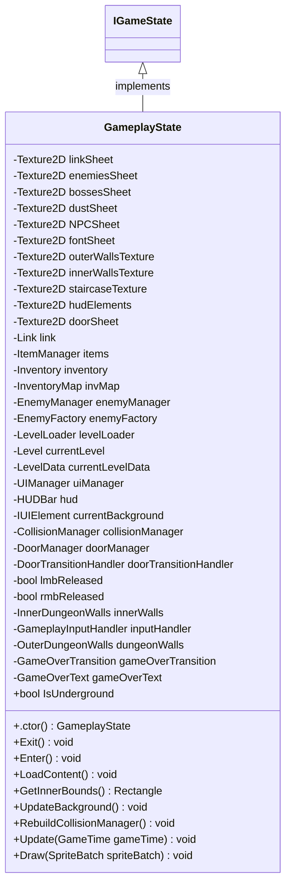

<div id="GameServices-class-diagram"></div>

##### `GameServices` class diagram

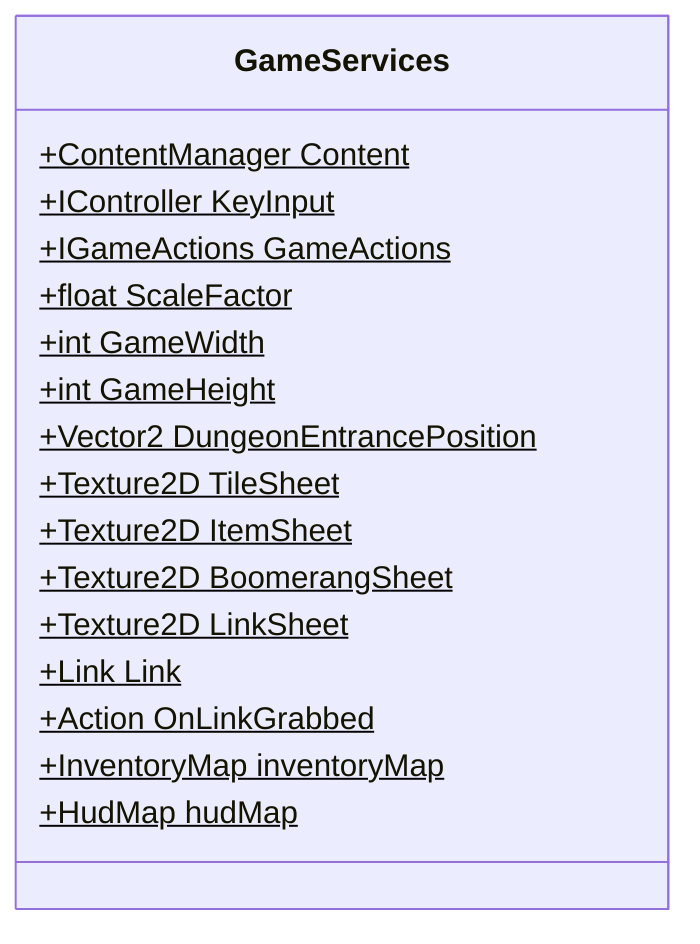

<div id="Level-class-diagram"></div>

##### `Level` class diagram

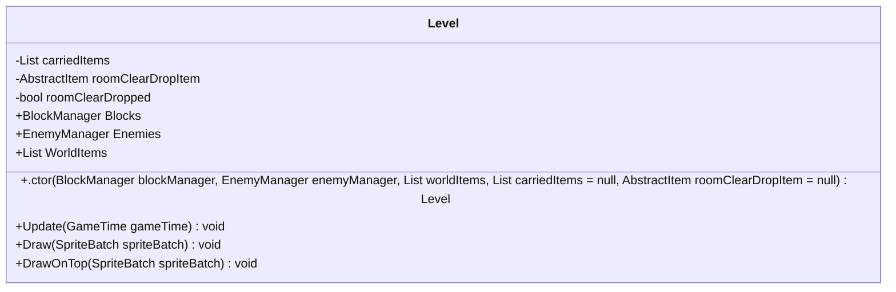

<div id="LevelBuilder-class-diagram"></div>

##### `LevelBuilder` class diagram

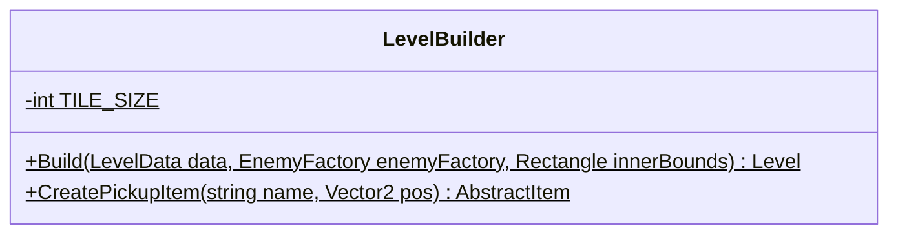

<div id="LevelLoader-class-diagram"></div>

##### `LevelLoader` class diagram

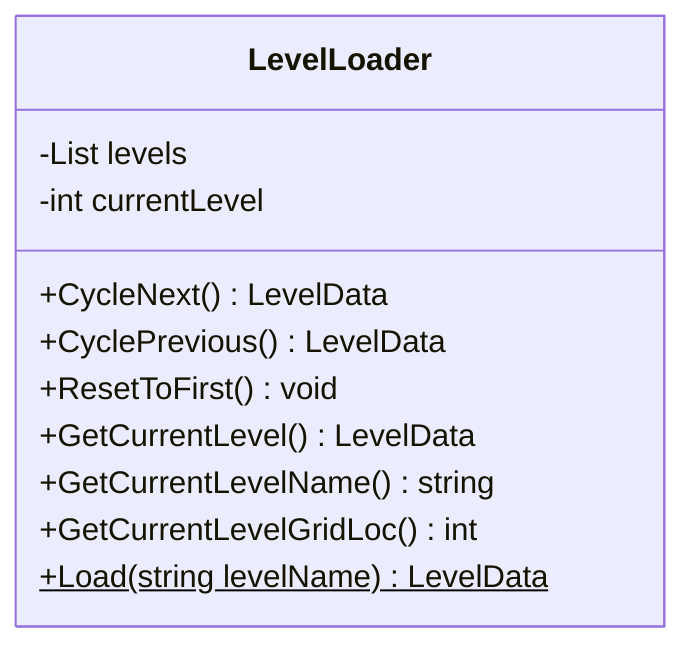

<div id="MenuState-class-diagram"></div>

##### `MenuState` class diagram

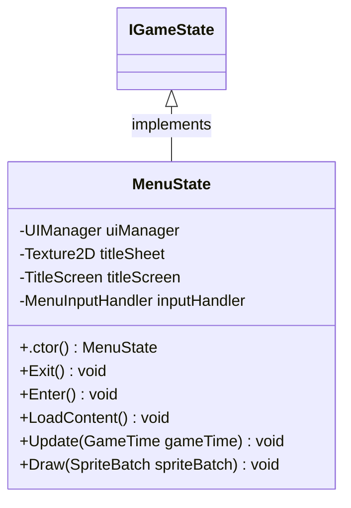

<div id="Enemy-class-diagram"></div>

##### `Enemy` class diagram

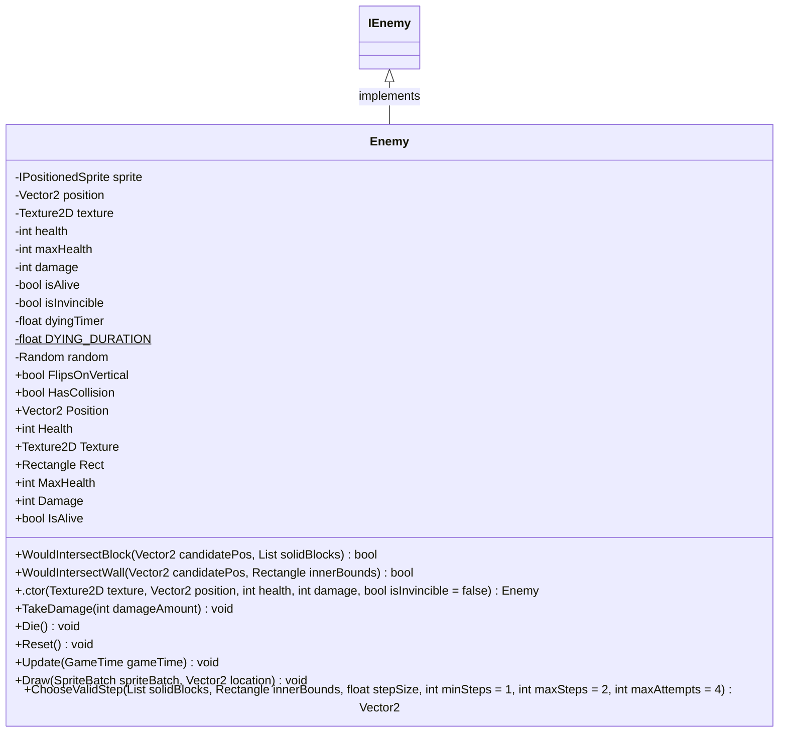

<div id="Block-class-diagram"></div>

##### `Block` class diagram

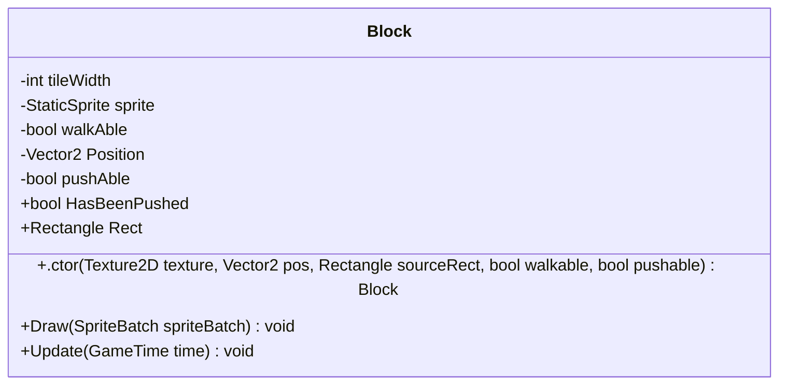

<div id="BlockFactory-class-diagram"></div>

##### `BlockFactory` class diagram

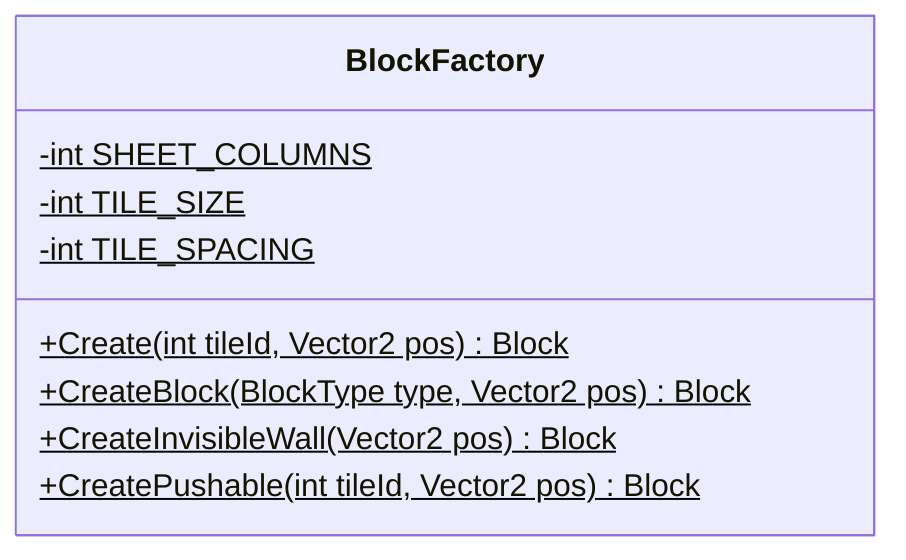

<div id="BlockManager-class-diagram"></div>

##### `BlockManager` class diagram

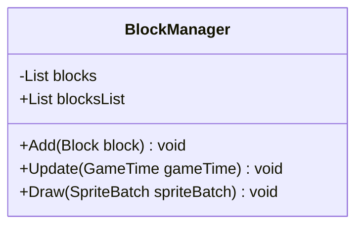

<div id="BlockFactory.BlockType-class-diagram"></div>

##### `BlockFactory.BlockType` class diagram

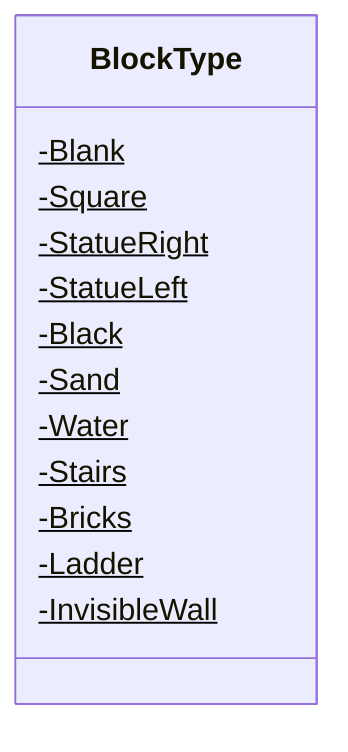

<div id="Attacking-class-diagram"></div>

##### `Attacking` class diagram

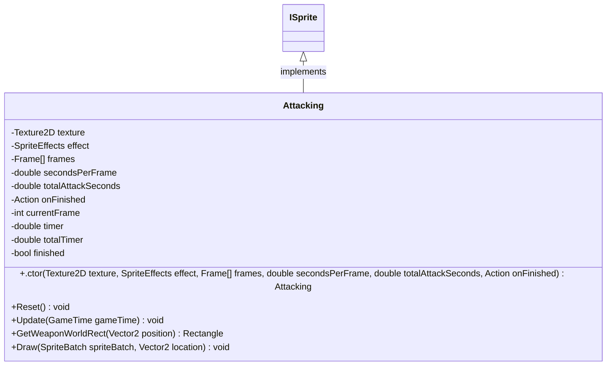

<div id="Dead-class-diagram"></div>

##### `Dead` class diagram

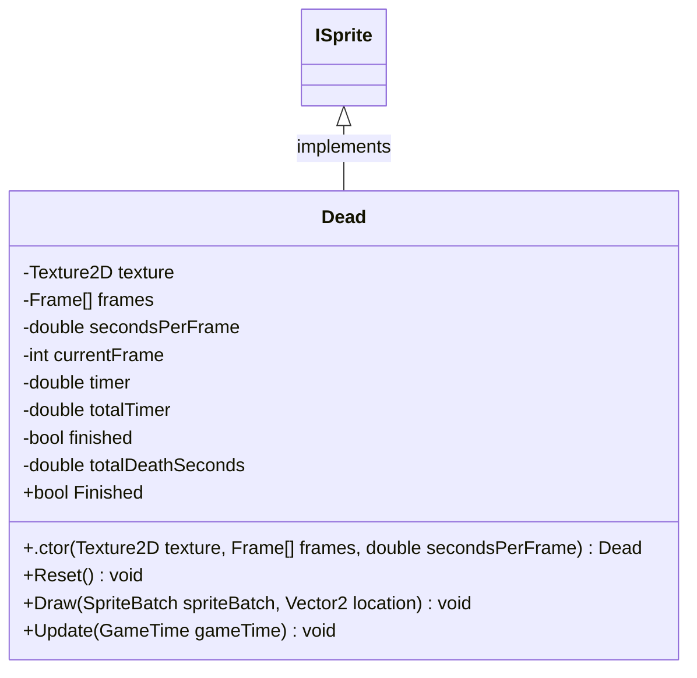

<div id="DeathSparkle-class-diagram"></div>

##### `DeathSparkle` class diagram

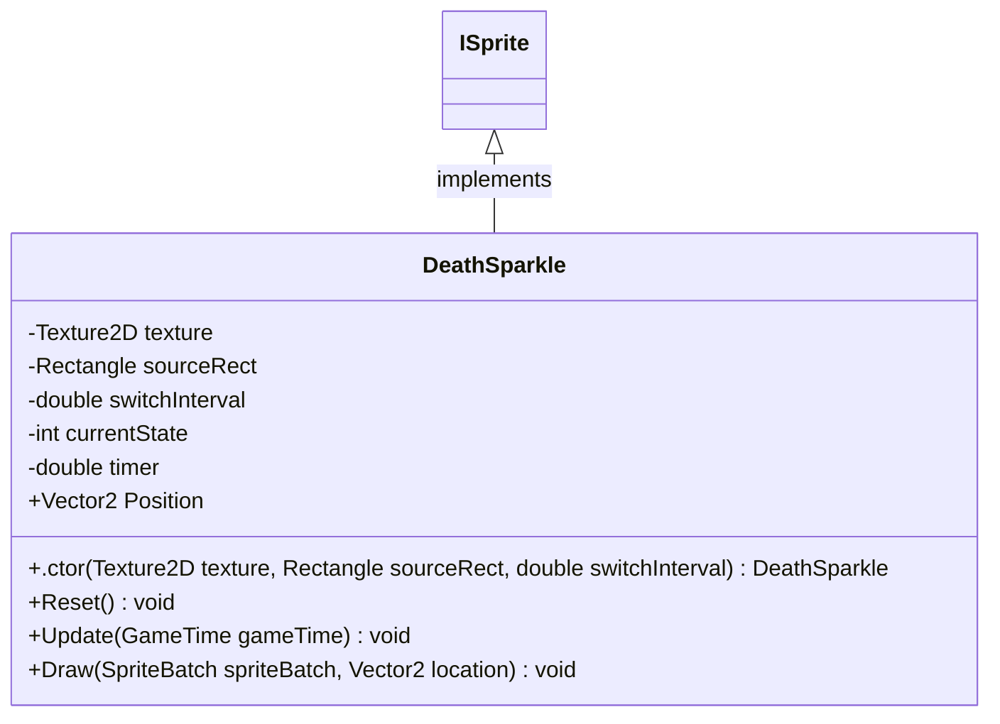

<div id="Link.DeathStage-class-diagram"></div>

##### `Link.DeathStage` class diagram

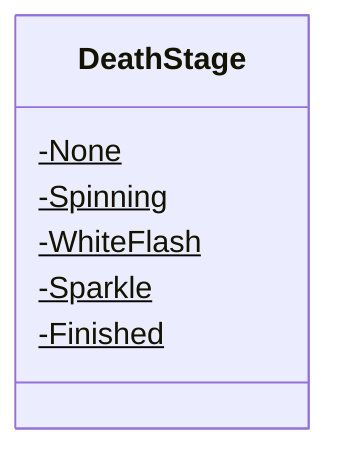

<div id="Directions-class-diagram"></div>

##### `Directions` class diagram

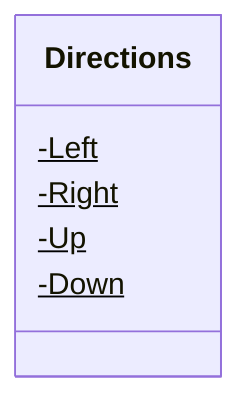

<div id="DirectionsUtils-class-diagram"></div>

##### `DirectionsUtils` class diagram

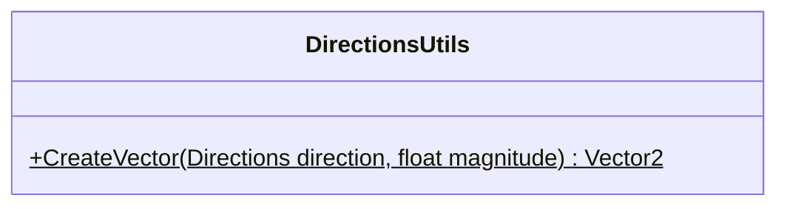

<div id="Attacking.Frame-class-diagram"></div>

##### `Attacking.Frame` class diagram

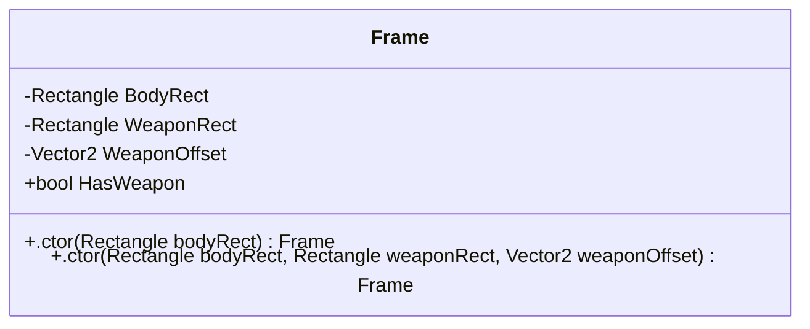

<div id="Dead.Frame-class-diagram"></div>

##### `Dead.Frame` class diagram

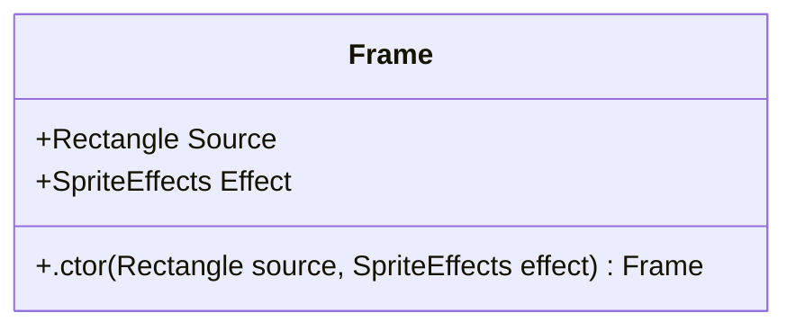

<div id="PickUpItem.Frame-class-diagram"></div>

##### `PickUpItem.Frame` class diagram

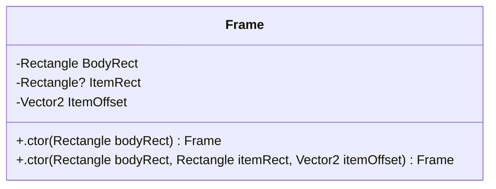

<div id="UseItem.Frame-class-diagram"></div>

##### `UseItem.Frame` class diagram

```mermaid
classDiagram
class Frame{
    -Rectangle BodyRect
    +.ctor(Rectangle bodyRect) Frame
}

```

<div id="Idle-class-diagram"></div>

##### `Idle` class diagram

```mermaid
classDiagram
ISprite <|-- Idle : implements
class Idle{
    -Texture2D texture
    -Rectangle sourceRect
    -SpriteEffects effect
    +.ctor(Texture2D texture, Rectangle sourceRect, SpriteEffects effect) Idle
    +Update(GameTime gameTime) void
    +Draw(SpriteBatch spriteBatch, Vector2 location) void
}

```

<div id="Link-class-diagram"></div>

##### `Link` class diagram

```mermaid
classDiagram
ILink <|-- Link : implements
class Link{
    -float SPEED$
    -float PUSHING_SPEED$
    -float PUSHING_DURATION$
    -int BODY_SIZE$
    -int HAND_X$
    -int HAND_Y$
    -double DAMAGED_DURATION$
    -double BLINK_INTERVAL$
    -int MAX_HEALTH$
    -ISprite IdleUp
    -ISprite IdleDown
    -ISprite IdleLeft
    -ISprite IdleRight
    -ISprite WalkUp
    -ISprite WalkDown
    -ISprite WalkLeft
    -ISprite WalkRight
    -Dead DeadSprite
    -Attacking AttackUp
    -Attacking AttackDown
    -Attacking AttackLeft
    -Attacking AttackRight
    -UseItem UseItemUp
    -UseItem UseItemDown
    -UseItem UseItemLeft
    -UseItem UseItemRight
    -PickUpItem PickUpWeapon
    -PickUpItem PickUpTriforce
    -DeathSparkle DeathSparkleSprite
    -ISprite sprite
    -Vector2 position
    -Vector2 move
    -Directions direction
    -double damagedTimer
    -double pushingTimer
    -int health
    -int rubies
    -int keys
    -bool isAttacking
    -bool isUsingItem
    -bool isDamaged
    -bool isVisible
    -bool isPushing
    -bool isDead
    -bool attackHitLanded
    -Rectangle? pickUpItemRect
    -DeathStage deathStage
    -double deathStageTimer
    +Directions Facing
    +int Health
    +int MaxHealth
    +bool IsPushing
    +bool IsDead
    +bool DeathFinished
    +bool IsGrabbed
    +bool DeathSequenceFinished
    +bool DeathBackgroundBlack
    +Rectangle Rect
    +Rectangle SwordRect
    +Vector2 Position
    +int Rubies
    +int Keys
    +RegisterSwordHit() void
    +AddKey() void
    +UseKey() bool
    +.ctor(Texture2D texture, Texture2D dustTexture, Vector2 position) Link
    +Update(GameTime gameTime) void
    +Draw(SpriteBatch spriteBatch) void
    +StartUseItem() void
    +StartPickUpWeapon(Rectangle itemRect) void
    +StartPickUpTriforce() void
    +SetMove(Directions dir) void
    +StopMove() void
    +StartAttack() void
    +StartPush() void
    +TakeDamage(int amount) void
    +StartDamaged() void
    +StartDeath() void
    +FinishAttack() void
    +FinishPickUpItem() void
    +FinishUseItem() void
    +GetHealed(int amount) void
    +IncreaseRubies(int amount) void
    +SetIdleSprite() void
}

```

<div id="LinkFactory-class-diagram"></div>

##### `LinkFactory` class diagram

```mermaid
classDiagram
class LinkFactory{
    +IdleDown(Texture2D texture)$ ISprite
    +IdleUp(Texture2D texture)$ ISprite
    +IdleLeft(Texture2D texture)$ ISprite
    +IdleRight(Texture2D texture)$ ISprite
    +WalkingDown(Texture2D texture)$ ISprite
    +WalkingUp(Texture2D texture)$ ISprite
    +WalkingLeft(Texture2D texture)$ ISprite
    +WalkingRight(Texture2D texture)$ ISprite
    +UseItemDown(Texture2D texture, Action onFinished)$ UseItem
    +UseItemUp(Texture2D texture, Action onFinished)$ UseItem
    +UseItemLeft(Texture2D texture, Action onFinished)$ UseItem
    +UseItemRight(Texture2D texture, Action onFinished)$ UseItem
    +PickUpWeapon(Texture2D texture, Action onFinished)$ PickUpItem
    +PickUpTriforce(Texture2D texture, Action onFinished)$ PickUpItem
    +AttackDown(Texture2D texture, Action onFinished)$ Attacking
    +AttackUp(Texture2D texture, Action onFinished)$ Attacking
    +AttackLeft(Texture2D texture, Action onFinished)$ Attacking
    +AttackRight(Texture2D texture, Action onFinished)$ Attacking
    +Dead(Texture2D texture)$ Dead
    +WhiteDeadDown(Texture2D texture)$ ISprite
    +DeathSparkle(Texture2D texture)$ DeathSparkle
}

```

<div id="PickUpItem-class-diagram"></div>

##### `PickUpItem` class diagram

```mermaid
classDiagram
ISprite <|-- PickUpItem : implements
class PickUpItem{
    -Texture2D texture
    -SpriteEffects effect
    -Frame[] frames
    -double secondsPerFrame
    -double totalItemSeconds
    -Action onFinished
    -int currentFrame
    -double timer
    -double totalTimer
    -bool finished
    +.ctor(Texture2D texture, SpriteEffects effect, Frame[] frames, double secondsPerFrame, double totalItemSeconds, Action onFinished) PickUpItem
    +Reset() void
    +Update(GameTime gameTime) void
    +Draw(SpriteBatch spriteBatch, Vector2 location) void
}

```

<div id="UseItem-class-diagram"></div>

##### `UseItem` class diagram

```mermaid
classDiagram
ISprite <|-- UseItem : implements
class UseItem{
    -Texture2D texture
    -SpriteEffects effect
    -Frame[] frames
    -double secondsPerFrame
    -double totalItemSeconds
    -Action onFinished
    -int currentFrame
    -double timer
    -double totalTimer
    -bool finished
    +.ctor(Texture2D texture, SpriteEffects effect, Frame[] frames, double secondsPerFrame, double totalItemSeconds, Action onFinished) UseItem
    +Reset() void
    +Update(GameTime gameTime) void
    +Draw(SpriteBatch spriteBatch, Vector2 location) void
}

```

<div id="Walking-class-diagram"></div>

##### `Walking` class diagram

```mermaid
classDiagram
ISprite <|-- Walking : implements
class Walking{
    -Texture2D texture
    -SpriteEffects effect
    -Rectangle[] frames
    -double secondsPerFrame
    -int currentFrame
    -double timer
    +.ctor(Texture2D texture, SpriteEffects effect, Rectangle[] frames, double secondsPerFrame) Walking
    +Update(GameTime gameTime) void
    +Draw(SpriteBatch spriteBatch, Vector2 location) void
}

```

<div id="ActiveItemEnemyCollision-class-diagram"></div>

##### `ActiveItemEnemyCollision` class diagram

```mermaid
classDiagram
ICollisionHandler <|-- ActiveItemEnemyCollision : implements
class ActiveItemEnemyCollision{
    -int PROJECTILE_DAMAGE$
    -int BOMB_DAMAGE$
    -int BOMB_RADIUS$
    -ItemManager itemManager
    -EnemyManager enemyManager
    +.ctor(ItemManager itemManager, EnemyManager enemyManager) ActiveItemEnemyCollision
    +Handle() void
}

```

<div id="CollisionManager-class-diagram"></div>

##### `CollisionManager` class diagram

```mermaid
classDiagram
class CollisionManager{
    -List<ICollisionHandler> handlers
    +Add(ICollisionHandler handler) void
    +HandleAll() void
}

```

<div id="LinkEnemyCollision-class-diagram"></div>

##### `LinkEnemyCollision` class diagram

```mermaid
classDiagram
ICollisionHandler <|-- LinkEnemyCollision : implements
class LinkEnemyCollision{
    -Link link
    -EnemyManager enemyManager
    +.ctor(Link link, EnemyManager enemyManager) LinkEnemyCollision
    +Handle() void
}

```

<div id="LinkEnemyProjectileCollision-class-diagram"></div>

##### `LinkEnemyProjectileCollision` class diagram

```mermaid
classDiagram
ICollisionHandler <|-- LinkEnemyProjectileCollision : implements
class LinkEnemyProjectileCollision{
    -int PROJECTILE_DAMAGE$
    -Link link
    -EnemyManager enemyManager
    +.ctor(Link link, EnemyManager enemyManager) LinkEnemyProjectileCollision
    +Handle() void
}

```

<div id="LinkItemCollision-class-diagram"></div>

##### `LinkItemCollision` class diagram

```mermaid
classDiagram
ICollisionHandler <|-- LinkItemCollision : implements
class LinkItemCollision{
    -ILink link
    -Inventory inventory
    -List<AbstractItem> worldItems
    +.ctor(ILink link, Inventory inventory, List<AbstractItem> worldItems) LinkItemCollision
    +Handle() void
    +HandlePickup(AbstractItem item) void
}

```

<div id="SwordEnemyCollision-class-diagram"></div>

##### `SwordEnemyCollision` class diagram

```mermaid
classDiagram
ICollisionHandler <|-- SwordEnemyCollision : implements
class SwordEnemyCollision{
    -int SWORD_DAMAGE$
    -Link link
    -EnemyManager enemyManager
    +.ctor(Link link, EnemyManager enemyManager) SwordEnemyCollision
    +Handle() void
}

```

<div id="EnemyBlockCollisionHandler-class-diagram"></div>

##### `EnemyBlockCollisionHandler` class diagram

```mermaid
classDiagram
ICollisionHandler <|-- EnemyBlockCollisionHandler : implements
class EnemyBlockCollisionHandler{
    -List<IEnemy> enemies
    -BlockManager blockManager
    +.ctor(List<IEnemy> enemies, BlockManager blockManager) EnemyBlockCollisionHandler
    +Handle() void
    +ResolveCollision(IEnemy enemy, Block block)$ void
}

```

<div id="EnemyWallCollisionHandler-class-diagram"></div>

##### `EnemyWallCollisionHandler` class diagram

```mermaid
classDiagram
ICollisionHandler <|-- EnemyWallCollisionHandler : implements
class EnemyWallCollisionHandler{
    -List<IEnemy> enemies
    -OuterDungeonWalls dungeonWalls
    +.ctor(List<IEnemy> enemies, OuterDungeonWalls dungeonWalls) EnemyWallCollisionHandler
    +Handle() void
    +ResolveCollision(IEnemy enemy, OuterDungeonWalls dungeonWalls)$ void
}

```

<div id="LinkBlockCollisionHandler-class-diagram"></div>

##### `LinkBlockCollisionHandler` class diagram

```mermaid
classDiagram
ICollisionHandler <|-- LinkBlockCollisionHandler : implements
class LinkBlockCollisionHandler{
    -ILink link
    -BlockManager blockManager
    +.ctor(ILink link, BlockManager blockManager) LinkBlockCollisionHandler
    +Handle() void
    +ResolveCollision(ILink link, Block block)$ void
}

```

<div id="LinkBlockPushHandler-class-diagram"></div>

##### `LinkBlockPushHandler` class diagram

```mermaid
classDiagram
ICollisionHandler <|-- LinkBlockPushHandler : implements
class LinkBlockPushHandler{
    -Link link
    -BlockManager blockManager
    -Block movingBlock
    -Vector2 movingTargetPos
    -float PUSH_STEP$
    +.ctor(Link link, BlockManager blockManager) LinkBlockPushHandler
    +Handle() void
    +ResolvePush(Link link, Block block) void
    +UpdateMovingBlock() void
    +FinishPush() void
}

```

<div id="LinkWallCollisionHandler-class-diagram"></div>

##### `LinkWallCollisionHandler` class diagram

```mermaid
classDiagram
ICollisionHandler <|-- LinkWallCollisionHandler : implements
class LinkWallCollisionHandler{
    -ILink link
    -OuterDungeonWalls dungeonWalls
    -DoorManager doorManager
    -Action<string> onDoorExit
    -string pendingExit
    +.ctor(ILink link, OuterDungeonWalls dungeonWalls, DoorManager doorManager, Action<string> onDoorExit = null) LinkWallCollisionHandler
    +Handle() void
    +TryEnterDoor(string direction) bool
}

```

<div id="AttackCommand-class-diagram"></div>

##### `AttackCommand` class diagram

```mermaid
classDiagram
ICommand <|-- AttackCommand : implements
class AttackCommand{
    -Link link
    +.ctor(Link link) AttackCommand
    +Execute() void
}

```

<div id="QuitCommand-class-diagram"></div>

##### `QuitCommand` class diagram

```mermaid
classDiagram
ICommand <|-- QuitCommand : implements
class QuitCommand{
    +Execute() void
}

```

<div id="SetStateCommand-class-diagram"></div>

##### `SetStateCommand` class diagram

```mermaid
classDiagram
ICommand <|-- SetStateCommand : implements
class SetStateCommand{
    -IGameState newState
    +.ctor(IGameState newState) SetStateCommand
    +Execute() void
}

```

<div id="TriggerDamageCommand-class-diagram"></div>

##### `TriggerDamageCommand` class diagram

```mermaid
classDiagram
ICommand <|-- TriggerDamageCommand : implements
class TriggerDamageCommand{
    -Link link
    +.ctor(Link link) TriggerDamageCommand
    +Execute() void
}

```

<div id="UseItemCommand-class-diagram"></div>

##### `UseItemCommand` class diagram

```mermaid
classDiagram
ICommand <|-- UseItemCommand : implements
class UseItemCommand{
    -ItemManager itemManager
    -Inventory inventory
    -ILink link
    -int slot
    +.ctor(ItemManager itemManager, Inventory inventory, ILink link, int slot) UseItemCommand
    +Execute() void
}

```

<div id="Aquamentus-class-diagram"></div>

##### `Aquamentus` class diagram

```mermaid
classDiagram
class Aquamentus{
    -int HEALTH$
    -int DAMAGE$
    -Vector2 velocity
    -float MOVE_SPEED$
    -float directionChangeTimer
    -float DIRECTION_SWAP_MIN$
    -float DIRECTION_SWAP_MAX$
    -float moveDirectionTimer
    -bool moveLeft
    -EnemyProjectileFactory projectileFactory
    -List<AquamentusFireball> activeFireballs
    -float fireballTimer
    -float FIREBALL_INTERVAL$
    +IReadOnlyList<AquamentusFireball> ActiveFireballs
    +.ctor(Texture2D texture, Vector2 position, List<Block> solidBlocks, Rectangle innerBounds) Aquamentus
    +Update(GameTime gameTime) void
    +Draw(SpriteBatch spriteBatch, Vector2 location) void
    +SpawnFireballs() void
    +GetRandomFloat(float min, float max) float
}

```

<div id="AquamentusFireball-class-diagram"></div>

##### `AquamentusFireball` class diagram

```mermaid
classDiagram
IPositionedSprite <|-- AquamentusFireball : implements
class AquamentusFireball{
    -IPositionedSprite sprite
    -Vector2 position
    -Vector2 velocity
    -float lifetime
    -float MAX_LIFETIME$
    -float SPEED$
    -int SOURCE_WIDTH$
    -int SOURCE_HEIGHT$
    +bool IsActive
    +Rectangle Rect
    +Vector2 Position
    +.ctor(Texture2D texture, Vector2 startPosition, Vector2 direction) AquamentusFireball
    +Update(GameTime gameTime) void
    +Draw(SpriteBatch spriteBatch, Vector2 location) void
}

```

<div id="Dodongo.Direction-class-diagram"></div>

##### `Dodongo.Direction` class diagram

```mermaid
classDiagram
class Direction{
    -Up$
    -Down$
    -Left$
    -Right$
}

```

<div id="Goriya.Direction-class-diagram"></div>

##### `Goriya.Direction` class diagram

```mermaid
classDiagram
class Direction{
    -Up$
    -Down$
    -Left$
    -Right$
}

```

<div id="Dodongo-class-diagram"></div>

##### `Dodongo` class diagram

```mermaid
classDiagram
class Dodongo{
    -DodongoState currentState
    -int HEALTH$
    -int DAMAGE$
    -float STEP_SIZE$
    -float STEP_DELAY$
    -float MOVE_SPEED$
    -float FLIP_INTERVAL$
    -float BOMB_STUN_DURATION$
    -Direction currentDirection
    -Vector2 targetPosition
    -float stepTimer
    -float flipTimer
    -float bombStunTimer
    -bool spriteHorizontalFlip
    -int[] upFrames
    -int[] downFrames
    -int[] sideFrames
    -int[] bombedUpFrame
    -int[] bombedDownFrame
    -int[] bombedSideFrame
    -List<Block> solidBlocks
    -Rectangle innerBounds
    +bool FlipsOnVertical
    +.ctor(Texture2D texture, Vector2 position, List<Block> solidBlocks, Rectangle innerBounds) Dodongo
    +Update(GameTime gameTime) void
    +UpdateWalking(float deltaTime) void
    +UpdateBombEaten(float deltaTime) void
    +EatBomb() void
    +ChooseNextStep() void
    +GetDirectionTo(Vector2 target) Direction
    +UpdateSprite() void
    +UpdateBombedSprite(DirectionalAnimatedSprite dirSprite, int sheetY, float frameTime) void
    +UpdateWalkingSprite(DirectionalAnimatedSprite dirSprite, int sheetY, float frameTime) void
    +Reset() void
}

```

<div id="Dodongo.DodongoState-class-diagram"></div>

##### `Dodongo.DodongoState` class diagram

```mermaid
classDiagram
class DodongoState{
    -Walking$
    -BombEaten$
}

```

<div id="FlameLeft-class-diagram"></div>

##### `FlameLeft` class diagram

```mermaid
classDiagram
class FlameLeft{
    -int HEALTH$
    -int DAMAGE$
    +.ctor(Texture2D texture, Vector2 position) FlameLeft
    +TakeDamage(int damageAmount) void
    +Die() void
}

```

<div id="FlameRight-class-diagram"></div>

##### `FlameRight` class diagram

```mermaid
classDiagram
class FlameRight{
    -int HEALTH$
    -int DAMAGE$
    +.ctor(Texture2D texture, Vector2 position) FlameRight
    +TakeDamage(int damageAmount) void
    +Die() void
}

```

<div id="Gel-class-diagram"></div>

##### `Gel` class diagram

```mermaid
classDiagram
class Gel{
    -int HEALTH$
    -int DAMAGE$
    -Vector2 velocity
    -float turnTimer
    -float TURN_SPEED$
    -float TURN_INTERVAL$
    -float MOVE_SPEED$
    -List<Block> solidBlocks
    -Rectangle innerBounds
    +.ctor(Texture2D texture, Vector2 position, List<Block> solidBlocks, Rectangle innerBounds) Gel
    +Update(GameTime gameTime) void
    +Reset() void
    +GetRandomTurnDirection() Vector2
}

```

<div id="Goriya-class-diagram"></div>

##### `Goriya` class diagram

```mermaid
classDiagram
class Goriya{
    -GoriyaState currentState
    -int HEALTH$
    -int DAMAGE$
    -float STEP_SIZE$
    -float STEP_DELAY$
    -float MOVE_SPEED$
    -float THROW_COOLDOWN_MIN$
    -float THROW_COOLDOWN_MAX$
    -List<Block> solidBlocks
    -Rectangle innerBounds
    -Direction currentDirection
    -Vector2 targetPosition
    -float stepTimer
    -float throwTimer
    -bool spriteHorizontalFlip
    -float flipTimer
    -float FLIP_INTERVAL$
    -Boomerang activeBoomerang
    -ContentManager contentManager
    -int[] upFrames
    -int[] downFrames
    -int[] sideFrames
    -int[] throwFrame
    +Boomerang ActiveBoomerang
    +bool FlipsOnVertical
    +.ctor(Texture2D texture, Vector2 position, ContentManager content, List<Block> solidBlocks, Rectangle innerBounds) Goriya
    +Update(GameTime gameTime) void
    +Draw(SpriteBatch spriteBatch, Vector2 location) void
    +UpdateWalking(float deltaTime) void
    +UpdateThrowing(float deltaTime) void
    +ThrowBoomerang() void
    +IsBoomerangActive() bool
    +ChooseNextStep() void
    +GetDirectionTo(Vector2 target) Direction
    +UpdateSprite() void
    +GetRandomThrowTime() float
}

```

<div id="Goriya.GoriyaState-class-diagram"></div>

##### `Goriya.GoriyaState` class diagram

```mermaid
classDiagram
class GoriyaState{
    -Walking$
    -Throwing$
}

```

<div id="Keese-class-diagram"></div>

##### `Keese` class diagram

```mermaid
classDiagram
class Keese{
    -int HEALTH$
    -int DAMAGE$
    -float MOVE_SPEED$
    -float REST_TIME_MIN$
    -float REST_TIME_MAX$
    -float MOVE_TIME_MIN$
    -float MOVE_TIME_MAX$
    -Vector2 moveDirection
    -float actionTimer
    -float actionDuration
    -bool isResting
    -IPositionedSprite flyingSprite
    -IPositionedSprite restingSprite
    -Rectangle innerBounds
    +bool HasCollision
    +.ctor(Texture2D texture, Vector2 position, Rectangle innerBounds) Keese
    +Update(GameTime gameTime) void
    +ChooseRandomDirection() void
    +GetRandomFloat(float min, float max) float
}

```

<div id="OldMan-class-diagram"></div>

##### `OldMan` class diagram

```mermaid
classDiagram
class OldMan{
    -int HEALTH$
    -int DAMAGE$
    +.ctor(Texture2D texture, Vector2 position) OldMan
    +TakeDamage(int damageAmount) void
    +Die() void
}

```

<div id="Rope-class-diagram"></div>

##### `Rope` class diagram

```mermaid
classDiagram
class Rope{
    -int ROPE_HEALTH$
    -int ROPE_DAMAGE$
    -float PATROL_SPEED$
    -float CHARGE_SPEED$
    -float DIRECTION_CHANGE_MIN$
    -float DIRECTION_CHANGE_MAX$
    -float CHARGE_DURATION$
    -Vector2 moveDirection
    -bool isCharging
    -float chargeTimer
    -float directionChangeTimer
    -float directionChangeDuration
    -bool facingLeft
    -List<Block> solidBlocks
    -Rectangle innerBounds
    -int[] frameXPositions
    +.ctor(Texture2D texture, Vector2 position, List<Block> solidBlocks, Rectangle innerBounds) Rope
    +Update(GameTime gameTime) void
    +ChooseRandomCardinalDirection() void
    +UpdateSpriteFlip() void
    +GetRandomFloat(float min, float max) float
}

```

<div id="Stalfos-class-diagram"></div>

##### `Stalfos` class diagram

```mermaid
classDiagram
class Stalfos{
    -int STALFOS_HEALTH$
    -int STALFOS_DAMAGE$
    -float MOVE_SPEED$
    -Vector2 velocity
    -float directionChangeTimer
    -float DIRECTION_CHANGE_INTERVAL$
    -Rectangle sourceRect
    -bool isFlipped
    -float flipTimer
    -float FLIP_INTERVAL$
    -List<Block> solidBlocks
    -Rectangle innerBounds
    +.ctor(Texture2D texture, Vector2 position, List<Block> solidBlocks, Rectangle innerBounds) Stalfos
    +GetRandomCardinalDirection() Vector2
    +Update(GameTime gameTime) void
    +Draw(SpriteBatch spriteBatch, Vector2 location) void
}

```

<div id="Trap-class-diagram"></div>

##### `Trap` class diagram

```mermaid
classDiagram
class Trap{
    -int TRAP_HEALTH$
    -int TRAP_DAMAGE$
    -float CHARGE_SPEED$
    -float RETRACT_SPEED$
    -TrapState currentState
    -Vector2 homePosition
    -Vector2 chargeDirection
    -Vector2 chargeTarget
    -bool sameRow
    -bool sameColumn
    +.ctor(Texture2D texture, Vector2 position) Trap
    +Update(GameTime gameTime) void
    +UpdateIdle() void
    +UpdateCharging(float deltaTime) void
    +UpdateRetracting(float deltaTime) void
    +StartCharge() void
    +TakeDamage(int damageAmount) void
    +Die() void
    +Reset() void
}

```

<div id="Trap.TrapState-class-diagram"></div>

##### `Trap.TrapState` class diagram

```mermaid
classDiagram
class TrapState{
    -Idle$
    -Charging$
    -Retracting$
}

```

<div id="WallMaster-class-diagram"></div>

##### `WallMaster` class diagram

```mermaid
classDiagram
class WallMaster{
    -int WALLMASTER_HEALTH$
    -int WALLMASTER_DAMAGE$
    -float CREEP_SPEED$
    -float DETECTION_RANGE$
    -float GRAB_RANGE$
    -float ENTER_SPEED$
    -float LEAVE_SPEED$
    -float CHASE_DURATION$
    -float REENTER_MIN$
    -float REENTER_MAX$
    -WallMasterState currentState
    -Vector2 homePosition
    -Vector2 entryStart
    -Vector2 entryTarget
    -Vector2 leaveTarget
    -bool movingVertically
    -float chaseTimer
    -float cooldownTimer
    -Rectangle innerBounds
    -float CREEP_STEP_SIZE$
    -float CREEP_STEP_DELAY$
    -Vector2 creepTarget
    -float stepTimer
    -List<Block> solidBlocks
    -Vector2 linkGrabOffset
    -bool isGrabbingLink
    +bool IsEntering
    +bool HasCollision
    +.ctor(Texture2D texture, Vector2 position, List<Block> solidBlocks, Rectangle innerBounds) WallMaster
    +SetupEntry(Vector2 spawnPosition) void
    +DetermineEntryDirection(Vector2 spawnPosition) Vector2
    +ChooseNewWallPosition() Vector2
    +Update(GameTime gameTime) void
    +UpdateHiding() void
    +UpdateEntering(float deltaTime) void
    +UpdateCreeping(float deltaTime) void
    +UpdateChasing(float deltaTime) void
    +UpdateLeaving(float deltaTime) void
    +UpdateCooldown(float deltaTime) void
    +DetermineLeaveTarget() Vector2
    +Draw(SpriteBatch spriteBatch, Vector2 location) void
    +Reset() void
}

```

<div id="WallMaster.WallMasterState-class-diagram"></div>

##### `WallMaster.WallMasterState` class diagram

```mermaid
classDiagram
class WallMasterState{
    -Hiding$
    -Entering$
    -Creeping$
    -Chasing$
    -Leaving$
    -Cooldown$
}

```

<div id="Zol-class-diagram"></div>

##### `Zol` class diagram

```mermaid
classDiagram
class Zol{
    -int ZOL_HEALTH$
    -int ZOL_DAMAGE$
    -float BOUNCE_SPEED$
    -float BOUNCE_INTERVAL$
    -float AIR_TIME$
    -Vector2 velocity
    -float turnTimer
    -float TURN_SPEED$
    -float TURN_INTERVAL$
    -float MOVE_SPEED$
    -List<Block> solidBlocks
    -Rectangle innerBounds
    +.ctor(Texture2D texture, Vector2 position, List<Block> solidBlocks, Rectangle innerBounds) Zol
    +Update(GameTime gameTime) void
    +Reset() void
    +GetRandomTurnDirection() Vector2
}

```

<div id="KeyboardController-class-diagram"></div>

##### `KeyboardController` class diagram

```mermaid
classDiagram
IController <|-- KeyboardController : implements
class KeyboardController{
    -KeyboardState previous
    -KeyboardState current
    +.ctor() KeyboardController
    +Update() void
    +IsKeyPressed(Keys key) bool
    +IsKeyDown(Keys key) bool
    +IsKeyReleased(Keys key) bool
    +IsKeyUp(Keys key) bool
    +Reset() void
}

```

<div id="DoorBlock-class-diagram"></div>

##### `DoorBlock` class diagram

```mermaid
classDiagram
class DoorBlock{
    -Dictionary<string, int> TypeColumn$
    -Dictionary<string, (int width, int height, int rowX, int rowY)> DirectionInfo$
    -Dictionary<string, Vector2> DoorOrigins$
    -Texture2D texture
    -Vector2 destination
    -float scale
    -int spriteWidth
    -int spriteHeight
    -int rowX
    -int rowY
    +.ctor(Texture2D texture, string direction, float scale, float hudHeight, Vector2? customOrigin = null) DoorBlock
    +Draw(SpriteBatch spriteBatch, string type) void
}

```

<div id="DoorManager-class-diagram"></div>

##### `DoorManager` class diagram

```mermaid
classDiagram
class DoorManager{
    -string[] AllDirections$
    -Texture2D doorTexture
    -float scale
    -float hudHeight
    -string currentRoomName
    -Dictionary<string, string> targets
    -Dictionary<string, string> configuredTypes
    -Dictionary<string, bool> unlocked
    -Dictionary<string, DoorBlock> doorBlocks
    -Dictionary<string, Vector2> DoorCenters$
    +.ctor(Texture2D doorTexture, float scale, float hudHeight) DoorManager
    +Reset(Dictionary<string, string> newTargets, Dictionary<string, string> newTypes, Dictionary<string, int[]> doorOffsets = null, string roomName = null) void
    +OppositeDirection(string direction)$ string
    +RegisterUnlock(string direction) void
    +HasDoor(string direction) bool
    +GetTarget(string direction) string
    +GetDoorType(string direction) string
    +IsLocked(string direction) bool
    +UnlockEnemyDoors() void
    +TryUnlockBomb(Vector2 explosionCenter, float radius) void
    +TryExit(string direction, ILink link) bool
    +Draw(SpriteBatch spriteBatch) void
}

```

<div id="DoorStateRegistry-class-diagram"></div>

##### `DoorStateRegistry` class diagram

```mermaid
classDiagram
class DoorStateRegistry{
    -HashSet<(string room, string direction)> _unlocked$
    +Unlock(string room, string direction)$ void
    +IsUnlocked(string room, string direction)$ bool
    +Reset()$ void
}

```

<div id="DoorTransitionHandler-class-diagram"></div>

##### `DoorTransitionHandler` class diagram

```mermaid
classDiagram
class DoorTransitionHandler{
    -DoorManager doorManager
    -ILink link
    -Func<Rectangle> getInnerBounds
    -Func<int> getTopDoorLeft
    -Func<int> getTopDoorRight
    -Func<int> getSideDoorTop
    -Func<int> getSideDoorBottom
    -LevelLoader levelLoader
    -EnemyFactory enemyFactory
    -Action<LevelData, Level> onRoomChanged
    -Action onRebuildCollision
    -Action<string> updateLinkMapPos
    -Action<LevelData, string> updateInventoryMap
    +.ctor(DoorManager doorManager, ILink link, Func<Rectangle> getInnerBounds, Func<int> getTopDoorLeft, Func<int> getTopDoorRight, Func<int> getSideDoorTop, Func<int> getSideDoorBottom, LevelLoader levelLoader, EnemyFactory enemyFactory, Action<LevelData, Level> onRoomChanged, Action onRebuildCollision, Action<string> updateLinkMapPos, Action<LevelData, string> updateInventoryMap) DoorTransitionHandler
    +Handle(string exitDirection) void
}

```

<div id="EnemyEffectWrapper-class-diagram"></div>

##### `EnemyEffectWrapper` class diagram

```mermaid
classDiagram
IEnemy <|-- EnemyEffectWrapper : implements
class EnemyEffectWrapper{
    -IEnemy enemy
    -ISprite spawnSprite
    -ISprite deathSprite
    -AbstractItem droppedItem
    -Action<AbstractItem> onItemDropped
    -bool itemDropped
    -float spawnTimer
    -float dyingTimer
    -float SPAWN_DURATION$
    -float DYING_DURATION$
    +IEnemy InnerEnemy
    +bool IsSpawningPublic
    +bool HasCollision
    +Vector2 Position
    +Rectangle Rect
    +int Health
    +bool IsSpawning
    +int MaxHealth
    +int Damage
    +bool IsAlive
    +bool IsDyingAnimation
    +.ctor(IEnemy enemy, ISprite spawnSprite, ISprite deathSprite, AbstractItem droppedItem = null, Action<AbstractItem> onItemDropped = null) EnemyEffectWrapper
    +TakeDamage(int amount) void
    +Die() void
    +ToString() string
    +ResetSpawnTimer() void
    +Reset() void
    +Update(GameTime gameTime) void
    +Draw(SpriteBatch spriteBatch, Vector2 location) void
}

```

<div id="EnemyFactory-class-diagram"></div>

##### `EnemyFactory` class diagram

```mermaid
classDiagram
class EnemyFactory{
    -Texture2D enemySpriteSheet
    -Texture2D bossSpriteSheet
    -Texture2D linkSheet
    -Texture2D dustSheet
    -Texture2D NPCSheet
    -ContentManager contentManager
    -Random Rng$
    +.ctor(Texture2D enemySpriteSheet, Texture2D bossSpriteSheet, Texture2D linkSheet, Texture2D dustSheet, Texture2D NPCSheet) EnemyFactory
    +CreateDrop(EnemyType type)$ AbstractItem
    +RollRandomDrop()$ AbstractItem
    +CreateEnemy(EnemyType type, Vector2 position, List<Block> solidBlocks, Rectangle innerBounds, Action<AbstractItem> onItemDropped = null, bool skipRandomDrop = false) IEnemy
    +WrapWithEffects(IEnemy enemy, Vector2 position, bool skipSpawnCloud = false, AbstractItem droppedItem = null, Action<AbstractItem> onItemDropped = null) EnemyEffectWrapper
}

```

<div id="EnemyManager-class-diagram"></div>

##### `EnemyManager` class diagram

```mermaid
classDiagram
class EnemyManager{
    -List<IEnemy> enemies
    -int currentEnemyIndex
    -IEnemy currentEnemy
    +List<IEnemy> enemyList
    +bool AllDead
    +.ctor() EnemyManager
    +AddEnemy(IEnemy enemy) void
    +Update(GameTime gameTime) void
    +Draw(SpriteBatch spriteBatch) void
    +DrawOnTop(SpriteBatch spriteBatch) void
    +DrawBehindBlocks(SpriteBatch spriteBatch) void
    +Reset() void
    +GetCurrentEnemy() IEnemy
    +GetEnemyCount() int
    +GetCurrentIndex() int
}

```

<div id="EnemyProjectileFactory-class-diagram"></div>

##### `EnemyProjectileFactory` class diagram

```mermaid
classDiagram
class EnemyProjectileFactory{
}

```

<div id="EnemyType-class-diagram"></div>

##### `EnemyType` class diagram

```mermaid
classDiagram
class EnemyType{
    -Keese$
    -Stalfos$
    -Gel$
    -Zol$
    -Goriya$
    -WallMaster$
    -Trap$
    -Rope$
    -Aquamentus$
    -Dodongo$
    -OldMan$
    -FlameLeft$
    -FlameRight$
}

```

<div id="ProjectileType-class-diagram"></div>

##### `ProjectileType` class diagram

```mermaid
classDiagram
class ProjectileType{
    -AquamentusFireball$
}

```

<div id="GameOverTransition-class-diagram"></div>

##### `GameOverTransition` class diagram

```mermaid
classDiagram
class GameOverTransition{
    -Rectangle gameplayBounds
    -Phase phase
    -float timer
    -float blackOutDegree
    -Texture2D pixel
    -GameOverText gameOverText
    -float transitionSpeed$
    -double gameOverDisplayDuration$
    +bool Active
    +bool Finished
    +.ctor(Rectangle gameplayBounds, GraphicsDevice graphicsDevice, GameOverText text) GameOverTransition
    +Start() void
    +Reset() void
    +Update(GameTime gameTime, Link link) void
    +DrawBlackOut(SpriteBatch spriteBatch) void
    +DrawGameOverText(SpriteBatch spriteBatch) void
}

```

<div id="InventoryScreen-class-diagram"></div>

##### `InventoryScreen` class diagram

```mermaid
classDiagram
IGameState <|-- InventoryScreen : implements
class InventoryScreen{
    -Inventory inventory
    -InventoryBar inventoryBar
    -int activeSlot
    -MapBar mapBar
    -HUDBar hud
    -int hudOriginalX
    -int hudOriginalY
    -IGameState restoreState
    +.ctor(Inventory inventory, int activeSlot, HUDBar hud, InventoryMap invMap, IGameState restoreState) InventoryScreen
    +Update(GameTime time) void
    +Draw(SpriteBatch sb) void
    +Exit() void
    +Enter() void
    +LoadContent() void
}

```

<div id="GameOverTransition.Phase-class-diagram"></div>

##### `GameOverTransition.Phase` class diagram

```mermaid
classDiagram
class Phase{
    -None$
    -WaitingForLinkDeath$
    -BlackingOut$
    -ShowingGameOver$
    -Finished$
}

```

<div id="HeartDisplay-class-diagram"></div>

##### `HeartDisplay` class diagram

```mermaid
classDiagram
class HeartDisplay{
    -float HEART_WIDTH$
    -float GAP$
    -float SCALE$
    -Vector2 origin
    -int capacity
    -List<StillItem> emptyHearts
    -List<StillItem> halfHearts
    -List<StillItem> fullHearts
    +.ctor(Vector2 origin, int capacity) HeartDisplay
    +Draw(int health, int maxHealth, SpriteBatch sb) void
}

```

<div id="HudMap-class-diagram"></div>

##### `HudMap` class diagram

```mermaid
classDiagram
class HudMap{
    -int WIDTH$
    -int HEIGHT$
    -int MAP_Y_OFFSET$
    -int NODE_WIDTH$
    -int NODE_HEIGHT$
    -int DOT_X_OFFSET$
    -int ROWS$
    -int COLS$
    -Texture2D spriteSheet$
    -Rectangle nodeTextureMask$
    -Rectangle disabledTextureMask$
    -Rectangle frameTextureMask$
    -Rectangle linkDotMask$
    -Rectangle triforceDotMask$
    -StaticSprite frame
    -NumberDisplay levelNumber
    -StaticSprite disabledOverlay
    -StaticSprite[,] map
    -StaticSprite linkDot
    -StaticSprite triforceDot
    -int startingRoomPos
    -int linkPos
    -int triforcePos
    +int X
    +int Y
    +bool Enabled
    +bool ShowTriforceLoc
    +int LevelNum
    +.ctor(int x, int y, string startingRoomName, int startingRoomPos, int linkPos, int triforcePos, bool enabled, bool showTriforceLoc, int levelNum = 1) HudMap
    +UpdateLinkMapPos(string direction) void
    +SetLinkPos(int newPos) void
    +Draw(SpriteBatch sb) void
    +Update(GameTime time) void
    +fillMap(Node node, int row, int col) void
    +drawMap(SpriteBatch sb) void
    +getPosition(int row, int col) Vector2
    +getDotPosition(int pos) Vector2
    +getDotPosition(int row, int col) Vector2
    +getRow(int pos) int
    +getCol(int pos) int
}

```

<div id="MapGraph-class-diagram"></div>

##### `MapGraph` class diagram

```mermaid
classDiagram
class MapGraph{
    +buildGraph(string startingRoomName)$ Node
    +processRoom(string roomName, Dictionary<string, Node> visited)$ Node
}

```

<div id="MapGraph.Node-class-diagram"></div>

##### `MapGraph.Node` class diagram

```mermaid
classDiagram
class Node{
    -string roomName
    -Node north
    -Node south
    -Node west
    -Node east
}

```

<div id="TwoDigitDisplay-class-diagram"></div>

##### `TwoDigitDisplay` class diagram

```mermaid
classDiagram
IUIElement <|-- TwoDigitDisplay : implements
class TwoDigitDisplay{
    -Texture2D spriteSheet
    -Vector2 tensPos
    -Vector2 onesPos
    -NumberDisplay symbol
    -NumberDisplay tens
    -NumberDisplay ones
    +.ctor(Vector2 symbolPos, Vector2 tensPos, Vector2 onesPos, Texture2D spriteSheet) TwoDigitDisplay
    +Draw(SpriteBatch sb) void
    +SetNumber(int newNumber) void
    +Update(GameTime time) void
}

```

<div id="GameplayInputHandler-class-diagram"></div>

##### `GameplayInputHandler` class diagram

```mermaid
classDiagram
IInputHandler <|-- GameplayInputHandler : implements
class GameplayInputHandler{
    -GameplayState state
    -Link link
    -Inventory inventory
    -ItemManager items
    -HUDBar hud
    -InventoryMap invMap
    -Dictionary<Keys, ICommand> commands
    +.ctor(GameplayState thisState, Link link, Inventory inventory, ItemManager items, HUDBar hud, InventoryMap invMap) GameplayInputHandler
    +HandleInput() void
}

```

<div id="MenuInputHandler-class-diagram"></div>

##### `MenuInputHandler` class diagram

```mermaid
classDiagram
IInputHandler <|-- MenuInputHandler : implements
class MenuInputHandler{
    -Dictionary<Keys, ICommand> commands
    +.ctor() MenuInputHandler
    +HandleInput() void
}

```

<div id="ICollisionHandler-class-diagram"></div>

##### `ICollisionHandler` class diagram

```mermaid
classDiagram
class ICollisionHandler{
    +Handle()* void
}

```

<div id="ICommand-class-diagram"></div>

##### `ICommand` class diagram

```mermaid
classDiagram
class ICommand{
    +Execute()* void
}

```

<div id="IController-class-diagram"></div>

##### `IController` class diagram

```mermaid
classDiagram
class IController{
    +Update()* void
    +Reset()* void
    +IsKeyDown(Keys key)* bool
    +IsKeyPressed(Keys key)* bool
    +IsKeyReleased(Keys key)* bool
}

```

<div id="IEnemy-class-diagram"></div>

##### `IEnemy` class diagram

```mermaid
classDiagram
IPositionedSprite <|-- IEnemy : implements
class IEnemy{
    +Rectangle Rect*
    +int Health*
    +int MaxHealth*
    +int Damage*
    +bool IsAlive*
    +bool HasCollision*
    +TakeDamage(int damageAmount)* void
    +Die()* void
    +Reset()* void
}

```

<div id="IGameActions-class-diagram"></div>

##### `IGameActions` class diagram

```mermaid
classDiagram
class IGameActions{
    +Quit()* void
    +ChangeState(IGameState newState)* void
}

```

<div id="IGameState-class-diagram"></div>

##### `IGameState` class diagram

```mermaid
classDiagram
class IGameState{
    +Enter()* void
    +Exit()* void
    +LoadContent()* void
    +Update(GameTime gameTime)* void
    +Draw(SpriteBatch spriteBatch)* void
}

```

<div id="IInputHandler-class-diagram"></div>

##### `IInputHandler` class diagram

```mermaid
classDiagram
class IInputHandler{
    +HandleInput()* void
}

```

<div id="IItem-class-diagram"></div>

##### `IItem` class diagram

```mermaid
classDiagram
IPositionedSprite <|-- IItem : implements
class IItem{
    +string Name*
    +Rectangle Rect*
    +bool IsCollected*
    +OnCollect(ILink link)* void
}

```

<div id="ILink-class-diagram"></div>

##### `ILink` class diagram

```mermaid
classDiagram
class ILink{
    +Vector2 Position*
    +Rectangle Rect*
    +Directions Facing*
    +int Health*
    +int MaxHealth*
    +Rectangle SwordRect*
    +int Keys*
    +bool IsGrabbed*
    +StartAttack()* void
    +StartUseItem()* void
    +StartPickUpWeapon(Rectangle itemRect)* void
    +StartPickUpTriforce()* void
    +AddKey()* void
    +UseKey()* bool
    +TakeDamage(int amount)* void
    +GetHealed(int amount)* void
    +IncreaseRubies(int amount)* void
}

```

<div id="IPositionedSprite-class-diagram"></div>

##### `IPositionedSprite` class diagram

```mermaid
classDiagram
ISprite <|-- IPositionedSprite : implements
class IPositionedSprite{
    +Vector2 Position*
}

```

<div id="ISprite-class-diagram"></div>

##### `ISprite` class diagram

```mermaid
classDiagram
class ISprite{
    +Draw(SpriteBatch spriteBatch, Vector2 location)* void
    +Update(GameTime gameTime)* void
}

```

<div id="IUIElement-class-diagram"></div>

##### `IUIElement` class diagram

```mermaid
classDiagram
class IUIElement{
    +Draw(SpriteBatch spriteBatch)* void
    +Update(GameTime gameTime)* void
}

```

<div id="InventoryBar-class-diagram"></div>

##### `InventoryBar` class diagram

```mermaid
classDiagram
IUIElement <|-- InventoryBar : implements
class InventoryBar{
    -int COLS$
    -int ROWS$
    -int LAST_SLOT$
    -Vector2 ACTIVE_ITEM_OFFSET$
    -StaticSprite background
    -StaticSprite selectedSlotBorder
    -List<Vector2> slotPositions
    -int activeSlot
    -StaticSprite activeItem
    -List<StaticSprite> itemSprites
    +int X
    +int Y
    +.ctor(List<IItem> inventory, int activeSlot, int x, int y) InventoryBar
    +Draw(SpriteBatch sb) void
    +Update(GameTime time) void
    +SetActiveSlot(int newSlot) void
    +getSlotPosition(int slot) Vector2
    +getBorderPosition(int slot) Vector2
}

```

<div id="InventoryMap-class-diagram"></div>

##### `InventoryMap` class diagram

```mermaid
classDiagram
class InventoryMap{
    -Vector2 NODE_OFFSET$
    -Vector2 DOT_OFFSET$
    -int ROWS$
    -int COLS$
    -int NODE_WIDTH$
    -int NODE_HEIGHT$
    -int NO_DOORS$
    -int NORTH$
    -int SOUTH$
    -int WEST$
    -int EAST$
    -Texture2D spriteSheet$
    -Rectangle linkDotMask$
    -Rectangle[] nodeTypes$
    -int linkPos
    -StaticSprite[,] map
    -StaticSprite linkDot
    +int X
    +int Y
    +bool Enabled
    +.ctor() InventoryMap
    +rect(int index)$ Rectangle
    +.ctor(LevelData startingRoom, int linkPos, bool enabled) InventoryMap
    +Draw(SpriteBatch sb) void
    +SetPosition(int x, int y) void
    +UpdateInventoryMap(LevelData room, string exitDirection) void
    +SetLinkPos(int newPos) void
    +drawMap(SpriteBatch sb) void
    +getPosition(int row, int col) Vector2
    +getDotPosition(int pos) Vector2
    +getDotPosition(int row, int col) Vector2
    +getRow(int pos) int
    +getCol(int pos) int
}

```

<div id="MapBar-class-diagram"></div>

##### `MapBar` class diagram

```mermaid
classDiagram
class MapBar{
    -Vector2 MAP_ITEM_OFFSET$
    -Vector2 COMPASS_ITEM_OFFSET$
    -Texture2D spriteSheet$
    -Rectangle frameMask$
    -Rectangle mapItemMask$
    -Rectangle compassMask$
    -StaticSprite frame
    -StaticSprite mapItem
    -StaticSprite compassItem
    -InventoryMap map
    -bool hasCompass
    +bool Enabled
    +int X
    +int Y
    +.ctor(int x, int y, InventoryMap map, bool enabled, bool hasCompass) MapBar
    +SetEnabled(bool enabled) void
    +Draw(SpriteBatch sb) void
}

```

<div id="AbstractItem-class-diagram"></div>

##### `AbstractItem` class diagram

```mermaid
classDiagram
IItem <|-- AbstractItem : implements
class AbstractItem{
    -Texture2D texture
    -Vector2 position
    -IPositionedSprite sprite
    +Vector2 Position
    +string Name
    +Rectangle Rect
    +Rectangle SourceRect
    +bool IsCollected
    +bool IsFinished
    +.ctor(string name, Texture2D texture, Vector2 position) AbstractItem
    +OnCollect(ILink link) void
    +Draw(SpriteBatch sb, Vector2 location) void
    +Update(GameTime time) void
}

```

<div id="Arrow-class-diagram"></div>

##### `Arrow` class diagram

```mermaid
classDiagram
class Arrow{
    -int HITBOX_SIZE$
    -bool hitEnemy
    +bool IsFinished
    +.ctor(Rectangle sourceRect, Vector2 pos, Vector2 vel, float maxDistance, float rotation, Vector2 origin, float scale) Arrow
    +StartMoving() Arrow
    +MarkHit() void
    +Update(GameTime time) void
}

```

<div id="Boomerang-class-diagram"></div>

##### `Boomerang` class diagram

```mermaid
classDiagram
class Boomerang{
    -int HITBOX_SIZE$
    +bool IsFinished
    +.ctor(Vector2 pos, Vector2 vel, float maxDistance) Boomerang
    +StartMoving() Boomerang
    +Update(GameTime time) void
    +GetSprite() ISprite
}

```

<div id="CarriedItem-class-diagram"></div>

##### `CarriedItem` class diagram

```mermaid
classDiagram
class CarriedItem{
    -AbstractItem item
    -IEnemy carrier
    -Action<AbstractItem> onDropped
    -bool dropped
    +.ctor(AbstractItem item, IEnemy carrier, Action<AbstractItem> onDropped) CarriedItem
    +Update() void
}

```

<div id="Inventory-class-diagram"></div>

##### `Inventory` class diagram

```mermaid
classDiagram
class Inventory{
    -List<IItem> items
    +bool HasCompass
    +bool HasMap
    +int ActiveSlot
    +int Count
    +Add(IItem item) void
    +Get(int slot) IItem
    +Update(GameTime time) void
    +GetItems() List<IItem>
}

```

<div id="ItemFactory-class-diagram"></div>

##### `ItemFactory` class diagram

```mermaid
classDiagram
class ItemFactory{
    +CreateBoomerang(Vector2 pos, Vector2 vel, float maxDistance)$ Boomerang
    +CreateArrow(Vector2 pos, Vector2 vel, float rotation, float scale = 1, float maxDistance = null)$ Arrow
    +CreateTimeBomb(double explodeDelayMillis, Vector2 pos, Vector2 velocity, float throwDistance, float scale)$ TimeBomb
    +CreateStillItem(StillType type, Vector2 pos, float scale = null)$ StillItem
}

```

<div id="ItemHudSprites-class-diagram"></div>

##### `ItemHudSprites` class diagram

```mermaid
classDiagram
class ItemHudSprites{
    -Texture2D spriteSheet$
    -Rectangle sword$
    -Rectangle boomerang$
    -Rectangle bomb$
    -Rectangle bow$
    -Rectangle notFound$
    -Dictionary<string, Rectangle> nameMap$
    +GetSprite(string itemName, Vector2 position)$ StaticSprite
}

```

<div id="ItemManager-class-diagram"></div>

##### `ItemManager` class diagram

```mermaid
classDiagram
class ItemManager{
    -List<AbstractItem> spawnedItems
    -List<AbstractItem> justFinishedItems
    +IReadOnlyList<AbstractItem> SpawnedItems
    +IReadOnlyList<AbstractItem> JustFinished
    +ProjectileOrigin(ILink link)$ Vector2
    +UseItem(ILink link, Inventory inventory, int slot) void
    +SpawnItem(AbstractItem item) void
    +Update(GameTime time) void
    +Draw(SpriteBatch sb) void
}

```

<div id="StillItem-class-diagram"></div>

##### `StillItem` class diagram

```mermaid
classDiagram
class StillItem{
    +.ctor(string name, Texture2D texture, Vector2 pos, Rectangle sourceRect, float scale) StillItem
}

```

<div id="ItemFactory.StillType-class-diagram"></div>

##### `ItemFactory.StillType` class diagram

```mermaid
classDiagram
class StillType{
    -Heart$
    -BlueHeart$
    -HalfHeart$
    -ZeroHeart$
    -HeartContainer$
    -Fairy$
    -Clock$
    -GoldRupee$
    -PurpleRupee$
    -BluePotion$
    -Map$
    -Bomb$
    -Bow$
    -BlueCandle$
    -Key$
    -Compass$
    -GoldTriforce$
    -PurpleTriforce$
}

```

<div id="TimeBomb-class-diagram"></div>

##### `TimeBomb` class diagram

```mermaid
classDiagram
class TimeBomb{
    -int[] CloudFrameX$
    -int CloudFrameY$
    -int CloudFrameW$
    -int CloudFrameH$
    -float CloudFrameTime$
    -double CloudDurationMillis$
    -double millisUntilExplode
    -bool exploded
    -bool cloudDone
    -ProjectileSprite projectile
    -StaticSprite still
    -AnimatedSprite cloud
    -double cloudElapsed
    -Rectangle sourceRect
    -float scale
    -bool landed
    +bool IsFinished
    +.ctor(double explodeDelayMillis, string name, Vector2 pos, Vector2 velocity, float throwDistance, Rectangle sourceRect, float scale) TimeBomb
    +Update(GameTime time) void
    +Draw(SpriteBatch sb, Vector2 location) void
}

```

<div id="LayerData-class-diagram"></div>

##### `LayerData` class diagram

```mermaid
classDiagram
class LayerData{
    +string name
    +string type
    +int width
    +int height
    +int[] data
    +Dictionary<string, int[]> doorOffsets
}

```

<div id="LevelData-class-diagram"></div>

##### `LevelData` class diagram

```mermaid
classDiagram
class LevelData{
    +int width
    +int height
    +List<LayerData> layers
    +Dictionary<string, string> doors
    +Dictionary<string, string> doorTypes
    +Dictionary<string, int[]> doorOffsets
    +string roomClearDrop
    +Dictionary<string, string> carriedItems
    +RoomItemData roomItem
    +string background
    +int gridPos
}

```

<div id="RoomItemData-class-diagram"></div>

##### `RoomItemData` class diagram

```mermaid
classDiagram
class RoomItemData{
    +string item
    +int tile
}

```

<div id="SoundPlayer-class-diagram"></div>

##### `SoundPlayer` class diagram

```mermaid
classDiagram
class SoundPlayer{
    -Dictionary<SoundType, string> soundLookup$
    +Play(SoundType type)$ void
}

```

<div id="SoundType-class-diagram"></div>

##### `SoundType` class diagram

```mermaid
classDiagram
class SoundType{
    -ARROW_BOOMERANG$
    -BOMB_EXPLODE$
    -BOMB_PLACE$
    -BOSS_HURT$
    -BOSS_SCREAM1$
    -BOSS_SCREAM2$
    -BOSS_SCREAM3$
    -CANDLE$
    -DOOR_UNLOCK$
    -ENEMY_DEATH$
    -ENEMY_HURT$
    -PICKUP_VALUABLE$
    -LINK_HEALED$
    -PICKUP_ITEM$
    -PICKUP_RUPEE$
    -KEY_APPEAR$
    -LINK_DEATH$
    -LINK_HURT$
    -LOW_HEALTH$
    -SECRET_UNLOCKED$
    -SWORD_COMBINED$
    -SWORD_SHOOT$
    -SWORD_SWING$
}

```

<div id="Game1-class-diagram"></div>

##### `Game1` class diagram

```mermaid
classDiagram
IGameActions <|-- Game1 : implements
class Game1{
    -GraphicsDeviceManager graphics
    -SpriteBatch spriteBatch
    -IGameState currentState
    +Game1 Instance$
    +.ctor() Game1
    +Initialize() void
    +LoadContent() void
    +Update(GameTime gameTime) void
    +Draw(GameTime gameTime) void
    +ChangeState(IGameState newState) void
    +ForceState(IGameState newState) void
    +Quit() void
}

```

<div id="AnimatedSprite-class-diagram"></div>

##### `AnimatedSprite` class diagram

```mermaid
classDiagram
IPositionedSprite <|-- AnimatedSprite : implements
class AnimatedSprite{
    -Texture2D texture
    -Vector2 pos
    -Rectangle rect
    -int frameCount
    -int curFrame
    -int[] sheetXPositions
    -float frameTime
    -float elapsedTime
    -int frameWidth
    -int frameHeight
    -int sheetY
    +Vector2 Position
    +Texture2D Texture
    +Rectangle Rect
    +.ctor(Texture2D texture, Vector2 position, int[] sheetXPositions, int sheetYPos, int spriteWidth, int spriteHeight, float frameTime) AnimatedSprite
    +UpdateRect() void
    +SetFrame(int frame) void
    +Update(GameTime gameTime) void
    +Draw(SpriteBatch spriteBatch, Vector2 location) void
}

```

<div id="BoomerangSprite-class-diagram"></div>

##### `BoomerangSprite` class diagram

```mermaid
classDiagram
IPositionedSprite <|-- BoomerangSprite : implements
class BoomerangSprite{
    -Texture2D texture
    -Vector2 velocity
    -float scale
    -int animationFrame
    -int lastAnimationFrame
    -float distanceTraveled
    -float maxDistance
    -bool returning
    -bool thrown
    +Vector2 Position
    +bool IsActive
    +bool WasThrown
    +.ctor(Texture2D texture, Vector2 initialPos, Vector2 velocity, float maxDistance, float scale) BoomerangSprite
    +Throw() void
    +Draw(SpriteBatch sb, Vector2 location) void
    +Update(GameTime time) void
}

```

<div id="DirectionalAnimatedSprite-class-diagram"></div>

##### `DirectionalAnimatedSprite` class diagram

```mermaid
classDiagram
IPositionedSprite <|-- DirectionalAnimatedSprite : implements
class DirectionalAnimatedSprite{
    -Texture2D texture
    -Vector2 pos
    -Rectangle rect
    -int frameCount
    -int curFrame
    -int[] sheetXPositions
    -float frameTime
    -float elapsedTime
    -int frameWidth
    -int frameHeight
    -int sheetY
    -bool flipHorizontal
    +Vector2 Position
    +Texture2D Texture
    +Rectangle Rect
    +.ctor(Texture2D texture, Vector2 position, int[] xPositions, int yPos, int spriteWidth, int spriteHeight, float frameTime, bool flipHorizontal = false) DirectionalAnimatedSprite
    +UpdateFrames(int[] xPositions, bool flipHorizontal) void
    +UpdateRect() void
    +Update(GameTime gameTime) void
    +Draw(SpriteBatch spriteBatch, Vector2 location) void
}

```

<div id="MovingAnimatedSprite-class-diagram"></div>

##### `MovingAnimatedSprite` class diagram

```mermaid
classDiagram
IPositionedSprite <|-- MovingAnimatedSprite : implements
class MovingAnimatedSprite{
    -Texture2D texture
    -Vector2 pos
    -Rectangle rect
    -int frameCount
    -int curFrame
    -int[] sheetXPositions
    -float frameTime
    -float elapsedTime
    -int frameWidth
    -int frameHeight
    -int frameY
    -float speed
    -float minX
    -float maxX
    -bool movingRight
    +Vector2 Position
    +Texture2D Texture
    +Rectangle Rect
    +.ctor(Texture2D texture, Vector2 startPosition, int[] sheetXPositions, int frameY, int spriteWidth, int spriteHeight, float frameDuration, float moveSpeed = 150, float range = 300) MovingAnimatedSprite
    +UpdateRect() void
    +Update(GameTime gameTime) void
    +Draw(SpriteBatch spriteBatch, Vector2 location) void
}

```

<div id="MovingSprite-class-diagram"></div>

##### `MovingSprite` class diagram

```mermaid
classDiagram
IPositionedSprite <|-- MovingSprite : implements
class MovingSprite{
    -Texture2D texture
    -Vector2 pos
    -Rectangle rect
    -int frameCount
    -int curFrame
    -int[] downFrameXPositions
    -int[] upFrameXPositions
    -float frameTime
    -float elapsedTime
    -int frameWidth
    -int frameHeight
    -int frameY
    -float speed
    -float minY
    -float maxY
    -bool goingDown
    +Vector2 Position
    +Texture2D Texture
    +Rectangle Rect
    +.ctor(Texture2D tex, Vector2 start, int[] downXPositions, int[] upXPositions, int yPos, int spriteWidth, int spriteHeight, float frameDuration, float moveSpeed = 100, float range = 200) MovingSprite
    +UpdateRect() void
    +Update(GameTime gameTime) void
    +Draw(SpriteBatch spriteBatch, Vector2 location) void
}

```

<div id="ProjectileSprite-class-diagram"></div>

##### `ProjectileSprite` class diagram

```mermaid
classDiagram
IPositionedSprite <|-- ProjectileSprite : implements
class ProjectileSprite{
    -Texture2D texture
    -Rectangle sourceRect
    -Vector2 velocity
    -float maxDistance
    -float rotation
    -Vector2 origin
    -float scale
    -float distanceTraveled
    -bool isMoving
    -bool ReachedMaxDistance
    +Vector2 Position
    +.ctor(Texture2D texture, Rectangle sourceRect, Vector2 pos, Vector2 vel, float maxDistance, float rotation, Vector2 origin, float scale) ProjectileSprite
    +StartMoving() void
    +Update(GameTime time) void
    +Draw(SpriteBatch sb, Vector2 unused) void
}

```

<div id="StaticSprite-class-diagram"></div>

##### `StaticSprite` class diagram

```mermaid
classDiagram
IPositionedSprite <|-- StaticSprite : implements
class StaticSprite{
    -Texture2D texture
    -Vector2 pos
    -Rectangle sourceRect
    -float? customScale
    +Vector2 Position
    +Texture2D Texture
    +.ctor(Texture2D texture, Vector2 position, Rectangle source) StaticSprite
    +.ctor(Texture2D texture, Vector2 position, Rectangle source, float scale) StaticSprite
    +Update(GameTime gameTime) void
    +Draw(SpriteBatch spriteBatch, Vector2 location) void
}

```

<div id="TextSprite-class-diagram"></div>

##### `TextSprite` class diagram

```mermaid
classDiagram
IPositionedSprite <|-- TextSprite : implements
class TextSprite{
    -Texture2D texture
    -Vector2 pos
    -Rectangle rect
    +Vector2 Position
    +Texture2D Texture
    +Rectangle Rect
    +.ctor(Texture2D texture, Vector2 position) TextSprite
    +Update(GameTime gameTime) void
    +Draw(SpriteBatch spriteBatch, Vector2 location) void
}

```

<div id="GameOverText-class-diagram"></div>

##### `GameOverText` class diagram

```mermaid
classDiagram
class GameOverText{
    -Texture2D sheet
    -int CharWidth$
    -int CharHeight$
    -int CharSpacing$
    -Rectangle GRect
    -Rectangle ARect
    -Rectangle MRect
    -Rectangle ERect
    -Rectangle ORect
    -Rectangle VRect
    -Rectangle RRect
    +.ctor(Texture2D sheet) GameOverText
    +Draw(SpriteBatch spriteBatch, Vector2 position, float scale) void
    +DrawLetter(SpriteBatch spriteBatch, Rectangle source, Vector2 position, float scale) void
}

```

<div id="HUDBar-class-diagram"></div>

##### `HUDBar` class diagram

```mermaid
classDiagram
IUIElement <|-- HUDBar : implements
class HUDBar{
    -Vector2 B_ITEM_OFFSET
    -Texture2D texture
    -StaticSprite background
    -Rectangle sourceRect
    -Inventory inventory
    -StaticSprite activeItem
    -HeartDisplay hearts
    -TwoDigitDisplay rupees
    -TwoDigitDisplay keys
    -TwoDigitDisplay bombs
    +int X
    +int Y
    +HudMap Map
    +.ctor(int x, int y, Inventory inventory, Texture2D backgroundTexture) HUDBar
    +UpdateActiveItem() void
    +Draw(SpriteBatch spriteBatch) void
    +Update(GameTime gameTime) void
}

```

<div id="InnerDungeonWalls-class-diagram"></div>

##### `InnerDungeonWalls` class diagram

```mermaid
classDiagram
IUIElement <|-- InnerDungeonWalls : implements
class InnerDungeonWalls{
    -StaticSprite background
    -Rectangle sourceRect
    -int XOffset
    -int YOffset
    +.ctor(Texture2D backgroundTexture) InnerDungeonWalls
    +Draw(SpriteBatch spriteBatch) void
    +Update(GameTime gameTime) void
}

```

<div id="NumberDisplay-class-diagram"></div>

##### `NumberDisplay` class diagram

```mermaid
classDiagram
IUIElement <|-- NumberDisplay : implements
class NumberDisplay{
    -int BASE_X
    -int Y
    -StaticSprite background
    -Rectangle sourceRect
    -Vector2 pos
    +int Num
    +.ctor(Texture2D backgroundTexture, Vector2 pos, int num) NumberDisplay
    +Draw(SpriteBatch spriteBatch) void
    +Update(GameTime gameTime) void
}

```

<div id="OuterDungeonWalls-class-diagram"></div>

##### `OuterDungeonWalls` class diagram

```mermaid
classDiagram
IUIElement <|-- OuterDungeonWalls : implements
class OuterDungeonWalls{
    -StaticSprite background
    -Rectangle sourceRect
    -float scale
    -float hudHeight
    -int TOP_DOOR_LEFT$
    -int TOP_DOOR_RIGHT$
    -int LEFT_DOOR_TOP$
    -int LEFT_DOOR_BOTTOM$
    -int CENTER_TOP$
    -int CENTER_BOTTOM$
    -int CENTER_LEFT$
    -int CENTER_RIGHT$
    +Rectangle InnerBounds
    +Rectangle OuterBounds
    +int TopDoorLeft
    +int TopDoorRight
    +int SideDoorTop
    +int SideDoorBottom
    +int SideDoorEntryBottom
    +int BottomDoorLeft
    +int BottomDoorRight
    +int BottomDoorTop
    +int DoorExitDepth
    +.ctor(Texture2D backgroundTexture) OuterDungeonWalls
    +Draw(SpriteBatch spriteBatch) void
    +Update(GameTime gameTime) void
}

```

<div id="StaircaseBackground-class-diagram"></div>

##### `StaircaseBackground` class diagram

```mermaid
classDiagram
IUIElement <|-- StaircaseBackground : implements
class StaircaseBackground{
    -Texture2D texture
    -float scale
    -float hudHeight
    +Rectangle InnerBounds
    +.ctor(Texture2D texture) StaircaseBackground
    +Draw(SpriteBatch spriteBatch) void
    +Update(GameTime gameTime) void
}

```

<div id="TitleScreen-class-diagram"></div>

##### `TitleScreen` class diagram

```mermaid
classDiagram
IUIElement <|-- TitleScreen : implements
class TitleScreen{
    -StaticSprite background
    -Rectangle sourceRect
    +.ctor(Texture2D backgroundTexture) TitleScreen
    +Draw(SpriteBatch spriteBatch) void
    +Update(GameTime gameTime) void
}

```

<div id="UIManager-class-diagram"></div>

##### `UIManager` class diagram

```mermaid
classDiagram
class UIManager{
    -List<IUIElement> elements
    +.ctor() UIManager
    +GetElement<T>() T
    +Update(GameTime gameTime) void
    +Draw(SpriteBatch spriteBatch) void
    +AddElement(IUIElement element) void
    +RemoveElement(IUIElement element) void
    +Clear() void
}

```

*This file is maintained by a bot.*

<!-- markdownlint-restore -->
